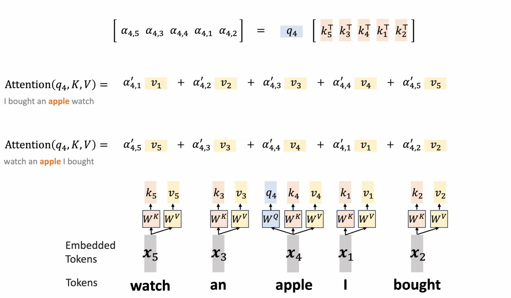
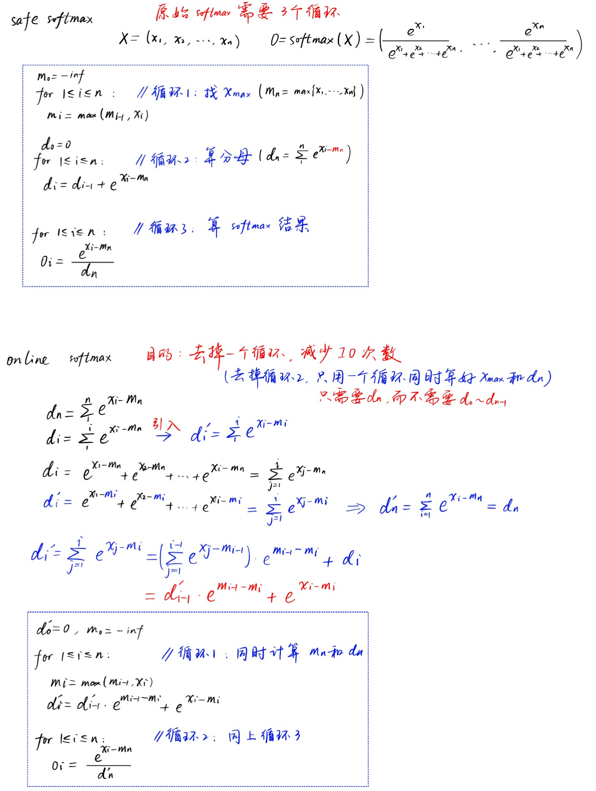

## Architecture

### GPT 术语

1. lm_head:
   softmax前的最后一个线性层, 调整输出大小为token种类数，经过softmax后每个节点就是所代表token的概率
2. logits:
   即经过lm_head得到的输出（softmax前），传递到softmax函数后，得到的输出就是每个类别的概率分布。
   logits这个词来源于“log-odds”，在统计学中，它表示事件发生的对数几率。虽然这个词不一定直接与logits的计算相关，但在机器学习中，logits通常用于表示分类任务的输出。

### MOE(Mixture of Experts)

 

+ 将整个Feed-forward Network分为多个小FFN, 每个小FFN称为一个expert。根据不同的输入选择不同的小FFN激活。
+ 如何决定该激活哪个FFN？
  添加一个Router层（其实就是一个linear）, 经过softmax后得到不同experts的概率，最后**将不同experts的输出乘概率**，累加得到整个FFN的结果
+ 注意激活某个expert并不意味着其他expert都被关闭，而是每个experts都有各自的输出，只不过会成乘上概率，决定哪个expert的输出作用更大（当然概率有可能为0，即相当于这个expert被关闭）


### LayerNorm

#### 1. LN和BN区别

`Batch Norm` 和 `Layer Norm` 的区别一句话总结就是 `bn` 是切特征，`ln` 是切样本。

+ `BN`: 对于每个特征维度，计算它在**整个批次中**的均值和标准差，然后对该特征进行归一化。
+ `LN`: **对每个样本**单独计算其所有特征的均值和标准差，然后在该样本内进行归一化。


#### 2. LN公式

`Layer Norm` 操作具体来说，它接受一个**向量** $\boldsymbol{x}$ 作为输入，输出一个与之形状相同的向量 $\boldsymbol{y}$。归一化通过对 $\boldsymbol{x}$ 减去均值并除以标准差来实现。完成归一化后，再应用具有可学习参数 $\boldsymbol{\gamma}$（权重）和 $\boldsymbol{\beta}$（偏置）的线性变换。前向传播过程可以表示如下：
$$
y = \frac{x - E[x]}{\sqrt{(Var(x) + \varepsilon)}} * \gamma + \beta
$$
其中 $$\varepsilon$$ 是一个很小的常数添加到分母以实现数值稳定性。


#### 3. 其他Norm

**3.1 种类介绍**

针对视觉领域的 4D 张量 (**B**atch_size, **C**hannel, **H**eight, **W**idth),按照对哪个维度归一化进行分类：
**结果的shape都和原来一样**

- `BatchNorm`：batch方向做归一化，计算每个channel所有数的均值和方差（跨BHW)。对小 batch size 效果不好；BN 主要缺点是对 batch size 的大小比较敏感，由于每次计算均值和方差是在一个 batch 上，所以如果 batchsize 太小，则计算的均值、方差不足以代表整个数据分布。
- `LayerNorm`：`channel` 方向做归一化，算 CHW 的均值，主要对 RNN 作用明显；
- `InstanceNorm`：一个 channel 内做归一化，算H*W的均值，用在风格化迁移；因为在图像风格化中，生成结果主要依赖于某个图像实例，所以对整个batch归一化不适合图像风格化中，因而对HW做归一化。可以加速模型收敛，并且保持每个图像实例之间的独立。
- `GroupNorm`：将 channel 方向分 group，然后每个 group 内做归一化，算(C//G)HW的均值；这样与 batch size 无关，不受其约束。

SwitchableNorm是将 BN、LN、IN结合，赋予权重，让网络自己去学习归一化层应该使用什么方法。


### Optimizer

#### SGD

SGD（随机梯度下降）和原始的梯度下降的主要区别是：**每次更新参数时用的数据量不同**。

+ SGD每次用一个batch的梯度更新网络
+ 而原始GD必须把整个数据集梯度全部算好后再更新网络


#### momentum

普通梯度下降：

```
参数 = 参数 - 学习率 × 当前梯度
```

加了动量的梯度下降

```
速度 = 衰减率 × 之前的速度 - 学习率 × 当前梯度
参数 = 参数 + 速度
```


### HuggingFace模型权重文件解析

 

+ `config.json`模型配置文件：
  	存储模型结构（transformer具体结构）、超参数（网络层数、隐藏层维度，attention head数）、vocab_size、激活函数类型、weight初始化逻辑等等，用于加载和构建模型架构。

+ `generation_config.json`:与文本生成相关的配置文件，通常包含生成任务的超参数和策略。

  常见字段：

  - **`max_length`**：生成的最大文本长度。
  - **`min_length`**：生成的最小文本长度。
  - **`temperature`**：控制生成文本的随机性（较高值增加随机性）。
  - **`top_k`**：Top-K 采样中保留的最高概率的词汇数量。
  - **`top_p`**：Top-P（核采样）中保留的累积概率阈值。
  - **`repetition_penalty`**：惩罚重复生成的概率。
  - **`num_beams`**：生成时的 beam search 数量。

+ **模型权重文件**：torch和hf两种格式

  1. Pytorch格式——`pytorch_model.pth`: 二进制文件，以字典形式(key, value)保存模型权重
     key为网络层名称，value为对应tensor
  2. SafeTensor格式——`model.safetensors`: 和pth文件功能相同，优点是更安全更高效且体积小

+ model.safetensors.index.json: 用于描述模型权重文件的索引信息

  常见字段：

  - **`metadata`**：元信息，包含权重文件的版本、模型类型等信息。
  - **`weight_map`**：权重文件的映射关系，指明每个权重张量存储在具体的哪个文件中。
  - **`tensors`**：列出模型中所有张量的名称、形状和数据类型。

+ `tokenizer.json`: 存储tokenizer的完整信息，包括词汇表和分词规则。

  常见字段：

  - **`model`**：分词器的模型信息（如 BPE、WordPiece、SentencePiece）。
  - **`vocab`**：词汇表，包含 token 和其对应的 ID。
  - **`merges`**：如果是 BPE 分词器，包含合并规则。
  - **`added_tokens`**：用户自定义的额外 token（如特殊 token `[CLS]`、`[SEP]`）。
  - **`normalizer`**：文本规范化规则（如小写转换、Unicode 规范化）。
  - **`pre_tokenizer`**：分词前的文本预处理规则。
  - **`post_processor`**：分词后的后处理规则。

+ `tokenizer_config.json`: 存储分词器的配置信息，通常是 `tokenizer.json` 的简化版本。

  常见字段：

  **`model_type`**：分词器所属的模型类型（如 `bert`、`gpt2`、`t5`）。

  **`vocab_size`**：词汇表大小。

  **`max_len`**：分词器支持的最大序列长度。

  **`do_lower_case`**：是否将文本转换为小写（主要用于 `BERT`）。

  **`special_tokens`**：特殊 token（如 `[PAD]`、`[CLS]`）。

## Positional Encoding

### 问答

##### 1. 推理时，任何输入的pos都是一样的，那还怎么区分不同输入的区别？

> 在推理时，虽然所有输入的 `pos`（位置编码）序列是一样的（即从 `[0, T)` 的整数序列），但输入序列的**token嵌入**（`token embeddings`）是不同的。这就是区分不同输入的关键所在。
>
> 1. **位置编码的作用**
>
> 位置编码 (`pos_emb`) 的作用是为每个位置提供唯一的位置信息。这是因为 Transformer 模型本身是**无序的**，无法自然区分序列中的位置信息（不像 RNN 这样的模型有序处理数据）。因此，必须通过显式的位置编码来给出序列中的位置信息。
>
> 在推理时，每个位置的 `pos_emb` 确实是相同的，但这是为了告诉模型：**这是序列中的第几个位置**。换句话说，位置编码仅仅起到了让模型知道第 `i` 个位置的作用。
>
> 2. **token嵌入的作用**
>
> 不同输入的 `token embeddings` 是不同的，即 `tok_emb` 由输入的具体 tokens 决定：
>
> ```python
> tok_emb = self.transformer.wte(idx) # token embeddings of shape (B, T, n_embd)
> ```
>
> - `tok_emb` 是由输入的 token 序列 `idx` 通过词嵌入（`wte`）得到的。
> - 每个输入序列的 tokens 是不同的，因此其对应的 token embeddings 也不同。
> - 这些 token embeddings 代表了每个 token 的语义信息，和位置编码无关。
>
> 3. **结合位置和 token 嵌入**
>
> 最终，模型将 token 嵌入和位置嵌入相加：
>
> ```python
> x = tok_emb + pos_emb
> ```
>
> 这个加法操作的结果是，**模型既能识别 token 的内容（通过 `tok_emb`），又能知道该 token 在序列中的位置（通过 `pos_emb`）**。即使每个输入的 `pos` 是一样的，不同的 token 嵌入会让模型区别开不同的输入序列。
>
> 总结
>
> - **`token embeddings`** 提供了每个输入序列中 token 的语义信息，不同的输入有不同的 token 嵌入。
> - **`position embeddings`** 提供了 token 在序列中的位置信息，帮助模型在无序的情况下理解序列的顺序。
> - 在推理时，不同输入的区别主要通过 `token embeddings` 来表示，而 `position embeddings` 则帮助模型理解 token 的相对位置。


##### 2. 既然pos_emb只负责让模型知道每个token在模型中是第几个位置，那直接用整数序列作为pos_emb不就好了吗？为什么要用embedding？甚至还要把embedding table作为可训练的参数？

> 使用位置嵌入（`position embeddings`）而非直接使用整数序列的原因在于，**位置嵌入可以捕捉到更复杂的位置相关性，而不仅仅是单一的线性顺序**。具体来说，有以下几个原因：
>
> 1. **线性整数序列无法表达复杂的位置信息**
>
> 如果直接使用整数序列作为位置编码（例如位置0对应0，位置1对应1），模型只会简单地知道每个 token 的顺序位置，但无法学到更多复杂的模式或关系。
>
> 例如，模型可能需要知道：
> - 两个 token 的相对位置是否有规律性（如间隔一定距离的词）。
> - 远距离 token 之间的依赖关系。
>   
>
> 使用整数序列可能过于简单，难以有效捕捉这种复杂的模式，而嵌入的方式可以为模型提供更丰富的表达能力。
>
> 2. **嵌入提供了更灵活的表示**
>
> 嵌入将位置编码映射到高维空间，使得每个位置不仅仅是一个整数，而是一个**高维向量**。这个向量可以通过训练学习到更多关于每个位置与序列中的其他位置的复杂关系。这种灵活性帮助模型从数据中自动学到：
> - 不同位置的 token 如何相互作用。
> - 某些固定位置对上下文理解的重要性（例如句首或句尾可能有特定意义）。
>   
>
> 通过可训练的嵌入，模型可以自行调整每个位置的表示，而不是受限于固定的整数序列。
>
> 3. **嵌入的可训练性提升模型性能**
>
> 将位置嵌入设为可训练参数意味着模型可以在训练过程中自适应地优化这些位置嵌入。这使得模型可以：
> - 自动找到适合当前任务的位置信息表示。
> - 学习不同位置对任务的不同重要性。
>
> 通过训练，模型能够学会最适合特定任务的位置信息表示，提升性能。这比直接使用固定的整数序列要灵活得多。
>
> 4. **高维空间中的位置关系更加复杂**
>
> 高维空间中的位置编码提供了更复杂的关系表示。在 1D 空间中，整数序列仅代表简单的线性关系，而高维嵌入可以捕捉到：
> - 非线性的相对位置信息（例如，位置2和位置10的关系可能比位置2和位置3更重要）。
> - 通过多维度编码，表示不同位置的多个方面的关系。
>
> 这种复杂的位置信息有助于模型理解长距离依赖和复杂上下文关系。
>
> 5. **经验效果**
>
> 实践中，已经有许多实验表明，使用可训练的位置嵌入比使用简单的整数序列或静态编码（如正弦/余弦位置编码）能够更好地提升模型性能。因此，主流模型（如 GPT、BERT）都选择了使用可训练的嵌入表来表示位置。
>
> 总结
>
> 虽然直接用整数序列作为位置编码是可行的，但这种方法过于简单，限制了模型学习复杂位置关系的能力。使用可训练的嵌入表作为位置编码能够让模型学习更丰富的位置信息，并且在实践中被证明能够提升模型的性能和泛化能力。


##### 3. 不同的输入，其中蕴含的复杂位置信息不应该都是不同的吗，那为什么pos_emb和输入的内容无关呢？

> 这是一个非常好的问题。确实，**不同的输入之间蕴含的位置信息可能是不同的**，但位置编码（`pos_emb`）和输入内容无关的设计有其合理性，主要原因在于：
>
> 1. **位置编码只提供序列中的相对位置信息**
>
> 位置嵌入的作用是**让模型知道每个 token 处在序列中的哪个位置**，但并不需要直接考虑 token 的具体内容。**位置本身是序列的固有属性**，与内容无关。换句话说，位置编码的目的是帮助模型理解序列中的**结构信息**，比如句子中的第一个词和第二个词之间的相对顺序，而不需要知道这些词具体是什么。
>
> 在自注意力机制中，模型通过结合位置编码和 token 编码来学习输入之间的关系。通过使用相同的位置信息，模型可以在相同位置上学习不同输入的不同模式，而不需要每次根据输入内容动态生成位置编码。
>
> 2. **分离 token 和位置信息使模型更具通用性**
>
> 通过将位置信息和内容信息分离，模型可以更灵活地处理不同的输入。这种设计的好处在于，**无论输入的具体 token 是什么，位置信息是相同的**。这种分离有以下优势：
> - **减少复杂性**：模型不需要同时考虑每个 token 的内容和它在序列中的位置，简化了模型的学习过程。
> - **泛化性强**：模型可以将同样的位置嵌入应用于不同的输入，这有助于模型在处理不同输入时，仍然能够识别和利用位置信息来捕捉序列结构。
>   
>
> 例如，两个不同的句子 `"The cat sat on the mat"` 和 `"The dog lay on the bed"` 的 token 编码会不同，但它们的位置信息是一样的。这样，模型可以通过位置编码了解它们的结构，而 token 编码提供了具体的词语信息。
>
> 3. **自注意力机制能学习内容和位置的交互**
>
> 虽然位置编码和输入内容是独立的，但在**自注意力机制**中，它们的交互通过模型的层次处理逐渐被捕捉。具体来说，**自注意力机制通过加权输入序列中的每个位置**，使模型能够根据上下文调整对不同位置的关注程度。位置编码与内容无关，但通过与 token 编码的结合，自注意力机制可以捕捉到不同 token 在不同位置上对最终结果的贡献。
>
> 因此，虽然位置编码本身与输入内容无关，**模型可以通过自注意力机制动态调整不同位置的权重**，从而间接捕捉位置信息和内容之间的复杂交互。
>
> 4. **位置信息是相对固定的，内容信息是动态的**
>
> 在自然语言处理中，序列的位置信息通常是相对固定的，**相同长度的序列在同一个位置上总是对应相似的相对位置**。例如，句子的开头、中间、结尾通常有不同的重要性。
>
> 而**内容信息是动态的**，即不同的输入有不同的 token 表示。通过将位置信息编码为可训练的嵌入向量，模型可以自动学习在特定任务中哪些位置更加重要，并根据不同内容灵活处理序列中的位置信息。位置信息不变使模型更容易泛化到不同的输入内容，而无需为每个输入重新生成位置信息。
>
> 5. **简化计算复杂度**
>
> 如果位置编码依赖于每个输入内容，那么生成每个 token 的位置信息将更加复杂，导致训练和推理的计算复杂度增加。**将位置编码设为与内容无关的固定嵌入，不仅计算简单，还保持了足够的灵活性**，可以让模型处理各种复杂任务。
>
> 总结
>
> 位置编码和输入内容的独立性是有意的设计。位置嵌入的目标是捕捉**序列中的相对位置信息**，而模型通过自注意力机制和 token 编码来学习**内容和位置信息的交互**。这种设计既简化了计算复杂度，又增强了模型的灵活性和泛化能力。


##### 4. "The cat sat on the mat"和"I don't know what you mean"位置信息也是一样的，难道他们的结构相似吗？

> 虽然 `"The cat sat on the mat"` 和 `"I don't know what you mean"` 这两个句子的位置信息是一样的（即它们的 token 位于序列中的相对位置相同），但它们的结构并不相似。从位置编码的角度来看，**位置编码只是提供了序列中每个 token 的位置**，而模型并没有直接依靠位置信息来理解句子的语法结构或语义关系。
>
> 1. **位置信息是相对的，而不是句法结构的反映**
>
> 位置编码仅表示每个 token 在句子中的序列位置，它不会告诉模型词汇之间的语法关系或句子的语义结构。因此，虽然两个句子的位置编码相同，但这只是因为它们的 token 处在相同的相对位置上。**位置编码本身并不反映句子的语法或语义结构**，这些信息是通过内容（token 编码）和模型中的自注意力机制学习到的。
>
> 比如在 `"The cat sat on the mat"` 里，`"The"` 作为第一个 token，它在句子中充当定语；而在 `"I don't know what you mean"` 中，`"I"` 作为第一个 token 是主语。虽然它们在序列中的位置是相同的，但它们的语法角色和意义完全不同。这部分差异是通过 token 编码和模型内部的学习机制捕捉到的。
>
> 2. **自注意力机制捕捉到复杂的内容-位置交互**
>
> 虽然位置编码本身并不区分句子结构，但模型的自注意力机制可以通过结合 token 编码和位置信息，学习到输入内容的句法和语义结构。模型会根据每个 token 在不同位置的含义、上下文中的作用等，调整对不同位置的注意力权重。这就是为什么即使不同句子使用相同的位置信息，模型仍然能够识别出它们的不同结构和语义。
>
> 例如，模型可以学习到在 `"The cat sat on the mat"` 中，`"cat"` 和 `"`sat`" 之间有谓语关系，而在 `"I don't know what you mean"` 中，`"I"` 和 `"`don't"` 之间有否定关系。这些信息并不是由位置信息直接提供的，而是通过自注意力机制从 token 之间的交互中学习的。
>
> 3. **位置编码并不描述句子的复杂语法结构**
>
> 位置编码的设计目标是帮助模型**理解 token 在序列中的相对位置**，而不是提供句法或语义结构信息。这意味着它只用于确保模型可以区分输入序列中的不同位置，比如区分第一个词和第二个词的位置。至于句子的复杂结构，是模型通过大量数据训练后自动学习的。
>
> 因此，尽管这两个句子的位置信息相同，**模型通过 token 编码和自注意力机制能够学习到它们完全不同的句法和语义结构**。
>
> **总结**
>
> 位置编码仅仅告诉模型每个 token 在序列中的位置，而不提供语法或语义结构信息。模型通过自注意力机制结合 token 的编码，逐步捕捉句子的结构和语义。因此，即使两个句子的位置信息相同，模型也能够区分它们的不同结构和含义。


### RoPE（Rotary Positional Embedding）

> #### 为什么要有Positional Encoding
>
> 如果没有positional encoding:
> 
>
> + "apple"在句子中的位置变化不影响Attention计算结果
> + 从而无法区分token在句子中不同位置带来的差异，即学习不到多义词
>
> #### Positional Encoding分类
>
> ##### Absolute positional encoding
>
> + 每个token得到的位置信息只取决于在句子中的绝对位置，类似1, 2, 3, ...顺序编号
> + 缺点：倒装句不改变句子含义，但模型会认为是完全不同的句子。
>   例如：I walk my dog every day
>       every day I walk my dog
> + 《Attention is all you need》中的sinusoidal函数
>
> ##### Relative positional encoding
>
> + 只关心token之间的相对位置，不考虑绝对位置信息
> + RoPE

#### 位置信息作用方式：旋转矩阵

> #### 旋转矩阵乘法与转置特性
>
> 二维旋转矩阵：
> $$
> R(\theta) = \begin{pmatrix}
> \cos\theta & -\sin\theta \\
> \sin\theta & \cos\theta
> \end{pmatrix}
> $$
>
> + $R(\theta)$左乘一个矩阵，相当于把这个矩阵逆时针旋转$\theta$。
>
> $$
> R(\theta_1) R(\theta_2) = \begin{pmatrix}
> \cos\theta_1 & -\sin\theta_1 \\
> \sin\theta_1 & \cos\theta_1
> \end{pmatrix}
> \begin{pmatrix}
> \cos\theta_2 & -\sin\theta_2 \\
> \sin\theta_2 & \cos\theta_2
> \end{pmatrix}
> = \begin{pmatrix}
> \cos(\theta_1 + \theta_2) & -\sin(\theta_1 + \theta_2) \\
> \sin(\theta_1 + \theta_2) & \cos(\theta_1 + \theta_2)
> \end{pmatrix} = R(\theta_1 + \theta_2)
> $$
>
> + 两个旋转矩阵相乘，相当于旋转角度相加
> + 可交换：$R(\theta_1) R(\theta_2) = R(\theta_2) R(\theta_1)$
>
> 三维旋转矩阵：
>
> 1. 绕z轴：$R_z(\theta) = \begin{pmatrix} \cos\theta & -\sin\theta & 0 \\ \sin\theta & \cos\theta & 0 \\ 0 & 0 & 1 \end{pmatrix}$
> 2. 绕x轴：$R_x(\phi) = \begin{pmatrix} 1 & 0 & 0 \\ 0 & \cos\phi & -\sin\phi \\ 0 & \sin\phi & \cos\phi \end{pmatrix}$
> 3. 绕y轴：$R_y(\psi) = \begin{pmatrix} \cos\psi & 0 & \sin\psi \\ 0 & 1 & 0 \\ -\sin\psi & 0 & \cos\psi \end{pmatrix}$
>
> + 三维旋转矩阵不可交换
>
> 
>
> **旋转矩阵的转置**
>
> + 旋转矩阵是正交矩阵，满足$R^TR=E,即R^T=R^{-1}$
> + 而$R^{-1}(\theta)=R(-\theta)$即旋转矩阵的逆矩阵相当于反转（顺时针）
> + 因此**$R^T(\theta)=R(-\theta)$**

 

+ "dog"在句子中第几个位置就旋转几个$\theta$,乘上对应的旋转矩阵

+ 计算两个token的attention score时，==模型可以学习到两个token的相对位置，和绝对位置无关==

例如，计算位置m的token的Q与位置n的token的K乘积：
$$
\alpha_{m, n} = K^T_nQ_m = [R(n\theta)W_kx_n]^T R(m\theta)W_qx_m\\=x_n^TW_k^TR(n\theta)^TR(m\theta)W_qx_m\\=x_n^TW_k^TR((m-n)\theta)W_qx_m
$$

#### 拓展到n维


+ embedding维度分组，每组2维
+ 每组分配的$\theta$不同, 从而旋转速度也不同
  

#### RoPE乘法优化

上述R矩阵非常稀疏，直接做乘法非常耗时，因此有如下优化：


#### RoPE计算流程


1. 计算$Q=W_qX, K=W_kX$
2. 将Q和K中的元素两两一组应用旋转变换
3. 计算$A=QK^T$


## Attention

### KV cache

KV Cache 的核心是缓存之前计算的键（keys）和值（values），避免在生成新 token 时重新计算它们。对于位置 s ≤ t 的 token，其键值对 k(s), v(s) 由其嵌入计算得出，一旦嵌入固定，键值对也固定。当生成第 t+1 个 token 时：

+ 新 token 的嵌入是新计算的，产生新的 k(t+1), v(t+1)。
+ 之前 token 的 k(s) ≤ t, v(s) ≤ t 保持不变，因为它们的嵌入未变。

> 你的疑问在于：从数值上看，在生成过程中，$k_1, v_1, k_2, v_2$ 的值与之前基于序列 `[token1, token2]` 计算的结果相同，但你认为每次调用 `model(x)` 时，`c_attn` 的权重（即用于生成 $q, k, v$ 的矩阵）应该会变化，导致每次计算的 $q, k, v$ 都不一样。我将通过详细的解释和具体例子，结合代码，说明为什么你的理解有误，以及为什么 $k_1, v_1, k_2, v_2$ 的值在生成过程中保持不变。
>
> ---
>
> ### 1. 模型的参数是固定的
>
> 在训练好的模型中，所有的权重参数，包括 `c_attn` 的权重，在推理（生成）阶段是固定的，不会随着输入序列的变化而改变。换句话说，`c_attn` 的权重矩阵 $W_q, W_k, W_v$ 在整个生成过程中保持不变。
>
> - **代码中的体现**：
>  - 在 `CausalSelfAttention` 类中，`self.c_attn = nn.Linear(config.n_embd, 3 * config.n_embd)` 定义了一个固定的线性层，其权重在模型加载或训练完成后就固定了。
>   - 在生成过程中，每次调用 `model(x)` 时，`self.c_attn` 的权重保持不变，仅根据当前的输入 $x$ 进行前向计算。
>
> 因此，你的理解中“每次调用 `model(x)` 时，`c_attn` 的权重应该不一样”是错误的。在推理阶段，权重是固定的，不会发生变化。
> 
> ---
>
> ### 2. 计算 $q, k, v$ 的过程
>
> 每次调用 `model(x)` 时，`self.c_attn(x)` 会对当前的输入 $x$ 进行线性变换，生成 $qkv$。具体来说：
>- 对于输入 $x = [x_1, x_2, \dots, x_T]$（形状为 $(B, T, C)$），`self.c_attn(x)` 生成 $qkv = [qkv_1, qkv_2, \dots, qkv_T]$，形状为 $(B, T, 3 \cdot C)$。
> - 然后拆分为：
>  - $q = [q_1, q_2, \dots, q_T]$，
>   - $k = [k_1, k_2, \dots, k_T]$，
>   - $v = [v_1, v_2, \dots, v_T]$。
> 
> **关键点**：
> - $k_1$ 只依赖于 $x_1$ 和 $W_k$，
> - $v_1$ 只依赖于 $x_1$ 和 $W_v$，
>- 同理，$k_2$ 只依赖于 $x_2$ 和 $W_k$，$v_2$ 只依赖于 $x_2$ 和 $W_v$。
> 
> 数学上：
> $$
> k_i = W_k \cdot x_i
>$$
> $$
> v_i = W_v \cdot x_i
> $$
> 其中，$W_k$ 和 $W_v$ 是 `self.c_attn` 线性层中用于生成键和值的权重矩阵，且这些权重在生成过程中是固定的。
> 
> ---
> 
> ### 3. 具体例子
>
> 让我们通过一个简化的例子来演示这个过程。假设：
>- 嵌入维度 $C = 2$，
> - 批次大小 $B = 1$（为了简化），
>- 序列长度 $T$ 随生成过程变化。
> 
> #### **初始序列**：`[token1, token2]`，即 $T=2$
> - 假设 token1 的嵌入 $x_1 = [1.0, 0.0]$，
> - token2 的嵌入 $x_2 = [0.0, 1.0]$。
>- 输入 $x = [[1.0, 0.0], [0.0, 1.0]]$（形状为 $(1, 2, 2)$）。
> 
> #### **线性层权重**（假设）
> 为了简化，假设 `self.c_attn` 的权重矩阵为：
> $$
>W = \begin{bmatrix}
> 1 & 0 & | & 2 & 0 & | & 3 & 0 \\
> 0 & 1 & | & 0 & 2 & | & 0 & 3 \\
> \end{bmatrix}
> $$
> 这里，`|` 分隔了 $W_q, W_k, W_v$ 的部分：
> - $W_q = \begin{bmatrix} 1 & 0 \\ 0 & 1 \end{bmatrix}$（单位矩阵），
> - $W_k = \begin{bmatrix} 2 & 0 \\ 0 & 2 \end{bmatrix}$（2 倍单位矩阵），
> - $W_v = \begin{bmatrix} 3 & 0 \\ 0 & 3 \end{bmatrix}$（3 倍单位矩阵）。
> 
> #### **计算 $q, k, v$**
> - `qkv = self.c_attn(x)`：
>   - 对于 $x_1 = [1.0, 0.0]$：
>    - $q_1 = W_q \cdot x_1 = \begin{bmatrix} 1 & 0 \\ 0 & 1 \end{bmatrix} \cdot \begin{bmatrix} 1.0 \\ 0.0 \end{bmatrix} = \begin{bmatrix} 1.0 \\ 0.0 \end{bmatrix}$，
>     - $k_1 = W_k \cdot x_1 = \begin{bmatrix} 2 & 0 \\ 0 & 2 \end{bmatrix} \cdot \begin{bmatrix} 1.0 \\ 0.0 \end{bmatrix} = \begin{bmatrix} 2.0 \\ 0.0 \end{bmatrix}$，
>     - $v_1 = W_v \cdot x_1 = \begin{bmatrix} 3 & 0 \\ 0 & 3 \end{bmatrix} \cdot \begin{bmatrix} 1.0 \\ 0.0 \end{bmatrix} = \begin{bmatrix} 3.0 \\ 0.0 \end{bmatrix}$。
>   - 对于 $x_2 = [0.0, 1.0]$：
>     - $q_2 = W_q \cdot x_2 = \begin{bmatrix} 1 & 0 \\ 0 & 1 \end{bmatrix} \cdot \begin{bmatrix} 0.0 \\ 1.0 \end{bmatrix} = \begin{bmatrix} 0.0 \\ 1.0 \end{bmatrix}$，
>     - $k_2 = W_k \cdot x_2 = \begin{bmatrix} 2 & 0 \\ 0 & 2 \end{bmatrix} \cdot \begin{bmatrix} 0.0 \\ 1.0 \end{bmatrix} = \begin{bmatrix} 0.0 \\ 2.0 \end{bmatrix}$，
>     - $v_2 = W_v \cdot x_2 = \begin{bmatrix} 3 & 0 \\ 0 & 3 \end{bmatrix} \cdot \begin{bmatrix} 0.0 \\ 1.0 \end{bmatrix} = \begin{bmatrix} 0.0 \\ 3.0 \end{bmatrix}$。
> - 因此：
>   - $k = \begin{bmatrix} [2.0, 0.0], [0.0, 2.0] \end{bmatrix}$，
>   - $v = \begin{bmatrix} [3.0, 0.0], [0.0, 3.0] \end{bmatrix}$。
> 
> ---
> 
> #### **生成 token3**
>假设生成了 token3，其嵌入 $x_3 = [1.0, 1.0]$（实际中由模型预测，这里为了示例假设一个值）。现在序列变为 `[token1, token2, token3]`，$x = [[1.0, 0.0], [0.0, 1.0], [1.0, 1.0]]$（形状为 $(1, 3, 2)$）。
> 
>#### **重新计算 $q, k, v$**
> - 对于 $x_1 = [1.0, 0.0]$：
>   - $k_1 = W_k \cdot x_1 = \begin{bmatrix} 2 & 0 \\ 0 & 2 \end{bmatrix} \cdot \begin{bmatrix} 1.0 \\ 0.0 \end{bmatrix} = \begin{bmatrix} 2.0 \\ 0.0 \end{bmatrix}$，
>  - $v_1 = W_v \cdot x_1 = \begin{bmatrix} 3 & 0 \\ 0 & 3 \end{bmatrix} \cdot \begin{bmatrix} 1.0 \\ 0.0 \end{bmatrix} = \begin{bmatrix} 3.0 \\ 0.0 \end{bmatrix}$。
> - 对于 $x_2 = [0.0, 1.0]$：
>   - $k_2 = W_k \cdot x_2 = \begin{bmatrix} 2 & 0 \\ 0 & 2 \end{bmatrix} \cdot \begin{bmatrix} 0.0 \\ 1.0 \end{bmatrix} = \begin{bmatrix} 0.0 \\ 2.0 \end{bmatrix}$，
>   - $v_2 = W_v \cdot x_2 = \begin{bmatrix} 3 & 0 \\ 0 & 3 \end{bmatrix} \cdot \begin{bmatrix} 0.0 \\ 1.0 \end{bmatrix} = \begin{bmatrix} 0.0 \\ 3.0 \end{bmatrix}$。
> - 对于 $x_3 = [1.0, 1.0]$：
>   - $k_3 = W_k \cdot x_3 = \begin{bmatrix} 2 & 0 \\ 0 & 2 \end{bmatrix} \cdot \begin{bmatrix} 1.0 \\ 1.0 \end{bmatrix} = \begin{bmatrix} 2.0 \\ 2.0 \end{bmatrix}$，
>   - $v_3 = W_v \cdot x_3 = \begin{bmatrix} 3 & 0 \\ 0 & 3 \end{bmatrix} \cdot \begin{bmatrix} 1.0 \\ 1.0 \end{bmatrix} = \begin{bmatrix} 3.0 \\ 3.0 \end{bmatrix}$。
> 
> ---
> 
> #### **关键观察**
>- 在生成 token3 后：
>   - $k_1$ 仍然是 $[2.0, 0.0]$，$v_1$ 仍然是 $[3.0, 0.0]$，
>  - $k_2$ 仍然是 $[0.0, 2.0]$，$v_2$ 仍然是 $[0.0, 3.0]$，
>   - 只是新增了 $k_3$ 和 $v_3$。
> 
> 这表明，之前的 $k_1, v_1, k_2, v_2$ 的值没有改变，因为它们的计算只依赖于 $x_1, x_2$ 和固定的 $W_k, W_v$。
> 
> ---
>
> ### 4. 为什么代码中每次都重新计算？
>
> 在标准的 Transformer 实现中，每次生成新 token 时，确实会重新计算整个序列的 $q, k, v$。但正如例子所示，之前的 $k$ 和 $v$ 在数值上与之前相同，因此可以缓存起来，避免重复计算。这正是 KV Cache 的核心思想。
>
> - **数值不变的原因**：
>  - $k_1, v_1$ 只依赖于 $x_1$ 和 $W_k, W_v$，而 $x_1$ 和 $W_k, W_v$ 在生成过程中不变，因此 $k_1, v_1$ 不变。
>   - 同理，$k_2, v_2$ 只依赖于 $x_2$ 和 $W_k, W_v$，因此也不变。
>
> ---
> 
> ### 5. 总结
>
> - **权重是固定的**：`self.c_attn` 的权重在整个生成过程中不变，你的理解“每次调用 `model(x)` 时，`c_attn` 的权重应该不一样”是错误的。
>- **输入局部性**：每个 token 的 $k$ 和 $v$ 只依赖于该 token 的嵌入和固定的权重。
> - **数值不变**：对于之前的 token，它们的 $k$ 和 $v$ 在生成新 token 时保持不变。
>

#### 为什么不用cacheQ, 只需要cache K/V?

>  [How DeepSeek Rewrote the Transformer](https://youtu.be/0VLAoVGf_74?t=573)


如图，

+ **对于新的token，计算其attention score只需要最后一行Q**，即当前token所在的Q，之前的token完全用不到，因此没必要cache之前的Q。
  + 而对于KV，计算新token的attention score需要用到前面所有行，因此缓存KV非常有必要


------------

### MHA、MQA、GQA、MLA

> [How DeepSeek Rewrote the Transformer](https://youtu.be/0VLAoVGf_74?t=573)


#### 一、MHA(Multi-Head Attention)


伪代码：
```python
def multi_head_attention(X, W_Q, W_K, W_V, W_O, H):
Q = X @ W_Q
K = X @ W_K
V = X @ W_V
D_H = D // H
Q_heads = [Q[:, h*D_H:(h+1)*D_H] for h in range(H)]
K_heads = [K[:, h*D_H:(h+1)*D_H] for h in range(H)]
 V_heads = [V[:, h*D_H:(h+1)*D_H] for h in range(H)]
 O_heads = []
 for h in range(H):
     A_h = softmax(Q_heads[h] @ K_heads[h].T / sqrt(D_H))
     O_h = A_h @ V_heads[h]
     O_heads.append(O_h)
 O = concat(O_heads, axis=1) @ W_O
 return O
```


#### 二、MQA(Multi-Query Attention)


伪代码：

```python
def multi_query_attention(X, W_Q, W_Ks, W_Vs, W_O, H):
Q = X @ W_Q  # Shared query
D_H = D // H
K_heads = [X @ W_Ks[h] for h in range(H)]
V_heads = [X @ W_Vs[h] for h in range(H)]
O_heads = []
for h in range(H):
  A_h = softmax(Q @ K_heads[h].T / sqrt(D_H))
  O_h = A_h @ V_heads[h]
  O_heads.append(O_h)
O = concat(O_heads, axis=1) @ W_O
return O
```


#### 三、GQA(Grouped Query Attention)


伪代码：

```python
def grouped_query_attention(X, W_Qs, W_Ks, W_Vs, W_O, H, G):
D_H = D // H
O_heads = []
for g in range(G):
  Q_g = X @ W_Qs[g]
  K_g = X @ W_Ks[g]
  V_g = X @ W_Vs[g]
  for h in range(H // G):
      A_hg = softmax(Q_g @ K_g.T / sqrt(D_H))
      O_hg = A_hg @ V_g
      O_heads.append(O_hg)
O = concat(O_heads, axis=1) @ W_O
return O
```


#### 四、MLA（Multi-head Latent Attention）


---------

### Flash Attention


#### 为什么Attention很慢

——频繁的IO操作


+ Load/Write时间比matmul还长

+ attention公式：
  $$
  A=QK^T, O = softmax(A)V
  $$


#### FlashAttention核心思想

##### 一、分块（Tiling）

Matmul Tiling


Softmax Tiling


+ 把A分成两个小矩阵A1、A2，接着分别对其做softmax，乘上各自的系数最后拼接，保证结果与softmax(A)相同。
+ 乘系数是因为两个小softmax的分母和大softmax不同


##### 二、Recomputation

——即不存放中间结果，在backward时重新计算（重新计算比R/W中间结果更快）


**内存优化效果**

- **标准实现**：需要存储 $P \in \mathbb{R}^{B \times H \times N \times N}$
- **Flash Attention**：只需要存储 $L=\ln\left(\sum \exp S\right)\in \mathbb{R}^{B \times H \times N}$，在反向传播时通过L算出 $P$

**空间复杂度从 $O(N^2)$ 降低到 $O(N)$，但时间复杂度保持 $O(N^2)$**

> ### 完整反向传播流程
>
> 1. 用L算出P
>
>    + $S = QK^T$
>    + $P = \exp(S - L)$
>
> 2. 计算dV: $\frac{\partial \text{Loss}}{\partial V} = P^T \frac{\partial \text{Loss}}{\partial O}$
>
> 3. 计算dP: $\frac{\partial \text{Loss}}{\partial P} = \frac{\partial \text{Loss}}{\partial O} V^T$
>
> 4. 计算中间变量 $D = \text{rowsum}\left(\frac{\partial \text{Loss}}{\partial P} \odot P\right) \in \mathbb{R}^{B \times H \times N}$,
>
>    每一行是该行所有元素的求和：$D_i = \sum_{j=1}^{N} \frac{\partial \text{Loss}}{\partial P_{ij}} \cdot P_{ij}$
>
> 5. 计算dS: $\frac{\partial \text{Loss}}{\partial S} = P \odot \left(\frac{\partial \text{Loss}}{\partial P} - D\right)$，其中 $D$ 需要广播到每一列。
>
> 6. 计算dQ: $\frac{\partial \text{Loss}}{\partial Q} = \frac{\partial \text{Loss}}{\partial S} K$
>
> 7. 计算dK: $\frac{\partial \text{Loss}}{\partial K} = \left(\frac{\partial \text{Loss}}{\partial S}\right)^T Q$


#### 手算推导

##### 从Safe Softmax到Online Softmax




##### Flash Attention


 


#### Forward

##### FlashAttention-1


##### FlashAttention-2


> 输入:Q、K、V
>
> 计算: 
>
> + $S = QK^T$
>
> + $M = rowmax(S)$ 即S的每行最大值
>
> + $S_{\text{stable}} = S - M$
>
> + $P=softmax(S_{stable})$
>
> + $L = \ln\left(\sum \exp(S_{\text{stable}})\right) + M$ 
>
>   $(= \ln\left(\sum \exp(S-M)\right) + M=\ln\left(\sum \exp S \cdot exp(-M)\right) + M = \ln\left(\sum \exp S\right) -M + M=\ln\left(\sum \exp S\right))$
>
> + $O = PV$
>
> 输出: O

#### Backward


> 输入:$dO=\frac{\partial \text{Loss}}{\partial O}$, Q、K、V
>
> 计算：
>
> naive版:(需要$P \in \mathbb{R}^{B \times H \times N \times N}$)
>
> + $dV=\frac{\partial \text{Loss}}{\partial V} = P^T \frac{\partial \text{Loss}}{\partial O}=P^T dO$
> + $dP=\frac{\partial \text{Loss}}{\partial P} = \frac{\partial \text{Loss}}{\partial O} V^T= dO\cdot V^T$
> + $dS = \frac{\partial \text{Loss}}{\partial S} = P \odot \left(dP - D\right)$, 其中$D = \text{rowsum}\left(dP \odot P\right) \in \mathbb{R}^{B \times H \times N}$, $\odot$ 为点乘
> + $dQ=\frac{\partial \text{Loss}}{\partial Q} = \frac{\partial \text{Loss}}{\partial S} K= dS\cdot K$
> + $dK=\frac{\partial \text{Loss}}{\partial K} = \left(\frac{\partial \text{Loss}}{\partial S}\right)^T Q= (dS)^T Q$
>
> flash attention版: (只需要forward中算出的$L =\ln\left(\sum \exp S\right)\in \mathbb{R}^{B \times H \times N}$ (log-sum-exp) )
>
> **D优化：$D = \text{rowsum}\left(dP \odot P\right) = \text{rowsum}\left(dO \odot O\right)$**
>
> 1. 并行计算$D=\text{rowsum}\left(dO \odot O\right)$
> 2. 并行计算dK和dV（固定KV块，遍历所有Q块）
>    + $S=QK^T$
>    + $P=exp(S-L)$
>    + $dS = \frac{\partial \text{Loss}}{\partial S} = P \odot \left(dO·V^T - D\right)$
>    + $dK = (dS)^T·Q$
>    + $dV = P^T·dO$
> 3. 并行计算dQ（固定Q块，遍历所有KV块）
>    + $S=QK^T$
>    + $P=exp(S-L)$
>    + $dS = \frac{\partial \text{Loss}}{\partial S} = P \odot \left(dO·V^T - D\right)$
>    + $dQ = dS·K$

#### 伪代码


## Python & PyTorch

### static method是什么

> *Thinking...*
>
> > 用户问的是 Python 中的 @staticmethod 装饰器，虽然他们在 PyTorch 的 autograd.Function 中看到了它，但这其实是 Python 语言的特性，不是 PyTorch 特有的。我需要解释清楚：
> >
> > 1. @staticmethod 是 Python 的装饰器，不是注释
> > 2. 它的作用和用法
> > 3. 与普通方法、类方法的区别
> > 4. 为什么在 torch.autograd.Function 中需要使用它
> > 5. 给出具体的例子来说明
> >
> > 需要纠正用户的说法：这不是"注释"，而是"装饰器"。
>
> `@staticmethod` 不是注释，而是 Python 的**装饰器（decorator）**，它有特定的功能和用途。
>
> ## 1. **@staticmethod 的作用**
>
> 将方法定义为**静态方法**，这意味着：
>
> - **不需要实例化类就能调用**
> - **不会自动传递 `self` 或 `cls` 参数**
> - **方法内部无法访问实例属性或类属性**
>
> ## 2. **三种方法类型的对比**
>
> ```python
> class MyClass:
>     class_var = "I'm a class variable"
>     
>     def __init__(self):
>         self.instance_var = "I'm an instance variable"
>     
>     # 普通实例方法
>     def instance_method(self):
>         return f"Instance method: {self.instance_var}"
>     
>     # 类方法
>     @classmethod
>     def class_method(cls):
>         return f"Class method: {cls.class_var}"
>     
>     # 静态方法
>     @staticmethod
>     def static_method(x, y):
>         return f"Static method: {x + y}"
> 
> # 使用方式：
> obj = MyClass()
> 
> # 实例方法：需要实例
> print(obj.instance_method())  # ✅ 正常
> # MyClass.instance_method()   # ❌ 错误，缺少 self
> 
> # 类方法：可以通过类或实例调用
> print(MyClass.class_method())  # ✅ 正常
> print(obj.class_method())      # ✅ 也正常
> 
> # 静态方法：可以通过类或实例调用，也可以直接调用
> print(MyClass.static_method(1, 2))  # ✅ 正常
> print(obj.static_method(1, 2))      # ✅ 也正常
> ```
>
> ## 3. **在 torch.autograd.Function 中为什么用 @staticmethod**
>
> ```python
> class MyFunction(torch.autograd.Function):
>     @staticmethod
>     def forward(ctx, x):  # 静态方法
>         return x * 2
>     
>     @staticmethod
>     def backward(ctx, grad_output):  # 静态方法
>         return grad_output * 2
> 
> # PyTorch 内部调用方式：
> # MyFunction.forward(ctx_object, tensor)  # 直接通过类调用
> # MyFunction.backward(ctx_object, grad)   # 不需要实例
> ```
>
> **为什么必须是静态方法？**
>
> - PyTorch 需要**直接通过类调用**这些方法，而不是通过实例
> - 这些方法不需要访问实例状态，所有必要信息都通过参数传递
> - 保持接口简洁，避免不必要的实例化开销
>
> ## 4. **如果不使用 @staticmethod 会怎样？**
>
> ```python
> class BadFunction(torch.autograd.Function):
>     # 没有 @staticmethod
>     def forward(self, ctx, x):  # 第一个参数是 self
>         return x * 2
> 
> # PyTorch 调用时会出错：
> # BadFunction.forward(ctx, x)  # 缺少 self 参数
> # TypeError: forward() missing 1 required positional argument: 'ctx'
> ```
>
> ## 5. **静态方法的其他使用场景**
>
> ```python
> class MathUtils:
>     @staticmethod
>     def add(a, b):
>         return a + b
>     
>     @staticmethod
>     def multiply(a, b):
>         return a * b
> 
> # 可以直接使用，像普通函数一样
> result1 = MathUtils.add(3, 4)      # 7
> result2 = MathUtils.multiply(3, 4)  # 12
> 
> # 也可以通过实例调用（但没必要）
> utils = MathUtils()
> result3 = utils.add(3, 4)  # 7，但这样做没有意义
> ```
>
> ## 6. **什么时候使用 @staticmethod**
>
> **适合使用的情况：**
>
> - 方法在逻辑上属于这个类，但不需要访问类或实例的状态
> - 可以作为独立函数，但为了代码组织放在类中
> - 工具方法、辅助函数
>
> **不适合使用的情况：**
>
> - 需要访问实例属性 → 用普通方法
> - 需要访问类属性 → 用 `@classmethod`
> - 与类没有逻辑关系 → 定义为普通函数
>
> ## 总结
>
> `@staticmethod` 是 Python 装饰器，用于创建静态方法。在 `torch.autograd.Function` 中使用它是因为 PyTorch 需要直接通过类调用 `forward` 和 `backward` 方法，而不需要实例化。这种设计让自定义梯度函数更加高效和简洁。