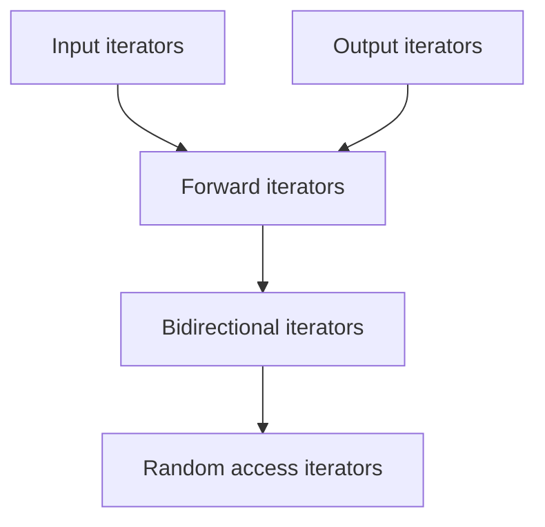

崔毅东C++Mooc学习笔记by以禾

****

# C++11新特性

### 一、空指针与动态内存分配

#### nullptr

​	**空指针：0带来的二义性问题**

+ C++03中，空指针使用 “0” 来表示。0既是一个常量整数，也是一个常量空指针。
+ C语言中，空指针使用`(void*)0`来表示
+ 有时候，用“NULL"来表示空指针（一种可能的实现方式是`#define NULL 0`）

​	**C++标准委员会希望“空指针”是个确定的东西。**

+ C++11 中引入保留字“nullptr”作为空指针

  ```C++
  void codeExample {
      auto x{10};	// 等价于int x = 10;
      int* p = nullptr;
      int* q{ nullptr };
      q = &x;
  }
  ```

  

#### Dynamic memory management: Allocate/Release(动态内存管理：分配/释放)

​	**C++中通过运算符new申请动态内存**

​		`new<类型名>(初值);	// 申请一个变量的空间`

​		`new<类型名>[常量表达式];     // 申请数组`

+ 如果申请成功，返回指定类型内存的地址
+ 如果申请失败，抛出异常，或者返回空指针nullptr。（C++11)

​	**动态内存使用完毕后，要用delete运算符来释放**

​		`delete <指针名>;		// 删除一个变量/对象`

​		`delete []<指针名>;	// 删除数组空间`

### 二、List Initialization 列表初始化

#### 变量初始化

​	**Before C++11(C++11 标准之前的初始化方法)**

```C++
int x = 0;
int y(2);
char c('a');
int arr[] = { 1, 2, 3 };
char s[] = "Hello";
```

+ C++11仍然支持旧方法

#### List Initialization

​	**List initialization is a new feature for C++11(列表初始化是C++11的一个新特性)**

​	**List：braced-init-list(“列表”是用花括号括起来的(一些)值)**

+ Direct list initialization(直接列表初始化)
+ Copy list initialization (拷贝列表初始化)

#### When do we use list initialization (何时使用列表初始化)

​	**LIst Initialization is also called "unified initialization" (列表初始化也被称为“统一初始化方法”)**

+ Variables and arrays are initialized in the same form (变量和数组用同样的形式初始化)

​	**There are still some argues about when to use list-init(目前对于何时使用列表初始化仍然有一些争论)**

​	**==Prefer {} initialization over alternatives unless you have a strong reason not to==尽量使用列表初始化，除非有很好的理由不用**

+ Why: List initialization does not allow narrowing(==列表初始化不允许”窄化“==，即不允许丢失数据精度的隐式类型转换)


```C++
// 直接列表初始化

/* Variable initialization */
int x{};
int y{1};
/* Array initialzation */
int array1[] { 1, 2, 3 };
char s1[ 3 ] { 'o', 'k'};
char s3[] {"Hello"};
```

```C++
// 拷贝列表初始化

/* Variable initialization */
int z = { 2 };
/* Array initialization */
int array2[] = { 4, 5, 6 };
char s2[] = { 'y', 'e', 's' };
char s4[] = { "World" };
char s5[] = "Aloha";	// Omit curly braces (省略花括号)
```


### 三、C++类型转换
+ 语法：`static_cast<double>(1)/2`
+ 类型转换必须显式声明，不要依赖于隐式类型转换
+ 类型系统非常有价值

#### 代码示例：

```C++
#include <iostream>

int main() {
	//列表初始化不允许窄化
	int x{ 1 };
	std::cout << x << std::endl;

	//强制类型转换：int->double;double->int
	std::cout << 1 / 2 << std::endl;
	std::cout << static_cast<double>(1) / 2 << std::endl;
	std::cout << static_cast<double>(1 / 2) << std::endl;

	std::cout << 1.0f / 2.f << std::endl;

	return 0;
}
```


### 四、C++11 自动类型推导：类型系统、auto与decltype

#### C++11 Enhancement for Type System (C++11对类型系统的增强)

​	**类型(type)**

+ 数据类型Data type 

  > int , long int, double
  >
  > struct, chat\*, float[], int (\*f)()...

+ 类型贯穿于整个计算机程序中

+ 计算机程序构造块（Constructs of a Computer Program)

  > 不同大小粒度的计算机程序组成部分
  >
  > 包括变量、表达式、函数或者模块等

​	**类型系统(Type System)**

+ 什么是类型系统? 

  在编程语言中，“类型系统”是将“type"属性指定给不同计算机程序构造块的规则集

  > 这些类型规范并强制程序员用于数据结构和组件的其它隐式类别
  >
  > e.g. "string", "array of float", "function returning boolean"

+ 为什么使用类型系统? 

  减少程序中可能出现的bug

  > ==定义==不同程序块间的接口
  >
  > ==检查==多个块之间是否以一致的方式连接在一起

+ 静态类型 v.s. 动态类型

  > 上述检查若发生在编译期，称为静态类型 （C, C++, Java）
  >
  > 上述检查若发生在运行时，称为动态类型（python）
  >
  > 上述检查若同时存在于编译期和运行时，称为混合类型

  ```C++
  // C++11 is required 
  #include <iostream>
  #include <sstream>
  using namespace std;
  int main() {
  	string s1 = "Hello";
  	string s2 = "World";
      
      cout << s1 << endl;
      
      int count = 3;
      cout << s1 + count << endl;		// 编译会出错，提示类型不匹配
      // C++03 int to string 
      // stringstream ss; ss << count; string c = ss.str();
      // cout << s1 + c << endl;
      
      // C++11: for( range_declaration: range_expression )
      // C++11: std::to_string()
      int arr[] = {1, 2, 3};
      for(const int& i : arr) {
          cout << s1 + " " + s2 + std::to_string(i) << endl;
      }
      return 0;
  }
  ```

  ```python
  str1 = "Hello"
  str2 = "World"
  
  print(str1)	# 输出Hello
  
  # str1 与 count 类型不一致，运行时才能检测
  count = 3
  print(str1 + count)	# 运行出错，但此时第4行代码已经执行，输出了Hello
  ```

  

#### auto关键字

​	**(~C++03)auto放在变量声明之前**

+ 变量的存储策略，自动变量
+ 常省略

​	**（C++11) 在声明变量的时候==根据变量初始值的类型==自动为此变量选择匹配的类型**

```C++
int a = 10;
auto au_a = a;	// 自动类型推断，au_a为int类型
cout << typeid(au_a).name() << endl;
```

​	**auto的使用限制**

1. auto变量必须在定义时初始化，这类似于const关键字

   ```C++
   auto a1 = 10;	// 正确
   auto b1;		// 错误，编译期无法推导b1的类型
   b1 = 10;
   ```

2. 定义在一个auto序列的变量必须始终推导成同一类型

   ```C++
   auto a4 = 10, a5{20};	// 正确
   auto b4{10}, b5 = 10.0; // 错误，没有推导为同一类型
   ```

3. 如果初始化表达式是**引用**或**const**，则==去除引用或const语义==。

   ```C++
   int a{10}; int& b = a;
   auto c = b;		// c的类型为int而非int&（去除引用）
   
   const int a1{10};
   auto b1 = a1;	// b1的类型为int而非const int（去除const）
   ```

4. 如果auto关键字带上&号，则不去除引用或const语义。

   ```C++
   int a = 10; int& b = a;
   auto& d = b;		// 此时d的类型才为int&
   
   const int a2 = 10;
   auto& b2 = a2;		// 因为auto带上&，故不去除const，b2类型为const int
   ```

5. 初始化表达式为数组时，auto关键字推导类型为指针。

   ```C++
   int a3[3] = {1, 2, 3};
   auto b3 = a3;
   cout << typeid(b3).name() << endl;	// 输出int*（输出与编译器有关）
   ```

6. 若表达式为数组且auto带上&， 则推导类型为数组类型。

   ```C++
   int a7[3] = {1, 2, 3};
   auto& b7 = a7;
   cout << typeid(b7).name() << endl;	// 输出int[3]（输出与编译器有关）
   ```

7. C++14中，auto可以作为函数的返回值类型和参数类型


##### 	代码示例：

```C++
#include <iostream>
#include <typeinfo>
using std::cout;
using std::cin;
using std::endl;
auto max(int x, int y) {
	return x > y ? x : y;
}
int main() {
	//auto变量必须在定义时初始化
	auto x = 3;
	auto y{ 42 };

	//定义一个auto序列的变量必须始终推导成同一类型
	auto x1{ 1 }, x2{ 2 };

	//如果初始化表达式是引用或const，则去除引用或const语义
	int y1{ 42 },&y2{ y1 };
	auto y3{ y2 };
	cout << typeid(y3).name() << endl;	//int

	//如果auto关键字带上&号，则不去除引用或const语义
	auto& z1{ y2 };
	cout << typeid(z1).name() << endl;	//int(引用)

	//初始化表达式为数组时，auto关键字推导类型为指针
	int p[3]{ 1,2,3 };
	auto p1 = p;
	cout << typeid(p1).name() << endl;	//int *

	//若表达式为数组且auto带上&，则推导类型为数组类型】
	auto& p2{ p };
	cout << typeid(p2).name() << endl;	//int [3]
	//C++14中，auto可以作为函数的返回值类型和参数类型
	cout << max(x1, x2) << endl;
	return 0;
}
```

#### Almost Always Auto(AAA)

​	**Why Almost Always Auto（为何尽量使用auto）**

+ Using auto are for correctness,performance, maintainability, robustness—and convenience

  使用auto是为了代码的正确性、性能、可维护性、健壮性以及方便

  > 保证在声明变量时即初始化

+ "`int x = 3`"能变成auto形式吗？

  > auto x = int{3};	// 初始化列表
  >
  > auto y = int{3.0};	// 编译器报错
  >
  > auto z = int(3.0);	// C风格的强制类型转换，z的值是整数3	

​	**auto的例子**

```
auto x = 42;		// int x = 42;
auto x = 42.f;		// float x = 42;
auto x = 42ul;		// unsigned long x = 42;
auto x = "42"s;		// std::string x = "42";
auto x = 42ns;		// chrono::nanoseconds x{42}（C++14）
auto f(double) -> int;		// int f(double);
auto f(double) { /* ... */};
auto f = [](double) { /* ... */ };	// 匿名函数
```


#### decltype: Declare Type（利用已知类型声明新变量）

​	**关键字decltype**

+ 在==编译时期==推导一个表达式的类型，而**不用初始化**，其语法格式有点像`sizeof`

  ```C++
  #include <iostream>
  using namespace std;
  int fun1() { return 10; };
  auto fun2()	{ return 'g'; }	// C++14
  int main() {
      // Data type of x is the same as return type of fun1()
      // and type of y is the same as return type of fun2()
      decltype(fun1()) x;
      decltype(fun2()) y = fun2();
      cout << typeid(x).name() << endl;
      cout << typeid(y).name() << endl;
      return 0;
  }
  ```

​	**Why use decltype?**

+ decltype主要用于泛型编程（模板）

### 五、简化的C++内存模型
##### 1.Stack 栈

+ 编译器自动分配释放
+ 存放局部变量

##### 2.Heap 堆

+ 一般由程序员分配释放`new`/`delete`。若程序员不释放，程序结束时可能由OS回收

##### 3.Global/Static 全局区/静态区

+ 全局变量和静态变量的存储是放在一块的

+ 可以简单认为：

  > 程序启动全局/静态变量就在此处
  >
  > 程序结束释放

##### 4.Constant 常量区

+ 可以理解为所有常量都放在一起
+ 该区域内容不可修改

#### 变量存放位置

```C++
int arr[3];	// 全局数组arr存放在全局/静态区
int myFunc() {
    int a;		// 局部变量a存放在栈区
    char* p;	// 指针p为局部变量，存放在栈区
    char* str = "Hello World";	// str存放在栈区，"Hello World"为字面常量，存放在常量区
}

int myFunc1(int* pi) {	// 形参pi为局部变量，存放在栈区
    char* pc;		// 局部变量pc：栈区
    pc = static_cast<char*> new char[8];	// char[8]为程序员申请的内存，存放在堆区
}
```


### 六、常量与指针

####  Named Constants（命名常量/符号常量） 

​	**`const datatype CONSTANTNAME = VALUE;	`	（const 与 datatype可以交换顺序）**

```C++
const double 	PI = 3.14159;		
const int 		SIZE = 3;	
int const 		X = 5;
const char 		C = 'k';
const char* 	STR = "Hello";

PI = 3.14;	// Error!
```

+ 等号左边是我们起的一些名字，称为命名常量/符号向量
+ 等号右边为字面意义上的值，称为“Literal Constant”（字面常量）

==编码规范5==

> Named constants (including enumeration values) must be all uppercase
>
> 符号常量（包括枚举值）必须全部大写并用下划线分隔单词


#### const and pointers （常量和指针）

​	**two features of a pointer （指针的两个属性）**

+ pointer variable （指针变量本身）
+ data that the pointer points to （指针变量所指向的数据）

​	**常指针/常量指针 ：==指向常量值==的一个指针变量**

+ 特征：指针所指向的内容不可以通过指针的间接引用`*p`来改变

​	**指针常量：==指针本身的内容是个常量==，不可以改变（指向）**

+ 数组名就是数组地址，是一个指针常量

+ 常量不能放在赋值号左边
+ 常量必须在定义时初始化

+ 在前先读、在前不变：const在谁前面谁就不能改变
```C++
const int* x;	//常量指针
int* const y;	//指针常量
```

#### 代码示例：

```C++
#include <iostream>
using std::cout;
using std::cin;
using std::endl;

int main() {
	// 常量声明
	const int x = 42;
	// 常量不可变
	// x = 21;
	// 常量指针所指数据不可变
	int y = 2;
	const int* p = &x;
	// (*p) = 24;
	const int* q = &y;
	//(*q) = 42;
	// 指针常量不可变
	int* const r = &y;
	int z = 5;
	*r = 20;
	cout << *r <<" "<< y << endl;
	// 常指针常量
	const int* const s = &y;
	//s = &z;
	const char* str = "Hello";

	auto p1 = &y;
	auto p2 = "World";
	auto const p3 = "!";
	return 0;
}
```


#### Usage of using, typedef and \#define	

​	**Review:#define and typedef（回顾：C语言中的#define 和typedef**

​	`#define` is a preprocessing directives(#define是一个预处理指示符)

+ 用来定义“宏”。编译器不做类型检查

+ `#define MACRONAME something`

  `#define TRUE 1`（结尾无分号，宏名为TRUE）

​	typedef creates an alias that can be used anywhere is place of a type name（创建能在任何位置替代类型名的别名）

+ `typedef SOME TYPE  newtypename`（==原类型在前，别名在后==）

  `typedef _Bool bool`（C99没有bool关键字，所以<stdbool.h>中这样定义

​	**用using替代typedef（C++11）**

+ Syntax（语法）：using identifier = type-id

  ```C++
  // 类型别名，等同于typedef unsigned int UINT;
  using UInt = unsigned int;
  // 名称‘UInt’现在指代类型：
  UInt x = 42u;
  
  // 类型别名，等同于typedef void (*FuncType)(int, int);
  using FuncType = void (*) (int, int);	// 指向函数的指针
  // 名称 'FuncType'现在指代指向函数的指针的类型:
  void example(int, int) {}
  FuncTYpe f = example;
  ```

+ 定义模板的别名，只能用using

==编码规范3==：

> Names representing types must be in mixed case starting with upper case.
>
> 代表类型的名字必须首字母大写并且其他字母大小写混合
>
> 例如：Line，SavingsAccount

### 七、特殊函数：重载、默认参数值与内联

#### 变量作用域

1. 局部变量作用域:从定义位置到所在块尾

2. 一元作用域解析运算符`::`

   > 局部变量名与全局变量名相同时，可使用`::`访问全局变量


#### 内联函数 inline functions

​	**Pros and cons of functions（使用函数的优缺点）**

+ Pros：易读易维护

+ cons：调用时有开销

  > 函数调用时：参数及部分CPU寄存器的内容进栈，控制流跳转
  >
  > 函数返回时：返回值及寄存器值出栈，控制流跳转

​	**Inline functions**

+ 目的：减小函数调用开销
+ 方法：**代码插入到调用处**（以空间换时间）
+ 结果：导致程序变大

​	**Declaration（声明内联函数）**

```C++
inline int max(int a, int b){
    return (a > b ? a : b);
}
```

​	**Calling（调用内联函数）**

```C++
int x = max(3,5);
int y = max(0, 8);
```

​	**Inline expansion（内联展开）**

```C++
int x = (3 > 5 ? 3 : 5);
int y = (0 > 8 : 0 : 8);
```

==内联函数的声明和定义一般不分开==


#### 内联函数的使用限制Restrictions for inline functions

​	**Desire for short functions（适用于频繁调用的短期函数）**

​	**NOT suitable for long functions that are called in multiple places（不适合多处调用的长函数）**

​	**内联函数只是一种编译机制**

+ “inline”是对编译器的请求，而不是命令。
+ 大多数编译器==并不把==带有循环、递归、静态变量等或者代码比较多的函数进行内联编译。


### 八、C++11 基于范围的for循环
##### `for(元素名变量:广义集合){ 循环体 }`

+ “元素名变量”可以是引用类型，方便修改集合元素的值

+ “元素名变量”可以是`const`类型，避免修改元素值

+ 其中”广义集合“就是“Range”（范围），是一些元素组成的一个整体

广义集合例子
```C++
auto a1[] {1, 3, 5, 7}; //报错，auto不能创建原始数组
std::array<int, 4> a2{2, 4, 6, 8};	//取代上面原始数组
std::vector<int> v = { 42, 7, 5 };
str::vector<std::string> s{ "hello", "world"};
```


####  基于范围的for循环的含义

​	**想要操作某个广义集合中的所有元素，那么只需要关心**

+ 从集合中取出某个元素
+ 保证所有元素都被遍历

​	**例：把数组a的元素都输出到屏幕上，然后把数组的元素翻倍**

```C++
int a[] = { 2, 1, 4, 3, 5 };
for(auto i : a) {
    cout << i << endl;
}
for(auto& i : a) {
    i *= 2;
}
```

#### 限制：基于范围的循环==仅限for语句==

### 九、带有初始化器的if和switch语句

#### if statement with a initializer (带有初始化器的if语句)

+ 不带初始化器的if

  ```C++
  int foo(int arg) {	// do something
      return (arg);
  }
  int main() {
      auto x = foo(42);
      if(x > 40) ...
      else ...
      // auto x = 3;	// x不能重复定义
  }
  ```

+ 带有初始化器的if

  ```C++
  int foo(int arg) {	// do something
      return (arg);
  }
  int main() {
      // auto x = foo(42);
      if(auto x = foo(42); x > 40) ...
      else ...
      auto x = 3;	// 名字x可重用
  }
  ```


#### Why do we need if with an initializer?

+ The variable, which ought to be limited in *if* block, leaks into the surrounding scope

  本应限制于if块的变量，侵入了周边作用域

+ The compiler can better optimize the code if it knows explicitly the scope of the variable is only in one *if* block

  若编译器确知变量作用域限于if块，可更好地优化代码 

```C++
switch(int i = rand() % 100; i){
case 1:...
default: 
      cout << "i=" << i << std::endl;  
	break;
}
```


****

# 类与对象初步

### 一、类的概念

#### OO Programming Concepts（面向对象编程的概念）

​	**Object- Oriented Programming(OOP) involves programming using objects.(OOP利用对象进行程序设计)**

​	**An *object* represent an entity in the real world that can be distinctly identified.（一个对象表示现实世界中一个独一无二的实体）**

+ For example, a student, a desk, a circle, a button, and even a loan can be viewed as objects.
+ 例如，一个学生、一张桌子、一个圆圈，一个按钮，甚至一笔贷款都可以看成是对象


#### Features of OO(面向对象的特征)：*A PIE*

+ Abstraction（抽象）
+ Polymorphism（多态）
+ Inheritance（继承）
+ Encapsulation（封装）


#### What does an object consist of ?（对象由什么构成？）

​	**An object has an ==unique identity==, ==state==, and ==behaviors==.（对象具有唯一的标识、状态和行为）**

+ The state of an object consists of a set of ==*data fields*==(also known as *properties*) with their current values.  对象状态由数据域（也称为属性）及其当前值构成
+ The behaviors of an object is defined by a set of *==functions==*.  对象的行为由一组函数定义


#### How to define Objects(如何定义对象)

​	**An object is an instance of a class(对象是类的实例)**


#### Classes 

​	**A class includes（类包含）**

+ ==data fields==, defined by *variables*（由*变量*定义的==数据域==）
+ ==Behaviors==, defined by *functions*（由*函数*定义的==行为==） 

​	**A class has two special typesof functions（类中有两种特殊的函数）**

+ ==constructors==: which are invoked automatically when constructing objects from the class.（构造函数：在创建对象时被自动调用）
+ ==destructors==: which are invoked automatically when the object is destroyed.（析构函数：在对象销毁时被自动调用）

​	**构造/析构函数简写：ctor和 dtor**


### 二、避免头文件被多次包含：
1.

```C++
#ifndef MY_HEADER_FILE_H
#define MY_HEADER_FILE_H	
//头文件内容
#endif
```
 2.`#pragma once //C++03,C90`
 3.`_Pragma("once")//C++11, C99`


### 三、对象指针与动态对象
+ 箭头运算符`->`：用指针访问对象成员（==指针变量用箭头，普通对象用点）
+ 在函数声明的对象都在栈中创建，函数返回，则对象被销毁
	==为保留对象，可以用new运算符在堆上创建它==
	`classname*pobject = new Classname{}; //无参或有参`
	
	

### 四、成员初始化次序：
执行次序：

> 就地初始化（==定义时==）->构造函数初始化列表（==构造函数括号前==）->在==Ctor函数体==中为成员赋值

哪个起作用？

> 在Ctor函数体中为成员赋值 > Ctor初始化列表 > 就地初始化 
>
> 类中成员同时有就地初始化和构造函数列表初始化时， 就地初始化省略不执行


****

# 类与对象进阶

### 一、声明declare和定义definition
+ A declaration is what the ==compiler== needs to accept references to that identifier.
例：
```C++
extern int bar;
extern int g(int, int);
class foo;
```
+ A definition actually instantiates/implements this identifier.It's what the linker needs in order to link references to those entities.
例：
```C++
int bar;
int g(int lhs, int rhs) { return lhs*rhs; }
class foo{};
```
==区别==：

> 1.定义可取代声明，反之不行
> 2.标识符可被多次声明，但只能定义一次
> 3.定义通常伴随着编译器为标识符分配内存


### 二、代理构造：一个函数可以调用另外的构造函数
+ Avoiding recursive calls of target constructers(避免递归调用目标ctor)


### 三、不可变类/对象
+ 所有数据域均设置为私有属性
+ 没有更改器函数setter
+ 也没有能够返回可变数据域对象的引用


### 四、实例成员和静态成员
1.静态成员的声明
+ 在类定义中，关键字`static`声明不绑定到类实例的成员（该成员无需创建对象即可访问）
`类名::静态成员`

2.静态数据成员的定义
+ 声明为`constexpr`类型的静态数据成员==必须==在类中声明并初始化。自C++17起，可不在类外定义
+ 声明为`inline`（C++17）或者`const int `类型的静态数据成员可以在类中声明并初始化
+ 其他情况==必须在类外==定义并初始化，且不带`static`关键字


### 五、拷贝构造函数
+ 拷贝构造：用一个对象==初始化==另一个同类对象
+ 声明拷贝构造函数
```C++
Circle(Circle&); //类的对象的引用
Circle(const Circle&);
```
+ invoke the copy ctor 调用拷贝ctor
```C++
Circle c1(5.0);
Circle c2(c1);	//C++03
Circle c3 = c1; //C++03（调用拷贝构造函数，不是赋值！）
Circle c4 = {c1};//C++11
Circle c5{c1}; 	//C++11
```


### 六、浅拷贝和深拷贝
+ Shallow Copy：数据域是一个指针，那么只拷贝指针的地址，而非指针指向的内容
+ Deep Copy：拷贝指针指向的内容

**如何深拷贝？：**

+ 自行编写拷贝构造函数
```C++
Employee(const Employee& e) {
	Birthday = new Date{ e.birthday };	//在堆区新建一个对象
}
```
+ 重载赋值运算符


### 七、C++14的字符串字面量
C++14将运算符`""s`进行了重载：
```C++
auto hello = "Hello!"s;	//hello为sting类型
auto hello = std::string{"Hello!"};	//同上
auto hello = "Hello";	//hello为const char*类型

string s1 = "abc\0\0def";
string s2 = "abc\0\0def"s;
cout << s1.size() << " " << s1 << endl;	//3 abc
cout << s2.size() << " " << s2 << endl;	//8 abc^@^@def
```

****

# 继承与多态


## 继承
### 一、避免一个类被继承（C++11）
C++引入`final`==特殊标识符==，可以使类不能被继承
`class B final{};`


### 二、派生类继承的成员
##### C++11：派生类不继承的特殊函数：

1. 析构函数
2. 友元函数

##### 继承基类==构造函数==

+ `using A::A //在派生类中用这句话，继承所有基类ctor`
+ 不能仅继承指定的某个ctor

##### 调用基类构造函数
+ 若派生类==成员==也需要初始化，则可在==派生类构造函数中==调用基类构造函数


### 三、名字隐藏与重定义
#### 基类同名函数被隐藏：内部作用域的名字隐藏外部作用域的（同名）名字

#### 派生类视为内部作用域、基类视为外部作用域

#### WHY？

+ 避免某些潜在的危险行为
+ 每个类在创建时，他的函数名都是写在一张干净的白纸上面，不会被基类函数名干扰
  如何取消隐藏的基类同名成员？`using::基类::同名函数名`
+ 重定义函数：由于同名函数被隐藏的机制，可以在派生类中定义与基类==完全相同==的函数（同重载有所区分）


## 多态(Polymorphism)的定义

#### 广义的多态：==不同类型的实体/对象==对于==同一消息==有==不同的响应==，就是OOP中的多态性
​	**两种表现形式：**

+ 重载多态
+ 子类型多态：不同的对象调用==同名==重定义函数，表现出不同的行为
#### 实现：Binding
​	**Binding：确定具有多态性的语句调用哪个函数的过程**

​	**Static Binding**

+ 在程序编译时确定调用哪个函数
+ 例：函数重载

​	**Dynamic Binding**

+ 在程序运行时，才能够确定调用哪个函数
+ 用动态联编实现的多态，也称为运行时多态（Run-time Polymorphism)
+ ==通过基类对象的指针或引用访问同名虚函数 -> 动态联编(运行时多态==)


## 实现运行时多态
+ Virtual Function
+ Override(覆写)：在派生类中重定义一个虚函数
#### 多态的例子

```C++
class A {
public: 
	virtual std::string toString(){
	return "A";
	}
};
void print(A* p){
	cout << p->toString() << endl;
}
int main() {
	A a{}; B b{}; C c{};
    print( &a );	// call A::toString()
    print( &b );	// call B::toString()
    print( &c );	// call C::toString()
    return 0;
}
```
​	**调用哪个同名函数？**

+ 不由指针类型决定
+ 而由指针所指的==实际对象==的类型决定
+ ==运行时==检查指针所指的对象类型

​	**用途：可以用父类指针访问子类对象成员**

#### 虚函数的传递性
+ 基类定义了虚同名函数，那么派生类中的同名函数自动变为虚函数

#### 用override和final避免错误
+ 在派生类虚函数后加override，可检测函数是否是同名函数`void foo() override;`
+ final标识符，指定派生类不能再覆写虚函数 `void foo() final;`


## 访问控制属性
+ A **protected** data field or a protected function in a base class can be accessed by name in its derived classes.保护属性的数据或函数可被派生类成员访问


## 抽象类与动态类型转换
#### 抽象函数/纯虚函数`virtual double getArea() = 0;`
+ 含有抽象函数的基类称为抽象类；
+ 子类必须实现抽象函数getArea()才能实例化

#### 动态类型转换
​	**`dynamic_cast`运算符：**

+ 沿继承层级向上、向下及侧向转换到类的指针和引用
+ 转指针：失败返回nullptr
+ 转引用：失败抛异常

​	**例子**
+ 现将Shape对象用`dynamic_cast`转换为派生类Circle对象
+ 然后调用派生类中独有的函数

```C++
void printObject(Shape& shape){
	cout << "The area is " << shape.getArea() << endl;
	Shape *p = &shape;
	Circle *c = dynamic_cast<Circle*>(p);
	//Circle& c = dynamic_cast<Circle&>(shape);
	//引用转换失败则抛出一个异常 std::bad_cast
	if(c != nullptr){	//转换失败则指针为空
		cout << "The radius is " << c->getRadius() << endl;	//访问Circle类特有的函数
		cout << "The diameter is " << c->getDiameter << endl;
	}
}
```

#### Upcasting and Downcasting（向上/向下转型）
+ ==upcasting==: Assigning a pointer of a derived class type to a pointer of its base class type**(派生类指针赋给基类)**
+ ==downcasting==: Assigning a pointer of a base class type to a pointer of its derived class type**(基类指针赋给派生类)**
+ 基类是上、派生类是下
+ ==上转是安全的==，由编译器隐式转换
+ 下转需要显示转换，有可能会失败
+ Note：父上、子下.上转隐、下转显
+ ***可以将派生类对象截断，只使用继承来的信息***
+ ***不能将基类对象加长，无中生有变出派生类对象***

#### typeid运行时类型检查
​	**_typeid_ is used to obtain the information about the class of the object（typeid用于获取对象所属的类的信息）**

+ typid returns a reference to an object of class type_info.(**typeid运算符返回一个type_info对象的引用**)
+ `typeid(AType).name()` 返回**实现定义**的，含有类型名称的C风格字符串（char*）
```C++
#include <typeinfo>	//使用typeid,需要包含此头文件
class A {};
A a{};
//...
	auto& t1 = typeid(a);
	if(typeid(A) == t1) {
		std::cout << "a has type " << t1.name() << std::endl;
	}
```

****

# 文件输入输出流

### 一、文件系统FileSystem

#### 文件系统简介

​	**==C++ 17== std::filesystem provides facilities for performing operations on file systems and their components,such as paths,regular files,and directories.标准库的filesystem提供在文件系统与其组件，例如路径、常规文件与目录上进行操作的方法 **

​	**Some terms一些术语**

+ **File文件：**持有数据的文件系统对象，能被写入或读取。文件有名称和属性，属性之一是文件类型（文本文件、二进制文件）
+ **Path路径：**表示文件所处位置的一系列元素，可能包含文件名

​	**路径类：**

```C++
namespace fs = std::filesystem;
fs::path p{ "CheckPath.cpp" };
```
​	**Path(路径)**

+ **Absolute Path（绝对路径）：**An absolute path contains a file name with its complete path and letter.(包含完整的路径和驱动器符号)
+ **Relative Path（相对路径）**：
1.contains NO drive letter or leading "/"(不包含驱动器及开头的/符号)
2.The file stores in the path Relative to **"Current Path"**(文件相对于当前路径的位置)

```C++
namespace fs = std::filesystem;	// 为名字空间起个别名
fs::path p1("d:\\cpp\\hi.txt");	// 字符串中的反斜杠要被转义
fs::path p1("d:/cpp/hi.txt");	// Windows也支持正斜杠
fs::path p3(R"(d:\cpp\hi.txt)");// 使用原始字符串字面量
```

​	**Path类中用于分解路径成分的函数**

```C++
    // 是否存在？根名？根路径？相对路径？
    if (p.empty()) {
        cout << "Path: " << p << "is empty." << endl;
    }

    if (!fs::exists(p)) {
        cout << "Path " << p << "does not exist." << endl;
        std::exit(0);
    }

    cout << "root_name(): " << p.root_name() << endl;
    cout << "root_path(): " << p.root_path() << endl;
    cout << "relative_path(): " << p.relative_path() << endl;
    // 父路径？文件名？文件名主干？扩展名？
    cout << "parent_path(): " << p.parent_path() << endl
        << "filename(): " << p.filename() << endl
        << "stem(): " << p.stem() << endl
        << " extension()" << p.extension() << endl;
```

​	**获取磁盘空间**

+ filesystem::space()函数：获取某路径所在分区的space_info对象

```C++
fs::path p{ "C:\\" };
// 展示磁盘的总大小和剩余大小
cout << "C: total space: " << fs::space(p).capacity << endl;
cout << "C: free space: " << fs::space(p).free << endl;
```


### 二、文件I/O流

#### What is a stream?

+ A stream is a sequence of data.（流是一个数据序列）
+ ==输入输出都是相对于程序的==；数据输入进程序->输入流；程序向外输出数据->输出流

#### 带缓冲区的输入输出

+ ==C++的I/O流是有内部缓冲区的==

```C++
#include <iostream>
using namespace std;

int main() {
    char c;
    int i = 0;
    do{
        c = cin.get();
        cout << ++i << ": " << static_cast<int>(c) << endl;
    }while(c != 'q');
    
    return 0;
}
```


==**键入字母a和回车后，内部缓冲区存放两个字符：'a'、'\n'，循环自动执行两次，将缓冲区的两个字符取出来输出，随后才会进入输入等待状态**==


#### Writing Data to a File 向文件写数据

+ ofstream class can be used to write data to a text file.(ofstream类可向==文本文件==中写数据)

+ What if the file exists?

  the contents of the file will be destroyed without warning.**(内容被直接清除)**

​	**自动类型识别**：double data is converted to ASCII by `<<`operator


#### Reading Data from a File

+ ifstream class can be used to read data from a text file.
+ Testing if the file is opened successfully.**检测文件是否成功打开**

​	**可能出现的错误**

+ the file does not exist when reading a file.
+ the media is ReadOnly then writing a file.(e.g. write to a CD) 写文件时介质只读

​	**检测文件是否正确打开的方法**

+ invoke `fail()` immediately after `open()`. (`open()`之后马上调用`fail()`函数)
+ If `fail()` returns true, the file is not opened(does not exist). (`fail()`返回true，文件未打开)

#### 检测文件是否已到文件末尾

​	**What if** ：

+ 你不知道文件有多少行
+ 但还想把他们全部读出来

​	**Use `eof()`function to detect the end of file (用eof()函数检查是否是文件末尾)**

**代码示例：**

```C++
    fs::path p{ "scores.txt" };

    ifstream input{ p };

    if (input.fail()) {	//检测文件是否成功打开
        cout << "Can't open file " << p << endl;
        return 0;
    }

    string name{ "" };
    double score{ 0.0 };

    //input >> name >> score;
    //cout << name << " " << score << endl;
    //input >> name >> score;
    //cout << name << " " << score << endl;

    char x;
    while (!input.eof()) {
        input.get(x);//存入变量x
        cout << x;
    }
```


### 三、格式化输出

#### setw manipulator(‘设置域宽’控制符)

+ 头文件<iomanip>

+ setw(n) 设置域宽， 即数据所占总字符数`cout << setw(3) << 'a' << endl;`
  
  > 输出结果：==_ _ a==

+ setw()控制符只对其后输出的第一个数据有效，其他控制符则堆其后的所有输入输出产生影响 `cout << setw(5) << 'a' << 'b' << endl;`

  >输出结果：==_ _ _ _ab==

+ setw()默认为setw(0)， 即按实际长度输出
+ 如果输出的数值占用的宽度超过setw(int n ) 设置的宽度，则按实际宽度输出

#### setprecision manipulator ”设置浮点精度“控制符

+ setprecision(int n);
+ 控制显示**浮点数**的有效位
+ n代表数字总位数

#### setfill manipulator “设置填充字符”控制符

+ setfill(c)
+ 设置填充字符，即`<<`符号后面的数据长度小于域宽时，使用什么字符进行填充

**代码示例：**

```C++
    // 任务1：展示setw和setfill
    //cout << std::setw(4) << std::setfill('#') << 'a';
    cout << std::setfill('#');
    for (int i = 0; i < 5; i++) {
        cout << std::setw(i + 2) << '\n';
    }
    // 任务2：展示setprecision、fixed、showpoint、left、right
    double pi = 3.14159265358979323846;

    cout << std::setprecision(6) << pi << endl;
    cout << std::setprecision(6) << std::fixed << pi << endl;	//定点数形式（小数点后）

    double y = 3.0;
    cout << y << endl;/*
    cout << std::showpoint << y << endl;

    cout << std::setw(20) << std::left << pi << endl;
    cout << std::setw(20) << std::right << pi << endl;*/
    // 任务3：展示hexfloat
    cout << std::hexfloat << y << endl;
    cout << std::defaultfloat;
    cout << y << endl;
    cout << std::showpoint << y << endl;
```


#### 用于输入输出流的函数

​	`getline()`

+ `>>`运算符用空格分隔数据
+ istream成员函数`getline(char* buf, int size, char delimiter)`
+ 非成员函数`getline(istream& is, string& str, char delimiter)`

​	`flush()`

+ Flush output stream buffer (**将输出流缓存中的数据写入目标文件**)	`ostream& flush()`
+ 用法：
  + `cout << flush();//其他输出流对象也可以调用flush()`
  + `cout<<"Hello" << std::flush; //与endl类似作为manipulator的调用方式`

​	**代码示例：**

```C++
    // 打开文件
    std::filesystem::path p{ "greatwall.txt" };
    ifstream in{ p };
    if (!in) {	// in.fail()
        cout << "Can't open file " << p << endl;
        std::abort();
    }
    // 任务1：展示istream::getline函数的用法
    constexpr int SIZE = 1024;

    std::array<char, SIZE> buf;
    while (!in.eof()) {
        in.getline(&buf[0], SIZE, '#');

        cout << &buf[0] << endl;
    }
    in.close();
    // 任务2：展示std::getline函数的用法
    in.open(p);
    std::string name1{ "" };

    while (!in.eof()) {
        std::getline(in, name1, '#');
        cout << name1 << endl;
    }
```


### 四、二进制文件读写

#### fstream与文件打开模式

​	**fstream = ifstream + ofstream**

+ When opening an fstream object,  a ”file open mode“ should be specified(**创建fstream对象时， 应指定文件打开模式**)

​	**Mode**

+ ios::in  打开文件读数据
+ ios::out   打开文件写数据
+ ios::app   把输出追加到文件末尾 **append**
+ ios::ate   打开文件， 把文件光标移到末尾 **at end**
+ ios::trunc   若文件存在则舍弃其内容。这是ios::out的默认行为。**truncate**
+ ios::binary   打开文件以二进制模式读写

​	**代码示例：**

```c++
    using fo = std::ios;//给ios类起别名
    fs::path p1{ "city1.txt" }, p2{ "city2.txt" };

    // 创建两个输出文件流，分别为app和trunc模式
    std::ofstream out1{ p1, fo::out | fo::app };	// 每次输出信息都会追加在后面
    std::ofstream out2{ p2, fo::out, fo::trunc };

    // 从键盘读入字符， 输出到两个文件流中
    char c;
    while(!std::cin.get(c).eof()) {
        out1.put(c);
        out2.put(c);
    }

    // 关闭文件流
    out1.close();
    out2.close();

    // 读模式打开两个IO文件流，其中一个使用ate模式
    std::fstream in1{ p1, fo::in };
    std::fstream in2{ p2, fo::in | fo::ate };	//打开时光标放末尾（读不到数据）

    // 输出两个文件的内容
    std::cout << p1 << std::endl;
    while (!in1.get(c).eof()) {
        std::cout << c;
    }
    std::cout << p2 << std::endl;
    while (!in2.get(c).eof()) {
        std::cout << c;
    }

    // 关闭IO文件流
    in1.close();
    in2.close();
```


#### 二进制输入输出简介

​	**文本文件text file与二进制文件 binary file**

+ **都按二进制格式(bit序列)存储**

+ txt: interpreted as a sequence of ==characters==(**解释为一系列字符**)

+ binary file: interpreted as a sequence of ==bits==(**解释为一系列比特**)

+ 例：对于十进制整数199

  > txt:大小**3B**   ’1‘， ’9‘， ’9‘
  >
  > binary：大小**1B**  十六进制C7
  
  
  

​	**如何进行二进制读写？**

+ 默认以文本模式打开
+ 用ios::binary以二进制模式打开文件

​	**文本模式：**

+ 读：`>>`, `get()`, `gerline()`
+ 写：`<<`, `put()`

​	**二进制模式：**

+ `read()`
+ `write()`


#### 二进制读写

​	**write函数**

+ prototype函数原型：`ostream& write( const char* s, std::streamsize count )`
+ 可直接将字符串写入文件

```C++
fstream fs("GreatWall.dat", ios::binary | ios::trun);
char s[] = "ShanhaiGuan\nJuYongGuan";
fs.write(s, sizeof(s));
```

+ 如何将非字符数据写入文件
  
  > 先将数据转换成字符序列
  >
  > 再用write函数将字节序列写入文件

​	**如何将信息转化为字节流？**

​	reinterpret_cast:

+ 将一种类型的地址转为另一种类型的地址
+ 将地址转换为数值，比如转换为整数

​	语法：`reinterpret_cast<data Type>(address)

+ address是待转换的数据的起始地址
+ dataType是要转至的目标类型
+ 对二进制I/O来说，dataType是char*

​	**read函数**

+ prototype函数原型：`istream& read ( char* s, std::streamsize count );`

```C++
// 读字符串
fstream bio("GreatWall.dat", ios::in | ios::binary);
char s[10];
bio.read(s, 5);
s[5] = '\0';
cout << s;
bio.close();

// 读其他类型数据（整数），需要使用reinterpret_cast
fstream bio("temp.dat", ios::in | ios::binary);
int value;
bio.read(reinterpret_cast<char *> (&value), sizeof(value));
cout << value;
```

**代码示例：**

```C++
namespace fs = std::filesystem;
	using io = std::ios;
	fs::path p{ "array.dat" };

	// 创建二进制输出流
	std::fstream out{ p, io::out | io::app };

	// 判断流是否成功打开

	// 将一个整形数组的内容输出到二进制文件中
	std::array a{ 21L, 42L, 63L };
	std::streamsize size = a.size() * sizeof(a[0]);
	out.write(reinterpret_cast<char*>(&a[0]), size);

	// 以读取模式重新打开二进制文件，或者将光标定位到文件头 fstream::seekg()
	out.close();
	out.open(p, io::in);

	// 从二进制流中读入一个整数并显示到屏幕上
	auto x{ 0L };
	out.read(reinterpret_cast<char*>(&x), sizeof(x));
	std::cout << x << std::endl;
```


### 五、随机访问文件

#### File Positioner 文件位置指示器

​	**fp**：

+ A file consists of a sequence of bytes.
+ File positioner is a special ==marker that is positioned at one of these bytes.

​	**读写操作都是从文件位置指示器所标记的位置(current location)开始的**

+ 打开文件时，fp指向文件头
+ 读写文件时，文件位置指示器会向后移动到下一个==数据项==

​	**File Positioner 的其他说法**

+ File pointer 文件指针：易与C语言的File*混淆
+ File cursor 文件光标：借用数据库中的“光标”概念


#### Random Access随机访问

​	**随机访问意味着可以读写文件的任意位置**

​	**How？**

+ 我们能知道文件定位器在什么位置
+ 能在文件中移动文件定位器
+ 可能需要两个fp，一个读、一个写

​	**相关函数：**

+ 读：`tellg()`:tell是获知，g是get表示读文件；`seekg()`seek是寻找，g是get表示读文件
+ 写：`tellp()`、`seekp()`：p是put表示写文件

​	**代码示例：**

```C++
	// 任务1：在文件中存2个long long int 和 "Hello World"字符串
	fs::path p{ "test.dat" };
	fstream file{ p, std::ios::out | std::ios::in | std::ios::trunc };

	auto x{ 12LL }, y{ 24LL };
	char str[]{ "Hello World" };

	file.write(reinterpret_cast<char*>(&x), sizeof(x));
	file.write(reinterpret_cast<char*>(&y), sizeof(long long int));
	file.write(str, sizeof(str));

	// 任务2：从文件读取Hello字符串
	char buf[100]{ 0 };
	file.seekg(2 * sizeof(long long int), std::ios::beg);
	file.read(buf, sizeof("Hello"));

	cout << buf << endl;
```

****

# 运算符重载


### 一、运算符与函数

#### 运算符与函数的异同

​	1.**运算符可以看做是函数**

​	2.**不同之处**

+ 语法上有区别
+ 不能自定义新的运算符（智能重载）
+ 函数可以overload，override产生任何想要的结果，但运算符作用于**内置类型**的行为不能修改

​	3.**函数式编程语言的观念**

+ 一切皆是函数
+ Haskell中可以定一新的运算符


### Operator Functions运算符函数

​	**原型与调用**

`std::cout << v1 < v2 ;`	<=> `cout << v1.operator(v2);` 


### 二、C++03 lvalue 和 rvalue （C++03的左值和右值）

#### 任何一个表达式都可以分为某一种值


#### 通俗理解

+ 能放在等号左边的是lvalue
+ 只能放在等号右边的是rvalue
+ lvalue可以作为rvalue使用


#### C++11：Left Value

+ 左值指定了一个函数或者对象，它是一个可以取地址的表达式（能取地址的就是左值）

​	左值例子：

+ 解引用表达式*p
+ 字符串字面量”abc“
+ 前置自增/自减表达式 ++i / --i
+ 赋值或符合运算符表达式（x=y或m*=n等）


#### C++11:Pure Right Value

​	prvalue纯右值：是不和对象相关联的值（字面量）或者其求值结果是字面量或者一个匿名的临时对象

​	纯右值例子：

+ 除字符串字面量以外的字面量，比如32，'a'
+ 返回非引用类型的函数调用 int f() { return 1; }
+ 后置自增/自减表达式 i++ / i--
+ 算数/逻辑/关系表达式 (a+b、a&b、a<<b) (a&&b、a||b、~a) (a==b、a>=b、a<b)
+ 取地址(&x)

​	**左值可以当右值使用**


#### C++11: eXpiring Value

​	xvalue(将亡值)：将亡值也指定了一个对象，是一个将纯右值转换为==右值引用==的表达式


### 三、重载一般二元算术运算符

#### 调用一般二元运算符

```C++
Vec2D a{1, 2}, b{3, 6}; double z{1.3};
Vec2D c = a + b;	// a.operator+(b) -> Vec2D Vec2D::operator+(Vec2D)
Vec2D d = a + z;	// a.operator+(z) -> Vec2D Vec2D::operator+(double)
Vec2D e = z + b;	// z.operator+(b) -> Vec2D double::operator+(Vec2D) 错误！double为内嵌类型，无法重载运算符
```

#### 函数原型

```C++
struct Vec2D {
    Vec2D operator +(Vec2D);
    Vec2D operator +(double);
    friend Vec2D operator +(double, Vec2D);	// 非成员（友元）函数
};
Vec2D operator +(double, Vec2D) {	// Do something
}
```


### 四、重载复合二元算术运算符

#### shorthanded operators: += , -=, *= and /=

v1 += v2;  <=> v1= v1 + v2;

```C++
Vec2D Vec2D::operator +=(const Vec2D& secondVec2D){
    *this = this->add(secondVec2D);
    return (*this);
}
```


### 五、重载`[]`运算符

#### `[]`重载后可用类似数组的语法格式访问对象内容

```C++
Vec2D v{8, 9};
cout << "v.x_: " << v[0] << "v.y_: " << v[1] << endl;
```

#### 函数实现

```C++
double Vec2D::operator[](const int& index){
    if(index == 0)
    	return x_;
    else if(index == 1)
        return y_;
    else {
        cout << "index out of bound" << endl;
        exit(0);
    }
}
```

#### `[]`即可作为访问器也可作为修改器

> accessor: `double a = v2[0];`
>
> mutator: `v2[1] = 3.0;`

#### 如何使v2[]成为左值？(==让函数变为左值==)

+ **使[] 返回一个引用**

```C++
double& Vec2D::operator[] (const int &index) {	// lvalue
    if(index == 0)
        return x_;	// x can be modified
    // ... Now, the Vec2D class is mutable.
}
```


### 六、重载单目运算符

#### 记@为单目运算符

> --, ++, -(负号)

#### prepositive unary operators前置单目运算符: -(负)，*(解引用)

#### 当编译器遇到 ==@obj;==时

+ 若operator@是在obj的类中的成员，则调用 `obj.operator @()`
+ 若operator@是obj类的friend函数，则调用`operator @(obj)`

#### 重载负号运算符

+ +和-都是一元运算符

+ 调用 - 运算符：

```C++
Vec2D v1{2, 3};
Vec2D v2 = -v1;
cout << v1.toString() << endl;
```

+ 重载 - 运算符：-(a, b) -> (-a, -b)

```C++
Vec2D Vec2::operator-() {
    return Vec2D(-this->x_, -this->y_);	// 返回匿名临时对象
}
```


#### 重载自增自减运算符

+ ++ 和 -- 可前置也可后置
  + 前置：先增减后取值，表达式是==lvalue==
  + 后置：先取值后增减，表达式是==prvalue==
+ 规则：++(a, b) -> (++a, ++b);   (a, b)++ -> (a++, b++)

```C++
Vec2D v1{2, 3};
Vec2D v2 = ++v1;
cout << "v1: " << v1.toString() << endl;	// (2,3)
cout << "v2: " << v2.toString() << endl;	// (3,4)

Vec2D v3{2, 3};
Vec2D v4 = v3++;
cout << "v3: " << v3.toString() << endl;	// (3,4)
cout << "v4: " << v4.toString()	<< endl;	// (2,3)
```

​	**前置与后置的差别**

+ 前置重载无参数，返回引用类型
+ 后置重载带参数：==“dummy”参数==，**dummy并不起作用，只是用来区分前后置**

```C++
// 类中定义:
T& T::operator++();		// ++a
T& T::operator++(int dummy);	// a++
// 类外定义:
T& operator++(T& a);	// ++a
T& operator++(T&a, int dummy);	// a++
```

​	**实现**

```C++
Vec2D& Vec2D::operator++(){	// ++a
    x_ += 1;	y_ += 1;
    return *this;
}
Vec2D& Vec2D::operator++(int dummy) {	// a++,dummy没有用
    Vec2D temp(this->x, this->y);
    x_ += 1; y_ += 1;
    return temp;
}
```


### 七、重载流操作运算符

​	**<< 和 >> 是在ostream 和istream类中定义(重载)的，均为二元运算符**

​	**使用<< 和 >> 运算符时，第一个参数是流类的实例：`cout << x << y;`**

+ ==运算符重载为类成员函数后，当调用该运算符时，左操作数必须是该类的实例。==若<< 和 >>重载为成员函数，则只能用`v1 << cout`;
+ <<(>>) should be overloaded as "friend function"(==应该重载为友元函数==)

```C++
class Vec2D {	// 重载为成员函数
    public:
  	ostream& operator<<(ostream& stream);
    istream& operator>>(ostream& stream);
};
Vec2D v1;
v1 << cout;	

struct Vec2D{
    friend ostream& operator<<(ostream& stream, Vec2D& v);
    friend istream& operator>>(istream& stream, Vec2D& v);
};
Vec2D v1;
cout << v1;
```


### 八、重载对象(类型)转换运算符

#### 对象转换

+ 将Vec2D对象转换为double数时，我们可以求对象的范数，即向量的长度
+ 定义一个运算符函数执行类型转换

```C++
Vec2D::operator double() {	//返回值类型即为double
    return magnitude();
}
Vec2D v1{3, 4};
double d = v1 + 5.1;	// d: 10.1
double e = static_cast<double>(v1);	// e: 5.0
```


### 九、重载赋值运算符

#### 重载=运算符时，会改变其默认工作方式

#### 一般情况下，如果拷贝构造函数需要执行深拷贝，那么赋值运算符需要重载

```C++
const Employee operator=(const Employee& e);	// 只支持一次赋值
employee1 = employee2;
```

#### 默认赋值运算符的浅拷贝

```C++
Employee e1{"Jack", Date(1999, 5, 3), Gender::male};
Employee e2{"Anna", Date(2000, 11, 8), Gender::female};
e2 = e1;
```

+ birthday成员为Date对象数据的地址，而==Date数据存放在堆区==
+ e2 = e1后，e2.birthday 被修改为e1.birthday的地址, 与e1.birthday指向同一个Date对象(浅拷贝)


#### 定义赋值运算符

+ 要实现连续赋值，返回值必须为引用

```C++
class Employee{
    public:
    Employee& operator =(const Employee& e){
        name = e.name;	//这里的=与重载的=不一样（两边操作数类型不同）
        *birthday = *(e.birthday);
    }	// ...
};
Employee e1{"Jack", Date(1999, 5, 3), Gender::male};
Employee e2{"Anna", Date(2000, 11, 8), Gender::female};
e2 = e1;
```

### 十、补充

#### 能重载运算符操作基础数据类型吗？ 不能。

​	**重载运算符必须和用户定义的class类型一起使用**

​	**重载运算符的参数至少应有一个是类对象（或类对象的引用）**

+ 参数不能全是C++的标准类型
+ 以防止用户修改用于标准类型数据的运算符的性质

```C++
int operator+(int x);	// NOT allowed
```

****

# 异常处理

### 一、异常处理概览

#### Example Snippet for try-throw-catch(==踹-扔-抓==的代码块表示)

```C++
try {
    Code to try;
    throw an exception { with a throw statement or
        				 from function;
    More code to try;
}
catch(type e) {
    Code to process the exception;
}
```


### 二、异常匹配与内嵌异常类

#### catch：Match with Exception Type（按异常类型匹配）

​	`catch (ExceptionType& parameter) { /* 处理异常 */ }`

+ 若try{} 中所抛异常类型与catch()参数类型匹配，则进入catch块

+ 若对异常对象的内容不感兴趣，可省略catch参数，只保留类型

```C++
try{ f1(); }
catch (int) {	// 仅有类型
    cout << "Error" << endl;
}
```

​	==**throw 既可以抛整数，也可以抛一个类**==

#### 为何要使用异常类？

+ 可以获取异常的更多信息

#### Built-in Exception Class 内嵌异常类

​	**`include <exception>`**

​	**class exception;**

+ exception(); // 构造函数
+ `virtual const char* what();  // 返回解释性字符串`
+ what() 返回的是指针指向拥有解释信息的空终止字符串的指针。该指针保证在获取它的异常对象被销毁前，或在调用该异常对象的非静态成员函数前合法	

​	**exception 是标准库所有异常类的基类**

#### Exception Classes in Standard Library(标准库中的异常类)

​	**logic_error 、runtime_error**

+ `<stdexcept>` 

​	**bad_typeid 、 bad_cast**

+ `<type_info>`

​	**bad_alloc**

+ `<new>`

### 三、自定义异常类与多重捕获

#### Custom Exception Classes

​	**How to create user-defined exception class?**

> This class is just like any C++ class 
>
> often it is derived from exception or its descendants (通常由exception或其后代类派生)

​	**Why to derive from exception?**

+ To utilize the common features in the exception class
+ e.g. , the `what()`funtion

​	**Priority of using exception classes (优先使用哪种异常类？)**

+ Predefined exception classes of C++.(whenever possible) 

  > 用C++已经造好的轮子

+ Creating your own exception classes.(the less, the better)

  > merely when you run into a problem, and
  >
  > the predefined exception classes cannot describe it adequately


### Vec3D + []越界异常代码示例

> 注：size_t 全称 size type, 是一个“用来记录大小的数据类型”
>
> sizeof() 返回值是 size_t 类型
>
> 一般用typedef 定义：`typedef unsigned int size_t`
>
> 类似的有：wchar_t : wide char type ; ptrdiff_t : pointer difference type

####Vec3D.h :

```C++
#pragma once
#include <array>
#include "RangeException.h"
// 任务1：创建Vec3D类，用 array 保存向量成员；
//任务3：实现Vec3D::operator[](const int index)
//当index越界时，抛出RangeException对象
class Vec3D {
private:
	std::array<double, 3> v{ 1.0, 1.0, 1.0 };
public:
	Vec3D() = default;
	Vec3D(double x, double y, double z) {
		v[0] = x;
		v[1] = y;
		v[2] = z;
	}
	double& operator[] (const int index) {	// 返回左值
		if (index >= 0 && index <= 2) {
			return v[index];
		}
		else {
			throw RangeException(3, index);	// 抛出一个RangeException匿名对象
		}

	}
};
```

#### RangeException.h

```C++
#pragma once
/* 任务2：创建RangeException类
	定义构造函数
	RangeException(std::size_t dimension, const int index)
*/

#include <iostream>
#include <exception>
class RangeException : public std::exception{
private:
	std::size_t dimension{ 3 };
	int index{ 0 };
public:
	RangeException(std::size_t dimension, const int index) {
		this->dimension = dimension;
		this->index = index;
	}
	std::size_t getDimension() {
		return dimension;
	}
	int getIndex() {
		return index;
	}
};
```

#### 主函数

```C++
// 任务4：在主函数中创建Vec3D对象并调用[]制造越界问题
// 捕获异常并输出异常中的信息
#include <iostream>
#include <exception>
#include "Vec3D.h"
using std::cout;
using std::endl;

int main() {
	Vec3D v1{ 1.2, 3.2, 4.3 };
	try {
		cout << v1[4] << endl;
	}
	catch (std::exception& e) {
		cout << "Exception: " << e.what() << endl;
		if (typeid(e) == typeid(RangeException)) {	// 如果e是RangeException类型
			auto r = dynamic_cast<RangeException&>(e);	// 类型转换
			cout << "Vector dimension: " << r.getDimension() << endl;
			cout << "Index: " << r.getIndex() << endl;
		}
	}
}
```


#### Catch Various Exceptions(不同的异常的捕获)

+ The exception threw by a try block can be of differing types (try块中的代码可能会抛出不同类型的异常)
+ One catch block can catch only one type of exception.

```C++
try{
    c.foo(1);
    c.foo(2);
}catch (EA& a) {
    cout << a.what() << endl;
}catch (EB& b) {
    cout << b,what() << endl;
}
```


#### 捕获派生异常

#### 	catch: Derived Exception Class(catch块中的派生异常类)

+ Derived exception classes(派生异常类)

  ```C++
  class MyException: public logic_error{};
  ```

+ catch(logic_error) will match: (catch参数类型为基类异常类型，则可以匹配)

  > catch exception objects of a base class（==能捕获基类对象==）
  >
  > catch exception objects of the derived classes（==也能捕获派生类对象==）

  ```C++
  try{
      throw MyException();
  }catch(logic_error& e) {
      MyException* p = dynamic_cast<MyException*>(e);	// dynamic_cast 转指针失败会返回nullptr, 而转引用失败会抛异常
      if(p != nullptr)
          cout << p->what() << endl;
      else{
          cout << e.what() << endl;
      }
  }
  ```


#### Order of exception handlers 异常处理的次序

​	**The ==CORRECT== order when catching exceptions :（捕获异常的正确次序）**

+ 1st appear: A catch block for a derived class type (**派生类的catch块在前**)

+ 2nd appear: A catch block for a base class type (**基类的catch块在后**)

+ WHY? ==基类异常既可以捕获基类对象也可以捕获派生类对象==

  ```C++
  try{
      . . .
  }catch (MyException& e){
      . . .
  }catch (logic_error& e){
      . . .
  }
  ```


### 四、[C++11] noexcept 与异常传播

#### Why noexcept

​	**C++03 将throw(ExceptionType) 放到函数后面。说明函数会抛出什么类型的异常，也被称为“异常规约”	**

+ java 用throws关键字做同样的事情
+ C++中基本没人用异常规约

​	**C++11使用noexcept指明函数==是否==抛出异常**

+ 若函数不抛异常，则可做编译优化
+ 即便函数抛异常，也不再说明所抛异常类型（简化）

#### Usage of noexcept specifier (noexcept 声明符的用法)

+ 作为声明符只能放在函数后面

​	**noexcept声明符的语法：`noexcept`或`noexcept(布尔表达式)`**

> void foo() noexcept{}
>
> void foo() noexcept(true) {}	// noexcept(true) 等价于noexcept
>
> void foo() {}	// 可能会抛出异常
>
> void foo() noexcept(false) {}	// noexcept(false) 等价于什么也不写，可能会抛出异常

​	**noexcept==不能用于区分重载函数==（对比：函数名后面的const可区分重载）**

​	**noexcept函数中抛出异常，等于调用std::terminate()，终止程序运行**

#### Usage of noexcept operator (noexcept运算符用法)：

​	**bool noexcept(expression)**

+ noexcept运算符进行==编译时==检查，若表达式声明为不抛出任何异常则返回true

```C++
void may_throw();
void no_throw() noexcept;
int main(){
    std::cout << std::boolalpha
        << "Is may_throw() noexcept?" 
        << noexcept(may_throw()) << endl	// false
        << "Is no_throw() noexcept?"
        << noexcept(no_throw()) << endl;	// true
}
```


#### Exception Propagation（异常传播）

​	**What is Ex.Pr ?**

​	**Nested Function Call (嵌套的函数调用)**

+ 每个函数中都有 try_catch块
+ 内层函数抛出异常

​	**which ”catch" can do？**

```C++
int main() {
    ...
 	try{
        ...
        invoke function1;
        statement1;
    }catch(Exception1 &ex1) {
        Process ex1;
    }
    statement2;
}

function1{
    ...
    try{
        ...
        invoke function2;
        statement3;
    }catch(Exception2 &ex2) {
        Process ex2;
    }
    statement4;
}

function2{
    ...
    try{
        ...
        invoke function3;	// An exception is thrown in function3
        statement5;
    }catch (Exception3 &ex3) {
        Process ex3;
    }
    statement6;
}
```

​	**==try-catch块的执行规则==**

1. **try块中的异常**: 抛异常的语句后的块代码都被跳过，并开始找exception handler 的代码
2. **找exception handler 的流程**：沿函数调用的链反向寻找
   + 按catch块的顺序对比，找到则执行catch块代码
   + 找不到，退出当前函数，将异常传给==调用当前函数==的函数


### 五、重抛异常与异常的使用场景

#### Rethrowing Exceptions（重抛异常）

​	**An exeption handler can rethrow the exeption(异常处理程序可以重新抛出异常)**

​	**When to rethrow an exception?**

> 1.if the handler cannot process the exception（当它无法处理异常时）
>
> 2.the handler simply wants to let its caller be notified（或想通知他的调用者发生了一个异常）


#### Rethrowing Another Exception

​	**An exception handler can throw another exception other than the captured exception(异常处理程序可以重新抛出另一个不同于已经捕获的异常)**

```C++
class MyException: public logic_error {};

try{
    throw logic_erroe();	// 抛出派生异常对象
}catch(logic_error& e) {	// catch参数为基类异常， 但可以捕获所有派生类异常对象
    //MyException* p = dynamic_cast<MyException*>(e);	// 转指针失败不会再抛异常
    MyException& p = dynamic_cast<MyException&>(e);		// 引用转换失败会抛std::bad_cast异常
    cout << p.what() << endl;
}
```

+ 此时要捕获bad_cast 异常 需要在外部在包一个try块


#### When to Use Exceptions(何时使用异常机制)

​	**Throwing an exception when your program can identify an external problem that prevents execution.(当一个外部的问题阻止你的程序运行时，抛异常)**

+ 从服务器接收到非法数据
+ 磁盘满了
+ 宇宙射线阻止你查询数据库

​	**Throw an exception if the function couldn't do what it advertised, and establish its postconditions(如果函数无法完成他所告知的功能并建立其**

​	**正常的后置状态，抛异常)**

+ 构造函数失败。例如vector的构造函数应创建一个对象，但对象占内存太大导致无法构建，那么应该抛异常。

#### Not to Use Exceptions (何时不用异常)

​	**Simple errors that may occur in individual functions are best handled locally without throwing exceptions.(只发生在单独函数中的简单错误**

​	**不要用异常处理)**

​	**Do not use throw to indicate a coding error in usage of a function（不要用异常处理编码错误）**

+ 可以用assert()中断程序执行然后调试

​	**Do not use exceptions for control flow (不要用异常来控制程序流程)**

+ 不要用throw来结束循环

​	**适度：不可不用，不可多用**

+ 实时系统中不用异常（航天飞机控制程序，生命维持系统）


==编码规范23：== 

> The prefix n should be used for variables representing a number of objects
>
> 表示对象数量的变量名应加前缀n
>
> 例如：nPoints, nLines
>

==编码规范24：==

> The suffix No should be used for variables representing an entity number.
>
> 代表实体编号的变量应加后缀No
>
> 例如：tableNo,employeeNo
>
> 另一种比较优雅的替代方法是，给这种变量加上前缀i, 例如：iTable, iEmployee. 这样让他们的名字变成一个迭代器


*****

# 模板初步

### 一、模板与泛型编程

#### Meta-Programming and Generic Programming （元编程与泛型编程）

​	**Concepts of X-Programming（编程的概念）**

+ ==Programming（编程）==：

  > Writing a program that creates, transforms, filters, aggregates and otherwise manipulates data. (写一个程序去处理数据)

+ ==Metaprogramming（元编程）==：

  > Writing a program that creates, transforms, filters, aggregates and otherwise manipulates programs.（写一个程序去处理数据）

+ ==Generic Programming（泛型编程）==：

  > Writing a program that creates, transforms, filters, aggregates and otherwise manipulates data, but makes only the minimum assumptions about the structure of the data, thus maximizing reuse across a wide range of datatypes.(写一个程序去处理数据，但是只对数据的结构作最小假设以使该程序能重用于处理广泛地数据类型)

​	**C++：Meta/Generic Programming (C++的元编程和泛型编程)**

> + C++ implements MetaProgramming with =="template"== to produce template instance, i.e. programs, in compiling time.
>
>   C++用模板实现元编程，由编译器在编译期根据模板生成模板实例，也就是程序
>
> + Generic peogramming in C++ (i.e. compile-time polymorphism) is accomplished by metaprogramming(i.e. code generation from templated code).
>
>   C++的泛型编程，即编译时多态，是籍由元编程实现的，也就是由代码模板生成代码


### 二、函数模板 Function Template

#### C++introduces *function template* with generic types.

> template <typename> T
>
> returnType functionName (T para1, ...) {
>
> ​	// 	Function Body
>
> }


#### How to specify a type parameter?

1. `<typename T>`: 描述性强，好
2. `<class T>`：易与类声明混淆，不推荐


#### Multiple type parameters (多个类型参数)

​	**What if a funtion template has more than one parameter ?（若函数模板有多余一个类型参数该怎么处理?）**

+ 类型参数间用逗号分隔

  ```C++
  template <typename T, typename S>
  auto add(T x1, S x2) {	// C++14
      return (x1 + x2);
  }
  ```


#### Using template

```C++
#include <iostream>
template <typename T, typename Q>
auto add(T x, Q y) {
	return (x + y);
}
int main() {
	std::cout << add(3, 2.3) << std::endl;
}
```


### 类模板实例化

#### What is function template instantiation（什么是函数模板实例化）

​	**Function Template & Instantiation(实例化)：**

+ A *function template* is just a blueprint, ==not a type, or a function==.(函数模板只是蓝图，本身不是类型、函数)
+ 编译器扫描代码，遇到模板定义时，并不立即产生代码
+ The template arguments must be determined so that the compiler can generate an actual function.(确定模板实参后，编译器生成实际函数代码)

​	**两种实例化方法（确定模板实参的方法）**

+ Explicit instantiation(显示实例化)
+ Implicit instantiation(隐式实例化)


#### Explicit instantisation 

+ 强制某些函数实例化，可出现于程序中模板定义后的任何位置。

  ```C++
  template<typename T>
  void f(T s) {
      std:cout << s << endl;
  }
  template void f<double>(double);	// 实例化，编译器生成代码
  									// void f(double s) {
  									// 	std::cout << s << endl;
  									// }
  template void f<>(char);	// 实例化f<char>(char)
  template void f(int);		// 实例化f<int>(int)
  ```

#### Implicit instantiation

+ 编译器查看函数调用，推断模板实参，实现隐式实例化

  ```C++
  #include <iostream>
  template<typename T>
  void f(T s){
      std::cout << s << endl;
  }
  int main() {
      f<double>(1);	// 实例化并调用 f<double>(double)
      f<>('a');		// 实例化并调用 f<char>(char)
      f(7);	// f<int>(int)
      void (*ptr)(std::string) = f;	// 实例化f<string>(string),ptr为函数指针
  }
  ```

  

#### Instantiated function/class （实例函数/实例类）

​	**C++11(Section:14.7)**

> A function instantiated from a function template is called an instantiated function. A class instantiated from a class template is called an instantiated class.
>
> 由函数模板实例化得到的函数叫“实例函数”， 由类模板实例化得到的类叫“实例类”

​	**非正规称呼**

+ ~~template function / template class~~


#### Developing generic function （设计泛型函数）

​	**Steps**

1. To start with non-generic function （先设计/编写一个非泛型函数）
2. To debug and test it （调试/测试该函数）
3. To convert it to a generic function（将上述非泛型函数转换为泛型函数）

​	**How to transform（如何泛型化）**

+ What ==DATA== does the function process?（函数处理那些数据？）
+ What are the ==TYPE==s of the DATA?（数据的类型是什么）
+ Transform the ==TYPE==s to ==TYPE Parameters==（类型转换为类型参数）

​	**Generic Sort Function（泛型排序函数）**

+ 非泛型函数原型

  `void selectionSort(double list[], const int size);`

+ 泛型函数原型

  ```C++
  template<typename T>
  void selectionSort(T list[], const int size);
  ```

  

### 三、类模板Class Template

#### Class Template

​	**类模板是将类中某些类型变为泛型，从而定义一个模板**

​	**Generic types of class members(类成员的泛型)**

+ Data field member(数据域成员) ：can be of a generic data type(可以成为泛型数据)
+ Function member(函数成员)：return type, parameter type, local var type(返回值类型、参数类型、局部变量类型可以成为泛型)


#### Syntax for class template(类模板的语法)

```C++
template<typename T>	// 声明
class Stack {
public:
    Stack();
    bool empty();
    T peek();
    T push(T value);
    T pop();
    int getSize();
    
private:
    T elements[100];
    int size;
}

template<typename T>	// 定义
bool Stack<T>::empty() {
	return(size==0);
}
```


### 类模板实例化

#### 显式实例化

+ template class Stack<int>  ; 	

  >  将类模板实例化为一个处理int类型的Stack类

 #### 隐式实例化

+ Stack<char> charStack;	

> 先实例化一个CharStack类（名字由编译器按规则生成）
>
> class CharStack{ ... char elements[100]; ...}
>
> 然后用CharStack charStack；创建一个对象

+ Stack<int> intStack;	

> 实例化一个IntStack类
>
> class IntStack{... int elements[100]; ...}
>
> 然后用IntStack intStack; 创建一个对象

+ vector intVector{1, 2, 3}; 	

> C++17, 模板类型参数根据初始化语句自动推导
>
> 实例化为vector<int>


### 四、模板参数与模板继承

#### Default Type and Nontype Parameters（默认类型与非类型参数）

#### 1.Default type(注：==只有类模板能用默认类型，函数模板不能用==)

​	**Review:default parameter value(复习：参数的默认值)**

+ `int circle(int x, int y, int r = 100);

​	**Default type parameter(默认类型参数)**

> You can assign a default type for a type parameter in a class template.
>
> 可以为类模板的类型参数制定一个默认类型

​	**指定泛型Stack的默认类型参数为int**

```C++
template<typename T = int>
class Stack{
    ...
};
```

​	**用默认类型定义一个对象**

`Stack<> stack;`


#### 2. Non-type Parameters（非类型参数）

​	**Using nontype parameters in a template prefix.(在模板前缀中使用非类型参数)**

​	**When instantiating a template, the nontype argument should be an object(实例化模板时，非类型实参应该是对象)**

```C++
template<typename T, int capacity>	// capacity为非类型参数
class Stack{
    ...
private:
    T elements[capacity];
    int size;
};

Stack<char, 100> charStack;
```


#### Templates and inheritance(模板与继承)

​	**三条基本规则**

+ A non-template class can be derived from a class template specialization(普通类可从==类模板实例==继承)
+ A class template can be derived from a nontemplate class.（模板可从普通类继承）
+ A class template can vbe derived from a class template.（类模板可继承类模板）

==普通类不能从模板类继承==


### 五、何时使用模板编程

#### 使用别人写好的模板库时

+ STL(Standard Template Library)
+ Boost(第三方库)

#### 对不同类型的数据做类似处理（算法、容器、遍历等）

#### 过量使用模板不好

> + When you want to write code that nobody else on your team can understand
> + When you want code that you won't be able to understand 7 days after you wrote it
> + When code performance is more important to you than maintainability
> + When you want to be able to list "Template Metaprogramming" as a skill on your resumé.
> + When you need to write code that's unlikely to work on many real-world compilers


#### OOP or GP?

​	**C++ ：Generic programming is very widely useful, and can often to a large extent replace OOP**

> 泛型编程在C++中广泛使用，经常可以取代面向对象编程

+ Almost the entire standard library relies on generic programming (几乎整个C++标准库都依赖于泛型编程)

+ There is little inheritance or polymorphism in the standard library (not/incl: exception, string, and stream class)

  在C++标准库较少使用继承和运行时多态。异常、字符串和IO流中使用了较多的继承


****

# 标准模板库STL

### 一、标准模板库基础

#### What is STL

​	**来源**

+ STL之父Stepanov （合作者Meng Lee）
+ STL于1994年2月正式成为ANSI/IOS C++的一部分

​	**Components of STL**

+ Containers（容器）、Iterator（迭代器）、Algorithms（算法）、Function Objects（函数对象）、Memory Allocation（空间分配器）


#### 3 Components of STL

​	**Containers: store a collection of data, often referred to as elements.（容器用于保存一组数据，数据个体被称为元素）**

​	**Iterators: facilitate traversing through the elements in a container.（迭代器用于遍历容器中的元素）**

+ for(int i = 0; i < 10; i++)
+ 实现：将 * 、-> 、 ++ 等指针相关操作进行重载的类模板
+ 容器都有自己==专属的迭代器==，只有容器才知道如何遍历自己的元素

​	**Algorithms : manipulate data such as sorting, searching...（算法用于操作容器中的数据）**

+ 大约80种算法
+ ==独立于容器==


#### Categories of Containers（容器分类）

​	**Sequence containers（顺序容器）represent <u>linear data structures</u>.（线性数据结构：多个元素的有序集合：有头有尾有前有后）**

+ vector, list and deque(==double end queue==)

​	**Associative containers（关联容器）are non-linear containers that can locate elements stored in the containers quickly.（可快速定位元素的非线性数据结构）**

+ Such containers can store <u>sets of values</u> or key/value pairs.（这类容器可存储键值对）
+ set, multiset, map and multimap

​	**Container adapters（容器适配器）are constrained versions of <u>sequence containers</u>, aiming at handling special cases.**

（是顺序容器的受限版本，用于处理特殊情况)\

+ stack, queue, and priority_queue


#### Iterators

​	**Iterators are a generalization of pointers.（迭代器是一种泛型指针）**

​	**The array pointers can be treated as iterators.（数组指针可被看做迭代器）**

​	**Usage**

+ Iterators are often used with containers.(迭代器一般与容器共同使用)
+ but some iterators are NOT associated with containers.(有些迭代器与容器无关： istream_iterator、ostream_iterator)


#### Algorithm

​	**The terms operations, algorithms, and functions are interchangeable.（术语操作、算法、函数经常可以互替）**

+ 查找
+ 排序
+ 比较
+ 替换
+ ...


### 二、STL容器

#### Container Classes(容器类)

| STL Container               | Header   | Applications                                                 |
| --------------------------- | -------- | :----------------------------------------------------------- |
| vector                      | <vector> | 直接访问任意元素，快速插入、删除尾部元素                     |
| deque(==double end queue==) | <deque>  | 直接访问任意元素，快速插入、删除头部和尾部元素               |
| list                        | <list>   | 快速插入、删除任意位置元素                                   |
| set                         | <set>    | 快速查询元素，无重复关键字                                   |
| multiset                    | <set>    | 与set相同，但允许重复关键字                                  |
| map                         | <map>    | Key/value pair mapping(键值对映射)。不允许重复关键字，使用关键字快速查询元素 |
| multimap                    | <map>    | 与map相同，但允许重复关键字                                  |
| stack                       | <stack>  | 后进先出容器                                                 |
| queue                       | <queue>  | 先进先出容器                                                 |
| priority_queue              | <queue>  | 高优先级元素先删除                                           |

#### Common Functions to All Containers（所有容器共有函数）

| Functions                                     | Description                                  |
| --------------------------------------------- | -------------------------------------------- |
| non-arg constructor 无参构造函数              | 构造一个空容器                               |
| constructor with args 带参构造函数            | 每个容器都有多个带有参数的构造函数           |
| destructor 析构函数                           | 容器销毁后执行清理工作                       |
| empty()                                       | 若容器中没有元素则返回空                     |
| size()                                        | 返回容器中的元素数目                         |
| operator=                                     | 将容器内容复制到另一容器                     |
| Relational operators(<, <=, >, >=, == and !=) | 顺序比较两个容器中的对应元素，来确定大小关系 |

#### Common Functions to First-Class Containers（一级容器的通用函数）

==顺序容器 + 关联容器 = 一级容器==

| Functions         | Description                                               |
| ----------------- | --------------------------------------------------------- |
| c1.swap(c2)       | 交换两个容器c1和c2的内容                                  |
| c1.max_size()     | 返回一个可以容纳的最大元素数量                            |
| c.clear()         | 删除容器中的所有元素                                      |
| c.begin()         | 返回容器首元素的迭代器                                    |
| c.end()           | 返回容器尾元素之后位置的迭代器                            |
| c.rbegin()        | 返回容器尾元素的迭代器，用于逆序遍历                      |
| c.rend()          | 返回容器首元素之前位置的迭代器，用于逆序遍历              |
| c.erase(beg, end) | 删除容器中[beg, end)位置区间的元素。beg 和 end 都是迭代器 |


### 三、STL迭代器

#### Iterators（迭代器）

​	**Iterators are used extensively in the first-class containers for accessing and manipulating the elements.**

> 迭代器用于访问和处理一级容器中的元素

​	**Several functions (e.g., `begin()` and `end()` ) in the first-class containers are related to iterators.**

> 一级容器中的某些函数也与迭代器有关

​	**Examples **

+ 如何使用迭代器访问容器中的元素？
+ 不同容器对于元素的输入输出次序有何影响?

代码示例

```C++
int main() {
    vector<int> intVector;
    intVector.push_back(10);
    intVector.push_back(40);
    intVector.push_back(50);
    intVector.push_back(20);
    intVector.push_back(30);
    
    vector<int>::iterator p1;
    cout << "Traverse the vecctor: ";
    for(p1 = intVector.begin(); p1 != intVector.end(); p1++) {
        cout << *p1 << " ";
    }
    cout << endl;
    set<int> intSet;
    intSet.insert(10);
    intSet.insert(40);
    intSet.insert(50);
    intSet.insert(20);
    intSet.insert(30);

    set<int>::iterator p2;
    cout << "Traverse the set: ";
    for(p2 = intSet.begin(); p2 != intSet.end(); p2++) {
        cout << *p2 << " ";
    }
    cout << endl;
    
    return 0;
}
```

运行结果：


总结：

+ vector 输出次序与输入次序一致	->Sequence Container
+ set 输出次序不同于输入次序   -> Associaticve Container


#### Types of Iterator（迭代器类型）

​	**Each container has its own iterator type.（各容器均有自己的迭代器类型）**

​	**Iterators can be classified into five categories: （迭代器可分为5类）**



+ Input iterators: 输入，可读取所指数据
+ Output iterators: 输出，可修改所指数据

+ Forward iterators: 前向，只能单步向前移动，++
+ Bidirectional iterators: 双向，可单步前后移动，++/--
+ Random access iterators: 随机，类似普通指针可相加相减，任意跳转


#### Iterator Types Supported by Containers （容器支持的迭代器类型）

| STL Container                  | Type of Iterators Supported |
| ------------------------------ | --------------------------- |
| vector                         | random access iterators     |
| deque                          | random access iterators     |
| list                           | bidirectional iterators     |
| set                            | bidirectional iterators     |
| multiset                       | bidirectional iterators     |
| map                            | bidirectional iterators     |
| multimap                       | bidirectional iterators     |
| stack / queue / priority_queue | no iterator support         |
