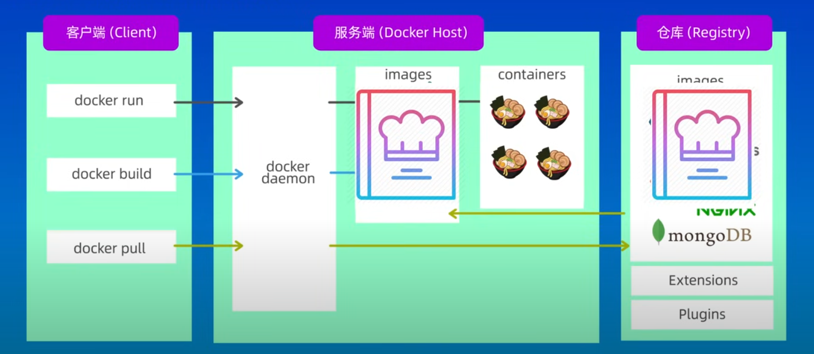

## Docker

### Docker vs 虚拟机

### Docker架构 

+ 三部分：客户端、服务端、docker仓库
+ 仓库用于存放各种镜像
+ 服务端：容器管理(生命周期)、镜像管理、网络管理
+ 客户端：docker各种命令解析与转发

##### 镜像image & 容器container

+ 镜像对应容器就相当于类对应实例
+ 容器就是镜像的一个实例

### Docker常用命令

## Kubernetes（k8s)

> k和s中间有8个字母，所以叫k8s。
> 例如internalization->i18n, localization->l10n

