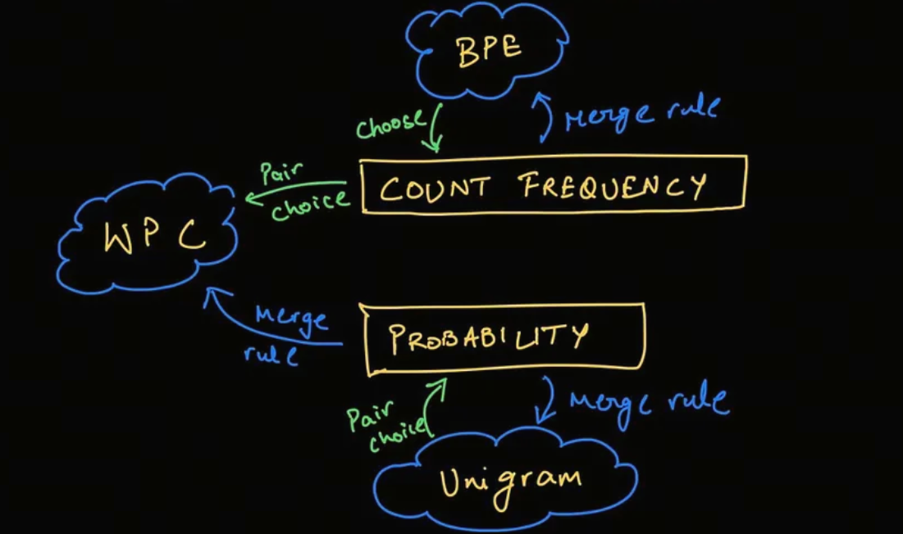

## 1. 三种常见的分词方式

你应该知道大模型的输入输出的单位是token，不是单词，也不是字母【在中文语境，不是词，不是字】，那么，token是什么呢？

> 虽然我们经常直接用token，但有的文献会翻译为标记。下文中看到标记，代表token。

Token是使用Tokenizer（翻译为分词器）分词后的结果，Tokenizer是什么呢？Tokenizer是将文本分割成token的工具。

在大模型中，Tokenizer有三种常见的分词方式：word level，char level，subword level,我会从英文（拉丁语系）和中文（汉语系）两个语言的角度来讲解。


### 1.1. word level

#### 英文：

word level是最简单的分词方式，就是将文本按照空格或者标点分割成单词。

比如，下面的句子：

>Let's do some NLP tasks.

按照空格分词后，得到的token是：

>Let's, do, some, NLP, tasks.

按照标点分词后，得到的token是：

>Let, ', s, do, some, NLP, tasks, .


#### 中文：
在中文中，分词是一个比较复杂的问题。中文没有空格，所以分词的难度要比英文大很多。下面举个例子：

>我们来做一个自然语言处理任务。

一个可能的分词结果是：

>我们，来，做，一个，自然语言处理，任务。

这种分词方式的优点是简单易懂，缺点是无法处理未登录词（Out-of-Vocabulary，简称OOV）。我们熟悉的jieba分词就是基于这种分词方式的。

>jieba分词基于统计和规则的方法，结合了TF-IDF算法、TextRank算法等多种技术，通过构建词图（基于前缀词典）并使用动态规划查找最大概率路径来确定分词结果。此外，对于未登录词，jieba分词使用了基于汉字成词能力的HMM（隐马尔科夫模型）和Viterbi算法来进行识别和分词.

### 1.2. Character level

#### 英文：

Character level是将文本按照字母级别分割成token。这样的好处是
- 词汇量要小得多；
- OOV要少得多，因为每个单词都可以从字符构建。

比如，下面的句子：

>Let's do some NLP tasks.

按照字母分词后，得到的token是：

>L, e, t, ', s, d, o, s, o, m, e, N, L, P, t, a, s, k, s, .

#### 中文：

在中文中，Character level是将文本按照字级别分割成token。

比如，下面的句子：

>我们来做一个自然语言处理任务。

按照字分词后，得到的token是：

>我，们，来，做，一，个，自，然，语，言，处，理，任，务，。

这种方法也不是完美的。基于字符而不是单词，从直觉上讲意义不大：在英文中每个字母本身并没有多大意义，单词才有意义。然而在中文中，每个字比拉丁语言中的字母包含更多的信息。

另外，我们的模型最终会处理大量的token：使用基于单词（word）的标记器(tokenizer)，单词只会是单个标记，但当转换为字母/字（character）时，它很容易变成 10 个或更多的标记(token)。

### 1.3. Sub-word level
在实际应用中，Character level和Word level都有一些缺陷。Sub-word level是一种介于Character level和Word level之间的分词方式。

> Sub-word 一般翻译成子词

子词分词算法依赖于这样一个原则，即不应将常用词拆分为更小的子词，而应将稀有词分解为有意义的子词。

#### 英文

我们来看下面的例子：

> Let's do Sub-word level tokenizer.

分词结果为：

> let's</ w>, do</ w>, Sub, -word</ w>, level</ w>, token, izer</ w>, .</ w>,

</ w>通常表示一个单词word的结尾。使用 "w" 是因为它是 "word" 的首字母，这是一种常见的命名约定。然而，具体的标记可能会根据不同的实现或者不同的分词方法有所不同。

#### 中文

在中文中，似乎没有子词的概念，最小单元好像就是字了，那该如何使用子词分词？难道是偏旁部首吗？别着急，后面我们一起讨论。


## 2. BPE (Byte-Pair Encoding)

字节对编码 (BPE) 最初是作为一种压缩文本的算法开发的，最早是由Philip Gage于1994年在《A New Algorithm for Data Compression》一文中提出，后来被 OpenAI 在预训练 GPT 模型时用于分词器（Tokenizer）。它被许多 Transformer 模型使用，包括 GPT、GPT-2、RoBERTa、BART 和 DeBERTa。


本文尝试用最直观的语言和示例来解释 BPE 算法。

本文的分词是在英文（拉丁语系）状态下进行的，中文状态下的分词会在后续的文章中讨论。

### 2.1. 直觉式理解

假设我们有一份语料，其中包含以下单词：

```plaintext
faster</ w>: 8, higher</ w>:6, stronger</ w>:7
```
其中，数字表示单词出现的次数。

>注： `</ w>` 表示单词的结束，使用 "w" 是因为它是 "word" 的首字母，这是一种常见的命名约定。然而，具体的标记token可能会根据不同的实现或者不同的分词方法有所不同。

**首先**，我们将其中的每个字符作为一个 token，得到的 token 如下：
```plaintext
f a s t e r</ w>: 8, h i g h e r</ w>: 6, s t r o n g e r</ w>: 7
```

对应的字典如下：
```plaintext
'a', 'e', 'f', 'g', 'h', 'i', 'n', 'o', 'r', 's', 't', 'r</ w>'
```

**第二步**，我们统计每两个token相邻出现的次数，得到如下结果：

```plaintext
'fa':8,'as':8,'st':15,'te':8,'er</ w>':21,'hi':6,'ig':6,'gh':6,'he':6,'tr':7,'ro':7,'on':7,'ng':7,'ge':7
```

8+8+15+8+21+6+6+6+6+7+7+7+7+7=115

我们将出现次数最多的字符'e'和'r</ w>'对合并'er</ w>'【这就是byte pair 字节对的名称由来】，token变为：

```plaintext
f a s t er</ w>: 8, h i g h er</ w>: 6, s t r o n g er</ w>: 7
```
对应的字典变化为：
```plaintext
'a', 'f', 'g', 'h', 'i', 'n', 'o', 's','r', 't', 'er</ w>'
```

> 注意： 此时的'e'和'r</ w>'被'er'消融了，因为在token中除了'er'中有'e'和'r</ w>'其他地方都没有。

**第三步**，现在'er</ w>'已经是一个token了，我们继续统计相邻token出现的次数，得到如下结果：

```plaintext
'fa':8,'as':8,'st':15,'ter</ w>':8,'hi':6,'ig':6,'gh':6,'her</ w>':6,'tr':7,'ro':7,'on':7,'ng':7,'ger</ w>':7
```

我们将出现次数最多的字符't'和'er</ w>'对合并'ter</ w>'，token变为：

```plaintext
f a s ter</ w>: 8, h i g h er</ w>: 6, s t r o n g er</ w>: 7
```
对应的字典变化为：
```plaintext
'a', 'f', 'g', 'h', 'i', 'n', 'o', 's','r', 't', 'er</ w>', 'ter</ w>'
```

> 注意： 此时的'er</ w>'和't'都没有被'ter</ w>'消融了，因为在token中除了'ter</ w>'中有'er</ w>'，其他地方也有'er</ w>'和't'


**重复上述步骤**，直到达到预设的token数量或者达到预设的迭代次数；

这两个就是BPE算法的超参数，可以根据实际情况调整。

搞清楚了BPE，后续我们再来看wordpiece和sentencepiece。

## 3. WordPiece

WordPiece 是 Google 为预训练 BERT 而开发的标记化算法。此后,它在不少基于 BERT 的 Transformer 模型中得到重用,例如 DistilBERT、MobileBERT、Funnel Transformers 和 MPNET。它在训练方面与 BPE 非常相似,但实际标记化的方式不同。


WordPiece算法的名称由来可以追溯到它的核心功能——将单词（Word）分解成片段（Piece）。这个名称直观地反映了算法的基本操作。

本段的分词是在英文（拉丁语系）状态下进行的，中文状态下的分词会在后续的章节中讨论。

wordpiece 分词器的工作流程和BPE算法非常相似，只是在选择合并token的时候有所不同。

### 3.1. 直觉式理解

假设我们有一份语料，其中包含以下单词：

```plaintext
faster</ w>: 8, higher</ w>:6, stronger</ w>:7
```
其中，数字表示单词出现的次数。

>注： `</ w>` 表示单词的结束，使用 "w" 是因为它是 "word" 的首字母，这是一种常见的命名约定。然而，具体的标记token可能会根据不同的实现或者不同的分词方法有所不同。

**首先**，我们将其中的每个字符作为一个 token，得到的 token 如下：
```plaintext
f a s t e r</ w>: 8, h i g h e r</ w>: 6, s t r o n g e r</ w>: 7
```

对应的字典如下：
```plaintext
'a', 'e', 'f', 'g', 'h', 'i', 'n', 'o', 'r', 's', 't', 'r</ w>'
```

> 注意：从第二步开始和BPE有所不同了

**第二步**，统计两个token之间的**score**，得到如下结果：

score=(freq_of_pair)/(freq_of_first_element×freq_of_second_element)

你可能或看到带log的公式，这是为了把除法转换成减法，方便计算。

```plaintext
'fa':1/8,'as':1/15,'st':1/15,'te':8/(21*15),'er</ w>':1/21,'hi':1/6,'ig':1/13,'gh':1/13,'he':1/21,'tr':1/15,'ro':1/7,'on':1/7,'ng':1/13,'ge':7/(13*21)
```

此时，我们将得分最高(1/6)的字符对'h'和'i'合并'hi'，token变为：

```plaintext
f a s t e r</ w>: 8, hi g h e r</ w>: 6, s t r o n g e r</ w>: 7
```
对应的字典变化为：
```plaintext
'a', 'f', 'g', 'e','r','n', 'o', 's','r', 't', 'hi'
```

**重复上述步骤**，直到达到预设的token数量或者达到预设的迭代次数（或其他条件）；


这就是wordpiece算法的超参数，可以根据实际情况调整。

> 注意：huggingface的berttokenize使用的是wordpiece的分词算法,但是和上面描述不同的地方在于,其中额外使用"##"用于表示某个subword 不是一个单词的开头

搞清楚了wordpiece，后续我们再来看unigram和sentencepiece。

## 4. Unigram

在 SentencePiece 中经常使用 Unigram 算法,该算法是 AlBERT、T5、mBART、Big Bird 和 XLNet 等模型使用的标记化算法。


与 BPE 和 WordPiece 相比,Unigram是不同的思路: 它从一个较大的词汇表开始,然后从中删除token,直到达到所需的词汇表大小。

在训练的每一步,Unigram 算法都会在给定当前词汇的情况下计算语料库的损失。

然后,对于词汇表中的每个token,算法计算如果删除该token,整体损失会增加多少,并寻找损失最少的token。

这些token对语料库的整体损失影响较小,因此从某种意义上说,它们“不太需要”并且是移除的最佳备选。


### 4.1 构建基础词汇表

Unigram 算法的第一步是构建一个基础词汇表,该词汇表包含所有可能的token。

这边，我们不再使用olympic的例子，而是采用HuggingFace官方的例子，原因是这个博主比较懒，不想计算那么多概率值。

假设我们有一个预料库，其中包含以下单词：

```plaintext
("hug", 10), ("pug", 5), ("pun", 12), ("bun", 4), ("hugs", 5)
```

其中，数字表示单词出现的次数

所以，我们的基础词汇表如下，这个词汇表包含所有子词sub-word：

```plaintext
["h", "u", "g", "hu", "ug", "p", "pu", "n", "un", "b", "bu", "s", "hug", "gs", "ugs"]
```

### 4.2 Unigram模型

首先，我们计算这个基础词汇表中的所有子词的出现频次

```plaintext
("h", 15) ("u", 36) ("g", 20) ("hu", 15) ("ug", 20) ("p", 17) ("pu", 17) ("n", 16) ("un", 16) ("b", 4) ("bu", 4) ("s", 5) ("hug", 15) ("gs", 5) ("ugs", 5)
```
频次之和为210，那其中一个子词'ug'的概率就是 20/210

unigram模型是最简单的语言模型，它假设每个词都是独立的，所以我们可以直接计算每个词的概率。

比如'pug'的一种分词方式['p','u','g']的概率为：

$$p(['p','u','g']) = P('p')*P('u')*P('g') = 5/210 * 36/210 * 20/210 = 0.000389$$

而'pug'的另一种分词方式['pu','g']的概率为：

$$p(['pu','g']) = P('pu')*P('g') = 5/210 * 20/210 = 0.0022676$$

所以，对于'pug'这个词，我们可以计算出所有分词方式的概率，然后选择概率最大的那个分词方式。

```plaintext
['p','u','g'] 0.000389
['pu','g'] 0.0022676
["p", "ug"] : 0.0022676
```
我们会选择概率最大的['pu','g']作为'pug'的分词方式，当出现概率相同时，我们可以选择第一个。

通过这个方式，我们可以对所有的word进行tokenizer，并生成上文中说的较大的词汇表。

在实际中，会有一个小问题，那就是穷举的话计算量太大了，大到这个博主一时间都计算不过来。

>求助： 假设我们的word有n个character，穷举的话一共有几种分词的方法？欢迎在留言区告诉我。

在实际中，我们可以使用维特比（Viterbi）算法来解决这个穷举问题。

维特比算法不在本文的讨论范围内，有兴趣的同学可以自行查阅资料。

### 4.2 删除token
此时，我们已经建立了一个较大的词汇表，接下来我们要删除一些token，直到达到我们的目标词汇表大小。

删除和裁员(打工人哭晕在厕所)的逻辑是一样的，谁对整体的影响最小，谁就被删除。

注意：基础的character是不能被删除的，我们需要它们来生成OOV的.

对于上文中的语料：
```plaintext
("hug", 10), ("pug", 5), ("pun", 12), ("bun", 4), ("hugs", 5)
```

假设我们经过上一步，已经对每一个word进行了分词,得到如下的分词和得分。

```plaintext
"hug": ["hug"] (score 0.071428)
"pug": ["pu", "g"] (score 0.007710)
"pun": ["pu", "n"] (score 0.006168)
"bun": ["bu", "n"] (score 0.001451)
"hugs": ["hug", "s"] (score 0.001701)
```

>注意: 上述的tokenizer省略了每一个字母character，比如，"hug"的分词是["h","u","g","hug"]，但是为了简化，我们省略了["h","u","g"].

现在就是计算每个token对整体的影响了，这个影响loss就是这些score的负对数似然 negative log likelihood.

初始loss就是：

$$10 * (-log(0.071428)) + 5 * (-log(0.007710)) + 12 * (-log(0.006168)) + 4 * (-log(0.001451)) + 5 * (-log(0.001701)) = 169.8$$

假设我们要去除的token是'hug',那么，受影响的是hug的分词和hugs的分词，我们可以更新'hug'后新token表的score:
    
```plaintext
"hug": ["hu", "g"] (score 0.006802)
"hugs": ["hu", "gs"] (score 0.001701)
```

loss的变化为：

$$hug：- 10 * (-log(0.071428)) + 10 * (-log(0.006802)) = 23.5 $$

$$hugs：- 5 * (-log(0.001701)) + 5 * (-log(0.001701)) = 0 $$

总变化为23.5.

我们遍历所有的token，找到loss最小的那个token，然后删除它；

重复上述步骤，直到达到我们的目标词汇表大小。



现在你已经明白了BPE和Unigram算法的基本原理，接下来我们讨论一个分词器工具：SentencePiece.

## 5. SentencePiece

太好了，终于到了大模型中使用最广泛的分词器: SentencePiece了.


之前介绍的分词器，英文（拉丁语系有空格）和中文（没有空格）会采用不同的分词方式，在大模型中，我们需要一个统一的分词器，这个分词器需要能够处理多种语言。

为此，我们需要一个统一的字符编码方式，这个编码方式需要能够处理多种语言，而且不会因为语言的不同而导致编码方式的不同。

### 5.1 直觉式理解

SentencePiece是由Google开发的一种通用的分词器，它可以处理多种语言，它的名字就暗示了它的原理。


还记得之前的WordPiece吗？WordPiece是将word先切分成最小piece，然后再合新token。

而SentencePiece是将sentence切分成最小piece，然后再合并成token，（这是其中的BPE实现，当然如果是unigram实现，是另一个逻辑。但名称的由来就是这样。）

SentencePiece的特点包括：

- 纯数据驱动：直接从句子中训练分词和去分词模型，不需要预先分词；
- 语言无关：将句子视为Unicode字符序列，不依赖于特定语言的逻辑；
- 多种子词算法：支持BPE和Unigram算法；
- 快速且轻量：分割速度快，内存占用小；
- 自包含：使用相同的模型文件可以获得相同的分词/去分词结果；
- 直接生成词汇ID：管理词汇到ID的映射，可以直接从原始句子生成词汇ID序列；
- 基于NFKC的规范化：执行基于NFKC的文本规范化

### 5.2 Unicode

unicode官网： https://home.unicode.org/

Unicode，全称为Unicode标准（The Unicode Standard），其官方机构Unicode联盟所用的中文名称为统一码，又译作万国码、统一字符码、统一字符编码，是信息技术领域的业界标准，其整理、编码了世界上大部分的文字系统，使得电脑能以通用划一的字符集来处理和显示文字，不但减轻在不同编码系统间切换和转换的困扰，更提供了一种跨平台的乱码问题解决方案。

这样，世界上所有的语言都用一个编码方式，对于大模型来说，只有一种语言，那就是Unicode。

在这个基础上，我们就可以用之前介绍的BPE或者Unigram算法来进行分词了。

BPE和Unigram算法的原理和实现，可以参考之前的文章。

最后，我们再来看下BPE的变种：BBPE。

## 6. BBPE

BBPE是一种基于BPE的分词器，它是BPE的一种变种，是由Google Brain团队提出的。BBPE的全称是Byte-level BPE，它是一种基于字节级别的BPE分词器。

### 6.1. 直觉式理解

BBPE的核心思想是将文本中的字符对（UTF-8编码中是字节对）进行合并，以形成常见的词汇或字符模式，直到达到预定的词汇表大小或者无法继续合并为止。

它和BPE的区别在于，BPE是基于字符级别character的，而BBPE是基于字节byte级别的。

BBPE具有如下的优点：

- 跨语言通用性：由于它基于字节级别，因此可以更容易地跨不同语言和脚本进行迁移；
- 减少词汇表大小：通过合并字节对，BBPE可以生成更通用的子词单元，从而减少词汇表的大小；
- 处理罕见字符OOV问题：BBPE可以更有效地处理罕见字符，因为它不会为每个罕见字符分配单独的词汇表条目，而是将它们作为字节序列处理


## 7. 总结

在这个分词器系列分享中，我们从最简单的word level,character level开始，讲述了按词和字符分词的优缺点；

接着我们介绍了sub-word level分词器，包括BPE,WordPiece,Unigram等；

最后我们介绍了两个变种，一个是SentencePiece工具，它将多语言视为Unicode字符序列，不依赖于特定语言的逻辑，SentencePiece可以基于BPE或者Unigram算法，（也可是BBPE算法）；

另一个是BBPE算法，它是一种基于字节级别的BPE分词器，即最小单元是字节。


恭喜你已经掌握了分词器的基本原理和实现！


## 参考

[1] [标记器（Tokenizer）](https://huggingface.co/learn/nlp-course/zh-CN/chapter2/4?fw=pt)

[2] [word_vs_character_level_tokenization](https://njoroge.tomorrow.co.ke/blog/ai/word_vs_character_level_tokenization)

[3] [tokenization-in-natural-language-processing](https://wisdomml.in/tokenization-in-natural-language-processing/)

[4] [A New Algorithm for Data Compression](http://www.pennelynn.com/Documents/CUJ/HTML/94HTML/19940045.HTM)

[5] [wiki:BPE](https://en.wikipedia.org/wiki/Byte_pair_encoding) 

[6] [Byte-Pair Encoding tokenization](https://huggingface.co/learn/nlp-course/en/chapter6/5)

[7] [WordPiece 标记化](https://huggingface.co/learn/nlp-course/zh-CN/chapter6/6?fw=pt)

[8] [tokenizers小结](https://zhuanlan.zhihu.com/p/360290118)

[9] [Unigram tokenization](https://huggingface.co/learn/nlp-course/en/chapter6/7?fw=pt)

[10] [github:sentencepiece](https://github.com/google/sentencepiece)

[11] [Unigram tokenization](https://huggingface.co/learn/nlp-course/en/chapter6/7?fw=pt)

## 欢迎关注我的GitHub和微信公众号，来不及解释了，快上船！

[GitHub: LLMForEverybody](https://github.com/luhengshiwo/LLMForEverybody)

仓库上有原始的Markdown文件，完全开源，欢迎大家Star和Fork！