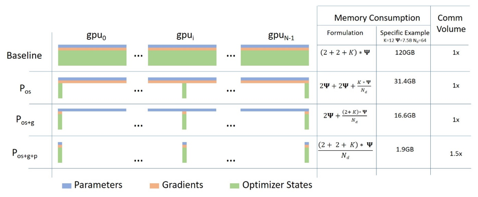

大模型训练框架（三）DeepSpeed

DeepSpeed[1](#refer-anchor-1)是由微软研究团队开发的一个深度学习优化库，旨在提供高效、可扩展的大规模模型训练能力。它通过采用先进的并行化策略、内存优化技术（如 ZeRO 内存优化器）和混合精度训练来显著提高训练效率和减少资源需求。

## 1. ZeRO

ZeRO（Zero Redundancy Optimizer）是DeepSpeed中的关键技术之一，它是为了解决大规模分布式训练中的内存瓶颈问题而设计的优化器。ZeRO通过优化模型状态的存储和通信来大幅减少所需的内存占用，使得可以在有限的资源下训练更大的模型。DeepSpeed是一个由微软开发的开源深度学习优化库，它旨在提高大规模模型训练的效率和可扩展性，而ZeRO是其核心组件之一，用于优化内存使用，允许训练更大的模型。



ZeRO分为三个优化级别：ZeRO-1、ZeRO-2和ZeRO-3，每个级别都在前一个级别的基础上进一步减少内存占用。

1. **ZeRO-1**：在这个阶段，优化器状态（例如Adam优化器的权重和梯度）被分布到多个GPU上，而不是每个GPU都存储完整的状态。这样可以节省一部分显存，但模型参数和激活仍然需要在每个GPU上完整存储。

2. **ZeRO-2**：在ZeRO-1的基础上，进一步对梯度进行分片处理，除了优化器状态外，梯度也被分布到多个GPU上。这进一步减少了每个GPU上的内存使用，从而提高了计算效率。

3. **ZeRO-3**：在这个阶段，实现了对所有模型状态的完全分片，包括模型参数。这意味着，模型的参数、优化器状态和梯度都将被分布到多个GPU上。这允许在相同的显存条件下训练更大的模型，但可能会增加通信开销。

此外，还有ZeRO-Infinity，它是ZeRO-3的扩展，可以利用CPU和NVMe内存来进一步扩展GPU的内存，支持训练更大型的模型。

FSDP 可以理解为是ZeRO-3的实现，它通过将模型的梯度、优化器状态和参数进行分片操作，使得每个 GPU 只存储部分参数信息，从而优化了资源的利用和提高了训练效率。

## 2. DeepSpeed: 并行化策略

DeepSpeed 支持多种并行化策略，包括数据并行、模型并行（包括流水线并行和张量并行），这些方法可以灵活组合，以适应不同规模和复杂度的深度学习模型。

**数据并行**（Data Parallelism）是将模型的副本分布到多个GPU上，每个GPU处理不同的数据子集，然后在每个训练步骤结束时同步模型参数。这种方法适用于模型较大，无法完全放入单个GPU内存的情况。数据并行主要采用上述ZeRO策略。

**流水线并行**（Pipeline Parallelism）是将模型的层划分为多个阶段，这些阶段可以在不同的处理器上并行处理。这种方法可以提高内存和计算效率，特别适合于深度学习训练。


通过将每个批次的训练数据分成更小的微批次（micro-batches），这些微批次可以并行地在流水线的各个阶段中处理。一旦一个阶段完成了一个微批次的前向传递，激活内存就会传递给流水线中的下一个阶段。类似地，当下一个阶段完成了对一个微批次的后向传递，相对于激活的梯度就会通过流水线向后传递。每个后向传递都会局部累积梯度，然后所有数据并行组并行地执行梯度的归约。最后，优化器更新模型权重。

**张量并行（Tensor Parallelism）**则是将模型的参数张量分割到多个GPU上，这样可以在保持模型整体结构的同时，通过分布式计算来加速训练过程。张量并行通常用于模型的参数量非常大，以至于单个GPU无法容纳整个模型的情况。


DeepSpeed 的流水线并行与张量并行的主要区别在于它们分割模型的方式不同。流水线并行是按层分割，而张量并行是按参数张量分割。这两种并行方式可以结合使用，形成混合并行策略，以进一步提高训练效率和可扩展性。例如，可以在流水线的每个阶段内使用张量并行来分割层内的参数，从而实现更细粒度的并行化。

## 3. DeepSpeed在pytroch中的实现: 

在PyTorch中使用DeepSpeed进行深度学习训练，主要涉及以下几个步骤：

1. **安装DeepSpeed**：
   - 通过`pip`安装DeepSpeed：`pip install deepspeed`。

2. **准备配置文件**：
   - 创建一个名为`deepspeed_config.json`的配置文件，定义训练参数和模型设置。例如：
     ```json
     {
       "train_batch_size": 4,
       "optimizer": {
         "type": "SGD",
         "params": {
           "lr": 0.001,
           "momentum": 0.9
         }
       },
       "fp16": {
         "enabled": true
       },
       "zero_optimization": {
         "stage": 2
       }
     }
     ```

3. **编写训练脚本**：
   - 导入DeepSpeed库：`import deepspeed`。
   - 定义模型、数据加载器和优化器。
   - 使用`deepspeed.initialize()`函数初始化DeepSpeed引擎，包装模型和优化器：
     ```python
     model_engine, optimizer, _, _ = deepspeed.initialize(args=cmd_args,
                                                           model=model,
                                                           model_parameters=params)
     ```

4. **训练模型**：
   - 替换原有的训练循环，通过调用`model_engine.backward(loss)`和`model_engine.step()`来执行反向传播和参数更新。
   - DeepSpeed会自动处理梯度累积、梯度压缩等技术，以提高训练效率。

5. **保存和加载检查点**：
   - 使用`model_engine.save_checkpoint()`和`model_engine.load_checkpoint()`进行模型检查点的保存和加载。

6. **启动训练**：
   - 使用DeepSpeed提供的命令行工具启动分布式训练。例如：
     ```
     deepspeed --hostfile=myhostfile --no_ssh --node_rank=<n> \
     --master_addr=<addr> --master_port=<port> \
     <client_entry.py> <client args> \
     --deepspeed --deepspeed_config ds_config.json
     ```
   - 如果在单节点多GPU环境中，可以使用`--include`和`--exclude`参数来选择使用的GPU。

7. **监控和调优**：
   - 在训练过程中，使用DeepSpeed提供的工具进行性能监控和调优。

8. **混合精度训练**：
   - 在配置文件中启用混合精度训练，例如设置`"fp16": {"enabled": true}`。

9. **ZeRO优化技术**：
   - 在配置文件中设置ZeRO优化策略，例如`"zero_optimization": {"stage": 2}`。

10. **卸载优化**：
    - 如果需要，可以在配置文件中启用ZeRO-Offload，将部分计算和内存卸载到CPU，例如`"zero_optimization": {"offload_optimizer": {"device": "cpu", "pin_memory": true}}`。

截至本文完稿时（2024/10/14），Pytorch对deepspeed的支持主要在ZeRO上，在PP和TP上有限。

## 4. DeepSpeed在Accelerate中的实现:

Accelerate库提供了一个简单的接口来集成DeepSpeed，使得在PyTorch中进行分布式训练变得更加容易。以下是使用DeepSpeed和Accelerate进行分布式训练的基本步骤：

1. **安装DeepSpeed和Accelerate**：
   ```bash
   pip install deepspeed accelerate
   ```

2. **创建DeepSpeed配置文件**：
   创建一个名为`deepspeed_config.json`的配置文件，定义训练参数和模型设置。例如：
   ```json
   {
     "train_batch_size": 4,
     "optimizer": {
       "type": "SGD",
       "params": {
         "lr": 0.001,
         "momentum": 0.9
       }
     },
     "fp16": {
       "enabled": true
     },
     "zero_optimization": {
       "stage": 2
     }
   }
   ```

3. **编写训练脚本**：
   导入必要的库，并定义模型、数据加载器和优化器。使用Accelerate的`Accelerator`和`DeepSpeedPlugin`来准备模型、优化器和数据加载器。例如：
   ```python
   import torch
   import torch.nn as nn
   from torch.utils.data import TensorDataset, DataLoader
   from accelerate import Accelerator, DeepSpeedPlugin

   class TestNet(nn.Module):
       def __init__(self, input_dim: int, output_dim: int):
           super(TestNet, self).__init__()
           self.fc1 = nn.Linear(in_features=input_dim, out_features=output_dim)
           self.fc2 = nn.Linear(in_features=output_dim, out_features=output_dim)

       def forward(self, x: torch.Tensor):
           x = torch.relu(self.fc1(x))
           x = self.fc2(x)
           return x

   if __name__ == "__main__":
       input_dim = 8
       output_dim = 64
       batch_size = 8
       dataset_size = 1000
       input_data = torch.randn(dataset_size, input_dim)
       labels = torch.randn(dataset_size, output_dim)
       dataset = TensorDataset(input_data, labels)
       dataloader = DataLoader(dataset=dataset, batch_size=batch_size)

       model = TestNet(input_dim=input_dim, output_dim=output_dim)
       accelerator = Accelerator()
       optimizer = torch.optim.Adam(model.parameters(), lr=0.001)
       loss_func = nn.MSELoss()

       model, optimizer, dataloader = accelerator.prepare(model, optimizer, dataloader)

       for epoch in range(10):
           model.train()
           for batch in dataloader:
               inputs, labels = batch
               optimizer.zero_grad()
               outputs = model(inputs)
               loss = loss_func(outputs, labels)
               accelerator.backward(loss)
               optimizer.step()
           print(f"Epoch {epoch}, Loss: {loss.item()}")
   ```

4. **启动训练**：
   使用Accelerate的`launch`命令来启动分布式训练。例如：
   ```bash
   accelerate launch --config_file default_config.yaml my_training_script.py
   ```
   其中`default_config.yaml`是Accelerate的配置文件，可以通过`accelerate config`命令生成。

5. **监控和调优**：
   在训练过程中，使用DeepSpeed提供的工具进行性能监控和调优。

6. **保存和加载检查点**：
   使用Accelerate的`save`和`load`方法来保存和加载模型检查点。

截至本文完稿时（2024/10/14），Accelerate对deepspeed的支持主要在ZeRO上，Accelerate暂时没有 PP 和 TP。

以下是各种框架对并行策略（截至2024/10/14）的支持情况：

| 框架 | DP| PP |TP|3D并行|
| :--- |:----:| :----: |:---: |:---: |
| Pytorch(FSDP)|是|否| 否|否|
| DeepSpeed |是| 是|是 |是|
| Megatron-LM|是|是|是|是|
| Accelerate |是|否|否|否|

## 参考

<div id="refer-anchor-1"></div>

[1] [DeepSpeed](https://github.com/microsoft/DeepSpeed)

[2] [parallelism](https://huggingface.co/docs/transformers/v4.15.0/en/parallelism)

## 欢迎关注我的GitHub和微信公众号[真-忒修斯之船]，来不及解释了，快上船！

[GitHub: LLMForEverybody](https://github.com/luhengshiwo/LLMForEverybody)

仓库上有原始的Markdown文件，完全开源，欢迎大家Star和Fork！