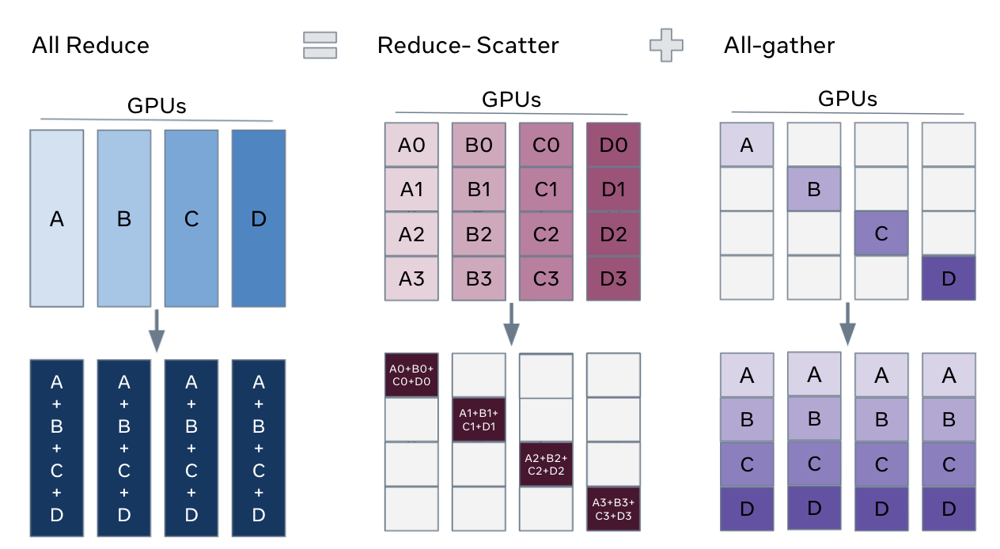

大模型训练框架（二）FSDP

Fully Sharded Data Parallel (FSDP)[1](#refer-anchor-1) 是一种数据并行方法，最早是在2021年由 FairScale-FSDP 提出的，并在后续被集成到了 PyTorch 1.11 版本中。

FSDP 可以看作是微软 Deepspeed 框架中提出的三种级别的 ZERO 算法中的 `ZERO-3` 的实现。它通过将模型的梯度、优化器状态和参数进行分片操作，使得每个 GPU 只存储部分参数信息，从而优化了资源的利用和提高了训练效率。此外，FSDP 也与包括 Tensor 实现、调度器系统和 CUDA 内存缓存分配器在内的几个关键 PyTorch 核心组件紧密协同设计，以提供非侵入式用户体验和高训练效率。


## 1. DP & DDP & ZeRO

***DP (Data Parallel)***：（狭义的）数据并行DP是最简单的并行策略了，它是将模型的副本分布到单机多卡上，每个卡都有一个模型副本，然后每个卡都会处理不同的数据子集。在每个训练步骤结束时，所有卡都会同步模型参数。

***DDP (Distributed Data Parallel)***随着数据量的增大，单机多卡的训练效率会变得很低，这时候就需要使用分布式数据并行DDP。DDP是将模型的副本分布到多台机器上，每台机器上有多个卡，每个卡都有一个模型副本。在每个训练步骤结束时，所有卡都会同步模型参数。

***ZeRO***，全称为"Zero Redundancy Optimizer"，是由微软研究院提出的一种用于优化分布式训练的内存管理技术。它旨在解决在大规模分布式训练中遇到的内存瓶颈问题，特别是在训练大型深度学习模型时。ZeRO 通过减少冗余数据来优化内存使用，使得在有限的硬件资源下训练更大的模型成为可能。


## 2. 解释

考虑这个具有 3 层的简单模型，其中每层有 3 个参数：

La | Lb | Lc
---|----|---
a0 | b0 | c0
a1 | b1 | c1
a2 | b2 | c2

La 层具有权重 a0、a1 和 a2。

如果我们有 3 个 GPU，则分片 DDP（= Zero-DP）会将模型拆分到 3 个 GPU 上，如下所示：

GPU0:
La | Lb | Lc
---|----|---
a0 | b0 | c0

GPU1:
La | Lb | Lc
---|----|---
a1 | b1 | c1

GPU2:
La | Lb | Lc
---|----|---
a2 | b2 | c2

现在，每个 GPU 都将获得在 DP 中工作的常规小批量：

```Plain Text
x0 => GPU0
x1 => GPU1
x2 => GPU2
```

输入未经修改 - 它们（输入）认为它们将被正常模型处理。

首先，输入到达 La 层。

让我们只关注 GPU0：x0 需要 a0、a1、a2 参数来完成其前向路径，但 GPU0 只有 a0 - 它从GPU1 拿到 a1，从 GPU2 拿到 a2，将模型的所有部分组合在一起。

同时，GPU1 获得小批量（mini-batch） x1，它只有 a1，但需要 a0 和 a2 参数，因此它从 GPU0 和 GPU2 获取这些参数。

获得输入 x2 的 GPU2 也是如此。它从 GPU0 和 GPU1 获取 a0 和 a1，并使用其 a2 重建完整张量。

所有 3 个 GPU 都重建了完整张量，并进行前向传播。

一旦计算完成，不再需要的数据就会被丢弃 - 它仅在计算期间使用。重建是通过pre-fetch高效完成的。

整个过程先对 Lb 层重复，然后对 Lc 层向前重复，再对 Lc 层向后重复，然后向后 Lc -> Lb -> La。

## 3. 更直观的解释

公司组织团建露营3天，大家都分别背上点东西：

```Plain Text
A扛帐篷
B扛零食
C扛水
```

现在，他们每天晚上都会与他人分享自己拥有的东西，并从他人那里获得自己没有的东西，早上收拾好分配给他们的装备，继续上路。这就是Sharded DDP/ZeRO DP。

将这种策略与简单的策略进行比较，简单的策略是每个人都必须携带自己的帐篷、零食和水，这会低效得多。

## 4. FSDP

ZeRO 有三种级别的算法，分别是 `ZERO-1`、`ZERO-2` 和 `ZERO-3`。`ZERO-3` 是最高级别的算法，它将模型的梯度、优化器状态和参数进行分片操作，使得每个 GPU 只存储部分参数信息，从而优化了资源的利用和提高了训练效率。FSDP 是 ZeRO-3 的实现。

## 5. FSDF PyTorch



在PyTorch中使用FSDP可以有效地训练大型模型，特别是在显存或内存受限的情况下。FSDP是一种数据并行技术，它将模型的参数、梯度和优化器状态跨多个设备进行分片。以下是基本步骤：

1. **初始化分布式环境**：
   首先，需要初始化分布式环境以帮助进程间通信。这通常通过`torch.distributed.init_process_group`函数完成。

2. **设置本地排名**：
   每个进程需要根据其`local_rank`设置应该使用的GPU。这可以通过环境变量或命令行参数来获取。

3. **创建FSDP模型**：
   使用`FullyShardedDataParallel`类来包装你的模型。这将允许模型参数在多个GPU上进行分片。例如：
   ```python
   from torch.distributed.fsdp import FullyShardedDataParallel

   model = MyModel()
   model = model.to(device)  # 将模型移动到GPU
   fsdp_model = FullyShardedDataParallel(model, ...其他参数...)
   ```

4. **配置FSDP参数**：
   FSDP提供了多种参数来配置其行为，例如`cpu_offload`用于决定是否将参数卸载到CPU，以及`sharding_strategy`用于指定分片策略。

5. **训练模型**：
   在训练循环中，FSDP会自动处理参数的分片和梯度的聚合。你只需要像往常一样进行前向和反向传播。

6. **保存和加载模型**：
   当使用FSDP时，保存和加载模型可能需要一些特殊的处理，以确保分片的参数被正确处理。

下面是一个更详细的示例代码，展示了如何使用FSDP来训练一个简单的模型：
```python
import torch
import torch.nn as nn
from torch.distributed.fsdp import FullyShardedDataParallel, CPUOffload

class MyModel(nn.Module):
    def __init__(self):
        super(MyModel, self).__init__()
        self.layer1 = nn.Linear(8, 4)
        self.layer2 = nn.Linear(4, 16)
        self.layer3 = nn.Linear(16, 4)

    def forward(self, x):
        x = torch.relu(self.layer1(x))
        x = torch.relu(self.layer2(x))
        x = self.layer3(x)
        return x

# 初始化分布式环境
torch.distributed.init_process_group(backend='nccl')

# 设置本地排名和设备
local_rank = torch.distributed.get_rank()
world_size = torch.distributed.get_world_size()
torch.cuda.set_device(local_rank)

# 创建模型并移动到对应的GPU
model = MyModel().to(local_rank)

# 使用FSDP包装模型
fsdp_model = FullyShardedDataParallel(
    model,
    cpu_offload=CPUOffload(offload_params=True),
    # 其他FSDP参数
)

# 定义损失函数和优化器
criterion = nn.MSELoss()
optimizer = torch.optim.Adam(fsdp_model.parameters(), lr=0.001)

# 训练循环
for epoch in range(num_epochs):
    for data, target in dataloader:
        data, target = data.to(local_rank), target.to(local_rank)
        optimizer.zero_grad()
        output = fsdp_model(data)
        loss = criterion(output, target)
        loss.backward()
        optimizer.step()
```

## 6. FSDP Huggingface/Accelerate

作为一个高级的深度学习库，Huggingface 提供了一个名为 Accelerate 的库，它可以帮助用户更容易地使用分布式训练技术，包括FSDP。Accelerate 提供了一个简单的API，可以在几行代码中将模型转换为FSDP模型，并自动处理分布式训练的细节。

```shell
compute_environment: LOCAL_MACHINE
debug: false
distributed_type: FSDP # 使用FSDP的配置
downcast_bf16: 'no'
fsdp_config:
  fsdp_auto_wrap_policy: TRANSFORMER_BASED_WRAP
  fsdp_backward_prefetch_policy: BACKWARD_PRE
  fsdp_forward_prefetch: false
  fsdp_cpu_ram_efficient_loading: true
  fsdp_offload_params: false
  fsdp_sharding_strategy: FULL_SHARD
  fsdp_state_dict_type: SHARDED_STATE_DICT
  fsdp_sync_module_states: true
  fsdp_transformer_layer_cls_to_wrap: BertLayer
  fsdp_use_orig_params: true
machine_rank: 0
main_training_function: main
mixed_precision: bf16
num_machines: 1
num_processes: 2
rdzv_backend: static
same_network: true
tpu_env: []
tpu_use_cluster: false
tpu_use_sudo: false
use_cpu: false
```

`tips`: 2024年9月13号，在 Accelerate 开发趋于稳定将近一年后的,正式发布了 Accelerate 1.0.0 —— Accelerate 的第一个发布候选版本.


以下是各种框架对并行策略（截至2024/10/12）的支持情况：

| 框架 | DP| PP |TP|3D并行|
| :--- |:----:| :----: |:---: |:---: |
| Pytorch(FSDP)|是|否| 否|否|
| DeepSpeed |是| 是|是 |是|
| Megatron-LM|是|是|是|是|
| Accelerate |是|否|否|否|

## 参考

<div id="refer-anchor-1"></div>

[1] [Getting Started with Fully Sharded Data Parallel(FSDP)](https://pytorch.org/tutorials/intermediate/FSDP_tutorial.html)

<div id="refer-anchor-2"></div>

[2] [Accelerate](https://huggingface.co/docs/accelerate/index)

## 欢迎关注我的GitHub和微信公众号[真-忒修斯之船]，来不及解释了，快上船！

[GitHub: LLMForEverybody](https://github.com/luhengshiwo/LLMForEverybody)

仓库上有原始的Markdown文件，完全开源，欢迎大家Star和Fork！