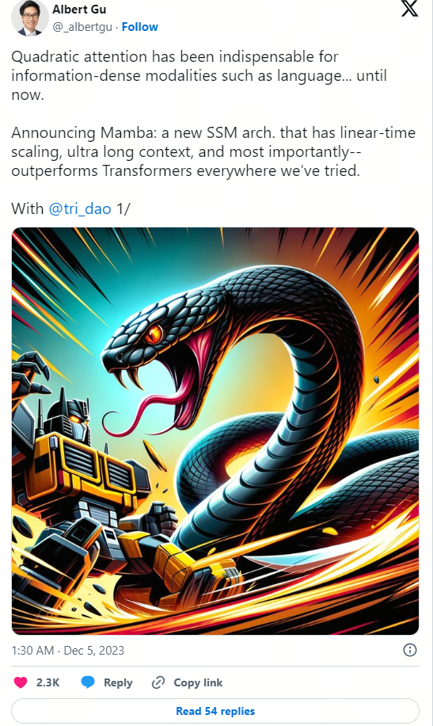
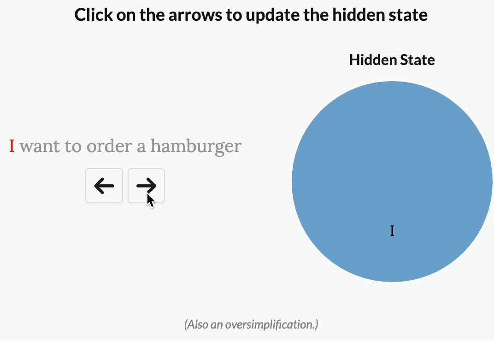
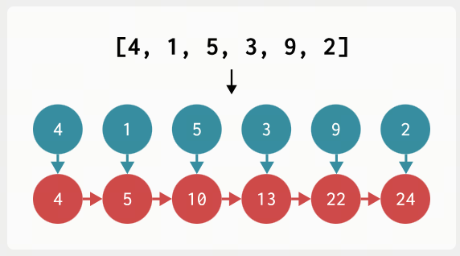
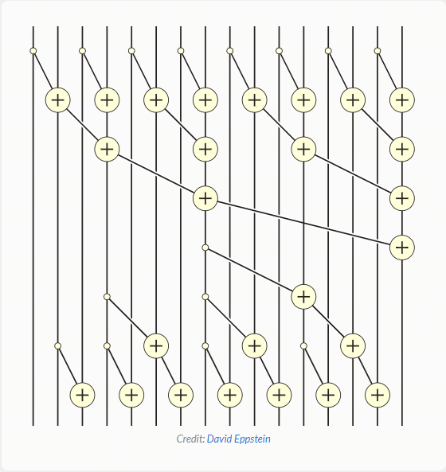
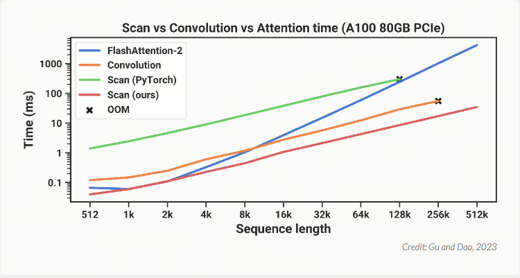
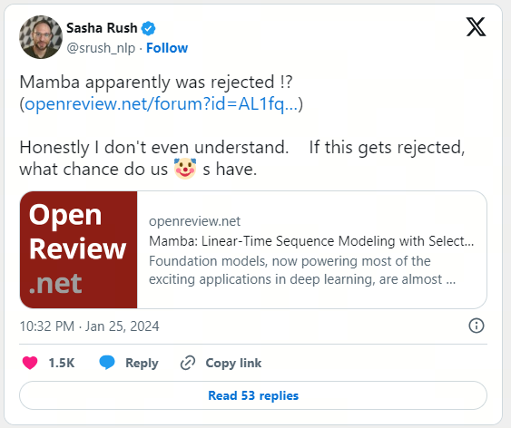

理解Mamba最简单的方式（中文翻译）

## 写在最前面
2024年2月，一篇名为Mamba的论文被ICLR拒稿，引起学术界和工业界的轩然大波.Mamba被认为是可以挑战Transformer的架构.

原作者Jack Cook提供了最简单的方式理解Mamba：

原文地址：https://jackcook.com/2024/02/23/mamba.html

由于译者水平有限，翻译过程中难免会有错误，还请大家多多包涵. 如果有任何问题，欢迎在评论区指出，我会尽快修改.

阅读提示：文中会附带一些蛇的图片. Mamba是科比(R.I.P)的绰号，同时曼巴也是眼镜蛇的一种，黑曼巴是世界上移动速度最快的蛇.

## 正文开始：

如今，基本上任何你能说出名字的语言模型都是 Transformer 模型.举几个例子：OpenAI 的 [ChatGPT](https://chatgpt.com/)、Google 的 [Gemini](https://deepmind.google/technologies/gemini/) 和 GitHub 的 [Copilot](https://github.com/features/copilot) 都是由 [Transformer](https://nlp.seas.harvard.edu/annotated-transformer/) 驱动的.然而，Transformer 有一个根本缺陷：它是由 Attention 驱动，而 Attention 会随着序列长度的平方增长.简而言之，对于快速交流（要求 ChatGPT 讲个笑话），这没问题.但对于需要大量单词的查询（要求 ChatGPT 总结一份 100 页的文档），Transformer 可能会变得非常慢.

许多模型都试图解决这个问题，但很少有模型能像 [Mamba](https://arxiv.org/abs/2312.00752) 一样出色.Mamba 由 [Albert Gu](https://x.com/_albertgu) 和 [Tri Dao](https://tridao.me/) 于两个月前发布，它似乎比类似大小的 Transformers 表现更好，同时随着序列长度线性扩展.如果你正在寻找 Mamba 的深入技术解释，以及完整的 Triton 实现，那么你来错地方了.传奇人物 [Sasha Rush](https://rush-nlp.com/) 已经撰写了[《Mamba: The Hard Way》](https://srush.github.io/annotated-mamba/hard.html).如果你还没有听说过 Mamba（或 Triton），或者你正在寻找 Mamba 伟大理念的概述，我正好有一篇适合你的文章.(原文的标题是Mamba: The Easy Way，译者注)

精确的线性时间语言模型的前景让很多人对语言模型架构的未来感到兴奋（尤其是 Sasha，他在[这方面投入了不少资金](https://www.isattentionallyouneed.com/)）.在这篇博文中，我将尝试以一种相当直接的方式解释 Mamba 的工作原理，特别是如果你之前学过一点计算机科学的话.让我们开始吧！

>译者注1：精确的线性时间语言：指的是算法复杂度是O(n)的语言模型，即随着序列长度的增加，计算时间是线性增长的.Transformer的算法复杂度是O(n^2).

>译者注2：文中提到的Sasha Rush投了不少资金，指的是他和另一个人打的赌，赌的是2027年1月1号之前，Transformer是否会被其它架构取代.Sasha Rush支持会被取代，另一个人[Jonathan Frankle](http://www.jfrankle.com/)支持Transformer不会被取代.

## 背景知识：S4
Mamba 的架构主要基于 [S4](https://arxiv.org/abs/2111.00396)，这是一种最新的状态空间模型 state space model (SSM) 架构.我将在这里总结重要部分，但如果你想更详细地了解 S4，我强烈建议你阅读 Sasha 的另一篇博文[《The Annotated S4》](https://srush.github.io/annotated-s4/).

从整体上讲，S4 学习如何通过中间状态 $h(t)$ 将输入 $x(t)$ 映射到输出$ y(t)$. 这里 $x,y,h$ 都是关于 $t$ 的函数，因为 SSM 旨在很好地处理音频、传感器数据和图像等连续数据.S4 通过三个连续参数矩阵 $A,B和C$ 将它们相互关联.它们都通过以下两个方程（Mamba 论文中的 1a 和 1b）联系在一起：

$$\begin{align*}
h'(t) &= Ah(t)+Bx(t) \\ 
y(t) &= Ch(t)
\end{align*}$$

> 译者注：这里 $s(t)$ 是一个外部输入，$h'(t)$ 是下一个时间步的状态（不是导数！），$y(t)$ 是输出.这些方程的关键是它们是线性的，这意味着 S4 可以在 $O(n)$ 时间内处理序列，这是 Mamba 的关键优势.

在实践中，我们处理的都是离散数据，例如文本.这需要我们[离散化](https://en.wikipedia.org/wiki/Discretization) SSM，通过使用特殊的第四个参数将连续参数$A,B,C$转换为离散参数$\bar{A},\bar{B},C$. 我不会在这里详细介绍离散化的工作原理，但如果你感兴趣的话，S4 的作者已经写了一篇关于它的精彩[博客](https://hazyresearch.stanford.edu/blog/2022-01-14-s4-3). 一旦离散化，我们就可以通过这两个方程（2a 和 2b）来表示 SSM：

$$\begin{align*}
h(t) &= \bar{A}h_{t-1}+\bar{B}x_t \\ 
y(t) &= Ch_t
\end{align*}$$

这些方程形成一个递归，类似于你在循环神经网络 (RNN) 中看到的递归.在每个步骤$t$中，我们将前一个时间步的隐藏状态$h_{t-1}$与当前输入$x_t$相结合，以创建新的隐藏状态$h_t$.下面，你可以看到它在预测句子中的下一个单词时是如何工作的（在本例中，我们预测“My name is Jack”后面跟着的是“and”）.

这样，我们基本上可以把S4当作RNN一样使用，一次性生成一个token.然而，S4 真正酷的地方在于，你实际上也可以将它用作卷积神经网络 (CNN).在上面的例子中，让我们看看当我们扩展之前的离散方程来尝试计算$h_3$ 时会发生什么.为简单起见，我们假设$x_-1=0$ .

$$\begin{align*}
h_0 &= \bar{B}x_o \\
h_1 &= \bar{A}(\bar{B}x_o) +\bar{B}x_1\\
h_2 &= \bar{A}(\bar{A}(\bar{B}x_o) +\bar{B}x_1) +\bar{B}x_2\\
h_3 &= \bar{A}(\bar{A}(\bar{A}(\bar{B}x_o) +\bar{B}x_1) +\bar{B}x_2) +\bar{B}x_3\\
\end{align*}$$

计算出$h_3$后，我们可以将其代入 $y_3$的方程中来预测下一个单词.
$$\begin{align*}
y_3 &= C(\bar{A}(\bar{A}(\bar{A}(\bar{B}x_o) +\bar{B}x_1) +\bar{B}x_2) +\bar{B}x_3)\\
y_3 &= C\bar{A}\bar{A}\bar{A}\bar{B}x_o +C\bar{A}\bar{A}\bar{B}x_1 +C\bar{A}\bar{B}x_2 +C\bar{B}x_3\\
\end{align*}$$

现在，注意到$y_3$实际上可以用点积计算，其中右侧向量只是我们的输入$x$：

假设我们有两个矩阵 A 和 B，它们的乘积可以表示为：

$$
y_3 = 
\begin{pmatrix}
C\bar{A}\bar{A}\bar{A}\bar{B} & C\bar{A}\bar{A}\bar{B} & C\bar{A}\bar{B} & C\bar{B}\\
\end{pmatrix}
\begin{pmatrix}
x_0 \\
x_1 \\
x_2 \\
x_3 \\
\end{pmatrix}
$$

由于$\bar{A},\bar{B},C$都是常数，我们可以预先计算左侧向量并将其保存为卷积核$\bar{K}$. 这样我们就可以用[卷积](https://en.wikipedia.org/wiki/Convolution)轻松计算$y$, 如以下两个方程（Mamba 论文中的 3a 和 3b）所示：

$$\begin{align*}
\bar{K} &= \begin{pmatrix}
C\bar{B} & C\bar{A}\bar{B} & ... & C\bar{A}^{k}\bar{B} \\
\end{pmatrix}\\
y &= \bar{K}*x\\
\end{align*}$$

重要的是，这些循环和卷积形式（我喜欢称之为“RNN 模式”和“CNN 模式”）在数学上是等价的.这使得 S4 可以根据你的需要进行变形，而其输出没有任何差异.我们可以在 S4 论文的表 1 中比较这些“模式”之间的差异，该表显示了每种形式的训练和推理的运行时复杂度（粗体表示每个指标的最佳结果）.

| | Convolution| Recurrence|S4|
| :--- |:----:| :----: |:---: |
| 训练|$\tilde{L}H(B+H)$|$BLH^2$| $BH(\tilde{H}+\tilde{L})+B\tilde{L}H$   |
| 是否可以并行 |是| 否|是 |
| 推理|$LH^2$|$H^2$|$H^2$ |

注意到：CNN 模式更适合训练，而 RNN 模式更适合推理.在 CNN 模式下，我们可以利用并行特性一次性训练多个示例.在 RNN 模式下，虽然我们一次只能计算一个步骤，但每个步骤所需的工作量完全相同.由于 S4 可以使用这两种模式，因此它基本上兼具了两全其美的优势：快速训练和更快的推理.

## 想法1：选择性
现在我们可以继续讨论 Mamba 提出的第一个主要思想：选择性.让我们回顾一下定义 S4 离散形式的两个方程：

$$\begin{align*}
h(t) &= \bar{A}h_{t-1}+\bar{B}x_t \\ 
y(t) &= Ch_t
\end{align*}$$

请注意，在 S4 中，我们的离散参数$\bar{A},\bar{B},C$是常数.但是，Mamba 会让这些参数根据输入而变化.我们最终会得到如下结果：

$$\begin{align*}
h(t) &= S_{\bar{A}}(x_t)h_{t-1}+S_{\bar{B}}(x_t)x_t \\ 
y(t) &= S_{C}(x_t)h_t
\end{align*}$$

作者认为，选择性或输入依赖性对于许多任务都很重要.我喜欢这样想：因为 S4 没有选择性，所以它被迫将输入的所有部分视为完全相同.但是，当你阅读一个句子时，有些词不可避免地比其他词更重要.假设我们有一个根据意图对句子进行分类的模型，我们给它这个句子：“我想点一个汉堡包.”如果没有选择性，S4 会花费相同的“精力”来处理每个单词.单击下面的按钮，查看在处理句子时会发生什么，一次处理一个单词.

>译者注：原文中有一个按钮，点击后会显示一个动画，展示了Mamba处理句子时的过程，这里直接放gif图.下同.    

但是，对于一个试图对这句话的意图进行分类的模型来说，你可能会希望更多地“关注”某些词而不是其他词.“want”和“to”这两个词对这句话的深层含义到底有多大贡献？实际上，如果我们能把有限的精力更多地花在“order”这样的词上，了解用户想要做什么，以及“hamburger”这样的词上，了解用户点了什么，那就太好了.通过使模型参数成为输入的函数，Mamba 可以“关注”对当前任务更重要的输入部分.

然而，选择性给我们带来了一个问题.让我们回想一下我们之前计算的卷积核.

$$\begin{align*}
\bar{K} &= \begin{pmatrix}
C\bar{B} & C\bar{A}\bar{B} & ... & C\bar{A}^{k}\bar{B} \\
\end{pmatrix}\\
\end{align*}$$

在 S4 中，我们可以预先计算这个内核，保存它，并将其与输入$x$相乘.这没问题，因为$\bar{A},\bar{B},C$是常数.但同样，在 Mamba 中，这些矩阵会根据输入而变化！因此，我们无法预先计算$\bar{K}$，也不能使用 CNN 模式来训练我们的模型.如果我们想要选择性，我们需要使用 RNN 模式进行训练.我们可以划掉公式 3b 以获得惊人效果.

$$\bcancel{\cancel{y = \bar{K}*x}}$$

这给 Mamba 的作者带来了一个问题：在 RNN 模式下训练速度非常慢.想象一下，我们在包含 1,000 个 token 的序列上训练我们的模型.CNN 本质上会计算其内核和输入向量之间的点积，并且可以并行执行这些计算.相比之下，RNN 需要按顺序更新其隐藏状态 1,000 次.RNN 的这种缓慢训练时间或多或少阻碍了它们真正起飞，这让 Mamba 的作者产生了他们的第二个伟大想法.

## 想法 2：无需卷积的快速训练

Mamba 的第二个主要理念是，以非常非常快的速度在 RNN 模式下进行训练.在某个时候，Gu 和 Dao 意识到他们的递归非常类似于扫描算法，也称为前缀和.要计算前缀和，我们需要获取一个输入数组$\begin{bmatrix}
x_1, x_2, x_3,...,x_n \end{bmatrix}$
并返回一个输出数组，其中每个元素都是该项目与它之前的项目的和.换句话说，输出的第一个元素将是$x_1$，第二个元素将是$x_1+x_2$，第三个元素将是$x_1+x_2+x_3$，依此类推.下面显示了一个示例.

现在我们来画出 RNN 模式下 Mamba 隐藏状态的更新过程.等一下……

让我们思考一下.如果我们必须形式化前缀和，我们可以将其写成以下等式：

$$h_t = h_{t-1}+x_t $$

此等式形成一个递归：在每一步中，我们通过将先前存储的值添加到当前输入来计算新值.现在，让我们再次查看更新 Mamba 隐藏状态的递归.

$$h_t = \bar{A}h_{t-1}+\bar{B}x_t $$

这些真的非常相似！ 最棒的部分是：虽然计算前缀和似乎本质上是连续的，但我们实际上有高效的并行算法来完成这项任务！在下图中，我们可以看到并行前缀和算法的实际应用，其中每条垂直线代表数组中的一个项.

花点时间让自己相信这个算法是有效的：选择任何一条垂直线，从顶部开始，然后向下移动，将每次添加追溯到数组的前几个项.到达底部时，你应该得到线左侧所有项目的总和.例如，你可以看到，在第一个元素在开头添加到第二个元素后，数组的第三个元素在末尾接收第二个元素的添加值.因此，在并行扫描完成时，第三个元素包含第一个、第二个和第三个元素的总和.

如果我们在单线程中运行此算法，没有并行性，那么它所花的时间会比我们按顺序将值相加所花的时间更长.但 GPU 拥有大量处理器，可以进行高度并行计算.因此，我们可以在大约$O(log(n))$的时间复杂度内计算出这个前缀和（或扫描）操作！

因此，Mamba 的作者意识到，如果他们想在 RNN 模式下高效训练，他们可能可以使用并行扫描.由于 PyTorch [目前没有扫描实现](https://github.com/pytorch/pytorch/issues/50688)，Mamba 的作者自己编写了一个，但效果并不理想.

在上图中，你可以看到他们基于 PyTorch 的扫描实现（绿色）总是比 [FlashAttention-2](https://arxiv.org/abs/2307.08691)（蓝色）慢，后者是目前最快的“exact Attention”实现.当序列长度为 128,000 个标记时，扫描似乎几乎可以在运行时赶上，但它会耗尽内存.为了使 Mamba 更实用，它需要更快.这让 Mamba 的作者们想到了 Dao 之前在 FlashAttention 上的工作.

## 回顾：FlashAttention

FlashAttention 是 Attention 的一个非常快速的实现.发布时，FlashAttention 训练 BERT-large 的速度比之前最快的训练时间快 15%，比广泛使用的 GPT-2 的 HuggingFace 实现快 3 倍.

简而言之，FlashAttention 的关键在于：不同操作在 GPU 上运行的速度不同.他们意识到一些 GPU 操作是计算密集型的，这意味着它们受到 GPU 执行计算的速度的限制.然而，其他操作是内存密集型的，这意味着它们受到 GPU 传输数据的速度的限制.

想象一下你和一个朋友在玩游戏：你的朋友必须跑 50 米才能把两个数字给你，然后你需要手动将它们相乘.当你的朋友开始跑步时，计时器开始计时，当你得到答案时结束计时.假设你需要乘以的数字是 439,145,208 和 142,426,265.手动计算这些数字需要花费一些时间.你的朋友可能需要 5 秒钟才能给出这些数字，而你可能需要 60 秒钟才能完成乘法运算.因此，你们都受到计算限制，因为你们的大部分时间都花在了计算上.现在，假设你需要乘以的数字是 4 和 3.虽然你的朋友仍然需要 5 秒钟才能跑完 50 米，但你可以立即计算出这个结果.现在，你们都受到内存限制，因为你们的大部分时间都花在了传输数据上.

> 译者注：这是我目前看到的关于compute-bound和memory-bound的最好的解释，非常形象生动.

在这个类比中，你的 GPU 本质上是在争分夺秒地将数据移动到正确的位置以执行计算.例如，让我们考虑一个掩码操作.要计算掩码向量，你的 GPU 只需在掩码等于零时擦除数据值（并在掩码等于一时保持它们相同）.如果我们使用$\oslash$来表示掩码操作，则此操作的一个示例如下，其中掩码强制我们将最后三个数据元素设置为零：

$$
\begin{pmatrix} 4&9&4&1&2&7\end{pmatrix}\oslash\begin{pmatrix}1&1&1&0&0&0 \end{pmatrix} = \boxed{\begin{pmatrix}4&9&4&0&0&0 \end{pmatrix}}$$

由于这非常容易计算，你的 GPU 最终会花费大部分时间来传输内存，将数据和掩码矩阵移动到正确的位置进行计算.这意味着掩码是内存受限的.另一方面，矩阵乘法涉及大量的加法和乘法.由于花在计算上的时间比内存传输上的时间多得多，因此矩阵乘法是计算密集型的.考虑到这一点，让我们看一下在 Attention期间执行的计算的细节. （译者注：原文中有时会使用matmul表示矩阵乘法，作者标注了 matmul是 matrix multiplication的缩写.）

事实证明，构成 Attention 运行时间大部分的 dropout、softmax 和 masking 都是受内存密集型的.这意味着我们计算 Attention 的大部分时间都只是在等待 GPU 移动数据.考虑到这一点，我猜 FlashAttention 的作者想知道，我们如何才能加快受内存传输速度限制的操作？

这让 FlashAttention 的作者意识到了另一个关键问题：GPU 内存有两个主要区域.其中一个是高带宽内存 (HBM)，它非常大，但速度非常慢.另一个是静态随机存取存储器 (SRAM)，它非常小，但速度非常快.让我们分析一下 A100 GPU 上这两个区域之间的差异：

FlashAttention 的作者意识到，如果你格外小心地使用这些 GPU 内存区域，则可以更高效地进行内存密集型操作.他们使用一种称为平铺（tiling）的方法，其中将一小部分数据从 HBM（较慢）移动到 SRAM（较快），在 SRAM 中计算，然后从 SRAM 移回 HBM.这使得 FlashAttention 非常非常快，同时在（结果）数值上仍然与 Attention 相当.

其工作原理细节非常吸引人，我鼓励你查看 [FlashAttention 论文](https://arxiv.org/abs/2205.14135)以了解更多信息.不过，为了理解 Mamba，你基本上只需要知道这些.

## 回到 Mamba
请记住，在开始讨论 FlashAttention 之前，我们一直在尝试加快并行扫描实现的速度.下面是之前的同一张图，我们可以看到 PyTorch 中的扫描实现（绿色）总是比最快的“精确”Transformer-FlashAttention（蓝色）慢

事实证明，如果你在计算扫描时采用同样的内存感知平铺方法，则可以大大加快速度.通过这种优化，Mamba（红色）现在在所有序列长度上都比 FlashAttention-2（蓝色）更快.

这些结果表明，就速度而言，Mamba 是实用的，其运行速度比最快的精确 Transformers 还要快.但它在语言建模方面真的好吗？

## 结果

Gu 和 Dao 在涉及语言、基因组学和音频的一系列序列建模任务上对 Mamba 进行了评估.我对后两个领域不太熟悉，但结果看起来很酷：Mamba 在对人类基因组项目的 DNA 和钢琴音乐数据集的音频进行建模时建立了最先进的性能.同时，语言结​​果让很多人兴奋不已.很多关于 Mamba 的在线讨论都集中在图 4 上，我已将其包含在下方.

在此图中，模型大小向右增加，语言建模性能随着向下移动而提高. 这意味着最好的模型应该在左下方：小（因此速度快），并且非常擅长语言建模.由于 Gu 和 Dao 是学者，他们没有数千个 GPU 可用于训练 GPT-4 大小的模型，因此他们通过训练一堆较小的模型（大约 1.25 亿到 13 亿个参数）进行了比较.如上图所示，结果看起来非常有希望.与其他类似大小的模型相比，Mamba 似乎是语言建模方面最好的.

## 下一步？
我非常喜欢写这篇博文，因为我认为 Mamba 以一种非常独特和有趣的方式在语言建模方面进行了创新！不幸的是，一些审稿人不同意：Gu 和 Dao 原计划于 5 月在 ICLR 上展示 Mamba，但他们的论文几周前被拒绝了，在网上引起了一些困惑的反应.

我猜 Gu 和 Dao 目前正在撰写论文的下一版，我也猜想一些拥有大量 GPU 的公司目前正在试图弄清楚 Mamba 的性能是否适用于更大的模型尺寸.随着我们继续想要能够同时处理越来越多 token 的模型，如果 Mamba 等线性时间模型能够表现出良好的性能，它们也许有一天会给出答案.在那之前，我们可以继续改进我们蹩脚的老式 Transformers.

## 正文结束

## 翻译此文同时参考

[1] [MODELING SEQUENCES WITH STRUCTURED STATE SPACES](https://stacks.stanford.edu/file/druid:mb976vf9362/gu_dissertation-augmented.pdf)

[2] [Mamba: Linear-Time Sequence Modeling with Selective State Spaces](https://arxiv.org/pdf/2312.00752)
