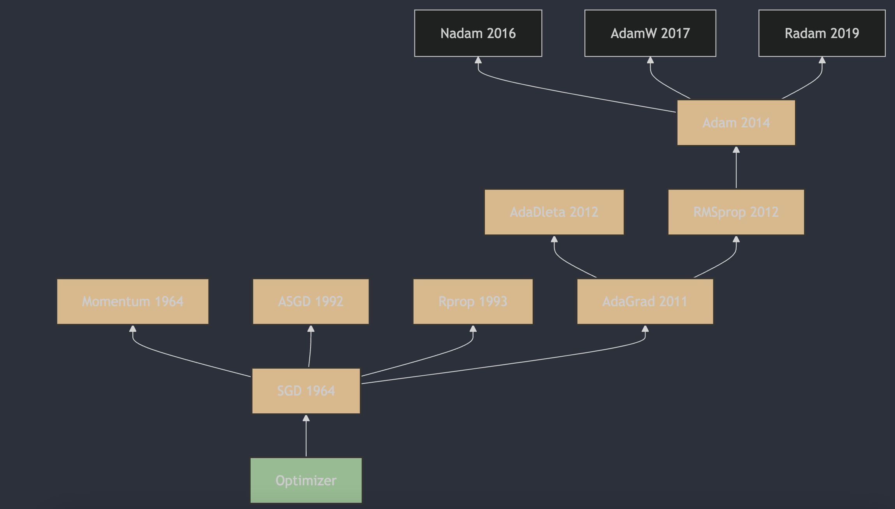

每天3分钟，彻底弄懂神经网络的优化器（九）Adam

## 1. Adam算法的提出
Adam(Adaptive Moment Estimation)算法是由Diederik P. Kingma和Jimmy Ba在2014年提出的。这一算法的详细描述和原理可以在论文《Adam: A Method for Stochastic Optimization》[1](#refer-anchor-9) 中找到，该论文最初是在2014年12月22日提交到arXiv的，并且后来在2015年的ICLR会议上发表。Adam算法结合了AdaGrad算法和RMSProp算法的优点，通过计算梯度的一阶矩估计和二阶矩估计来为不同的参数设计独立的自适应性学习率，从而实现更高效的网络训练。

## 2. Adam算法的原理

Adam（Adaptive Moment Estimation）优化器是一种用于深度学习中的自适应学习率优化算法。它结合了AdaGrad算法和RMSprop算法的优点，通过计算梯度的一阶矩估计（均值）和二阶矩估计（未中心化的方差）来调整每个参数的学习率，从而实现自适应学习率。

Adam算法的关键特性包括：
1. **动量（Momentum）**：类似于物理中的动量概念，它帮助算法在优化过程中增加稳定性，并减少震荡。
2. **自适应学习率**：Adam为每个参数维护自己的学习率，这使得算法能够更加灵活地适应参数的更新需求。
3. **偏差修正（Bias Correction）**：由于算法使用了指数加权移动平均来计算梯度的一阶和二阶矩估计，因此在初始阶段会有偏差。Adam通过偏差修正来调整这一点，使得估计更加准确。

Adam算法的更新规则如下：
1. 初始化一阶矩估计（动量）$m_t$ 和二阶矩估计（梯度平方的移动平均）$v_t$ 为0，以及时间步长 $t=1$ ；
2. 在每次迭代中，计算梯度 $g_t$ ；
3. 更新一阶矩估计 $m_t$ 和二阶矩估计 $v_t$ ：

   $m_t = \beta_1 \cdot m_{t-1} + (1 - \beta_1) \cdot g_t$

   $v_t = \beta_2 \cdot v_{t-1} + (1 - \beta_2) \cdot g_t^2$

4. 计算偏差修正的一阶矩估计 $\hat{m}_t$ 和二阶矩估计 $\hat{v}_t$ ：

   $\hat{m}_t = \frac{m_t}{1 - \beta_1^t}$

   $\hat{v}_t = \frac{v_t}{1 - \beta_2^t}$

5. 更新参数 $ \theta $：
   $\theta_t = \theta_{t-1} - \eta \cdot \frac{\hat{m}_t}{\sqrt{\hat{v}_t} + \epsilon}$

   其中，$\eta$ 是学习率，$\epsilon$ 是为了数值稳定性而添加的小常数（例如 $1e-8$ ），$\beta_1$ 和 $\beta_2$ 是超参数，通常分别设为0.9和0.999。

## 3. Adam算法的主要特点

Adam算法因其在多种深度学习任务中的有效性和效率而受到广泛欢迎，尤其是在处理大规模数据集和复杂模型时。然而，它也有一些潜在的问题，比如可能在某些情况下发散。为了解决这个问题，研究者提出了一些改进的算法，如Yogi等。在实际应用中，通常需要根据具体问题调整超参数 $\beta_1$，$\beta_2$ ，学习率 $\eta$，以及 $\epsilon$ 以达到最佳性能。

## 参考

[1] [Adam: A Method for Stochastic Optimization](https://arxiv.org/abs/1412.6980)

## 欢迎关注我的GitHub和微信公众号，来不及解释了，快上船！

[GitHub: LLMForEverybody](https://github.com/luhengshiwo/LLMForEverybody)

仓库上有原始的Markdown文件，完全开源，欢迎大家Star和Fork！