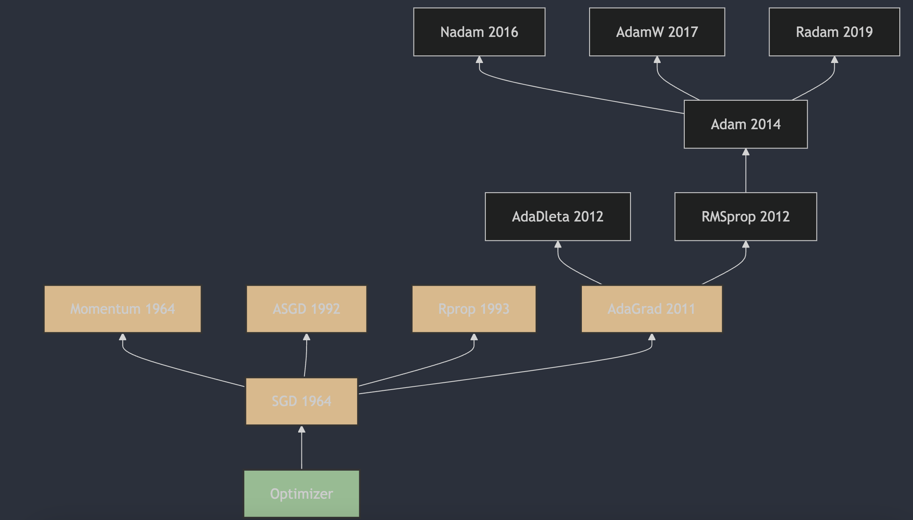

每天3分钟，彻底弄懂神经网络的优化器（六）AdaGrad

## 1. AdaGrad算法的提出
AdaGrad（Adaptive Gradient Algorithm）是由 John Duchi, Elad Hazan, 和 Yoram Singer 提出的。这个算法在2011年的论文《Adaptive Subgradient Methods for Online Learning and Stochastic Optimization》[1](#refer-anchor-6) 中被详细描述，并发表在了《Journal of Machine Learning Research》上。AdaGrad算法的主要特点是为每个参数独立地调整学习率，使得不频繁更新的参数可以获得更大的学习率，而频繁更新的参数则获得较小的学习率。这种自适应调整学习率的方法特别适合处理稀疏数据，因为它能够对稀疏特征给予更多的关注。然而，AdaGrad也有其缺点，主要是在学习过程中累积的平方梯度和会导致学习率变得过小，从而在训练后期几乎停止学习。为了解决这个问题，后续研究者提出了AdaGrad的变种，如AdaDelta和Adam等。

## 2. AdaGrad算法的原理

1. **初始化**：为每个参数 $\theta_i$ 初始化梯度平方和 $\sum g_i^2 = 0$。

2. **梯度计算**：在每次迭代中，计算参数 $\theta_i$ 的梯度 $g_i$。

3. **更新梯度平方和**：
   $\sum g_i^2 = \sum g_i^2 + g_i^2$

4. **计算自适应学习率**：
   $\eta_i = \frac{\eta}{\sqrt{\sum g_i^2} + \epsilon}$
   其中 $\eta$ 是全局学习率，$ \epsilon $ 是一个很小的数（如 $1e-8$），用于防止分母为零。

5. **参数更新**：
   $\theta_i = \theta_i - \eta_i \cdot g_i$

### 参数：

- **$\eta$**：全局学习率，控制初始的学习速度。
- **$\epsilon$**：用于数值稳定性的小常数，防止分母为零。

Adagrad（Adaptive Gradient Algorithm）是一种用于优化大规模机器学习算法的梯度下降算法。它通过为每个参数自适应地调整学习率来解决标准梯度下降算法中的一些限制，特别是在处理稀疏数据时。

## 3.Adagrad的主要特点：

1. **自适应学习率**：Adagrad为每个参数单独设置学习率，这意味着每个参数的学习率可以根据其历史梯度信息进行调整。

2. **处理稀疏数据**：Adagrad特别适合处理稀疏数据，因为它能够为频繁更新的参数减小学习率，为不常更新的参数增大学习率。

3. **不需要手动调整学习率**：Adagrad不需要手动设置学习率，它会自动根据参数的更新历史来调整学习率。

## 4.优点和局限性：

**优点**：
- 自适应学习率，适合处理稀疏数据。
- 不需要手动调整学习率。

**局限性**：
- 学习率递减，可能导致早期停止，特别是在处理非凸问题时。
- 对于非常大的数据集，累积的梯度平方和可能变得非常大，导致学习率过小。

Adagrad是一种有效的优化算法，尤其适用于处理大规模和稀疏数据集。然而，由于其学习率递减的特性，可能需要与其他优化算法（如RMSprop或Adam）结合使用，以克服其局限性。

## 参考
[1] [Adaptive Subgradient Methods for Online Learning and Stochastic Optimization](https://jmlr.org/papers/v12/duchi11a.html)

## 欢迎关注我的GitHub和微信公众号，来不及解释了，快上船！

[GitHub: LLMForEverybody](https://github.com/luhengshiwo/LLMForEverybody)

仓库上有原始的Markdown文件，完全开源，欢迎大家Star和Fork！