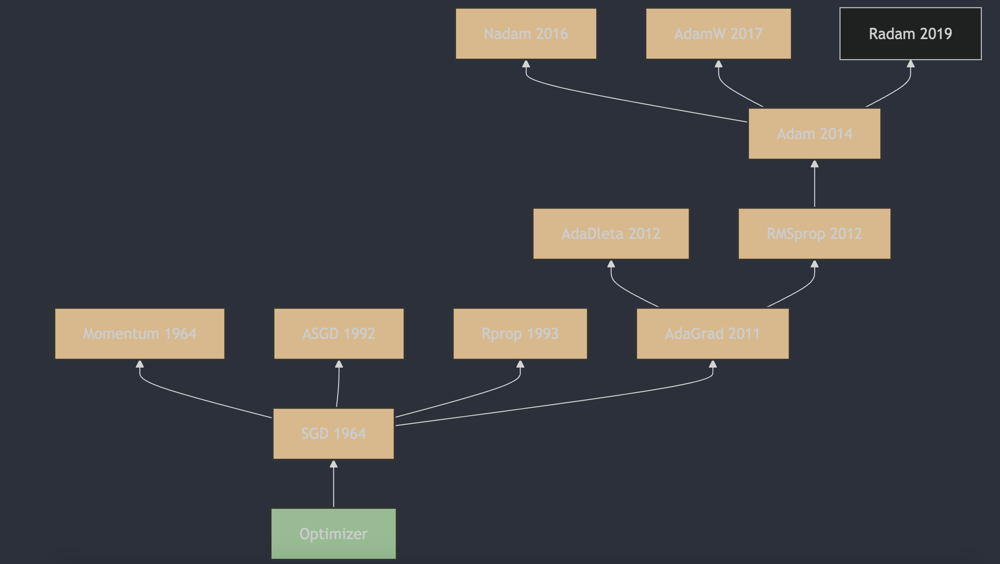

每天3分钟，彻底弄懂神经网络的优化器（十一）AdamW

## 1. AdamW算法的提出
AdamW算法是由Ilya Loshchilov和Frank Hutter提出的。这一算法的详细描述和原理可以在论文《Decoupled Weight Decay Regularization》[1](#refer-anchor-1)中找到，该论文发表于2017年。在论文中，作者指出了传统Adam算法在权重衰减（weight decay）方面的一些问题，并提出了AdamW作为解决方案。AdamW通过将权重衰减从梯度更新中解耦，从而在每次迭代中更有效地应用权重衰减。这种方法在实践中被证明可以提高模型的收敛速度和泛化能力。

## 2. AdamW算法的原理

AdamW优化器是在Adam优化器的基础上进行了改进，主要解决了在Adam中使用权重衰减（Weight Decay）时的问题。在标准的Adam优化器中，权重衰减是直接加到梯度上的，但在AdamW中，权重衰减是以不同的方式应用的，它直接作用在参数更新上。

AdamW的更新公式如下：
1. 初始化一阶矩估计（动量）$m_0$ 和二阶矩估计（梯度平方的移动平均）$v_0$ 为0，以及时间步长 $t=1$ ；

2. 在每次迭代中，计算梯度 $g_t$；

3. 更新一阶矩估计 $m_t$ 和二阶矩估计 $v_t$ ：

   $m_t = \beta_1 \cdot m_{t-1} + (1 - \beta_1) \cdot g_t$

   $v_t = \beta_2 \cdot v_{t-1} + (1 - \beta_2) \cdot g_t^2$
4. 计算偏差修正的一阶矩估计 $\hat{m}_t$ 和二阶矩估计 $\hat{v}_t$：

   $\hat{m}_t = \frac{m_t}{1 - \beta_1^t}$

   $\hat{v}_t = \frac{v_t}{1 - \beta_2^t}$
5. 更新参数 $\theta$，这里 $\lambda$ 是权重衰减系数：

   $\theta_t = \theta_{t-1} - \eta \left( \frac{\hat{m}_t}{\sqrt{\hat{v}_t} + \epsilon} + \lambda \theta_{t-1} \right)$

在AdamW中，权重衰减 $ \lambda $ 是乘以学习率 $ \eta $ 后从参数中减去的，而不是加到梯度上。这种方法被认为可以更好地控制模型的复杂度，防止过拟合，并且在许多情况下可以提高模型的性能。

在实际应用中，选择AdamW或其他优化器通常取决于具体任务的需求以及对算法性能的实验评估.

## 3. AdamW算法的主要特点

AdamW（Adam with Weight Decay）是一种流行的优化算法，它在原始的Adam算法基础上进行了改进，特别是在处理权重衰减（Weight Decay）方面。以下是AdamW的优点和缺点：

### 优点：

1. **改进的权重衰减处理**：AdamW通过将权重衰减应用于参数更新步骤，而不是梯度计算步骤，解决了原始Adam算法在处理权重衰减时的问题。这种方法使得权重衰减的效果更加一致和有效;

2. **减少过拟合**：权重衰减是一种正则化技术，有助于减少模型的过拟合。AdamW通过合理地应用权重衰减，可以提高模型的泛化能力;

3. **保持动量和自适应学习率的优点**：AdamW保留了Adam算法的动量（Momentum）和自适应学习率（AdaGrad）的优点，这有助于加速收敛并适应不同的参数更新需求。

### 缺点：

1. **超参数调整**：AdamW引入了额外的超参数（如权重衰减系数），这可能需要更多的调参工作来找到最优的超参数组合;

2. **对学习率的敏感性**：AdamW对学习率的选择可能比SGD等其他优化器更敏感，不恰当的学习率设置可能导致训练效果不佳。

## 参考

[1] [DECOUPLED WEIGHT DECAY REGULARIZATION](https://arxiv.org/pdf/1711.05101)

## 欢迎关注我的GitHub和微信公众号，来不及解释了，快上船！

[GitHub: LLMForEverybody](https://github.com/luhengshiwo/LLMForEverybody)

仓库上有原始的Markdown文件，完全开源，欢迎大家Star和Fork！