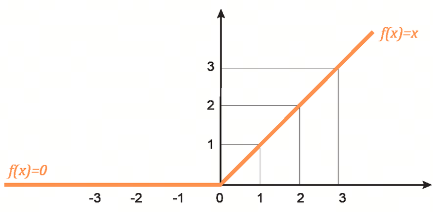
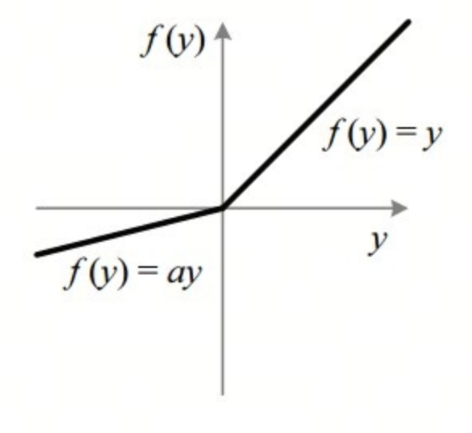
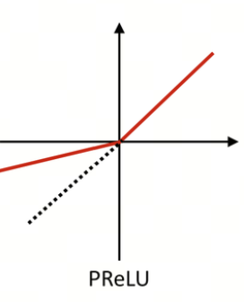

神经网络的激活函数（三）ReLU和它的变种Leaky-ReLU、PReLU

本文我们介绍深度学习的功臣ReLU及其变种，它们在神经网络中的广泛应用，对于提高网络的性能和加速训练具有重要意义。

## 1. ReLU函数

### 1.1 定义

ReLU（Rectified Linear Unit，修正线性单元）激活函数是现代深度学习中最常用的激活函数之一。它的数学表达式为：

$$\text{ReLU}(x) = \max(0, x)$$

### 1.2 关键性质

1. **非线性**：尽管ReLU函数在正区间是线性的，但它引入了非线性特性，使得神经网络能够学习复杂的模式。
2. **稀疏激活**：ReLU函数会将输入的负值部分变为零，这意味着在实际应用中，神经元的激活是稀疏的（即只有部分神经元在激活），这有助于提高模型的效率和性能。
3. **计算简单**：ReLU函数计算简单，只需比较输入值和零的大小，计算量很小，有助于加快训练速度。

### 1.3 提出时间

2010年，由Vinod Nair和 Geoffrey Hinton在他们的论文《Rectified Linear Units Improve Restricted Boltzmann Machines》中展示了ReLU在深度神经网络中的有效性。自此，ReLU成为了深度学习中最流行的激活函数之一。

### 1.4 优缺点

***优点***

1. **计算效率高**：ReLU计算简单，能够显著加快神经网络的训练速度。
2. **梯度消失问题较少**：相比于Sigmoid和Tanh函数，ReLU在正区间的梯度为常数1，有助于缓解梯度消失问题，使得深层网络更容易训练。

***缺点***

1. **Dying ReLU问题**：在训练过程中，某些神经元可能永远不会被激活（即输入始终为负值），导致这些神经元在整个训练过程中都没有贡献。为了解决这个问题，研究人员提出了Leaky ReLU和Parametric ReLU等变体。
2. **不对称性**：ReLU在负区间的输出始终为零，可能导致模型在某些情况下性能下降。

## 2. Leaky ReLU函数
Leaky ReLU（Leaky Rectified Linear Unit，带泄漏的修正线性单元）是ReLU激活函数的一种变体，它旨在解决ReLU的“Dying ReLU”问题。Dying ReLU问题是指在训练过程中，某些神经元可能永远不会被激活（即输入始终为负值），导致这些神经元在整个训练过程中都没有贡献。

### 2.1 数学定义

Leaky ReLU的数学表达式为：

$$\text{Leaky ReLU}(x) = \begin{cases} 
x & \text{if } x \geq 0 \\
\alpha x & \text{if } x < 0 
\end{cases}$$

其中，$\alpha$ 是一个小的正数，通常取值在0.01左右。

### 2.2 关键性质

1. **非线性**：与ReLU一样，Leaky ReLU引入了非线性特性，使得神经网络能够学习复杂的模式。
2. **稀疏激活**：尽管Leaky ReLU在负区间不会完全变为零，但它仍然保留了一定的稀疏性，有助于提高模型的效率和性能。
3. **计算简单**：Leaky ReLU的计算也很简单，只需在负区间乘以一个小的常数$\alpha$。
4. **避免Dying ReLU问题**：通过在负区间引入一个小的斜率$\alpha$，Leaky ReLU确保了所有神经元都有梯度，从而避免了Dying ReLU问题。

### 2.3提出时间

2013年,Leaky ReLU首次出现在论文《Rectifier Nonlinearities Improve Neural Network Acoustic Models》中，该论文由Andrew L. Maas、Awni Y. Hannun和Andrew Y. Ng撰写.

## PRReLU函数

PReLU（Parametric Rectified Linear Unit，参数化修正线性单元）是ReLU激活函数的另一种变体，它通过引入一个可学习的参数来控制负区间的斜率。PReLU旨在进一步改进ReLU及其变体（如Leaky ReLU）的性能。

### 3.1 数学定义

PReLU的数学表达式为：

$$\text{PReLU}(x) = \begin{cases} 
x & \text{if } x \geq 0 \\
\alpha x & \text{if } x < 0 
\end{cases}$$

其中，$\alpha$ 是一个可学习的参数，而不是一个固定的常数。

### 3.2 关键性质

1. **非线性**：与ReLU和Leaky ReLU一样，PReLU引入了非线性特性，使得神经网络能够学习复杂的模式。
2. **稀疏激活**：尽管PReLU在负区间不会完全变为零，但它仍然保留了一定的稀疏性，有助于提高模型的效率和性能。
3. **可学习参数**：PReLU的最大特点是负区间的斜率$\alpha$是可学习的，这意味着模型可以根据数据自动调整这一参数，从而在训练过程中找到最优的负区间斜率。
4. **避免Dying ReLU问题**：通过引入可学习的斜率参数$\alpha$，PReLU确保了所有神经元都有梯度，从而有效地避免了Dying ReLU问题。

### 3.3 提出时间

PReLU是由何凯明（Kaiming He）、张翔（Xiangyu Zhang）、任少卿（Shaoqing Ren）和孙剑（Jian Sun）在2015年的论文《Delving Deep into Rectifiers: Surpassing Human-Level Performance on ImageNet Classification》中提出的。

## 参考

[1] [Rectified Linear Units Improve Restricted Boltzmann Machines](https://www.cs.toronto.edu/~hinton/absps/reluICML.pdf)

[2] [Rectifier Nonlinearities Improve Neural Network Acoustic Models](http://robotics.stanford.edu/~amaas/papers/relu_hybrid_icml2013_final.pdf)

[3] [Delving Deep into Rectifiers: Surpassing Human-Level Performance on ImageNet Classification](https://arxiv.org/abs/1502.01852)

## 欢迎关注我的GitHub和微信公众号[真-忒修斯之船]，来不及解释了，快上船！

[GitHub: LLMForEverybody](https://github.com/luhengshiwo/LLMForEverybody)

仓库上有原始的Markdown文件，完全开源，欢迎大家Star和Fork！