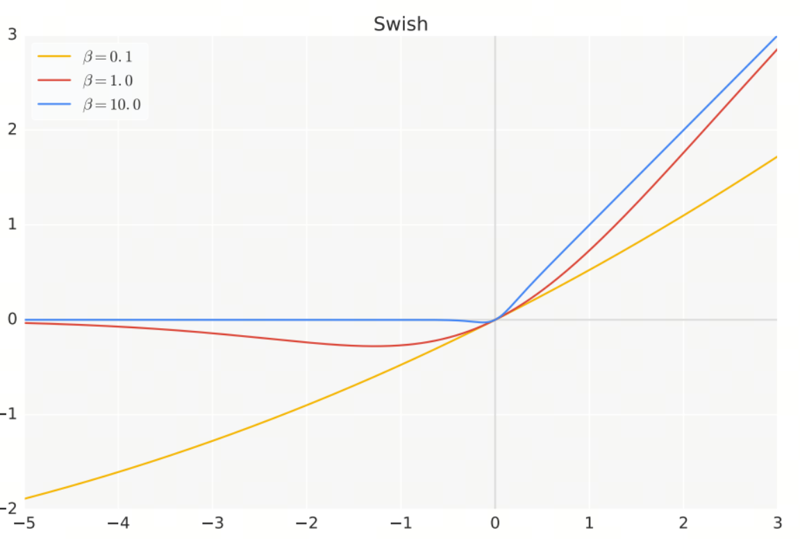

神经网络的激活函数（五）门控系列GLU、Swish和SwiGLU

## 1. GLU函数


GLU（Gated Linear Unit，门控线性单元）是一种在深度学习中用于增强模型表现的激活函数。GLU通过引入门控机制，使得模型能够选择性地通过信息，从而提高模型的表达能力和性能。

### 1.1 数学定义

GLU函数的数学表达式为：

$$\text{GLU}(x) = (X ∗ W + b) ⊗ σ(X ∗ V + c)$$
其中 ⊗ 表示逐元素乘法，$X$ 是输入，$W$ 和 $V$ 是权重矩阵，$b$ 和 $c$ 是偏置项。

### 1.2 关键性质

1. **门控机制**：GLU通过引入门控机制，使得模型能够选择性地通过信息，从而提高模型的表达能力。
2. **非线性**：GLU结合了线性变换和非线性激活，使得模型能够学习复杂的模式。
3. **信息过滤**：通过门控机制，GLU能够过滤掉不重要的信息，从而增强模型的表现。

### 1.3 提出时间

GLU激活函数是在2017年由Yann Dauphin等人在论文《Language Modeling with Gated Convolutional Networks》中提出的。

### 1.4 解决的问题

1. **信息选择性**：GLU通过门控机制，使得模型能够选择性地通过信息，从而提高模型的表达能力。
2. **非线性增强**：GLU结合了线性变换和非线性激活，从而增强了模型的非线性特性。
3. **提高模型性能**：GLU在许多任务中表现出色，特别是在自然语言处理（NLP）和序列建模任务中。


### 1.5 示例

以下是一个简单的Python示例，展示如何计算GLU函数：

```python
import numpy as np
def glu(x):
    """GLU 激活函数

    参数:
    x -- 输入数组，维度必须是偶数

    返回:
    GLU 激活后的数组
    """
    assert x.shape[-1] % 2 == 0, "输入数组的最后一个维度必须是偶数"
    half_dim = x.shape[-1] // 2
    return x[..., :half_dim] * sigmoid(x[..., half_dim:])

def sigmoid(x):
    """Sigmoid 函数

    参数:
    x -- 输入值

    返回:
    Sigmoid 函数的输出值
    """
    return 1 / (1 + np.exp(-x))
```

## 2. Swish函数



Swish激活函数是一种在深度学习中广泛应用的激活函数，由Google Brain团队提出。Swish函数通过引入一个可学习的参数，使得激活函数在训练过程中能够自适应地调整，从而提高模型的性能。

### 数学定义

Swish函数的数学表达式为：

$$\text{Swish}(x) = x \cdot \sigma(\beta x)$$

其中：
- $x$ 是输入。
- $\sigma$ 是Sigmoid函数，定义为 $\sigma(x) = \frac{1}{1 + e^{-x}}$。
- $\beta$ 是一个可学习的参数，控制函数的形状。

在大多数情况下，$\beta$ 被设置为1，从而简化为：

$$\text{Swish}(x) = x \cdot \sigma(x)$$

### 关键性质

1. **平滑性**：Swish函数是连续且平滑的，这有助于提高模型的稳定性和收敛速度。
2. **非单调性**：Swish函数是非单调的，这意味着它在某些区间内是递增的，而在其他区间内是递减的。这种特性使得Swish能够捕捉到更复杂的模式。
3. **可学习性**：通过引入可学习参数$\beta$，Swish函数能够在训练过程中自适应地调整，从而提高模型性能。
4. **近似ReLU**：当$\beta$趋向于无穷大时，Swish函数近似于ReLU函数；当$\beta$趋向于0时，Swish函数近似于线性函数。

### 提出时间

Swish激活函数是在2017年由Google Brain团队在论文《Searching for Activation Functions》中提出的。

### 解决的问题

1. **平滑激活**：Swish通过引入Sigmoid函数，使得激活函数在输入的正负区间内都具有平滑性，从而提高模型的稳定性。
2. **非单调性**：Swish的非单调性使得它能够捕捉到更复杂的模式，比ReLU等单调激活函数更具表现力。
3. **可学习性**：Swish通过引入可学习参数$\beta$，使得激活函数能够自适应地调整，从而提高模型性能。


### 示例

以下是一个简单的Python示例，展示如何计算Swish函数：

```python
import numpy as np
def swish(x,beta=1.0):
    """Swish 激活函数

    参数:
    x -- 输入值

    返回:
    Swish 激活后的值
    """
    return x * sigmoid(beta*x)

def sigmoid(x):
    """Sigmoid 函数

    参数:
    x -- 输入值

    返回:
    Sigmoid 函数的输出值
    """
    return 1 / (1 + np.exp(-x))
```

## 3. SwiGLU函数

SwiGLU（Swish-Gated Linear Unit）是一种结合了Swish和GLU（Gated Linear Unit）特点的激活函数，旨在提高深度学习模型的性能。SwiGLU通过引入门控机制和Swish激活函数，使得模型能够更有效地选择性通过信息，从而增强模型的表达能力和性能。

### 3.1 数学定义

SwiGLU函数的数学表达式为：

$$\text{SwiGLU}(a, b) = \text{Swish}(a) \otimes \sigma(b)$$

其中：
- $a$ 和 $b$ 是输入张量。
- $\text{Swish}(x) = x \cdot \sigma(x)$ 是Swish激活函数。
- $\sigma(x) = \frac{1}{1 + e^{-x}}$ 是Sigmoid激活函数。
- $\otimes$ 表示逐元素乘法（Hadamard乘积）。

### 3.2 关键性质

1. **门控机制**：SwiGLU通过引入门控机制，使得模型能够选择性地通过信息，从而提高模型的表达能力。
2. **平滑性**：Swish函数的平滑性有助于提高模型的稳定性和收敛速度。
3. **非单调性**：Swish函数的非单调性使得SwiGLU能够捕捉到更复杂的模式。
4. **信息过滤**：通过门控机制，SwiGLU能够过滤掉不重要的信息，从而增强模型的表现。

### 3.3 提出时间

SwiGLU激活函数是在2021年由DeepMind团队在论文《Scaling Vision Transformers》中提出的。

### 3.4 解决的问题

1. **信息选择性**：SwiGLU通过门控机制，使得模型能够选择性地通过信息，从而提高模型的表达能力。
2. **平滑激活**：Swish通过引入Sigmoid函数，使得激活函数在输入的正负区间内都具有平滑性，从而提高模型的稳定性。
3. **非单调性**：Swish的非单调性使得SwiGLU能够捕捉到更复杂的模式，比ReLU等单调激活函数更具表现力。

### 3.5 示例

以下是一个简单的Python示例，展示如何计算SwiGLU函数：
$$ f(X) = (X ∗ W + b) ⊗ Swish(X ∗ V + c) $$

```python
import numpy as np
def SwiGLU(x):
    """SwiGLU 激活函数

    参数:
    x -- 输入数组，维度必须是偶数

    返回:
    SwiGLU 激活后的数组
    """
    assert x.shape[-1] % 2 == 0, "输入数组的最后一个维度必须是偶数"
    half_dim = x.shape[-1] // 2
    return x[..., :half_dim] * swish(x[..., half_dim:])

def swish(x,beta=1.0):
    """Swish 激活函数

    参数:
    x -- 输入值

    返回:
    Swish 激活后的值
    """
    return x * sigmoid(beta*x)

def sigmoid(x):
    """Sigmoid 函数

    参数:
    x -- 输入值

    返回:
    Sigmoid 函数的输出值
    """
    return 1 / (1 + np.exp(-x))

```

### 总结

SwiGLU激活函数结合了Swish和GLU的优点，通过引入门控机制和平滑非单调特性，解决了ReLU等激活函数的一些固有问题。SwiGLU在许多深度学习任务中表现出色，特别是在计算机视觉和自然语言处理任务中。它通过门控机制和平滑激活，使得模型能够更快地收敛并达到更高的性能。


## 参考

[1] [Language Modeling with Gated Convolutional Networks](https://arxiv.org/abs/1612.08083)


[2] [Searching for Activation Functions](https://arxiv.org/abs/1710.05941)

[3] [Scaling Vision Transformers](https://arxiv.org/abs/2106.04560)

## 欢迎关注我的GitHub和微信公众号[真-忒修斯之船]，来不及解释了，快上船！

[GitHub: LLMForEverybody](https://github.com/luhengshiwo/LLMForEverybody)

仓库上有原始的Markdown文件，完全开源，欢迎大家Star和Fork！