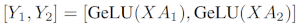
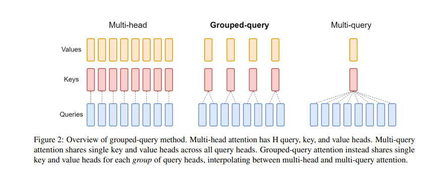

# 为什么用layernorm而不是batchnorm

## 1. Norm(Normalization)

首先，LayerNorm和BatchNorm的Norm是Normalization的缩写,不是Norm-范数。

Normalization在统计学中一般翻译为归一化，还有类似的是Standardization，一般翻译成标准化。这两个概念有什么区别呢？

归一化是将数据缩放到0-1之间，标准化是将数据缩放到均值为0，方差为1的正态分布。


有时候Normalization和Standardization会混淆，注意看清楚即可，不纠结细节。

## 2. BatchNorm

BatchNorm,（Batch Normalization），批归一化，旨在提高神经网络的训练速度、稳定性和性能。它由 Sergey Ioffe 和 Christian Szegedy 于 2015 年提出。BatchNorm 主要解决的问题是在训练深度神经网络时出现的内部协变量偏移（Internal Covariate Shift），即网络中各层输入数据分布的变化。

内部协变量偏移是指，随着网络层次的加深，**每一层的输入数据（即前一层的输出）的分布可能会发生变化，这可能会导致训练过程中的梯度问题，比如梯度消失或梯度爆炸**，从而影响网络的收敛速度和稳定性。


BatchNorm 的工作原理如下：

- 归一化：在训练过程中，BatchNorm 对每个小批量（mini-batch）的数据进行归一化处理，即计算该批量数据的均值和方差，并使用这些统计量将数据标准化，使得数据的均值为 0，方差为 1。

- 缩放和偏移：归一化后的数据会经过两个可学习的参数，即缩放因子（gamma）和偏移因子（beta），这两个参数允许网络在训练过程中学习到最佳的归一化方式。

- 应用：BatchNorm 通常在神经网络的层之间应用，特别是在卷积层或全连接层之后，激活函数之前。


在传统机器学习中，我们也经常会用到类似的方法：将某一个特征（batch维度）的数据归一化或者标准化来提高模型的泛化能力


## 3. LayerNorm

Layer Normalization（层归一化，简称LayerNorm）是一种在深度学习中用于稳定神经网络训练和提高性能的技术。它是由 Jimmy Lei Ba、Jamie Ryan Kiros、Geoffrey E. Hinton 在 2016 年提出的。LayerNorm 与 Batch Normalization 类似，都旨在减少内部协变量偏移，但它们在归一化的具体实现上有所不同。

LayerNorm 的主要思想是**对神经网络的每一层（而不是每一个小批量）进行归一化处理**。具体来说，LayerNorm 会计算单个样本在其所在层的所有激活值的均值和方差，并使用这些统计量来归一化该样本的激活值。这种方法不依赖于小批量统计量，因此可以减少 BatchNorm 中的噪声问题，并允许网络使用更小的小批量大小进行训练。


LayerNorm 的工作原理如下：

- 归一化：对于网络中的每一层，LayerNorm 会计算该层所有激活值的均值和方差。然后，使用这些统计量将激活值归一化，使得每个样本的激活值的均值为 0，方差为 1。

- 缩放和偏移：与 BatchNorm 类似，归一化后的数据会经过两个可学习的参数，即缩放因子（gamma）和偏移因子（beta），这两个参数允许网络在训练过程中学习到最佳的归一化方式。

- 应用：LayerNorm 可以应用于神经网络的任何层，包括卷积层和循环层，通常放在激活函数之前。


## 4. 为什么Transformer中使用LayerNorm而不是BatchNorm

Normalization技术旨在应对内部协变量偏移问题，它的核心在于将数据调整到一个统一的标准，以便进行有效的比较和处理。

为了实现这一目标，***我们需要确保参与归一化的数据点在本质上是可比的。***(记住这句话就可以了)

- **Batch Normalization（BatchNorm）**：这是一种对整个批次数据进行归一化的方法。具体来说，BatchNorm关注的是批次中**每一列的数据，这些数据代表了不同样本的同一个特征**。因为这些特征在统计上是相关的，所以它们可以被合理地放在一起进行归一化处理。这就像是在同一个班级里，比较不同学生的同一科目成绩，因为这些成绩都在相同的评分标准下，所以可以直接比较。

- **Layer Normalization（LayerNorm）**：与BatchNorm不同，LayerNorm适用于那些在不同样本之间难以直接比较的情况，如Transformer中的自注意力机制。在这些模型中，每个位置上的数据代表了不同的特征，因此直接归一化可能会失去意义。LayerNorm的解决方案是**对每个样本的所有特征进行单独归一化**，而不是基于整个批次。这就像是评估每个学生在所有科目中的表现，而不是仅仅关注单一科目，这样可以更全面地理解每个学生的整体表现。


https://www.pinecone.io/learn/batch-layer-normalization/)


# 什么是多模态大模型

## 1. 什么是多模态 Multimodality

多模态（Multimodality）是指集成和处理两种或两种以上不同类型的信息或数据的方法和技术。在机器学习和人工智能领域，多模态涉及的数据类型通常包括但不限于文本、图像、视频、音频和传感器数据。多模态系统的目的是利用来自多种模态的信息来提高任务的性能，提供更丰富的用户体验，或者获得更全面的数据分析结果。


## 2. Multimodal Large Language Models 为什么还是Language Models？

多模态大型语言模型（Multimodal Large Language Models，简称MLLMs）是一类结合了大型语言模型（Large Language Models，简称LLMs）的自然语言处理能力与对其他模态（如视觉、音频等）数据的理解与生成能力的模型。这些模型通过整合文本、图像、声音等多种类型的输入和输出，提供更加丰富和自然的交互体验。

MLLMs的核心优势在于它们能够处理和理解来自不同模态的信息，并将这些信息融合以完成复杂的任务。例如，MLLMs可以分析一张图片并生成描述性的文本，或者根据文本描述生成相应的图像。这种跨模态的理解和生成能力，使得MLLMs在多个领域，如自动驾驶、智能助理、内容推荐系统、教育和培训等，都有广泛的应用前景


上图中，我们可以看到MLLMs的核心组成部分，包括：

- **Modality Encoder**：负责将不同模态的输入数据编码为模型可理解的表示；
- **Input Projector**：将不同模态的输入数据映射到共享的语义空间；
- **LLMs**：大型语言模型，用于处理文本数据；
- **Output Projector**：将模型生成的输出映射回原始模态的空间；
- **Modality Generator**：根据输入数据生成对应的输出数据

可以看到**LLMs还是处于核心位置，多模态是在LLMs的基础上进行扩展的**。扩展的方式是找到一个方法将不同模态的数据映射到LLMs可以接收的语义空间。接下来我们分别看看这几个组成部分的具体内容。


## 3. Modality Encoder 模态编码器

模态编码器（Modality Encoder）是多模态大模型中的一个关键组件，它的主要任务是将不同模态的输入数据转换成模型能够进一步处理的特征表示。这些输入数据可以包括图像、文本、音频、视频等多种形式，而模态编码器的作用就像是翻译官，将这些不同语言（模态）的信息转换成一种共同的“语言”，以便模型能够理解和处理。

在多模态大模型中，常见的模态编码器包括：

- 图像编码器：负责处理视觉信息，将图像数据转换成特征向量。常用的图像编码器包括NFNet、ViT（Vision Transformer）、CLIP ViT等。


- 音频编码器：处理声音数据，将音频信号转换成频域表示，如使用傅里叶变换或梅尔频率倒谱系数（MFCCs）。音频编码器可以帮助模型识别语音、音乐或其他声音特征。在多模态模型中，主流的音频编码器包括Whisper、CLAP等。

- 视频编码器：更为复杂，需要同时处理图像和时间序列数据。视频编码器不仅需要提取每一帧的视觉特征，还需要理解帧与帧之间的时间变化，例如运动信息。视频编码器可能会使用类似于图像编码器的技术来处理每一帧，同时还会使用额外的技术来处理帧与帧之间的关系，如ViViT、VideoPrism等。

模态编码器的设计对于多模态大模型的性能至关重要，因为它们直接影响到模型能否准确地理解和生成跨模态的内容。通过高效的模态编码器，多模态大模型能够在各种复杂的任务中展现出更加强大和灵活的能力。

## 4. Input Projector 输入投影器

输入投影器（Input Projector, IP）是多模态大模型中的一种关键组件，它的主要作用是将不同模态的编码特征投影到一个共同的特征空间，以便这些特征可以被模型的其他部分，如大型语言模型（LLM Backbone）统一处理和理解。

在多模态大模型中，不同类型的输入数据，如图像、文本、音频等，首先会被相应的模态编码器（Modality Encoder, ME）处理，转换成特征表示。然而，这些特征可能存在于不同维度的空间中，直接将它们混合使用会遇到兼容性问题。输入投影器的作用就是解决这个问题，它通过特定的变换方法（如线性变换、多层感知器（MLP）、交叉注意力等），将不同模态的特征映射到一个统一的特征空间中。


输入投影器的设计对于多模态大模型的性能至关重要，因为它直接影响到模型如何处理和理解不同类型数据的语义信息。通过有效的输入投影，模型能够更好地进行跨模态的信息融合和任务执行，例如在图像描述生成、视觉问答等应用中。


## 5. Output Projector 输出投影器

输出投影器（Output Projector, OP）是多模态大模型中的一种关键组件，它的主要任务是将大型语言模型（LLM）的输出信号转换成适合不同模态生成器使用的特征表示。这些生成器可能是用于生成图像、视频、音频或其他模态的模型。

在多模态大模型中，LLM 负责处理和理解各种模态的输入特征，并生成对应的输出。然而，LLM 的输出通常是文本形式的，而其他模态的生成器需要特定格式的输入信号。这时，输出投影器就起到了桥梁的作用，它将 LLM 的文本输出转换为其他模态生成器能够理解和处理的特征表示。

输出投影器的实现可以采用多种技术，包括但不限于 Tiny Transformer、多层感知器（MLP）等。这些技术通过学习将 LLM 的输出映射到目标模态的特征空间，从而实现跨模态的特征转换。通过输出投影器的设计，多模态大模型能够更好地实现不同模态之间的信息交互和生成任务。

例如，在 NExT-GPT 模型中，输出投影器包括图像输出投影、音频输出投影和视频输出投影，它们共同构成了所谓的“指令跟随对齐”（Instruction-following Alignment）机制。这一机制确保了模型能够根据 LLM 的输出在多种模态之间进行无缝转换和高效生成，从而实现多模态内容的生成.


## 6. Modality Generator 模态生成器

模态生成器（Modality Generator, MG）是多模态学习系统中的一个关键组件，它的主要作用是生成不同模态的输出，例如图像、视频或音频。

模态生成器的具体实现可能包括但不限于以下几种技术或模型：

- 图像生成：如 Stable Diffusion，这是一种基于扩散模型的图像生成技术;
- 视频生成：如 Zeroscope，专注于视频内容的生成;
- 音频生成：如 AudioLDM，用于生成音频信号。

在多模态大模型中，模态生成器是实现模态转换和内容生成的关键技术，它使得模型能够灵活地处理和生成多种类型的数据，为用户提供更加丰富和自然的交互体验。


## 参考

<div id="refer-anchor-1"></div>

[1] [A Survey on Multimodal Large Language Models](https://arxiv.org/abs/2306.13549)

[2] [MM-LLMs: Recent Advances in MultiModal Large Language Models](https://arxiv.org/abs/2401.13601)

[3] [NExT-GPT: Any-to-Any Multimodal Large Language Model](https://next-gpt.github.io/)


# FlashAttention v1和v2区别

FlashAttention V2在减少计算量和内存访问的同时，保持了算法的精度和效率，实现了更快的Attention计算。这些优化使得V2版本在A100 GPU上前向传播的速度提升了大约2倍，达到了理论计算峰值的50%-73%。

## 1. FlashAttention v1

> $Attention(Q, K, V) = softmax(\frac{QK^T}{\sqrt{d_k}})V$

FlashAttention不需要在全局内存上实现 X 和 A 矩阵，而是将上述公式中的整个计算融合到单个 CUDA 内核中。这要求我们设计一种算法来仔细管理片上内存(on-chip memory)（如流算法），因为 NVIDIA GPU 的共享内存(SRAM)很小。

对于矩阵乘法等经典算法，使用平铺(tiling)来确保片上内存不超过硬件限制。这种平铺方法是有效的原因是：加法是关联的，允许将整个矩阵乘法分解为许多平铺矩阵乘法的总和。


## 2. FlashAttention v2的更新


- 减少了non-matmul FLOPs的数量（消除了原先频繁rescale）。虽然non-matmul FLOPs仅占总FLOPs的一小部分，但它们的执行时间较长，这是因为GPU有专用的矩阵乘法计算单元，其吞吐量高达非矩阵乘法吞吐量的16倍。因此，减少non-matmul FLOPs并尽可能多地执行matmul FLOPs非常重要。

- 提出了在序列长度维度上并行化。该方法在输入序列很长（此时batch size通常很小）的情况下增加了GPU利用率。即使对于单个head，也在不同的thread block之间进行并行计算。

- 在一个attention计算块内，将工作分配在一个thread block的不同warp上，以减少通信和共享内存读/写。

## 3. 第一个更新详解

减少了non-matmul FLOPs的数量（消除了原先频繁rescale）。虽然non-matmul FLOPs仅占总FLOPs的一小部分，但它们的执行时间较长，这是因为GPU有专用的矩阵乘法计算单元，其吞吐量高达非矩阵乘法吞吐量的16倍。因此，减少non-matmul FLOPs并尽可能多地执行matmul FLOPs非常重要。

### non-matmul vs. GEMM

***non matrix multiply***

非矩阵乘法：指的是在矩阵乘法之外的操作，如加法、乘法、除法等, 例如`rescale`操作，使用的是GPU的通用硬件：CUDA Core.

***General Matrix Multiply***

通用矩阵乘法：指的是矩阵乘法的一种实现方式，使用的是GPU的专用硬件：Tensor Core.

### CUDA Core vs. Tensor Core

非矩阵乘法操作的执行时间较长，因为GPU有专用的矩阵乘法计算单元Tensor Core，其吞吐量高达非矩阵乘法吞吐量的16倍。
下图是A100的介绍，可以看到CUDA Core单精度TF16的计算能力是19.5TFLOPS，而Tensor Core的计算能力是312TFLOPS，相差16倍之多。


### Rescale操作


V2版本调整了算法，减少了非矩阵乘法操作的浮点运算次数，同时保持输出不变。在原始的FlashAttention（即V1版本）中，每个block的每次迭代都需要执行rescale操作，这涉及到除法运算。

而在V2中，这种rescale操作被延后到循环的最后才执行一次，每次计算可以减少一次除法运算。这样的调整是因为只要每次迭代确保分子部分被scale为正确值以及分母部分计算正确即可。这种优化减少了计算量，提高了效率


## 4. 第二个更新详解

提出了**在序列长度维度上并行化。该方法在输入序列很长（此时batch size通常很小）的情况下增加了GPU利用率**。即使对于单个head，也在不同的thread block之间进行并行计算。

### GPU硬件

  - Streaming Processor（SP）：是最基本的处理单元，从fermi架构开始被叫做CUDA core。
  - Streaming MultiProcessor（SM）：一个SM由多个CUDA core（SP）组成，每个SM在不同GPU架构上有不同数量的CUDA core，例如Pascal架构中一个SM有128个CUDA core。

### GPU软件

  - thread：一个CUDA并行程序由多个thread来执行，thread是最基本的执行单元（the basic unit of execution）；
  - warp：一个warp通常包含32个thread。每个warp中的thread可以同时执行相同的指令，从而实现SIMT（单指令多线程）并行。warp是SM中最小的调度单位（the smallest scheduling unit on an SM），一个SM可以同时处理多个warp；
  - thread block：一个thread block可以包含多个warp，同一个block中的thread可以同步，也可以通过shared memory进行通信。thread block是GPU执行的最小单位（the smallest unit of execution on the GPU）。一个warp中的threads必然在同一个block中，如果block所含thread数量不是warp大小的整数倍，那么多出的那个warp中会剩余一些inactive的thread。也就是说，即使warp的thread数量不足，硬件也会为warp凑足thread，只不过这些thread是inactive状态，但也会消耗SM资源。

V2 相对于 V1 的第二个主要更新是增加了序列长度维度的并行计算，这样做的目的是提高 GPU 的 SM（Streaming Multiprocessor）利用率，尤其是在处理长序列数据时。在 V1 中，计算是先按批次和头数并行执行，然后在序列长度上串行执行。这意味着当序列长度较长时，可能无法充分利用所有可用的 SM，因为每个 block 只能处理序列的一个片段。

在 V2 中，通过在序列长度维度上进行并行化，可以更有效地分配计算任务到更多的 block，从而更充分地利用 GPU 资源。具体来说，V2 通过增加 num_m_block 的概念，将 Q 矩阵在序列长度方向上进一步划分为多个小块，每一块由不同的 block 来处理。这样，每个 block 可以独立地计算它所负责的输出部分，减少了不同 block 之间的依赖和通信开销。

> 这边有点像continous batching的思路

## 5. 第三个更新详解


在V2中，通过**调整循环顺序，将Q作为外循环，K和V作为内循环**，每个线程块（thread block）负责计算输出矩阵O的一部分。这种设计允许每个线程块独立进行计算，减少了线程块之间的依赖和通信需求。同时，V2版本在前向传播中进一步减少了非矩阵乘法操作的浮点运算，以充分利用GPU上的专用计算单元，如Nvidia GPU上的Tensor Cores，从而最大化GPU的吞吐量。
此外，V2版本在反向传播中也进行了优化，采用了类似的分块策略来优化计算和内存访问，提高效率和性能。通过这种方式，FlashAttention V2能够实现更高的并行性，减少不必要的计算和内存访问，从而提升整体的计算性能。

## 参考

<div id="refer-anchor-1"></div>

[1] [FlashAttention: Fast and Memory-Efficient Exact Attention with IO-Awareness](https://arxiv.org/abs/2205.14135)

[2] [FlashAttention-2: Faster Attention with Better Parallelism and Work Partitioning](https://arxiv.org/abs/2307.08691)

[3] [FlashAttention2详解（性能比FlashAttention提升200%](https://cloud.tencent.com/developer/article/2353093)

[4] [GitHub: LLMForEverybody](https://github.com/luhengshiwo/LLMForEverybody)


# RoPE

## 欧拉公式和欧拉恒等式

> ### 欧拉的贡献
>
> 莱昂哈德·欧拉（1707年4月15日—1783年9月18日），瑞士数学家、物理学家、天文学家、地理学家、逻辑学家和工程师。近代数学先驱之一。
>
> 欧拉在包括微积分和图论在内的多个数学领域都做出过重大贡献。他引进和推广了许多数学术语和书写格式，并一直沿用至今，例如：
>
> - 函数的记法 $f(x)$ ；
> - 虚数单位 $\sqrt {-1}$ 的记法 $i$；
> - 圆周率的记法 $\pi$ ；
> - 求和符号 $\Sigma$ ；
> - 差分符号 $\Delta$ ;
> - 用小写字母表示三角形的边和用大写字母表示三角形的角等；
> - 给出了自然对数的底数$e$定义，其也称为欧拉数(Euler's number)；
> - 此外，他还在力学、流体动力学、光学、天文学和乐理领域有突出的贡献。
>
> 欧拉是18世纪杰出的数学家，同时也是有史以来最伟大的数学家之一。他也是一位多产作者，其学术著作有60-80册。
>
> 欧拉逝世后，几位著名的数学家高度评价他对数学的贡献，例如法国数学家***皮埃尔-西蒙·拉普拉斯***曾这样评价欧拉对于数学的贡献：“读欧拉的著作吧，在任何意义上，他都是我们的大师”。
>
> 德国数学家***卡尔·弗里德里希·高斯***曾写道：“对欧拉所有的著作的研究将永远是数学各个领域最好的学习之所，没有任何其他东西可以取代它”。

***欧拉公式***（Euler's formula）是复分析领域的公式，它将三角函数与复指数函数关联起来，因其提出者莱昂哈德·欧拉而得名。欧拉公式提出，对任意实数 x，都存在：
$$
e^{ix} = \cos(x) + i\sin(x)
$$
其中 e是自然对数的底数，i是虚数单位，而 cos和 sin则是余弦、正弦对应的三角函数，参数 x则以弧度为单位。

这是一个非常美丽的公式，它将三角函数，指数函数，复数联系在了一起，是数学中的一颗明珠。

***欧拉恒等式***（Euler's identity）是欧拉公式的一个特例，当 x = π 时，欧拉公式变为：
$$
e^{i\pi} + 1 = 0
$$
这个公式被认为是数学中最美丽的公式之一，它将五个最重要的数学常数联系在了一起：0、1、e、i和π。

>非常感谢**苏剑林**大神将这么漂亮公式引入到了位置编码的设计中，大家可以关注他的博客《科学空间》https://kexue.fm/, 可以学到很多东西。

## 预备知识

为了看懂RoPE，我们需要了解一些预备知识，包括：
1）欧拉公式
2）复数/复平面
3）三角函数的几个公式

***重要！！！***   在你深入大量公式之前，先要了解：

- 复平面和欧拉公式的引入，只是为了简化计算过程；
- 欧拉公式经常在数学、物理和工程领域被如此广泛应用；
- 整个证明过程，先考虑词向量为二维，再利用矩阵的特性轻松拓展到多维；
- 在证明二维场景的时候，引入复平面，原因是可以这样可以使用欧拉公式获取漂亮的数学特性，来简化过程。


## 旋转位置编码RoPE 

**Rotation Position Encoding**

RoPE提出为了能利用上 token 之间的相对位置信息，假定 query 向量$q_m$  和 key 向量  $k_n$之间的内积操作可以被一个函数$g$表示，该函数$g$的输入是词嵌入向量$x_m$，$x_n$ 和它们之间的相对位置$m-n$：


大胆假设，小心求证。 现在我们的目标就是找到一个合适的函数$g$，使得$g(x_m, x_n, m-n)$能够捕捉到词向量之间的相对位置信息。

RoPE提出，在词向量是二维的情况下，将平面转化为复平面，如果我们按照如下的方式定义函数$f$，则可以找到对应的$g$


$Re$指的是复数的实数部分，更近一步，我们可以将函数$f$定义为：


这边，不就是原来的query矩阵乘上了一个旋转矩阵吗？也就是说，加上$m$这个位置信息后，如果使用RoPE的设计方案，就相当于将原query矩阵进行了旋转。这就是**旋转**的由来。

同理，$f_K$可以表示为：


那么，对应的$g$函数就是：


## 从二维到多维

在二维场景下，我们引入了复平面，是为了使用欧拉公式获取漂亮的数学特性，来简化过程。但是在多维场景下，我们可以直接使用矩阵的特性，来简化过程。将2维的RoPE推广到多维的RoPE，只需要将2维的RoPE的旋转矩阵$R$替换为多维的旋转矩阵$R$即可。


因为内积满足线性叠加性质，所以任意***偶数维***的RoPE都可以表示为二维情形拼接而成的形式。


即是在原来的$q*k$矩阵的基础上，加上了一个旋转矩阵$R^d_{\theta,m}$，这就是RoPE的设计思路。

在原始paper中，有一个直观的图


## RoPE的证明

注意，现在的证明是建立在二维的基础上，二维可以用上一节的矩阵特性推广到多维。
二维的情况下，形式上我们将其转化为复平面。

按照RoPE的设计，编码后的$q,v$和内积$<q,v>$的形式是：


为什么上述公式满足：


首先，我们看到欧拉公式
$$
e^{ix} = \cos(x) + i\sin(x)
$$
则有：


我们看query矩阵，可以看到：


其中$W_q$是二维矩阵，$x_m$是二维向量，其乘积是一个二维向量，这边我们用$q_m$表示。$q^{(1)}_m$,$q^{(2)}_m$分别表示第一维和第二维。


我们这时，需要将$q_m$转化为复数形式，即将这个二维平面放到复平面上，复平面的实部是第一维（x轴），虚部是第二维（y轴）。


这时，我们可以将$f_q(x_m,m)$表示为：


这就是两个复数的积（将复数带入）


经过简单的展开：


再重新从复平面回到实数二维平面，我们可以将上述公式表示为：


事实上这就是没有位置信息的query向量乘上了一个旋转矩阵，这就是RoPE的设计思路。


同理，我们可以得到key向量的RoPE形式：


最后，我们可以得到RoPE的内积形式：


## 总结

RoPE非常巧妙的借助复平面和欧拉公式，将位置信息编码到了query和key向量中，使得模型能够利用上token之间的相对位置信息。RoPE的设计思路是将query和key向量进行旋转，这就是旋转的由来。


## 参考

<div id="refer-anchor-1"></div>

[1] [十分钟读懂旋转编码（RoPE）](https://hub.baai.ac.cn/view/29979)

[2] [让研究人员绞尽脑汁的Transformer位置编码](https://kexue.fm/archives/8130)

[3] [Transformer升级之路：2、博采众长的旋转式位置编码](https://kexue.fm/archives/8265)

[4] [Transformer学习笔记一：Positional Encoding（位置编码）](https://zhuanlan.zhihu.com/p/454482273)

[5] [RoFormer: Enhanced Transformer with Rotary Position Embedding](https://arxiv.org/abs/2104.09864)

[6] [GitHub: LLMForEverybody](https://github.com/luhengshiwo/LLMForEverybody)


# 大模型并行策略

本文是对Hugging Face官方文档的翻译，原文链接在这里：https://huggingface.co/docs/transformers/v4.15.0/en/parallelism

## 并行技术概述

在现代机器学习中，各种并行方法用于：

1. 将非常大的模型加载到资源有限的硬件上 - 例如，t5-11b 仅模型参数就达到 45GB

2. 显著加快训练速度 - 只需几个小时即可完成原本需要一年时间的训练

我们将首先深入讨论各种 1D 并行技术及其优缺点，然后研究如何将它们组合成 2D 和 3D 并行，以实现更快的训练并支持更大的模型。还将介绍各种其他强大的替代方法。

虽然主要概念很可能适用于任何其他框架，但本文重点介绍基于 PyTorch 的实现。

## 概念

以下是本文后面将深入介绍的主要概念的简要说明。

1. 数据并行 DataParallel  (DP) - 相同的设置被复制多次，每次都输入一部分数据。处理是并行进行的，所有设置在每个训练步骤结束时同步。

2. 张量并行 TensorParallel (TP) - 每个张量被分成多个块，因此不是将整个张量驻留在单个 gpu 上，而是将张量的每个分片驻留在其指定的 gpu 上。在处理过程中，每个分片在不同的 GPU 上单独并行处理，结果在步骤结束时同步。这就是所谓的水平并行，因为拆分发生在水平层面。

3. 管道并行 PipelineParallel (PP) - 模型在多个 GPU 上垂直（层级）拆分，因此只有一层或几层模型放在单个 gpu 上。每个 gpu 并行处理管道的不同阶段并处理一小部分批次。

4. 零冗余优化器 Zero Redundancy Optimizer (ZeRO) - 也执行与 TP 类似的张量分片，不同之处在于整个张量会及时重建以进行前向或后向计算，因此无需修改模型。它还支持各种卸载技术，以弥补有限的 GPU 内存。

5. 分片DDP(Sharded DDP)  - 是 ZeRO 基础概念的另一个名称，ZeRO 的其他各种实现都使用它。

## 数据并行 (DP)

作为Pytorch 的内置功能，DataParallel (DP) 和 DistributedDataParallel (DDP)简单易用，大多数仅拥有 2 个 GPU 的用户通过其已经享受到了更快的训练速度。

## ZeRO 数据并行 （ZeRO-DP）

下图描述了由 ZeRO 驱动的数据并行性 (ZeRO-DP)，该图来源这篇[博客](https://www.microsoft.com/en-us/research/blog/zero-deepspeed-new-system-optimizations-enable-training-models-with-over-100-billion-parameters/)


理解起来可能有点困难，但实际上这个概念相当简单。这只是通常的 DataParallel (DP)，只不过每个 GPU 只存储其中的一部分，而不是复制完整的模型参数、梯度和优化器状态。然后在运行时，当给定层需要完整的层参数时，所有 GPU 都会同步以相互提供它们遗漏的部分 - 就是这样。

考虑这个具有 3 层的简单模型，其中每层有 3 个参数：

| La   | Lb   | Lc   |
| ---- | ---- | ---- |
| a0   | b0   | c0   |
| a1   | b1   | c1   |
| a2   | b2   | c2   |

La 层具有权重 a0、a1 和 a2。

如果我们有 3 个 GPU，则分片 DDP（= Zero-DP）会将模型拆分到 3 个 GPU 上，如下所示：

GPU0:

| La   | Lb   | Lc   |
| ---- | ---- | ---- |
| a0   | b0   | c0   |

GPU1:

| La   | Lb   | Lc   |
| ---- | ---- | ---- |
| a1   | b1   | c1   |

GPU2:

| La   | Lb   | Lc   |
| ---- | ---- | ---- |
| a2   | b2   | c2   |

如果你想象一下典型的 DNN 图，在某种程度上，这和张量并行是一样的水平切片。垂直切片是将整个层组放在不同的 GPU 上。

但这只是一个起点。

现在，每个 GPU 都将获得在 DP 中工作的常规小批量：

```Plain Text
x0 => GPU0
x1 => GPU1
x2 => GPU2
```

输入未经修改 - 它们（输入）认为它们将被正常模型处理。

首先，输入到达 La 层。

让我们只关注 GPU0：x0 需要 a0、a1、a2 参数来完成其前向路径，但 GPU0 只有 a0 - 它从GPU1 拿到 a1，从 GPU2 拿到 a2，将模型的所有部分组合在一起。

同时，GPU1 获得小批量（mini-batch） x1，它只有 a1，但需要 a0 和 a2 参数，因此它从 GPU0 和 GPU2 获取这些参数。

获得输入 x2 的 GPU2 也是如此。它从 GPU0 和 GPU1 获取 a0 和 a1，并使用其 a2 重建完整张量。

所有 3 个 GPU 都重建了完整张量，并进行前向传播。

一旦计算完成，不再需要的数据就会被丢弃 - 它仅在计算期间使用。重建是通过pre-fetch高效完成的。

整个过程先对 Lb 层重复，然后对 Lc 层向前重复，再对 Lc 层向后重复，然后向后 Lc -> Lb -> La。

对我来说，这听起来像是一种有效的团体背包旅行重量分配策略（老外真的很爱背包旅行啊）：

```Plain Text
A扛帐篷
B扛炉子
C扛斧头
```

现在，他们每天晚上都会与他人分享自己拥有的东西，并从他人那里获得自己没有的东西，早上收拾好分配给他们的装备，继续上路。这就是Sharded DDP/ZeRO DP。

将这种策略与简单的策略进行比较，简单的策略是每个人都必须携带自己的帐篷、炉子和斧头，这会低效得多。这是（简单策略） Pytorch 中的 DataParallel（DP 和 DDP）。

在阅读有关此主题的文献时，你可能会遇到以下同义词：Sharded分片、Partitioned分区。

如果你密切关注 ZeRO 对模型权重进行分区的方式 - 它看起来非常类似于稍后将讨论的张量并行性。这是因为它对每个层的权重进行分区/分片，与下面讨论的垂直模型并行性不同。

实现：

[DeepSpeed ](https://deepspeed.readthedocs.io/en/latest/)ZeRO-DP stages 1+2+3

[Fairscale](https://github.com/facebookresearch/fairscale/#optimizer-state-sharding-zero) ZeRO-DP stages 1+2+3

[transformers integration](https://huggingface.co/docs/transformers/v4.15.0/en/main_classes/trainer#trainer-integrations)


## 简单模型并行（垂直）和管道并行(PP)

简单模型并行Model Parallel (MP) 是指将模型层组分布在多个 GPU 上。该机制相对简单 - 将所需的层 （使用函数）.to() 切换到所需的设备，接着每当数据进出时，会切换到与层相同的设备，其余部分保持不变。

我们将其称为垂直MP（Vertical MP），因为如果你还记得大多数模型的绘制方式，我们会垂直切分层。例如，下图显示一个 8 层模型：


我们只是将其垂直切成两半，将 0-3 层放在 GPU0 上，将 4-7 层放在 GPU1 上。

现在，当数据从 0 层传输到 1 层、1 层传输到 2 层和 2 层传输到 3 层时，这只是正常模型。但是当数据需要从 3 层传输到 4 层时，它需要从 GPU0 传输到 GPU1，这会带来通信开销。如果参与的 GPU 位于同一个计算节点（例如，同一台物理机器），则这种复制速度非常快，但如果 GPU 位于不同的计算节点（例如，多台机器），则通信开销可能会大得多。

然后，4 层到 5 层到 6 层到 7 层与正常模型一样，当第 7 层完成时，我们通常需要将数据发送回标签（label）所在的 0 层（或者将标签发送到最后一层）。现在可以计算损失，优化器可以开始工作了。

**问题**：

- 主要的缺陷以及为什么这个被称为“简单”MP，是因为除了一个 GPU 之外，其他 GPU 在任何给定时刻都处于空闲状态。因此，如果使用 4 个 GPU，这几乎等同于将单个 GPU 的内存量增加四倍，而忽略其余硬件。此外还有在设备之间复制数据的开销。因此，使用简单 MP，4 张 6GB 卡将能够容纳与 1 张 24GB 卡相同的大小，但后者将更快地完成训练，因为它没有数据复制开销。但是，如果你有 40GB 卡并且需要适应 45GB 模型，那么你可以使用 4 张 40GB 卡（但由于梯度和优化器状态，​​这几乎是不可能的）；

- 共享嵌入shared embeddings可能需要在 GPU 之间来回复制。

***流水线并行 (PP)*** 与简单的 MP 几乎相同，但它通过将传入批次分块为微批次并人为创建流水线来解决 GPU 空闲问题，从而允许不同的 GPU 同时参与计算过程。

来自 [GPipe论文](https://ai.googleblog.com/2019/03/introducing-gpipe-open-source-library.html)的插图上半部分显示了Naive MP，下半部分显示了 PP：


从下半部分中可以很容易地看出 PP 的死区较少 - 死区指GPU处于空闲状态，空闲部分被称为“气泡”。

图表的两部分都显示了 4 级并行性。也就是说，有 4 个 GPU 参与流水线。因此，有 4 个管道阶段 F0、F1、F2 和 F3 的前向路径，然后有 B3、B2、B1 和 B0 的反向后向路径。

PP 引入了一个新的超参数来调整，即块chunks，它定义了通过同一管道阶段按顺序发送多少个数据块。例如，上图下半部分中，你可以看到chunks = 4。GPU0 对块 0、1、2 和 3（F0,0、F0,1、F0,2、F0,3）执行相同的前向路径，然后等待其他 GPU 完成其工作，并且只有当它们的工作开始完成时，GPU0 才会再次开始工作，对块 3、2、1 和 0（B0,3、B0,2、B0,1、B0,0）执行后向路径。

注意到从概念上讲，这与梯度累积步骤 gradient accumulation steps  (GAS) 是相同的概念。Pytorch 使用块chunks，而 DeepSpeed 引用与 GAS 相同的超参数。

由于存在块chunks，PP 引入了微批次micro-batches  (MBS) 的概念。DP 将全局数据批次大小拆分为小批次，因此，如果 DP 度degree为 4，则全局批次大小 1024 将拆分为 4 个小批次，每个小批次 256 个 (1024/4)。如果块 chunks(或 GAS) 的数量为 32，我们最终得到的微批次大小为 8 (256/32)。每个管道阶段每次处理一个微批次。

要计算 DP + PP 设置的全局批处理大小，我们执行以下操作：$$mbs*chunks*dp_degree (8*32*4=1024)$$

让我们回到上图。

使用 chunks=1 时，你最终会得到Navie MP，这是非常低效的。使用非常大的 chunks 值时，你最终会得到非常小的微批次大小，这可能也不是非常高效。因此，必须进行实验才能找到导致 GPU 最高效率利用率的值。

虽然该图显示存在无法并行化的“死”时间气泡，因为最后的前向阶段必须等待后向阶段完成管道，但找到块的最佳值的目的是使所有参与的 GPU 实现高并发 GPU 利用率，从而最小化气泡的大小。

有两组解决方案 - 传统的管道 API 和更现代的解决方案，它们使最终用户的工作变得更加容易。

**传统 Pipeline API 解决方案**：

- PyTorch
- FairScale
- DeepSpeed
- Megatron-LM

**现代解决方案：**

- Varuna
- Sagemaker

***传统 Pipeline API 解决方案存在的问题：***

- 必须对模型进行大量修改，因为 Pipeline 要求将模块的正常流程重写为相同的 nn.Sequential 序列，这可能需要更改模型的设计。

- 目前 Pipeline API 非常受限。如果你在 Pipeline 的第一个阶段传递了一堆 python 变量，则必须找到解决方法。目前，管道接口
  需要单个张量或张量元组作为唯一的输入和输出。这些张量必须具有批处理大小作为第一个维度，因为管道将把小批处理分成微批处理。此处正在讨论可能的改进 https://github.com/pytorch/pytorch/pull/50693

- 管道阶段级别的条件控制流是不可能的 - 例如，像 T5 这样的编码器-解码器模型需要特殊的解决方法来处理条件编码器阶段。

- 必须安排每一层，以便一个模型的输出成为另一个模型的输入。

我们尚未对 Varuna 和 SageMaker 进行实验，但他们的论文报告称，他们已经克服了上面提到的一系列问题，并且对用户模型的改动要求要小得多。

***实现***

- [Pytorch](https://pytorch.org/docs/stable/pipeline.html)（最初在 pytorch-1.8 中提供支持，并在 1.9 中逐步改进，在 1.10 中更是得到了进一步的改进）。
- [FairScale](https://fairscale.readthedocs.io/en/latest/tutorials/pipe.html)
- [DeepSpeed](https://www.deepspeed.ai/tutorials/pipeline/)
- [Megatron-LM](https://github.com/NVIDIA/Megatron-LM) 有一个内部实现 - 没有 API。
- [Varuna](https://github.com/microsoft/varuna)
- [SageMaker](https://arxiv.org/abs/2111.05972) - 这是一个专有解决方案，只能在 AWS 上使用。


🤗 Transformers 状态：截至撰写本文时，所有模型均不支持全 PP。GPT2 和 T5 模型具有简单的 PP 支持。主要障碍是无法将模型转换为 nn.Sequential 并将所有输入都设为张量。这是因为当前模型包含许多使转换变得非常复杂的特性，需要将其删除才能实现这一点。

***其他方法***：

DeepSpeed、Varuna 和 SageMaker 使用交错管道的概念


在这里，通过优先考虑向后传递，气泡（空闲时间）被进一步最小化。

Varuna 进一步尝试通过使用模拟来发现最有效的调度，从而改进调度。

## 张量并行 Tensor Parallelism (TP)

在张量并行中，每个 GPU 仅处理张量的一部分，并且只为需要整个张量的操作聚合整个张量。

在本节中，我们使用 [Megatron-LM](https://github.com/NVIDIA/Megatron-LM) 论文中的概念和图表：[Efficient Large-Scale Language Model Training on GPU Clusters Using Megatron-LM](https://arxiv.org/abs/2104.04473)

任何 Transformer 的主要构建块都是完全连接的 nn.Linear，后跟非线性激活 GeLU。

按照 Megatron 的论文符号，我们可以将其点积部分写为 Y = GeLU(XA)，其中 X 和 Y 是输入和输出向量，A 是权重矩阵。

如果我们以矩阵形式查看计算，很容易看出矩阵乘法如何在多个 GPU 之间拆分：


如果我们将权重矩阵 A 按列拆分到 N 个 GPU 上，并行执行矩阵乘法 XA_1 到 XA_n，那么我们将得到 N 个输出向量 Y_1、Y_2、...、Y_n，这些向量可以独立输入到 GeLU 中：


利用这一原理，我们可以更新任意深度的 MLP，而无需 GPU 之间进行任何同步，直到最后，我们才需要从碎片中重建输出向量。Megatron-LM 论文作者为此提供了一个有用的例子：


并行化多头注意力层更加简单，因为它们具有多个独立的头，本质上已经是并行的！


特别注意事项：TP 需要非常快的网络，因此不建议跨多个节点进行 TP。实际上，如果一个节点有 4 个 GPU，则最高 TP 度为 4。如果你需要 8 的 TP 度，则需要使用至少有 8 个 GPU 的节点。

本节基于原始的更详细的 [TP 概述](https://github.com/huggingface/transformers/issues/10321#issuecomment-783543530)。作者：[@anton-l](https://github.com/anton-l)。

SageMaker 将 TP 与 DP 结合起来，以实现更高效的处理。

***其它名称***：

DeepSpeed 称其为张量切片 [tensor slicing](https://www.deepspeed.ai/features/#model-parallelism)

***实现***：

- [Megatron-LM](https://github.com/NVIDIA/Megatron-LM) 有一个内部实现，特定于模型
- [parallelformers](https://github.com/tunib-ai/parallelformers)（目前仅用于推理）
- [SageMaker](https://arxiv.org/abs/2111.05972) - 这是一个专有解决方案，只能在 AWS 上使用。

🤗 Transformers 状态：

- core：尚未在core中实现
- 但如果你想要推理，[parallelformers](https://github.com/tunib-ai/parallelformers) 为我们的大多数模型提供了这种支持。因此，在核心中实现此功能之前，你可以使用它们。希望训练模式也能得到支持。
- Deepspeed-Inference 还支持我们的 BERT、GPT-2 和 GPT-Neo 模型的超快 CUDA 内核推理模式，更多信息请见[此处](https://www.deepspeed.ai/tutorials/inference-tutorial/)

## DP+PP

下图是来自 DeepSpeed [管道教程](https://www.deepspeed.ai/tutorials/pipeline/)，演示了如何将 DP 与 PP 结合起来。


这里重要的是要看到 DP  Rank 0 看不到 GPU2，而 DP Rank 1 看不到 GPU3。对于 DP 来说，只有 GPU 0 和 1，它向其中提供数据，就好像只有 2 个 GPU 一样。GPU0 使用 PP“秘密”将部分负载offload到 GPU2。而 GPU1 也通过寻求 GPU3 的帮助来做同样的事情。

由于每个维度至少需要 2 个 GPU，因此这里至少需要 4 个 GPU。

**实现**：

- [DeepSpeed](https://github.com/microsoft/DeepSpeed)
- [Megatron-LM](https://github.com/NVIDIA/Megatron-LM)
- [Varuna](https://github.com/microsoft/varuna)
- [SageMaker](https://arxiv.org/abs/2111.05972)

🤗 Transformers 状态：尚未实现

## DP+PP+TP

为了实现更高效的训练，我们使用了 3D 并行，将 PP 与 TP 和 DP 相结合。如下图所示。


该图来自博客[3D parallelism: Scaling to trillion-parameter models](https://www.microsoft.com/en-us/research/blog/deepspeed-extreme-scale-model-training-for-everyone/)，这也是一篇值得一读的文章。

由于每个维度至少需要 2 个 GPU，因此这里至少需要 8 个 GPU。

***实现***：

- [DeepSpeed](https://github.com/microsoft/DeepSpeed) - DeepSpeed 还包括一个更高效的 DP，他们称之为 ZeRO-DP。
- [Megatron-LM](https://github.com/NVIDIA/Megatron-LM)
- [Varuna](https://github.com/microsoft/varuna)
- [SageMaker](https://arxiv.org/abs/2111.05972)

🤗 Transformers 状态：尚未实现，因为我们没有 PP 和 TP。


## DP+PP+TP+ZeRO

DeepSpeed 的主要功能之一是 ZeRO，它是 DP 的超可扩展。它已在 ZeRO Data Parallel 中讨论过。通常，它是一个独立的功能，不需要 PP 或 TP。但它可以与 PP 和 TP 结合使用。

当 ZeRO-DP 与 PP（和可选的 TP）结合时，它通常只启用 ZeRO 第 1 阶段（优化器分片）。

虽然理论上可以将 ZeRO 第 2 阶段（梯度分片）与流水线并行结合使用，但这会对性能产生不利影响。每个微批次都需要一个额外的 Reduce-Scatter 集合来在分片之前聚合梯度，这可能会增加大量的通信开销。根据流水线并行的性质，会使用较小的微批次，而重点是尝试平衡算术强度（微批次大小）和最小化流水线气泡（微批次数量）。因此，这些通信成本将受到影响。

此外，由于 PP，层数已经比正常情况少，因此内存节省不会很大。PP 已经将梯度大小减少至 1/PP，因此在此基础上的梯度分片节省不如纯 DP 显著。

出于同样的原因，ZeRO 第 3 阶段也不是一个好的选择——需要更多的节点间通信。

由于我们有 ZeRO，另一个好处是 ZeRO-Offload。由于这是第 1 阶段，因此优化器状态可以卸载到 CPU。

***实现***：

- [Megatron-DeepSpeed](https://github.com/microsoft/Megatron-DeepSpeed) 

🤗 Transformers 状态：尚未实现，因为我们没有 PP 和 TP。

## FlexFlow

[FlexFlow](https://github.com/flexflow/FlexFlow) 也以略有不同的方法解决了并行化问题。

论文：[Beyond Data and Model Parallelism for Deep Neural Networks](https://arxiv.org/abs/1807.05358)

它对样本-操作-属性-参数执行某种 4D 并行。

1. 样本 = 数据并行（样本并行）
2. 操作 = 将单个操作并行化为多个子操作
3. 属性 = 数据并行（长度并行）
4. 参数 = 模型并行（无论维度如何 - 水平或垂直）

***举例***：

- 样本

我们取 10 个序列长度为 512 的批次。如果我们按样本维度将它们并行化到 2 个设备中，我们将得到 10 x 512，即 5 x 2 x 512。

- 操作

如果我们执行layer normalization，我们首先计算 std标准差，然后计算mean平均值，然后我们可以规范化数据。运算符并行性允许并行计算 std 和mean。因此，如果我们按运算符维度将它们并行到 2 个设备（cuda:0、cuda:1），首先我们将输入数据复制到两个设备中，然后 cuda:0 计算 std，cuda:1 同时计算mean。

- 属性

我们有 10 个长度为 512 的批次。如果我们按属性维度将它们并行化到 2 个设备中，则 10 x 512 将等于 10 x 2 x 256。

- 参数

它与张量模型并行或navie分层模型并行类似。


这个框架的重要性在于它占用的资源包括（1）GPU/TPU/CPU 与（2）RAM/DRAM 与（3）快速内部连接/慢速互连，并且它会自动优化所有这些资源，从而通过算法决定在哪里使用哪种并行化。

一个非常重要的方面是，FlexFlow 旨在针对具有静态和固定工作负载的模型优化 DNN 并行化，因为具有动态行为的模型可能更喜欢在迭代过程中使用不同的并行化策略。

因此，这个承诺非常有吸引力 - 它在所选集群上运行 30 分钟的模拟，并提出利用此特定环境的最佳策略。如果你添加/删除/替换任何部件，它将运行并重新优化该计划。然后你就可以训练了。不同的设置将有自己的自定义优化。

🤗 Transformers 状态：尚未集成。我们已经通过 transformers.utils.fx 实现了模型 FX 跟踪，这是 FlexFlow 的先决条件，因此需要有人弄清楚需要做什么才能使 FlexFlow 与我们的模型一起工作。

## 如何选择策略？

以下是何时使用并行策略的粗略概述。每个列表中的第一个通常更快。

### 单GPU

1. 模型适合单个 GPU：

   - 正常使用

2. 模型不适合单个 GPU：
   - ZeRO + offload CPU 和可选的 NVMe

   - 如上所述，如果最大层无法放入单个 GPU，则使用以内存为中心的平铺（详情见下文）

3. 最大层不适合单个 GPU：

   - ZeRO - 启用以内存为中心的平铺[Memory Centric Tiling ](https://deepspeed.readthedocs.io/en/latest/zero3.html#memory-centric-tiling)(MCT)。它允许通过自动拆分并按顺序执行来运行任意大的层。MCT 减少了 GPU 上活动的参数数量，但不会影响激活内存。由于这种需求在撰写本文时非常罕见，因此用户需要手动覆盖 torch.nn.Linear。

### 单节点多GPU

1. 模型适合单个 GPU：
   - DDP - Distributed DP
   - ZeRO - 可能更快，也可能不快，具体取决于所用的情况和配置

2. 模型不适合单个 GPU：
   - PP
   - ZeRO
   - TP
   - 有了 NVLINK 或 NVSwitch 的非常快速的节点内连接，这三者应该基本相当，如果没有这些，PP 将比 TP 或 ZeRO 更快。
   - TP 的程度也可能有所不同。最好进行实验以找到特定设置中的赢家。

TP 几乎总是在单个节点内使用。即 TP 大小 <= 每个节点的 gpu。

3. 最大层不适合单个 GPU：
   - 如果不使用 ZeRO - 必须使用 TP，因为单独使用 PP 无法满足需求。
   - 对于 ZeRO，请参见上面的“单 GPU”条目

### 多节点多GPU

1. 当你拥有快速的节点间连接时：
   - ZeRO - 因为它几乎不需要对模型进行任何修改
   - PP+TP+DP - 通信较少，但需要对模型进行大量更改

2. 当你拥有缓慢的节点间连接且 GPU 内存仍然不足时：
   - DP+PP+TP+ZeRO-1


# 大模型分布式训练

## 一 综述

>为了训练最大的 Llama 3 模型，Meta 结合了三种并行化方式：数据并行化、模型并行化和管道并行化。当同时在 16K GPU 上进行训练时，他们最高效的实现实现了每 GPU 超过 400 TFLOPS 的计算利用率。他们在两个定制的 24K GPU 集群上进行了训练运行。为了最大限度地延长 GPU 的正常运行时间，他们开发了一种新的训练堆栈，可以自动检测、处理和维护错误。他们还大大改进了硬件可靠性和无声数据损坏检测机制，并开发了新的可扩展存储系统，减少了检查点和回滚的开销。这些改进使总体有效训练时间缩短了 95% 以上，与 Llama 2 相比，将 Llama 3 的训练效率提高了约三倍。


这边，meta使用了三种并行化方式：数据并行化、模型并行化和管道并行化。这三种并行化方式是大模型分布式训练的核心技术。在这个系列我将对这几种并行化方式进行详细介绍。

本系列旨在用最简单的方式介绍大模型分布式训练并行技术，不涉及太多细节和实现方式，只介绍最基本的概念。

### 并行化策略

1. 数据并行 DataParallel  (DP) - 相同的设置被复制多次，每次都输入一部分数据。处理是并行进行的，所有设置在每个训练步骤结束时同步。


2. 张量并行 TensorParallel (TP) - 每个张量被分成多个块，因此不是将整个张量驻留在单个 gpu 上，而是将张量的每个分片驻留在其指定的 gpu 上。在处理过程中，每个分片在不同的 GPU 上单独并行处理，结果在步骤结束时同步。这就是所谓的水平并行，因为拆分发生在水平层面。


3. 管道并行（流水线并行） PipelineParallel (PP) - 模型在多个 GPU 上垂直（层级）拆分，因此只有一层或几层模型放在单个 gpu 上。每个 gpu 并行处理管道的不同阶段并处理一小部分批次。


4. 混合并行 MixedParallel (MP) - 混合并行是将数据并行、模型并行和管道并行结合在一起的一种方法。这种方法可以在多个 gpu 上同时进行数据并行和模型并行，同时在每个 gpu 上进行管道并行。

我打算分几篇文章来介绍这几种并行化方式，下一篇是数据并行。


### 参考

[1] [刚刚，全球最强开源大模型 Llama 3 发布：使用 15T 数据预训练，最大模型参数将超 4000 亿](https://www.163.com/dy/article/J03PMO8I0531E3NX.html)

[2] [Model Parallelism](https://huggingface.co/docs/transformers/v4.15.0/en/parallelism)


## 二 数据并行

数据并行（Data Parallelism）是一种常见的并行计算策略，它通过将大数据集分割成多个小批次（batches）或子集，然后在多个GPU上同时进行模型的训练。在LLM训练中，数据并行能够有效地加快模型训练的速度。

### DP & DDP

***DP (Data Parallel)*** ：（狭义的）数据并行DP是最简单的并行策略了，它是将模型的副本分布到单机多卡上，每个卡都有一个模型副本，然后每个卡都会处理不同的数据子集。在每个训练步骤结束时，所有卡都会同步模型参数。


***DDP (Distributed Data Parallel)*** 随着数据量的增大，单机多卡的训练效率会变得很低，这时候就需要使用分布式数据并行DDP。DDP是将模型的副本分布到多台机器上，每台机器上有多个卡，每个卡都有一个模型副本。在每个训练步骤结束时，所有卡都会同步模型参数。


### ZeRO Data Parallel

***ZeRO***，全称为"Zero Redundancy Optimizer"，是由微软研究院提出的一种用于优化分布式训练的内存管理技术。它旨在解决在大规模分布式训练中遇到的内存瓶颈问题，特别是在训练大型深度学习模型时。ZeRO 通过减少冗余数据来优化内存使用，使得在有限的硬件资源下训练更大的模型成为可能。


你可能也听过FSDP(Fully Sharded Data Parallel), 你可以把ZeRO Data Parallel和FSDP看作是一种相似的技术，它们都是通过将模型参数分片到多个设备上来实现数据并行的。


### ZeRO Data Parallel的原理

ZeRO Data Parallel原理理解起来并不复杂，我这边引用一下Huggingface的官方文档[1]中的解释。

考虑这个具有 3 层的简单模型，其中每层有 3 个参数：

| La   | Lb   | Lc   |
| ---- | ---- | ---- |
| a0   | b0   | c0   |
| a1   | b1   | c1   |
| a2   | b2   | c2   |

La 层具有权重 a0、a1 和 a2。

如果我们有 3 个 GPU，则分片 DDP（= Zero-DP）会将模型拆分到 3 个 GPU 上，如下所示：

GPU0:

| La   | Lb   | Lc   |
| ---- | ---- | ---- |
| a0   | b0   | c0   |

GPU1:

| La   | Lb   | Lc   |
| ---- | ---- | ---- |
| a1   | b1   | c1   |

GPU2:

| La   | Lb   | Lc   |
| ---- | ---- | ---- |
| a2   | b2   | c2   |

现在，每个 GPU 都将获得在 DP 中工作的常规小批量：

```Plain Text
x0 => GPU0
x1 => GPU1
x2 => GPU2
```

输入未经修改 - 它们（输入）认为它们将被正常模型处理。

首先，输入到达 La 层。

让我们只关注 GPU0：x0 需要 a0、a1、a2 参数来完成其前向路径，但 GPU0 只有 a0 - 它从GPU1 拿到 a1，从 GPU2 拿到 a2，将模型的所有部分组合在一起。

同时，GPU1 获得小批量（mini-batch） x1，它只有 a1，但需要 a0 和 a2 参数，因此它从 GPU0 和 GPU2 获取这些参数。

获得输入 x2 的 GPU2 也是如此。它从 GPU0 和 GPU1 获取 a0 和 a1，并使用其 a2 重建完整张量。

所有 3 个 GPU 都重建了完整张量，并进行前向传播。

一旦计算完成，不再需要的数据就会被丢弃 - 它仅在计算期间使用。重建是通过pre-fetch高效完成的。

整个过程先对 Lb 层重复，然后对 Lc 层向前重复，再对 Lc 层向后重复，然后向后 Lc -> Lb -> La。


### 更直观的解释

公司组织团建露营3天，大家都分别背上点东西：

```Plain Text
A扛帐篷
B扛零食
C扛水
```

现在，他们每天晚上都会与他人分享自己拥有的东西，并从他人那里获得自己没有的东西，早上收拾好分配给他们的装备，继续上路。这就是Sharded DDP/ZeRO DP。

将这种策略与简单的策略进行比较，简单的策略是每个人都必须携带自己的帐篷、零食和水，这会低效得多。简单策略就是DataParallel (DP 和 DDP)。

下一篇，我们看看流水线并行。


### 参考

[1] [Model Parallelism](https://huggingface.co/docs/transformers/v4.15.0/en/parallelism)

[2] [ZeRO: Memory Optimizations Toward Training Trillion
Parameter Models](https://arxiv.org/pdf/1910.02054)


## 三 流水线并行

我们知道，大厂的高效在于大家都是流水线上的工人，每个人只负责自己的那一部分工作。在并行训练中，流水线并行是一种非常重要的技术，它可以将模型的训练过程分解为多个阶段，每个阶段由不同的设备负责，从而提高训练的效率。本文将介绍流水线并行的基本原理。

下文中流水线和管道都是pipeline的意思，是同一个概念。

### 朴素模型并行

朴素模型并行 Naive Model Parallelism 是指将模型层组分布在多个 GPU 上。每当数据进出时，会切换到与模型层相同的设备，其余部分保持不变。

例如，下图显示一个 8 层模型：


我们将其垂直切成两半，将 0-3 层放在 GPU0 上，将 4-7 层放在 GPU1 上。

现在，当数据从 0 层传输到 1 层、1 层传输到 2 层和 2 层传输到 3 层时，这只是正常模型。但是当数据需要从 3 层传输到 4 层时，它需要从 GPU0 传输到 GPU1，这会带来通信开销。如果参与的 GPU 位于同一个计算节点（例如，同一台物理机器），则这种复制速度非常快，但如果 GPU 位于不同的计算节点（例如，多台机器），则通信开销可能会大得多。

然后，4 层到 5 层到 6 层到 7 层与正常模型一样，当第 7 层完成时，我们通常需要将数据发送回标签（label）所在的 0 层（或者将标签发送到最后一层）。现在可以计算损失，优化器可以开始工作了。

***缺点***

- 除了一个 GPU 之外，其他 GPU 在任何给定时刻都处于空闲状态

- shared embeddings可能需要在 GPU 之间来回复制


### 流水线并行

***流水线并行 Pipeline Parallelism (PP)*** 与Naive MP 几乎相同，但它通过将传入批次分块为微批次并手动创建流水线来解决 GPU 空闲问题，从而允许不同的 GPU 同时参与计算过程。

来自 [GPipe论文](https://ai.googleblog.com/2019/03/introducing-gpipe-open-source-library.html)的插图上半部分显示了Naive MP，下半部分显示了 PP：


***Bubble*** 

从下半部分中可以很容易地看出 PP 的死区较少 - 死区指GPU处于空闲状态，空闲部分被称为“bubble”（气泡）。

图的两部分都显示了 4 级并行性。也就是说，有 4 个 GPU 参与流水线。因此，有 4 个管道阶段 F0、F1、F2 和 F3 的前向路径，然后有 B3、B2、B1 和 B0 的后向路径。

PP 引入了一个新的超参数来调整，即块chunks，它定义了通过同一管道阶段按顺序发送多少个数据块。例如，上图下半部分中，你可以看到chunks = 4。GPU0 对块 0、1、2 和 3（F0,0、F0,1、F0,2、F0,3）执行相同的前向路径，然后等待其他 GPU 完成其工作，并且只有当它们的工作开始完成时，GPU0 才会再次开始工作，对块 3、2、1 和 0（B0,3、B0,2、B0,1、B0,0）执行后向路径。

使用 chunks=1 时，你最终会得到Navie MP，这是非常低效的。使用非常大的 chunks 值时，你最终会得到非常小的微批次大小，这可能也不是非常高效。因此，必须进行**实验**才能找到让 GPU 达到最高利用率的值。


虽然存在无法并行化的“死”时间气泡【这是因为最后的前向阶段必须等待后向阶段完成管道】，但找到块的最佳值的目的是使所有参与的 GPU 实现高并发，提高 GPU 利用率，从而最小化气泡的大小。

### 参考

[1] [Model Parallelism](https://huggingface.co/docs/transformers/v4.15.0/en/parallelism)

[2] [Introducing GPipe, an Open Source Library for Efficiently Training Large-scale Neural Network Models](https://ai.googleblog.com/2019/03/introducing-gpipe-open-source-library.html)


## 四 张量并行

在Transformer架构里，有两块主要的计算量较大的部分，一是Self-Attention，二是MLP。在前面的文章中，我们已经介绍了模型并行和数据并行，本文将介绍张量并行，这是一种更加细粒度的并行方式，可以进一步提高模型的训练效率。

张量并行使用了矩阵乘法可以并行计算的特性，将模型的参数划分为多个部分，每个部分在不同的设备上进行计算，最后将结果进行汇总。下面，我们分别看FFN和Self-Attention的张量并行实现。

### MLP

MLP的主要构建块都是完全连接的 nn.Linear，后跟非线性激活 GeLU。

按照 Megatron[2] 的论文符号，我们可以将其点积部分写为 Y = GeLU(XA)，其中 X 和 Y 是输入和输出向量，A 是权重矩阵。

如果我们以矩阵形式查看计算，很容易看出矩阵乘法如何在多个 GPU 之间拆分：


如果我们将权重矩阵 A 按列拆分到 N 个 GPU 上，并行执行矩阵乘法 XA_1 到 XA_n，那么我们将得到 N 个输出向量 Y_1、Y_2、...、Y_n，这些向量可以独立输入到 GeLU 中：



利用这一原理，我们可以更新任意深度的 MLP，而无需 GPU 之间进行任何同步，直到最后，我们才需要重建输出向量。

Megatron-LM 论文作者为此提供了一个有用的例子：


### Self-Attention

Self-Attention 的张量并行更简单，因为self-attention天然的是多头注意力机制，可以将每个头的计算分配到不同的 GPU 上。


在上图中，我们可以用2个GPU并行的计算self-attention，其中每个GPU计算一个头的注意力机制。那原则上，有几个头就可以用几个GPU并行计算。

> 特别注意事项：TP 需要非常快的网络，因此不建议跨多个节点进行 TP。实际上，如果一个节点有 4 个 GPU，则最高 TP 度为 4。如果你需要 8 的 TP 度，则需要使用至少有 8 个 GPU 的节点。

### 参考

[1] [Model Parallelism](https://huggingface.co/docs/transformers/v4.15.0/en/parallelism)

[2] [Efficient Large-Scale Language Model Training on GPU Clusters Using Megatron-LM](https://arxiv.org/abs/2104.04473)


## 五 混合并行

你可能在很多地方听过3D并行技术，我们之前讨论的数据并行，流水线并行，张量并行都是属于1D并行技术。

在某些分类中，流水线并行和张量并行都被划归为模型并行技术。

混合并行技术是指同时使用多种并行技术，比如数据并行和模型并行，或者数据并行和流水线并行，或者数据并行和张量并行。

### DP+PP

数据并行和流水线并行的结合，是一种非常常见的2D混合并行技术。

下图是来自 DeepSpeed [流水线并行教程](https://www.deepspeed.ai/tutorials/pipeline/)，演示了如何将 DP 与 PP 结合起来。


这里重要的是要看到 DP  Rank 0 看不到 GPU2，而 DP Rank 1 看不到 GPU3。对于 DP 来说，只有 GPU 0 和 1，它向其中提供数据，就好像只有 2 个 GPU 一样。GPU0 使用 PP“秘密”将部分负载offload到 GPU2。而 GPU1 也通过 GPU3 来做同样的事情。

由于每个维度至少需要 2 个 GPU，因此这里至少需要 4 个 GPU。


### DP+PP+TP

为了实现更高效的训练，就出现了3D 并行，将 PP 与 TP 和 DP 相结合。如下图所示。


该图来自博客[3D parallelism: Scaling to trillion-parameter models](https://www.microsoft.com/en-us/research/blog/deepspeed-extreme-scale-model-training-for-everyone/)。

由于每个维度至少需要 2 个 GPU，因此这里至少需要 8 个 GPU。


### DP+PP+TP+ZeRO

也就是常说的4D并行，ZeRO 是一个由 DeepSpeed 提出的技术，可以将模型的参数划分为多个部分，每个部分在不同的设备上进行计算，最后将结果进行汇总。本质上是ZeRO-DP 与 PP（和可选的 TP）结合。

ZeRO-DP 见[大模型分布式训练并行技术（二）Z]

注意：当 ZeRO-DP 与 PP（和可选的 TP）结合时，它通常只启用 ZeRO 第 1 阶段（优化器分片）。

虽然理论上可以将 ZeRO 第 2 阶段（梯度分片）与PP结合使用，但这会对性能产生不利影响。

每个微批次都需要一个额外的 Reduce-Scatter 集合来在分片之前聚合梯度，这可能会增加大量的通信开销。根据PP的性质，会使用较小的微批次Macro-Batch，而重点是尝试平衡算术强度（微批次大小）和最小化流水线气泡（微批次数量）。因此，这些通信成本将受到影响。

此外，由于 PP，层数已经比正常情况少，因此内存节省不会很大。PP 已经将梯度大小减少至 1/PP，因此在此基础上的梯度分片节省不如纯 DP 显著。

出于同样的原因，ZeRO 第 3 阶段也不是一个好的选择——需要更多的节点间通信。

由于我们有 ZeRO，另一个好处是 ZeRO-Offload。由于这是第 1 阶段，因此优化器状态可以卸载到 CPU。


### 参考

[1] [Model Parallelism](https://huggingface.co/docs/transformers/v4.15.0/en/parallelism)

[2] [流水线并行教程](https://www.deepspeed.ai/tutorials/pipeline/)

[3] [3D parallelism: Scaling to trillion-parameter models](https://www.microsoft.com/en-us/research/blog/deepspeed-extreme-scale-model-training-for-everyone/)


# 大模型训练框架

## 一 综述

尽管 PyTorch 是一个非常流行的深度学习框架，它在动态计算图、易用性、灵活性和强大的社区支持方面具有许多优点 ，但在大模型训练方面，我们需要更专业的框架来满足特定的需求，最主要的原因是：`分布式训练支持`.

`分布式训练支持`：大型模型通常需要在多个 GPU 或 TPU 上进行分布式训练。虽然 PyTorch 支持分布式训练，但大模型训练框架可能提供了更优化的分布式训练策略，如模型并行性和数据并行性。 

### 并行技术简单介绍

在大模型训练中，我们通常会使用以下几种并行技术：

1. 数据并行 DataParallel  (DP) - 相同的设置被复制多次，每次都输入一部分数据。处理是并行进行的，所有设置在每个训练步骤结束时同步。


2. 张量并行 TensorParallel (TP) - 每个张量被分成多个块，因此不是将整个张量驻留在单个 gpu 上，而是将张量的每个分片驻留在其指定的 gpu 上。在处理过程中，每个分片在不同的 GPU 上单独并行处理，结果在步骤结束时同步。这就是所谓的水平并行，因为拆分发生在水平层面。


3. 管道并行（流水线并行） PipelineParallel (PP) - 模型在多个 GPU 上垂直（层级）拆分，因此只有一层或几层模型放在单个 gpu 上。每个 gpu 并行处理管道的不同阶段并处理一小部分批次。


4. 混合并行 MixedParallel (MP) - 混合并行是将数据并行、模型并行和管道并行结合在一起的一种方法。这种方法可以在多个 gpu 上同时进行数据并行和模型并行，同时在每个 gpu 上进行管道并行。

### 训练框架

当前，有许多大型模型训练框架可以帮助我们加速训练大型模型，这些框架通常提供了更优化的分布式训练策略，如模型并行性和数据并行性。我选取了最具影响力的四个主流框架，分别是：

1. FSDP

Fully Sharded Data Parallel (FSDP)[1](#refer-anchor-1) 是一种数据并行方法，最早是在2021年由 FairScale-FSDP 提出的，并在后续被集成到了 PyTorch 1.11 版本中。

FSDP 可以看作是微软 Deepspeed 框架中提出的三种级别的 ZERO 算法中的 `ZERO-3` 的实现。它通过将模型的梯度、优化器状态和参数进行分片操作，使得每个 GPU 只存储部分参数信息，从而优化了资源的利用和提高了训练效率。此外，FSDP 也与包括 Tensor 实现、调度器系统和 CUDA 内存缓存分配器在内的几个关键 PyTorch 核心组件紧密协同设计，以提供非侵入式用户体验和高训练效率。

2. DeepSpeed

DeepSpeed[2](#refer-anchor-2)是由微软研究团队开发的一个深度学习优化库，旨在提供高效、可扩展的大规模模型训练能力。它通过采用先进的并行化策略、内存优化技术（如 ZeRO 内存优化器）和混合精度训练来显著提高训练效率和减少资源需求。

3. Megatron-LM

Megatron-LM[3](#refer-anchor-3) 是由 NVIDIA 推出的一个用于训练大型语言模型的分布式训练框架，它支持在多节点、多 GPU 环境下进行模型训练。Megatron-LM 通过模型并行（Model Parallelism）的方式，允许训练具有数千亿参数的模型。该框架综合应用了数据并行（Data Parallelism）、张量并行（Tensor Parallelism）和流水线并行（Pipeline Parallelism）来训练像 GPT-3 这样的大型模型。

`一个小tips`：**transformer** 也可以是**变形金刚**，而 **megatron** 是**威震天**。


4. Accelerate

Hugging Face 的 Accelerate[4](#refer-anchor-4)是一个用于简化和加速深度学习模型训练的库，它支持在多种硬件配置上进行分布式训练，包括 CPU、GPU、TPU 等。Accelerate 允许用户轻松切换不同的并行策略，同时它还支持混合精度训练，可以进一步提升训练效率。

以下是各种框架对并行策略（截至2024/10/12）的支持情况：

| 框架          |  DP  |  PP  |  TP  | 3D并行 |
| :------------ | :--: | :--: | :--: | :----: |
| Pytorch(FSDP) |  是  |  否  |  否  |   否   |
| DeepSpeed     |  是  |  是  |  是  |   是   |
| Megatron-LM   |  是  |  是  |  是  |   是   |
| Accelerate    |  是  |  否  |  否  |   否   |


## 二 FSDP

Fully Sharded Data Parallel (FSDP)[1](#refer-anchor-1) 是一种数据并行方法，最早是在2021年由 FairScale-FSDP 提出的，并在后续被集成到了 PyTorch 1.11 版本中。

FSDP 可以看作是微软 Deepspeed 框架中提出的三种级别的 ZERO 算法中的 `ZERO-3` 的实现。它通过将模型的梯度、优化器状态和参数进行分片操作，使得每个 GPU 只存储部分参数信息，从而优化了资源的利用和提高了训练效率。此外，FSDP 也与包括 Tensor 实现、调度器系统和 CUDA 内存缓存分配器在内的几个关键 PyTorch 核心组件紧密协同设计，以提供非侵入式用户体验和高训练效率。


### DP & DDP & ZeRO

***DP (Data Parallel)***：（狭义的）数据并行DP是最简单的并行策略了，它是将模型的副本分布到单机多卡上，每个卡都有一个模型副本，然后每个卡都会处理不同的数据子集。在每个训练步骤结束时，所有卡都会同步模型参数。

***DDP (Distributed Data Parallel)***随着数据量的增大，单机多卡的训练效率会变得很低，这时候就需要使用分布式数据并行DDP。DDP是将模型的副本分布到多台机器上，每台机器上有多个卡，每个卡都有一个模型副本。在每个训练步骤结束时，所有卡都会同步模型参数。

***ZeRO***，全称为"Zero Redundancy Optimizer"，是由微软研究院提出的一种用于优化分布式训练的内存管理技术。它旨在解决在大规模分布式训练中遇到的内存瓶颈问题，特别是在训练大型深度学习模型时。ZeRO 通过减少冗余数据来优化内存使用，使得在有限的硬件资源下训练更大的模型成为可能。


### 解释

考虑这个具有 3 层的简单模型，其中每层有 3 个参数：

| La   | Lb   | Lc   |
| ---- | ---- | ---- |
| a0   | b0   | c0   |
| a1   | b1   | c1   |
| a2   | b2   | c2   |

La 层具有权重 a0、a1 和 a2。

如果我们有 3 个 GPU，则分片 DDP（= Zero-DP）会将模型拆分到 3 个 GPU 上，如下所示：

GPU0:

| La   | Lb   | Lc   |
| ---- | ---- | ---- |
| a0   | b0   | c0   |

GPU1:

| La   | Lb   | Lc   |
| ---- | ---- | ---- |
| a1   | b1   | c1   |

GPU2:

| La   | Lb   | Lc   |
| ---- | ---- | ---- |
| a2   | b2   | c2   |

现在，每个 GPU 都将获得在 DP 中工作的常规小批量：

```Plain Text
x0 => GPU0
x1 => GPU1
x2 => GPU2
```

输入未经修改 - 它们（输入）认为它们将被正常模型处理。

首先，输入到达 La 层。

让我们只关注 GPU0：x0 需要 a0、a1、a2 参数来完成其前向路径，但 GPU0 只有 a0 - 它从GPU1 拿到 a1，从 GPU2 拿到 a2，将模型的所有部分组合在一起。

同时，GPU1 获得小批量（mini-batch） x1，它只有 a1，但需要 a0 和 a2 参数，因此它从 GPU0 和 GPU2 获取这些参数。

获得输入 x2 的 GPU2 也是如此。它从 GPU0 和 GPU1 获取 a0 和 a1，并使用其 a2 重建完整张量。

所有 3 个 GPU 都重建了完整张量，并进行前向传播。

一旦计算完成，不再需要的数据就会被丢弃 - 它仅在计算期间使用。重建是通过pre-fetch高效完成的。

整个过程先对 Lb 层重复，然后对 Lc 层向前重复，再对 Lc 层向后重复，然后向后 Lc -> Lb -> La。


### 更直观的解释

公司组织团建露营3天，大家都分别背上点东西：

```Plain Text
A扛帐篷
B扛零食
C扛水
```

现在，他们每天晚上都会与他人分享自己拥有的东西，并从他人那里获得自己没有的东西，早上收拾好分配给他们的装备，继续上路。这就是Sharded DDP/ZeRO DP。

将这种策略与简单的策略进行比较，简单的策略是每个人都必须携带自己的帐篷、零食和水，这会低效得多。


### FSDP

ZeRO 有三种级别的算法，分别是 `ZERO-1`、`ZERO-2` 和 `ZERO-3`。`ZERO-3` 是最高级别的算法，它将模型的梯度、优化器状态和参数进行分片操作，使得每个 GPU 只存储部分参数信息，从而优化了资源的利用和提高了训练效率。FSDP 是 ZeRO-3 的实现。


### FSDF PyTorch


在PyTorch中使用FSDP可以有效地训练大型模型，特别是在显存或内存受限的情况下。FSDP是一种数据并行技术，它将模型的参数、梯度和优化器状态跨多个设备进行分片。以下是基本步骤：

1. **初始化分布式环境**：
   首先，需要初始化分布式环境以帮助进程间通信。这通常通过`torch.distributed.init_process_group`函数完成。

2. **设置本地排名**：
   每个进程需要根据其`local_rank`设置应该使用的GPU。这可以通过环境变量或命令行参数来获取。

3. **创建FSDP模型**：
   使用`FullyShardedDataParallel`类来包装你的模型。这将允许模型参数在多个GPU上进行分片。例如：

   ```python
   from torch.distributed.fsdp import FullyShardedDataParallel
   
   model = MyModel()
   model = model.to(device)  # 将模型移动到GPU
   fsdp_model = FullyShardedDataParallel(model, ...其他参数...)
   ```

4. **配置FSDP参数**：
   FSDP提供了多种参数来配置其行为，例如`cpu_offload`用于决定是否将参数卸载到CPU，以及`sharding_strategy`用于指定分片策略。

5. **训练模型**：
   在训练循环中，FSDP会自动处理参数的分片和梯度的聚合。你只需要像往常一样进行前向和反向传播。

6. **保存和加载模型**：
   当使用FSDP时，保存和加载模型可能需要一些特殊的处理，以确保分片的参数被正确处理。

下面是一个更详细的示例代码，展示了如何使用FSDP来训练一个简单的模型：

```python
import torch
import torch.nn as nn
from torch.distributed.fsdp import FullyShardedDataParallel, CPUOffload

class MyModel(nn.Module):
    def __init__(self):
        super(MyModel, self).__init__()
        self.layer1 = nn.Linear(8, 4)
        self.layer2 = nn.Linear(4, 16)
        self.layer3 = nn.Linear(16, 4)

    def forward(self, x):
        x = torch.relu(self.layer1(x))
        x = torch.relu(self.layer2(x))
        x = self.layer3(x)
        return x

# 初始化分布式环境
torch.distributed.init_process_group(backend='nccl')

# 设置本地排名和设备
local_rank = torch.distributed.get_rank()
world_size = torch.distributed.get_world_size()
torch.cuda.set_device(local_rank)

# 创建模型并移动到对应的GPU
model = MyModel().to(local_rank)

# 使用FSDP包装模型
fsdp_model = FullyShardedDataParallel(
    model,
    cpu_offload=CPUOffload(offload_params=True),
    # 其他FSDP参数
)

# 定义损失函数和优化器
criterion = nn.MSELoss()
optimizer = torch.optim.Adam(fsdp_model.parameters(), lr=0.001)

# 训练循环
for epoch in range(num_epochs):
    for data, target in dataloader:
        data, target = data.to(local_rank), target.to(local_rank)
        optimizer.zero_grad()
        output = fsdp_model(data)
        loss = criterion(output, target)
        loss.backward()
        optimizer.step()
```


### FSDP Huggingface/Accelerate

作为一个高级的深度学习库，Huggingface 提供了一个名为 Accelerate 的库，它可以帮助用户更容易地使用分布式训练技术，包括FSDP。Accelerate 提供了一个简单的API，可以在几行代码中将模型转换为FSDP模型，并自动处理分布式训练的细节。

```shell
compute_environment: LOCAL_MACHINE
debug: false
distributed_type: FSDP # 使用FSDP的配置
downcast_bf16: 'no'
fsdp_config:
  fsdp_auto_wrap_policy: TRANSFORMER_BASED_WRAP
  fsdp_backward_prefetch_policy: BACKWARD_PRE
  fsdp_forward_prefetch: false
  fsdp_cpu_ram_efficient_loading: true
  fsdp_offload_params: false
  fsdp_sharding_strategy: FULL_SHARD
  fsdp_state_dict_type: SHARDED_STATE_DICT
  fsdp_sync_module_states: true
  fsdp_transformer_layer_cls_to_wrap: BertLayer
  fsdp_use_orig_params: true
machine_rank: 0
main_training_function: main
mixed_precision: bf16
num_machines: 1
num_processes: 2
rdzv_backend: static
same_network: true
tpu_env: []
tpu_use_cluster: false
tpu_use_sudo: false
use_cpu: false
```

`tips`: 2024年9月13号，在 Accelerate 开发趋于稳定将近一年后的,正式发布了 Accelerate 1.0.0 —— Accelerate 的第一个发布候选版本.


以下是各种框架对并行策略（截至2024/10/12）的支持情况：

| 框架          |  DP  |  PP  |  TP  | 3D并行 |
| :------------ | :--: | :--: | :--: | :----: |
| Pytorch(FSDP) |  是  |  否  |  否  |   否   |
| DeepSpeed     |  是  |  是  |  是  |   是   |
| Megatron-LM   |  是  |  是  |  是  |   是   |
| Accelerate    |  是  |  否  |  否  |   否   |


## 三 DeepSpeed

DeepSpeed[1](#refer-anchor-1)是由微软研究团队开发的一个深度学习优化库，旨在提供高效、可扩展的大规模模型训练能力。它通过采用先进的并行化策略、内存优化技术（如 ZeRO 内存优化器）和混合精度训练来显著提高训练效率和减少资源需求。

### ZeRO

ZeRO（Zero Redundancy Optimizer）是DeepSpeed中的关键技术之一，它是为了解决大规模分布式训练中的内存瓶颈问题而设计的优化器。ZeRO通过优化模型状态的存储和通信来大幅减少所需的内存占用，使得可以在有限的资源下训练更大的模型。DeepSpeed是一个由微软开发的开源深度学习优化库，它旨在提高大规模模型训练的效率和可扩展性，而ZeRO是其核心组件之一，用于优化内存使用，允许训练更大的模型。


ZeRO分为三个优化级别：ZeRO-1、ZeRO-2和ZeRO-3，每个级别都在前一个级别的基础上进一步减少内存占用。

1. **ZeRO-1**：在这个阶段，优化器状态（例如Adam优化器的权重和梯度）被分布到多个GPU上，而不是每个GPU都存储完整的状态。这样可以节省一部分显存，但模型参数和激活仍然需要在每个GPU上完整存储。

2. **ZeRO-2**：在ZeRO-1的基础上，进一步对梯度进行分片处理，除了优化器状态外，梯度也被分布到多个GPU上。这进一步减少了每个GPU上的内存使用，从而提高了计算效率。

3. **ZeRO-3**：在这个阶段，实现了对所有模型状态的完全分片，包括模型参数。这意味着，模型的参数、优化器状态和梯度都将被分布到多个GPU上。这允许在相同的显存条件下训练更大的模型，但可能会增加通信开销。

此外，还有ZeRO-Infinity，它是ZeRO-3的扩展，可以利用CPU和NVMe内存来进一步扩展GPU的内存，支持训练更大型的模型。

FSDP 可以理解为是ZeRO-3的实现，它通过将模型的梯度、优化器状态和参数进行分片操作，使得每个 GPU 只存储部分参数信息，从而优化了资源的利用和提高了训练效率。


### DeepSpeed: 并行化策略

DeepSpeed 支持多种并行化策略，包括数据并行、模型并行（包括流水线并行和张量并行），这些方法可以灵活组合，以适应不同规模和复杂度的深度学习模型。

**数据并行**（Data Parallelism）是将模型的副本分布到多个GPU上，每个GPU处理不同的数据子集，然后在每个训练步骤结束时同步模型参数。这种方法适用于模型较大，无法完全放入单个GPU内存的情况。数据并行主要采用上述ZeRO策略。

**流水线并行**（Pipeline Parallelism）是将模型的层划分为多个阶段，这些阶段可以在不同的处理器上并行处理。这种方法可以提高内存和计算效率，特别适合于深度学习训练。


通过将每个批次的训练数据分成更小的微批次（micro-batches），这些微批次可以并行地在流水线的各个阶段中处理。一旦一个阶段完成了一个微批次的前向传递，激活内存就会传递给流水线中的下一个阶段。类似地，当下一个阶段完成了对一个微批次的后向传递，相对于激活的梯度就会通过流水线向后传递。每个后向传递都会局部累积梯度，然后所有数据并行组并行地执行梯度的归约。最后，优化器更新模型权重。

**张量并行（Tensor Parallelism）**则是将模型的参数张量分割到多个GPU上，这样可以在保持模型整体结构的同时，通过分布式计算来加速训练过程。张量并行通常用于模型的参数量非常大，以至于单个GPU无法容纳整个模型的情况。


DeepSpeed 的流水线并行与张量并行的主要区别在于它们分割模型的方式不同。流水线并行是按层分割，而张量并行是按参数张量分割。这两种并行方式可以结合使用，形成混合并行策略，以进一步提高训练效率和可扩展性。例如，可以在流水线的每个阶段内使用张量并行来分割层内的参数，从而实现更细粒度的并行化。


### DeepSpeed在pytroch中的实现: 

在PyTorch中使用DeepSpeed进行深度学习训练，主要涉及以下几个步骤：

1. **安装DeepSpeed**：

   - 通过`pip`安装DeepSpeed：`pip install deepspeed`。

2. **准备配置文件**：

   - 创建一个名为`deepspeed_config.json`的配置文件，定义训练参数和模型设置。例如：

     ```json
     {
       "train_batch_size": 4,
       "optimizer": {
         "type": "SGD",
         "params": {
           "lr": 0.001,
           "momentum": 0.9
         }
       },
       "fp16": {
         "enabled": true
       },
       "zero_optimization": {
         "stage": 2
       }
     }
     ```

3. **编写训练脚本**：

   - 导入DeepSpeed库：`import deepspeed`。

   - 定义模型、数据加载器和优化器。

   - 使用`deepspeed.initialize()`函数初始化DeepSpeed引擎，包装模型和优化器：

     ```python
     model_engine, optimizer, _, _ = deepspeed.initialize(args=cmd_args,
                                                           model=model,
                                                           model_parameters=params)
     ```

4. **训练模型**：

   - 替换原有的训练循环，通过调用`model_engine.backward(loss)`和`model_engine.step()`来执行反向传播和参数更新。
   - DeepSpeed会自动处理梯度累积、梯度压缩等技术，以提高训练效率。

5. **保存和加载检查点**：

   - 使用`model_engine.save_checkpoint()`和`model_engine.load_checkpoint()`进行模型检查点的保存和加载。

6. **启动训练**：

   - 使用DeepSpeed提供的命令行工具启动分布式训练。例如：

     ```
     deepspeed --hostfile=myhostfile --no_ssh --node_rank=<n> \
     --master_addr=<addr> --master_port=<port> \
     <client_entry.py> <client args> \
     --deepspeed --deepspeed_config ds_config.json
     ```

   - 如果在单节点多GPU环境中，可以使用`--include`和`--exclude`参数来选择使用的GPU。

7. **监控和调优**：

   - 在训练过程中，使用DeepSpeed提供的工具进行性能监控和调优。

8. **混合精度训练**：

   - 在配置文件中启用混合精度训练，例如设置`"fp16": {"enabled": true}`。

9. **ZeRO优化技术**：

   - 在配置文件中设置ZeRO优化策略，例如`"zero_optimization": {"stage": 2}`。

10. **卸载优化**：

    - 如果需要，可以在配置文件中启用ZeRO-Offload，将部分计算和内存卸载到CPU，例如`"zero_optimization": {"offload_optimizer": {"device": "cpu", "pin_memory": true}}`。

截至本文完稿时（2024/10/14），Pytorch对deepspeed的支持主要在ZeRO上，在PP和TP上有限。


### DeepSpeed在Accelerate中的实现:

Accelerate库提供了一个简单的接口来集成DeepSpeed，使得在PyTorch中进行分布式训练变得更加容易。以下是使用DeepSpeed和Accelerate进行分布式训练的基本步骤：

1. **安装DeepSpeed和Accelerate**：

   ```bash
   pip install deepspeed accelerate
   ```

2. **创建DeepSpeed配置文件**：
   创建一个名为`deepspeed_config.json`的配置文件，定义训练参数和模型设置。例如：

   ```json
   {
     "train_batch_size": 4,
     "optimizer": {
       "type": "SGD",
       "params": {
         "lr": 0.001,
         "momentum": 0.9
       }
     },
     "fp16": {
       "enabled": true
     },
     "zero_optimization": {
       "stage": 2
     }
   }
   ```

3. **编写训练脚本**：
   导入必要的库，并定义模型、数据加载器和优化器。使用Accelerate的`Accelerator`和`DeepSpeedPlugin`来准备模型、优化器和数据加载器。例如：

   ```python
   import torch
   import torch.nn as nn
   from torch.utils.data import TensorDataset, DataLoader
   from accelerate import Accelerator, DeepSpeedPlugin
   
   class TestNet(nn.Module):
       def __init__(self, input_dim: int, output_dim: int):
           super(TestNet, self).__init__()
           self.fc1 = nn.Linear(in_features=input_dim, out_features=output_dim)
           self.fc2 = nn.Linear(in_features=output_dim, out_features=output_dim)
   
       def forward(self, x: torch.Tensor):
           x = torch.relu(self.fc1(x))
           x = self.fc2(x)
           return x
   
   if __name__ == "__main__":
       input_dim = 8
       output_dim = 64
       batch_size = 8
       dataset_size = 1000
       input_data = torch.randn(dataset_size, input_dim)
       labels = torch.randn(dataset_size, output_dim)
       dataset = TensorDataset(input_data, labels)
       dataloader = DataLoader(dataset=dataset, batch_size=batch_size)
   
       model = TestNet(input_dim=input_dim, output_dim=output_dim)
       accelerator = Accelerator()
       optimizer = torch.optim.Adam(model.parameters(), lr=0.001)
       loss_func = nn.MSELoss()
   
       model, optimizer, dataloader = accelerator.prepare(model, optimizer, dataloader)
   
       for epoch in range(10):
           model.train()
           for batch in dataloader:
               inputs, labels = batch
               optimizer.zero_grad()
               outputs = model(inputs)
               loss = loss_func(outputs, labels)
               accelerator.backward(loss)
               optimizer.step()
           print(f"Epoch {epoch}, Loss: {loss.item()}")
   ```

4. **启动训练**：
   使用Accelerate的`launch`命令来启动分布式训练。例如：

   ```bash
   accelerate launch --config_file default_config.yaml my_training_script.py
   ```

   其中`default_config.yaml`是Accelerate的配置文件，可以通过`accelerate config`命令生成。

5. **监控和调优**：
   在训练过程中，使用DeepSpeed提供的工具进行性能监控和调优。

6. **保存和加载检查点**：
   使用Accelerate的`save`和`load`方法来保存和加载模型检查点。

截至本文完稿时（2024/10/14），Accelerate对deepspeed的支持主要在ZeRO上，Accelerate暂时没有 PP 和 TP。

以下是各种框架对并行策略（截至2024/10/14）的支持情况：

| 框架          |  DP  |  PP  |  TP  | 3D并行 |
| :------------ | :--: | :--: | :--: | :----: |
| Pytorch(FSDP) |  是  |  否  |  否  |   否   |
| DeepSpeed     |  是  |  是  |  是  |   是   |
| Megatron-LM   |  是  |  是  |  是  |   是   |
| Accelerate    |  是  |  否  |  否  |   否   |


## 四 Megatron-LM

Megatron-LM[1](#refer-anchor-1) 是由 NVIDIA 推出的一个用于训练大型语言模型的分布式训练框架，它支持在多节点、多 GPU 环境下进行模型训练。Megatron-LM 通过模型并行（Model Parallelism）的方式，允许训练具有数千亿参数的模型。该框架综合应用了数据并行（Data Parallelism）、张量并行（Tensor Parallelism）和流水线并行（Pipeline Parallelism）来训练像 GPT-3 这样的大型模型。

`一个小tips`：**transformer** 也可以是**变形金刚**，而 **megatron** 是**威震天**。


### Megatron-LM特点

Megatron-LM 通过数据并行、张量并行和流水线并行来复现大型模型如 GPT-3。它综合应用了多种并行策略来训练大型语言模型，包括张量并行（Tensor Parallelism）、流水线并行（Pipeline Parallelism）和数据并行（Data Parallelism）。这些技术帮助解决了显存限制、计算挑战和并行策略挑战等问题，使得在有限的硬件资源下训练更大的模型成为可能。


Megatron-LM 的特点包括：

1. **数据加载**：它带有一个高效的 DataLoader，其中数据在训练前被 tokenize 和 shuffle。它还将数据拆分为带有索引的编号序列，并将索引存储，因此 tokenize 只需要计算一次；

2. **融合 CUDA 内核**：Megatron-LM 使用 Apex 的 AdamW 融合实现，它比 PyTorch 实现更快。融合内核的思想是将通常由 PyTorch 单独执行的类似操作组合成一个单独的硬件操作，从而减少在多个离散计算中的内存移动次数；

3. **模型并行技术**：支持张量并行、序列并行、管道并行、上下文并行和 MoE 专家并行等多种并行策略；

4. **优化器和激活检查点**：内置分布式优化器和激活重计算功能，确保训练过程的高效性和稳定性；

5. **FlashAttention**：一种高效的注意力机制实现，显著提升了训练速度；

6. **多模态支持**：最新版本增加了对多模态训练的支持，扩展了应用场景。


### Megatron-LM在pytorch中的实现

要在 PyTorch 中使用 Megatron-LM，你可以遵循以下步骤：

1. **安装依赖**：确保你的环境中安装了 PyTorch、CUDA 和 NCCL，以及 NVIDIA APEX。你可以使用 NVIDIA 的 NGC PyTorch 容器来简化环境设置。

2. **克隆 Megatron-LM 仓库**：

   ```bash
   git clone https://github.com/NVIDIA/Megatron-LM.git
   ```

3. **安装 Megatron-LM**：在克隆的仓库目录中，安装 Megatron-LM 的依赖项。

   ```bash
   cd Megatron-LM
   pip install -r requirements.txt
   ```

4. **数据准备**：Megatron-LM 支持多种数据集，如 Wikipedia、OpenWebText 等。你需要下载数据集并进行预处理，将其转换为模型可读的格式。

5. **模型训练**：Megatron-LM 提供了训练脚本，你可以修改配置文件来设置模型大小、训练轮次、学习率等参数，然后启动训练过程。

6. **模型评估和推理**：训练完成后，你可以使用 Megatron-LM 提供的评估脚本来评估模型性能，并进行文本生成或其他推理任务。


### Megatron-LM在Accelerate中的实现:

在使用 Megatron-LM 时，可以通过 Hugging Face 的 Accelerate 库来简化分布式训练的流程。Accelerate 提供了一个简单的接口来集成 DeepSpeed 和 Megatron-LM，使得在 PyTorch 中进行分布式训练变得更加容易。

以下是使用 Megatron-LM 和 Accelerate 进行分布式训练的基本步骤：

1. **安装 Megatron-LM 和 Accelerate**：

   - 通过 `pip` 安装 Megatron-LM 和 Accelerate：

     ```bash
     pip install megatron-lm accelerate
     ```

2. **准备环境**：

   - 确保已安装最新版本的 PyTorch、CUDA、NCCL 以及 NVIDIA APEX 发行版。
   - 可以使用 NGC 提供的 NVIDIA PyTorch 容器，它包含了所有必需的安装。

3. **配置 Megatron-LM**：

   - 创建 Megatron-LM 的配置文件，定义模型参数、训练参数等。
   - 配置数据路径、模型保存路径等。

4. **编写训练脚本**：

   - 导入必要的库，并定义模型、数据加载器和优化器。
   - 使用 Accelerate 的 `Accelerator` 对象来准备模型、优化器和数据加载器。

5. **启动训练**：

   - 使用 Accelerate 的 `launch` 命令来启动分布式训练。
   - 指定配置文件和训练脚本，以及必要的参数。

6. **监控和调优**：

   - 在训练过程中，使用 Megatron-LM 提供的工具进行性能监控和调优。

7. **保存和加载检查点**：

   - 使用 Megatron-LM 的检查点机制来保存和加载模型。

截至本文完稿时（2024/10/14），Accelerate对Megatron-LM的支持主要在DP上，Accelerate暂时没有 PP 和 TP。


以下是各种框架对并行策略（截至2024/10/14）的支持情况：

| 框架          |  DP  |  PP  |  TP  | 3D并行 |
| :------------ | :--: | :--: | :--: | :----: |
| Pytorch(FSDP) |  是  |  否  |  否  |   否   |
| DeepSpeed     |  是  |  是  |  是  |   是   |
| Megatron-LM   |  是  |  是  |  是  |   是   |
| Accelerate    |  是  |  否  |  否  |   否   |


## 五 Accelarate

Hugging Face 的 Accelerate[1](#refer-anchor-1)是一个用于简化和加速深度学习模型训练的库，它支持在多种硬件配置上进行分布式训练，包括 CPU、GPU、TPU 等。Accelerate 允许用户轻松切换不同的并行策略，同时它还支持混合精度训练，可以进一步提升训练效率。

### 导入

Accelerate只需添加四行代码，即可在任何分布式配置中运行相同的 PyTorch 代码！让大规模训练和推理变得简单、高效且适应性强。

```python
+ from accelerate import Accelerator
+ accelerator = Accelerator()

+ model, optimizer, training_dataloader, scheduler = accelerator.prepare(
+     model, optimizer, training_dataloader, scheduler
+ )

  for batch in training_dataloader:
      optimizer.zero_grad()
      inputs, targets = batch
      inputs = inputs.to(device)
      targets = targets.to(device)
      outputs = model(inputs)
      loss = loss_function(outputs, targets)
+     accelerator.backward(loss)
      optimizer.step()
      scheduler.step()
```


### Accelerate的特点


1. **分布式训练支持**：Accelerate 支持在单个节点或多个节点上进行分布式训练，包括多CPU、多GPU和TPU设置。它抽象出了与分布式训练相关的样板代码，使您可以专注于训练逻辑而不必担心通信和同步问题。

2. **混合精度训练支持**：Accelerate 提供了与混合精度训练（如半精度浮点数）相关的工具和优化。通过使用混合精度训练，可以在几乎不降低模型性能的同时减少内存使用和计算成本。

3. **设备放置和管理**：Accelerate 自动处理设备放置，将数据和模型移动到正确的设备上，以便充分利用可用的计算资源。这简化了跨设备进行训练的过程，并帮助避免手动管理设备分配的复杂性。

4. **高度集成**：Accelerate 可与 PyTorch 生态系统中的其他工具和库无缝集成。它与常用的 PyTorch 数据加载器和优化器兼容，并且可以与 DeepSpeed、Megatron-LM 和 PyTorch Fully Sharded Data Parallel (FSDP) 等扩展一起使用。

5. **可配置的 CLI 工具**：Accelerate 提供了一个命令行界面 (CLI) 工具，使您能够方便地配置和测试训练环境，而无需手动编写启动脚本。

6. **支持多种硬件**：Accelerate 支持 CPU、GPU、TPU，以及支持混合精度训练的硬件设备，如 FP16/BFloat16、具有 Transformer Engine 的 FP8 混合精度。

7. **简化代码迁移**：Accelerate 允许用户在几乎不更改代码的情况下，将单机训练转换为分布式训练，从而提高模型训练的速度和效率。

8. **支持多种训练方式**：Accelerate 支持 CPU/单GPU (TPU)/多GPU(TPU) DDP模式/fp32/fp16 等多种训练方式。

### 对其它框架的支持

Accelerate 提供了一种简单且灵活的方式来加速和扩展 PyTorch 训练脚本，而无需编写冗长的样板代码。以下是 Accelerate 与 PyTorch 生态系统中其他工具和库集成的一些具体展开：

1. **与 PyTorch Fully Sharded Data Parallel (FSDP) 的集成**：
   FSDP 是 PyTorch 中的一种数据并行技术，它允许模型的参数在多个 GPU 上进行分片存储，从而减少单个 GPU 的内存压力。Accelerate 提供了对 FSDP 的支持，使得用户可以更容易地在 PyTorch 中实现 FSDP 数据并行。


2. **与 DeepSpeed 的集成**：
   Accelerate 允许用户通过 DeepSpeedPlugin 来利用 DeepSpeed 的功能，如 ZeRO 优化技术。用户可以在 Accelerate 配置文件中指定 DeepSpeed 的配置，如 `zero_stage` 和 `gradient_accumulation_steps`，以及是否使用混合精度训练等。这样，用户可以在不改变原有 PyTorch 训练代码的情况下，通过 Accelerate 来实现 DeepSpeed 的优化策略。


3. **与 Megatron-LM 的集成**：
   Megatron-LM 是一个用于训练大规模 Transformer 模型的库，它支持模型并行和数据并行。Accelerate 提供了对 Megatron-LM 的支持，允许用户在 Megatron-LM 的基础上使用 Accelerate 的分布式训练功能。


截至本文完稿时（2024/10/14），Accelerate对其它框架的支持主要在DP上，因为Accelerate暂时没有 PP 和 TP。


以下是各种框架对并行策略（截至2024/10/12）的支持情况：

| 框架          |  DP  |  PP  |  TP  | 3D并行 |
| :------------ | :--: | :--: | :--: | :----: |
| Pytorch(FSDP) |  是  |  否  |  否  |   否   |
| DeepSpeed     |  是  |  是  |  是  |   是   |
| Megatron-LM   |  是  |  是  |  是  |   是   |
| Accelerate    |  是  |  否  |  否  |   否   |


# 复变函数在大模型中的应用

## 导入

说来惭愧，我研究生时的研究方向是复分析，但毕业近十年来几乎没用到它。

我还记得实习时做自我介绍时，我说我的研究方向是复分析。面试官不太了解，我便解释说，这是关于对 -1 开平方得到的虚数 i 的研究。

在人工智能领域，经常会用到的数学知识包括矩阵、概率论和一些微积分。然而，最近在研究大模型的位置编码时，我惊讶地发现了复分析的应用，10年前的记忆逐渐浮现。


## 什么是复数

复数是数学中的一个基本概念，它扩展了实数系统，允许进行更广泛的数学运算。复数由两部分组成：实部和虚部。复数的一般形式可以表示为：

$$ a + bi$$ 

其中， a 是复数的实部， b  是复数的虚部，而  i 是虚数单位，满足 $ i^2 = -1 $。

复数的两个主要特征是：

1. **实数**：当虚部  b 为0时，复数退化为实数。
2. **虚数**：当实部  a 为0且虚部  b  非零时，复数被称为纯虚数。

复数可以进行加、减、乘、除等基本算术运算，这些运算遵循特定的规则。例如，两个复数的加法运算是将它们的实部和虚部分别相加：

$$ (a + bi) + (c + di) = (a + c) + (b + d)i $$

复数的乘法运算则稍微复杂一些，需要用到分配律和虚数单位 i 的性质：

$$(a + bi)(c + di) = ac + adi + bci + bdi^2 
 = (ac - bd) + (ad + bc)i $$

复数的除法运算涉及到将分母实数化，通常通过乘以共轭复数来实现。

复数在数学、物理、工程学等领域有着广泛的应用，如在信号处理、量子力学、电气工程等学科中，复数提供了一种描述周期性现象和旋转的有力工具。

## 复变函数

复变函数是数学中的一个重要分支，它主要研究复数域上的函数，这些函数的自变量和因变量都是复数。复变函数论在许多工程和科学领域都有应用，以下是一些通常会学习复变函数的专业：


- 数学专业：复变函数是数学专业学生的必修课程之一，因为它是数学分析的延伸和深化。
- 电气工程：在信号处理和系统分析中，复变函数用于分析交流电路。
- 电子工程：在控制系统的设计和分析中使用复数域方法。
- 物理学专业：在量子力学和电磁学中，复变函数理论用于解决波动方程和势问题。

- 计算机科学与工程：在算法设计、图像处理和信号处理的算法开发中，复变函数有其应用。

- 航空航天工程：在流体动力学和控制系统分析中，复变函数用于数学建模。

- 机械工程：在振动分析和热传导问题中，复变函数理论有助于找到解决方案。

- 土木工程：在结构分析和地震工程中，复变函数用于解决某些动态问题。

- 生物学和生物医学工程：在生物信号处理和生物物理建模中，复变函数有助于分析和理解生物系统的动态行为。

- 金融数学和经济学：在某些高级经济模型和金融工具定价中，复变函数理论可以提供分析工具。

- 控制理论：在系统稳定性分析和控制器设计中，复变函数是基本工具之一。

学习复变函数的课程通常包括解析函数、复积分、级数展开、留数定理、共轭和谐函数等概念。

复数在机器学习中的应用相对较少，但在某些特定领域，如信号处理、图像处理和模式识别中，复数的性质和运算规则可以提供一些有用的工具和技术。

毕业十年后，我再一次领略了复数的魅力，这次是在大模型的位置编码中。复数的数学特性和运算规则为Transformer提供了一种新的位置编码方法，这种方法被称为RoPE（Rotary Position Embedding）。


## 位置编码和RoPE


位置编码（Positional Encoding）是一种在处理序列数据时，用于向模型提供序列中每个元素位置信息的技术。

在自然语言处理（NLP）中，尤其是在使用Transformer模型时，位置编码尤为重要，因为Transformer模型本身并不包含处理序列顺序的机制。

位置编码的主要目的是让模型能够区分输入序列中词的顺序，从而更好地理解句子的结构和含义。


**Rotation Position Encoding**

RoPE提出为了能利用上 token 之间的相对位置信息，假定 query 向量$q_m$  和 key 向量  $k_n$之间的内积操作可以被一个函数$g$表示，该函数 $g$ 的输入是词嵌入向量$x_m$，$x_n$ 和它们之间的相对位置$m-n$：


大胆假设，小心求证。 现在我们的目标就是找到一个合适的函数$g$，使得$g(x_m, x_n, m-n)$能够捕捉到词向量之间的相对位置信息。

RoPE提出，在词向量是二维的情况下，将平面转化为复平面，如果我们按照如下的方式定义函数$f$，则可以找到对应的$g$


$Re$指的是复数的实数部分，更近一步，我们可以将函数$f$定义为：


这边，不就是原来的query矩阵乘上了一个旋转矩阵吗？也就是说，加上$m$这个位置信息后，如果使用RoPE的设计方案，就相当于将原query矩阵进行了旋转。这就是**旋转**的由来。

同理，$f_K$可以表示为：


那么，对应的$g$函数就是：


## 一点想法

在RoPE中，没有引入很高深的复数知识，只是用了欧拉公式，而欧拉公式发表于1740年左右，但就这样简单的应用，就能在大模型中发挥作用。我在想，是不是还有其他数学知识，可以在大模型中发挥作用呢？

> 旋转位置编码由**苏剑林**大神设计，其引入数学中最美丽的公式-欧拉公式。
> 大家可以关注他的博客《科学空间》https://kexue.fm/, 会学到很多东西。


# Tokenizer

## 一 三种常见的分词方式

你应该知道大模型的输入输出的单位是token，不是单词，也不是字母【在中文语境，不是词，不是字】，那么，token是什么呢？

> 虽然我们经常直接用token，但有的文献会翻译为标记。下文中看到标记，代表token。

Token是使用Tokenizer（翻译为分词器）分词后的结果，Tokenizer是什么呢？Tokenizer是将文本分割成token的工具。

在大模型中，Tokenizer有三种常见的分词方式：word level，char level，subword level,我会从英文（拉丁语系）和中文（汉语系）两个语言的角度来讲解。


### 1.1. word level

#### 英文：

word level是最简单的分词方式，就是将文本按照空格或者标点分割成单词。

比如，下面的句子：

>Let's do some NLP tasks.

按照空格分词后，得到的token是：

>Let's, do, some, NLP, tasks.

按照标点分词后，得到的token是：

>Let, ', s, do, some, NLP, tasks, .


#### 中文：

在中文中，分词是一个比较复杂的问题。中文没有空格，所以分词的难度要比英文大很多。下面举个例子：

>我们来做一个自然语言处理任务。

一个可能的分词结果是：

>我们，来，做，一个，自然语言处理，任务。

这种分词方式的优点是简单易懂，缺点是无法处理未登录词（Out-of-Vocabulary，简称OOV）。我们熟悉的jieba分词就是基于这种分词方式的。

>jieba分词基于统计和规则的方法，结合了TF-IDF算法、TextRank算法等多种技术，通过构建词图（基于前缀词典）并使用动态规划查找最大概率路径来确定分词结果。此外，对于未登录词，jieba分词使用了基于汉字成词能力的HMM（隐马尔科夫模型）和Viterbi算法来进行识别和分词.

### 1.2. Character level

#### 英文：

Character level是将文本按照字母级别分割成token。这样的好处是

- 词汇量要小得多；
- OOV要少得多，因为每个单词都可以从字符构建。

比如，下面的句子：

>Let's do some NLP tasks.

按照字母分词后，得到的token是：

>L, e, t, ', s, d, o, s, o, m, e, N, L, P, t, a, s, k, s, .

#### 中文：

在中文中，Character level是将文本按照字级别分割成token。

比如，下面的句子：

>我们来做一个自然语言处理任务。

按照字分词后，得到的token是：

>我，们，来，做，一，个，自，然，语，言，处，理，任，务，。

这种方法也不是完美的。基于字符而不是单词，从直觉上讲意义不大：在英文中每个字母本身并没有多大意义，单词才有意义。然而在中文中，每个字比拉丁语言中的字母包含更多的信息。

另外，我们的模型最终会处理大量的token：使用基于单词（word）的标记器(tokenizer)，单词只会是单个标记，但当转换为字母/字（character）时，它很容易变成 10 个或更多的标记(token)。

### 1.3. Sub-word level

在实际应用中，Character level和Word level都有一些缺陷。Sub-word level是一种介于Character level和Word level之间的分词方式。

> Sub-word 一般翻译成子词

子词分词算法依赖于这样一个原则，即不应将常用词拆分为更小的子词，而应将稀有词分解为有意义的子词。

#### 英文

我们来看下面的例子：

> Let's do Sub-word level tokenizer.

分词结果为：

> let's</ w>, do</ w>, Sub, -word</ w>, level</ w>, token, izer</ w>, .</ w>,

</ w>通常表示一个单词word的结尾。使用 "w" 是因为它是 "word" 的首字母，这是一种常见的命名约定。然而，具体的标记可能会根据不同的实现或者不同的分词方法有所不同。

#### 中文

在中文中，似乎没有子词的概念，最小单元好像就是字了，那该如何使用子词分词？难道是偏旁部首吗？别着急，后面我们一起讨论。


## 二 BPE (Byte-Pair Encoding)

字节对编码 (BPE) 最初是作为一种压缩文本的算法开发的，最早是由Philip Gage于1994年在《A New Algorithm for Data Compression》一文中提出，后来被 OpenAI 在预训练 GPT 模型时用于分词器（Tokenizer）。它被许多 Transformer 模型使用，包括 GPT、GPT-2、RoBERTa、BART 和 DeBERTa。


本文尝试用最直观的语言和示例来解释 BPE 算法。

本文的分词是在英文（拉丁语系）状态下进行的，中文状态下的分词会在后续的文章中讨论。

### 2.1. 直觉式理解

假设我们有一份语料，其中包含以下单词：

```plaintext
faster</ w>: 8, higher</ w>:6, stronger</ w>:7
```

其中，数字表示单词出现的次数。

>注： `</ w>` 表示单词的结束，使用 "w" 是因为它是 "word" 的首字母，这是一种常见的命名约定。然而，具体的标记token可能会根据不同的实现或者不同的分词方法有所不同。

**首先**，我们将其中的每个字符作为一个 token，得到的 token 如下：

```plaintext
f a s t e r</ w>: 8, h i g h e r</ w>: 6, s t r o n g e r</ w>: 7
```

对应的字典如下：

```plaintext
'a', 'e', 'f', 'g', 'h', 'i', 'n', 'o', 'r', 's', 't', 'r</ w>'
```

**第二步**，我们统计每两个token相邻出现的次数，得到如下结果：

```plaintext
'fa':8,'as':8,'st':15,'te':8,'er</ w>':21,'hi':6,'ig':6,'gh':6,'he':6,'tr':7,'ro':7,'on':7,'ng':7,'ge':7
```

8+8+15+8+21+6+6+6+6+7+7+7+7+7=115

我们将出现次数最多的字符'e'和'r</ w>'对合并'er</ w>'【这就是byte pair 字节对的名称由来】，token变为：

```plaintext
f a s t er</ w>: 8, h i g h er</ w>: 6, s t r o n g er</ w>: 7
```

对应的字典变化为：

```plaintext
'a', 'f', 'g', 'h', 'i', 'n', 'o', 's','r', 't', 'er</ w>'
```

> 注意： 此时的'e'和'r</ w>'被'er'消融了，因为在token中除了'er'中有'e'和'r</ w>'其他地方都没有。

**第三步**，现在'er</ w>'已经是一个token了，我们继续统计相邻token出现的次数，得到如下结果：

```plaintext
'fa':8,'as':8,'st':15,'ter</ w>':8,'hi':6,'ig':6,'gh':6,'her</ w>':6,'tr':7,'ro':7,'on':7,'ng':7,'ger</ w>':7
```

我们将出现次数最多的字符't'和'er</ w>'对合并'ter</ w>'，token变为：

```plaintext
f a s ter</ w>: 8, h i g h er</ w>: 6, s t r o n g er</ w>: 7
```

对应的字典变化为：

```plaintext
'a', 'f', 'g', 'h', 'i', 'n', 'o', 's','r', 't', 'er</ w>', 'ter</ w>'
```

> 注意： 此时的'er</ w>'和't'都没有被'ter</ w>'消融了，因为在token中除了'ter</ w>'中有'er</ w>'，其他地方也有'er</ w>'和't'


**重复上述步骤**，直到达到预设的token数量或者达到预设的迭代次数；

这两个就是BPE算法的超参数，可以根据实际情况调整。

搞清楚了BPE，后续我们再来看wordpiece和sentencepiece。

## 三 WordPiece

WordPiece 是 Google 为预训练 BERT 而开发的标记化算法。此后,它在不少基于 BERT 的 Transformer 模型中得到重用,例如 DistilBERT、MobileBERT、Funnel Transformers 和 MPNET。它在训练方面与 BPE 非常相似,但实际标记化的方式不同。


WordPiece算法的名称由来可以追溯到它的核心功能——将单词（Word）分解成片段（Piece）。这个名称直观地反映了算法的基本操作。

本段的分词是在英文（拉丁语系）状态下进行的，中文状态下的分词会在后续的章节中讨论。

wordpiece 分词器的工作流程和BPE算法非常相似，只是在选择合并token的时候有所不同。

### 3.1. 直觉式理解

假设我们有一份语料，其中包含以下单词：

```plaintext
faster</ w>: 8, higher</ w>:6, stronger</ w>:7
```

其中，数字表示单词出现的次数。

>注： `</ w>` 表示单词的结束，使用 "w" 是因为它是 "word" 的首字母，这是一种常见的命名约定。然而，具体的标记token可能会根据不同的实现或者不同的分词方法有所不同。

**首先**，我们将其中的每个字符作为一个 token，得到的 token 如下：

```plaintext
f a s t e r</ w>: 8, h i g h e r</ w>: 6, s t r o n g e r</ w>: 7
```

对应的字典如下：

```plaintext
'a', 'e', 'f', 'g', 'h', 'i', 'n', 'o', 'r', 's', 't', 'r</ w>'
```

> 注意：从第二步开始和BPE有所不同了

**第二步**，统计两个token之间的**score**，得到如下结果：

score=(freq_of_pair)/(freq_of_first_element×freq_of_second_element)

你可能或看到带log的公式，这是为了把除法转换成减法，方便计算。

```plaintext
'fa':1/8,'as':1/15,'st':1/15,'te':8/(21*15),'er</ w>':1/21,'hi':1/6,'ig':1/13,'gh':1/13,'he':1/21,'tr':1/15,'ro':1/7,'on':1/7,'ng':1/13,'ge':7/(13*21)
```

此时，我们将得分最高(1/6)的字符对'h'和'i'合并'hi'，token变为：

```plaintext
f a s t e r</ w>: 8, hi g h e r</ w>: 6, s t r o n g e r</ w>: 7
```

对应的字典变化为：

```plaintext
'a', 'f', 'g', 'e','r','n', 'o', 's','r', 't', 'hi'
```

**重复上述步骤**，直到达到预设的token数量或者达到预设的迭代次数（或其他条件）；


这就是wordpiece算法的超参数，可以根据实际情况调整。

> 注意：huggingface的berttokenize使用的是wordpiece的分词算法,但是和上面描述不同的地方在于,其中额外使用"##"用于表示某个subword 不是一个单词的开头

搞清楚了wordpiece，后续我们再来看unigram和sentencepiece。

## 四 Unigram

在 SentencePiece 中经常使用 Unigram 算法,该算法是 AlBERT、T5、mBART、Big Bird 和 XLNet 等模型使用的标记化算法。


与 BPE 和 WordPiece 相比,Unigram是不同的思路: 它从一个较大的词汇表开始,然后从中删除token,直到达到所需的词汇表大小。

在训练的每一步,Unigram 算法都会在给定当前词汇的情况下计算语料库的损失。

然后,对于词汇表中的每个token,算法计算如果删除该token,整体损失会增加多少,并寻找损失最少的token。

这些token对语料库的整体损失影响较小,因此从某种意义上说,它们“不太需要”并且是移除的最佳备选。


### 4.1 构建基础词汇表

Unigram 算法的第一步是构建一个基础词汇表,该词汇表包含所有可能的token。

这边，我们不再使用olympic的例子，而是采用HuggingFace官方的例子，原因是这个博主比较懒，不想计算那么多概率值。

假设我们有一个预料库，其中包含以下单词：

```plaintext
("hug", 10), ("pug", 5), ("pun", 12), ("bun", 4), ("hugs", 5)
```

其中，数字表示单词出现的次数

所以，我们的基础词汇表如下，这个词汇表包含所有子词sub-word：

```plaintext
["h", "u", "g", "hu", "ug", "p", "pu", "n", "un", "b", "bu", "s", "hug", "gs", "ugs"]
```

### 4.2 Unigram模型

首先，我们计算这个基础词汇表中的所有子词的出现频次

```plaintext
("h", 15) ("u", 36) ("g", 20) ("hu", 15) ("ug", 20) ("p", 17) ("pu", 17) ("n", 16) ("un", 16) ("b", 4) ("bu", 4) ("s", 5) ("hug", 15) ("gs", 5) ("ugs", 5)
```

频次之和为210，那其中一个子词'ug'的概率就是 20/210

unigram模型是最简单的语言模型，它假设每个词都是独立的，所以我们可以直接计算每个词的概率。

比如'pug'的一种分词方式['p','u','g']的概率为：

$$p(['p','u','g']) = P('p')*P('u')*P('g') = 5/210 * 36/210 * 20/210 = 0.000389$$

而'pug'的另一种分词方式['pu','g']的概率为：

$$p(['pu','g']) = P('pu')*P('g') = 5/210 * 20/210 = 0.0022676$$

所以，对于'pug'这个词，我们可以计算出所有分词方式的概率，然后选择概率最大的那个分词方式。

```plaintext
['p','u','g'] 0.000389
['pu','g'] 0.0022676
["p", "ug"] : 0.0022676
```

我们会选择概率最大的['pu','g']作为'pug'的分词方式，当出现概率相同时，我们可以选择第一个。

通过这个方式，我们可以对所有的word进行tokenizer，并生成上文中说的较大的词汇表。

在实际中，会有一个小问题，那就是穷举的话计算量太大了，大到这个博主一时间都计算不过来。

>求助： 假设我们的word有n个character，穷举的话一共有几种分词的方法？欢迎在留言区告诉我。

在实际中，我们可以使用维特比（Viterbi）算法来解决这个穷举问题。

维特比算法不在本文的讨论范围内，有兴趣的同学可以自行查阅资料。

### 4.2 删除token

此时，我们已经建立了一个较大的词汇表，接下来我们要删除一些token，直到达到我们的目标词汇表大小。

删除和裁员(打工人哭晕在厕所)的逻辑是一样的，谁对整体的影响最小，谁就被删除。

注意：基础的character是不能被删除的，我们需要它们来生成OOV的.

对于上文中的语料：

```plaintext
("hug", 10), ("pug", 5), ("pun", 12), ("bun", 4), ("hugs", 5)
```

假设我们经过上一步，已经对每一个word进行了分词,得到如下的分词和得分。

```plaintext
"hug": ["hug"] (score 0.071428)
"pug": ["pu", "g"] (score 0.007710)
"pun": ["pu", "n"] (score 0.006168)
"bun": ["bu", "n"] (score 0.001451)
"hugs": ["hug", "s"] (score 0.001701)
```

>注意: 上述的tokenizer省略了每一个字母character，比如，"hug"的分词是["h","u","g","hug"]，但是为了简化，我们省略了["h","u","g"].

现在就是计算每个token对整体的影响了，这个影响loss就是这些score的负对数似然 negative log likelihood.

初始loss就是：

$$10 * (-log(0.071428)) + 5 * (-log(0.007710)) + 12 * (-log(0.006168)) + 4 * (-log(0.001451)) + 5 * (-log(0.001701)) = 169.8$$

假设我们要去除的token是'hug',那么，受影响的是hug的分词和hugs的分词，我们可以更新'hug'后新token表的score:
    

```plaintext
"hug": ["hu", "g"] (score 0.006802)
"hugs": ["hu", "gs"] (score 0.001701)
```

loss的变化为：

$$hug：- 10 * (-log(0.071428)) + 10 * (-log(0.006802)) = 23.5 $$

$$hugs：- 5 * (-log(0.001701)) + 5 * (-log(0.001701)) = 0 $$

总变化为23.5.

我们遍历所有的token，找到loss最小的那个token，然后删除它；

重复上述步骤，直到达到我们的目标词汇表大小。


现在你已经明白了BPE和Unigram算法的基本原理，接下来我们讨论一个分词器工具：SentencePiece.

## 五 SentencePiece

太好了，终于到了大模型中使用最广泛的分词器: SentencePiece了.


之前介绍的分词器，英文（拉丁语系有空格）和中文（没有空格）会采用不同的分词方式，在大模型中，我们需要一个统一的分词器，这个分词器需要能够处理多种语言。

为此，我们需要一个统一的字符编码方式，这个编码方式需要能够处理多种语言，而且不会因为语言的不同而导致编码方式的不同。

### 5.1 直觉式理解

SentencePiece是由Google开发的一种通用的分词器，它可以处理多种语言，它的名字就暗示了它的原理。


还记得之前的WordPiece吗？WordPiece是将word先切分成最小piece，然后再合新token。

而SentencePiece是将sentence切分成最小piece，然后再合并成token，（这是其中的BPE实现，当然如果是unigram实现，是另一个逻辑。但名称的由来就是这样。）

SentencePiece的特点包括：

- 纯数据驱动：直接从句子中训练分词和去分词模型，不需要预先分词；
- 语言无关：将句子视为Unicode字符序列，不依赖于特定语言的逻辑；
- 多种子词算法：支持BPE和Unigram算法；
- 快速且轻量：分割速度快，内存占用小；
- 自包含：使用相同的模型文件可以获得相同的分词/去分词结果；
- 直接生成词汇ID：管理词汇到ID的映射，可以直接从原始句子生成词汇ID序列；
- 基于NFKC的规范化：执行基于NFKC的文本规范化

### 5.2 Unicode

unicode官网： https://home.unicode.org/

Unicode，全称为Unicode标准（The Unicode Standard），其官方机构Unicode联盟所用的中文名称为统一码，又译作万国码、统一字符码、统一字符编码，是信息技术领域的业界标准，其整理、编码了世界上大部分的文字系统，使得电脑能以通用划一的字符集来处理和显示文字，不但减轻在不同编码系统间切换和转换的困扰，更提供了一种跨平台的乱码问题解决方案。

这样，世界上所有的语言都用一个编码方式，对于大模型来说，只有一种语言，那就是Unicode。

在这个基础上，我们就可以用之前介绍的BPE或者Unigram算法来进行分词了。

BPE和Unigram算法的原理和实现，可以参考之前的文章。

最后，我们再来看下BPE的变种：BBPE。

## 六 BBPE

BBPE是一种基于BPE的分词器，它是BPE的一种变种，是由Google Brain团队提出的。BBPE的全称是Byte-level BPE，它是一种基于字节级别的BPE分词器。

### 6.1. 直觉式理解

BBPE的核心思想是将文本中的字符对（UTF-8编码中是字节对）进行合并，以形成常见的词汇或字符模式，直到达到预定的词汇表大小或者无法继续合并为止。

它和BPE的区别在于，BPE是基于字符级别character的，而BBPE是基于字节byte级别的。

BBPE具有如下的优点：

- 跨语言通用性：由于它基于字节级别，因此可以更容易地跨不同语言和脚本进行迁移；
- 减少词汇表大小：通过合并字节对，BBPE可以生成更通用的子词单元，从而减少词汇表的大小；
- 处理罕见字符OOV问题：BBPE可以更有效地处理罕见字符，因为它不会为每个罕见字符分配单独的词汇表条目，而是将它们作为字节序列处理


## 7. 总结

在这个分词器系列分享中，我们从最简单的word level,character level开始，讲述了按词和字符分词的优缺点；

接着我们介绍了sub-word level分词器，包括BPE,WordPiece,Unigram等；

最后我们介绍了两个变种，一个是SentencePiece工具，它将多语言视为Unicode字符序列，不依赖于特定语言的逻辑，SentencePiece可以基于BPE或者Unigram算法，（也可是BBPE算法）；

另一个是BBPE算法，它是一种基于字节级别的BPE分词器，即最小单元是字节。


# MOE

本文节选自https://huggingface.co/blog/zh/moe，原文标题为《混合专家模型（MoE）详解》。为了方便速读，我选取了关键的段落。

随着 [Mixtral 8x7B](https://huggingface.co/mistralai/Mixtral-8x7B-v0.1) 的推出，一种称为混合专家模型 (Mixed Expert Models，简称 MoEs) 的 Transformer 模型在开源人工智能社区引起了广泛关注。

## 简短总结

混合专家模型 (MoEs):

- 与稠密模型相比， 预训练速度更快
- 与具有相同参数数量的模型相比，具有更快的 推理速度
- 需要 大量显存，因为所有专家系统都需要加载到内存中
- 在微调方面存在诸多挑战，但 [近期的研究](https://arxiv.org/pdf/2305.14705) 表明，对混合专家模型进行 指令调优具有很大的潜力。


## 什么是混合专家模型？

模型规模是提升模型性能的关键因素之一。在有限的计算资源预算下，用更少的训练步数训练一个更大的模型，往往比用更多的步数训练一个较小的模型效果更佳。

混合专家模型 (MoE) 的一个显著优势是它们能够在远少于稠密模型所需的计算资源下进行有效的预训练。这意味着在相同的计算预算条件下，你可以显著扩大模型或数据集的规模。特别是在预训练阶段，与稠密模型相比，混合专家模型通常能够更快地达到相同的质量水平。

那么，究竟什么是一个混合专家模型 (MoE) 呢？作为一种基于 Transformer 架构的模型，混合专家模型主要由两个关键部分组成:

- 稀疏 MoE 层: 这些层代替了传统 Transformer 模型中的前馈网络 (FFN) 层。MoE 层包含若干“专家”(例如 8 个)，每个专家本身是一个独立的神经网络。在实际应用中，这些专家通常是前馈网络 (FFN)，但它们也可以是更复杂的网络结构，甚至可以是 MoE 层本身，从而形成层级式的 MoE 结构。

- 门控网络或路由: 这个部分用于决定哪些令牌 (token) 被发送到哪个专家。例如，在下图中，“More”这个令牌可能被发送到第二个专家，而“Parameters”这个令牌被发送到第一个专家。有时，一个令牌甚至可以被发送到多个专家。令牌的路由方式是 MoE 使用中的一个关键点，因为路由器由学习的参数组成，并且与网络的其他部分一同进行预训练。


总结来说，在混合专家模型 (MoE) 中，我们将传统 Transformer 模型中的每个前馈网络 (FFN) 层替换为 MoE 层，其中 MoE 层由两个核心部分组成: 一个门控网络和若干数量的专家。

尽管混合专家模型 (MoE) 提供了若干显著优势，例如更高效的预训练和与稠密模型相比更快的推理速度，但它们也伴随着一些挑战:

- 训练挑战: 虽然 MoE 能够实现更高效的计算预训练，但它们在微调阶段往往面临泛化能力不足的问题，长期以来易于引发过拟合现象。

- 推理挑战: MoE 模型虽然可能拥有大量参数，但在推理过程中只使用其中的一部分，这使得它们的推理速度快于具有相同数量参数的稠密模型。然而，这种模型需要将所有参数加载到内存中，因此对内存的需求非常高。以 Mixtral 8x7B 这样的 MoE 为例，需要足够的 VRAM 来容纳一个 47B 参数的稠密模型。之所以是 47B 而不是 8 x 7B = 56B，是因为在 MoE 模型中，只有 FFN 层被视为独立的专家，而模型的其他参数是共享的。此外，假设每个令牌只使用两个专家，那么推理速度 (以 FLOPs 计算) 类似于使用 12B 模型 (而不是 14B 模型)，因为虽然它进行了 2x7B 的矩阵乘法计算，但某些层是共享的。


## 什么是稀疏性?

稀疏性的概念采用了条件计算的思想。在传统的稠密模型中，所有的参数都会对所有输入数据进行处理。相比之下，稀疏性允许我们仅针对整个系统的某些特定部分执行计算。这意味着并非所有参数都会在处理每个输入时被激活或使用，而是根据输入的特定特征或需求，只有部分参数集合被调用和运行。

让我们深入分析 Shazeer 对混合专家模型 (MoE) 在翻译应用中的贡献。条件计算的概念 (即仅在每个样本的基础上激活网络的不同部分) 使得在不增加额外计算负担的情况下扩展模型规模成为可能。这一策略在每个 MoE 层中实现了数以千计甚至更多的专家的有效利用。

这种稀疏性设置确实带来了一些挑战。例如，在混合专家模型 (MoE) 中，尽管较大的批量大小通常有利于提高性能，但当数据通过激活的专家时，实际的批量大小可能会减少。比如，假设我们的输入批量包含 10 个令牌， 可能会有五个令牌被路由到同一个专家，而剩下的五个令牌分别被路由到不同的专家。这导致了批量大小的不均匀分配和资源利用效率不高的问题。在接下来的部分中，将会讨论 让 MoE 高效运行 的其他挑战以及相应的解决方案。

那我们应该如何解决这个问题呢？一个可学习的门控网络 (G) 决定将输入的哪一部分发送给哪些专家 (E):


在这种设置下，虽然所有专家都会对所有输入进行运算，但通过门控网络的输出进行加权乘法操作。但是，如果 G (门控网络的输出) 为 0 会发生什么呢？如果是这种情况，就没有必要计算相应的专家操作，因此我们可以节省计算资源。那么一个典型的门控函数是什么呢？一个典型的门控函数通常是一个带有 softmax 函数的简单的网络。这个网络将学习将输入发送给哪个专家。


Shazeer 等人的工作还探索了其他的门控机制，其中包括带噪声的 TopK 门控 (Noisy Top-K Gating)。这种门控方法引入了一些可调整的噪声，然后保留前 k 个值。具体来说:

1. 添加一些噪声


2. 选择保留前 K 个值


3. 应用 Softmax 函数


这种稀疏性引入了一些有趣的特性。通过使用较低的 k 值 (例如 1 或 2)，我们可以比激活多个专家时更快地进行训练和推理。为什么不仅选择最顶尖的专家呢？最初的假设是，需要将输入路由到不止一个专家，以便门控学会如何进行有效的路由选择，因此至少需要选择两个专家。Switch Transformers 就这点进行了更多的研究。


## 专家的数量对预训练有何影响？

增加更多专家可以提升处理样本的效率和加速模型的运算速度，但这些优势随着专家数量的增加而递减 (尤其是当专家数量达到 256 或 512 之后更为明显)。同时，这也意味着在推理过程中，需要更多的显存来加载整个模型。值得注意的是，Switch Transformers 的研究表明，其在大规模模型中的特性在小规模模型下也同样适用，即便是每层仅包含 2、4 或 8 个专家。


## 稀疏 VS 稠密，如何选择?

稀疏混合专家模型 (MoE) 适用于拥有多台机器且要求高吞吐量的场景。在固定的预训练计算资源下，稀疏模型往往能够实现更优的效果。相反，在显存较少且吞吐量要求不高的场景，稠密模型则是更合适的选择。

注意: 直接比较稀疏模型和稠密模型的参数数量是不恰当的，因为这两类模型基于的概念和参数量的计算方法完全不同。


## 一些有趣的研究方向

首先是尝试将稀疏混合专家模型 (SMoE) 蒸馏 回到具有更少实际参数但相似等价参数量的稠密模型。

MoE 的 量化 也是一个有趣的研究领域。例如，QMoE (2023 年 10 月) 通过将 MoE 量化到每个参数不到 1 位，将 1.6 万亿参数的 Switch Transformer 所需的存储从 3.2TB 压缩到仅 160GB。

简而言之，一些值得探索的有趣领域包括:

- 将 Mixtral 蒸馏成一个稠密模型。
- 探索合并专家模型的技术及其对推理时间的影响。
- 尝试对 Mixtral 进行极端量化的实验。


# Positional Encoding

## 1. 什么是位置编码

位置编码（Positional Encoding）是一种在处理序列数据时，用于向模型提供序列中每个元素位置信息的技术。

在自然语言处理（NLP）中，尤其是在使用Transformer模型时，位置编码尤为重要，因为Transformer模型本身并不包含处理序列顺序的机制。

位置编码的主要目的是让模型能够区分输入序列中词的顺序，从而更好地理解句子的结构和含义。


## 2. 好的位置编码

- 为每个位置输出唯一的编码；
- 不同长度的句子之间，任何两个位置之间的差值应该保持一致；
- 编码值应该是有界的；
- 具备远程衰减的特性

位置编码的远程衰减性是指随着序列中元素之间相对位置的增加，位置编码对模型性能的影响逐渐减弱的特性。这种特性在理论上对于Transformer模型是有益的，因为它可以模拟人类在处理长文本时注意力逐渐分散的现象

## 3. 位置编码的种类

位置编码通常分为两种类型：绝对位置编码和相对位置编码。

### 绝对位置编码：

这是最常见的一种位置编码方法，其核心思想是在每个输入序列的元素上添加一个位置向量，以表示该元素在序列中的具体位置。这个位置向量通常通过正弦和余弦函数生成，具有周期性，能够捕捉序列中的相对位置信息 。

### 相对位置编码：

这种编码方式侧重于考虑元素之间的距离信息。在自注意力机制中，通过加入位置偏置项，使模型能够感知到元素间的相对位置关系。常见的相对位置编码方法包括Sinusoidal Positional Encoding和Learned Positional Encoding，前者通过不同频率的正弦和余弦函数来计算位置编码，后者则是通过学习得到的参数来计算位置编码


## 4. 绝对位置编码的实现

绝对位置编码的实现通常采用正弦和余弦函数的组合，这种编码方式最早由Vaswani等人在《Attention is All You Need》中提出，被广泛应用于Transformer模型中。

绝对位置编码的实现通常涉及以下步骤：

### 4.1. 生成位置向量：

为序列中的每个位置生成一个位置向量。这个向量通常具有与模型的词嵌入维度相同的大小。

### 4.2 使用正弦和余弦函数：

绝对位置编码的计算公式如下：
对于每个位置 `pos` 和每个维度索引 `i`，计算正弦和余弦函数的值：
$$
PE(pos, 2i) = sin( pos / 10000^{(2i / d_{model})})
$$

$$
PE(pos, 2i+1) = cos( pos / 10000^{(2i+1 / d_{model})})
$$

其中，

- PE 表示位置编码（Positional Encoding）;
- pos 是词在序列中的位置;
- d_model 是模型的维度大小;

### 4.3. 添加到词嵌入：

将计算得到的位置向量添加到相应的词嵌入向量中。这样，每个词的嵌入不仅包含了语义信息，还包含了位置信息。

###  4.4. 训练模型：

在训练过程中，模型将学习如何利用这些位置编码来更好地理解序列数据。

绝对位置编码的设计允许模型捕捉序列中的相对位置信息，这对于理解语言结构和执行如机器翻译、文本摘要等任务至关重要。通过这种方式，Transformer模型能够区分相同词在不同位置的不同含义，从而提高模型的性能和准确性。


## 5.绝对位置编码FAQ


### Q1:为什么是三角函数?

A1:正弦和余弦函数是周期性函数，可以捕捉序列中元素之间的相对位置信息。这种函数的周期性特征使得模型能够更好地理解序列中元素的位置关系，从而提高模型的性能和准确性。

### Q2:为什么要除以10000?

A2:除以10000是为了缩放位置编码的值，使其在不同位置之间具有一定的差异性。这样，模型可以更好地区分不同位置的元素，通过调整10000这个缩放因子，可以控制模型对不同位置之间距离的敏感性。较小的缩放因子会使得位置编码对距离更敏感，而较大的缩放因子则使得模型对更广泛的位置范围敏感。

### Q3:为什么要使用正弦和余弦函数交替?

A3:正弦和余弦函数交替使用是为了使位置编码具有不同的周期性特征。这样，模型可以更好地捕捉序列中元素之间的相对位置信息，从而提高模型的性能和准确性。

## 6. 相对位置编码

相对位置编码不是为序列中的每个位置分配一个固定的位置向量，而是在计算注意力权重时考虑了元素之间的相对位置关系。


相对位置编码的关键特点包括：

- 相对位置敏感性：编码方式允许模型在计算注意力分数时，不仅考虑元素之间的相互作用，还考虑它们之间的相对位置。
- 动态计算：相对位置编码通常是动态计算的，这意味着它们会根据输入序列中元素的实际相对位置来生成编码。
- 注意力机制的扩展：在自注意力机制中，通常会向计算的注意力分数中添加一个与相对位置相关的偏置项，这个偏置项可以是基于相对位置的函数。
- 多种实现方式：相对位置编码有多种实现方式，例如使用预先定义的相对位置矩阵、通过可训练的参数学习相对位置编码，或者使用其他复杂的函数来捕捉元素之间的相对距离。
- 提高模型性能：通过考虑元素之间的相对位置，相对位置编码可以帮助模型更好地捕捉序列数据中的模式和依赖关系，从而提高模型在某些任务上的性能。
- 适用于长序列：相对位置编码特别适合处理长序列，因为它允许模型在不考虑序列绝对位置的情况下，通过相对位置关系来理解序列结构。

## 7. 外推性

位置编码的外推性是指模型在处理推理阶段比训练阶段更长的序列时，如何有效地扩展其位置编码以保持性能。


在大模型中，由于显存资源的限制，通常在预训练时设计的最大序列长度有限，例如4k左右，但推理时可能需要处理更长的序列，如32K的文本。因此，设计合适的位置编码对于提升模型在更长序列上的外推性至关重要。

## 8.旋转位置编码RoPE

**Rotation Position Encoding**

RoPE提出为了能利用上 token 之间的相对位置信息，假定 query 向量$q_m$  和 key 向量  $k_n$之间的内积操作可以被一个函数$g$表示，该函数 $g$ 的输入是词嵌入向量$x_m$，$x_n$ 和它们之间的相对位置$m-n$：


大胆假设，小心求证。 现在我们的目标就是找到一个合适的函数$g$，使得$g(x_m, x_n, m-n)$能够捕捉到词向量之间的相对位置信息。

RoPE提出，在词向量是二维的情况下，将平面转化为复平面，如果我们按照如下的方式定义函数$f$，则可以找到对应的$g$


$Re$指的是复数的实数部分，更近一步，我们可以将函数$f$定义为：


这边，不就是原来的query矩阵乘上了一个旋转矩阵吗？也就是说，加上$m$这个位置信息后，如果使用RoPE的设计方案，就相当于将原query矩阵进行了旋转。这就是**旋转**的由来。

同理，$f_K$可以表示为：


那么，对应的$g$函数就是：


## 9. 从二维到多维

在二维场景下，我们引入了复平面，是为了使用欧拉公式获取漂亮的数学特性，来简化过程。但是在多维场景下，我们可以直接使用矩阵的特性，来简化过程。将2维的RoPE推广到多维的RoPE，只需要将2维的RoPE的旋转矩阵$R$替换为多维的旋转矩阵$R$即可。


因为内积满足线性叠加性质，所以任意***偶数维***的RoPE都可以表示为二维情形拼接而成的形式。

即是在原来的$q*k$矩阵的基础上，加上了一个旋转矩阵$R^d_{\theta,m}$，这就是RoPE的设计思路。

在原始paper中，有一个直观的图


# Optimizer

##  一 发展历史


### 1. Sigmoid

Sigmoid函数是最早被广泛使用的激活函数之一，它的公式为：

$$\sigma(x) = \frac{1}{1+e^{-x}}$$ 

Sigmoid函数的输出范围在0到1之间，Sigmoid函数的主要问题是在输入很大或很小的情况下，梯度会变得很小，这会导致梯度消失的问题，从而影响网络的训练效果。

历史背景：早在19世纪，数学家们就研究了类似的函数形式；在1986年，David Rumelhart、Geoffrey Hinton和Ronald Williams在提出多层感知器（MLP）和反向传播算法时，Sigmoid函数被广泛使用，因为它的导数形式简单，便于计算梯度。

### 2. Softmax

Softmax函数是一种常用的多分类激活函数，它的公式为：

$$\sigma(x)_i = \frac{e^{x_i}}{\sum_{j=1}^{n}e^{x_j}}$$

Softmax函数的输出是一个概率分布，它将输入映射到一个概率分布上，使得每个类别的概率之和为1。Softmax函数通常用于多分类问题中的输出层。

历史背景：Softmax函数的概念来源于统计力学中的Boltzmann分布，它在20世纪中期开始被应用于神经网络中。

### 3. Tanh

Tanh函数是双曲正切函数，它的公式为：

$$\tanh(x) = \frac{e^x - e^{-x}}{e^x + e^{-x}}$$

Tanh函数的输出范围在-1到1之间， Tanh函数相对于Sigmoid函数来说，输出的范围更广，可以将输入映射到-1到1之间，从而减少梯度消失的问题。

历史背景：Tanh函数与双曲函数的研究可以追溯到18世纪。它在数学和工程学中有广泛的应用，特别是在信号处理和控制系统中。随着神经网络的发展，Tanh函数被引入作为一种激活函数。

### 4. ReLU

ReLU函数是修正线性单元函数，它的公式为：

$$\text{ReLU}(x) = \max(0, x)$$ 

ReLU函数在输入大于0时输出等于输入，否则输出为0。ReLU函数的优点是计算简单，收敛速度快，但它也存在一个问题，就是在输入小于0时，梯度为0，这会导致神经元无法更新权重，从而出现“神经元死亡”的问题。

提出时间: 2010年，由Vinod Nair和 Geoffrey Hinton在他们的论文《Rectified Linear Units Improve Restricted Boltzmann Machines》[1](#refer-anchor-1)中展示了ReLU在深度神经网络中的有效性。自此，ReLU成为了深度学习中最流行的激活函数之一。

### 5. Leaky ReLU

Leaky ReLU函数是ReLU函数的改进版本，它的公式为：

$$\text{Leaky ReLU}(x) = \max(\alpha x, x)$$

其中$\alpha$是一个小于1的常数，通常取0.01。Leaky ReLU函数在输入小于0时，不再输出0，而是输出一个很小的值$\alpha x$，这样可以避免ReLU函数的“神经元死亡”问题。

提出时间： 2013年,Leaky ReLU首次出现在论文《Rectifier Nonlinearities Improve Neural Network Acoustic Models》[2](#refer-anchor-2)中，该论文由Andrew L. Maas、Awni Y. Hannun和Andrew Y. Ng撰写.

### 6. PReLU

PReLU函数是带参数的ReLU函数，它的公式为：

$$\text{PReLU}(x) = \max(\alpha x, x)$$

其中$\alpha$是一个可学习的参数，通常在训练过程中通过反向传播来更新。PReLU函数在输入小于0时，不再输出0，而是输出一个由参数$\alpha$控制的值，这样可以更灵活地调整激活函数的形状。

提出时间: PReLU是由何凯明（Kaiming He）、张翔（Xiangyu Zhang）、任少卿（Shaoqing Ren）和孙剑（Jian Sun）在2015年的论文《Delving Deep into Rectifiers: Surpassing Human-Level Performance on ImageNet Classification》[3](#refer-anchor-3)中提出的。

### 7. ELU

ELU函数是指数线性单元函数，它的公式为：

$$\text{ELU}(x) = \begin{cases} x, & \text{if } x > 0 \\ \alpha(e^x - 1), & \text{if } x \leq 0 \end{cases}$$ 

其中$\alpha$是一个大于0的常数，通常取1。ELU函数在输入大于0时输出等于输入，否则输出一个由参数$\alpha$控制的值，这样可以避免ReLU函数的“神经元死亡”问题，并且在输入小于0时，输出的值是连续的，有助于提高网络的稳定性。

提出时间: ELU激活函数是在2015年由Djork-Arné Clevert、Thomas Unterthiner和Sepp Hochreiter在论文《Fast and Accurate Deep Network Learning by Exponential Linear Units (ELUs)》[4](#refer-anchor-4)中提出的。

### 8. GLU

GLU函数是门控线性单元函数，它的公式为：

$$\text{GLU}(x) = \sigma(x) \odot \tanh(x)$$

其中$\sigma(x)$是Sigmoid函数，$\odot$表示元素级乘法。GLU函数在输入上应用了门控机制，通过Sigmoid函数来控制输入的信息流动，从而提高网络的表达能力。

提出时间: GLU激活函数是在2017年由Yann Dauphin等人在论文《Language Modeling with Gated Convolutional Networks》[5](#refer-anchor-5)中提出的。

### 9. SELU

SELU函数是自归一化指数线性单元函数，它的公式为：

$$\text{SELU}(x) = \lambda \begin{cases} x, & \text{if } x > 0 \\ \alpha(e^x - 1), & \text{if } x \leq 0 \end{cases}$$ 

其中$\lambda$和$\alpha$是两个常数，通常取1.0507和1.6733。SELU函数在输入大于0时输出等于输入，否则输出一个由参数$\alpha$控制的值，这样可以避免ReLU函数的“神经元死亡”问题，并且在输入小于0时，输出的值是连续的，有助于提高网络的稳定性。SELU函数还具有自归一化的性质，可以使得网络的输出保持稳定。

提出时间: SELU激活函数是在2017年由Günter Klambauer、Thomas Unterthiner、Andreas Mayr和Sepp Hochreiter在论文《Self-Normalizing Neural Networks》[7](#refer-anchor-7)中提出的。

### 10. GELU

GELU函数是高斯误差线性单元函数，它的公式为：

$$\text{GELU}(x) = 0.5x(1 + \tanh(\sqrt{2/\pi}(x + 0.044715x^3)))$$ 

GELU函数在输入大于0时输出等于输入，否则输出一个由参数$\alpha$控制的值，这样可以避免ReLU函数的“神经元死亡”问题，并且在输入小于0时，输出的值是连续的，有助于提高网络的稳定性。GELU函数在很多实际应用中表现出了比ReLU函数更好的性能。

提出时间: GELU激活函数是在2016年由Dan Hendrycks和Kevin Gimpel在论文《Gaussian Error Linear Units (GELUs)》中提出的。

### 11. Swish

Swish函数是自门控激活函数，它的公式为：

$$\text{Swish}(x) = x \cdot \sigma(x)$$

Swish函数在输入大于0时输出等于输入，否则输出一个由Sigmoid函数控制的值，这样可以避免ReLU函数的“神经元死亡”问题，并且在输入小于0时，输出的值是连续的，有助于提高网络的稳定性。Swish函数在很多实际应用中表现出了比ReLU函数更好的性能。

提出时间: Swish激活函数是在2017年由Google Brain团队在论文《Searching for Activation Functions》[6](#refer-anchor-6)中提出的。

### 12. Mish

Mish函数是自门控激活函数，它的公式为：

$$\text{Mish}(x) = x \cdot \tanh(\ln(1 + e^x))$$

Mish函数在输入大于0时输出等于输入，否则输出一个由Sigmoid函数控制的值，这样可以避免ReLU函数的“神经元死亡”问题，并且在输入小于0时，输出的值是连续的，有助于提高网络的稳定性。Mish函数在很多实际应用中表现出了比ReLU函数更好的性能。

提出时间: Mish激活函数是在2019年由Diganta Misra在论文《Mish: A Self Regularized Non-Monotonic Neural Activation Function》中提出的。

### 13. SwiGLU

SwiGLU函数是自门控激活函数，它的公式为：

$$\text{SwiGLU}(x) = x \cdot \sigma(x) + \tanh(x)$$ 

SwiGLU函数在输入大于0时输出等于输入，否则输出一个由Sigmoid函数控制的值，这样可以避免ReLU函数的“神经元死亡”问题，并且在输入小于0时，输出的值是连续的，有助于提高网络的稳定性。SwiGLU函数在很多实际应用中表现出了比ReLU函数更好的性能。

提出时间: SwiGLU激活函数是在2021年由DeepMind团队在论文《Scaling Vision Transformers》[7](#refer-anchor-7)中提出的。


## 二 SGD

随机梯度下降（Stochastic Gradient Descent，SGD）是一种用于优化可微分目标函数的迭代方法，它是梯度下降优化的随机近似。SGD的提出可以追溯到1951年，由Herbert Robbins和Sutton Monro在他们的论文《A Stochastic Approximation Method》[1]中首次描述了随机近似方法，这可以看作是SGD的前身。随后，J. Kiefer和J. Wolfowitz在1952年发表了论文《Stochastic Estimation of the Maximum of a Regression Function》[2]，这篇论文更接近于机器学习领域中SGD的现代理解。

随机梯度下降（SGD）的更新公式是梯度下降法的一种变体，它用于优化目标函数，特别是在处理大规模数据集时。SGD 在每次迭代中只使用一个或一小批样本来计算梯度，然后更新模型参数。这样做可以减少每次迭代的计算成本，并有助于算法逃离局部最小值。


SGD 的参数更新公式如下：

$$\theta_{t+1} = \theta_t - \eta_t \nabla J(\theta_t; x^{(i)}, y^{(i)})$$

其中：

- $\theta_t$表示在时间步 t的模型参数（可以是权重和偏置）；
- $\eta_t$表示学习率，用于控制参数更新的步长；
- $\nabla J(\theta_t; x^{(i)}, y^{(i)})$表示损失函数 J 对参数 $\theta_t$ 在样本 $(x^{(i)}, y^{(i)})$ 处的梯度；
- $\theta_{t+1}$是更新后的模型参数。

在实际应用中，学习率$\eta_t$可以是一个固定的值，也可以随着时间步逐渐减小（学习率衰减），以确保算法在训练过程中的稳定性和收敛性。


### SGD的缺点-非凸优化问题

非凸优化问题是指目标函数具有多个局部最小值的情况，这种情况下，SGD可能会陷入局部最小值，并且很难跳出。这是因为SGD在每次迭代中只使用一个或一小批样本来计算梯度，这样可能导致梯度的方向不准确，从而影响参数更新的方向。

**鞍点**


在优化和机器学习领域，鞍点（Saddle Point）是指目标函数的临界点，在这个点上，某些方向的导数为正（上升），而另一些方向的导数为负（下降）。换句话说，鞍点既不是局部最小值也不是局部最大值，而是局部最小值和局部最大值的某种组合。

具体来说：

- 局部最小值：在该点的所有邻域内，函数值都大于或等于该点的函数值；
- 局部最大值：在该点的所有邻域内，函数值都小于或等于该点的函数值；
- 鞍点：在该点的某些邻域方向上，函数值大于或等于该点的函数值，而在另一些邻域方向上，函数值小于或等于该点的函数值。

在二维空间中，可以将鞍点想象成马鞍的形状，从马鞍的一侧走到顶部再走到另一侧，你会先经历一个上升过程（局部最小值的特征），然后是一个下降过程（局部最大值的特征）。

在机器学习中，尤其是在深度学习中，鞍点的存在可能会使基于梯度的优化算法（如梯度下降）遇到难题，因为梯度下降算法可能会在接近鞍点时停滞不前，因为梯度在该点为零，算法无法判断下一步应该向哪个方向移动。


## 三 Momentum

### Momentum算法的提出

动量（Momentum）方法最初由B.T.Polyak在1964年提出。这一方法被用来加速梯度下降算法的收敛，特别是在处理具有较大条件数的优化问题时。B.T.Polyak在论文《Some methods of speeding up the convergence of iteration methods》[1]中描述了这一方法，这篇论文发表在了《USSR Computational Mathematics and Mathematical Physics》上。动量方法通过在每一步的更新中加入一部分上一步的速度，帮助算法在相关方向上加速，并减少在目标函数的平坦区域中的震荡。这种方法后来被广泛应用于机器学习领域，尤其是在深度学习中，成为了优化算法中的一个重要组成部分。


### 指数加权平均

在介绍Momentum算法之前，我们先来了解一下指数加权平均（Exponential Weighted Average）的概念。

指数加权平均（Exponentially Weighted Average，EWA）是一种统计方法，用于计算一组数值的加权平均，其中最近的数据点被赋予更高的权重。这种方法在信号处理、时间序列分析、机器学习等领域中非常有用，尤其是在需要对数据的最新变化做出快速反应时。

指数加权平均的计算公式如下：

$$ \text{EWA}_t = \beta \cdot \text{EWA}_{t-1} + (1 - \beta) \cdot x_t $$

其中：

- $ \text{EWA}_t $ 是在时间点 $t$ 的指数加权平均值。
- $\beta$ 是介于 0 和 1 之间的衰减系数（decay factor），决定了历史数据的权重。
- $x_t$ 是在时间点 $t$ 的观测值。
- $\text{EWA}_{t-1}$ 是前一时间点的指数加权平均值。

衰减系数 $\beta$ 的选择对指数加权平均的影响很大。如果 $\beta$ 接近 1，那么历史数据的影响会持续很长时间，平滑效果更强；如果 $\beta$ 接近 0，则新数据的影响更大，对变化的反应更快。

指数加权平均的一个特性是它对异常值（outliers）不太敏感，因为每个数据点的权重都会随着时间的推移而指数级减少。这使得它在处理含有噪声的数据时非常有用。


### Momentum 

动量（Momentum）方法是一种在深度学习中广泛使用的优化策略，它通过引入动量项来加速梯度下降算法的收敛并提高其稳定性。动量方法的核心思想是模拟物理学中的动量概念，通过累积过去梯度的信息来调整参数更新的方向和幅度。动量通过指数加权平均的方式来计算。


动量方法的更新公式可以表示为：
$$
\begin{align}
v_t &= \gamma v_{t-1} + \eta_t \nabla J(\theta_t) \\
\theta_t &= \theta_{t-1} - v_t 
\end{align}
$$

其中：

- $ v_t$ 是时间步 $t$ 的动量项, 这个动量项是通过指数加权平均的方式计算得到的;
- $\gamma$ 是动量衰减系数，通常设置在 $[0,1)$ 之间，如 0.9 或 0.99;
- $\eta_t$ 是学习率;
- $\nabla J(\theta_t) $ 是在参数 $\theta_t$ 处的损失函数梯度。

动量方法的优势包括：

1. **加速收敛**：通过累积历史梯度，可以在相关方向上加速参数更新；
2. **抑制振荡**：有助于减少训练过程中的震荡，特别是在目标函数的平坦区域或接近最小值时；
3. **跳出局部最小值**：在某些情况下，动量可以帮助算法跳出局部最小值，从而找到更好的全局最小值。


### 指数加权平均为什么叫“指数”？

之所以被称为“指数”，是因为它在计算平均值时，给予不同时间点的数据以指数级衰减的权重。

在每次计算时，新数据 $x_t$ 被赋予的权重是 $(1 - \beta)$，而之前的指数加权平均 $\text{EWA}_{t-1}$ 被赋予的权重是 $\beta$。由于 $\beta$ 接近 1，所以越早的数据其权重会以 $\beta$ 的多次方的速度迅速减小，这就是“指数”名称的来源。

$$
\begin{align*}
v_{100} &= 0.9 \cdot v_{99} + 0.1 \cdot \theta_{100} \\
v_{99} &= 0.9 \cdot v_{98} + 0.1 \cdot \theta_{99} \\
v_{98} &= 0.9 \cdot v_{97} + 0.1 \cdot \theta_{98} \\
v_{97} &= 0.9 \cdot v_{96} + 0.1 \cdot \theta_{97} \\
\cdots \\ 
v_{1} &= 0.9 \cdot v_{0} + 0.1 \cdot \theta_{1} \\
v_{0} &= 0
\end{align*}
$$

将其展开计算$v_{100}$

$$
v_{100} = 0.1 \cdot \theta_{100} + 0.9 \cdot 0.1 \cdot \theta_{99} + 0.9^2 \cdot 0.1 \cdot \theta_{98} + \cdots + 0.9^{99} \cdot 0.1 \cdot \theta_{1} 
$$

一般来讲，超过一定时间步后，前面的数据对最终结果的影响会变得非常小，当 $\beta = 0.9$ 时，$0.9^{99} \approx 1.0 \times 10^{-5}$，这意味着 $v_{100}$ 中的 $\theta_{1}$ 对结果的影响几乎可以忽略不计。一般来说，我们最多取到 $1/1-\beta$ 个时间步的数据，之后的数据对结果的影响可以忽略不计。

根据极限公式：

$$lim_{{x\to 0}}{(1-x)^{\frac{1}{x}}} = \frac{1}{e}$$

这边，当 $x= 1- \beta $ 时，${\beta^{\frac{1}{1-\beta}}} = \frac{1}{e}$


### Momentum算法为什么要叫“动量”？

动量算法的命名灵感来源于物理学中的动量概念，它通过在参数更新中加入过去迭代的梯度信息，模拟了物体运动时动量的效果，使得算法在优化过程中能够保持一定的“惯性”，从而在面对目标函数的曲率变化或噪声时，能够更加平滑地调整搜索方向和步长。

在物理学中，动量是物体运动状态的量度，它与物体的质量和速度有关。类似地，动量算法在机器学习中的作用可以类比为在优化过程中增加了一种“惯性”，使得算法在迭代过程中能够根据之前的梯度信息调整当前的更新方向和步长，从而在目标函数的曲面上更加平滑地滚动，避免在局部最小值或平坦区域停滞不前。


## 四 ASGD

### ASGD算法的提出

平均随机梯度下降（Average Stochastic Gradient Descent，ASGD）是一种用于优化可微分目标函数的迭代方法，它是梯度下降优化的随机近似。ASGD的提出可以追溯到1992年，由B.T.Polyak在他的论文《Acceleration of Stochastic Approximation by Averaging》[1](#refer-anchor-4)中首次描述了这一方法。ASGD通过对多个随机梯度的平均值进行更新，来减少随机梯度的方差，从而提高优化算法的收敛速度。这种方法在训练深度神经网络时，可以帮助算法更快地收敛到最优解。


### ASGD算法的原理

不同于上一篇聊到的momentum对梯度进行指数加权平均，ASGD是对多个随机梯度进行平均。ASGD的更新公式如下：

1. 初始化参数 $\theta_0$ 和学习率 $\eta$;
2. 对于每次迭代 $t$，计算梯度 $g_t$;
3. 更新参数 $\theta$：
   $$\theta_{t+1} = \theta_t - \eta \cdot \frac{1}{t+1} \sum_{i=1}^{t} g_i$$
   其中 $g_i$ 是第 $i$ 次迭代的梯度。

这个更新公式中，$\sum_{i=1}^{t} g_i$ 是从第一次迭代到当前迭代所有梯度的累加和，然后除以 $t+1$ 来计算平均值。随着迭代次数的增加，学习率 $\eta $ 乘以的系数 $\frac{1}{t+1}$ 会逐渐减小，这使得更新步长逐渐变小，有助于算法在接近最优解时更加稳定。

ASGD的一个关键特性是它会在训练过程中累积所有梯度的和，并用这个累积和来更新参数，这有助于减少随机梯度下降中的噪声，并且随着时间的推移，参数更新会逐渐趋向于零，使得算法能够稳定在最优解附近。此外，ASGD通常还会在训练结束后使用所有迭代中参数的平均值作为最终模型参数，这进一步提高了模型的泛化能力。


### ASGD和Momentum的区别

ASGD和Momentum都是用于优化神经网络的优化算法，它们之间的主要区别在于参数更新的方式。它们都旨在改进基本的随机梯度下降（SGD）算法，但它们在实现上有所不同：

1. **Momentum**:
   - Momentum算法通过将之前梯度的指数加权平均值（动量项）与当前梯度相结合来更新参数，这有助于加速梯度下降过程中的收敛，并减少梯度在高曲率区域的振荡。

2. **ASGD**:
   - ASGD算法通过计算所有历史梯度的简单平均值来更新参数，而不是像Momentum那样使用指数加权平均。
   - ASGD的一个关键特点是它在每次迭代中都使用相同的学习率，并且随着时间推移，学习率会自然减小，因为分母 \( t \) 随着迭代次数的增加而增加。

**主要区别**:

- **动量项的计算方式**：Momentum使用指数加权平均来计算动量，而ASGD使用简单算术平均；
- **学习率的调整**：在Momentum中，学习率是固定的，或者可以随着时间进行调整；而在ASGD中，学习率随着迭代次数的增加而自然减小；
- **收敛行为**：Momentum通常在高曲率区域提供更好的加速效果，而ASGD则通过平均历史梯度来平滑梯度更新，减少噪声的影响。


## 五 Rprop

Resilient Backpropagation算法是由Martin Riedmiller和Hermann Braun在1993年提出的。Rprop算法通过仅使用梯度的符号来计算更新，而不是梯度的大小，从而动态地为每个权重独立地调整步长

### Rprop算法的提出

Rprop（Resilient 弹性 Backpropagation）算法是由Martin Riedmiller和Hermann Braun在1993年提出的。这一算法在论文《A Direct Adaptive Method for Faster Backpropagation Learning: The RPROP Algorithm》[1](#refer-anchor-5) 中被详细描述，该论文发表在1993年的IEEE国际会议上。Rprop算法通过仅使用梯度的符号来计算更新，而不是梯度的大小，从而动态地为每个权重独立地调整步长。这种方法克服了传统梯度下降算法的一些固有缺点，并且由于其对误差函数行为的局部适应性，使得学习过程更加高效和透明。

### Rprop算法的原理

1. **初始化**：为每个权重 $w_i$ 初始化学习率 $\eta_i$ 和变化量 $\Delta_i$，通常 $\Delta_i$ 的初始值设为一个小的正数。

2. **更新规则**：
   - 如果 $g_t$（当前梯度）和 $ g_{t-1} $（上一时刻的梯度）同号，则增加学习率：
     $\Delta_i = \min(\Delta_{\text{max}}, \eta_i + \Delta_i)$
   - 如果 $ g_t $ 和 $ g_{t-1} $ 异号或 $ g_t $ 为零，则减少学习率：
     $\Delta_i = \max(\Delta_{\text{min}}, \eta_i - \Delta_i)$
   - 如果 $ g_t $ 和 $ g_{t-1} $ 都为零，则重置学习率：
     $\Delta_i = \Delta_{\text{init}}$

3. **权重更新**：
   $w_i = w_i - \Delta_i \cdot \text{sign}(g_t)$
   其中 $g_t$ 是当前梯度，$\text{sign}(g_t)$ 是梯度的符号函数。

### 参数：

- $\Delta_{\text{max}}$：最大变化量，防止步长过大；
- $\Delta_{\text{min}}$：最小变化量，防止步长过小；
- $\Delta_{\text{init}}$：初始变化量；

Rprop算法通过这种方式，能够自适应地调整每个权重的学习率，从而在训练过程中更加灵活和有效。它特别适合于那些需要精细调整学习率以避免陷入局部最小值的问题。


### Rprop算法的主要特点：

1. **自适应学习率**：Rprop算法为每个权重单独设置学习率，而不是使用全局学习率。这意味着每个权重的学习率可以根据其历史梯度信息进行调整；

2. **快速收敛**：由于学习率的自适应调整，Rprop通常能够更快地收敛；

3. **鲁棒性**：Rprop算法对初始学习率的选择不敏感，这使得它在不同的问题上具有较好的鲁棒性。


## 六 AdaGrad

### AdaGrad算法的提出

AdaGrad（Adaptive Gradient Algorithm）是由 John Duchi, Elad Hazan, 和 Yoram Singer 提出的。这个算法在2011年的论文《Adaptive Subgradient Methods for Online Learning and Stochastic Optimization》[1](#refer-anchor-6) 中被详细描述，并发表在了《Journal of Machine Learning Research》上。AdaGrad算法的主要特点是为每个参数独立地调整学习率，使得不频繁更新的参数可以获得更大的学习率，而频繁更新的参数则获得较小的学习率。这种自适应调整学习率的方法特别适合处理稀疏数据，因为它能够对稀疏特征给予更多的关注。然而，AdaGrad也有其缺点，主要是在学习过程中累积的平方梯度和会导致学习率变得过小，从而在训练后期几乎停止学习。为了解决这个问题，后续研究者提出了AdaGrad的变种，如AdaDelta和Adam等。

### AdaGrad算法的原理

1. **初始化**：为每个参数 $\theta_i$ 初始化梯度平方和 $\sum g_i^2 = 0$。

2. **梯度计算**：在每次迭代中，计算参数 $\theta_i$ 的梯度 $g_i$。

3. **更新梯度平方和**：
   $\sum g_i^2 = \sum g_i^2 + g_i^2$

4. **计算自适应学习率**：
   $\eta_i = \frac{\eta}{\sqrt{\sum g_i^2} + \epsilon}$
   其中 $\eta$ 是全局学习率，$ \epsilon $ 是一个很小的数（如 $1e-8$），用于防止分母为零。

5. **参数更新**：
   $\theta_i = \theta_i - \eta_i \cdot g_i$

### 参数：

- **$\eta$**：全局学习率，控制初始的学习速度。
- **$\epsilon$**：用于数值稳定性的小常数，防止分母为零。


Adagrad（Adaptive Gradient Algorithm）是一种用于优化大规模机器学习算法的梯度下降算法。它通过为每个参数自适应地调整学习率来解决标准梯度下降算法中的一些限制，特别是在处理稀疏数据时。


### Adagrad的主要特点：

1. **自适应学习率**：Adagrad为每个参数单独设置学习率，这意味着每个参数的学习率可以根据其历史梯度信息进行调整。

2. **处理稀疏数据**：Adagrad特别适合处理稀疏数据，因为它能够为频繁更新的参数减小学习率，为不常更新的参数增大学习率。

3. **不需要手动调整学习率**：Adagrad不需要手动设置学习率，它会自动根据参数的更新历史来调整学习率。


### 优点和局限性：

**优点**：

- 自适应学习率，适合处理稀疏数据。
- 不需要手动调整学习率。

**局限性**：

- 学习率递减，可能导致早期停止，特别是在处理非凸问题时。
- 对于非常大的数据集，累积的梯度平方和可能变得非常大，导致学习率过小。

Adagrad是一种有效的优化算法，尤其适用于处理大规模和稀疏数据集。然而，由于其学习率递减的特性，可能需要与其他优化算法（如RMSprop或Adam）结合使用，以克服其局限性。


## 七 AdaDelta

### AdaDelta算法的提出

AdaDelta算法是由Matthew D. Zeiler在2012年提出的。这一算法的详细描述和原理可以在论文《ADADELTA: An Adaptive Learning Rate Method》[1](#refer-anchor-7)中找到。AdaDelta算法旨在解决AdaGrad算法中学习率单调递减的问题，通过限制累积梯度的窗口大小来调整学习率，使得算法在训练过程中能够自适应地调整每个参数的学习率，而不需要手动设置。这种方法对噪声梯度信息、不同的模型结构、各种数据模式以及超参数选择都表现出了较强的鲁棒性。


### AdaDelta算法的原理

Adadelta（AdaDelta）是一种自适应学习率的优化算法，它解决了Adagrad算法中学习率递减导致的问题。Adadelta算法通过限制累积梯度的窗口大小，并且不需要设置全局学习率，因为它会根据之前的参数更新量来自适应地调整学习率。

Adadelta的更新规则如下：

1. 初始化两个状态变量：累积平方梯度的指数加权平均变量 `s` 和累积更新量的指数加权平均变量 `delta`。
2. 在每次迭代中，计算梯度 `g`。
3. 更新累积平方梯度的指数加权平均 `s`：
   $s = \rho \cdot s + (1 - \rho) \cdot g^2$
4. 计算参数更新量 `delta_p`：
   $\delta_p = -\frac{\sqrt{\delta + \epsilon}}{\sqrt{s + \epsilon}} \cdot g$
5. 更新参数 `w`：
   $w = w + \delta_p$
6. 更新累积更新量的指数加权平均 `delta`：
   $\delta = \rho \cdot \delta + (1 - \rho) \cdot \delta_p^2$

其中，`ρ` 是用于计算平方梯度的指数加权平均的系数（通常设为0.9），`ε` 是一个很小的数（如 `1e-6`），用于增加数值计算的稳定性。


### AdaDelta算法的主要特点

Adadelta算法的优点包括：

- 自适应学习率，不需要手动设置。
- 适合处理稀疏数据。
- 加速模型的收敛过程。

缺点可能包括：

- 对超参数 `ρ` 和 `ε` 敏感。
- 在某些情况下可能导致不稳定的学习过程。


## 八 RMSprop

### RMSprop算法的提出

RMSProp（Root Mean Square Propagation）算法由 Geoffrey Hinton 在他的 Coursera 课程《Neural Networks for Machine Learning》[1](#refer-anchor-1)中提出，该课程首次发布于2012年。RMSProp 算法是一种自适应学习率的优化方法，它通过使用梯度的平方的指数移动平均值来调整每个参数的学习率，从而加快学习速度并减少训练过程中的震荡。这种方法特别适合处理非凸优化问题，并且在深度学习中得到了广泛的应用。


### RMSprop算法的原理

RMSprop（Root Mean Square Propagation）是一种自适应学习率的优化算法，它是为了解决Adagrad算法中学习率递减导致的问题而提出的。RMSprop通过使用指数加权移动平均来调整每个参数的学习率，使得学习率的调整更加平滑。

RMSprop的更新规则如下：

1. 初始化参数 $\theta$，设置学习率 $\eta$，衰减系数 $\rho$（通常设为0.9），以及数值稳定性的小常数 $\epsilon$（通常设为 $1e-8$ ）；
2. 在每次迭代中，计算参数 $\theta$ 的梯度 $g$ ；
3. 更新累积平方梯度的指数加权移动平均 $r$ ：
   $r = \rho \cdot r + (1 - \rho) \cdot g^2$
4. 计算参数更新量：
   $\Delta\theta = \frac{\eta}{\sqrt{r + \epsilon}} \cdot g$
5. 更新参数 $ \theta $：
   $\theta = \theta - \Delta\theta$


### RMSprop算法的主要特点

RMSprop算法的优点包括：

- 自适应学习率调整，不需要手动设置学习率;
- 适合处理非平稳目标函数和循环神经网络（RNN）;
- 可以缓解梯度消失或梯度爆炸的问题

RMSprop算法的缺点包括：

- 需要调整新的超参数——衰减速率 $\rho$;
- 依然依赖于全局学习速率 $ eta$，如果设置不当，可能会导致模型训练效果不佳。

在实际应用中，建议从较小的全局学习速率开始尝试，并逐步增加以找到最佳性能。同时，可以尝试不同的衰减速率 $\rho$ 以找到最适合模型的设置。


### RMSprop和AdaGrad的区别

最大的改进在于累积梯度的处理方式:

- AdaGrad: 累积所有过去的梯度平方（无遗忘因子）。这意味着它会不断地累积梯度信息，导致学习率随着时间逐渐减小，可能在后期变得过小，以至于无法继续有效更新；

- RMSprop: 使用指数加权平均来累积过去的梯度平方（有遗忘因子）。这种方式使得算法对最近的梯度给予更多的权重，而对旧的梯度逐渐“遗忘”，从而避免了学习率过快减小的问题。


## 九 Adam

### Adam算法的提出

Adam(Adaptive Moment Estimation)算法是由Diederik P. Kingma和Jimmy Ba在2014年提出的。这一算法的详细描述和原理可以在论文《Adam: A Method for Stochastic Optimization》[1](#refer-anchor-9) 中找到，该论文最初是在2014年12月22日提交到arXiv的，并且后来在2015年的ICLR会议上发表。Adam算法结合了AdaGrad算法和RMSProp算法的优点，通过计算梯度的一阶矩估计和二阶矩估计来为不同的参数设计独立的自适应性学习率，从而实现更高效的网络训练。


### Adam算法的原理

Adam（Adaptive Moment Estimation）优化器是一种用于深度学习中的自适应学习率优化算法。它结合了AdaGrad算法和RMSprop算法的优点，通过计算梯度的一阶矩估计（均值）和二阶矩估计（未中心化的方差）来调整每个参数的学习率，从而实现自适应学习率。

Adam算法的关键特性包括：

1. **动量（Momentum）**：类似于物理中的动量概念，它帮助算法在优化过程中增加稳定性，并减少震荡。
2. **自适应学习率**：Adam为每个参数维护自己的学习率，这使得算法能够更加灵活地适应参数的更新需求。
3. **偏差修正（Bias Correction）**：由于算法使用了指数加权移动平均来计算梯度的一阶和二阶矩估计，因此在初始阶段会有偏差。Adam通过偏差修正来调整这一点，使得估计更加准确。

Adam算法的更新规则如下：

1. 初始化一阶矩估计（动量）$m_t$ 和二阶矩估计（梯度平方的移动平均）$v_t$ 为0，以及时间步长 $t=1$ ；

2. 在每次迭代中，计算梯度 $g_t$ ；

3. 更新一阶矩估计 $m_t$ 和二阶矩估计 $v_t$ ：

   $m_t = \beta_1 \cdot m_{t-1} + (1 - \beta_1) \cdot g_t$

   $v_t = \beta_2 \cdot v_{t-1} + (1 - \beta_2) \cdot g_t^2$

4. 计算偏差修正的一阶矩估计 $\hat{m}_t$ 和二阶矩估计 $\hat{v}_t$ ：

   $\hat{m}_t = \frac{m_t}{1 - \beta_1^t}$

   $\hat{v}_t = \frac{v_t}{1 - \beta_2^t}$

5. 更新参数 $ \theta $：
   $\theta_t = \theta_{t-1} - \eta \cdot \frac{\hat{m}_t}{\sqrt{\hat{v}_t} + \epsilon}$

   其中，$\eta$ 是学习率，$\epsilon$ 是为了数值稳定性而添加的小常数（例如 $1e-8$ ），$\beta_1$ 和 $\beta_2$ 是超参数，通常分别设为0.9和0.999。


### Adam算法的主要特点

Adam算法因其在多种深度学习任务中的有效性和效率而受到广泛欢迎，尤其是在处理大规模数据集和复杂模型时。然而，它也有一些潜在的问题，比如可能在某些情况下发散。为了解决这个问题，研究者提出了一些改进的算法，如Yogi等。在实际应用中，通常需要根据具体问题调整超参数 $\beta_1$，$\beta_2$ ，学习率 $\eta$，以及 $\epsilon$ 以达到最佳性能。


## 十 Nadam

### Nadam算法的提出

Nadam（Nesterov-accelerated Adaptive Moment Estimation）算法是由Tim Salimans et al. 在2016年提出的。这一算法结合了Adam算法和Nesterov Accelerated Gradient（NAG）算法的优点，旨在提高优化算法的性能。Nadam算法的详细描述和原理可以在论文《Incorporating Nesterov Momentum into Adam》[1](#refer-anchor-1)中找到，该论文最初在2016年提交到arXiv，并且后来在2017年的ICLR会议上发表。


### Nadam算法的原理

Nadam（Nesterov-accelerated Adaptive Moment Estimation）是一种结合了Nesterov动量（NAG）和Adam优化算法的优化器。它旨在提高优化过程的性能，特别是在深度学习中。

Nadam的更新规则如下：

1. 初始化一阶矩估计（动量）$m_0$ 和二阶矩估计（梯度平方的移动平均）$v_0$ 为0，以及时间步长 $t=1$;

2. 在每次迭代中，计算梯度 $g_t$;

3. 更新一阶矩估计 $m_t$ 和二阶矩估计 $v_t$：

   $m_t = \beta_1 \cdot m_{t-1} + (1 - \beta_1) \cdot g_t$

   $v_t = \beta_2 \cdot v_{t-1} + (1 - \beta_2) \cdot g_t^2$

4. 计算偏差修正的一阶矩估计 $\hat{m}_t$ 和二阶矩估计 $\hat{v}_t$ ：

   $\hat{m}_t = \frac{m_t}{1 - \beta_1^t}$

   $\hat{v}_t = \frac{v_t}{1 - \beta_2^t}$

5. 计算Nadam特有的修正动量 $\hat{m}_t^{'}$ ：

   $\hat{m}_t^{'} = \beta_1 \cdot m_{t-1} +\frac{(1 - \beta_1) \cdot g_t}{1 - \beta_1^t}$

6. 更新参数 $\theta$：

   $\theta_t = \theta_{t-1} - \eta \cdot \frac{\hat{m}_t^{'}}{\sqrt{\hat{v}_t} + \epsilon}$

在Nadam的更新公式中，$\hat{m}_t^{'}$ 是结合了Nesterov动量的修正动量，它在计算更新时考虑了前一步的速度。这种结合Nesterov动量的特性是Nadam与Adam的主要区别。


### Nadam算法的主要特点

Nadam算法的优点包括：

- 结合了Nesterov动量和Adam算法的优点，既有自适应学习率，又有Nesterov动量，可以更快地收敛。
- 对于深度学习模型的优化效果较好。

Nadam算法的缺点可能包括：

- 需要人工设置初始学习率和两个衰减系数，调参较为复杂。
- 可能会导致训练过程中的震荡，尤其是在学习率较高的情况下。
- 结合了Adam和Nesterov动量，所以其可能会导致优化过程过于复杂，从而增加了计算负担。

在实际应用中，Nadam通常被用于深度学习模型的训练，尤其是在需要快速收敛和对稀疏数据集进行优化时。它在许多情况下都能提供良好的性能，但使用时需要注意调整超参数以达到最佳效果。   


## 十一 AdamW

### AdamW算法的提出

AdamW算法是由Ilya Loshchilov和Frank Hutter提出的。这一算法的详细描述和原理可以在论文《Decoupled Weight Decay Regularization》[1](#refer-anchor-1)中找到，该论文发表于2017年。在论文中，作者指出了传统Adam算法在权重衰减（weight decay）方面的一些问题，并提出了AdamW作为解决方案。AdamW通过将权重衰减从梯度更新中解耦，从而在每次迭代中更有效地应用权重衰减。这种方法在实践中被证明可以提高模型的收敛速度和泛化能力。


### AdamW算法的原理

AdamW优化器是在Adam优化器的基础上进行了改进，主要解决了在Adam中使用权重衰减（Weight Decay）时的问题。在标准的Adam优化器中，权重衰减是直接加到梯度上的，但在AdamW中，权重衰减是以不同的方式应用的，它直接作用在参数更新上。

AdamW的更新公式如下：

1. 初始化一阶矩估计（动量）$m_0$ 和二阶矩估计（梯度平方的移动平均）$v_0$ 为0，以及时间步长 $t=1$ ；

2. 在每次迭代中，计算梯度 $g_t$；

3. 更新一阶矩估计 $m_t$ 和二阶矩估计 $v_t$ ：

   $m_t = \beta_1 \cdot m_{t-1} + (1 - \beta_1) \cdot g_t$

   $v_t = \beta_2 \cdot v_{t-1} + (1 - \beta_2) \cdot g_t^2$

4. 计算偏差修正的一阶矩估计 $\hat{m}_t$ 和二阶矩估计 $\hat{v}_t$：

   $\hat{m}_t = \frac{m_t}{1 - \beta_1^t}$

   $\hat{v}_t = \frac{v_t}{1 - \beta_2^t}$

5. 更新参数 $\theta$，这里 $\lambda$ 是权重衰减系数：

   $\theta_t = \theta_{t-1} - \eta \left( \frac{\hat{m}_t}{\sqrt{\hat{v}_t} + \epsilon} + \lambda \theta_{t-1} \right)$

在AdamW中，权重衰减 $ \lambda $ 是乘以学习率 $ \eta $ 后从参数中减去的，而不是加到梯度上。这种方法被认为可以更好地控制模型的复杂度，防止过拟合，并且在许多情况下可以提高模型的性能。

在实际应用中，选择AdamW或其他优化器通常取决于具体任务的需求以及对算法性能的实验评估.


### AdamW算法的主要特点

AdamW（Adam with Weight Decay）是一种流行的优化算法，它在原始的Adam算法基础上进行了改进，特别是在处理权重衰减（Weight Decay）方面。以下是AdamW的优点和缺点：

### 优点：

1. **改进的权重衰减处理**：AdamW通过将权重衰减应用于参数更新步骤，而不是梯度计算步骤，解决了原始Adam算法在处理权重衰减时的问题。这种方法使得权重衰减的效果更加一致和有效;

2. **减少过拟合**：权重衰减是一种正则化技术，有助于减少模型的过拟合。AdamW通过合理地应用权重衰减，可以提高模型的泛化能力;

3. **保持动量和自适应学习率的优点**：AdamW保留了Adam算法的动量（Momentum）和自适应学习率（AdaGrad）的优点，这有助于加速收敛并适应不同的参数更新需求。


### 缺点：

1. **超参数调整**：AdamW引入了额外的超参数（如权重衰减系数），这可能需要更多的调参工作来找到最优的超参数组合;

2. **对学习率的敏感性**：AdamW对学习率的选择可能比SGD等其他优化器更敏感，不恰当的学习率设置可能导致训练效果不佳。


## 十二 RAdam

### RAdam算法的提出

RAdam（Rectified 修正 Adam）是由Liyuan Liu et al. 提出的。这一算法的详细描述和原理可以在论文《On the Variance of the Adaptive Learning Rate and Beyond》[1](#refer-anchor-1)中找到，该论文首次发表于2019年，并在2020年的ICLR会议上发表。论文中提出了RAdam算法，通过引入一个修正项来解决自适应学习率在模型训练早期阶段过大的方差问题，从而改善了优化过程的稳定性和鲁棒性。


### RAdam算法的原理

Radam（Rectified Adam）是一种优化算法，它是Adam优化器的一个变种，旨在解决Adam在不同数据集和任务中性能不一致的问题。Radam通过动态调整学习率来适应不同的训练阶段，从而提高模型的训练效果。

### Radam的主要特点：

1. **动态调整学习率**：Radam根据训练的进展动态调整学习率，以适应不同阶段的训练需求。

2. **适应性**：Radam能够根据训练数据的特点自动调整优化策略，提高了对不同数据集和任务的适应性。

3. **简单易用**：Radam的实现与Adam类似，易于在现有的深度学习框架中使用。

### Radam的更新规则：

Radam的更新规则与Adam类似，但在更新参数时加入了一个修正项，以提高优化的效率。具体的更新公式如下：

1. 初始化一阶矩估计（动量）$m_t$ 和二阶矩估计（梯度平方的移动平均）$v_t$ 为0，以及时间步长 $t=1$。

2. 在每次迭代中，计算梯度 $g_t$。

3. 更新一阶矩估计 $m_t$ 和二阶矩估计 $v_t$：

   $m_t = \beta_1 \cdot m_{t-1} + (1 - \beta_1) \cdot g_t$

   $v_t = \beta_2 \cdot v_{t-1} + (1 - \beta_2) \cdot g_t^2$

4. 计算偏差修正的一阶矩估计 $\hat{m}_t $ 和二阶矩估计 $ \hat{v}_t$：

   $\hat{m}_t = \frac{m_t}{1 - \beta_1^t}$

   $\hat{v}_t = \frac{v_t}{1 - \beta_2^t}$

5. 根据训练阶段动态调整学习率：

   $\rho_\infty = \frac{2}{1 - \beta_2} - 1$

   $\rho_t = \rho_\infty - \frac{2t\beta_2^t}{1 - \beta_2^t}$

   $\text{如果 } \rho_t > 5, \text{ 则:}$

   $r_t = \sqrt{\frac{(\rho_t - 4)(\rho_t - 2)\rho_\infty}{(\rho_\infty - 4)(\rho_\infty - 2)\rho_t}}$

   $\text{否则:}$

   $r_t = 1$

6. 更新参数 $\theta$：

   $\theta_t = \theta_{t-1} - \eta_t \cdot \frac{\hat{m}_t}{\sqrt{\hat{v}_t} + \epsilon}$

其中，$\eta$ 是初始学习率，$\epsilon$ 是为了数值稳定性而添加的小常数（例如 $1e-8$ ），$\beta_1$ 和 $\beta_2$ 是超参数，通常分别设为0.9和0.999。


### Radam的优点和缺点：

**优点**：

- 动态调整学习率，提高了优化的效率。
- 适应性强，适用于多种数据集和任务。

**缺点**：

- 相对于原始的Adam，Radam的实现稍微复杂一些。
- 需要调整的超参数更多，可能会增加调参的难度。

Radam在某些任务中可能会比Adam和其他优化器有更好的表现，但它的效果也受到具体任务和数据集的影响。在实际应用中，可能需要通过实验来确定Radam是否适合特定的任务。


# 为什么大模型都用SwiGLU？

激活函数是神经网络设计中的关键组成部分，它们通过引入非线性和控制梯度流动，使得网络能够学习和执行各种复杂的任务。而在大型语言模型中，SwiGLU 作为激活函数的使用已经成为了一种趋势。那么，为什么大型语言模型都在使用 SwiGLU 作为激活函数呢？

**阅读提示**：可以只看公式和代码，了解激活函数的数学表达和实现方式。


## 1. 最初的激活函数-Sigmoid

在生物学中，神经元的激活通常具有非线性和阈值特性，即神经元在接收到足够强的输入信号后才会激活并产生输出。在人工神经网络中，虽然sigmoid函数在深度学习中的使用已经减少，但它曾经是神经网络中最受欢迎的激活函数之一。sigmoid函数的S形曲线与生物神经元的激活方式有一定的相似性，因为它具有一个明显的阈值，当输入超过这个阈值时，输出会急剧增加。


Sigmoid函数是一种广泛应用于统计学和机器学习的激活函数，特别是在早期的神经网络模型中。它的形状呈S形，能够将输入值压缩到0和1之间，这使得它在某些情况下特别有用，比如将输出解释为概率或者在二分类问题中作为输出层的激活函数。

Sigmoid函数的数学表达式如下：

$$ \sigma(x) = \frac{1}{1 + e^{-x}} $$

其中 e 是自然对数的底数（约等于2.71828）， x  是输入值。


### Sigmoid函数的特点包括：

1. **输出范围**：输出值始终在(0, 1)区间内，这使得sigmoid函数在输出概率或者用于二分类问题时非常有用。

2. **平滑连续**：sigmoid函数在整个定义域内都是光滑且连续的，这有助于在优化过程中计算梯度。

3. **中心对称**：sigmoid函数关于直线  y = x  对称，这意味着它能够处理正负输入值。

4. **梯度问题**：当输入值  x  非常大或非常小的时候，sigmoid函数的梯度接近于0，这可能导致梯度消失问题，从而使得在神经网络的深层中梯度难以传播。

5. **非零中心**：sigmoid函数的输出不是以0为中心的，这可能会导致网络在优化过程中花费更多的时间和资源来调整权重。

### Sigmoid函数的用途：

- **二分类**：在二分类问题的输出层，sigmoid函数可以将输出转换为概率值，用于表示属于某一类的概率。
- **逻辑回归**：在逻辑回归模型中，sigmoid函数用于将线性回归的输出转换为概率预测。
- **隐藏层**：虽然在现代深度学习模型中较少用于隐藏层，但在某些情况下，sigmoid仍然可以作为隐藏层的激活函数。

### 局限性：

- **梯度消失**：在深层网络中，由于sigmoid函数在输入值绝对值较大时梯度接近于0，容易导致梯度消失问题，从而阻碍深层网络的训练。
- **计算开销**：相比于某些激活函数（如ReLU），sigmoid函数的计算复杂度较高，因为它涉及到指数运算。

由于这些局限性，sigmoid函数在现代深度学习模型中逐渐被其他激活函数（如ReLU及其变种）所取代，尤其是在隐藏层中。然而，在需要输出概率预测的特定场景下，sigmoid函数仍然是一种重要的激活函数。

```python
import numpy as np
def sigmoid(x):
    """Sigmoid 激活函数

    参数:
    x -- 输入值

    返回:
    Sigmoid 激活后的值
    """
    return 1 / (1 + np.exp(-x))

```


## 2. 深度学习的功臣-ReLU

ReLU（Rectified Linear Unit）是一种简单而有效的激活函数，它在深度学习中得到了广泛的应用。ReLU函数的定义如下：

$$ f(x) = max(0, x) $$

这意味着当输入 x 大于0时，输出等于输入；当输入 x 小于或等于0时，输出为0。ReLU函数的图像是一条折线，当 x 为正时，函数的斜率为1，当 x 为负时，函数的斜率为0。


ReLU的特点包括：

- 稀疏激活：由于ReLU在负半轴的输出为0，这意味着在任何时候，大约有一半的神经元（假设输入是零均值的）不会被激活，这种稀疏性有助于减少计算量和防止过拟合。

- 非线性：ReLU引入了非线性，使得神经网络能够学习和模拟复杂的函数。

- 计算效率高：由于其简单的数学形式，ReLU的计算非常快速，这有助于加快神经网络的训练和推理速度。

- 缓解梯度消失问题：相比于sigmoid或tanh函数，ReLU在正区间的梯度恒定为1，这有助于缓解梯度消失问题，使得深层网络的训练变得更加可行。

```python
import numpy as np
def relu(x):
    """ReLU 激活函数

    参数:
    x -- 输入值

    返回:
    ReLU 激活后的值
    """
    return np.maximum(0, x)
```


## 3. 百花齐放-类ReLU激活函数

除了ReLU之外，还有许多类似的激活函数，它们在ReLU的基础上进行了一些改进，以解决ReLU存在的一些问题。这些类ReLU激活函数包括：

- **Leaky ReLU**：Leaky ReLU是对ReLU的改进，当输入为负时，Leaky ReLU引入了一个小的斜率，而不是直接输出0。这有助于解决ReLU在负区间的输出为0的问题。

- **Parametric ReLU (PReLU)**：PReLU是Leaky ReLU的一种扩展，它引入了一个可学习的参数，用于控制负区间的斜率。这使得神经网络能够自适应地学习负区间的激活函数。

- **Exponential Linear Unit (ELU)**：ELU是一种类似ReLU的激活函数，它在负区间引入了一个指数项，使得负区间的输出更加平滑。ELU在一些情况下可以提供更好的性能。

- **Scaled Exponential Linear Unit (SELU)**：SELU是ELU的一种变种，它引入了缩放参数，使得SELU在一定条件下能够保持输入的均值和方差不变，从而有助于稳定训练。

- **GELU**：GELU是一种基于高斯误差线性单元的激活函数，它在一些情况下能够提供更好的性能。GELU的数学形式是一个带有误差函数的平滑函数。

这些类ReLU激活函数在实践中都得到了广泛的应用，它们在一定程度上改进了ReLU的性能，并且在不同的场景下可能会有不同的表现。选择合适的激活函数取决于具体的任务和模型结构。


## 4. 实验最佳激活函数-Swish

Swish是由Google Brain提出的一种激活函数，它的数学表达式如下：
$$ f(x) = x \cdot \sigma(x) $$
其中 $\sigma(x)$ 是sigmoid函数。


Swish的名称可能来源于其形状与鱼的尾巴相似，给人一种平滑、流畅的联想，这与"swish"这个词的含义相吻合

Swish函数的特点包括：

- **非线性**：Swish引入了非线性，使得神经网络能够学习和模拟复杂的函数。
- **平滑性**：Swish函数在整个定义域内都是光滑且连续的，这有助于在优化过程中计算梯度。
- **自适应性**：Swish函数的输出取决于输入值，这使得它能够自适应地调整激活函数的形状。

Swish函数在一些实验中表现出了比ReLU更好的性能，尤其是在一些深度神经网络中。然而，Swish函数的计算复杂度较高，因为它涉及到sigmoid函数的计算。因此，在实际应用中，需要根据具体的任务和模型结构来选择合适的激活函数。

```python
import numpy as np
def swish(x,beta=1.0):
    """Swish 激活函数

    参数:
    x -- 输入值

    返回:
    Swish 激活后的值
    """
    return x * sigmoid(beta*x)

def sigmoid(x):
    """Sigmoid 函数

    参数:
    x -- 输入值

    返回:
    Sigmoid 函数的输出值
    """
    return 1 / (1 + np.exp(-x))
```


## 5. GLU 

GLU（Gated Linear Unit）其实不算是一种激活函数，而是一种神经网络层。它是一个线性变换后面接门控机制的结构。其中门控机制是一个sigmoid函数用来控制信息能够通过多少。，它结合了线性单元和门控机制，能够有效地学习输入数据的不同特征。GLU的数学表达式如下：

$$f(X) = (X ∗ W + b) ⊗ σ(X ∗ V + c)$$
其中 ⊗ 表示逐元素乘法，$X$ 是输入，$W$ 和 $V$ 是权重矩阵，$b$ 和 $c$ 是偏置项。

GLU的特点包括：

- **门控机制**：GLU引入了门控机制，通过sigmoid函数控制输入的线性变换，从而使得神经网络能够学习输入数据的不同特征。
- **非线性**：GLU引入了非线性，使得神经网络能够学习和模拟复杂的函数。
- **自适应性**：GLU函数的输出取决于输入值，这使得它能够自适应地调整激活函数的形状。

参考pytorch的GLU实现


```python
import numpy as np
def glu(x):
    """GLU 激活函数

    参数:
    x -- 输入数组，维度必须是偶数

    返回:
    GLU 激活后的数组
    """
    assert x.shape[-1] % 2 == 0, "输入数组的最后一个维度必须是偶数"
    half_dim = x.shape[-1] // 2
    return x[..., :half_dim] * sigmoid(x[..., half_dim:])

def sigmoid(x):
    """Sigmoid 函数

    参数:
    x -- 输入值

    返回:
    Sigmoid 函数的输出值
    """
    return 1 / (1 + np.exp(-x))
```

## 6. 实践出真知-SwiGLU

终于到了我们今天的主角-SwiGLU。SwiGLU是一种结合了Swish和GLU的激活函数，它结合了Swish的平滑性和GLU的门控机制，能够有效地学习输入数据的不同特征。SwiGLU的数学表达式如下：

$$ f(X) = (X ∗ W + b) ⊗ Swish(X ∗ V + c) $$

```python
import numpy as np
def SwiGLU(x):
    """SwiGLU 激活函数

    参数:
    x -- 输入数组，维度必须是偶数

    返回:
    SwiGLU 激活后的数组
    """
    assert x.shape[-1] % 2 == 0, "输入数组的最后一个维度必须是偶数"
    half_dim = x.shape[-1] // 2
    return x[..., :half_dim] * swish(x[..., half_dim:])

def swish(x,beta=1.0):
    """Swish 激活函数

    参数:
    x -- 输入值

    返回:
    Swish 激活后的值
    """
    return x * sigmoid(beta*x)

def sigmoid(x):
    """Sigmoid 函数

    参数:
    x -- 输入值

    返回:
    Sigmoid 函数的输出值
    """
    return 1 / (1 + np.exp(-x))

```

## 为什么用它？

SwiGLU激活函数因其在多个方面的优势而被广泛应用于大型语言模型中。它结合了Swish和GLU的特点，提供了一种有效的激活机制，具体来说：

1. **非线性能力**：SwiGLU通过Swish激活函数引入非线性，这使得模型能够学习和表示更复杂的数据模式 。

2. **门控特性**：GLU的门控机制允许模型动态地调整信息流，使得模型在处理长序列数据时能够更好地捕捉长距离依赖关系 。

3. **梯度稳定性**：SwiGLU在负输入区域提供非零的梯度，有助于缓解梯度消失问题，从而提高模型的训练稳定性 。

4. **可学习参数**：SwiGLU的参数可以通过训练学习，使得模型可以根据不同任务和数据集动态调整，增强了模型的灵活性和适应性 。

5. **计算效率**：相比于一些复杂的激活函数，SwiGLU在保持性能的同时，具有较高的计算效率，这对于大规模语言模型的训练和推理尤为重要 。

由于这些优势，SwiGLU在大型语言模型如LLAMA、OLMO和PALM中得到了应用 。它通过结合Swish的平滑性和GLU的门控机制，提供了一种有效的激活函数，以支持复杂和高效的深度学习模型训练 。


# MQA、GQA、MLA

如果你最近被deepseek 刷屏了，你应该会去阅读它的技术报告，尤其是v3和r1，这两篇技术报告默认读者对于当前的大模型训练技术很了解。

所以对于初学者来讲，阅读这些技术报告会有痛苦和挑战，第一个挑战可能就是MLA(Multi-Head Latent Attention)，这是个来源于deepseek v2的技术。

本文试图从头开始，为大家梳理从MHA，MQA，GQA到MLA一路发展的脉络以及背后的原因，并尽量将所需要的知识直接附上，免去递归查找之苦。为了初学者友好，本文的思路是线性的，如果你已经了解某一块的知识，可以直接跳到其它感兴趣的部分。

通过本文，你会掌握MLA所需的前置知识包括：

1. 多头注意力机制MHA
2. 什么是位置编码和ROPE
3. KV Cache，prefilling&decoding
4. MHA为什么需要继续发展出MQA和GQA

并掌握MLA的技术核心：

1. MLA从0-1思路的猜测
2. MLA的技术要点

## 一，多头注意力机制MHA

如果你看GPT系列的论文，你学习到的self-attention是Multi-Head Attention(MHA)即多头注意力机制， MHA 包含h个Query、Key 和 Value 矩阵，所有注意力头(head)的 Key 和 Value 矩阵权重不共享。


更细一点：


## 二，KV Cache：推理阶段的工程优化

KV Cache是GPT2开始就存在的工程优化。它主要用于在生成阶段（decode）缓存之前计算的键值对，避免重复计算，从而节省计算资源和时间。


推理有两个阶段：prefill和decode。

Prefill阶段处理整个输入序列，生成第一个输出token，并初始化KV缓存。

Decode阶段则逐个生成后续的token，此时如果有KV缓存，每次只需处理新生成的token，而无需重新计算之前所有token的键值。

在Appendix 1，我放了一个KV Cache的例子作为参考。

## 三，MQA，GQA：多头注意力机制的降本增效

既然我们用空间换时间的方案，加快了推理速度，那占用显存空间又成了一个可以优化的点，有没有可能降低KV Cache的大小呢？

业界在2019年和2023年分别发明了MQA(Multi Query Attention)和GQA(Group Query Attention), 来降低KV 缓存的大小。

不可否认的是，这两者都会对大模型的能力产生影响，但两者都认为这部分的能力衰减可以通过进一步的训练或者增加FFN/GLU的规模来弥补。



MQA通过在Attention机制里面共享keys和values来减少KV cache的内容，query的数量还是多个，而keys和values只有一个，所有的query共享一组kv，这样KV Cache就变小了。

GQA不是所有的query共享一组KV，而是一个group的guery共享一组KV，这样既降低了KV cache，又能满足精度，属于MHA和MQA之间的折中方案。

## 四，MLA：山穷水尽疑无路，柳暗花明又一村

### 4.1 MHA，MQA，GQA 后下一个创新点在哪？

MQA 和 GQA 是在缓存多少数量KV的思路上进行优化：直觉是如果我缓存的KV个数少一些，显存就占用少一些，大模型能力的降低可以通过进一步的训练或者增加FFN/GLU的规模来弥补。

如果想进一步降低KV缓存的占用，从数量上思考已经不行了，那就势必得从KV本身思考，有没有可能每个缓存的KV都比之前小？

我们知道，一个M*N的矩阵可以近似成两个M*k和k*N矩阵的乘积，那如果我把一个K/或者V矩阵拆成两个小矩阵的乘积，缓存的时候显存占用不就变小了吗？

但这有一个问题，如果单纯的把一个大的K/V矩阵拆成2个小矩阵进行cache，那在推理的时候，还是需要计算出完整的K矩阵，这样就失去了缓存的意义，毕竟缓存的意义就是减少计算！

有没有一种方法，即能减少缓存大小，又不增加推理时候的计算？


我们看看deepseek v2中是怎么解这个问题的。

### 4.2 MLA面临的问题与解法

在v2的论文中， $K_t$ 的表达从 $W^Kh_t$ 变为 $W^{UK}W^{DKV}h_t$ , 原来缓存的是 $W^Kh_t$ ，而现在缓存的是 $K_t$ 的一部分 $W^{DKV}h_t$ ，论文中把它定义成 $c^{KV}_t$ ,这样就达到了降低 K 大小的目的。

注意到 $W^{UK}$ 中 $U$ 是UP的意思，指带将后面的矩阵维度升上去； $W^{DKV} 中 $D$ 是 Down 的意思，指将维度降下去，而 ${DK}$ 指的是对 K，V 矩阵的采用相同的降维矩阵，这样只用缓存相同的 $c^{KV}_t$ 。


#### 4.2.1 推理阶段计算量的增加

到目前为止，似乎是so far so good，但是注意到在推理的时候，为了得到 $K^{C}_t$ 和 $V^{C}_t$ ，还得将 $W^{UK}$ 或者 $W^{UV}$ 乘上去，失去了缓存的意义，怎么办？

有没有什么办法在推理的时候，降低这一步的计算量呢？如果在推理中，一定要还原出 $W^{UK}$ 或者 $W^{UV}$ ，那就无解了，但好在 $W^{UK}$ 和 $W^{UV}$ 也只是中间变量，我们可以通过一定的变形巧妙的避免推理计算量。

我们看 Attention 因子的计算:

$${o}_{t,i} = \sum_{j=1}^{t} \text{Softmax}_j\frac{\mathbf{q}_{t,i}^T k_{t,j}}{\sqrt{d_h}}{v}_{j,i}$$

其中 $t$ 代表第 $t$ 次输入/输出， $i$ 代表第 $i$ 个head,

$$(W^q_tx_t)^{T}*W^{UK}_tc^{KV}_t 
= x_t^{T}*{W^q_t}^{T}*W^{UK}_t*c^{KV}_t 
= x_t^{T}*({W^q_t}^{T}*W^{UK}_t)*c^{KV}_t$$

利用矩阵的结合率，我们可以在推理的时候，提前算好 ${W^q_t}^{T}*W^{UK}_t$ ，这样在decode的时候，计算量基本没有增加，这被称为矩阵吸收（absorb）.

同理， $W^{UV}$ 也可以被吸收到 $W^{o}$ 中，注意这边我们需要小心的通过转置等手段保证数学上的恒等。

这样deepseek v2 就能既要又要了。

#### 4.2.2 MLA和RoPE位置编码不兼容

但是MLA又有一个新的问题，那就是和Rope位置编码的兼容性问题，为此他们还找过Rope的发明人苏剑林讨论过，这在苏2024年5月的博客里有提到，引用如下：


Deepseek最终的解决方案是在Q，K上新加d个维度，单独用来存储位置向量，在推理的时候，缓存 $c^{KV}_t$ 和 $K^R_t$ .

### 4.3 完整的MLA算法


我们可以看下完整的包含了RoPE的位置编码MLA算法，标框的是缓存的内容。


## Appendix 1，KV Cache

在推理阶段，KV Cache的存在与否对大模型的计算流程和效率有显著影响。

以下以prompt为“真忒修斯之船是一个”，生成completion “分享平台”为例，分别说明有无KV Cache的差异：

1. 无KV Cache的推理过程

原理：每次生成新token时，需要将整个历史序列（prompt+已生成tokens）重新输入模型，并重新计算所有token的Key和Value向量。  

示例流程：  

- Step 1：输入完整prompt“真忒修斯之船是一个”，计算所有token的Key/Value，生成第一个token“分”。  
  - 计算量：需处理9个token（假设“真忒修斯之船是一个”分词为9个token）。  
- Step 2：输入“真忒修斯之船是一个分”，重新计算全部10个token的Key/Value，生成“享”。  
  - 冗余计算：前9个token的Key/Value被重复计算。  
- Step 3：输入“真忒修斯之船是一个分享”，重新计算11个token的Key/Value，生成“平”。  
- Step 4：输入“真忒修斯之船是一个分享平”，重新计算12个token的Key/Value，生成“台”。  

问题：  

- 计算冗余：每生成一个token需重新计算所有历史token的Key/Value，复杂度为 $O(n^2)$ 显存和计算时间随序列长度急剧增长。  
- 显存占用高：显存需存储完整历史序列的中间结果，例如生成“台”时需缓存10个token的Key/Value。 

2. 有KV Cache的推理过程

原理：在prefill阶段计算prompt的Key/Value并缓存，后续decode阶段仅需计算新token的Key/Value，复用缓存的旧结果。  

示例流程：  

- Prefill阶段：输入完整prompt“真忒修斯之船是一个”，计算其9个token的Key/Value并缓存，生成第一个token“分”。  
- Decode阶段：  
  - Step 1：输入新token“分”，仅计算其Key/Value，与缓存的9个Key/Value合并，生成“享”。  
  - Step 2：输入新token“享”，计算其Key/Value，与缓存的10个Key/Value合并，生成“平”。  
  - Step 3：输入新token“平”，计算其Key/Value，与缓存的11个Key/Value合并，生成“台”。 

优势：  

- 计算量降低：复杂度从 $O(n^2)$ 降至 $O(n)$ 每个decode步骤仅需计算新token的Key/Value。  
- 显存优化：仅需存储缓存的Key/Value，显存占用公式为 $4blh(s+n)$ 但通过复用缓存避免了冗余存储。  
- 速度提升：实验显示，KV Cache可使吞吐量提升数十倍。  

3. 核心对比

|    维度    |            无KV Cache            |            有KV Cache             |
| :--------: | :------------------------------: | :-------------------------------: |
| 计算复杂度 |   $O(n^2)$ 随序列长度平方增长    |      $O(n)$ 仅需计算新token       |
|  显存占用  | 存储完整序列中间结果，显存需求高 |    缓存Key/Value，显存需求可控    |
|  生成速度  |     慢（重复计算历史token）      |   快（仅计算新token，复用缓存）   |
|  适用场景  |    短序列生成（<100 tokens）     | 长序列生成（如API输入、视频生成） |

## Appendix 2，Rope相对位置编码

Rotation Position Encoding

RoPE提出为了能利用上 token 之间的相对位置信息，假定 query 向量$q_m$ 和 key 向量 kn之间的内积操作可以被一个函数 $g$ 表示，该函数 g 的输入是词嵌入向量 $x_m$，$x_n$ 和它们之间的相对位置 $m-n$ 


大胆假设，小心求证。 现在我们的目标就是找到一个合适的函数 $g$ ，使得 $g(x_m, x_n, m-n)$ 能够捕捉到词向量之间的相对位置信息。
RoPE提出，在词向量是二维的情况下，将平面转化为复平面，如果我们按照如下的方式定义函数 $f$ ，则可以找到对应的 $g$ 


Re指的是复数的实数部分，更近一步，我们可以将函数 $f$ 定义为：


这边，**不就是原来的query矩阵乘上了一个旋转矩阵吗？**也就是说，加上$m$ 这个位置信息后，如果使用RoPE的设计方案，就相当于将原query矩阵进行了旋转。这就是旋转的由来。
同理，$f_K$ 可以表示为：


那么，对应的 $g$ 函数就是：


# Mamba

## 写在最前面

2024年2月，一篇名为Mamba的论文被ICLR拒稿，引起学术界和工业界的轩然大波.Mamba被认为是可以挑战Transformer的架构.

原作者Jack Cook提供了最简单的方式理解Mamba：

原文地址：https://jackcook.com/2024/02/23/mamba.html

由于译者水平有限，翻译过程中难免会有错误，还请大家多多包涵. 如果有任何问题，欢迎在评论区指出，我会尽快修改.

阅读提示：文中会附带一些蛇的图片. Mamba是科比(R.I.P)的绰号，同时曼巴也是眼镜蛇的一种，黑曼巴是世界上移动速度最快的蛇.


## 正文开始：

如今，基本上任何你能说出名字的语言模型都是 Transformer 模型.举几个例子：OpenAI 的 [ChatGPT](https://chatgpt.com/)、Google 的 [Gemini](https://deepmind.google/technologies/gemini/) 和 GitHub 的 [Copilot](https://github.com/features/copilot) 都是由 [Transformer](https://nlp.seas.harvard.edu/annotated-transformer/) 驱动的.然而，Transformer 有一个根本缺陷：它是由 Attention 驱动，而 Attention 会随着序列长度的平方增长.简而言之，对于快速交流（要求 ChatGPT 讲个笑话），这没问题.但对于需要大量单词的查询（要求 ChatGPT 总结一份 100 页的文档），Transformer 可能会变得非常慢.

许多模型都试图解决这个问题，但很少有模型能像 [Mamba](https://arxiv.org/abs/2312.00752) 一样出色.Mamba 由 [Albert Gu](https://x.com/_albertgu) 和 [Tri Dao](https://tridao.me/) 于两个月前发布，它似乎比类似大小的 Transformers 表现更好，同时随着序列长度线性扩展.如果你正在寻找 Mamba 的深入技术解释，以及完整的 Triton 实现，那么你来错地方了.传奇人物 [Sasha Rush](https://rush-nlp.com/) 已经撰写了[《Mamba: The Hard Way》](https://srush.github.io/annotated-mamba/hard.html).如果你还没有听说过 Mamba（或 Triton），或者你正在寻找 Mamba 伟大理念的概述，我正好有一篇适合你的文章.(原文的标题是Mamba: The Easy Way，译者注)

精确的线性时间语言模型的前景让很多人对语言模型架构的未来感到兴奋（尤其是 Sasha，他在[这方面投入了不少资金](https://www.isattentionallyouneed.com/)）.在这篇博文中，我将尝试以一种相当直接的方式解释 Mamba 的工作原理，特别是如果你之前学过一点计算机科学的话.让我们开始吧！

>译者注1：精确的线性时间语言：指的是算法复杂度是O(n)的语言模型，即随着序列长度的增加，计算时间是线性增长的.Transformer的算法复杂度是O(n^2).

>译者注2：文中提到的Sasha Rush投了不少资金，指的是他和另一个人打的赌，赌的是2027年1月1号之前，Transformer是否会被其它架构取代.Sasha Rush支持会被取代，另一个人[Jonathan Frankle](http://www.jfrankle.com/)支持Transformer不会被取代.


## 背景知识：S4

Mamba 的架构主要基于 [S4](https://arxiv.org/abs/2111.00396)，这是一种最新的状态空间模型 state space model (SSM) 架构.我将在这里总结重要部分，但如果你想更详细地了解 S4，我强烈建议你阅读 Sasha 的另一篇博文[《The Annotated S4》](https://srush.github.io/annotated-s4/).

从整体上讲，S4 学习如何通过中间状态 $h(t)$ 将输入 $x(t)$ 映射到输出$ y(t)$. 这里 $x,y,h$ 都是关于 $t$ 的函数，因为 SSM 旨在很好地处理音频、传感器数据和图像等连续数据.S4 通过三个连续参数矩阵 $A,B和C$ 将它们相互关联.它们都通过以下两个方程（Mamba 论文中的 1a 和 1b）联系在一起：

$$\begin{align*}
h'(t) &= Ah(t)+Bx(t) \\ 
y(t) &= Ch(t)
\end{align*}$$

> 译者注：这里 $s(t)$ 是一个外部输入，$h'(t)$ 是下一个时间步的状态（不是导数！），$y(t)$ 是输出.这些方程的关键是它们是线性的，这意味着 S4 可以在 $O(n)$ 时间内处理序列，这是 Mamba 的关键优势.

在实践中，我们处理的都是离散数据，例如文本.这需要我们[离散化](https://en.wikipedia.org/wiki/Discretization) SSM，通过使用特殊的第四个参数将连续参数$A,B,C$转换为离散参数$\bar{A},\bar{B},C$. 我不会在这里详细介绍离散化的工作原理，但如果你感兴趣的话，S4 的作者已经写了一篇关于它的精彩[博客](https://hazyresearch.stanford.edu/blog/2022-01-14-s4-3). 一旦离散化，我们就可以通过这两个方程（2a 和 2b）来表示 SSM：


$$\begin{align*}
h(t) &= \bar{A}h_{t-1}+\bar{B}x_t \\ 
y(t) &= Ch_t
\end{align*}$$


这些方程形成一个递归，类似于你在循环神经网络 (RNN) 中看到的递归.在每个步骤$t$中，我们将前一个时间步的隐藏状态$h_{t-1}$与当前输入$x_t$相结合，以创建新的隐藏状态$h_t$.下面，你可以看到它在预测句子中的下一个单词时是如何工作的（在本例中，我们预测“My name is Jack”后面跟着的是“and”）.


这样，我们基本上可以把S4当作RNN一样使用，一次性生成一个token.然而，S4 真正酷的地方在于，你实际上也可以将它用作卷积神经网络 (CNN).在上面的例子中，让我们看看当我们扩展之前的离散方程来尝试计算$h_3$ 时会发生什么.为简单起见，我们假设$x_-1=0$ .


$$\begin{align*}
h_0 &= \bar{B}x_o \\
h_1 &= \bar{A}(\bar{B}x_o) +\bar{B}x_1\\
h_2 &= \bar{A}(\bar{A}(\bar{B}x_o) +\bar{B}x_1) +\bar{B}x_2\\
h_3 &= \bar{A}(\bar{A}(\bar{A}(\bar{B}x_o) +\bar{B}x_1) +\bar{B}x_2) +\bar{B}x_3\\
\end{align*}$$

计算出$h_3$后，我们可以将其代入 $y_3$的方程中来预测下一个单词.
$$\begin{align*}
y_3 &= C(\bar{A}(\bar{A}(\bar{A}(\bar{B}x_o) +\bar{B}x_1) +\bar{B}x_2) +\bar{B}x_3)\\
y_3 &= C\bar{A}\bar{A}\bar{A}\bar{B}x_o +C\bar{A}\bar{A}\bar{B}x_1 +C\bar{A}\bar{B}x_2 +C\bar{B}x_3\\
\end{align*}$$

现在，注意到$y_3$实际上可以用点积计算，其中右侧向量只是我们的输入$x$：

假设我们有两个矩阵 A 和 B，它们的乘积可以表示为：

$$
y_3 = 
\begin{pmatrix}
C\bar{A}\bar{A}\bar{A}\bar{B} & C\bar{A}\bar{A}\bar{B} & C\bar{A}\bar{B} & C\bar{B}\\
\end{pmatrix}
\begin{pmatrix}
x_0 \\
x_1 \\
x_2 \\
x_3 \\
\end{pmatrix}
$$

由于$\bar{A},\bar{B},C$都是常数，我们可以预先计算左侧向量并将其保存为卷积核$\bar{K}$. 这样我们就可以用[卷积](https://en.wikipedia.org/wiki/Convolution)轻松计算$y$, 如以下两个方程（Mamba 论文中的 3a 和 3b）所示：

$$\begin{align*}
\bar{K} &= \begin{pmatrix}
C\bar{B} & C\bar{A}\bar{B} & ... & C\bar{A}^{k}\bar{B} \\
\end{pmatrix}\\
y &= \bar{K}*x\\
\end{align*}$$

重要的是，这些循环和卷积形式（我喜欢称之为“RNN 模式”和“CNN 模式”）在数学上是等价的.这使得 S4 可以根据你的需要进行变形，而其输出没有任何差异.我们可以在 S4 论文的表 1 中比较这些“模式”之间的差异，该表显示了每种形式的训练和推理的运行时复杂度（粗体表示每个指标的最佳结果）.

|              |    Convolution    | Recurrence |                  S4                   |
| :----------- | :---------------: | :--------: | :-----------------------------------: |
| 训练         | $\tilde{L}H(B+H)$ |  $BLH^2$   | $BH(\tilde{H}+\tilde{L})+B\tilde{L}H$ |
| 是否可以并行 |        是         |     否     |                  是                   |
| 推理         |      $LH^2$       |   $H^2$    |                 $H^2$                 |

注意到：CNN 模式更适合训练，而 RNN 模式更适合推理.在 CNN 模式下，我们可以利用并行特性一次性训练多个示例.在 RNN 模式下，虽然我们一次只能计算一个步骤，但每个步骤所需的工作量完全相同.由于 S4 可以使用这两种模式，因此它基本上兼具了两全其美的优势：快速训练和更快的推理.

## 想法1：选择性

现在我们可以继续讨论 Mamba 提出的第一个主要思想：选择性.让我们回顾一下定义 S4 离散形式的两个方程：

$$\begin{align*}
h(t) &= \bar{A}h_{t-1}+\bar{B}x_t \\ 
y(t) &= Ch_t
\end{align*}$$

请注意，在 S4 中，我们的离散参数$\bar{A},\bar{B},C$是常数.但是，Mamba 会让这些参数根据输入而变化.我们最终会得到如下结果：

$$\begin{align*}
h(t) &= S_{\bar{A}}(x_t)h_{t-1}+S_{\bar{B}}(x_t)x_t \\ 
y(t) &= S_{C}(x_t)h_t
\end{align*}$$

作者认为，选择性或输入依赖性对于许多任务都很重要.我喜欢这样想：因为 S4 没有选择性，所以它被迫将输入的所有部分视为完全相同.但是，当你阅读一个句子时，有些词不可避免地比其他词更重要.假设我们有一个根据意图对句子进行分类的模型，我们给它这个句子：“我想点一个汉堡包.”如果没有选择性，S4 会花费相同的“精力”来处理每个单词.单击下面的按钮，查看在处理句子时会发生什么，一次处理一个单词.


>译者注：原文中有一个按钮，点击后会显示一个动画，展示了Mamba处理句子时的过程，这里直接放gif图.下同.    

但是，对于一个试图对这句话的意图进行分类的模型来说，你可能会希望更多地“关注”某些词而不是其他词.“want”和“to”这两个词对这句话的深层含义到底有多大贡献？实际上，如果我们能把有限的精力更多地花在“order”这样的词上，了解用户想要做什么，以及“hamburger”这样的词上，了解用户点了什么，那就太好了.通过使模型参数成为输入的函数，Mamba 可以“关注”对当前任务更重要的输入部分.


然而，选择性给我们带来了一个问题.让我们回想一下我们之前计算的卷积核.

$$\begin{align*}
\bar{K} &= \begin{pmatrix}
C\bar{B} & C\bar{A}\bar{B} & ... & C\bar{A}^{k}\bar{B} \\
\end{pmatrix}\\
\end{align*}$$

在 S4 中，我们可以预先计算这个内核，保存它，并将其与输入$x$相乘.这没问题，因为$\bar{A},\bar{B},C$是常数.但同样，在 Mamba 中，这些矩阵会根据输入而变化！因此，我们无法预先计算$\bar{K}$，也不能使用 CNN 模式来训练我们的模型.如果我们想要选择性，我们需要使用 RNN 模式进行训练.我们可以划掉公式 3b 以获得惊人效果.

$$\bcancel{\cancel{y = \bar{K}*x}}$$

这给 Mamba 的作者带来了一个问题：在 RNN 模式下训练速度非常慢.想象一下，我们在包含 1,000 个 token 的序列上训练我们的模型.CNN 本质上会计算其内核和输入向量之间的点积，并且可以并行执行这些计算.相比之下，RNN 需要按顺序更新其隐藏状态 1,000 次.RNN 的这种缓慢训练时间或多或少阻碍了它们真正起飞，这让 Mamba 的作者产生了他们的第二个伟大想法.

## 想法 2：无需卷积的快速训练

Mamba 的第二个主要理念是，以非常非常快的速度在 RNN 模式下进行训练.在某个时候，Gu 和 Dao 意识到他们的递归非常类似于扫描算法，也称为前缀和.要计算前缀和，我们需要获取一个输入数组$\begin{bmatrix}
x_1, x_2, x_3,...,x_n \end{bmatrix}$
并返回一个输出数组，其中每个元素都是该项目与它之前的项目的和.换句话说，输出的第一个元素将是$x_1$，第二个元素将是$x_1+x_2$，第三个元素将是$x_1+x_2+x_3$，依此类推.下面显示了一个示例.


现在我们来画出 RNN 模式下 Mamba 隐藏状态的更新过程.等一下……


让我们思考一下.如果我们必须形式化前缀和，我们可以将其写成以下等式：

$$h_t = h_{t-1}+x_t $$

此等式形成一个递归：在每一步中，我们通过将先前存储的值添加到当前输入来计算新值.现在，让我们再次查看更新 Mamba 隐藏状态的递归.

$$h_t = \bar{A}h_{t-1}+\bar{B}x_t $$

这些真的非常相似！ 最棒的部分是：虽然计算前缀和似乎本质上是连续的，但我们实际上有高效的并行算法来完成这项任务！在下图中，我们可以看到并行前缀和算法的实际应用，其中每条垂直线代表数组中的一个项.


花点时间让自己相信这个算法是有效的：选择任何一条垂直线，从顶部开始，然后向下移动，将每次添加追溯到数组的前几个项.到达底部时，你应该得到线左侧所有项目的总和.例如，你可以看到，在第一个元素在开头添加到第二个元素后，数组的第三个元素在末尾接收第二个元素的添加值.因此，在并行扫描完成时，第三个元素包含第一个、第二个和第三个元素的总和.

如果我们在单线程中运行此算法，没有并行性，那么它所花的时间会比我们按顺序将值相加所花的时间更长.但 GPU 拥有大量处理器，可以进行高度并行计算.因此，我们可以在大约$O(log(n))$的时间复杂度内计算出这个前缀和（或扫描）操作！

因此，Mamba 的作者意识到，如果他们想在 RNN 模式下高效训练，他们可能可以使用并行扫描.由于 PyTorch [目前没有扫描实现](https://github.com/pytorch/pytorch/issues/50688)，Mamba 的作者自己编写了一个，但效果并不理想.


在上图中，你可以看到他们基于 PyTorch 的扫描实现（绿色）总是比 [FlashAttention-2](https://arxiv.org/abs/2307.08691)（蓝色）慢，后者是目前最快的“exact Attention”实现.当序列长度为 128,000 个标记时，扫描似乎几乎可以在运行时赶上，但它会耗尽内存.为了使 Mamba 更实用，它需要更快.这让 Mamba 的作者们想到了 Dao 之前在 FlashAttention 上的工作.

## 回顾：FlashAttention

FlashAttention 是 Attention 的一个非常快速的实现.发布时，FlashAttention 训练 BERT-large 的速度比之前最快的训练时间快 15%，比广泛使用的 GPT-2 的 HuggingFace 实现快 3 倍.

简而言之，FlashAttention 的关键在于：不同操作在 GPU 上运行的速度不同.他们意识到一些 GPU 操作是计算密集型的，这意味着它们受到 GPU 执行计算的速度的限制.然而，其他操作是内存密集型的，这意味着它们受到 GPU 传输数据的速度的限制.

想象一下你和一个朋友在玩游戏：你的朋友必须跑 50 米才能把两个数字给你，然后你需要手动将它们相乘.当你的朋友开始跑步时，计时器开始计时，当你得到答案时结束计时.假设你需要乘以的数字是 439,145,208 和 142,426,265.手动计算这些数字需要花费一些时间.你的朋友可能需要 5 秒钟才能给出这些数字，而你可能需要 60 秒钟才能完成乘法运算.因此，你们都受到计算限制，因为你们的大部分时间都花在了计算上.现在，假设你需要乘以的数字是 4 和 3.虽然你的朋友仍然需要 5 秒钟才能跑完 50 米，但你可以立即计算出这个结果.现在，你们都受到内存限制，因为你们的大部分时间都花在了传输数据上.

> 译者注：这是我目前看到的关于compute-bound和memory-bound的最好的解释，非常形象生动.

在这个类比中，你的 GPU 本质上是在争分夺秒地将数据移动到正确的位置以执行计算.例如，让我们考虑一个掩码操作.要计算掩码向量，你的 GPU 只需在掩码等于零时擦除数据值（并在掩码等于一时保持它们相同）.如果我们使用$\oslash$来表示掩码操作，则此操作的一个示例如下，其中掩码强制我们将最后三个数据元素设置为零：

$$
\begin{pmatrix} 4&9&4&1&2&7\end{pmatrix}\oslash\begin{pmatrix}1&1&1&0&0&0 \end{pmatrix} = \boxed{\begin{pmatrix}4&9&4&0&0&0 \end{pmatrix}}$$

由于这非常容易计算，你的 GPU 最终会花费大部分时间来传输内存，将数据和掩码矩阵移动到正确的位置进行计算.这意味着掩码是内存受限的.另一方面，矩阵乘法涉及大量的加法和乘法.由于花在计算上的时间比内存传输上的时间多得多，因此矩阵乘法是计算密集型的.考虑到这一点，让我们看一下在 Attention期间执行的计算的细节. （译者注：原文中有时会使用matmul表示矩阵乘法，作者标注了 matmul是 matrix multiplication的缩写.）


事实证明，构成 Attention 运行时间大部分的 dropout、softmax 和 masking 都是受内存密集型的.这意味着我们计算 Attention 的大部分时间都只是在等待 GPU 移动数据.考虑到这一点，我猜 FlashAttention 的作者想知道，我们如何才能加快受内存传输速度限制的操作？


这让 FlashAttention 的作者意识到了另一个关键问题：GPU 内存有两个主要区域.其中一个是高带宽内存 (HBM)，它非常大，但速度非常慢.另一个是静态随机存取存储器 (SRAM)，它非常小，但速度非常快.让我们分析一下 A100 GPU 上这两个区域之间的差异：


FlashAttention 的作者意识到，如果你格外小心地使用这些 GPU 内存区域，则可以更高效地进行内存密集型操作.他们使用一种称为平铺（tiling）的方法，其中将一小部分数据从 HBM（较慢）移动到 SRAM（较快），在 SRAM 中计算，然后从 SRAM 移回 HBM.这使得 FlashAttention 非常非常快，同时在（结果）数值上仍然与 Attention 相当.


其工作原理细节非常吸引人，我鼓励你查看 [FlashAttention 论文](https://arxiv.org/abs/2205.14135)以了解更多信息.不过，为了理解 Mamba，你基本上只需要知道这些.


## 回到 Mamba

请记住，在开始讨论 FlashAttention 之前，我们一直在尝试加快并行扫描实现的速度.下面是之前的同一张图，我们可以看到 PyTorch 中的扫描实现（绿色）总是比最快的“精确”Transformer-FlashAttention（蓝色）慢


事实证明，如果你在计算扫描时采用同样的内存感知平铺方法，则可以大大加快速度.通过这种优化，Mamba（红色）现在在所有序列长度上都比 FlashAttention-2（蓝色）更快.


这些结果表明，就速度而言，Mamba 是实用的，其运行速度比最快的精确 Transformers 还要快.但它在语言建模方面真的好吗？

## 结果

Gu 和 Dao 在涉及语言、基因组学和音频的一系列序列建模任务上对 Mamba 进行了评估.我对后两个领域不太熟悉，但结果看起来很酷：Mamba 在对人类基因组项目的 DNA 和钢琴音乐数据集的音频进行建模时建立了最先进的性能.同时，语言结​​果让很多人兴奋不已.很多关于 Mamba 的在线讨论都集中在图 4 上，我已将其包含在下方.


在此图中，模型大小向右增加，语言建模性能随着向下移动而提高. 这意味着最好的模型应该在左下方：小（因此速度快），并且非常擅长语言建模.由于 Gu 和 Dao 是学者，他们没有数千个 GPU 可用于训练 GPT-4 大小的模型，因此他们通过训练一堆较小的模型（大约 1.25 亿到 13 亿个参数）进行了比较.如上图所示，结果看起来非常有希望.与其他类似大小的模型相比，Mamba 似乎是语言建模方面最好的.

## 下一步？

我非常喜欢写这篇博文，因为我认为 Mamba 以一种非常独特和有趣的方式在语言建模方面进行了创新！不幸的是，一些审稿人不同意：Gu 和 Dao 原计划于 5 月在 ICLR 上展示 Mamba，但他们的论文几周前被拒绝了，在网上引起了一些困惑的反应.


我猜 Gu 和 Dao 目前正在撰写论文的下一版，我也猜想一些拥有大量 GPU 的公司目前正在试图弄清楚 Mamba 的性能是否适用于更大的模型尺寸.随着我们继续想要能够同时处理越来越多 token 的模型，如果 Mamba 等线性时间模型能够表现出良好的性能，它们也许有一天会给出答案.在那之前，我们可以继续改进我们蹩脚的老式 Transformers.