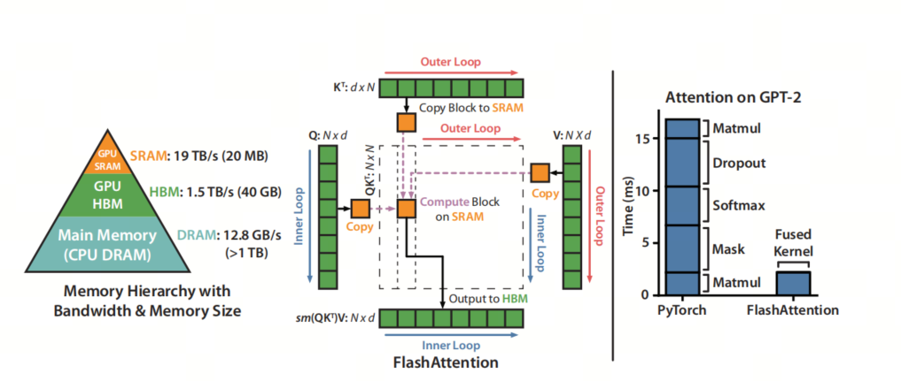
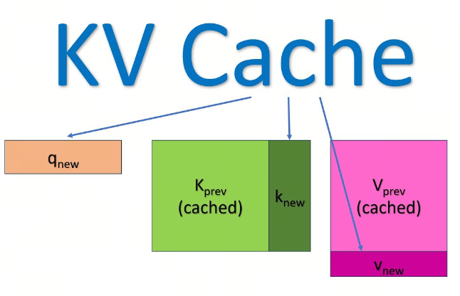

大模型推理框架（一）综述

## 1. 为什么需要推理框架

除了分布式推理和支持量化之外，大模型推理框架最大的用处是加速推理。加速推理的主要目的是提高推理效率，减少计算和内存需求，满足实时性要求，降低部署成本：

**计算和内存**：大模型通常需要大量的计算资源和内存来处理复杂的任务。这在资源受限的场景中，如移动设备或边缘计算环境中，会造成推理效率低下的问题。为了解决这一问题，需要通过优化技术提高推理效率，减少计算和内存需求；

**实时性**：在许多应用场景中，如语音助手、实时翻译等，用户期望能够获得即时的反馈。大模型的推理速度直接影响到用户体验。因此，加速推理可以减少延迟，提供更流畅的交互体验；

**部署成本**：大模型的部署需要昂贵的硬件支持，如高性能GPU。通过推理加速，可以在较低成本的硬件上部署大模型，降低部署成本，使得大模型的应用更加广泛；

**系统性能优化**：在实际部署中，大模型的推理性能受到系统层面因素的影响，如内存带宽、计算单元的利用率等。通过系统级别的优化，可以提高大模型的推理速度和效率。

## 2. 加速推理的技术

为了提高大模型的推理效率，通常会采用以下几种技术：

1. **提高计算效率**：MQA（Multi Query Attention）通过并行计算多个查询向量的注意力分布，可以显著提高计算效率。在MQA中，所有的头之间共享同一份Key和Value矩阵，每个头只单独保留了一份Query参数，从而大大减少了Key和Value矩阵的参数量，加快了decoder生成token的速度；

2. **减少计算量**：GQA（Group Query Attention）将多个查询向量分组计算注意力分布，每个组共享一个公共的键（K）和值（V）投影，这样可以减少存储每个头的键和值所需的内存开销，特别是在具有大的上下文窗口或批次大小时；

3. **降低复杂度**：Flash Attention通过减少注意力计算的复杂度来提高计算效率。它通过分块计算（Tiling）和重计算（Recomputation）的方式，避免了大型注意力矩阵的显式构建和存储，从而显著提升了计算速度和内存效率；

4. **减少重复计算**：KV Cache（键值缓存）通过缓存注意力计算中的键值对，减少重复计算量，从而提高推理效率。在自回归模型中，KV Cache利用了重复推理的Key和Value信息，避免了在每一步推理中重复计算，从而减少了参数的计算量；

5. **提高吞吐量**：Continuous Batching（连续批处理）通过连续处理多个输入样本，提高了计算效率和吞吐量。这种方法特别适合于LLM的部署，因为它可以更有效地利用GPU内存，减少空闲时间，从而提升整体的推理速度。

## 3. 常用的推理框架

1. `vLLM`[1](#refer-anchor-1)是一种基于PagedAttention的推理框架，通过分页处理注意力计算，实现了高效、快速和廉价的LLM服务。vLLM在推理过程中，将注意力计算分为多个页面，每个页面只计算一部分的注意力分布，从而减少了计算量和内存需求，提高了推理效率；

2. `Text Generation Inference（TGI）`[2](#refer-anchor-2)是一个由Hugging Face开发的用于部署和提供大型语言模型（LLMs）的框架。它是一个生产级别的工具包，专门设计用于在本地机器上以服务的形式运行大型语言模型。TGI使用Rust和Python编写，提供了一个端点来调用模型，使得文本生成任务更加高效和灵活；

3. `TensorRT-LLM` [3](#refer-anchor-3)是 NVIDIA 提供的一个用于优化大型语言模型（LLMs）在 NVIDIA GPU 上的推理性能的开源库。它通过一系列先进的优化技术，如量化、内核融合、动态批处理和多 GPU 支持，显著提高了 LLMs 的推理速度，与传统的基于 CPU 的方法相比，推理速度可提高多达 8 倍；

4. `Ollama`[4](#refer-anchor-4)是一个开源框架，旨在简化在本地环境中部署和运行大型语言模型（LLM）的过程。它通过将模型权重、配置和数据集打包成一个名为Modelfile的统一包来实现这一点，使得下载、安装和使用LLM变得更加方便，即使对于没有广泛技术知识的用户也是如此；

5. `DeepSpeed`[5](#refer-anchor-5)是微软推出的一个深度学习优化库，它不仅支持大规模模型的训练，还提供了推理加速的能力。DeepSpeed-Inference 是 DeepSpeed 的一部分，专注于提高大模型推理的性能，包括延迟和吞吐量.

## 参考

[1] [vLLM](https://docs.vllm.ai/en/latest/)

[2] [text-generation-inference](https://huggingface.co/docs/text-generation-inference/index)

[3] [TensorRT-LLM](https://github.com/NVIDIA/TensorRT-LLM)

[4] [Ollama](https://ollama.com/)

[5] [DeepSpeed](https://www.deepspeed.ai/)

## 欢迎关注我的GitHub和微信公众号[真-忒修斯之船]，来不及解释了，快上船！

[GitHub: LLMForEverybody](https://github.com/luhengshiwo/LLMForEverybody)

仓库上有原始的Markdown文件，完全开源，欢迎大家Star和Fork！