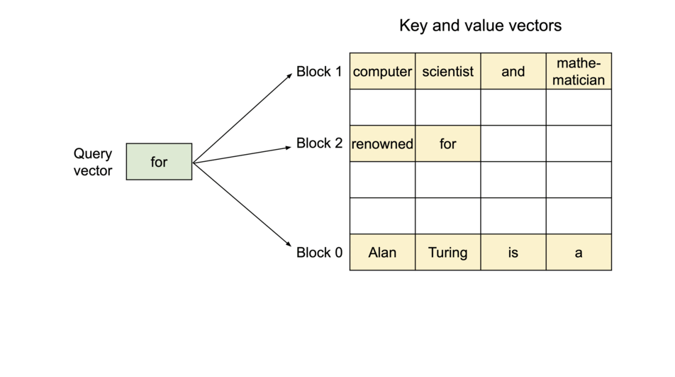

大模型推理框架（二）vLLM

`vLLM`[1](#refer-anchor-1)是一种基于PagedAttention的推理框架，通过分页处理注意力计算，实现了高效、快速和廉价的LLM服务。vLLM在推理过程中，将注意力计算分为多个页面，每个页面只计算一部分的注意力分布，从而减少了计算量和内存需求，提高了推理效率.

## 1. PagedAttention

LLM 服务的性能瓶颈在于内存（显存）。在自回归解码autoregressive decoding过程中，LLM 的所有输入tokens都会产生其注意键和值张量attention key and value tensors，这些张量保存在 GPU 内存中以生成下一个tokens。这些缓存的键和值张量通常称为 KV 缓存(KV cache)。KV 缓存有如下特点:

- 大：LLaMA-13B 中单个序列占用高达 1.7GB 的空间。
- 动态：其大小取决于序列长度，而序列长度变化很大且不可预测。因此，有效管理 KV 缓存是一项重大挑战。我们发现现有系统由于碎片化和过度预留而浪费了 60% - 80% 的内存。

为了解决这个问题，vLLM引入了 PagedAttention，这是一种注意力算法，其灵感来自操作系统中虚拟内存和分页的经典思想。与传统的注意力算法不同，PagedAttention 允许在非连续的内存空间中存储连续的键和值。具体来说，PagedAttention 将每个序列的 KV 缓存划分为块，每个块包含固定数量 token 的键和值。在注意力计算过程中，PagedAttention 内核会高效地识别和获取这些块。

由于块blocks在内存中不需要连续，因此可以像在操作系统的虚拟内存中一样以更灵活的方式管理键和值keys & values：可以将块视为页面pages，将tokens视为字节bytes，将序列sequences视为进程processes。序列的连续 ***逻辑块*** ***logical blocks*** 通过 **块表** **block table** 映射到非连续 **物理块** ***physical blocks***。物理块在生成新tokens时按需分配。

在 PagedAttention 中，内存浪费仅发生在序列的最后一个块中。实际上，这会导致接近最佳的内存使用率，浪费率仅为 4% 以下。内存效率的提高被证明是非常有益的：它允许系统将更多序列批量处理在一起，提高 GPU 利用率，从而显著提高吞吐量，如上图性能结果所示。

PagedAttention 还有一个关键优势：高效的内存共享。例如，在并行采样中，同一个提示词prompt会生成多个输出序列。在这种情况下，输出序列之间可以共享该提示词prompt的计算和内存。

PagedAttention 通过其块表自然地实现了内存共享。与进程共享物理页面的方式类似，PagedAttention 中的不同序列可以通过将其逻辑块映射到同一物理块来共享块。为了确保安全共享，PagedAttention 会跟踪物理块的引用计数并实现写时复制机制。

PageAttention 的内存共享功能大大降低了复杂采样算法（例如parallel sampling和beam search）的内存开销，最多可减少 55% 的内存使用量。这可以转化为高达 2.2 倍的吞吐量提升。这使得此类采样方法在 LLM 服务中变得实用。

PagedAttention 是 vLLM 背后的核心技术，vLLM 是我们的 LLM 推理和服务引擎，支持多种模型，具有高性能和易于使用的界面。

## 2. vLLM的其它特性

除了**PagedAttention算法**，vLLM还通过一系列优化措施，使得大型语言模型在生产环境中得以高效部署。以下是vLLM的一些关键特性：

1. **PagedAttention算法**：vLLM利用了全新的注意力算法「PagedAttention」，有效管理注意力机制中的键（key）和值（value）内存，减少了显存占用，并提升了模型的吞吐量。

2. **多GPU支持**：vLLM支持多GPU系统，可以有效地分布工作负载，减少瓶颈，增加系统的整体吞吐量。

3. **连续批处理**：vLLM支持连续批处理，允许动态任务分配，这对于处理工作负载波动的环境非常有用，可以减少空闲时间，提高资源管理效率。

4. **推测性解码**：vLLM通过预先生成并验证潜在的未来标记来优化Chatbots和实时文本生成器的延迟，减少LLM的推理时间。

5. **优化的内存使用**：vLLM的嵌入层针对内存效率进行了高度优化，确保LLM平衡有效地利用GPU内存，解决了大多数LLM（如ChatGPT）的内存资源问题而不牺牲性能。

6. **LLM适配器**：vLLM支持集成LLM适配器，允许开发者在不重新训练整个系统的情况下微调和定制LLM，提供了灵活性。

7. **与HuggingFace模型的无缝集成**：用户可以直接在HuggingFace平台上使用vLLM进行模型推理和服务，无需额外的开发工作。

8. **支持分布式推理**：vLLM支持张量并行和流水线并行，为用户提供了灵活且高效的解决方案。

9. **与OpenAI API服务的兼容性**：vLLM提供了与OpenAI接口服务的兼容性，使得用户能够更容易地将vLLM集成到现有系统中。

10. **支持量化技术**：vLLM支持int8量化技术，减小模型大小，提高推理速度，有助于在资源有限的设备上部署大型语言模型。

## 参考

[1] [vLLM](https://docs.vllm.ai/en/latest/)

[2] [vllm-project](https://github.com/vllm-project/vllm)

## 欢迎关注我的GitHub和微信公众号[真-忒修斯之船]，来不及解释了，快上船！

[GitHub: LLMForEverybody](https://github.com/luhengshiwo/LLMForEverybody)

仓库上有原始的Markdown文件，完全开源，欢迎大家Star和Fork！