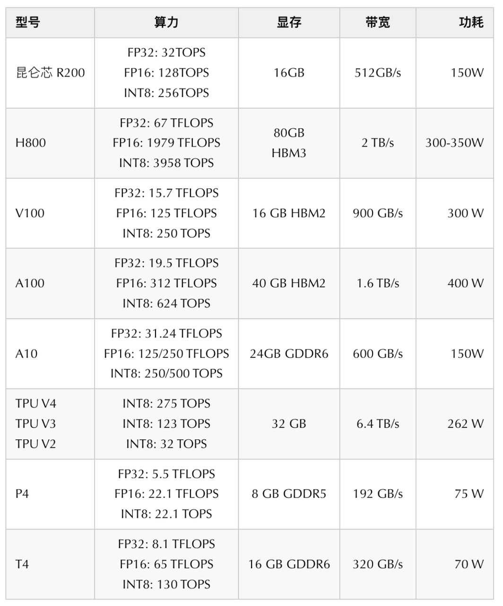

## 1. 导入
如果你使用商用大模型，或者使用开源大模型本地化部署，除了生成的质量之外，另外一个关键的指标就是生成token的速度。而且并不是简单的每秒生成多少个token，而是拆成了两个阶段：
- prefill：预填充，并行处理输入的 tokens；
- decoding：解码，逐个生成下一个 token.

## 2. 不同的公司使用的术语不同：
- 首token延迟，Time To First Token (TTFT), prefill, Prefilling

   指的都是从输入到输出第一个token 的延迟；
- 每个输出 token 的延迟（不含首个Token）,Time Per Output Token (TPOT)

  指的是第二个token开始的吐出速度；
- 延迟Lantency
  
  理论上即从输入到输出最后一个 token 的时间，原则上的计算公式是：Latency = (TTFT) + (TPOT) * (the number of tokens to be generated)；
- Tokens Per Second (TPS)：

  (the number of tokens to be generated) / Latency；

> 可以发现，第一个token的生成和剩余tokens的生成是不一样的，为什么？为了加速推理！

## 3. 理论的大模型推理速度
### 计算量
大模型的推理过程主要计算量在 Transformer 解码层，这一层对于每个 token、每个模型参数是一个单位 unit 的计算量，所以推理过程每个 token、每个模型参数，需要进行 1 unit × 2 flops = 2 次浮点运算。

对于一个大模型，绝大部分的参数量都在Transformer上，作为估算，可以直接计算2*模型参数

### 算力底座
得到通用的计算量评估，我们需要进一步细化到我们熟知的 GPU 卡算力上，为此我们需要一些算力底座的相关信息，一些常用 GPU 卡对比的信息如下：

### GPU利用率
FLOPS utilization 以目前业界能达到的最大值来进行推测：

### 计算公式
有了通用的 GPU 卡的算力信息，我们就有了可以评估推理速度：

假设我们有10张A100，使用BF16精度（意味着单卡有312TFLOPS的算力），我们的GPU利用率为46.2%。我们的模型为Llama-3.1 70B，prompt 为1K个tokens，平均速度为：
10*312T*46.2%/(2*70B*1K) = 10.3tokens/s 即平均每秒输出10个tokens.

***太慢了！***

## 4. 一种提升速度的方法：KV Cache
KV Cache 采用以空间换时间的思想，复用上次推理的 KV 缓存，可以极大降低内存压力、提高推理性能，而且不会影响任何计算精度。

decoder架构里面最主要的就是 transformer 中的 self-attention 结构的堆叠，KV-cache的实质是用之前计算过的 key-value 以及当前的 query 来生成下一个 token。

prefill指的是生成第一个token的时候，kv是没有任何缓存的，需要预填充prompt对应的KV矩阵做缓存，所以第一个token生成的最慢，而从第二个token开始，都会快速获取缓存，并将前一个token的kv也缓存。

可以看到，这是一个空间换时间的方案，缓存会不断变大，所以在私有化部署计算显存的时候，除了模型大小，还要要看你的应用中prompt和completion的大小（当然还有batch-size）。

## 5.FAQ
Q: 明明是QKV的矩阵，为什么Q不用cache？
A: 因为在计算attention的时候，使用的Query是刚生成的单个token；而不像KV，是历史上生成的所有Tokens。这个token对应的KV上的值，也需要在这一轮进行缓存。

## 参考

[1] [GitHub: LLMForEverybody](https://github.com/luhengshiwo/LLMForEverybody)