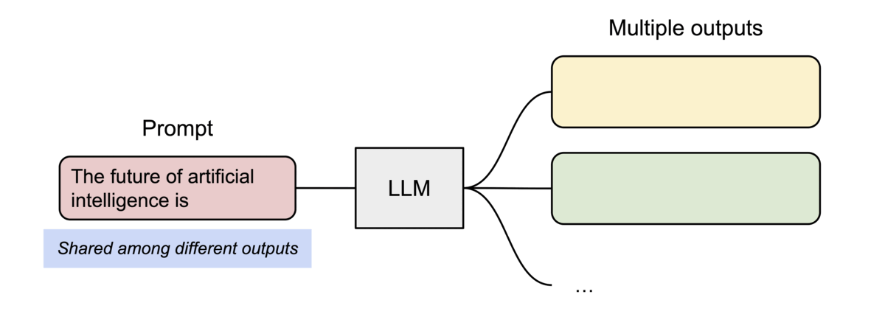

# DevOps/AIOps/MLOps/LLMOps

## 0. CI/CD

CI/CD 是持续集成（Continuous Integration）和持续交付（Continuous Delivery）的缩写。CI/CD 是一种软件开发实践，旨在通过自动化软件构建、测试和部署流程来提高开发团队的效率和质量。


***持续集成（CI）***：

- 目的：频繁地将代码变更集成到主分支；
- 实践：开发者经常（通常是每天多次）将代码变更合并到共享仓库中。每次提交都通过自动化构建和自动化测试来验证，以确保变更不会破坏现有的功能；
- 工具：通常使用版本控制系统（如Git）、构建工具（如Maven、Gradle）、自动化测试工具（如JUnit、NUnit）和持续集成服务器（如Jenkins、Travis CI、GitLab CI）

***持续交付/部署（CD）***：

- 目的：确保软件可以随时部署到生产环境中；
- 实践：在持续集成的基础上，持续交付增加了将软件自动部署到测试、暂存或生产环境的步骤。这包括自动化部署流程，但不一定意味着每次变更都会立即发布到生产环境；
- 工具：除了持续集成的工具外，还包括部署工具（如Ansible、Chef、Puppet）和配置管理工具（如Terraform、CloudFormation）

## 1. DevOps

DevOps 的历史可以追溯到2007年左右，当时软件开发和 IT 运营社区开始担忧传统的软件开发模式。在这种模式下，编写代码的开发人员与部署和支持代码的运营人员会独立工作。DevOps 这一术语由“开发”和“运营”两个词构成，它反映了将这些领域整合为一个持续流程的过程。DevOps 运动在 2007 到 2008 年间开始盛行，Patrick Debois 在比利时举办的 DevOpsDays 是 DevOps 概念的重要里程碑之一，这个会议将 DevOps 理念传播到了全球.


DevOps 的核心价值包括：

- 自动化：通过自动化工具和流程来减少手动操作，提高效率和减少错误。
- 持续集成/持续部署（CI/CD）：频繁地将代码变更集成到主分支，并通过自动化测试和部署流程快速发布到生产环境。
- 敏捷开发：采用敏捷方法论，如Scrum或Kanban，以快速响应变化和持续交付价值。
- 监控和反馈：实时监控系统性能和用户反馈，以便快速识别和解决问题。
- 文化和沟通：鼓励团队成员之间的开放沟通和协作，打破传统的部门壁垒。

## 2. AIOps

AIOps 是人工智能运维（Artificial Intelligence for IT Operations）的缩写，是一种利用人工智能和机器学习技术来改进 IT 运维的实践。AIOps 旨在通过自动化和智能化来提高 IT 运维的效率和质量。


AIOps的核心目标是从海量的运维数据中提取有价值的信息，实现故障的快速发现、准确诊断和自动修复，从而提高IT系统的可靠性和运维效率。

AIOps的关键组成部分包括数据收集、存储和分析，以及基于这些数据的智能决策和自动化响应。它通常涉及到以下几个方面：

- 数据源：AIOps平台需要从各种IT基础设施组件、应用程序、性能监控工具和服务凭单系统中收集数据;

- 大数据分析：利用大数据技术处理和分析收集到的海量数据，以识别和预测潜在的问题;

- 机器学习：应用机器学习算法来提高对数据的理解和分析能力，从而实现更准确的故障预测和根因分析;

- 自动化：基于分析结果自动触发响应措施，减少人工干预，提高问题处理的速度和效率;

- 可视化和报告：通过可视化工具展示分析结果和运维状态，帮助IT团队更好地理解系统性能和做出决策.

AIOps的应用可以帮助企业在数字化转型的过程中，更好地管理和维护复杂的IT环境，提高服务质量，降低运营成本，并增强对业务变化的适应能力

## 3. MLOps

MLOps即机器学习运维（Machine Learning Operations），是一组工作流实践，旨在简化机器学习（ML）模型的部署和维护过程。它结合了 DevOps 和 GitOps 的原则，通过自动化和标准化流程，将机器学习模型集成到软件开发过程中。MLOps 的目标是提高模型的质量和准确性，简化管理流程，避免数据漂移，提高数据科学家的效率，从而使整个团队获益。

> tips：在工业界，人们先想到AI可以辅助运维，然后才意识到AI本身也需要运维，所以‘AIOps’的名称被先指代为AI运维，而后来AI模型的运维只能使用‘MLOps’这个名字了。


MLOps 的关键组成部分包括：

- 版本控制：跟踪机器学习资产中的更改，以便重现结果并在必要时回滚到以前的版本。
- 自动化：自动执行机器学习管道中的各个阶段，确保可重复性、一致性和可扩展性。
- 连续 X：包括持续集成（CI）、持续交付（CD）、持续训练（CT）和持续监控（CM），以实现模型的持续改进和部署。
- 模型治理：管理机器学习系统的各个方面以提高效率，包括促进团队协作、确保数据安全和合规性。

MLOps 的优势包括缩短上市时间、提高工作效率、高效的模型部署和节省成本。它允许数据科学家、工程师和 IT 团队紧密合作，快速迭代和部署模型，同时确保模型在生产环境中的性能和可靠性。

至此，算法工程师的职责边界已经被拓展到了模型的部署和维护。

## 4. LLMOps

随着大模型的兴起，LLMOps（Large Language Model Operations）也逐渐成为了一个新的热门话题。LLMOps 是指大型语言模型的运维，旨在简化大模型的部署和维护过程，提高模型的质量和效率，其对标的概念是MLOps。


首先，我们对比下传统软件应用（包含机器学习）和大模型应用的区别：

|          |         传统软件应用          |                  大模型应用                  |
| :------: | :---------------------------: | :------------------------------------------: |
|   特性   |          预设的规则           |                  概率和预测                  |
|   输出   | 判别式-相同的输入，相同的输出 |     非判别式-相同的输入，很多可能的输出      |
|   测试   |    1个输出，一个准确的输出    |   一个输入，很多个准确（或者不准确）的输出   |
| 验收标准 |        验证：非对即错         | 验证：准确性，质量，一致性，偏见，毒性。。。 |

其次，我们再看下MLOps和LLMOps的区别：

| features |                            MLOps                             |                            LLMOps                            |
| :------: | :----------------------------------------------------------: | :----------------------------------------------------------: |
|   范围   |                     ML模型的整个生命周期                     |                   LLM(应用)整个的生命周期                    |
|   重点   |      数据准备、模型训练、模型部署、模型监控、模型再训练      |          数据准备、模型部署、监控、可观测性、安全性          |
|   工具   | MLOps 平台、数据准备工具、模型训练框架、模型部署工具、监控工具 | LLMOps 平台、数据准备工具、模型部署工具、监控工具、可观测性工具、安全工具 |


>注意： LLMOps,一般指的是大模型应用的运维，而不是大模型的训练，因为大模型的训练是一个离线的过程，而大模型的应用是一个在线的过程。


# VLLM

在学习vLLM和PagedAttention的过程中，我发现了很多非常优质的资料。其中最有价值应该是这篇vLLM的官方博客：https://blog.vllm.ai/2023/06/20/vllm.html

文章内容详实，我认为它写得非常好，因此尝试将其翻译成中文，希望这能帮助到更多需要相关信息的人。

由于译者水平有限，翻译过程中难免会有错误，还请大家多多包涵。如果有任何问题，欢迎在评论区指出，我会尽快修改。

## 正文开始：

LLM 有望从根本上改变我们在所有行业中使用 AI 的方式。然而，真正的要为模型搭建服务是很有挑战性的，即使在昂贵的硬件上也可能出奇地慢。今天(2023年6月20日，译者注)我们很高兴推出vLLM，这是一个用于快速LLM推理和服务的开源库。vLLM 采用了 PagedAttention，这是我们的新注意力算法，可以有效地管理注意力键keys和值values。配备 PagedAttention 的 vLLM 重新定义了 LLM 服务SOTA水平：它比 HuggingFace Transformers 的吞吐量高出 24 倍，而无需进行任何模型架构更改。

vLLM 是UC Berkeley开发的，并在过去两个月内部署在 [Chatbot Arena and Vicuna Demo](https://lmarena.ai/) 中。它是让 LLM 服务变得经济的核心技术，让即使是像 LMSYS 这样计算资源有限的小型研究团队也可以负担得起。现在只需在我们的 [GitHub 仓库](https://github.com/vllm-project/vllm)中使用一个命令即可试用 vLLM。

## 超越SOTA的性能

我们将 vLLM 的吞吐量Throughput与最受欢迎的 LLM 库 [HuggingFace Transformers (HF)](https://huggingface.co/docs/transformers/main_classes/text_generation) 和之前最先进的 [HuggingFace text-generation-inference (TGI)](https://github.com/huggingface/text-generation-inference) 进行了比较。我们在两种设置下进行评估：NVIDIA A10G GPU 上的 LLaMA-7B 和 NVIDIA A100 GPU (40GB) 上的 LLaMA-13B。我们从 ShareGPT 数据集中抽取请求的输入/输出长度。在我们的实验中，vLLM 的吞吐量比 HF 高出 24 倍，比 TGI 高出 3.5 倍。


上图为每个请求要求一个输出时的服务吞吐量。vLLM 的吞吐量比 HF 高 14 倍至 24 倍，比 TGI 高 2.2 倍至 2.5 倍。


上图为每个请求要求三个并行输出时的服务吞吐量。vLLM 的吞吐量比 HF 高 8.5 倍至 15 倍，比 TGI 高 3.3 倍至 3.5 倍。


##  秘诀：PagedAttention

在 vLLM 中，我们发现 LLM 服务的性能瓶颈在于内存（显存）。在自回归解码autoregressive decoding过程中，LLM 的所有输入tokens都会产生其注意键和值张量attention key and value tensors，这些张量保存在 GPU 内存中以生成下一个tokens。这些缓存的键和值张量通常称为 KV 缓存(KV cache)。KV 缓存有如下特点:

- 大：LLaMA-13B 中单个序列占用高达 1.7GB 的空间。
- 动态：其大小取决于序列长度，而序列长度变化很大且不可预测。因此，有效管理 KV 缓存是一项重大挑战。我们发现现有系统由于碎片化和过度预留而浪费了 60% - 80% 的内存。

为了解决这个问题，我们引入了 PagedAttention，这是一种注意力算法，其灵感来自操作系统中虚拟内存和分页的经典思想。与传统的注意力算法不同，PagedAttention 允许在非连续的内存空间中存储连续的键和值。具体来说，PagedAttention 将每个序列的 KV 缓存划分为块，每个块包含固定数量 token 的键和值。在注意力计算过程中，PagedAttention 内核会高效地识别和获取这些块。


PagedAttention：KV Cache 被划分为块。块在内存空间中不需要连续。

由于块blocks在内存中不需要连续，因此我们可以像在操作系统的虚拟内存中一样以更灵活的方式管理键和值keys & values：可以将块视为页面pages，将tokens视为字节bytes，将序列sequences视为进程processes。序列的连续 ***逻辑块*** ***logical blocks*** 通过 **块表** **block table** 映射到非连续 **物理块** ***physical blocks***。物理块在生成新tokens时按需分配。

>译者注：面试要考的！


使用 PagedAttention 的请求的示例生成过程。


在 PagedAttention 中，内存浪费仅发生在序列的最后一个块中。实际上，这会导致接近最佳的内存使用率，浪费率仅为 4% 以下。内存效率的提高被证明是非常有益的：它允许系统将更多序列批量处理在一起，提高 GPU 利用率，从而显著提高吞吐量，如上图性能结果所示。

PagedAttention 还有一个关键优势：高效的内存共享。例如，在并行采样中，同一个提示词prompt会生成多个输出序列。在这种情况下，输出序列之间可以共享该提示词prompt的计算和内存。


并行采样的示例

PagedAttention 通过其块表自然地实现了内存共享。与进程共享物理页面的方式类似，PagedAttention 中的不同序列可以通过将其逻辑块映射到同一物理块来共享块。为了确保安全共享，PagedAttention 会跟踪物理块的引用计数并实现写时复制机制。


对多个输出进行采样的请求的示例生成过程

PageAttention 的内存共享功能大大降低了复杂采样算法（例如parallel sampling和beam search）的内存开销，最多可减少 55% 的内存使用量。这可以转化为高达 2.2 倍的吞吐量提升。这使得此类采样方法在 LLM 服务中变得实用。

PagedAttention 是 vLLM 背后的核心技术，vLLM 是我们的 LLM 推理和服务引擎，支持多种模型，具有高性能和易于使用的界面。有关 vLLM 和 PagedAttention 的更多技术细节，请查看我们的 [GitHub 仓库](https://github.com/vllm-project/vllm)并继续关注我们的论文。


## LMSYS Vicuna and Chatbot Arena的幕后功臣

今年4月（2023年4月。译者注），LMSYS 开发了流行的 Vicuna 聊天机器人模型并将其公开。从那时起，Vicuna 已在 [Chatbot Arena](https://lmarena.ai/) 中为数百万用户提供服务。最初，LMSYS FastChat 采用基于 HF Transformers 的[服务后端](https://github.com/lm-sys/FastChat/blob/main/fastchat/serve/model_worker.py)来为聊天demo提供服务。随着demo越来越受欢迎，峰值流量增加了几倍，使 HF 后端成为一个重大瓶颈。LMSYS 和 vLLM 团队合作并很快开发了 FastChat-vLLM 集成，以使用 vLLM 作为[新的后端](https://github.com/lm-sys/FastChat/blob/main/fastchat/serve/vllm_worker.py)来支持不断增长的需求（高达 5 倍的流量）。在 LMSYS 早期的[内部微基准测试](https://github.com/lm-sys/FastChat/blob/main/fastchat/serve/test_throughput.py)中，vLLM 服务后端可以实现**比初始 HF 后端高出 30 倍的吞吐量**。

自2023年4月中旬以来，Vicuna、Koala 和 LLaMA 等最受欢迎的模型均已成功使用 FastChat-vLLM 集成提供服务 - 通过使用 FastChat 作为多模型聊天服务前端和 vLLM 作为推理后端，LMSYS 能够利用有限数量的大学赞助 GPU 为数百万用户提供高吞吐量和低延迟的 Vicuna。LMSYS 正在将 vLLM 的使用范围扩展到更广泛的模型，包括 Databricks Dolly、LAION 的 OpenAsssiant 和 Stability AI 的 stableLM。对更多[模型的支持](https://docs.vllm.ai/en/latest/models/supported_models.html)正在开发中，即将推出。


4 月至 5 月期间，Chatbot Arena 中 FastChat-vLLM 集成处理的请求。事实上，超过一半的 Chatbot Arena 请求使用 vLLM 作为推理后端。

使用 vLLM 还显著降低了运营成本。借助 vLLM，LMSYS 能够将用于处理上述流量的 GPU 数量减少 50%。vLLM 每天平均处理 30K 个请求，峰值为 60K，这充分证明了 vLLM 的稳健性。


## 开始使用 vLLM

使用以下命令安装 vLLM（更多信息请查看我们的[安装指南](https://docs.vllm.ai/en/latest/getting_started/installation.html)）：

```shell
$ pip install vllm
```

vLLM 既可用于离线推理，也可用于在线服务。要使用 vLLM 进行离线推理，你可以导入 vLLM 并在 Python 脚本中使用 LLM 类：

```python
from vllm import LLM

prompts = ["Hello, my name is", "The capital of France is"]  # Sample prompts.
llm = LLM(model="lmsys/vicuna-7b-v1.3")  # Create an LLM.
outputs = llm.generate(prompts)  # Generate texts from the prompts.
```

要使用 vLLM 进行在线服务，你可以通过以下方式启动与 OpenAI API 兼容的服务器：

```shell
$ python -m vllm.entrypoints.openai.api_server --model lmsys/vicuna-7b-v1.3
```

你可以使用与 OpenAI API 相同的格式查询服务器：

```shell
$ curl http://localhost:8000/v1/completions \
    -H "Content-Type: application/json" \
    -d '{
        "model": "lmsys/vicuna-7b-v1.3",
        "prompt": "San Francisco is a",
        "max_tokens": 7,
        "temperature": 0
    }'

```

有关使用 vLLM 的更多方法，请查看[快速入门指南](https://docs.vllm.ai/en/latest/getting_started/quickstart.html)。


# 大模型output-token为什么比input-token

近年来，许多商业大模型的价格不断下降，但你是否注意到一个关键细节：output token 的价格通常比 input token 高出几倍。这背后究竟是什么原因呢？在这篇博客中，我们将深入探讨大模型生成 token 的机制，并揭示为什么 output token 的成本更高。


## 大模型的输出机制

在 KV cache（键值缓存）的支持下，大模型生成 token 分为两个阶段：

### 预填充（prefill）

在预填充阶段，模型会并行处理输入的 prompt（即 input token），生成 KV cache。这一步骤包括一次完整的前向传播（forward），并输出第一个 token。这个过程的时间主要由 input token 决定，因为它们需要进行一次全面的计算来初始化整个生成过程。

### 解码（decoding）

解码阶段是逐个生成下一个 token 的过程。在这一步中，output token 的数量决定了需要进行多少次前向传播。虽然每次前向传播由于 KV cache 的存在而更快，但这仍然需要模型多次计算，逐步生成每一个后续的 token。

## 影响因素

大模型的生成过程受多种因素影响，这些因素不仅决定了生成 token 的效率，还影响了成本：

### Input Token

1. **预填充时间**：input token 决定了预填充阶段的时间，即第一个 token 生成的时间，这个过程只计算一次。
2. **显存占用下限**：input token 决定了 KV cache 占用显存的最低限度，因为它们需要为后续的 token 生成提供基础。
3. **生成速度基线**：input token 还决定了从第二个 token 开始生成的速度基线，影响后续的计算效率。

### Output Token

1. **解码时间长度**：output token 决定了解码阶段的时间长度。由于 KV cache 的存在，每次计算比第一个 token 快得多，但仍需多次前向传播。
2. **显存占用上限**：output token 决定了 KV cache 占用显存的最高限度，因为每生成一个新的 token，缓存中存储的信息量也在增加。

## 哪个开销更大？

一次完整的前向传播(input token数量)与多次利用 KV cache 的前向传播(output token数量)，哪个开销更大呢？


### 计算与通信瓶颈

尽管 KV cache 能有效减少每次计算的量，但由于通信带宽的更新速度未能跟上计算能力的提升，显卡对 I/O 的敏感度更高。每个 output token 的生成仍需多次前向传播，加之显卡 I/O 速度的限制，使得每个 output token 的开销更大。这也解释了为什么 output token 的价格比 input token 高。


# Latency和Throughput区别

## 1. 导入

为了快速应用大模型，我们需要采购商业大模型。采购前，对接销售时，我们描述了我们的场景和需求：

Q：我们的prompts token数量在1500-2000之间，completion token数量在500左右。这种情况下，prefilling多久？每个token输出是多久？

销售回复：标准3500 token Input，首包吐出来小于1秒；throughput 300token/s.

你是否看出来答非所问了？

问的和latency相关，回答的是throughput。那这两个词有什么区别？导致连这个领域的销售都会搞混？


在搞懂latency和throughput之前，我们先来看看KV cache 和 prefilling。

## 2. KV Cache

KV Cache 采用以空间换时间的思想，复用上次推理的 KV 缓存，可以极大降低内存压力、提高推理性能，而且不会影响任何计算精度。

decoder架构里面最主要的就是 transformer 中的 self-attention 结构的堆叠，KV-cache的实质是用之前计算过的 key-value 以及当前的 query 来生成下一个 token。

prefill指的是生成第一个token的时候，kv是没有任何缓存的，需要预填充prompt对应的KV矩阵做缓存，所以第一个token生成的最慢，而从第二个token开始，都会快速获取缓存，并将前一个token的kv也缓存。

可以看到，这是一个空间换时间的方案，缓存会不断变大，所以在私有化部署计算显存的时候，除了模型大小，还要要看你的应用中prompt和completion的大小（当然还有batch-size）。


## 3. Prefilling & Decoding

如果你使用商用大模型，或者使用开源大模型本地化部署，除了生成的质量之外，另外一个关键的指标就是生成token的速度。而且并不是简单的每秒生成多少个token，而是拆成了两个阶段：

- prefill：预填充，并行处理输入的 tokens；
- decoding：解码，逐个生成下一个 token.

### 预填充（prefill）

在预填充阶段，模型会并行处理输入的 prompt（即 input token），生成 KV cache。这一步骤包括一次完整的前向传播（forward），并输出第一个 token。这个过程的时间主要由 input token 决定，因为它们需要进行一次全面的计算来初始化整个生成过程。

### 解码（decoding）

解码阶段是逐个生成下一个 token 的过程。在这一步中，output token 的数量决定了需要进行多少次前向传播。虽然每次前向传播由于 KV cache 的存在而更快，但这仍然需要模型多次计算，逐步生成每一个后续的 token。

### 不同的公司使用的术语不同：

- 首token延迟，Time To First Token (TTFT), prefill, Prefilling

  指的都是从输入到输出第一个token 的延迟；

- 每个输出 token 的延迟（不含首个Token）,Time Per Output Token (TPOT)

  指的是第二个token开始的吐出速度；

- 延迟Lantency

  理论上即从输入到输出最后一个 token 的时间，原则上的计算公式是：Latency = (TTFT) + (TPOT) * (the number of tokens to be generated)；

- Tokens Per Second (TPS)：

  (the number of tokens to be generated) / Latency；

## 4. Latency VS Throughput

- Latency：延迟，指的是从输入到输出的时间，即从输入到输出最后一个 token 的时间；


- Throughput：吞吐量，指的是单位时间内处理的任务数，即每秒处理的 token 数。


下面给出latency和throughput的计算方法：

```python
# constants
max_tokens = 10

# observations
durations = []
throughputs = []
latencies = []

batch_sizes = [2**p for p in range(8)]
for batch_size in batch_sizes:
    print(f"bs= {batch_size}")

    # generate tokens for batch and record duration
    t0 = time.time()
    batch_prompts = [
        prompts[i % len(prompts)] for i in range(batch_size)
    ]
    inputs = tokenizer(
        batch_prompts, padding=True, return_tensors="pt"
    )
    generated_tokens = generate_batch(inputs, max_tokens=max_tokens)
    duration_s = time.time() - t0

    ntokens = batch_size * max_tokens
    throughput = ntokens / duration_s
    avg_latency = duration_s / max_tokens
    print("duration", duration_s)
    print("throughput", throughput)
    print("avg latency", avg_latency)    
    print()

    durations.append(duration_s)
    throughputs.append(throughput)
    latencies.append(avg_latency)
```

## 5. Navie batching

Navie batching是指将多个输入合并成一个batch，然后一次性输入模型，这样可以减少模型的前向传播次数，提高效率。
有的人也称其为synchronous batching或者static batching，区别于后面的continuous batching。


Navie batching的缺点是，如果一个batch中有一个输入很大，那么整个batch的计算时间就会被拉长，这样会导致整个batch的计算时间变长。

## 6. Continuous batching

在传统的批处理方法中，一批请求必须全部完成处理后才能一起返回结果。这就意味着较短请求需要等待较长请求处理完成，导致了GPU资源的浪费和推理延迟的增加。而Continuous Batching技术允许模型在处理完当前迭代后，如果有请求已经处理完成，则可以立即返回该请求的结果，而不需要等待整个批次的请求都处理完成，这样可以显著提高硬件资源的利用率并减少空闲时间。


此外，Continuous Batching还能够解决不同请求计算量不同导致的资源浪费问题，通过迭代级别的调度动态调整批处理大小，适应不同请求的复杂程度，有效降低高复杂度请求的等待时间。

值得注意的是，实现Continuous Batching需要考虑一些关键问题，如对Early-finished Requests、Late-joining Requests的处理，以及如何处理不同长度的请求Batching。OCRA提出的两个设计思路：Iteration-level Batching和Selective Batching，就是为了解决这些问题。

在实际应用中，不同的框架可能对Continuous Batching有不同的实现方式。例如，vLLM框架采用了一种简化的实现，将prefill和decoding分开处理，而FastGen框架则采用了SplitFuse方法，将长prompt分解成小块并在多个step中调度。这些不同的实现方式都旨在提高推理性能，降低延迟，同时优化资源的利用


给出生成continous batching的代码：

```python
# seed the random number generator so our results are deterministic
random.seed(42)

# constants
queue_size = 32
batch_size = 8

# requests waiting to be processed
# this time requests are tuples (prompt, max_tokens)
request_queue = [
    (prompts[0], 100 if i % batch_size == 0 else 10)
    for i in range(queue_size)
]

t0 = time.time()
with tqdm(total=len(request_queue), desc=f"bs={batch_size}") as pbar:
    # first, let's seed the initial cached_batch
    # with the first `batch_size` inputs
    # and run the initial prefill step
    batch = init_batch(request_queue[:batch_size])
    cached_batch = generate_next_token(batch)
    request_queue = request_queue[batch_size:]

    # continue until both the request queue is 
    # fully drained and every input
    # within the cached_batch has completed generation
    while (
        len(request_queue) > 0 or
        cached_batch["input_ids"].size(0) > 0
    ):
        batch_capacity = (
            batch_size - cached_batch["input_ids"].size(0)
        )
        if batch_capacity > 0 and len(request_queue) > 0:
            # prefill
            new_batch = init_batch(request_queue[:batch_capacity])
            new_batch = generate_next_token(new_batch)
            request_queue = request_queue[batch_capacity:]

            # merge
            cached_batch = merge_batches(cached_batch, new_batch)

        # decode
        cached_batch = generate_next_token(cached_batch)

        # remove any inputs that have finished generation
        cached_batch, removed_indices = filter_batch(cached_batch)
        pbar.update(len(removed_indices))

duration_s = time.time() - t0
print("duration", duration_s)
```


# 大模型推理框架

## 一 综述

### 为什么需要推理框架

除了分布式推理和支持量化之外，大模型推理框架最大的用处是加速推理。加速推理的主要目的是提高推理效率，减少计算和内存需求，满足实时性要求，降低部署成本：

**计算和内存**：大模型通常需要大量的计算资源和内存来处理复杂的任务。这在资源受限的场景中，如移动设备或边缘计算环境中，会造成推理效率低下的问题。为了解决这一问题，需要通过优化技术提高推理效率，减少计算和内存需求；

**实时性**：在许多应用场景中，如语音助手、实时翻译等，用户期望能够获得即时的反馈。大模型的推理速度直接影响到用户体验。因此，加速推理可以减少延迟，提供更流畅的交互体验；

**部署成本**：大模型的部署需要昂贵的硬件支持，如高性能GPU。通过推理加速，可以在较低成本的硬件上部署大模型，降低部署成本，使得大模型的应用更加广泛；

**系统性能优化**：在实际部署中，大模型的推理性能受到系统层面因素的影响，如内存带宽、计算单元的利用率等。通过系统级别的优化，可以提高大模型的推理速度和效率。


### 加速推理的技术

为了提高大模型的推理效率，通常会采用以下几种技术：

1. **提高计算效率**：MQA（Multi Query Attention）通过并行计算多个查询向量的注意力分布，可以显著提高计算效率。在MQA中，所有的头之间共享同一份Key和Value矩阵，每个头只单独保留了一份Query参数，从而大大减少了Key和Value矩阵的参数量，加快了decoder生成token的速度；

2. **减少计算量**：GQA（Group Query Attention）将多个查询向量分组计算注意力分布，每个组共享一个公共的键（K）和值（V）投影，这样可以减少存储每个头的键和值所需的内存开销，特别是在具有大的上下文窗口或批次大小时；


3. **降低复杂度**：Flash Attention通过减少注意力计算的复杂度来提高计算效率。它通过分块计算（Tiling）和重计算（Recomputation）的方式，避免了大型注意力矩阵的显式构建和存储，从而显著提升了计算速度和内存效率；


4. **减少重复计算**：KV Cache（键值缓存）通过缓存注意力计算中的键值对，减少重复计算量，从而提高推理效率。在自回归模型中，KV Cache利用了重复推理的Key和Value信息，避免了在每一步推理中重复计算，从而减少了参数的计算量；


5. **提高吞吐量**：Continuous Batching（连续批处理）通过连续处理多个输入样本，提高了计算效率和吞吐量。这种方法特别适合于LLM的部署，因为它可以更有效地利用GPU内存，减少空闲时间，从而提升整体的推理速度。


### 常用的推理框架

1. `vLLM`[1](#refer-anchor-1)是一种基于PagedAttention的推理框架，通过分页处理注意力计算，实现了高效、快速和廉价的LLM服务。vLLM在推理过程中，将注意力计算分为多个页面，每个页面只计算一部分的注意力分布，从而减少了计算量和内存需求，提高了推理效率；

2. `Text Generation Inference（TGI）`[2](#refer-anchor-2)是一个由Hugging Face开发的用于部署和提供大型语言模型（LLMs）的框架。它是一个生产级别的工具包，专门设计用于在本地机器上以服务的形式运行大型语言模型。TGI使用Rust和Python编写，提供了一个端点来调用模型，使得文本生成任务更加高效和灵活；

3. `TensorRT-LLM` [3](#refer-anchor-3)是 NVIDIA 提供的一个用于优化大型语言模型（LLMs）在 NVIDIA GPU 上的推理性能的开源库。它通过一系列先进的优化技术，如量化、内核融合、动态批处理和多 GPU 支持，显著提高了 LLMs 的推理速度，与传统的基于 CPU 的方法相比，推理速度可提高多达 8 倍；

4. `Ollama`[4](#refer-anchor-4)是一个开源框架，旨在简化在本地环境中部署和运行大型语言模型（LLM）的过程。它通过将模型权重、配置和数据集打包成一个名为Modelfile的统一包来实现这一点，使得下载、安装和使用LLM变得更加方便，即使对于没有广泛技术知识的用户也是如此；

5. `DeepSpeed`[5](#refer-anchor-5)是微软推出的一个深度学习优化库，它不仅支持大规模模型的训练，还提供了推理加速的能力。DeepSpeed-Inference 是 DeepSpeed 的一部分，专注于提高大模型推理的性能，包括延迟和吞吐量.


## 二 vLLM

`vLLM`[1](#refer-anchor-1)是一种基于PagedAttention的推理框架，通过分页处理注意力计算，实现了高效、快速和廉价的LLM服务。vLLM在推理过程中，将注意力计算分为多个页面，每个页面只计算一部分的注意力分布，从而减少了计算量和内存需求，提高了推理效率.

### PagedAttention

LLM 服务的性能瓶颈在于内存（显存）。在自回归解码autoregressive decoding过程中，LLM 的所有输入tokens都会产生其注意键和值张量attention key and value tensors，这些张量保存在 GPU 内存中以生成下一个tokens。这些缓存的键和值张量通常称为 KV 缓存(KV cache)。KV 缓存有如下特点:

- 大：LLaMA-13B 中单个序列占用高达 1.7GB 的空间。
- 动态：其大小取决于序列长度，而序列长度变化很大且不可预测。因此，有效管理 KV 缓存是一项重大挑战。我们发现现有系统由于碎片化和过度预留而浪费了 60% - 80% 的内存。

为了解决这个问题，vLLM引入了 PagedAttention，这是一种注意力算法，其灵感来自操作系统中虚拟内存和分页的经典思想。与传统的注意力算法不同，PagedAttention 允许在非连续的内存空间中存储连续的键和值。具体来说，PagedAttention 将每个序列的 KV 缓存划分为块，每个块包含固定数量 token 的键和值。在注意力计算过程中，PagedAttention 内核会高效地识别和获取这些块。


由于块blocks在内存中不需要连续，因此可以像在操作系统的虚拟内存中一样以更灵活的方式管理键和值keys & values：可以将块视为页面pages，将tokens视为字节bytes，将序列sequences视为进程processes。序列的连续 ***逻辑块*** ***logical blocks*** 通过 **块表** **block table** 映射到非连续 **物理块** ***physical blocks***。物理块在生成新tokens时按需分配。


在 PagedAttention 中，内存浪费仅发生在序列的最后一个块中。实际上，这会导致接近最佳的内存使用率，浪费率仅为 4% 以下。内存效率的提高被证明是非常有益的：它允许系统将更多序列批量处理在一起，提高 GPU 利用率，从而显著提高吞吐量，如上图性能结果所示。

PagedAttention 还有一个关键优势：高效的内存共享。例如，在并行采样中，同一个提示词prompt会生成多个输出序列。在这种情况下，输出序列之间可以共享该提示词prompt的计算和内存。



PagedAttention 通过其块表自然地实现了内存共享。与进程共享物理页面的方式类似，PagedAttention 中的不同序列可以通过将其逻辑块映射到同一物理块来共享块。为了确保安全共享，PagedAttention 会跟踪物理块的引用计数并实现写时复制机制。


PageAttention 的内存共享功能大大降低了复杂采样算法（例如parallel sampling和beam search）的内存开销，最多可减少 55% 的内存使用量。这可以转化为高达 2.2 倍的吞吐量提升。这使得此类采样方法在 LLM 服务中变得实用。

PagedAttention 是 vLLM 背后的核心技术，vLLM 是我们的 LLM 推理和服务引擎，支持多种模型，具有高性能和易于使用的界面。


### vLLM的其它特性

除了**PagedAttention算法**，vLLM还通过一系列优化措施，使得大型语言模型在生产环境中得以高效部署。以下是vLLM的一些关键特性：

1. **PagedAttention算法**：vLLM利用了全新的注意力算法「PagedAttention」，有效管理注意力机制中的键（key）和值（value）内存，减少了显存占用，并提升了模型的吞吐量。

2. **多GPU支持**：vLLM支持多GPU系统，可以有效地分布工作负载，减少瓶颈，增加系统的整体吞吐量。

3. **连续批处理**：vLLM支持连续批处理，允许动态任务分配，这对于处理工作负载波动的环境非常有用，可以减少空闲时间，提高资源管理效率。

4. **推测性解码**：vLLM通过预先生成并验证潜在的未来标记来优化Chatbots和实时文本生成器的延迟，减少LLM的推理时间。

5. **优化的内存使用**：vLLM的嵌入层针对内存效率进行了高度优化，确保LLM平衡有效地利用GPU内存，解决了大多数LLM（如ChatGPT）的内存资源问题而不牺牲性能。

6. **LLM适配器**：vLLM支持集成LLM适配器，允许开发者在不重新训练整个系统的情况下微调和定制LLM，提供了灵活性。

7. **与HuggingFace模型的无缝集成**：用户可以直接在HuggingFace平台上使用vLLM进行模型推理和服务，无需额外的开发工作。

8. **支持分布式推理**：vLLM支持张量并行和流水线并行，为用户提供了灵活且高效的解决方案。

9. **与OpenAI API服务的兼容性**：vLLM提供了与OpenAI接口服务的兼容性，使得用户能够更容易地将vLLM集成到现有系统中。

10. **支持量化技术**：vLLM支持int8量化技术，减小模型大小，提高推理速度，有助于在资源有限的设备上部署大型语言模型。


## 三 TGI（Text Generation Inference）

`Text Generation Inference（TGI）`[1](#refer-anchor-1)是一个由Hugging Face开发的用于部署和提供大型语言模型（LLMs）的框架。它是一个生产级别的工具包，专门设计用于在本地机器上以服务的形式运行大型语言模型。TGI使用Rust和Python编写，提供了一个端点来调用模型，使得文本生成任务更加高效和灵活.


### 加速推理技术

1. Tensor Parallelism

张量并行使用了矩阵乘法可以并行计算的特性，将模型的参数划分为多个部分，每个部分在不同的设备上进行计算，最后将结果进行汇总。下面，我们分别看FFN和Self-Attention的张量并行实现。

`MLP`的主要构建块都是完全连接的 nn.Linear，后跟非线性激活 GeLU。

按照 Megatron的论文符号，我们可以将其点积部分写为 Y = GeLU(XA)，其中 X 和 Y 是输入和输出向量，A 是权重矩阵。

如果我们以矩阵形式查看计算，很容易看出矩阵乘法如何在多个 GPU 之间拆分：


如果我们将权重矩阵 A 按列拆分到 N 个 GPU 上，并行执行矩阵乘法 XA_1 到 XA_n，那么我们将得到 N 个输出向量 Y_1、Y_2、...、Y_n，这些向量可以独立输入到 GeLU 中：


利用这一原理，我们可以更新任意深度的 MLP，而无需 GPU 之间进行任何同步，直到最后，我们才需要重建输出向量。

Megatron-LM 论文作者为此提供了一个有用的例子：


`Self-Attention` 的张量并行更简单，因为self-attention天然的是多头注意力机制，可以将每个头的计算分配到不同的 GPU 上。


在上图中，我们可以用2个GPU并行的计算self-attention，其中每个GPU计算一个头的注意力机制。那原则上，有几个头就可以用几个GPU并行计算。

2. Continuous batching

在传统的批处理方法中，一批请求必须全部完成处理后才能一起返回结果。这就意味着较短请求需要等待较长请求处理完成，导致了GPU资源的浪费和推理延迟的增加。而Continuous Batching技术允许模型在处理完当前迭代后，如果有请求已经处理完成，则可以立即返回该请求的结果，而不需要等待整个批次的请求都处理完成，这样可以显著提高硬件资源的利用率并减少空闲时间。


此外，Continuous Batching还能够解决不同请求计算量不同导致的资源浪费问题，通过迭代级别的调度动态调整批处理大小，适应不同请求的复杂程度，有效降低高复杂度请求的等待时间。

值得注意的是，实现Continuous Batching需要考虑一些关键问题，如对Early-finished Requests、Late-joining Requests的处理，以及如何处理不同长度的请求Batching。OCRA提出的两个设计思路：Iteration-level Batching和Selective Batching，就是为了解决这些问题。

3. Flash Attention

Flash Attention 是一种新型的注意力机制算法，由斯坦福大学和纽约州立大学布法罗分校的科研团队共同开发，旨在解决传统 Transformer 模型在处理长序列数据时面临的时间和内存复杂度高的问题。该算法的核心思想是减少 GPU 高带宽内存（HBM）和 GPU 片上 SRAM 之间的内存读写次数，通过分块计算（tiling）和重计算（recomputation）技术，显著降低了对 HBM 的访问频率，从而提升了运行速度并减少了内存使用。


Flash Attention 通过 IO 感知的设计理念，优化了内存访问模式，使得 Transformer 模型在长序列处理上更加高效，为构建更长上下文的高质量模型提供了可能。

4. PagedAttention

vLLM引入了 PagedAttention，这是一种注意力算法，其灵感来自操作系统中虚拟内存和分页的经典思想。与传统的注意力算法不同，PagedAttention 允许在非连续的内存空间中存储连续的键和值。具体来说，PagedAttention 将每个序列的 KV 缓存划分为块，每个块包含固定数量 token 的键和值。在注意力计算过程中，PagedAttention 内核会高效地识别和获取这些块。


### TGI的特性

1. **简单的启动器**：TGI提供了一个简单的启动器，可以轻松服务最流行的LLMs。

2. **生产就绪**：TGI集成了分布式追踪（使用Open Telemetry）和Prometheus指标，满足生产环境的需求。

3. **张量并行**：通过在多个GPU上进行张量并行计算，TGI能够显著加快推理速度。

4. **令牌流式传输**：使用服务器发送事件（SSE）实现令牌的流式传输。

5. **连续批处理**：对传入请求进行连续批处理，提高总体吞吐量。

6. **优化的推理代码**：针对最流行的架构，TGI使用Flash Attention和Paged Attention等技术优化了Transformers代码。

7. **多种量化支持**：支持bitsandbytes、GPT-Q、EETQ、AWQ、Marlin和fp8等多种量化方法。

8. **安全加载权重**：使用Safetensors进行权重加载，提高安全性。

9. **水印技术**：集成了"A Watermark for Large Language Models"的水印技术。

10. **灵活的生成控制**：支持logits warper（温度缩放、top-p、top-k、重复惩罚等）、停止序列和对数概率输出。

11. **推测生成**：实现了约2倍的延迟优化。

12. **引导/JSON输出**：支持指定输出格式，加速推理并确保输出符合特定规范。

13. **自定义提示生成**：通过提供自定义提示来指导模型的输出，从而轻松生成文本。

14. **微调支持**：利用微调模型执行特定任务，以实现更高的精度和性能。

15. **硬件支持**：除了NVIDIA GPU，TGI还支持AMD GPU、Intel GPU、Inferentia、Gaudi和Google TPU等多种硬件。


## 四 TensorRT

`TensorRT-LLM` [1](#refer-anchor-1)是 NVIDIA 提供的一个用于优化大型语言模型（LLMs）在 NVIDIA GPU 上的推理性能的开源库。它通过一系列先进的优化技术，如量化、内核融合、动态批处理和多 GPU 支持，显著提高了 LLMs 的推理速度，与传统的基于 CPU 的方法相比，推理速度可提高多达 8 倍；

### Fast Transformer or TensorRT-LLM?

Fast Transformer 已不再更新！！


TensorRT-LLM 可以视为 TensorRT 和 FastTransformer 的结合体，旨在为大模型推理加速而生。它不仅包含了 FastTransformer 对 Transformer 做的 attention 优化、softmax 优化、算子融合等方式，还引入了众多的大模型推理优化特性

`TensorRT` 是NVIDIA开发的一款用于GPU上高性能深度学习推理的SDK（软件开发工具包）。它能够优化神经网络模型，加速推理过程，显著提升GPU上的推理性能和效率。TensorRT的主要功能包括：

1. **模型优化**：TensorRT可以导入从主要深度学习框架训练好的模型，并生成优化的运行时引擎，这些引擎可以部署在数据中心、汽车和嵌入式环境中。

2. **高性能推理优化**：TensorRT通过层融合、精度校准、内核自动调优等技术，大幅提升推理速度。

3. **低延迟**：TensorRT优化计算图和内存使用，从而显著降低推理延迟，适用于实时AI应用。

4. **多精度支持**：TensorRT支持FP32、FP16、INT8等多种精度，允许在精度和性能之间进行平衡。


### 加速推理技术

1. Quantization

量化技术是LLM领域中用于优化模型的一种方法，特别是在模型部署到资源受限的环境（如移动设备、嵌入式系统或需要低延迟的服务器）时。量化的基本思想是将模型中的权重和激活值从浮点数（如32位浮点数，FP32）转换为低精度的表示，比如8位整数（INT8）或更低位的格式.


2. In-flight Batching
   也称Continuous Batching，是一种提高LLM推理效率的技术。它通过连续处理多个输入样本，减少了推理过程中的空闲时间，提高了计算效率和吞吐量。在LLM推理中，通过批处理多个输入样本，可以更有效地利用GPU的计算资源，减少推理过程中的等待时间，提高整体的推理速度。


3. Attention

`KV Cache` 采用以空间换时间的思想，复用上次推理的 KV 缓存，可以极大降低内存压力、提高推理性能，而且不会影响任何计算精度。


decoder架构里面最主要的就是 transformer 中的 self-attention 结构的堆叠，KV-cache的实质是用之前计算过的 key-value 以及当前的 query 来生成下一个 token。

prefill指的是生成第一个token的时候，kv是没有任何缓存的，需要预填充prompt对应的KV矩阵做缓存，所以第一个token生成的最慢，而从第二个token开始，都会快速获取缓存，并将前一个token的kv也缓存。

可以看到，这是一个空间换时间的方案，缓存会不断变大，所以在私有化部署计算显存的时候，除了模型大小，还要要看你的应用中prompt和completion的大小（当然还有batch-size）。

而增加了空间后，显存又是一个问题，于是人们尝试在attention机制里面共享keys和values来减少KV cache的内容。

这就有了`Multi-Query Attention(MQA)`，即query的数量还是多个，而keys和values只有一个，所有的query共享一组。这样KV Cache就变小了。

但MQA的缺点就是损失了精度，所以研究人员又想了一个折中方案：不是所有的query共享一组KV，而是一个group的guery共享一组KV，这样既降低了KV cache，又能满足精度。这就有了`Group-Query Attention(GQA)`。


4. Graph Rewriting

Graph Rewriting 是 TensorRT-LLM 中用于优化神经网络模型的一种技术。在深度学习模型部署到硬件之前，通常会经过一个图优化的过程，这个过程被称为图重写。TensorRT-LLM 使用声明式方法来定义神经网络，这意味着模型是通过描述其结构和操作的方式来构建的，而不是通过编程的方式逐步构建。

通过图重写，TensorRT-LLM 能够为特定的硬件平台生成优化的执行图，从而在 NVIDIA GPU 上实现高效的推理性能。这种优化可以显著提高模型的运行速度，减少延迟，并提高整体的吞吐量，特别是在处理大型语言模型时尤为重要。


## 五 Ollama

如今, 私有化部署一个大模型早已不是什么有门槛或技术含量的工作了，更多的只是一种信息差而已。Ollama提供了最简便的部署方式。

技术要求：会点鼠标，会打字😀 我们只需要两个软件：

Ollama: https://ollama.com/

ChatBox：https://chatboxai.app/zh

### Ollama

Ollama是一个开源的大型语言模型（LLM）服务工具，它旨在简化在本地运行大语言模型的过程，降低使用大语言模型的门槛。它允许开发者、研究人员和爱好者在本地环境中快速实验、管理和部署最新的大语言模型，包括但不限于Qwen2、Llama3、Phi3、Gemma2等开源的大型语言模型。Ollama通过提供一个简单而高效的接口，使用户能够轻松地创建、运行和管理这些模型，同时还提供了丰富的预构建模型库，方便集成到各种应用程序中。

#### 下载Ollama 

官网下载Ollama  https://ollama.com/


#### 2. 安装Ollama

一路点点点，安装完成。

#### 3. 下载模型

在Ollama的模型仓库https://ollama.com/library，查找你喜欢的模型，为了测试方便我们可以找一个tiny点的大模型


我们可以使用qwen2 0.5b的模型，这个模型用了4bit的量化，模型大小只有352MB。


在终端cmd中，输入拉取模型的命令：

> ollama pull qwen2:0.5b


#### 4. 启动Ollama

输入命令，启动 qwen2:0.5b：

> ollama run qwen2:0.5b


至此，你的电脑里已经有了一个本地大模型了，你也可以拉取其它更大的模型来提升模型效果。

### ChatBox

Chatbox AI 是一款 AI 客户端应用和智能助手，支持众多先进的 AI 模型和 API，可在 Windows、MacOS、Android、iOS、Linux 和网页版上使用。

#### 1. 下载ChatBox

在官网下载chatbox https://chatboxai.app/zh#download


#### 2. 安装ChatBox

一路点点点，安装完成。

#### 3. 配置ChatBox

在chatbox左下角找到设置


模型提供方选ollama


api设置为: http://localhost:11434

模型设置为：qwen2:0.5b

点击保存

测试

9

可以看到已经使用qwen2:0.5b回答了。如果你有很强的GPU，完全可以拉取更大的模型部署，效果更好。
全程不需要高深的计算机知识，只需要正常安装软件的能力即可。


# 大模型性能分析

## 私有化部署？

如果你也在这波DeepSeek R1私有化部署的浪潮里，你的老板可能会让你预估下部署一个XX版本的模型需要什么样的硬件资源，TPS是多少。为此，你也许会上网搜索各种测试，你可能会看到这样的图：


这些测评基本上都是机构或者网友基于自己的机器测出来的值，有没有什么方法能够让我们快速估计出一个值作为整体的考量，即使它没有那么精准？

今天，我会带大家一起梳理一下

1. 大模型推理的性能指标有哪些
2. 大模型推理的性能和什么相关
3. 如何快速通过已有的信息，估计出大模型的理论推理性能极限

## 1. 大模型推理的性能指标

你可能会听过这些词：TTFT，TPOT，Throughput, Latency,TPS等术语，我们来看他们分别代表什么意思：

- TTFT(Time To First Token)
  即首token延迟，指的都是从输入到输出第一个token 的延迟, 
  在大模型的推理阶段引用了KV Cache，所以会有两个阶段：Prefilling和Decoding阶段，TTFT指的是大模型对prompt完成了KV 缓存的动作，并生成第一个Token的时间

- TPOT(Time Per Output Token), 
  在Decoding阶段，平均每个输出 token 的延迟（不含首个Token）

- Lantency(延迟)
  - 理论上即从输入到输出最后一个 token 的时间，原则上的计算公式是：Latency = (TTFT) + (TPOT) * (number of tokens)；

- TPS(Tokens Per Second)
  - 一般指单个请求的每秒token数，有时候也是并发请求的总吞吐量，注意上下文即可。 计算方式是 number of tokens / Latency；

- Throughput 吞吐量
  - 如果有并发的时候，多个请求每秒总token数量

## 2. 大模型性能影响因子

那么哪些因子会影响大模型的性能呢？

它和大模型本身，推理使用的GPU，用了什么框架，prompt的长度，并发量等等都有关系，下面我们具体来看

### 2.1. 大模型本身

  首先我们要看模型的架构是Dense还是MoE。对于Dense架构的，在推理的时候会激活所有参数；对于MoE架构，例如DeepSeek R1，模型本身有671B，但激活的只有37B. 推理速度和激活的参数大小有关；

  同时，每一个参数可能会用不同的精度，比如BF16，Int8等等，精度越小推理速度就越快。


### 2.2 GPU

GPU有很多参数，对大模型推理来说，主要的有三个：显存大小，计算能力，通信速度. 我们依次来看下：


当我们说显卡的显存时，我们一般指的是类似于HBM（高带宽存储器）,推理时我们会将整个大模型放到显存中，并存入不断增加的KV Cache和计算中间值

通信能力主要分为三块：卡内通信，节点内卡间通信，跨节点通信。卡内通信，一个典型的例子是在计算的的时候，GPU会将数据从HBM中加载到SRAM中，再在SRAM中进行运算，结果传输回HBM进行存储。

节点内卡间通信和跨节点通信，一般是一张显卡没办法加载整个模型，于是计算的时候需要在卡间进行数据的传输。


计算能力和GPU使用率，同一款显卡精度越高，计算能力就越低。同时因为调度和通信的关系，一般没办法打满一张GPU的全部算力。

GPU利用率：当我们谈GPU利用率的时候，一般指的是GPU计算能力的使用率，由于现在的通信能力升级的速度远远跟不上计算能力升级速度，使得通信变成瓶颈，GPU算力因为通信不给力，数据传输不到，经常处于等待的状态。


### 2.3. 推理框架

是否用到了Flash Attention，Page Attention等

是否能够充分调度GPU

### 2.4. 推理方式

prompt长度 和 Batch-size


## 3. 如何快速估计推理计算量

如果你固定了计算能力，要得到TTFT和Throughput等数据，你需要知道是在Prefilling阶段和Decoding的计算量分别是多少。

一个简单的估计是：

Prefilling_FLOPs = 2 * Batch_size * Prompt_size * Parameters

Decoding_FLOPs_Per_Step = 2 * Batch_size * Parameters

Decoding_FLOPs = 2 * Batch_size * Completion_size * Parameters

然而，如果你想仔细的审查每一步的计算量，我们可以用Qwen2.5-32B为例，分别计算两个阶段的FLOPs

首先我们来看模型的结构，Qwen2.5-32B的模型结构如下：

```python
config = {
  "attention_dropout": 0.0,
  "bos_token_id": 151643,
  "eos_token_id": 151643,
  "hidden_act": "silu",
  "hidden_size": 5120,
  "initializer_range": 0.02,
  "intermediate_size": 27648,
  "max_position_embeddings": 131072,
  "max_window_layers": 64,
  "model_type": "qwen2",
  "num_attention_heads": 40,
  "num_hidden_layers": 64,
  "num_key_value_heads": 8,
  "rms_norm_eps": 1e-05,
  "rope_theta": 1000000.0,
  "sliding_window": 131072,
  "torch_dtype": "bfloat16",
  "transformers_version": "4.43.1",
  "vocab_size": 152064
}
```

我们可以看到，这个模型有64层，每层有40个attention heads，每个attention head有8个key-value heads，每个head的hidden size是5120，intermediate size是27648，vocab size是152064

我们可以计算出这个模型的参数量是：

```python
def calculate_total_parameters(config):
    # 计算嵌入层参数量
    embedding_params = config['vocab_size'] * config['hidden_size']
    # 计算每层的参数量
    # 前馈网络（FFN）部分
    ffn_params = 3 * (config['hidden_size'] * config['intermediate_size'])  # 三个线性层
    # 多头注意力机制部分 Q, K, V
    attention_params = 2 * config['hidden_size'] * config['hidden_size']*config['num_key_value_heads']/config['num_attention_heads'] + config['hidden_size'] * config['hidden_size']
    # 输出投影部分O
    output_projection_params = config['hidden_size'] * config['hidden_size']  # 输出投影
    # 每层的总参数量
    layer_params = ffn_params + attention_params + output_projection_params
    # 总参数量
    total_params = embedding_params + layer_params * config['num_hidden_layers']
    return total_params/ 1e9
    
    
 # 总参数量
total_params = calculate_total_parameters(config)
print(f"总参数量: {total_params:.2f} B")

```

我们可以得到这个模型的总参数量: 31.98 B

接下来我们可以计算出这个模型的Prefilling_FLOPs和Decoding_FLOPs

```python
config = {
  "attention_dropout": 0.0,
  "bos_token_id": 151643,
  "eos_token_id": 151643,
  "hidden_act": "silu",
  "hidden_size": 5120,
  "initializer_range": 0.02,
  "intermediate_size": 27648,
  "max_position_embeddings": 131072,
  "max_window_layers": 64,
  "model_type": "qwen2",
  "num_attention_heads": 40,
  "num_hidden_layers": 64,
  "num_key_value_heads": 8,
  "rms_norm_eps": 1e-05,
  "rope_theta": 1000000.0,
  "sliding_window": 131072,
  "torch_dtype": "bfloat16",
  "transformers_version": "4.43.1",
  "vocab_size": 152064,
  "prompt_token_length": 1024,
  "output_token_length": 1024,
  "batch_size": 1,
}

def calculate_prefilling_FLOPs(config):
    ## Q投影计算量
    query_projection_flops = 2*config['prompt_token_length'] * config['hidden_size']**2 
    ## K,v投影计算量
    key_projection_flops = 2* config['prompt_token_length'] * config['hidden_size']**2 * config['num_key_value_heads']/config['num_attention_heads'] 
    value_projection_flops = 2* config['prompt_token_length'] * config['hidden_size']**2 * config['num_key_value_heads']/config['num_attention_heads'] 
    ## attention计算量
    # kv 在GQA的状态下，kv的存储量变小，但是计算量不变，因为K和V会有广播
    Q_K_flops = 2* config['prompt_token_length']**2 * config['hidden_size']
    A_V_flops = 2* config['prompt_token_length']**2 * config['hidden_size']
    ## 输出投影计算量
    output_projection_flops = 2*config['prompt_token_length'] * config['hidden_size']**2 

    ## 前馈网络计算量
    ## swiGLu 有三次线性变换
    ffn_flops = 3* 2* config['prompt_token_length'] * config['hidden_size'] * config['intermediate_size']

    layer_flops = query_projection_flops + key_projection_flops + value_projection_flops + Q_K_flops + A_V_flops + output_projection_flops + ffn_flops

    total_flops = layer_flops * config['num_hidden_layers']*config['batch_size']
    return total_flops/ 1e12
    
    
calculate_prefilling_FLOPs(config)
 
 
def calculate_prefilling_FLOPs_quick(config):
    total_flops = (4*(1+config['num_key_value_heads']/config['num_attention_heads'])*config['prompt_token_length']*config['hidden_size']**2
                   + 4*config['prompt_token_length']**2*config['hidden_size']
                   + 6*config['prompt_token_length'] *
                   config['hidden_size']*config['intermediate_size'])*config['num_hidden_layers']*config['batch_size']
    return total_flops/ 1e12
    
    
calculate_prefilling_FLOPs_quick(config)


total_prefilling_flops = calculate_prefilling_FLOPs(config)
print(f"Prefilling阶段总计算量: {total_prefilling_flops:.2f} TFLOPs")

```

Prefilling阶段总计算量: 65.28 TFLOPs

Decoding阶段的计算量

```python
def calculate_decoding_FLOPs_per_token(config):
        ## Q投影计算量
    query_projection_flops = 2* config['hidden_size']**2 
    ## K,v投影计算量，每次计算一个token的kv
    key_projection_flops = 2* config['hidden_size']**2 * config['num_key_value_heads']/config['num_attention_heads'] 
    value_projection_flops = 2* config['hidden_size']**2 * config['num_key_value_heads']/config['num_attention_heads'] 
    ## attention计算量
    # kv cache的状态下，KV的大小的随着step的增加而增加，从初始的prompt_token_length 到最终的prompt_token_length+output_token_length
    Q_K_flops = 2* (config['prompt_token_length']+(1+config['output_token_length'])/2) * config['hidden_size']
    A_V_flops = 2* (config['prompt_token_length']+(1+config['output_token_length'])/2) * config['hidden_size']
    ## 输出投影计算量
    output_projection_flops = 2* config['hidden_size']**2 

    ## 前馈网络计算量
    ## swiGLu 有三次线性变换
    ffn_flops = 3* 2* config['hidden_size'] * config['intermediate_size']

    layer_flops = query_projection_flops + key_projection_flops + value_projection_flops + Q_K_flops + A_V_flops + output_projection_flops + ffn_flops

    total_flops = layer_flops * config['num_hidden_layers']*config['batch_size']
    return total_flops/ 1e12
    
decoding_FLOPs_per_token = calculate_decoding_FLOPs_per_token(config)
print(f"平均每个token的计算量: {decoding_FLOPs_per_token:.2f} TFLOPs")
```

平均每个token的计算量: 0.06 TFLOPs

## 4. 理论性能和GPU利用率

### Prefilling

TTFT = Prefilling_FLOPs / GPU_FLOPS

计算得Prefilling阶段总计算量: 65.28 TFLOPs

理论TTFT = 65.28TFLOPs/148TFLOPS = 441ms

但是GPU的使用率一般没办法跑满60%左右，所以延迟会更高些。

### Decoding

计算得每一个batch生成的计算量为0.06TFLOPs

理论上的throughput = 148TFLOPS/0.06TFLOPs = 2466token/s

但是由于GPU的利用率，我们可以估计出来的TPS会更低

### 一个快速估计的方法

Prefilling_FLOPs = 2 * Batch_size * Prompt_size * Parameters= 2 * 1 * 1024 * 32B = 64TFLOPs
估计TTFT = 64TFLOPs/148TFLOPs=432ms

Decoding_FLOPs_Per_Step = 2 * Batch_size * Parameters = 2 * 1 * 32B = 0.064TFLOPs

快速估计的理论Throughput =  148TFLOPS/0.064TFLOPs = 2312token/s