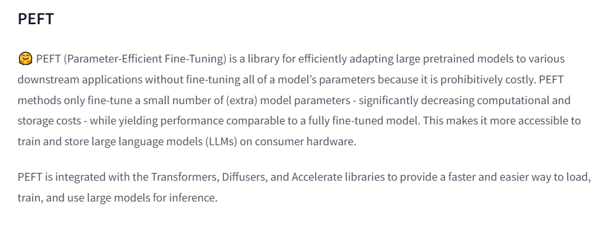

## 1. Parameter-Efficient Fine-Tuning

Parameter-Efficient Fine-Tuning (PEFT) 是一种微调大型预训练模型（如语言模型）的技术，其核心目标是在不显著增加模型参数数量的前提下，调整模型以适应特定的下游任务。这种方法特别适用于资源受限的环境，或者当全模型微调（Full Fine-Tuning）由于计算成本过高而不可行时。

PEFT的主要方法 见  Adapters 和 Soft prompts 的链接。


## 2. PEFT库

PEFT（参数高效微调）是一个库，用于高效地将大型预训练模型适配到各种下游应用，而无需微调模型的所有参数，因为这样做成本过高。PEFT 方法仅微调少量（额外）模型参数，同时产生与完全微调模型相当的性能。这使得在消费硬件上训练和存储大型语言模型 (LLM) 变得更加容易。



PEFT 与 Transformers、Diffusers 和 Accelerate 库集成，提供更快、更简单的方法来加载、训练和使用大型模型进行推理。

PEFT库的使用方法可以概括为以下几个步骤：

### 1. 安装PEFT库

PEFT库可以通过PyPI安装，命令如下：
```bash
pip install peft
```
或者，如果需要从源码安装以获取最新功能，可以使用以下命令：
```bash
pip install git+https://github.com/huggingface/peft
```
对于想要贡献代码或查看实时结果的用户，可以从GitHub克隆仓库并安装可编辑版本：
```bash
git clone https://github.com/huggingface/peft
cd peft
pip install -e .
```


### 2. 配置PEFT方法
每个PEFT方法由一个`PeftConfig`类定义，存储构建`PeftModel`的所有重要参数。以LoRA为例，需要指定任务类型、是否用于推理、低秩矩阵的维度等参数：
```python
from peft import LoraConfig, TaskType
peft_config = LoraConfig(task_type=TaskType.SEQ_2_SEQ_LM, inference_mode=False, r=8, lora_alpha=32, lora_dropout=0.1)
```


### 3. 加载预训练模型并应用PEFT
加载要微调的基础模型，并使用`get_peft_model()`函数包装基础模型和`peft_config`以创建`PeftModel`：
```python
from transformers import AutoModelForSeq2SeqLM
from peft import get_peft_model
model = AutoModelForSeq2SeqLM.from_pretrained("bigscience/mt0-large")
model = get_peft_model(model, peft_config)
```


### 4. 训练模型
现在可以用Transformers的`Trainer`、Accelerate，或任何自定义的PyTorch训练循环来训练模型。例如，使用`Trainer`类进行训练：
```python
from transformers import TrainingArguments, Trainer
training_args = TrainingArguments(
    output_dir="your-name/bigscience/mt0-large-lora",
    learning_rate=1e-3,
    per_device_train_batch_size=32,
    num_train_epochs=2,
    weight_decay=0.01,
)
trainer = Trainer(
    model=model,
    args=training_args,
    train_dataset=tokenized_datasets["train"],
    eval_dataset=tokenized_datasets["test"],
    tokenizer=tokenizer,
    data_collator=data_collator,
    compute_metrics=compute_metrics,
)
trainer.train()
```


### 5. 保存和加载模型
模型训练完成后，可以使用`save_pretrained`函数将模型保存到目录中，或者使用`push_to_hub`函数将模型保存到Hugging Face Hub：
```python
model.save_pretrained("output_dir")
from huggingface_hub import notebook_login
notebook_login()
model.push_to_hub("your-name/bigscience/mt0-large-lora")
```


### 6. 推理
使用`AutoPeftModel`类和`from_pretrained`方法轻松加载任何经过PEFT训练的推理模型：
```python
from peft import AutoPeftModelForCausalLM
from transformers import AutoTokenizer
model = AutoPeftModelForCausalLM.from_pretrained("ybelkada/opt-350m-lora")
tokenizer = AutoTokenizer.from_pretrained("facebook/opt-350m")
inputs = tokenizer("Preheat the oven to 350 degrees and place the cookie dough", return_tensors="pt")
outputs = model.generate(input_ids=inputs["input_ids"], max_new_tokens=50)
print(tokenizer.batch_decode(outputs.detach().cpu().numpy(), skip_special_tokens=True)[0])
```

## 参考

<div id="refer-anchor-1"></div>

[1] [peft](https://huggingface.co/docs/peft/index)

## 欢迎关注我的GitHub和微信公众号[真-忒修斯之船]，来不及解释了，快上船！

[GitHub: LLMForEverybody](https://github.com/luhengshiwo/LLMForEverybody)

仓库上有原始的Markdown文件，完全开源，欢迎大家Star和Fork！