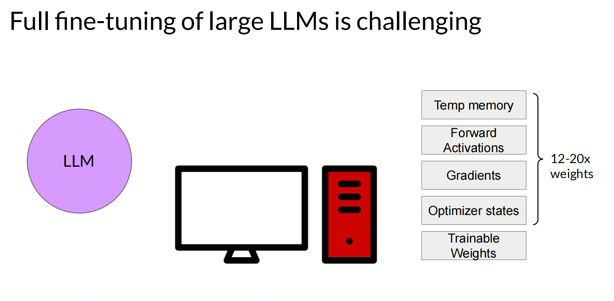
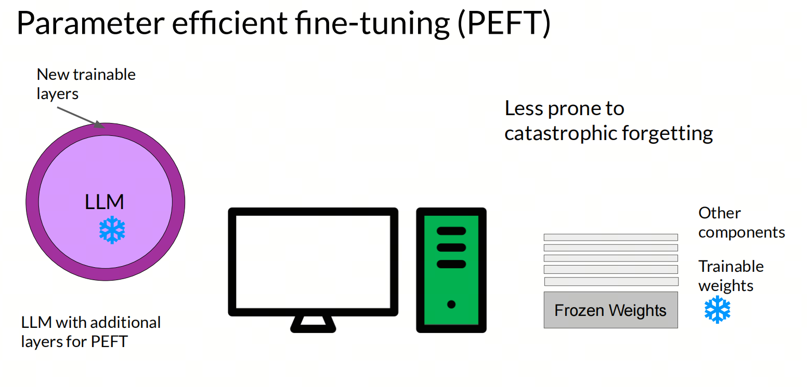
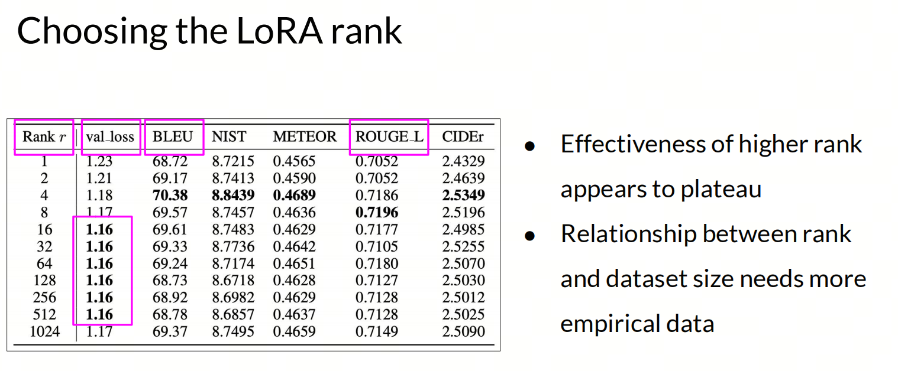
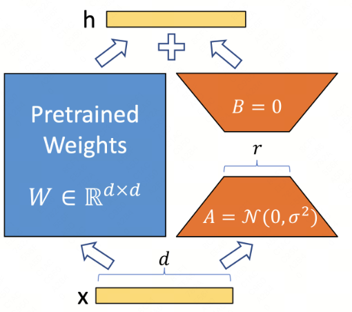

Parameter efficient Fine-tuning (PEFT)
大模型的参数高效微调（PEFT），LoRA微调以及其它

## 1. Fine-tuning

相较于基础大模型动辄万卡的代价，微调可能是普通个人或者企业少数能够接受的后训练大模型(post-training)的方式。

微调是指在一个预训练模型(pre-training)的基础上，通过少量的数据和计算资源，对模型进行进一步训练，以适应特定的任务或者数据集。

微调分为两种类型：全参微调（full fine-tuning）和参数高效微调（parameter efficient fine-tuning）。

- 全参微调：在全参微调中，整个模型的参数都会被更新，这种方法通常需要大量的数据和计算资源，以及较长的训练时间。

## 2. PEFT

参数高效微调（Parameter-Efficient Fine-Tuning，简称PEFT）是一种针对大型预训练模型（如大语言模型）的微调技术，它旨在减少训练参数的数量，从而降低计算和存储成本，同时保持或提升模型性能。

PEFT通过仅微调模型中的一小部分参数，而不是整个模型，来适应特定的下游任务。这种方法特别适用于硬件资源受限的情况，以及需要快速适配多种任务的大型模型。

PEFT有以下几种常见的方法：
- 选择参数子集：选择模型中的一小部分参数进行微调，通常是最后几层的参数；
- 重新参数化：使用低秩表示重新参数化模型权重，代表是LoRA方法；
- 添加参数：向模型添加可训练层或参数，代表为Prompt-tuning方法。

## 3. LoRA
LoRA（Low-Rank Adaptation）是一种参数高效微调技术，主要用于大型预训练模型的微调。它通过在模型的权重矩阵中引入低秩矩阵来实现对模型的调整，从而减少训练参数的数量，降低计算和存储成本。

LoRA的核心思想是，大型模型在进行特定任务的微调时，并不必要更新所有参数。通过仅对模型中一小部分参数进行微调，可以显著减少所需的计算资源，同时保持或提升模型性能。

在具体实现上，LoRA通过在预训练模型的权重矩阵上添加一个可学习的低秩矩阵，来实现对模型的微调。这个低秩矩阵由两个较小的矩阵相乘得到，这两个矩阵在训练过程中进行更新，而原始的预训练权重矩阵则保持不变。

### Q-LoRA
QLoRA（Quantized LoRA）是LoRA的量化版本，通过量化技术进一步降低了模型的存储需求，使得大型模型可以在资源受限的设备上进行训练和部署。

### Rank
矩阵的秩（rank）是矩阵中线性无关行或列的最大数目。在LoRA中，通过引入低秩矩阵，可以减少模型的参数数量，从而降低计算和存储成本。

经验上，4或者8的rank通常能够在保持模型性能的同时，显著减少参数数量。

### LoRA target_modules 目标矩阵是Q？K？V？

为什么LoRA微调偏向于Q和V层而不是K层呢？这主要基于以下几个原因：

- 参数效率：Q层和V层直接影响到注意力权重的计算和最终的输出表示。通过调整Q层，可以影响模型选择关注的信息；而调整V层可以影响模型如何利用这些信息。因此，在这些层上进行微调可以更直接地改变模型的行为；

- 影响信息选择：K层主要影响信息的匹配方式，而在许多情况下，调整Q和V层已足够引导模型关注到更有用的信息上；

- 计算效率：虽然LoRA的目的是通过低秩更新提高参数效率，但在所有层上应用这种更新仍会增加额外的计算负担。选择对最终性能影响最大的层进行调整可以在增加最小计算成本的同时获得最大的性能提升； 

- 实验和经验：实际应用中的经验和研究表明，在Q和V层上应用LoRA微调通常能够有效改善特定任务的性能。这可能是因为这些层在模型中扮演着关键角色，对输出的影响较大； 

此外，对于不同模型的LoRA实现，target_modules参数可以根据模型的架构进行设置。例如，对于T5和MT5模型，默认的target_modules是["q", "v"]，而对于BART和GPT-2模型，则是["q_proj", "v_proj"]。

如果使用的模型不在实现定义的大语言模型列表内，则需要手动指定target_modules。可以通过打印模型的可学习参数名来找到可学习的参数

## 4. Prompt-tuning
Prompt Tuning是一种针对大型预训练模型的微调技术，它通过在输入层引入任务特定的提示（prompt）来适配模型至特定任务，而不需要对整个模型参数进行更新。这种方法的核心优势在于参数效率，即它只需要训练少量的参数，从而降低了计算成本和训练时间。

Prompt Tuning的实现步骤主要包括：

- 定义任务特定的指令（prompt），这些指令作为输入的一部分，用于引导模型完成特定任务;
- 将指令与原始输入数据结合，形成新的输入;
- 利用新的输入对预训练模型进行微调，通常涉及对prompt tokens对应的词向量或由神经网络参数化的向量进行训练，而预训练模型的其他部分参数保持冻结. 

## 5. 其它PEFT方法
除了最流行的LoRA和Prompt-tuning方法外，还有一些其他的参数高效微调方法，如：
P-tuning和Perfix-tuning等。但我也没有细看，工作中也没有用过，所以不做详细介绍。但可以参考Huggingface的PEFT文档。

## 参考

[1] [deeplearning.ai](https://www.deeplearning.ai/courses/generative-ai-with-llms/)

[2] [HuggingFace:PEFT](https://huggingface.co/docs/peft/package_reference/)

[3] [GitHub: LLMForEverybody](https://github.com/luhengshiwo/LLMForEverybody)