# PEFT/LoRA/Prompt-Tuning

## 1. Fine-tuning

相较于基础大模型动辄万卡的代价，微调可能是普通个人或者企业少数能够接受的后训练大模型(post-training)的方式。

微调是指在一个预训练模型(pre-training)的基础上，通过少量的数据和计算资源，对模型进行进一步训练，以适应特定的任务或者数据集。

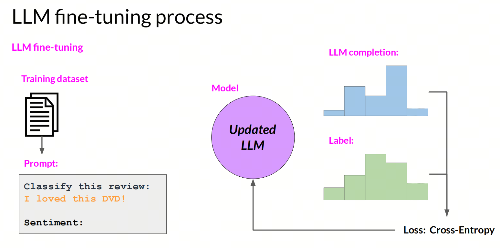

微调分为两种类型：全参微调（full fine-tuning）和参数高效微调（parameter efficient fine-tuning）。

- 全参微调：在全参微调中，整个模型的参数都会被更新，这种方法通常需要大量的数据和计算资源，以及较长的训练时间。

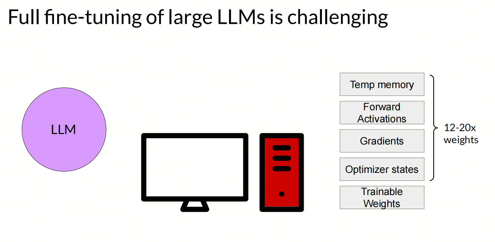

## 2. PEFT

参数高效微调（Parameter-Efficient Fine-Tuning，简称PEFT）是一种针对大型预训练模型（如大语言模型）的微调技术，它旨在减少训练参数的数量，从而降低计算和存储成本，同时保持或提升模型性能。

PEFT通过仅微调模型中的一小部分参数，而不是整个模型，来适应特定的下游任务。这种方法特别适用于硬件资源受限的情况，以及需要快速适配多种任务的大型模型。

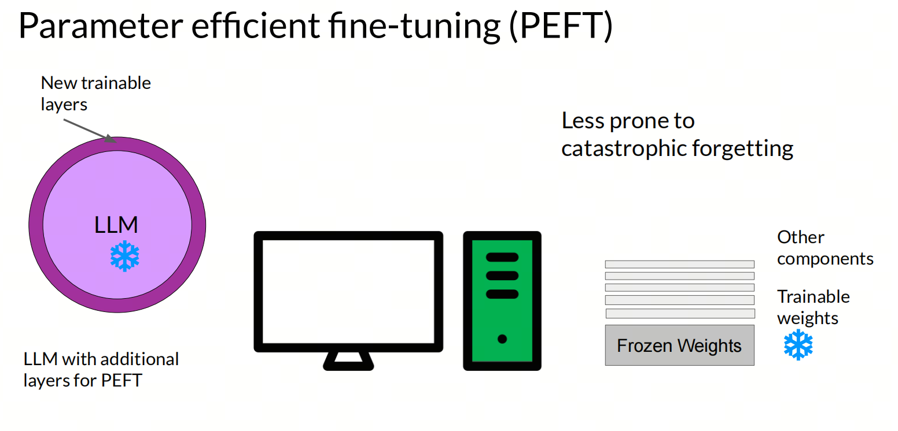

PEFT有以下几种常见的方法：

- 选择参数子集：选择模型中的一小部分参数进行微调，通常是最后几层的参数；
- 重新参数化：使用低秩表示重新参数化模型权重，代表是LoRA方法；
- 添加参数：向模型添加可训练层或参数，代表为Prompt-tuning方法。

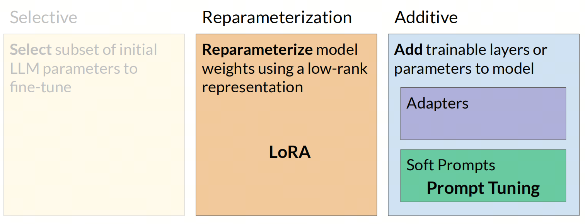

## 3. LoRA

LoRA（Low-Rank Adaptation）是一种参数高效微调技术，主要用于大型预训练模型的微调。它通过在模型的权重矩阵中引入低秩矩阵来实现对模型的调整，从而减少训练参数的数量，降低计算和存储成本。

LoRA的核心思想是，大型模型在进行特定任务的微调时，并不必要更新所有参数。通过仅对模型中一小部分参数进行微调，可以显著减少所需的计算资源，同时保持或提升模型性能。

在具体实现上，LoRA通过在预训练模型的权重矩阵上添加一个可学习的低秩矩阵，来实现对模型的微调。这个低秩矩阵由两个较小的矩阵相乘得到，这两个矩阵在训练过程中进行更新，而原始的预训练权重矩阵则保持不变。

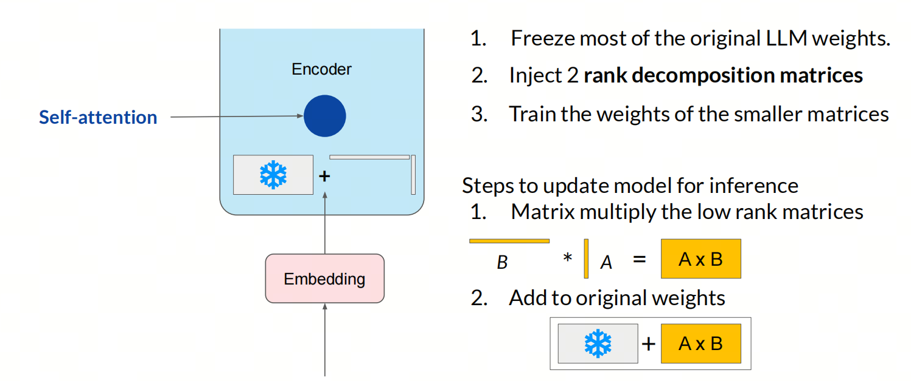

### Q-LoRA

QLoRA（Quantized LoRA）是LoRA的量化版本，通过量化技术进一步降低了模型的存储需求，使得大型模型可以在资源受限的设备上进行训练和部署。

### Rank

矩阵的秩（rank）是矩阵中线性无关行或列的最大数目。在LoRA中，通过引入低秩矩阵，可以减少模型的参数数量，从而降低计算和存储成本。

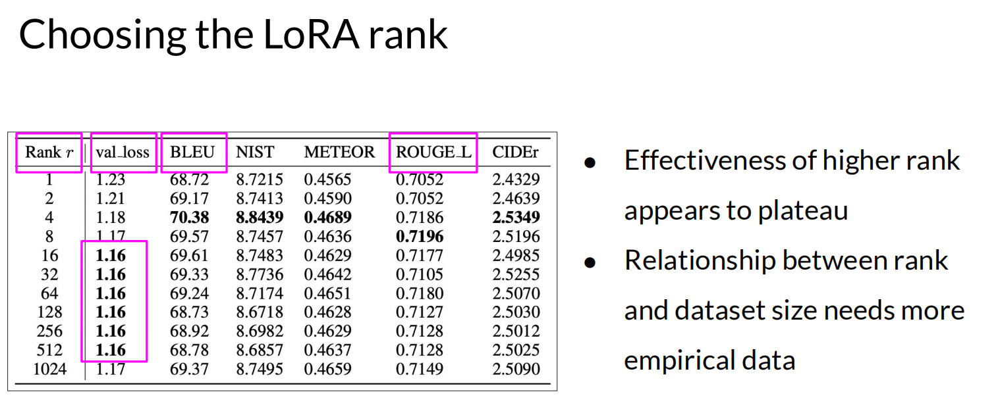

经验上，4或者8的rank通常能够在保持模型性能的同时，显著减少参数数量。

### LoRA target_modules 目标矩阵是Q？K？V？

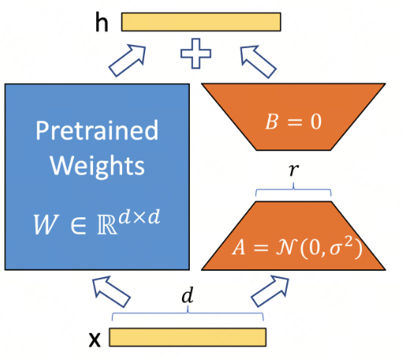


为什么LoRA微调偏向于Q和V层而不是K层呢？这主要基于以下几个原因：

- 参数效率：Q层和V层直接影响到注意力权重的计算和最终的输出表示。通过调整Q层，可以影响模型选择关注的信息；而调整V层可以影响模型如何利用这些信息。因此，在这些层上进行微调可以更直接地改变模型的行为；

- 影响信息选择：K层主要影响信息的匹配方式，而在许多情况下，调整Q和V层已足够引导模型关注到更有用的信息上；

- 计算效率：虽然LoRA的目的是通过低秩更新提高参数效率，但在所有层上应用这种更新仍会增加额外的计算负担。选择对最终性能影响最大的层进行调整可以在增加最小计算成本的同时获得最大的性能提升； 

- 实验和经验：实际应用中的经验和研究表明，在Q和V层上应用LoRA微调通常能够有效改善特定任务的性能。这可能是因为这些层在模型中扮演着关键角色，对输出的影响较大； 

此外，对于不同模型的LoRA实现，target_modules参数可以根据模型的架构进行设置。例如，对于T5和MT5模型，默认的target_modules是["q", "v"]，而对于BART和GPT-2模型，则是["q_proj", "v_proj"]。

如果使用的模型不在实现定义的大语言模型列表内，则需要手动指定target_modules。可以通过打印模型的可学习参数名来找到可学习的参数


## 4. Prompt-tuning

Prompt Tuning是一种针对大型预训练模型的微调技术，它通过在输入层引入任务特定的提示（prompt）来适配模型至特定任务，而不需要对整个模型参数进行更新。这种方法的核心优势在于参数效率，即它只需要训练少量的参数，从而降低了计算成本和训练时间。

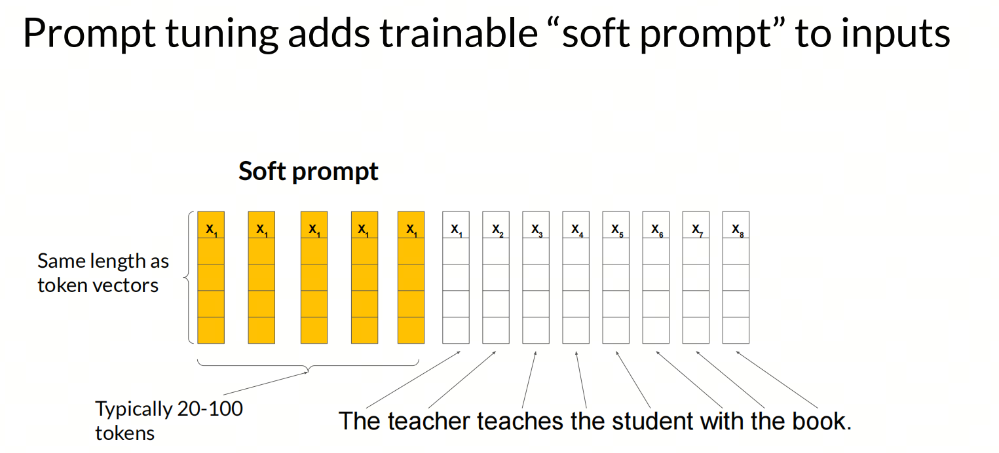

Prompt Tuning的实现步骤主要包括：

- 定义任务特定的指令（prompt），这些指令作为输入的一部分，用于引导模型完成特定任务;
- 将指令与原始输入数据结合，形成新的输入;
- 利用新的输入对预训练模型进行微调，通常涉及对prompt tokens对应的词向量或由神经网络参数化的向量进行训练，而预训练模型的其他部分参数保持冻结. 

## 5. 其它PEFT方法

除了最流行的LoRA和Prompt-tuning方法外，还有一些其他的参数高效微调方法，如：
P-tuning和Perfix-tuning等。但我也没有细看，工作中也没有用过，所以不做详细介绍。但可以参考Huggingface的PEFT文档。


# 大模型微调框架

## 一 综述

### 什么是大模型的微调

大模型的微调（Fine-tuning），通常是指在已经预训练好的大型语言模型（Large Language Models，简称LLMs）基础上，使用特定的数据集进行进一步的训练，以使模型适应特定的任务或领域。这个过程可以让模型学习到特定领域的知识，优化其在特定NLP任务中的表现，比如情感分析、实体识别、文本分类、对话生成等。

1. **预训练模型**：在微调之前，大模型通常已经经过大量的无监督预训练，这使得模型掌握了语言的基本统计特征和知识，具备了预测下一个词的能力。

2. **任务特定的数据集**：微调时，会使用与特定任务相关的标注数据对模型进行训练。这些数据提供了模型需要学习的特定领域的信息。

3. **权重调整**：微调过程中，模型的权重会根据特定任务的数据进行调整。这可以是全量参数更新（Full Fine-tuning），也可以是参数高效微调（Parameter-Efficient Fine-Tuning，PEFT），后者只更新模型中的一部分参数。

### PEFT（Parameter-Efficient Fine-Tuning）

与传统的微调方法相比，PEFT有效地降低了计算和内存需求，因为它只对模型参数的一小部分进行微调，同时冻结大部分预训练网络。这种策略减轻了大语言模型灾难性的遗忘，并显著降低了计算和存储成本。

PEFT的主要方法 见  Adapters 和 Soft prompts 的链接。


### 框架综述

1. **huggingface/peft**[1](#refer-anchor-1)：huggingface开源的参数高效微调（Parameter-Efficient Fine-Tuning）基础工具；


2. **modelscope/ms-swift**[2](#refer-anchor-2)：modelscope开源的轻量级微调框架，以中文大模型为主，支持各类微调方法。可以通过执行脚本进行微调，也可以在代码环境中一键微调，自带微调数据集和验证数据集，可以一键微调+模型验证；

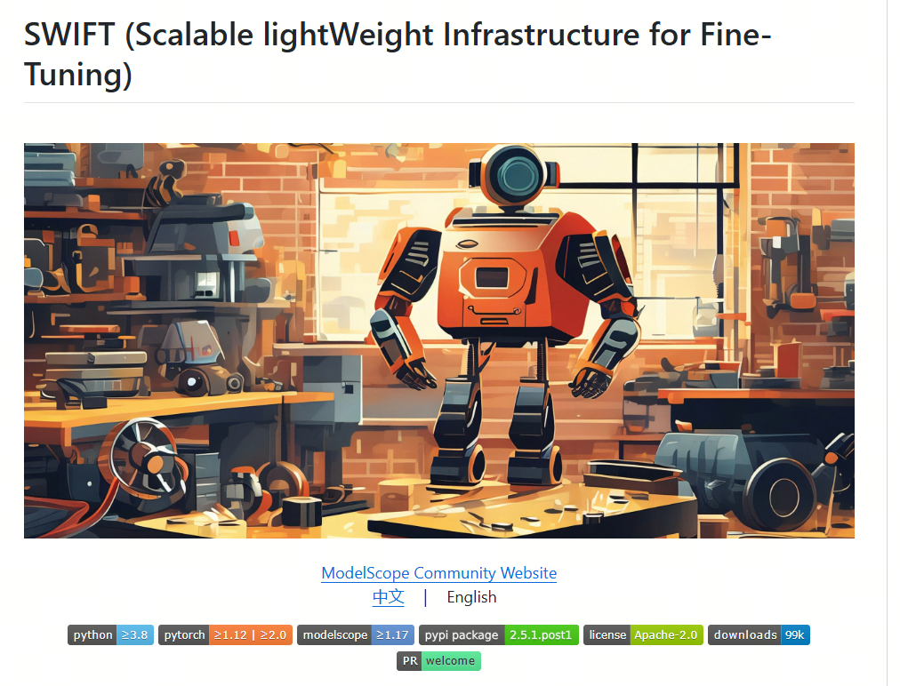

3. **hiyouga/LLaMA-Factory**[3](#refer-anchor-3)：一个全栈微调工具，支持海量模型+各种主流微调方法。它支持运行脚本微调、基于Web端微调，并自带基础训练数据集。除微调外，还支持增量预训练和全量微调；


4. **NVIDIA/Megatron-LM**[4](#refer-anchor-4)：NVIDIA开发的大模型训练框架，支持大规模的预训练和微调。适用于需要极高性能和规模的大模型训练和微调。


## 二 Huggingface-PEFT

### 1. Parameter-Efficient Fine-Tuning

Parameter-Efficient Fine-Tuning (PEFT) 是一种微调大型预训练模型（如语言模型）的技术，其核心目标是在不显著增加模型参数数量的前提下，调整模型以适应特定的下游任务。这种方法特别适用于资源受限的环境，或者当全模型微调（Full Fine-Tuning）由于计算成本过高而不可行时。

PEFT的主要方法 见  Adapters 和 Soft prompts 的链接。

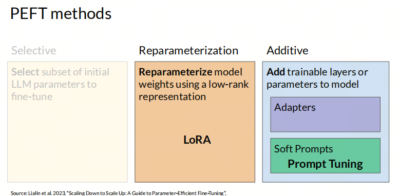

### 2. PEFT库

PEFT（参数高效微调）是一个库，用于高效地将大型预训练模型适配到各种下游应用，而无需微调模型的所有参数，因为这样做成本过高。PEFT 方法仅微调少量（额外）模型参数，同时产生与完全微调模型相当的性能。这使得在消费硬件上训练和存储大型语言模型 (LLM) 变得更加容易。

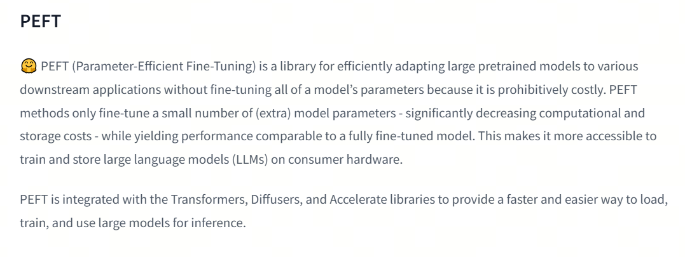

PEFT 与 Transformers、Diffusers 和 Accelerate 库集成，提供更快、更简单的方法来加载、训练和使用大型模型进行推理。

PEFT库的使用方法可以概括为以下几个步骤：

#### 1. 安装PEFT库

PEFT库可以通过PyPI安装，命令如下：

```bash
pip install peft
```

或者，如果需要从源码安装以获取最新功能，可以使用以下命令：

```bash
pip install git+https://github.com/huggingface/peft
```

对于想要贡献代码或查看实时结果的用户，可以从GitHub克隆仓库并安装可编辑版本：

```bash
git clone https://github.com/huggingface/peft
cd peft
pip install -e .
```

#### 2. 配置PEFT方法

每个PEFT方法由一个`PeftConfig`类定义，存储构建`PeftModel`的所有重要参数。以LoRA为例，需要指定任务类型、是否用于推理、低秩矩阵的维度等参数：

```python
from peft import LoraConfig, TaskType
peft_config = LoraConfig(task_type=TaskType.SEQ_2_SEQ_LM, inference_mode=False, r=8, lora_alpha=32, lora_dropout=0.1)
```

#### 3. 加载预训练模型并应用PEFT

加载要微调的基础模型，并使用`get_peft_model()`函数包装基础模型和`peft_config`以创建`PeftModel`：

```python
from transformers import AutoModelForSeq2SeqLM
from peft import get_peft_model
model = AutoModelForSeq2SeqLM.from_pretrained("bigscience/mt0-large")
model = get_peft_model(model, peft_config)
```

#### 4. 训练模型

现在可以用Transformers的`Trainer`、Accelerate，或任何自定义的PyTorch训练循环来训练模型。例如，使用`Trainer`类进行训练：

```python
from transformers import TrainingArguments, Trainer
training_args = TrainingArguments(
    output_dir="your-name/bigscience/mt0-large-lora",
    learning_rate=1e-3,
    per_device_train_batch_size=32,
    num_train_epochs=2,
    weight_decay=0.01,
)
trainer = Trainer(
    model=model,
    args=training_args,
    train_dataset=tokenized_datasets["train"],
    eval_dataset=tokenized_datasets["test"],
    tokenizer=tokenizer,
    data_collator=data_collator,
    compute_metrics=compute_metrics,
)
trainer.train()
```

#### 5. 保存和加载模型

模型训练完成后，可以使用`save_pretrained`函数将模型保存到目录中，或者使用`push_to_hub`函数将模型保存到Hugging Face Hub：

```python
model.save_pretrained("output_dir")
from huggingface_hub import notebook_login
notebook_login()
model.push_to_hub("your-name/bigscience/mt0-large-lora")
```

#### 6. 推理

使用`AutoPeftModel`类和`from_pretrained`方法轻松加载任何经过PEFT训练的推理模型：

```python
from peft import AutoPeftModelForCausalLM
from transformers import AutoTokenizer
model = AutoPeftModelForCausalLM.from_pretrained("ybelkada/opt-350m-lora")
tokenizer = AutoTokenizer.from_pretrained("facebook/opt-350m")
inputs = tokenizer("Preheat the oven to 350 degrees and place the cookie dough", return_tensors="pt")
outputs = model.generate(input_ids=inputs["input_ids"], max_new_tokens=50)
print(tokenizer.batch_decode(outputs.detach().cpu().numpy(), skip_special_tokens=True)[0])
```


## 三 LLama-Factory

很多人第一次接触大模型微调，是从LLama-Factory 的 LoRA开始的，类似于之前数据科学家从Kaggle的泰坦尼克号生存预测开始一样，LLama-Factory的LoRA是一个很好的开始。

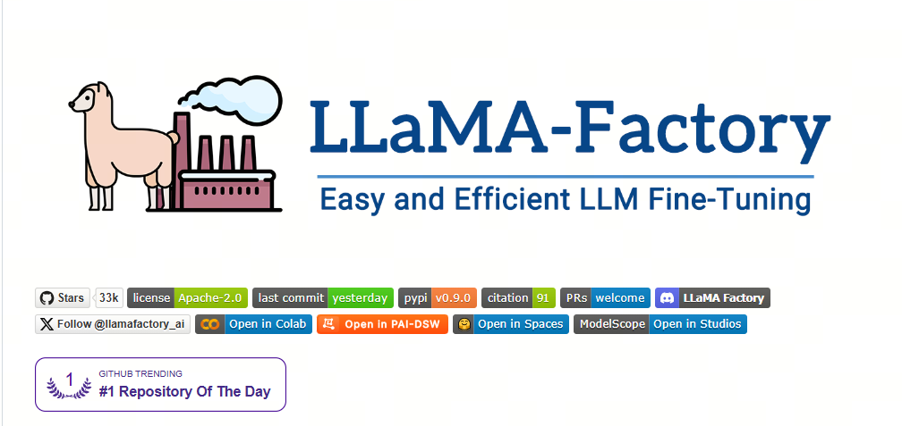

### 1.Web-UI

LLaMA Factory 提供了一个用户友好的可视化界面（WebUI），使得用户可以无需编写代码即可进行大型语言模型的微调。

**界面概览**：

   - LLaMA Factory 的 WebUI 主要分为四个界面：训练、评估与预测、对话、导出。

**训练界面**：

   - 用户可以在训练界面中指定模型名称及路径、训练阶段、微调方法、训练数据集、学习率、训练轮数等训练参数，并启动训练。
   - 支持断点重连，适配器断点保存于 `output_dir` 目录下。

**评估预测与对话界面**：

   - 在模型训练完毕后，用户可以在评估与预测界面通过指定模型及适配器的路径在指定数据集上进行评估。
   - 用户也可以通过对话界面与模型进行对话，观察模型效果。

**导出界面**：

   - 如果用户对模型效果满意并需要导出模型，可以在导出界面通过指定模型、适配器、分块大小、导出量化等级及校准数据集、导出设备、导出目录等参数后点击导出按钮导出模型。

**使用步骤**：

   - 用户可以通过浏览器访问 `http://localhost:7860` 进入 Web 界面，进行模型选择、参数配置，并监控训练任务的进度。
   - 支持切换语言为中文，方便国内用户使用。

**支持的模型和数据集**：

   - LLaMA Factory 支持多种预训练模型，如LLaMA、BLOOM、Mistral等，并且可以自动下载并缓存魔搭社区（ModelScope）的模型和数据集资源。

**微调方法**：

   - 提供多种微调方法选择，包括全参数微调、冻结微调、LoRA微调等。

**参数配置**：

   - WebUI 允许用户通过简单的拖放和参数调整来优化模型，使得即使是不熟悉编程的用户也能轻松参与模型优化的过程。

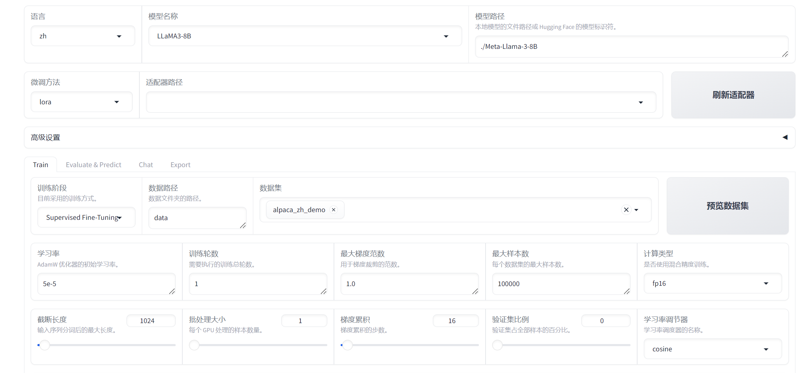

### 2.LoRA 之外

LLaMA-Factory 提供了一系列高阶功能，以支持复杂的大模型微调和部署需求：

**多模型兼容**：LLaMA-Factory 支持多种大型语言模型，如 LLaMA、BLOOM、Mistral、Baichuan、Qwen、ChatGLM 等；

**训练算法集成**：框架集成了多种训练算法，包括增量预训练、指令监督微调、奖励模型训练、PPO训练、DPO训练、KTO训练、ORPO训练等；

**运算精度与优化算法**：提供多种运算精度选择，如32比特全参数微调、16比特冻结微调、16比特LoRA微调，以及基于AQLM/AWQ/GPTQ/LLM.int8的2/4/8比特QLoRA微调。同时支持GaLore、DoRA、LongLoRA、LLaMA Pro、LoRA+、LoftQ和Agent微调等先进算法；

**推理引擎支持**：支持 Transformers 和 vLLM 推理引擎，为用户提供灵活的推理选项；

**实验面板集成**：与 LlamaBoard、TensorBoard、Wandb、MLflow 等多种实验面板工具集成，方便监控和分析训练过程；

**API Server功能**：LLaMA-Factory 支持启动 API Server，允许用户通过 API 接口调用模型，方便模型的集成和应用；

**大模型评测 benchmark**：提供大模型主流评测 benchmark 工具，帮助用户评估模型性能；

**Docker 安装与华为 NPU 适配**：支持 Docker 安装和在华为 NPU 上的适配使用，增加了框架的可移植性和硬件兼容性；

**量化技术**：支持 PTQ、QAT、AQLM、OFTQ 等量化技术，优化模型部署效率和性能；

这些高阶功能使得 LLaMA-Factory 不仅能够支持基础的模型微调，还能够满足更复杂的研究和应用需求，为用户提供了一个强大而灵活的工具集。


# Adapters

## 一 综述

大家应该都知道LoRA了，这是非常流行的PEFT方法，属于Adapters的一种。Adapters是一种非常好的微调大模型的方法，可以在不改变原模型参数的情况下，增加新的任务。这个系列会介绍Adapters的几种变种，包括LoRA、QLoRA、AdaLoRA等。

之前我们介绍过PEFT的Soft Prompts系列，这次我们介绍Adapter系列，重点放在LoRA和几个变种上。

### Adpater

基于适配器Adapter的方法在冻结的预训练模型的注意层和全连接层之后添加额外的可训练参数，以减少内存使用量并加快训练速度。该方法因Adapter而异，它可能只是一个额外的添加层，也可能将权重更新 ∆W 表示为权重矩阵的低秩分解。无论哪种方式，适配器通常都很小，但表现出与完全微调模型相当的性能，并且能够用更少的资源训练更大的模型。

### 常见的Adapters方法

#### LoRA

LoRA（Low-Rank Adapter）[1](#refer-anchor-1) 是最流行的 PEFT 方法之一，如果你刚开始使用 PEFT，它是一个很好的起点。它最初是为大型语言模型开发的，但由于其效率和有效性，它是一种非常流行的扩散模型训练方法。


LoRA 通过低秩分解用两个较小的矩阵（称为更新矩阵）表示权重更新 ∆W。这些新矩阵可以训练以适应新数据，同时保持参数总数较低。原始权重矩阵保持冻结状态，不会收到任何进一步的更新。为了产生最终结果，将原始权重和额外调整后的权重组合在一起。你还可以将适配器权重与基础模型合并，以消除推理延迟。

#### QLoRA

QLoRA（Quantized Low-Rank Adapter）[2](#refer-anchor-2)是一种新型的微调大型语言模型（LLM）的方法，它能够在减少内存使用的同时保持模型性能。这一技术由华盛顿大学提出，主要针对内存需求巨大的问题，使得在单个48GB GPU上微调650亿个参数的模型成为可能，同时保持完整的16位微调任务性能。

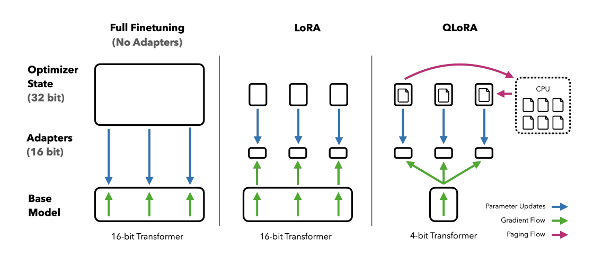

QLoRA的工作原理是先将预训练语言模型进行4位量化，显著减少模型的内存占用，然后使用低阶适配器（LoRA）方法对量化的模型进行微调。这种方法不仅减少了模型的体积，提高了速度，而且还保留了原始预训练语言模型的大部分准确性。

#### AdaLoRA

看到Ada，就得知道是Adaptive的意思。

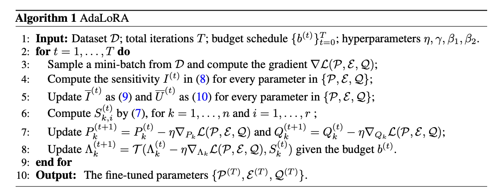

AdaLoRA（Adaptive Low-Rank Adapter）[3](#refer-anchor-3)是一种用于高效微调大型预训练语言模型的方法，它能够自适应地根据权重矩阵的重要性来分配参数预算。这种方法通过将权重矩阵的增量更新参数化为奇异值分解（Singular Value Decomposition, SVD）的形式，有效地剪枝不重要更新的奇异值，减少它们的参数预算，同时避免了进行密集的精确SVD计算。

AdaLoRA包含两个主要模块：

- SVD形式参数更新：直接将增量矩阵Δ参数化为SVD的形式，从而避免了在训练过程中进行SVD计算带来的资源消耗；

- 基于重要程度的参数分配：基于新的重要性度量标准，动态地在增量矩阵之间分配参数预算，通过操纵奇异值来实现

## 二 LoRA

LoRA（Low-Rank Adapter）[1](#refer-anchor-1) 是最流行的 PEFT 方法之一，如果你刚开始使用 PEFT，它是一个很好的起点。它最初是为大型语言模型开发的，但由于其效率和有效性，它是一种非常流行的扩散模型训练方法。

### 1.技术解读

.gif>)

在大型语言模型中，权重矩阵通常具有较大的维度，这使得在微调时需要处理大量的参数。LoRA方法通过将这些大的权重矩阵分解为两个较小的矩阵的乘积（即低秩分解），来近似表示原始的权重矩阵。这样做的好处是，我们只需要更新这两个较小矩阵的参数，而不是原始大矩阵的所有参数，大大减少了微调的计算成本。

LoRA的实施过程大致如下：

1. 选择模型中需要微调的层（如Transformer模型中的自注意力层）；
2. 在这些层的权重矩阵中引入两个新的可训练矩阵A和B，它们的维度远小于原始权重矩阵；
3. 在模型的前向传播过程中，通过计算原始权重矩阵与矩阵A和B乘积的和来得到新的输出，其中矩阵A和B的乘积代表了低秩矩阵的更新；
4. 在训练过程中，只更新A和B的参数，而保持原始权重矩阵不变；

LoRA的优点在于它能够在保持模型性能的同时，显著减少微调所需的计算资源，这对于资源有限的研究和应用场景非常有价值。此外，LoRA还可以与其他参数高效微调技术结合使用，进一步提高微调的效率。

需要注意的是，LoRA方法的秩（即矩阵A和B的维度）是一个重要的超参数，需要根据具体任务进行调整。较低的秩可以进一步减少参数数量，但可能会导致模型无法充分学习到任务特定的信息；而较高的秩则可能需要更多的计算资源，但可以提供更好的微调性能。

### 2.直观理解

想象一下，你已经是一个经验丰富的厨师，这意味着你已经拥有一套完整的烹饪技巧（这就像是一个预训练的语言模型）。现在，如果你想要学习如何制作一种特定的新菜肴，比如寿司，你不需要重新学习所有的烹饪技巧，你只需要学习一些新的特定技能，比如如何正确切割鱼片（这就是微调）。

在LoRA中，我们把这个过程想象成在原有的烹饪技巧（模型的权重）基础上，添加一些新的小工具或技巧。这些新的工具或技巧可以看作是两个小的矩阵（A和B），它们结合起来可以帮助你更好地制作寿司，但它们本身并不包含所有的烹饪技巧，只是针对寿司制作的一些关键点。


## 三 QLoRA

### 1.技术解读


QLoRA（Quantized Low-Rank Adaptation）是一种针对大型预训练语言模型（LLM）的高效微调技术。它结合了量化和低秩适配（LoRA）两种技术，旨在减少模型微调过程中的内存占用和计算成本，同时尽量保持模型性能。

在QLoRA中，首先对模型的权重进行4位量化，这意味着模型的每个权重被表示为4位的数值，显著减少了模型的内存占用。量化后的模型参数以一种称为NormalFloat（NF4）的数据类型存储，这种数据类型特别适合表示正态分布的数据，并且可以比传统的4位整数或浮点数提供更好的量化效果。

接下来，QLoRA利用LoRA技术，通过在模型中引入可训练的低秩矩阵来进一步微调模型。这些低秩矩阵作为适配器，被添加到模型的特定层中，并且只有这些适配器的参数在微调过程中被更新，而模型的原始参数保持不变。这样做的好处是，可以针对特定任务微调模型的行为，而不需要对整个模型进行昂贵的更新。

此外，QLoRA还采用了一种称为双重量化的技术，对量化过程中使用的缩放因子（scale factor）和偏移量（offset）进行再次量化，从而进一步减少内存占用。

QLoRA的另一个关键技术是利用NVIDIA的统一内存进行分页优化。这种方法可以有效地管理内存使用，特别是在处理长序列数据时，可以避免内存峰值过高的问题。

### 2.直观理解

想象一下，你有一本厚厚的百科全书，这本书包含了所有的知识（就像一个大型预训练语言模型）。现在，你想根据你的特定需求来更新这本书（微调模型）。但是，整本书重新打印非常耗时且成本高昂。

QLoRA的做法就像是你不需要重新打印整本书，你只需要在书的某些页面上贴几个小便利贴（低秩适配器）。这些便利贴包含了你需要的新信息，而且它们很小，不会占用太多空间。

1. 量化：首先，你把百科全书中的一些文字和图片变成更小的版本，比如把彩色照片换成黑白的，并且缩小尺寸（这就像是4位量化，减少模型大小）。

2. 便利贴：然后，你在需要更新的页面上贴上便利贴，这些便利贴包含了最新的信息（这就像是在模型的关键部分添加低秩适配器）。

3. 节省空间：由于便利贴很小，你不需要为整本书找到额外的空间（这就像是QLoRA减少了模型微调时的内存需求）。

4. 保持性能：尽管你只更新了一小部分内容，但这本书仍然非常有用，因为大部分知识都还在（这就像是QLoRA在减少资源消耗的同时，保持了模型的性能）。

5. 更高效：你不需要重新学习整本书，只需要看看那些便利贴，就可以快速找到你需要的信息（这就像是QLoRA使得模型微调更加高效）。

所以，QLoRA就是一种聪明的方法，让你在不重新打印整本百科全书的情况下，快速且经济地更新知识。


## AdaLoRA

### 1.技术解读


AdaLoRA是一种对LoRA技术的改进，它的核心思想是根据模型中不同权重矩阵的重要性来动态分配参数预算。换句话说，它让模型自己决定哪些部分在微调时更重要，从而在这些部分使用更多的参数进行更新，而对于不那么重要的部分则减少参数更新，以此来提高微调效率和模型性能。

AdaLoRA通过奇异值分解（Singular Value Decomposition, SVD）来评估每个矩阵的重要性。在SVD中，一个矩阵可以被分解为三个特定的矩阵，其中一个包含了所谓的奇异值，这些奇异值可以告诉我们矩阵的哪些部分是重要的。AdaLoRA利用这些信息来动态调整每个LoRA矩阵的秩，秩较高的矩阵会有更多的参数被更新，而秩较低的则反之。

AdaLoRA的这种方法使得模型能够在保持整体参数量不变的情况下，对不同部分进行不同程度的微调，从而在有限的资源下实现更优的性能。这就像是老师在指导学生学习时，会根据每个学生在不同科目上的表现来分配辅导时间，表现较差的科目会得到更多的关注和资源，而表现好的科目则不需要那么多的辅导时间。

### 2.直观理解

想象一下，你是一个厨师，你有一个巨大的菜谱书（就像一个大型的语言模型），这本书里有很多不同的菜谱（模型的参数）。现在，你想在这本书里加一些新的菜谱或者修改一些旧的菜谱，以便做出更符合特定口味的菜肴（微调模型以适应新任务）。

在传统的微调中，你可能需要一页一页地去修改这本书，这非常耗时和费力。而LoRA方法就像是你只需要在书的某些页面上贴便利贴，写下新的修改（在模型中添加低秩矩阵进行更新）。

但AdaLoRA更聪明，它不仅贴便利贴，还会根据每个菜谱的重要性来决定贴多少便利贴。比如，对于一道非常重要的新菜，你可能会在相关的页面上贴更多的便利贴，写下更详细的步骤和技巧。而对于已经很好的菜谱，你可能只需要贴一两个便利贴，做一点点调整。

AdaLoRA通过一种特殊的方法（奇异值分解）来决定哪些部分更重要，然后在这些部分使用更多的参数（便利贴）进行更新。这就像是你根据菜谱的使用频率和效果来决定投入多少精力去改进它们。

最终，AdaLoRA使得你不需要修改整本书（不需要更新所有模型参数），而是聪明地在关键的地方做修改，这样既节省了时间，又确保了菜肴的质量（提高了模型的性能和效率）。


# Soft prompts

## 一 概述

### 1. Prompting

训练大型预训练语言模型非常耗时且计算密集。随着模型规模的增长，人们越来越关注更高效的训练方法，比如Prompting。Prompting通过包含一段描述任务或展示任务示例的文本提示，为特定的下游任务调整一个冻结的预训练模型。有了Prompting，你可以避免为每个下游任务完全训练一个单独的模型，而是使用同一个冻结的预训练模型。这样做轻松得多，因为你可以用同一个模型处理多个不同的任务，而且训练和存储一小套提示参数比训练所有模型参数要高效得多。

### 2. Soft prompts

Soft Prompts（软提示）与Hard Prompts（硬提示）相对。软提示是可学习的连续向量，可以通过梯度优化方法针对特定数据集进行优化。这种方法不需要人工设计，可以自动优化以适应不同任务，计算效率高，支持多任务学习。然而，软提示不可读，无法解释为何选择这些向量。

软提示的工作原理是在模型输入层增加可学习的投影层，将原始输入映射到提示信息所表示的语义空间中。投影层中的参数通过训练数据学习得到，使得提示信息能够更好地适应任务需求。

### 3. 主流方法

#### 3.1 Prompt Tuning

Prompt Tuning[1](#refer-anchor-1)的核心思想在于prompt tokens有自己的参数，这些参数可以独立更新。这意味着你可以保持预训练模型的参数不变，只更新prompt tokens的嵌入向量的梯度。这样的结果与传统的训练整个模型的方法相当，并且随着模型大小的增加，Prompt Tuning的性能也会提升。


#### 3.2 Prefix-Tuning

Prefix-Tuning[2](#refer-anchor-2)是Prompt Tuning的一种变体，它通过在模型输入的前缀位置添加可学习的提示向量来实现。这种方法的优势在于可以在不改变模型结构的情况下，为不同的任务提供不同的提示。

Prefix-Tuning和Prompt Tuning最主要区别在于，Prefix-Tuning的前缀参数被插入到模型的所有层中，而Prompt Tuning只将提示参数添加到模型的embedding层。


#### 3.3 P-Tuning

P-tuning[3](#refer-anchor-3)主要是为自然语言理解（NLU）任务设计的，它是Soft prompts的另一种变体。P-tuning 添加了一个可训练的嵌入张量，这个张量可以被优化以找到更好的提示，并且它使用一个提示编码器（一个双向长短期记忆网络或LSTM）来优化提示参数。

P-tuning的特点是将Decoder架构的模型变得适应Encoder架构的任务，如NLU任务。


#### 3.4 Multitask prompt tuning

多任务提示调整（MPT）[4](#refer-anchor-4)是一种从数据中学习单一提示的方法，该提示可以用于多种任务类型，并可以共享以适应不同的目标任务。与之相对的其他现有方法则为每个任务学习一个单独的软提示，这些提示需要被检索或聚合以适应目标任务。

简而言之：MPT先学习一个通用的提示，然后再根据具体任务进行调整。


## 二 Prompt Tuning

在2021年，大型语言模型的概念尚未完全清晰，人们对其的认识还处于探索阶段。在众多研究焦点中，Casual Language Model（仅解码器模型）只是其中之一。当时，GPT-3的问世引起了广泛关注。紧接着，在同年4月，谷歌推出了Prompt Tuning方法，最初在T5模型上进行实验——T5采用的是编码器-解码器架构。随后，Prompt Tuning在其他下游任务上也显示出了其有效性。

### 技术解读


Prompt Tuning是一种高效的微调方法，它通过在模型输入中添加特定的文本提示（prompt）来适配下游任务，而不需要对预训练模型的参数进行全面的更新。这种方法的核心在于，它通过优化输入提示的参数来调整模型的行为，使得模型能够更好地适应新的任务，而预训练模型的主体参数保持不变。

Prompt Tuning的关键优势在于它的参数效率。相比于传统的微调方法，Prompt Tuning只需要更新一小部分参数，即与提示相关的参数，这样可以显著减少所需的计算资源和训练时间
。此外，Prompt Tuning还可以提高模型的泛化能力，因为它允许模型在没有大量标注数据的情况下适应新任务。

Prompt Tuning的过程通常包括以下几个步骤：

1. 选择一个预训练模型作为基础；
2. 为特定任务设计或选择一个提示模板；
3. 将提示模板与输入数据结合，形成新的输入序列；
4. 在预训练模型上进行训练，只更新提示模板的参数；
5. 使用测试数据集评估模型的性能。

### 直观解释

Prompt Tuning的核心思想在于prompt tokens有自己的参数，这些参数可以独立更新。这意味着你可以保持预训练模型的参数不变，只更新prompt tokens的嵌入向量的梯度。这样的结果与传统的训练整个模型的方法相当，并且随着模型大小的增加，Prompt Tuning的性能也会提升。


## 三 Prefix-Tuning

同样在2021年（和Prompt Tuning同一年），Prefix-Tuning被提出，它通过在模型输入的前缀位置添加可学习的提示向量来实现。这种方法的优势在于可以在不改变模型结构的情况下，为不同的任务提供不同的提示。

### 技术解读


Prefix Tuning是一种用于自然语言生成任务的参数高效微调技术。它的核心思想是在模型的输入序列前添加一系列连续的任务特定向量，这些向量被称为前缀（prefix）。这些前缀向量是可训练的，而预训练语言模型（PLM）的其他参数则保持固定。

在Prefix Tuning中，模型的输入不仅包括原始的任务输入，还包括这些前缀向量。在自回归语言模型（如GPT-2）中，前缀被添加到输入序列的开始处，形成新的输入序列。在编码器-解码器架构模型（如BART）中，前缀不仅添加到输入序列的开始处，还添加到解码器的输入中。这样，模型在处理输入序列时，每一层的输入都会包含这些额外的前缀向量，从而适配下游任务。

Prefix Tuning的一个关键优势是它的参数效率。它只需要更新一小部分参数，即前缀向量，而不需要更新整个模型的参数。这大大减少了所需的计算资源和存储需求。此外，由于只更新前缀向量，Prefix Tuning可以更容易地适应多个任务，而不需要为每个任务训练和存储一个完整的模型副本。

在实际应用中，Prefix Tuning已被证明在多种自然语言处理任务中有效，包括文本生成、摘要生成等。它通过在模型的输入中添加可训练的前缀向量，使得模型能够在不改变原有参数的情况下，更好地适应特定的下游任务.

### 直观解释

Prefix-Tuning和Prompt Tuning最主要区别在于，Prefix-Tuning的前缀参数被插入到模型的所有层中，而Prompt Tuning只将提示参数添加到模型的embedding层。


## 四 P-Tuning

P—Tuning是为了解决NLU任务而设计的Soft prompts方法，P-tuning添加了一个可训练的嵌入张量，这个张量可以被优化以找到更好的提示，并且它使用一个提示编码器（例如BiLSTM+MLP）来优化提示参数。

### 技术解读


P-tuning有两个版本，P-tuning v1（2021年）和P-tuning v2（2023年）。P-tuning v1通过使用一个prompt encoder（例如BiLSTM+MLP）来优化prompt参数，但这种方法在一些复杂的自然语言理解（NLU）任务上效果不佳，且只在较大的模型规模上表现良好。

为了解决这些问题，P-tuning v2被提出。P-tuning v2在v1的基础上进行了改进，它不仅在输入层，而且在模型的每一层都加入了可训练的连续提示，这样可以更好地适应各种任务，包括复杂的NLU任务。P-tuning v2通过多任务学习策略和深度提示编码器来优化提示参数，使得它在不同规模的模型上都能取得与全参数微调相媲美的性能。

### 直观解释

P-Tuning最大的特点是将通过引入BiLSTM/MLP的方法，使得模型可以更好的完成NLU任务。这种方法的优势在于可以在不改变模型结构的情况下，为decoder架构的模型提供encoder架构的特性。


## 五 Multitask prompt tuning

2023年5月，时隔2年后，soft-prompts又有了新方法，我第一次看到这个方法的时候，心里闪过一个词：一顿操作猛如虎。我的表情就是这样的：


要不是为了这个系列的完备性，也许我永远不会看这篇paper！我建议大家直接看直观解析这一节。

### 技术解读


多任务提示调整 (MPT) 从多种任务类型的数据中学习单个提示，这些提示可共享给不同的目标任务。其他现有方法为每个需要检索或聚合以适应目标任务的任务学习单独的软提示。MPT 包含两个阶段：

1. 源训练 - 对于每个任务，其软提示被分解为特定于任务的向量。特定于任务的向量相乘以形成另一个矩阵 W，并在 W 和共享提示矩阵 P 之间使用 Hadamard 积来生成特定于任务的提示矩阵。特定于任务的提示被提炼为在所有任务之间共享的单个提示矩阵。此提示通过多任务训练进行训练。

2. 目标适应 - 为了使单个提示适应目标任务，目标提示被初始化并表示为共享提示矩阵和特定于任务的低秩提示矩阵的 Hadamard 积（逐个元素点积）。

### 直观解释

想象一下，有一个学生要准备参加好几门不同的考试，比如数学、历史和科学。在MPT中，这个学生就像是预训练的语言模型，而考试则像是不同的下游任务。

1. 学习通用知识点：在学期开始时，老师会给学生一些通用的知识点，这些知识点在所有课程中都是有用的，比如解题技巧、写作方法或者分析框架。这就像是在MPT中，模型学习一个通用的提示，这个提示可以帮助它理解不同类型的任务。

2. 针对不同课程复习：然后，针对每门课程的考试，老师可能会给学生一些特定的复习指导或者重点，这些是根据每门课程的特点来定制的。在MPT中，这意味着模型会根据每个任务的特点对通用提示进行一些微调，以便更好地适应每个任务。

3. 考试时应用：考试时，学生利用已经学到的通用知识点和针对每门课程的复习重点来答题。在MPT中，模型在面对新任务时，会使用已经学到的通用提示，并根据任务的需要进行调整，以产生正确的输出。