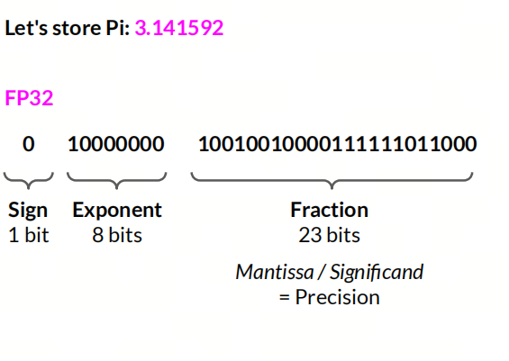
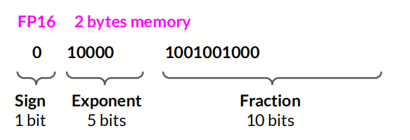
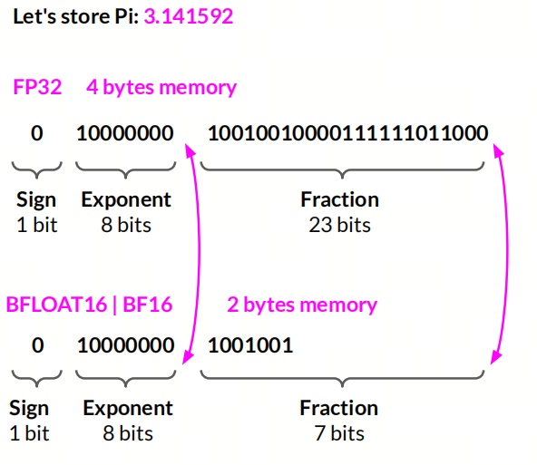

10分钟理解大模型的量化

## 1. 什么是量化
量化是大模型领域中的一项关键技术，它通过降低模型参数的精度，将浮点数转换为整数或定点数，从而实现模型的压缩和优化。这样做的主要目的是减少模型的存储需求、加快推理速度，并降低模型的计算复杂度，使得大模型能够更高效地在资源受限的设备上运行，例如移动设备、嵌入式系统等场景。

## 2. 精度
先来看下数据存储的基本概念

- bit 位是计算机中最小的数据单位，只能存储 0 或 1 两种状态。一个 bit 可以表示两种状态，即 0 或 1；

- byte 字节是计算机中常用的数据单位，由 8 个 bit 组成；

- float 浮点数是一种用于表示实数的数据类型，通常由 32 位或 64 位的二进制数表示，其中 32 位的浮点数称为单精度浮点数，64 位的浮点数称为双精度浮点数；

- integer 整数是一种用于表示整数的数据类型，通常由 8 位、16 位、32 位或 64 位的二进制数表示，其中 8 位的整数称为字节，16 位的整数称为短整数，32 位的整数称为整数，64 位的整数称为长整数；

**FP32** 

32位浮点数，通常用于表示单精度浮点数，符号位占 1 位，指数位占 8 位，尾数位占 23 位，精度约为 7 位有效数字；

**FP16** 

16位浮点数，通常用于表示半精度浮点数，符号位占 1 位，指数位占 5 位，尾数位占 10 位，精度约为 3 位有效数字；

**BF16** 

16位浮点数，通常用于表示混合精度浮点数，符号位占 1 位，指数位占 8 位，尾数位占 7 位，精度约为 2 位有效数字；

**INT8** 

8位整数，通常用于表示 8 位整数，范围为 -128 到 127；

## 3.量化的类型
按照量化方法可以划分为线性量化、非线性量化（如对数量化）等多种方式，目前较为常用的是线性量化。其中线性量化又可以按照对称性划分为对称量化和非对称量化。

### 对称线性量化
对称量化的特点是量化后的值中零点必须对应于原始值中的零，即量化操作的零点固定不变。这种方式通常使用两个参数（量化的最小值和最大值）来定义量化的范围，而这个范围是以零为中心对称的。

### 非对称线性量化

非对称量化不强制要求量化后的零点对应于原始数据中的零点。这种量化方法使用三个参数来定义从原始数值到量化数值的映射关系：量化最小值、量化最大值和零点。这意味着量化操作可以有一个任意的零点，这个零点被映射到量化范围内的某个整数值上。

非对称量化特别适合于原始数据分布不关于零对称的情况，例如当数据集中包含大量正值或负值时。它允许更灵活的量化范围定义，以适应数据的实际分布，从而减少量化误差，提高量化后的模型精度

## 4. 量化的粒度

量化粒度（Quantization Granularity）是量化技术中的一个重要概念，它决定了量化操作的精细程度。量化粒度影响着量化参数的共享方式，即量化的规模和范围。不同的量化粒度可以带来不同的精度和效率的权衡。

量化粒度有以下几种形式：

- Per-tensor：整个张量或整个层级共享相同的量化参数（scale和zero-point）。这种方式的优点是存储和计算效率较高，但可能会导致精度损失，因为一个固定的量化参数难以覆盖所有数据的动态范围;
- Per-channel：每个通道或每个轴都有自己的量化参数。这种方式可以更准确地量化数据，因为每个通道可以有自己的动态范围，但会增加存储需求和计算复杂度;
- Per-group：在量化过程中，将数据分成块或组，每块或每组有自己的量化参数。

量化粒度的选择取决于模型的特定需求和目标硬件平台的特性。较小的量化粒度可以提供更高的精度，但可能会增加模型大小和推理延迟。例如，在TensorRT中，默认对激活值使用Per-tensor量化，而对权重使用Per-channel量化，这是基于多次实验得出的结论。

## 5. weight packing

Weight packing（权重打包）是量化中的一个概念，它涉及将多个权重参数合并或“打包”成一个量化单元，以减少模型的内存占用和提高计算效率。权重打包技术可以与量化结合使用，通过减少模型参数的数量来进一步压缩模型大小，同时保持模型性能。这通常通过将权重矩阵分解为较小的块，然后对这些块应用量化和编码技术来实现。

## 6. PTQ和QAT

### 训练后量化
训练后量化（Post Training Quantization, PTQ）是一种在模型训练完成后应用的技术，目的是减少模型的大小和提高推理速度，同时尽量保持模型的性能。PTQ特别适合部署到资源受限的设备上，如移动设备和嵌入式设备。在PTQ中，量化操作可以应用于模型的输入、权重和激活值上。

### 量化感知训练
量化感知训练（Quantization Aware Training, QAT）是一种在训练深度学习模型时引入量化操作的技术，目的是在减少模型大小和提高运行效率的同时，尽量减少量化带来的精度损失 。
与传统的训练后量化（不同，QAT在训练过程中模拟量化的效果，使模型能够适应量化带来的信息损失，从而在实际应用量化时保持更高的性能

## 7. 其它行业的量化

量化这个词汇可以根据不同的上下文有多种含义，以下是几种常见的解释：
- 数学和统计学中的量化：在数学和统计学中，量化是指将定性的描述转换为能够用数字表示的定量的过程。比如，将“多”和“少”这样的模糊概念，转变成确切的数字量度，如“有10个”和“有2个”;
- 金融领域的量化：在金融行业中，量化（Quantitative，简称“Quant”）通常指的是使用数学模型和计算方法来分析金融市场和证券，以及设计和实施交易策略的过程。量化分析依赖大量历史数据和复杂算法，目标是识别价格走势和市场行为的模式。量化投资是指采用这些技术进行资产配置和交易决策的投资方式;
- 科学研究中的量化：在科学研究中，量化意味着通过测量和计算来获得实验或观察的数值结果。它通常指的是把观察到的现象转换成可以通过计算和统计分析处理的数字;
- 计算机科学中的量化：在计算机科学中，量化有时是指量化误差（quantization error），即在数值计算或数字信号处理中，因为数据从连续范围（如实数）转换到有限范围（如整数）而产生的近似误差;
- 其他行业的量化：在其他行业中，量化可能指的是将某些难以度量的特性或属性转换成可度量的形式，从而可以进行更准确的分析和管理。

## 参考

[1] [quantization-fundamentals](https://learn.deeplearning.ai/courses/quantization-fundamentals/)

[2] [quantization-in-depth](https://learn.deeplearning.ai/courses/quantization-in-depth/)

[3] [deeplearning.ai](https://www.deeplearning.ai/courses/generative-ai-with-llms/)

## 欢迎关注我的GitHub和微信公众号：

[GitHub: LLMForEverybody](https://github.com/luhengshiwo/LLMForEverybody)
