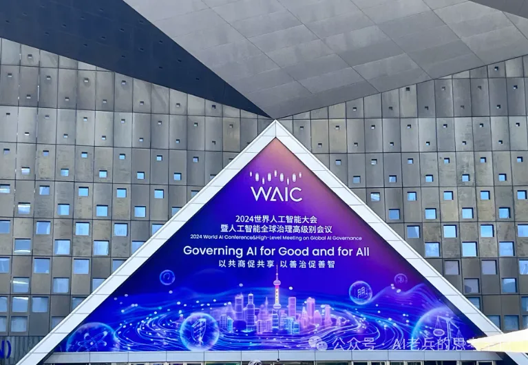

Langchain向左，扣子向右

## 1. 背景

对于很多人来说，langchain和扣子更像是面向两类人群的工具，langchain作为当下最流行的agent开发框架，面向大模型应用开发者；而扣子，更多的是娱乐性质的，玩家可以以最低无代码--只用prompt engineering的方式捏自己的bot，并分享到社群。而现在，随着类似扣子类平台API的深入开发，langchain的地位受到了挑战。

2023年的世界人工智能大会（WAIC）是“百模大战”，今年WAIC的关键词是“应用至上”。纵观今年论坛热点话题，无论是具身智能还是AI Agent（智能体），都指向以大模型为代表的AI技术在不同场景下的垂直应用。

**Agent**

Agent指的是一个能够感知其环境并根据感知到的信息做出决策以实现特定目标的系统，通过大模型的加持，Agent比以往任何时候都要更加引人注目。

## 2. Langchain
以Langchain为代表的Agent框架，是目前在国内最被广泛使用的开源框架，LangChain刚开始的设计理念是将工作流设计为DAG（有向无环图），这就是Chain的由来；

随着Muti-Agent理念的兴起和Agent范式的逐渐确立，Agent工作流会越来越复杂，其中包含了循环等条件，需要用Graph图的方式，由此又开发了LangGraph。

**langchain的吐槽**

誉满天下，谤满天下。LangChain也有很多吐槽，最关键的是代码量与抽象性问题：LangChain 使用的代码量与仅使用官方 OpenAI 库的代码量大致相同，并且 LangChain 合并了更多对象类，但代码优势并不明显。此外，LangChain 的抽象方法增加了代码的复杂性，没有带来明显的好处，导致开发和维护过程变得困难

## 3. 扣子

**什么是扣子**

扣子是新一代大模型 AI 应用开发平台。无论你是否有编程基础，都可以快速搭建出各种 Bot，并一键发布到各大社交平台，或者轻松部署到自己的网站。

**发布平台**

除了发布到社交媒体，还可以将做好的Bot发布成API，这意味着可以以拖拉拽（低代码）的方式完成一个Agent，然后使用API嵌入到任意工作流里，扣子一下子从娱乐工具转变为真正意义上的生产力工具了。

## 4. 开发范式的转变

**范式的转变**

对大厂来讲，平台之争对应着生态，扣子已经有了先发优势。之前，大家会捏点bot，发布到豆包或者放到微信公众号里，在开放API后，我们可以将Agent放到任意工作流中，那大量生产力工具就可以被制作出来，加入到各行各业已有的工作流中。

**我认为**

至少在国内，一般开发者可以更关注Agent解决的业务问题，而不要花大量时间放在LangChain的底层。如果各家都跟进API的话，Agent的创建将是一个几乎没有开发成本的工作，那创意将变得无比重要！

## 参考

[1] [GitHub: LLMForEverybody](https://github.com/luhengshiwo/LLMForEverybody)