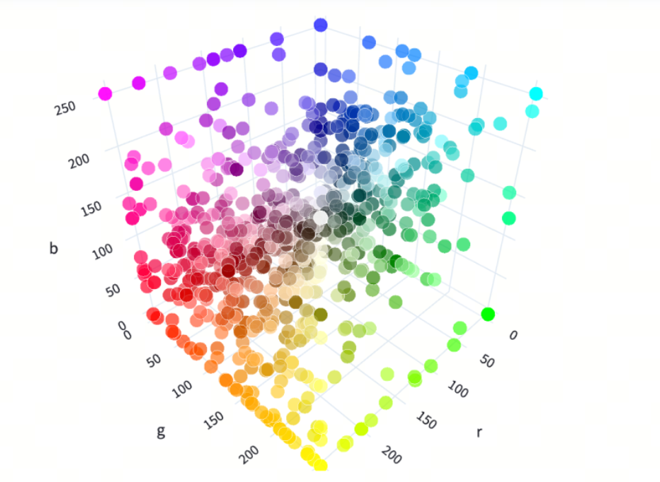
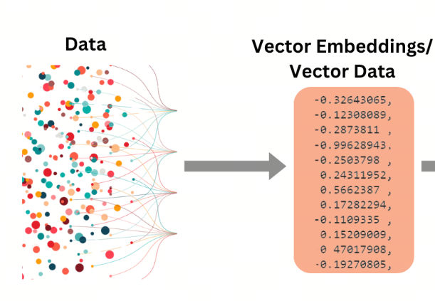
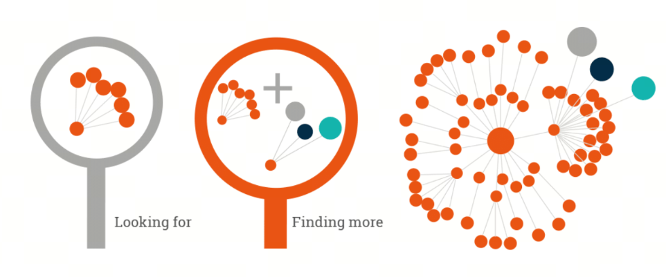

向量数据库拥抱大模型

## 1. 为什么需要向量数据库

向量数据库是一种专门用于存储和查询向量数据的数据库系统，它在处理大规模高维数据方面具有显著优势。向量数据库的核心优势在于其能够高效地进行相似性搜索和数据分析，这在传统的关系型数据库中往往难以实现。向量数据库通过将非结构化数据（如文本、图像、音频等）转换为向量形式进行存储，使得这些数据能够进行快速的相似度搜索和分析。

向量数据库的崛起与大模型时代的需求紧密相关，它为大模型提供了外部知识库的支持，增强了生成能力，支持向量嵌入，并解决了数据局限问题。通过向量数据库，可以构建企业专属的智能服务，如法律科技服务、智能客服等，提供更专业和时效性的服务。

## 2. 什么是向量

向量是数学中的一个重要概念，它是一个有序的数列，可以表示空间中的一个点或者一个方向。在机器学习和深度学习中，向量通常用来表示数据的特征，如文本、图像、音频等。通过将数据转换为向量形式，可以方便地进行计算和分析，实现数据的高效存储和检索。

## 3. 什么是语义搜索

语义搜索是一种基于语义理解的搜索技术，它通过理解用户的查询意图，从而提供更加准确和相关的搜索结果。传统的搜索技术主要基于关键词匹配，而语义搜索则更加注重搜索结果的语义相关性，能够更好地满足用户的需求。语义搜索技术在自然语言处理、信息检索、推荐系统等领域有着广泛的应用，能够提高搜索效率和准确性，提升用户体验。

## 4. 向量数据的应用-RAG技术

检索增强生成（Retrieval-Augmented Generation，简称 RAG）通过结合大型语言模型（LLM）和信息检索系统来提高生成文本的准确性和相关性。这种方法允许模型在生成回答之前，先从权威知识库中检索相关信息，从而确保输出内容的时效性和专业性，无需对模型本身进行重新训练。

RAG技术之所以重要，是因为它解决了LLM面临的一些关键挑战，例如虚假信息的提供、过时信息的生成、非权威来源的依赖以及由于术语混淆导致的不准确响应。通过引入RAG，可以从权威且预先确定的知识来源中检索信息，增强了对生成文本的控制，同时提高了用户对AI解决方案的信任度。

## 4. 向量数据库比较
如何选择合适的向量数据库？在实际的业务场景中，往往需要考虑很多的因素，例如向量数据库的可用性、扩展性、安全性等，还有代码是否开源、社区是否活跃等等。

截至本文撰写时2024年9月18号，向量数据库有以下几种选择

| 向量数据库 | URL| GitHub Star|Language|
| :--- |:----:| :----: |---: |
| chroma|https://github.com/chroma-core/chroma|14.4k| Python  |
| milvus|https://github.com/milvus-io/milvus| 29.2k|Go/Python/C++ |
| pinecone|https://www.pinecone.io/|闭源|无 |
| qdrant|https://github.com/qdrant/qdrant|19.7k|Rust|
|typesense|https://github.com/typesense/typesense|20.3k|C++|
|weaviate|https://github.com/weaviate/weaviate|10.7k|Go|
|faiss|https://github.com/facebookresearch/faiss|30.3k|C++/Python/Cuda|

## 5. Long Context vs. RAG

在探讨大模型的超长序列输入处理能力与检索增强生成（RAG）技术的对比时，我们可以看到两种技术在处理长文本数据方面各有优势和挑战。

超长序列输入处理能力是大型语言模型（LLMs）的一个重要发展方向。随着技术的进步，一些模型已经能够处理远超以往的文本长度，这使得模型在处理长文本数据时更加有效。这种能力的提升，使得LLMs在理解和生成文本时能够更好地捕捉长距离依赖关系，提高文本的连贯性和逻辑性。然而，这种超长上下文的处理也会带来计算成本的增加，以及对模型训练和推理时内存需求的挑战。

另一方面，RAG技术通过结合检索和生成两个步骤来提升模型的性能。在生成答案之前，RAG会从一个广泛的文档数据库中检索相关信息，然后利用这些信息来引导生成过程。这种方法有效地缓解了模型可能产生的“幻觉”问题，提高了知识更新的速度，并增强了内容生成的可追溯性。RAG技术在处理特定领域知识时表现出更高的效率和准确性，尤其是在需要最新信息和专业知识的场景中。

在实际应用中，选择超长序列输入处理能力还是RAG技术，取决于具体的业务需求和资源限制。如果任务需要模型一次性理解和生成大量文本，并且对计算资源有较高的容忍度，那么超长序列输入处理可能是一个更好的选择。而如果任务需要最新的外部知识，或者需要处理的数据量非常大，那么RAG技术可能更加合适，因为它可以通过检索来动态获取最新信息，并且可以通过优化检索步骤来控制整体的计算成本。

## 参考

[1] [向量数据库｜一文全面了解向量数据库的基本概念、原理、算法、选型](https://cloud.tencent.com/developer/article/2312534)

## 欢迎关注我的GitHub和微信公众号，来不及解释了，快上船！

[GitHub: LLMForEverybody](https://github.com/luhengshiwo/LLMForEverybody)

仓库上有原始的Markdown文件，完全开源，欢迎大家Star和Fork！

