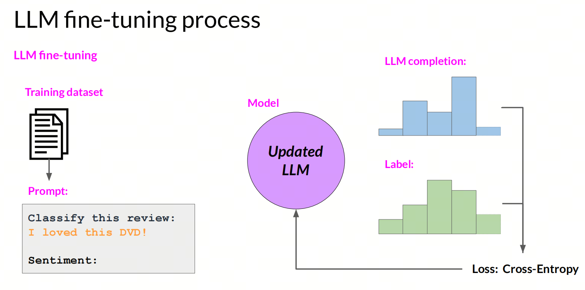
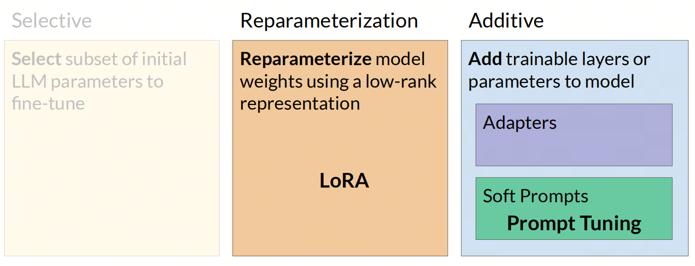

开发大模型or使用大模型?

近日，OpenAI预计在秋季推出代号为“草莓”的新AI。从专注于数学问题到处理主观营销策略，"草莓"模型展现出惊人的多样性。

大模型的更新让人眼花缭乱,但整个大模型的生态圈,其实是分工明确的.大部分的大模型从业者都是在使用大模型,而不是在开发基座大模型.

## 1. 越来越昂贵的Pre-Training

大模型预训练的代价是多方面的，涉及显卡（GPU）、数据、存储等多个角度。以下是对这些方面的详细阐述：

**显卡（GPU）成本**：

训练大型模型需要大量的GPU资源。例如，训练一个千亿参数规模的大模型可能需要数千个英伟达A100 GPU，每个GPU的成本约为10,000美元。如果按照这样的规模计算，仅GPU成本就可达数亿美元。

**数据成本**：

大模型训练需要海量的数据。数据的采集、清洗、标注和存储都需要成本。例如，预训练数据集可能需要经过大量的前置步骤，包括数据抓取、清洗、转换等，这些步骤涉及大量的实验，处理的数据量通常是正式训练数据集的100倍以上。

**存储成本**：

存储系统性能与成本之间的平衡是一个重要考虑因素。高性能文件系统如GPFS、Lustre等通常依赖全闪存（NVMe）和高性能网络，成本较高。对象存储虽然成本较低，但可能需要额外的人力和时间去处理数据同步、迁移和一致性管理等任务。

**数据中心成本**：

数据中心的运营成本包括电力、冷却和维护等。这些成本随着GPU数量和数据中心规模的增加而增加。

**人力成本**：

训练大型模型需要一支专业的工程师和科学家团队，包括数据工程师、AI研究员、软件工程师等。这些人才的薪资和福利是另一个重要的成本因素。

## 2. 你真的有机会预训练大模型吗？

绝大部分的大模型从业者都不会从事基座大模型的开发.

预训练的很多技术,你可能在技术博客里看到,可能会在面试的时候被问到,但也许永远也不会在实际工作中用到. 因为预训练太昂贵了,而且很多公司也没有这个需求.

大部分的大模型从业者都是在使用大模型,而不是在开发基座大模型.

从难易程度上来分,大模型的应用基本包含以下五个方面:

| 策略 | 难度| 数据要求|
| :--- |:----:| :----: |
| Prompt Engineering|低|无|
| Self-Reflection |低| 无|
| RAG|中|少量|
| Agent|中|少量|
| Fine-tuning |高|中等|

## 3. Prompt Engineering
Prompt Engineering 是优化 prompts 以获得有效输出的艺术和科学。它涉及设计、编写和修改 prompts，以引导 AI 模型生成高质量、相关且有用的响应。


## 4. Self-Reflection

在实际工作中,我发现很多伙伴并没有意识到Self-Reflection的重要性. 其实Self-Reflection是一个简单但非常有用的策略.

以一个NL2SQL的例子来说明：

### 第一次交互
```python
question = ''
prompt = f'{question}'
plain_query = llm.invoke(prompt)
try:
    df = pd.read_sql(plain_query)
    print(df)
except Exception as e:
    print(e)
```
拿到了错误后,我们可以通过反思错误,来改进我们的问题,直到我们得到我们想要的答案.

### Reflection

```python
reflection = f"Question: {question}. Query: {plain_query}. Error:{e}, so it cannot answer the question. Write a corrected sqlite query."
```

### 第二次交互

```python
reflection_prompt = f'{reflection}'
reflection_query = llm.invoke(reflection_prompt)
try:
    df = pd.read_sql(reflection_query )
    print(df)
except Exception as e:
    print(e)
```

## 5. RAG

检索增强生成（Retrieval-Augmented Generation，简称 RAG）通过结合大型语言模型（LLM）和信息检索系统来提高生成文本的准确性和相关性。这种方法允许模型在生成回答之前，先从权威知识库中检索相关信息，从而确保输出内容的时效性和专业性，无需对模型本身进行重新训练。

RAG技术之所以重要，是因为它解决了LLM面临的一些关键挑战，例如虚假信息的提供、过时信息的生成、非权威来源的依赖以及由于术语混淆导致的不准确响应。通过引入RAG，可以从权威且预先确定的知识来源中检索信息，增强了对生成文本的控制，同时提高了用户对AI解决方案的信任度。


## 6. Agent

Agent指的是一个能够感知其环境并根据感知到的信息做出决策以实现特定目标的系统，通过大模型的加持，Agent比以往任何时候都要更加引人注目。

### Langchain
以Langchain为代表的Agent框架，是目前在国内最被广泛使用的开源框架，LangChain刚开始的设计理念是将工作流设计为DAG（有向无环图），这就是Chain的由来；

随着Muti-Agent理念的兴起和Agent范式的逐渐确立，Agent工作流会越来越复杂，其中包含了循环等条件，需要用Graph图的方式，由此又开发了LangGraph。

## 7. Fine-tuning

相较于基础大模型动辄万卡的代价，微调可能是普通个人或者企业少数能够接受的后训练大模型(post-training)的方式。

微调是指在一个预训练模型(pre-training)的基础上，通过少量的数据和计算资源，对模型进行进一步训练，以适应特定的任务或者数据集。



微调分为两种类型：全参微调（full fine-tuning）和参数高效微调（parameter efficient fine-tuning）。

- 全参微调：在全参微调中，整个模型的参数都会被更新，这种方法通常需要大量的数据和计算资源，以及较长的训练时间。

### PEFT

参数高效微调（Parameter-Efficient Fine-Tuning，简称PEFT）是一种针对大型预训练模型（如大语言模型）的微调技术，它旨在减少训练参数的数量，从而降低计算和存储成本，同时保持或提升模型性能。

PEFT通过仅微调模型中的一小部分参数，而不是整个模型，来适应特定的下游任务。这种方法特别适用于硬件资源受限的情况，以及需要快速适配多种任务的大型模型。


PEFT有以下几种常见的方法：
- 选择参数子集：选择模型中的一小部分参数进行微调，通常是最后几层的参数；
- 重新参数化：使用低秩表示重新参数化模型权重，代表是LoRA方法；
- 添加参数：向模型添加可训练层或参数，代表为Prompt-tuning方法。



## 总结
大模型已经进入到应用落地阶段,此时的大模型从业者,更多的应该是在使用大模型,而不是在开发基座大模型.


## 参考

<div id="refer-anchor-1"></div>

[2] [improving accuracy of llm applications](https://learn.deeplearning.ai/courses/improving-accuracy-of-llm-applications/lesson/4/create-an-evaluation)

## 欢迎关注我的GitHub和微信公众号：

[GitHub: LLMForEverybody](https://github.com/luhengshiwo/LLMForEverybody)