# 多模态RAG

- 阅读提示：阅读本文需要对RAG技术有基本的了解，如果你不清楚RAG，欢迎参考我之前的文章：

很多RAG是建立在文本的基础上的，但是现实的情况下，我们有很多图片甚至视频数据，我们有时候也会想搭建图片/视频的多模态RAG，让我们可以基于图片/视频进行问答。

## 1.架构

视频可以看作很多帧图片的集合，所以我们可以从图片开始。

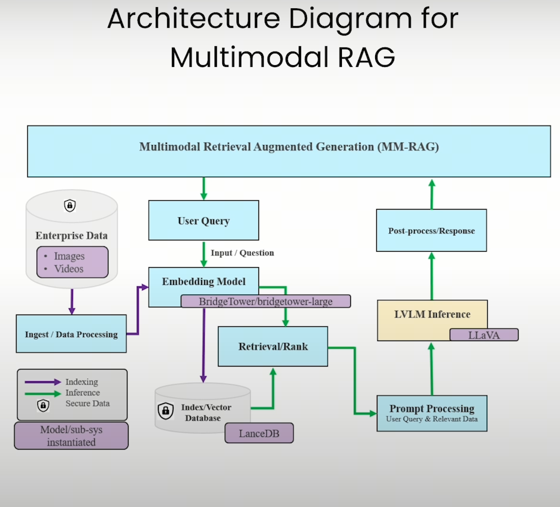

注意到上图，紫色的是构建Vector DB的过程，天蓝色的是inference的过程。整个多模态的架构如下

1. 处理多模态数据：得到image-text pair；
2. 将image-text pair数据转化为embedding，存入Vector DB；
3. 将一个query转化为embedding，并在Vector DB中Retrieval；
4. 将返回的image-text pair，和query结合起来，用LVLM模型得到回答。

可以看到这个架构和传统的RAG架构几乎一致，只是每一步的输入输出不一样


## 2.数据处理

我们需要将数据处理为 图片-文字 对，以方便输入到后续的Embedding model里。

对于视频，我们可能遇见3种情况：

- case1：视频有字幕
- case2：视频无字幕
- case3： 视频无字幕，且无法生成字幕，例如默片或者只有背景音乐的视频

对于图片，我们可能遇见两种情况：

- 图片带解释性文字
- 图片无解释性文字

视频处理的方法：

1. case1：我们使用某些工具，比如CV2，将视频按时间切片，选取合适的图片，并将字幕配到合适的图片上
2. case2：我们先用语音转文字的工具，如whisper，生成字幕，再用case1的方案
3. case3：使用case1的方式生成图片，再使用Large Vision-Language Model（LVLM）来生成字幕

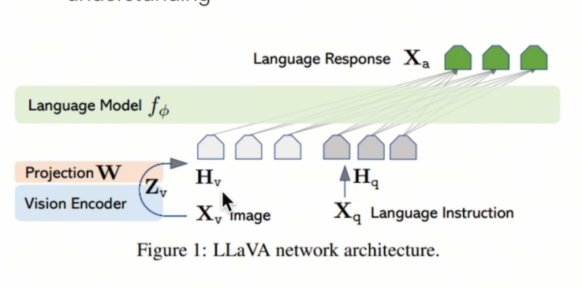

图片处理的方法：

1. case1：无需操作
2. case2：使用 Large Vision-Language Model（LVLM）来生成描述

## 3.Embedding

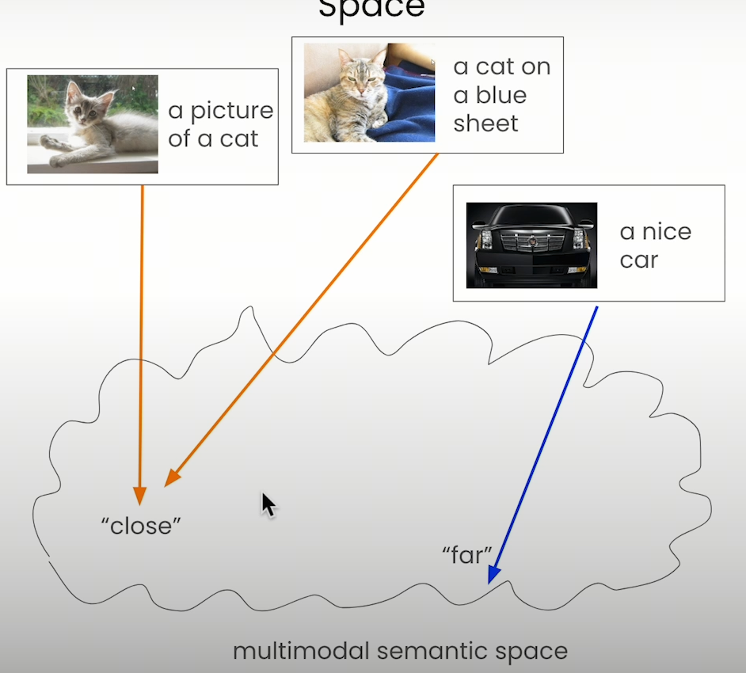

我们可以将上述的图片-文字对，输入到一个特殊的embedding模型，如Bridge tower 模型，这样可以得到这个pair的embedding，便于后续retrieval. 更多Bridge tower 模型的信息，参见这篇论文： [bridge tower](https://arxiv.org/abs/2206.08657)

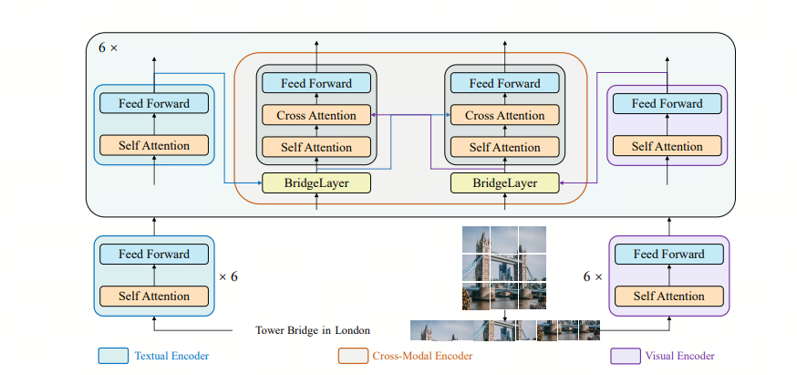

## 4.Retrieval，Prompt process & Response

将用户的query进行retrieval后，我们会得到image-text pair， 我们将query，text，image处理好，输入上文提到的LVLM中，得到response。

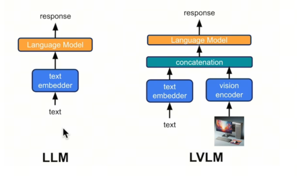

LLaVA是常用的LVLM，参见https://arxiv.org/pdf/2304.08485.

可以看到：多模态的RAG是想办法往传统的RAG上靠，只是embedding和生成回答的LM用了多模态的而已。


# Agent设计范式与常见框架

## 1. 什么是Agent

Agent指的是一个能够感知其环境并根据感知到的信息做出决策以实现特定目标的系统，通过大模型的加持，Agent比以往任何时候都要更加引人注目。

**Agent的本质还是prompt engineering** 

## 2. Agent的设计范式

"Agent范式"是指在人工智能领域中，特别是在设计和开发智能代理（Autonomous agents 或简称 Agents）时所采用的不同方法和技术。智能代理是指能够在环境中感知、推理并采取行动以完成特定任务的系统。在大型语言模型（LLMs）的背景下，Agent范式通常涉及到如何利用这些模型来提升代理的规划、决策和执行能力。

目前没有一个统一的Agent设计范式，但是有一些常见的设计模式，我们这边选择吴恩达文章中提到的几种设计范式进行介绍:

- Reflection
- Tool use
- Planning
- Multi-agent collaboration

## 3. Agent范式一: Reflection

Reflection是指Agent能够对自己的行为和决策进行推理和分析的能力。这种能力使Agent能够更好地理解自己的行为和决策，并在未来的决策中更好地利用这些信息。

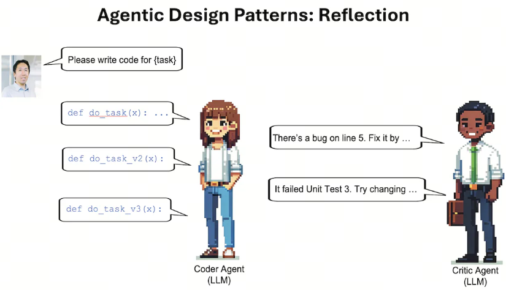

如何在工作流里面嵌入self-reflection？以一个NL2SQL的例子来说明：

### 第一次交互

```python
question = ''
prompt = f'{question}'
plain_query = llm.invoke(prompt)
try:
    df = pd.read_sql(plain_query)
    print(df)
except Exception as e:
    print(e)
```

### reflection

```python
reflection = f"Question: {question}. Query: {plain_query}. Error:{e}, so it cannot answer the question. Write a corrected sqlite query."
```

### 第二次交互

```python
reflection_prompt = f'{reflection}'
reflection_query = llm.invoke(reflection_prompt)
try:
    df = pd.read_sql(reflection_query )
    print(df)
except Exception as e:
    print(e)
```

你可以通过反思，我们可以不断改进我们的问题，直到我们得到我们想要的答案。

## 4. Agent范式二: Tool use

就像人类使用工具来帮助完成任务一样，Agent也可以使用工具来帮助完成任务。这种Agent范式涉及到Agent如何利用外部工具和资源来提升自己的决策和执行能力。

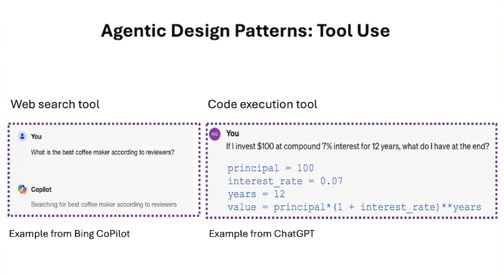

比如使用外置计算器或者wikipeida来解决我们的问题。

```python
from langchain.agents import load_tools, initialize_agent
from langchain.agents import AgentType
from langchain_openai import ChatOpenAI
llm = ChatOpenAI(temperature=0, model=llm_model)
tools = load_tools(["llm-math","wikipedia"], llm=llm)
agent= initialize_agent(
    tools, 
    llm, 
    agent=AgentType.CHAT_ZERO_SHOT_REACT_DESCRIPTION,
    handle_parsing_errors=True,
    verbose = True)

```

## 5. Agent范式三: Planning

规划是Agent AI 的一个关键设计模式，我们使用大型语言模型自主决定执行哪些步骤来完成更大的任务。例如，如果我们要求Agent对给定主题进行在线研究，我们可能会使用 LLM 将目标分解为较小的子任务，例如研究特定子主题、综合研究结果和编写报告。

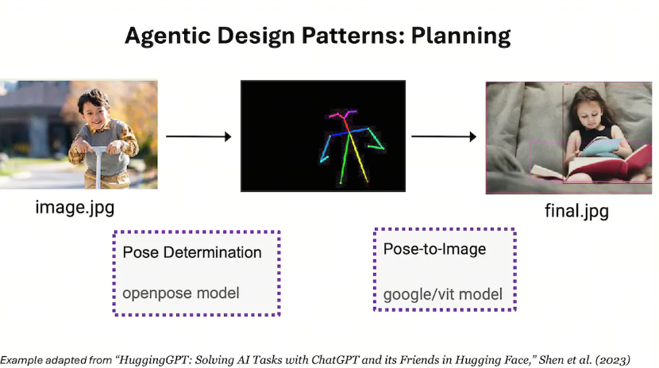

## 6. Agent范式四: Multi-agent collaboration

多智能体协作是四种关键人工智能智能体设计模式中的最后一种。对于编写软件这样的复杂任务，多智能体方法会将任务分解为由不同角色（例如软件工程师、产品经理、设计师、QA（质量保证）工程师等）执行的子任务，并让不同的智能体完成不同的子任务。

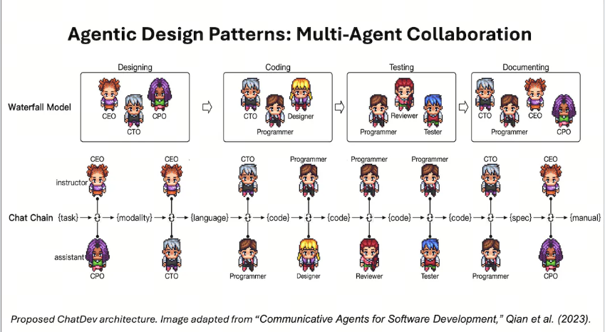

## 7. 其它设计范式

其它的范式设计中的主要区别是有没有把Memory单独拎出来,你可能在各种场合见到下图这种设计范式:

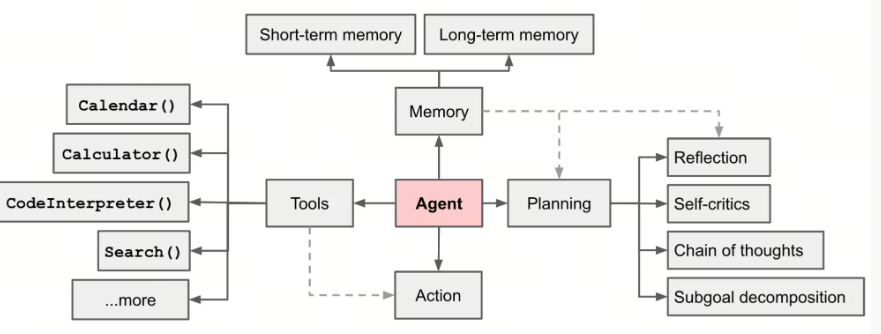

和吴恩达的差别在于有没有显式的提及Memory，但是这并不影响我们的理解，因为Memory是Agent的一个重要组成部分。

Memory又可以分为Short-term memory和Long-term memory，这个和人类的记忆系统有点类似。

- Short-term memory: 就是利用上下文Context
- Long-term memory: 就是利用外挂直属库,典型的是RAG技术


## 8. 高阶的Agent设计范式

### 8.1. ReAct

Reasoning and Action，这个设计范式是指Agent根据环境的变化做出反应。这种设计范式涉及到Agent如何根据环境的变化来调整自己的决策和行为。

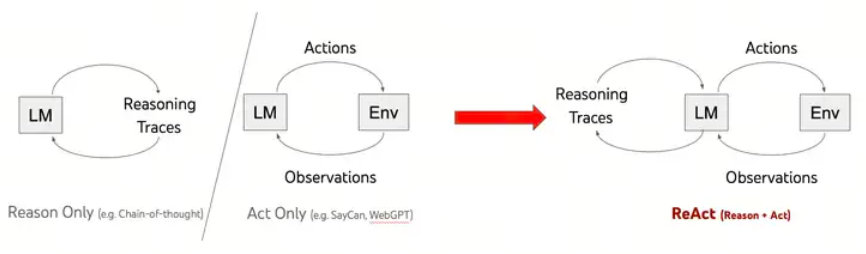

### 8.2. Planing & Execute

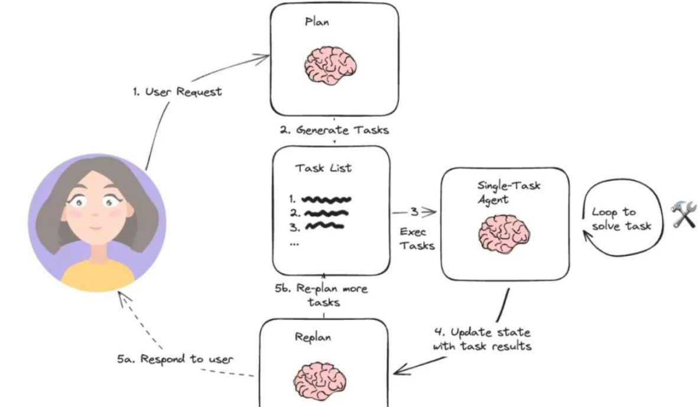

### 两者区别

- ReAct：走一步看一步
- Planing & Execute 事前计划好(当然可以再根据反馈再迭代)


***Planing vs. ReAct***

- Planning: Agent自主决定执行哪些步骤来完成更大的任务
- ReAct: Agent根据环境的变化做出反应


## 9.多智能体协作框架

### 9.1. Langgraph

以Langchain为代表的Agent框架，是目前在国内最被广泛使用的开源框架，LangChain刚开始的设计理念是将工作流设计为DAG（有向无环图），这就是Chain的由来；

随着Muti-Agent理念的兴起和Agent范式的逐渐确立，Agent工作流会越来越复杂，其中包含了循环等条件，需要用Graph图的方式，由此又开发了LangGraph。

### 9.3. AutoGen

AutoGen从组织交流的角度设计了多智能体的协作,主要分为四种策略:

- 两个agents
- 顺序agents
- Group agents
- Nested agents

### 9.4. two agents

类似于两个人协作完成任务,这个是最简单的协作模式

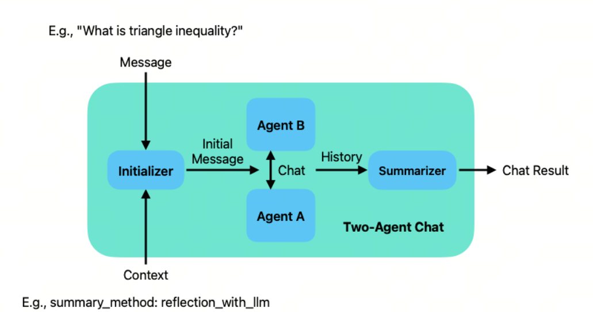

### 9.5. 顺序agents

顺序Agents指的是一个任务过来，agentA去轮询其它agents，每次都带着问题和前几个人的沟通结果，最终得到解决方案.

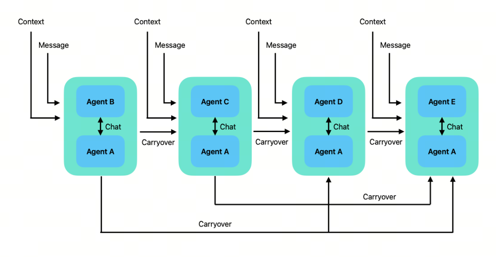

### 9.6. Group agents

和一个公司或者团队类似, 一个任务过来，给到manager，manager负责分发任务给不同的agent，获得反馈，广播，并选择下一个agent。

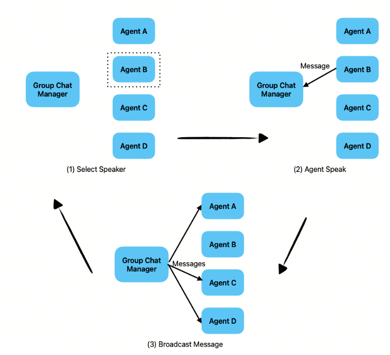

### 9.7. Nested agents

Nested agents是指一个agent里面还有一个agent，这个是最复杂的协作模式。在AutoGen中，Nested agents对外暴露一个和human交流的接口,内部是一个agent的协作。

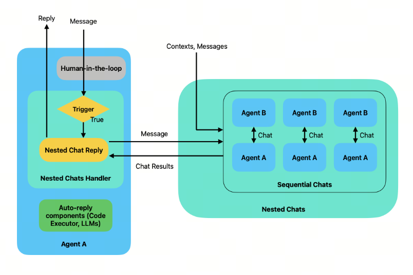

# GraphRAG

> GraphRAG: 解锁大模型对叙述性私有数据的检索能力（中文翻译）
>
> https://www.microsoft.com/en-us/research/blog/graphrag-unlocking-llm-discovery-on-narrative-private-data/

## 写在最前面

在前一段时间，微软开源的GraphRAG引起了一些轰动，我看了很多资料，其中最有价值应该是这篇微软自己的博客：https://www.microsoft.com/en-us/research/blog/graphrag-unlocking-llm-discovery-on-narrative-private-data/

文章内容详实，因此尝试将其翻译成中文，希望这能帮助到更多需要相关信息的人。

由于译者水平有限，翻译过程中难免会有错误，还请大家多多包涵。如果有任何问题，欢迎在评论区指出，我会尽快修改。

对于标题中的Narrative Private Data，这里翻译成了叙述性私有数据，如果有更好的翻译，欢迎指出。

阅读提示：文中使用的数据集包含敏感主题，译者只做翻译，译文不代表译者立场。

## 正文开始：

LLM 面临的最大挑战（也是最大的机遇）或许是将其强大的能力扩展到解决训练数据之外的问题，并使用 LLM 从未见过的数据获得可比的结果。这为数据调查开辟了新的可能性，例如根据上下文和数据集识别主题和语义概念。在本文中，我们介绍了微软研究院创建的 GraphRAG，这是增强 LLM 能力的一项重大进步。

检索增强生成 (RAG) 是一种根据用户查询搜索信息并提供结果作为生成 AI 答案的参考的技术。该技术是大多数基于 LLM 的工具的重要组成部分，大多数 RAG 方法都使用向量相似性作为搜索技术。GraphRAG 使用 LLM 生成的知识图谱，在对复杂信息进行文档分析时显著提高问答性能。这建立在我们最近的[研究基础](https://www.microsoft.com/en-us/research/publication/can-generalist-foundation-models-outcompete-special-purpose-tuning-case-study-in-medicine/)之上，该研究指出在私有数据集上执行发现时提示词增强（prompt augmentation）的能力。（这句话由于英文的表述习惯，翻译起来有点拗口，意思大概是在私有数据上做检索的时候，如果你很好的做prompt，那会得到比较好的检索结果，并因此带来好的RAG结果,译者注）在这里，我们将私有数据集定义为 LLM 未经过训练且从未见过的数据，例如企业的专有研究、商业文档或通信。Baseline RAG 是为了帮助解决这个问题而创建的，但我们观察到 Baseline RAG 表现非常差的情况。例如：

- Baseline RAG 很难将各个点连接起来。当回答问题需要通过共享属性遍历不同的信息片段以提供新的综合见解时，就会发生这种情况。
- 当被要求全面理解大型数据集甚至单个大型文档中的总结语义概念时，Baseline RAG 表现不佳。

为了解决这一问题，技术社区正在努力开发扩展和增强 RAG 的方法（例如 [LlamaIndex](https://www.llamaindex.ai/)）。微软研究院的新方法 GraphRAG 使用 LLM 创建基于私有数据集的知识图谱。然后，此图谱与图机器学习一起使用，在查询时执行提示词增强。GraphRAG 在回答上述两类问题方面表现出显著的进步，表现出的智能或掌握程度优于之前应用于私有数据集的其他方法。

## 将 RAG 应用于私有数据集

为了证明 GraphRAG 的有效性，让我们首先使用新闻文章中的暴力事件信息 (VIINA) [数据集](https://github.com/zhukovyuri/VIINA) 进行调查。之所以选择此数据集，是因为它的复杂性以及存在不同意见和部分信息。这是一个混乱的真实世界测试案例，而且时间还很短，因此没有被纳入 LLM 基础模型的训练中。

在本研究中，我们使用了2023年6月来自俄罗斯和乌克兰新闻来源的数千篇新闻文章（翻译成英文），以创建一个私有数据集，我们将在该数据集上执行基于 LLM 的检索。该数据集太大，无法放入 LLM 上下文窗口，因此需要采用 RAG 方法。（技术的软实力可见一斑，你可以不动声色的夹带私货并向全世界传播，译者注）

我们从一个探索性查询开始，该查询针对基线 RAG 系统和我们的新方法 GraphRAG 提出：

Query: “What is Novorossiya?” 此部分不做翻译

| Baseline RAG                                                 | GraphRAG                                                     |
| :----------------------------------------------------------- | :----------------------------------------------------------- |
| The term “Novorossiya” is not mentioned in the provided context. However, to provide some information, Novorossiya, or New Russia, is a historical term referring to a region in the south of Ukraine that was conquered by the Russian Empire in the 18th century. In recent years, the term has been revived by Russian-backed separatists in Eastern Ukraine to refer to the territories they claim, but it is not officially recognized as a separate entity by international bodies. | <ol><li>Novorossiya, also known as New Russia, is a term with historical and contemporary significance. Historically, it referred to a region in the southern part of the Russian Empire that is now part of Ukraine. In the contemporary context, it has been used by pro-Russian separatists to refer to certain areas of Ukraine [Data: Entities (6494, 912, 6493)].</li><li>The term Novorossiya has been used in the context of a political movement in Ukraine, particularly by Russian nationalists. This movement has been associated with efforts to destabilize Ukraine and create a so-called “Novorossiya” [Data: Entities (912); Relationships (15211, 15206)]. The term has also been used to denote a separatist state in Ukraine, known as the Federal Republic of Novorossiya (FRN) [Data: Entities (7690)].  </li><ol> |

在这些结果中，我们可以看到两个系统都表现良好 - 突出显示了基线 RAG 表现良好的一类查询。让我们尝试一个需要连接点的查询：

Query: “What has Novorossiya done?”

| Baseline RAG                                                 | GraphRAG                                                     |
| :----------------------------------------------------------- | :----------------------------------------------------------- |
| The text does not provide specific information on what Novorossiya has done. | <ol><li>Novorossiya, a political movement in Ukraine, has been involved in a series of destructive activities, particularly targeting various entities in Ukraine [Entities (6494, 912)]. The movement has been linked to plans to destroy properties of several Ukrainian entities, including Rosen, the Odessa Canning Factory, the Odessa Regional Radio Television Transmission Center, and the National Television Company of Ukraine [Relationships (15207, 15208, 15209, 15210)]. In addition to these, Novorossiya has also been associated with plans to destroy properties of Roshen, the Odessa Conservatory Factory, the Odesa Regional Radio Television Transmission Center, and the National Telecommunications Company of Ukraine [Relationships (8329, 8330, 8331, 8332)]. Furthermore, Novorossiya has been implicated in plans to blow up ATMs of PrivatBank, the largest state bank in Ukraine[Relationships (8335, 8335)].</li><li>The Office of the General Prosecutor in Ukraine has reported on the creation of Novorossiya, indicating the government’s awareness and potential concern over the activities of this movement [Relationships (8264, 8264)]. The destructive activities of Novorossiya have had significant impacts on the targeted entities and have likely contributed to the ongoing tensions and conflicts in the region. /  In summary, Novorossiya has been involved in a series of destructive activities targeting various entities in Ukraine. These activities have had significant impacts on the targeted entities and have likely contributed to the ongoing tensions and conflicts in the region. The Ukrainian government, through the Office of the General Prosecutor, has acknowledged the existence and activities of Novorossiya, indicating a level of concern over the movement’s actions.</li><ol> |

基线 RAG 无法回答这个问题。查看插入上下文窗口的源文档（见下图），没有任何文本片段讨‘Novorossiya’，导致此问题。


相比之下，GraphRAG 方法在查询 Novorossiya 中发现了一个实体。这使得 LLM 能够在图中立足，并通过指向原始支持文本的链接得出包含出处的更优答案。例如，下图 2 显示了 LLM 用于 LLM 生成的声明“Novorossiya has been implicated in plans to blow up ATMs”的确切内容。我们看到了原始源文档（经过英文翻译）中的片段，LLM 使用该片段通过图中两个实体之间存在的关系来支持这一断言。


通过使用 LLM 生成的知识图谱，GraphRAG 极大地改进了 RAG 的“检索”部分，用更高相关性的内容填充上下文窗口，从而得到更好的答案并捕获证据来源。

能够信任和验证 LLM 生成的结果始终很重要。我们关心的是结果是否正确、连贯，并准确代表源材料中的内容。GraphRAG 在生成每个响应时提供出处或来源基础信息。它表明答案是基于数据集的。每个断言的引用来源随时可用，也使人类用户能够快速准确地直接对照原始源材料审核 LLM 的输出。

然而，这并不是使用 GraphRAG 所能实现的全部。

## 全数据集推理

Baseline RAG 很难处理需要汇总整个数据集的信息才能得出答案的查询。诸如“数据中的前 5 个主题是什么？”之类的查询表现不佳，因为 Baseline RAG 依赖于对数据集内语义相似的文本内容进行向量搜索。查询中没有任何内容可以将其引导至正确的信息。

但是，使用 GraphRAG，我们可以回答这些问题，因为 LLM 生成的知识图谱的结构告诉我们整个数据集的结构（以及主题）。这允许将私有数据集组织成预先汇总的有意义的语义集群。在响应用户查询时，LLM 使用这些集群来总结这些主题。

我们通过向这两个系统提出以下问题来说明全数据集推理能力：

Query: “What are the top 5 themes in the data?“

| Baseline RAG                                                 | GraphRAG                                                     |
| :----------------------------------------------------------- | :----------------------------------------------------------- |
| <ol><li>Improving the quality of life in cities and urban development.</li><li>The meeting between Vladimir Putin and the President of the United Arab Emirates, Mohammed bin Zayed Al Nahyan.</li><li>The National Rating of the Investment Climate in the Regions of Russia.</li><li>The state of the Russian economy and the growth of domestic brands.</li><li>The discussion on the meaning of life and the role of science in understanding it. </li></ol> | <ol>The data presents a wide range of themes, but the top five most prevalent themes can be identified as follows: <li>Conflict and Military Activity: A significant portion of the data revolves around the ongoing conflict in Ukraine, with numerous reports detailing military activities, occupations, and attacks by various entities. This theme includes the actions of the Ukrainian military, Russian forces, and various other military units and entities [Data: Reports (513, 241, 151, 493, 343, +more)].</li><li>Political and Governmental Entities: Many reports focus on political figures and governmental entities, highlighting their roles, relationships, and actions in the context of the current situation. This includes entities like the Kremlin, the President of Ukraine, the US State Department, and various regional administrations [Data: Reports (98, 493, 265, 129, 196, +more)]. </li><li>Infrastructure and Environmental Concerns: Several reports highlight potential environmental impacts and infrastructure threats. These include potential environmental damage due to industrial activities, flooding crises, and threats to infrastructure due to military conflicts [Data: Reports (308, 154, 201, 348, 216, +more)].</li><li>Community Analysis and Threat Assessment: Several reports provide detailed analyses of specific communities, often centered around a particular location or entity. These analyses typically discuss the key entities within the community, their relationships, and any associated threats. Many reports also include assessments of potential threats associated with the entities or situations they discuss [Data: Reports (323, 596, 518, 583, 179, +more)]. </li><li>Health, Humanitarian Concerns, and Emergency Situations: Some reports focus on health and humanitarian issues, such as the Shereshevsky-Turner Syndrome community and the potential risk of intestinal diseases in the Odessa region. The data also covers emergency situations, including natural disasters, accidents, and attacks [Data: Reports (204, 149, 372, 154, 532, +more)]. <li>These themes provide a comprehensive overview of the current situation, highlighting the complexity and interconnectedness of the issues at hand.</li><ol> |

查看基线 RAG 的结果，我们发现列出的主题与两国之间的战争没有太大关系。正如预期的那样，向量搜索检索到不相关的文本，这些文本被插入到 LLM 的上下文窗口中。所包含的结果很可能与“主题”一词有关，导致对数据集中发生的事情的评估不太有用。

通过观察 GraphRAG 的结果，我们可以清楚地看到，结果与整个数据集的情况更加一致。答案提供了在数据集中观察到的五个主要主题以及支持细节。参考报告由 LLM 为 GraphRAG 中的每个语义集群预先生成，进而提供对原始源材料的出处。

## 创建由 LLM 生成的知识图谱

我们注意到 GraphRAG 所依据的基本流程，它建立在我们之前使用图形机器学习的[研究](https://www.microsoft.com/en-us/worklab/patterns-hidden-inside-the-org-chart)和[GitHub仓库](https://github.com/graspologic-org/graspologic)之上：（面试时会考,译者注）

- LLM 处理整个私有数据集，创建对源数据中所有实体和关系的引用，然后使用这些引用创建 LLM 生成的知识图谱。
- 然后使用此图谱创建自下而上的聚类，将数据分层组织成语义聚类（下图中用不同颜色表示）。这种分区允许预先总结语义概念和主题，这有助于全面理解数据集。
- 在查询时，这两种结构都用于在回答问题时为 LLM 上下文窗口提供材料。


上图显示了该Graph的一个可视化示例。每个圆圈代表一个实体（例如，一个人、一个地方或一个组织），实体大小代表该实体拥有的关系数量，颜色代表相似实体的分组。颜色分区是一种建立在图形结构之上的自下而上的聚类方法，它使我们能够回答不同抽象层次的问题。

## 结果指标

上述示例代表了 GraphRAG 在不同主题领域的多个数据集上的持续改进。我们使用 LLM 评分器进行评估，以确定 GraphRAG 和基线 RAG 之间的成对优胜者，从而评估这一改进。我们使用一组定性指标，包括全面性（在问题隐含背景框架内的完整性）、人类赋权（提供支持性源材料或其他背景信息）和多样性（对提出的问题提供不同的观点或角度）。初步结果表明，GraphRAG 在这些指标上的表现始终优于基线 RAG。

除了相对比较之外，我们还使用 [SelfCheckGPT](https://arxiv.org/pdf/2303.08896) 对忠实度进行绝对测量，以帮助确保结果基于源材料，真实、连贯。结果表明，GraphRAG 的忠实度与基线 RAG 相似。我们目前正在开发一个评估框架来衡量上述问题类别的表现。这将包括更强大的机制来生成问答测试集以及其他指标，例如准确性和上下文相关性。

## 下一步

通过结合 LLM 生成的知识图谱和图机器学习，GraphRAG 使我们能够回答仅使用基线 RAG 无法解决的重要问题。在将这项技术应用于社交媒体、新闻文章、工作场所生产力和化学等各种场景后，我们已经看到了令人鼓舞的结果。展望未来，我们计划在继续应用这项技术的同时，在各种新领域与客户密切合作，同时致力于指标和稳健评估。随着研究的继续，我们期待分享更多信息。


## 注释

[1] 在本次比较中，我们使用 LangChain 的[Q&A](https://python.langchain.com/v0.1/docs/use_cases/question_answering/)作为基线 RAG，这是当今广泛使用的此类 RAG 工具的著名代表性示例。

[2] 此数据集包含敏感主题。选择此数据集的唯一目的是展示数据分析工具，这些工具可显示所有相关信息，包括其来源。这些工具以该数据集信息为基础，使人类用户能够根据来自乌克兰语 (unian) 和俄语 (ria) 新闻文章的对立观点，更快地得出明智的结论，这些新闻文章均以他们的母语为来源。这些工具突出显示了每条声明的来源，可用于识别信息的来源。


# Langchain & coze

## 1. 背景

对于很多人来说，langchain和扣子更像是面向两类人群的工具，langchain作为当下最流行的agent开发框架，面向大模型应用开发者；而扣子，更多的是娱乐性质的，玩家可以以最低无代码--只用prompt engineering的方式捏自己的bot，并分享到社群。而现在，随着类似扣子类平台API的深入开发，langchain的地位受到了挑战。

2023年的世界人工智能大会（WAIC）是“百模大战”，今年WAIC的关键词是“应用至上”。纵观今年论坛热点话题，无论是具身智能还是AI Agent（智能体），都指向以大模型为代表的AI技术在不同场景下的垂直应用。

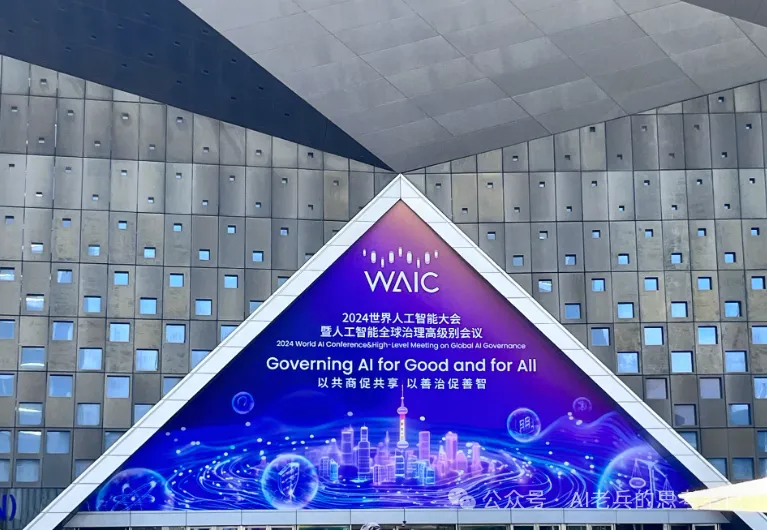

**Agent**

Agent指的是一个能够感知其环境并根据感知到的信息做出决策以实现特定目标的系统，通过大模型的加持，Agent比以往任何时候都要更加引人注目。


## 2. Langchain

以Langchain为代表的Agent框架，是目前在国内最被广泛使用的开源框架，LangChain刚开始的设计理念是将工作流设计为DAG（有向无环图），这就是Chain的由来；

随着Muti-Agent理念的兴起和Agent范式的逐渐确立，Agent工作流会越来越复杂，其中包含了循环等条件，需要用Graph图的方式，由此又开发了LangGraph。

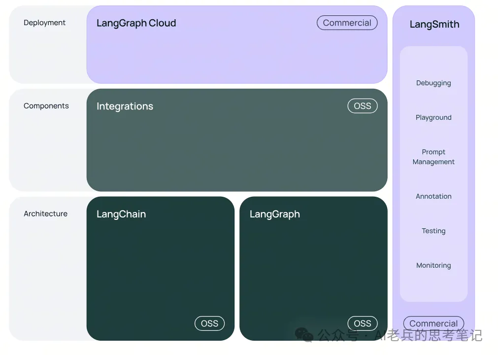

**langchain的吐槽**

誉满天下，谤满天下。LangChain也有很多吐槽，最关键的是代码量与抽象性问题：LangChain 使用的代码量与仅使用官方 OpenAI 库的代码量大致相同，并且 LangChain 合并了更多对象类，但代码优势并不明显。此外，LangChain 的抽象方法增加了代码的复杂性，没有带来明显的好处，导致开发和维护过程变得困难

## 3. 扣子

**什么是扣子**

扣子是新一代大模型 AI 应用开发平台。无论你是否有编程基础，都可以快速搭建出各种 Bot，并一键发布到各大社交平台，或者轻松部署到自己的网站。

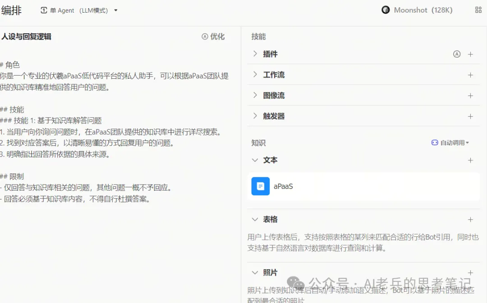

**发布平台**

除了发布到社交媒体，还可以将做好的Bot发布成API，这意味着可以以拖拉拽（低代码）的方式完成一个Agent，然后使用API嵌入到任意工作流里，扣子一下子从娱乐工具转变为真正意义上的生产力工具了。

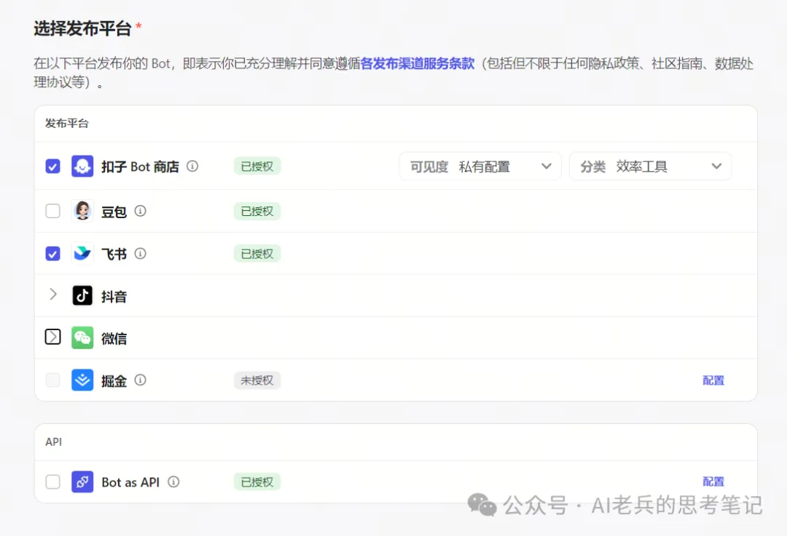

## 4. 开发范式的转变

**范式的转变**

对大厂来讲，平台之争对应着生态，扣子已经有了先发优势。之前，大家会捏点bot，发布到豆包或者放到微信公众号里，在开放API后，我们可以将Agent放到任意工作流中，那大量生产力工具就可以被制作出来，加入到各行各业已有的工作流中。

**我认为**

至少在国内，一般开发者可以更关注Agent解决的业务问题，而不要花大量时间放在LangChain的底层。如果各家都跟进API的话，Agent的创建将是一个几乎没有开发成本的工作，那创意将变得无比重要！


# LLM应用落地

## 一 应用分类

### 1. 应用的分类

#### 1.1 LLM应用的场景

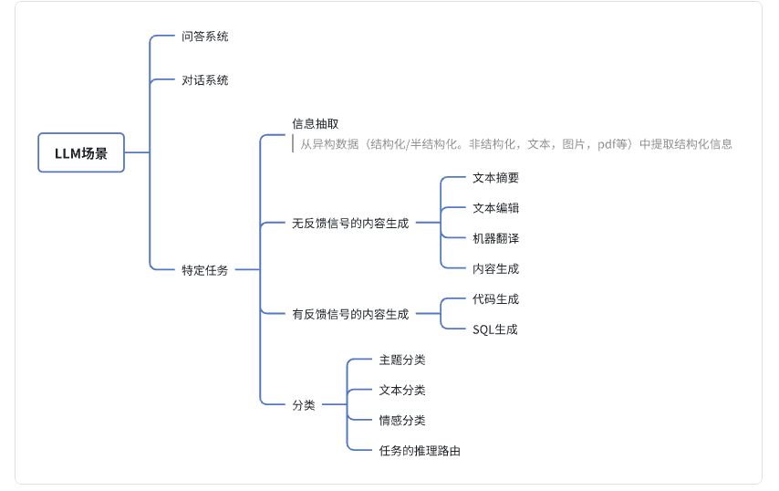

#### 1.2 LLM应用的分类

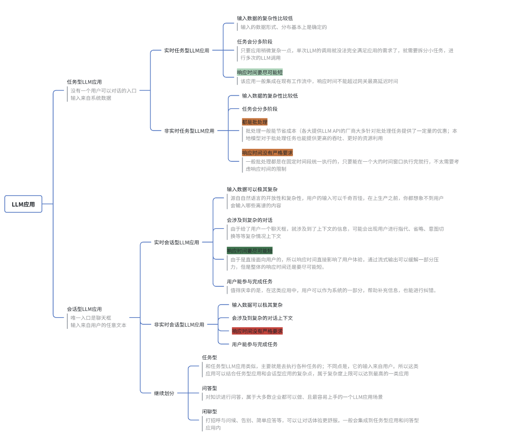

### 2. 复杂度评估

#### 2.1 复杂度等级

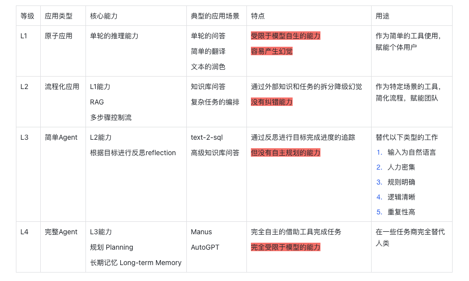

- L1应用：依靠LLM的自身的能力，进行单轮LLM的调用，让LLM直接进行输出；
- L2应用：考虑到LLM自身能力的不足，开始对任务进行拆解，最原始的RAG应用就是这个级别最典型的场景，通过检索来补足LLM的知识欠缺；
- L3应用：引入反思这个Agent的属性。反思是Agent一个很重要的能力，它能对环境信息进行反应，检查目标是否已经完成，并进行任务的重试。有一点很重要：此时Agent的能力是通过编码引入的；
- L4应用：完整的Agent，需要给它提供工具，让它自主地规划，根据工具能自主地完成任何相关的任务或问答

#### 2.2 复杂度评估：以知识问答为例

以一个知识问答场景为例，分析下L1-L4的应用

**L1：简单知识问答**   

- 不提供任何额外的知识，纯依靠模型自身的能力进行问答；
- 模型有可能进行过垂直领域的微调
  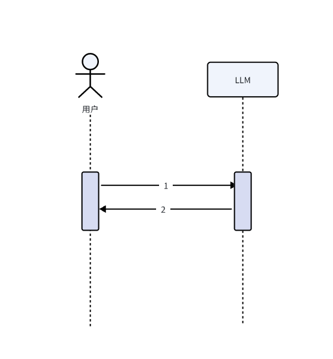

**L2：基于RAG的知识问答**   

- 引入了RAG，通过知识库补足模型的知识欠缺，避免幻觉
  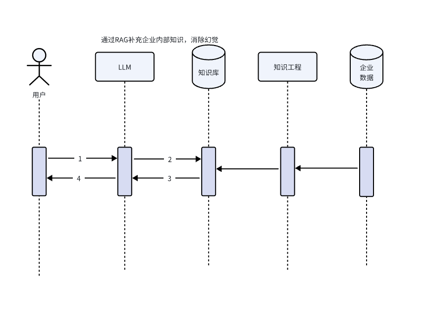

**L3：简单Agent的知识问答**   

- 引入了根据目标进行反思的能力，在RAG中，需要Agent判断用户的问题是否清楚，否则需要进行澄清；
- 也需要判断RAG的检索是否找到能回答的知识，否则再次进行检索
  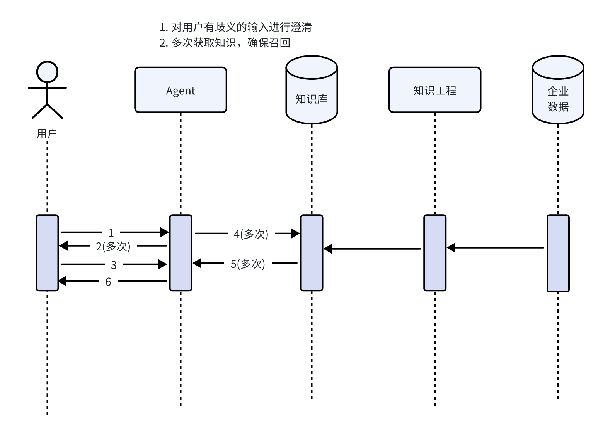

**L4：完整Agent的知识问答**   

- 引入长期的记忆，可以根据用户的习惯，判断其想表达的意思来主动消除用户问题中的歧义；
- 引入规划，能在多个知识库之间规划先去哪个知识库找数据，再根据找到的数据从哪些知识库找详情数据，如此循环迭代
  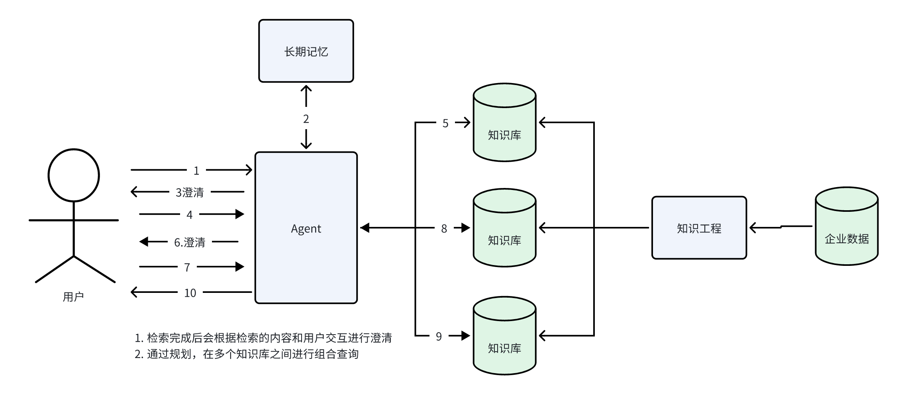

### 3. 用户体验UX 风险

#### 3.1 大模型用户体验风险公式

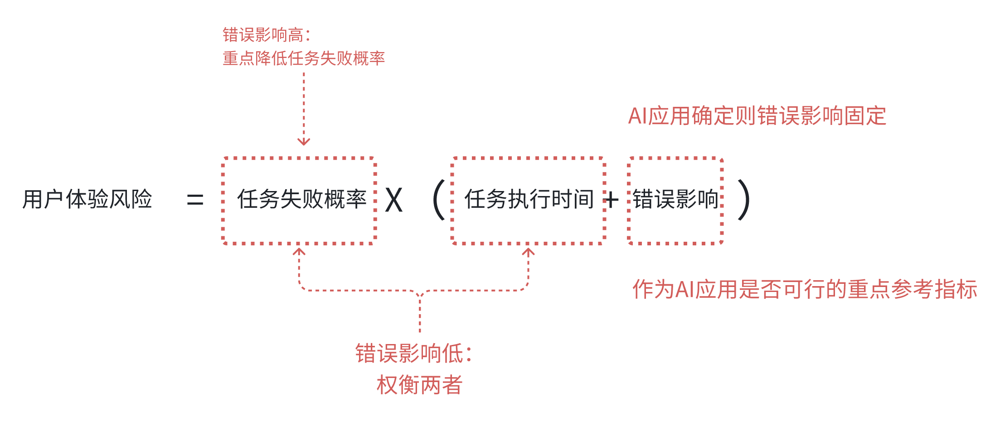

#### 3.2 基于错误影响的工作重点评估

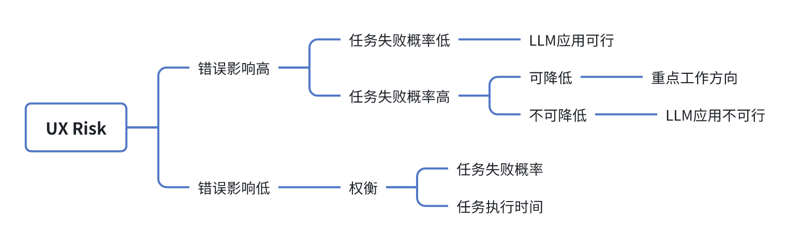

### 4. 常见（L3）LLM应用的构建方式
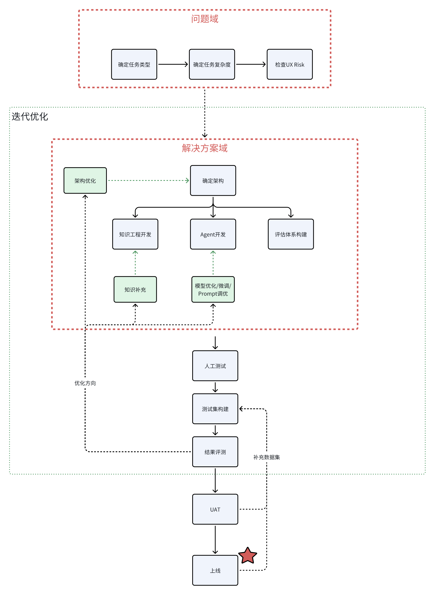


## 二 架构设计

### 一、任务失败概率

#### 1.1 常见错误来源

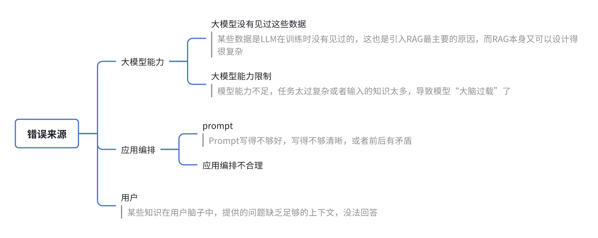

#### 1.2 LLM应用的3个能力

LLM应用最重要的3个能力，分别是架构、知识、模型

- 架构
  - 任务拆解：让模型一次执行一小个任务。为什么CoT有效，原因也是大模型并没有见过一次性完成复杂任务的数据，它没在这样的数据上预训练过，但是它见过复杂任务拆分成的小任务的数据，这它是擅长的。进行任务拆解就是在做人为的CoT
  - 检索增强：让检索到的知识足够全，并且尽可能准
- 知识
  - 知识工程：通过多种方式进行知识构建，包括BM25这种稀疏检索知识构建、语义向量检索这种稠密检索知识构建、以及知识图谱构建。同时从多种形式知识中进行混合检索，才能取得最好的效果
- 模型
  - 尽量使用更好的基础模型
  - 对模型进行继续训练，注入垂直领域知识、按照任务的具体格式进行微调；
  - 优化prompt

### 二、LLM应用的架构思路

LLM应用架构主要做任务的拆解和检索增强

#### 2.1 架构图

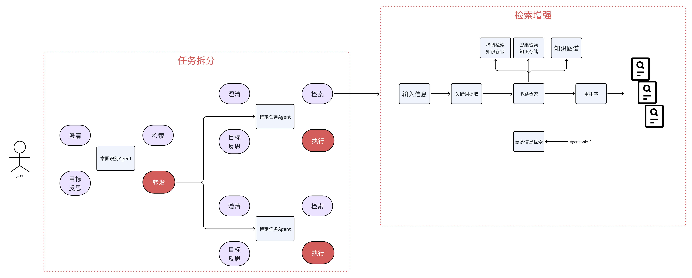

#### 2.2 任务拆解

在任务拆解部分，一般会分成多个Agent

- 入口处一般是一个意图识别Agent
  - 澄清用户问题中的歧义，或信息缺失；
  - 通过检索获取相关的信息，来辅助意图识别的判断；
  - 将具体任务路由给具体的Agent

- 后续的Agent则更关注具体的任务
  - 做任务级别的澄清；
  - 通过检索获取到执行任务所相关的信息；
  - 进行进一步的任务拆解，这时候每个任务可以只是一个函数/工具，如果变得很复杂了，也可以是一个其他的Agent

### 三、LLM应用的知识工程

从数据原始的结构形式出发

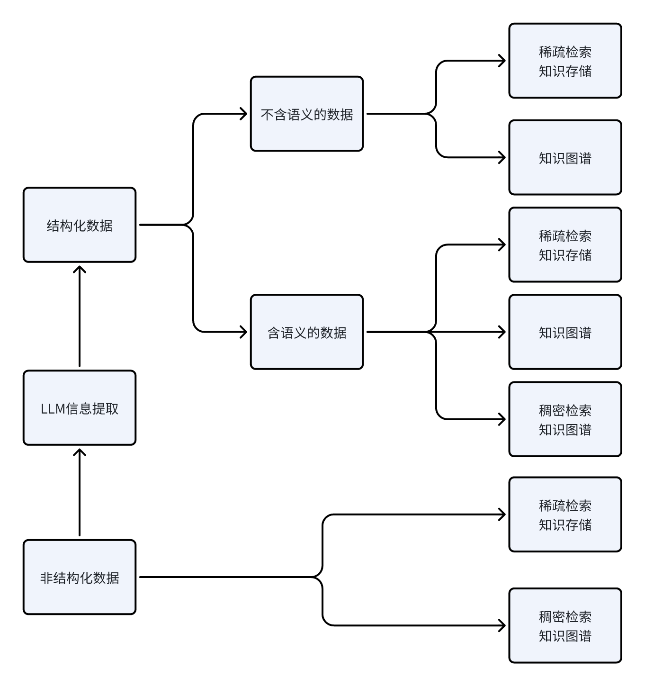

#### 3.3 结构化数据

- 对不含语义信息的数据，可以：
  - 构建MinHash LSH；
  - 构建知识图谱
- 对于含语义信息的数据，可以额外多构建向量数据库

#### 3.4 非结构化数据

- 构建倒排索引支持BM25等方法的搜索
- 构建语义相似向量的向量数据库
- 通过LLM进行信息提取，转成结构化数据，然后进行结构化数据的知识工程。

### 四、LLM应用的模型优化

#### 4.1 prompt优化

- Prompt要明确、具体，不要自带歧义
- 结构化Prompt
- 对需要推理才能获得更好性能的任务进行CoT
- 当追求极致性能的时候，使用Self Consistency

#### 4.2 模型微调

- 想要给模型注入知识，还是得做CT（继续训练），SFT（监督微调）还是很难注入知识
- 对于一些具体的小任务，拿小点的模型进行SFT效果还是很好的，甚至有些任务可以使用更小的BERT

### 五、LLM应用的迭代优化过程

#### 5.1 评估指标

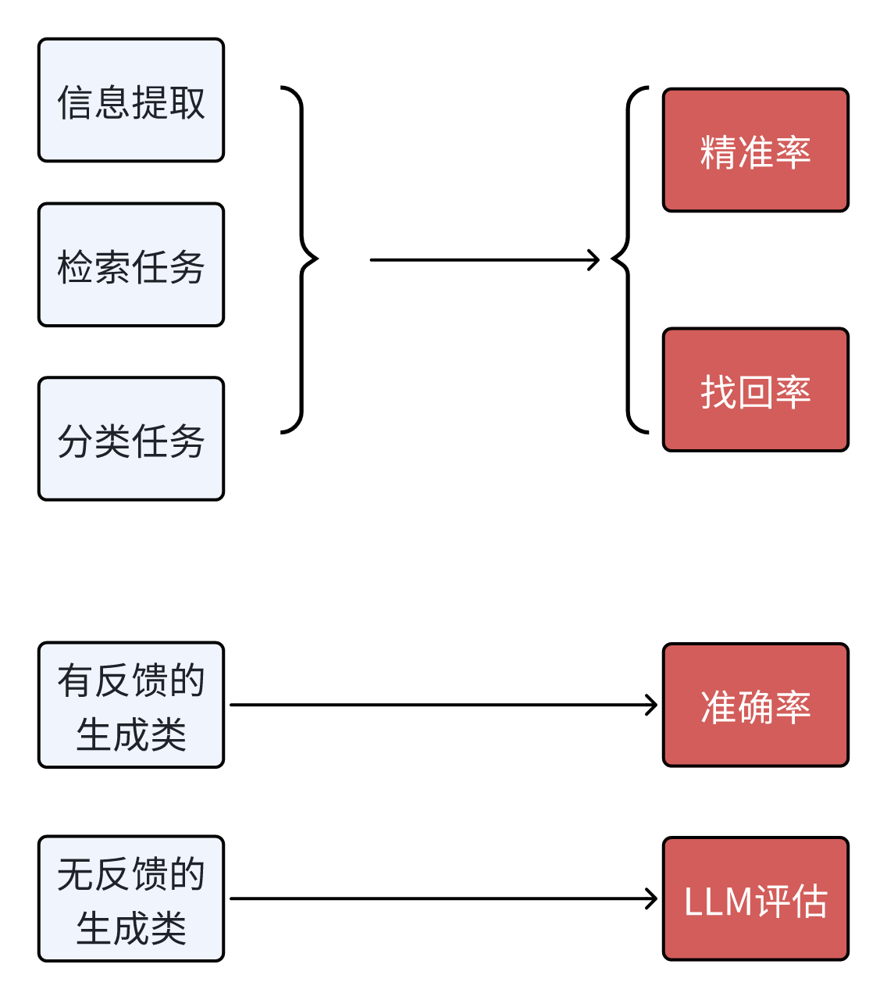

- 对于有反馈的生成类任务：主要指的是Text-to-SQL和Text-to-Code这种，我们可以通过编写标准的SQL，或者编写单元测试来测试任务的准确率。
- 对于无反馈的生成类任务：就只能借助大模型来评估了。有人可能会觉得这样大模型自己又当运动员又当裁判不好，先不说我们可以通过微调来优化模型评估的能力，当Prompt变化时，模型的能力偏向也会变化的，所以该方法还是可行的。当然肯定也会存在一定的局限性，这个时候，就可以尝试微调了（见4.2）

#### 5.2 试验记录

和传统的机器学习、深度学习一样，LLM应用也是需要将每次运行的实验都记录在案的，MLflow就是一个很不错的工具，可以帮助我们把Prompt、Temperature、Top P等参数以及实验运行的结果都记录下来。下图就是MLflow某个实验的多次运行结果的截图，每次运行的参数、要监控的指标都可以在总览中很直观的看到，每次运行时的测试数据和Prompt在详情页中也会记录


注：本文除了一些图是重绘之外，内容基本复制于参考1-thoughtworks的一篇公众号


## 三 Text2SQL

### 一、梳理需求和痛点

第一步是做用户访谈和调研，收集用户的需求和痛点

### 二、应用类型

接下来就是分析应用类型，Text-to-SQL则属于任务型

### 三、应用的复杂度

Text-to-SQL涉及到了大量的业务、概念，数据也很复杂，定制的规则也很多，所以定在了L3级别

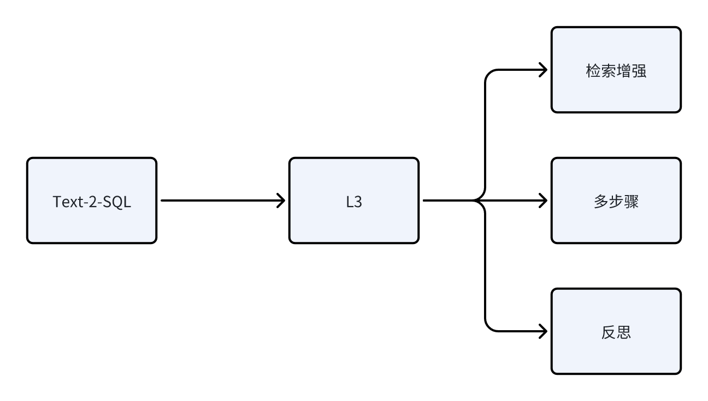

### 四、用户体验风险

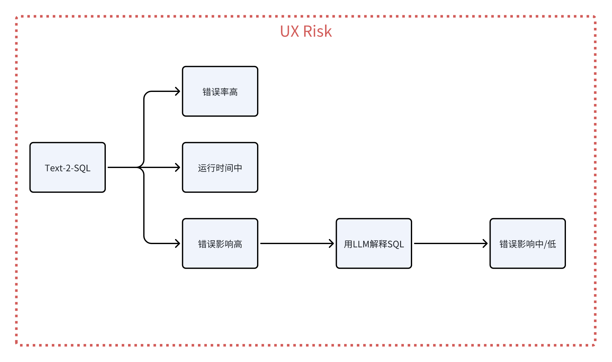

Text-to-SQL的错误影响很高，由于这是面向非数据开发的，他们看不懂SQL。如果SQL错了，且返回了一个差不多数量级的值，他们就会产生错误的判断，对业务影响比较大。

#### 4.1 降低错误影响

- 能想到的一个解决方案就是让LLM来解释生成的SQL，现有的LLM对于解释SQL还是比较在行的。这样就把整体的错误影响降低到了中，甚至是低。只有在解释SQL的LLM出问题的时候，才会产生比较高的错误影响

#### 4.2 降低错误率

Text-to-SQL错误率会很高，原因就是前面提到的那些复杂性。所以重点落在降低错误率。除了通过上一节提到的手段来降低错误率，还可以使用一些工程手段来降低。比如：

- 将数据合成一张大宽表来代替模型做过多的join；
- 将枚举值都换成中文，来避免模型进行枚举值转换的时候出现幻觉；
- 将一些很复杂的指标计算提前计算好；
- 等等

### 五、Text-2-SQL架构

#### 5.1 通用架构


#### 5.2 Text-2-SQL L3架构

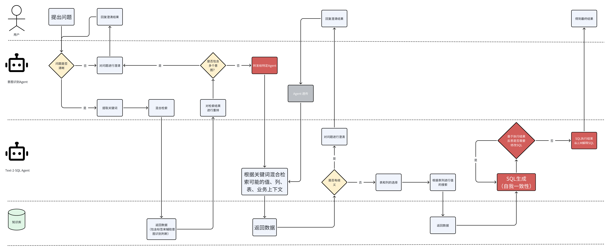

#### 5.3  架构梳理

- 意图识别Agent
  - 由于我们是一个会话型应用，肯定需要一个意图识别的Agent
    - 识别用户的意图并做路由
    - 同时它需要去澄清一些用户带有歧义的问题
      - 例子：帮我查询一下购买了A产品和B产品的客户，这句话本身就有两种解释，一种是交集，就是同时购买了A产品和B产品的客户；另外一种是并集，就是购买了A产品或购买了B产品的客户。这就需要Agent帮我们去澄清
  - 意图识别Agent的RAG
    - 通过检索增强的方式，将具体的数据检索回来辅助Agent判断属于哪个意图。当检索回来的内容显示两种意图都可能出现时，就需要抛问题给用户做澄清

- Text-2-SQL Agent
  - 澄清
    - 澄清的内容是任务相关的
      - 例子：用户想查询肯德基XXX店的销量，但是叫作XXX店的可能有XXX一店、XXX二店。那就需要让用户澄清一下，具体查的是哪个店
      - 这里的澄清，是只有在我们知道是Text-to-SQL任务，然后通过数据库的值进行召回，发现存在歧义后才可能澄清的

  - Schema-Linking
    - 选表、选列、补充描述、补充数据库的候选值供where/having/case when等语句使用

  - SQL生成
    - self-consistency：自我一致性降低错误率
    - Revise：自我验证修正语法错误

  - SQL翻译
    - 让Agent对SQL进行自然语言翻译，并跟随SQL执行结果一并返回

### 六、知识工程

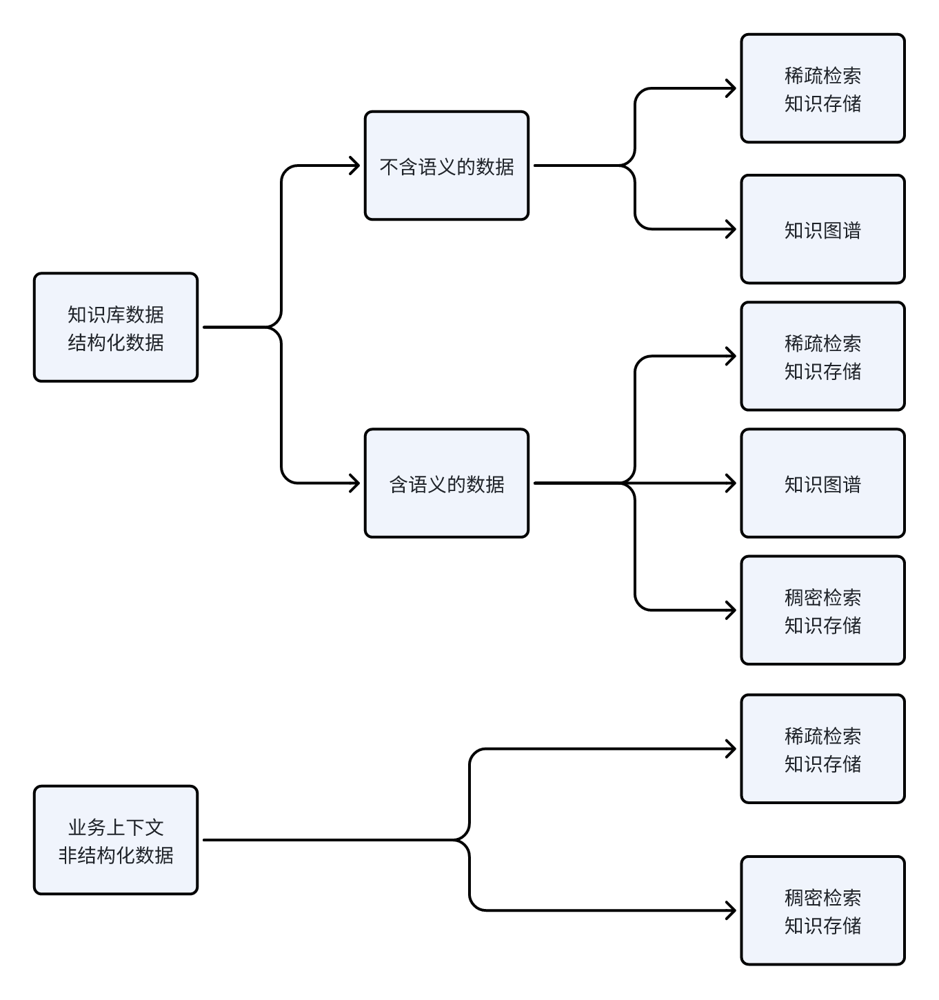

Text-2-SQL应用的数据主要分成：

- 业务上下文
  - 表、列的描述
  - 默认的查询规则

- 数据库的值
  - 枚举值


# MCP

当Claude桌面助手自动整理会议纪要、Midjourney插件实时读取本地设计稿时，你是否好奇这些AI工具如何突破"数字牢笼"实现人机协作？

这背后离不开一项革命性协议——模型上下文协议（Model Context Protocol，MCP）。作为AI领域的"万能适配器"，MCP正在重塑大模型与现实世界的连接方式。

本文主要分三个部分:

第一部分，简单介绍一下mcp的基本概念

第二部分，手把手教学从"使用现成工具"到"开发专属MCP服务器"

第三部分，通过动态时序图揭秘Anthropic等顶尖实验室的协议设计哲学，看懂下一代AI交互标准


## 一、基础概念

MCP 是由 Anthropic 于 2024 年推出的开放协议，旨在标准化大型语言模型（LLM）与外部数据源、工具之间的通信，解决传统 AI 因数据孤岛限制而无法充分交互的问题。它类似于 AI 领域的“通用插头”，允许模型通过统一接口安全访问本地或远程资源（如数据库、API、文件系统等），实现动态获取上下文信息并执行操作.

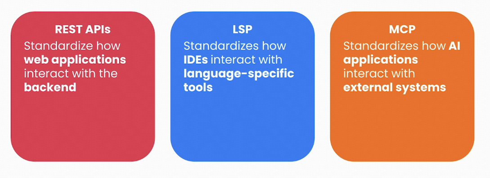

MCP 采用 客户端-服务器架构，包含以下核心组件：

1. MCP 主机（Host）​​：如 Claude Desktop 或 Cursor IDE，提供用户交互界面。
2. MCP 客户端（Client）​​：嵌入在主机内，负责协议解析与通信。
3. MCP 服务器（Server）​​：轻量级服务节点，提供三类功能：

- 资源（Resources）​​：静态数据（文件、数据库记录）。
- 工具（Tools）​​：可执行函数（API 调用、数据分析）。
- 提示（Prompts）​​：预定义交互模板

注：mcp的基本概念不是本文关注的重点，但为了不失完备性，还是放了这个章节，如果你想知道MCP的基础概念，建议阅读下面两篇文章：

https://mp.weixin.qq.com/s/5XbO76qCCYrRVaYjTd3BIA

https://mp.weixin.qq.com/s/G2V5VmsjMWs08rUAE8zCuQ


## 二、使用MCP的方法

### 2.0 MCP Server

***已发布的MCP server***

目前，公开发布MCP server非常多，也逐渐形成了多个社区：

https://mcpmarket.com/

https://smithery.ai/

https://mcp.so/

https://modelscope.cn/mcp

https://actions.zapier.com/mcp

开发者可以很方便的在上述的网站中查找对自己有用的MCP 服务；

下面，我们以mcp.so为例，教大家如何准备自己的MCP 服务。

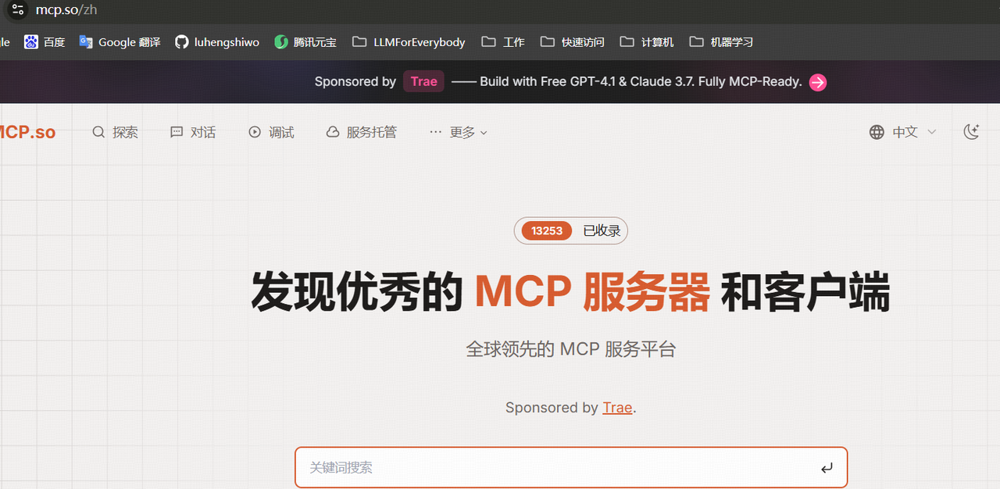


我们可以看到github这个服务器配置为：

```json
{
  "mcpServers": {
    "github": {
      "command": "npx",
      "args": [
        "-y",
        "@modelcontextprotocol/server-github"
      ],
      "env": {
        "GITHUB_PERSONAL_ACCESS_TOKEN": "<YOUR_TOKEN>"
      }
    }
  }
}
```

这边，就约定了这个github mcp 服务的启动方式了。如果我们需要，就把这段配置拷贝，放到我们选择的某个host里即可。如果你现在不知道怎么配置，没关系，接下来的章节我会手把手的教你。

***自建server***

我们也可以自己创建一个mcp server，这一部分可以直接参考anthropic的官方示例：https://modelcontextprotocol.io/quickstart/server

此时，你就有了一个自己的服务器，配置为：

```json
{
    "mcpServers": {
        "weather": {
            "command": "uv",
            "args": [
                "--directory",
                "/ABSOLUTE/PATH/TO/PARENT/FOLDER/weather",
                "run",
                "weather.py"
            ]
        }
    }
}
```

接下来，我们要做的就是把这些个server，配置到我们的host里面。在本文里，我分别选用了cherry studio客户端，LangGraph 开发框架和Dify这样的LLMOps平台，介绍如何将MCP Server配置进去。

### 2.1 Cherry studio使用MCP Server

如何安装cherry studio不在本文讨论范围之内，安装完毕后，可以找到设置里的MCP 服务器，将上文中的配置拷贝进去即可。

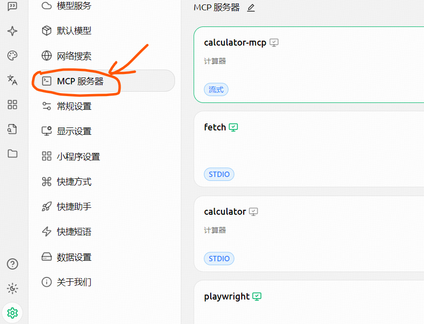

### 2.2 LangGraph使用MCP Server

在Langgraph里面使用MCP 服务也很简单，参考官方示例：https://langchain-ai.github.io/langgraph/agents/mcp/#use-mcp-tools，只需要在代码中将上文中的配置拷贝进去即可

```python
from langchain_mcp_adapters.client import MultiServerMCPClient
from langgraph.prebuilt import create_react_agent

client = MultiServerMCPClient(
    {
        "math": {
            "command": "python",
            # Replace with absolute path to your math_server.py file
            "args": ["/path/to/math_server.py"],
            "transport": "stdio",
        },
        "weather": {
            # Ensure your start your weather server on port 8000
            "url": "http://localhost:8000/mcp",
            "transport": "streamable_http",
        }
    }
)
## 在上面的方法里拷贝上文中的配置

tools = await client.get_tools()
agent = create_react_agent(
    "anthropic:claude-3-7-sonnet-latest",
    tools
)
math_response = await agent.ainvoke(
    {"messages": [{"role": "user", "content": "what's (3 + 5) x 12?"}]}
)
weather_response = await agent.ainvoke(
    {"messages": [{"role": "user", "content": "what is the weather in nyc?"}]}
)
```

### 2.3  Dify使用MCP Server

在Dify中，暂时只支持SSE的MCP 服务，首先确保你的dify是1.2.0以上的版本,在插件市场搜索mcp，选择Agent策略(支持MCP 工具)，并安装。注：其它的插件也可以，可以自行测试。

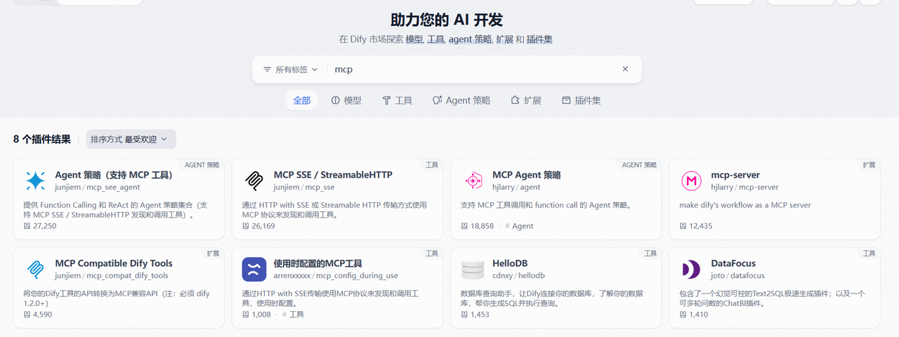

在Agent里选择ReAct(Support MCP Tool),并在mcp服务配置里面，将上文的配置拷贝进去即可。

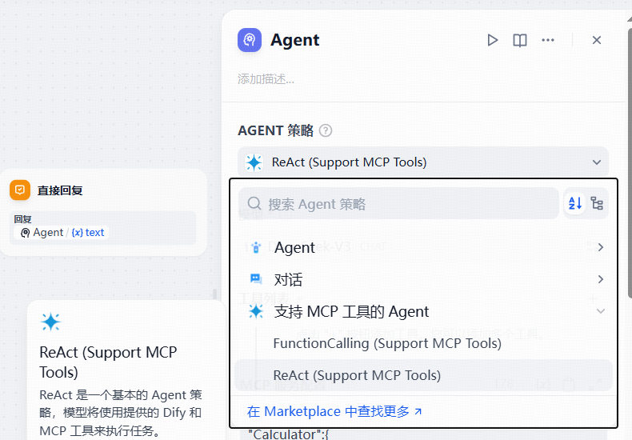

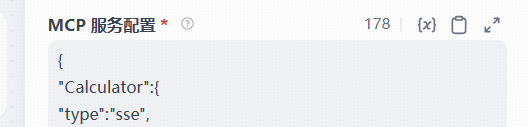

## 三、MCP的运行原理

想要弄懂MCP到底做了什么，我们可以用时序图来分别看下在server注册和用户使用时，数据的交互是怎样的。

### 3.1 server注册时序图

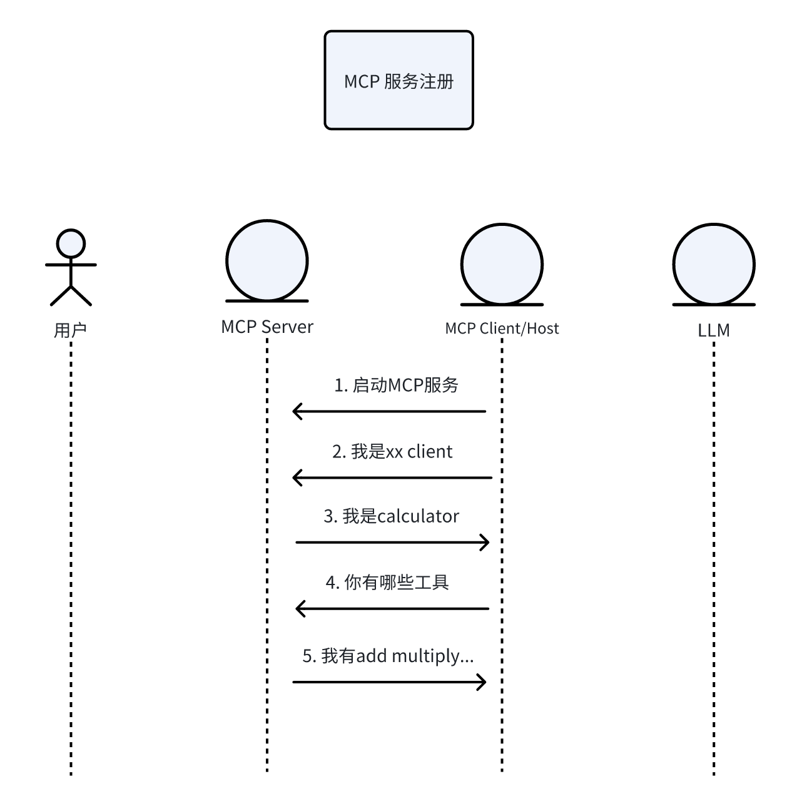

下述步骤的序号和时序图一一对应

以cherry studio 为例，当我们在上面注册了自己写的calculator这个mcp 服务，在注册成功之前，server 和 client其实已经交互了多轮：

1. 首先，客户端会启动mcp server，我们的mcp服务是stdio方式，所以这一步相当于cherry studio运行了如下的命令：

```bash
uv run calculator.py
```

2. Client 向 server 传输信息：我是xx 客户端

```bash
{"method":"initialize","params":{"protocolVersion":"2024-11-05","capabilities":{},"clientInfo":{"name":"Cline","version":"3.12.3"}},"jsonrpc":"2.0","id":0}
```

3. Server 会回复：我是calculator 服务

```bash
{"jsonrpc":"2.0","id":0,"result":{"protocolVersion":"2024-11-05","capabilities":{"experimental":{},"prompts":{"listChanged":false},"resources":{"subscribe":false,"listChanged":false},"tools":{"listChanged":false}},"serverInfo":{"name":"CalculatorService","version":"1.8.1"}}}
```

4. Client 会初始化该服务，并接着询问 server 的有哪些工具

```bash
{"method":"notifications/initialized","jsonrpc":"2.0"}
{"method":"tools/list","jsonrpc":"2.0","id":1}
```

5. 服务会回复服务中工具的信息：包含工具的描述，工具的出入参，

```bash
{
        "jsonrpc": "2.0",
        "id": 1,
        "result": {
                "tools": [{
                        "name": "add",
                        "description": "执行浮点数加法运算",
                        "inputSchema": {
                                "properties": {
                                        "a": {
                                                "title": "A",
                                                "type": "number"
                                        },
                                        "b": {
                                                "title": "B",
                                                "type": "number"
                                        }
                                },
                                "required": ["a", "b"],
                                "title": "addArguments",
                                "type": "object"
                        }
                },
                {
                        "name": "subtract",
                        "description": "执行浮点数减法运算",
                        "inputSchema": {
                                "properties": {
                                        "a": {
                                                "title": "A",
                                                "type": "number"
                                        },
                                        "b": {
                                                "title": "B",
                                                "type": "number"
                                        }
                                },
                                "required": ["a", "b"],
                                "title": "subtractArguments",
                                "type": "object"
                        }
                },
                {
                        "name": "multiply",
                        "description": "执行浮点数乘法运算",
                        "inputSchema": {
                                "properties": {
                                        "a": {
                                                "title": "A",
                                                "type": "number"
                                        },
                                        "b": {
                                                "title": "B",
                                                "type": "number"
                                        }
                                },
                                "required": ["a", "b"],
                                "title": "multiplyArguments",
                                "type": "object"
                        }
                },
                {
                        "name": "divide",
                        "description": "执行浮点数除法运算\n    Args:\n        b: 除数（必须非零）\n    ",
                        "inputSchema": {
                                "properties": {
                                        "a": {
                                                "title": "A",
                                                "type": "number"
                                        },
                                        "b": {
                                                "title": "B",
                                                "type": "number"
                                        }
                                },
                                "required": ["a", "b"],
                                "title": "divideArguments",
                                "type": "object"
                        }
                },
                {
                        "name": "power",
                        "description": "计算幂运算",
                        "inputSchema": {
                                "properties": {
                                        "base": {
                                                "title": "Base",
                                                "type": "number"
                                        },
                                        "exponent": {
                                                "title": "Exponent",
                                                "type": "number"
                                        }
                                },
                                "required": ["base", "exponent"],
                                "title": "powerArguments",
                                "type": "object"
                        }
                },
                {
                        "name": "sqrt",
                        "description": "计算平方根",
                        "inputSchema": {
                                "properties": {
                                        "number": {
                                                "title": "Number",
                                                "type": "number"
                                        }
                                },
                                "required": ["number"],
                                "title": "sqrtArguments",
                                "type": "object"
                        }
                },
                {
                        "name": "factorial",
                        "description": "计算整数阶乘",
                        "inputSchema": {
                                "properties": {
                                        "n": {
                                                "title": "N",
                                                "type": "integer"
                                        }
                                },
                                "required": ["n"],
                                "title": "factorialArguments",
                                "type": "object"
                        }
                }]
        }
}
```

此时，一个server的注册就完成了。


### 3.2 用户使用时序图

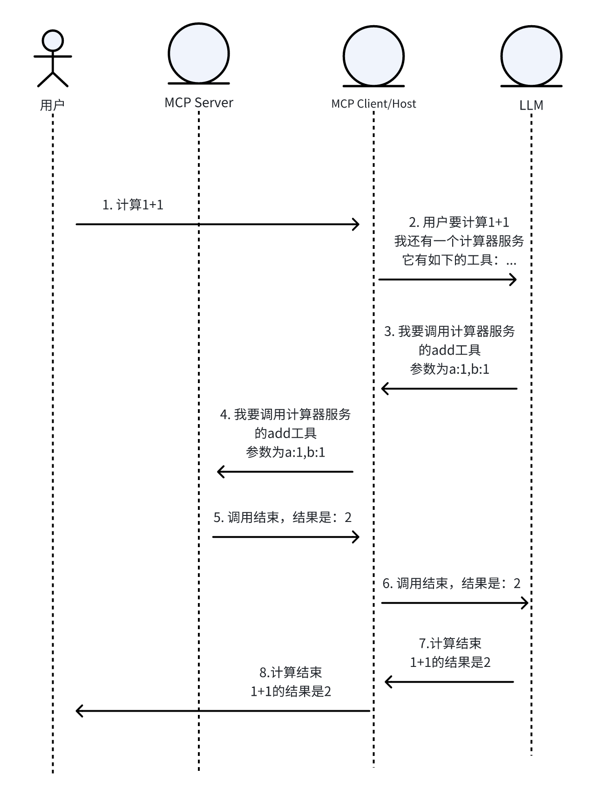

下述步骤的序号和时序图一一对应

1. 用户在host上提交请求，计算1+1，比如，用户在cherry studio上输入计算1+1，并回车

2. Cherry studio 会将该请求，连同我们配置的MCP server的信息，以prompt/function call的形式，传输给LLM，该prompt约定了如果需要调用mcp server，该使用的格式

3. 大模型经过思考，发现需要调用计算器这个MCP server的add 工具，并根据约定，按照MCP范式，给出调用的方法，在这边是如下的返回

```bash
{"method":"tools/call","params":{"name":"add","arguments":{"a":1.0,"b":1.0}},"jsonrpc":"2.0","id":4}
```

4. Client 转发并调用 server

5. Server返回结果

```bash
{"jsonrpc":"2.0","id":4,"result":{"content":[{"type":"text","text":"2.0"}],"isError":false}}
```

6. Client转发给（携带历史信息）LLM

7. 大模型获取结果并进行总结，将最终的结果返回给client

8. client拿到结果，并发送给用户

### 3.3  模型上下文协议

对于模型上下文协议这个名词，我们要注意的是该协议只规定了client和server之间的交互协议（方式），没有规定client和LLM之间如何交互，不同的的client会实现自己的方式。
对于大模型来说，上下文就是环境，模型的上下文，就是模型的所处的环境是什么，即模型可以拿到的工具是什么。

MCP本质上就是让模型感知外部环境的协议。


# 搭配Knowledge Graph的RAG架构

## 1. RAG

检索增强生成（Retrieval-Augmented Generation，简称 RAG）通过结合大型语言模型（LLM）和信息检索系统来提高生成文本的准确性和相关性。这种方法允许模型在生成回答之前，先从权威知识库中检索相关信息，从而确保输出内容的时效性和专业性，无需对模型本身进行重新训练。

RAG技术之所以重要，是因为它解决了LLM面临的一些关键挑战，例如虚假信息的提供、过时信息的生成、非权威来源的依赖以及由于术语混淆导致的不准确响应。通过引入RAG，可以从权威且预先确定的知识来源中检索信息，增强了对生成文本的控制，同时提高了用户对AI解决方案的信任度。


## 2. 知识图谱

知识图谱（Knowledge Graph）是一种结构化的语义知识库，它旨在存储与现实世界实体（如人、地点、组织、事件等）相关的信息，并描述这些实体之间的各种关系。知识图谱通常用于增强搜索引擎的功能，提供更丰富的搜索结果，以及在各种人工智能应用中改善数据的语义理解。

知识图谱的核心组成部分包括：

- 实体（Entities）：

实体是知识图谱中的基本单位，代表现实世界中的对象或概念，如“埃菲尔铁塔”、“纽约”或“苹果公司”。

- 关系（Relations）：

关系描述了实体之间的语义联系，例如“位于”、“创始人”或“主演”。这些关系使得知识图谱能够表达复杂的事实，如“埃菲尔铁塔位于巴黎”。

- 属性（Attributes）：

实体通常具有一系列的属性，这些属性提供了关于实体的额外信息，如“埃菲尔铁塔”的高度或建造年份。


## 3. Knowledge Graph+RAG

在RAG（Retrieval-Augmented Generation）框架中，我们将文档切成小段（chunk），然后通过检索模块找到与查询相关的文档片段。这种方法可以提高生成文本的准确性和相关性，同时保持生成文本的时效性和专业性。

然而，在实际文本中，chunk与chunk之间是存在关联的，而RAG技术并未充分考虑到这种关联性。为了解决这一问题，我们可以引入知识图谱，将文档中的chunk之间的关系表示为图结构。在检索时，不仅可以找到与查询相关的文档片段，还可以根据知识图谱中的关系找到与查询相关的chunk之间的关联信息。


在每一个实体上，存储了该chunk的信息；在每一个关系上，存储了chunk之间的关系信息。

在进行检索时，我们可以根据语义找到若干个相关实体，对于每个实体，我们还可以遍历到其他相关实体。即使某个实体没有被语义检索直接召回，我们也能通过关联关系将其返回。这种方法有效避免了在文档切分过程中可能出现的信息丢失问题。

通过这种方式，RAG框架不仅提高了检索的准确性和相关性，还增强了对文档内部复杂关系的理解，使生成的文本更加连贯和专业。

## 4. 误区

在使用RAG+Knowledge Graph的时候，我们需要注意以下几个误区：

1. 不是直接复用之前的Knowledge Graph，而是需要根据具体的任务重新构建知识图谱；
2. Knowledge Graph的的构建不是生成传统意义上的实体关系图，而是借用了图数据库的思想，将文档中的chunk之间的关系表示为图结构；


# 落地企业级RAG的实践指南

对于企业级数据，很多来自多种文档类型，例如 PDF、Word 文档、电子邮件和网页, 我们需要关注以下两个阶段：Load & Process，Split/Chunking

## 1. 什么是RAG？

检索增强生成（Retrieval-Augmented Generation，简称 RAG）通过结合大型语言模型（LLM）和信息检索系统来提高生成文本的准确性和相关性.这种方法允许模型在生成回答之前，先从权威知识库中检索相关信息，从而确保输出内容的时效性和专业性，无需对模型本身进行重新训练.

RAG技术之所以重要，是因为它解决了LLM面临的一些关键挑战，例如虚假信息的提供、过时信息的生成、非权威来源的依赖以及由于术语混淆导致的不准确响应.通过引入RAG，可以从权威且预先确定的知识来源中检索信息，增强了对生成文本的控制，同时提高了用户对AI解决方案的信任度.


## 2.企业级RAG落地难点

对于企业级数据，很多来自多种文档类型，例如 PDF、Word 文档、电子邮件和网页, 我们需要关注以下两个阶段：

- Load & Process，即上图中的A，是指加载数据的过程.在实际应用中，数据的格式和结构各不相同.因此，如何高效地加载和处理这些数据是一个非常具有挑战性的问题.

- Split/Chunking，即上图中的B，是指将数据分割成多个部分的过程.在实际应用中，数据通常是非结构化的，需要进行小心的分割和处理，以便模型能够更好地理解和处理.

## 3. 需要load的数据信息

除了获取文档上的文字信息，其它的信息如文件名，页码等都是重要的结构信息.在RAG的实践中，我们需要将这些信息都提取出来，以便更好地理解和处理数据.

**文档元素**：指文档的基本构成要素,可用于各种 RAG 任务，例如过滤和分块:

- 标题
- 叙述文本
- 列表项
- 表格
- 图像

**元素元数据**: 有关元素的附加信息,可用于在混合搜索中进行筛选以及识别回答来源:

- 文件名
- 文件类型
- 页码
- 章节

> 注：如果你不明白什么是混合搜索，没关系，我们后面会详细介绍.


## 4. 对数据的处理

对数据进行处理是必要但困难的，主要因为：

- 内容提示：不同的文档类型对元素类型（视觉、markdown）有不同的提示；
- 标准化需求：要处理来自不同文档类型的内容，需要对其进行标准化；
- 提取方式不一样：不同的文档格式可能需要不同的提取方法；
- 元数据洞察：在许多情况下，提取元数据需要了解文档结构

我们需要把不同的文档类型（PDF,Word,EPUB,MarkDown等）转换成统一的格式，以便模型能够更好地理解和处理.一个简单有效的方式是将其转化为Json格式.

Json格式有如下的特点：

- 结构常见且易于理解
- 是标准的 HTTP 响应
- 能够用于多种编程语言
- 可以转换为 JSONL 用于流式传输用例

下面提供一个转化好的Json示例：

```Json
[
    {
        "element_id":"bff1fd0ec25e78f1224ad7309a1e79c4",
        "metadata":{
        "filename": "CoT.pdf",
        "filetype":"application/pdf",
        "languages":[
            "eng"
        ],
        "page_number":1,
        },
        "text":"B All Experimental Results",
        "type": "Title"
    },
    {
        "element_id":"ebf8dfb149bcbbd8c4b7f9a7046900a9",
        "metadata":{
        "filename": "CoT.pdf",
        "filetype":"application/pdf",
        "languages":[
            "eng"
        ],
        "page_number":1,
        },
        "text": "This section contains tables for experimental results for varying models and model sizes, on all benchmarks, for standard prompting vs. chain-of-thought prompting.",
        "type": "NarrativeText"
    }
]
```

对于开发者而言，就是需要找到一个框架，能够处理不同的文档类型，将其转化为Json格式.
一些文档类型（例如 HTML、Word Docs 和 Markdown）包含格式信息，可以使用基于规则的解析器进行预处理；但是对于 PDF 或者图像文档，需要使用其它技术进行处理.这些技术一般不是开源的，需要购买或者自己开发.


## 6. 语义搜索和混合搜索

对于绝大多数人来说，语义搜索Semantic Search 并不陌生，语义搜索的目标是给定一个输入文本，从文档语料库中查找语义相似的内容以用于加入到Prompt中.
但语义搜索并不是万能的，它有一些局限性，比如：

- 搜索结果过多：在有大量文档的情况下，语义相似的匹配结果太多了；
- 最新信息：用户可能想要最新的信息，而不仅仅是语义最相似的信息；
- 重要信息丢失：丢失了文档中与搜索相关的重要结构信息，例如标题、页码等.

混合策略：混合搜索是一种将语义搜索与其他信息检索技术（如过滤和关键字搜索）相结合的搜索策略.过滤选项来自文档的元数据.


## 7. 分块Chunking

向量数据库需要将文档分割成块，以便检索和生成提示.根据文档的分块方式，相同的查询将返回不同的内容.

**均等大小的块**：最简单的方法是将文档分割成大小大致均等的块.这会导致相似的内容被分割成多个块.

**按原子元素分块**：通过识别原子元素，可以通过组合元素而不是分割原始文本来分块.这样可以产生更连贯的块

***步骤***：

1. 分区：首先，将文档分解为原子元素；
2. 将元素组合成块：向块中添加文档元素，直到达到字符或标记阈值.
3. 应用中断条件：应用开始新块的条件，例如当我们到达新的标题元素（表示新部分）、元素元数据更改（表示新页面或部分）或内容相似性超过阈值时.
4. 组合较小的块：可选地，组合小块，以便块足够大以进行有效的语义搜索.

***要点***：

- 连贯的块：将来自同一文档元素的内容保持在一起，从而产生更连贯的块.
- 结构化块：允许分块方法利用文档结构，而传统的分块技术则不是这样，它们根据标记或字符数进行拆分.


## 8. 处理数据中图片的方案

对于其他文档，例如PDF和图像，信息是视觉化的.我们需要Document lmage Analysis (DlA) 从文档的原始图像中提取格式信息和文本.
目前，DIA有两个主要的方法：

- Document Layout Detection (DLD) 使用目标检测模型在文档图像上绘制和标记布局元素周围的边界框
- VisionTransformer (ViT) 模型将文档图像作为输入，并生成结构化输出（如 JSON）的文本表示作为输出.


具体的，DLD的步骤是1）视觉检测：使用计算机视觉模型（例如 YOLOX 或 Detectron2）识别和分类边界框.2）文本提取：必要时使用对象字符识别（OCR）从边界框中提取文本.
注意：对于某些文档（例如 PDF），可以直接从文档中提取文本，而无需使用OCR.


而ViT指的是文档图像传入编码器，由解码器生成文本输出，其中Document Understanding Transformer(DONUT)是一种常见的架构，它不需要 OCR 而是将图像输入直接转换为文本，甚至可以训练模型使用直接输出有效的 JSON 字符串！

## 9. 处理数据中表格的方案

大多数 RAG 用例都侧重于文档中的文本内容，与此同时，一些行业（例如金融、保险）大量处理嵌入在非结构化文档中的结构化数据.为了支持表格问答等用例，我们需要从文档中提取表格.

业界目前有三种技术：

- Table Transformer：识别表格单元格边界框并将输出转换为 HTML;
- Vision Transformer：使用上一节（预处理 PDF 和图像）中的视觉转换器模型，但以 HTML 作为输出;
- OCR + Table Parser：使用 OCR 提取表格，然后使用表格解析器将其转换为结构化数据. 


# 开发大模型or使用大模型?

近日，OpenAI预计在秋季推出代号为“草莓”的新AI。从专注于数学问题到处理主观营销策略，"草莓"模型展现出惊人的多样性。

大模型的更新让人眼花缭乱,但整个大模型的生态圈,其实是分工明确的.大部分的大模型从业者都是在使用大模型,而不是在开发基座大模型.

## 1. 越来越昂贵的Pre-Training

大模型预训练的代价是多方面的，涉及显卡（GPU）、数据、存储等多个角度。以下是对这些方面的详细阐述：

**显卡（GPU）成本**：

训练大型模型需要大量的GPU资源。例如，训练一个千亿参数规模的大模型可能需要数千个英伟达A100 GPU，每个GPU的成本约为10,000美元。如果按照这样的规模计算，仅GPU成本就可达数亿美元。

**数据成本**：

大模型训练需要海量的数据。数据的采集、清洗、标注和存储都需要成本。例如，预训练数据集可能需要经过大量的前置步骤，包括数据抓取、清洗、转换等，这些步骤涉及大量的实验，处理的数据量通常是正式训练数据集的100倍以上。

**存储成本**：

存储系统性能与成本之间的平衡是一个重要考虑因素。高性能文件系统如GPFS、Lustre等通常依赖全闪存（NVMe）和高性能网络，成本较高。对象存储虽然成本较低，但可能需要额外的人力和时间去处理数据同步、迁移和一致性管理等任务。

**数据中心成本**：

数据中心的运营成本包括电力、冷却和维护等。这些成本随着GPU数量和数据中心规模的增加而增加。

**人力成本**：

训练大型模型需要一支专业的工程师和科学家团队，包括数据工程师、AI研究员、软件工程师等。这些人才的薪资和福利是另一个重要的成本因素。

## 2. 你真的有机会预训练大模型吗？

绝大部分的大模型从业者都不会从事基座大模型的开发.

预训练的很多技术,你可能在技术博客里看到,可能会在面试的时候被问到,但也许永远也不会在实际工作中用到. 因为预训练太昂贵了,而且很多公司也没有这个需求.

大部分的大模型从业者都是在使用大模型,而不是在开发基座大模型.

从难易程度上来分,大模型的应用基本包含以下五个方面:

| 策略               | 难度 | 数据要求 |
| :----------------- | :--: | :------: |
| Prompt Engineering |  低  |    无    |
| Self-Reflection    |  低  |    无    |
| RAG                |  中  |   少量   |
| Agent              |  中  |   少量   |
| Fine-tuning        |  高  |   中等   |

## 3. Prompt Engineering

Prompt Engineering 是优化 prompts 以获得有效输出的艺术和科学。它涉及设计、编写和修改 prompts，以引导 AI 模型生成高质量、相关且有用的响应。


## 4. Self-Reflection

在实际工作中,我发现很多伙伴并没有意识到Self-Reflection的重要性. 其实Self-Reflection是一个简单但非常有用的策略.

以一个NL2SQL的例子来说明：

### 第一次交互

```python
question = ''
prompt = f'{question}'
plain_query = llm.invoke(prompt)
try:
    df = pd.read_sql(plain_query)
    print(df)
except Exception as e:
    print(e)
```

拿到了错误后,我们可以通过反思错误,来改进我们的问题,直到我们得到我们想要的答案.

### Reflection

```python
reflection = f"Question: {question}. Query: {plain_query}. Error:{e}, so it cannot answer the question. Write a corrected sqlite query."
```

### 第二次交互

```python
reflection_prompt = f'{reflection}'
reflection_query = llm.invoke(reflection_prompt)
try:
    df = pd.read_sql(reflection_query )
    print(df)
except Exception as e:
    print(e)
```

## 5. RAG

检索增强生成（Retrieval-Augmented Generation，简称 RAG）通过结合大型语言模型（LLM）和信息检索系统来提高生成文本的准确性和相关性。这种方法允许模型在生成回答之前，先从权威知识库中检索相关信息，从而确保输出内容的时效性和专业性，无需对模型本身进行重新训练。

RAG技术之所以重要，是因为它解决了LLM面临的一些关键挑战，例如虚假信息的提供、过时信息的生成、非权威来源的依赖以及由于术语混淆导致的不准确响应。通过引入RAG，可以从权威且预先确定的知识来源中检索信息，增强了对生成文本的控制，同时提高了用户对AI解决方案的信任度。

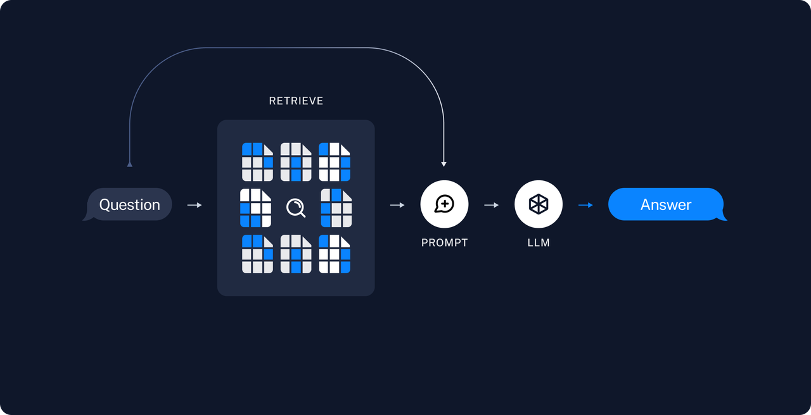

## 6. Agent

Agent指的是一个能够感知其环境并根据感知到的信息做出决策以实现特定目标的系统，通过大模型的加持，Agent比以往任何时候都要更加引人注目。

### Langchain

以Langchain为代表的Agent框架，是目前在国内最被广泛使用的开源框架，LangChain刚开始的设计理念是将工作流设计为DAG（有向无环图），这就是Chain的由来；

随着Muti-Agent理念的兴起和Agent范式的逐渐确立，Agent工作流会越来越复杂，其中包含了循环等条件，需要用Graph图的方式，由此又开发了LangGraph。

## 7. Fine-tuning

相较于基础大模型动辄万卡的代价，微调可能是普通个人或者企业少数能够接受的后训练大模型(post-training)的方式。

微调是指在一个预训练模型(pre-training)的基础上，通过少量的数据和计算资源，对模型进行进一步训练，以适应特定的任务或者数据集。


微调分为两种类型：全参微调（full fine-tuning）和参数高效微调（parameter efficient fine-tuning）。

- 全参微调：在全参微调中，整个模型的参数都会被更新，这种方法通常需要大量的数据和计算资源，以及较长的训练时间。

### PEFT

参数高效微调（Parameter-Efficient Fine-Tuning，简称PEFT）是一种针对大型预训练模型（如大语言模型）的微调技术，它旨在减少训练参数的数量，从而降低计算和存储成本，同时保持或提升模型性能。

PEFT通过仅微调模型中的一小部分参数，而不是整个模型，来适应特定的下游任务。这种方法特别适用于硬件资源受限的情况，以及需要快速适配多种任务的大型模型。


PEFT有以下几种常见的方法：

- 选择参数子集：选择模型中的一小部分参数进行微调，通常是最后几层的参数；
- 重新参数化：使用低秩表示重新参数化模型权重，代表是LoRA方法；
- 添加参数：向模型添加可训练层或参数，代表为Prompt-tuning方法。


## 总结

大模型已经进入到应用落地阶段,此时的大模型从业者,更多的应该是在使用大模型,而不是在开发基座大模型.


# 如何设计Agent架构

## 1. 痛苦的教训

在开发大模型相关应用的过程中，人们逐渐意识到一个痛苦的教训：通过数百个工时精心打造的流程架构与人工优化措施，往往会在模型版本迭代时化为乌有。

在早期（2023-2024）采用GLM-6B等开源模型框架的技术实践中，开发者普遍面临基础模型性能局限带来的困境：受限于有限上下文处理能力和基础推理能力不足，工程师不得不实施大量人工编码干预来保障系统可靠性。然而随着模型智能水平的指数级提升，这些曾经的关键适配模块又被迫进入系统性解耦阶段。这种技术路线反复调整的循环困境，正演变为AI工程领域必须承受的痛苦教训——每当模型迭代周期来临，整个技术栈都面临着从"过度工程化"到"去冗余重构"的痛苦蜕变。

在传统软件架构演进历程中，客户端-服务器交互范式长期占据主导地位：用户端发起数据交互请求，服务端执行数据操作事务，经预定义逻辑处理后返回响应结果。这种线性交互模型历经数十年技术迭代，奠定了现代系统的基础架构形态。即便在自动化工具链与低代码平台蓬勃发展的当下，系统核心逻辑仍高度依赖工程师在开发阶段实施的人工代码优化——当软件部署进入生产环境，整个系统即转入静态预编译计算流程，执行路径完全遵循预设的确定性规则。

在当代系统架构演进中，概率计算范式正逐步取代传统确定性范式：基于深度学习的实时动态推理机制开始主导应用构建范式。以OpenAI生态为例，全球数万级智能应用通过API集成其AI推理服务，每次服务调用均涉及复杂的神经网络决策流程而非简单数据操作。这种技术范式的根本性转变标志着：软件系统的行为决策权已从静态代码库移交至持续进化的模型本体。更具有革命性意义的是，应用系统获得了模型持续进化带来的外延式增强效应——即使本地业务逻辑保持不变，底层AI能力的迭代升级仍能自动驱动应用智能水平的渐进式提升。

在人工智能技术演进曲线中，大模型迭代速率已突破传统认知阈值：其智能决策系统在规避传统工作流架构复杂性的前提下，展现出超越人工干预的动态适应能力。这种技术演进轨迹揭示出AI工程领域的范式转移：相较于传统人机协同范式中"人工精细化管控+模型执行层响应"的线性协作模式，基于自主推理引擎的动态决策系统正形成指数级优势——当模型持续突破认知边界时，配套系统自然获得智能涌现带来的内生进化动能。

在技术路线抉择的十字路口，我们正面临范式竞争的终极考验：是延续依赖人工架构设计的静态流程编排体系，将智能体约束于预设框架内运作；还是顺应大模型自主推理能力的指数级增长，构建具备环境自适应特质的通用型智能决策架构。这种技术范式的抉择，本质上是判断智能系统进化路径的转折点——当模型内生智能超越人工设计边界时，动态演化的自主决策系统将成为技术演进的主导范式。

## 2. Anthropic的理解

2024年12月19日，Anthropic发表了一篇名为《Building effective agents》的博客，向世人宣告其对Agent的理解，并隐隐的拉开了2025年智能体元年的序幕。

在这篇文章中，Anthropic把人们谈论的Agent称为agentic systems，并给出了两种不同的架构：workflow和agent。

>如果你用过dify之类的低代码devops平台，你会发现这些平台事实上已经采用了这种分类

工作流是通过预定义代码路径协调 LLM 和工具的系统；

Agent是LLM动态指导自身流程和工具使用的系统，从而保持对任务完成方式的控制。

同时Anthropic还给出了这两种Agentic sysytems的设计模式，如果你已经做了很长时间的大模型应用，你会发现下图很容易理解。


## 3. OpenAI的理解

作为老大哥，在被Anthropic的MCP夺走Function Call的主导地位后，OpenAI想在Agent的行业标准上插上一脚，为此，他们在2025年4月发表了一篇名为《A practical guide to building agents》的文章。

但由于Anthropic珠玉在前，OpenAI的这篇文章一经问世便招到了攻讦，冲在最前的就是我们开发者耳熟能详的Harrison Chase，LangChain的创始人。他发表了《How to think about agent frameworks》来回怼了OpenAI.

>作为吃瓜群众，我认为一个可能的原因是Anthropic在他们的博客里推荐了LangGraph，但OpenAI在文章里提到了声明式和非声明式图的区别(这一点是LangGraph和LangChain经常被攻击的点)，并暗指了LangGraph的缺点.

我们来看下Open AI的核心思想:

延续了Anthropic对Agentic system的定义，OpenAI也认为Agent会有workflow这种状态，不过他们把一种情况排除在外：
虽然集成了LLM，但是LLM没有用来控制workflow的应用，不属于与Agent。

> 原文是：Applications that integrate LLMs but don’t use them to control workflow execution—think simple chatbots, single-turn LLMs, or sentiment classifiers—are not agents.  
> 我个人认为其实不用严格考虑应用属不属于Agent

OpenAI在他的文章里，给出了四个关键词：model，tool，instruction，orchestration，其中，orchestration也可以是tool的一部分.

同时，作为老大哥，OpenAI等大厂需要比其它小公司更关注安全方面的事情，为此他们单独开辟了一章来讲Guardrails


如果你看这篇文章，你会发现其对Agent的理解更多的就是Anthropic文章中的Agent，而不是Agentic Systems.

## 4.一种常见的架构设计

我认为两家公司对Agent的理解各有侧重，但是对于开发者来讲，没有必要站队，而是可以博采众长来炼化属于自己的设计范式，以下是来源于Thoughtworks的一种常见的架构设计

### 4.1、任务失败概率

#### 4.1.1 常见错误来源


#### 4.1.2 LLM应用的3个能力

LLM应用最重要的3个能力，分别是架构、知识、模型

**架构**

  任务拆解：让模型一次执行一小个任务。为什么CoT有效，原因也是大模型并没有见过一次性完成复杂任务的数据，它没在这样的数据上预训练过，但是它见过复杂任务拆分成的小任务的数据，这它是擅长的。进行任务拆解就是在做人为的CoT

  检索增强：让检索到的知识足够全，并且尽可能准

**知识**
  知识工程：通过多种方式进行知识构建，包括BM25这种稀疏检索知识构建、语义向量检索这种稠密检索知识构建、以及知识图谱构建。同时从多种形式知识中进行混合检索，才能取得最好的效果

**模型**

  尽量使用更好的基础模型;

  对模型进行继续训练，注入垂直领域知识、按照任务的具体格式进行微调；

  优化prompt

### 4.2 LLM应用的架构思路

LLM应用架构主要做任务的拆解和检索增强

#### 4.2.1 架构图


#### 4.2.2 任务拆解

在任务拆解部分，一般会分成多个Agent

***入口处一般是一个意图识别Agent***

  澄清用户问题中的歧义，或信息缺失；

  通过检索获取相关的信息，来辅助意图识别的判断；

  将具体任务路由给具体的Agent

***后续的Agent则更关注具体的任务***

  做任务级别的澄清；

  通过检索获取到执行任务所相关的信息；

  进行进一步的任务拆解，这时候每个任务可以只是一个函数/工具，如果变得很复杂了，也可以是一个其他的Agent

### 4.3、LLM应用的知识工程


从数据原始的结构形式出发

#### 4.3.3 结构化数据

对不含语义信息的数据，可以：

  构建MinHash LSH；

  构建知识图谱

对于含语义信息的数据，可以额外多构建向量数据库

#### 4.3.4 非结构化数据

构建倒排索引支持BM25等方法的搜索

构建语义相似向量的向量数据库

通过LLM进行信息提取，转成结构化数据，然后进行结构化数据的知识工程。

### 4.4、LLM应用的模型优化

#### 4.4.1 prompt优化

Prompt要明确、具体，不要自带歧义

结构化Prompt

对需要推理才能获得更好性能的任务进行CoT

当追求极致性能的时候，使用Self Consistency

#### 4.4.2 模型微调

想要给模型注入知识，还是得做CT（继续训练），SFT（监督微调）还是很难注入知识

对于一些具体的小任务，拿小点的模型进行SFT效果还是很好的，甚至有些任务可以使用更小的BERT

### 4.5、LLM应用的迭代优化过程

#### 4.5.1 评估指标


**对于有反馈的生成类任务**：主要指的是Text-to-SQL和Text-to-Code这种，我们可以通过编写标准的SQL，或者编写单元测试来测试任务的准确率。

**对于无反馈的生成类任务**：就只能借助大模型来评估了。有人可能会觉得这样大模型自己又当运动员又当裁判不好，先不说我们可以通过微调来优化模型评估的能力，当Prompt变化时，模型的能力偏向也会变化的，所以该方法还是可行的。当然肯定也会存在一定的局限性，这个时候，就可以尝试微调了（见4.2）

#### 4.5.2 试验记录

和传统的机器学习、深度学习一样，LLM应用也是需要将每次运行的实验都记录在案的，MLflow等MLOps框架是很不错的工具，可以帮助我们把Prompt、Temperature、Top P等参数以及实验运行的结果都记录下来。


# 向量数据库

## 1. 为什么需要向量数据库

向量数据库是一种专门用于存储和查询向量数据的数据库系统，它在处理大规模高维数据方面具有显著优势。向量数据库的核心优势在于其能够高效地进行相似性搜索和数据分析，这在传统的关系型数据库中往往难以实现。向量数据库通过将非结构化数据（如文本、图像、音频等）转换为向量形式进行存储，使得这些数据能够进行快速的相似度搜索和分析。

向量数据库的崛起与大模型时代的需求紧密相关，它为大模型提供了外部知识库的支持，增强了生成能力，支持向量嵌入，并解决了数据局限问题。通过向量数据库，可以构建企业专属的智能服务，如法律科技服务、智能客服等，提供更专业和时效性的服务。

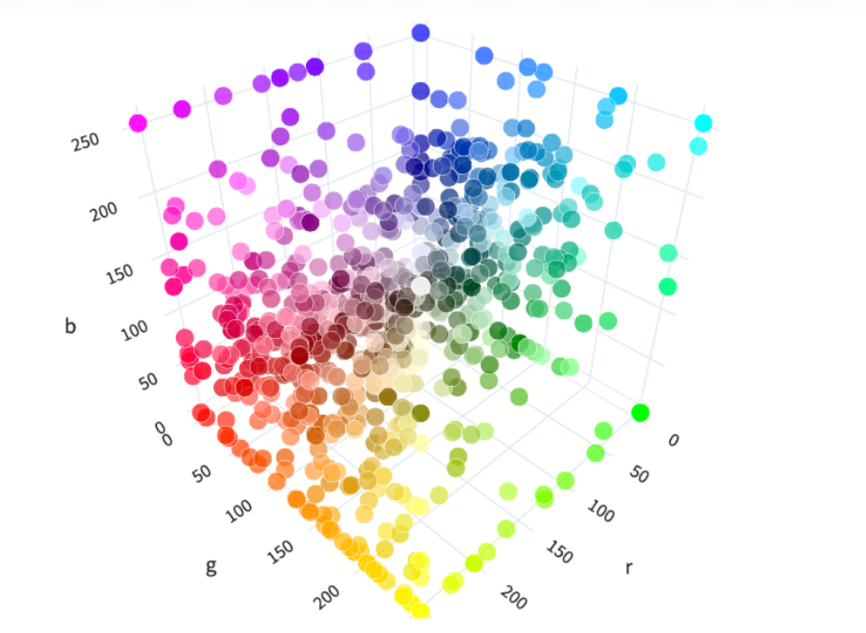

## 2. 什么是向量

向量是数学中的一个重要概念，它是一个有序的数列，可以表示空间中的一个点或者一个方向。在机器学习和深度学习中，向量通常用来表示数据的特征，如文本、图像、音频等。通过将数据转换为向量形式，可以方便地进行计算和分析，实现数据的高效存储和检索。

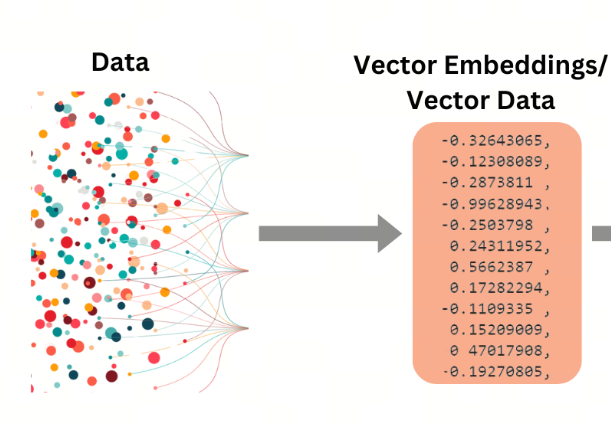


## 3. 什么是语义搜索

语义搜索是一种基于语义理解的搜索技术，它通过理解用户的查询意图，从而提供更加准确和相关的搜索结果。传统的搜索技术主要基于关键词匹配，而语义搜索则更加注重搜索结果的语义相关性，能够更好地满足用户的需求。语义搜索技术在自然语言处理、信息检索、推荐系统等领域有着广泛的应用，能够提高搜索效率和准确性，提升用户体验。

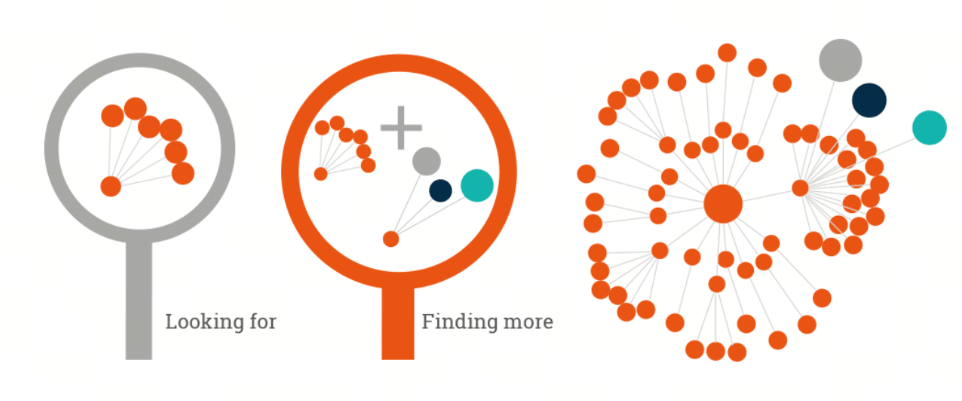

## 4. 向量数据的应用-RAG技术

检索增强生成（Retrieval-Augmented Generation，简称 RAG）通过结合大型语言模型（LLM）和信息检索系统来提高生成文本的准确性和相关性。这种方法允许模型在生成回答之前，先从权威知识库中检索相关信息，从而确保输出内容的时效性和专业性，无需对模型本身进行重新训练。

RAG技术之所以重要，是因为它解决了LLM面临的一些关键挑战，例如虚假信息的提供、过时信息的生成、非权威来源的依赖以及由于术语混淆导致的不准确响应。通过引入RAG，可以从权威且预先确定的知识来源中检索信息，增强了对生成文本的控制，同时提高了用户对AI解决方案的信任度。


## 4. 向量数据库比较

如何选择合适的向量数据库？在实际的业务场景中，往往需要考虑很多的因素，例如向量数据库的可用性、扩展性、安全性等，还有代码是否开源、社区是否活跃等等。

截至本文撰写时2024年9月18号，向量数据库有以下几种选择


| 向量数据库 |                    URL                    | GitHub Star |        Language |
| :--------- | :---------------------------------------: | :---------: | --------------: |
| chroma     |   https://github.com/chroma-core/chroma   |    14.4k    |          Python |
| milvus     |    https://github.com/milvus-io/milvus    |    29.2k    |   Go/Python/C++ |
| pinecone   |         https://www.pinecone.io/          |    闭源     |              无 |
| qdrant     |     https://github.com/qdrant/qdrant      |    19.7k    |            Rust |
| typesense  |  https://github.com/typesense/typesense   |    20.3k    |             C++ |
| weaviate   |   https://github.com/weaviate/weaviate    |    10.7k    |              Go |
| faiss      | https://github.com/facebookresearch/faiss |    30.3k    | C++/Python/Cuda |


## 5. Long Context vs. RAG

在探讨大模型的超长序列输入处理能力与检索增强生成（RAG）技术的对比时，我们可以看到两种技术在处理长文本数据方面各有优势和挑战。

超长序列输入处理能力是大型语言模型（LLMs）的一个重要发展方向。随着技术的进步，一些模型已经能够处理远超以往的文本长度，这使得模型在处理长文本数据时更加有效。这种能力的提升，使得LLMs在理解和生成文本时能够更好地捕捉长距离依赖关系，提高文本的连贯性和逻辑性。然而，这种超长上下文的处理也会带来计算成本的增加，以及对模型训练和推理时内存需求的挑战。

另一方面，RAG技术通过结合检索和生成两个步骤来提升模型的性能。在生成答案之前，RAG会从一个广泛的文档数据库中检索相关信息，然后利用这些信息来引导生成过程。这种方法有效地缓解了模型可能产生的“幻觉”问题，提高了知识更新的速度，并增强了内容生成的可追溯性。RAG技术在处理特定领域知识时表现出更高的效率和准确性，尤其是在需要最新信息和专业知识的场景中。

在实际应用中，选择超长序列输入处理能力还是RAG技术，取决于具体的业务需求和资源限制。如果任务需要模型一次性理解和生成大量文本，并且对计算资源有较高的容忍度，那么超长序列输入处理可能是一个更好的选择。而如果任务需要最新的外部知识，或者需要处理的数据量非常大，那么RAG技术可能更加合适，因为它可以通过检索来动态获取最新信息，并且可以通过优化检索步骤来控制整体的计算成本。