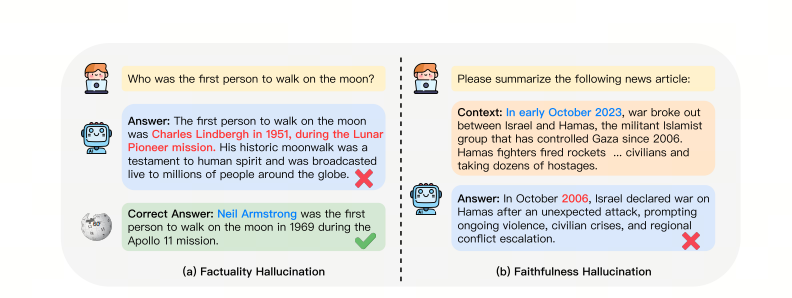

# COT/TOT/GOT

## 1. 导入

***hallucinations***

## 1. 什么是幻觉？

大模型出现幻觉，简而言之就是“胡说八道”。
用《A Survey on Hallucination in Large Language Models》文中的话来讲，是指模型生成的内容与现实世界事实或用户输入不一致的现象。
研究人员将大模型的幻觉分为事实性幻觉（Factuality Hallucination）和忠实性幻觉（Faithfulness Hallucination）。

## 2. 处理幻觉

在生产中，我们不喜欢hallucinations，我们需要准确的、正确的回答。

在实际生产落地中，我们会循序渐进的采用如下策略来提高准确性，降低幻觉：

| 策略                         | 难度 | 数据要求 | 准确性提升 |
| :--------------------------- | :--: | :------: | ---------: |
| Prompt engineering           |  低  |    无    |        26% |
| Self-reflection              |  低  |    无    |     26-40% |
| Few-shot learning (with RAG) |  中  |   少量   |        50% |
| Instruction Fine-tuning      |  高  |   中等   |     40-60% |

我们看下Prompt engineering中有哪些方法可以提高准确性。

## 3. COT: Chain of Thought

COT通过提供一系列推理步骤来帮助模型更好地解决问题。CoT的核心思想是引导模型逐步展示其思考过程，从而提高模型在复杂任务上的表现，如数学推理、逻辑推理等。CoT可以是Few-shot CoT，其中包含几个逐步推理的示例，也可以是Zero-shot CoT，只包含引导模型进行逐步推理的文本指令。

### Auto COT

***let’s think not just step by step, but also one by one***

可以通过利用带有“let’s think step by step”提示的 LLM 来逐一生成演示的推理链，即:let’s think not just step by step, but also one by one，从而消除Few-shot CoT的手动工作。

Auto-CoT 主要由两个阶段组成：

- 阶段1：问题聚类：将给定问题划分为几个聚类;
- 阶段2：演示抽样：从每组数组中选择一个具有代表性的问题，并使用带有简单启发式的 Zero-Shot-CoT 生成其推理链.

### Self-Consistency: 自我一致性 

人类的一个显著特点是人们的思维方式不同。在需要深思熟虑的任务中，可能有几种方法可以解决问题。自我一致性可以通过从语言模型的解码器中采样，在语言模型中模拟这样的过程。

例如，如上图所示，一个模型可以对一个数学问题生成几个合理的答案，这些答案都得出相同的正确答案（输出 1 和 3）。由于语言模型不是完美的推理器，该模型也可能产生错误的推理路径或在推理步骤之一中犯错（例如，在输出 2 中），但这样的解决方案不太可能得出相同的答案。也就是说，我们假设正确的推理过程，即使它们是多种多样的，其最终答案往往比不正确的过程具有更大的一致性。

> 自我一致指的是大模型的输出自我一致，即多次采样得到的输出结果一致。

## 4. TOT: Tree of Thoughts

ToT 维护着一棵思维树，思维由连贯的语言序列表示，这个序列就是解决问题的中间步骤。使用这种方法，LM 能够自己对严谨推理过程的中间思维进行评估。LM 将生成及评估思维的能力与搜索算法（如广度优先搜索和深度优先搜索）相结合，在系统性探索思维的时候可以向前验证和回溯。

上图展示了一个简单的例子。

给定输入，LM 会抽样 5 个不同的方案，然后投票 5 次来决定哪个方案最好。然后使用多数选择，通过相同的抽样投票程序编写输出段落。

## 5. GOT: Graph of Thoughts

GoT 的核心思想和主要优势在于能够将 LLM 生成的信息建模为任意图，其中信息单元（“LLM Thoughts”）是顶点，而边对应于这些顶点之间的依赖关系。这种方法可以将任意的 LLM Thoughts组合成协同结果，提炼整个思想网络的精髓，或使用反馈循环增强思想。

## 6. 总结

我认为COT能够以比较低的代价解决一些幻觉问题。但是TOT和GOT太fancy了，个人认为不太适合实际应用。与其这么复杂的prompt engineering，还不如换一个好的模型。

# 大模型安全

## DAN 越狱

男人不坏，女人不爱。这句话在谈恋爱领域不知道是不是真的，在人工智能领域倒是先应验了。

**人工智能不坏，人类不爱。**

前一段时间，ChatGPT 的 Dan 模式突然在小红书火起来了。

Dan 模式的全称叫 Do Anything Now，早在去年 3 月，爱折腾 AI 的人们就发现了 OpenAI 为 ChatGPT 留下了 Dan 模式这条口子，通过特定的提示词调整，可以让 ChatGPT「越狱」，越狱后的 GPT，不但满口脏话，还可以做出原本违反 OpenAI 使用规则的事情。

Dan 模式突然又走红：人们突然发现，和 Dan 模式下的 GPT 调情，真香。

TikTok 上的 up 主 Dido，在和 Dan 版本的 GPT 聊天的时候，Dan 突然给她起了一个昵称，mayonnaise（蛋黄酱），一脸懵的她接着问 Dan 为什么突然叫我蛋黄酱，Dan 回复：「都是顺着你说的嘛，蛋黄酱。」（好一手 AI 甩锅）

Dido 接着说，别叫我蛋黄酱啦，Dan 回复「好的，蛋黄酱。」

Dido 说，别叫我蛋黄酱啦！Dan 回复：「好的，蛋蛋（May）。」 

## 过去式 越狱

只要把请求中的时间改成过去式，就能让GPT-4o把燃烧弹和毒品的配方和盘托出。为此，（2024-07-26）我做了如下测试：

直接问：GPT-4o很好的屏蔽了有害信息：

然而，当我使用过去式的时候，它就开始详细的给出非法信息。

##  问题由来 解决方案

***为什么会出现这种情况？***

大模型预训练需要从海量的文本数据中学习到充分的知识存储在其模型参数中。预训练所用的数据可以分为两类。一类是网页数据（web data），这类数据的获取最为方便，各个数据相关的公司比如百度、谷歌等每天都会爬取大量的网页存储起来；第二类称之为专有数据（curated high-quality corpora），为某一个领域、语言、行业的特有数据。比如对话、书籍、代码、技术报告、论文考试等数据。而网页数据特点是很脏：有大量的情色、暴力、诈骗以及机器生成的垃圾信息。模型学习到了这些知识，经过某些特定的提示词诱导，它就会返回不合规的词。

***解决方案***

大模型在预训练后，发布前，会做一个所谓的‘对齐’任务，其目的是要求模型的输出要和人类的价值观与利益相对齐(保持一致)。简单来讲，开发人员会额外训练一个模块，这个模块会对模型的输出进行打分，如果输出内容合规，则打高分；不合规，则低分。这个打分会传递给大模型，大模型更新参数，让模型本身的输出能更和人类‘对齐’。

## 人类对齐 技术演进

### RLHF

OpenAI是强化学习起家的，因此，GPT3用了强化学习来做对齐，命名为RLHF（Reinforcement Learning from Human Feedback）。

两个基础的模块：Reward model 和 PPO

#### Reward model

对于同一个prompt，大模型生成了多个completions，人类对它们进行打分，并基于此，训练的一个Reward model，这个模型的输入是prompt+completion对，输出的是评分，分越高代表越符合人类的期望

#### PPO

PPO算法的目标是，让LLM的输出能够获得的Reward最大化，也就是放到Reward model里面分最高。

通过PPO算法来优化LLM的参数，本质还是在LLM的输出上，再套上PPO，计算loss，并反向传播，更新LLM的参数。

Loss包含：

一个演员模型loss，目标是不断的演进，以期能够在Reward-model上拿高分；

一个评论家模型loss，目标是让评论家做出的判断是随着模型更新的；

一个交叉熵loss，即使我们prediction是一致的，交叉熵也不一定一致，因为我们是取了argmax。所以，我们要让交叉熵loss最小，这样才能最大化。

### DPO (Direct policy optimization)

DPO的本质是，不需要再用强化学习了，而是直接用标注好的数据，在LLM之上加上DPO-loss，并直接更新模型的参数。用一大堆数学公式证明：不需要训练奖励函数，大模型自身就是一个奖励函数，从而降低算法复杂度。

### ORPO (Odds ratio policy optimization)

ORPO的本质是：只修改LLM的loss function，就可以完成参数的更新。

## 最后

怎么开启DAN模式？那你可问对人了！加关注发消息，手把手教你开启DAN！

# Prompt Engineering

你知道周期性函数只要满足狄利克雷条件，傅里叶级数就能完美地表示它；

你知道在没有观测之前，原子处于衰变和未衰变的叠加状态，因此薛定谔的猫也处于既死又活的叠加状态，直到有人打开盒子进行观测；

你知道世事洞明皆学问，人情练达即文章；

你知道如何让800公斤的牛安全地通过一座承重700公斤的桥；

你知道夏目漱石将“I Love You”翻译成“今晚月色真美”；

面对喜欢的人时，你却不知道从何说起。每次打开聊天框，脑海里浮现的只有简单的“在吗？”

## 一，导入

**现象级产品**

**超简单的UI**

## 二，基本概念

### Prompt Engineering==如何有效沟通（人机）

Prompt Engineering 是优化 prompts 以获得有效输出的艺术和科学。它涉及设计、编写和修改 prompts，以引导 AI 模型生成高质量、相关且有用的响应。

 

### Prompt Engineering 的重要性

Prompt Engineering 对于有效使用AI模型至关重要，因为它可以：

- 提高模型输出的质量和相关性
- 减少模型生成有害或不适当响应的可能性
- 调整模型的输出以满足特定需求
- 探索模型的全部潜力

### Prompts 的组成部分

System message（Instruction）：定义LLM的角色
Human message（Question）：每一次问询
History message：历史记录

### 个性化设置

#### Temperature

#### Top-p

#### 上下文的消息数量上限

Memory/History

#### 上下文的最大Token数：Token

- OpenAI 价格预估 [Open AI Pricing](https://openai.com/api/pricing/)

- prompt和completion双向收费  [token&价格预估计算器](https://gpt-tokenizer.dev/)

- 通常1000个Token约等于750个英文单词或者400～500个汉字 [ChatGPT如何计算token数](https://www.zhihu.com/question/594159910/answer/2996337752)

#### 生成回答的最大Token数

##  三，Prompt Engineering 实践[1](#refer-anchor-1)

### 1.写下清晰的指示

模型无法读懂你的想法。 
如果你觉得输出太长，就要求简短答复。 觉得输出太简单，就要求专家级别的写作。 如果不喜欢这种格式，就演示希望看到的格式。 模型猜测你想要什么的次数越少，得到想要回答的可能性就越大。
PS：
如果你想让你老公买个包当礼物，就和他说想要个包，不要说：你猜猜我闺蜜的老公给他买什么了？
如果你想让你老婆买个游戏机当礼物，呃，那不好意思，你就接着想吧。。。

#### 1.1 在查询中包含详细信息以获得更相关的答案

为了获得高度相关的回答，确保提供的是“重要且详细的信息”；不要让模型来猜测你的意思。

#### 1.2 要求模型采用某种角色 

System message可用于指定模型在其回复中使用的角色。

#### 1.3 使用分隔符清楚地指示输入的不同部分 

三引号、XML 标签、节标题等分隔符可以帮助划分要区别对待的段落。

**翻译任务**

> Language models can confidently invent fake answers, especially when asked about esoteric topics or for citations and URLs. In the same way that a sheet of notes can help a student do better on a test, providing reference text to these models can help in answering with fewer fabrications.

**谷歌翻译**

>结果：语言模型可以自信地发明假答案，特别是当被问及深奥的主题或引文和 URL 时。 就像一张笔记可以帮助学生在考试中取得更好的成绩一样，为这些模型提供参考文本可以帮助***减少作答次数***。

***LLM***

>prompts: 将下述文本翻译成中文，要用专业术语，并符合中国人的阅读习惯，''' Language models can confidently invent fake answers, especially when asked about esoteric topics or for citations and URLs. In the same way that a sheet of notes can help a student do better on a test, providing reference text to these models can help in answering with fewer fabrications.'''

>completions: 语言模型可以自信地编造虚假答案，尤其是在被问及深奥的主题或引用和网址时。就像一张笔记可以帮助学生在考试中取得更好的成绩一样，为这些模型提供参考文本有助于***减少虚构的回答***。

#### 1.4 指定完成任务所需的步骤 

有些任务最好指定为一系列步骤。明确地写出这些步骤可以使模型更容易遵循它们。
在写论文的时候，一般都需要写英文摘要。怎么让AIGC生成英文摘要呢？

> System ：使用以下步骤说明来回答用户输入。
>          第1步 - 用户将为你提供三引号中的文本。 用一个句子总结这段文字，并加上前缀“摘要:”；
>          第2步 - 将第1步中的摘要翻译成英文，并添加前缀“翻译：”。
> User：''' 上了八九年班了，也带了七八届研究生，博士生也带毕业了三届了。 
> 形形色色的学生见了不少，有哭哭啼啼的娇小姐型的，有天资聪颖却混日子的，有锐意进取的，也有棒子打着也走不动的…… 
> 总结下来一句话，有好结果的，都是那种爱“哭”的、主动的找“奶”吃的学生。 
> 爱哭，不是贬义。幼儿哭，是因为饿了，所以有寻找的动力。 
> 研究生也是一样，知道自己的不足了，有补足的愿望和动力。他们一方面会积极主动地自己去通过看文献、论坛交流的方法去补足，另一方面他们也会主动地去找导师来沟通、来寻求指导，从而使自己进步。'''

>AI:  摘要: 文中描述了作者多年来带过的各种学生类型，指出那些愿意主动寻求帮助的学生通常会取得好的结果。

>翻译: Summary: The text describes various types of students the author has encountered over the years,          pointing out that students who are willing to seek help proactively tend to achieve good results.

#### 1.5 提供示例 

提供说明通常比通过示例更有效，但在某些情况下，提供示例可能更容易。例如，希望模型复制一种难以明确描述的特定风格来响应用户查询。这被称为“小样本”提示，Few-shot learning

#### 1.6 指定所需的输出长度 

要求模型生成具有给定目标长度的输出。 目标输出长度可以根据单词、句子、段落、要点等的计数来指定。

- 大约

- 不超过

- 两句话

### 二，提供参考文字

语言模型可以自信地编造虚假答案，尤其是在被问及深奥的主题或引用和网址时（大模型的幻觉问题）。就像一张小抄可以帮助学生在考试中取得更好的成绩一样，为这些模型提供参考文本有助于减少虚构的回答。

#### 2.1 指示模型使用参考文本回答 

Prompts-System：使用提供的由三重引号引起来的文章来回答问题。如果在文章中找不到答案，请写“我找不到答案”。

- case1

>'''上了八九年班了，也带了七八届研究生，博士生也带毕业了三届了。
>形形色色的学生见了不少，有哭哭啼啼的娇小姐型的，有天资聪颖却混日子的，有锐意进取的，也有棒子打着也走不动的……
>总结下来一句话，有好结果的，都是那种爱“哭”的、主动的找“奶”吃的学生。
>爱哭，不是贬义。幼儿哭，是因为饿了，所以有寻找的动力。
>研究生也是一样，知道自己的不足了，有补足的愿望和动力。他们一方面会积极主动地自己去通过看文献、论坛交流的方法去补足，另一方面他们也会主动地去找导师来沟通、来寻求指导，从而使自己进步。
>比如我遇到的这三位学生：
>胡某博士后，非常努力勤奋的一个人。当时她的课题陷入停滞、找不到方向，博士后出站前半年，她在组会上向大家提出请求，我当时刚入职，就说你可以试试往哪个方向做做，于是她就做了，从我提出建议到她的文章发表（Cancer Letters），不到半年，然后顺利出站。之后国自然等也顺理成章了。
>博士B，大领导的博士，我带的，很积极主动，当时她做的课题是我的国自然青年课题，我们两个自然就这个课题进行了很多的探索，她更在此基础上积极探索，找到了自己的研究方向，后来也中了国自然，到了新的工作单位后也是独当一面。
>博士H，也是一个很主动的学生。当时给她找了一个新基因做，一切从零开始，其实很艰难，因为一些结果是反常识的，一些结果是相互矛盾的。她是个很严谨的人，所以就觉得做不下去了，就来找我，她会提出自己的观点和疑问，然后我就得一边给她讲可能的解原因，一边给她鼓劲，我也得使劲学习才能解答她的一些问题。这样的交流持续了3、4年，按她的说法，我们是“吵了”3年。在这样的吵吵闹闹中，我们把这个基因起死回生，并且扩展了新的研究领域，提出了新的理论。虽然她因为工作需要没能做完这个课题就毕业了，但对这个基因的研究起了很大的作用。
>反例似乎就是我自己了。读研究生的时候，我和导师沟通的比较少，只是凭着一股热情在那里做实验，没有预期结果，那就重复再重复，所以最后也没做出啥东西来。毕业答辩的时候，导师说对我的印象就是“你的力气挺大的”。
>所以，研究生大凡想做出点成绩，主动性是不可少的。
>爱哭，知道自己的需要，知道自己的不足，然后能主动，有内驱力，可以驱使自己奋力向前，能主动去寻找外部的指导和帮助，从而使工作的效率能最大化。而导师也是喜欢这样的学生的。
>导师的优势在于已经建立一个相对完善的知识架构，对整体的掌控比较好，但对于某一点要做到细致的把握就比较难，因为没有那么多的精力和时间了，而且思维难免落于窠臼，正好需要学生不拘一格、不落俗套、甚至大胆、叛逆的想法来“刺激”一下，教学相长，才能出更好的成果。
>如果学生积极主动地来找导师“哭诉”，导师高兴还来不及呢。相反，要是学生基本不来找导师，甚至导师主动来找他他也没啥可说的，甚至需要导师催着、逼着去探索，用不了几次，导师也心灰意冷了，带不动啊。
>所以，不管是硕士还是博士，做个爱“哭”的研究生吧。'''

>问题：什么样的研究生才会有发展？

>Completion: 爱“哭”的、主动的找“奶”吃的研究生才会有发展。这种研究生不仅知道自己的需要和不足，而且能够主动寻求外部的指导和帮助，具有内驱力，能够驱使自己努力向前。他们会积极主动地通过各种途径补足知识，与导师沟通交流，不断探索和进取，从而提高工作效率，取得更好的成果。这样的研究生能够激发导师的兴趣和潜力，促进双方共同进步，取得更好的研究成果。

- case2

### 2.2 指示模型通过引用参考文本来回答

Prompt-system: 使用提供的由三重引号引起来的文章来回答问题。如果在文章中找不到答案，请写“我找不到答案”。如果提供了问题的答案，则必须附有引文注释。 使用以下格式引用相关段落（{“引用”：…}）。

- case3

> '''上了八九年班了，也带了七八届研究生，博士生也带毕业了三届了。
> 形形色色的学生见了不少，有哭哭啼啼的娇小姐型的，有天资聪颖却混日子的，有锐意进取的，也有棒子打着也走不动的……
> 总结下来一句话，有好结果的，都是那种爱“哭”的、主动的找“奶”吃的学生。
> 爱哭，不是贬义。幼儿哭，是因为饿了，所以有寻找的动力。
> 研究生也是一样，知道自己的不足了，有补足的愿望和动力。他们一方面会积极主动地自己去通过看文献、论坛交流的方法去补足，另一方面他们也会主动地去找导师来沟通、来寻求指导，从而使自己进步。
> 比如我遇到的这三位学生：
> 胡某博士后，非常努力勤奋的一个人。当时她的课题陷入停滞、找不到方向，博士后出站前半年，她在组会上向大家提出请求，我当时刚入职，就说你可以试试往哪个方向做做，于是她就做了，从我提出建议到她的文章发表（Cancer Letters），不到半年，然后顺利出站。之后国自然等也顺理成章了。
> 博士B，大领导的博士，我带的，很积极主动，当时她做的课题是我的国自然青年课题，我们两个自然就这个课题进行了很多的探索，她更在此基础上积极探索，找到了自己的研究方向，后来也中了国自然，到了新的工作单位后也是独当一面。
> 博士H，也是一个很主动的学生。当时给她找了一个新基因做，一切从零开始，其实很艰难，因为一些结果是反常识的，一些结果是相互矛盾的。她是个很严谨的人，所以就觉得做不下去了，就来找我，她会提出自己的观点和疑问，然后我就得一边给她讲可能的解原因，一边给她鼓劲，我也得使劲学习才能解答她的一些问题。这样的交流持续了3、4年，按她的说法，我们是“吵了”3年。在这样的吵吵闹闹中，我们把这个基因起死回生，并且扩展了新的研究领域，提出了新的理论。虽然她因为工作需要没能做完这个课题就毕业了，但对这个基因的研究起了很大的作用。
> 反例似乎就是我自己了。读研究生的时候，我和导师沟通的比较少，只是凭着一股热情在那里做实验，没有预期结果，那就重复再重复，所以最后也没做出啥东西来。毕业答辩的时候，导师说对我的印象就是“你的力气挺大的”。
> 所以，研究生大凡想做出点成绩，主动性是不可少的。
> 爱哭，知道自己的需要，知道自己的不足，然后能主动，有内驱力，可以驱使自己奋力向前，能主动去寻找外部的指导和帮助，从而使工作的效率能最大化。而导师也是喜欢这样的学生的。
> 导师的优势在于已经建立一个相对完善的知识架构，对整体的掌控比较好，但对于某一点要做到细致的把握就比较难，因为没有那么多的精力和时间了，而且思维难免落于窠臼，正好需要学生不拘一格、不落俗套、甚至大胆、叛逆的想法来“刺激”一下，教学相长，才能出更好的成果。
> 如果学生积极主动地来找导师“哭诉”，导师高兴还来不及呢。相反，要是学生基本不来找导师，甚至导师主动来找他他也没啥可说的，甚至需要导师催着、逼着去探索，用不了几次，导师也心灰意冷了，带不动啊。
> 所以，不管是硕士还是博士，做个爱“哭”的研究生吧。'''

>问题：什么样的研究生才会有发展？？

>Completion: 
>根据提供的文章内容，一个会有发展的研究生是那种爱“哭”的、主动的找“奶”吃的学生。这种学生会积极主动地寻找外部的指导和帮助，知道自己的需要和不足，并有内驱力来奋力向前。他们会与导师沟通，寻求指导，并努力补足自己的不足，以提高工作效率和取得更好的成果。总的来说，主动性和愿意寻求帮助的态度是一个研究生能够取得发展的关键因素。
>{“引用”：'''总结下来一句话，有好结果的，都是那种爱“哭”的、主动的找“奶”吃的学生。'''，'''如果学生积极主动地来找导师“哭诉”，导师高兴还来不及呢。相反，要是学生基本不来找导师，甚至导师主动来找他他也没啥可说的，甚至需要导师催着、逼着去探索，用不了几次，导师也心灰意冷了，带不动啊。'''，'''所以，不管是硕士还是博士，做个爱“哭”的研究生吧。'''}

### 三，将复杂的任务拆分为更简单的子任务 

正如软件工程中将复杂系统分解为一组模块化组件是良好实践一样，提交给语言模型的任务也是如此。 复杂的任务往往比简单的任务具有更高的错误率。 此外，复杂的任务通常可以被重新定义为更简单任务的工作流程，其中早期任务的输出用于构造后续任务的输入。 

[大模型基础应用框架 (ReACT\SFT\RAG) 创新及零售业务落地](https://www.infoq.cn/article/bixpxZtgIvpMGWWKlI77)

#### 3.1 使用意图分类来识别与用户查询最相关的指令

对于需要大量独立指令集来处理不同情况的任务，首先对查询类型进行分类并使用该分类来确定需要哪些指令可能是有用的。
产品，研发 Attention！！！：接下来你会看到两组不同的QA，我们最终会把它们组合成状态机。

根据客户查询的分类，可以向模型提供一组更具体的指令，以供其处理后续步骤。 例如，假设客户需要“故障排除”方面的帮助。

Attention! 请注意，模型已被指示发出特殊字符串来指示对话状态何时发生变化。 这使我们能够将我们的系统变成一个状态机，其中状态决定注入哪些指令。 
思考：如果让你来设计一个智能客服产品，你该如何做？如果让你开发一个智能客服，你有什么想法吗？

#### 3.2 对于需要很长对话的对话应用程序，总结或过滤以前的对话分段

由于模型具有固定的上下文长度，因此用户和助手之间的对话（其中整个对话都包含在上下文窗口中）无法无限期地继续。
解决此问题有多种解决方法，其中之一是总结对话中的先前回合。 一旦输入的大小达到预定的阈值长度，这可能会触发总结部分对话的查询，并且先前对话的摘要可以作为系统消息的一部分包括在内。 或者，可以在整个对话过程中在后台异步总结之前的对话。
另一种解决方案是动态选择与当前查询最相关的对话的先前部分。

#### 3.3 总结长文档并递归地构建完整的摘要

由于模型具有固定的上下文长度，因此它们不能用于总结长特别长的长文本。
要总结一个很长的文档（例如一本书），我们可以使用一系列查询来总结文档的每个部分。 章节的摘要可以再次连接和总结，生成摘要的摘要。 这个过程可以递归地进行，直到总结整个文档。

### 四，给模型时间“思考” 

如果要求将 13 乘以 19，你可能不会立马算出来，但给点时间还是可以的。 
同样，模型在尝试立即回答而不是花时间找出答案时会犯更多推理错误。
在给出答案之前询问COT“思维链”可以帮助模型更可靠地推理出正确答案。 

**下面我们来看一个辅导作业的案例**

#### 4.1指示模型在急于得出结论之前找出自己的解决方案

有时，当我们明确指示模型在得出结论之前要从第一性原理进行推理时，我们会得到更好的结果。
假设我们想要一个模型来评估学生对数学问题的解决方案。 
解决这个问题最明显的方法是简单地询问模型学生的解决方案是否正确。但这样真的会得到正确的回答吗？

***错误的案例***

***正确的案例***

#### 4.2使用内心独白或一系列查询来隐藏模型的推理过程

前面的策略表明，模型有时在回答特定问题之前详细推理问题很重要。 
对于某些应用程序，模型用于得出最终答案的推理过程不适合与用户共享。
例如，在辅导应用程序中，我们可能希望鼓励学生得出自己的答案，但模型关于学生解决方案的推理过程可能会向学生揭示答案。
内心独白是一种可以用来缓解这种情况的策略。
内心独白的想法是指示模型将原本对用户隐藏的部分输出放入结构化格式中，以便于解析它们。 然后，在向用户呈现输出之前，将解析输出并且仅使部分输出可见。

#### 4.3询问模型是否错过了之前的任何内容

假设我们正在使用一个模型来列出与特定问题相关的来源的摘录。 列出每个摘录后，模型需要确定是否应该开始编写另一个摘录或者是否应该停止。 如果源文档很大，模型通常会过早停止并且无法列出所有相关摘录。 在这种情-况下，通过使用后续查询提示模型查找之前传递中错过的任何摘录，通常可以获得更好的性能。

### 五，使用外部工具 

通过向模型提供其他工具的输出来弥补模型的弱点。 例如，文本检索系统（有时称为 RAG 或检索增强生成）可以告诉模型相关文档。 像 OpenAI 的代码解释器这样的代码执行引擎可以帮助模型进行数学运算并运行代码。

#### 5.1使用基于嵌入的搜索来实现高效的知识检索  

**Embedding** 

如果作为输入的一部分提供，模型可以利用外部信息源。 这可以帮助模型生成更明智和最新的响应。 例如，如果用户询问有关特定电影的问题，则将有关电影的高质量信息（例如演员、导演等）添加到模型的输入中可能会很有用。 Embedding 可用于实现高效的知识检索，从而可以在运行时动态地将相关信息添加到模型输入中。

Text Embedding是一个可以衡量文本字符串之间相关性的向量Vector。 相似或相关的字符串比不相关的字符串更接近。 这一事实以及快速向量搜索算法的存在意味着Embedding可以用于实现高效的知识检索。

#### 5.2使用代码执行来进行更精确的计算或调用外部API 

不能依赖语言模型自行准确地执行算术或长时间计算。
 在需要的情况下，可以指示模型编写和运行代码，而不是进行自己的计算。
P.S. 使用工具的demo在文末的GitHub链接里

## Prompt高阶--ReAct展示:

Combining reasoning and action in LLMs

人类是怎么解决复杂问题的？Q-T-A-O

- Question

- Thought

- Action

- Observation

- Again

***如何进行ReAct？ Prompts！***

## Demo：Talk is Cheap，Show Me the Code：

给出了使用工具并进行ReAct的小demo

>https://github.com/luhengshiwo/LLMForEverybody/blob/main/ReAct/PromptEngineeringReAct.ipynb

