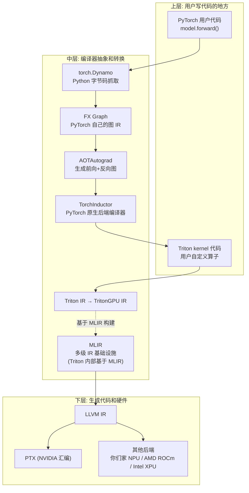
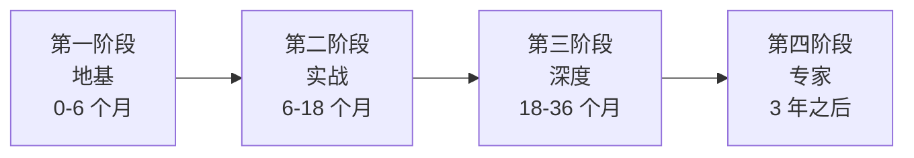

# AI 编译器方向长期成长规划（MLIR + Triton + PyTorch）

> 📅 创建日期：2026-04-17
> 🎯 定位：3-5 年内持续有效的技术成长指南，不依赖具体公司，目标是建立"不管在哪都值钱"的可迁移技术栈
> 🧭 原则：**原理 > 工具**。具体框架会变（Triton 可能被 CuTe DSL 取代、MLIR 可能被下一代 IR 替代），但编译器原理、GPU 架构、数值计算这些底层原理十年不变
> ⚠ 阅读提示：这份 plan 不是"一次性读完的手册"，而是"每季度翻一次的参考"。觉得迷茫或想偷懒的时候回来看，它会告诉你下一步该做什么

---

# Part 0 · 总纲：你为什么在这里

## 0.1 这份 plan 要回答你最根本的问题

你是一个应届生，在北极雄芯做 assembler 这条自研 ISA 编译器链路。月薪 25k，目标是 3-5 年内到 50k，愿意通过跳槽实现，并且不管最终留在芯片行业还是跳去互联网大厂做 AI infra，都希望手里有一套**不依赖任何一家公司的硬通货技能**。MLIR + Triton + PyTorch 就是这套硬通货。

这个目标**是完全现实的**。按 2026 年国内 AI 系统方向的市场行情：沐曦、摩尔线程、寒武纪、壁仞、燧原这些已上市或在上市的芯片公司，核心组 senior 工程师月薪区间 40-70k；字节 AI Lab、美团 Infra、阿里平头哥、华为昇腾这种头部公司相应岗位同样在 50k 起步；外企（NVIDIA 上海、Intel、AMD）或者外资 AI startup 在这个方向的薪资会更高。**3 年后你持有这套栈加实战经验，50k 是下限，70-80k 是合理预期，90k+ 需要运气加天花板级发挥**。所以不要觉得这是遥不可及的梦，它就是一个执行问题。

这份 plan 不会告诉你"只要 996 就行"这种空话，而是具体讲三件事：**学什么**（基础 + 框架 + 深度），**为什么学**（动机必须清晰，否则中途会放弃），**怎么学**（方法论 + 项目 + 资源 + 反馈循环）。

## 0.2 三年后的你应该长什么样

到 2029 年这个时间点，你应该具备以下能力。**能从零 implement Flash Attention v3 及各种变体**（causal、sliding window、GQA、sparse），且在 NVIDIA GPU 和你们家 NPU 上都跑起来并达到接近参考实现 80% 的性能。**能独立在 MLIR 上增加一个自定义 dialect**，从前端接 PyTorch 导出的 IR，后端下译到某个目标指令集。**读得懂 Triton 编译器源码**，不仅是用 Triton 写 kernel，而是懂 Triton 如何把 Python 源码 lower 到 PTX，并且能给 Triton 社区提 PR。**完整理解 PyTorch 2.x 的 torch.compile 链路**，从 Dynamo 到 AOTAutograd 到 Inductor 再到 Triton 的全流程，能独立诊断编译错误。**看到 arXiv 上新的 AI 系统论文能 30 分钟内判断其工程价值**，能分辨什么是真正有用的创新、什么是灌水。

达成这些标准之后，你在国内 AI 系统领域就是中高级工程师水平。50k 只是一个中期里程碑，你会看到 70k、100k 甚至更高的空间。但比薪资更重要的是你会获得**一种到哪都能打的底气**，不再被任何一家公司的兴衰绑架。这才是真正的职业自由。

## 0.3 为什么你必须现在开始

有一个简单的算术：每天投入 1 小时深度学习，按每年 250 个工作日算，三年累计 750 小时。这个强度足以把一个大领域从零学到精通。**关键是不中断**。连续两个月每天 1 小时，比突击一周每天 8 小时效果好得多，因为学习需要"后台线程"在脑子里消化。技能是靠**足够长时间的高质量投入**堆出来的，没有捷径。

但人的惰性会不断找理由中断："今天加班太累了"、"周末出去玩吧"、"这部分好难先跳过"。**抗惰性的唯一办法是让动机始终清晰**。每当你想偷懒的时候，回来看这份 plan 的 Part 0。你投入的每一个小时都在把 50k 月薪那条曲线往前推，都在给三年后的自己积累对世界讨价还价的资本。把时间拖过去，到 2029 年你会感谢今天的自己。

## 0.4 核心学习哲学（三条铁律）

**第一，Build > Read**。读完一篇论文、一段代码，必须自己写一遍才算真的懂。读 Flash Attention 论文，就自己用 Triton 实现一次。读 Dynamo 原理，就自己写 graph break 的 demo。读 MLIR 教程，就自己定义一个 dialect。**没有亲手实现过的知识都只是"以为懂了"**，这是最容易自欺欺人的陷阱。

**第二，Teach > Learn**。能把一个概念讲清楚、写成博客、录成视频，才代表真的内化了。每学完一个大块内容就写一篇博客发到知乎或公众号。写作的过程本身就是二次学习，会暴露所有你以为懂其实没懂的点。**这一条如果做到了，你的成长速度会直接翻倍**。

**第三，Predict > Observe**。读任何优化代码、做任何实验前，先把你的预测写下来（"这个优化应该能快 30%、因为减少了一次 global memory access"），然后跑出来验证。预测对了说明直觉在形成，预测错了意味着某个理解不对，去找出为什么错。**这是从"模仿"跨越到"创造"的唯一路径**，大多数自学者卡在模仿阶段出不去的根本原因就是从不做预测。

---

# Part 1 · 技术栈全景和前置知识

## 1.1 为什么选 MLIR + Triton + PyTorch 这个组合

这三个技术**不是三个独立的东西**，而是现代 AI 编译器软件栈的上中下三层，缺一不可：

**理解这张图是一切的起点**。PyTorch 是用户视角（定义模型），Triton 是 kernel 视角（写高性能算子），MLIR 是编译器视角（把高层描述一层层下降到硬件指令）。三者通过多级 IR 串在一起形成完整链路。现代 AI 系统工程师几乎都要同时懂这三层，因为它们在实际工作中深度耦合，只懂一层的人做不出好系统。

## 1.2 每个技术"为什么要学"（动机明细）

**PyTorch**：这是中国 95% 的 AI 公司在用的框架，替代不了。不懂 PyTorch 就等于不懂 AI 工程。学会了意味着你能读懂任何 AI 项目的训练代码、能自己跑训练和推理、能扩展和调试生产系统。更重要的是，PyTorch 2.x 的编译链路（Dynamo / AOTAutograd / Inductor）代表了**动态图 + 静态图编译的最新技术路线**，学会这套等于掌握了当前 AI 编译器工程的最前沿思路。收获的技能：模型训练与调试、torch.compile 问题诊断、自定义 C++/CUDA 扩展、分布式训练集成。

**Triton**：这是 GPU kernel 开发的新主流。学会它意味着你能**绕过传统 CUDA 的高复杂度门槛**，用 Python 直接写出接近 cuBLAS 性能的 kernel。OpenAI 内部几乎所有自定义算子都用 Triton，Flash Attention / Flash Infer / Liger Kernel 等业界顶级算子库都有 Triton 版本。国产 GPU / NPU 厂商（沐曦、摩尔线程、清微智能、寒武纪、昇腾、你们家北极雄芯）几乎全部都在做 Triton 后端。收获的技能：GPU kernel 编写与优化、硬件感知的算法设计、profile-driven 性能分析、数值精度与稳定性控制。

**MLIR**：这是编译器基础设施的新共识。Triton 自身就是基于 MLIR 构建的，你们家的 940 / zeusv3_backend 走的也是 MLIR 路线，Intel、AMD、Google、Meta 都在全面转向 MLIR。学会 MLIR 意味着你能**为任何新硬件设计编译器栈**，这是未来 10 年 AI 硬件百花齐放时代最稀缺的能力。收获的技能：多级 IR 设计、自定义 dialect 开发、pass 开发与优化、跨层 lowering 实现、编译器性能调优。

**三位一体的收获**：同时掌握这三个，你会具备一个稀有能力——**看懂 AI 从 Python 代码到 GPU 指令的完整路径**。99% 的工程师只懂其中一两层，能看通全链路的人在市场上是稀缺资源，对应的薪资溢价也是最高的。

## 1.3 前置知识：为什么必须扎实

不是零基础不能学 MLIR / Triton，而是基础不扎实会在中后期严重拖后腿。以下每块都必须花时间打磨。

**线性代数与数值计算**。为什么要学：矩阵乘法怎么分块最高效、浮点数精度如何影响结果、数值稳定性如何保证（Flash Attention 里的 log-sum-exp 技巧）都依赖这个。写 GPU kernel 时每天都要用。不学会的后果：你写的 kernel 可能功能正确但数值不稳定、大 batch 时溢出、混合精度时精度爆炸。学到什么水平：Gilbert Strang 的《Introduction to Linear Algebra》至少通读，MIT 18.06 公开课看完习题做完。进阶推荐 Trefethen 的《Numerical Linear Algebra》，讲矩阵计算的数值稳定性讲得非常深。

**计算机体系结构（特别是 GPU）**。为什么要学：不懂硬件你的 kernel 优化就是盲猜。缓存层级、内存带宽、SIMD、warp 调度、bank conflict、tensor core 这些概念，是判断一个优化策略有没有用的物理依据。不学的后果：你看 GPU MODE 讲座觉得晦涩，看优化代码觉得是"魔法"，所有优化只能模仿不能创造。学到什么水平：CMU 15-418 公开课前 10 讲必看，《Computer Architecture: A Quantitative Approach》（H&P 那本）的 Cache / Memory / GPU 章节精读，Hennessy 的 GPU 专门章节来回看 3 遍。

**编译器基础**。为什么要学：MLIR、Inductor、Triton 都是编译器，不懂编译器基础你学这些框架只能停留在"用"的层面，做不到"懂原理"或"扩展"。编译器涉及的数据结构（AST、IR、DAG、CFG、SSA）和算法（dataflow analysis、dominator tree、pass scheduling）是整个技术栈的通用语言。不学的后果：看 Triton 源码翻不过去、写 MLIR pass 不知道从何下手、给 Inductor 贡献代码永远是"搬砖式"的修改。学到什么水平：Stanford CS143 或 CMU 15-411 至少一门完整跟完，LLVM 官方 Kaleidoscope tutorial 做一遍，读完《Engineering a Compiler》的核心章节。

**深度学习基础**。为什么要学：AI 编译器是为深度学习服务的，不懂模型架构你做的优化会和实际需求脱节。懂 Transformer 才知道 Flash Attention 为什么重要，懂 MoE 才知道 expert parallelism 为什么要做。学到什么水平：李沐的《动手学深度学习》从头做到尾，Transformer 相关能手推每一步 shape 变换，GPT / Llama 架构能画出完整的计算图。

**Python 和 C++ 基础**。Python 主要用在 PyTorch、Triton、自动化脚本；C++ 在 LLVM / MLIR / PyTorch C++ 核心到处都是。两个都要能读能写。C++ 不需要到写 RAII / 模板元编程的水平，但能读懂大多数工业代码库的 C++ 源码是底线。现代 C++ 特性（smart pointer、lambda、move semantics）要熟。

## 1.4 前置知识不是"先学完再开始"

这里容易陷入一个误区：觉得必须把所有前置都学完才能开始学 MLIR / Triton。**错**。正确的做法是**主线 + 支线并行**：主线按 Part 2 的阶段走 MLIR / Triton / PyTorch，**支线在主线遇到卡点时针对性补**。比如你在学 Triton 时发现 warp 调度看不懂，这时候去看 CMU 15-418 里 warp 相关那 2 讲，精准补齐。这样学效率最高，且学进去的东西最容易记住因为有即时应用场景。**整段 2 个月空学前置会很痛苦且遗忘快**。

---

# Part 2 · 三阶段学习路径

## 2.1 总览

每阶段有清晰的**目标状态**和**衡量标准**，你可以随时对照判断自己在哪一阶段。**这个路径不是严格线性的**，后阶段做的同时会反复回去巩固前面的基础，但大致节奏就是这样。

## 2.2 第一阶段：地基（0-6 个月）

**这个阶段的动机**：你现在学 Triton 感觉只会模仿、看 GPU MODE 讲座晦涩难懂，根本原因就是地基不扎实。花 6 个月补地基，不是浪费时间，而是为后面 2.5 年的实战期铺路。**这个阶段投入 1 小时的效果，等于后期投入 3 小时**。

**目标状态**：能流畅读 PyTorch 用户代码，能写简单的 Triton kernel（向量加、矩阵乘、逐元素激活函数），能读懂 MLIR 的 Toy tutorial，GPU 架构的基本概念（SM、warp、shared memory、register）能一口说清楚。

**具体路径**。PyTorch 方向先把《动手学深度学习》过一遍确保 DL 基础扎实，然后精读 PyTorch 官方文档里的 Autograd Mechanics、torch.compile 入门、Custom C++ Operators 这几章。GPU 架构方向先看 CMU 15-418 前 10 讲，然后《CUDA by Example》了解 CUDA 编程模型，再看 PMPP（Programming Massively Parallel Processors）前 6 章深入 GPU 体系结构。Triton 方向把官方 tutorial 1-6 全部做一遍（向量加、fused softmax、matmul、low-memory dropout、layer norm、fused attention），然后做 srush/Triton-Puzzles 的所有题目。MLIR 方向把官方 Toy Tutorial 的 Chapter 1-7 全部做完，这会带你从零定义一个小编译器。

**这个阶段你会收获什么具体技能**：能流畅用 PyTorch 写训练 / 推理脚本；能写 50 行以内的 Triton kernel 且功能正确；能解释"为什么 Triton 比 CUDA 写起来简单"到原理层面（Triton 屏蔽了 shared memory 和 warp 层面的编程）；能读懂 PyTorch 的 `F.scaled_dot_product_attention` 实现；在 GPU MODE Discord 里能听懂大部分基础对话。

## 2.3 第二阶段：实战（6-18 个月）

**这个阶段的动机**：这是你真正把"会 Triton"变成"能写出好 Triton"的阶段。从这阶段结束开始，你的简历就具备稀缺性，跳槽面变大，薪资议价能力显著提升。

**目标状态**：能从零 implement 一个完整的 Flash Attention（前向+反向），且在两种以上硬件上跑通。深入理解 torch.compile 全链路（Dynamo → AOTAutograd → Inductor → Triton → PTX），能诊断和修复 graph break 问题。能读懂 Triton 编译器源码的关键模块（tl 语言前端、TritonIR、TritonGPU IR、PTX 生成）。在 MLIR 上定义过至少一个自己的 dialect，实现过一个自己的 pass。

**具体路径**。深入 Triton：精读 Triton Flash Attention 官方 tutorial 并完整复现，然后找几篇基于 Triton 的高级 kernel 实现（Liger Kernel 的 RMSNorm、Mamba 的 selective scan、GQA 的 Flash Attention），逐个读懂并重写。深入 PyTorch 编译栈：精读官方的 Dynamo Deep-Dive、AOTAutograd tutorial、TorchInductor walkthrough 这三份文档，然后找一个小模型（比如一层 Transformer）用 `torch.compile` 跑一遍，打开 `TORCH_COMPILE_DEBUG=1` 把每一层的中间 IR 都 dump 出来，逐层读懂。深入 MLIR：读 Stephen Diehl 的 MLIR 系列，同时用 j2kun/mlir-tutorial 做实战，定义自己的第一个 dialect（比如一个 matrix 运算的小 DSL），实现 lowering 到 LLVM IR。Flash Attention 系列论文：依次读 FlashAttention、FlashAttention-2、FlashAttention-3 三篇，每篇读完就自己在 Triton 上实现一遍。

**这个阶段你会收获什么具体技能**：能独立完成复杂 kernel 的设计和优化；能在 profile 结果的指引下迭代优化策略；能读懂工业级编译器源码；有至少一个完整的 MLIR dialect 作品。这阶段结束你已经是市场上稀缺的中级工程师，月薪 35-45k 水平的 offer 能拿到。

## 2.4 第三阶段：深度（18-36 个月）

**这个阶段的动机**：这是你从"能干活"到"能独当一面"的分水岭。完成这阶段你就是团队里"最懂编译器/kernel 的人"，升职、加薪、跳槽 senior 岗都水到渠成。

**目标状态**：成为团队里"解决编译器/kernel 疑难问题的首选人"。能主导 5000+ 行代码量的编译器模块或 kernel 库开发。在开源社区有被合并的 PR。能读懂 arXiv 上任何一篇 AI 系统论文并快速判断其工程价值。能基于任何特定硬件从零设计 kernel 优化策略并实现出来。

**具体路径**。选一个大方向深挖 1-2 个：**极致性能的 kernel 优化**（像 CuTe、cuBLAS、cuDNN 团队做的事），**编译器自动优化**（像 TVM、XLA、Inductor 做的事），**分布式训练系统**（像 Megatron、DeepSpeed 做的事）。这三个方向都是主战场，每个都足以深挖 5-10 年。做至少 3 个大型项目（见 Part 4）。开源贡献：给 Triton 提 PR、给 PyTorch Inductor 提 PR、给 MLIR 社区的某个 dialect 做贡献。读会议论文：每年追踪 MLSys、ASPLOS、PLDI、OSDI、SOSP、NeurIPS Systems Track，挑 20-30 篇深读。

**这个阶段你会收获什么具体技能**：独立技术决策能力、跨团队协作能力、开源社区声誉、行业人脉。到这个阶段你的月薪已经是 50k+ 水平，甚至有机会进入 70k 档位。

## 2.5 第四阶段：专家（3 年之后）

这个阶段没有固定路径，**你已经具备自己规划下一步的能力了**。典型方向包括带团队（技术管理者）、继续在某个极窄方向做到全球 Top 水平（领域专家）、跳到更大的舞台（美国大厂、顶级 AI 公司）、创业。这个阶段的关键是**眼光和选择**，不是学习效率。

---

# Part 3 · 核心资源清单

## 3.1 书

书是最系统的知识载体，比零散博客靠谱得多。以下都是推荐优先级从高到低的书，每本都值得精读而不是翻翻。

| 方向 | 书名 | 优先级 | 为什么 |
|---|---|---|---|
| 深度学习 | 《动手学深度学习》（李沐） | ⭐⭐⭐ | 中文免费，配套代码完整，国内入门 DL 首选 |
| GPU/并行编程 | *Programming Massively Parallel Processors*（PMPP） | ⭐⭐⭐ | GPU 编程权威教材，kernel 优化的圣经 |
| GPU/并行编程 | *CUDA by Example* | ⭐⭐ | 入门快，内容浅，上手用 |
| 体系结构 | *Computer Architecture: A Quantitative Approach*（H&P） | ⭐⭐⭐ | 体系结构圣经，选读 Cache / Memory / GPU 章节 |
| 编译器 | *Engineering a Compiler* | ⭐⭐ | 编译器原理的现代教材 |
| 编译器 | *LLVM Essentials* 或 LLVM 官方文档 | ⭐⭐ | 学 MLIR 前先扎实 LLVM |
| 数值计算 | *Numerical Linear Algebra*（Trefethen） | ⭐⭐ | 深入 kernel 优化时数值问题会反复出现 |
| AI 系统 | *Machine Learning Systems*（免费在线） | ⭐⭐ | 系统性的 AI 系统教材 |

## 3.2 课程

| 课程 | 来源 | 为什么 |
|---|---|---|
| CMU 15-418 *Parallel Computer Architecture and Programming* | CMU 公开课 | 并行计算入门最好的课，B 站中文字幕 |
| Stanford CS149 *Parallel Computing* | Stanford 公开课 | 15-418 的姊妹课 |
| MIT 6.172 *Performance Engineering* | MIT 公开课 | 性能工程专门课 |
| CMU 15-411 *Compiler Design* | CMU 公开课 | 自己写一个编译器 |
| Stanford CS217 *Hardware Accelerators for ML* | Stanford 公开课 | AI 加速器专题 |
| UW CSE 599K *Systems for ML* | UW 公开课 | ML 系统研究生课 |

## 3.3 必读论文

**Flash Attention 家族**：FlashAttention（Dao 2022）、FlashAttention-2（Dao 2023）、FlashAttention-3（Dao 2024）、Ring Attention、Flash Decoding、FlashInfer。这一家族是过去三年 AI 系统最重要的工作，**每篇都要吃透**。

**Attention 变体**：Multi-Query Attention、Grouped-Query Attention、PagedAttention（vLLM）、Continuous Batching（Orca）、Prefix Caching。

**编译器 / 系统**：TVM（Chen 2018）、XLA、TorchDynamo、Inductor、Triton（Tillet 2019）、MLIR（Lattner 2021）、Linalg dialect、IREE。

**量化**：GPTQ、AWQ、SmoothQuant、FP8 papers、BitNet。

**分布式**：Megatron-LM、ZeRO（DeepSpeed）、Pipeline Parallelism（GPipe）、Tensor Parallelism。

**追新**：arXiv 上 `cs.LG` 和 `cs.DC` 标签的新论文，每月至少挑 3-5 篇精读。

## 3.4 文档和代码仓库（按学习顺序）

必读官方文档：NVIDIA CUDA C++ Programming Guide（重点看 memory hierarchy、Tensor Core 章节）、Triton 官方 tutorials、MLIR Toy Tutorial、PyTorch torch.compiler 文档、PyTorch Dynamo Deep-Dive。

必读开源代码：
1. [srush/Triton-Puzzles](https://github.com/srush/Triton-Puzzles) — Triton 入门练习
2. [triton-lang/triton](https://github.com/triton-lang/triton) — Triton 编译器本身
3. [Dao-AILab/flash-attention](https://github.com/Dao-AILab/flash-attention) — Flash Attention 参考实现
4. [vllm-project/vllm](https://github.com/vllm-project/vllm) — 高性能 LLM 推理引擎
5. [pytorch/pytorch](https://github.com/pytorch/pytorch) — 重点看 `torch/_dynamo/`、`torch/_inductor/`、`torch/fx/`
6. [llvm/llvm-project](https://github.com/llvm/llvm-project) — 重点看 `mlir/` 目录
7. [openxla/iree](https://github.com/openxla/iree) — Google 主导的基于 MLIR 的 AI 运行时
8. [NVIDIA/cutlass](https://github.com/NVIDIA/cutlass) — NVIDIA 高性能 GEMM 模板库

## 3.5 博客专栏

**英文**：[Horace He](https://horace.io/)（PyTorch 团队，写编译器和性能质量超高）、[Lilian Weng](https://lilianweng.github.io/)（OpenAI，AI 各领域深度综述）、[Sebastian Raschka](https://magazine.sebastianraschka.com/)（LLM 相关）、[Tri Dao](https://tridao.me/)（Flash Attention 作者）、[Simon Boehm](https://siboehm.com/)（CUDA GEMM 博客作者，**极其推荐**）。

**中文**：知乎上的方佳瑞、猛猿、曹宇、游凯超（PyTorch 贡献者）、BBuf（GiantPandaCV 主笔）。公众号 GiantPandaCV、澎峰科技、AI 闲谈。

## 3.6 视频和社区

**YouTube**：GPU MODE 频道（每周直播 + 录播）、PyTorch Conference、LLVM Developers' Meeting。**B 站**：南京大学体系结构课、李沐读论文、各种 MLIR / Triton 中文讲解。**Discord**：[GPU MODE](https://discord.gg/gpumode)，2.6 万成员，是全球 GPU 编程最活跃的社区。**Twitter/X**：@tri_dao、@HorceHe、@chhillee、@stephenroller、@unixpickle。

---

# Part 4 · 项目实战清单

读完再多也不如动手做。以下 18 个项目按难度从低到高排列，**完成 10 个以上你就已经是稀缺人才了**。每个项目都给了明确的产出物，可以放到 GitHub 作为简历。

## 4.1 Warm-up 项目（1-2 周每个）

**#1 Vector Add / Matrix Add in Triton**。入门项目。你会收获：对 Triton program_id / offset / mask 这套编程模型的基本手感。

**#2 Fused Softmax in Triton**。数值稳定版 softmax（减去 max 再 exp）。你会收获：理解 reduce 操作、数值稳定性的第一次实战、block 内部归约的套路。

**#3 LayerNorm / RMSNorm in Triton**。更复杂的 reduce + 逐元素组合。你会收获：对"先 reduce 再 broadcast"模式的掌握、方差计算的数值技巧。

**#4 Matrix Multiplication with Tiling**。手撸经典的 blocked matmul，尝试不同 tile size 和 GROUP_SIZE。你会收获：tile size 选择的直觉、L2 cache 命中率和 block 访问顺序的关系。

## 4.2 核心项目（2-4 周每个）

**#5 Flash Attention v1 Forward in Triton**。你会收获：attention 数值稳定性的完整推导能力（log-sum-exp、rescaling）、SRAM 友好的算法设计思维。

**#6 Flash Attention v1 Backward**。比 forward 难很多。你会收获：反向传播的显式推导能力、多 kernel 分工的设计思路。

**#7 Flash Attention v2 优化**。理解 v2 相比 v1 的核心改进。你会收获：对"循环顺序调换、warp-level 并行"这种深度优化的理解。

**#8 GQA + KV Cache**。LLM 推理核心 kernel。你会收获：现代 LLM 推理系统的核心知识、变长序列处理的工程经验。

**#9 INT8 Quantized Matmul**。实现 W8A8 或 W4A8 GEMM，带 per-channel scale。你会收获：量化推理的全流程、低精度 kernel 的设计技巧。

**#10 Conv2d via Implicit GEMM**。im2col 和隐式 im2col。你会收获：如何把非 GEMM 算子转成 GEMM 的通用思维，这个思维在 AI 编译器里到处都用得上。

## 4.3 系统项目（1-2 个月每个）

**#11 构建一个 Mini Inductor**。自己写一个简化版的 PyTorch 编译器后端：接收 FX Graph → 算子融合 → 生成 Triton kernel。你会收获：对整个 AI 编译器的"端到端"认知。

**#12 定义一个自己的 MLIR Dialect**。从零定义一个描述张量计算的 dialect。你会收获：MLIR 实战能力、能独立做编译器 side 工作。

**#13 Inference Engine from Scratch**。不用 PyTorch，自己写能跑 Llama-7B 推理的 C++/Python 引擎。你会收获：对 LLM 推理全栈的系统级理解。

**#14 分布式推理简化版**。用两张 GPU 做 Tensor Parallelism 推理一个模型。你会收获：分布式系统的初步实战经验。

## 4.4 社区项目（时间不定）

**#15 给 Triton 提 PR**。先找 good first issue。你会收获：社区声誉 + 简历硬货。

**#16 给 PyTorch 提 PR**（目标 Inductor 模块）。同上，级别更高。

**#17 写一个完整的中文教程系列**（"从零学 Triton 十讲"或"MLIR 实战"）。你会收获：技术影响力、对内容的深度内化、潜在的职业机会（很多公司 HR 会直接来私信）。

**#18 参加 GPU MODE kernel 挑战赛**。你会收获：最强的反馈循环、实际性能数据、社区积累。

## 4.5 项目做法的通用模板（重要）

每个项目按以下六步走，不要跳过任何一步。

第一步，**写下清晰目标**。这个项目要产出什么？目标性能是什么？没有明确目标的项目做着做着就散了。

第二步，**读相关工作**。找 2-3 个类似的参考实现，读懂它们的设计。不要上来就写代码。

第三步，**MVP first**。先写一个最简实现让它跑通，用一个小 test case 对比 PyTorch 参考输出，误差 1e-3 以内算通过。**正确性永远优先于性能**。

第四步，**profile and optimize**。用 `torch.profiler`、NVIDIA Nsight Systems/Compute、或者你们家 NPU 的 profiler，看实际瓶颈在哪，是 compute-bound 还是 memory-bound，针对性优化。

第五步，**write a blog**。项目做完一定要写博客。写作会强迫你重新梳理为什么这么设计、哪些优化起作用、遇到的坑是什么。**写完一篇，你对这个知识的掌握会从 70% 跃升到 90%+**。

第六步，**share and get feedback**。发到知乎、GiantPandaCV 投稿、GPU MODE Discord。别人的反馈会让你看到自己没注意到的问题。

---

# Part 5 · 突破 Kernel 瓶颈：从模仿到创造

这一章专门写给所有学到一定程度后会卡住的人。**几乎每个自学 GPU 编程的人都会撞到一堵墙**：能读别人代码、能模仿一个类似的实现，但完全不知道怎么自己做优化、看 GPU MODE 高级讲座完全听不懂、感觉自己"没有创造力"。这不是天赋问题，是方法问题。

## 5.1 为什么你卡住了（诚实诊断）

"只有模仿能力没有创造能力"这个自我评价虽然准确但结论错了。**所有技能在开始阶段都是模仿**，问题不是"你在模仿"，而是"你卡在模仿阶段出不去"。中间有一个具体的跨越要发生，大多数自学者没意识到这个跨越需要什么，就在模仿阶段反复徘徊。

你现在最可能缺的是以下五块基础能力。

**缺能力一：profiling 能力**。你看 GPU MODE 讲座觉得晦涩，很大原因是讲者在讨论"为什么这个优化快、为什么那个慢"的时候，他们脑子里有一张清晰的 profiling 结果图，而你脑子里一片空白。没有 profiling 技能，所有 kernel 优化在你看来都是"魔法"：作者说某个改动"这样更快"，但你看不到"更快"背后的物理原因（SM 占用率变了、内存带宽瓶颈解除了、warp stall 减少了）。看不到原因，就只能记结论，记结论就永远是模仿。

**缺能力二：GPU 架构的物理模型**。你心里有没有一张清晰的图，能回答这些问题？一个 warp 有多少线程、它们是严格 SIMD 还是各走各的？一个 SM 上能同时跑多少 warp，什么情况下会卡住？shared memory 的 bank conflict 是怎么回事？tensor core 的输入输出形状有什么限制？global memory coalesce access 的规则是什么？如果这些问题里有一半你答不出具体细节，那你读优化代码时就没法理解"为什么这么写"。

**缺能力三：roofline 分析**。拿到一个 kernel，能不能快速估算它的算术强度（FLOPs / Bytes），判断它是 compute-bound 还是 memory-bound？不能的话你就不知道该往哪个方向优化。优化 memory-bound 的 kernel 靠堆计算单元没用，优化 compute-bound 的 kernel 靠减少内存访问也没用。**方向错了，努力全部白费**。

**缺能力四：从 naive 到 optimized 的完整路径经验**。你看 GPU MODE 讲座或 Flash Attention 代码，看到的是"最终优化好的版本"。但从最原始的版本到最终版本，中间有 10-20 次迭代，每一次迭代解决一个具体问题。直接看终版，就像直接看奥数答案不看解题过程一样，解到一半就卡住是必然的。

**缺能力五：反馈循环**。你没 mentor，不知道自己写的东西是好是坏、改动的方向对不对。**没有反馈的学习效率会掉到 1/10 以下**。但反馈可以自建。

## 5.2 突破方案（七步走，没有 mentor 也能做）

### 第一步：啃下 Simon Boehm 的 CUDA GEMM 博客

世界上**学 GPU kernel 优化最好的单一资源**就是 Simon Boehm 的博客[《How to Optimize a CUDA Matmul Kernel for cuBLAS-like Performance》](https://siboehm.com/articles/22/CUDA-MMM)。这篇博客从最 naive 的 300 GFLOPS 矩阵乘法，经过 10 次迭代优化，达到 30 TFLOPS 接近 cuBLAS 的水平。每一次迭代他都告诉你：上一版本的瓶颈是什么（用具体 profiling 数据证明）、这次改了什么、为什么这样改能解决那个瓶颈、改完之后新瓶颈变成了什么。

这不是一篇博客，这是一门课。你花两到三个月认真做完（不是读完，是照着做完），前面列的那五个短板会同时补上大半。具体做法：每一版代码自己重新在你电脑上写一遍（不是 copy-paste），跑出博客里那个性能数字（允许 20% 偏差），然后用 Nsight Compute profile 一下确认瓶颈分析是对的，再进入下一版。完成之后，**用 Triton 重做一遍**，看看能不能用 Triton 的高层抽象达到同样的效果。这一套做下来，你的 GEMM 优化能力从 0 直接跨到 80 分。

### 第二步：重做一遍但换成 Softmax / LayerNorm / Attention

做完 GEMM 后，**换一个算子重复一次完整流程**。选 LayerNorm 或 Softmax，不要直接看 Liger Kernel 或 Flash Attention 的实现。流程是：写 naive Triton 版本 → 跑性能 → profile 找瓶颈 → **猜一个优化方向**（关键）→ 实现 → 再 profile → 对比预测 → 记录为什么预测对/错。循环 5-10 次。

这个过程会非常痛苦，前几次你的"猜测"多半是错的。**但每一次错误都在校准你对 GPU 的直觉**。一旦你做到"预测 → 验证"的准确率能到 50% 以上，你就跨过了从模仿到创造的门槛。

### 第三步：建立"问为什么"的习惯

读任何一段优化过的 kernel 代码，**强迫自己回答三个问题**。第一，这行在做什么（字面意思）。第二，为什么这么写（设计意图）。第三，如果我把它改成别的会怎样（因果推理）。

第一个问题回答不出来说明你没学会语法，第二个说明你没学会设计，第三个说明你还没学会预测。**大多数人只回答第一个问题就继续往下读，这是"读完却什么都没学到"的根本原因**。每行都问三个问题非常累，所以你读代码的速度会变慢 5-10 倍，但一个 kernel 读完之后的收获会是原来的 50 倍。

一开始第三个问题可能回答不出，先记下你的猜测，然后真的去改代码跑一遍验证。**这就是自建反馈循环**。

### 第四步：把 profiling 工具用成本能

Nsight Compute 和 Nsight Systems 必须用熟。不是知道有这东西，是每写一个 kernel 都用它 profile，每次都看 occupancy、memory throughput、achieved compute throughput、warp stall reasons 这几个指标。前 20 次你看这些指标会觉得天书，到第 50 次你会开始自动关联指标和代码，到第 100 次你看 profiling 报告的速度会比看代码还快。

这是**体力活**，没有捷径。但只要坚持，会从量变到质变。你们家 NPU 也应该有自己的 profiler，同样的原则适用。

### 第五步：GPU MODE 的正确打开方式

你现在把 GPU MODE 当"课程"看，所以看不懂就挫败。换种心态，**把它当技术 podcast 听**。很多内容当时听不懂没关系，持续接触会形成"这个话题我听过"的记忆锚点，等你哪天做项目撞到这个问题时，会突然想起"GPU MODE 好像讲过这个"，回去翻录像再看一遍就突然懂了。

更具体的策略：**从早期最简单的 lecture 看起，不要从最新的看**。lecture 1（PMPP Chapter 1-3 review）、Simon Boehm 讲 GEMM、Mark Saroufim 讲 Profiling 入门，这些都是基础向。**反复看 3-5 遍，每次暂停跟着做实验**。看懂 10 个基础 lecture，比走马观花过 100 个高级 lecture 有用得多。

### 第六步：做 kernel competition

GPU MODE Discord 定期有 kernel 挑战赛（discord-cluster-manager）。**给定一个 kernel 任务，所有人的实现在同一个服务器上跑，按性能排名**。这是最好的反馈循环，没有之一。你的改动好不好，不用猜，不用找人评，排行榜告诉你。

参加一次比赛，不管成绩多差，你会拿到这辈子最密集的反馈循环：试一个优化、提交、看名次变化、再试、再提交。几周下来 kernel 直觉会突飞猛进。**大多数人卡在"不敢提交、怕丢脸"，你克服这一关就拉开了差距**。

### 第七步：逼自己输出

把你的 Simon Boehm 学习过程写成系列博客，发知乎或 GiantPandaCV。写的时候你会发现有些以为懂的地方其实没懂，被迫回去重新学。**输出是最好的学习检验**，没有输出的学习 90% 的内容都会在 3 个月后忘光。

## 5.3 给 AI 编译器方向的折中

如果你真的时间精力有限（还要干 assembler 日常工作），**把 kernel 学习强度调到每周固定 5-8 小时**，而不是每天大量投入。这 5-8 小时用来做上面 Simon Boehm 那条主线。预留更多时间给 MLIR 和 PyTorch 内部机制（你的主攻方向）。

kernel 的学习目标设定为：**1 年后能独立实现并优化 GEMM、Softmax、LayerNorm、Flash Attention 这 4 个算子到接近参考实现 80% 的性能**。这就是编译器工程师需要的 kernel 水平，不需要更高。**2-3 年后能在你们家 NPU 上做类似优化**，说明你真正懂了硬件。

## 5.4 心态重建

**模仿是所有人的起点**，没有例外。Tri Dao 在写 Flash Attention 前读了几十篇 attention 相关论文、魔改了无数版本的 attention kernel。他不是天才，是在一个方向上投入了比别人多 10 倍的时间。所谓"创造力"**就是在足够多的模仿之后必然涌现的东西**，不是一种天赋。

**GPU MODE 讲座看不懂是正常的**。那些讲座里一半内容面向的是已经有 3-5 年 kernel 经验的人，你一个应届生听不懂天经地义。**不要用这个衡量自己**。用你能不能独立完成一个 Simon Boehm 风格的 GEMM 优化来衡量自己，这才是公平基准。

**没有 mentor 不是灾难**。自学节奏比有 mentor 慢 30-50%，但方向可以靠自己选定。你选择了一条清晰的路径，坚持下来，两年后你的能力会超过大多数"有 mentor 但不主动"的人。

---

# Part 6 · 自学者 FAQ：未来你会遇到的 10 个问题

以下是这条路上你几乎一定会遇到的问题。**每个问题都有常见错误回答和正确解法**。遇到对应情况时回来看这节。

## Q1：我学了就忘怎么办

**常见错误回答**："那说明你不适合学这个。"**正确诊断**：这不是适不适合的问题，是使用频率和复习节奏的问题。学的东西一个月不碰一定会忘，这是生理现象，不是你的问题。

**正确解法**：三件事。第一，**选"会反复用"的项目**，让知识自然沉淀。比如你学的 Triton 就用在公司的 NPU 移植工作上，每天在用就不会忘。第二，**每月用一天快速复习**，过一遍最近学的博客和笔记，1 小时足够。第三，**最好的复习是重新做项目**。把 3 个月前做过的 kernel 重新优化一遍，会发现当初理解错的地方。

## Q2：我看高级讲座完全听不懂怎么办

**常见错误回答**："再看一遍就懂了。"**正确诊断**：不是看的次数问题，是**背景知识不匹配**问题。讲者默认观众已经有某个基础，而你缺那个基础。

**正确解法**：三步。第一，**识别你缺什么**。听 10 分钟，记下 3-5 个"这是什么"的术语。第二，**回去专门补那些术语**（Google + 教科书 + 论文）。第三，再回来看讲座，现在能听懂多少。循环这个过程，直到能听懂 70% 以上。**不要一遍遍重复地看你完全听不懂的东西，这是浪费时间**。

## Q3：新技术层出不穷跟不上怎么办

**常见错误回答**："全部学完。"**正确诊断**：这是注定失败的策略，没人能全部学完。新技术每周出现，全部追 = 全部都是皮毛。

**正确解法**：**分成三层**。顶层是"稳定的原理"（矩阵计算、GPU 架构、编译器基础），这些十年不变，花 80% 时间深学。中层是"一代技术"（MLIR、Triton、PyTorch 2.x），3-5 年主流，花 15% 时间精通。底层是"具体版本和工具"（Triton 最新 API、某个新 op），变化快，花 5% 时间追新并接受"会被替换"。**永远先补顶层和中层**，不要追最新的论文却没看懂 Transformer。

## Q4：投入时间但感觉没进步怎么办

**常见错误回答**："再投入更多时间。"**正确诊断**：如果时间投入方向错了，多投不仅没用还会打击信心。"没进步"通常意味着两件事之一：缺反馈（不知道自己做得对不对）或者在重复舒适区（读已懂的东西给自己"我在学习"的幻觉）。

**正确解法**：做**明确可衡量的项目**。不要笼统地说"我要学 Triton"，要说"我这个月要完成 Flash Attention v1 并达到官方 80% 性能"。做完就有明确的能力标尺，做不完就知道哪里卡住。**每季度总结一次**，列出做完的具体产出（代码、博客、PR、比赛名次），没有产出就意味着这个季度白过。

## Q5：我的优化思路总是错的怎么办

**常见错误回答**："多看别人的优化代码。"**正确诊断**：这其实是个好现象，说明你开始尝试预测了。**预测错了不是失败，是学习**。机器学习算法的训练过程就是"预测错了就调参数"，人类学习也一样。

**正确解法**：**不要因为错了就放弃**。每次错了，深挖一层"为什么错了"——是忽略了某个硬件限制？还是没考虑到 cache 行为？把错因记下来，一段时间后回看你会发现你错的模式在收敛（比如总是低估 memory 开销），针对性补这方面知识。**错 10 次之后的第 11 次往往就对了**。

## Q6：我觉得学不完怎么办

**常见错误回答**："硬撑下去。"**正确诊断**：**学不完是正常的**。这个领域每个子方向都足以深挖 10 年，你不可能全部学完。问题不是学不完，而是你在用"学完"当 KPI，这个 KPI 本身就错了。

**正确解法**：换 KPI。从"学完多少"换成**"能做到什么"**。能独立实现 Flash Attention 就是一个 KPI，能给 Triton 提 PR 就是一个 KPI，能独立诊断 Inductor 问题就是一个 KPI。每达到一个就是真实进步。**学无止境不是坏事，是技术人员的常态**，适应这个心态你就不再焦虑。

## Q7：怎么判断自己已经到瓶颈了

**诊断信号**：最近三个月学到的东西没有让你"aha"过、读新论文没有给你启发、做新项目感觉和之前做的差不多、失去了好奇心。**这就是瓶颈期**。

**突破方法**：换方向短期刺激。如果你一直在学 Triton，去学 MLIR 一个月；一直在读论文，去做开源贡献一个月。**新领域的入门曲线会让你重新获得"我在进步"的感觉**，进而恢复动力。一段时间后再回到主线。

## Q8：跳槽应该什么时候准备

**错误时机**：等到想跳了才开始准备，结果手忙脚乱。**正确时机**：**从第一天起就在准备**。把你的 GitHub、博客、LinkedIn 维护成"HR 一眼能看出你是什么水平"的状态。每 3-6 个月扫一遍市场上相关岗位，知道行情，知道你缺什么。真正跳槽时不是"准备"，是"扣扳机"。

**具体准备清单**：GitHub 上 10+ 项目（优先级 > 代码量）、知乎/公众号 20+ 篇技术博客（长文 > 短文）、LeetCode 中等难度 200 题（备用）、系统设计题准备（面中高级必问）、至少一次公开分享（技术大会或社区）。

## Q9：工作内容和我学的不完全对口怎么办

**常见情况**：公司让你做 assembler，你想学 MLIR + Triton，感觉公司在"耽误"你。**正确诊断**：这是错觉。**assembler 的编译器原理和 MLIR 的编译器原理是一样的**，只是具体实现框架不同。你在工作中学的 IR lowering、指令调度、内存分配这些技能，换到 MLIR 里 90% 迁移过去。

**正确解法**：**把工作当"付费训练"**。你在写业界最通用的技能（编译器），只是用了你们家的私有 IR 来写。每天 8 小时真金白银的实战经验，外面学校里花 10 万培训费都拿不到。同时晚上 1 小时学 MLIR，把工作经验往业界标准抽象上对应。**一年之后你的编译器经验深度，会超过绝大多数只会"用 MLIR API"但没做过生产编译器的人**。

## Q10：AI 会不会把我这行干掉

**常见错误回答**："AI 肯定干不掉！"或者"AI 肯定要干掉！"两个都是情绪化判断。**理性分析**：AI 会改变这个行业但不会完全替代。代码生成 AI 能写简单 kernel 和 pass，但做不了"从业务需求到硬件约束到算法设计到性能调优"的端到端决策，因为这需要**综合多种知识域做非标决策**。

**正确解法**：**抢占"AI 做不了的那层"**。AI 能写 Triton kernel 但做不出"这个 kernel 为什么值得在这种硬件上做这种优化"的判断。AI 能生成 MLIR pass 代码但做不出"这个 pass 应该加在 pipeline 的哪里、对哪类模型有效"的战略选择。**你的目标是成为决策者，不是代码生成者**。实战经验 + 系统思考 + 业务判断，这三样 AI 目前替代不了。

---

# Part 7 · 利用公司资源的策略

你现在在北极雄芯有一个外面所有人都拿不到的独特资源：**一个真实的自研 NPU 编译器可以读、可以改、可以跑**。必须好好利用。

## 7.1 把日常工作当付费学习

你做 assembler 每天接触的 IR lowering、指令调度、内存分配、算子融合，**本质上就是 MLIR 和 Inductor 也在做的事**。你需要做的是主动把这两个对应起来：每理解你们家编译器做了什么，就去查 MLIR / Inductor 里对应的 pass 叫什么、怎么实现的。这样你每天 8 小时的工作本身就在帮你学 MLIR，你只是额外花 30 分钟"翻译"。

**具体方法**：维护一份"自研 IR ↔ 业界 IR 对照表"。举例：你们家的 ZeusGraph 优化 pass 相当于 MLIR 的 linalg-fuse-elementwise-ops，你们家的 tiling 决策相当于 MLIR 的 tiling pass，你们家的 DRAM 分配相当于 MLIR 的 bufferization。把这张表建起来维护好，半年之后你会有别人没有的视角：**既懂一个真实生产编译器的内部，又懂学术界的标准抽象**。

## 7.2 争取接 MLIR + Triton 那条新链路

你们家的 940 / zeusv3_backend / triton_qmnpu 这几个项目走的就是 MLIR + Triton 路线。**主动向领导申请参与这条线**。理由充分：一是公司战略上这是未来方向，二是你本来就在做类似的 lowering 工作，三是你愿意额外投入时间学习。如果能接到哪怕一个小模块，你就把 MLIR + Triton 从书本知识变成了生产实战经验，简历上会非常好看。

即使暂时接不到，也要保持对这条线的跟踪。**每周读一次 zeusv3_backend 和 triton_qmnpu 的 commit 记录**，看大家在改什么、加什么。积累信息比什么都重要。

## 7.3 用公司的硬件做实验

你们家有 NPU 硬件可以跑，这是外面开源学习者通常没有的。**把你的 Triton kernel 项目在你们家 NPU 上也跑一遍**（通过 triton_qmnpu），对比和 NVIDIA 的性能差距。这种跨硬件的实战经验在面试时是巨大加分项。

## 7.4 找 mentor 或学习搭子

公司里一定有比你资深的编译器工程师。**主动找他们交流**，问具体的技术问题，约定期吃饭喝咖啡。senior 工程师时间有限，但大多数人愿意帮愿意学的年轻人。积累一个可以请教的 mentor 网络，你的成长速度会翻倍。

社区层面，在 GPU MODE Discord 和知乎上找同级别的"学习搭子"。一个人学容易放弃，有人一起督促完成率会高很多。

## 7.5 把公司工作成果抽象化分享

**在不涉及公司机密的前提下**，把你在工作中学到的通用原理写成博客分享。比如"现代 AI 编译器 IR lowering 的几层抽象"、"如何为自定义 ISA 设计指令调度算法"这种主题，不需要泄露公司具体信息也能写出有价值的内容。这种内容会成为你简历上最有分量的部分。

---

# Part 8 · 自学方法论 + 提升效率的具体手段

## 8.1 学习节奏的核心原则

**不要一次学多个大方向**。同时开 MLIR、Triton、PyTorch 三个战场，每个都浅尝辄止，三个月后什么都没学到。**每个季度专注一个方向**，深挖三个月，然后切到下一个。三年下来 12 个季度，可以把 MLIR、Triton、PyTorch 内部、GPU 架构、分布式系统、量化、Kernel 优化、编译器理论、性能调优、开源贡献、论文研读、系统设计这些方向各精进一轮。

**每季度末做一次 retrospective**。这三个月学了什么？做了哪些项目？读了哪些论文？写了几篇博客？还有哪些没做？下季度重点是什么？写成文档存起来，三年后翻出来看会很有成就感。

## 8.2 高效读代码的方法

**不要从 main.c 第一行读到最后**。以问题驱动。比如想知道"Triton 是怎么把 Python 代码转成 PTX 的"，就找 `@triton.jit` 在哪里定义，顺着 trace 看它调用了什么函数，调用链到 IR 构建、IR lowering、PTX emission，每一步看对应的文件。用 IDE 的"跳转到定义"和"查找引用"来探索，不要按字母顺序读。

**调试是最好的学习方式**。把 Triton 或 PyTorch 编译流程打开 debug 模式（`TRITON_INTERPRET=1`、`TORCH_LOGS=dynamo,inductor,schedule,output_code`），打印每一个中间 IR，看代码是怎么一步步变换的。**这比读 100 页文档都有用**。

## 8.3 如何判断自己真的学懂了

**三个标准**：能给别人讲明白（最严格）、能从零复现（中等）、能读别人代码时说出每一步作用（基础）。只达到第三个标准叫"了解"，达到第二个叫"掌握"，达到第一个才叫"精通"。学任何东西都用这三个标准自测，不要自欺欺人。

## 8.4 对抗遗忘的机制

**周期性复习 + 使用**。每月挑一天复习过去学过的（快速过博客笔记 + 重跑代码），每季度做一次大复习。最好的是**反复使用**：选那些"会反复回来修改扩展"的项目，让知识沉淀。学了但三个月没碰的东西，请接受大部分已经忘了，不要自我苛责，需要用时再捡回来就行。

## 8.5 具体的效率提升技巧

**番茄钟 + 专注工具**。手机放另一个房间，浏览器开专注模式（Chrome 的 OneTab / Focus），每天保证至少 2 个不被打扰的 25 分钟深度块。**大多数人低估了无打扰专注的威力**，1 小时无打扰的深度学习胜过 3 小时被手机打断的"学习"。

**早晨学难的、晚上学软的**。大脑在起床后 2-3 小时最清醒，这时候学 MLIR / 推导数学公式效率最高。晚上累了就看 GPU MODE 讲座、读博客、聊社区，脑力要求低的事情。

**选择性遗忘**。不是所有技术细节都值得记住。Triton 某个 API 的参数顺序忘了就查文档，这不是问题。真正值得记住的是概念、设计思路、权衡取舍。**记忆应该留给原理，不是语法**。

**物理笔记 + 数字笔记双轨**。手写的东西记得更牢（研究支持），特别是数学推导和架构图。平时用数字笔记（Obsidian / Notion / 简单 markdown）做索引和搜索，关键推导用纸笔画一遍。

**建立"等我有空学"清单**。看到感兴趣但暂时不能深入的内容，加到清单不要立刻学。清单每月 review 一次，**大多数内容你会发现其实不重要**，真正重要的会反复出现。这样避免被新信息牵着跑。

**设置"工作 vs 学习"的切换仪式**。下班后换个空间（比如去书桌而不是继续在沙发上），喝一杯水，坐下前做 1 分钟复盘"今天学什么"，设个 timer，开始专注。**仪式感可以显著降低启动阻力**，让你不会在"刷会儿知乎再开始"中消耗一晚上。

---

# Part 9 · 行业动态追踪

## 9.1 为什么要追踪

技术领域每年都有新东西。今天的 Triton，三年后可能被 CuTe DSL 或别的东西取代；今天的 MLIR，五年后可能被更高层框架包装掉。**不追踪就会被动**。追踪的目的不是追每个新东西，而是**能识别什么是真正的方向变化、什么是短暂热点**。

## 9.2 每周 1-2 小时的追踪清单

**arXiv**：看 `cs.LG`、`cs.DC`、`cs.PL` 标签最新论文，扫标题和 abstract，感兴趣的存下来周末读。**GitHub Trending**：看 Python 和 C++ 下的 trending repos，AI 相关的记下来。**GPU MODE Discord**：浏览一周聊天记录，看别人在讨论什么新问题新工具。**知乎**：关注的几个账号最新发了什么。**公众号**：GiantPandaCV、澎峰科技、AI 闲谈，每周看新文章。

**每月做一次汇总**。过去这个月行业有什么大事？出了什么新论文新项目？值得深追的是哪几个？写成月度笔记存档，一年 12 份，一看就知道过去一年行业往哪走了。

## 9.3 每年关注的顶会

**MLSys**（5 月，AI 系统顶会）、**ASPLOS**（4 月，架构 / OS / 语言交叉）、**PLDI**（6 月，编程语言和实现）、**OSDI / SOSP**（OS 和系统顶会，每两年交替）、**NeurIPS** 的 Systems Track（12 月）。会议召开后官网放 accepted papers，每个会挑 10-20 篇跟你方向相关的通读。看不完没关系，**至少要知道去年这个会议有哪些大方向的工作**。

**业界 conference**：PyTorch Conference、GTC（NVIDIA）、Hot Chips、LLVM Developers' Meeting。B 站能找到 replay。

## 9.4 如何识别真方向和伪方向

**三个判断标准**。第一，有没有大规模生产部署。一个技术论文里再漂亮，三年内没被大公司用在生产系统里，大概率是伪需求。MLIR、Triton、Flash Attention 都已经跨过这道门槛。第二，有没有顶级从业者背书。不是大佬说好就是好，而是看他们是否在自己用。NVIDIA 内部大量用 Triton、OpenAI 大量用 Triton，这就是证据。第三，技术本身的代际比较。新技术相比现有方案的本质性改进是什么？只是"性能快 10%" 很可能只是局部优化；"改变开发方式"（比如 Triton 让 GPU kernel 开发门槛降低一个数量级）才是代际变化。

---

# Part 10 · 长期技术方向（3-5 年视野）

## 10.1 可能的三个未来

AI 系统的未来不是单一路径，以下是三个最可能的走向，你可以根据兴趣和公司布局选择往哪个靠拢。

**未来 A：超大规模 LLM 服务化**。LLM 参数继续增长（到万亿乃至更高），推理服务走向极致优化：推测解码、连续批处理、分页 KV cache、多模型共存、跨节点专家并行。核心技能是**分布式推理系统 + 极致 kernel 优化 + 硬件感知调度**。代表公司：vLLM、SGLang、TensorRT-LLM、NVIDIA Dynamo、字节 ByteTransformer。

**未来 B：端侧 AI 大规模部署**。手机、车机、机器人、AR 眼镜上都跑 LLM。核心技能是**极致量化（INT4、FP4、1-bit）+ 端侧编译器 + 硬件软件协同设计**。代表公司：你们家北极雄芯（正对这个方向）、地平线、黑芝麻、高通、联发科、Apple Neural Engine。

**未来 C：AI-native 硬件和编程模型**。下一代硬件（量子-经典混合、光子计算、存算一体、神经拟态）出现，编程模型从 CUDA / Triton 升级到更高层。这个方向目前还早期，不确定性高，但 10 年后可能是主流。代表公司：Cerebras、SambaNova、Groq、Tenstorrent、国内存算一体创业公司。

## 10.2 什么时候该转向

**别太早押注单一方向**。前 3 年把通用基础打扎实，你会自然看到自己喜欢哪个方向、哪个方向有机会。转向的信号：现在的工作越来越重复、新技术兴起你很兴奋、圈内朋友都在跳去某个方向、某个公司的产品让你觉得"这是未来"。这时候该开始主动学习新方向，并在 6-12 个月内做出转向决定。

**永远不要放弃基础**。不管转向哪里，编译器原理、GPU 架构、线性代数、分布式系统这些底子永远有用。**工具会变，原理不变**。

---

# Part 11 · 季度 Check-in 模板

每季度末用以下模板做自我评估。把结果存在固定地方（私人仓库或笔记），半年、一年后回看，**你会清晰看到自己成长了多少**。

## Q？ check-in（YYYY-MM-DD）

**本季度完成的项目**：列出做完的 Triton kernel、MLIR 实验、读完的书和论文、写的博客。

**本季度新学到的概念**：用自己的话总结 3-5 个关键概念（不是列名字，是能讲清楚）。

**本季度工作上的收获**：接到了什么新项目？解决了什么难题？跟谁学了东西？

**本季度的失败和不足**：什么事情计划了没做？卡在哪里？为什么？

**本季度衡量指标**：简历能加几行新内容？GitHub contribution 多少？博客新增几篇？粉丝涨了多少？

**下季度的三个大目标**：最多三个，要具体可衡量。

**长期目标回顾**：距离三年后的目标还差什么？路径对不对？

---

# Part 12 · 给你的最后几句话

我知道读完这份 plan 你的感受可能是混合的。一方面看到路径感觉清晰有方向，另一方面看到要学这么多会焦虑。这两种感觉都正常。

你要记住几件事。

**你已经是正态分布的右侧**。能读完这份 plan 而不中途放弃的人已经不多，能按这份 plan 执行起来的人更少。**绝大多数人下班后刷短视频打游戏，你愿意花 1 小时精进技术，三年后的差距会非常大**。不需要和"已经在领域顶端的人"比较，你只需要比大多数"同样起点的同龄人"做得更多，就足够拿到 50k 的 offer。

**你不孤独**。自学 AI 系统方向的人在 GPU MODE Discord 里有几千人，在知乎在公众号在 GitHub 上都能找到同频的人。他们和你一样迷茫、也在寻找答案。**主动找几个学习搭子**，互相督促，会让整个过程轻松得多。

**不完美的坚持胜过完美的放弃**。你不会每天都状态好、不会每个季度都按计划走、会有时候沮丧甚至想放弃。**这是正常的**。技术能力是个慢变量，一周一个月的波动不重要，一年两年的趋势才重要。允许自己某天状态不好，但不允许自己连续一个月不学习。

**你比自己想象的更有能力**。你能在应届毕业就进入 AI 芯片行业核心开发岗，说明你的底子不差；你能读完这份 1 万 5 千字的 plan 并思考自己在哪，说明你有深度思考的能力；你愿意承认自己"只会模仿"并寻求突破，说明你有真正的成长型思维。这些特质比任何具体技能都更重要，因为它们会让你**持续成长**。

**最后，记住**。50k 月薪不是终点，是你达到之后发现自己还能往上走的一个里程碑。**你学的不是怎么挣到 50k，你学的是怎么让自己的技术能力持续增值**，这才是真正的财富自由——不是某个数字，是你在任何时候都能把自己的能力变现。

3 年后的某一天，你会打开这份 plan 回看。如果那时候你做到了，会感谢今天开始的自己。如果没做到，也至少看清了哪一步偏离了。不论哪种情况，**现在立刻开始做的事情，都比再想半个月"要不要开始"要值得**。

关掉这个文档，去做你今天的第一个小时。动手吧。
