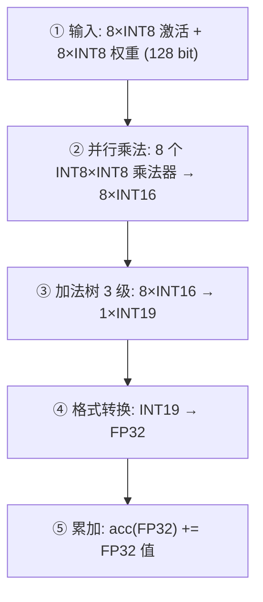
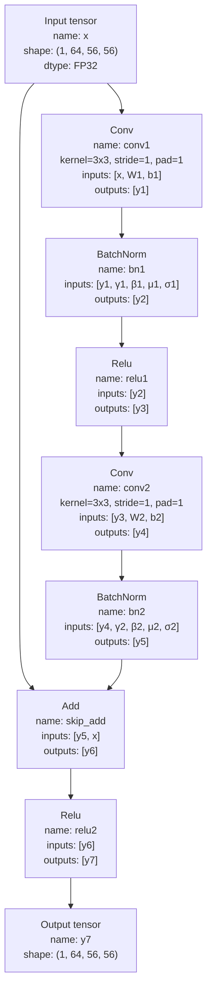
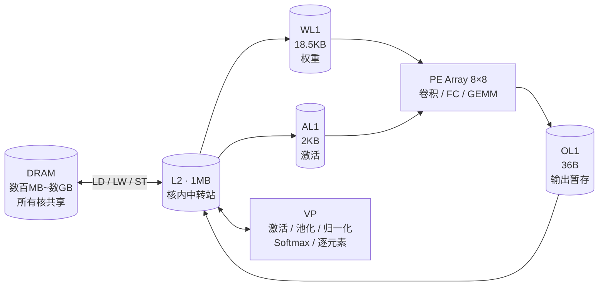
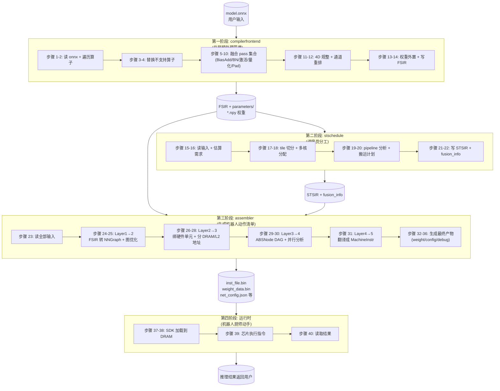
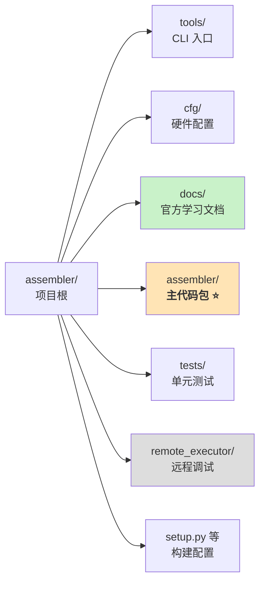
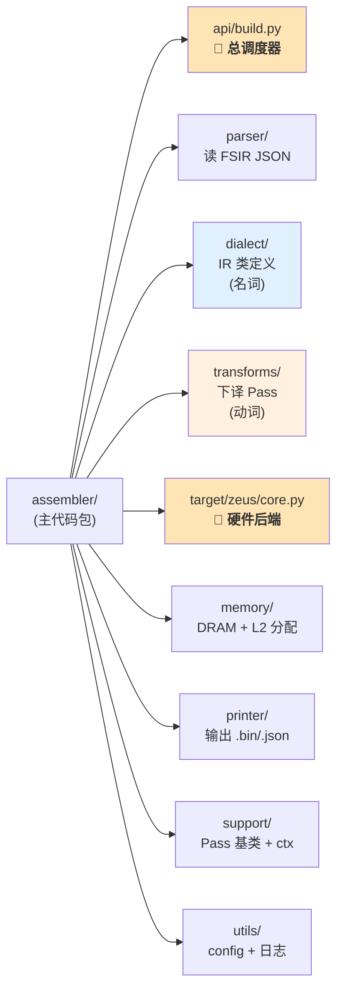
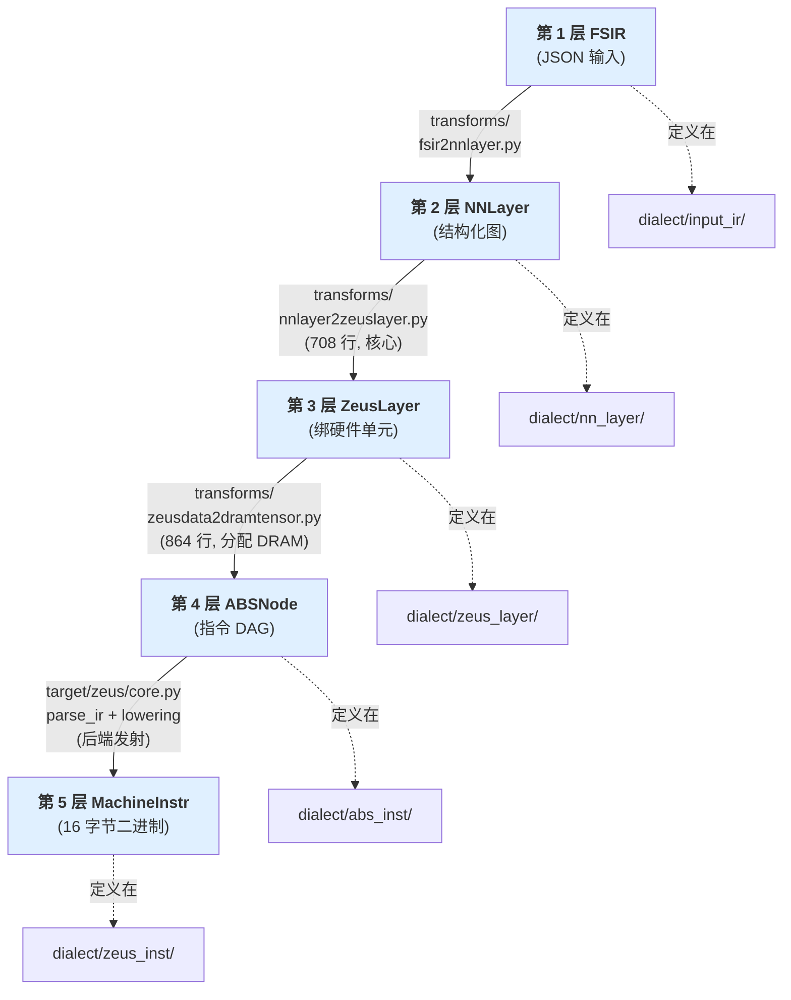

# Assembler & 935 芯片硬件架构 —— 知识文档 + 一周学习计划

> 📅 创建日期：2026-04-16
> 🎯 目标：一周内做到"能画出 935 芯片架构图 + 能对着图讲清楚数据怎么流、指令怎么跑"
> 📎 配套：[gaoz132_learning_plan.md](gaoz132_learning_plan.md) / [study_resources_and_schedule.md](study_resources_and_schedule.md)
> ⚠ 背景：领导新任务——assembler 项目重点关注，大模型（Qwen/Llama）落地。自动化任务暂缓。
> 🎯 **目标芯片明确**：本文档所有硬件描述 = **启明 935**（NPU 核架构 = **Zeus V2**）。不要与新一代 940（Zeus V3，对应另一个 `zeusv3_backend` 项目）混淆。assembler 项目的代码配置 `cfg/default.py: core_type = 935` 可佐证。

---

# Part 1 · 前置知识（你需要先搞懂的基础概念）

> 每个概念我直接在这里解释。如果你觉得解释够了就跳过"深入阅读"链接；想挖深就点进去看。

---

## 1.1 什么是 NPU / DSA

**NPU** = Neural Processing Unit（神经网络处理单元），是一种 **DSA**（Domain-Specific Architecture，领域专用架构）。

**用大白话说**：GPU 是"什么都能算，但不是什么都算得最高效"；NPU 是"只能算神经网络，但算神经网络特别快、特别省电"。

**为什么不直接用 GPU**：
- GPU 的 CUDA core 是通用的，能跑任何计算，但要消耗能量在"通用调度"上
- NPU 把计算单元做成**专用硬件流水线**（比如脉动阵列），省掉了调度开销
- 智驾场景对功耗极其敏感（装在车上，不能装个服务器级水冷），所以用 NPU

**你们公司的 NPU 产品线**叫**启明（Qiming）系列**，包含 910 → 920 → 930 → **935** → 940 几代芯片：

| 芯片型号 | NPU 核架构 | 当前状态 |
|---|---|---|
| 910 / 920 / 930 | **MUSE v1/v2**（主打稀疏计算） | 老产品 |
| **935** | **Zeus V2** | **当前主力，本 assembler 项目默认目标（`core_type=935`）** |
| 940 | **Zeus V3** | 新一代，对应另一个 `zeusv3_backend` 项目（走 MLIR+Triton 新链路） |

**935 和 940 是两代不同的芯片**，架构有较大差异（不是同一颗芯片的两个名字）。本文档下面讲的所有硬件细节都指 **935（Zeus V2）**。

**类比**：如果 GPU 是瑞士军刀，NPU 就是手术刀——功能更窄，但在自己的领域里精度和效率碾压。

> 深入阅读：[知乎：AI 编译器及 TVM 概述](https://zhuanlan.zhihu.com/p/672462650) 里有 DSA vs GPU 的对比

---

## 1.2 脉动阵列（Systolic Array）—— PE Array 的工作原理

你们芯片里的 **PE Array**（8×8 = 64 个 Processing Element）就是一个**脉动阵列**。

### 什么是脉动阵列

> ⚠ 以下是**简化教科书模型**，帮你快速建立直觉。实际硬件中每个 PE 不是只处理"一个数"，而是一个 **8 元素向量**——详见本节末尾"实际硬件"小节。

想象一个 8×8 的格子，每个格子里有一个小计算器（PE）。在简化模型里，这个计算器做一件事：**把两个数相乘，然后加到自己的累加器上**（MAC = Multiply-Accumulate）。

```
        权重 W 从上方逐列流入
        ↓  ↓  ↓  ↓  ↓  ↓  ↓  ↓
      ┌──┬──┬──┬──┬──┬──┬──┬──┐
 A →  │PE│PE│PE│PE│PE│PE│PE│PE│  → 部分和向右传递
 从 → │PE│PE│PE│PE│PE│PE│PE│PE│
 左 → │PE│PE│PE│PE│PE│PE│PE│PE│
 侧 → │PE│PE│PE│PE│PE│PE│PE│PE│
 逐 → │PE│PE│PE│PE│PE│PE│PE│PE│
 行 → │PE│PE│PE│PE│PE│PE│PE│PE│
 流 → │PE│PE│PE│PE│PE│PE│PE│PE│
 入 → │PE│PE│PE│PE│PE│PE│PE│PE│
      └──┴──┴──┴──┴──┴──┴──┴──┘
```

**工作流程**：
1. **权重**从上方逐列加载到每个 PE 里（预先加载好，不动了）
2. **激活值（输入数据）**从左侧逐行流入
3. 每个 PE 在每个时钟周期做一次 **MAC 运算**：`累加器 += 输入 × 权重`（简化描述；实际每 PE 每周期做 **8 次** MAC，见下方"实际硬件"小节）
4. 计算完一行后，**部分和（partial sum）**往下传给下一行 PE 继续累加（注：这是简化数据流模型，实际 PE Array 的数据流动方式取决于 dataflow 设计——weight-stationary / output-stationary 等，不同设计下数据流向不同）
5. 最终从底部流出完整的输出

**关键优势**：数据在 PE 之间"流动"而不是每次都从内存读取，大幅减少了访存次数。这就是为什么脉动阵列比 GPU 省电的核心原因。

### 实际硬件：每个 PE 是 8-wide 向量 MAC 单元

> 上面的简化模型里，一个 PE 每周期做 1 次 `标量 × 标量` 的 MAC。**实际上，你们芯片的每个 PE 包含 8 个并行乘法器，每周期做 8 次 MAC——即一次 8 维向量点积。**

**一个 PE 在一个时钟周期内做的运算**：

```
acc(FP32) += a0×w0 + a1×w1 + a2×w2 + a3×w3 + a4×w4 + a5×w5 + a6×w6 + a7×w7
             \___________________ 8 个 INT8×INT8 乘法 ___________________/
```

#### PE 的输入/输出位宽

| 数据 | 精度 | 个数/周期 | 总位宽/周期 | 来源 → 去向 |
|---|---|---|---|---|
| 激活值 | INT8 (8 bit) | 8 | 64 bit | AL1 → PE |
| 权重 | INT8 (8 bit) | 8 | 64 bit | WL1 → PE |
| 累加结果 | FP32 (32 bit) | 1 | 32 bit | PE 内部累加寄存器 → OL1（仅在 k 维累加完毕后写出） |

> WL1 和 AL1 的带宽都是 64 bit/cycle，恰好每周期喂一个 PE 所需的 8 个 INT8 元素。

#### PE 内部电路：底层是怎么算的

PE 内部不是"一个电路既算整数又算浮点"，而是**五个阶段的流水线**，每个阶段各有专用电路：



#### 每一阶段详解

**阶段 ①：输入（128 bit / 周期）**
- 8 个 INT8 激活 (a₀~a₇) 从 AL1 读入 → 64 bit
- 8 个 INT8 权重 (w₀~w₇) 从 WL1 读入 → 64 bit

**阶段 ②：并行乘法**
- 8 个独立的 INT8×INT8 乘法器同时工作
- 每个输出 **INT16 乘积**（因为 127×127 = 16129，需要 16 bit 才能表示）
- 结果：8 个 INT16

**阶段 ③：加法树 · 3 级流水线（把 8 个 INT16 求和）**

| 级数 | 输入 | 位宽变化 | 输出 |
|---|---|---|---|
| 第 1 级 | 8 个 INT16 两两相加 | 16 → 17 | 4 个 INT17 |
| 第 2 级 | 4 个 INT17 两两相加 | 17 → 18 | 2 个 INT18 |
| 第 3 级 | 2 个 INT18 相加 | 18 → 19 | 1 个 INT19 |

> **为什么位宽逐级增长**：两个 N-bit 整数相加最多需要 N+1 bit；8=2³ 个数求和 → 最多增 3 bit → 最终 19 bit

**阶段 ④：整数 → 浮点转换**
- INT19 → FP32（专用格式转换电路）

**阶段 ⑤：FP32 累加**
- `acc(FP32) += 转换后的 FP32 值`
- acc 是 PE 内部的 **32 bit 累加寄存器**（注意：这是 PE 电路内部的寄存器，**不是 OL1**——OL1 是累加完毕后才写入的外部暂存区）

#### 为什么用 INT8 乘法 + FP32 累加（混合精度设计）

| 部件 | 电路类型 | 面积（逻辑门数） | 为什么选这个精度 |
|---|---|---|---|
| 乘法器 ×8 | INT8 整数乘法 | ~64 门/个（**极小**） | 乘法占面积大头，INT8 比 FP32 乘法器小约 30 倍 |
| 加法树 | 整数加法 | 很小 | 8 个 INT16 求和，纯整数 |
| INT→FP 转换 | 格式转换 | 较小 | 每周期只做一次，开销可忽略 |
| 累加器 | FP32 浮点加法 | ~数百门（中等） | 防溢出——100 次 MAC 后最大值可达 1,612,900，INT8 只能表示到 127 |

**设计哲学**：在最高频运算（乘法，8 次/周期/PE）上用最省的精度（INT8），在需要保精度的运算（累加）上用高精度（FP32）。这和 PyTorch 的 AMP（自动混合精度训练）是完全相同的思路。

#### 对矩阵乘法的影响

文档前面说 "PE(i,j) 计算 C(i,j) = Σ\_k A(i,k)×B(k,j)"，这个 k 维的累加不是逐个做的，而是 **每次消化 8 个 k 值**：

```
C(i,j) = A(i, 0:8) · B(0:8, j)      ← 第 1 个周期，PE 做 8 次 MAC
       + A(i, 8:16) · B(8:16, j)     ← 第 2 个周期
       + A(i, 16:24) · B(16:24, j)   ← 第 3 个周期
       + ...                          ← 直到 k 维耗尽
```

**两层并行度**（两个 "8" 是不同维度的并行）：

| 并行维度 | 数量 | 作用 |
|---|---|---|
| PE 个数 | 8×8 = 64 | 同时计算 64 个不同的 C(i,j) 输出元素 |
| 每 PE 的 vector width | 8 | 每个 C(i,j) 的 k 维累加每周期消化 8 个元素 |

**峰值算力**：64 PE × 8 MAC/PE/周期 × 1 GHz = **512 GOPS (INT8)**

#### PE Array ≠ 芯片的全部计算能力

PE Array（脉动阵列）只负责**矩阵类运算**（卷积、矩阵乘法、全连接）。芯片上还有另一个独立的计算单元 **VP（Vector Processor，向量处理器）**，负责所有**逐元素运算**：

| 运算类型 | 硬件单元 | 举例 |
|---|---|---|
| 矩阵乘法 / 卷积 | **PE Array**（脉动阵列） | Conv2d, Linear, Bmm, FC |
| 逐元素运算 / 激活函数 / 归一化 | **VP**（向量处理器） | ReLU, Softmax, LayerNorm, GELU, Add, MaxPool |
| 数据搬运 / 格式转换 | **DT** | NCHW→NHWC 转换，L2 内部搬运 |

> 在 Transformer/LLM 里，VP 的工作量不可忽视——Softmax、LayerNorm、GELU、残差 Add 全在 VP 上跑。PE 和 VP 是芯片上的 **两大计算引擎**，缺一不可。

### 用矩阵乘法理解

矩阵乘法 `C = A × B`：
- A 的第 i 行从左侧流入
- B 的第 j 列从上方预加载
- PE(i,j) 计算 C(i,j) = Σ A(i,k) × B(k,j)

**对应你们芯片**：
- A = 激活值（feature map）→ 从 AL1 读
- B = 权重（weight）→ 从 WL1 读
- C = 输出 → 写到 OL1

### 你们芯片的 PE 参数

| 参数 | 值 | 含义 |
|---|---|---|
| Array 大小 | 8×8 = 64 PE | 同时做 64 个 MAC |
| Vector Width | 8 | 每个 PE 每周期可处理 8 个元素 |
| 乘法精度 | INT8 | 8-bit 整数乘法 |
| 加法精度 | FP32 | 32-bit 浮点累加（防止精度损失） |
| 频率 | 1 GHz | 每秒 10 亿个时钟周期 |
| 峰值算力 | 64×8 = 512 ops/cycle | @1GHz = **512 GOPS**（INT8） |

> 深入阅读：
> - [知乎：脉动阵列 - 计算机体系结构](https://zhuanlan.zhihu.com/p/650209037) — 最好的中文科普，有动图
> - [知乎：脉动阵列 Systolic Architectures](https://zhuanlan.zhihu.com/p/605590757)
> - [博客园：Systolic Array 加速矩阵乘运算](https://www.cnblogs.com/kongchung/p/13227256.html)

---

## 1.3 Memory Hierarchy（存储层级）—— 为什么有这么多层 Memory

### 核心矛盾

计算单元（PE Array）算得极快（512 GOPS），但数据从**外部 DRAM 搬进来**的速度跟不上。如果 PE 每做一次乘法都要去 DRAM 读数据，PE 大部分时间在**等数据**（idle），效率极低。

### 解法：多级缓存

就像你家里的存储层级：
- **口袋**（WL1, 18.5KB）：伸手就能拿到，但只能放几样东西
- **桌面**（L2, 1MB）：走两步就能拿到，能放更多东西
- **仓库**（DRAM, 数百 MB~数 GB）：要开车去拿，但什么都能存

**策略**：把接下来要用的数据提前从仓库（DRAM）搬到桌面（L2），再从桌面搬到口袋（WL1/AL1），PE 直接从口袋取。用完就扔回桌面或仓库，腾出口袋空间放下一批数据。

### Tiling（分块计算）

问题：WL1 只有 18.5KB，但一个 Llama-7B 的权重有 7GB。怎么塞进去？

答案：**不塞全部，只塞一小块**。

把大矩阵切成很多小 tile（类比你写 Triton 时的 `BLOCK_SIZE`）。每次只把一个 tile 的权重搬进 WL1，算完这个 tile，再搬下一个 tile 的权重进来。

### Double Buffering（双缓冲）

问题：搬数据需要时间，PE 在等搬运的时候是空闲的，浪费了。

答案：把 WL1 分成两半——**一半在被 PE 使用，另一半同时在搬下一批数据**。等 PE 用完当前这半，切换过去用另一半（那边已经搬好了），然后刚才用完的那半开始搬再下一批。PE 永远不用等。

**时序表**（→ 表示时间推进；每列是一个时间段）：

| 组件 \ 时间 | T₁ | T₂ | T₃ | T₄ | T₅ |
|---|---|---|---|---|---|
| **WL1-A**（前半） | 搬 tile1 | PE 用 tile1 | 搬 tile3 | PE 用 tile3 | 搬 tile5 |
| **WL1-B**（后半） | 空闲 | 搬 tile2 | PE 用 tile2 | 搬 tile4 | PE 用 tile4 |
| **PE**（计算单元） | 空闲（等数据） | 算 tile1 | 算 tile2 | 算 tile3 | 算 tile4 |

**关键观察**：
- 从 T₂ 开始，PE **每个时段都在算**（没有空闲周期）
- A 和 B 两块 WL1 **永远一块给 PE 用、另一块在搬数据**，交替进行
- 代价：WL1 容量要翻倍，所以代码里 `BATON_WL1_DOUBLE_BUFFER` 开启时 WL1 从 16KB 变 18.5KB

> 深入阅读：[MLSys Book: Hardware Acceleration](https://mlsysbook.ai/book/assets/downloads/Machine-Learning-Systems.pdf)

---

## 1.4 指令集（ISA）—— 芯片能听懂的"命令"

### 类比

CPU 的指令集是 x86 / ARM：`ADD R1, R2, R3`（把 R2 和 R3 相加，结果放 R1）。

NPU 的指令集类似，但命令是**专门给神经网络设计的**：
- `CONV`：让 PE Array 做一次卷积运算
- `LDA_MOV`：把数据从 DRAM 搬到 L2
- `VP_SELF`：让 VP 做一次元素级运算（比如 ReLU、Softmax）

### 你们芯片的指令格式

每条指令 **16 字节（128 bit）**。前 8 bit 是 **opcode**（操作码，告诉硬件"做什么"），后面的 bit 是**参数**（告诉硬件"对什么数据做、参数是多少"）。

```
┌────────┬──────────────────────────────────────────────────┐
│ opcode │ 参数字段（source shape, dest shape, padding, ...）  │
│  8bit  │                    120bit                         │
└────────┴──────────────────────────────────────────────────┘
```

**assembler 做的事就是**：把人类可读的"用 3×3 卷积处理 224×224 图像"翻译成一连串这样的 16 字节指令，写进 `inst_file.bin`。

---

## 1.5 模型文件格式详解：ONNX 为什么要存在

深度学习模型训练完之后需要保存成文件才能部署，而每个框架都有自己的原生格式：PyTorch 用 `.pt` / `.pth`，TensorFlow 用 `.pb` 或 SavedModel，Keras 用 `.h5`，Caffe 用 `.caffemodel` + `.prototxt`。这些格式本质上都是和各自框架绑定的，换句话说，要加载 `.pt` 文件，你就得装 PyTorch；要加载 `.h5`，就得装 TensorFlow。这种"一家一格式"的局面在研究阶段无所谓（反正你就用一个框架），但到了部署阶段就会变成严重的工程问题：芯片公司不可能为每个框架都写一套解析器。ONNX 就是为了解决这个跨框架问题而生的。

### PyTorch 的 `.pt` 到底是什么

`.pt` 文件在底层就是一个 **Python pickle 文件**（pickle 是 Python 自带的序列化格式，能把任意 Python 对象转成字节流）。PyTorch 通常保存两种东西。一种是 `state_dict`，即一个普通 Python dict，key 是 tensor 的名字（如 `"layer1.weight"`），value 是一个 `torch.Tensor` 对象（里面装着 FP32 / FP16 / BF16 或量化后的整数数值，按对应 dtype 编码），这种方式只保存权重。另一种是直接 pickle 整个 `nn.Module` 对象。

但后一种做法有个致命问题：pickle 只是把这个 Python 对象的引用和字段值序列化了，**模型的类定义代码（`class MyModel(nn.Module)...`）仍然在你的 Python 文件里**。没有那个 `.py` 文件，pickle 出来的 `.pt` 根本 load 不回来。这就是 PyTorch 格式的根本问题：`.pt` 本身并不是一个完整的模型描述，它只是"权重数据 + 去运行时根据这些 Python 代码重建计算图"的指令。从 AI 芯片公司（或任何做模型部署的第三方）的角度看，`.pt` 近乎不可用：必须装 Python 和 PyTorch 才能解析；模型的计算逻辑藏在 Python 命令式代码里，不是一个声明性的图结构，外部工具拿不到清晰的 op 列表；加载 pickle 可以执行任意代码，不安全；PyTorch 改了某个类的内部字段就可能导致 load 失败，版本脆性很高。

### TensorFlow 的做法（ONNX 的真正前身）

TensorFlow 1.x 时代走的是另一条路，叫**静态计算图**：整个模型的运算过程在训练前就固化成一张 DAG，保存为 **protobuf** 格式的 `.pb` 文件。protobuf 是 Google 自家的数据描述语言，它的关键特点是纯声明性、语言无关，即 C++ / Python / Go / Java 都能读写同一份 protobuf 文件。`.pb` 文件里包含了所有算子节点（op node）、它们之间的连接关系、每个节点的属性（kernel_size、stride 等）、以及常量 tensor（权重数据）。不需要原始 Python 代码就能完整理解整个计算过程。这个设计对编译器和芯片公司极其友好，但对研究员来说很痛苦，调试和动态图能力差，这也是 PyTorch 后来在研究界反超的原因。

### ONNX 的设计思路

ONNX（Open Neural Network Exchange，开放神经网络交换格式）2017 年由 Microsoft 和 Facebook 联合推出，设计目标很明确：做一个独立于任何框架的中间表示，让训练框架（PyTorch / TensorFlow / MXNet / ...）和部署后端（TensorRT / TVM / 各家 NPU）之间能互相转换，而不需要 N×M 套适配器。ONNX 的底层存储用的就是 protobuf（学 TensorFlow 的思路）。

一个 `.onnx` 文件打开来是一个序列化后的 `ModelProto` 消息。最外层 `ModelProto` 包含几个关键字段：`ir_version` 是 ONNX IR 本身的 schema 版本，`opset_import` 指定这个模型用的是哪个版本的算子集（比如 opset 17，这个版本号很重要，因为同一个"Conv"在不同 opset 版本下属性字段可能不同），`graph` 是真正的计算图，`producer_name` / `producer_version` 记录这个文件由哪个工具导出（方便调试追溯来源）。`graph` 字段里又包含 `node` 列表（每个节点是一次算子调用，有 op_type 如 "Conv" / "Gemm" / "Relu"、输入名、输出名、属性）、`initializer`（常量 tensor，主要是权重和偏置的实际二进制数据）、`input` 和 `output`（模型的输入输出 tensor 规格，包括 shape 和 dtype）、`value_info`（中间 tensor 的 shape 信息，供推理优化用）。

把这个结构展开看，ONNX 就是一张**完整的 DAG + 所有权重数据**全部打包在一个 protobuf 里。没有任何 Python 代码依赖，任何语言写的程序只要装了 protobuf 的 runtime 就能解析。

### 一个 DAG 就能描述完整的模型架构吗

答案是可以，但要理解清楚 DAG 里**每个节点**和**每条边**到底携带了哪些信息。光看"节点+边"这四个字确实很空洞，实际上一个完整可部署的模型 DAG，每个节点至少包含三类数据。第一是 **op_type**，告诉这个节点做什么运算（`"Conv"` / `"Gemm"` / `"Relu"` / `"Add"` 这种字符串，是 ONNX opset 里定义好的算子名）。第二是 **attributes**（算子的静态配置参数），比如 Conv 节点会有 `kernel_shape=[3,3]`、`strides=[1,1]`、`pads=[1,1,1,1]`、`dilations=[1,1]`，Gemm 节点会有 `alpha` / `beta` / `transA` / `transB`。第三是 **input / output 名字列表**，input 里既包含前一层输出的中间 tensor 名字，也包含从 `initializer` 里引用的常量 tensor 名字（权重、偏置）。边则隐式由"上一个节点的 output 名"等于"下一个节点的某个 input 名"来建立，ONNX 不存显式的 edge 结构，拓扑关系完全靠名字匹配自动推导出来。

权重数据放在 `graph.initializer` 这个列表里，每个条目是一个 `TensorProto`，包含 tensor 的名字（如 `"layer1.0.conv1.weight"`）、shape（如 `[64, 3, 3, 3]`）、dtype（FP32 / FP16 / INT8 等）、以及真正的数值数据（在 dtype 对应的 protobuf 字段里，比如 FP32 存在 `float_data` 字段，或者用 `raw_data` 字段存原始字节）。当 DAG 里某个 Conv 节点的 input 里写了 `"layer1.0.conv1.weight"` 这个名字，运行时就会去 initializer 里按名字查出这个权重 tensor 塞进去。

下面用一个 **ResNet 残差块**的例子来看"如何从 DAG 反推出模型架构"。这是所有 CNN 家族的基本单元，也是学会读 DAG 最好的起点：



这张 DAG 对应的 `graph.initializer` 里会有 10 个常量 tensor（两套 Conv 的权重 W1、W2 和偏置 b1、b2，两套 BN 的 gamma / beta / 移动均值 / 移动方差 γ1 β1 μ1 σ1 / γ2 β2 μ2 σ2）。每个 initializer 按 name 被对应节点的 input 引用。

**怎么从这张图反推出模型架构**。从 Input 开始顺着箭头走，看到 `x` 同时喂给了 `conv1` 和下游的 `skip_add`，第一眼就能判断存在**残差连接**（skip connection）。主干路径是 `conv1 → bn1 → relu1 → conv2 → bn2`，这是典型的"卷积 + BN + 激活"堆叠两次的模式。`skip_add` 节点把主干输出 `y5` 和原始输入 `x` 相加，加完再过一个 ReLU 输出 `y7`。这个结构正是 **ResNet basic block** 的标准定义（He et al. 2015），只看 DAG 就能百分之百确定这是个 ResNet basic block，不需要知道它原来是用 PyTorch 还是 TF 写的，也不需要 Python 源代码。

进一步能读出更多信息。Conv 的 attributes 写着 `kernel=3x3, stride=1, pad=1`，说明这是一个**保持尺寸的 3×3 卷积**（stride=1，padding=1 正好让输出 H/W 和输入一致）。输入 shape 是 `(1, 64, 56, 56)`，对比 W1 的 shape `(64, 64, 3, 3)`（从 initializer 里查出来）可以得出这个 block **输入输出通道都是 64**，结合 stride=1 和 padding=1 保持尺寸，输出 shape 必然也是 `(1, 64, 56, 56)`，和标注的 Output shape 对上了。由于输入和主干输出 shape 相同，才允许 `Add` 直接相加，不需要额外的 1×1 卷积做通道对齐，这进一步确认它是 basic block 而不是 bottleneck block（bottleneck 会先压缩再恢复通道，中间是 1×1 → 3×3 → 1×1 三层 Conv）。

**如果是一个完整模型会怎样**。把几十上百个这种 block 按顺序拼起来，加上开头的 stem 卷积、中间的 stride=2 降采样层、结尾的 global pool 和全连接层，就构成了一张完整的 ResNet-50 DAG。整张图可能有几百个节点、几千条边，但阅读规则完全一样：顺着边走、读 op_type、读 attribute、查 initializer 的 shape，就能把原始 PyTorch 代码里写的每一行 forward 完整还原出来，甚至可以自动生成伪代码：

```python
# 从 DAG 反推出的伪代码
y1 = Conv(x, W1, b1, kernel=3, stride=1, pad=1)
y2 = BatchNorm(y1, γ1, β1, μ1, σ1)
y3 = ReLU(y2)
y4 = Conv(y3, W2, b2, kernel=3, stride=1, pad=1)
y5 = BatchNorm(y4, γ2, β2, μ2, σ2)
y6 = y5 + x            # skip connection
y7 = ReLU(y6)
return y7
```

这就是"DAG + 权重 = 完整模型"的含义：**DAG 描述了计算流程**（做什么、按什么顺序、哪些数据流到哪里），**initializer 提供了所有常数**（权重、偏置、归一化统计量），两者合起来就是一个**自包含的可执行描述**，任何支持这套算子规范的 runtime 都能加载并得到和原始 PyTorch 模型完全一致的输出。Transformer、Diffusion、Mamba 这些更复杂的模型本质也是如此，只是节点和边更多、拓扑更复杂而已。你们项目的 `compilerfrontend` 输入的 `.fsir.json` 就是把 ONNX 的这套 DAG 结构换了种表达方式（JSON 代替 protobuf），核心信息完全相同。

### 为什么不直接用 `.pt`

回到开头的问题：为什么芯片公司不直接支持 `.pt` 就好了？因为 `.pt` 根本就不是一份能被芯片公司工具链独立消化的文件。首先是 Python 依赖：`.pt` 是 pickle，要解析必须有 Python 和 PyTorch 运行时，芯片公司的 C++ 编译器工具链没法简单 load。其次是图结构不显式：`.pt` 里的 `state_dict` 只有权重 tensor 的 name → value 映射，没有 op 之间的连接关系；真正的模型结构藏在用户写的 `forward()` Python 函数里，你拿到 `.pt` 根本不知道这个模型长什么样、forward 怎么走。第三是命令式 vs 声明式：PyTorch 本质是命令式的（定义即执行），没有显式的图对象可以序列化；要从 `.pt` 导出计算图必须跑一次 trace（用样例输入执行一遍记录调用），这就是 `torch.onnx.export` 在做的事。最后是版本脆性：pickle 依赖 Python class 的字段名一一对应，PyTorch 改了内部实现就可能 load 失败，而 protobuf 的 schema 版本化机制则保证了前后兼容。

所以几乎所有 AI 编译器（TVM、TensorRT、你们的 compilerfrontend）都把 ONNX 作为**唯一的输入格式**。用户从 PyTorch 导出时跑 `torch.onnx.export(model, example_input, "xxx.onnx")`，PyTorch 内部做完 trace 和图转换后吐出一个 `.onnx` 文件，这个文件就成了芯片工具链的标准输入。

### 各种格式的底层对比

| 格式 | 底层存储 | 图结构 | 语言依赖 | 典型用途 |
|---|---|---|---|---|
| PyTorch `.pt` / `.pth` | Python pickle | 不在文件里（需 Python 代码重建） | Python + PyTorch | 训练、研究 |
| TorchScript (`.pt`) | pickle + TorchScript IR | 有（trace 或 script 出来） | Python / C++ runtime | PyTorch 自家部署 |
| TensorFlow SavedModel | protobuf + 文件树 | 有（GraphDef） | TF runtime | TF 部署 |
| TensorFlow `.pb`（frozen） | 单个 protobuf | 有 | TF runtime | 旧式 TF 部署 |
| TFLite | FlatBuffer | 有（针对移动端重新组织） | TFLite runtime | 手机 / 嵌入式 |
| Keras `.h5` | HDF5 | 模型配置 JSON + 权重 | Keras + TF | Keras 应用 |
| **ONNX** | **protobuf** | **有（显式 DAG）** | **语言无关** | **跨框架、芯片部署、编译器输入** |
| MLIR-based | MLIR 多级 IR | 有，多级 | MLIR infrastructure | 下一代编译器 |

补充一下 **FlatBuffer 和 protobuf 的区别**：两者都是 Google 出的二进制序列化格式，但 FlatBuffer 不需要反序列化就能直接访问字段（数据在内存中原地即可读），读取更快，代价是写入稍慢、文件略大。TFLite 选了 FlatBuffer 追求移动端的极速加载，ONNX 选 protobuf 则是因为生态更成熟，且一般不跑在资源极度受限的设备上。

### ONNX 的局限与演进趋势

ONNX 也有明显短板。首先是 opset 更新慢，新论文里的算子常常要等好几个月才进官方 opset，在这之前，PyTorch 导出时会把新算子表达成已有算子的组合，或者干脆导出失败。其次是动态 shape 和控制流支持弱，ONNX 最初为 CNN 设计，LLM 时代的 KV-cache 动态增长、变长序列等场景处理起来很别扭。最后是标准化权威性不足，opset 版本多，各家实现对边界 case 的处理不一致。

这也是为什么 **MLIR** 近几年在 AI 编译器界崛起：它是一套多级 IR 基础设施，比 ONNX 的单层 op 列表表达力强得多，各家芯片可以定义自己的 dialect 来表达专有操作。你们项目的 940（Zeus V3）对应的 `zeusv3_backend` 走的就是 MLIR + Triton 的新路线。但在可预见的几年内，ONNX 仍是事实上的跨框架标准，也是你们 935 / assembler 链路的起点。

---

## 1.6 WL1 / AL1 / OL1 命名由来

这三个名字在项目文档里也没找到显式定义，但结合芯片行业惯例基本可以还原它们的含义：**W = Weight**（存权重的 buffer），**A = Activation**（存激活值 / feature map 的 buffer），**O = Output**（存输出 / 部分和的 buffer），**L1 = Level 1**，表示存储层级里的"第一级"，即最靠近计算单元的那一层。

关于那个 "1"。这个命名沿用了 **CPU / GPU cache 层级**的经典叫法。CPU 里 L1 cache 是离 CPU core 最近的缓存（最小最快），L2 次之，L3 再次。NPU 设计师把这套命名移植过来，用 "L1" 表示离 PE 计算单元最近的那层 SRAM。你们芯片里数字也只出现了 "1"，没有 WL2 / AL2，原因很简单：**935 的 PE 内部就只有一级私有存储**，下一级就跳到了 L2（核内共享的 1MB 缓存），再下一级是 DRAM。那为什么不干脆不加数字、直接叫 `W_buffer` / `A_buffer`？这主要是命名的前瞻性和一致性考虑。一方面，把数字加上去和业界 L1/L2/L3 的层级语言对齐，一眼能看出这是第一级；另一方面将来如果架构演进加了 WL2（比如在 PE 和 L2 之间再插一级更大的权重缓存），命名能平滑扩展而不用改动已有代码。940（Zeus V3）架构大改，据说存储层次就做了更复杂的分层，很可能就会用到 L2 级别的 W / A / O buffer。

**这套命名是行业统一的吗？不是。** 不同 NPU 厂商叫法差别很大：NVIDIA GPU 里就是 "register file" 和 "shared memory"，Google TPU 叫 "MXU scratchpad"，Cerebras 叫 "fabric SRAM"，华为昇腾有自己的叫法，Apple NPU 的细节是保密的。WL1 / AL1 / OL1 这一套更像是以你们公司为代表的一批国产 NPU 沿用的传统命名，思路是从 CPU cache 的术语借过来的，并非公开标准，而是公司（甚至部门）内部沿袭下来的约定。所以你在外面的论文或者 NVIDIA 的文档里不会看到 "WL1"，但看到了 "L1 cache" 或 "local scratchpad" 大致可以类比过来。

一句话总结：**WL1 = Weight Level-1 buffer**，Level-1 借自 CPU cache 术语，表示"离 PE 最近的那层"，这一级之后就没有 Level-2 / Level-3 的 W 专用 buffer（再下一级是共享的 L2 cache）。

---

# Part 2 · 935 芯片架构详解（Zeus V2）

> 以下数据是从你们的代码和项目文档（`assembler/cfg/default.py`、`assembler/docs/assembler_v2_learning_guide.md` 等）里挖出来的，仅描述 **935**。940 的架构细节不在本文档范围内（走 `zeusv3_backend` 那条新链路）。

---

## 2.1 单核架构图

### 数据流视图（主干）



### 八个硬件单元总表

| 单元 | 类型 | 作用 | 对应指令族 |
|---|---|---|---|
| **PE Array** | 计算 | 矩阵乘 / 卷积 / FC / Bmm | CONV, FC, DICV, DECV, GPCV |
| **VP** | 计算 | 激活 / 归一化 / 池化 / 逐元素 | VP_SELF, VP_POOL, VP_UPSM |
| **LD** | 搬运 | DRAM → L2 的**激活值** | LDA_CFG, LDA_MOV |
| **LW** | 搬运 | DRAM → L2 → WL1 的**权重** | LDW_*, LW_* |
| **ST** | 搬运 | L2 → DRAM 的**结果写回** | STA_CFG, STA_MOV |
| **DT** | 搬运 | L2 内部搬运 + 格式转换 (NCHW↔NHWC 等) | DT_CFG, DT_CAL |
| **CT** | 控制 | 程序开始 / 结束 / 跳转 | CT_ST, CT_ED, CT_BC |
| **SI / SO** | 同步 | 核间接收 / 发送数据和信号 | SI_*, SO_* |

### 存储层级总表

| 层级 | 名称 | 容量 | 归属 | 作用 |
|---|---|---|---|---|
| L0 | **WL1** | 18.5KB/核 | PE 私有 | 当前 tile 的权重 |
| L0 | **AL1** | 2KB/核 | PE 私有 | 当前 tile 的激活 |
| L0 | **OL1** | 36B/核 | PE 私有 | PE 输出暂存 |
| L1 | **L2** | 1MB/核 | 核内共享 | 权重+激活+中间结果的中转站 |
| L2 | **DRAM** | 数百MB~数GB | 所有核共享 | 模型权重 / 输入 / 输出 / KV-cache |

### 三条主要数据路径

| 路径 | 流向 | 涉及指令 |
|---|---|---|
| **权重路径** | DRAM → L2 → WL1 → PE | LDW → LW |
| **激活路径** | DRAM → L2 → AL1 → PE | LDA |
| **输出路径** | PE → OL1 → L2 → DRAM | STA |

---

## 2.2 各硬件单元详解

### PE（Processing Element）—— 主计算单元

| 属性 | 值 |
|---|---|
| 功能 | 卷积（Conv2d）、矩阵乘法（Dense/FC/Bmm）、反卷积 |
| 结构 | 8×8 脉动阵列，每 PE 含 8-wide 向量单元 |
| 精度 | INT8 乘法 + FP32 累加 |
| 私有存储 | WL1 (18.5KB, 存权重), AL1 (2KB, 存激活), OL1 (36B, 存部分和) |

**对应指令**：

| 指令名 | opcode | 做什么 |
|---|---|---|
| PE_CFG_FM | 128 | 配置输入/输出 feature map 的 shape 和格式 |
| PE_CFG_DQ | 129 | 配置反量化参数（scale, bias） |
| PE_CFG_PM | 130 | 配置激活函数、stride、量化参数 |
| PE_CFG_DE | 131 | 配置 tile 切分细节（tile height/width） |
| PE_CFG_TP | 132 | 配置 transpose 参数 |
| CONV | 144 | 执行标准卷积 |
| DICV | 145 | 执行 depthwise 卷积 |
| DECV | 146 | 执行反卷积 |
| GPCV | 147 | 执行 grouped pointwise 卷积 |
| FC | 148 | 执行全连接 / 矩阵乘法 |

**理解方式**：PE 做一次计算前，需要先发若干条 `PE_CFG_*` 指令告诉它"输入多大、权重多大、用什么激活函数"，然后发一条 `CONV` 或 `FC` 开始计算。类比你写 Triton 时先设置 `BLOCK_SIZE`、`stride` 这些参数，再调 `tl.dot()`。

> **PE 内部电路详解**见 [1.2 节"实际硬件"小节](#实际硬件每个-pe-是-8-wide-向量-mac-单元)，包括 INT8 乘法器 → 加法树 → INT→FP32 转换 → FP32 累加器的完整底层流程。

### VP（Vector Processor）—— 芯片的第二大计算引擎

> VP 不是 PE 的"后处理附属"，而是一个**独立的、完整的计算单元**。在 Transformer 模型里，VP 的工作量与 PE 不相上下。

| 属性 | 值 |
|---|---|
| 功能 | 逐元素运算（Add/Mul/Div）、激活函数（ReLU/Sigmoid/GELU/SiLU/Softmax）、池化（AvgPool/MaxPool）、归一化（LayerNorm/BatchNorm/RMSNorm） |
| 定位 | 与 PE Array 并列的**第二大计算引擎**——PE 做矩阵运算，VP 做一切非矩阵运算 |
| 数据来源 | 从 L2 读数据，或直接接收 PE 的输出 |

**PE vs VP 的分工**：

| 如果运算是… | 则用… | 原因 |
|---|---|---|
| 两个矩阵相乘、卷积 | PE Array | 脉动阵列为矩阵乘法专门设计 |
| 对每个元素独立做运算（如 max(0,x)、exp(x)） | VP | 不涉及元素间的"乘加缩减"，脉动阵列帮不上忙 |
| 需要跨元素统计再逐元素处理（如 Softmax、LayerNorm） | VP | 先求 max/mean/var，再逐元素计算——VP 有专门的 reduce + broadcast 能力 |

**对应指令**：VP_CFG_FM (192), VP_CFG_GCS (193), VP_SELF (200), VP_UPSM (201), VP_POOL (202) 等。

**大模型里 VP 的工作**：Transformer 里的 Softmax、LayerNorm、GELU/SiLU、残差 Add、RoPE 位置编码全在 VP 上跑。一个 Transformer block 里大约一半的算子是 VP 负责的（虽然计算量主要集中在 PE 的矩阵乘法上）。

### DT（Data Transfer）—— 片上搬运

| 属性 | 值 |
|---|---|
| 功能 | L2 内部的数据搬运 + 数据格式转换（如 NCHW → NHWC） |
| 对应指令 | DT_CFG (160), DT_CAL (168) |

### LD / LW（Load Data / Load Weight）—— DRAM → L2 搬运

| 指令 | opcode | 做什么 |
|---|---|---|
| LDA_CFG | 32 | 配置激活值加载参数（DRAM 地址、大小） |
| LDA_MOV | 40 | 执行激活值搬运：DRAM → L2 |
| LDW_CFG | 33 | 配置权重加载参数 |
| LDW_MOV | 41 | 执行权重搬运：DRAM → L2 |
| LW_CFG | 65 | 配置 L2→WL1 的权重搬运 |
| LW_MOV | 73 | 执行 L2→WL1 搬运 |

### ST（Store）—— L2 → DRAM 写回

| 指令 | opcode | 做什么 |
|---|---|---|
| STA_CFG | 96 | 配置激活值写回参数 |
| STA_MOV | 104 | 执行写回：L2 → DRAM |

### SI / SO（Sync In / Sync Out）—— 核间同步

多核跑一个模型时，核与核之间需要交换数据或等待。SI 接收别的核发来的数据/信号，SO 发送给别的核。

| 指令 | 做什么 |
|---|---|
| SI_SYN_CFG (52) | 配置同步等待条件 |
| SO_SYN_CFG (116) | 配置同步发送信号 |
| SIAA_MOV (56) | 从其他核接收激活值 |
| SOPW_MOV (121) | 向其他核发送权重 |

### CT（Control）—— 控制流

| 指令 | opcode | 做什么 |
|---|---|---|
| CT_ST | 0 | 程序开始 |
| CT_ED | 255 | 程序结束 |
| CT_BC | 16 | 循环/条件跳转 |

---

## 2.3 三级存储详解

| 层级 | 名称 | 大小 | 存什么 | 带宽 | 谁用 |
|---|---|---|---|---|---|
| L0 | WL1 | 18.5 KB/core | 权重（每次搬一个 tile） | 64 bit/cycle | PE |
| L0 | AL1 | 2 KB/core | 激活值（输入 feature map 的一块） | 64 bit/cycle | PE |
| L0 | OL1 | 36 B/core | 输出暂存（PE 累加完毕后写出的结果） | — | PE |

> **OL1 ≠ PE 内部累加器**：每个 PE 内部有自己的 FP32 累加寄存器（32 bit，属于 PE 电路本身），在 k 维累加过程中一直在 PE 内部更新，不占 OL1 空间。OL1 是一个小的**输出暂存区**，只在累加完毕、结果需要写出到 L2 时才用到。
| L1 | L2 | 1 MB/core | 权重+激活+中间结果的"中转站" | 32 GB/s | 所有单元共享 |
| L2 | DRAM | 数百 MB~数 GB | 全部数据：模型权重、输入、输出、KV-cache | 可配置 | LD/LW/ST 搬运 |

**数据流路径**：

```
权重路径:   DRAM ──LDW──► L2 ──LW──► WL1 ──► PE (计算)
激活路径:   DRAM ──LDA──► L2 ──────► AL1 ──► PE (计算)
输出路径:   PE ──► OL1 ──► L2 ──STA──► DRAM
```

---

## 2.4 多核架构

你们芯片支持 **1~4 核**（甚至更多）。多核时：
- 每个核有自己的 PE/VP/DT + WL1/AL1/L2
- DRAM 是所有核**共享**的
- 核间通过 **SI/SO 指令**同步：一个核算完 layer1，通过 SO 告诉另一个核"你可以开始算 layer2 了"
- stschedule 负责决定"哪些层放在哪个核上算"

---

## 2.5 深度学习算子的"原子操作"集 —— 硬件与编译器的分工（科普）

> 本小节解答几个根本性疑问：
> - 硬件到底怎么"保存"卷积、激活函数、Softmax 这些算法？
> - DL 是不是有一套"原子操作"，像 CPU 的 add/mul 一样能拼出所有模型？
> - 新的激活函数（或新的大模型算子）出来后，这颗芯片会不会废？

---

### 2.5.1 三种硬件"保存算法"的哲学

芯片里**没有**单一的"万能 FSM" 保存所有算法。不同算子用不同的硬件机制：

| 实现方式 | 电路本质 | 灵活性 | 典型举例 |
|---|---|---|---|
| **参数化 FSM + 通用运算电路** | 时序电路（状态机 + 计数器 + 循环） | 高：一套硬件跑多个算子，靠参数切换 | PE 的 Conv/FC/DWConv，池化窗口控制 |
| **固定功能电路 Fixed-Function Unit** | 组合逻辑 / LUT 查找表（无状态） | 低：只支持烧死的那些函数 | 激活函数 Unit（ReLU/Sigmoid/GELU） |
| **编译器分解** | 不在硬件里，让编译器把复杂算子拆成已有原子算子的序列 | 最高 | Attention / Softmax / LayerNorm / 新激活函数 |

---

### 2.5.2 DL 的"原子算子"集 —— AI 芯片 ISA 的核心

> **类比**：CPU 有 add/mul/cmp/jump/load/store 等几十条原子指令，能拼出任何算法；NPU 的原子算子集则是~30 个，能拼出几乎所有深度学习模型。**没有全球统一标准**，但业界 NPU 共通的那批列在下面。

#### ① 矩阵类（计算密集的主力）

| 原子算子 | 作用 | 硬件实现 |
|---|---|---|
| **GEMM / MatMul** | 矩阵乘 `C = A·B + C` | PE Array 脉动阵列 |
| **Conv2d** | 2D 卷积 | PE Array（可视为带滑窗的 GEMM） |
| **Bmm / BatchMatMul** | 批量矩阵乘 | PE Array，批次维度并行 |

> 严格说只有 GEMM 是真正"原子"的——Conv 可以通过 im2col 转成 GEMM。但实际芯片通常直接硬件支持 Conv（更高效，省掉 im2col 的内存开销）。

**硬件怎么保存"卷积算法"**：PE 内部有一个**参数化循环控制 FSM + 地址生成器**，Conv/FC/DWConv/DeConv/Bmm 共用这套硬件——不同 opcode（CONV=144、FC=148、DICV=145…）只是切换 FSM 的参数模板。算法本质"写"在 FSM 的状态转移图里。

#### ② 逐元素算子（Element-wise）

| 原子算子 | 作用 | 硬件实现 |
|---|---|---|
| **加减乘除** (add/sub/mul/div) | 基本算术 | ALU（加法器、乘法器、倒数 LUT） |
| **比较类** (max/min/compare) | 取大/取小/判断 | 比较器 + MUX |
| **超越函数** (exp, log, sqrt, 1/√x) | 指数、对数、开方、倒数开方 | **LUT 查找表 + 线性插值** |
| **激活基元** (ReLU, Sigmoid, Tanh) | 常用激活函数 | 固定功能电路（比较器/MUX）或 LUT |

> **关键原子算子**：**exp、log、sqrt、倒数**这四大超越函数是最重要的原子——有了它们，几乎所有非线性函数都能组合出来。

**硬件怎么保存"激活函数算法"**：
- **ReLU 类**：1 个比较器 + 1 个 MUX，组合逻辑，0 时钟延迟，芯片设计时直接画进电路
- **Sigmoid / GELU / Tanh 类**：**LUT 方案**（ROM 预存 256~1024 个函数值，用高位查表低位插值）或 **PWL 方案**（把曲线切成 8~16 段直线，每段 `y = ax+b`）

#### ③ 归约算子（Reduction，多个 → 一个）

| 原子算子 | 作用 | 硬件实现 |
|---|---|---|
| **Sum / Mean** | 求和、求均值 | 加法树 + FSM |
| **Max / Min / Argmax** | 取最值及其索引 | 比较器树 + FSM |
| **Variance** | 方差 | 加法树 + 平方 + 减法 |

**硬件怎么保存"归约算法"**：加法树/比较器树是**硬件拓扑结构**（log₂(N) 级流水线同时做），FSM 控制在不同维度上扫描。

#### ④ 数据搬运算子

| 原子算子 | 作用 | 硬件实现 |
|---|---|---|
| **Load / Store** | 内存读写 | DMA + 地址生成器 |
| **Transpose** | 维度转置 | DT 单元 + 特殊地址模式（读写步长不同） |
| **Reshape / View** | 改变形状，不改变数据 | 纯软件，编译期处理 |
| **Concat / Split / Gather / Scatter** | 拼接、切分、按索引取值 | DMA + 索引生成逻辑 |

#### ⑤ 流控（Control）

| 原子算子 | 作用 | 硬件实现 |
|---|---|---|
| **Branch / Jump / Loop** | 条件跳转、循环 | 指令解码器 + 程序计数器 + 循环寄存器 |
| **Sync** | 核间/单元间同步 | SI/SO 指令 + 同步信号线 |

**小计**：加起来**不到 30 个原子算子**——这就是 AI 芯片 ISA 的基本构件。所有高层算法（Attention、LayerNorm、RMSNorm、SwiGLU 甚至 Flash Attention）都可以用这些原子算子拼出来。

---

### 2.5.3 新激活函数来了怎么办？—— 分解！芯片不会废

> 用户的直觉完全正确：**新激活函数可以分解成已有原子算子的组合**。

#### 真实案例

**Swish / SiLU**（Llama、Qwen 都在用）：
```
SiLU(x) = x · sigmoid(x) = x · (1 / (1 + exp(-x)))

分解成硬件指令：
  exp(-x)    → LUT        （超越函数基元）
  _ + 1      → add        （ALU）
  1 / _      → 倒数 LUT    （超越函数基元）
  _ · x      → mul        （ALU）
  = 4 条硬件指令，跑通！
```

**Mish**：
```
Mish(x) = x · tanh(log(1 + exp(x)))

分解：exp → LUT；+1 → add；log → LUT；tanh → LUT；·x → mul
= 5 条硬件指令
```

**GEGLU**（大模型 FFN 变体）：
```
GEGLU(x, gate) = GELU(gate) · x
分解：GELU（已有 LUT 或再分解）→ 乘法
= 2 条硬件指令
```

#### 为什么几乎所有新激活函数都能分解

**基本原理**：只要新函数能用 **exp / log / sqrt / 倒数 + 基本算术 + 比较** 表达，芯片都能跑。

**现实**：研究员发明新激活函数时，也不会发明 GPU/NPU 完全跑不了的函数——不然根本没法跑实验。因此业界出现的新激活函数**几乎 100% 都能用这组原子基元组合出来**。

---

### 2.5.4 Attention 等高层算子的命运：一样靠分解

**Attention 就是这么跑的**：

```
Attention(Q, K, V) = Softmax(Q·K^T / √d) · V
                ↓ 编译器展开
① Q · K^T       → FC/Bmm 指令（opcode 148）→ PE
② ÷ √d          → VP_SELF（逐元素乘常数）→ VP
③ Softmax       → VP_SELF（Softmax 模式）→ VP
④ 结果 · V       → FC/Bmm 指令            → PE
```

**Softmax 也是分解出来的**，由 VP 内部多阶段 FSM 串起来跑：
```
① 求 max        → 比较器树（归约）
② x - max       → 减法器（逐元素）
③ exp(x-max)    → LUT（逐元素）
④ 求和          → 加法树（归约）
⑤ 除以和        → 倒数 LUT + 乘法（逐元素）
```

**LayerNorm / RMSNorm 也一样**——Reduce（mean/var）+ 逐元素（`(x-μ) / √(σ²+ε) · γ + β`）。

---

### 2.5.5 那芯片什么时候真正"跑不动新模型"？

分解法很强大但有极限。三种真正失能的场景：

| 场景 | 能否挽救 | 说明 |
|---|---|---|
| **缺关键超越函数基元** | 能近似但很慢 | 老 NPU 只有 ReLU/Sigmoid 没 exp LUT，GELU 只能用分段线性硬拟合，精度性能都差。935 应有完整 exp/log/sqrt LUT，不会有这问题。 |
| **分解后性能太差** | 硬件层面无解 | GELU 专用电路 1 周期 vs 分解后 5+ 周期。如果算子在关键路径上，整体可能慢 2 倍。**这就是为什么新一代芯片把 GELU、Flash Attention 等热门新算子直接烧进硬件**——就像当年 Sigmoid/Tanh 被烧进去一样。 |
| **全新计算范式** | 真的废 | 如果未来出现不基于张量/线性代数的新模型（脉冲神经元、图事件驱动、模拟计算等），这套 MAC + 逐元素 + Reduce 范式根本表达不出来。 |

**好消息**：目前**所有主流深度学习模型**（Transformer、Mamba/SSM、Diffusion、MoE、Flash Attention…）都在张量计算范式内，935 在可预见几年内不会因算法演进而报废。

---

### 2.5.6 总结：芯片的"算子完备性"

回到 CPU/NPU 的类比：

| 层级 | CPU | NPU |
|---|---|---|
| 指令集 | add, mul, cmp, jump, load, store… ~几十条 | GEMM, element-wise, reduce, DMA… ~30 个原子算子 |
| 完备性 | 图灵完备（能跑任何算法） | 张量计算完备（能跑几乎所有 DL 模型） |
| 硬件做什么 | 把常用指令做成最快电路 | 把常用原子算子做成最快电路 |
| 软件做什么 | 编译器把高级语言→汇编指令 | AI 编译器把高级算子→原子算子序列 |

**本质**：**硬件做什么与编译器做什么，是一条可调的分界线**——
- 把越多东西烧进硬件 → 越快越省电，但越不灵活
- 保留越多给编译器 → 越灵活，但运行时开销更大

**935 的分界线画在了"算子类"这一层**：往下（Conv/FC/Pool/Norm/基础激活函数/超越函数 LUT）都是硬件；往上（Attention、Softmax、LayerNorm、各种新算子）交给编译器分解。

**这就是为什么 assembler 项目这么复杂**——它不只是"生成指令"，而是一整套**算法降级（Lowering）**：ONNX 算子（~200 种）→ NNLayer → ZeusLayer → ABSNode → 最终几十条硬件指令。每一层 lowering 都在做"算子分解"——把高层算子拆成更接近硬件的低层算子。

---

# Part 3 · Assembler 项目分析

---

## 3.0 完整流程：从 onnx 文件到芯片跑出结果（40 步详解）

这一节用**做一桌宴席**的类比，把整条工具链从输入 onnx 到芯片输出结果的**全部细节步骤**串起来讲。看完你能清楚回答"第 N 步做什么、吃什么、吐什么"。

### 总类比

想象你是一家餐厅老板，客户寄来一本**菜谱书**（onnx 文件），要求做出满汉全席摆上桌。餐厅后厨分三个岗位协作：**总厨**（compilerfrontend）读菜谱做预处理，简化合并步骤、替换买不到的食材；**调度员**（stschedule）决定哪个厨师做哪道菜、每道菜切多大份、谁先谁后；**助手**（assembler）把每道菜拆成"取油、热锅、下料、翻炒、起锅"这种机器人能执行的动作清单。最终的 `inst_file.bin` 就是这一整套机器人动作清单，芯片就是那个机器人厨师，照着清单一步步做，端出来的菜就是模型的推理结果。

整个过程是**严格串行**的（上一阶段产物是下一阶段输入），但**最终芯片执行时大量并行**（PE / VP / DT / LD / LW / ST 六类硬件单元同时工作）。编译期串行是因为编译器本身单线程，运行期并行是因为芯片硬件天然并行架构，两件事要分清楚。

### 完整流程图



---

### 第一大阶段：前端 compilerfrontend（总厨预处理菜谱）

**步骤 1：读 onnx 文件**。输入是用户给的 `model.onnx`（几十 MB 到几个 GB 的 protobuf 二进制文件），用 Google 的 protobuf 库把字节流解析成内存里的 ModelProto 对象，产出内存里的 Python 对象，可以遍历每个节点、每个权重、每个属性。类比：把菜谱书翻开读进脑子里。

**步骤 2：遍历所有算子节点**。输入是 ModelProto，按 ONNX 图的拓扑顺序枚举每一个算子节点（Conv、Gemm、Relu、BatchNorm 等），产出一个有序节点列表。类比：把菜谱里每道菜的做法按顺序列出。

**步骤 3：检查算子是否被本芯片支持**。对每个节点查"935 芯片支持的算子表"，标记不支持的算子，产出标记了支持/不支持的节点列表。类比：对照餐厅能做的菜单，圈出不会做的菜。

**步骤 4：替换或拆解不支持的算子**（`MergeUnsupportedOpsPass`）。不支持的算子用一组支持的算子组合替代。比如本芯片没有原生 GELU 但有 tanh + mul + add，就把 GELU 展开成这几个的组合。产出全部都是支持算子的节点列表。类比：不会做法式鹅肝，就用鸡肝加类似调料模拟。

**步骤 5：BiasAdd 合并**（`MergeBiasAddPass`）。识别 "Conv 后面跟一个 Add 常数" 的模式，把 Add 的常数作为 Conv 的 bias 参数塞进去，删掉 Add 节点。产物是节点数减少、Conv 节点多了 bias 属性。类比：原菜谱写"炒好之后再加盐"，合并成"炒的时候就把盐一起放进去"。

**步骤 6：BatchNorm 融合**（`MergeBnPass`）。识别 "Conv 后面跟 BatchNorm" 的模式。推理阶段 BN 的参数是固定的（`y = γ·x + β`），数学上可以等价改写到 Conv 的权重和 bias 里，然后删掉 BN 节点。产物是 Conv 的权重和 bias 变了、BN 节点消失。类比：把"后期调味"合进"前期腌制"里。

**步骤 7：激活函数融合**（`MergeActPass`）。识别 "Conv 后面跟 ReLU" 这种模式，把 ReLU 作为 Conv 的 `activation_type` 属性塞进去，删掉 ReLU 节点。产物是 Conv 节点多一个 `activation_type="relu"` 属性。类比：炒完要淋的明油合并成"最后一步自动淋"。

**步骤 8-9：量化节点合并**（`MergeDequantPass`、`MergeQuantPass`、`MergeQuantDequantComboPass`）。原始 onnx 在量化模型里常有一堆 Quant / Dequant 节点，这几步把能合并的合并、能对消的对消（比如 Dequant 后面紧跟 Quant 且参数一致，就全部删掉）。产物是量化节点大幅减少。类比：菜谱里重复的"称重 → 称重 → 称重"简化成一次。

**步骤 10：Pad 合并**（`MergePadPass`）。识别 "Pad 后面跟 Conv" 的模式，把 Pad 的参数并入 Conv 的 padding 属性，删掉 Pad 节点。产物是 Pad 节点消失。

**步骤 11：Tensor shape 规整到 4D**（`Add4DReshapePass`）。芯片硬件只接受 4D tensor（N、C、H、W 四个维度），2D 或 3D 的 tensor 前后插入 Reshape 节点补成 4D。产物是所有 tensor 都是 4D。类比：不管食材原来什么形状，切成统一方块好下锅。

**步骤 12：Channel 维度重排**（`TransformChannelPass`）。芯片要求 channel 维度按特定对齐（比如 16 的倍数），不够的 channel 补 0 到对齐。产物是所有 tensor 的 C 维度都对齐。

**步骤 13：抽取权重到 `.npy` 文件**。把 ModelProto 里嵌入的所有 initializer（权重数据）每个单独存成一个 `.npy` 文件，放在 `parameters/` 目录下。产物是 `parameters/Conv_1_k.npy`、`parameters/Conv_1_b.npy` 等文件。类比：原菜谱书里夹着所有食材样本，现在把食材样本单独放进储物柜。

**步骤 14：生成 FSIR JSON**。把前面所有 pass 处理完的节点列表 + 拓扑关系写成 JSON 格式，每个节点带 `layer_index`、`previous_layer`、`next_layer`、算子类型、参数、权重文件名引用。产物是 `model.fsir.json`。类比：把整理好的菜谱抄写成标准化清单。

**第一阶段产物**：`model.fsir.json` + `parameters/` 目录下的所有权重 `.npy` 文件。

---

### 第二大阶段：调度 stschedule（调度员分工）

**步骤 15：读 FSIR + 硬件配置**。输入是 FSIR + `hardware_config.json`（几个核、L2 多大、DRAM 带宽多少、WL1/AL1 容量、PE 规格），解析进内存准备做调度决策，产出内存里的"图结构 + 硬件约束"上下文。

**步骤 16：估算每层的计算量和内存需求**。对每层根据 shape 和算子类型算"要做多少次 MAC"、"输入激活多大、权重多大、输出激活多大"。产物是每层一个性能画像（算力需求 + 内存需求）。类比：每道菜估算要炒多久、占多大锅。

**步骤 17：决定每层的 tile 大小**。如果一层的权重有 100KB 但 WL1 只有 18.5KB，就必须切成 6 块或以上让每块放得进 WL1。tile 大小影响 L2 带宽压力和计算利用率，要找最优平衡。产物是每层的 tile 切分方案（例如"M 维切 4 块，N 维切 2 块"）。类比：大鱼装不下锅就切成小段，每段刚好能放进锅里。

**步骤 18：决定每层分给哪个核**。做多核负载均衡，避免 core 0 累死 core 1 闲死。产物是每层标注"跑在 core 0" 或 "跑在 core 1"。类比：师傅 A 负责这几道菜，师傅 B 负责那几道菜。

**步骤 19：分析层间是否能 pipeline**。如果 layer1 和 layer2 在不同核上，且 layer2 只用 layer1 的部分输出，可以在 layer1 还没完全算完时让 layer2 提前开始，形成流水线。产物是每层标注"可与 layer X 重叠"。类比：不等主菜完全做完就开始做配菜，整体上桌时间更快。

**步骤 20：计算 DRAM ↔ L2 的搬运计划**。基于 tile 方案 + pipeline 方案，决定每个 tile 什么时候从 DRAM 搬到 L2、什么时候从 L2 搬走。这个计划要同时满足 L2 容量约束（不能同时放太多）和时序约束（不能饿着 PE）。产物是详细的搬运时间表。类比：后厨传菜——什么时候从冰柜拿食材、什么时候送上灶台、什么时候送餐。

**步骤 21：写 STSIR**。把上面所有决策写成 JSON：每个 workload 的 "什么时候做 / 在哪个核 / 用哪些 tile / 搬多少数据"。产物是 `model_c1_bw10_stschedule.json`。

**步骤 22：写 fusion_info**。哪些相邻算子可以合成一个 workload 一起做（不用把中间结果写回 DRAM），写成列表。产物是 `fusion_info.json`。

**第二阶段产物**：`*_stschedule.json` + `fusion_info.json`。

---

### 第三大阶段：汇编 assembler（把调度方案翻译成机器人动作清单）

这一阶段对应 assembler 的 5 层 lowering，下面只说每步做什么。每一层的"为什么需要"详见 3.3 节。

**步骤 23：读全部输入**。输入是 FSIR + STSIR + fusion_info + parameters/，产出内存里的上下文对象。

**步骤 24：【Layer 1→2】FSIR 转 NNGraph Python 对象图**。把 dict 里每个节点变成 NNLayer 对象实例，按 `previous_layer`/`next_layer` 字段构建有向图。产物是 NNGraph（Python 对象图）。

**步骤 25：NNGraph 图优化**。删冗余 Shape/Reshape、跨层 BN 融合（前端没做干净的），同步 STSIR 里的调度标签到每个 NNLayer。产物是优化后的 NNGraph。

**步骤 26：【Layer 2→3】NNGraph 转 ZeusGraph**。每个 NNLayer 根据算子类型决定跑在哪个硬件单元（矩阵类去 PE、元素级去 VP、搬运类去 DT），生成带硬件标签的 ZeusLayer。产物是 ZeusGraph。

**步骤 27：为每个 tensor 分配 DRAM 地址**（`ZeusData2DRAMTensor`）。每个张量算出它在 DRAM 里的具体 byte 偏移，避免地址冲突。产物是每个 tensor 都有 DRAM 地址。

**步骤 28：为 tile 分配 L2 地址**。每个 tile 在 L2 里哪个位置，按调度时序避免冲突（两个同时存在 L2 的 tile 不能占同一块地址）。产物是 L2 地址分配方案。

**步骤 29：【Layer 3→4】ZeusGraph 转 ABSNode DAG**。每个 ZeusLayer 展开成若干指令节点（`LDA_MOV`、`LDW_MOV`、`LW_MOV`、`PE_CFG_*`、`CONV`、`STA_MOV` 等），节点之间按数据依赖连边。产物是 ABSNode DAG。

**步骤 30：DAG 上做指令级并行分析**。标记哪些指令可以并行发射（比如搬权重和搬激活同时做、搬下一 tile 和算当前 tile 同时做）。产物是标注了并行度的 DAG。

**步骤 31：【Layer 4→5】ABSNode 翻译成 MachineInstr**。每个 ABSNode 查 opcode 表、按硬件 ISA 规范把参数填进 16 字节指令字（前 8 bit opcode + 后 120 bit 参数字段）。产物是一串 MachineInstr（16 字节二进制）。

**步骤 32：按硬件要求重排权重**。原始权重 tensor 是按训练框架布局存的，要按 PE tile 对齐、按硬件期望的访问顺序重新排，写成 `weight_data.bin`。产物是 `weight_data.bin`。

**步骤 33：生成固定数据**。量化 scale、BN 合并参数这些编译期确定的常数写成 `fixed_data.bin`。产物是 `fixed_data.bin`。

**步骤 34：生成 net_config**。告诉 SDK 各个文件要加载到 DRAM 哪个地址、输入输出在哪、推理时怎么调用。产物是 `net_config_*.json`。

**步骤 35：生成重定位信息**。记录所有符号地址的映射，方便链接器重定位。产物是 `rela.json`。

**步骤 36：导出调试中间产物**。把编译过程中的各级 IR dump 出来方便调试。产物是 `asm_debug/` 目录下一堆调试文件。

**第三阶段产物**：`inst_file.bin` + `weight_data.bin` + `fixed_data.bin` + `net_config_*.json` + `rela.json` + `asm_debug/`。

---

### 第四大阶段：运行时（机器人厨师真的动手）

**步骤 37：SDK 加载模型到 DRAM**。SDK 按 net_config 的指示把 `inst_file.bin`、`weight_data.bin`、`fixed_data.bin` 分别加载到 DRAM 指定地址。产物是 DRAM 里装好了一切。类比：把动作清单和所有食材都就位到厨房。

**步骤 38：SDK 把用户输入加载到 DRAM**。把用户给的推理输入数据 copy 到 DRAM 的指定 input 区域。产物是 DRAM input 区域有了输入数据。

**步骤 39：芯片执行**。芯片的 CT 单元从 `inst_file.bin` 第一条指令开始取指、译码、执行。每条指令分发给对应的硬件单元（`CONV` 去 PE、`VP_SELF` 去 VP、`LDA_MOV` 去 LD 等），**同一时刻多个单元并行工作**。碰到 `CT_ED`（指令 opcode 255）指令程序结束。产物是 DRAM 里 output 区域有了推理结果。类比：机器人厨师照着动作清单，同时调动多只手一步步取食材、热锅、下料、翻炒、装盘。

**步骤 40：SDK 读取结果返回用户**。从 DRAM output 区域拷贝回 host 内存返回给调用者。产物是用户拿到推理结果。

---

### 为什么要分成四个阶段

每个阶段关注的问题性质不同、迭代节奏不同、团队技能不同，合在一起只会互相拖累。**compilerfrontend** 每周都可能改（跟进新 ONNX 算子、新模型的融合需求），**stschedule** 每月改（调度策略），**assembler** 每季度改（硬件 ISA 相对稳定），**运行时** 和芯片绑定。前端改一个小 pass 不用重跑后端的完整测试，这种解耦在单一巨无霸项目里根本做不到。另外每个阶段的中间产物都是清晰的 checkpoint，调 tile 参数时可以直接从 FSIR 跑 stschedule 跳过前端，修 assembler bug 时可以直接喂现成 FSIR + STSIR，迭代速度极大提升。

---

## 3.1 宏观：吃什么、吐什么


### 输入（4 类文件）

| 文件 | 类型 | 内容 | 产出方 |
|---|---|---|---|
| `*.fsir.json` | 前端 IR | 网络结构 + 算子参数 | compilerfrontend |
| `*_stschedule.json` | 调度 IR | 多核分配 + tiling 方案 | stschedule |
| `fusion_info.json` | 层融合信息 | 哪些算子合并执行 | stschedule |
| `parameters/*.npy` | 权重文件 | 训练好的原始参数 | compilerfrontend |

### 输出（7 类产物）

| 文件 | 类型 | 内容 | 用途 |
|---|---|---|---|
| `inst_file.bin` | **机器指令** | 16B/条的二进制指令流 | 芯片直接执行 |
| `weight_data.bin` | **权重数据** | 按硬件要求重排后的权重 | 芯片加载 |
| `fixed_data.bin` | 固定数据 | 量化 scale / BN 合并参数 | 芯片加载 |
| `net_config_*.json` | SDK 接口 | 运行时配置 | SDK 启动模型 |
| `rela.json` | 重定位信息 | 地址符号表 | 链接/加载 |
| `asm_debug/` | 调试文件 | 中间 IR、日志 | 调试分析 |
| `dag/` | 可视化文件 | 指令 DAG 图（gexf 格式） | 查看并行结构 |

**一句话总结**：assembler 把"人类能读懂的网络描述 + 调度方案"翻译成"芯片能直接执行的二进制指令"。

---

## 3.2 FSIR 详解：为什么不直接用 ONNX

你在 Part 1.5 学过 ONNX 是一个"包含完整 DAG + 所有权重"的 protobuf 文件，看起来已经什么都有了。那为什么 compilerfrontend 还要再吐一个 FSIR 出来？直接读 ONNX 不就完了吗？这一节回答这个疑问，顺便把 FSIR 的真实结构讲清楚。

### FSIR 长什么样

以 pipeline demo 里一个最简单的单层 Conv 模型为例，FSIR 是这样的（这是从 `test/pipeline_demo/artifacts/1_frontend/` 直接摘的真实数据）：

```json
{
    "Conv_1": {
        "layer_index": 0,
        "name": "Conv_1",
        "operation": "conv2d",
        "device": "npu",
        "input_dtype": ["float16", "float16"],
        "output_dtype": ["float16"],
        "input_shape": [[1, 3, 32, 32], [8, 3, 3, 3]],
        "output_shape": [[1, 8, 30, 30]],
        "previous_layer": ["input1", "constant_cb1339c1202217dc"],
        "next_layer": ["output1"],
        "file_list": {
            "input_activation1": "Conv_1_input_activation1.npy",
            "k": "Conv_1_k.npy",
            "b": "Conv_1_b.npy"
        },
        "activation_type": "relu",
        "kernel_size": [3, 3],
        "padding": [0, 0, 0, 0],
        "stride": [1, 1],
        "ori_name": "Relu_1"
    }
}
```

### FSIR 里有完整的顺序关系

你之前看到的第 1 层说明里"每一层的算子类型和参数"描述得不完整，容易让人误以为 FSIR 里只有孤立的算子没有拓扑关系。**实际上 FSIR 通过三个字段完整编码了 DAG 结构**。`layer_index` 是全局拓扑序号，整个图按它排序；`previous_layer` 是本层的上游层名字列表，形成反向边；`next_layer` 是本层的下游层名字列表，形成正向边。有这三个字段，整个 DAG 就和 ONNX 里的图拓扑完全等价。**FSIR 看起来简单，是因为很多 ONNX 里的冗余信息被去掉了，不是因为它少了图结构**。

### FSIR 和 ONNX 的详细对比

| 方面 | ONNX | FSIR | 说明 |
|---|---|---|---|
| 存储格式 | protobuf 二进制 | JSON | JSON 可读、可 grep、可直接用 Python 改；protobuf 要专门的库 |
| 权重存储 | 嵌入在 protobuf 的 `initializer` 字段里 | 外置为 `parameters/*.npy` 文件，FSIR 里只存文件名引用 | 权重数据不反复在 IR 之间传递，省解析时间，也方便下游工具 mmap |
| 精度信息 | 原始训练精度（多数是 FP32） | 量化/降精度之后的目标精度（FP16、INT8 等） | FSIR 里的 `input_dtype` 已经是量化后的，编译器下游不用再跑量化逻辑 |
| 算子融合 | 没有，所有算子独立存在 | 已经融合，Conv+BN+ReLU 合并成一个 conv2d 节点带 `activation_type: "relu"` | 上面例子里 `ori_name: "Relu_1"` 说明原 ONNX 里的 ReLU 节点被融合进了这个 Conv |
| 无用节点 | 可能包含 Shape / Identity / Cast 等冗余 | 已删除 | 下游工具不用处理这些工程性脏东西 |
| 设备绑定 | 无 | `device: "npu"` 字段告诉后续工具这层跑在哪 | 未来支持 CPU/NPU 混合部署时直接生效 |
| 算子兼容性 | 要支持几百个 op、多个 opset 版本 | 只支持本代芯片用得到的那几十个算子 | FSIR 是"本代芯片专用"的 IR 子集，不必兼容全部 |

### FSIR 是怎么生成的

不是什么复杂算法，**compilerfrontend 对 ONNX 依次跑一串 pass**。从 pipeline demo 里 `frontend_compile_info.json` 挖出来的实际 pass 列表看得很清楚。higher_pass 是 ONNX 级别的语义优化：`MergeUnsupportedOpsPass` 合并或替换本芯片不支持的算子，`MergeBiasAddPass` 把 Conv 后面跟的 BiasAdd 合进 Conv，`MergeBnPass` 把 BatchNorm 融进前面的 Conv，`MergeActPass` 把激活函数融进前面的算子，`MergeDequantPass` / `MergeQuantPass` 做量化节点合并，`MergeQuantDequantComboPass` 做量化+反量化对消，`MergePadPass` 把 Pad 合并进 Conv。lower_pass 是 IR 形式转换：`Add4DReshapePass` 添加必要的 reshape 保证张量是 4D，`TransformChannelPass` 调整通道维度以匹配硬件要求，等等。

跑完这一整套 pass 之后，结果从"一个 ONNX 文件"变成了"一个 FSIR JSON + 一堆 .npy 权重文件"，所有信息等价但更干净。你未来的工作有时候会涉及在这些 pass 里加新的优化规则，或者修复现有 pass 的 bug，这是 compilerfrontend 侧的事情。

### 为什么非要独立生成 FSIR

直接在 assembler 里读 ONNX 理论上可以，但实际不这么做，原因有几个。

**解耦和并行开发**。compilerfrontend 和 assembler 由不同团队开发，两边只要守住 FSIR 格式的 schema，各自可以独立迭代。如果直接共用 ONNX，前端改了 pass、后端可能崩，跨团队协调成本高。

**避免重复劳动**。同一个模型可能要跑多次编译试参数（不同 batch size、不同 tile 配置），如果每次都从 ONNX 开始，那堆 BN 融合、量化合并的 pass 要反复跑。生成一次 FSIR 之后，后续的 stschedule 和 assembler 可以反复读这个 FSIR，不用重跑前端，节省大量时间。

**阶段性 checkpoint**。前端跑完生成 FSIR，相当于一个"中间存档"。下游出问题时可以直接检查 FSIR 确认"前端产物没问题"，把 bug 定位到具体阶段。ONNX 是用户输入，出了问题不知道是用户的模型坏了还是编译器坏了；FSIR 是工具链自己的产物，责任范围清晰。

**针对硬件做专属优化**。ONNX 是通用格式，FSIR 是本芯片专属格式。FSIR 里可以塞各种硬件相关的元信息（device 字段、融合后的 activation_type、按硬件要求重排的通道维度等），这些是 ONNX 标准里没有的。把这些硬件定制信息塞进 ONNX 会污染标准，做成独立的 FSIR 就很干净。

**一句话总结**：FSIR = ONNX 经过"针对本代芯片的优化 + 外部化权重 + 扁平化成 JSON"之后的结果，它既保留了 ONNX 的完整信息量，又去掉了工具链不需要的冗余，还加上了硬件相关的元信息。

---

## 3.3 微观：5 层 IR Lowering + 为什么每层都要存在

Assembler 不是一步到位把 FSIR 变成二进制，而是分 **5 层**逐步降低抽象级别。这不是过度设计，每一层都在解决一个独立的问题，跳过任何一层都会让编译器极难实现和维护。

### 为什么要 lowering 而不是一步翻译

最直接的质疑："不就是把算子编码成指令吗，为什么要搞五层？写一个大函数 `fsir_to_binary()` 不就行了？"这种思路在最简单的模型上可以跑通，但一旦模型复杂起来就会崩溃。原因是 FSIR 里的一个 `Conv` 节点到 `inst_file.bin` 里的几百条指令之间，**中间要做的事情涉及几种完全不同性质的决策**：图结构变换（删冗余、融合）、硬件绑定（这个 op 在 PE 还是 VP）、内存分配（DRAM 地址、L2 地址、WL1 地址）、数据搬运计划（什么时候搬什么到哪）、指令依赖分析（什么指令可以并行、什么必须串行）、指令编码（具体的 16 字节二进制）。这些决策依赖的信息不同、考虑的约束不同、涉及的算法也不同。**把它们混在一起写，代码会变成一个互相纠缠的泥潭，任何一处改动都牵一发动全身**。

分 5 层的做法是把这 6 类决策按"信息依赖关系"排好顺序，每一层只做其中一种决策，前面层的结果作为后面层的输入。这是经典的编译器 lowering 思想，不是 assembler 独创的。

### 第 1 层：FSIR（前端 IR）

**是什么**：一个 JSON 文件，描述网络里每一层的算子类型、输入输出、参数和拓扑关系。详见 3.2 节。

**为什么需要这一层**。这是 assembler 的输入边界，不是 assembler 内部创造的层级。FSIR 承担的角色是"前端团队和汇编器团队之间的合同"。没有这一层，assembler 就要直接解析 ONNX，耦合度太高。

**如果跳过会怎样**。那 assembler 要自己跑 ONNX 解析、量化融合、BN 合并这一套，本来 compilerfrontend 做好的事全要重做一遍，职责边界彻底模糊。

**类比**：菜谱，"用 3×3 的锅炒 16×16 的菜"——告诉你做什么但不告诉你具体怎么做。

### 第 2 层：NNLayer / NNGraph（Python 对象图）

**是什么**：把 FSIR 的 JSON 字典 `load` 成内存里的 Python 对象图。每个算子是一个 NNLayer 实例，层与层之间通过 Python 引用连接。

**为什么需要这一层**。JSON 是数据格式，不是编程对象。JSON dict 里没法挂方法、没法做继承、没法在访问时自动触发计算。**要对图做任何非平凡的变换（遍历、融合、替换、优化），必须先把 JSON 变成有方法、有继承体系的对象模型**。NNLayer 提供了这个对象模型，让 assembler 内部可以用面向对象的方式操作图。

**这一层做了哪些变换**：进一步删除冗余的 Shape/Reshape 算子（有些前端没删干净的）、同步 STSIR 里的调度信息（告诉每个 NNLayer "你被分到哪个核"）、跨层的 BN 融合（前端已经做过一次，但在对象化的图上还能做更细的融合）。

**如果跳过会怎样**。你要在 JSON 字典上直接做图优化，代码会充满 `graph[layer_name]["previous_layer"][0]` 这种字符串拼接，可读性极差，也很容易出 bug。

**类比**：把菜谱整理成标准流程图，"先切菜 → 再炒菜 → 最后装盘"——变成结构化的操作流程，方便后面一步步处理。

### 第 3 层：ZeusLayer / ZeusGraph（硬件绑定图）

**是什么**：把抽象的 "Conv2d 层" 绑定到具体硬件单元——这个 Conv 要在 **PE** 上算，它的输入数据要从 **DRAM** 搬到 **L2** 再搬到 **AL1**。每个 NNLayer 变成一个 ZeusLayer，带着 `unit="PE"` 或 `unit="VP"` 或 `unit="DT"` 的标签，数据 tensor 变成 ZeusFMP（Feature Map Partition），带上了 DRAM 地址和 L2 地址的分配方案。

**为什么需要这一层**。NNLayer 描述的是"神经网络世界"的东西，ZeusLayer 描述的是"芯片硬件世界"的东西，**两个世界的抽象粒度完全不同**。NNLayer 里一个"Softmax"是一个节点，但 ZeusLayer 里这个 Softmax 会展开成多步操作（reduce max、subtract、exp、reduce sum、divide）对应 VP 的多条指令。NNLayer 里一个"Conv"的数据输入只是抽象的 tensor，ZeusLayer 里要变成具体的 DRAM 地址 + tile 切分。**没有这一层过渡，你就没法把"神经网络语言"翻译成"硬件语言"**。

**这一层的核心决策**：每个算子跑在哪个硬件单元（PE / VP / DT）、每个 tensor 在 DRAM 和 L2 的哪个位置、每条跨层边是走 DMA 还是走片上 bus。

**如果跳过会怎样**。你要在"网络算子"和"硬件指令"之间直接跳，中间省去硬件资源分配的环节，结果就是要么所有 op 都上 PE（VP 和 DT 闲置）要么调度混乱没有并行。

**类比**：流程图上标注"这步用炒锅、那步用蒸锅、食材放在哪个架子上、调料放在哪个罐子里"——明确每一步用什么工具、数据放哪。

### 第 4 层：ABSNode（抽象指令 DAG）

**是什么**：把一个 ZeusLayer 拆成一系列"操作步骤"。以 Conv 为例，一个 ZeusLayer 被拆成：先 `LDA_MOV` 搬激活进 L2、同时 `LDW_MOV` 搬权重进 L2（这两个可以并行），然后 `LW_MOV` 把权重从 L2 搬到 WL1，然后 `PE_CFG_*` 系列配置 PE 的参数，然后 `CONV` 执行卷积，最后 `STA_MOV` 把结果写回 DRAM。这些步骤形成一个**指令 DAG（有向无环图）**，图上的边代表"这条指令必须等上游完成"，没有边的指令可以并行发射。

**为什么需要这一层**。前面 ZeusLayer 虽然绑定了硬件，但它描述的还是"一次算子运算"这种粗粒度的事。真正的芯片执行是"一条条指令顺序发射，同类指令在不同单元上可以并行"，**需要把粗粒度的算子展开成细粒度的指令序列，并显式表达指令之间的依赖关系**。DAG 是表达这种依赖关系的最自然的数据结构。

**DAG 为什么重要**。芯片的 PE / VP / DT / LD / LW / ST 这六类硬件单元是同时工作的，好的编译器会让搬权重和搬激活并行、让搬下一 tile 数据和算当前 tile 并行（double buffering 的基础）。这些并行机会在 DAG 里以"两个节点之间没有边"的形式显式表达出来，下一层就能据此发射到不同硬件单元。

**代码位置**：`assembler/target/zeus/core.py` 里的 `parse_ir()` 方法。

**如果跳过会怎样**。直接从 ZeusLayer 生成二进制，你就没有地方表达指令间的依赖关系，结果只能做保守的串行调度，芯片利用率极低。

**类比**：把"炒菜"这一个动作拆成"取油 → 热锅 → 下料 → 翻炒 → 起锅"一串具体步骤，并标注哪些步骤可以同时做（比如左手热锅的时候右手可以去拿食材）。

### 第 5 层：MachineInstr（机器指令）

**是什么**：把 ABSNode 翻译成具体的 16 字节二进制指令，带上具体的 opcode 和字段值。这一层最"机械"——每个 ABSNode 对应一条或多条 MachineInstr，lookup opcode 表、把参数按 bit 位布局填进去、输出二进制。

**为什么需要这一层**。ABSNode 是"指令的抽象形式"（带字段名、可读、便于调试），MachineInstr 是"指令的二进制形式"（按硬件 ISA 精确编码、芯片直接可读）。**分开是因为 ABSNode 需要便于分析和优化（在 DAG 上做调度、做依赖检查），而 MachineInstr 需要精确到 bit**。一个是"人读懂的指令"，一个是"机器读懂的指令"，中间这一次翻译不可避免。

**代码位置**：`assembler/dialect/zeus_inst/op.py` 定义指令类，`assembler/target/zeus/core.py` 的 `lowering()` 方法做实际编码。

**最终输出**：`inst_file.bin`，芯片直接读取执行的二进制文件。

**如果跳过会怎样**。你在 ABSNode 这一层直接写 bit 操作会让代码完全丧失可读性，调试时想看"这条指令做了什么"要先反推 bit 布局。

**类比**：把"取油"这个动作翻译成机器人能执行的精确指令——"左手伸到架子第 3 格（地址 0x3000），拿起 500ml 的瓶子（大小 500B），放到灶台左侧（L2 地址 0x100）"。从人话变成机器人能直接读的 bit 序列。

### 为什么正好是 5 层不是 3 层或 7 层

这个层数是实践出来的"甜点"，不是拍脑袋。**每一层都对应一类独立决策**：第 1 层是"边界定义"（和前端之间的合同），第 2 层是"数据结构化"（从字符串到对象），第 3 层是"硬件绑定"（神经网络→硬件单元），第 4 层是"并行分析"（指令→DAG），第 5 层是"二进制编码"（DAG→bit）。少一层就会有两个决策混在一起做，代码复杂度指数增长；多一层会有一层实际上什么也没做干净利落地拆分，只是增加维护负担。

这种 5 层结构在大多数现代 AI 编译器里都有类似对应：TVM 有 Relay IR / TIR / LLVM IR 三层，但加上输入（ONNX/Torch）和输出（机器码）也是 5 层；Triton 有 Triton IR / TritonGPU IR / LLVM IR / PTX；MLIR 本身就是"任意多级 IR"的基础设施。**核心思想都是一致的：每一层只做一件事，下一层把上一层的产物再精细化一步**。理解了这个思想，你以后看任何 AI 编译器都能快速抓住它的层次结构。

---

## 3.4 编译 Pipeline（代码执行顺序）

```python
# 文件：assembler/api/build.py — Network 类的构造函数
# 以下是 assembler 的编译流水线，按顺序执行：

CFGOptimizePass()          # 1. 配置优化
FSIROptimizePass()         # 2. 前端 IR 预处理（删冗余算子、同步调度信息、BN 融合）
FSIR2NNGraphPass()         # 3. FSIR → NNLayer 图（JSON → Python 对象图）
NNGraph2ZeusGraphPass()    # 4. NNLayer → ZeusLayer（绑定硬件单元）
ZeusGraphDealMemOpPass()   # 5. ZeusLayer 图优化（内存操作处理）
ZeusData2DRAMTensor()      # 6. 数据 → DRAM Tensor（分配 DRAM 地址）
CreateTaskPass()           # 7. 创建 Task（按核分配工作）
# → DDR 内存分配
# → ZeusCore 指令生成（parse_ir + lowering）
# → 指令编码（MachineInstr → 16字节二进制）
# → 输出生成（inst_file.bin + weight_data.bin + net_config.json）
```

**关键设计模式**：

- **Pass + ContextManager**：每个 Pass 是一个独立的编译步骤，从 ContextManager（一个全局字典）里读数据、处理、写回。Pass 之间解耦。
- **Registry 装饰器**：`@PassRegistry.register_module()` 自动注册 Pass，支持按名字查找。

---

## 3.5 关键文件地图

| 文件/目录 | 干什么 | 什么时候看 |
|---|---|---|
| `docs/assembler_v2_learning_guide.md` | 898 行学习指南，全项目最重要的文档 | **D1 第一个看** |
| `api/build.py` | 编译入口，Network 类 | D5 追 pipeline |
| `cfg/default.py` | 硬件配置（core_type=935） | D1 |
| `dialect/zeus_inst/dicts/opcodes_dict.py` | 所有 opcode 定义 | D2 |
| `dialect/zeus_inst/dicts/insts_dict.py` | 所有指令字段定义 | D2 |
| `dialect/zeus_inst/op.py` | MachineInstr 类层次 | D2 |
| `dialect/zeus_layer/op.py` | ZeusLayer 类层次（Conv2d/Bmm/VPSelf...） | D5 |
| `transforms/fsir2nnlayer.py` | FSIR → NNLayer | D5 |
| `transforms/nnlayer2zeuslayer.py` | NNLayer → ZeusLayer | D5 |
| `target/zeus/core.py` | ZeusCore：指令生成 + WL1/L2 管理（3000+ 行，核心文件） | D3-D5 |
| `memory/ddr.py` | DRAM 分配策略 | D4 |
| `memory/l2.py` | L2 ring buffer 管理 | D4 |
| `tools/run.py` | CLI 入口 | 需要跑时看 |
| `tools/decoder.py` / `tools/encoder.py` | 指令反汇编/汇编工具 | D3 看产物时 |

---

## 3.6 源码阅读指南：边看 md 边看代码，怎么入门 assembler

> 这一节是给你（新实习生）准备的**手把手阅读路径**。前面 3.0-3.5 讲的是"这个项目在做什么、为什么这么做"；这一节讲的是"你打开 VSCode 之后该先点开哪个文件、再点哪个、每个文件看完应该能答出什么问题"。

### 3.6.1 项目整体结构（分三张图看）

之前只画一张大图什么都塞进去，页面一缩小节点就糊了。这里拆成三张**各管一事**的小图：

- **图 A**：项目根目录长什么样（一眼看懂有哪几个大文件夹）
- **图 B**：主代码包 `assembler/` 内部分工（核心）
- **图 C**：五层 IR 如何在 `dialect/` 和 `transforms/` 里成对出现（读源码的时候最常看的图）

---

#### 图 A · 项目根目录（一眼看懂 7 个大文件夹）



`tools/` 是你**跑项目时**的入口；`assembler/` 是**看代码时**的主战场（图 B 展开）；`docs/` 里有官方 898 行学习指南，**先读它**；`remote_executor/` 跟编译流程无关，新人可跳过。

---

#### 图 B · 主代码包 `assembler/` 的 9 大模块（只展开一层）



**两个橙色文件是整个项目的心脏**：`api/build.py`（编译流水线的总指挥，608 行）和 `target/zeus/core.py`（硬件后端的核心，4154 行）。读懂它们俩等于读懂项目 70%。

**`dialect/`（蓝）和 `transforms/`（橙）成对出现**：前者是"有哪些类型的 IR 节点"（名词），后者是"怎么把上一层 IR 翻译成下一层"（动词）。下面图 C 展示它们怎么按 5 层 IR 对齐。

---

#### 图 C · 五层 IR 在 `dialect/` 和 `transforms/` 里的对应关系（**读源码时最重要的图**）



**怎么用这张图**：想追某一层的代码时，**蓝色方块**告诉你"这层叫什么"（`dialect/xxx/` 里看类定义），**方块之间的箭头标签**告诉你"怎么下译到下一层"（对应 `transforms/` 或 `target/` 的哪个文件）。比如你要看"NNLayer 怎么变成 ZeusLayer"，就打开 `transforms/nnlayer2zeuslayer.py`。

**一个视觉规律**：前 3 层下译都在 `transforms/`，第 4→5 层下译跑到 `target/zeus/core.py` 去了。**为什么**？因为前 3 层还是"描述模型算子"，跟哪颗芯片无关；第 4 层开始就是硬件指令了，必须按芯片型号走不同后端——这正是 3.6.4 里"前端后端分离"原则的体现。

---

### 3.6.2 推荐阅读顺序：4 个阶段、每阶段 1~2 天

**核心方法**：一只手开 md（`assembler_learning.md`）、一只手开源码，md 当讲义、源码当练习本，对着看。每个阶段读完，合上 md 和代码，尝试自己口述一遍"这一阶段的代码干了什么"，讲不出来就回去再读。

---

#### 📖 阶段 A：对齐心智模型（0.5 天）

目标：搞清楚这个项目**整体是干什么的**，不碰任何代码细节。

| 顺序 | 文件 | 为什么看它 | 看完你应该能答出 |
|---|---|---|---|
| 1 | 本 md Part 3.0（40 步流程） | 先有一张"从 onnx 到芯片"的全流程图在脑子里 | "从用户给我一个 .onnx，到芯片跑出结果，中间经过哪些工具、产出哪些中间文件？" |
| 2 | `docs/assembler_v2_learning_guide.md` 前 300 行 | 官方的视角解释"什么是 IR、为什么要有 5 层、Pass 是什么概念"；有图 | "NNLayer 和 ZeusLayer 的区别是什么？为什么不直接从 FSIR 一步到位到二进制？" |
| 3 | `README.md`（项目根目录） | 跑通项目所需的环境、命令 | "怎么 `pip install -e .`、怎么跑测试" |
| 4 | `cfg/default.py` | 26 行小文件，但告诉你**编译的目标硬件是 935**（`core_type = 935`） | "我编译出来的二进制是给哪颗芯片跑的？" |

**阶段 A 的坑**：别急着去看 `target/zeus/core.py` 那种 4000 行的大文件，会劝退。先把"项目做什么"弄清楚再碰代码。

---

#### 📖 阶段 B：走总调度器（1 天）

目标：读懂**总入口**，知道编译流水线的每一步是谁调用的、按什么顺序。

| 顺序 | 文件 | 对应 md 章节 | 重点看的行 | 看完你应该能答出 |
|---|---|---|---|---|
| 5 | `tools/run.py`（100 行） | 本 md 3.0 第一阶段 | 全文 | "用户从命令行怎么启动 assembler？参数是什么？配置是怎么加载的？" |
| 6 | `assembler/api/build.py` 的 `assemble_build()` 函数 | 本 md 3.4 | 416~479 行 | "总入口函数叫什么？它创建了什么对象、调用了什么方法？" |
| 7 | `assembler/api/build.py` 的 `Network.__init__()` | 本 md 3.3（5 层 lowering） + 3.4 | 62~167 行 | "Network 对象初始化时，实例化了哪些 Pass？这些 Pass 的顺序和 3.4 里列的一致吗？" |
| 8 | `assembler/api/build.py` 的 `Network.run()` | 本 md 3.4 | 303~410 行 | "run() 里的循环在做什么？为什么要按核循环调用 ZeusCore？" |

**为什么顺序是先 `run.py` 再 `build.py`**：`run.py` 是用户视角的入口（只负责读参数），`build.py` 才是编译器视角的入口（真正干活的 Network 类）。先看 `run.py` 你就知道 "哦，原来调用 `build.py` 时传的是这几个参数"，再看 `build.py` 才不会懵。

**阶段 B 的坑**：`build.py` 开头会 import 几十个 Pass（`FSIR2NNGraphPass`、`NNGraph2ZeusGraphPass` 等），别一个个点进去看，先粗读一遍结构、记住每个 Pass 的名字和顺序就行。具体实现留到阶段 C。

---

#### 📖 阶段 C：走五层 IR（2 天）

目标：**对每一层 IR 都能做到**：(1) 知道它对应哪个目录、(2) 打开对应文件能指出 Layer/Op 的类定义在哪、(3) 能说出"这一层比上一层多了什么信息"。

这是这个项目**最核心**的部分，也是最费脑子的部分。配合本 md 3.3（炒菜类比）对着看每一层。

**每一层都有两类代码要看**：
- **dialect/xxx/**：IR 的**类定义**（`op.py` 定义算子、`data_abstraction.py` 定义张量）。相当于"菜谱里能出现什么词"。
- **transforms/xxx.py**：把**上一层**变成**这一层**的 Pass。相当于"把英文菜谱翻译成中文菜谱的翻译员"。

| 顺序 | 层 | md 章节 | 类定义 (dialect) | 下译 Pass (transforms) | 建议深度 |
|---|---|---|---|---|---|
| 9 | 第 1 层 FSIR | 3.2 | `dialect/input_ir/fsir.py`（18 行，薄薄一层） | （无，FSIR 是输入） | 全读 |
| 10 | 第 2 层 NNLayer | 3.3 | `dialect/nn_layer/op.py`（1037 行） | `transforms/fsir2nnlayer.py`（27 行） | op.py 只看 16-60 行（基类）；fsir2nnlayer.py 全读 |
| 11 | 第 3 层 ZeusLayer | 3.3 | `dialect/zeus_layer/op.py` + `data_abstraction.py` | `transforms/nnlayer2zeuslayer.py`（708 行） | op.py 扫一遍子类名；nnlayer2zeuslayer.py 只看开头 100 行理解"算子映射"思路 |
| 12 | 内存分配 | 2.3 + 3.4 | （配合第 3 层） | `transforms/zeusdata2dramtensor.py`（864 行）+ `memory/ddr.py` + `memory/l2.py` | 扫一遍；知道 DRAM 地址是这里分配的就够了 |
| 13 | 第 4 层 ABSNode | 3.3 | `dialect/abs_inst/op.py`（376 行） | 在 `target/zeus/core.py` 的 `parse_ir()` + `lowering()` 里 | op.py 只看前 50 行（基类结构） |
| 14 | 第 5 层 MachineInstr | 2.2 + 3.3 | `dialect/zeus_inst/op.py` + `dicts/opcodes_dict.py` + `dicts/insts_dict.py` | 在 `target/zeus/core.py` 末尾的指令发射逻辑里 | opcodes_dict 和 insts_dict 扫一遍；知道有哪些指令就行 |

**为什么 dialect 和 transforms 要分两个目录**：
- `dialect/` 是**名词**（"什么东西"）：Layer、Op、Tensor 这些类的定义。
- `transforms/` 是**动词**（"怎么变"）：把一种类变成另一种类的 Pass。

这样分的好处是：你想加一个新算子（比如加个 GELU 支持），只需要改 `dialect/`；你想加一个新优化（比如融合 Conv+BN），只需要改 `transforms/`。两类改动互不干扰。**如果混在一起会怎样**：比如把 ZeusLayer 的类定义和 FSIR→NNLayer 的下译逻辑写在同一个文件里，那新加一种 Layer 类就得改下译逻辑的文件，改一个地方容易忘记改另一个地方，引起跨层 bug。

**阶段 C 的坑**：
1. 别试图读懂 `dialect/zeus_layer/op.py` 里每一个算子子类的实现细节，几十个算子你读一周也读不完。你只需要看基类 + 挑 3 个代表（比如 `Conv2d`、`Bmm`、`VPSelf`）读完就行，其他同类的算子思路都一样。
2. 别试图读懂 `transforms/nnlayer2zeuslayer.py` 全部 708 行，那是逐个算子的映射规则。先读整体结构（入口函数 + 几个辅助函数名），之后查某个算子怎么映射再回来查。
3. **一定要对着一个真实的 FSIR 样例走一遍**。打开 `test/pipeline_demo/artifacts/1_frontend/fp16_my_conv_b1/fp16_my_conv_b1.fsir.json`，挑里面的 `Conv_1` 这一层，跟着它走完第 1→2→3→4→5 层。如果只看代码不跟数据走，一定会懵。

---

#### 📖 阶段 D：走硬件后端 + 输出（1 天）

目标：知道**一条指令怎么变成 16 字节二进制**的，知道最终产物里每个文件（`inst_file.bin` / `weight_data.bin` / `net_config.json`）是谁生成的。

| 顺序 | 文件 | 对应 md 章节 | 重点看的行 | 看完你应该能答出 |
|---|---|---|---|---|
| 15 | `target/zeus/core.py`（4154 行，核心文件） | 3.3 第 4-5 层 + 3.4 | 先只看 `ZeusCore` 类的方法列表（定义行） | "一个 ZeusLayer 怎么变成一组 ABSNode？又怎么变成 MachineInstr？这些都在哪个方法里？" |
| 16 | `target/zeus/core.py` 的 `parse_ir()` 方法 | 3.3 第 4 层 | 方法体 | "parse_ir 干了什么？产出是什么？" |
| 17 | `target/zeus/core.py` 的 `lowering()` 方法 | 3.3 第 5 层 | 方法体 | "lowering 怎么从 ABSNode 发射到 MachineInstr？" |
| 18 | `printer/asm_printer.py`（编译后的 .so）+ build.py 的 305/389/391 行 | 3.0 第 4 阶段 | 看 build.py 里 AsmPrinter 的调用 | "`gen_weight_bin` / `gen_txt_instr` / `gen_core_instr_bin` 分别生成什么文件？" |
| 19 | `tools/decoder.py` + 跑一次 pipeline_demo | 3.0 + 本 md Part 5 D3 | 对产物 `inst_file.bin` 做反汇编 | "一条 16 字节的二进制指令，我能手动解码出它是哪个 opcode 吗？" |

**为什么 `target/zeus/` 是单独一个目录**：硬件相关的代码全部隔离在这里。**如果不这样组织**：第 3、4、5 层的下译逻辑如果散落在 `transforms/` 里，那将来要支持 940（Zeus V3，新一代芯片）就得到处改。现在这样分离，只需要新加一个 `target/zeus_v3/` 目录实现同样的接口就行。这就是"前后端分离"在编译器里的体现——前端（dialect+transforms）和后端（target）通过标准 IR 交流，后端可以替换。

**阶段 D 的坑**：`target/zeus/core.py` 那个 4154 行的文件别硬啃。先用 VSCode 的"大纲"视图看所有方法名，心里有个目录，具体方法用到的时候再跳进去读。

---

#### 📖 阶段 E：跑通 + 回味（0.5 天）

目标：**亲手跑一次 pipeline_demo**，对着产物想通之前看的代码。

| 顺序 | 动作 | 看完你应该能答出 |
|---|---|---|
| 20 | 按 `test/pipeline_demo/` 下的脚本跑一次端到端 | "从 .onnx 到 .bin，中间产出了哪些文件？（回顾 3.0 的 40 步）" |
| 21 | 用 `xxd inst_file.bin \| head -50` 看二进制 | "前几行二进制对应哪几条指令？opcode 能认出来吗？" |
| 22 | 用 `tools/decoder.py` 反汇编 | "反汇编后的指令和我在 `dialect/zeus_inst/dicts/insts_dict.py` 里看到的字段能对上吗？" |
| 23 | 合上代码，对自己复述一遍从 onnx 到芯片执行的完整流程 | "如果面试官问我'你们公司的编译器是怎么工作的'，我能流畅答 10 分钟吗？" |

---

### 3.6.3 每个代码文件/目录在干什么（速查表）

以下是全项目每个重要文件的"一句话职责"。读代码卡壳时回来翻这个表。

**入口层**

| 文件 | 职责 | 规模 |
|---|---|---|
| `tools/run.py` | CLI 入口：解析参数 → 加载 cfg → 调用 `assemble_build()` | 100 行 |
| `tools/run_multi_kernel.py` | 多核任务的 CLI 入口 | 中 |
| `tools/decoder.py` | 反汇编工具：.bin → 可读汇编 | 小 |
| `tools/encoder.py` | 汇编工具：可读汇编 → .bin | 小 |

**总调度**

| 文件 | 职责 | 规模 |
|---|---|---|
| `assembler/api/build.py` | 项目心脏：`Network` 类 + `assemble_build()` 函数，统筹所有 Pass 和所有 Core | 608 行 |

**IR 类定义（dialect）**

| 目录 | 对应层 | 关键文件 |
|---|---|---|
| `dialect/input_ir/` | 第 1 层 FSIR / STSIR | `fsir.py`、`stsir.py`、`multi_kernel_info.py` |
| `dialect/nn_layer/` | 第 2 层 NNLayer | `op.py`（1037 行，所有 NN 算子基类和子类） |
| `dialect/zeus_layer/` | 第 3 层 ZeusLayer | `op.py`、`data_abstraction.py` |
| `dialect/abs_inst/` | 第 4 层 ABSNode | `op.py`（376 行，抽象指令节点） |
| `dialect/zeus_inst/` | 第 5 层 MachineInstr | `op.py`、`dicts/opcodes_dict.py`、`dicts/insts_dict.py`、`minst_dag.py` |
| `dialect/multi_kernel/` | 多核场景的额外 IR | — |
| `dialect/qiming_base/` | 启明系列共用的基础类型 | — |

**下译 Pass（transforms）**

| 文件 | 职责 | 规模 |
|---|---|---|
| `transforms/cfg_opt.py` | Pass 0：配置合法性检查 | 54 行 |
| `transforms/input_ir_preproc.py` | Pass 1a：FSIR 预处理（删冗余 reshape/concat、BN 融合、调度信息同步） | 423 行 |
| `transforms/fsir2nnlayer.py` | Pass 1b：FSIR → NNLayer | 27 行（薄） |
| `transforms/nnlayer2zeuslayer.py` | Pass 2：NNLayer → ZeusLayer（算子映射到具体硬件单元） | 708 行 |
| `transforms/zeuslayer_optimize.py` | Pass 3：ZeusLayer 内部优化（内存操作处理） | — |
| `transforms/zeusdata2dramtensor.py` | Pass 4：张量 → DRAM 物理地址 | 864 行 |
| `transforms/multi_kernel.py` | Pass 5+：多核调度相关的若干 Pass | 2058 行（复杂，新人先跳过） |
| `transforms/multi_device.py` | 多卡/多芯片调度 | — |

**硬件后端（target）**

| 文件 | 职责 | 规模 |
|---|---|---|
| `target/task.py` | Task 抽象：把工作分成 NPU task 和 CPU task | — |
| `target/zeus/core.py` | **ZeusCore 类**：第 3→4→5 层的下译（ABSNode DAG 构建 + 指令发射 + WL1/L2 管理） | 4154 行（项目最大单文件） |
| `target/zeus/siso_utils.py` | SI/SO 同步相关工具 | 62 行 |

**内存分配（memory）**

| 文件 | 职责 |
|---|---|
| `memory/ddr.py` | DRAM 分配策略（虚拟地址 → 物理地址） |
| `memory/l2.py` | L2 scratchpad / ring buffer 管理 |

**产物输出（printer）**

| 文件 | 职责 |
|---|---|
| `printer/asm_printer.py` | 主打印器：生成 `inst_file.bin`（指令二进制）和 `weight_data.bin`（权重） |
| `printer/dag_printer.py` | DAG 可视化：导出 .gexf 给 Gephi/Graphviz 看 |
| `printer/net_config_printer.py` | 生成 `net_config.json`（SDK 加载时用的元信息） |

**基础设施（support / utils / parser）**

| 目录 | 职责 |
|---|---|
| `support/passes/` | Pass 基类（`FunctionPass` 等）、Pass 注册表 |
| `support/context/` | ContextManager：Pass 之间传数据的全局字典 |
| `support/my_networkx.py` | networkx 封装 + DAG 工具 |
| `utils/config.py` | Config 类（dict-like，从 .py 文件加载） |
| `utils/file_io.py` + `utils/jjson.py` | JSON / 二进制 IO |
| `utils/logging.py` | 日志装饰器、`print_log` |
| `parser/frontend_parser.py` | FSIR JSON → Python 对象（Cython 加速） |
| `parser/sts_parser.py` | STSIR → Python 对象 |

**其他**

| 目录 | 职责 |
|---|---|
| `tests/` | pytest 单元测试，`test_FSIR.py` 是最好的"最小例子" |
| `remote_executor/` | 远程芯片调试的 client-server（不是编译主流程） |
| `cfg/` | 各种硬件配置（`default.py` = 单核 935；`mk_default.py` = 多核） |

---

### 3.6.4 为什么代码要这样组织：三个设计原则

#### 原则 1：Pass + ContextManager（"流水线工人 + 共享工作台"）

每一个下译步骤都是一个独立的 Pass 类，继承 `FunctionPass`，通过 `@PassRegistry.register_module()` 注册。Pass 之间**不直接相互调用**，而是通过一个全局的 `ContextManager`（本质是个字典）来传数据。上一个 Pass 处理完把结果 `ctx.set("nn_graph", graph)` 写进去，下一个 Pass 通过 `ctx.get("nn_graph")` 取出来。

**好处**：
1. **解耦**：每个 Pass 只关心自己的输入输出，不需要知道别的 Pass 存在。
2. **可插拔**：要加一个新优化（比如算子融合），只需要写一个新 Pass 插到 Pass 列表里，不需要改别的代码。
3. **可测试**：每个 Pass 可以单独做单元测试，喂个假的 Context 进去就行。

**如果不这样组织会怎样**：假设直接把 5 层下译写成一个 2000 行的函数 `compile(fsir)`，里面一路调用子函数。这会出现：
- 加一个新 Pass 要改这个 2000 行的函数，每改一次都可能引入 bug。
- 想跳过某个 Pass（比如 debug 时）只能注释代码。
- 单元测试极难写，只能端到端测试。

#### 原则 2：dialect 和 transforms 分离（"名词库"和"动词库"）

`dialect/` 放所有 IR 的类定义（名词：什么是 Layer、什么是 Op、什么是 Tensor）。`transforms/` 放所有下译 Pass（动词：怎么把 A 变成 B）。

**好处**：加新算子只改 dialect（加一个新子类），加新优化只改 transforms（加一个新 Pass）。两类扩展正交，互不干扰。

**如果不这样组织会怎样**：假设把"Conv2d 类的定义"和"Conv2d 怎么下译到硬件"写在一起。那团队 A 想加新算子 GELU，团队 B 想加新融合 Conv+BN，两边改到同一个文件里，必然冲突。

#### 原则 3：前端（dialect/transforms）和后端（target）分离

第 1-3 层（FSIR/NNLayer/ZeusLayer）是**前端**，和具体硬件无关（虽然 ZeusLayer 已经涉及计算单元的概念，但还是算子级别）。第 4-5 层（ABSNode/MachineInstr）是**后端**，硬件相关。后端代码全部隔离在 `target/zeus/` 里。

**好处**：将来要支持 940（Zeus V3）芯片，只需要新建 `target/zeus_v3/core.py`，前端代码完全复用。这就是 MLIR、LLVM 这类业界编译器的标准做法，也是你将来学 MLIR 时会反复看到的设计。

**如果不这样组织会怎样**：每支持一颗新芯片就要改一遍所有 Pass，维护成本指数级增长。这也是你们公司另一个项目 `zeusv3_backend` 独立存在的原因——它是 940 的后端，和 935 的后端（assembler）共享前端思想，不共享后端代码。

---

### 3.6.5 常见入门坑（前人踩过的）

1. **想一口气读懂 `core.py` 4154 行**：不可能。用 VSCode 大纲视图，只看方法名，心里建一个"目录"，具体方法用到时再跳进去读。
2. **不跟真实数据走代码**：只看代码不看 FSIR 样例 JSON，绝对会懵。**一定要打开 `test/pipeline_demo/artifacts/1_frontend/fp16_my_conv_b1/fp16_my_conv_b1.fsir.json`**，挑一个 `Conv_1` 层，跟着它走完 5 层下译。
3. **看到 Cython `.so` 文件就放弃**：`transforms/` 下很多文件都有对应的 `.so`（编译优化过的），但旁边也有 `.py` 源文件，直接看 `.py` 就行，`.so` 是运行时用的。
4. **误把 `docs/` 和 `doc/` 看成同一个**：项目里有两个目录：`docs/assembler_v2_learning_guide.md` 是**必看的官方学习文档**，`doc/example_output/` 只是示例产物。别看混。
5. **以为 `remote_executor/` 是编译流程的一部分**：不是。它只是让你能把编译产物远程推到另一台机器上的 NPU 上跑。新人阶段完全可以不看。
6. **跟着 `multi_kernel.py` 2058 行钻进去**：新人别碰。它是多核场景的复杂逻辑，单核场景（你初期学的）用不到。

---

### 3.6.6 读完这一套你能做什么

读完阶段 A~E 后（预计总耗时 5 天，和 Part 5 的一周学习计划重合），你应该能做到：

1. 随便给你一个 onnx 模型，你能讲出它从输入到芯片执行每一步发生了什么、经过了哪些文件、产出了哪些中间文件。
2. 领导让你加一个新算子（比如"支持 GELU"），你能说出需要改 `dialect/nn_layer/op.py` 加子类、改 `transforms/nnlayer2zeuslayer.py` 加映射规则、改 `target/zeus/core.py` 加下译逻辑，以及每一步的大致工作量。
3. 看到一个 bug（比如"某个模型跑出来结果不对"），你能根据"错在哪一层"定位到具体的 Pass 和代码文件，而不是在 4000 行 `core.py` 里瞎找。
4. 跟别人讨论 MLIR 时能举出具体的类比："MLIR 的 dialect 就像我们家 assembler 的 dialect 目录，MLIR 的 Pass 就像我们家 transforms 目录"。这时你的 MLIR 学习就从"抽象概念"变成了"你已经用代码实现过一遍"的实感。

---

# Part 4 · Transformer / LLM 在这颗芯片上怎么跑

> 你的新任务是大模型落地（Qwen/Llama），所以你需要知道 Transformer 的每个算子在这颗芯片上对应什么。

---

## 4.1 Transformer Block 算子 → 硬件映射

一个标准的 Transformer block（Llama/Qwen 都是这个结构）：

```
Input
  │
  ├─► LayerNorm ──────────────────────────► VP (VP_SELF)
  │
  ├─► Q = Linear(x)  ─────────────────────► PE (FC 指令)
  ├─► K = Linear(x)  ─────────────────────► PE (FC 指令)
  ├─► V = Linear(x)  ─────────────────────► PE (FC 指令)
  │
  ├─► Attention Score = Q × K^T ───────────► PE (Bmm 指令)
  ├─► Softmax(Score) ──────────────────────► VP (VP_SELF)
  ├─► Attention Out = Score × V ───────────► PE (Bmm 指令)
  │
  ├─► Output Projection = Linear(AttnOut) ─► PE (FC 指令)
  ├─► Residual Add ────────────────────────► VP (VP_SELF, element-wise)
  │
  ├─► LayerNorm ──────────────────────────► VP (VP_SELF)
  │
  ├─► FFN Up = Linear(x) ─────────────────► PE (FC 指令)
  ├─► GELU / SiLU 激活 ───────────────────► VP (VP_SELF)
  ├─► FFN Down = Linear(x) ───────────────► PE (FC 指令)
  ├─► Residual Add ────────────────────────► VP (VP_SELF)
  │
  Output
```

**总结**：
- **MatMul / Linear / Attention**（计算密集）→ **PE** 单元
- **Softmax / LayerNorm / GELU / Add**（元素级）→ **VP** 单元
- **数据搬运**（权重/KV-cache 来回搬）→ **LD/LW/ST** 单元
- **核间同步**（多核推理时）→ **SI/SO** 单元

## 4.2 大模型推理的瓶颈在哪

LLM 推理分两个阶段：

### Prefill 阶段（处理 prompt）
- 一次性处理所有 input token
- **计算密集**（大矩阵 × 大矩阵）
- 瓶颈在 **PE 算力**（512 GOPS 能不能撑住）

### Decode 阶段（逐 token 生成）
- 每次只生成 1 个 token
- **访存密集**（每个 token 都要读全部 KV-cache + 全部权重，但只做 1 行 × 矩阵的小计算）
- 瓶颈在 **DRAM 带宽**（权重 7GB，每生成一个 token 都要读一遍）

**在你们芯片上**：
- Prefill：PE Array 是主角，L2 带宽 32 GB/s 可能够用
- Decode：LD/LW 搬运是瓶颈，WL1 只有 18.5KB 要反复搬权重，DRAM 带宽可能是整个系统的天花板

**KV-cache 存哪里**：
- 太大了放不进 L2（1MB），只能放 DRAM
- 每次 Attention 计算要从 DRAM 搬 KV-cache 到 L2，再搬进 AL1
- 这就是为什么 KV-cache 管理（压缩/量化/裁剪）对你们芯片至关重要

> 深入阅读：
> - [arXiv 2410.04466: LLM Inference Acceleration — Hardware Perspective](https://arxiv.org/abs/2410.04466)
> - [arXiv 2412.19442: KV Cache Management Survey](https://arxiv.org/abs/2412.19442)
> - [知乎：大语言模型推理优化技术综述](https://zhuanlan.zhihu.com/p/1911021800206365462)

---

## 4.3 LLM 部署在 assembler 上的开发机会和优化方向

你的短期工作是在 assembler 上做开发，935 当前的核心任务是部署 Qwen / Llama 等开源大模型。这一节分析这个场景下 assembler 项目**有哪些具体的工作可以做、每类工作的价值和难度是什么、怎么选切入点**。这既是给你工作规划的参考，也是你在团队里找"该我来解决"的问题时的视角提示。

### LLM 场景和 CNN 场景的差异

要理解 LLM 部署有哪些特殊挑战，先看它和传统 CNN 有什么不同。**CNN 的计算模式相对单一**，主要是 Conv2d + BN + 激活 + Pool 的堆叠，输入 shape 基本固定（batch × channel × height × width），权重和激活都是连续的张量，一次推理就是把输入跑完整张图得到输出。**LLM 的计算模式要复杂得多**，主要算子是 MatMul + 各种归一化（LayerNorm / RMSNorm）+ Attention + SwiGLU 之类的门控激活；输入是变长的 token 序列（1 到几万 token 不等）；存在 KV-cache 这种随生成过程动态增长的状态；推理分 prefill 和 decode 两个阶段，计算模式完全不同。

具体到对编译器的影响：CNN 的 tile 切分和 scheduling 可以离线完全决定（因为 shape 固定），LLM 很多决策要支持 shape 动态性；CNN 算子融合相对简单（Conv+BN+Act），LLM 要融合的是 Attention 这种涉及多步的复杂 pattern；CNN 的内存管理相对静态，LLM 的 KV-cache 要动态分配和管理。**assembler 作为工具链的最后一站，要承接这些新挑战**，很多工作都可以落到它上面。

### 12 个具体的开发方向

下面列的是结合 935 架构和 LLM 部署需求能想到的 12 个方向。每个都标注了"价值"（对项目整体意义）和"难度"（一个人能独立 ramp up 的周期）。你可以根据自己的兴趣和能力挑着做，也可以作为和领导讨论工作分配时的候选清单。

**方向一：Attention 算子的端到端融合下译**。当前 assembler 对 Attention 可能是拆成 MatMul + Softmax + MatMul 分别生成指令，各算子之间走 L2 中转。**优化方向是把整个 Attention 作为一个 ZeusLayer 识别出来，生成融合式的指令序列**，中间结果尽量留在 L2 不写回 DRAM（Flash Attention 思想的硬件版本）。价值：极高，对 LLM prefill 阶段性能影响巨大。难度：大，需要对 Flash Attention 算法和 935 硬件约束都深入理解。

**方向二：SwiGLU / GeGLU 门控激活的融合**。LLM 的 FFN 里现在普遍是 `SwiGLU(x) = silu(gate(x)) * up(x)`，原始图里是两次 MatMul + 一次 silu + 一次逐元素乘法。可以在 ZeusLayer 级别把它识别出来作为一个融合 pattern 优化。价值：中，影响 FFN 部分的访存。难度：中，类似现有 BN 融合的思路。

**方向三：RMSNorm 融合到前后算子**。RMSNorm 在 Transformer 里大量出现，当前很可能单独一个 ZeusLayer，要从 DRAM 读完整张量做 reduce 再写回。可以研究把它融进紧邻的 MatMul（类似 Conv+BN 融合那样）或者让两个 RMSNorm 之间的 MatMul 链路整体优化。价值：中，会压缩一部分访存。难度：中。

**方向四：RoPE 位置编码的融合与优化**。RoPE（旋转位置编码）应用在 attention 的 Q 和 K 上，是典型的逐元素运算 + trig 查表。如果当前 assembler 对 RoPE 是作为 VP 上的独立算子跑，可以研究把它融进 Q / K 的投影 MatMul 之后，减少一次 L2 往返。价值：中。难度：中。

**方向五：KV-cache 的专用内存管理**。Decode 阶段每生成一个 token，K 和 V 都要从 DRAM 读进来做 attention 再写回（新 token 还要追加写入）。这是 memory-bound 瓶颈的主要来源。**优化空间是做一个 KV-cache 专用的内存分配器**，支持连续追加、分块压缩、跨层复用等策略，而不是按普通 tensor 管理。价值：极高，直接影响 decode 速度。难度：大，涉及运行时内存模型，需要和 SDK 一起改。

**方向六：动态 shape（变长序列）的支持**。LLM 的 sequence length 每次推理都可能不一样（输入 prompt 可以是 100 token 也可以是 5000 token）。如果 assembler 对每个 shape 都重新编译一次，实际部署时重编译开销会很大。**需要支持"动态 shape 编译"**：一次编译生成能处理一段 shape 范围的二进制，运行时根据实际长度走不同分支。价值：极高，部署体验的关键。难度：极大，可能需要和前端、调度器一起改。

**方向七：INT4 / W4A16 量化的下译**。开源大模型现在普遍做 INT4 量化（GPTQ、AWQ），权重 4-bit 存储，推理时反量化到 FP16 做 MatMul。当前 assembler 支持的量化方案可能主要是 INT8，**扩展到 W4A16** 能显著压缩模型体积和带宽。价值：极高，让更大模型能跑。难度：中到大，主要是要支持 4-bit 权重的访存和反量化指令生成。

**方向八：Prefill 和 Decode 两阶段的差异化 scheduling**。Prefill compute-bound、Decode memory-bound，两者的最优调度策略本该不同。如果 assembler 对两个阶段走同样的调度路径，性能会打折。**可以做一个"阶段感知"的调度层**，prefill 走重 compute 的 tile 策略，decode 走重访存预取的策略。价值：高。难度：中到大。

**方向九：指令级并行度的挖掘（ABSNode DAG 优化）**。第 4 层 ABSNode 里表达了指令的依赖关系，当前的 DAG 生成可能比较保守。**可以研究如何让 DAG 更稀疏**（即更多指令标记为可以并行），让 PE / VP / DT / LD / LW / ST 六类硬件单元的利用率更高。价值：中，但是对所有模型都受益。难度：中，需要对硬件依赖规则有精确理解。

**方向十：多核 Tensor Parallelism 的代码生成**。935 多核方案下，一个大 MatMul 可以切分到多个核并行算（Tensor Parallelism），中间通过 SI/SO 同步。当前 assembler 对多核的支持可能比较基础，**支持更灵活的 TP 切分模式**（行并行、列并行、混合）能让大模型用上多核加速。价值：高。难度：大，需要核间通信语义。

**方向十一：量化参数的 scale / zero_point 处理优化**。当前每个量化的 tensor 都带 scale 和 zero_point，下译时会生成相应的反量化指令。可以研究能不能把 scale 融进 MatMul 的 output（通过 PE 的 INT-to-FP 转换电路），减少独立的反量化步骤。价值：中。难度：中。

**方向十二：工具链层面的改进（profiling、可视化、诊断）**。这一类不是算子或性能相关，而是开发者体验。**加强 `asm_debug/` 产物的可读性**（现在产出的文件有时候对非作者读起来有困难），**做一个 kernel 级的 cycle 估算器**（给每个生成的指令段估算运行时间，方便做离线性能分析），**做一个可视化的 DAG 展示工具**。价值：中，但是对整个团队的开发效率提升巨大，容易被看见。难度：小到中，适合新人刷存在感。

### 该怎么选切入点

给你几个选择建议。**如果你想快速刷存在感，从方向十二（工具链改进）开始**。这类工作难度低、独立性强、容易出产出，做出来一个好用的 debug 工具全团队都会感谢你。

**如果你想深度绑定自己的技术成长，选方向二到四（各种融合下译）**。这类工作和你长期想学的 MLIR 里的算子融合 pass 直接对应，既是当前项目需要，也在给你积累业界通用技能。

**如果你想挑战高价值难度大的问题，选方向一（Attention 融合）或方向五（KV-cache 管理）**。这两个是 LLM 部署性能的决定性因素，做出来你就是团队里的"大模型专家"，在公司内部和行业内部都有强曝光。但准备好投入 2-3 个月甚至更久，这类工作不是一周两周能搞定的。

**如果要和领导商量工作分配**。不要笼统说"我想做优化"，要具体说"我想做 XX 方向（挑上面一个）的优化，我看到当前在 YY 地方可能有 ZZ 的性能/功能问题，预估投入 N 周能完成，产出会是 MM"。这种具体化的提案，领导大概率愿意给你机会，因为你已经帮他想清楚了。

### 怎么边工作边自我提升

做上面任何一个方向的工作，都会帮你的 MLIR + Triton + PyTorch 技能栈积累实战。比如做 Attention 融合时，你会研究 Flash Attention 的算法细节（Triton / PyTorch 知识），理解 MLIR 的 fusion pattern（MLIR 知识），同时把这些抽象知识落在你们家 assembler 的代码里。**每做完一个方向，强制自己写一篇博客讲清楚"为什么这个优化有用、怎么实现的、遇到了什么坑"**，blog 脱敏后发出去就是简历上的硬货。

---

# Part 5 · 一周学习计划

> 以下是具体的每日任务。Part 1-4 本身就是你的核心学习资料，每天的任务是"精读 + 验证 + 画图"。

| 天 | 主题 | 具体任务 | 产出 |
|---|---|---|---|
| **D1** | 硬件大图 | 精读本文档 Part 1 + Part 2；精读 `assembler_v2_learning_guide.md` 前 300 行；在纸上画 2.1 的单核架构图 | 手画架构图 v1 |
| **D2** | 指令集 | 精读本文档 Part 2.2 指令表；打开 `opcodes_dict.py` + `insts_dict.py` 对照看；在架构图上标注每个单元的指令 | 架构图 v2（带指令标注） |
| **D3** | 跑 + 看产物 | 跑一次 pipeline_demo；用 `xxd inst_file.bin \| head -50` 看二进制；找 `tools/decoder.py` 反汇编；挑 3 条指令讲出"在哪个单元上、做什么" | 3 条指令的逐字段解读 |
| **D4** | 内存深挖 | 精读本文档 Part 1.3 + Part 2.3；读 `memory/ddr.py` + `memory/l2.py` + `core.py` 里 WL1 相关代码；画数据搬运时序图 | 数据搬运时序图 |
| **D5** | 5 层 IR | 精读本文档 Part 3；选 Conv_1 追一遍 5 层 lowering（用 pipeline_demo 的 fsir.json 作为输入）；精读 `assembler_v2_learning_guide.md` 剩余部分 | 5 层 lowering 追踪笔记 |
| **D6** | LLM 映射 | 精读本文档 Part 4；列出 Llama 的全部算子并映射到硬件单元；思考 KV-cache 瓶颈 | Transformer→硬件映射表 |
| **D7** | 整合输出 | 画终版架构图（draw.io 或纸笔）；写 1 页小结回答 4 个核心问题（见下）；列"我还不理解的问题"清单 | 终版架构图 + 问题清单 |

### D7 要回答的 4 个核心问题

1. 一条 CONV 指令从编译到执行经过了哪些步骤？（5 层 IR → 16 字节二进制 → PE 执行）
2. WL1 只有 18.5KB，大模型 7GB 权重怎么跑？（tiling + double buffering）
3. Attention 的 Q×K^T 在 PE Array 上怎么 tile？（切成小矩阵块，逐块 Bmm）
4. 多核跑一个模型时 SI/SO 在做什么？（核 A 算完 layer1 通知核 B 可以开始 layer2）

---

# Part 6 · 补充资料索引

> 只有你想深入某个点时才看。本文档已经覆盖了所有必要知识。

| 主题 | 资料 | 链接 |
|---|---|---|
| 脉动阵列原理 | 知乎：脉动阵列 - 计算机体系结构 | [知乎](https://zhuanlan.zhihu.com/p/650209037) |
| 脉动阵列原理 | 知乎：Systolic Architectures | [知乎](https://zhuanlan.zhihu.com/p/605590757) |
| 脉动阵列原理 | 博客园：Systolic Array 加速矩阵乘 | [博客园](https://www.cnblogs.com/kongchung/p/13227256.html) |
| NPU 架构总览 | MLSys Book: Hardware Acceleration | [mlsysbook.ai](https://mlsysbook.ai/contents/core/hw_acceleration/hw_acceleration.html) |
| LLM 硬件加速 | LLM Inference Acceleration (2024 Survey) | [arXiv 2410.04466](https://arxiv.org/abs/2410.04466) |
| LLM 硬件加速 | Hardware Accelerators for LLMs (2024) | [arXiv 2401.09890](https://arxiv.org/abs/2401.09890) |
| KV-Cache 优化 | KV Cache Management Survey (2024) | [arXiv 2412.19442](https://arxiv.org/abs/2412.19442) |
| LLM 推理优化 | 知乎：大语言模型推理优化技术综述 | [知乎](https://zhuanlan.zhihu.com/p/1911021800206365462) |
| LLM 推理优化 | 知乎：万字长文 LLM 推理优化总结 | [知乎](https://zhuanlan.zhihu.com/p/1919407528363668517) |
| 高效 AI 计算 | MIT 6.5940 (Song Han, Fall 2024) | [hanlab.mit.edu](https://hanlab.mit.edu/courses/2024-fall-65940) |
| Roofline 模型 | 知乎：Roofline Model 与 DL 性能分析 | [知乎](https://zhuanlan.zhihu.com/p/34204282) |
| Assembler 内部 | assembler_v2_learning_guide.md | [项目内文件](assembler/docs/assembler_v2_learning_guide.md) |
| Transformer 推理 | Apple: Deploying Transformers on NPU | [apple.com](https://machinelearning.apple.com/research/neural-engine-transformers) |
