# 简介
- onnx_converter
# Sinh
- 组合：Mult + Exp + Sub
## 算子描述
Sinh获取一个输入张量（Tensor）并产生一个输出张量（Tensor），其中Sinh(双曲正弦)函数y=(e^x - e^-x)/2按元素应用于张量。
## 输入
- input(必须): 输入张量，默认小于等于4维
## 输出
- output: 输出张量，shape与input保持一致
## 实现方式
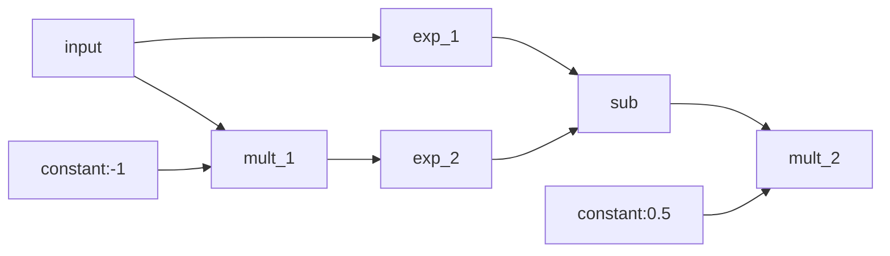

# Erf
## 算子描述
Erf获取一个输入张量（Tensor）并产生一个输出张量（Tensor），其中Erf高斯误差函数对输入张量进行误差计算。
## 输入
- input(必须): 输入张量，默认小于等于4维
## 输出
- output: 输出张量，shape与input保持一致
## 实现方式
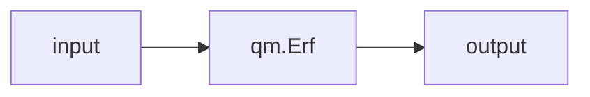

# Softmax
## 算子描述
Softmax获取一个输入张量（Tensor）并产生一个输出张量（Tensor），其中Softmax函数y=e^xi / ∑(e^xj) 按元素应用于张量，xi 表示输入向量中的第 i 个元素。
## 输入
- input(必须): 输入张量，默认小于等于4维
## 输出
- output: 输出张量，shape与input保持一致
## 实现方式
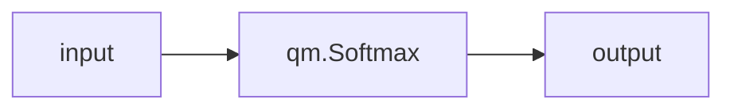

# Tanh
- onnx.Tanh --> qm.Tanh
## 算子描述
Tanh获取一个输入张量（Tensor）并产生一个输出张量（Tensor），其中Tanh(双曲正切)函数y=(e^x - e^-x)/(e^x + e^-x)按元素应用于张量。
## 输入
- input(必须): 输入张量，默认小于等于4维
## 输出
- output: 输出张量，shape与input保持一致
## 实现方式
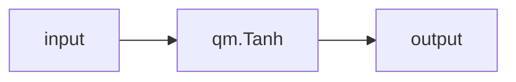

# Softplus
## 算子描述
Softplus获取一个输入张量（Tensor）并产生一个输出张量（Tensor），其中Softplus函数y=log(e^x + 1)按元素应用于张量，通过线性拟合方式近似实现
## 输入
- input(必须): 输入张量，默认小于等于4维
## 输出
- output: 输出张量，shape与input保持一致
## 实现方式
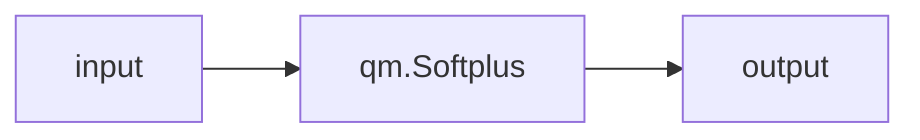

# Cosh
- 组合：Mult + Exp + Add
## 算子描述
Cosh获取一个输入张量（Tensor）并产生一个输出张量（Tensor），其中Cosh(双曲余弦)函数$y=(e^x + e^{-x})/2$按元素应用于张量。
## 输入
- input(必须): 输入张量，默认小于等于4维
## 输出
- output: 输出张量，shape与input保持一致
## 实现方式
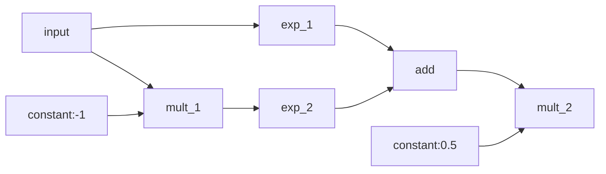
# Celu
- 组合：Mult + Exp + Sub + Add
## 算子描述
Celu获取一个输入张量（Tensor）并产生一个输出张量（Tensor），其中Celu函数`y = max(x, 0) + min(alpha * (exp(x/alpha) - 1), 0)`按元素应用于张量。
## 输入
- input(必须): 输入张量，默认小于等于4维
## 输出
- output: 输出张量，shape与input保持一致
## 实现方式
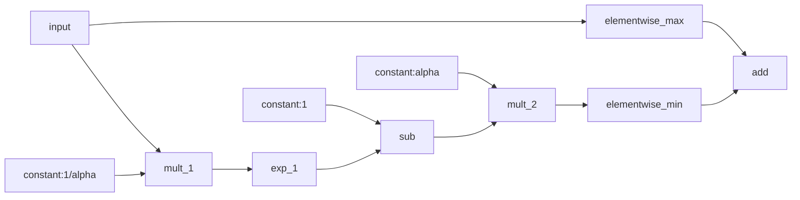


# Elu
- 组合：Mult + Exp + Sub + Add
## 算子描述
Elu获取一个输入张量（Tensor）并产生一个输出张量（Tensor），其中Elu函数`y = max(x, 0) + min(alpha * (exp(x) - 1), 0)`按元素应用于张量。
## 输入
- input(必须): 输入张量，默认小于等于4维
## 输出
- output: 输出张量，shape与input保持一致
## 实现方式
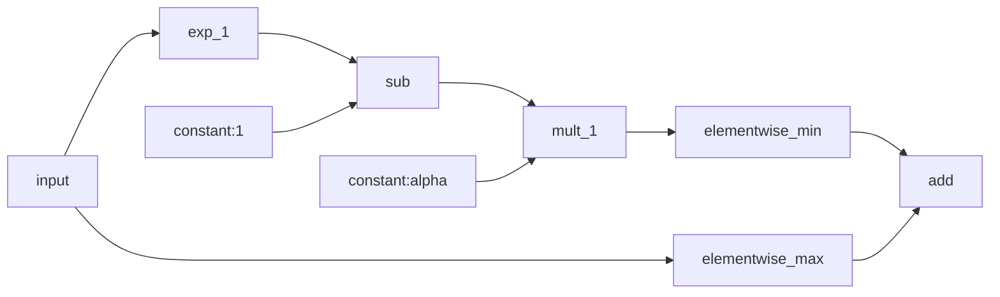

# Selu
- 组合：Mult + Exp + Sub + Add
## 算子描述
Selu获取一个输入张量（Tensor）并产生一个输出张量（Tensor），其中Selu函数`y = gamma * (max(x, 0) + min(alpha * (exp(x) - 1), 0))`按元素应用于张量。
## 输入
- input(必须): 输入张量，默认小于等于4维
## 输出
- output: 输出张量，shape与input保持一致
## 实现方式
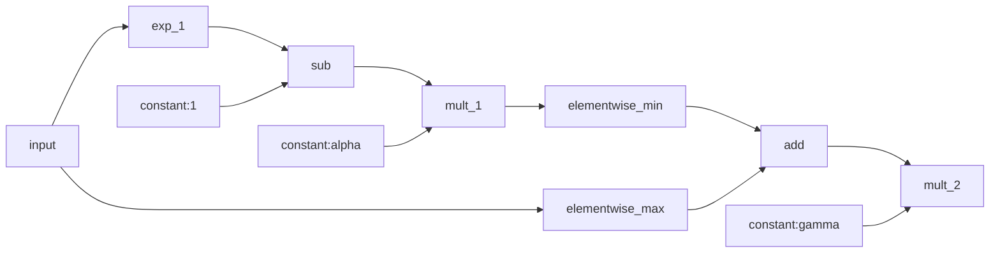

# Relu
## 算子描述
Relu获取一个输入张量（Tensor）并产生一个输出张量（Tensor），其中Relu函数`y = max(x, 0)`按元素应用于张量。
## 输入
- input(必须): 输入张量，默认小于等于4维
## 输出
- output: 输出张量，shape与input保持一致
## 实现方式
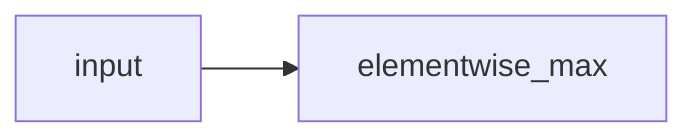
## 是否对shape敏感
- 不敏感

# LeakyRelu
## 转换限制
- 无
## 实现方式
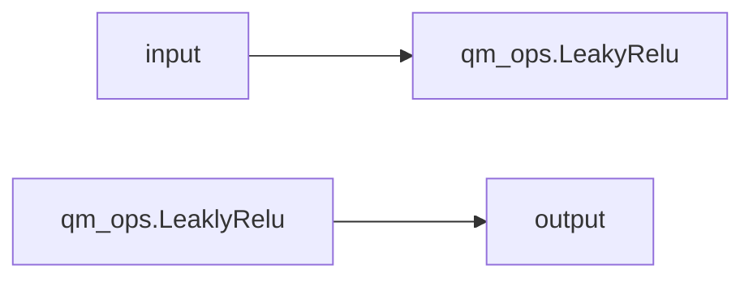

# SpaceToDepth
- 组合： permute + reshape
## 算子描述
-  SpaceToDepth 将空间数据的块重新排列到深度上。更具体地说，这个操作输出一个输入张量的副本，其中来自高度和宽度维度的值被移动到深度维度
## 输入
- input(必须)：输入张量，默认等于4维，N,C,H,W
- blocksize(必须)：类型为INT，表示需要移动到深度上的block大小
## 输出
- output(必须)：输出张量，输出shape为，N,C*blocksize*blocksize, H / blocksize, W / blocksize
## 实现方式
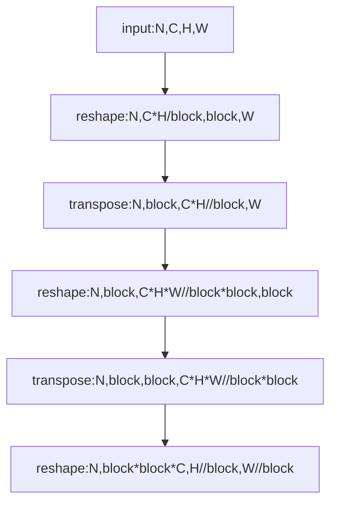
# DepthToSpace
- 组合： permute + reshape
## 算子描述
-  DepthToSpace 算子用于将输入张量的深度（通道数）转化为其空间维度（宽度和高度）。这是通过对深度切片并将其重新分布到宽度和高度来实现的。该操作通常用于CNN中的“像素shuffle”操作
## 输入
- `input`(必须)：输入张量，默认等于4维，N,C,H,W
- `blocksize`(必须)：整数，表示将深度转换为空间维度的块大小。深度的尺寸应该能被 blocksize 的平方整除
- `mode`: 字符串， 默认为`'DCR'`。用于深度-列-行顺序的重新排列。使用`CRD`进行列-行-深度顺序的重新排列
## 输出
- output(必须)：输出张量，输出shape为，`[N, C/(blocksize*blocksize), H*blocksize, W*blocksize]`
## 实现方式
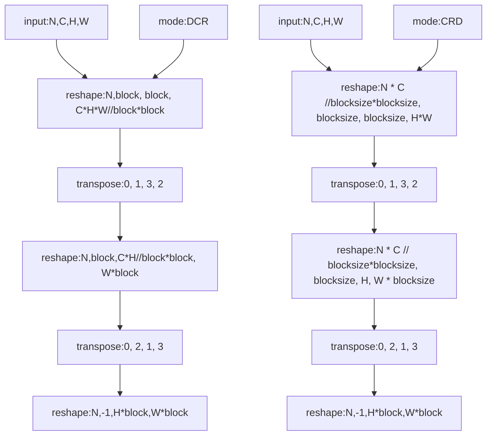
# DynamicQuantLinear
- 组合：min + max + sub + mul + round + div + add
## 算子描述
- DynamicQuantizeLinear 算子用于融合计算, 实现输入数据由FP32-->8bit定点数据的转换，并输出转换比例、零点。输出给定FP32输入的比例、零点和（8bit）量化输入。
## 输入
- `x`（输入张量）：需要进行量化的输入张量。张量的数据类型应为浮点数。
## 输出
- `y`：量化后的输出张量。它的数据类型为8位无符号整数。
- `y_scale`：输出比例。它是一个标量，表示每个张量/层的量化。
- `y_zero_point`：输出零点。它是一个标量，表示每个张量/层的量化。
## 实现方式
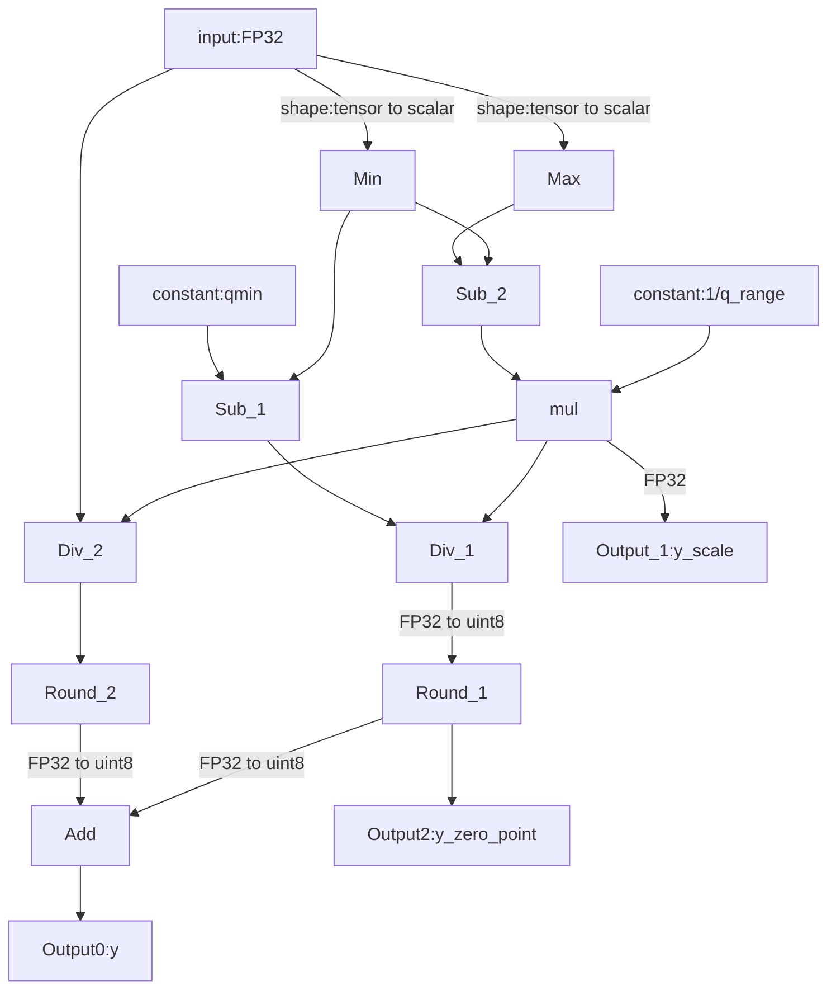
# Slice
- onnx.Slice --> qm.Slice
## 算子描述
- onnx.Slice算子用于沿着多个轴对输入张量进行切片，类似于NumPy的切片和步进功能。Slice算子使用`starts`，`ends`，`axes`和`steps`输入来从其输入`data`张量中选择一个子张量。
## 输入
- `data`（输入张量）：需要提取切片的数据张量。
- `starts`：`axes`中对应轴的起始索引的1-D张量。
- `ends`：`axes`中对应轴的结束索引（不包括）的1-D张量。
- `axes`（可选，默认为None）：`starts`和`ends`应用到的轴的1-D张量。负值意味着从后面计数维度。如果一个轴重复，行为是未定义的。如果在ONNX的`Slice`操作中省略了`axes`参数，那么默认值会设置为`[0, ..., r-1]`，其中`r`等于输入数据的秩（即维度数量）。这意味着如果没有指定`axes`，那么默认会沿着所有的维度进行切片操作。
- `steps`（可选，默认为None）：在`axes`中对应轴的切片步骤的1-D张量。负值意味着向后切片。`steps`不能为0，默认为1。
## 输出
- `y`：切片后得到的张量
## 实现方式
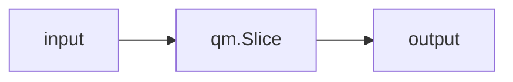
# ReduceMin
- ReduceMin --> min + reshape
## 实现方式
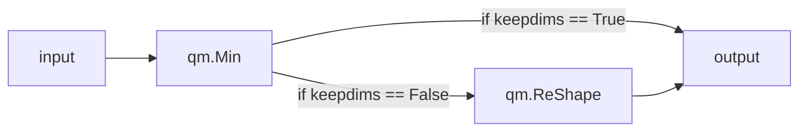
# ReduceL1
- ReduceL1 --> abs + sum + reshape
## 实现方式

# ReduceSumSquare
- ReduceSumSquare --> pow + sum + reshape
## 实现方式
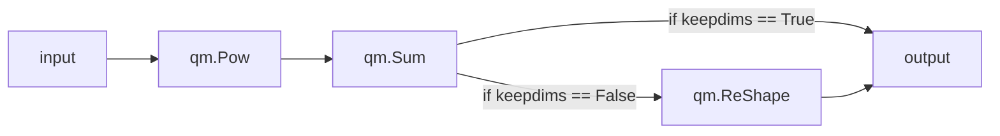
# ReduceMean
- ReduceMean --> sum + elementwise_mult + reshape
## 实现方式
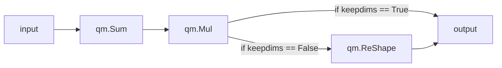
# ReduceSum
- ReduceSum --> permute + reshape + sum
- 支持输入tensor大于等于5维的情况
## 实现方式
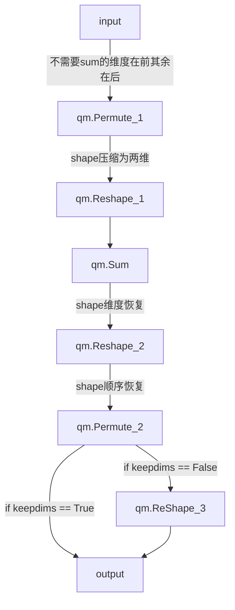
# ReduceMax
- ReduceMax --> max + reshape
## 实现方式
```mermaid
graph LR
    input --> qm.Max
    qm.Max --> |if keepdims == False| qm.ReShape
    qm.Max --> |if keepdims == True| output
    qm.ReShape --> output
```
# Compress
- Compress --> gather
```python
indices = np.where(condition)[0]
```
## 实现方式
```mermaid
graph LR
    input --> |conditions转为indices| qm.Compress
    qm.Compress --> output
```
# Sum
- Sum --> add
## 实现方式
- 假设Sum有三个input
```mermaid
graph TD
    input1 --> qm.Add_1
    input2 --> qm.Add_2
    qm.Add_1 --> qm.Add_2
    qm.Add_2 --> qm.Add_3
    input_3 --> qm.Add_3
    qm.Add_3 --> output 
```
# Resize
## 转换限制
- 只支持“nearest”, "linear"模式
- coordinate_transformation_mode只区分align_corner和非align_corner
- 如果input shape的h,w存在为1的情况，则不支持mode为`nearest`情况下的resize
- 如果resize_scale中h, w维度存在为1的情况，则不支持mode为`nearest`情况下的resize
## 实现方式
- 如果输入tensor的h,w均为1
```mermaid
graph LR
    input --> qm.Tile
    scale --> |scale 视为repeats| qm.Tile
    qm.Tile --> output
```
- 输入tesnor的h,w都不是1
```mermaid
graph LR
    input --> qm.Upsample
    scale --> qm.Upsample
    qm.Upsample --> output
```
- 如果输入tensor的h,w有一个是1
```mermaid
graph LR
    input --> qm.Tile
    scale --> |scale转为repeats| qm.Tile
    qm.Tile --> qm.Upsample
    qm.Upsample --> output
```
# Reshape
## 转换限制
- 当allowzero attribute==1时，onnx.Reshape不支持转换
## 实现方式
```mermaid
graph LR
    input --> |allowzero为0| qm.Reshape
    qm.Reshape --> output
```
# Upsample
## 转换限制
- 当input_shape维度大于4或小于2时，不支持转换
- 当mode为linear时，**精度无法对齐**，暂不支持转换
## 实现方式
```mermaid
graph LR
    input --> qm.Upsample
    qm.Upsample --> output
```

# Not
## 转换限制
- 输入tensor维度小于等于4维
## 实现方式
```mermaid
graph LR
    input --> qm.Not
    qm.Not --> output
```

# Gemm
## 转换限制
- 没有限制，满足onnx.Gemm的全部要求
## 实现方式
```mermaid
graph LR
    input --> qm.Dense
    qm.Dense --> output
```

# ReduceMean
## 转换限制
- 输入tensor维度小于等于4维
## 实现方式
```mermaid
graph LR
    input --> qm.Sum
    qm.Sum --> qm.Mul
    qm.Mul -->|keepdims==False| qm.Reshape
    qm.Reshape --> output
```

# Sigmoid
## 转换限制
- 输入tensor维度小于等于4维
## 实现方式
```mermaid
graph LR
    input --> qm.Sigmoid
    qm.Sigmoid --> output
```

# Erf
## 转换限制
- 输入tensor维度小于等于4维
## 实现方式
```mermaid
graph LR
    input --> qm.Erf
    qm.Erf --> output
```

# Elu
## 转换限制
- 输入tensor维度小于等于4维
## 实现方式
```mermaid
graph LR
    input --> qm.Elu
    qm.Elu --> output
```

# Selu
## 转换限制
- 输入tensor维度小于等于4维
## 实现方式
```mermaid
graph LR
    input --> qm.Selu
    qm.Selu --> output
```

# SoftPlus
## 转换限制
- 输入tensor维度小于等于4维
## 实现方式
```mermaid
graph LR
    input --> qm.SoftPlus
    qm.SoftPlus --> output
```

# BatchNorm
## 转换限制
- 输入tensor维度小于等于4维
## 实现方式
- 获取onnx.BatchNorm的`scale`, `B`, `input_mean`, `input_var`等变量, 计算系数与偏移量
$$ k = \frac{scale}{var+epsilon} $$
$$ b = - k * mean + B $$
```mermaid
graph LR
    input --> qm.BatchNorm2d
    qm.BatchNorm2d --> output
```
