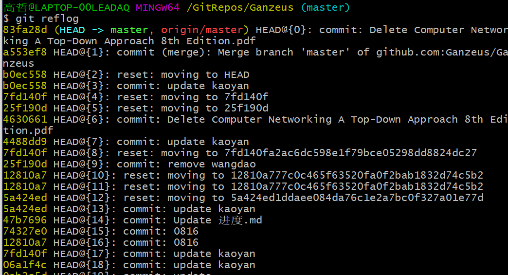

##### 更新到github

1. pull

```
git pull git@github.com:Ganzeus/Ganzeus.git
```

2. add

```
git add .
```

3. 提交

```
git commit -m "备注"
```

4. push

```
git push git@github.com:Ganzeus/Ganzeus.git
```


##### 恢复/回退版本（本地）

1. 查询所有提交

```
git reflog
```



2. 回退

```
git reset --hard 版本号(7位)
```

