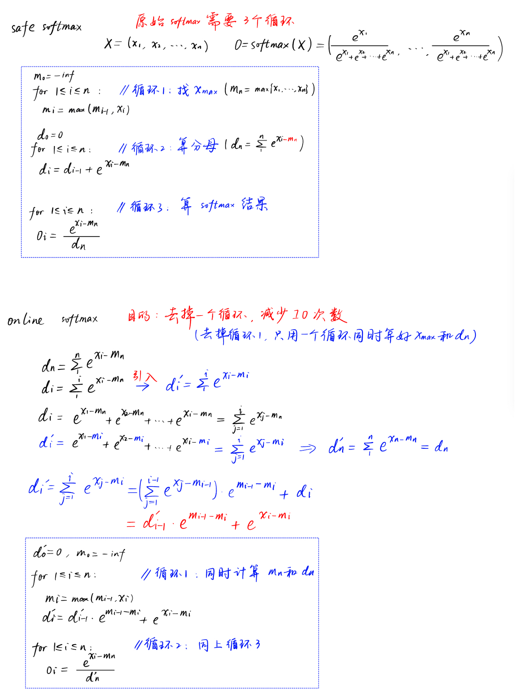

### 为什么Attention很慢

——频繁的IO操作

+ Load/Write时间比matmul还长

+ attention公式：
  $$
  A=QK^T, O = softmax(A)V
  $$
  

### FlashAttention核心思想

#### 一、分块（Tiling）

##### Matmul Tiling

##### Softmax Tiling

+ 把A分成两个小矩阵A1、A2，接着分别对其做softmax，乘上各自的系数最后拼接，保证结果与softmax(A)相同。
+ 乘系数是因为两个小softmax的分母和大softmax不同

#### 二、Recomputation

——即不存放中间结果，在backward时重新计算（重新计算比R/W中间结果更快）

### 手算推导

#### 从Safe Softmax到Online Softmax

#### Flash Attention

