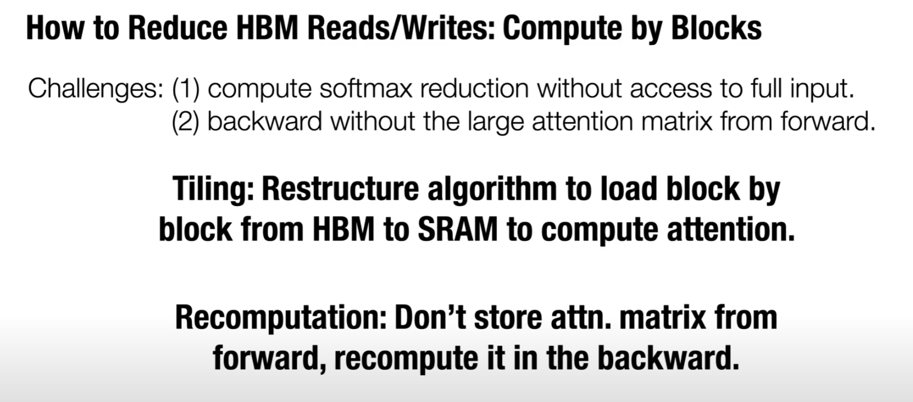

### 概述

+ attention耗时长，大头主要在IO，Read/Write时间比matmul还长

### 优化方法

1. 分块（Tiling）
2. 不存放中间结果，在backward时重新计算（重新计算比R/W中间结果更快）

#### Tiling

+ $A=QK^T, O = softmax(A)V$

+ 图中例子为把A分成两个小矩阵A1、A2，接着分别对其做softmax，乘上各自的系数最后拼接，保证结果与softmax(A)相同。

  （乘系数是因为两个小softmax的分母和大softmax不同）