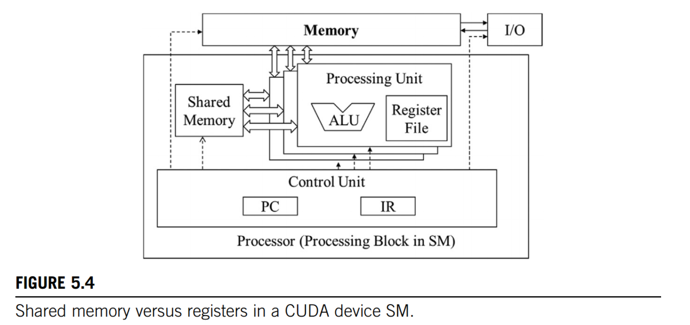
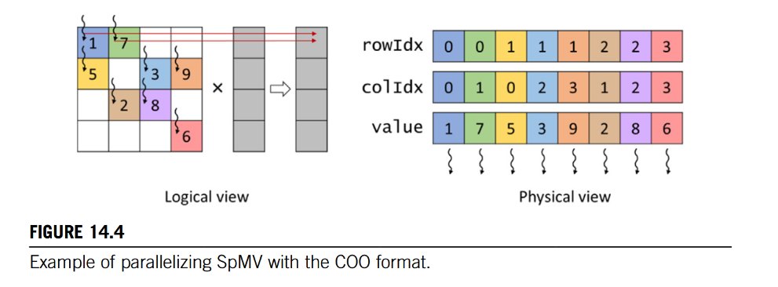

# 封面


# 章节结构


# CUDA 语法


### CUDA API

##### `cudaMalloc()`

+ 在GPU显存上分配对象（数组）
+ 两个参数
  + **Address of a pointer** to the allocated object（指针变量的地址）
  + **Size** of allocated object in terms of bytes （字节数）
+ ==这个函数执行完后，指针变量才会指向分配好的数组（即指针变量的内容是数组首地址）==


##### `cudaFree()`

+ 释放显存空间
+ 一个参数——**Pointer** to freed object（指针变量的值）


##### `cudaMemcpy()`

+ 用于数据传输（复制）
+ 可用于CPU<->CPU、GPU<->GPU、CPU<->GPU之间
+ 四个参数
  + 目的指针
  + 源指针
  + 总字节数
  + 方向：`cudaMemcpyHostToDevice`、`cuaMemcpyDeviceToHost`等（cuda预定义符号常量）


##### `cudaGetDeviceCount()`

+ 查询系统有多少cuda设备(GPU)

+ ```c
  int devCount;
  cudaGetDeviceCount(&devCount);
  ```


##### `cudaGetDeviceProperties()`

+ 查询某一GPU的设备属性

+ ```c
  cudaDeviceProp devProp;		// cuda内置变量（struct类型）
  cudaGetDeviceProperties(&devProp, i);	// i指定GPU下标
  ```

+ `cudaDeviceProp`所包含字段举例：

  + `maxThreadsPerBlock`
  + `multiProcessorCount`: SM数量
  + `clockRate`：时钟频率
  + `maxThreadsDim[0/1/2]`：block某一维度允许的最大线程数
  + `maxGridSize[0/1/2] `：grid某一维度允许的最大block数
  + `regsPerBlock`：每个SM可用的寄存器数量
  + `warpSize`：一个warp包含的thread数（**warp大小由硬件决定**）

### CUDA C keywords

#### 函数声明


+ `__host__`：就是普通的C函数，在CPU上运行，只能被CPU调用。
  ==没有关键字的函数默认为host function==
+ `__device__`:在GPU上运行，只能由GPU调用
+ `__global__`:表示这个函数是cuda 内核函数（kernel function)，在GPU上运行，可以被CPU或GPU调用。
+ 一个函数可以同时用`__host__`和`__device__`两个关键字，这样的函数会自动生成CPU和GPU两个版本。


#### 变量声明


### CUDA 内置变量

##### 配置参数

+ 类型：`dim3`（`vector<int>(x, y, z)`)s
+ 三个成员：x、y、z

##### `gridDim`

+ 在内核中根据配置参数的值进行初始化
+ 用于查看grid各维度有多少block
+ `gridDim.x`范围：$0\sim 2^{31}-1$
+ `gridDim.y`, `gridDim.z`范围：$0\sim 2^{16}-1(65535)$

##### `blockDim`

+ 在内核中根据配置参数的值进行初始化
+ 用于查看block各维度有多少threads
+ `blockDim.x`, `blockDim.y`, `blockDim.z`
+ 范围：一个block最多有1024threads，即`blockDim.x * blockDim.y * blockDim.z <= 1024`

##### `blockIdx`

+ 用于查看当前block是grid中的某一维度的第几个block
+ 由同一block中所有thread共享
+ `blockIdx.x`, `blockIdx.y`, `blockIdx.z`范围：$0\sim gridDim.x/y/z$
  （`gridDim.x/y/z`表示当前维度一共有多少block）

##### `threadIdx`

+ 用于查看当前thread是所在block中的某一维度的第几个thread
+ `threadIdx.x`, `threadIdx.y`, `threadIdx.z`范围：$0\sim blockDim.x/y/z$
  （`blockDim.x/y/z`表示当前维度一共有多少thread）


# 知识点

## Grid, Block and Thread

> When a program’s host code calls a kernel, the CUDA runtime system launches a grid of threads that are organized into a two-level hierarchy. Each grid is organized as an array of thread blocks, which we will refer to as blocks for brevity. All blocks of a grid are of the same size; each block can contain up to 1024 threads on current systems.

+ grid就是一个block数组
+ 一个block最多有1024线程


> For a given grid of threads, the number of threads in a block is available in a built-in variable named `blockDim`.The `blockDim` variable is a struct with three unsigned integer fields (x, y, and z) that help the programmer to organize the threads into a one-, two-, or three-dimensional array. 
>
> For a one-dimensional organization, only the x field is used. For a two-dimensional organization, the x and y fields are used. For a three-dimensional structure, all three x, y, and z fields are used.

+ cuda内置变量`blockDim`有x、y、z三个字段，分别表示各个维度有多少线程
+ block是一维时，只有x字段有用，`blockDim.x`就表示一个block有多少threads
+ 可见block最多分三维


> The NVCC (NVIDIA C compiler)processes a CUDA C program, using the CUDA keywords to separate the host code and device code. The host code is straight ANSI C code, which is compiled with the host’s standard C/C++ compilers and is run as a traditional CPU process. The device code, which is marked with CUDA keywords that designate CUDA kernels and their associated helper functions and data structures, is compiled by NVCC into virtual binary files called PTX files. These PTX files are further compiled by a runtime component of NVCC into the real object files and executed on a CUDA-capable GPU device.

+ cuda代码被NVCC编译成ptx文件，接着被编译成object文件在cudaGPU上运行


> When calling a kernel, the program needs to specify the size of the grid and the blocks in each dimension. These are specified by using the execution configuration parameters (within<<<...>>>) of the kernel call statement. The first execution configuration parameter specifies the dimensions of the grid in number of blocks. The second specifies the dimensions of each block in number of threads. Each such parameter has the type dim3, which is an integer vector type of three elements x, y, and z. These three elements specify the sizes of the three dimensions. The programmer can use fewer than three dimensions by setting the size of the unused dimensions to 1.

+ <<<...>>>之间的参数称为配置参数（configuration parameters），传入两个参数：

  + 需要多少block

  + 每个block有多少threads

+ 每个参数的类型都是`dim3`, 有三个整型成员x, y, z, 指定每个维度有多少block/threads。

  + 1表示当前维度未使用
  + 使用一维配置参数时，也可以直接用整数替代，不需要用dim3类型的参数（==因为y、z默认初始化为1==）
  + `vecAddKernel<<<32, 128>>>(...)`

例子：

```c++
dim3 dimGrid(32, 1, 1);
dim3 dimBlock(128, 1, 1);
vecAddKernel<<<dimGrid, dimBlock>>>(...)
```

+ 每个向量划分成32个一维block，每个block有128 threads


### Tile

> The term tile draws on the analogy that a large wall(i. e., the global memory data) can be covered by small tiles(i. e., subsets that can each fit into the shared memory).

+ tile就是将block进一步划分，分成更小的块（Block=一整面墙，tile=一块瓷砖）
+ 出发点：通过 ==共享内存==进行计算实现加速，但共享内存很小，不能存放整个thread甚至block，因此要进一步分成更小的块


## GPU架构

#### SM（流多处理器Streaming Multiprocessor)


+ 一个SM（Streaming Multiprocessor）可以分配多个Block


#### Warps

 

+ 1 warp = 32 threads
+ 如果thread是二/三维排列，那么flatten成一维后，每32个thread属于一个warp
+ **一个warp中的所有线程同时执行某一条指令**，称为'single instruction, multiple-thread'
  即warp是取指执行的最小单位

 

+ ==对于Pascal架构GPU：==一个warp中的线程不能同时执行多种指令。例如在if语句中，同一时刻只能执行一个分支
+ 从Volta架构开始，一个warp中的线程可以同时执行多个分支


#### CUDA 内存结构

##### Overview


##### CPU vs GPU 寄存器架构

> ​	When CPUs context switch between different threads, they save the registers of the outgoing thread to memory and restore the registers of the incoming thread from memory. In contrast, GPUs achieve zero-overhead scheduling by keeping the registers of all the threads that are scheduled on the processing block in the processing block’s register file. This way, switching between warps of threads is instantaneous because the registers of the incoming threads are already in the register file. Consequently, GPU register files need to be substantially larger than CPU register files.
>
> ​	当 CPU 在不同线程之间进行上下文切换时，它们会将退出线程的寄存器保存到内存中，并从内存中恢复进入线程的寄存器。与此相反，GPU 将当前块上调度的所有线程的寄存器保存在块的寄存器文件中，实现零开销调度。通过这种方式，线程之间的切换是瞬时的，因为进入线程的寄存器已经在寄存器文件中。因此，GPU 寄存器文件需要比 CPU 寄存器文件大得多。
>
> ​	GPUs support dynamic resource partitioning where an SM may provision few registers per thread and execute a large number of threads, or it my provision more registers per thread and execute fewer threads. For this reason, GPU register files need to be designed to support such dynamic partitioning of registers. In contrast, the CPU register architecture dedicates a fixed set of registers per thread regardless of the thread’s actual demand for registers.
>
> ​	GPU 支持动态资源分区，SM 可以为每个线程提供很少的寄存器并执行大量的线程，也可以为每个线程提供较多的寄存器并执行较少的线程。因此，GPU 寄存器文件的设计需要支持这种寄存器动态分区。相比之下，CPU 的寄存器架构会为每个线程分配一组固定的寄存器，而不管线程对寄存器的实际需求如何。


+ GPU切换线程为零开销，CPU开销很大（内存调度）
+ GPU线程上下文保存在寄存器文件中，CPU线程上下文保存在内存中，因此GPU寄存器比CPU大得多
+ GPU支持为线程动态分配寄存器，CPU只能固定分配


##### 共享内存vs寄存器



+ 共享寄存器可以被所有线程访问，旨在不同线程之间的高效数据共享
+ 寄存器是线程私有的
+ 共享内存只能被一个block内的所有线程共享，但不能被多个block共享


## Performance Considerations


## 稀疏矩阵运算

稀疏矩阵运算核心就是将矩阵换了一个数据结构来存储，并没有什么特别高端的算法，**唯一要修改的就是读写内存的方式**，计算依然是普通的矩阵运算。

出发点就是**注意到**矩阵很稀疏，所以要换一个节省空间的存储方式，而不是将矩阵修改为稀疏矩阵（学习之前的误解）。

书里例举了四种稀疏矩阵存储方式，和对应的矩阵与向量相乘的kernel，但并没有构造稀疏矩阵的代码，所有的kernel都是默认矩阵已经按所例举的方式存好了。

### COO format



+ 就是直接存放下标+元素值
+ 下标不是用元组存放（当然C++没有元组），而是直接用两个数组，分别存行和列


优点：

1. 方便增删元素
2. 可以用任何顺序遍历
3. no control divergence(所有线程负责的元素数量相同，同时开始和结束，除了边界线程)
4. 对内存的访问是**聚合的**（==即相邻线程访问的元素在内存中也是相邻的==）

缺点：

1. 不能按行/列遍历，因为元素是无序的
2. 需要原子操作，因为相邻线程可能会对同一个元素进行写入修改


### CSR format


+ rowPtrs数组元素个数为矩阵行数
+ 存放每行第一个元素在ColIdx数组中的位置


优点：

1. 可以按行遍历（第i行的元素范围是`rowPtrs[i]~rowPtrs[i+1]`
2. 比COO更节省空间

缺点：

1. 不方便增删元素（元素是严格按行顺序存储的）
2. 有control divergence（每行的元素数量不固定，意味着不同线程会处理不同数量的元素）
3. 内存访问不是聚合的（相邻线程访问的元素存在间隔）


### ELL format


+ ELL就是在CSR基础上，将colIdx和value数组填充并转换成矩阵，列数为最长那一行的元素个数
+ ==实际上就是在原矩阵上删掉几列，直到某一行没有0元素为止==
+ 最后将转换后的矩阵按列优先展开成一维数组
+ 转换后矩阵元素的列下标回合原矩阵有区别，**因此要设置colIdx数组保存元素在原矩阵中的列坐标**
+ 相邻元素不在同一行，按照第一行、第二行、第三行...顺序依次循环


优点：

1. 可以按行遍历（每行元素间隔为行数，只需以行数为步长跳跃即可），但不能按行遍历
2. 可以算出任意元素的行列下标
3. 对内存访问是聚合的——相邻线程访问相邻元素。（因为相邻元素在在不同行，而每个线程负责一个行）
4. 增加元素比CSR方便，只需要与填充元素替换即可（但不能在最长的那一行添加）


缺点：

1. 节省空间不够，因为需要填充元素，并且如果有某一行元素特别多，那么填充元素就会非常浪费
2. control divergence（每行的元素个数不一定相同）


### ELL-COO format

+ 即ELL+COO两种存储方式混合
+ 防止由于某行元素过多导致的填充浪费


+ 将元素多的若干行中的多余元素用COO表示


优点：

1. 比ELL节省空间
2. 添加元素很方便，因为可以直接在COO部分添加
3. 对内存访问是聚合的（因为ELL和COO都是聚合的）

缺点：

1. 无法按行/列遍历，因为元素多的若干行的部分元素在COO中


### JDS format


+ 就是不填充元素的ELL，只不过要先对行的长度进行排序
+ 由于行顺序乱了，因此需要一个row数组保存行下标顺序
+ 由于每列的元素个数不同，因此还需要一个iterPtr数组保存colIdx每列的元素个数，用于指明每层循环的起始位置


优点：

1. 比ELL节省空间，因为不需要填充元素

缺点：

1. 添加元素非常不方便，因为要对行重新排序


## 卷积神经网络

### Inference(Forward)


#### C语言实现

```C++
void convLayer_forward(int Cout, int Cin, int H, int W, int K, float* X, float* F, float* Y){
    // 输入为X[Cin, H, W]
    // 一个filter size为[Cin, K, K], 共有Cout层filter -> F[Cout, Cin, K, K]
    // 输出feature map为Y[Cout, H-K+1, W-K+1](无padding)
    int H_out = H - K + 1;
    int W_out = W - K + 1;
    for(int c = 0; c < Cout; c++) 			// 每次计算一层输出feature map
        for(int h = 0; h < H_out; h++)			
            for(int w = 0; w < W_out; w++) {	// 对于feature map的每个元素
                Y[c, h, w] = 0;					// 初始化
                for(int i = 0; i < Cin; i++)	// filter的每个channel对应输入的每个channel
                    for(int j = 0; j < K; j++)
                        for(int k = 0; k < K; k++)	// 与filter的每个元素相乘
                            Y[c, h, w] += X[i, h+j, w+k] * F[c, i, j, k];	// 累加
            }
}
```


### Backward


#### 矩阵乘法求导

$Y = WX \rarr \frac{\partial{Y}}{\partial{X}} = W^T, \frac{\partial{Y}}{\partial{W}} = X^T$

推导:


### Im2col

#### 原理


+ 把卷积核摊开成$(Cout, Cin*K*K)$
+ 把Input变为$(Cin*K*K, H_{out}*W_{out})$——**核心**
+ Input元素会增多，由原来的$(Cin, H, W)\rarr(Cin*K*K, H-K+1, W-K+1)$(stride=1)，
  **当H、W特别大时, 近似于元素增加了K*K倍**($H-K+1 \approx H$)


#### C语言实现

```C++
void unroll(int C, int H, int W, int K, float* X, float* X_unroll) {	// 计算X_unroll
    int H_out = H-K+1;
    int W_out = W-K+1;
    for(int c = 0; c < C; c++){		// 对于每个channel——即每次循环计算（k*k, H_out*W_out)这一部分
        int col_idx = 0;
        for(int h = 0; h < H_out; h++)
            for(int w = 0; w < W_out; w++){		// 每列起始坐标
                // 将X(h, w)开始的K*K个元素存入X_unroll
                for(int i = 0; i < K; i++)
                    for(int j = 0; j < K; j++){
                        int row_idx = i*K+j + c*K*K; // (当前部分的第几行+当前部分的起始行)
                        X_unroll[row_idx][col_idx] = X[c][h+i][w+j]
                    }
                col_idx++;		//进入下一列
            }
    }
}
```


#### Python实现

```python
def unroll(K, X):
    C, H, W = X.shape
    H_out, W_out = H-K+1, W-K+1
    X_unroll = torch.zeros(C*K*K, H_out*W_out)
    for c in range(C):      # 对于每个channel——每次计算（k*k, H_out*W_out)这一部分
        col_idx = 0
        for h in range(H_out):
            for w in range(W_out):      # 每列起始坐标(h, w)
                # 将X(h, w)开始的K*K个元素存入X_unroll
                for i in range(K):
                    for j in range(K):
                        row_idx = i*K+j + c*K*K         # 当前部分的第几行+当前部分的起始行
                        X_unroll[row_idx][col_idx] = X[c][h+i][w+j]
                col_idx += 1            # 进入X_unroll的下一列

    return X_unroll
```


# Kernel Example

#### Vector Addition

```c++
// compute vector sum C = A + B
// each thread peforms one pair-wise addition
__global__ void vecAddKernel(float *A, float *B, float *C, int n) {
  int i = threadIdx.x + blockDim.x * blockIdx.x;
  if (i < n) {
    C[i] = A[i] + B[i];
  }
}

void vecAdd(float *A, float *B, float *C, int n) {
  float *A_d, *B_d, *C_d;
  size_t size = n * sizeof(float);

  cudaMalloc((void **)&A_d, size);
  cudaMalloc((void **)&B_d, size);
  cudaMalloc((void **)&C_d, size);

  cudaMemcpy(A_d, A, size, cudaMemcpyHostToDevice);
  cudaMemcpy(B_d, B, size, cudaMemcpyHostToDevice);

  const unsigned int numThreads = 256;
  unsigned int numBlocks = cdiv(n, numThreads);

  vecAddKernel<<<numBlocks, numThreads>>>(A_d, B_d, C_d, n);
  gpuErrchk(cudaPeekAtLastError());
  gpuErrchk(cudaDeviceSynchronize());

  cudaMemcpy(C, C_d, size, cudaMemcpyDeviceToHost);

  cudaFree(A_d);
  cudaFree(B_d);
  cudaFree(C_d);
} 
```


#### Image Blur

```c++
__global__
void mean_filter_kernel(unsigned char* output, unsigned char* input, int width, int height, int radius) {
    int col = blockIdx.x * blockDim.x + threadIdx.x;
    int row = blockIdx.y * blockDim.y + threadIdx.y;
    int channel = threadIdx.z;

    int baseOffset = channel * height * width;
    if (col < width && row < height) {

        int pixVal = 0;
        int pixels = 0;

        for (int blurRow=-radius; blurRow <= radius; blurRow += 1) {
            for (int blurCol=-radius; blurCol <= radius; blurCol += 1) {
                int curRow = row + blurRow;
                int curCol = col + blurCol;
                if (curRow >= 0 && curRow < height && curCol >=0 && curCol < width) {
                    pixVal += input[baseOffset + curRow * width + curCol];
                    pixels += 1;
                }
            }
        }

        output[baseOffset + row * width + col] = (unsigned char)(pixVal / pixels);
    }
}


// helper function for ceiling unsigned integer division
inline unsigned int cdiv(unsigned int a, unsigned int b) {
  return (a + b - 1) / b;
}


torch::Tensor mean_filter(torch::Tensor image, int radius) {
    assert(image.device().type() == torch::kCUDA);
    assert(image.dtype() == torch::kByte);
    assert(radius > 0);

    const auto channels = image.size(0);
    const auto height = image.size(1);
    const auto width = image.size(2);

    auto result = torch::empty_like(image);

    dim3 threads_per_block(16, 16, channels);
    dim3 number_of_blocks(
        cdiv(width, threads_per_block.x),
        cdiv(height, threads_per_block.y)
    );

    mean_filter_kernel<<<number_of_blocks, threads_per_block, 0, torch::cuda::getCurrentCUDAStream()>>>(
        result.data_ptr<unsigned char>(),
        image.data_ptr<unsigned char>(),
        width,
        height,
        radius
    );

    // check CUDA error status (calls cudaGetLastError())
    C10_CUDA_KERNEL_LAUNCH_CHECK();

    return result;
}
```
