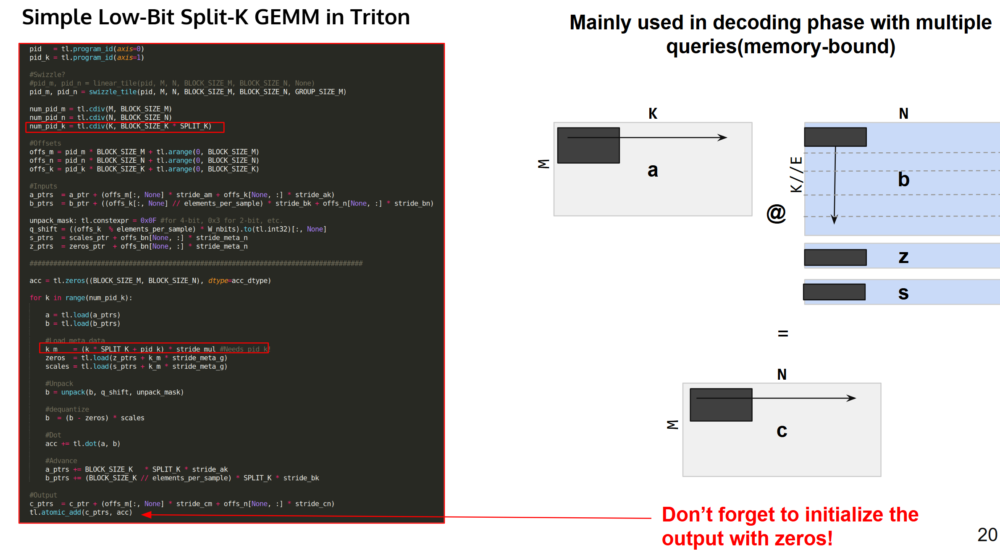

## Lecture1 Profiling and Integrating CUDA kernels in PyTorch

### 三种Profile方法

> 为什么不能用time模块测量执行时间？
> 答：在 CUDA 中，GPU 的计算和CPU的计算可以同时进行，因此它们是异步的。而使用 time 模块来测量 CUDA 函数的执行时间并不准确，因为它无法考虑到 GPU 计算的异步性。

#### cuda.Event测量执行时间

```python
def time_pytorch_function(func, input):
    # CUDA IS ASYNC so can't use python time module
    start = torch.cuda.Event(enable_timing=True)
    end = torch.cuda.Event(enable_timing=True)

    # Warmup
    for _ in range(5):	# 5次预热迭代，以确保GPU处于稳定状态。
        func(input)

    start.record()
    func(input)
    end.record()
    torch.cuda.synchronize()    # 同步（即等待）GPU上的所有CUDA操作完成
    return start.elapsed_time(end)
```


#### autograd.profiler

```python
with torch.autograd.profiler.profile(use_cuda=True) as prof:
    torch.square(b)

print(prof.key_averages().table(sort_by="cuda_time_total", row_limit=10))
```


#### PyTorch profiler

> visual profiler

##### 默认版

```python
# Default way to use profiler
with profile(activities=[ProfilerActivity.CPU, ProfilerActivity.CUDA]) as prof:
    for _ in range(10):
        a = torch.square(torch.randn(10000, 10000).cuda())
prof.export_chrome_trace("trace.json")
```


##### 详细版

```python
def trace_handler(prof):
    print(prof.key_averages().table(
        sort_by="self_cuda_time_total", row_limit=-1))
    prof.export_chrome_trace("/tmp/test_trace_" + str(prof.step_num) + ".json")

with torch.profiler.profile(
    activities=[
        torch.profiler.ProfilerActivity.CPU,
        torch.profiler.ProfilerActivity.CUDA,
    ],

    # In this example with wait=1, warmup=1, active=2, repeat=1,
    # profiler will skip the first step/iteration,
    # start warming up on the second, record
    # the third and the forth iterations,
    # after which the trace will become available
    # and on_trace_ready (when set) is called;
    # the cycle repeats starting with the next step

    schedule=torch.profiler.schedule(
        wait=1,
        warmup=1,
        active=2,
        repeat=1),
    # on_trace_ready=trace_handler
    on_trace_ready=torch.profiler.tensorboard_trace_handler('./log')
    # used when outputting for tensorboard
    ) as p:
        for iter in range(10):
            torch.square(torch.randn(10000, 10000).cuda())
            # send a signal to the profiler that the next iteration has started
            p.step()
```

​	`torch.profiler.profile`中的参数：

+ `activities` 参数指定了要分析的活动，包括 CPU 和 CUDA 操作
+ `schedule` 参数定义了分析器的执行计划，包括等待时间、预热次数、活动次数和重复次数
+ `on_trace_ready` 参数指定了当分析器准备好输出跟踪数据时要执行的操作。在这里，你将跟踪数据输出到 TensorBoard 日志文件


### 在PyTorch中运行cuda等其他语言代码

#### load_inline

+ `from torch.utils.cpp_extension import load_inline`
+ 可以将其他语言的源码在PyTorch中运行

```python
# Define the CUDA kernel and C++ wrapper
cuda_source = '''
__global__ void square_matrix_kernel(const float* matrix, float* result, int width, int height) {
    int row = blockIdx.y * blockDim.y + threadIdx.y;
    int col = blockIdx.x * blockDim.x + threadIdx.x;

    if (row < height && col < width) {
        int idx = row * width + col;
        result[idx] = matrix[idx] * matrix[idx];
    }
}

torch::Tensor square_matrix(torch::Tensor matrix) {
    const auto height = matrix.size(0);
    const auto width = matrix.size(1);

    auto result = torch::empty_like(matrix);

    dim3 threads_per_block(16, 16);
    dim3 number_of_blocks((width + threads_per_block.x - 1) / threads_per_block.x,
                          (height + threads_per_block.y - 1) / threads_per_block.y);

    square_matrix_kernel<<<number_of_blocks, threads_per_block>>>(
        matrix.data_ptr<float>(), result.data_ptr<float>(), width, height);

    return result;
    }
'''

cpp_source = "torch::Tensor square_matrix(torch::Tensor matrix);"

# Load the CUDA kernel as a PyTorch extension
square_matrix_extension = load_inline(
    name='square_matrix_extension',
    cpp_sources=cpp_source,
    cuda_sources=cuda_source,
    functions=['square_matrix'],
    with_cuda=True,
    extra_cuda_cflags=["-O2"],
    build_directory='./load_inline_cuda',
    # extra_cuda_cflags=['--expt-relaxed-constexpr']
)

a = torch.tensor([[1., 2., 3.], [4., 5., 6.]], device='cuda')
print(square_matrix_extension.square_matrix(a))
```


## Lecture 3+5 Getting started with CUDA + Going Further with CUDA

1. 为什么cuda不直接细分成threads，而是要先分成block再分threads?
   答：A thread block is a group of threads that can cooperate among themselves through ==shared memory==and synchronization. ==All threads in a block are executed on the same SM==. This means they can share resources such as shared memory and can synchronize their execution with each other.
2. ==cuda代码就是c/c++==


## Lecture 14 Practitioners Guide to Triton

> 详见jupypter notebook

##### 并行编程要点

并行编程只需要考虑两部分：

1. 如何划分块
2. 每一块进行的操作都是一模一样的，只需要编写每一块执行的操作即可。
   块内操作可以看成是顺序编程，唯一区别就是块内去要利用mask进行边界处理。


##### Tiled matmul 与共享内存

+ tile就是将block进一步划分，分成更小的块（Block=一整面墙，tile=一块瓷砖）
+ 出发点：通过共享内存进行计算实现加速，但共享内存很小，不能存放整个thread甚至block，因此要进一步分成更小的块
+ ==GPU中的共享内存相当于CPU中的cache==

## Lecture 11 Sparsity

### Lottery Ticket Hypothesis

+ 网络在训练之前prune掉90%~95%的节点，训练后精度依然能接近全节点网络，甚至精度更高。

步骤：

1. 随机初始化全网络
2. 简单训练几轮
3. prune掉一部分不重要的节点
4. 将剩下的节点之间的权重回到初始化的值
5. 返回第二步进行下一轮剪枝，直到仅剩下10%左右的节点


### Difference between inference and training

#### Training 

+ Only compute benefit, slight memory penalty(9/8)
  + 在训练过程中，主要的好处在于计算方面，这意味着操作被优化得更快。
  + 内存使用略有增加，大约是9/8。这可能是因为需要存储额外的信息或中间结果。
+ Sparsification happens at runtime
  + 将矩阵变为稀疏矩阵（减少非零元素的数量）的过程是在运行时进行的。
+ need both W and W^T
  + 训练过程中需要同时使用权重矩阵 \( W \) 及其转置 \( W^T \)。
+ Needs contiguous output for distributed collective
  + 输出需要是连续的，以便进行分布式集合操作（例如在多设备或多节点上进行计算时）。

#### Inference

+ Compute + memory speedup
  + 在推理过程中，计算和内存的使用都会得到提升，即计算速度更快，内存使用更少。
+ Sparsification happens offline
  + 稀疏化过程是在离线完成的，即在推理之前完成，而不是在运行时进行。
+ Just W is sufficient
  + 推理阶段只需要权重矩阵 \( W \)，不需要 \( W^T \)。
+ Can return a view and torch.compile away subsequent transposition
  + 可以返回一个矩阵的视图，并使用 `torch.compile` 优化后续可能需要的转置操作，从而进一步提升性能。


## Lecture 34: Low bit triton kernel


#### Challenges

+ **Multiple kernels are needed:**
  + a kernel for large prefills(GEMM)
  + a kernel for batched-decoding / short prefills(GEMM Split-K)
  + a kernel for fast single user decoding(GEMV)——GEMV表示矩阵与vector相乘
+ **Same bitpacking across all kernels:**
  + GEMV的bitpacking逻辑并不一定适用与GEMM以及GEMM Split-K
  + need a flexible bitpacking logic
+ **Same kernel - multiple dtypes:**
  + We need to handle different input dtypes:
    + Activations can be FP16, INT8 or FP8
    + The weights can be packed 

 




+ Split-K指在K维也分块并行化(而不是在一个kernel中用for循环), 适用于K维很大, 单个kernel内部存不下的情况

区别：

1. K维的block个数(num_pid_k)从`cdiv(K, BLOCKSIZE_K)`变为'cdiv(K, BLOCKSIZE_K * Split_K)'
   split_K = 1 时，等同于GEMM
2. **写入结果时必须用`tl.atomic_add`而不是`tl.store`**

**load weight scale的两种情况：**

+ per-group quantization: scale和zero point需要在GEMM loop中load
+ per-channel quantization: scale 需要在GEMM loop结束后load


## Lecture 50: CUDA, Triton, Flash Attention: a learning journey

> AI总结：
>
> AI Summary: Abstract: This talk chronicles a personal journey of learning GPU programming, specifically focusing on CUDA, Triton, and the Flash Attention algorithm. The speaker, Omar, emphasizes a practical, goal-oriented approach to learning, driven by the desire to understand and implement complex deep learning concepts. He challenges the traditional "teach a man to fish" adage, advocating instead for teaching the skill of learning itself, particularly in rapidly evolving technological fields. Key strategies discussed include setting concrete, measurable objectives (like understanding a specific tutorial), leveraging Large Language Models (LLMs) for guidance and overcoming knowledge gaps, iterative learning between different resources, and emphasizing hands-on coding and debugging. The talk also stresses the importance of building confidence through tackling increasingly challenging tasks, ignoring distractions and hype, and maintaining long-term commitment for mastery. The "secret ingredient" is identified as the learner's own belief in their ability to learn and grow. The Q&A session addresses various topics, including career advice, the role of AI tools, the necessity of low-level skills, open-source contribution, and the 10,000-hour rule.   Omar's Journey: Learning CUDA, Triton, and Flash Attention *   *[0:00:00](https://www.youtube.com/watch?v=4O-t7SwArkI) Introduction:* This is the 50th DPU Mode lecture, and the speaker, Mark, welcomes Omar, a special guest, to discuss his journey learning CUDA, Triton, and Flash Attention. *   *[0:01:33](https://www.youtube.com/watch?v=4O-t7SwArkI&t=93s) Omar's Background:* Omar started his performance work in 2022 and shares his learning journey, emphasizing practical problem-solving. *   *[0:02:14](https://www.youtube.com/watch?v=4O-t7SwArkI&t=134s) Overview:* Omar outlines the talk's focus: not teaching CUDA, Triton, and Flash Attention directly (as he has a 7.5-hour video on that), but exploring his learning process. *   *[0:02:40](https://www.youtube.com/watch?v=4O-t7SwArkI&t=160s) Machine Learning Start:* Omar's machine learning journey began in late 2022 with an image captioning project and experimenting with Stable Diffusion. *   *[0:03:32](https://www.youtube.com/watch?v=4O-t7SwArkI&t=212s) Commitment:* He quit his job to fully master Stable Diffusion, demonstrating a "monk mode" approach to learning. *   *[0:04:30](https://www.youtube.com/watch?v=4O-t7SwArkI&t=270s) Ancient Wisdom Challenged:* Traditional wisdom ("teach a man to fish") is updated to "teach a man to learn new skills." *   *[0:06:29](https://www.youtube.com/watch?v=4O-t7SwArkI&t=389s) Technology Introduction:* High-level overview of Flash Attention (optimized attention mechanism), CUDA (Nvidia's software stack for GPU programming), and Triton (OpenAI's project for writing GPU kernels in Python). *   *[0:08:09](https://www.youtube.com/watch?v=4O-t7SwArkI&t=489s) GPU Memory Hierarchy:* Explanation of GPU memory (DRAM/HBM vs. SRAM) and its impact on performance. Kernel fusion is introduced as a technique to minimize data transfers. *   *[0:12:27](https://www.youtube.com/watch?v=4O-t7SwArkI&t=747s) Learning Approach:* Key advice: before starting, ask "why" you want to learn something. Avoid learning based on hype. Focus on solving practical problems. * *[0:13:55](https://www.youtube.com/watch?v=4O-t7SwArkI&t=835s) Using LLMs:* Recommends using LLMs (like ChatGPT or Grok) for guidance and overcoming learning obstacles. Roadmaps are unnecessary; prompt LLMs to build personalized learning paths. *  *[0:17:12](https://www.youtube.com/watch?v=4O-t7SwArkI&t=1032s) Hands-On Learning:* Do the triton tutorials; run the code and debug it, run it with The Interpreter, and learn by doing. *   *[0:18:02](https://www.youtube.com/watch?v=4O-t7SwArkI&t=1082s) Goal Setting:* Set specific, measurable learning goals. Omar's goal was understanding the "fused attention" tutorial on the Triton website. *   *[0:20:30](https://www.youtube.com/watch?v=4O-t7SwArkI&t=1230s) Learning Strategy:* Avoid being influenced by others' tutorials initially. Challenge yourself. Define the "rules" of your learning challenge. *   *[0:22:08](https://www.youtube.com/watch?v=4O-t7SwArkI&t=1328s) Practical Steps:* Started with the "vector addition" tutorial on the Triton website. Encountered concepts like pointers, block size, and thread IDs. *   *[0:23:13](https://www.youtube.com/watch?v=4O-t7SwArkI&t=1393s) Overcoming Obstacles:* When blocked, use the debugger or prompt LLMs to identify missing knowledge. *   *[0:24:18](https://www.youtube.com/watch?v=4O-t7SwArkI&t=1458s) Targeted Learning:* When seeking external resources (like the "Programming Massively Parallel Processors" book), learn only what's relevant to the immediate task. * *[0:26:48](https://www.youtube.com/watch?v=4O-t7SwArkI&t=1608s): Final Boss:* Finish the tutorials, then move on to the "final boss" - flash attention. *   *[0:27:04](https://www.youtube.com/watch?v=4O-t7SwArkI&t=1624s) Paper Reading Strategy:* Read papers top-to-bottom, even if understanding is low. Annotate unclear concepts. Highlight after reading. *   *[0:30:13](https://www.youtube.com/watch?v=4O-t7SwArkI&t=1813s) Learning Roadmap:* Built a roadmap by identifying knowledge gaps in the Flash Attention paper (softmax, online softmax, GPU programming, backpropagation). *   *[0:31:28](https://www.youtube.com/watch?v=4O-t7SwArkI&t=1888s) Tackling Concepts:* Addressed each concept systematically. For online softmax, studied relevant papers, coded the algorithm, and worked through proofs. *   *[0:36:09](https://www.youtube.com/watch?v=4O-t7SwArkI&t=2169s) Iterative Learning:* Go back and forth between different resources (e.g., the Flash Attention paper and the online softmax paper) to reinforce understanding. *   *[0:37:28](https://www.youtube.com/watch?v=4O-t7SwArkI&t=2248s) Combining Code and Theory:* Alternate between reading the paper and examining the code for new architectures. *   *[0:38:17](https://www.youtube.com/watch?v=4O-t7SwArkI&t=2297s) Block Matrix Multiplication:* Learned about block matrix multiplication, crucial for understanding Flash Attention's block-by-block computation. *   *[0:39:58](https://www.youtube.com/watch?v=4O-t7SwArkI&t=2398s) Tensor Shapes and Strides:* Understanding tensor shapes and strides is essential for GPU programming, as GPUs work with memory pointers. *   *[0:44:04](https://www.youtube.com/watch?v=4O-t7SwArkI&t=2644s) Backpropagation:* The most challenging part, requiring understanding of gradients and chain rule. * *[0:48:51](https://www.youtube.com/watch?v=4O-t7SwArkI&t=2931s): Long-Term Goals:* Having measurable and comparable long-term goals are important. * *[0:49:19](https://www.youtube.com/watch?v=4O-t7SwArkI&t=2959s): Next Steps:* Stay consistent, follow practical curiosity, ignore the hype, and commit long-term for mastery. * *[0:49:47](https://www.youtube.com/watch?v=4O-t7SwArkI&t=2987s) Following Curiosity:* Focus on consistency and practical problems. *   *[0:52:08](https://www.youtube.com/watch?v=4O-t7SwArkI&t=3128s) Accelerated Learning:* Modern tools (LLMs) significantly accelerate learning. Prompting replaces time-consuming searches. *   *[0:53:54](https://www.youtube.com/watch?v=4O-t7SwArkI&t=3234s) Dual Stream Learning:* Keep up with new research ("noise stream") but maintain a long-term learning focus. * *[0:55:32](https://www.youtube.com/watch?v=4O-t7SwArkI&t=3332s) Secret Ingredient, Confidence:* The most crucial element is *you*. Build confidence by tackling challenging tasks. Push yourself beyond tutorials. *  *[0:56:48](https://www.youtube.com/watch?v=4O-t7SwArkI&t=3408s): Building Confidence:* Confidence comes from doing hard things, and pushing yourself further. *   *[0:57:16](https://www.youtube.com/watch?v=4O-t7SwArkI&t=3436s) Leaderboard Participation:* Encourages participating in the GPU Mode leaderboard, even if not fully confident. The only failure is not showing up. *   *[0:57:50](https://www.youtube.com/watch?v=4O-t7SwArkI&t=3470s) Q&A Session:* Answers questions about quitting his job, learning roadmaps, using AI tools, low-level skills, GPU access, AI research, contributing to open source, and more. * *[1:18:27](https://www.youtube.com/watch?v=4O-t7SwArkI&t=4707s) 10,000 Hours Rule:* Is the only rule that matters in life.

#### Challenge Ancient Wisdom

~~Teach a man to fish and you feed him for a lifetime.~~

Teach a man how to learn new skills and he'll build a fishing boat to feed the entire village


#### How to Start

1. 问自己为什么要学，目的是什么？
2. go to triton website. stucked-> ask GPT
3. get your hands dirty: triton tutorials(一定要动手写代码！！！)
4. （重要）set a goal/dream: understand fused attention tutorial 
   **每天问问自己：我是不是更加靠近我的目标了？还是一直在原地踏步？**


#### Jamil的学习历程

1. vector add tutorial
   + pid、block都是啥？完全看不懂
2. 问GPT，如何补全需要的知识？
3. 需要学cuda：pmpp book，**但不要盲目从头到尾的看，只需要学习足够的知识直到能够理解vector addition tutorial即可**——**always remember where we you left off**
4. layernorm tutorial: 需要先学backprop, 一定程度后再回来看完layernorm


最终到了flash attention tutorial：

1. read the flash attention paper——从头到尾读，哪怕只理解10%
   + while reading the paper, you're constantly reminded of how many things you don't understand and this makes you uncomfortable: it's fine. Keep going on.
   + Once you reach the end, you'll have a clear vision of what you don't know, and now you can come up with a plan for how to fill your knowledge gaps.
2. What ingredients do we need to understand FA?
   1. Attention(safe softmax、online softmax)
   2. GPU programming(HBM&SM、Tiling、Tensor、CUDA/Triton/ROCm)
   3. Backpropagation(Gradients)


#### Reading is not enough

—— you need active learning

+ If there is an algorithm, code it
+ If there is an algorithm, test it on paper
+ If there is a proof:
  + re-write it yourself on paper the first time
  + If you want a deeper understanding, try to re-do the proof without having  it in font of you


#### What shoud I learn next?

+ **First Rule**: follow curiosity, 不要跟风
+ **Second Rule**: focus on consistency. It doesn't matter how bad you start is, 
  with consistency, you can fix nay initial bias
+ **Third Rule**: if your learning speed hasn't accelaratedby using LLMs, you're doing something wrong.


#### Secrect Ingredient: you

+ convince yourself 你可以，你能学会
+ build confidence
