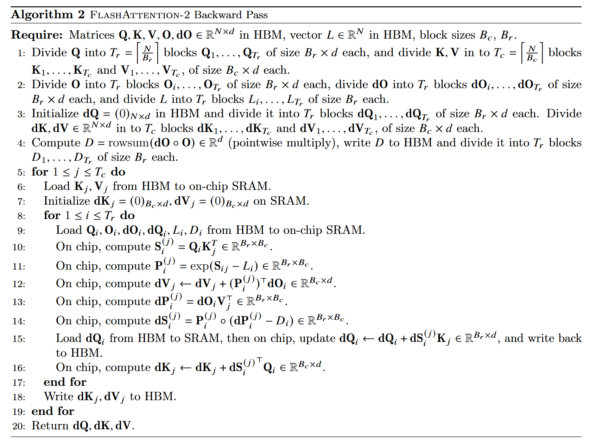
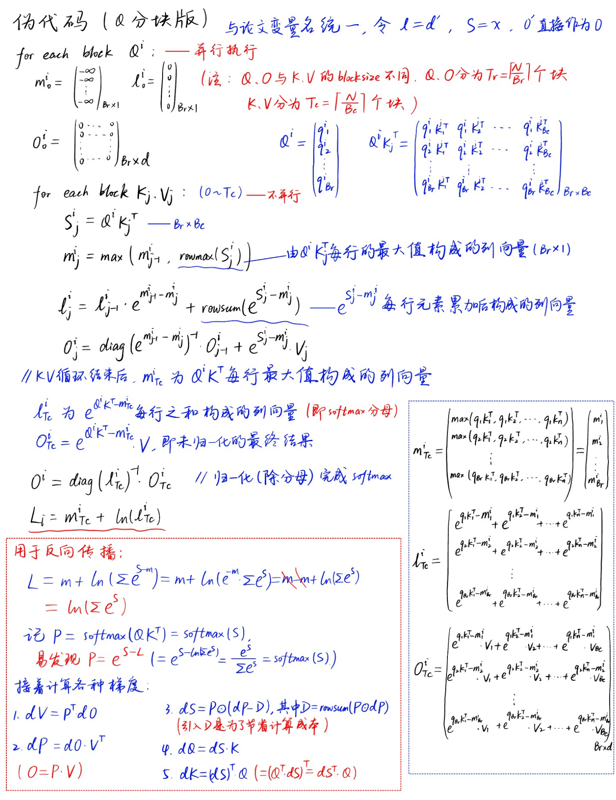

[A practitioner's guide to Triton](https://github.com/Ganzeus/Ganzeus/blob/master/notes/triton%26cuda/A guide to Triton.ipynb)

[Tutorials — Triton documentation](https://triton-lang.org/main/getting-started/tutorials/index.html)

[Triton-Puzzles](https://github.com/Ganzeus/Ganzeus/blob/master/Triton-Puzzles.ipynb)

## 笔记

### 并行编程思想

并行编程只需要考虑两部分：

1. 如何划分块
2. 每一块进行的操作都是一模一样的，只需要编写每一块执行的操作即可。
   块内操作可以看成是顺序编程，唯一区别就是块内去要利用mask进行边界处理。


### triton vs cuda

#### 特性

+ triton不需要考虑shared memory，而cuda需要手动实现

#### program == block

> Note on jargon: In triton lingo, each kernel (which processes a block) is called a "program". Therefore, "block_id" is often called "pid" (short for "program id"), but it's the same.

+ triton中的program就是cuda中的block
+ cuda把计算分成block和thread，而triton只分为block。
  triton在block中可以直接进行vector运算，因此比cuda好写得多

#### triton kernel中的操作

> **All** operations in triton kernels are vectorized: Loading data, operating on data, storing data, and creating masks.

+ triton kernel中一共只有四种操作：存/取数据、计算、越界检测

+ ==triton中不能直接存取外部数据，必须用load/store，因此triton需要手算offset，不像cuda那样可以直接用c数组方式存取==
+ **load完当前kernel需要处理的元素后，剩下的计算就可以当作普通的python顺序编程**

#### grid & block

+ grid是一个元组
+ 用来指定block(program)的分块结构，**每个维度分成多少块**
+ 例如grid = (4, 5)表示按四行五列的二维形式分为20个block，每个block负责程序的一部分数据

**grid和block本质**

+ **每个block包含哪些元素都是在kernel中人为规定(load)的**，并不是理所当然的某些元素在block1中、某些元素在block2中...
+ 指定grid后，程序是不知道有block这个东西的，只会按你给的grid形状分配若干program_id，每个kernel运行时都会通过`tl.program_id()`得到自己的program_id。因此**程序也不知道每个block应该包含多少元素**。
+ program_id只是一个用于区分block的数字罢了，不存在空间信息，所以不可能知道自己会运算哪些元素，
  **更不知道自己会读取多少元素**，一切都是用load函数人为规定的


#### tl.load原理和mask判断逻辑

`tl.load(ptr + offset, mask=mask)`

+ ptr是起始指针
+ offset是从该指针的偏移量（内存位置下标）
+ mask判断offset中的每个位置是否应该被加载

+ **mask形状一定要和offset相同！！！**

**mask判断逻辑：**

+ mask是bool矩阵，形状和offset一样，其中的值为true时就load，false就不能load
+ 创建mask时只需要管offset的下标有没有越界即可

**load逻辑:**

+ tensor物理结构为一维向量，起始地址为ptr
+ offset中的内容为一维向量的下标(0~n), load函数按照offset中给定的下标进行读操作
+ **load的输出和offset结构相同的tensor，其中的每个元素就是对应offset中给定下标的真正元素**


### 写kernel步骤

#### helper function

1. 初始化输出（返回值）
2. 计算各种shape和size：num_blocks、矩阵mnk
3. 定义grid
4. 调用kernel（传入各种参数）
5. return


#### kernel function

1. pid
2. offset
3. mask
4. 根据offset和mask来load当前kernel所需处理的数据
5. 计算（当成普通python顺序编程）
6. tl.store


### Utility Function

> 用于调试

```python
import os
import triton
import triton.language as tl

def test_pid_conds(conds, pid_0=[0], pid_1=[0], pid_2=[0]):
    '''Test if condition on pids are fulfilled
    E.g.:
        '=0'  checks that pid_0 == 0
        ',>1' checks that pid_1 > 1
        '>1,=0' checks that pid_0 > 1 and pid_1 == 0
    '''
    pids = pid_0[0], pid_1[0], pid_2[0]
    conds = conds.replace(' ','').split(',')
    for i, (cond, pid) in enumerate(zip(conds, pids)):
        if cond=='': continue
        op, threshold = cond[0], int(cond[1:])
        if op not in ['<','>','>=','<=','=', '!=']: 
            raise ValueError(f"Rules may only use these ops: '<','>','>=','<=','=', '!='. \
                             Invalid rule: '{cond}'.")
        op = '==' if op == '=' else op
        if not eval(f'{pid} {op} {threshold}'): return False
    return True

assert test_pid_conds('')
assert test_pid_conds('>0', [1], [1])
assert not test_pid_conds('>0', [0], [1])
assert test_pid_conds('=0,=1', [0], [1], [0])

def breakpoint_if(conds, pid_0=[0], pid_1=[0], pid_2=[0]):
    '''Stop kernel, if any condition of pids is fulfilled'''
    from IPython.core.debugger import set_trace
    
    if test_pid_conds(conds, pid_0, pid_1, pid_2): set_trace()

def print_if(txt, conds, pid_0=[0], pid_1=[0], pid_2=[0]):
    '''Print txt, if any condition of pids is fulfilled'''
    if test_pid_conds(conds, pid_0, pid_1, pid_2): print(txt)

def check_tensors_gpu_ready(*tensors):
    for t in tensors:
        assert t.is_contiguous(), "A tensor is not contiguous"
        if not os.environ.get('TRITON_INTERPRET') == '1': assert t.is_cuda, "A tensor is not on cuda"

```


### Autotune

#### 用lambda函数创建grid

```python
grid = lambda meta: (triton.cdiv(m, meta['bm']),  triton.cdiv(n, meta['bn']))
```

+ meta是一个字典，用于规定bm和bn的大小
+ lambda函数的参数为meta字典，返回值为grid元组
+ meta字典中的keys需要在内核函数中指明为`tl.constexpr`类型

  ```python
  def matmul_kernel(
      a_ptr, b_ptr, c_ptr,
      m, n, k,
      stride_am, stride_ak, 
      stride_bk, stride_bn,
      stride_cm, stride_cn,
      bm: tl.constexpr, bn: tl.constexpr, bk: tl.constexpr, group_sz: tl.constexpr
  ):
  ```

#### @triton.autotune装饰器

```python
@triton.autotune(
    # Choices of configs to auto-tune over
    configs=[
        triton.Config({'bm': 128, 'bn': 256, 'bk': 64, 'group_sz': 8}, num_stages=3, num_warps=8),
        triton.Config({'bm': 64, 'bn': 256, 'bk': 32, 'group_sz': 8}, num_stages=4, num_warps=4),
        triton.Config({'bm': 128, 'bn': 128, 'bk': 32, 'group_sz': 8}, num_stages=4, num_warps=4),
        triton.Config({'bm': 128, 'bn': 64, 'bk': 32, 'group_sz': 8}, num_stages=4, num_warps=4),
        triton.Config({'bm': 64, 'bn': 128, 'bk': 32, 'group_sz': 8}, num_stages=4, num_warps=4),
        triton.Config({'bm': 128, 'bn': 32, 'bk': 32, 'group_sz': 8}, num_stages=4, num_warps=4),
        triton.Config({'bm': 64, 'bn': 32, 'bk': 32, 'group_sz': 8}, num_stages=5, num_warps=2),
        triton.Config({'bm': 32, 'bn': 64, 'bk': 32, 'group_sz': 8}, num_stages=5, num_warps=2),
    ],
    # Definition of problem size. If it changes, a new auto-tune is run for the new problem size.
    key=['m', 'n', 'k'],
)
```

+ configs列表定义了多个配置组合，meta字典会自动从这些配置中生成
+ key参数(`['m', 'n', 'k']`)表明，每当m、n、k变化时，triton就会重新进行autotune，来确定当前数据规模的最佳配置

#### num_stages和num_warps

num_warps —— **空间并行(同时处理更多数据)**

+ 用于指定一个**block的线程数**, 即**每个block的线程数为num_warps * 32**
+ 1 warp = 32 threads (硬件写死), 这32个线程**严格并行**，同时执行相同的指令
+ block内部并不是所有线程严格并行，而是**以warp为原子单位并行+warp层面的调度切换**
+ num_warps越大，kernel并行度越高；但所有warp会**共享所在SM的寄存器和共享内存**，因此**num_warps设置过大会导致每个线程可用的共享内存或寄存器变少**


num_stages —— **时间并行(流水线重叠)**

+ 表示**流水线深度**, 表示可以同时进行多少阶段的数据加载/计算
+ 过多的流水线阶段虽然有助于延迟隐藏，但同时会增加寄存器压力和同步开销。


> | **对比维度**     | **num_warps**                           | **num_stages**                      |
> | ---------------- | --------------------------------------- | ----------------------------------- |
> | **基本定义**     | 一个thread block中包含的warp数量        | 流水线中同时进行的阶段数量          |
> | **线程数量**     | `num_warps × 32 = 总线程数`             | 不影响线程数量                      |
> | **并行类型**     | **空间并行** - 更多线程同时处理不同数据 | **时间并行** - 不同操作在时间上重叠 |
> | **作用机制**     | 增加同时执行相同指令的线程数            | 加载、计算、存储操作流水线重叠      |
> | **典型值**       | 1, 2, 4, 8 (对应32, 64, 128, 256线程)   | 1, 3, 4, 7                          |
> | **硬件资源消耗** | 更多寄存器、shared memory               | 更多shared memory缓冲区             |
> | **延迟隐藏**     | 通过线程级并行隐藏延迟                  | 通过操作重叠隐藏内存访问延迟        |
> | **分支分歧影响** | 更多warp → 分支分歧影响更大             | 不直接影响分支性能                  |
> | **内存带宽**     | 更多线程 → 更高内存带宽需求             | 通过预取提高内存带宽利用率          |
> | **计算吞吐**     | 更多线程 → 更高计算吞吐                 | 不直接增加计算吞吐                  |
> | **硬件要求**     | 所有GPU都支持                           | 需要异步拷贝支持(如A100的cp.async)  |
> | **优化目标**     | 提高并行度，充分利用计算单元            | 隐藏内存延迟，提高流水线效率        |
> | **适用场景**     | 计算密集型，数据并行性好                | 内存密集型，访问模式规律            |
> | **占用率影响**   | 可能降低occupancy(资源限制)             | 可能降低occupancy(内存限制)         |
> | **调试复杂度**   | 相对简单，线程数增加                    | 较复杂，涉及时序和同步              |
> | **编译器优化**   | 影响寄存器分配和线程调度                | 影响内存访问调度和缓冲策略          |
>
> 
>
> | **场景**                   | **推荐配置**                  | **原因**                  |
> | -------------------------- | ----------------------------- | ------------------------- |
> | **内存密集，大BLOCK_SIZE** | `num_warps=4, num_stages=3`   | 足够并行度 + 内存延迟隐藏 |
> | **计算密集，小BLOCK_SIZE** | `num_warps=2, num_stages=1`   | 避免资源浪费，专注计算    |
> | **Flash Attention**        | `num_warps=4, num_stages=3-7` | 平衡计算和内存访问        |
> | **简单元素级操作**         | `num_warps=8, num_stages=1`   | 最大化并行度              |
>
> 
>
> | **性能指标**   | **增加num_warps的影响** | **增加num_stages的影响** |
> | -------------- | ----------------------- | ------------------------ |
> | **计算吞吐量** | ⬆️ 显著提升              | ➡️ 基本不变               |
> | **内存吞吐量** | ⬆️ 提升(更多并行访问)    | ⬆️ 提升(更好的流水线)     |
> | **延迟**       | ⬇️ 可能增加(资源竞争)    | ⬇️ 显著降低               |
> | **资源占用**   | ⬆️ 线性增加              | ⬆️ 适度增加               |

### 自定义stride改变矩阵结构


## Kernel

### Vector Add

#### 图解


#### 代码

```python
# helper function
def add(a, b, block_size):      # a, b都是torch.tensor, 长度相等，返回a+b
    # 1. init output
    c = torch.zeros_like(a)
    check_tensors_gpu_ready(a, b, c)

    # 2. shape & size
    n = a.numel()
    num_blocks = triton.cdiv(n, block_size)

    # 3. grid def
    grid = (num_blocks, )

    # 4. call kernel
    add_kernel[grid](a, b, c, n, block_size)

    # 5. return
    return c

@triton.jit
def add_kernel(a_ptr, b_ptr, c_ptr, n, BLOCK_SIZE: tl.constexpr):
    # 1. pid
    pid = tl.program_id(0)
    # 2. offset
    offset = pid * BLOCK_SIZE + tl.arange(0, BLOCK_SIZE)
    # 3. mask
    mask = offset < n   # 越界检测
    # 4. load
    a = tl.load(a_ptr + offset, mask)
    b = tl.load(b_ptr + offset, mask)
    # 5. compute
    c = a + b
    # 6. store
    tl.store(c_ptr + offset, c, mask)
```


### Matrix Add

#### 图解

> Tensor在底层都是顺序存储，因此下标是[0, 1, 2, ...]而不是二维下标


#### 代码

```python
# helper function
def matrix_add(a, b, block_size):   # block_size为长2的元组
    # 1. init output
    c = torch.zeros_like(a)
    # 2. shape & size
    m, n = a.shape
    bs0, bs1 = block_size
    # 3. grid def
    grid = (triton.cdiv(m, bs0), triton.cdiv(n, bs1))
    # 4. call kernel
    matrix_add_kernel[grid](a, b, c, m, n, bs0, bs1)
    # 5. return
    return c


@triton.jit
def matrix_add_kernel(a_ptr, b_ptr, c_ptr, m, n, bs0: tl.constexpr, bs1: tl.constexpr):
    # 1. pid
    pid_x = tl.program_id(0)
    pid_y = tl.program_id(1)

    # 2. offset
    off_x = pid_x * bs0 + tl.arange(0, bs0)
    off_y = pid_y * bs1 + tl.arange(0, bs1)

    offset = off_x[:, None] * n + off_y[None, :]    # 二维offset公式

    # 3. mask
    mask_x = off_x < m      # 行 mask
    mask_y = off_y < n      # 列 mask
    
    mask = mask_x[:, None] & mask_y[None, :]    # 二维mask，注意是'&'不是'+'

    # 4. load
    a = tl.load(a_ptr + offset, mask)
    b = tl.load(b_ptr + offset, mask)

    # 5. compute
    c = a + b

    # 6. store
    tl.store(c_ptr + offset, c, mask)
```


### Matmul

#### 图解

> Tensor在底层都是顺序存储，因此下标是[0, 1, 2, ...]而不是二维下标


#### 为什么计算mask不需要乘stride?

​	在Triton kernel中，**mask的计算与stride无关的原因**是因为`mask`只用于检查当前线程需要访问的索引是否在矩阵的有效范围内，而不是去计算实际的内存地址。————**mask中只需要存放行号和列号，不需要存一维序号**

​	stride 是用来计算线性存储下实际的内存地址的，比如二维矩阵在一维内存中的布局，需要通过 `row * stride_row + col * stride_col` 来定位元素的具体内存地址,例如计算**`off_A` 和 `off_B`** 时需要用 stride，因为它们需要将矩阵的s逻辑索引（行号、列号）映射到物理内存地址。而 `mask` 的目的是判断某个线程的计算任务是否越界，例如当前线程对应的矩阵行号和列号是否在矩阵的有效维度范围内。这里的索引检查完全基于逻辑坐标（矩阵的行和列号），而不需要映射到内存地址。

具体来看：

- **`off_m[:, None]` 和 `off_k[None, :]`** 是当前线程负责的矩阵块的行号和列号索引。
- **`off_k[None, :] < k` 和 `off_m[:, None] < m`** 是简单地判断这些行号和列号是否落在矩阵的有效范围 `[0, m)` 和 `[0, k)` 中。

因此，mask 的计算只需要与矩阵的逻辑大小（`m, n, k`）相关，而与矩阵在内存中的布局(一维)无关。

> Triton 的 `tl.load` 设计允许我们同时加载一个块（例如 `bm x bn` 的矩阵块）：
>
> - `tl.load` 的输入是二维的逻辑索引（如 `off_A` 和 `off_B`），以及一个同样是二维的 `mask`
> - `mask` 在加载数据时，用来告诉 `tl.load` 哪些逻辑索引越界（会屏蔽掉这些元素，用 `other` 参数填充）

**总结**

- **mask的作用**：判断索引是否越界，只需要用逻辑索引进行对比，不需要stride。
- **stride的作用**：计算内存地址，只有在真正加载或存储数据时才需要考虑。

#### 代码

```python
# helper function
def matmul_triton(A, B, bs=16):
    assert A.shape[1] == B.shape[0], "matrix dims not compatible for matmul"
    check_tensors_gpu_ready(A, B)
    # 1. shape & size
    (m, k), (_, n) = A.shape, B.shape       # m,n,k赋值

    # 2. init output
    C = torch.empty((m, n), device=device, dtype=torch.float16)

    # 3. grid def
    grid = lambda meta: (triton.cdiv(m, meta['bm']),  triton.cdiv(n, meta['bn']))
    
    # 4. call kernel
    matmul_kernel[grid](
        A, B, C,
        m, n, k,
        A.stride(0), A.stride(1),       # stride是PyTorch内置函数，返回指定维度上移动一个元素所跨过的元素数量
        B.stride(0), B.stride(1),       # 在行维度上，元素是连续的，因此移动一个元素只需要跨越一个元素，及stride(0)=1
        C.stride(0), C.stride(1),       # 在列维度上，移动一个元素需要跨越一整行元素，即stride(1) = 每行元素个数
        bm=bs, bn=bs, bk=bs,
    )
    
    # return
    return C

@triton.jit
def matmul_kernel(
    a_ptr, b_ptr, c_ptr,
    m, n, k,
    stride_am, stride_ak, 
    stride_bk, stride_bn,
    stride_cm, stride_cn,
    bm: tl.constexpr, bn: tl.constexpr, bk: tl.constexpr
):
    # 1. pid
    pid_m, pid_n = tl.program_id(0), tl.program_id(1)
    
    # 2. offset & mask
    off_m = pid_m * bm + tl.arange(0, bm)
    off_n = pid_n * bn + tl.arange(0, bn)

    # initialize accumulator (累加器，存放矩阵乘积)
    acc = tl.zeros((bm, bn), dtype=tl.float32)
    for i in range(0, k, bk):       # 每层循环计算一个phase
        off_k = i + tl.arange(0, bk)
    
        # offs_A, offs_B都是下标矩阵， 表示当前线程内相乘的两个矩阵在原矩阵对应的下标
        off_A = off_k[None, :] * stride_ak + off_m[:, None] * stride_am
        mask_A = (off_k[None, :] < k) & (off_m[:, None] < m)

        off_B = off_n[None, :] * stride_bn + off_k[:, None] * stride_bk
        mask_B = (off_n[None, :] < n) & (off_k[:, None] < k)
        
        # 3. load & 计算
        A = tl.load(a_ptr + off_A, mask_A, other=0.0)
        B = tl.load(b_ptr + off_B, mask_B, other=0.0)
        acc += tl.dot(A, B, allow_tf32=False)
        
    # 此时的acc就是一个小矩阵（最终结果的一部分），因此可以直接fuse激活函数
    # acc = relu(acc)
    
    # 4. store
    off_C = off_n[None, :] * stride_cn + off_m[:, None] * stride_cm
    mask_C = (off_n[None, :] < m) & (off_m[:, None] < n)
    tl.store(c_ptr + off_C, acc, mask=mask_C)

```


#### 优化：Grouped ordering


+ **图中的每个格子都是一个block，而不是矩阵中的一个元素**
+ 默认的block读取顺序为第一行，即行优先依次读取
+ 将block读取顺序修改为第二行的样子，就可以增加L2 cache的命中率


+ 核心：修改block下标，从而改变读取block的顺序（==**不是修改矩阵元素的下标！！！**==）

+ 例如：调用内核时以为要读取下标(0,1)的block，结果读取了(1,0)的block

##### 二维grid：swizzle2d

```python
@jit
def swizzle2d(i, j, size_i, size_j, size_g):
    """
    修改矩阵下标的顺序，变为以边长size_g的小正方形为单位,小正方形内部采用列优先的顺序
    并行函数，即不同下标的block同时调用
    (i,j)为当前block所在原grid矩阵下标, 返回在新矩阵中的下标(new_i, new_j)
    size_i,size_j为grid矩阵行列长度(即行列各有多少block)，size_g表示几行作为一个group
    eg. size_i = size_j = 4 and size_g = 2, 转换前后矩阵如下（每个序号表示一个block而不是矩阵元素）
    [[0 , 1 , 2 , 3 ],
     [4 , 5 , 6 , 7 ],
     [8 , 9 , 10, 11],
     [12, 13, 14, 15]]
    ->	# 两行为一个group, 每个group有8个block，包含一行2个小正方形
    [[0, 2,  4 , 6 ],
     [1, 3,  5 , 7 ],
     [8, 10, 12, 14],
     [9, 11, 13, 15]]
    """
    ij = i * size_j + j				# 当前block在原矩阵中对应的序号
    
    size_gj = size_g * size_j		# 即一个group中包含多少block
    
    group_id = ij // size_gj		# 当前block在第几个group
    # row-index of the first element of this group
    off_i = group_id * size_g		# 当前group的第一个block所在行号
    # last group may have fewer rows
    size_g = core.minimum(size_i - off_i, size_g)	# 还剩多少有效行
    # new row and column indices
    new_i = off_i + (ij % size_g)		# 新行号=当前block应是小正方形的第几行+小正方形的起始行(off_i)
    new_j = (ij % size_gj) // size_g	# 新列号=当前group的第几个元素 // 剩余行数
    return new_i, new_j
```


##### 一维grid

> triton document官方方法

```python
pid = tl.program_id(axis=0)			# block序号（通过pid直接获得，不需要通过下标计算）

num_pid_m = tl.cdiv(M, BLOCK_SIZE_M)	# grid矩阵行数（列方向有多少block）
num_pid_n = tl.cdiv(N, BLOCK_SIZE_N)	# grid矩阵列数（行方向有多少block）

num_pid_in_group = GROUP_SIZE_M * num_pid_n		# 一个group中包含多少block

group_id = pid // num_pid_in_group				# 当前block在第几个group

first_pid_m = group_id * GROUP_SIZE_M			# 当前group的第一个block所在行号

group_size_m = min(num_pid_m - first_pid_m, GROUP_SIZE_M)	# 还剩多少有效行

pid_idx_in_group = pid % num_pid_in_group		# 当前block是所在group的第几个元素
# 计算当前block所在新矩阵下标(pid_m, pid_n)
pid_m = first_pid_m + (pid_idx_in_group % group_size_m)	
						# 新行号=当前block应是小正方形的第几行+小正方形的起始行(first_pid_m)
pid_n = pid_idx_in_group // group_size_m	# 新列号=当前group的第几个元素 // 剩余行数
```


##### 优化后代码

```python
@triton.jit
def grouped_matmul_kernel(
    a_ptr, b_ptr, c_ptr,
    m, n, k,
    stride_am, stride_ak, 
    stride_bk, stride_bn,
    stride_cm, stride_cn,
    bm: tl.constexpr, bn: tl.constexpr, bk: tl.constexpr
):
    # 1. pid
    pid_m, pid_n = tl.program_id(0), tl.program_id(1)
    
    # 仅须修改下面两行
    num_pid_m, num_pid_n = tl.num_programs(0), tl.num_programs(1)   # 获取行列各分成多少block
    pid_m, pid_n = tl.swizzle2d(pid_m, pid_n, num_pid_m, num_pid_n, group_sz)
    """
    假设triton给当前block分配的program_id为(0, 2), 但此函数人为改为(2, 0).
    这样就可以用原来的算法来计算offset,从而读取另一块内存, 不需要修改下面的代码
    """
    
    
    # 2. offset & mask
    off_m = pid_m * bm + tl.arange(0, bm)
    off_n = pid_n * bn + tl.arange(0, bn)

    # initialize accumulator (累加器，存放矩阵乘积)
    acc = tl.zeros((bm, bn), dtype=tl.float32)
    for i in range(0, k, bk):       # 每层循环计算一个phase
        off_k = i + tl.arange(0, bk)
    ara
        # offs_A, offs_B都是下标矩阵， 表示当前线程内相乘的两个矩阵在原矩阵对应的下标
        off_A = off_k[None, :] * stride_ak + off_m[:, None] * stride_am
        mask_A = (off_k[None, :] < k) & (off_m[:, None] < m)

        off_B = off_n[None, :] * stride_bn + off_k[:, None] * stride_bk
        mask_B = (off_n[None, :] < n) & (off_k[:, None] < k)
        
        # 3. load & 计算
        A = tl.load(a_ptr + off_A, mask_A, other=0.0)
        B = tl.load(b_ptr + off_B, mask_B, other=0.0)
        acc += tl.dot(A, B, allow_tf32=False)
        
    # 此时的acc就是一个小矩阵（最终结果的一部分），因此可以直接fuse激活函数
    # acc = relu(acc)
    
    # 4. store
    off_C = off_n[None, :] * stride_cn + off_m[:, None] * stride_cm
    mask_C = (off_n[None, :] < m) & (off_m[:, None] < n)
    tl.store(c_ptr + off_C, acc, mask=mask_C)
```


### Batched GEMM

> 多了一个batch维度, 需要在batch维度分块
>
> 只需要将offset加上当前batch维度的第一个元素下标(batch_idx * batch_stride)
>
> ```python
> batch_idx = tl.program_id(0)
> offset_batch = batch_idx + batch_stride
> offset += offset_batch
> ```

#### A(B, M, K) @ B(K, N) -> C(B, M, N)

> 用于LLM FFN:A(B, T, Cin) @ B(Cin, Cout) -> C(B, T, Cout)
>
> bias: (1, N)——MxN矩阵中的每列元素加的bias常量值都不一样

```python
def matmul_triton1(A: torch.Tensor, B: torch.Tensor, bias: Optional[torch.Tensor] = None, activation: Optional[str] = None) -> torch.Tensor:
    """
    Implements matrix multiplication between input matrix A and B
    
    Args:
        - A {torch.Tensor}: Input matrix with shape (B, T, Cin) where B is the batch size, T is the sequence length, Cin is the input dimension
        - B {torch.Tensor}: Weight matrix with shape (Cin, Cout) where Cout is the hidden dimension
        - bias {torch.Tensor}: Optionally add a bias to the ouput, shape (1, Cout)
        - activation {str}: Optionally apply activation to the ouput

    Returns:
        - {torch.Tensor}: Output tensor with (B, T, Cout)
    """
    assert len(A.shape) == 3, "First input matrix needs to have 3 dimensions (B, T, C)"
    assert A.device == B.device and A.is_cuda, "Both matrix should be on GPU"

    if bias is not None:
        assert bias.is_cuda, "Bias is not on GPU"
        bias = bias.unsqueeze(0)
        assert bias.shape[1] == B.shape[1], "Bias shape does not match output feature dimension shape"

    if activation:
        assert activation in ["gelu"], f"Only GELU activation supported as of now! Provided: {activation}"

    batch_size, M, K = A.shape
    K, N = B.shape

    grid = lambda meta: (batch_size, triton.cdiv(M, meta["bm"]), triton.cdiv(N, meta["bn"]))

    C = torch.empty((batch_size, M, N), device=A.device, dtype=A.dtype)

    matmul_kernel1[grid](
        A, B, C,
        M=M, N=N, K=K,
        A_stride_batch=A.stride(0),
        A_stride_height=A.stride(1), A_stride_width=A.stride(2),
        B_stride_height=B.stride(0), B_stride_width=B.stride(1),
        C_stride_batch=C.stride(0),
        C_stride_height=C.stride(1), C_stride_width=C.stride(2),
        bias_ptr=bias,
        add_bias=True if bias is not None else False,
        activation=activation,
        apply_activation=True if activation else False,
        bm=16, bn=16, bk=16, group_sz=16
    )

    return C


@triton.jit
def matmul_kernel1(
    a_ptr, b_ptr, c_ptr,
    M, N, K,
    A_stride_batch, A_stride_height, A_stride_width,
    B_stride_height, B_stride_width,
    C_stride_batch, C_stride_height, C_stride_width,
    bias_ptr, add_bias:tl.constexpr,
    activation, apply_activation:tl.constexpr,
    bm: tl.constexpr, bn: tl.constexpr, bk: tl.constexpr,
    group_sz: tl.constexpr
):
    # 1. pid
    batch_idx = tl.program_id(0)
    pid_m, pid_n = tl.program_id(1), tl.program_id(2)
    num_pid_m, num_pid_n = tl.num_programs(1), tl.num_programs(2)
    pid_m, pid_n = tl.swizzle2d(pid_m, pid_n, num_pid_m, num_pid_n, group_sz)  
    
    # 2. offset & mask
    off_m = pid_m * bm + tl.arange(0, bm)
    off_n = pid_n * bn + tl.arange(0, bn)

    A_offset_batch = batch_idx * A_stride_batch
    C_offset_batch = batch_idx * C_stride_batch

    # initialize accumulator (累加器，存放矩阵乘积)
    acc = tl.zeros((bm, bn), dtype=tl.float32)
    for i in range(0, K, bk):       # 每层循环计算一个phase
        off_k = i + tl.arange(0, bk)
    
        # offs_A, offs_B都是下标矩阵， 表示当前线程内相乘的两个矩阵在原矩阵对应的下标
        off_A = off_k[None, :] * A_stride_width + off_m[:, None] * A_stride_height
        mask_A = (off_k[None, :] < K) & (off_m[:, None] < M)

        off_B = off_n[None, :] * B_stride_width + off_k[:, None] * B_stride_height
        mask_B = (off_n[None, :] < N) & (off_k[:, None] < K)
        
        # 3. load & 计算
        A = tl.load(a_ptr + off_A + A_offset_batch, mask_A, other=0.0)
        B = tl.load(b_ptr + off_B, mask_B, other=0.0)
        acc += tl.dot(A, B, allow_tf32=False)
    
    # 此时的acc就是一个小矩阵，因此可以直接加bias/激活函数
    if add_bias:
        bias = tl.load(bias_ptr + off_n, off_n < N)
        acc += bias[None, :]

    # if apply_activation:
    #     if activation == 'gelu':
    #         output = gelu(output)
    
    # 4. store
    off_C = off_n[None, :] * C_stride_width + off_m[:, None] * C_stride_height
    mask_C = (off_n[None, :] < N) & (off_m[:, None] < M)

    # print_if(f"off_C = {off_C}, \nmask_C = {mask_C}", '')
    tl.store(c_ptr + off_C + C_offset_batch, acc, mask=mask_C)
```


#### A(M, K) @ B(B, K, N) -> C(B, M, N)

> 用于conv2d+im2col
>
> bias:(B, 1)——MxN矩阵中的每个元素加的bias常量值都一样, 只有在B维度上bias才不同

```python
def matmul_triton2(A: torch.Tensor, B: torch.Tensor, bias: Optional[torch.Tensor] = None, activation: Optional[str] = None) -> torch.Tensor:
    """
    Implements matrix multiplication between input matrix A and B
    
    Args:
        - A {torch.Tensor}: Input matrix with shape (M, K)
        - B {torch.Tensor}: Weight matrix with shape (B, K, N)
        - bias {torch.Tensor}: Optionally add a bias to the ouput, shape (B, 1)
        - activation {str}: Optionally apply activation to the ouput

    Returns:
        - {torch.Tensor}: Output tensor with (B, M, N)
    """
    assert len(B.shape) == 3, f"Second input matrix needs to have 3 dimensions (B, K, N) but {B.shape}"
    assert A.device == B.device and A.is_cuda, "Both matrix should be on GPU"

    if bias is not None:
        assert bias.is_cuda, "Bias is not on GPU"
        assert bias.shape[0] == B.shape[0], "Bias shape does not match output feature dimension shape"

    if activation:
        assert activation in ["gelu"], f"Only GELU activation supported as of now! Provided: {activation}"

    M, K = A.shape
    batch_size, K, N = B.shape

    grid = lambda meta: (batch_size, triton.cdiv(M, meta["bm"]), triton.cdiv(N, meta["bn"]))

    C = torch.empty((batch_size, M, N), device=A.device, dtype=A.dtype)

    matmul_kernel2[grid](
        A, B, C,
        M=M, N=N, K=K,
        A_stride_height=A.stride(0), A_stride_width=A.stride(1),
        B_stride_batch=B.stride(0), B_stride_height=B.stride(1), B_stride_width=B.stride(2),
        C_stride_batch=C.stride(0), C_stride_height=C.stride(1), C_stride_width=C.stride(2),
        bias_ptr=bias,
        add_bias=True if bias is not None else False,
        activation=activation,
        apply_activation=True if activation else False,
        bm=16, bn=16, bk=16, group_sz=16
    )

    return C


@triton.jit
def matmul_kernel2(
    a_ptr, b_ptr, c_ptr,
    M, N, K,
    A_stride_height, A_stride_width,
    B_stride_batch, B_stride_height, B_stride_width,
    C_stride_batch, C_stride_height, C_stride_width,
    bias_ptr, add_bias: tl.constexpr,
    activation, apply_activation:tl.constexpr,
    bm: tl.constexpr, bn: tl.constexpr, bk: tl.constexpr,
    group_sz: tl.constexpr
):
    # 1. pid
    batch_idx = tl.program_id(0)
    pid_m, pid_n = tl.program_id(1), tl.program_id(2)
    num_pid_m, num_pid_n = tl.num_programs(1), tl.num_programs(2)
    pid_m, pid_n = tl.swizzle2d(pid_m, pid_n, num_pid_m, num_pid_n, group_sz)  
    
    # 2. offset & mask
    off_m = pid_m * bm + tl.arange(0, bm)
    off_n = pid_n * bn + tl.arange(0, bn)

    B_offset_batch = batch_idx * B_stride_batch
    C_offset_batch = batch_idx * C_stride_batch

    # initialize accumulator (累加器，存放矩阵乘积)
    acc = tl.zeros((bm, bn), dtype=tl.float32)
    for i in range(0, K, bk):       # 每层循环计算一个phase
        off_k = i + tl.arange(0, bk)
    
        # offs_A, offs_B都是下标矩阵， 表示当前线程内相乘的两个矩阵在原矩阵对应的下标
        off_A = off_k[None, :] * A_stride_width + off_m[:, None] * A_stride_height
        mask_A = (off_k[None, :] < K) & (off_m[:, None] < M)

        off_B = off_n[None, :] * B_stride_width + off_k[:, None] * B_stride_height
        mask_B = (off_n[None, :] < N) & (off_k[:, None] < K)
        
        # 3. load & 计算
        A = tl.load(a_ptr + off_A, mask_A, other=0.0)
        B = tl.load(b_ptr + off_B + B_offset_batch, mask_B, other=0.0)
        acc += tl.dot(A, B, allow_tf32=False)
    
    # 此时的acc就是一个小矩阵，因此可以直接加bias/激活函数
    if add_bias:
        bias = tl.load(bias_ptr + batch_idx)
        acc += bias

    # if apply_activation:
    #     if activation == 'gelu':
    #         output = gelu(output)
    
    # 4. store
    off_C = off_n[None, :] * C_stride_width + off_m[:, None] * C_stride_height
    mask_C = (off_n[None, :] < N) & (off_m[:, None] < M)

    # print_if(f"off_C = {off_C}, \nmask_C = {mask_C}", '')
    tl.store(c_ptr + off_C + C_offset_batch, acc, mask=mask_C)
```


### Transpose2D-1

> 读时使用正常下标，写时使用转置变换后的下标

#### 图解


#### 代码

```python
def transpose2d_triton(x):
    check_tensors_gpu_ready(x)
    M, N = x.shape
    y = torch.empty((N, M), device=device, dtype=torch.float16)

    grid = lambda META: (triton.cdiv(M, META['bm']), triton.cdiv(N, META['bn']))
    
    transpose_kernel[grid](x, y, M, N, x.stride(0), x.stride(1), y.stride(0), y.stride(1))

    return y

@triton.jit
def transpose_kernel(
    x_ptr,
    y_ptr,
    M,
    N,
    stride_xm,
    stride_xn,
    stride_yn,
    stride_ym,
    bm: tl.constexpr = 16, bn: tl.constexpr = 16
):
    pid_m, pid_n = tl.program_id(0), tl.program_id(1)

    off_m = pid_m * bm + tl.arange(0, bm)
    off_n = pid_n * bn + tl.arange(0, bn)

    off_X = off_n[None, :] * stride_xn + off_m[:, None] * stride_xm
    off_Y = off_n[:, None] * stride_yn + off_m[None, :] * stride_ym

    mask_X = (off_m[:, None] < M) & (off_n[None, :] < N)
    mask_Y = (off_m[None, :] < M) & (off_n[:, None] < N)

    x = tl.load(x_ptr + off_X, mask=mask_X)
    x_t = tl.trans(x)
    tl.store(y_ptr + off_Y, x_t, mask=mask_Y)
```


### Transpose2D-2

> 利用stride改变矩阵结构的特性，直接修改内存读入逻辑即可实现转置
>
> 即读时直接按列优先顺序，写时再按原本的行优先顺序

#### 图解


#### 代码

```python
def transpose2d_triton(x):
    check_tensors_gpu_ready(x)
    M, N = x.shape
    y = torch.empty((N, M), device=device, dtype=torch.float16)

    grid = lambda META: (triton.cdiv(M, META['bm']), triton.cdiv(N, META['bn']))
    
    transpose_kernel[grid](x, y, M, N, x.stride(0), x.stride(1), y.stride(0), y.stride(1))

    return y

@triton.jit
def transpose_kernel(
    x_ptr,   # input
    y_ptr,   # output
    M,       # number of rows of x
    N,       # number of columns of x
    row_stride_x,
    col_stride_x,
    row_stride_y,
    col_stride_y,
    bm: tl.constexpr = 16, bn: tl.constexpr = 16
):
    pid_m, pid_n = tl.program_id(0), tl.program_id(1)

    offs_row = pid_m * bm + tl.arange(0, bm)
    offs_col = pid_n * bn + tl.arange(0, bn)

    # offs_X = offs_col[None, :] * col_stride_x + offs_row[:, None] * row_stride_x
    offs_X_trans = offs_col[:, None] * col_stride_x + offs_row[None, :] * row_stride_x       # 调换行列顺序即可转置！
    # mask_X_trans = (offs_col[:, None] < N) & (offs_row[None, :] < M)


    offs_Y = offs_col[:, None] * row_stride_y + offs_row[None, :] * col_stride_y
    # mask_Y = (offs_col[:, None] < N) & (offs_row[None, :] < M)

    mask = (offs_col[:, None] < N) & (offs_row[None, :] < M)        # mask_X_trans = mask_Y

    x = tl.load(x_ptr + offs_X_trans, mask=mask)
    # print_if(x, '')
    tl.store(y_ptr + offs_Y, x, mask=mask)
```


#### `tl.make_block_ptr`

> triton官方的offset计算函数，不需要手动计算下标了

```python
def transpose_kernel(
    x_ptr,
    y_ptr,
    M,
    N,
    bm: tl.constexpr = 16,
    bn: tl.constexpr = 16
):
    pid_m, pid_n = tl.program_id(0), tl.program_id(1)

    # x转置的offset
    x_block_ptr = tl.make_block_ptr(
        base=x_ptr,                    # 输入张量的基地址
        shape=(N, M),                  # 构造的offset形状
        strides=(1, N),                # 转置后的stride：原(N,1) -> 现(1,N)
        offsets=(pid_n * bn, pid_m * bm),  # 行列下标的偏移量, 即offset_row需要加上pid_n * bn
        block_shape=(bn, bm),          # 当前块的大小
        order=(1, 0)                   # (1,0)表示行优先
    )
    
    # 输出y的offset（正常行优先）
    y_block_ptr = tl.make_block_ptr(
        base=y_ptr,
        shape=(N, M),
        strides=(M, 1),
        offsets=(pid_n * bn, pid_m * bm),
        block_shape=(bn, bm),
        order=(1, 0)
    )
    
    x = tl.load(x_block_ptr)
    tl.store(y_block_ptr, x)
```


### Conv2d(Naive)

#### 代码

> from [cmeraki/vit.triton: VIT inference in triton because, why not?](https://github.com/cmeraki/vit.triton)

```python
def conv2d_triton(
    input: torch.Tensor,		# (batch_size, Cin, h, w)
    kernel: torch.Tensor,		# (Cout, Cin, kernel_height, kernel_width)
    bias: torch.Tensor			# (Cout, 1)
) -> torch.Tensor:
    assert input.is_cuda and kernel.is_cuda, 'Input or kernel is not on GPU'
    assert len(input.shape) == 4, f'Input needs to be 4 dimensional, provided: {input.shape}'
    assert len(kernel.shape) == 4, f'Kernel size needs to be 4 dimensional, provided: {kernel.shape}'
    assert bias.shape[0] == kernel.shape[0], f'Bias dimension should be same as the kernel 1st dimension'

    batch_size, channels, height, width = input.shape
    num_kernels, kernel_depth, kernel_height, kernel_width = kernel.shape

    assert height%kernel_height == 0 and width%kernel_width == 0, f"Input height and width should be divisible by the kernel height and width"
    assert channels == kernel_depth, f"Kernel channel depth ({kernel_depth}) and input channel depth ({channels}) should be same"

    output = torch.empty((batch_size, num_kernels, height//kernel_height, width//kernel_width), device=device, dtype=dtype)			# kernel步长为kernel边长(即每次计算不会重叠)

    BLOCK_SIZE_ROW = triton.next_power_of_2(kernel_height)
    BLOCK_SIZE_COL = triton.next_power_of_2(kernel_width)
    
    # 每个kernel计算输出矩阵的一行（input所有channel一起计算）
    grid = (batch_size, num_kernels, height//kernel_height)

    conv2d_kernel[grid](
        input_ptr=input,
        input_batch_stride=input.stride(0),			# Cin * h * w
        input_channel_stride=input.stride(1),		# h * w
        input_row_stride=input.stride(2),			# w
        input_col_stride=input.stride(3),			# 1
        height=height,
        width=width,
        channels=channels,
        kernel_ptr=kernel,
        kernel_height=kernel_height,
        kernel_width=kernel_width,
        kernel_dim_stride=kernel.stride(0),			# Cin(kernel_depth) * kernel_height * kernel_width
        kernel_channel_stride=kernel.stride(1),		# kernel_height * kernel_width
        kernel_row_stride=kernel.stride(2),			# kernel_width
        kernel_col_stride=kernel.stride(3),			# 1
        bias_ptr=bias,
        output_ptr=output,
        output_width=width//kernel_width,
        output_batch_stride=output.stride(0),		# Cout * Hout * Wout
        output_channel_stride=output.stride(1),		# Hout * Wout
        output_row_stride=output.stride(2),			# Wout
        output_col_stride=output.stride(3),			# 1
        BLOCK_SIZE_ROW=BLOCK_SIZE_ROW,
        BLOCK_SIZE_COL=BLOCK_SIZE_COL,
    )

    return output

@triton.jit
def conv2d_kernel(
    input_ptr,
    input_batch_stride,		
    input_channel_stride,	
    input_row_stride,		
    input_col_stride,		
    height,
    width,
    channels,
    kernel_ptr,
    kernel_height,
    kernel_width,
    kernel_dim_stride,		
    kernel_channel_stride,	
    kernel_row_stride,		
    kernel_col_stride,		
    bias_ptr,
    output_ptr,
    output_width,
    output_batch_stride,
    output_channel_stride,
    output_row_stride,
    output_col_stride,
    BLOCK_SIZE_ROW: tl.constexpr,
    BLOCK_SIZE_COL: tl.constexpr
):
    batch_idx = tl.program_id(0)
    kernel_idx = tl.program_id(1)	# 相当于输出channel的序号（一个kernel对应一个output channel)
    row_idx = tl.program_id(2)		

    # Bias offset and data
    bias_offset = kernel_idx
    bias = tl.load(bias_ptr + bias_offset)

    # Input data offsets
    batch_offset = batch_idx*input_batch_stride		# 当前batch的起始序号

    # Output data offsets
    output_batch_offset = batch_idx*output_batch_stride			# 当前batch的起始序号
    output_channel_offset = kernel_idx*output_channel_stride	# 当前channel的起始序号
    output_row_offset = row_idx*output_row_stride				# 当前行的起始序号 

    # 计算Kernel offsets
    kernel_row_offset = tl.arange(0, BLOCK_SIZE_ROW)
    kernel_row_mask = kernel_row_offset[:, None] < kernel_height
    kernel_row_offset = kernel_row_offset[:, None]*kernel_row_stride
    kernel_col_offset = tl.arange(0, BLOCK_SIZE_COL)
    kernel_col_mask = kernel_col_offset[None, :] < kernel_width
    kernel_col_offset = kernel_col_offset[None, :]*kernel_col_stride
    
    kernel_mask = kernel_row_mask & kernel_col_mask

    
    for col_idx in range(output_width):		# 按列循环(即每次计算一个元素)
        elem = 0.0
		
        # 计算input offset
        input_row_offset = row_idx * kernel_height + tl.arange(0, BLOCK_SIZE_ROW)
        input_row_mask = input_row_offset[:, None] < height
        input_row_offset = input_row_offset[:, None]*input_row_stride

        input_col_offset = col_idx * kernel_width + tl.arange(0, BLOCK_SIZE_ROW)
        input_col_mask = input_col_offset[None, :] < width
        input_col_offset = input_col_offset[None, :]*input_col_stride
      	
        input_mask = input_row_mask & input_col_mask

        
        for c in range(channels):		# Input 所有channel都要计算
            input_offset = input_ptr + batch_offset + c*input_channel_stride + input_row_offset + input_col_offset
            input_data = tl.load(input_offset, input_mask) # BLOCK_SIZE_ROW x BLOCK_SIZE_COL

            # 每个input channel都有独自的kernel(2d)
            kernel_offset = kernel_ptr + kernel_idx*kernel_dim_stride + c*kernel_channel_stride + kernel_row_offset + kernel_col_offset
            kernel_data = tl.load(kernel_offset, kernel_mask)
            dot_prdct = input_data * kernel_data
            elem += tl.sum(dot_prdct)

        # Store to output for the current channel
        output_offset = output_ptr + output_batch_offset + output_channel_offset + output_row_offset + col_idx
        tl.store(output_offset, elem + bias)	# elem和bias都是标量

```


#### 图解


+ 如图可知, 此代码限定kernel边长为2的幂次，否则load Input时会出错
+ 以上图为例：kernel边长为3时，blocksize边长为4，kernel可以正确load，
  但Input会读入4x4矩阵，与kernel size不一致，会导致计算出错


### Conv2d->Gemm(Img2col)

#### 原理


#### Unroll实现

##### python native

```python
# stride = 1
def unroll(K, X):
    B, C, H, W = X.shape
    H_out, W_out = H-K+1, W-K+1
    X_unroll = torch.zeros(B, C*K*K, H_out*W_out, device=device)
    for c in range(C):      # 对于每个channel——每次计算（k*k, H_out*W_out)这一部分
        col_idx = 0
        for h in range(H_out):
            for w in range(W_out):      # 每列起始坐标(h, w)
                # 将X(h, w)开始的K*K个元素存入X_unroll
                for i in range(K):
                    for j in range(K):
                        row_idx = i*K+j + c*K*K         # 当前部分的第几行+当前部分的起始行
                        X_unroll[:, row_idx, col_idx] = X[:, c, h+i, w+j]
                col_idx += 1            # 进入X_unroll的下一列

    return X_unroll
```

```python
# 支持自定义stride
def unroll(X, K, stride=1):
    B, C, H, W = X.shape
    H_out, W_out = (H - K) // stride + 1, (W - K) // stride + 1
    X_unroll = torch.zeros(B, C*K*K, H_out*W_out, dtype = X.dtype, device=X.device)
    for c in range(C):
        col_idx = 0
        h = 0
        for _ in range(H_out):
            w = 0
            for _ in range(W_out):
                print(f"({h}, {w})")
                # 将X(h, w)开始的K*K个元素存入X_unroll
                for i in range(K):
                    for j in range(K):
                        row_idx = i*K+j + c*K*K         # 当前部分的第几行+当前部分的起始行
                        X_unroll[:, row_idx, col_idx] = X[:, c, h+i, w+j]
                col_idx += 1            # 进入X_unroll的下一列
                w += stride
            h += stride
    return X_unroll
```

### Low-bit Matmul

#### 量化公式（线性量化）

> r表示需要量化的浮点数tensor, q表示量化后的tensor
> $r_{max}、r_{min}是实际tensor的最值, 而q_{max}、q_{min}是int类型的最值$
> $例如：进行int8量化时, q_{max}=127, q_{min}=-128$

**非对称量化**

+ scale factor
  $$
  scale = \frac{r_{max}-r_{min}}{q_{max}-q_{min}}
  $$

+ zero point
  $$
  zero = int(round(q_{min}-\frac{r_{min}}{scale}))
  $$

+ quantize(fp->int)
  $$
  q = int(round(\frac{r}{scale}+zero))
  $$

+ dequantize(int->fp)
  $$
  dq = scale * (q-zero)
  $$


**对称量化（zero point=0)**

+ scale factor
  $$
  scale = \frac{r_{max}}{q_{max}}
  $$

+ quantize(fp->int)
  $$
  q = int(round(\frac{r}{scale}))
  $$

+ dequantize(int->fp)
  $$
  dq = scale * q
  $$


#### 量化流程

> C = matmul(A, dequantize(B, scales, zeros))

1. 在外部量化(计算scale/zero_point, q = int(r/s + z) + bitpack完成后，将q, s, z传入kernel
2. kernel内部:
   1. load
   2. unpack+dequantize(dq = s(q-z))
   3. matmul
   4. store


+ Split-K指在K维也分块并行化(而不是在一个kernel中用for循环), 适用于K维很大, 单个kernel内部存不下的情况
+ K维也并行计算提高了并行度，提升吞吐量，但内存开销更大

区别：

1. K维的block个数(num_pid_k)从`cdiv(K, BLOCKSIZE_K)`变为'cdiv(K, BLOCKSIZE_K * Split_K)'
   split_K = 1 时，等同于GEMM
2. **写入结果时必须用`tl.atomic_add`而不是`tl.store`**

**load weight scale的两种情况：**

+ per-group quantization: scale和zero point需要在GEMM loop中load
+ per-channel quantization: scale 需要在GEMM loop结束后load


### FlashAttention-V2

#### 论文




#### 手算推导




#### 代码

##### 类定义（helper function)

```python
class TritonAttention(torch.autograd.Function):
    @staticmethod
    def forward(ctx, Q, K, V, causal, softmax_scale):   # ctx(context)用于保存中间变量 L=log_sum_exp(QK^T)
        # Q, K, V : (batch_size, num_heads, seq_len, head_dim) ————MHA
        batch_size, num_heads, seq_len, head_dim = Q.shape
        assert K.shape == (batch_size, num_heads, seq_len, head_dim), "K shape mismatch"
        assert V.shape == (batch_size, num_heads, seq_len, head_dim), "V shape mismatch"

        # 初始化输出
        O = torch.empty_like(Q, dtype=Q.dtype, device=Q.device)

        stage = 3 if causal else 1  # 如果是causal attention, 则需要分3个阶段计算, 否则只需要1个阶段
        
        grid = lambda meta: (       # 二维grid block, 第一维 Q按行分块, 一共有batch_size * num_heads个 head, 作为第二维
                                    # 即每个kernel负责计算O的(1, 1, BLOCKSIZE_Q, head_dim)部分, 每个kernel都要访问完整的 K和 V(内部用循环分块读取)
            triton.cdiv(seq_len, meta['BLOCKSIZE_Q']),
            batch_size * num_heads
        )

        # 初始化 L(=log_sum_exp(QK^T)), seq_len行的列向量
        # 每个kernel计算L的(1, 1, BLOCKSIZE_Q)部分
        L = torch.empty((batch_size, num_heads, seq_len), dtype=Q.dtype, device=Q.device)
                                    
        attention_forward_kernel[grid](
            Q_ptr=Q, K_ptr=K, V_ptr=V, O_ptr=O, L_ptr=L,
            softmax_scale=softmax_scale,
            Q_stride_batch=Q.stride(0), Q_stride_head=Q.stride(1), Q_stride_seq=Q.stride(2), Q_stride_dim=Q.stride(3),
            K_stride_batch=K.stride(0), K_stride_head=K.stride(1), K_stride_seq=K.stride(2), K_stride_dim=K.stride(3),
            V_stride_batch=V.stride(0), V_stride_head=V.stride(1), V_stride_seq=V.stride(2), V_stride_dim=V.stride(3),
            O_stride_batch=O.stride(0), O_stride_head=O.stride(1), O_stride_seq=O.stride(2), O_stride_dim=O.stride(3),
            batch_size=batch_size, num_heads=num_heads, seq_len=seq_len, head_dim=head_dim,
            # BLOCKSIZE_Q=16, BLOCKSIZE_KV=16, 
            STAGE=stage,
        )

        # 保存反向传播需要用到的变量
        ctx.save_for_backward(Q, K, V, O, L)    # PyTorch内置函数, 不需要手动实现
        ctx.grid = grid
        ctx.causal = causal
        ctx.softmax_scale = softmax_scale
        ctx.head_dim = head_dim
        
        return O

        
    @staticmethod
    def backward(ctx, dO):              # 输出dQ, dK, dV
        Q, K, V, O, L = ctx.saved_tensors
        
        assert dO.is_contiguous()
        assert Q.stride() == K.stride() == V.stride() == O.stride() == dO.stride()  # 形状全部相同
        
        # 初始化输出 (导数必须和原tensor形状相同)
        dQ = torch.empty_like(Q)
        dK = torch.empty_like(K)
        dV = torch.empty_like(V)
        
        batch_size, num_heads, seq_len = Q.shape[:3]
        num_warps, nums_stages = 4, 3
        BLOCKSIZE = 128             # 并行计算的 block size(即每个 kernel负责 BLOCKSIZE行)
        blocksize_inner = 32        # 内循环的 block size

        # 1. 计算 D = rowsum(dO点乘O)
        D = torch.empty_like(L)     # (batch_size, num_heads, seq_len)
        # 每个kernel计算 D的 BLOCKSIZE行
        grid_D = (seq_len // BLOCKSIZE, batch_size * num_heads)
        
        attn_backward_D[grid_D](
            O_ptr=O,
            dO_ptr=dO,
            D_ptr=D,
            seq_len=seq_len,
            BLOCKSIZE=BLOCKSIZE,
            head_dim=ctx.head_dim
        )
        
        grid = (seq_len // BLOCKSIZE, 1, batch_size * num_heads)        # head放在第三维是社区约定, 以及可扩展性
        # 计算 dQ, dK, dV的共用grid, 每个 kernel计算 BLOCKSIZE行
        
        stage = 3 if ctx.causal else 1
        
        attn_backward_dKdV[grid](       # 计算dK, dV(固定KV块, 内部for循环分块遍历完整的 Q)
            Q_ptr=Q,
            K_ptr=K,
            V_ptr=V,
            dO_ptr=dO,
            dQ_ptr=dQ,
            dK_ptr=dK,
            dV_ptr=dV,
            L_ptr=L,
            D_ptr=D,
            stride_batch=Q.stride(0),
            stride_head=Q.stride(1),
            stride_seq=Q.stride(2),
            stride_dim=Q.stride(3),
            softmax_scale=ctx.softmax_scale,
            num_heads=num_heads,
            seq_len=seq_len,
            BLOCKSIZE_KV = BLOCKSIZE,
            BLOCKSIZE_Q = blocksize_inner,
            head_dim=ctx.head_dim,
            STAGE=stage,
            num_warps=num_warps,
            num_stages=nums_stages,       
        )
        
        attn_backward_dQ[grid](         # 计算dQ(固定Q块, 内循环遍历所有KV块)
            Q_ptr=Q,
            K_ptr=K,
            V_ptr=V,
            dO_ptr=dO,
            dQ_ptr=dQ,
            dK_ptr=dK,
            dV_ptr=dV,
            L_ptr=L,
            D_ptr=D,
            stride_batch=Q.stride(0),
            stride_head=Q.stride(1),
            stride_seq=Q.stride(2),
            stride_dim=Q.stride(3),
            softmax_scale=ctx.softmax_scale,
            num_heads=num_heads,
            seq_len=seq_len,
            BLOCKSIZE_Q=BLOCKSIZE,
            BLOCKSIZE_KV=blocksize_inner,
            head_dim=ctx.head_dim,
            STAGE=stage,
            num_warps=num_warps,
            num_stages=nums_stages,                         
        )
        
        return dQ, dK, dV, None, None
```


##### forward

> 输入:Q、K、V
>
> 计算: 
>
> + $S = QK^T$
>
> + $M = rowmax(S)$ 即S的每行最大值
>
> + $S_{\text{stable}} = S - M$
>
> + $P=softmax(S_{stable})$
>
> + $L = \ln\left(\sum \exp(S_{\text{stable}})\right) + M$ 
>
>     $(= \ln\left(\sum \exp(S-M)\right) + M=\ln\left(\sum \exp S \cdot exp(-M)\right) + M = \ln\left(\sum \exp S\right) -M + M=\ln\left(\sum \exp S\right))$
>
> + $O = PV$
>
> 输出: O

+ 每个kernel传入BLOCK_SIZE_Q行的Q，以及完整seq_len行的KV, 计算得到O的BLOCKSIZE_Q行的结果

kernel 内部：

1. 拿到pid_Q(Q块号), pid_head(第几个head)
2. 计算offset(Q), 初始化m、l、O(acc)
3. causal需要两次for循环：——(为了代码复用，不在kernel中直接for循环，而是新建一个内循环函数)
   1. 算QK^T主对角线左边的元素（不需要mask）
   2. 算QK^T主对角线上的元素（需要mask掉上三角部分）
4. 内循环函数：
   1. 设置KV的遍历范围(行号)
   2. for循环，每次先算KV offset, 再计算l, m, acc

```python
@triton.jit
def attention_forward_innerloop(    # 是一个普通的Triton JIT函数,用于内循环(KV分块), 不是并行计算的triton kernel
    acc,                        # O的accumulator
    li,
    mi,
    Q,                          # 传入一块Q矩阵 (不是ptr)
    pid_Q,                      # Q块号
    # offset_Ktrans,      # K的偏移量, 用于load K (按转置顺序)
    # offset_V,           # V的偏移量, 用于load V
    K_ptr, V_ptr, offset_head,  # 用于重新计算 KV的偏移量
    head_dim: tl.constexpr,     # row_stride_KV
    softmax_scale,              # 1 / sqrt(head_dim)
    BLOCKSIZE_Q: tl.constexpr,
    BLOCKSIZE_KV: tl.constexpr,
    STAGE: tl.constexpr,        # 用于判断在主对角线的哪一侧
    offset_Qrow: tl.constexpr,
    offset_KVrow: tl.constexpr,
    seq_len: tl.constexpr,
):
    # 设置KV的遍历范围(行号)
    if STAGE == 1:      # causal attention的主对角线左侧
        start, end = 0, pid_Q * BLOCKSIZE_Q
    elif STAGE == 2:    # causal attention的主对角线部分
        start, end = pid_Q * BLOCKSIZE_Q, (pid_Q + 1) * BLOCKSIZE_Q
        start = tl.multiple_of(start, BLOCKSIZE_Q)  # 提示编译器start是BLOCKSIZE_Q的倍数(提升编译器效率)
    else:               # non-causal attention
        start, end= 0, seq_len

    # for循环进入真正的计算
    for row_start in range(start, end, BLOCKSIZE_KV):
        row_start = tl.multiple_of(row_start, BLOCKSIZE_KV)  # 提示编译器row_start是BLOCKSIZE_KV的倍数
        # 重新计算KV偏移量
        offset_KVrow = row_start + tl.arange(0, BLOCKSIZE_KV)   # 行下标从row_start开始
        offset_KVcol = tl.arange(0, head_dim)
        
        offset_K_trans = offset_KVrow[None, :] * head_dim + offset_KVcol[:, None] * 1     # (head_dim, BLOCKSIZE_KV)
        offset_V = offset_KVrow[:, None] * head_dim + offset_KVcol[None, :] * 1     # (BLOCKSIZE_KV, head_dim)
        # 如果是用make_block_ptr得到的offset, 需要用tl.advance来调整偏移量
        # offset_Ktrans = tl.advance(offset_Ktrans, (0, row_start))     # 列下标加上row_start
        # offset_V = tl.advance(offset_V, (row_start, 0))               # 行下标加上row_start
        
        # load KV
        load_mask = offset_KVrow < seq_len      # 只需要考虑行会不会越界，列数固定为 head_dim不存在越界 
        K_t = tl.load(K_ptr + offset_head + offset_K_trans, mask=load_mask[None, :])    # mask会自动广播
        V = tl.load(V_ptr + offset_head + offset_V, mask=load_mask[:, None])

        # 计算
        S = tl.dot(Q, K_t, allow_tf32=True) * softmax_scale  # (BLOCKSIZE_Q, BLOCKSIZE_KV) —— 不一定是正方形！
        
        if STAGE == 2:  # 主对角线需要设置mask, 屏蔽上三角
            mask = offset_Qrow[:, None] >= offset_KVrow[None, :]  # Q行<K列部分(即上三角)置0
            S += tl.where(mask, 0, -1.0e6)      # 需要屏蔽的位置置为 -inf
            mi_new = tl.maximum(mi, tl.max(S, axis=1))     # 更新rowmax(S)
            S -= mi_new[:, None]  # 减去每行的最大值
        else:
            mi_new = tl.maximum(mi, tl.max(S, axis=1))  # 更新rowmax(S)
            S -= mi_new[:, None]  # 减去每行的最大值

        P = tl.math.exp(S)  # softmax
        li_new = tl.sum(P, axis=1)     # rowsum(P)

        alpha = tl.math.exp(mi - mi_new)    # 更新S最大值后需要修改之前计算的 l和 O(softmax分母和分子)
                                            # 将之前的 l和 O乘上 alpha即可
        li = li*alpha + li_new
        acc = acc * alpha[:, None]
        acc += tl.dot(P.to(tl.float16), V)

        mi = mi_new                 # 最后再赋值

    return acc, li, mi
    
    
@triton.autotune(
    [
        triton.Config(
            {"BLOCKSIZE_Q": BLOCKSIZE_Q, "BLOCKSIZE_KV": BLOCKSIZE_KV},
            num_stages=num_stages,
            num_warps=num_warps,
        )
        for BLOCKSIZE_Q in [64, 128]
        for BLOCKSIZE_KV in [32, 64]
        for num_stages in ([3, 4, 7])
        for num_warps in [2, 4]
    ],
    key=["seq_len", "head_dim"],
)

@triton.jit
def attention_forward_kernel(
    Q_ptr, K_ptr, V_ptr, O_ptr, L_ptr,
    softmax_scale,
    Q_stride_batch, Q_stride_head, Q_stride_seq, Q_stride_dim,
    K_stride_batch, K_stride_head, K_stride_seq, K_stride_dim,
    V_stride_batch, V_stride_head, V_stride_seq, V_stride_dim,
    O_stride_batch, O_stride_head, O_stride_seq, O_stride_dim,
    batch_size,
    num_heads: tl.constexpr,
    seq_len: tl.constexpr,
    head_dim: tl.constexpr,
    BLOCKSIZE_Q: tl.constexpr,
    BLOCKSIZE_KV: tl.constexpr,
    STAGE: tl.constexpr,  # 1: normal attention, 3: causal attention
):
    # 1. pid
    # 一块Q的大小为 (BLOCKSIZE_Q, head_dim), KV的列数必须<=Q的列数才能相乘
    tl.static_assert(BLOCKSIZE_KV <=head_dim, "BLOCKSIZE_KV should be less than or equal to head_dim")
    pid_Q = tl.program_id(0)        # Q的块号
    pid_head = tl.program_id(1)     # head序号(一维 0 ~ batch_size*num_heads - 1)
    
    # 2. offset
    offset_head = pid_head * Q_stride_head  # 当前head的起始地址
    # 第二种写法：(更通用)
    # head_idx = pid_head % num_heads     # head下标(二维 0 ~ num_heads - 1)
    # batch_idx = pid_head // num_heads   # batch下标
    # offset_head = batch_idx.to(tl.int64) * Q_stride_batch + head_idx.to(tl.int64) * Q_stride_head
    
    offset_Qrow = pid_Q * BLOCKSIZE_Q + tl.arange(0, BLOCKSIZE_Q)  # Q的行下标（即当前block负责Q的第几行到第几行）
    offset_Qcol = tl.arange(0, head_dim)  # Q的列下标
    offset_Q = offset_Qrow[:, None] * Q_stride_seq + offset_Qcol[None, :] * Q_stride_dim   # (BLOCKSIZE_Q, head_dim)矩阵
    offset_Q += Q_ptr + offset_head  # 加上前面的偏移量，得到Q的实际地址
    

    # 行列下标(KV相同)
    offset_KVrow = tl.arange(0, BLOCKSIZE_KV)
    offset_KVcol = tl.arange(0, head_dim)       # 列下标QKV三者都相同

    offset_V = offset_KVrow[:, None] * V_stride_seq + offset_KVcol[None, :] * V_stride_dim  # (BLOCKSIZE_KV, head_dim)
    offset_V += V_ptr + offset_head
    # offset_K = offset_Krow[:, None] * K_stride_seq + offset_Kcol[None, :] * K_stride_dim  # (BLOCKSIZE_KV, head_dim)
    offset_Ktrans = offset_KVrow[None, :] * K_stride_seq + offset_KVcol[:, None] * K_stride_dim  # (head_dim, BLOCKSIZE_KV)——调换行列即可转置！！！
    offset_Ktrans += K_ptr + offset_head

    offset_Orow = pid_Q * BLOCKSIZE_Q + tl.arange(0, BLOCKSIZE_Q)
    offset_Ocol = tl.arange(0, head_dim)
    offset_O = offset_Orow[:, None] * O_stride_seq + offset_Ocol[None, :] * O_stride_dim  # (BLOCKSIZE_Q, head_dim)
    offset_O += O_ptr + offset_head

    # 第二种写法: 直接用triton官方的函数
    # offset_Q = tl.make_block_ptr(
    #     base=Q_ptr + offset_head,                   # 起始地址
    #     shape=(seq_len, head_dim),                  # 完整 Q的形状
    #     strides=(Q_stride_seq, Q_stride_dim),       # 行列两个维度的stride
    #     offsets=(pid_Q * BLOCKSIZE_Q, 0),           # 行列下标的偏移量, 即offset_Qrow需要加上 pid_Q * BLOCKSIZE_Q
    #     block_shape=(BLOCKSIZE_Q, head_dim),        # 一个Q block的形状, 即offset_Q的形状
    #     order=(1, 0)    # (1, 0)表示第一个维度(seq_len)优先, 即行优先
    # )
    # offset_V = tl.make_block_ptr(
    #     base=V_ptr + offset_head,   # 起始地址
    #     shape=(seq_len, head_dim),  # V的形状
    #     strides=(V_stride_seq, V_stride_dim),     # 行列两个维度的stride
    #     offsets=(0, 0),  # 行列下标的偏移量
    #     block_shape=(BLOCKSIZE_KV, head_dim),     # offset_V的形状
    #     order=(1, 0)  # 行优先
    # )
    # offset_Ktrans = tl.make_block_ptr(
    #     base=K_ptr + offset_head,   # 起始地址
    #     shape=(head_dim, seq_len),  # K转置的形状
    #     strides=(K_stride_dim, K_stride_seq),     # 转置时stride需要对调
    #     offsets=(0, 0),  # 行列下标的偏移量
    #     block_shape=(BLOCKSIZE_KV, head_dim),     # offset_Ktrans的形状
    #     order=(0, 1)  # 列优先
    # )
    # offset_O = tl.make_block_ptr(
    #     base=O_ptr + offset_head,  # 起始地址
    #     shape=(seq_len, head_dim),
    #     strides=(O_stride_seq, O_stride_dim),
    #     offsets=(pid_Q * BLOCKSIZE_Q, 0),
    #     block_shape=(BLOCKSIZE_Q, head_dim),        # offset_O的形状
    #     order=(1, 0),
    # )

    # 3. 开始计算
    # 初始化
    mi = tl.zeros([BLOCKSIZE_Q], dtype=tl.float32) - float('inf')   # m: QK^T的最大值构成的列向量, 初始化为负无穷
    li = tl.zeros([BLOCKSIZE_Q], dtype=tl.float32) + 1.0            # l: exp(QK^T - m)的每行之和构成的列向量, 即softmax分母. 初始化为 1是为了数值稳定, 不影响结果
    acc = tl.zeros([BLOCKSIZE_Q, head_dim], dtype=tl.float32)       # acc: QK^T的累加和, 即O的值

    load_Q_mask = offset_Qrow < seq_len
    Q = tl.load(offset_Q, mask=load_Q_mask[:, None])       # load Q
    # 不在此处用for循环,而是新建一个函数实现同样的操作(为了代码复用与美观)
    
    # causal attention的stage==3, 需要分两步. 而non-causal attention只需要一步
    if STAGE == 1 or STAGE == 3:
        # 1. 当前 Q块与之前的 KV块计算  (即第i块Q与第0~i-1块K,V计算), 不需要mask屏蔽上三角部分  ——算的是完整QK^T的主对角线左侧
        acc, li, mi = attention_forward_innerloop(
            acc,
            li,
            mi,
            Q,
            pid_Q,
            # offset_Ktrans,
            # offset_V,
            K_ptr, V_ptr, offset_head,  # 用于重新计算 KV的偏移量
            head_dim,
            softmax_scale,
            BLOCKSIZE_Q,
            BLOCKSIZE_KV,
            4 - STAGE,          # 用于判断在主对角线的哪一侧
            offset_Qrow,
            offset_KVrow,
            seq_len,
        )

    
    if STAGE == 3:
        # 2. 当前Q块与当前的KV块计算, 需要mask屏蔽上三角部分 ——算的就是完整QK^T的主对角线部分
        acc, li, mi = attention_forward_innerloop(
            acc,
            li,
            mi,
            Q,
            pid_Q,
            # offset_Ktrans,
            # offset_V,
            K_ptr, V_ptr, offset_head,  # 用于重新计算 KV的偏移量
            head_dim,
            softmax_scale,
            BLOCKSIZE_Q,
            BLOCKSIZE_KV,
            2,                  # 2表示计算主对角线上的分块
            offset_Qrow,
            offset_KVrow,
            seq_len,
        )

    # 此处算完了acc, li和 mi
    Li = mi + tl.math.log(li)    # L = log_sum_exp(QK^T), seq_len行的列向量 (Li有BLOCKSIZE_Q行)
    acc = acc / li[:, None]     # O除分母,完成softmax(QK^T)的计算. (l扩展至nx1矩阵,即每行除以对应的l值)
    
    
    # 4. load O和 L
    store_mask = offset_Qrow < seq_len
    tl.store(offset_O, acc, mask=store_mask[:, None])
    
    offset_L = L_ptr + pid_head * seq_len + offset_Qrow
    tl.store(offset_L, Li, mask=store_mask)
```


##### backward

> 输入:$dO=\frac{\partial \text{Loss}}{\partial O}$, Q、K、V
>
> 计算：
>
> naive版:(需要$P = softmax(S) \in \mathbb{R}^{B \times H \times N \times N}$)
>
> + $dV=\frac{\partial \text{Loss}}{\partial V} = P^T \frac{\partial \text{Loss}}{\partial O}=P^T dO$
> + $dP=\frac{\partial \text{Loss}}{\partial P} = \frac{\partial \text{Loss}}{\partial O} V^T= dO\cdot V^T$
> + $dS = \frac{\partial \text{Loss}}{\partial S} = P \odot \left(dP - D\right)$, 其中$D = \text{rowsum}\left(dP \odot P\right) \in \mathbb{R}^{B \times H \times N}$, $\odot$ 为点乘
> + $dQ=\frac{\partial \text{Loss}}{\partial Q} = \frac{\partial \text{Loss}}{\partial S} K= dS\cdot K$
> + $dK=\frac{\partial \text{Loss}}{\partial K} = \left(\frac{\partial \text{Loss}}{\partial S}\right)^T Q= (dS)^T Q$
>
> flash attention版: (只需要forward中算出的$L =\ln\left(\sum \exp S\right)\in \mathbb{R}^{B \times H \times N}$ (log-sum-exp) )
>
> **D优化：$D = \text{rowsum}\left(dP \odot P\right) = \text{rowsum}\left(dO \odot O\right)$**
>
> 1. 并行计算$D=\text{rowsum}\left(dO \odot O\right)$
> 2. 并行计算dK和dV（固定KV块，分块遍历完整的Q、dO、L和D）
>    + $S=QK^T$ * softmax_scale
>    + $P=exp(S-L), dP = dO·V^T$
>    + $dS = \frac{\partial \text{Loss}}{\partial S} = P \odot \left(dO·V^T - D\right)$
>    + $dK = (dS)^T·Q$ * softmax_scale
>    + $dV = P^T·dO$
> 3. 并行计算dQ（固定Q、dO、L和D块, 分块遍历完整KV）
>    + $S=QK^T$ * softmax_scale
>    + $P=exp(S-L)$
>    + $dS = \frac{\partial \text{Loss}}{\partial S} = P \odot \left(dO·V^T - D\right)$
>    + $dQ = dS·K$ * softmax_scale

**dKdV kernel:**

1. pid->offset->load KV
2. 初始化dK, dv
3. 计算dK, dV(for循环分块遍历Q、dO、L和D):        ————计算dKdV需要用到完整的Q!
   1. load $Q^T$, 计算$P^T = (e^{QK^T-L})^T = e^{KQ^T-L}$
   2. mask ($P^T$下三角置0)
   3. load $dO$, 累加$dV += P^T·dO$
   4. load $D$, 计算$dS^T = P^T\odot(dP^T-D), 其中dP^T = V·dO^T$
   5. 累加$dK += dS^T·Q$ * softmax_scale
4. store KV


**dQ kernel**

1. pid->offset->load Q、dO、L和D
2. 初始化dQ
3. 计算dQ(for循环分块遍历KV):
   1. load KV, 计算$P = e^{QK^T-L}$
   2. mask ($P$上三角置0)
   3. 计算$dS = P\odot(dP-D), 其中dP = O·dV^T$
   4. 累加$dQ += dS·K$ * softmax_scale
4. store Q


**内存优化效果**

- **标准实现**：需要存储 $P \in \mathbb{R}^{B \times H \times N \times N}$
- **Flash Attention**：只需要存储 $L, M \in \mathbb{R}^{B \times H \times N}$，在反向传播时重新计算 $P$

空间复杂度从 $O(N^2)$ 降低到 $O(N)$，但时间复杂度保持 $O(N^2)$。


```python
@triton.jit
def attn_backward_D(
    O_ptr,
    dO_ptr,
    D_ptr,
    seq_len,
    BLOCKSIZE: tl.constexpr,
    head_dim: tl.constexpr
):
    # 1. pid
    pid_O = tl.program_id(0)
    pid_head = tl.program_id(1)
    
    # 2. offset
    offset_head = pid_head * seq_len * head_dim     # 当前head的起始地址
    offset_Orow = pid_O * BLOCKSIZE + tl.arange(0, BLOCKSIZE)   # 当前处理O的哪几行
    offset_Ocol = tl.arange(0, head_dim)                        # 当前处理O的哪几列
    
    offset_O = offset_Orow[:, None] * head_dim + offset_Ocol[None, :] * 1   # (BLOCKSIZE, head_dim)
    # offset_dO = offset_O
    
    # 3. load   (BLOCKSIZE, head_dim)
    O = tl.load(O_ptr + offset_head + offset_O)
    dO = tl.load(dO_ptr + offset_head + offset_O).to(tl.float32)
    
    # 4. 计算
    D = tl.sum(dO * O, axis=1)      # (BLOCKSIZE, 1) ——点乘就是*
    
    # 5. store
    tl.store(D_ptr + pid_head * seq_len + offset_Orow, D)
    

@triton.jit
def attn_backward_dKdV(     # 每个kernel负责一块KV, for循环分块遍历完整的 Q、dO、 L和 D
    Q_ptr, K_ptr, V_ptr,                # (batch_size, num_heads, seq_len, head_dim)
    dO_ptr, dQ_ptr, dK_ptr, dV_ptr,     # (batch_size, num_heads, seq_len, head_dim)
    L_ptr, D_ptr,                       # (batch_size, num_heads, seq_len)
    stride_batch, stride_head, stride_seq, stride_dim,
    softmax_scale,
    num_heads,
    seq_len,
    BLOCKSIZE_KV: tl.constexpr,
    BLOCKSIZE_Q: tl.constexpr,
    head_dim: tl.constexpr,
    STAGE: tl.constexpr,        # 1: normal attention, 3: causal attention
):
    # 1. pid
    pid_head = tl.program_id(2)     # head序号(一维 0 ~ batch_size*num_heads - 1)
    pid_KV = tl.program_id(0)        # KV的块号
    
    # 2. offset
    offset_head = (pid_head * stride_head).to(tl.int64)     # 转 int64防止溢出
    offset_KVrow = pid_KV * BLOCKSIZE_KV + tl.arange(0, BLOCKSIZE_KV)  # 当前 KV块的行下标范围
    offset_col = tl.arange(0, head_dim)                     # 列范围
    offset_KV = offset_KVrow[:, None] * stride_seq + offset_col[None, :] * stride_dim  # (BLOCKSIZE_KV, head_dim)
    
    # load K和 V
    K = tl.load(K_ptr + offset_head + offset_KV)        # (BLOCKSIZE_KV, head_dim)
    V = tl.load(V_ptr + offset_head + offset_KV)        # (BLOCKSIZE_KV, head_dim)
   
	# 初始化dK,dV
    dK = tl.zeros([BLOCKSIZE_KV, head_dim], dtype=tl.float32)  # (BLOCKSIZE_KV, head_dim)
    dV = tl.zeros([BLOCKSIZE_KV, head_dim], dtype=tl.float32)  # (BLOCKSIZE_KV, head_dim)
    
    # 3. 计算dK和 dV (for循环分块遍历 Q, dO, L和D)
    for Qstart in range(0, seq_len, BLOCKSIZE_Q):
        offset_Qrow = Qstart + tl.arange(0, BLOCKSIZE_Q)    # 当前Q块的行下标范围
        offset_Qtrans = offset_Qrow[None, :] * stride_seq + offset_col[:, None] * stride_dim  # 访问Q转置而不是Q, 因为 P^T=exp(KQ^T - L)
        offset_dO     = offset_Qrow[:, None] * stride_seq + offset_col[None, :] * stride_dim  # (BLOCKSIZE_Q, head_dim)

        # load Q^T和L, 计算P^T
        Q_trans = tl.load(Q_ptr + offset_head + offset_Qtrans)  # (head_dim, BLOCKSIZE_Q)
        L = tl.load(L_ptr + pid_head * seq_len + offset_Qrow)  # (BLOCKSIZE_Q,)
        S_T = tl.dot(K, Q_trans) * softmax_scale            # S^T = (QK^T)^T = K·Q^T
        P_T = tl.math.exp(S_T - L[None, :])  # (BLOCKSIZE_KV, BLOCKSIZE_Q)   P^T=exp(KQ^T - L)
        
        if STAGE == 3:      # causal attention需要mask屏蔽 P的上三角, 即P^T的下三角
            mask = offset_Qrow[None, :] >= offset_KVrow[:, None]    # 列>行部分为true, 即上三角为 true, 下三角为 false
            P_T = tl.where(mask, P_T, 0.0)  # mask == true时返回P_T, 即保留上三角, 下三角置0 (不是置-inf, 因为P已经经过了softmax)
            
        # load dO, 累加计算dV = P^T·dO
        dO = tl.load(dO_ptr + offset_head + offset_dO)  # (BLOCKSIZE_Q, head_dim)
        dV += tl.dot(P_T.to(tl.float16), dO)  # (BLOCKSIZE_KV, head_dim)
        
        # load D, 计算dS(直接算dS^T)
        D = tl.load(D_ptr + pid_head * seq_len + offset_Qrow)  # (BLOCKSIZE_Q,)
        dP_T = tl.dot(V, tl.trans(dO)).to(tl.float32)           # dP^T = (dO·V^T)^T = V·dO^T
        dS_T = P_T * (dP_T - D[None, :])
        dS_T = dS_T.to(tl.float16)
        
        # 累加计算dK = dS_T·Q
        dK += tl.dot(dS_T, tl.trans(Q_trans)) * softmax_scale
        
    # 4. store dK和 dV
    tl.store(dK_ptr + offset_head + offset_KV, dK)
    tl.store(dV_ptr + offset_head + offset_KV, dV)
        
@triton.jit  
def attn_backward_dQ(       # 每个kernel负责一块Q/dO/L/D, for循环分块遍历 KV
    Q_ptr, K_ptr, V_ptr,                # (batch_size, num_heads, seq_len, head_dim)
    dO_ptr, dQ_ptr, dK_ptr, dV_ptr,     # (batch_size, num_heads, seq_len, head_dim)
    L_ptr, D_ptr,                       # (batch_size, num_heads, seq_len)
    stride_batch, stride_head, stride_seq, stride_dim,
    softmax_scale,
    num_heads,
    seq_len,
    BLOCKSIZE_Q: tl.constexpr,
    BLOCKSIZE_KV: tl.constexpr,
    head_dim: tl.constexpr,
    STAGE: tl.constexpr,        # 1: normal attention, 3: causal attention
):
    # 1. pid
    pid_head = tl.program_id(2)     # head序号(一维 0 ~ batch_size*num_heads - 1)
    pid_Q = tl.program_id(0)        # Q的块号
    
    # 2. offset
    offset_head = (pid_head * stride_head).to(tl.int64)     # 转 int64防止溢出
    offset_Qrow = pid_Q * BLOCKSIZE_Q + tl.arange(0, BLOCKSIZE_Q)   # 当前 Q块的行下标范围
    offset_col = tl.arange(0, head_dim)                     # 列范围
    offset_Q = offset_Qrow[:, None] * stride_seq + offset_col[None, :] * stride_dim  # (BLOCKSIZE_Q, head_dim)
    
    # 3. load Q, dO, L和D
    Q = tl.load(Q_ptr + offset_head + offset_Q)
    dO = tl.load(dO_ptr + offset_head + offset_Q)  # (BLOCKSIZE_Q, head_dim)
    L = tl.load(L_ptr + pid_head * seq_len + offset_Qrow)  # (BLOCKSIZE_Q,)
    D = tl.load(D_ptr + pid_head * seq_len + offset_Qrow)  # (BLOCKSIZE_Q,)
    
    # 初始化dQ
    dQ = tl.zeros([BLOCKSIZE_Q, head_dim], dtype=tl.float32)
    
    # 4. 计算dQ (for循环分块遍历 KV)
    for KVstart in range(0, seq_len, BLOCKSIZE_KV):
        offset_KVrow = KVstart + tl.arange(0, BLOCKSIZE_KV)    # 当前KV块的行下标范围
        offset_KVtrans = offset_KVrow[None, :] * stride_seq + offset_col[:, None] * stride_dim  # 直接访问K^T和V^T
        
        # load KV(转置)
        K_T = tl.load(K_ptr + offset_head + offset_KVtrans)  # (head_dim, BLOCKSIZE_KV)
        V_T = tl.load(V_ptr + offset_head + offset_KVtrans)  # (head_dim, BLOCKSIZE_KV)
        
        S = tl.dot(Q, K_T) * softmax_scale      # (BLOCKSIZE_Q, BLOCKSIZE_KV)
        P = tl.math.exp(S - L[:, None])         # P = exp(S- L)
        
        if STAGE == 3:      # causal attention需要mask屏蔽 P的上三角
            mask = offset_Qrow[:, None] >= offset_KVrow[None, :]    # 行>列部分即下三角为 true
            P = tl.where(mask, P, 0.0)  # mask == true时返回P, 即保留下三角, 上三角置0 (不是置-inf, 因为P已经经过了softmax)

        # 计算dS = P * (dP - D)
        dP = tl.dot(dO, V_T).to(tl.float32)     # dP = dO·V^T
        dS = P * (dP - D[:, None])              # (BLOCKSIZE_Q, BLOCKSIZE_KV)
        dS = dS.to(tl.float16)
        
        # 累加计算dQ = dS·K * sm_scale
        dQ += tl.dot(dS, tl.trans(K_T)) * softmax_scale  # (BLOCKSIZE_Q, head_dim)
    
    # 5. store dQ
    tl.store(dQ_ptr + offset_head + offset_Q, dQ)
```


### FlashDecoding(FlashAttention-V3)


#### 计算流程

##### Stage 1: 计算sm(QK^T)V

+ 每个kernel传入一行Q和Partion_size行的KV


##### Stage 2: Online Softmax

+ 把每个kernel的计算结果进行reduce，恢复正确的softmax结果
