[A practitioner's guide to Triton](https://github.com/Ganzeus/Ganzeus/blob/master/notes/triton%26cuda/A guide to Triton.ipynb)

[Tutorials — Triton documentation](https://triton-lang.org/main/getting-started/tutorials/index.html)

[Triton-Puzzles](https://github.com/Ganzeus/Ganzeus/blob/master/Triton-Puzzles.ipynb)

## 笔记

### 并行编程思想

并行编程只需要考虑两部分：

1. 如何划分块
2. 每一块进行的操作都是一模一样的，只需要编写每一块执行的操作即可。
   块内操作可以看成是顺序编程，唯一区别就是块内去要利用mask进行边界处理。


### triton vs cuda

#### 特性

+ triton不需要考虑shared memory，而cuda需要手动实现

#### program == block

> Note on jargon: In triton lingo, each kernel (which processes a block) is called a "program". Therefore, "block_id" is often called "pid" (short for "program id"), but it's the same.

+ triton中的program就是cuda中的block
+ cuda把计算分成block和thread，而triton只分为block。
  triton在block中可以直接进行vector运算，因此比cuda好写得多

#### triton kernel中的操作

> **All** operations in triton kernels are vectorized: Loading data, operating on data, storing data, and creating masks.

+ triton kernel中一共只有四种操作：存/取数据、计算、越界检测

+ ==triton中不能直接存取外部数据，必须用load/store，因此triton需要手算offset，不像cuda那样可以直接用c数组方式存取==
+ **load完当前kernel需要处理的元素后，剩下的计算就可以当作普通的python顺序编程**

#### grid & block

+ grid是一个元组
+ 用来指定block(program)的分块结构，**每个维度分成多少块**
+ 例如grid = (4, 5)表示按四行五列的二维形式分为20个block，每个block负责程序的一部分数据

**grid和block本质**

+ **每个block包含哪些元素都是在kernel中人为规定(load)的**，并不是理所当然的某些元素在block1中、某些元素在block2中...
+ 指定grid后，程序是不知道有block这个东西的，只会按你给的grid形状分配若干program_id，每个kernel运行时都会通过`tl.program_id()`得到自己的program_id。因此**程序也不知道每个block应该包含多少元素**。
+ program_id只是一个用于区分block的数字罢了，不存在空间信息，所以不可能知道自己会运算哪些元素，
  **更不知道自己会读取多少元素**，一切都是用load函数人为规定的


#### tl.load原理和mask判断逻辑

`tl.load(ptr + offset, mask=mask)`

+ ptr是起始指针
+ offset是从该指针的偏移量（内存位置下标）
+ mask判断offset中的每个位置是否应该被加载

+ **mask形状一定要和offset相同！！！**

**mask判断逻辑：**

+ mask是bool矩阵，形状和offset一样，其中的值为true时就load，false就不能load
+ 创建mask时只需要管offset的下标有没有越界即可

**load逻辑:**

+ tensor物理结构为一维向量，起始地址为ptr
+ offset中的内容为一维向量的下标(0~n), load函数按照offset中给定的下标进行读操作
+ **load的输出和offset结构相同的tensor，其中的每个元素就是对应offset中给定下标的真正元素**


### 写kernel步骤

#### helper function

1. 初始化输出（返回值）
2. 计算各种shape和size：num_blocks、矩阵mnk
3. 定义grid
4. 调用kernel（传入各种参数）
5. return


#### kernel function

1. pid
2. offset
3. mask
4. 根据offset和mask来load当前kernel所需处理的数据
5. 计算（当成普通python顺序编程）
6. tl.store


### Utility Function

> 用于调试

```python
import os
import triton
import triton.language as tl

def test_pid_conds(conds, pid_0=[0], pid_1=[0], pid_2=[0]):
    '''Test if condition on pids are fulfilled
    E.g.:
        '=0'  checks that pid_0 == 0
        ',>1' checks that pid_1 > 1
        '>1,=0' checks that pid_0 > 1 and pid_1 == 0
    '''
    pids = pid_0[0], pid_1[0], pid_2[0]
    conds = conds.replace(' ','').split(',')
    for i, (cond, pid) in enumerate(zip(conds, pids)):
        if cond=='': continue
        op, threshold = cond[0], int(cond[1:])
        if op not in ['<','>','>=','<=','=', '!=']: 
            raise ValueError(f"Rules may only use these ops: '<','>','>=','<=','=', '!='. \
                             Invalid rule: '{cond}'.")
        op = '==' if op == '=' else op
        if not eval(f'{pid} {op} {threshold}'): return False
    return True

assert test_pid_conds('')
assert test_pid_conds('>0', [1], [1])
assert not test_pid_conds('>0', [0], [1])
assert test_pid_conds('=0,=1', [0], [1], [0])

def breakpoint_if(conds, pid_0=[0], pid_1=[0], pid_2=[0]):
    '''Stop kernel, if any condition of pids is fulfilled'''
    from IPython.core.debugger import set_trace
    
    if test_pid_conds(conds, pid_0, pid_1, pid_2): set_trace()

def print_if(txt, conds, pid_0=[0], pid_1=[0], pid_2=[0]):
    '''Print txt, if any condition of pids is fulfilled'''
    if test_pid_conds(conds, pid_0, pid_1, pid_2): print(txt)

def check_tensors_gpu_ready(*tensors):
    for t in tensors:
        assert t.is_contiguous(), "A tensor is not contiguous"
        if not os.environ.get('TRITON_INTERPRET') == '1': assert t.is_cuda, "A tensor is not on cuda"

```


### Autotune

#### 用lambda函数创建grid

```python
grid = lambda meta: (triton.cdiv(m, meta['bm']),  triton.cdiv(n, meta['bn']))
```

+ meta是一个字典，用于规定bm和bn的大小
+ lambda函数的参数为meta字典，返回值为grid元组
+ meta字典中的keys需要在内核函数中指明为`tl.constexpr`类型

  ```python
  def matmul_kernel(
      a_ptr, b_ptr, c_ptr,
      m, n, k,
      stride_am, stride_ak, 
      stride_bk, stride_bn,
      stride_cm, stride_cn,
      bm: tl.constexpr, bn: tl.constexpr, bk: tl.constexpr, group_sz: tl.constexpr
  ):
  ```

#### @triton.autotune装饰器

```python
@triton.autotune(
    # Choices of configs to auto-tune over
    configs=[
        triton.Config({'bm': 128, 'bn': 256, 'bk': 64, 'group_sz': 8}, num_stages=3, num_warps=8),
        triton.Config({'bm': 64, 'bn': 256, 'bk': 32, 'group_sz': 8}, num_stages=4, num_warps=4),
        triton.Config({'bm': 128, 'bn': 128, 'bk': 32, 'group_sz': 8}, num_stages=4, num_warps=4),
        triton.Config({'bm': 128, 'bn': 64, 'bk': 32, 'group_sz': 8}, num_stages=4, num_warps=4),
        triton.Config({'bm': 64, 'bn': 128, 'bk': 32, 'group_sz': 8}, num_stages=4, num_warps=4),
        triton.Config({'bm': 128, 'bn': 32, 'bk': 32, 'group_sz': 8}, num_stages=4, num_warps=4),
        triton.Config({'bm': 64, 'bn': 32, 'bk': 32, 'group_sz': 8}, num_stages=5, num_warps=2),
        triton.Config({'bm': 32, 'bn': 64, 'bk': 32, 'group_sz': 8}, num_stages=5, num_warps=2),
    ],
    # Definition of problem size. If it changes, a new auto-tune is run for the new problem size.
    key=['m', 'n', 'k'],
)
```

+ configs列表定义了多个配置组合，meta字典会自动从这些配置中生成
+ key参数(`['m', 'n', 'k']`)表明，每当m、n、k变化时，triton就会重新进行autotune，来确定当前数据规模的最佳配置


### 自定义stride改变矩阵结构

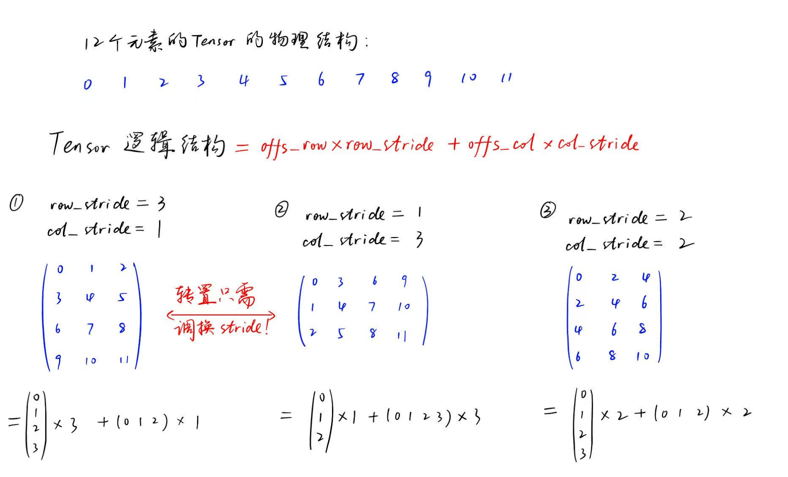


## Kernel

### Vector Add

#### 图解

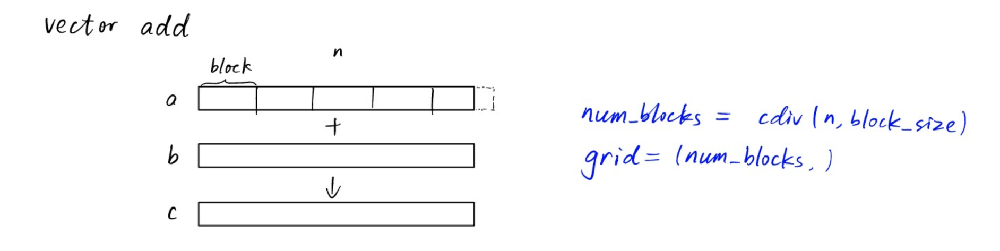

#### 代码

```python
# helper function
def add(a, b, block_size):      # a, b都是torch.tensor, 长度相等，返回a+b
    # 1. init output
    c = torch.zeros_like(a)
    check_tensors_gpu_ready(a, b, c)

    # 2. shape & size
    n = a.numel()
    num_blocks = triton.cdiv(n, block_size)

    # 3. grid def
    grid = (num_blocks, )

    # 4. call kernel
    add_kernel[grid](a, b, c, n, block_size)

    # 5. return
    return c

@triton.jit
def add_kernel(a_ptr, b_ptr, c_ptr, n, BLOCK_SIZE: tl.constexpr):
    # 1. pid
    pid = tl.program_id(0)
    # 2. offset
    offset = pid * BLOCK_SIZE + tl.arange(0, BLOCK_SIZE)
    # 3. mask
    mask = offset < n   # 越界检测
    # 4. load
    a = tl.load(a_ptr + offset, mask)
    b = tl.load(b_ptr + offset, mask)
    # 5. compute
    c = a + b
    # 6. store
    tl.store(c_ptr + offset, c, mask)
```


### Matrix Add

#### 图解

> Tensor在底层都是顺序存储，因此下标是[0, 1, 2, ...]而不是二维下标

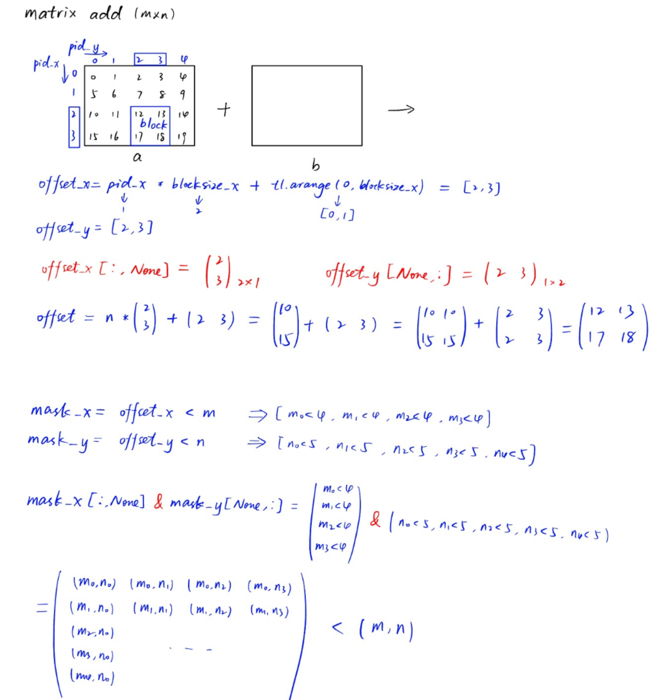

#### 代码

```python
# helper function
def matrix_add(a, b, block_size):   # block_size为长2的元组
    # 1. init output
    c = torch.zeros_like(a)
    # 2. shape & size
    m, n = a.shape
    bs0, bs1 = block_size
    # 3. grid def
    grid = (triton.cdiv(m, bs0), triton.cdiv(n, bs1))
    # 4. call kernel
    matrix_add_kernel[grid](a, b, c, m, n, bs0, bs1)
    # 5. return
    return c


@triton.jit
def matrix_add_kernel(a_ptr, b_ptr, c_ptr, m, n, bs0: tl.constexpr, bs1: tl.constexpr):
    # 1. pid
    pid_x = tl.program_id(0)
    pid_y = tl.program_id(1)

    # 2. offset
    off_x = pid_x * bs0 + tl.arange(0, bs0)
    off_y = pid_y * bs1 + tl.arange(0, bs1)

    offset = off_x[:, None] * n + off_y[None, :]    # 二维offset公式

    # 3. mask
    mask_x = off_x < m      # 行 mask
    mask_y = off_y < n      # 列 mask
    
    mask = mask_x[:, None] & mask_y[None, :]    # 二维mask，注意是'&'不是'+'

    # 4. load
    a = tl.load(a_ptr + offset, mask)
    b = tl.load(b_ptr + offset, mask)

    # 5. compute
    c = a + b

    # 6. store
    tl.store(c_ptr + offset, c, mask)
```


### Matmul

#### 图解

> Tensor在底层都是顺序存储，因此下标是[0, 1, 2, ...]而不是二维下标

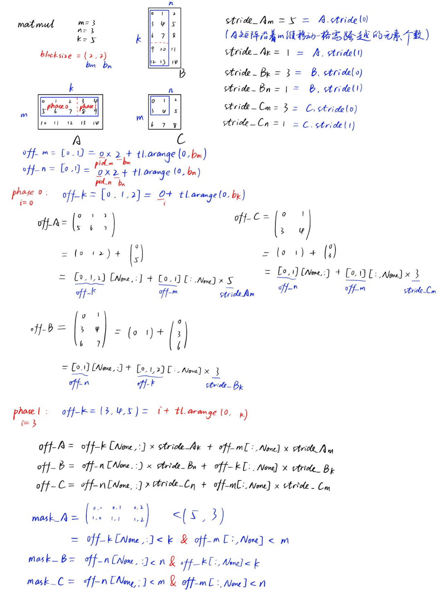

#### 为什么计算mask不需要乘stride?

​	在Triton kernel中，**mask的计算与stride无关的原因**是因为`mask`只用于检查当前线程需要访问的索引是否在矩阵的有效范围内，而不是去计算实际的内存地址。————**mask中只需要存放行号和列号，不需要存一维序号**

​	stride 是用来计算线性存储下实际的内存地址的，比如二维矩阵在一维内存中的布局，需要通过 `row * stride_row + col * stride_col` 来定位元素的具体内存地址,例如计算**`off_A` 和 `off_B`** 时需要用 stride，因为它们需要将矩阵的s逻辑索引（行号、列号）映射到物理内存地址。而 `mask` 的目的是判断某个线程的计算任务是否越界，例如当前线程对应的矩阵行号和列号是否在矩阵的有效维度范围内。这里的索引检查完全基于逻辑坐标（矩阵的行和列号），而不需要映射到内存地址。

具体来看：

- **`off_m[:, None]` 和 `off_k[None, :]`** 是当前线程负责的矩阵块的行号和列号索引。
- **`off_k[None, :] < k` 和 `off_m[:, None] < m`** 是简单地判断这些行号和列号是否落在矩阵的有效范围 `[0, m)` 和 `[0, k)` 中。

因此，mask 的计算只需要与矩阵的逻辑大小（`m, n, k`）相关，而与矩阵在内存中的布局(一维)无关。

> Triton 的 `tl.load` 设计允许我们同时加载一个块（例如 `bm x bn` 的矩阵块）：
>
> - `tl.load` 的输入是二维的逻辑索引（如 `off_A` 和 `off_B`），以及一个同样是二维的 `mask`
> - `mask` 在加载数据时，用来告诉 `tl.load` 哪些逻辑索引越界（会屏蔽掉这些元素，用 `other` 参数填充）

**总结**

- **mask的作用**：判断索引是否越界，只需要用逻辑索引进行对比，不需要stride。
- **stride的作用**：计算内存地址，只有在真正加载或存储数据时才需要考虑。

#### 代码

```python
# helper function
def matmul_triton(A, B, bs=16):
    assert A.shape[1] == B.shape[0], "matrix dims not compatible for matmul"
    check_tensors_gpu_ready(A, B)
    # 1. shape & size
    (m, k), (_, n) = A.shape, B.shape       # m,n,k赋值

    # 2. init output
    C = torch.empty((m, n), device=device, dtype=torch.float16)

    # 3. grid def
    grid = lambda meta: (triton.cdiv(m, meta['bm']),  triton.cdiv(n, meta['bn']))
    
    # 4. call kernel
    matmul_kernel[grid](
        A, B, C,
        m, n, k,
        A.stride(0), A.stride(1),       # stride是PyTorch内置函数，返回指定维度上移动一个元素所跨过的元素数量
        B.stride(0), B.stride(1),       # 在行维度上，元素是连续的，因此移动一个元素只需要跨越一个元素，及stride(0)=1
        C.stride(0), C.stride(1),       # 在列维度上，移动一个元素需要跨越一整行元素，即stride(1) = 每行元素个数
        bm=bs, bn=bs, bk=bs,
    )
    
    # return
    return C

@triton.jit
def matmul_kernel(
    a_ptr, b_ptr, c_ptr,
    m, n, k,
    stride_am, stride_ak, 
    stride_bk, stride_bn,
    stride_cm, stride_cn,
    bm: tl.constexpr, bn: tl.constexpr, bk: tl.constexpr
):
    # 1. pid
    pid_m, pid_n = tl.program_id(0), tl.program_id(1)
    
    # 2. offset & mask
    off_m = pid_m * bm + tl.arange(0, bm)
    off_n = pid_n * bn + tl.arange(0, bn)

    # initialize accumulator (累加器，存放矩阵乘积)
    acc = tl.zeros((bm, bn), dtype=tl.float32)
    for i in range(0, k, bk):       # 每层循环计算一个phase
        off_k = i + tl.arange(0, bk)
    
        # offs_A, offs_B都是下标矩阵， 表示当前线程内相乘的两个矩阵在原矩阵对应的下标
        off_A = off_k[None, :] * stride_ak + off_m[:, None] * stride_am
        mask_A = (off_k[None, :] < k) & (off_m[:, None] < m)

        off_B = off_n[None, :] * stride_bn + off_k[:, None] * stride_bk
        mask_B = (off_n[None, :] < n) & (off_k[:, None] < k)
        
        # 3. load & 计算
        A = tl.load(a_ptr + off_A, mask_A, other=0.0)
        B = tl.load(b_ptr + off_B, mask_B, other=0.0)
        acc += tl.dot(A, B, allow_tf32=False)
        
    # 此时的acc就是一个小矩阵（最终结果的一部分），因此可以直接fuse激活函数
    # acc = relu(acc)
    
    # 4. store
    off_C = off_n[None, :] * stride_cn + off_m[:, None] * stride_cm
    mask_C = (off_n[None, :] < m) & (off_m[:, None] < n)
    tl.store(c_ptr + off_C, acc, mask=mask_C)

```


#### 优化：Grouped ordering

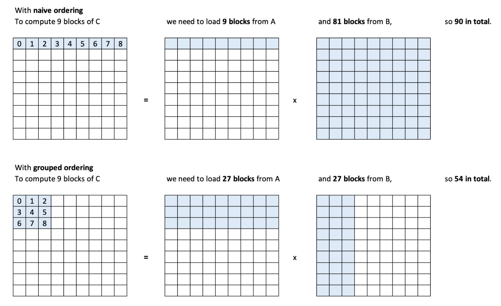

+ **图中的每个格子都是一个block，而不是矩阵中的一个元素**
+ 默认的block读取顺序为第一行，即行优先依次读取
+ 将block读取顺序修改为第二行的样子，就可以增加L2 cache的命中率

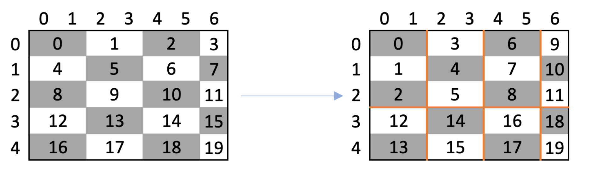

+ 核心：修改block下标，从而改变读取block的顺序（==**不是修改矩阵元素的下标！！！**==）

+ 例如：调用内核时以为要读取下标(0,1)的block，结果读取了(1,0)的block

##### 二维grid：swizzle2d

```python
@jit
def swizzle2d(i, j, size_i, size_j, size_g):
    """
    修改矩阵下标的顺序，变为以边长size_g的小正方形为单位,小正方形内部采用列优先的顺序
    并行函数，即不同下标的block同时调用
    (i,j)为当前block所在原grid矩阵下标, 返回在新矩阵中的下标(new_i, new_j)
    size_i,size_j为grid矩阵行列长度(即行列各有多少block)，size_g表示几行作为一个group
    eg. size_i = size_j = 4 and size_g = 2, 转换前后矩阵如下（每个序号表示一个block而不是矩阵元素）
    [[0 , 1 , 2 , 3 ],
     [4 , 5 , 6 , 7 ],
     [8 , 9 , 10, 11],
     [12, 13, 14, 15]]
    ->	# 两行为一个group, 每个group有8个block，包含一行2个小正方形
    [[0, 2,  4 , 6 ],
     [1, 3,  5 , 7 ],
     [8, 10, 12, 14],
     [9, 11, 13, 15]]
    """
    ij = i * size_j + j				# 当前block在原矩阵中对应的序号
    
    size_gj = size_g * size_j		# 即一个group中包含多少block
    
    group_id = ij // size_gj		# 当前block在第几个group
    # row-index of the first element of this group
    off_i = group_id * size_g		# 当前group的第一个block所在行号
    # last group may have fewer rows
    size_g = core.minimum(size_i - off_i, size_g)	# 还剩多少有效行
    # new row and column indices
    new_i = off_i + (ij % size_g)		# 新行号=当前block应是小正方形的第几行+小正方形的起始行(off_i)
    new_j = (ij % size_gj) // size_g	# 新列号=当前group的第几个元素 // 剩余行数
    return new_i, new_j
```


##### 一维grid

> triton document官方方法

```python
pid = tl.program_id(axis=0)			# block序号（通过pid直接获得，不需要通过下标计算）

num_pid_m = tl.cdiv(M, BLOCK_SIZE_M)	# grid矩阵行数（列方向有多少block）
num_pid_n = tl.cdiv(N, BLOCK_SIZE_N)	# grid矩阵列数（行方向有多少block）

num_pid_in_group = GROUP_SIZE_M * num_pid_n		# 一个group中包含多少block

group_id = pid // num_pid_in_group				# 当前block在第几个group

first_pid_m = group_id * GROUP_SIZE_M			# 当前group的第一个block所在行号

group_size_m = min(num_pid_m - first_pid_m, GROUP_SIZE_M)	# 还剩多少有效行

pid_idx_in_group = pid % num_pid_in_group		# 当前block是所在group的第几个元素
# 计算当前block所在新矩阵下标(pid_m, pid_n)
pid_m = first_pid_m + (pid_idx_in_group % group_size_m)	
						# 新行号=当前block应是小正方形的第几行+小正方形的起始行(first_pid_m)
pid_n = pid_idx_in_group // group_size_m	# 新列号=当前group的第几个元素 // 剩余行数
```


##### 优化后代码

```python
@triton.jit
def grouped_matmul_kernel(
    a_ptr, b_ptr, c_ptr,
    m, n, k,
    stride_am, stride_ak, 
    stride_bk, stride_bn,
    stride_cm, stride_cn,
    bm: tl.constexpr, bn: tl.constexpr, bk: tl.constexpr
):
    # 1. pid
    pid_m, pid_n = tl.program_id(0), tl.program_id(1)
    
    # 仅须修改下面两行
    num_pid_m, num_pid_n = tl.num_programs(0), tl.num_programs(1)   # 获取行列各分成多少block
    pid_m, pid_n = tl.swizzle2d(pid_m, pid_n, num_pid_m, num_pid_n, group_sz)
    """
    假设triton给当前block分配的program_id为(0, 2), 但此函数人为改为(2, 0).
    这样就可以用原来的算法来计算offset,从而读取另一块内存, 不需要修改下面的代码
    """
    
    
    # 2. offset & mask
    off_m = pid_m * bm + tl.arange(0, bm)
    off_n = pid_n * bn + tl.arange(0, bn)

    # initialize accumulator (累加器，存放矩阵乘积)
    acc = tl.zeros((bm, bn), dtype=tl.float32)
    for i in range(0, k, bk):       # 每层循环计算一个phase
        off_k = i + tl.arange(0, bk)
    ara
        # offs_A, offs_B都是下标矩阵， 表示当前线程内相乘的两个矩阵在原矩阵对应的下标
        off_A = off_k[None, :] * stride_ak + off_m[:, None] * stride_am
        mask_A = (off_k[None, :] < k) & (off_m[:, None] < m)

        off_B = off_n[None, :] * stride_bn + off_k[:, None] * stride_bk
        mask_B = (off_n[None, :] < n) & (off_k[:, None] < k)
        
        # 3. load & 计算
        A = tl.load(a_ptr + off_A, mask_A, other=0.0)
        B = tl.load(b_ptr + off_B, mask_B, other=0.0)
        acc += tl.dot(A, B, allow_tf32=False)
        
    # 此时的acc就是一个小矩阵（最终结果的一部分），因此可以直接fuse激活函数
    # acc = relu(acc)
    
    # 4. store
    off_C = off_n[None, :] * stride_cn + off_m[:, None] * stride_cm
    mask_C = (off_n[None, :] < m) & (off_m[:, None] < n)
    tl.store(c_ptr + off_C, acc, mask=mask_C)
```


### Batched GEMM

> 多了一个batch维度, 需要在batch维度分块
>
> 只需要将offset加上当前batch维度的第一个元素下标(batch_idx * batch_stride)
>
> ```python
> batch_idx = tl.program_id(0)
> offset_batch = batch_idx + batch_stride
> offset += offset_batch
> ```

#### A(B, M, K) @ B(K, N) -> C(B, M, N)

> 用于LLM FFN:A(B, T, Cin) @ B(Cin, Cout) -> C(B, T, Cout)
>
> bias: (1, N)——MxN矩阵中的每列元素加的bias常量值都不一样

```python
def matmul_triton1(A: torch.Tensor, B: torch.Tensor, bias: Optional[torch.Tensor] = None, activation: Optional[str] = None) -> torch.Tensor:
    """
    Implements matrix multiplication between input matrix A and B
    
    Args:
        - A {torch.Tensor}: Input matrix with shape (B, T, Cin) where B is the batch size, T is the sequence length, Cin is the input dimension
        - B {torch.Tensor}: Weight matrix with shape (Cin, Cout) where Cout is the hidden dimension
        - bias {torch.Tensor}: Optionally add a bias to the ouput, shape (1, Cout)
        - activation {str}: Optionally apply activation to the ouput

    Returns:
        - {torch.Tensor}: Output tensor with (B, T, Cout)
    """
    assert len(A.shape) == 3, "First input matrix needs to have 3 dimensions (B, T, C)"
    assert A.device == B.device and A.is_cuda, "Both matrix should be on GPU"

    if bias is not None:
        assert bias.is_cuda, "Bias is not on GPU"
        bias = bias.unsqueeze(0)
        assert bias.shape[1] == B.shape[1], "Bias shape does not match output feature dimension shape"

    if activation:
        assert activation in ["gelu"], f"Only GELU activation supported as of now! Provided: {activation}"

    batch_size, M, K = A.shape
    K, N = B.shape

    grid = lambda meta: (batch_size, triton.cdiv(M, meta["bm"]), triton.cdiv(N, meta["bn"]))

    C = torch.empty((batch_size, M, N), device=A.device, dtype=A.dtype)

    matmul_kernel1[grid](
        A, B, C,
        M=M, N=N, K=K,
        A_stride_batch=A.stride(0),
        A_stride_height=A.stride(1), A_stride_width=A.stride(2),
        B_stride_height=B.stride(0), B_stride_width=B.stride(1),
        C_stride_batch=C.stride(0),
        C_stride_height=C.stride(1), C_stride_width=C.stride(2),
        bias_ptr=bias,
        add_bias=True if bias is not None else False,
        activation=activation,
        apply_activation=True if activation else False,
        bm=16, bn=16, bk=16, group_sz=16
    )

    return C


@triton.jit
def matmul_kernel1(
    a_ptr, b_ptr, c_ptr,
    M, N, K,
    A_stride_batch, A_stride_height, A_stride_width,
    B_stride_height, B_stride_width,
    C_stride_batch, C_stride_height, C_stride_width,
    bias_ptr, add_bias:tl.constexpr,
    activation, apply_activation:tl.constexpr,
    bm: tl.constexpr, bn: tl.constexpr, bk: tl.constexpr,
    group_sz: tl.constexpr
):
    # 1. pid
    batch_idx = tl.program_id(0)
    pid_m, pid_n = tl.program_id(1), tl.program_id(2)
    num_pid_m, num_pid_n = tl.num_programs(1), tl.num_programs(2)
    pid_m, pid_n = tl.swizzle2d(pid_m, pid_n, num_pid_m, num_pid_n, group_sz)  
    
    # 2. offset & mask
    off_m = pid_m * bm + tl.arange(0, bm)
    off_n = pid_n * bn + tl.arange(0, bn)

    A_offset_batch = batch_idx * A_stride_batch
    C_offset_batch = batch_idx * C_stride_batch

    # initialize accumulator (累加器，存放矩阵乘积)
    acc = tl.zeros((bm, bn), dtype=tl.float32)
    for i in range(0, K, bk):       # 每层循环计算一个phase
        off_k = i + tl.arange(0, bk)
    
        # offs_A, offs_B都是下标矩阵， 表示当前线程内相乘的两个矩阵在原矩阵对应的下标
        off_A = off_k[None, :] * A_stride_width + off_m[:, None] * A_stride_height
        mask_A = (off_k[None, :] < K) & (off_m[:, None] < M)

        off_B = off_n[None, :] * B_stride_width + off_k[:, None] * B_stride_height
        mask_B = (off_n[None, :] < N) & (off_k[:, None] < K)
        
        # 3. load & 计算
        A = tl.load(a_ptr + off_A + A_offset_batch, mask_A, other=0.0)
        B = tl.load(b_ptr + off_B, mask_B, other=0.0)
        acc += tl.dot(A, B, allow_tf32=False)
    
    # 此时的acc就是一个小矩阵，因此可以直接加bias/激活函数
    if add_bias:
        bias = tl.load(bias_ptr + off_n, off_n < N)
        acc += bias[None, :]

    # if apply_activation:
    #     if activation == 'gelu':
    #         output = gelu(output)
    
    # 4. store
    off_C = off_n[None, :] * C_stride_width + off_m[:, None] * C_stride_height
    mask_C = (off_n[None, :] < N) & (off_m[:, None] < M)

    # print_if(f"off_C = {off_C}, \nmask_C = {mask_C}", '')
    tl.store(c_ptr + off_C + C_offset_batch, acc, mask=mask_C)
```


#### A(M, K) @ B(B, K, N) -> C(B, M, N)

> 用于conv2d+im2col
>
> bias:(B, 1)——MxN矩阵中的每个元素加的bias常量值都一样, 只有在B维度上bias才不同

```python
def matmul_triton2(A: torch.Tensor, B: torch.Tensor, bias: Optional[torch.Tensor] = None, activation: Optional[str] = None) -> torch.Tensor:
    """
    Implements matrix multiplication between input matrix A and B
    
    Args:
        - A {torch.Tensor}: Input matrix with shape (M, K)
        - B {torch.Tensor}: Weight matrix with shape (B, K, N)
        - bias {torch.Tensor}: Optionally add a bias to the ouput, shape (B, 1)
        - activation {str}: Optionally apply activation to the ouput

    Returns:
        - {torch.Tensor}: Output tensor with (B, M, N)
    """
    assert len(B.shape) == 3, f"Second input matrix needs to have 3 dimensions (B, K, N) but {B.shape}"
    assert A.device == B.device and A.is_cuda, "Both matrix should be on GPU"

    if bias is not None:
        assert bias.is_cuda, "Bias is not on GPU"
        assert bias.shape[0] == B.shape[0], "Bias shape does not match output feature dimension shape"

    if activation:
        assert activation in ["gelu"], f"Only GELU activation supported as of now! Provided: {activation}"

    M, K = A.shape
    batch_size, K, N = B.shape

    grid = lambda meta: (batch_size, triton.cdiv(M, meta["bm"]), triton.cdiv(N, meta["bn"]))

    C = torch.empty((batch_size, M, N), device=A.device, dtype=A.dtype)

    matmul_kernel2[grid](
        A, B, C,
        M=M, N=N, K=K,
        A_stride_height=A.stride(0), A_stride_width=A.stride(1),
        B_stride_batch=B.stride(0), B_stride_height=B.stride(1), B_stride_width=B.stride(2),
        C_stride_batch=C.stride(0), C_stride_height=C.stride(1), C_stride_width=C.stride(2),
        bias_ptr=bias,
        add_bias=True if bias is not None else False,
        activation=activation,
        apply_activation=True if activation else False,
        bm=16, bn=16, bk=16, group_sz=16
    )

    return C


@triton.jit
def matmul_kernel2(
    a_ptr, b_ptr, c_ptr,
    M, N, K,
    A_stride_height, A_stride_width,
    B_stride_batch, B_stride_height, B_stride_width,
    C_stride_batch, C_stride_height, C_stride_width,
    bias_ptr, add_bias: tl.constexpr,
    activation, apply_activation:tl.constexpr,
    bm: tl.constexpr, bn: tl.constexpr, bk: tl.constexpr,
    group_sz: tl.constexpr
):
    # 1. pid
    batch_idx = tl.program_id(0)
    pid_m, pid_n = tl.program_id(1), tl.program_id(2)
    num_pid_m, num_pid_n = tl.num_programs(1), tl.num_programs(2)
    pid_m, pid_n = tl.swizzle2d(pid_m, pid_n, num_pid_m, num_pid_n, group_sz)  
    
    # 2. offset & mask
    off_m = pid_m * bm + tl.arange(0, bm)
    off_n = pid_n * bn + tl.arange(0, bn)

    B_offset_batch = batch_idx * B_stride_batch
    C_offset_batch = batch_idx * C_stride_batch

    # initialize accumulator (累加器，存放矩阵乘积)
    acc = tl.zeros((bm, bn), dtype=tl.float32)
    for i in range(0, K, bk):       # 每层循环计算一个phase
        off_k = i + tl.arange(0, bk)
    
        # offs_A, offs_B都是下标矩阵， 表示当前线程内相乘的两个矩阵在原矩阵对应的下标
        off_A = off_k[None, :] * A_stride_width + off_m[:, None] * A_stride_height
        mask_A = (off_k[None, :] < K) & (off_m[:, None] < M)

        off_B = off_n[None, :] * B_stride_width + off_k[:, None] * B_stride_height
        mask_B = (off_n[None, :] < N) & (off_k[:, None] < K)
        
        # 3. load & 计算
        A = tl.load(a_ptr + off_A, mask_A, other=0.0)
        B = tl.load(b_ptr + off_B + B_offset_batch, mask_B, other=0.0)
        acc += tl.dot(A, B, allow_tf32=False)
    
    # 此时的acc就是一个小矩阵，因此可以直接加bias/激活函数
    if add_bias:
        bias = tl.load(bias_ptr + batch_idx)
        acc += bias

    # if apply_activation:
    #     if activation == 'gelu':
    #         output = gelu(output)
    
    # 4. store
    off_C = off_n[None, :] * C_stride_width + off_m[:, None] * C_stride_height
    mask_C = (off_n[None, :] < N) & (off_m[:, None] < M)

    # print_if(f"off_C = {off_C}, \nmask_C = {mask_C}", '')
    tl.store(c_ptr + off_C + C_offset_batch, acc, mask=mask_C)
```


### Transpose2D-1

#### 图解

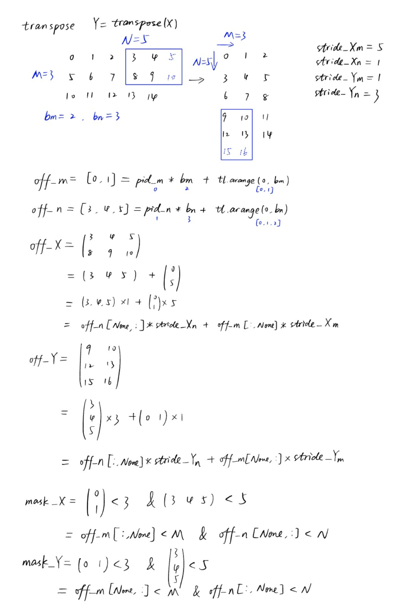

#### 代码

```python
def transpose2d_triton(x):
    check_tensors_gpu_ready(x)
    M, N = x.shape
    y = torch.empty((N, M), device=device, dtype=torch.float16)

    grid = lambda META: (triton.cdiv(M, META['bm']), triton.cdiv(N, META['bn']))
    
    transpose_kernel[grid](x, y, M, N, x.stride(0), x.stride(1), y.stride(0), y.stride(1))

    return y

@triton.jit
def transpose_kernel(
    x_ptr,
    y_ptr,
    M,
    N,
    stride_xm,
    stride_xn,
    stride_yn,
    stride_ym,
    bm: tl.constexpr = 16, bn: tl.constexpr = 16
):
    pid_m, pid_n = tl.program_id(0), tl.program_id(1)

    off_m = pid_m * bm + tl.arange(0, bm)
    off_n = pid_n * bn + tl.arange(0, bn)

    off_X = off_n[None, :] * stride_xn + off_m[:, None] * stride_xm
    off_Y = off_n[:, None] * stride_yn + off_m[None, :] * stride_ym

    mask_X = (off_m[:, None] < M) & (off_n[None, :] < N)
    mask_Y = (off_m[None, :] < M) & (off_n[:, None] < N)

    x = tl.load(x_ptr + off_X, mask=mask_X)
    x_t = tl.trans(x)
    tl.store(y_ptr + off_Y, x_t, mask=mask_Y)
```


### Transpose2D-2

> 利用stride改变矩阵结构的特性，直接修改内存读入逻辑即可实现转置

#### 图解

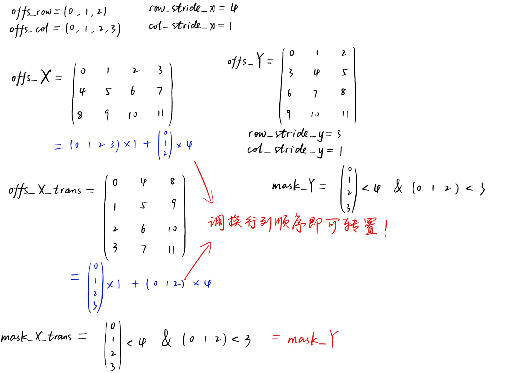

#### 代码

```python
def transpose2d_triton(x):
    check_tensors_gpu_ready(x)
    M, N = x.shape
    y = torch.empty((N, M), device=device, dtype=torch.float16)

    grid = lambda META: (triton.cdiv(M, META['bm']), triton.cdiv(N, META['bn']))
    
    transpose_kernel[grid](x, y, M, N, x.stride(0), x.stride(1), y.stride(0), y.stride(1))

    return y

@triton.jit
def transpose_kernel(
    x_ptr,   # input
    y_ptr,   # output
    M,       # number of rows of x
    N,       # number of columns of x
    row_stride_x,
    col_stride_x,
    row_stride_y,
    col_stride_y,
    bm: tl.constexpr = 16, bn: tl.constexpr = 16
):
    pid_m, pid_n = tl.program_id(0), tl.program_id(1)

    offs_row = pid_m * bm + tl.arange(0, bm)
    offs_col = pid_n * bn + tl.arange(0, bn)

    # offs_X = offs_col[None, :] * col_stride_x + offs_row[:, None] * row_stride_x
    offs_X_trans = offs_col[:, None] * col_stride_x + offs_row[None, :] * row_stride_x      # 调换行列顺序即可转置！
    # mask_X_trans = (offs_col[:, None] < N) & (offs_row[None, :] < M)


    offs_Y = offs_col[:, None] * row_stride_y + offs_row[None, :] * col_stride_y
    # mask_Y = (offs_col[:, None] < N) & (offs_row[None, :] < M)

    mask = (offs_col[:, None] < N) & (offs_row[None, :] < M)        # mask_X_trans = mask_Y

    x = tl.load(x_ptr + offs_X_trans, mask=mask)
    # print_if(x, '')
    tl.store(y_ptr + offs_Y, x, mask=mask)
```


### Conv2d(Naive)

#### 代码

> from [cmeraki/vit.triton: VIT inference in triton because, why not?](https://github.com/cmeraki/vit.triton)

```python
def conv2d_triton(
    input: torch.Tensor,		# (batch_size, Cin, h, w)
    kernel: torch.Tensor,		# (Cout, Cin, kernel_height, kernel_width)
    bias: torch.Tensor			# (Cout, 1)
) -> torch.Tensor:
    assert input.is_cuda and kernel.is_cuda, 'Input or kernel is not on GPU'
    assert len(input.shape) == 4, f'Input needs to be 4 dimensional, provided: {input.shape}'
    assert len(kernel.shape) == 4, f'Kernel size needs to be 4 dimensional, provided: {kernel.shape}'
    assert bias.shape[0] == kernel.shape[0], f'Bias dimension should be same as the kernel 1st dimension'

    batch_size, channels, height, width = input.shape
    num_kernels, kernel_depth, kernel_height, kernel_width = kernel.shape

    assert height%kernel_height == 0 and width%kernel_width == 0, f"Input height and width should be divisible by the kernel height and width"
    assert channels == kernel_depth, f"Kernel channel depth ({kernel_depth}) and input channel depth ({channels}) should be same"

    output = torch.empty((batch_size, num_kernels, height//kernel_height, width//kernel_width), device=device, dtype=dtype)			# kernel步长为kernel边长(即每次计算不会重叠)

    BLOCK_SIZE_ROW = triton.next_power_of_2(kernel_height)
    BLOCK_SIZE_COL = triton.next_power_of_2(kernel_width)
    
    # 每个kernel计算输出矩阵的一行（input所有channel一起计算）
    grid = (batch_size, num_kernels, height//kernel_height)

    conv2d_kernel[grid](
        input_ptr=input,
        input_batch_stride=input.stride(0),			# Cin * h * w
        input_channel_stride=input.stride(1),		# h * w
        input_row_stride=input.stride(2),			# w
        input_col_stride=input.stride(3),			# 1
        height=height,
        width=width,
        channels=channels,
        kernel_ptr=kernel,
        kernel_height=kernel_height,
        kernel_width=kernel_width,
        kernel_dim_stride=kernel.stride(0),			# Cin(kernel_depth) * kernel_height * kernel_width
        kernel_channel_stride=kernel.stride(1),		# kernel_height * kernel_width
        kernel_row_stride=kernel.stride(2),			# kernel_width
        kernel_col_stride=kernel.stride(3),			# 1
        bias_ptr=bias,
        output_ptr=output,
        output_width=width//kernel_width,
        output_batch_stride=output.stride(0),		# Cout * Hout * Wout
        output_channel_stride=output.stride(1),		# Hout * Wout
        output_row_stride=output.stride(2),			# Wout
        output_col_stride=output.stride(3),			# 1
        BLOCK_SIZE_ROW=BLOCK_SIZE_ROW,
        BLOCK_SIZE_COL=BLOCK_SIZE_COL,
    )

    return output

@triton.jit
def conv2d_kernel(
    input_ptr,
    input_batch_stride,		
    input_channel_stride,	
    input_row_stride,		
    input_col_stride,		
    height,
    width,
    channels,
    kernel_ptr,
    kernel_height,
    kernel_width,
    kernel_dim_stride,		
    kernel_channel_stride,	
    kernel_row_stride,		
    kernel_col_stride,		
    bias_ptr,
    output_ptr,
    output_width,
    output_batch_stride,
    output_channel_stride,
    output_row_stride,
    output_col_stride,
    BLOCK_SIZE_ROW: tl.constexpr,
    BLOCK_SIZE_COL: tl.constexpr
):
    batch_idx = tl.program_id(0)
    kernel_idx = tl.program_id(1)	# 相当于输出channel的序号（一个kernel对应一个output channel)
    row_idx = tl.program_id(2)		

    # Bias offset and data
    bias_offset = kernel_idx
    bias = tl.load(bias_ptr + bias_offset)

    # Input data offsets
    batch_offset = batch_idx*input_batch_stride		# 当前batch的起始序号

    # Output data offsets
    output_batch_offset = batch_idx*output_batch_stride			# 当前batch的起始序号
    output_channel_offset = kernel_idx*output_channel_stride	# 当前channel的起始序号
    output_row_offset = row_idx*output_row_stride				# 当前行的起始序号 

    # 计算Kernel offsets
    kernel_row_offset = tl.arange(0, BLOCK_SIZE_ROW)
    kernel_row_mask = kernel_row_offset[:, None] < kernel_height
    kernel_row_offset = kernel_row_offset[:, None]*kernel_row_stride
    kernel_col_offset = tl.arange(0, BLOCK_SIZE_COL)
    kernel_col_mask = kernel_col_offset[None, :] < kernel_width
    kernel_col_offset = kernel_col_offset[None, :]*kernel_col_stride
    
    kernel_mask = kernel_row_mask & kernel_col_mask

    
    for col_idx in range(output_width):		# 按列循环(即每次计算一个元素)
        elem = 0.0
		
        # 计算input offset
        input_row_offset = row_idx * kernel_height + tl.arange(0, BLOCK_SIZE_ROW)
        input_row_mask = input_row_offset[:, None] < height
        input_row_offset = input_row_offset[:, None]*input_row_stride

        input_col_offset = col_idx * kernel_width + tl.arange(0, BLOCK_SIZE_ROW)
        input_col_mask = input_col_offset[None, :] < width
        input_col_offset = input_col_offset[None, :]*input_col_stride
      	
        input_mask = input_row_mask & input_col_mask

        
        for c in range(channels):		# Input 所有channel都要计算
            input_offset = input_ptr + batch_offset + c*input_channel_stride + input_row_offset + input_col_offset
            input_data = tl.load(input_offset, input_mask) # BLOCK_SIZE_ROW x BLOCK_SIZE_COL

            # 每个input channel都有独自的kernel(2d)
            kernel_offset = kernel_ptr + kernel_idx*kernel_dim_stride + c*kernel_channel_stride + kernel_row_offset + kernel_col_offset
            kernel_data = tl.load(kernel_offset, kernel_mask)
            dot_prdct = input_data * kernel_data
            elem += tl.sum(dot_prdct)

        # Store to output for the current channel
        output_offset = output_ptr + output_batch_offset + output_channel_offset + output_row_offset + col_idx
        tl.store(output_offset, elem + bias)	# elem和bias都是标量

```


#### 图解

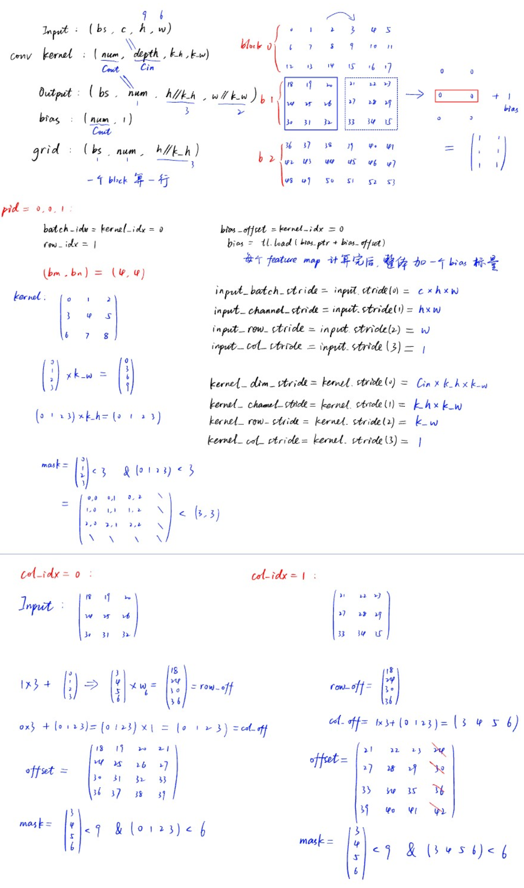

+ 如图可知, 此代码限定kernel边长为2的幂次，否则load Input时会出错
+ 以上图为例：kernel边长为3时，blocksize边长为4，kernel可以正确load，
  但Input会读入4x4矩阵，与kernel size不一致，会导致计算出错


### Conv2d->Gemm(Img2col)

#### 原理

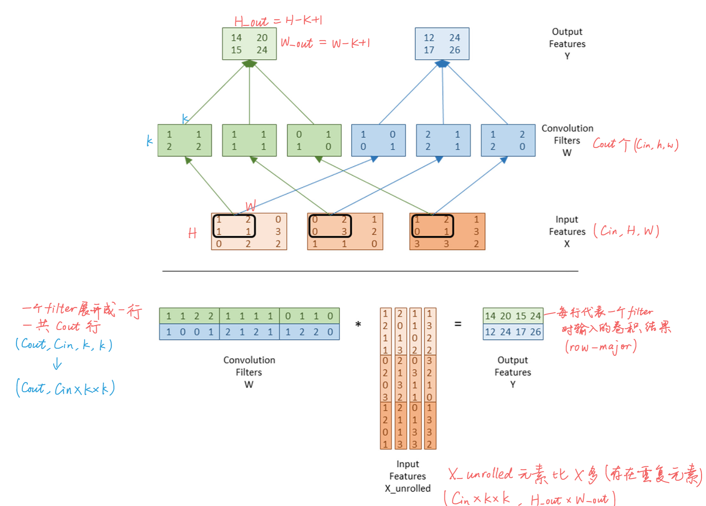

#### Unroll实现

##### python native

```python
# stride = 1
def unroll(K, X):
    B, C, H, W = X.shape
    H_out, W_out = H-K+1, W-K+1
    X_unroll = torch.zeros(B, C*K*K, H_out*W_out, device=device)
    for c in range(C):      # 对于每个channel——每次计算（k*k, H_out*W_out)这一部分
        col_idx = 0
        for h in range(H_out):
            for w in range(W_out):      # 每列起始坐标(h, w)
                # 将X(h, w)开始的K*K个元素存入X_unroll
                for i in range(K):
                    for j in range(K):
                        row_idx = i*K+j + c*K*K         # 当前部分的第几行+当前部分的起始行
                        X_unroll[:, row_idx, col_idx] = X[:, c, h+i, w+j]
                col_idx += 1            # 进入X_unroll的下一列

    return X_unroll
```

```python
# 支持自定义stride
def unroll(X, K, stride=1):
    B, C, H, W = X.shape
    H_out, W_out = (H - K) // stride + 1, (W - K) // stride + 1
    X_unroll = torch.zeros(B, C*K*K, H_out*W_out, dtype = X.dtype, device=X.device)
    for c in range(C):
        col_idx = 0
        h = 0
        for _ in range(H_out):
            w = 0
            for _ in range(W_out):
                print(f"({h}, {w})")
                # 将X(h, w)开始的K*K个元素存入X_unroll
                for i in range(K):
                    for j in range(K):
                        row_idx = i*K+j + c*K*K         # 当前部分的第几行+当前部分的起始行
                        X_unroll[:, row_idx, col_idx] = X[:, c, h+i, w+j]
                col_idx += 1            # 进入X_unroll的下一列
                w += stride
            h += stride
    return X_unroll
```

### Low-bit Matmul

#### 量化公式（线性量化）

> r表示需要量化的浮点数tensor, q表示量化后的tensor
> $r_{max}、r_{min}是实际tensor的最值, 而q_{max}、q_{min}是int类型的最值$
> $例如：进行int8量化时, q_{max}=127, q_{min}=-128$

**非对称量化**

+ scale factor
  $$
  scale = \frac{r_{max}-r_{min}}{q_{max}-q_{min}}
  $$

+ zero point
  $$
  zero = int(round(q_{min}-\frac{r_{min}}{scale}))
  $$

+ quantize(fp->int)
  $$
  q = int(round(\frac{r}{scale}+zero))
  $$

+ dequantize(int->fp)
  $$
  dq = scale * (q-zero)
  $$


**对称量化（zero point=0)**

+ scale factor
  $$
  scale = \frac{r_{max}}{q_{max}}
  $$

+ quantize(fp->int)
  $$
  q = int(round(\frac{r}{scale}))
  $$

+ dequantize(int->fp)
  $$
  dq = scale * q
  $$


#### 量化流程

> C = matmul(A, dequantize(B, scales, zeros))

1. 在外部量化(计算scale/zero_point, q = int(r/s + z) + bitpack完成后，将q, s, z传入kernel
2. kernel内部:
   1. load
   2. unpack+dequantize(dq = s(q-z))
   3. matmul
   4. store

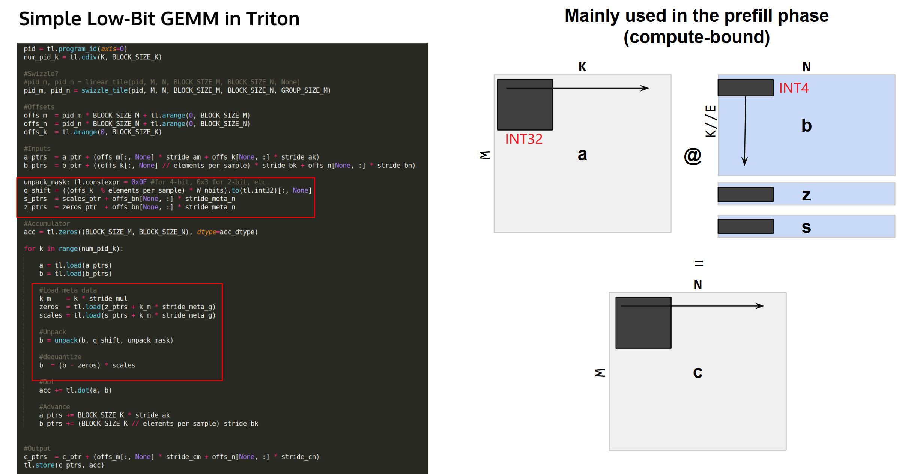

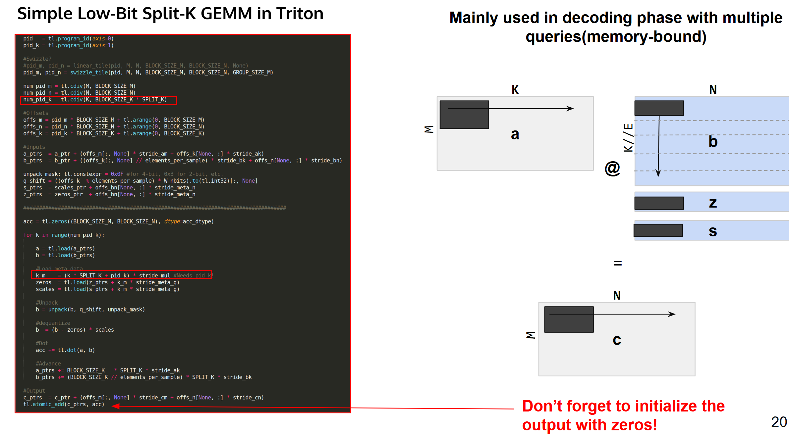

+ Split-K指在K维也分块并行化(而不是在一个kernel中用for循环), 适用于K维很大, 单个kernel内部存不下的情况

区别：

1. K维的block个数(num_pid_k)从`cdiv(K, BLOCKSIZE_K)`变为'cdiv(K, BLOCKSIZE_K * Split_K)'
   split_K = 1 时，等同于GEMM
2. **写入结果时必须用`tl.atomic_add`而不是`tl.store`**

**load weight scale的两种情况：**

+ per-group quantization: scale和zero point需要在GEMM loop中load
+ per-channel quantization: scale 需要在GEMM loop结束后load


### FlashAttention-V2

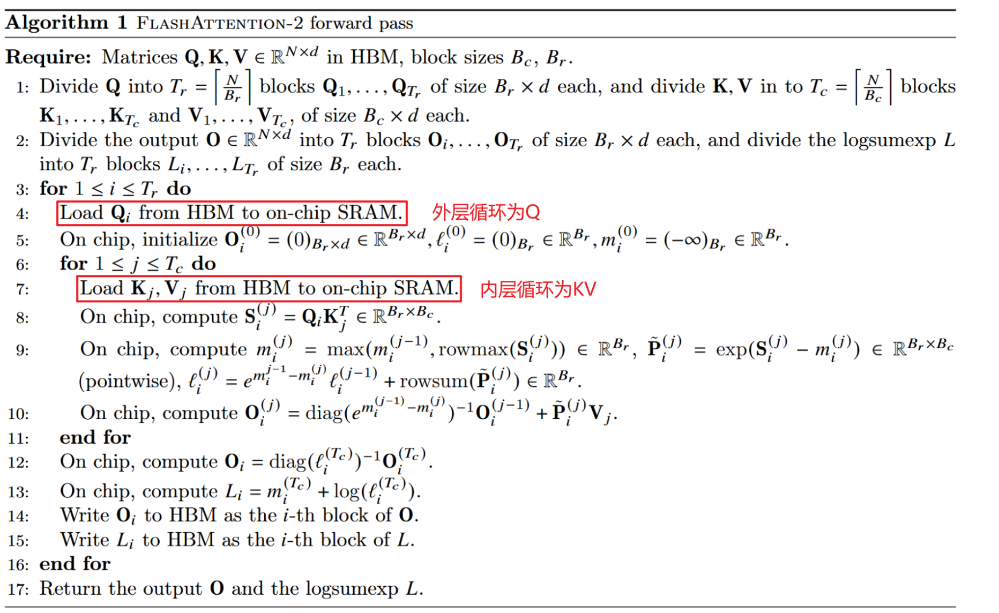

#### helper function