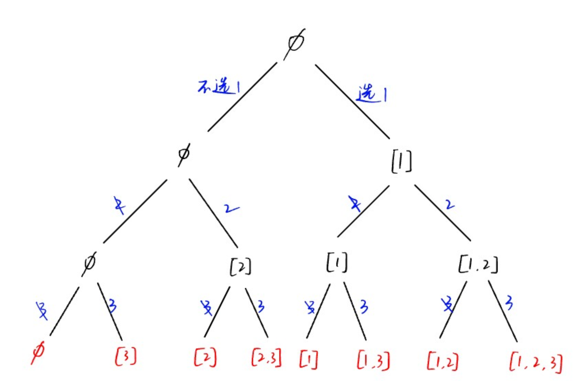
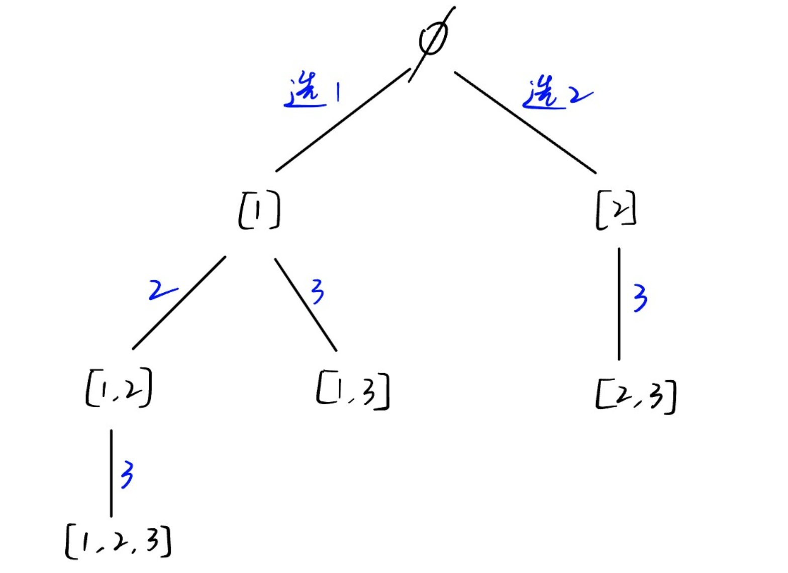

## 实用API

### 输入输出

#### python

```python
# 1. input()读取一整行（字符串）
s = input()

# 2. 一行用分隔符拆分的多个字符串（默认用空格拆分）
a, b = input().split()  # 输入: hello world
						 # a = "hello", b = "world"
a, b = input().split(",")	# 输入: hello,world
							 # a = "hello", b = "world"

# 3. map+int 读取整数
a, b = map(int, input().split())  # 输入: 10 20
								   # a = 10, b = 20

# 4. 一行多个整数转为列表
nums = list(map(int, input().split()))  # 输入: 1 2 3 4
										 # nums = [1, 2, 3, 4]

# 5. 多行输入（for循环）
n = int(input())		# 第一行一个整数n
for _ in range(n):		# 接下来n行，每行两个整数
    a, b = map(int, input().split())
    print(a + b)

# 一次性读入所有输入
import sys

data = sys.stdin.read().split()  # 所有输入按空格或换行拆分
nums = list(map(int, data))
```

#### C++

```C++
// 1. 读入一整行
string s;
getline(cin, s);
```


#### 图

1. 邻接矩阵

```c++
int m, n;
int G[maxn][maxn];
int main() {
    fill(G[0], G[0] + maxn*maxn, 0);
    cin >> m >> n;
    for(int i = 0; i < m; i++) {
        for(int j = 0; j < n; j++) {
            cin >> G[i][j];        
        }
    }
}
```


### python

#### Counter

> 类似c++ STL的map

```python
from collections import Counter

# 用法1: 统计列表/字符串元素出现次数（直接传入括号）
lst = ['apple', 'banana', 'apple', 'orange', 'banana', 'apple']
counter = Counter(lst)		# 一个map, 统计元素出现次数
print(counter)	# Counter({'apple': 3, 'banana': 2, 'orange': 1})

s = "hello world"
counter = Counter(s)
print(counter)	# Counter({'l': 3, 'o': 2, 'h': 1, 'e': 1, ' ': 1, 'w': 1, 'r': 1, 'd': 1})

# 用法2：单独添加元素并计数
counter = Counter()
counter['l'] += 2	# 可以单独添加字符
counter['l'] -= 1	# 可以增减计数

# 用法3: 使用 .most_common(n) 获取出现频率最高的 n 个元素
counter = Counter("abracadabra")
print(counter.most_common(2))	# [('a', 5), ('b', 2)]

# 用法4：与普通字典一样访问元素计数
counter = Counter(['a', 'b', 'a', 'c'])
print(counter['a'])  # 输出 2
print(counter['z'])  # 输出 0（不存在的键默认是0）

# 用法5：Counter 的运算操作
c1 = Counter('abca')
c2 = Counter('acdd')

print(c1 + c2)   # 合并计数
print(c1 - c2)   # 相减（只保留正数）
print(c1 & c2)   # 交集：取 min
print(c1 | c2)   # 并集：取 max

"""
输出：
Counter({'a': 3, 'c': 2, 'b': 1, 'd': 2})
Counter({'b': 1})
Counter({'a': 1, 'c': 1})
Counter({'a': 2, 'c': 1, 'b': 1, 'd': 2})
"""
```


### STL

| 容器                                  | API                                                          | 备注                                         |
| ------------------------------------- | ------------------------------------------------------------ | -------------------------------------------- |
| vector                                | 头文件`<vector> `                                            |                                              |
|                                       | `vector<int> num(n, 0)`（等价于`vector<int> num(n)`）<br />`vector<vector<int>> v(9, vector<int>(9, 0));` | **指定大小和默认值**                         |
|                                       | v.push_back(val), v.pop_back()                               | 尾部插入/删除                                |
|                                       | v.insert(it, val)                                            | 迭代器位置插入                               |
|                                       | v.erase(it), v.erase(it1, it2)                               | 删除元素/范围                                |
|                                       | v.clear()                                                    | 清空                                         |
|                                       | v.size()                                                     | 大小                                         |
|                                       | v.empty()                                                    | 是否为空                                     |
|                                       | v.resize(n)                                                  | 重设大小                                     |
|                                       | fill(v.begin(), v.end(), 0)                                  | **全部元素设为0**                            |
|                                       |                                                              |                                              |
| string                                | 头文件`<string>`                                             |                                              |
|                                       | s.length(), s.size()                                         | 长度                                         |
|                                       | s.empty()                                                    | 是否为空                                     |
|                                       | s.push_back(c), s.pop_back()                                 | **尾部增删字符**                             |
|                                       | s.append(str), s += str                                      | 追加字符串                                   |
|                                       | s.insert(pos, str)                                           | 插入字符串                                   |
|                                       | s.erase(pos, len)                                            | 删除子串                                     |
|                                       | s.replace(pos, len, str)                                     | 替换子串                                     |
|                                       | s.find(str), s.rfind(str)                                    | 正向/反向查找                                |
|                                       | s.find_first_of(chars)                                       | 查找任一字符首次出现                         |
|                                       | s.substr(pos, len)                                           | 提取子串                                     |
|                                       | **to_string()**                                              | int->string                                  |
|                                       | **stoi()**                                                   | string->int                                  |
|                                       | s = s1 + s2                                                  | **字符串加法（合并）**                       |
|                                       |                                                              |                                              |
| deque                                 |                                                              | 头文件`<deque>`                              |
|                                       | dq.push_front(val), dq.push_back(val)                        | 头尾插入                                     |
|                                       | dq.pop_front(), dq.pop_back()                                | 头尾删除                                     |
|                                       | dq.front(), dq.back()                                        | 头尾访问                                     |
|                                       | 其他操作类似vector                                           |                                              |
|                                       |                                                              |                                              |
|                                       |                                                              |                                              |
| set                                   | 头文件`<set>`                                                |                                              |
| multiset(允许重复)                    | **`set<int, greater<int>>`**                                 | 降序排列                                     |
|                                       | s.size(), s.empty()                                          | 大小                                         |
|                                       | s.insert(val)                                                | 插入元素                                     |
|                                       | s.erase(val), s.erase(it)                                    | 删除值/迭代器                                |
|                                       | s.clear()                                                    | 清空                                         |
|                                       | s.find(val)                                                  | 查找元素，返回迭代器（**查不到返回s.end()**) |
|                                       | s.count(val)                                                 | 统计个数                                     |
|                                       | s.lower_bound(val)                                           | 第一个>=val的位置                            |
|                                       | s.upper_bound(val)                                           | 第一个>val的位置                             |
|                                       |                                                              |                                              |
|                                       |                                                              |                                              |
| map                                   | 头文件`<map>`                                                |                                              |
| multimap(key可重复)                   | **`map<int, string, greater<int>>`**                         | 降序排列                                     |
|                                       | m[key] = value                                               | 下标访问/创建（**仅map**）                   |
|                                       | m.insert({key, value})                                       | 插入键值对                                   |
|                                       | m.at(key)                                                    | 安全访问                                     |
|                                       | m.find(key)                                                  | 查找key                                      |
|                                       | m.count(key)                                                 | 统计key个数                                  |
|                                       | m.lower_bound(key), m.upper_bound(key)                       |                                              |
|                                       |                                                              |                                              |
|                                       |                                                              |                                              |
| unordered_set                         | `<unordered_set>`                                            | API与set基本相同，但无序且平均O(1)时间复杂度 |
| unordered_multiset                    | us.insert(val), us.erase(val)                                |                                              |
|                                       | us.find(val), us.count(val)                                  |                                              |
|                                       | 没有lower_bound/upper_bound                                  |                                              |
|                                       |                                                              |                                              |
|                                       |                                                              |                                              |
| unordered_map<br />unordered_multimap | `<unordered_map>`                                            | API与map基本相同，但无序且平均O(1)时间复杂度 |
|                                       | um[key] = value                                              |                                              |
|                                       | um.insert({key, value})                                      |                                              |
|                                       | um.find(key), um.count(key)                                  |                                              |
|                                       |                                                              |                                              |
|                                       |                                                              |                                              |
| stack                                 | `<stack>`                                                    |                                              |
|                                       | st.push(val)                                                 | 入栈                                         |
|                                       | st.pop()                                                     | 出栈（无返回值）                             |
|                                       | st.top()                                                     | 栈顶元素                                     |
|                                       | st.size(), st.empty()                                        | 大小和是否为空                               |
|                                       |                                                              |                                              |
|                                       |                                                              |                                              |
| queue                                 | `<queue>`                                                    |                                              |
|                                       | q.push(val)                                                  | 入队                                         |
|                                       | q.pop()                                                      | 出队（无返回值）                             |
|                                       | q.front(), q.back()                                          | 队首队尾元素                                 |
|                                       | q.size(), q.empty()                                          | 大小和是否为空                               |
|                                       |                                                              |                                              |
|                                       |                                                              |                                              |
| priority_queue<br />（优先队列/堆）   | `<queue>`                                                    |                                              |
|                                       | `priority_queue<int> pq;`                                    | 大顶堆                                       |
|                                       | **`priority_queue<int, vector<int>, greater<int>> pq;`**     | 小顶堆                                       |
|                                       | pq.push(val)                                                 | 插入元素                                     |
|                                       | pq.pop()                                                     | 删除堆顶                                     |
|                                       | pq.top()                                                     | 堆顶元素                                     |
|                                       | pq.size(), pq.empty()                                        |                                              |
|                                       |                                                              |                                              |
|                                       |                                                              |                                              |
| 常用算法函数                          | `<algorithm>`                                                |                                              |
|                                       | sort(v.begin(), v.end())                                     | 升序排序                                     |
|                                       | sort(v.begin(), v.end(), greater<int>())                     | 降序                                         |
|                                       | find(v.begin(), v.end(), val)                                | 查找元素                                     |
|                                       | binary_search(v.begin(), v.end(), val)                       | 二分查找（需有序）                           |
|                                       | lower_bound(v.begin(), v.end(), val)                         | 第一个>=val位置                              |
|                                       | upper_bound(v.begin(), v.end(), val)                         | 第一个>val位置                               |
|                                       | reverse(v.begin(), v.end())                                  | 反转                                         |
|                                       | next_permutation(v.begin(), v.end())                         | 下一个排列                                   |
|                                       | max_element(v.begin(), v.end())                              | 最大元素位置                                 |
|                                       | min_element(v.begin(), v.end())                              | 最小元素位置                                 |
|                                       |                                                              |                                              |
|                                       |                                                              |                                              |
|                                       |                                                              |                                              |
|                                       |                                                              |                                              |


## 模板

### 数学

#### 素数表(在线打表) + 质因子分解

```C++
const int maxn = 100020;
ll n;
map<int, int> hashTable;	// (质因子，个数)

bool isprime(int x) {	// 判断素数
    if(x < 2) return false;
    int sqr = sqrt(1.0 * x);
    for(int i = 2; i <= sqr; i++) {
        if(x % i == 0) return false;
    }
    return true;
}

const int maxn = 1e7+1000;
vector<int> prime;  // 存放所有素数
bool isprime[maxn];   // isprime[i] == true表示i是素数
void findPrime() {
    memset(isprime, 1, sizeof(isprime));	// 初始化全为素数
    for(int i = 2; i < maxn; i++) {
        if(isprime[i]) { // i是素数
            prime.push_back(i);
            for(int j = i + i; j < maxn; j += i) {  // 筛去i所有倍数
                isprime[j] = false;
            }
        }
    }
}

int main() {
    cin >> n;
    init();
    if(n == 1) cout << "1=1" << endl;   // n==1特判
    else {
        cout << n << "=";
        int sqr = sqrt(1.0 * n);
        for(int i = 0; i < maxn && prime[i] < sqr; i++) {   // 枚举根号n以内的因子
            while(n % prime[i] == 0) {	      // prime[i]是n的质因子
                hashTable[prime[i]]++;      // 该质因子次数+1
                n /= prime[i];		// 只要prime[i]还是n的因子, 就一直除, 直到不是因子为止
            }
        }
        if(n != 1) hashTable[n]++;      // 分解到最后剩下的一定是质因子

        // 输出
        int i = 0;
        for(map<int, int>::iterator it = hashTable.begin(); it != hashTable.end(); it++, i++) {
            if(i > 0) cout << "*";
            cout << it->first;
            if(it->second > 1) cout << "^" << it->second;
        }
    }
    return 0;
}
```

+ 输出样例：

  `97532468=2^2*11*17*101*1291`


#### 最大公约数GCD & 最小公倍数LCM

```c++
int gcd(int a, int b) {			// 辗转相除法
    if(b == 0) return a;
    return gcd(b, a % b);
}

int lcm(int a, int b) {			// 最小公倍数 = 乘积 / 最大公因数
    return a / gcd(a, b) * b;
}
```

 


#### 判断回文数

```c++
bool isPalin(int x) {
    if(x < 0) return false;     // 负数不是回文数
    string s = to_string(x);
    string tmp = s;             // 保存正序
    reverse(s.begin(), s.end());
    return s == tmp;

}
```


### 二分查找

```python
# 在递增序列nums的[left，right]区间进行二分，找x返回下标，找不到返回-1
def binarySearch(nums, left, right, target):
    while(left <= right):		# 条件不成立说明找不到
        mid = left + (right-left) // 2
        if nums[mid] < target:		# 中点在目标值左边，往右找（[]
            left = mid + 1
        elif nums[mid] > target:		# 中点在目标值右边，往左找
            right = mid - 1
        else return mid
   	return -1		# 找不到返回-1

def lowerBound(nums, target):	# 返回>=k的最小下标
	l = 0, r = len(nums) - 1
    while(l < r):		# 退出循环时l=r说明已经找到
        mid = l + (r-l) // 2
        if mid < target:	# 中点<目标值时，答案一定在右边
            l = mid + 1
        else r = mid		# 中点大于或等于目标值时，答案要么是此处，要么在左边
    return l

def upperBound(nums, target):	# 返回>k的最小下标
    l = 0, r = len(nums) - 1
    while(l < r):		# 退出循环时l=r说明已经找到
        mid = l + (r-l) // 2
        if mid <= target:	# 中点<=目标值时，答案一定在右边
            l = mid + 1
        else r = mid		# 中点大于目标值时，答案要么是此处，要么在左边
    return l
```


```C++
//在递增序列a的[left，right]区间进行二分，找x返回下标，找不到返回-1
int binarySearch(int a[], int left, int right, int x) {
    while(left <= right) {      // 条件不成立说明找不到
        int mid = left + (right-left)/2;    // 取中点
        if(a[mid] == x) return mid;       // 找到，返回下标
        else if(a[mid] > x) right = mid-1;  // 中点值在要找的数右边，往左[left, mid-1]找
        else left = mid + 1;    // 往右[mid+1, right]找
    }
    return -1;
}


int lowerBound(vector<int>& a, int k) { // 大于等于k的最小下标
    int l = 0, r = a.size() - 1;
    while(l < r) {
        int mid = l + (r-l)/2;
        if(a[mid] >= k) r = mid;    // 中点大于等于k，可能就是此处，往左找
        else l = mid + 1;
    }
    return l;   // l==r说明找到
}

int upperBound(vector<int>& a, int k) { // 大于k的最小下标
    int l = 0, r = a.size() - 1;
    while(l < r) {
        int mid = l + (r-l)/2;
        if(a[mid] <= k) l = mid + 1;    // 中点小于等于k，往右找
        else r = mid;   // 中点大于k，可能就是此处
    }
    return l;
}
```


### 树


#### 二叉树求高度

```c++
int maxDepth(TreeNode* root) {			// 自底向上求高度
    if(root == nullptr) return 0;		// 直到遍历到叶子才会返回
    int maxL = maxDepth(root->left);
    int maxR = maxDepth(root->right);
    return max(maxL, maxR) + 1;			// 不断向上返回当前结点最大深度，直到树根
}
```


#### 树层序遍历（BFS)

```c++
//存储结构
struct Node{
    int data;
    int layer;  // 层号
    vector<int> children;
}node[maxn];

void layerOrder(int root) {
    queue<int> q;
    q.push(root);   // 根结点下标入队
    node[root].layer = 0;   // 根结点层号为0
    while(!q.empty()) {
        int front = q.front();  // 取队首结点下标
        cout << node[front].data;
        q.pop();
        for(int i = 0; i < node[front].children.size(); i++) {
            int child = node[front].children[i];
            node[child].layer = node[front].layer + 1;
            q.push(child);
        }
    }
}
```


#### LCA最近公共祖先

```c++
TreeNode* lowestCommonAncestor(TreeNode* root, TreeNode* p, TreeNode* q) {
    // 思路：在左右子树递归找给的两个节点.递归过程中:
    // 1. 如果左右子树分别找到了两个结点，则当前root就是答案，直接返回（自底向上的特性保证了当前root就是LCA）
    // 2. 如果只在一边找到，另一边没找到，说明找到的那边就是LCA

    if(root == nullptr) return nullptr;   // 没找到
    if(root == p || root == q) return root;     // 递归到了目标节点就返回这个结点
    // 分别在左右子树找
    TreeNode* left = lowestCommonAncestor(root->left, p, q);
    TreeNode* right = lowestCommonAncestor(root->right, p, q);
    // 查看结果
    if(left != nullptr && right != nullptr) {   // 两个结点分别在两边
        return root;        // 当前root就是答案
    }else {
        return left != nullptr ? left : right;  // 否则哪边找到了就返回哪边
    }
}
```


### 并查集

+ ==获得根结点用`findFather(i)`！！,不要用`father[i]`！==

```c++
#define N 1010
int father[N];  // father[i] 表示i所在集合的根结点

/* 初始化，每个元素都是独立的集合，根节点为自身 */
void init() {
    for(int i = 1; i <= N; i++)  {
        father[i] = i;
    }
}
int findFather(x) {
    // 由于第一次循环会把x变为根结点，因此此处保存原来的x
    int a = x;
    // 第一次循环，找到根结点
    while(x != father[x]) { //根结点的father为自身
        x = father[x];
    }
    // 此时x为根结点
    //第二次循环，路径压缩，将原来的x到根结点路径上所有结点的father置为根结点
    while(a != father[a]) {
        int b = a;      // 保存还未被修改的结点
        a = father[a];  // 回溯a父结点
        father[b] = x;  // 修改为根结点
    }
    return x;   // 返回根结点
}

/* 合并两个集合 */
void Union(int a, int b) {
    int faA = findFather(a);
    int faB = findFather(b);
    if(faA != faB){ //不属于同一集合
        father[faA] = faB;  //合并根结点
    }
}

/* 统计共有多少集合以及每个集合的人数 */
int isRoot[N] = {0};      // 记录每个根结点所在集合的人数

for(int i = 1; i <= N; i++) {
        isRoot[findFather(i)]++;        // i的根结点是parent[i], 将根结点所在集合个数+1
}

int size = 0;   // 集合个数
for(int i = 1; i <= N; i++) {
    if(isRoot[i] != 0) size++;  // 统计个数不为0的集合
}
```


## 动态规划

### 一 背包问题

> 选择物品的动态规划问题本质上就是dfs递归改递推，
>
> 复杂度和dfs+剪枝(记忆化搜索)一样，只是写法不同。
>
> 解题思路就是**先考虑所有的情况**，即对每个物品选还是不选分别进行dfs，
>
> 什么情况选以及下一层dfs传入的参数就是要思考的内容

#### 0-1背包

> capacity: 背包体积
>
> w[i]: 第i个物品体积
>
> v[i]: 第i个物品价值
>
> 返回物品总体积不超过背包容量情况下的最大总价值

```c++
int zero_one_backpack(int capacity, vector<int>& w, vector<int>& v) {
    int n = w.size();  // 物品数量
    
    /* ========== 二维数组版本 ========== */
    /*
    // dp[i][j] 表示用前i个物品，容量不超过j的最大价值
    vector<vector<int>> dp(n + 1, vector<int>(capacity + 1, 0));
    
    for (int i = 1; i <= n; i++) {
        for (int j = 0; j <= capacity; j++) {
            if (j >= w[i-1]) {	// 容量足够才能选第i个物品
                dp[i][j] = max(dp[i][j], dp[i-1][j-w[i-1]] + v[i-1]);
            }else {		// 选不了第i个
            	dp[i][j] = dp[i-1][j];
            }
        }
    }
    
    return dp[n][capacity];
    */
    
    /* ========== 一维数组版本（空间优化）========== */
    // dp[j] 表示容量不超过j的最大价值
    vector<int> dp(capacity + 1, 0);
    
    // 遍历每个物品
    for (int i = 0; i < n; i++) {
        // 从大到小遍历容量（逆序是关键！）
        // 这样可以保证每个物品只被使用一次
        for (int j = capacity; j >= w[i]; j--) {
            // 状态转移：选择当前物品 vs 不选择当前物品
            dp[j] = max(dp[j], dp[j - w[i]] + v[i]);
        }
    }
    
    return dp[capacity];
}
```

##### 0-1背包及其变形的状态转移方程

> dp[i, c]: 前i个物品所构成的子问题

1. 求最多/恰好装capacity的**最大总价值**：
   `dp[i, c] =max(dp[i-1, c-w[i]] + v[i], dp[i-1, c]) `
2. 求至少/恰好装capacity的**最小总价值**
   `dp[i, c] = min(dp[i-1, c-w[i]] + v[i], dp[i-1, c]) `
3. 求恰好/最多/至少装capacity时, **有多少种组合**：**（组合问题不需要价值数组）**
   `dp[i,c] = dp[i-1,c] + dp[i-1,c-w[i]]`
   其中至少装capacity的组合数为**恰好装capacity ~ sum的组合数之和**


#### 完全背包

> 与0-1背包区别:
> 选i时状态转移为dp[i, c-w[i]]而不是dp[i-1, c-w[i]]————因为**可以重复选**

```C++
int unbounded_backpack(int capacity, vector<int>& w, vector<int>& v) {
    int n = w.size();  // 物品数量
    
    /* ========== 二维数组版本 ========== */
    /*
    // dp[i][j] 表示用前i种物品，容量不超过j的最大价值
    vector<vector<int>> dp(n + 1, vector<int>(capacity + 1, 0));
    
    // 遍历每种物品
    for (int i = 1; i <= n; i++) {
        // 遍历每个容量
        for (int j = 0; j <= capacity; j++) {
            if (j >= w[i-1]) {
                // 注意：这里是dp[i][j-w[i-1]]，不是dp[i-1][j-w[i-1]]
                // 因为同一种物品可以选择多次
                dp[i][j] = max(dp[i][j], dp[i][j-w[i-1]] + v[i-1]);
            }else {		// 选不了第i个
            	dp[i][j] = dp[i-1][j];
            }
        }
    }
    
    return dp[n][capacity];
    */
    
    /* ========== 一维数组版本（空间优化）========== */
    // dp[j] 表示容量不超过j的最大价值
    vector<int> dp(capacity + 1, 0);
    
    // 遍历每种物品
    for (int i = 0; i < n; i++) {
        // 从小到大遍历容量（正序是关键！）
        // 这样可以保证同一种物品可以被重复使用
        for (int j = w[i]; j <= capacity; j++) {
            // 状态转移：选择当前物品 vs 不选择当前物品
            dp[j] = max(dp[j], dp[j - w[i]] + v[i]);
        }
    }
    
    return dp[capacity];
}
```


##### 完全背包及其变形的状态转移方程

1. 求最多/恰好装capacity的**最大总价值**：
   `dp[i, c] =max(dp[i, c-w[i]] + v[i], dp[i-1, c]) `
2. 求至少/恰好装capacity的**最小总价值**
   `dp[i, c] = min(dp[i, c-w[i]] + v[i], dp[i-1, c]) `
3. 求恰好/最多/至少装capacity时, **有多少种组合**：**（组合问题不需要价值数组）**
   `dp[i,c] = dp[i-1,c] + dp[i,c-w[i]]`
   其中至少装capacity的组合数为**恰好装capacity ~ sum的组合数的总和**

+ 上面三个和0-1背包唯一区别就是选i时状态转为i而不是i-1

4. 能达到最大价值的方案有多少种？

   ```python
   # 两阶段dp：先求最大价值，再求方案数
   # 1. 求最大价值: max_val[i, c]表示前i个物品恰好装c的最大价值
   # 2. dp[i, c]表示前i个物品恰好装c的方案数
   dp[i, c] = 0
   if max_val[i,c] == max_val[i-1,c]:  # 不选也能达到最大值
       dp[i,c] += dp[i-1,c]
   if c >= w[i] and max_val[i,c] == max_val[i,c-w[i]] + v[i]:  # 选也能达到最大值
       dp[i,c] += dp[i,c-w[i]]
   ```

5. 恰好装c的**最多/最少物品数**
   `dp[i, c] = max/min(dp[i-1,c], dp[i,c-w[i]] + 1) `

6. 达到最大价值最少用多少物品？

   + 两阶段DP：先求最大价值，再在相同最大价值下求最少物品数
   + 类似最大价值方案数的思路，但用min而不是加法

7. **恰好用k个物品**装满容量C有多少种方案?

   ```python
   # dp[i,c,k] = 用前i种物品，容量为c，恰好用k个物品的方案数
   if c >= w[i] and k >= 1:
       dp[i,c,k] = dp[i-1,c,k] + dp[i,c-w[i],k-1]
   else:
       dp[i,c,k] = dp[i-1,c,k]
   ```

   


### 二 线性dp

#### 最长公共子序列LCS

> #### 从最简单的情况开始观察
>
> 假设我们有 text1 = "abc", text2 = "ac"
>
> 第一步：观察最基础的情况
>
> 让我们先看看最简单的子问题：
>
> **情况1：其中一个字符串为空**
>
> - "" 和 "a" 的LCS长度 = 0
> - "" 和 "ac" 的LCS长度 = 0
> - "a" 和 "" 的LCS长度 = 0
>
> 这很容易理解：空字符串和任何字符串的公共子序列只能是空串。
>
> **情况2：两个字符串都只有一个字符**
>
> - "a" 和 "a" 的LCS长度 = 1 (公共子序列是"a")
> - "a" 和 "c" 的LCS长度 = 0 (没有公共字符)
> - "b" 和 "a" 的LCS长度 = 0
>
> 
>
> #### 第二步：扩展到稍微复杂的情况
>
> 现在看看稍微复杂一点的：
>
> **"a" 和 "ac"**
>
> - 我们有字符'a'在两个字符串中都出现
> - 所以LCS长度 = 1
>
> **"ab" 和 "a"**
>
> - 只有字符'a'是公共的
> - 所以LCS长度 = 1
>
> **"ab" 和 "ac"**
>
> - 字符'a'是公共的
> - 字符'b'和'c'不匹配
> - 所以LCS长度 = 1
>
> 
>
> #### 第三步：发现关键规律
>
> 现在我们来看关键的观察。假设我们要求"abc" 和 "ac"的LCS：
>
> **分析过程：**
>  我们可以这样思考 - 看最后一个字符：
>
> - text1的最后一个字符是'c'
> - text2的最后一个字符是'c'
> - 它们相同！
>
> 既然最后的字符相同，那么：
>
> - "abc" 和 "ac" 的LCS = "ab" 和 "a" 的LCS + 1
>
> 让我们验证：
>
> - "ab" 和 "a" 的LCS长度是1（字符'a'）
> - 加上共同的'c'，总长度是2
> - 确实，"abc" 和 "ac" 的LCS是"ac"，长度为2
>
> 
>
> #### 第四步：当最后字符不同时
>
> 现在考虑"ab" 和 "ac"：
>
> - text1的最后字符是'b'
> - text2的最后字符是'c'
> - 它们不同
>
> 这时我们怎么办？我们有两个选择：
>
> 1. 忽略text1的最后字符'b'，求"a" 和 "ac" 的LCS
> 2. 忽略text2的最后字符'c'，求"ab" 和 "a" 的LCS
>
> 让我们计算：
>
> 1. "a" 和 "ac" 的LCS长度 = 1
> 2. "ab" 和 "a" 的LCS长度 = 1
>
> 两者都是1，所以"ab" 和 "ac" 的LCS长度 = max(1,1) = 1
>
> 
>
> #### 第五步：完整构建过程
>
> 现在让我们系统地构建所有子问题的解：
>
> 我用表格来展示，每个位置(i,j)表示text1前i个字符和text2前j个字符的LCS长度：
>
> ```c++
> text1 = "abc"
> text2 = "ac"
> 
>         ""  a   c
>     ""   0   0   0
>     a    0   ?   ?
>     b    0   ?   ?  
>     c    0   ?   ?
> ```
>
> **填充第一行和第一列（边界情况）：**
>
> ```C++
>         ""  a   c
>     ""   0   0   0
>     a    0   
>     b    0   
>     c    0   
> ```
>
> **填充(1,1)位置：**
>
> - 比较text1[0]='a' 和 text2[0]='a'
> - 相同！所以 = 左上角(0,0) + 1 = 0 + 1 = 1
>
> ```C++
>         ""  a   c
>     ""   0   0   0
>     a    0   1
>     b    0   
>     c    0   
> ```
>
> **填充(1,2)位置：**
>
> - 比较text1[0]='a' 和 text2[1]='c'
> - 不同，所以 = max(左边(1,1), 上边(0,2)) = max(1, 0) = 1
>
> ```C++
>         ""  a   c
>     ""   0   0   0
>     a    0   1   1
>     b    0   
>     c    0   
> ```
>
> **填充(2,1)位置：**
>
> - 比较text1[1]='b' 和 text2[0]='a'
> - 不同，所以 = max(左边(2,0), 上边(1,1)) = max(0, 1) = 1
>
> **填充(2,2)位置：**
>
> - 比较text1[1]='b' 和 text2[1]='c'
> - 不同，所以 = max(左边(2,1), 上边(1,2)) = max(1, 1) = 1
>
> **填充(3,1)位置：**
>
> - 比较text1[2]='c' 和 text2[0]='a'
> - 不同，所以 = max(左边(3,0), 上边(2,1)) = max(0, 1) = 1
>
> **填充(3,2)位置：**
>
> - 比较text1[2]='c' 和 text2[1]='c'
> - 相同！所以 = 左上角(2,1) + 1 = 1 + 1 = 2
>
> **最终结果：**
>
> ```C++
>         ""  a   c
>     ""   0   0   0
>     a    0   1   1
>     b    0   1   1
>     c    0   1   2
> ```
>
> 答案是2，对应的LCS是"ac"。
>
> 
>
> #### 总结规律
>
> 通过这个构建过程，我们发现了规律：
>
> 1. **如果当前字符相同**：当前位置的值 = 左上角的值 + 1
> 2. **如果当前字符不同**：当前位置的值 = max(左边的值, 上边的值)
>
> 这就是我们的状态转移方程！我们是通过观察和逐步构建自然地发现了这个规律，而不是一开始就假设知道了。


##### 代码

```c++
int longestCommonSubsequence(string text1, string text2) {
    // 二维dp: dp[i][j]表示str1前i个和str2前j个的最长公共子序列
    // 从头开始思考，对于两个字符串的当前字符str1[i]和str[j]:
    // 如果相同，直接加入答案，此时dp[i, j] = dp[i-1, j-1] + 1
    // 如果不同, 两种情况：
    //  1. 忽略str1[i]: 即考虑dp[i-1, j]
    //  2. 忽略str2[j]: 即考虑dp[i, j-1]
    //  此时dp[i, j] = max(dp[i-1, j], dp[i, j-1])

    int m = text1.length();
    int n = text2.length();
    vector<vector<int>> dp(m+1, vector<int>(n+1, 0));
    for(int i = 1; i <= m; i++) {
        for(int j = 1; j <= n; j++) {
            if(text1[i-1] == text2[j-1]) {  // 相等
                dp[i][j] = dp[i-1][j-1] + 1;    // 直接加入答案
            }else {
                dp[i][j] = max(dp[i][j-1], dp[i-1][j]);
            }
        }
    }
    return dp[m][n];
}
```


#### LCS变体分类

> ## 第一类：直接变体（核心思路完全相同）
>
> ### 1. 1035. 不相交的线
>
> **问题：** 在两个数组之间画线连接相同的数，线不能相交，求最多能画多少条线。
>
> **思考方式：** 这本质上就是LCS问题！
>
> - 不相交的条件等价于保持相对顺序
> - 连线的数量 = 最长公共子序列的长度
> - 完全相同的DP状态转移
>
> ### 2. 1458. 两个子序列的最大点积
>
> **问题：** 计算两个子序列的最大点积。
>
> **思考方式：** LCS的加强版
>
> - 状态定义：`dp[i][j]` = 前i个和前j个元素中，必须选择第i个和第j个的最大点积
> - 需要考虑：选当前对、不选当前对、部分选择
>
> ## 第二类：LCS的直接扩展
>
> ### 3. 516. 最长回文子序列
>
> **问题：** 求字符串的最长回文子序列长度。
>
> **思考方式：** 转化为LCS
>
> - 将字符串反转得到新字符串
> - 求原字符串和反转字符串的LCS
> - 例如："bbbab" 和 "babbb" 的LCS就是最长回文子序列
>
> ### 4. 1092. 最短公共超序列
>
> **问题：** 求包含两个字符串的最短超序列。
>
> **思考方式：** 基于LCS的构造
>
> - 最短超序列长度 = len1 + len2 - LCS长度
> - 先求出LCS，然后构造包含两个字符串的最短序列
> - 状态转移需要记录构造路径
>
> ### 5. 583. 两个字符串的删除操作
>
> **问题：** 通过删除操作使两个字符串相同，求最少删除次数。
>
> **思考方式：** 基于LCS
>
> - 最少删除次数 = len1 + len2 - 2 × LCS长度
> - 保留LCS部分，删除其他字符
>
> ### 6. 712. 两个字符串的最小ASCII删除和
>
> **问题：** 删除字符使两字符串相同，求最小ASCII值删除和。
>
> **思考方式：** LCS的变种
>
> - 不是计算长度，而是计算保留字符的最大ASCII和
> - `dp[i][j]` = 前i个和前j个字符的最大保留ASCII和
>
> ## 第三类：三个或多个序列的LCS
>
> ### 7. 最长公共子序列III（多个字符串）
>
> **问题：** 求三个或更多字符串的LCS。
>
> **思考方式：** 维度扩展
>
> - 三个字符串：`dp[i][j][k]`
> - 状态转移考虑三个字符是否相同
> - 时间复杂度 O(n³)
>
> ## 第四类：相似DP模式（区间/序列DP）
>
> ### 8. 72. 编辑距离
>
> **问题：** 将一个字符串转换为另一个字符串的最少操作数。
>
> **思考方式：** 类似LCS的二维DP
>
> ```
> if s1[i] == s2[j]:
>     dp[i][j] = dp[i-1][j-1]
> else:
>     dp[i][j] = 1 + min(dp[i-1][j], dp[i][j-1], dp[i-1][j-1])
> ```
>
> ### 9. 97. 交错字符串
>
> **问题：** 判断s3是否由s1和s2交错组成。
>
> **思考方式：** 类似LCS的路径问题
>
> - `dp[i][j]` = s1前i个字符和s2前j个字符能否组成s3前i+j个字符
> - 状态转移考虑选择s1还是s2的当前字符
>
> ### 10. 115. 不同的子序列
>
> **问题：** 在s中找t作为子序列的方案数。
>
> **思考方式：** LCS思路的计数版本
>
> ```
> if s[i] == t[j]:
>     dp[i][j] = dp[i-1][j-1] + dp[i-1][j]
> else:
>     dp[i][j] = dp[i-1][j]
> ```
>
> ### 11. 392. 判断子序列
>
> **问题：** 判断s是否为t的子序列。
>
> **思考方式：** LCS的简化版
>
> - 只需要判断LCS长度是否等于s的长度
> - 或者用双指针贪心解决
>
> ## 第五类：回文相关（利用LCS思想）
>
> ### 12. 5. 最长回文子串
>
> **问题：** 求最长回文子串（注意是子串不是子序列）。
>
> **思考方式：** 中心扩展或Manacher算法，与LCS关系较远
>
> ### 13. 1312. 让字符串成为回文串的最少插入次数
>
> **问题：** 最少插入多少字符使字符串变成回文。
>
> **思考方式：** 基于LCS
>
> - 求字符串与其反转的LCS
> - 答案 = n - LCS长度
>
> ## 第六类：背包问题的序列版本
>
> ### 14. 1143变体：带权重的LCS
>
> **问题：** 每个字符有权重，求最大权重的公共子序列。
>
> **思考方式：** LCS + 权重
>
> - 状态转移时不是+1，而是+当前字符权重
>
> ## 统一的思考模式
>
> 解决这类问题的通用思考步骤：
>
> 1. **识别是否是序列匹配问题**
>    - 涉及两个序列的比较
>    - 需要保持相对顺序
>    - 求最优值（最长、最短、最少等）
> 2. **确定状态定义**
>    - 通常是 `dp[i][j]` 表示第一个序列前i个元素和第二个序列前j个元素的最优解
>    - 有时需要额外维度记录更多信息
> 3. **分析状态转移**
>    - 当前元素相同时的处理
>    - 当前元素不同时的选择策略
>    - 是否需要考虑不选择任何一个的情况
> 4. **确定边界条件**
>    - 空序列的处理
>    - 初始状态的设定
> 5. **优化空间复杂度**
>    - 观察是否只依赖于前一行/列
>    - 考虑滚动数组优化
>
> 这个思维框架可以帮你快速识别和解决大部分序列型动态规划问题。


#### 编辑距离（LCS变体）

> 和LCS的区别：
>
> - **LCS找相同**：保留匹配的字符，忽略不匹配的
> - **编辑距离找不同**：修正不匹配的字符，保持匹配的
>
> ## 从最简单情况开始思考
>
> ### 第一步：理解问题本质
>
> 我们要把 word1 变成 word2，有三种操作：
>
> - **插入**：在word1中插入一个字符
> - **删除**：从word1中删除一个字符
> - **替换**：把word1中的一个字符替换成另一个
>
> ### 第二步：观察最简单的情况
>
> **情况1：其中一个字符串为空**
>
> - "" → "abc" 需要3次插入操作
> - "abc" → "" 需要3次删除操作
>
> **情况2：两个字符串相同**
>
> - "abc" → "abc" 需要0次操作
>
> **情况3：只有一个字符不同**
>
> - "abc" → "abd" 需要1次替换操作（c→d）
>
> ### 第三步：发现递推关系
>
> 假设我们要把 word1 的前 i 个字符变成 word2 的前 j 个字符。
>
> **当 word1[i-1] == word2[j-1] 时：**
>
> - 最后一个字符已经匹配了，不需要额外操作
> - 操作数 = 把前面部分转换的操作数
>
> **当 word1[i-1] != word2[j-1] 时，我们有三种选择：**
>
> 1. **删除** word1[i-1]：相当于把 word1 前 i-1 个字符变成 word2 前 j 个字符，再删除一个字符
> 2. **插入** word2[j-1]：相当于把 word1 前 i 个字符变成 word2 前 j-1 个字符，再插入一个字符
> 3. **替换** word1[i-1] 为 word2[j-1]：相当于把 word1 前 i-1 个字符变成 word2 前 j-1 个字符，再替换一个字符
>
> ## 示例2：一步步构建 "intention" → "execution"
>
> ### 定义状态
>
> `dp[i][j]` = 将 "intention" 的前 i 个字符转换为 "execution" 的前 j 个字符所需的最少操作数
>
> ### 初始化边界条件
>
> ```
> word1 = "intention" (长度9)
> word2 = "execution" (长度9)
> 
>        ""  e  x  e  c  u  t  i  o  n
>     "" 0   1  2  3  4  5  6  7  8  9
>     i  1   
>     n  2   
>     t  3   
>     e  4   
>     n  5   
>     t  6   
>     i  7   
>     o  8   
>     n  9   
> ```
>
> 边界含义：
>
> - `dp[0][j] = j`：空字符串变成 "execution" 前j个字符，需要插入j次
> - `dp[i][0] = i`：**intention** 前i个字符变成空字符串，需要删除i次
>
> 填充边界后：
>
> ```
>        ""  e  x  e  c  u  t  i  o  n
>     "" 0   1  2  3  4  5  6  7  8  9
>     i  1   
>     n  2   
>     t  3   
>     e  4   
>     n  5   
>     t  6   
>     i  7   
>     o  8   
>     n  9   
> ```
>
> ### 逐步填充DP表
>
> **填充 dp[1][1]：** "i" → "e"
>
> - word1[0]='i', word2[0]='e'，不相同
> - 三种操作：
>   - 删除'i'：dp[0][1] + 1 = 1 + 1 = 2
>   - 插入'e'：dp[1][0] + 1 = 1 + 1 = 2
>   - 替换'i'→'e'：dp[0][0] + 1 = 0 + 1 = 1
> - dp[1][1] = min(2, 2, 1) = 1
>
> **填充 dp[1][2]：** "i" → "ex"
>
> - word1[0]='i', word2[1]='x'，不相同
> - 三种操作：
>   - 删除'i'：dp[0][2] + 1 = 2 + 1 = 3
>   - 插入'x'：dp[1][1] + 1 = 1 + 1 = 2
>   - 替换'i'→'x'：dp[0][1] + 1 = 1 + 1 = 2
> - dp[1][2] = min(3, 2, 2) = 2
>
> 继续这个过程，我逐行填充（为了节省篇幅，我重点展示几个关键位置）：
>
> **填充 dp[4][1]：** "inte" → "e"
>
> - word1[3]='e', word2[0]='e'，相同！
> - dp[4][1] = dp[3][0] = 3
>
> 让我展示完整的填充过程的关键步骤：
>
> ```
>        ""  e  x  e  c  u  t  i  o  n
>     "" 0   1  2  3  4  5  6  7  8  9
>     i  1   1  2  3  4  5  6  7  8  9
>     n  2   2  2  3  4  5  6  7  8  8
>     t  3   3  3  3  4  5  5  6  7  8
>     e  4   3  4  3  4  5  6  6  7  8
>     n  5   4  4  4  4  5  6  7  7  7
>     t  6   5  5  5  5  5  5  6  7  8
>     i  7   6  6  6  6  6  6  5  6  7
>     o  8   7  7  7  7  7  7  6  5  6
>     n  9   8  8  8  8  8  8  7  6  5
> ```
>
> ### 关键计算示例
>
> **dp[7][7]：** "intenti" → "executi"
>
> - word1[6]='i', word2[6]='i'，相同！
> - dp[7][7] = dp[6][6] = 5
>
> **dp[8][8]：** "intentio" → "executio"
>
> - word1[7]='o', word2[7]='o'，相同！
> - dp[8][8] = dp[7][7] = 5
>
> **dp[9][9]：** "intention" → "execution"
>
> - word1[8]='n', word2[8]='n'，相同！
> - dp[9][9] = dp[8][8] = 5
>
> ## 最终答案：5
>
> 转换路径一种可能的方案：
>
> 1. "intention" → "entention" (替换 i→e)
> 2. "entention" → "exention" (替换 n→x)
> 3. "exention" → "exection" (替换 n→c)
> 4. "exection" → "execution" (插入 u)
> 5. "execution" → "execution" (删除多余的字符)
>
> 实际上是5步操作，这与我们的DP结果一致！
>
> ## 状态转移方程总结
>
> ```python
> if word1[i-1] == word2[j-1]:
>     dp[i][j] = dp[i-1][j-1]  # 字符相同，无需操作
> else:
>     dp[i][j] = 1 + min(
>         dp[i-1][j],    # 删除
>         dp[i][j-1],    # 插入
>         dp[i-1][j-1]   # 替换
>     )
> ```

##### 代码

```C++
int minDistance(string word1, string word2) {
    // 和LCS（最长公共子序列）的区别：
    // LCS: 保留相同的字符，忽略不同的
    // 编辑距离: 修复不同的字符，跳过相同的
    /* 从头开始思考：（下面假设下标从1开始）
        当 word1[i] == word2[j] 时: 不需要操作，直接跳过
            dp[i, j] = dp[i-1, j-1] + 0

        当 word1[i] != word2[j] 时，我们有三种选择：
            1. 删除 word1[i] -> dp[i-1, j] + 1
                相当于已经把word1前i-1个字符变成了word2前j个字符基础上再删除一个字符
            2. 插入 word2[j] -> dp[i, j-1] + 1
                相当于已经把word1前i个字符变成了word2前j-1个字符基础上再插入一个字符
            3. 直接替换: dp[i-1, j-1] + 1
                相当于已经把word1前i-1个字符变成了word2前j-1个字符基础上再替换一个字符
            此时dp[i, j] = min(上面三种)
    */
    int m = word1.length(), n = word2.length();
    vector<vector<int>> dp(m+1, vector<int>(n+1, 0));
    for(int i = 0; i <= m; i++ ){
        dp[i][0] = i;		// i个字符变为空串需要删除i次
    }
    for(int j = 0; j <= n; j++) {
        dp[0][j] = j;		// 空串变为j个字符需要插入j次
    }
    for(int i = 1; i <= m; i++) {
        for(int j = 1; j <= n; j++) {
            if(word1[i-1] == word2[j-1]) {
                dp[i][j] = dp[i-1][j-1];
            }else {
                dp[i][j] = min({dp[i-1][j-1], dp[i][j-1], dp[i-1][j]}) + 1;	// 多个元素的min需要加上{}
            }
        }
    }
    return dp[m][n];
}
```


#### 最长递增子序列LIS

> ## 从DFS到DP的思维转换
>
> ### 1. DFS思路分析
>
> 你的DFS思路是：**对每个位置决定选不选**
>
> ```cpp
> // 站在位置i，前一个选择的元素是prev，当前长度是cnt
> dfs(nums, i, prev, cnt)
> ```
>
> ### 2. 关键观察：重叠子问题
>
> ```python
> 考虑数组 [1, 3, 2, 4]
> 
> DFS会产生这样的调用：
> dfs(0, -∞, 0) 
> ├── 选1: dfs(1, 1, 1)
> │   ├── 选3: dfs(2, 3, 2)
> │   │   ├── 不选2: dfs(3, 3, 2)  ← 状态A
> │   │   └── ...
> │   └── 不选3: dfs(2, 1, 1)
> │       ├── 选2: dfs(3, 2, 2)
> │       └── 不选2: dfs(3, 1, 1)  ← 状态B
> └── 不选1: dfs(1, -∞, 0)
>     └── 选3: dfs(2, 3, 1)
>         └── 不选2: dfs(3, 3, 1)  ← 又是状态A！
> ```
>
> **发现**：相同的`(位置, 前一个元素)`会被重复计算！
>
> ### 3. 思维转换的关键步骤
>
> #### 步骤1：识别状态
>
> ```c++
> // DFS的参数实际上定义了状态
> dfs(int i, int prev_idx) // 返回从位置i开始，前一个选择prev_idx的最大长度
> ```
>
> #### 步骤2：自顶向下 → 自底向上
>
> ```cpp
> // DFS (自顶向下)：从全局问题开始，递归求解子问题
> int dfs(i, prev_idx) {
>     if (i == n) return 0;
>     // 当前的最优解依赖于后面的子问题
>     return max(选当前的结果, 不选当前的结果);
> }
> 
> // DP (自底向上)：从最小子问题开始，逐步构建
> // 换个角度：dp[i] = 以nums[i]结尾的最长递增子序列长度
> for (int i = 0; i < n; i++) {
>     // 当前的最优解依赖于前面已经计算好的结果
>     dp[i] = max(dp[j] + 1) for all j < i where nums[j] < nums[i]
> }
> ```
>
> ### 4. 状态定义的转换
>
> **DFS状态**：`dfs(i, prev_idx)` = 从位置i开始，前一个选择prev_idx的最大长度
>
> **DP状态**：`dp[i]` = 以nums[i]结尾的最长递增子序列长度
>
> 这是**视角的转换**：
>
> - DFS：我在位置i，向后看还能得到多长？
> - DP：我在位置i，向前看已经得到多长？
>
> ### 5. 完整的转换对照
>
> ```cpp
> // DFS版本（记忆化）
> map<pair<int,int>, int> memo;
> int dfs(vector<int>& nums, int i, int prev_idx) {
>     if (i == nums.size()) return 0;
>     if (memo.count({i, prev_idx})) return memo[{i, prev_idx}];
>     
>     int result = dfs(nums, i+1, prev_idx); // 不选
>     if (prev_idx == -1 || nums[i] > nums[prev_idx]) {
>         result = max(result, dfs(nums, i+1, i) + 1); // 选
>     }
>     return memo[{i, prev_idx}] = result;
> }
> 
> // DP版本
> int lengthOfLIS(vector<int>& nums) {
>     vector<int> dp(nums.size(), 1);
>     for (int i = 1; i < nums.size(); i++) {
>         for (int j = 0; j < i; j++) {
>             if (nums[j] < nums[i]) {
>                 dp[i] = max(dp[i], dp[j] + 1);
>             }
>         }
>     }
>     return *max_element(dp.begin(), dp.end());
> }
> ```
>
> ### 6. 转换的一般规律
>
> 1. **DFS → 记忆化搜索**：识别重叠子问题，添加缓存
> 2. **记忆化搜索 → DP**：改变计算顺序，从自顶向下变成自底向上
> 3. **状态重新定义**：有时需要换个角度定义状态，让转移更自然
>
> 这样看来，DFS和DP本质上是同一个问题的不同求解方式，关键是要找到状态和转移关系！


### 三 状态机dp

> ## 什么是状态机？
>
> 状态机就像一个游戏角色，在不同的"状态"之间切换。比如马里奥可以是"小马里奥"、"大马里奥"、"火焰马里奥"等状态，遇到不同事件就会状态转移。
>
> ## 最简单的例子：爬楼梯
>
> 假设你要爬楼梯，每次可以爬1步或2步。
>
> **传统DP思路**：
>
> ```
> dp[i] = dp[i-1] + dp[i-2]  // 到第i阶的方法数
> ```
>
> **状态机DP思路**：
>  我们定义两个状态：
>
> - `state1`: 上一步走了1步到达当前位置
> - `state2`: 上一步走了2步到达当前位置
>
> 状态转移：
>
> ```
> new_state1 = state1 + state2  // 这次走1步，上次可能走1步或2步
> new_state2 = state1           // 这次走2步，上次只能走1步
> ```
>
> 看起来复杂了？别急，这为复杂问题打下基础。
>
> ## 进阶例子：打家劫舍
>
> 你是个小偷，沿街有房子，相邻房子不能同时偷。
>
> **状态定义**：
>
> - `rob`: 偷了当前房子的最大金额
> - `not_rob`: 没偷当前房子的最大金额
>
> **状态转移**：
>
> ```python
> # 对于每个房子 houses[i]
> new_rob = not_rob + houses[i]     # 要偷当前房子，上个房子必须没偷
> new_not_rob = max(rob, not_rob)   # 不偷当前房子，上个房子偷不偷都行
> ```
>
> 这就是状态机！每个房子我们都在两个状态间选择。
>
> ## 状态机DP的核心思想
>
> 1. **状态定义**：把问题抽象成几个关键状态
> 2. **状态转移**：定义状态之间如何切换
> 3. **决策选择**：每一步都在所有可能状态中选最优的
>
> ## 更形象的理解
>
> 想象你在玩一个RPG游戏：
>
> - 每个时刻你都有一个"状态"（比如：生命值、装备状态等）
> - 每次行动都可能改变状态
> - 你要选择行动让最终状态最优
>
> ## 回到股票问题
>
> 股票交易的状态机就是：
>
> ```
> [没操作] → [买入1] → [卖出1] → [买入2] → [卖出2]
> ```
>
> 每天你都在这些状态中，选择是否进行状态转移。
>
> ## 状态机DP vs 传统DP
>
> **传统DP**：关注"到达某个位置的最优值"
>
> ```
> dp[i] = 到第i个位置的最优解
> ```
>
> **状态机DP**：关注"在某个状态下的最优值"
>
> ```
> state[i][j] = 第i个时刻处于状态j的最优解
> ```
>
> 状态机DP更适合处理有"约束条件"或"多种选择状态"的问题，比如：
>
> - 股票交易（买入/卖出状态）
> - 打家劫舍（偷/不偷状态）
> - 染色问题（不同颜色状态）
>
> 关键是要找到问题的"状态"本质，然后设计状态转移方程。这种思维方式一旦掌握，很多复杂问题都能迎刃而解！

#### 买卖股票的最佳时机III

> 最多可以买交易两次，求最大收益

定义四个状态：

- `buy1`：-price_min，就是最小价格的负数
- `sell1`：假设到目前只做一笔交易的最大利润
- `buy2`：记录第二次买入的最佳时机，即前面第一次卖出后，在某处买入手里最多剩多少
- `sell2`：记录第二次卖出最多赚多少，即最终答案


状态转移方程：

```python
buy1 = max(buy1, -price)
sell1 = max(sell1, buy1 + price)
buy2 = max(buy2, sell1 - price)
sell2 = max(sell2, buy2 + price)
```


##### 逐步推导

[1,2,4,2,5,7,2,4,9,0]为例:

**初始状态**：buy1=-∞, sell1=0, buy2=-∞, sell2=0

| 天数 | 价格 | buy1 | sell1 | buy2 | sell2  | 说明                               |
| ---- | ---- | ---- | ----- | ---- | ------ | ---------------------------------- |
| 0    | 1    | -1   | 0     | -1   | 0      | 第一次买入，成本1                  |
| 1    | 2    | -1   | 1     | -1   | 1      | 第一次卖出可获利1                  |
| 2    | 4    | -1   | 3     | -1   | 3      | 第一次卖出可获利3                  |
| 3    | 2    | -1   | 3     | 1    | 3      | **关键**：第二次买入，利用前面利润 |
| 4    | 5    | -1   | 4     | 1    | 6      | 第二次卖出获利更多                 |
| 5    | 7    | -1   | 6     | 1    | 8      | 继续优化                           |
| 6    | 2    | -1   | 6     | 4    | 8      | 第二次买入时机更好                 |
| 7    | 4    | -1   | 6     | 4    | 8      | 保持状态                           |
| 8    | 9    | -1   | 8     | 4    | **13** | **最优解！**                       |
| 9    | 0    | -1   | 8     | 8    | 13     | 最终状态                           |

> ## 状态机的"时空穿越"特性
>
> 状态机允许在同一天进行多次操作，就像：
>
> **第一天的完整思考过程**：
>
> - "如果我只买一次：成本-1"
> - "如果我买了又卖：利润0"
> - "如果我买了又卖，然后再买：成本-1"
> - "如果我买了又卖，再买了又卖：利润0"
>
> 所以前几天buy2=buy1、sell2=sell1是完全正常的！


## 灵神视频

#### 209.长度最小的子数组

思考

+ 先判断没有答案的情况：计算sum, <target返回0
+ 枚举子数组长度（1~n), 轮流计算
+ $时间O(n^2), 空间O(1)$
+ 改为二分子数组长度，空间复杂度为$O(n\sqrt n)$


灵神

+ 枚举右端点，收缩左端点
  + 右端点0~n-1,左端点从0开始，都只会一直右移，不会回头，因此共享$O(n)$复杂度——**滑动窗口**
  + 设置一个变量(s)作为当前的总和，而不是每次都从左加到右（右端点右移时s加上右端点元素值，左端点右移时s减去左端点元素值）
  + 右移右端点，直到总和>=target,记录答案，然后开始不断右移左端点，直到总和<target，接着枚举下一个右端点。
+ 时间：$O(n)$
  空间：$O(1)$
+ 为什么左端点只会右移不会回头？
  因为数组元素都为正，如果当前总和大于target，右端点右移后总和一定大于target，因此左端点一定会右移


#### 713.乘积小于K的子数组

思考

+ 暴力：两个for循环枚举所有子数组，每次都计算乘积并判断
+ 双指针：不会

灵神

+ 同向双指针（滑动窗口），设置变量记录当前的累乘
+ 先右移右指针，若当前[l,r]累乘<k，则添加答案:
  [l, r], [l+1, r], ..., [r, r]\(即[r])。（**这些子数组的个数为r-l+1**)
  若当前累乘>=k, 停止移动右指针，开始移动左指针
+ 移动左指针直到[l,r]累乘<k，添加答案后立刻继续移动右指针
+ 要点：**每次添加答案要严格保持右端点不变，这样才不会重复**
+ 时间：$O(n)$
  空间：$O(1)$


#### 3.无重复字符的最长子串

思考

+ 不会判断子串有没有重复字符（c++可以用map，但python不会)
+ 右移右指针，直到发现有重复字符，此时更新答案，并移动左指针直到没有重复字符为止

灵神

+ 方法一样
+ **python判断字符串重复字符————Counter类**
  + 只需要每次记录右端点元素的出现次数（因为重复元素必定是右端点）
+ 时间：$O(n)$
  空间：$O(128)$(字符的所有可能)


#### 162.寻找峰值

思考：

题目要求O(logn)，只能用二分，但是数组不是有序的，该如何判断往左还是往右？没思路

灵神：

红蓝染色法（红表示小，蓝表示大）->**即定义新的大小判定，把无序数组当成有序数组来看**

> 注意二分之前并不知道哪些元素是红，哪些是蓝，染色是在二分查找过程中进行的——即每次查找的区间为未染色的区间

+ 假设要找的**目标元素是某一个峰值（不能确定找的是哪一个，但一定能找到一个）**，定义红色为目标元素左边的元素，蓝色为目标元素或目标右边的元素
+ 只需要比较mid元素和其右边的大小，就可以判断目标峰值在左边还是右边：
  + 对于mid，若右边的元素(mid+1)更大，则**右边一定有峰值！极端情况是右边是递增序列，那么峰值就是最后一个元素**，即mid是某一个峰值的左侧，可以直接往右找，排除左边所有元素（即使左边也有峰值）；
  + 若右边的元素更小，则**左边一定有峰值！极端情况是左边是递减序列，那么峰值就是第一个元素**，即mid要么是峰值，要么在峰值右边，可以直接往左找，排除右边所有元素（即使右边也有峰值）
+ 数组最右边(n-1)一定是蓝色（若nums[n-2] > nums[n-1], n-1就是峰值右边；反之n-1就是峰值）


#### 206.反转链表

> 反转整个链表

思考：
遍历一次记录所有数值，接着重新创建链表（时空都是O(n))

灵神:

+ 原地修改链表——**三个指针pre, cur(当前结点）, next(防止丢失下一个结点)**

+ 每次将cur->next改为pre, 接着pre=cur, cur=next, next=next->next

+ 直到cur=null结束
+ 时间O(n), 空间O(1)


#### 92.反转链表II

> 反转中间部分链表

思考：
保存反转部分的前一个结点，反转结束后将这个结点的next改为已反转部分的第一个结点


灵神：

+ 特殊情况：反转部分没有前一个结点
+ 可以添加一个空结点dummy作为前一个结点
+ 反转链表的循环次数为right-left+1次


#### 25.K个一组翻转链表

> 每k个结点反转一次

思考：
反转n/k次

灵神：

+ 每段反转要修改p0为上一段的第一个结点
+ 不需要计算反转的段数，只需要每次反转判断剩余结点是否>=k


#### 876.链表中间结点

思考：

快慢指针,每次慢的移动一格，快的移动两格，快指针==n或null时结束，等于n是返回slow->next，等于null时返回slow

灵神

+ 不需要链表长度，只需要每次保证快指针的next不为空，就能继续移动
+ 若快指针的next为空，即可说明快指针==n


#### 142.环形链表II

> 判断链表是否有环,输出环的起点

思考：

快慢指针不停移动，指针相同时说明有环 
（如果有环快慢指针一定会相遇）

快指针为null时说明无环

如何找到环的入口？

灵神：

+ 慢指针从相遇点开始，和head指针同步走，一定会相遇，相遇点就是环入口
+ a(入口与head距离) = 若干倍环长 + c(快慢相遇点到入口的距离)


#### 143.重排链表

> 改为0->n->1->n-1->2->...

思考：
只会重建链表，不会原地修改

灵神：

+ 将中点到末尾的链表反转，接着把两个链表合并


#### 237.删除链表中的节点

> 只知道要删除的节点，不知道上一个节点

思考：

不知道前一个结点怎么删除？无法修改前一个节点的next

灵神：

+ 脑筋急转弯
+ **删除下一个节点，保留当前结点**（要先把下一个结点的数值复制到当前节点）


#### 19.删除链表的倒数第N个结点

思考：
双指针，左右指针相差n步，右指针走到头时，删除左指针

灵神：

+ 需要一个dummy node作为头节点，防止删除第一个结点的情况

#### 83.删除排序链表中的重复元素

> 已排序的链表去重

思考：
每个结点判断下一个结点元素值是不是和当前相等，相等就删掉


#### 82.删除排序链表中的重复元素II

> 删除全部重复元素，一个都不保留

思考：
下个结点值与当前相等时，记录当前结点，去重之后再删掉这个结点

灵神：

+ 需要创建dummy node，作为初始当前结点（当前节点一定时不重复的结点）
+ 判断next和next->next是否相同，相同就不断循环删除


100.相同的树

> 判断两个树是否相同

思考：

+ 层序遍历转成数组后直接判断(带null)
+ 同时dfs，只要不同就跳出


灵神：

+ 递归思想，转为子问题：
  + 根节点相同
  + 递归判断左子树相同
  + 递归判断右子树相同

+ 递归边界：有一个为空时返回false，两个都为空时返回true

101.对称二叉树

> 判断二叉树是否轴对称

思考

+ 相当于判断根节点的左右子树是否对称

灵神

+ 对称的判定：对于每个节点，左子树==右子树


110.平衡二叉树

> 判断每个结点左右子树高度差<=1

思考：

+ 递归判断
+ 先计算当前结点高度，再比较左右子树的高度差


#### 199.二叉树的右视图

思考

+ 层序遍历，保存每层的最后一个结点即可

灵神：

+ dfs，传入结点当前深度
+ 优先递归右子树，每层碰到的第一个结点就是本层最右边的结点


#### 98.验证二叉搜索树

> 判断BST

思考：

+ 前序遍历，得到严格递增序列就是BST
+ dfs, 返回子树的最大值，每个结点判断左子树最大值比当前小，右子树最大值比当前大

灵神：

1. 第一种：前序遍历，传入当前结点取值范围，满足取值范围即可
2. 第二种：前序遍历判断严格递增序列
   + 不需要遍历完后保存数组
   + 只需要一个pre变量，保存上一次访问的结点
3. 第三种：dfs，但**必须同时返回子树的最大和最小值**


#### 236.二叉树的最近公共祖先

思考：

+ 先dfs得到每个结点的父亲和每个结点的层数
+ 接着看成链表题，双指针，层数更深的结点先移动，直到层数相同时，一起移动，直到找到相同的father

灵神：

+ dfs过程中找p和q（传入p和q），返回找到的结点（p或q或None），左右子树依次递归
+ 分类讨论dfs的当前节点：
  1. p和q分别在左右两个子树中，那当前结点就是最近公共祖先
  2. 左右子树只有一边找到（即p和q在同一边），那么先遍历到谁，谁就是答案


#### 235.二叉搜索树的最近公共祖先

思考：

+ BST左小右大的性质怎么用？

灵神：

+ 已知p和q的值，只需要将p和q与dfs当前结点值比大小，
  就能知道p和q在左子树还是右子树中，不需要递归查找pq
  + p和q在左右两边，那当前结点就是答案
  + p和q在同一边，只需要递归那一边，继续判断大小即可，先遍历到的就是答案（即当前节点为p或q时返回）


#### 103.二叉树的锯齿形层序遍历

思考：每层先左->右，再右->左

灵神：

+ 只需要设置一个bool变量，层序遍历时每层反转一下
+ bool变量反转时，当前层的结点数组也要翻转后加入答案（python可以直接用切片）


#### 78.子集

> 求出一个集合的所有子集

思考：枚举子集长度(0~n),每次用dfs求出当前长度的所有可能，只往右走不往左走就能保证不重复——$O(n * 2^n)$

灵神：

1. 从输入角度思考：对于每个元素，根据选还是不选构建二叉树，叶子就是所有的子集——$O(n*2^n)$



2. 从答案角度思考：枚举第一个选谁，第二个选谁..., 并且只往右不往左保证不重复，此时每个结点都是答案——$O(n*2^n)$




#### 131.分割回文串

思考：根据每个分割位置是否要切来构建二叉树，得到所有的分割可能，再判断每种可能是不是满足要求

灵神：

+ 对每个分割位置枚举切还是不切，相当于从答案角度思考的子串问题，为确保不重复必须往右枚举


#### 77.组合

> 给定了子集长度求所有子集

思考：直接dfs，比求所有子集简单


## HOT100刷题记录

### 哈希


### 双指针


### 滑动窗口


### 子串


### 普通数组


### 矩阵


### 链表

#### 160.相交链表

> 1. 双指针

```C++
class Solution {
public:
    ListNode *getIntersectionNode(ListNode *headA, ListNode *headB) {
        int lenA = 0, lenB = 0;
        ListNode* cpA = headA;
        ListNode* cpB = headB;
        while(cpA != nullptr) {
            cpA = cpA->next;
            lenA++;
        }
        while(cpB != nullptr) {
            cpB = cpB->next;
            lenB++;
        }
        ListNode* ptrA = headA;
        ListNode* ptrB = headB;
    
        if(lenA > lenB) {
            while(lenA != lenB) {
                ptrA = ptrA->next;
                lenA--;
            }
        }else {
            while(lenA != lenB) {
                ptrB = ptrB->next;
                lenB--;
            }
        }
        while(ptrA != ptrB) {
            ptrA = ptrA->next;
            ptrB = ptrB->next;
        }
        return ptrA;
    }
};
```

> 2. 直接保存A链表结点，接着遍历B遇到相同结点就返回

```c++
class Solution {
public:
    ListNode *getIntersectionNode(ListNode *headA, ListNode *headB) {
        unordered_set<ListNode*> visited;
        while(headA != nullptr) {     // 保存A的所有节点
            visited.insert(headA);
            headA = headA->next;
        }
        while(headB != nullptr) {
            if(visited.count(headB)) return headB;
            headB = headB->next;
        }
        return headB;
    }
};
```


#### 260.反转链表

> pre, cur, next三指针

```c++
class Solution {
public:
    ListNode* reverseList(ListNode* head) {
        if(head == nullptr) return head;
        ListNode* pre = nullptr, * cur = head, * next = head->next;
        
        while(cur != nullptr) {
            cur->next = pre;
            pre = cur;
            cur = next;
            if(next != nullptr) next = next->next;
        }
        return pre;
    }
};
```


#### 234.回文链表

> 将链表后半部分反转，从中间切割后双指针同时读

```c++
class Solution {
public:
    bool isPalindrome(ListNode* head) {
        int n = 0;
        ListNode* tmp = head;
        while(tmp != nullptr) {     // 计算链表长度
            n++;
            tmp = tmp->next;
        }
        if(n==1) return true;
        ListNode* p1 = head, * p2 = head, * pre = nullptr;
        for(int i = 0; i < n / 2; i++) { // 移动n/2次到后半部分
            pre = p2;
            p2 = p2->next;
        }
        if(n % 2 != 0) p2 = p2->next;   // 奇数忽略最中间结点
        pre->next = nullptr;    // 前半段的最后一个节点
        
        // 反转后半段
        pre = nullptr;
        ListNode* cur = p2;
        while(cur != nullptr) {
            ListNode* next = cur->next;
            cur->next = pre;
            pre = cur;
            cur = next;
        }

        // 双指针同时遍历两个链表
        p2 = pre;
        while(p1 != nullptr && p2 != nullptr) {
            if(p1->val != p2->val) return false;
            p1 = p1->next;
            p2 = p2->next;
        }
        return true;
    }
};
```


### 二叉树

#### 94.二叉树的中序遍历

> 康复训练

```c++
class Solution {
private:
    vector<int> ans;
public:
    void inOrder(TreeNode* root) {
        if(root == nullptr) return;
        inOrder(root->left);
        ans.push_back(root->val);
        inOrder(root->right);
    }
    vector<int> inorderTraversal(TreeNode* root) {
        inOrder(root);
        return ans;
    }
};
```


#### 104.二叉树的最大深度

> 1. 最大高度(自底向上计算)

```C++
class Solution {
public:
    int maxDepth(TreeNode* root) {
        if(root == nullptr) return 0;		// 直到遍历到叶子才会返回
        int maxL = maxDepth(root->left);
        int maxR = maxDepth(root->right);
        return max(maxL, maxR) + 1;			// 不断向上返回当前结点最大深度，直到树根
    }
};
```

> 2. 最大深度(自顶向下计算)

```C++
class Solution {
public:
    int maxdepth = 0;
    void dfs(TreeNode* cur, int depth) {
        if(cur == nullptr) return;
        maxdepth = max(depth, maxdepth);	// 向下遍历的过程中直接计算最大深度
        dfs(cur->left, depth+1);
        dfs(cur->right, depth+1);
    }
    int maxDepth(TreeNode* root) {
        dfs(root, 1);
        return maxdepth;
    }
};
```


#### 226.翻转二叉树

> 什么弱智题？自顶向下和自底向上没区别，随便什么时候交换

```c++
class Solution {
public:
    TreeNode* invertTree(TreeNode* root) {
        if(root == nullptr) return nullptr;
        TreeNode* tmp = root->left;
        root->left = root->right;
        root->right = tmp;
        invertTree(root->left);
        invertTree(root->right);
        return root;
    }
};
```


#### 101.对称二叉树

> 1. 翻转右子树，再判断左右子树是否相同

```C++
class Solution {
public:
    void invert(TreeNode* root) {               // 左右翻转
        if(root == nullptr) return;
        TreeNode* tmp = root->left;
        root->left = root->right;
        root->right = tmp;
        invert(root->left);
        invert(root->right);
    }
    bool is_equal(TreeNode* root1, TreeNode* root2) {   // 判断两个树是否相同
        if(root1 == nullptr && root2 == nullptr) return true;
        if(root1 == nullptr && root2 != nullptr) return false;
        if(root1 != nullptr && root2 == nullptr) return false;
        return (root1->val == root2->val) && is_equal(root1->left, root2->left) && is_equal(root1->right, root2->right);
    }
    bool isSymmetric(TreeNode* root) {
        invert(root->right);
        return is_equal(root->left, root->right);
    }
};
```

> 2. 不需要翻转右子树，直接在遍历过程中判断(一个先左后右，一个先右后左)

```C++
class Solution {
public:
    bool isSym(TreeNode* root1, TreeNode* root2) {     // 判断两个树是否对称
        if(root1 == nullptr && root2 == nullptr) return true;
        if(root1 == nullptr && root2 != nullptr) return false;
        if(root1 != nullptr && root2 == nullptr) return false;
        return (root1->val == root2->val) && isSym(root1->left, root2->right) && isSym(root1->right, root2->left);
    }
    bool isSymmetric(TreeNode* root) {
        return isSym(root->left, root->right);
    }
};
```


#### 543.二叉树的直径

> 求左右子树深度之和最长的结点

```c++
class Solution {
public:
    int ans = 0;
    int dfs(TreeNode* root) {    // 自底向上计算每个结点高度
        if(root == nullptr) {
            return -1;
        }
        int maxL = dfs(root->left);
        int maxR = dfs(root->right);
        ans = max(maxL + maxR + 2, ans);    // 得到左右高度后直接更新答案
        return max(maxL, maxR) + 1;
    }
    int diameterOfBinaryTree(TreeNode* root) {  
        dfs(root);
        return ans;
    }
};
```


#### 102. 二叉树的层序遍历

> queue康复训练

```c++
class Solution {
public:
    vector<vector<int>> levelOrder(TreeNode* root) {
        vector<vector<int>> ans;
        if (!root) return ans;  // 检查空树
        
        queue<TreeNode*> q;
        q.push(root);
        while(q.size()) {       // 队列非空时执行
            vector<int> tmp;    // 存放本层的所有结点
            int n = q.size();   // 本层结点个数
            while(n--) {        // 一次性弹出本层所有节点
                TreeNode* cur = q.front();
                q.pop();
                tmp.push_back(cur->val);
                if(cur->left) q.push(cur->left);
                if(cur->right) q.push(cur->right);
            }
            ans.push_back(tmp);
        }
        return ans;
    }
};
```


### 图

#### 200.岛屿数量

> 常规dfs

```c++
class Solution {
private:
    vector<vector<bool>> is_visited{};      // 列表初始化
public:
    bool is_valid(vector<vector<char>>& grid, int row, int col) {
        int m = grid.size(), n = grid[0].size();
        return row >= 0 && col >= 0 && row < m && col < n;
    }

    void dfs(vector<vector<char>>& grid, int row, int col) {
        if(!is_valid(grid, row, col) || grid[row][col] == '0' || is_visited[row][col]) {    // 越界或遇到0或访问过就返回
            return;
        }
        is_visited[row][col] = true;
        dfs(grid, row, col+1);
        dfs(grid, row+1, col);
        dfs(grid, row, col-1);
        dfs(grid, row-1, col);
    }
    int numIslands(vector<vector<char>>& grid) {
        int ans = 0;    //岛屿数量
        int m = grid.size(), n = grid[0].size();
        // 重新设置大小
        is_visited = vector<vector<bool>>(m, vector<bool>(n, false));
        
        for(int i = 0; i < m; i++) {
            for(int j = 0; j < n; j++) {
                if(!is_visited[i][j] && grid[i][j] == '1') {      // 未访问过且为1
                    dfs(grid, i, j);
                    ans++;
                }
            }
        }
        return ans;

    }
};
```


### 回溯


### 二分


### 栈


### 堆


### 贪心


### dp


### 多维dp


### 技巧

