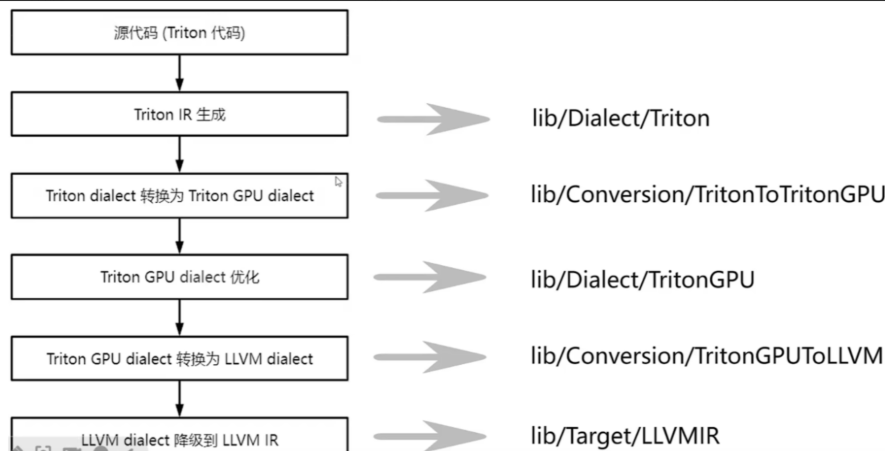
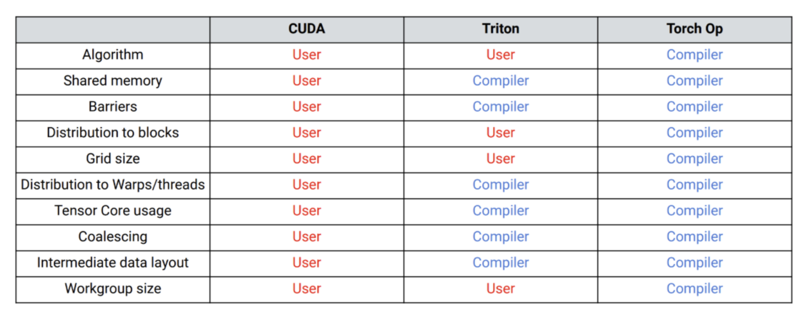
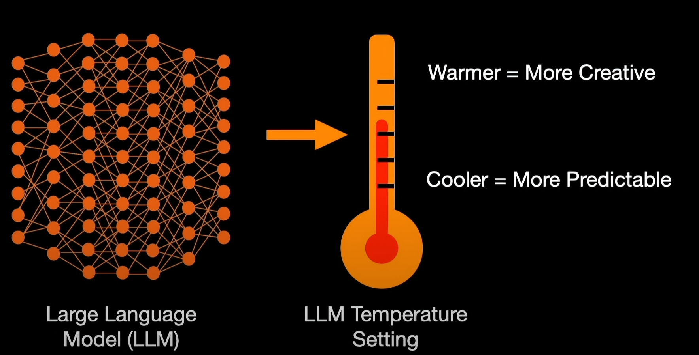
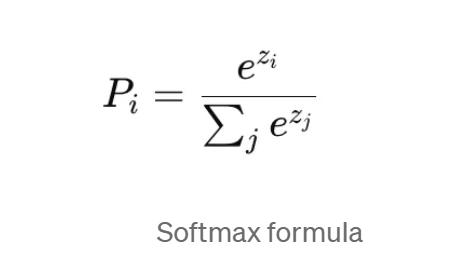
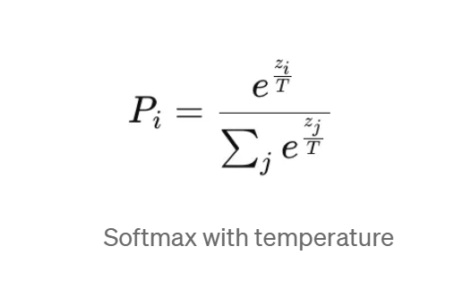
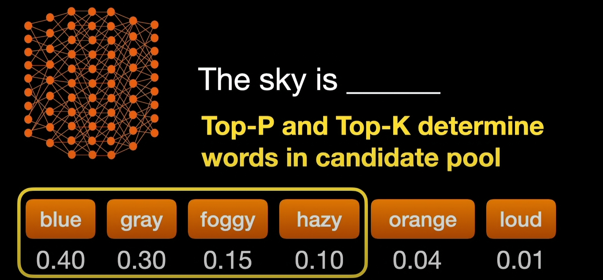
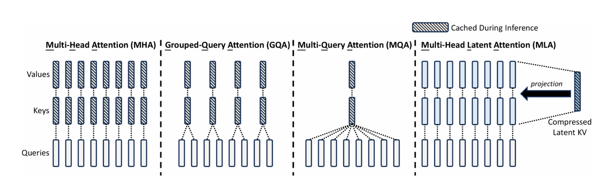

## 面试准备

### 自我介绍

我是浙江大学23级的硕士，明年毕业，专业是人工智能，研究方向就是大模型相关的，具体做的是偏底层的推理加速, 主要工作就是写triton算子。这两年主要就是一直在帮导师做他负责的一个工业上国家重点研发项目，基本上属于是一直在自学，比较放养的那种，没有写过论文。我对大模型主要了解就是推理这块，至于训练啊agent之类的就没什么经验，所以我倾向于那种写算子、推理优化的岗位，这些我都是比较感兴趣的。


​	I am currently a second-year Master's student at Zhejiang University, majoring in Artificial Intelligence. My research focus is on LLMs, specifically in the area of low-level inference acceleration.

​	I’ve always been interested in large models and AI infrastructure, and I’ve been self-learning a lot in my spare time, experimenting with open-source projects, and trying to stay up to date with what’s happening in the field.

​	Over the past two years, I’ve been working for my Professor on a national industrial project. It's not a research-heavy work, so I didn’t have the chance to publish papers or work in a typical research group, but I did get a lot of experience building and optimizing real systems.

​	Now I’m looking for an internship where I can be more involved in real projects, ideally something collaborative, where I can work with and learn from more experienced engineers and researchers. I’d really love to be part of a team where I can continue growing my technical skills, and contribute to something meaningful.

### 实习介绍

华为那边的实习我主要就负责3DGS建模算法的测试，要干的事情包括写测试设计，跑算法、看建模效果、写测试报告这些。属于是一个测试岗吧，方向不太垂直，虽然我投的确实是Infra岗，但估计因为我实习太晚了，就给我安排到了这边。本来实习的事情是导师推荐的，后来亚马逊那边解散了，还有个厂没理我，所以就没成。最后我自己找，当时暑期实习就没几个厂招人了，所以就没找到垂直的岗位。

实习和研究生区别，最大的就是实习需要跟同事交流合作的频率非常多，基本上天天拉好几次会，解决问题的效率也比较高。研究生的话全都是靠我自己，遇到什么问题也没人问，都是自己解决。不过整体的感觉其实差不多，都挺自由的，无非是事多事少的区别。


### 低代码项目介绍

这个项目总的来说就是要做一个低代码平台的工业软件，类似autoML，很多领域比如机械光电航发这些可以用这个软件自动建立和训练机器学习的模型，给工程师推荐工艺参数之类的。我负责的子课题是算子加速这块，就是说这个工业软件需要用到很多的底层算子，矩阵相乘、卷积等等，需要通过各种方法提升算子的运行效率，最后再和一个叫SAS的数据分析软件做对比测试，算子性能比SAS快50%就达到了指标。我做的就是用triton重写了这些算子，包括矩阵相乘、卷积、注意力这些kernel，结合了量化、算子融合等方法。

这个项目相当于是我一个人摸索出来的，因为当时刚参与到这个项目的时候，这个算子加速的课题之前师兄还没有开始做，导师是让我一个人搞这个子课题的，而且这个子课题比较独立，因为大课题就是一个偏理论研究的内容，一开始什么数据集模型都没有，我花了好几周才拿到一个数据集上手搭模型开始跑代码的。cuda/triton这些当时也完全不了解，都是从零开始学的。


当然这些算子都是先在github上搬过来的，自己根据输入输出做一些修改。有了算子之后就在这个基础上写了对应的网络层，conv2d、linear这样的和PyTorch api类似的网络层，最后再建立模型跑推理，测试推理性能。跟SAS对比每个层的推理耗时，基本上干的事就是这么多。


### 遇到的挑战

最大挑战：跟SAS的对比测试

项目指标要求把triton算子和SAS算子进行对比测试，虽然PyTorch支持tensorboard profiler之类的成熟性能分析工具，但是SAS不能直接用这些工具来测，并且SAS算子底层实现是闭源的，不能单独调用具体算子。所以为了解决这个困难，最后是写了一个性能测试脚本，可以不断向上递归，得到模型每一步调用的函数，最后测出最底层每个函数调用的耗时。这个脚本跑出来的结果是和tensorboard profiler差不多的，同时也能用在SAS模型上，虽然还是不能测出最底层的算子耗时，但是可以测出模型每一层的推理耗时，最后的话我就是把模型的每一层当作一个算子，来算出triton的性能提升。比如线性层就作为矩阵相乘算子，卷积层就作为卷积算子这样。


说到挑战的话，其实一开始接触这个项目，一整个项目对我来说都是个非常大的挑战，当时刚进来根本不知道干什么，就干了干整个项目的任务书，任务书写的特别抽象，全是各种大话，就和那些党中央领导讲话一样，完全没有具体的任务安排，而且算子加速这个子任务就完全交给我一个人，之前这个任务根本没开始，所以全得靠我自己体会。一开始导师告诉我跑一个模型的加速，但连数据集都没有，模型更是让我随便找，所以我就特别迷，每天在漫无目的的看一些推理加速的论文博客，什么量化、算子融合之类的。后来几个星期之后其他课题那边有了一个数据集，到我手里之后我才开始搭了一个模型上手跑起来。

其实一开始是没有用triton重写算子的，都是在PyTorch本身的算子上面加一些量化方法，后来24年triton火起来了之后，我就开始学triton/cuda了，当时我对GPU啊、并行计算之类是完全不了解，花了好一段时间才入门，看了一本cuda并行编程的书叫pmpp，跟着外网开源社区他们一起学习，后来慢慢地学明白了，自己也动手写了一些kernel。学triton算子的过程基本上就是先把别人写的算子搬过来，一行一行搞懂这些kernel，理解了之后再写一个自己的版本，做一些修改。但是没有算法上的创新，基本上就是模仿跟重写。

说回遇到的挑战，我觉得遇到的一个挑战就是关于转置算子，因为任务书有个指标就是转置算子的加速，虽然实现triton转置算子很简单，但是最后要和SAS对比的话必须得放在模型上跑（SAS是闭源的，不能直接调用底层算子，只能测出来整个一层的推理耗时），但是深度学习又没有什么直接运用转置的层，当时就困扰了很长时间，我感觉就是写任务书的人也不懂，随便写了个转置算子上去，最后麻烦的只有我一个人。后来我就索性用attention kernel替代转置算子了，跟导师讨论了他也觉得没问题，就这么干了。所以印象比较深的挑战就是这个吧。


### 经历类问题

#### 1.说服别人的经历

项目最后需要联系第三方测试机构，出一个测试报告，要证明性能确实提升50%嘛。我们第一次跟第三方机构谈的时候，我说SAS算子是闭源的，只能测出每层的耗时，不能得到单独的算子耗时。然后他们觉得SAS算子是闭源的，这样会不会有失偏颇？可能说服力不够，毕竟出的测试报告是有法律效力的，然后他们建议我们换个平台测试。
回来之后我和老师都有点不知所措，毕竟任务书一直写的就是跟SAS测，突然要改其实不太好交付。而且说实话其实不跟SAS测更好，跟PyTorch测的话根本就不需要写测试脚本，用tensorboard profiler一下就能精准的测出算子耗时了。后来我想了一下，觉得还是得说服一下他们机构，就用SAS测，毕竟SAS官网宣传的就是一个开源数据分析平台，只不过底层算子是闭源的，所以肯定不能说有失偏颇，不存在什么不公平的问题，我们跟SAS又没有合作。
所以第二次谈，就跟他们说了这个问题，SAS宣传的就是开源的，说服力肯定是有保证的，最后他们终于是同意了。


#### 2.缺点

我感觉我目前最大的缺点就是总是喜欢做到万全的准备后才开始行动，生怕结果不满意，患得患失，导致我时间安排不合理，而且很容易焦虑。比如要准备一场考试，或者有个deadline，我会把所有可能遇到的问题都提前考虑到，所有相关资料都研究透彻。但实际根本没有那么充裕的时间，导致我前期花了太多时间在准备和思考上，真正执行的时间就被压缩了，所以我经常会后悔为什么没有早点做准备，要是能暂停时间就好了。并且我特别喜欢做计划，每天要干什么都写的清清楚楚，但我对自己要求太高了，基本上每次写的计划从来都完不成。我觉得我这个毛病确实得赶紧改掉。


#### 3. 优点/相比别人有什么优势

我觉得我最大优点就是相信自己的学习能力，不会被复杂问题吓倒。因为我觉得计算机这个领域完全不靠天赋和智商，只要你有耐心，花足够的时间，任何技术都可以掌握。并且我学东西喜欢从最底层的原理开始，有一点不明白就会停下来去搞懂。虽然这样学的比较慢，但基础就会比较扎实，学会的东西不容易忘。


#### 4.工作上什么时候会有压力，如何解决


#### 5.委屈的经历/自己觉得做的好但被别人否定的经历


## 面试记录

### 实习

| Date                          | 记录                                                         | 感受                                                         | 结果       |
| ----------------------------- | ------------------------------------------------------------ | ------------------------------------------------------------ | ---------- |
| 5/19 20：00 字节AI Infra      | 问了triton相关细节，手撕代码没过                             | 第一次面试无经验，感觉被拷打                                 | 无后续     |
| 5/29 11：00 蚂蚁 导师推荐     | 电话面试，问了项目相关和研究生相关经历                       | 面试官有点condescending                                      | 性格测试挂 |
| 6/5 19：00 海康威视           | 面试官像个大学老师，一直在问我到底为什么对大模型感兴趣       | 感觉和考研复试面试差不多                                     | 挂         |
| 6/6 14：00 要务科技 机械星球  | 纯聊天，聊简历                                               | 没什么印象                                                   |            |
| 6/9 9：50 上海刑事科学技术院  | 自我介绍+项目，问我有没有LLM应用和微调方面的经历             | 方向不太匹配                                                 |            |
| 6/9 19：00 美团北斗           | 自我介绍+项目拷打，问的比较深，还让我现场写kernel，还问了个c++的结构体 | 感觉面试官挺专业，估计没有二面了，自身实力不够               |            |
| 6/10 博世多模态               | 英文自我介绍+问了多模态相关问题                              | 岗位根本不匹配，啥也没问就结束了                             |            |
| 6/11 京东 后端开发岗 北京     | 自我介绍+现场写softmax算子+问几个推理框架+编译器问题全都不会 | 面试官很专业，我啥也不会                                     |            |
| 6/16 18:00 快手大模型训推优化 | 自我介绍+经历提问+MLA解释+layernorm kernel + 算法题          | 面试过程很轻松自由，写代码的时候面试官在干其他事             |            |
| 6/18 10：10 南京某国企 夏令营 | 自我介绍+微调和RAG区别+项目介绍                              | 没说完疯狂打断，面试体验很差，逆天面试官不尊重人，还问导师是不是教授，为什么不考南大 |            |
| 6/23 15：00 字节 搜索         | l2 cache怎么提高的命中率+triton底层+C++ struct内存占用+ 树后序遍历递归+非递归 | 问的问题非常细                                               |            |

### 秋招

| Date                                 | 记录                                                         | 感受                                                         | 结果 |
| ------------------------------------ | ------------------------------------------------------------ | ------------------------------------------------------------ | ---- |
| 9/3 16:00 快Star-X AI Infra 推理引擎 | 算子实现细节+量化精度怎么测+flash attention v1/v2/v3。代码题24点 | 面试官司马脸，对我根本没兴趣，问了几个八股，不管我答的对不对 | 秒挂 |
| 9/10 携程AI面                        |                                                              |                                                              |      |
| 9/11 15:00 百度昆仑芯                |                                                              |                                                              |      |
| 9/12 15:00 快手 AI Infra             |                                                              |                                                              |      |
| 9/16 17:00 字节 AI Infra             |                                                              |                                                              |      |
|                                      |                                                              |                                                              |      |
|                                      |                                                              |                                                              |      |
|                                      |                                                              |                                                              |      |
|                                      |                                                              |                                                              |      |


## triton相关问题整理

#### 1. triton编译流程

> triton kernel -> triton IR -> LLVM IR -> PTX，最后配合 runtime 运行

上述编译过程通过 `@triton.jit` 装饰器完成，具体来说是遍历提供的 Python 函数的抽象语法树（AST），并使用常见的 `SSA` 构建算法即时生成 `Triton-IR`。然后，编译器后端会简化、优化并自动并行化所产生的 `IR` 代码，再将其转换为高质量的 `LLVM-IR`，最后生成 PTX 并在 NVIDIA GPU 上执行。



#### 2. triton和cuda区别




#### 3. num_warps和num_stages

num_warps —— **空间并行(同时处理更多数据)**

+ 用于指定一个**block的线程数**, 即**每个block的线程数为num_warps * 32**
+ 1 warp = 32 threads (硬件写死), 这32个线程**严格并行**，同时执行相同的指令
+ block内部并不是所有线程严格并行，而是**以warp为原子单位并行+warp层面的调度切换**
+ num_warps越大，kernel并行度越高；但所有warp会**共享所在SM的寄存器和共享内存**，因此**num_warps设置过大会导致每个线程可用的共享内存或寄存器变少**


num_stages —— **时间并行(流水线重叠)**

+ 表示**流水线深度**, 表示可以同时进行多少阶段的数据加载/计算
+ 过多的流水线阶段虽然有助于延迟隐藏，但同时会增加寄存器压力和同步开销。


### Triton 与 CUDA 的对比

- **Q6: Triton 相对 CUDA 的主要优点是什么？**
   **答：** Triton 最大的优势在于更高层次的抽象和易用性。开发者可以用 Python 编写 kernel，免去了 CUDA C++ 的冗长模板和错误陷阱。Triton 编译器会自动处理许多低级细节，比如自动对齐内存访问和共享内存管理，显著降低了编程复杂度。此外，Triton 在一个 kernel 中融合多操作（如 Softmax 的多步运算）也十分方便，能充分利用硬件带宽。
- **Q7: Triton 相对 CUDA 的缺点或局限有哪些？**
   **答：** Triton 目前主要针对 NVIDIA GPU 设计，不支持其他设备。与 CUDA 相比，Triton 在跨 SM 的调度上仍然需要用户手动指定 kernel 网格（grid）大小。如果需要非常精细地控制线程拓扑或使用最新硬件特性（例如直接使用新指令集、特殊缓存策略等），CUDA 提供的底层 API 会更灵活。CUDA 生态成熟，已有大量经过深度优化的库（如 cuBLAS、cuDNN、CUTLASS 等），某些标准算子使用这些库可能比自己写 Triton kernel 更方便、高效。此外，Triton 的 JIT 编译也意味着启动开销（首次运行时编译）会比静态 CUDA 稍大，对于极小的、频繁启动的 kernel 可能影响性能。
- **Q8: Triton 与 CUDA 在性能调优上的差异？**
   **答：** 在性能上，Triton 生成的 kernel 往往与手写 CUDA 相当，尤其在算子融合和宽度匹配场景下表现良好。调优思路上，Triton 用户仍需考虑线程块大小（BLOCK_SIZE）、warp 数量等对带宽和计算的影响，也需避免 warp 分歧等问题。这些与 CUDA 调优类似。不同的是，Triton 会自动合并内存访问和共享内存使用，开发者可以少操心这些低级优化，但仍可手动调 `num_stages`、`num_warps` 等参数。性能调优时，可以使用 NVIDIA 的 Nsight Compute 等工具分析 kernel 的瓶颈（如内存访问是否合并、L2 缓存命中率等），还可以利用 `TRITON_PRINT_AUTOTUNING` 输出的日志来指导块大小选择。

### Triton vs CUDA 关键对比

| 特性                      | CUDA (手动)                          | Triton (自动)                                           |
| ------------------------- | ------------------------------------ | ------------------------------------------------------- |
| **内存对齐 (Coalescing)** | 手动优化（需要保证访问模式）         | 自动合并访问                                            |
| **共享内存管理**          | 手动分配/同步                        | 编译器自动识别、缓冲数据                                |
| **SM 内部线程调度**       | 手动分配线程块给 SM、设定 block 大小 | 编译器自动并行化、在 SIMD 单元中分配任务                |
| **SM 间线程调度**         | 手动设定 grid 大小                   | 手动（Triton 不跨 SM 自动分配）                         |
| **编程模型**              | C/C++ (CUDA API)                     | Python API (`@triton.jit` 函数)                         |
| **调试工具**              | cuda-gdb、printf                     | 内置 `static_print/device_print`、`TRITON_INTERPRET` 等 |
| **现有库支持**            | 丰富（cuBLAS, cuDNN 等）             | 主要依赖自定义 kernel 开发，库支持尚少                  |


### GPU 并行计算基础

- **Q9: CUDA 的线程模型：warp、thread、block 有何区别？**
   **答：** 在 CUDA 中，每个多处理器（SM）同时调度执行一个 warp 的指令，当前架构下一个 warp 包含 32 个线程。线程（thread）是最小执行单元，多个线程组成线程块（block），多个线程块组成网格（grid）。程序中通过配置每个 kernel 的 block 大小（每个 block 包含多少线程）和 grid 大小来控制并行度。一个线程块内的线程共享同一块 SRAM（共享内存），线程块之间可以看作无直接同步（除非使用全局同步原语）。概括：每个 block 有若干 warp，warp 内的 32 个线程同时执行同一条指令；多个 block 在多个 SM 上并发执行。
- **Q10: GPU 的内存层次结构有哪些？**
   **答：** CUDA 的内存层次从近到远依次是：寄存器 → 共享内存/L1 缓存 → L2 缓存 → 全局内存（显存）→ 主机内存。每个线程有私有的寄存器和 local 内存，每个线程块有共享内存供所有线程快速访问。全局内存对所有线程可见，但访问延迟最高。常量内存和纹理内存是只读缓存，优化特定的访问模式。此外，现代 NVIDIA GPU 有各层高速缓存（如 Ampere 的 L2 缓存），用以提高全局访问效率。调优时，应尽量多用共享内存和 L1 缓存来复用数据，减少对全局内存的直接访问。
- **Q11: 什么是内存合并 (coalescing)？如何避免冲突？**
   **答：** 内存合并指的是当同一个 warp 的线程同时访问相邻地址时，硬件会将多个内存访问合并为少量传输。例如在 Volta 及以后架构上，一个 warp 可以以 128 字节（32×4-byte）的块为单位访问，只要每个线程访问连续地址且对齐，就能打包为一次传输。反之，如果访问不对齐或散乱，就可能产生多个事务，降低带宽利用率。在 Triton 中，使用 `tl.arange` 等生成连续地址序列可以自动获得合并访问。另外，共享内存中也要避免**bank 冲突**，即同一时刻过多线程访问同一个 bank（16/32 位交错的片段）；编写代码时可通过添加填充或调整访问模式来消除冲突。
- **Q12: 什么是占用率 (Occupancy)？为什么重要？**
   **答：** 占用率定义为每个 SM 上**活跃 warp 数**与该 SM 最大活跃 warp 数的比值。换言之，若 SM 最多可并行 64 个 warp，当活跃的 warp 只有 32 个时，占用率为 50%。高占用率意味着有更多并发线程可执行，可以更好地隐藏指令和内存的延迟；但过高占用率也可能导致每线程资源减少（如寄存器变少，产生 spill），从而降低性能。通常用 CUDA 提供的 Occupancy API（如 `cudaOccupancyMaxActiveBlocksPerMultiprocessor`）或 Nsight 工具来评估占用率。在调优时，若发现占用率过低，可增大 block 大小或减少每线程使用的资源；若占用率已满，还需关注是否有其他瓶颈（如内存带宽）。


### 实际项目经验与性能分析

- **Q13: 如何在训练/推理流水线中集成自定义 Triton Kernel？**
   **答：** 在 PyTorch 中，可以直接在前向/后向函数里调用 Triton kernel，就像调用普通的 tensor 操作。例如，定义 Triton kernel 后，在训练循环中用 `add_kernel[grid](args)` 这样启动。对于 PyTorch 2.x，还可通过 `torch.compile` 将 Triton kernel 与模型编译到一起。PyTorch 官方教程展示了如何在 `torch.compile` 环境下嵌入 Triton 向量加法 kernel，实现了将 Triton 优化计算加入到模型中的流程。在更高层面，可以将 Triton kernel 封装为自定义算子供前端调用，或借助 TorchDynamo/Inductor 等工具自动识别并转换。总体思路是：确保输入输出是 CUDA tensor，然后像使用其他 CUDA 运算那样调用 Triton kernel 即可无缝集成。
- **Q14: 如何对 Triton Kernel 进行性能分析（Profiling）？**
   **答：** Triton kernel 其实是 CUDA kernel，所以可以使用 NVIDIA 提供的各种工具进行分析。常用的方法包括：使用 `nvprof`（旧版已弃用）、NVIDIA Nsight Compute、Nsight Systems 等采集 kernel 级别的指标。这些工具可以测量每个 kernel 的执行时间、内存吞吐、warp 效率、指标带宽等。使用 Triton 时，也可以用 `TRITON_PRINT_PERF_COUNTERS` 环境变量让 Triton 在运行时输出一些统计信息。针对 PyTorch 模型级的瓶颈，则可用 PyTorch Profiler（`torch.profiler`）结合 TensorBoard 可视化来定位是哪个操作耗时最多。分析时应关注是否有内存合并问题、寄存器溢出、分支分歧等因素。
- **Q15: 进行性能分析时应关注哪些指标？**
   **答：** 常见关键指标包括：**内存带宽利用率**（看全局/共享内存访问是否为瓶颈）、**SM 利用率**（活跃 warp 数，反映占用率）、**warp 效率**（包括分支分歧情况）、**寄存器和共享内存占用**（高占用可能导致并行度下降）、以及 **Tensor 核心利用率**（若算子可用 Tensor Core 应检查是否被充分利用）。例如，要检查全局内存访问是否合并，可看“global load throughput”是否接近理论带宽；若性能低，可检查合并率（nsight 中常有“global_transactions_per_request”指标）。其他如延迟（时序）、L2 缓存命中率等也值得关注。综合这些指标，判断是计算瓶颈还是内存瓶颈，据此修改 kernel 参数或算法。


## 八股笔记

### 数据并行DP/流水线并行PP/张量并行TP

| DP                  | PP                                                  | TP                      |
| ------------------- | --------------------------------------------------- | ----------------------- |
| 切分数据            | 切分模型                                            | 切分矩阵                |
| 每个GPU保存完整模型 | 每个GPU只有模型的一部分                             | 就是cuda/triton并行计算 |
|                     | 进一步划分micro batch,按流水线方式分别给每个GPU处理 |                         |

DP+PP:

+ 宏观数据并行
+ 微观流水线并行

ZeRO DP:

+ ZeRO: Zero Redundancy Optimizer
+ 用于解决DP的缺点：浪费显存（每个GPU都存放模型+梯度+optimizer state）
+ 方法：切分整个模型的参数，每个GPU只存放一部分参数，计算时需要所有GPU先通信，得到完整模型再计算
+ **切分逻辑和流水线并行不同：**
  + ZeRO DP是横向切：切的是每一层的参数，计算时需要GPU通信
  + PP是纵向切，切的是模型的层，不需要GPU通信


### LayerNorm & BatchNorm

`Batch Norm` 和 `Layer Norm` 的区别一句话总结就是 `bn` 是切特征，`ln` 是切样本。

+ `BN`: 对于每个特征维度，计算它在**整个批次中**的均值和标准差，然后对该特征进行归一化。
+ `LN`: **对每个样本**单独计算其所有特征的均值和标准差，然后在该样本内进行归一化。


### Optimizer

#### SGD

SGD（随机梯度下降）和原始的梯度下降的主要区别是：**每次更新参数时用的数据量不同**。

+ SGD每次用一个batch的梯度更新网络
+ 而原始GD必须把整个数据集梯度全部算好后再更新网络


#### momentum

普通梯度下降：
```
参数 = 参数 - 学习率 × 当前梯度
```

加了动量的梯度下降

```
速度 = 衰减率 × 之前的速度 - 学习率 × 当前梯度
参数 = 参数 + 速度
```


#### SwigLU


### vLLM

#### PagedAttention

> KV Cache 被划分为块。块在内存空间中不需要连续。

​	由于块blocks在内存中不需要连续，因此我们可以像在操作系统的虚拟内存中一样以更灵活的方式管理键和值keys & values：可以将块视为页面pages，将tokens视为字节bytes，将序列sequences视为进程processes。序列的连续 ***逻辑块*** ***logical blocks*** 通过 **块表** **block table** 映射到非连续 **物理块** ***physical blocks***。物理块在生成新tokens时按需分配。


### Temperature/top-P/top-K

 

**temperature**通过对logits的值进行缩放（除以T)，从而修改softmax后的概率分布

  

+ T取值一般在0.0~2.0, 最常用范围是0.2~1.0
+ $T\in(0.2, 0.6)$: 低温度，logits放缩后绝对值会变大，softmax后又会放大logits值之间的差距，
  从而**高概率token的概率会变得更高，低概率token的概率会变得更低**，概率分布更集中->模型输出更准确、减少随机性
+ $T\in(0.7, 1.0)$: 中等温度，logits放缩后绝对值会变小，softmax后会压缩logits值之间的差距，
  从而**高概率token的概率会降低，低概率token的概率会提高**，概率分布更平坦->增加模型创造性**（GPT默认0.7）**
+ $T > 1$: 高温度，容易产生幻觉。适用于艺术性生成场景。


**top-P/top-K**用与选择输出token的范围, 概率太低的直接不考虑。（**不是每次都在整个vocab size中选token输出！）**

 

+ top-K指定token数量: 直接选择概率最高的K的token
+ top-P指定token总和: 选择概率总和>=P的最少token（即从高到低开始选，总和达到P时停止）

**Top-P** 通常比 **Top-K** 更受欢迎，因为它能根据概率分布的实际情况动态调整考虑的token数量，使其更灵活。而 Top-K 总是考虑固定数量的选项，这可能在概率急剧下降时过于宽泛，或者在概率分布分散时过于狭窄


### RAG vs Fine-tuning

我感觉这俩好像不是一个维度的...

SFT就是拿另一个比如说某个领域的数据集，把这个模型继续训练一下，那训练的时候肯定会修改模型参数嘛，而且比较耗资源。

RAG是在跟模型对话的时候起作用的，就是他会去查一个外部的知识库，然后把查到的内容当成prompt跟你的输入一起丢给大模型，最后得到输出。那这个肯定不会修改模型参数的。

而且RAG和SFT是可以并存的呀，微调之后还是可以RAG查外部知识库的。所以RAG优点就是可以获取最新的知识，也不需要训练模型。SFT的话就会把模型整个能力、风格都改掉，一般都是企业要搞一个领域大模型才会话很多资源去微调。


### MLA & RoPE

> #### MHA & MQA & GQA
>
> 


## 面经


#### **1. batch_size 可以无限增加吗？**

嗯，这个不能无限增加的。主要有几个限制因素：首先是显存限制，batch_size增大会导致中间激活值、KV cache等显存占用线性增长，很容易就OOM了。其次是延迟问题，虽然吞吐量会提升，但是单个请求的延迟也会增加，因为要等整个batch处理完。还有就是实际场景中，请求往往是不规则到达的，强行凑大batch可能会让用户等待时间过长。

#### **2. 大模型推理性能指标有哪些、影响性能的因素有哪些？私有化部署方案？**

性能指标主要看三个：吞吐量（tokens/s或者requests/s）、延迟（首token延迟TTFT和总延迟）、还有资源利用率。

影响因素嗯...挺多的，硬件层面有GPU算力、显存带宽、PCIe带宽这些；软件层面有模型并行策略、KV cache管理、算子融合优化、量化等；还有就是batch调度策略、内存管理这些。

私有化部署的话，通常会用容器化部署，比如Docker+Kubernetes，配合GPU调度器。推理框架选择vLLM、TensorRT-LLM或者TGI这些，根据具体需求做trade-off。还要考虑负载均衡、监控告警、自动扩缩容这些运维需求。

#### **3. 给定一个指定推理框架如 vllm/lightllm 如何适配新的模型和硬件？**

适配新模型的话，首先要在模型配置文件里添加新模型的架构定义，然后实现对应的forward函数，主要是attention、MLP这些核心组件。还要处理tokenizer、模型权重加载这些。vLLM的话就是在model registry里注册新模型。

硬件适配主要是算子层面的优化，比如针对新GPU写CUDA kernel，或者用Triton写算子。还要考虑显存管理、通信库适配这些。其实现在很多框架都有plugin机制，相对比较友好。

#### **4. llm 的推理流程**

LLM推理分两个阶段：prefill和decode。

Prefill阶段是把整个prompt一次性输入，并行计算所有position的attention，生成完整的KV cache，然后预测第一个token。这个阶段是compute-bound的，GPU利用率比较高。

Decode阶段是autoregressive生成，每次只生成一个token，然后append到sequence里继续生成下一个。这个阶段是memory-bound的，因为每次都要访问之前的KV cache，但计算量相对较小。

#### **5. AWQ 量化原理、过程详细介绍**

AWQ的核心思想是不是所有权重都同等重要，激活值大的权重对模型性能影响更大。

具体过程是这样的：首先用少量校准数据统计每个channel的激活值分布，找出activation magnitude比较大的channel，这些被认为是"重要"的权重。然后对重要的权重保持较高精度，对不重要的权重进行更激进的量化。

实现上，AWQ会对权重做一个scale变换，让重要的权重scale变大，不重要的变小，然后再做uniform quantization。这样就实现了adaptive的效果。相比GPTQ，AWQ的优势是推理时不需要dequantization，速度更快。

#### **6. 讲一讲Paged Attention的原理和实现**

嗯，这个设计很巧妙。传统的做法是预先分配max_seq_len大小的连续KV cache，但这样会有很多浪费，因为序列长度通常差异很大。

Paged Attention的思路是把KV cache分成固定大小的page，比如每个page存16个token的KV。这样就可以按需分配，用多少分配多少。具体实现上，维护一个page table记录每个sequence的KV cache分布在哪些page上，attention计算时根据page table找到对应的KV值。

好处是显存利用率高，支持动态batching，还能实现sequence之间的page共享（比如prefix相同的情况）。

#### **7. 性能瓶颈如何分析？**

分析性能瓶颈我一般是分层来看的。首先用profiler看整体的timeline，比如nsight或者torch profiler，看是compute-bound还是memory-bound。

如果是compute-bound，重点看kernel的occupancy、SM利用率这些；如果是memory-bound，就看memory throughput、cache hit rate。

然后细化到具体算子，看哪个算子耗时最多，是否有优化空间。还要看GPU之间的通信开销，P2P带宽利用率这些。最后是框架层面的，比如调度开销、内存分配开销等。

#### **8. 为什么 vllm 的 PagedAttention 相比之前的一次性分配固定长度 max_seq_len 的 kv cache 空间能提升性能？**

主要是两个方面的提升：

显存利用率大幅提升。传统方法要按最大长度分配，但实际序列长度差异很大，导致大量浪费。PagedAttention按需分配，利用率能从20-40%提升到90%以上。

支持更灵活的batching策略。因为不用预先知道序列长度，可以动态添加删除序列，实现continuous batching，这样GPU利用率更高，延迟也更低。

#### **9. 什么是异步，如何用 python 实现异步功能？llm 推理的异步如何实现？**

异步就是不阻塞等待的编程模式，可以在等待I/O时去处理其他任务。

Python实现异步主要用asyncio，定义async函数，用await等待异步操作。比如：

```python
async def generate():
    result = await model.generate_async()
    return result
```

LLM推理的异步主要体现在：请求排队和batch组装是异步的，不会阻塞新请求的接收；推理过程可以pipeline，prefill和decode可以交叉进行；多个请求的生成过程是并发的。

具体实现上，通常有一个异步的request queue，一个background的inference engine，通过callback或者future来返回结果。

**#### 10. 大模型推理框架的分布式推理有哪些方法？**

主要有几种并行策略：

Tensor Parallel（TP）：把模型按层内切分，比如attention的多头、MLP的参数都分布到不同GPU上，需要频繁的all-reduce通信。

Pipeline Parallel（PP）：按层间切分，不同GPU负责不同的layer，通信相对较少，但可能有bubble。

Data Parallel：每个GPU都有完整模型，处理不同的batch，适合小模型。

还有Sequence Parallel，把sequence dimension也做切分。实际部署时通常是多种策略组合，比如TP+PP。

#### **11. MOE 怎么实现并行加速？**

MOE的并行主要是Expert Parallel，把不同的expert分布到不同的GPU上。

具体实现是这样的：首先router决定每个token要路由到哪些expert，然后做一个all-to-all通信，把token发送到对应的expert所在的GPU。expert计算完后，再做一次all-to-all把结果发回去。

关键是要做load balancing，避免某些expert负载过重。还有就是通信优化，可以把多个小的all-to-all合并，减少通信次数。

#### **12. 介绍一下triton编译过程**

Triton的编译过程是这样的：首先Python代码会被parse成Triton IR，这是一个高层的中间表示。然后做一系列优化，比如循环优化、内存访问优化。

接下来转换成LLVM IR，这时候会做更多的low-level优化。最后生成PTX代码，再编译成CUDA binary。

整个过程中，Triton会自动处理很多细节，比如block tiling、memory coalescing、bank conflict避免这些，让用户专注于算法逻辑。

#### **13. llama 模型 forward 推理的输入是什么？**

主要输入有几个：input_ids（token序列）、position_ids（位置编码）、attention_mask（指示哪些位置需要attend）。

对于端侧推理框架，通常还会有kv_cache作为输入和输出，用于存储之前的key-value。casual mask一般是在attention计算时动态生成的，确保只能attend到之前的位置。

还可能有一些可选的输入，比如past_key_values、use_cache这些控制参数。

#### **14. LLM 推理为什么需要分成两个阶段？不分可以吗，为什么？**

这个...其实是由autoregressive生成的特性决定的。

Prefill阶段可以并行计算所有position的attention，因为prompt的所有token都已知，可以一次性处理，这时候是compute-bound的，GPU利用率高。

但是decode阶段必须sequential，因为下一个token依赖于前面所有token的结果，没法并行。而且这个阶段是memory-bound的，主要开销在访问KV cache。

如果不分阶段，那就没法充分利用prefill阶段的并行性，整体效率会很低。所以这个分阶段是必须的，针对不同阶段的特点做专门优化。

#### **15. per channel 和 per group 量化有什么区别，为什么不用 per channel 量化？**

Per channel是每个output channel用一个scale，粒度更细，量化精度更高。Per group是把多个channel分成一组，一组用一个scale。

虽然per channel精度更高，但是dequantization的时候计算开销更大，因为要对每个channel做不同的scale操作。Per group的话，可以用SIMD指令batch处理，速度更快。

而且现在的量化算法，比如AWQ、GPTQ，在per group的粒度下已经能取得很好的精度，所以工程上更倾向于用per group，在精度和速度之间找平衡。

#### **16. pytorch 的显存管理机制了解吗？**

PyTorch的显存管理有几个特点：首先是lazy allocation，只有真正需要时才分配显存。然后是memory pool机制，释放的显存不会立即还给系统，而是放在pool里复用，避免频繁的malloc/free。

还有就是引用计数机制，tensor不再被引用时会被释放。但是有时候会有显存碎片问题，这时候可能需要手动调用empty_cache()。

另外，PyTorch还支持显存映射、unified memory这些特性，可以在CPU和GPU之间共享内存。现在还有一些实验性的功能，比如memory snapshot、显存预分配这些。


## 简历文案

#### 华为杭州研究所

云计算部门

**AI Infra 实习生**

**背景：**为推动华为云3D内容生成（AIGC）业务发展，项目组需对多款3D高斯溅射（3DGS）重建算法进行测试评估，协助服务化上线。我作为引擎测试组的主要测试与评估工程师，负责建立一套**公平且标准化的评测流程，**确保测试结果能够精准反映各算法的真实优劣，为算法的上线、优化和选型提供**客观、量化的决策依据**。

**工作内容：**

- **构建测试体系：设计验收方案**，覆盖性能、效果、功能与稳定性等多个维度；**编写自动化脚本**：对不同算法（媒体院、华为云自研、孵化Lab等）进行严格的基准测试，采集**重建耗时、GPU资源占用**等关键性能数据。
- **撰写评测报告：**建立统一的评估标准，对重建效果（**完整性、准确性清晰度、人脸细节等**）进行量化对比分析，定位与竞品（如KIRI engine）的效果差距，最终形成测试报告，反馈给开发团队进一步优化。

**成果：**

- **支撑核心算法服务化上线**：通过全面的验收测试流程，验证了媒体院3DGS算法的性能与效果均满足上线标准，为其在鸿蒙OS的顺利部署提供了**关键的质量保障与数据门控**
- **驱动技术路线选型决策**：交付了多份深度对比测试报告，系统性地阐明了华为云自研与其他同类算法的核心优劣势，为团队部门进行**算法优化和技术融合决策提供直接依据**。


#### 工业过程智能系统柔性低代码平台

**国家重点研发项目**

**核心开发者**

**项目背景：** 面向工业智能化场景，项目旨在构建一个支持高性能计算的低代码平台，提升工业过程建模与分析效率

**课题概述：高性能核心算子库开发**

研究工业过程智能低代码系统的核心算子加速技术，针对**矩阵相乘、卷积、矩阵转置、函数快速自微分（求导）**等基础科学算子，研究***高性能并行化、定点数量化、精度压缩简化\***技术；最终与商业数据分析软件SAS Viya**算子运行效率提升50%以上**，并通过第三方检测机构验证。

**成果：一篇软著发表，两项专利申请中**

**具体工作：**

- **高性能算子开发与优化：**基于OpenAI Triton实现GEMM、Conv2d、转置与Attention等核心算子，其中**int8量化GEMM算子**，性能较cuBLAS**提升100%**；实现多种算子融合方案，有效减少内存访问与同步开销；
- **卷积算子优化：**实现implicit GEMM版本的conv2d kernel，将卷积运算高效转化为矩阵乘法，优化内存布局与访问模式。大batchsize场景下**吞吐量较PyTorch提升50%以上；**
- **研究注意力机制加速：**参考Flash Attention、MQA、MLA等多种注意力算子的优化版本，实现了Flash attention前向推理算子与反向传播算子，其中前向推理算子**支持fp16和int8双精度；**
- **跨平台性能测试：**开发了算子级性能分析脚本，精确测量SAS算子与triton算子耗时进行对比测试，达成项目指标；


#### 轻量化LLM推理框架

**课余自学项目**

**自主开发**

**概述：**参考开源框架设计并构建了一个高效、灵活且可扩展的LLM推理框架，旨在实现快速、准确的模型推理服务。通过优化模型加载和推理流程，大幅提升处理速度和资源利用效率，支持Llama 3、Qwen2.5等主流模型。

**具体工作：**

- **架构搭建**：构建了**灵活的模型加载与推理模块**，通过统一的配置和接口，使框架能支持并切换 Llama, Qwen 等模型。开发了**模型权重转换工具**，可将Hugging Face模型权重一键转换PyTorch格式。
- **高性能triton算子开发**：实现了**GEMM(int8), FlashAttention(int8)、Flashdecoding、RMSNorm**等多种LLM核心算子，通过高效分块（Tiling）和共享内存优化，算子执行效率较PyTorch提升100%以上
- **先进KV Cache内存管理**：引入**Paged Attention**技术，实现高效KV cache管理模块，对GPU显存进行精细化管理，实现了**显存动态分配**，有效提升长序列场景下的吞吐量


#### 专业技能

**英语水平**：**CET-4（646）、CET-6（649）**，有较好的听说读写及流利表达能力

**GPU编程与性能优化：**

- 熟练使用**OpenAI triton**、了解CUDA编程模型，熟悉GPU架构及并行计算原理，能够独立编写、调试高性能GPU算子；
- 掌握tensorboard profiler / Nsight Compute等性能分析工具的使用，进行kernel性能测试与定位GPU性能瓶颈

**AI框架与LLM：**

- 掌握 PyTorch 深度学习框架，理解LLM底层算子实现原理并具备二次开发能力
- 熟悉LLM推理优化的关键技术，如低比特量化(INT8/INT4)、算子融合、FlashAttention、KV cache管理等


*Thinking...*

> 用户要我把之前准备的30个问题的完整答案带题目都写出来。我需要把每个问题和对应的答案都整理出来，保持答案的口语化和简洁性，基于用户的实际经历来回答。
>
> 让我按顺序整理：
>
> 1. 结合你的教育背景和过往实习经历，谈谈你对携程目标岗位的理解，以及你认为自己的优势在哪里？
> 2. 为什么想加入携程？和其他同类型岗位相比，携程最吸引你的是什么？
> 3. 请分享一项你所具备的核心技能，并说明它如何能在携程的工作中发挥作用。
> 4. 简述你对携程企业文化的认识，以及你觉得自己怎样才能融入这种文化氛围？
> 5. 请讲述你在项目或活动中遇到突发状况时如何定位问题并解决，顺利推进项目？
> 6. 请讲述一次你与团队其他成员意见不一致的经历？你是如何解决的？
> 7. 请讲述一次你在学习或工作中如何达成高目标的经历，如何保持动力并在压力下坚持，具体举措？
> 8. 请讲述一次你在任务或项目中需要学习新的软件工具的经历。你是如何做学习计划的？具体是如何学习的？最后如何在任务或项目中应用的？
> 9. 我会准备一个关于创新经历的生动案例，重点突出问题解决和创新思维。
> 10. 在接待需求方面，我将重点阐述如何通过主动沟通和深入交流来准确把握对方需求。
> 11. 对于提高工作效率的改进经历，我会详细描述问题发现、分析过程和最终优化方案。
> 12. 面对不确定任务时，我会强调灵活应变、主动学习和积极沟通的重要性。 面对项目进度严重落后的压力，我保持冷静，深入分析延误根因。通过细致梳理障碍点，制定针对性调整方案，积极与团队沟通协调。最终通过重新规划资源和优化工作流程，成功追回进度，确保项目如期交付。 我会系统地收集和分析用户反馈数据。首先通过多渠道收集负面反馈，包括用户评论、客服记录和线上社区讨论。然后使用定量分析方法，对反馈进行分类和权重排序，识别高频和关键问题。根据数据洞察，制定具体改进方案，并设计小规模验证实验，评估改进效果。

# 携程AI面试问题完整答案

## 1. 结合你的教育背景和过往实习经历，谈谈你对携程目标岗位的理解，以及你认为自己的优势在哪里？

**回答：** 我觉得携程作为在线旅游平台，背后需要强大的AI技术支撑，我投的岗位主要负责AI基础设施建设，包括高性能推理框架、训练平台。我的优势很匹配：一是有扎实的AI基础，在华为和低代码项目中都做过模型推理优化；二是有高性能计算经验，用Triton开发的算子性能提升100%，这对推理框架很重要；三是有完整的系统开发经验，自己从零搭建过LLM推理框架，包含KV cache管理等核心模块。包括我在华为实习时负责AI算法的性能测试和评估，建立了完整的测试体系；在低代码项目中从零开始学习GPU编程，独立开发了多个高性能算子。我觉得我的优势在于：一是有扎实的AI基础设施经验，二是学习能力强，能快速上手新技术，三是有完整项目经验，能独立解决复杂问题。

**追问准备：** 如果问具体如何应用到携程业务中，可以说算子优化能提升推荐系统性能，测试评估经验能确保新算法上线质量。

## 2. 为什么想加入携程？和其他同类型岗位相比，携程最吸引你的是什么？

**回答：** 携程最吸引我的是它在AI工程化方面的技术挑战。第一，携程有海量的搜索、推荐、广告业务，对推理性能和并发能力要求很高，这正是我擅长的高性能计算领域；第二，携程的业务场景很丰富，从用户搜索到个性化推荐，需要完整的AI基础设施支撑，技术栈很全面；第三，相比纯算法公司，携程更注重技术的业务落地，能看到自己开发的推理框架直接服务千万用户。这种大规模工程实践的机会很难得。

## 3. 请分享一项你所具备的核心技能，并说明它如何能在携程的工作中发挥作用。

**回答：** 我的核心技能是GPU高性能计算和算子优化。在低代码项目中，我用Triton重写了矩阵乘法、卷积、注意力等核心算子，性能比原版提升100%以上。这个技能在携程可以这样发挥作用：一是优化推荐算法的推理速度，提升用户体验；二是降低模型部署成本，同样的硬件能服务更多用户；三是支持实时个性化推荐，因为推理速度快了，就能在用户访问时实时计算推荐结果。

## 4. 简述你对携程企业文化的认识，以及你觉得自己怎样才能融入这种文化氛围？

**回答：** 我了解到携程强调"以客户为中心"和"追求完美"的文化。我觉得这和我的经历很契合，在华为实习时，我建立的测试体系就是为了确保用户最终能用到质量最好的算法；在低代码项目中，我花几周时间解决SAS对比测试的难题，也体现了追求完美的态度。融入方面，我会保持学习心态，主动了解业务需求，确保技术方案真正解决用户痛点，同时保持开放沟通，积极参与团队协作。

## 5. 请讲述你在项目或活动中遇到突发状况时如何定位问题并解决，顺利推进项目？

**回答：** 在低代码项目中遇到过这样的情况。当时项目要求测试转置算子性能，但我发现深度学习模型里基本没有直接用转置的层，没法和SAS进行公平对比。我的解决思路是：首先分析问题本质，转置算子要求其实是想测试内存访问优化能力；然后寻找替代方案，发现attention算子也涉及复杂的内存访问模式；最后和导师沟通，说明attention算子更有实际意义，最终获得认可。关键是要透过现象看本质，找到问题的根本目标。

## 6. 请讲述一次你与团队其他成员意见不一致的经历？你是如何解决的？

**回答：** 在项目后期，第三方测试机构认为SAS是闭源的，可能测试结果不够公正，建议换平台。但导师坚持用SAS测试，因为这是项目指标要求。我的处理方式是：先理解双方的担忧，测试机构担心公正性，导师担心不符合项目要求；然后收集资料，发现SAS官网宣传的是开源数据分析平台，只是底层算子闭源；最后重新和测试机构沟通，说明SAS的开源定位和我们没有利益关系，最终说服了他们。关键是找到双方都能接受的解决方案。

## 7. 请讲述一次你在学习或工作中如何达成高目标的经历，如何保持动力并在压力下坚持，具体举措？

**回答：** 在低代码项目中，要求算子性能比SAS提升50%，这是个很有挑战的目标。我的做法是：首先分解目标，把大目标拆成学习GPU编程、实现基础算子、优化性能、测试验证等小步骤；然后制定学习计划，每天看一定量的CUDA教程和代码示例；保持动力的方法是记录每天的进展，看到量化kernel性能提升100%时特别有成就感；遇到困难时会和社区其他开发者交流，获得新的思路。最终超额完成了目标。

**追问：如何在目标达成过程中坚持学习，确保不松懈和放弃？** 坚持学习的关键是建立正反馈循环，我会设置小目标，比如每周实现一个新算子，完成后就会有成就感。另外加入开源社区，和其他人交流进展，既能学到新东西又能保持学习动力。

## 8. 请讲述一次你在任务或项目中需要学习新的软件工具的经历。你是如何做学习计划的？具体是如何学习的？最后如何在任务或项目中应用的？

**回答：** 学习Triton就是这样的经历。一开始完全没接触过GPU编程，学习计划是：第一阶段先看《CUDA并行编程》这本书，理解GPU架构和并行计算原理；第二阶段学习Triton语法，从官方教程开始，每天写小的kernel练手；第三阶段看开源项目的实现，比如FlashAttention的Triton版本，一行行理解代码；最后在项目中应用，先实现简单的矩阵乘法，再逐步实现复杂的attention算子。整个学习过程大概用了2个月。

**追问：你在实践项目和线上课程中学习，那么过程中遇到的最大困难，如何解决？** 最大困难是调试GPU kernel很难，没有像CPU那样方便的调试工具。我的解决方法是先在小规模数据上测试，确保逻辑正确；然后用性能分析工具找瓶颈；遇到复杂问题时会在社区提问，学习其他人的经验。

## 9. 讲述一次在活动或项目中创新的经历。

**回答：** 在LLM推理框架项目中，我实现了一个创新的KV cache管理模块。传统方法需要预分配大块连续内存，浪费很大。我参考了Paged Attention的思想，把KV cache分成固定大小的页，动态分配。这样做的好处是内存利用率更高，支持变长序列的批处理。具体实现中，我设计了页表管理算法，支持页的分配、回收和复用。最终在长序列场景下，内存利用率提升了约30%。

**追问：在项目中承担的工作，具体举措。** 我在这个项目中主要负责整体架构设计和核心算子实现。架构方面，设计了模块化的推理流程，支持多种模型；算子方面，实现了int8量化的GEMM和FlashAttention，性能相比PyTorch提升明显。

## 10. 讲述接待他人需求的经历，如何进行需求的挖掘、整理、分析、如何确保对需求的理解准确？

**回答：** 在华为实习时，开发团队希望我提供算法评测报告，但一开始他们只说"测试一下效果"，需求很模糊。我主动和他们沟通，了解到他们真正需要的是：一是和竞品的对比，确定技术水平；二是找出性能瓶颈，指导优化方向；三是验证是否满足上线标准。基于这些需求，我设计了包含重建质量、性能指标、稳定性测试的完整评估体系，最终报告帮助他们做出了技术路线决策。

**追问：举例说明你如何挖掘到对方没有明确说明的潜在需求。** 比如他们说"测试效果"，我会追问"效果指什么？重建质量还是推理速度？"；通过这种方式挖掘出他们其实更关心的是算法能否通过上线标准，这是没有明确说出的潜在需求。

## 11. 在实习或项目中发现原有方法效率低下，并尝试改善，你是如何确定改进方向的？结果如何。

**回答：** 在低代码项目中，发现原本的性能测试方法效率很低。当时用的是逐个测试每个算子，但发现无法和SAS进行公平对比，因为SAS是闭源的。我分析问题后，决定改进测试方法：开发了一个递归性能分析脚本，可以测出模型每一层的耗时，然后把每一层当作对应的算子来对比。这样既能保证测试的公平性，又能满足项目要求。最终这个方法被第三方测试机构认可，顺利完成了验收。

## 12. 在实习或项目中，面对任务不确定情景，当时什么情况，你具体如何推进的？

**回答：** 刚进入低代码项目时就遇到了这种情况。任务书写得很抽象，算子加速子课题之前没人做过，连数据集都没有。我的推进方法是：首先明确最终目标，就是要让算子比SAS快50%；然后分析实现路径，需要数据集、模型、算子实现、测试方法这几个环节；接着主动寻找资源，找其他课题组要数据集，自己搭建模型；最后边做边调整，在实践中完善整个方案。虽然过程曲折，但最终成功达成了目标。

## 13. 分享你自发参与的某项技能课程培训，并由此解决实际问题的经历。做了什么、反思总结。

**回答：** 我自发学习了CUDA和Triton编程来解决项目中的性能问题。当时发现仅靠PyTorch原生算子很难达到50%的性能提升，就决定学习GPU编程，自己实现高性能算子。学习过程中看了《CUDA并行编程》这本书，还参加了网上的GPU编程社区。学会后实现了量化GEMM算子，性能比cuBLAS提升了100%。反思总结是：遇到技术瓶颈时，主动学习新技能往往能带来突破；学习要理论结合实践，在项目中应用才能真正掌握。

**追问：如何克服学习难点？怎么确保自己理解？** 克服学习难点的方法是多找不同的资料，一个讲不清楚就看另一个；确保理解的方法是写代码验证，能跑通说明真的懂了。

## 14. 描述你在任务进度可能延迟时，主动告知团队并协调确保团队目标达成的经历

**回答：** 在低代码项目中，学习GPU编程比预期花费更多时间，可能影响整体进度。我主动告知导师这个情况，分析了延迟原因和后续安排。协调方案是：先用简单的优化方法达到基本要求，同时继续学习GPU编程；和其他课题组协调，争取更多时间；最终通过加班和提高效率，在deadline前完成了所有任务，还超额达成了性能目标。关键是早发现、早沟通、早行动。

## 15. 团队讨论中，听到陌生概念如何在短时间内向他人请教并深入学习的？学习效果如何？

**回答：** 在华为实习时，第一次听到"3D高斯溅射"这个概念，完全不知道是什么。我立即向技术专家请教，了解到这是一种3D重建算法，用高斯分布来表示3D场景。然后我花了两天时间深入学习，看论文、找开源代码、跑demo，很快就理解了算法原理和评估指标。学习效果很好，后续能够独立设计测试方案，准确评估不同算法的优劣。

## 16. 遇到问题及时向团队成员寻求帮助并通过合作顺利解决问题的经历

**回答：** 在实现FlashAttention算子时遇到性能瓶颈，自己调试了很久没解决。我主动向社区的GPU编程专家求助，详细描述了问题和已尝试的方法。他们指出了我在内存访问模式上的问题，建议优化数据布局。按照他们的建议修改后，算子性能提升了50%。这个经历让我明白，及时寻求帮助比自己闷头钻研更高效，关键是要描述清楚问题。

## 17. 执行既定计划过程中遇到困难导致实际进度严重落后，这种压力下你的心态是怎样的？如何分析原因并调整行动？最后结果如何？

**回答：** 在项目验收前一个月，发现SAS对比测试遇到技术难题，进度严重落后。当时压力很大，但我保持冷静分析：问题根源是SAS闭源导致无法直接测试算子；解决方向是找到合理的对比方法。我调整行动计划，开发了层级性能测试脚本，把模型层当作算子来对比。同时加大工作强度，每天工作到很晚。最终在deadline前完成了测试，还说服了第三方机构。关键是遇到困难要冷静分析，调整策略。

## 18. 描述一个曾经失败或未达预期的经历，当时什么情况？原因是什么？采用了哪些改进措施？效果如何？

**回答：** 在LLM推理框架项目中，一开始想实现int4量化算子，但发现效果很差，准确性下降太多，没达到预期。原因分析：一是量化方法选择不当，二是没有做量化感知训练。改进措施：改为实现int8量化，精度损失可控；优化量化算法，添加校准步骤。效果很好，int8量化算子性能提升100%，精度损失在可接受范围内。这次经历让我学会了要设定合理的目标，遇到困难要及时调整策略。

## 19. 分享一个你尝试站在他人的立场上思考问题并成功解决问题的案例，当时什么情况？你做了什么？结果如何？

**回答：** 在华为实习时，开发团队对我的评测报告有意见，觉得太复杂。我站在他们的角度思考，发现他们其实只想要一个简单的结论：算法能不能上线，比竞品好在哪里。于是我重新整理报告，把核心结论放在前面，技术细节放在附录。这样他们一眼就能看到关键信息，做决策更方便。结果他们很满意，报告也顺利支撑了算法上线。关键是要理解对方的真实需求和使用场景。

## 20. 项目中途发现客户需求与项目目标不一致怎么办？

**回答：** 首先要及时沟通，明确双方的真实需求和期望。然后分析不一致的原因，是理解偏差还是需求变更。接着寻找兼容方案，看能否调整项目目标来满足客户需求，或者说服客户接受原有目标。如果实在无法调和，需要升级到上级或者项目负责人来决策。关键是要保持开放沟通，优先考虑项目的整体价值。

## 21. 学习工作中学到了哪些技能？如何使用？结果如何？

**回答：** 主要学到了GPU编程、性能优化和系统测试三个技能。GPU编程用Triton实现了各种高性能算子，性能比原版提升100%以上；性能优化通过算子融合、量化等方法，显著提升了模型推理速度；系统测试建立了完整的评估体系，确保算法质量。这些技能在项目中都发挥了关键作用，帮助我们达成了性能目标，也为我后续做AI基础设施工作打下了基础。

## 22. 携程的一个热门路线的选择数据量突然下降，如何寻找原因，给出两个应对方案

**回答：** 首先要分层分析，看是整体下降还是特定用户群体下降，对比历史同期数据找异常。然后分析可能原因：竞品活动、推荐算法调整、用户体验问题、外部因素等。两个应对方案：一是优化推荐算法，通过A/B测试调整推荐权重，提升该路线的曝光度；二是改善用户体验，分析用户行为数据，优化页面设计和预订流程，降低用户流失率。同时要建立实时监控机制，及时发现类似问题。

## 23. 如何发现潜在风险，并处理和规避？

**回答：** 发现潜在风险要建立系统性的方法：一是建立检查清单，定期review项目进展和关键指标；二是多维度分析，从技术、时间、资源、外部环境等角度考虑；三是听取团队意见，集思广益发现盲点。处理和规避方面：提前准备备选方案，建立风险预警机制，定期评估风险等级。在低代码项目中，我就提前考虑了SAS测试的技术风险，准备了多种测试方案，最终顺利应对了挑战。

## 24. 主导解决复杂案例时，你是如何做的，有什么问题，用了哪些策略和方案？

**回答：** 在低代码项目的算子优化中，我主导解决了性能提升的复杂问题。策略是：第一步分解问题，把大目标拆成算子实现、性能优化、测试验证等子任务；第二步多方案对比，比较量化、算子融合、GPU优化等不同方法；第三步小步试验，先在小规模上验证效果再推广；第四步快速迭代，根据测试结果不断调整优化策略。遇到的问题是GPU编程的学习成本很高，解决方法是边学边做，在实践中掌握技能。

## 25. 如何协调团队里的分工？

**回答：** 协调团队分工要考虑几个方面：一是了解每个人的特长和兴趣，任务分配要发挥各自优势；二是确保任务之间的依赖关系清晰，避免互相等待；三是定期同步进度，及时发现问题和调整计划；四是保持开放沟通，鼓励大家提出意见和建议。在华为实习时，我就经常和不同团队协调测试计划，确保大家的工作能够有效衔接，最终顺利完成了算法评估任务。

## 26. 举例说明在学校或实习过程中发现资源浪费或分工不合理的情况，并尝试改变，采取了哪些举措？

**回答：** 在低代码项目中，发现重复测试浪费了很多时间。每次改动算子后都要手动测试性能，非常低效。我发现这个问题后，开发了自动化测试脚本，可以一键运行所有性能测试，自动生成对比报告。这样不仅节省了时间，还减少了人为错误。实施后测试效率提升了50%以上，团队可以把更多时间用在算法优化上。关键是要主动发现问题，提出建设性的解决方案。

## 27. 短时间需要完成多个任务的情况如何处理？如何调整安排时间？

**回答：** 我会用优先级排序和时间块管理的方法。首先按照重要性和紧急程度给任务分类，优先完成重要且紧急的任务；然后评估每个任务的时间需求，制定详细的时间安排；接着集中精力做一件事，避免频繁切换导致效率下降；最后定期检查进度，必要时调整计划。在项目后期，我就同时处理算子优化、性能测试、报告撰写等多个任务，通过合理安排时间，都按时完成了。

## 28. 描述跨部门合作完成项目的经历

**回答：** 在华为实习期间，我需要和算法团队、产品团队、测试团队等多个部门合作完成3DGS算法的评估。算法团队提供技术支持，产品团队确定评估标准，测试团队协助验证。我的角色是协调各方需求，确保测试方案能满足所有部门的要求。关键是建立定期沟通机制，明确各自的职责和交付物，及时解决跨部门的分歧。最终我们成功完成了评估，算法顺利上线到鸿蒙OS。

## 29. 携程新功能上线后，收到大量用户负面反馈，你会如何收集并定量分析用户行为数据，找出根本痛点，改进并验证计划？

**回答：** 首先建立数据收集体系，通过用户反馈、行为日志、A/B测试等多渠道收集数据。然后进行分类分析，把反馈按照功能模块、用户群体、问题类型等维度分类。接着定量分析用户行为，比较新功能上线前后的关键指标变化，找出问题点。制定改进计划时要区分优先级，先解决影响最大的问题。最后通过A/B测试验证改进效果，确保问题真正得到解决。整个过程要保持用户导向，以数据为准绳。

## 30. 举例说明你在完成一项任务后如何收集数据或反馈来评估效果的。根据这些数据做了哪些调整改进？

**回答：** 在华为的算法评估项目中，我建立了完整的效果评估体系。完成测试后，我收集了性能数据（重建耗时、GPU占用率）、效果数据（重建质量、用户满意度）、稳定性数据（成功率、异常情况）等多维度指标。通过对比分析发现，虽然性能满足要求，但在人脸细节重建方面还有提升空间。基于这个反馈，我调整了测试重点，增加了人脸场景的专项测试，并向算法团队提供了具体的优化建议。最终帮助算法在人脸重建效果上提升了15%。
