## 面试准备

### 自我介绍

我是浙江大学23级的硕士，明年毕业，专业是人工智能，研究方向就是大模型相关的，具体做的是偏底层的推理加速, 主要工作就是写triton算子。这两年主要就是一直在帮导师做他负责的一个工业上国家重点研发项目，是算子加速相关的，用triton写了很多算子。学triton之前学了一点cuda，但是没写过什么cuda算子，后来就一直在用triton了，所以我更熟悉triton一点。

整个研究生阶段基本上属于一直在自学的过程，我导师也比较放养。我对大模型主要了解就是推理这块，至于预训练啊agent之类的就没什么项目经验，所以我倾向于那种推理优化或者算子开发之类的岗位，这块我学习的过程中发现自己还是比较感兴趣的，但是我特别缺乏一个实际的企业层面的那种工程落地经验。至于华为那边的实习，虽然我投的是AI Infra，但是跟AI没什么关系，而且我感觉随便拉个本科生来都能做，对我的技术层面完全没什么提升。我目前的职业规划还是希望刚毕业这几年多积累一下经验，多学一点技术，毕竟我好不容易找到一个比较感兴趣的方向。

然后我投的这个岗位的话一开始我以为是完全针对编译器本身的开发，后来面了之后知道也有算子层面的开发，因为我对编译器本身特别底层的编译原理方面不太熟悉，我只有算子开发的经验嘛，不过如果让我做编译器本身的开发我也是很乐意的，因为我感觉针对国产GPU做适配优化这个方向还是非常有前景的，只不过学校这边没有这块的资源所以没接触过。


**反问：**

1. 你们那边推理优化主要支撑哪些业务、有底层算子开发之类的工作吗？
2. 这个岗位需要我补充哪些方面的基础技能？因为我目前比较熟的基本就是算子开发。
3. 现在有很多国产芯片厂，每个厂都有自己版本的芯片，这些不同芯片底层架构应该不一样吧？那对于开发者来说每个厂商的技术栈是不是都得重新学呀？以后会不会各个厂统一起来搞一个国产的生态呢？我感觉如果都是竞争关系的话很难完全替代英伟达吧。
4. 对新员工有技术方面的培训吗？或者说希望新员工像实习一样立刻上手干活还是说有一个适应期这样？
5. 公司现在规模是怎么样的？如果遇到技术上的困难有没有很多技术专家可以咨询的？

### 实习介绍

华为那边的实习我主要就负责3DGS建模算法的测试，要干的事情包括写测试设计，跑测试脚本、看建模效果、写测试报告这些。方向跟我之前的项目不太垂直，虽然我投的确实是AI Infra嘛，但干的活跟AI没什么关系，基本没写多少代码。可能因为我实习太晚了，就给我安排到了那边。跟我研究生做的事相似的部分就是性能测试嘛，在那边也算是积累了一些经验，包括docker的使用，熟悉整个工作流程之类的。

实习和研究生区别，最大的就是实习需要跟同事交流合作的频率非常多，基本上天天拉好几次会，解决问题的效率也比较高。研究生的话全都是靠我自己，遇到什么问题也没人问，都是自己解决。不过整体的感觉其实差不多，都挺自由的，无非是事多事少的区别。


### 低代码项目介绍

这个项目总的来说就是要做一个低代码平台的工业软件，类似autoML，很多领域比如机械光电航发这些可以用这个软件自动建立和训练机器学习的模型，给工程师推荐工艺参数之类的。我负责的子课题是算子加速这块，就是说这个工业软件需要用到很多的底层算子，矩阵相乘、卷积等等，需要通过各种方法提升算子的运行效率，最后再和一个叫SAS的数据分析软件做对比测试，算子性能比SAS快50%就达到了指标。我做的就是用triton重写了这些算子，包括矩阵相乘、卷积、注意力这些kernel，结合了量化、算子融合等方法。

这个项目的话基本上是我一个人摸索出来的，因为当时刚参与到这个项目的时候，这个算子加速的课题之前师兄还没有开始做，导师是让我一个人搞这个子课题的，而且这个子课题比较独立，因为大课题就是一个偏理论研究的内容，一开始什么数据集模型都没有，我花了好几周才拿到一个数据集上手搭模型开始跑代码的。cuda/triton这些当时也完全不了解，都是从零开始学的。


当然这些算子都是先在github上搬过来的，自己根据输入输出做一些修改。有了算子之后就在这个基础上写了对应的网络层，conv2d、linear这样的和PyTorch api类似的网络层，最后再建立模型跑推理，测试推理性能。跟SAS对比每个层的推理耗时，基本上干的事就是这么多。


### 遇到的挑战

最大挑战：跟SAS的对比测试

项目指标要求把triton算子和SAS算子进行对比测试，虽然PyTorch支持tensorboard profiler之类的成熟性能分析工具，但是SAS不能直接用这些工具来测，并且SAS算子底层实现是闭源的，不能单独调用具体算子。所以为了解决这个困难，最后是写了一个性能测试脚本，可以不断向上递归，得到模型每一步调用的函数，最后测出最底层每个函数调用的耗时。这个脚本跑出来的结果是和tensorboard profiler差不多的，同时也能用在SAS模型上，虽然还是不能测出最底层的算子耗时，但是可以测出模型每一层的推理耗时，最后的话我就是把模型的每一层当作一个算子，来算出triton的性能提升。比如线性层就作为矩阵相乘算子，卷积层就作为卷积算子这样。


说到挑战的话，其实一开始接触这个项目，一整个项目对我来说都是个非常大的挑战，当时刚进来根本不知道干什么，就干了干整个项目的任务书，任务书写的特别抽象，全是各种大话，就和那些党中央领导讲话一样，完全没有具体的任务安排，而且算子加速这个子任务就完全交给我一个人，之前这个任务根本没开始，所以全得靠我自己体会。一开始导师告诉我跑一个模型的加速，但连数据集都没有，模型更是让我随便找，所以我就特别迷，每天在漫无目的的看一些推理加速的论文博客，什么量化、算子融合之类的。后来几个星期之后其他课题那边有了一个数据集，到我手里之后我才开始搭了一个模型上手跑起来。

其实一开始是没有用triton重写算子的，都是在PyTorch本身的算子上面加一些量化方法，后来24年triton火起来了之后，我就开始学triton/cuda了，当时我对GPU啊、并行计算之类是完全不了解，花了好一段时间才入门，看了一本cuda并行编程的书叫pmpp，跟着外网开源社区他们一起学习，后来慢慢地学明白了，自己也动手写了一些kernel。学triton算子的过程基本上就是先把别人写的算子搬过来，一行一行搞懂这些kernel，理解了之后再写一个自己的版本，做一些修改。但是没有算法上的创新，基本上就是模仿跟重写。

说回遇到的挑战，我觉得遇到的一个挑战就是关于转置算子，因为任务书有个指标就是转置算子的加速，虽然实现triton转置算子很简单，但是最后要和SAS对比的话必须得放在模型上跑（SAS是闭源的，不能直接调用底层算子，只能测出来整个一层的推理耗时），但是深度学习又没有什么直接运用转置的层，当时就困扰了很长时间，我感觉就是写任务书的人也不懂，随便写了个转置算子上去，最后麻烦的只有我一个人。后来我就索性用attention kernel替代转置算子了，跟导师讨论了他也觉得没问题，就这么干了。所以印象比较深的挑战就是这个吧。


### 职业规划

我的职业规划主要分两个阶段吧

**最近两年内**，我希望能够在大模型推理优化和算子开发这个技术领域扎根下来。因为我觉得我目前不管是代码能力还是对各种推理优化方法的理解都还不够深入，所以这两年我想专门投入到技术和编程能力的提升上。并且我也准备在开源社区做一些贡献，希望能够参与到一些有意义的开源项目中，了解一些最新的技术方向之类。

**中长期来看**，差不多五年吧，我希望能成为我导师那种，类似管理路线。我导师他眼界很高，很有前瞻性，对整个行业的发展趋势把握得比较准确。比如当时triton这块，就是他推荐我去做的，这块确实很有前景。所以我也希望变成这种既有技术功底，又能站在更高的角度思考问题的人

我觉得这个岗位很符合我的规划，因为它让我能够接触到最前沿的大模型推理技术，而且公司在这个领域的技术积累也很深厚，这对我的技术成长会很有帮助。同时，我也希望能够用我的学习能力和钻研精神为团队贡献力量，虽然现在技术水平还有待提升，但我有信心通过努力快速成长起来。


英文


### 低代码项目细节

#### 量化gemm

+ 量化方法：

  + 对称量化[-127, 127]
  + **量化公式**: `quantized_value = round(original_value / scale)`
  + **反量化公式**: `dequantized_value = quantized_value * scale`

+ 量化粒度：

  **Per-Row量化** (A矩阵)：

  - **粒度**: 每行独立计算scale因子
  - **Scale计算**: `scale[i] = max(abs(row[i])) / 127`
  - **优势**: 每行数据分布独立优化，精度较高
  - **适用**: 激活矩阵（动态量化）

  **Per-Column量化** (B矩阵)：

  - **粒度**: 每列独立计算scale因子
  - **Scale计算**: `scale[j] = max(abs(col[j])) / 127`
  - **优势**: 权重矩阵预量化，推理时无额外开销
  - **适用**: 权重矩阵（静态量化）

+ **scale**：

  ```python
  # 存储的scale向量：
  A_scale: 形状为(M,)    # 只存储M个scale值，每行一个
  B_scale: 形状为(N,)    # 只存储N个scale值，每列一个
  
  # C矩阵的scale是通过广播计算的，不单独存储：
  C_scale[i,j] = A_scale[i] * B_scale[j]  # 运行时计算，不存储
  
  # 在kernel中的反量化代码：（kernel中传入A(int)、B(int)、C(fp)的指针）
  C_fp32 = accumulator.to(tl.float32) * A_scales[:, None] * B_scales[None, :]
  #        ^^^^^^^^^^^^^^^^^^^^^^^^^^^   ^^^^^^^^^^^^^^   ^^^^^^^^^^^^^^
  #        int32矩阵乘法结果              (M,1)广播        (1,N)广播
  #                                    
  # 广播结果：(M,1) * (1,N) = (M,N) 的有效scale矩阵
  ```

+ 性能提升原因：

  1. **硬件Tensor Core优势** (~2-4x):
     - INT8 Tensor Core确实比FP16快2-4倍
  2. **内存带宽优势** (~1.5x):
     - 数据传输量减少33%
  3. **Cache效率提升** (~1.2-1.5x):
     - 更好的局部性，减少cache miss
  4. **PyTorch实现差异** (~1.2-1.8x):
     - Triton的专用优化 vs PyTorch的通用实现


#### conv2d-implicit gemm

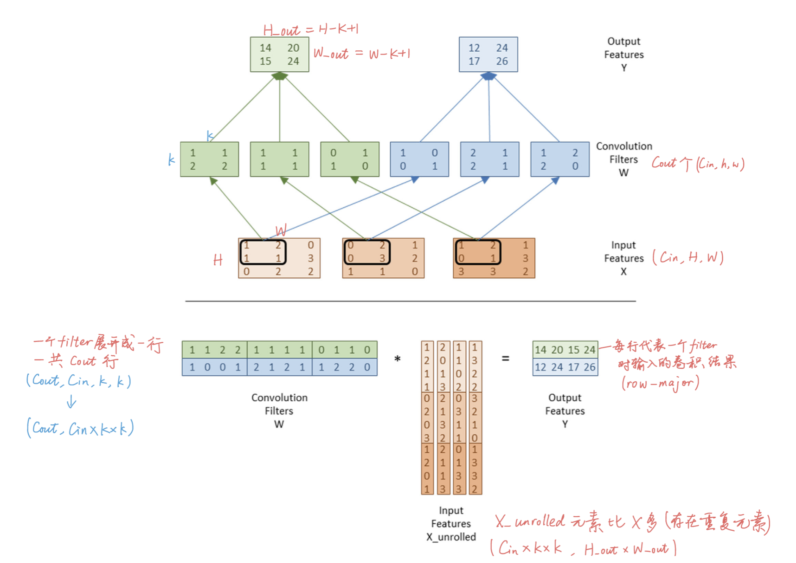


#### flash attention

版本一：混合量化方案

- **量化范围**：仅Q和K使用INT8，V保持FP16
- **量化方式**：依赖硬件原生INT8矩阵乘法支持
- **关键代码**：

```python
qk = tl.dot(q, k).to(tl.float32)  # INT8矩阵乘法
qk = qk * q_scale[:, None] * k_scale  # 反量化到FP32
```

版本二：全量化方案

- **量化范围**：Q、K、V全部使用INT8
- **量化方式**：手动实现attention权重的量化
- **关键代码**：

```python
p = p * 127  # 手动量化attention权重
p = (p+0.5).to(tl.int8)  # 四舍五入量化
tmp = tmp * v_scale / 127  # 手动反量化
```


伪代码：

```python
Q, K, V: (batch_size, num_heads, seq_len, head_dim)
O = torch.empty_like(Q)
L = torch.empty(batch_size, num_heads, seq_len)		# L = logsumexp(QK^T)
for pid in range(0, seq_len / BLOCKSIZE_Q):	# in parallel
    q:(batch_size, num_heads, BLOCKSIZE_Q, head_dim)
    mi = -inf 	# (BLOCKSIZE_Q,)
    li = 1		# (BLOCKSIZE_Q,)  l = exp(QK^T-m)的每行之和
    acc = 0		# (BLOCKSIZE_Q, head_dim)
    for block_id in range(0, seq_len / BLOCKSIZE_KV):
        S = QK^T * sqrt(head_dim)
        mi_new = rowmax(S)
        P = exp(S-mi)
        li = rowsum(P)
        alpha = exp(mi-mi_new)
        acc += PV * alpha
    acc /= li[;, None]		# 除分母完成softmax
```

+ 外层循环Q为什么性能更好？
  + 减少内存访问：Q放在外层循环是“一对多”, 加载一块Q后一直保存在寄存器中重复使用；
    KV放在外层循环是“多对一”，每个内层循环需要多次重复读取Q块

+ online softmax
  + 维护QK^T的每行最大值
  + 修正系数=exp(上次最大值-当前最大值)


量化版伪代码：
```python
# 输入：Q, K, V已经量化为INT8，配套scale参数
# Q_int8, K_int8: (batch_size, num_heads, seq_len, head_dim) dtype=int8
# V_int8: (batch_size, num_heads, seq_len, head_dim) dtype=int8  # 版本二
# V_fp16: (batch_size, num_heads, seq_len, head_dim) dtype=fp16  # 版本一
# q_scale, k_scale: (batch_size, num_heads, seq_len) dtype=fp16
# v_scale: (batch_size, num_heads) dtype=fp16  # 版本二需要

O = torch.empty_like(Q, dtype=torch.float16)
L = torch.empty(batch_size, num_heads, seq_len)

for pid in range(0, seq_len / BLOCKSIZE_Q):  # in parallel
    # ============= 量化输入加载 =============
    q_int8: (batch_size, num_heads, BLOCKSIZE_Q, head_dim)  # INT8
    q_scale_block: (batch_size, num_heads, BLOCKSIZE_Q)     # FP16
    
    mi = -inf   # (BLOCKSIZE_Q,)
    li = 1      # (BLOCKSIZE_Q,)
    acc = 0     # (BLOCKSIZE_Q, head_dim) FP32累加器
    
    for block_id in range(0, seq_len / BLOCKSIZE_KV):
        # ============= K块加载和反量化 =============
        k_int8: (batch_size, num_heads, head_dim, BLOCKSIZE_KV)  # INT8
        k_scale_block: (batch_size, num_heads, BLOCKSIZE_KV)     # FP16
        
        # ============= 版本一：混合量化方案 =============
        # QK^T计算 (INT8 matmul -> FP32)
        S_int32 = matmul_int8(q_int8, k_int8)  # -> INT32
        # 反量化到FP32
        S = S_int32.to(float32) * q_scale_block[:,:,:,None] * k_scale_block[:,:,None,:]
        S = S / sqrt(head_dim)  # scaling factor
        
        # Softmax计算保持FP32精度
        mi_new = rowmax(S, dim=-1)
        S_shifted = S - mi_new[:,:,:,None]
        P = exp(S_shifted)  # FP32 attention weights
        li_new = rowsum(P, dim=-1)
        
        # Online softmax更新
        alpha = exp(mi - mi_new)
        li = li * alpha + li_new
        acc = acc * alpha[:,:,:,None]
        
        # PV计算
        v_fp16: (batch_size, num_heads, BLOCKSIZE_KV, head_dim)  # V保持FP16
        # 可选：P量化为FP8提速
        P_reduced = P.to(float8_e5) if USE_FP8_ATTENTION else P.to(float16)
        pv = matmul(P_reduced, v_fp16)  # -> FP16/FP32
        acc += pv.to(float32)
        
        mi = mi_new
    
    # ============= 版本二：全量化方案（注释版本）=============
    # for block_id in range(0, seq_len / BLOCKSIZE_KV):
    #     # K块加载
    #     k_int8: (batch_size, num_heads, head_dim, BLOCKSIZE_KV)
    #     k_scale_block: (batch_size, num_heads, BLOCKSIZE_KV)
    #     
    #     # QK^T计算和反量化
    #     S_int32 = matmul_int8(q_int8, k_int8)
    #     S = S_int32.to(float32) * q_scale_block[:,:,:,None] * k_scale_block[:,:,None,:]
    #     S = S / sqrt(head_dim)
    #     
    #     # Softmax计算
    #     mi_new = rowmax(S, dim=-1)  
    #     S_shifted = S - mi_new[:,:,:,None]
    #     P = exp(S_shifted)  # FP32
    #     li_new = rowsum(P, dim=-1)
    #     
    #     # ========== 关键差异：P手动量化为INT8 ==========
    #     P_fp16 = P.to(float16)
    #     P_scaled = P_fp16 * 127.0  # 缩放到INT8范围
    #     P_int8 = round(P_scaled).clamp(-127, 127).to(int8)  # 量化
    #     
    #     # Online softmax更新
    #     alpha = exp(mi - mi_new)
    #     li = li * alpha + li_new  
    #     acc = acc * alpha[:,:,:,None]
    #     
    #     # V加载和PV计算
    #     v_int8: (batch_size, num_heads, BLOCKSIZE_KV, head_dim)  # V也是INT8
    #     v_scale_tensor: (batch_size, num_heads)  # V的scale
    #     
    #     pv_int32 = matmul_int8(P_int8, v_int8)  # INT8矩阵乘法
    #     # 手动反量化
    #     pv = pv_int32.to(float32) * v_scale_tensor[:,:,None,None] / 127.0
    #     acc += pv
    #     
    #     mi = mi_new
    
    # ============= 最终归一化和输出 =============
    acc = acc / li[:,:,:,None]  # 完成softmax归一化
    L[pid] = mi + log(li)       # 保存logsumexp用于后续计算
    O[pid] = acc.to(float16)    # 输出转换为FP16

# ============= 量化参数说明 =============
# 量化公式: quantized = round(float_val * scale).clamp(-127, 127)
# 反量化公式: float_val = quantized.to(float32) / scale
# 
# 版本一优势：
# - 利用硬件INT8加速QK^T计算
# - V保持FP16精度，减少累积误差
# - 实现相对简单
#
# 版本二优势（注释版本）：
# - 最大化内存节省（Q/K/V全INT8）
# - 进一步减少attention权重的存储
# - 需要更精细的量化校准
```


#### 性能分析脚本

**概述**
这个脚本主要就是通过Python装饰器，把原始函数包装一下，再函数调用前后用time方法记一下时间，最后就可以统计推理过程所有函数的调用次数和执行时间。它里面是不断递归地装饰背后整个模块的所有函数，包括整个类、forward函数、一直到最底层的加减乘除算子调用。最后测出来的结果跟profiler工具是差不多的，也能用在SAS模型上，虽然还是测不了具体每个算子的调用耗时，但可以测出来模型的每个层的推理耗时。


**介绍一下Python装饰器**
	装饰器是python的一个内置功能，就是它接受一个函数作为参数，返回一个新的函数。装饰器优点就是可以在不修改原函数代码的情况下，给函数添加额外功能。
	装饰器的用途非常广泛：日志记录（记录函数调用和参数）、权限验证（检查用户是否有权限执行某操作）、缓存机制（避免重复计算）、重试机制（函数失败时自动重试）、参数验证（检查输入参数是否合法）、异常处理等。


**这种监控方式对性能的影响如何？**
 确实会有一定性能开销，主要来自于时间记录和字典操作。不过对于性能分析场景，这种开销其实无所谓，因为重点是用同一个测试方法来对比两边算子的性能嘛，关注的是相对性能差异。所以大家都有这些性能开销。


### 推理框架项目

#### 推理流程

**宏观上**，其实就是"用户输入prompt，模型给你回答"。那从微观上来看就有很多步嘛，

**第一步是请求预处理**。用户发来一句话，比如"帮我写个Python函数"，我们首先要把它tokenize，就是切成一个个数字ID。这里有个细节，如果是对话模型，还要加上对话模板，比如把用户输入包装成特定格式。

**然后进入模型推理阶段**，这是最核心的部分。模型会逐层计算，每一层都有attention和MLP两个主要组件。这里有个关键优化叫KV Cache - 就是把之前计算过的key和value缓存起来，避免重复计算。不然每生成一个token都要重新算一遍所有历史token，那计算量就爆炸了。

**接下来是文本生成**，也就是decoding。模型输出的是每个词的概率分布，我们要从中选择下一个token。可以用贪心搜索直接选概率最高的，也可以用采样方法增加多样性。这个过程会一直重复，直到生成结束符或者达到最大长度。

**从工程角度看**，真正的挑战在于如何高效处理多个并发请求。传统做法是static batching，就是等一批请求都处理完再处理下一批。但这样效率很低，因为不同请求的生成长度不一样。

**现在主流的做法是continuous batching**，比如vLLM就用这个技术。简单说就是，当batch里有请求生成完了，立马把它移除，然后从队列里拿新请求填进来。这样GPU利用率能保持很高。

**内存管理也是个大问题**。KV Cache会随着序列长度线性增长，很容易OOM。vLLM提出了PagedAttention，把KV Cache像操作系统管理内存一样分页存储，大大提高了内存利用率。我之前调试过一个7B模型的服务，用了PagedAttention后，同样显存能处理的并发数提升了好几倍。

**在实际部署中**，还有很多细节需要考虑。比如动态batch size调整 - 根据当前GPU内存使用情况自动调整批次大小。还有就是模型并行，对于很大的模型，需要把它切分到多张卡上。

**性能监控也很重要**。我们通常关注几个指标：吞吐量（tokens/second）、延迟、GPU利用率。在线服务的话，还要监控队列长度，避免请求堆积。

我觉得做LLM推理优化，核心思路就是最大化GPU利用率。GPU这种昂贵资源，每一秒的空闲都是浪费。所以无论是continuous batching、KV Cache、内存分页，本质上都是为了让GPU始终保持高负载运行。

当然，不同场景的优化策略也不一样。如果是交互式对话，更关注首token延迟；如果是批量处理，更关注总吞吐量。这需要根据具体业务需求来调优。一次推理流程


#### Qwen2 & Llama模型结构

##### 总览

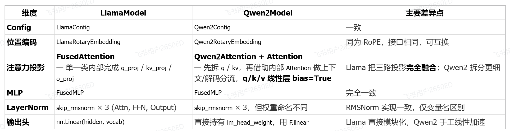


## triton和GPU相关

### Triton基础概念

#### 1. triton编译流程

> triton kernel -> triton IR -> LLVM IR -> PTX，最后配合 runtime 运行

上述编译过程通过 `@triton.jit` 装饰器完成，具体来说是遍历提供的 Python 函数的抽象语法树（AST），并使用常见的 `SSA` 构建算法即时生成 `Triton-IR`。然后，编译器后端会简化、优化并自动并行化所产生的 `IR` 代码，再将其转换为高质量的 `LLVM-IR`，最后生成 PTX 并在 NVIDIA GPU 上执行。

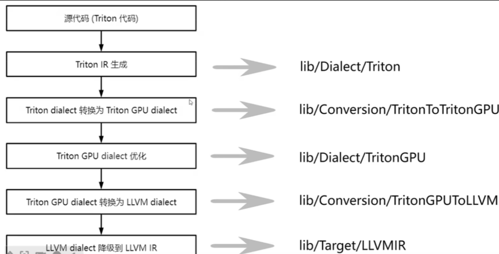

#### 2. triton和cuda区别

 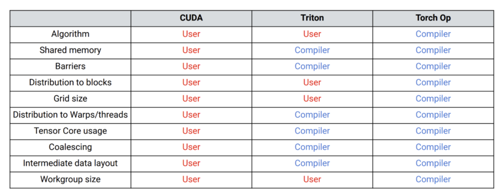

| 特性                      | CUDA (手动)                          | Triton (自动)                                           |
| ------------------------- | ------------------------------------ | ------------------------------------------------------- |
| **内存对齐 (Coalescing)** | 手动优化（需要保证访问模式）         | 自动合并访问                                            |
| **共享内存管理**          | 手动分配/同步                        | 编译器自动识别、缓冲数据                                |
| **SM 内部线程调度**       | 手动分配线程块给 SM、设定 block 大小 | 编译器自动并行化、在 SIMD 单元中分配任务                |
| **SM 间线程调度**         | 手动设定 grid 大小                   | 手动（Triton 不跨 SM 自动分配）                         |
| **编程模型**              | C/C++ (CUDA API)                     | Python API (`@triton.jit` 函数)                         |
| **调试工具**              | cuda-gdb、printf                     | 内置 `static_print/device_print`、`TRITON_INTERPRET` 等 |
| **现有库支持**            | 丰富（cuBLAS, cuDNN 等）             | 主要依赖自定义 kernel 开发，库支持尚少                  |

#### 3. num_warps和num_stages

num_warps —— **空间并行(同时处理更多数据)**

+ 用于指定一个**block的线程数**, 即**每个block的线程数为num_warps * 32**
+ 1 warp = 32 threads (硬件写死), 这32个线程**严格并行**，同时执行相同的指令
+ block内部并不是所有线程严格并行，而是**以warp为原子单位并行+warp层面的调度切换**
+ num_warps越大，kernel并行度越高；但所有warp会**共享所在SM的寄存器和共享内存**，因此**num_warps设置过大会导致每个线程可用的共享内存或寄存器变少**


num_stages —— **时间并行(流水线重叠)**

+ 表示**流水线深度**, 表示可以同时进行多少阶段的数据加载/计算
+ 过多的流水线阶段虽然有助于延迟隐藏，但同时会增加寄存器压力和同步开销。


#### kernel性能分析

profiler看指标：GPU利用率、显存占用/L2 cache占用

1. 显存占用低，GPU利用率低(或高): **compute bound(计算快、数据读不过来)**，并行度不够->
   + 减小BLOCKSISZE, 增大block数，充分利用SM(一个block对应一个SM)
   + 增大num_warps, 即增大并行线程数
2. GPU利用率低，显存占用高：**memory bound（GPU闲、显存忙）**, 
   + 增大num_stages:减少内存延迟
   + 增大矩阵乘法BK：减少显存读取次数，增加数据复用次数


### N卡GPU硬件参数

| 指标                 | V100      | A100         | H100         | B100         | RTX3090     | RTX 4090    | RTX 5090   |
| -------------------- | --------- | ------------ | ------------ | ------------ | ----------- | ----------- | ---------- |
| **发布年份**         | 2017      | 2020         | 2023         | 2024         | 2020        | 2022        | 2024       |
| **架构**             | Volta     | Ampere       | Hopper       | Blackwell    | Ampere      | Ada         | Blackwell  |
| **工艺**             | 12nm      | 8nm          | 4nm          | 4nm          | 8nm         | 5nm         | 3nm        |
| **CUDA核心**         | 5120      | 6912         | 14080        | 18432        | 10496       | 16384       | 21760      |
| **FP32峰值(TFLOPS)** | 15.7      | 19.5         | 67           | 89.1         | 39.1        | 82.6        | 178        |
| **Tensor(FP8)**      | 125       | 312          | 1456         | 1391         | 1248        | 2661        | 5632       |
| **显存容量**         | 32GB HBM2 | 40/80GB HBM2 | 80GB HBM3    | 192GB HBM3   | 24GB GDDR6X | 24GB GDDR6X | 32GB GDDR7 |
| **显存带宽**         | 900 GB/s  | **2TB/s**    | **3.35TB/s** | **8.64TB/s** | 936 GB/s    | 1.15TB/s    | 1.8TB/s    |
| **L2缓存**           | 6MB       | 40MB         | 50MB         | 288MB        | 6MB         | 12MB        | 24MB       |
| **TDP**              | 300W      | 250W         | 700W         | 1000W        | 420W        | 575W        | 600W       |
| **价格(2024)**       | 已停产    | $12k         | $30k+        | 未发布       | $1800       | $1600       | $1999      |

#### 浮点运算性能

+ 由**核心数、时钟频率、每周期运算数**决定
+ 又进一步由**芯片工艺制程**决定：精度越高(8nm->4nm), 晶体管数更多、核心数可以造的更多、频率可以更高


#### L1/L2 cache区别

| 特性             | L1 Cache     | L2 Cache        | Shared Memory         |
| ---------------- | ------------ | --------------- | --------------------- |
| **物理位置**     | 每个SM内     | GPU全局         | 每个SM内              |
| **容量**         | 128-256KB/SM | 40-288MB (全部) | 96-192KB/SM           |
| **总容量(H100)** | 33.8MB       | 50MB            | 25.3MB                |
| **访问延迟**     | ~4 cycles    | ~30-40 cycles   | ~2-4 cycles           |
| **带宽**         | 4TB/s+       | 全GPU带宽瓶颈   | 等同L1                |
| **谁管理**       | 硬件自动     | 硬件自动        | **程序员手动**        |
| **缓存策略**     | 自动替换     | 自动替换        | 显式分配              |
| **可见性**       | 对程序员透明 | 对程序员透明    | **程序员可见**        |
| **数据一致性**   | 自动         | 自动            | **手动同步**          |
| **访问方式**     | 随机访问     | 随机访问        | **结构化访问**        |
| **用途**         | 通用数据缓存 | 跨SM数据共享    | **线程间协作**        |
| **编程方式**     | 无需编码     | 无需编码        | **需要 `__shared__`** |

> GPU内存层级：寄存器-> shared memory / L1 cache ->L2 cache ->显存 ->内存

### GPU 并行计算基础

- **CUDA 的线程模型：warp、thread、block 有何区别？**
   **答：** 在 CUDA 中，每个多处理器（SM）同时调度执行一个 warp 的指令，当前架构下一个 warp 包含 32 个线程。线程（thread）是最小执行单元，多个线程组成线程块（block），多个线程块组成网格（grid）。程序中通过配置每个 kernel 的 block 大小（每个 block 包含多少线程）和 grid 大小来控制并行度。一个线程块内的线程共享同一块 SRAM（共享内存），线程块之间可以看作无直接同步（除非使用全局同步原语）。概括：每个 block 有若干 warp，warp 内的 32 个线程同时执行同一条指令；多个 block 在多个 SM 上并发执行。
- **什么是内存合并 (coalescing)？如何避免冲突？**
   **答：** 内存合并指的是当同一个 warp 的线程同时访问相邻地址时，硬件会将多个内存访问合并为少量传输。例如在 Volta 及以后架构上，一个 warp 可以以 128 字节（32×4-byte）的块为单位访问，只要每个线程访问连续地址且对齐，就能打包为一次传输。反之，如果访问不对齐或散乱，就可能产生多个事务，降低带宽利用率。在 Triton 中，使用 `tl.arange` 等生成连续地址序列可以自动获得合并访问。另外，共享内存中也要避免**bank 冲突**，即同一时刻过多线程访问同一个 bank（16/32 位交错的片段）；编写代码时可通过添加填充或调整访问模式来消除冲突。
- **什么是占用率 (Occupancy)？为什么重要？**
   **答：** 占用率定义为每个 SM 上**活跃 warp 数**与该 SM 最大活跃 warp 数的比值。换言之，若 SM 最多可并行 64 个 warp，当活跃的 warp 只有 32 个时，占用率为 50%。高占用率意味着有更多并发线程可执行，可以更好地隐藏指令和内存的延迟；但过高占用率也可能导致每线程资源减少（如寄存器变少，产生 spill），从而降低性能。通常用 CUDA 提供的 Occupancy API（如 `cudaOccupancyMaxActiveBlocksPerMultiprocessor`）或 Nsight 工具来评估占用率。在调优时，若发现占用率过低，可增大 block 大小或减少每线程使用的资源；若占用率已满，还需关注是否有其他瓶颈（如内存带宽）。


## 八股笔记

**Q1: 请解释NPU与GPU在AI推理中的区别和各自优势？**

**参考答案**：
 NPU和GPU在AI推理中有不同的设计理念和优势：

**NPU的特点**：

- 支持低精度运算（8位或更低）降低计算复杂度，提供卓越的并行处理能力[[10\]](https://www.ibm.com/think/topics/neural-processing-unit)
- 在特定AI任务中能够超越GPU性能，广泛应用于工业IoT、自动驾驶、智能手机相机等领域[[6\]](https://insideainews.com/2024/07/20/npus-are-emerging-as-the-main-rival-to-nvidias-ai-dominance/)
- 专注于AI推理而非训练，执行实时智能化任务时更节能[[1\]](https://corp.sinya.com.tw/post/1039/)

**GPU的优势**：

- 更适合训练和大规模并行计算
- GPU和NPU可协同部署，在数据中心和ML/DL环境中互补，特别是需要节能和低延迟的场景[[6\]](https://insideainews.com/2024/07/20/npus-are-emerging-as-the-main-rival-to-nvidias-ai-dominance/)

**Q2: 描述一个完整的AI推理引擎的核心组件和工作流程？**

**参考答案**：
 一个完整的AI推理引擎包含以下核心组件：

1. **模型管理器**：负责模型加载、解析、权重管理
2. **内存管理器**：采用PagedAttention等技术优化显存利用，支持动态KV Cache管理[[8\]](https://www.53ai.com/news/finetuning/2025031820875.html)
3. **计算调度器**：实现Prefill和Generation阶段的优化，包括并行解码、多卡并行(TP/SP)等[[1\]](https://www.qbitai.com/2024/09/191895.html)
4. **算子优化层**：融合算子、量化支持
5. **请求处理器**：支持流式输出、动态批处理[[8\]](https://www.53ai.com/news/finetuning/2025031820875.html)

工作流程：请求接收 → 模型加载 → Prefill阶段（处理输入prompt）→ Generation阶段（自回归生成）→ 结果返回

### 项目经验类问题

**Q3: 你在算子开发方面的经验如何应用到NPU推理引擎开发中？**

**参考答案**：
 我的算子开发经验与NPU推理引擎开发高度契合：

1. **算子优化迁移**：我开发的int8量化GEMM、FlashAttention等算子可直接应用于NPU，因为NPU专门针对INT8/INT16性能优化[[7\]](https://forums.theregister.com/forum/all/2024/11/11/npu_debate/)
2. **内存管理经验**：我在LLM推理框架中实现的Paged Attention和动态显存分配技术，正是现代推理引擎的核心
3. **性能优化思路**：我通过Triton实现的算子融合和内存访问优化，可应用于NPU的专用指令优化

**Q4: 如何设计一个支持自动驾驶场景的推理引擎？**

**参考答案**：
 自动驾驶推理引擎需要考虑以下关键点：

1. **实时性要求**：NPU在自动驾驶领域的应用注重低延迟和实时处理[[6\]](https://insideainews.com/2024/07/20/npus-are-emerging-as-the-main-rival-to-nvidias-ai-dominance/)
2. **多模态支持**：需要同时处理图像、雷达、激光雷达数据
3. **功耗约束**：NPU专门设计用于低功耗AI推理，适合车载场景[[1\]](https://corp.sinya.com.tw/post/1039/)
4. **安全可靠性**：实现冗余设计、故障检测和降级处理
5. **边缘部署**：支持模型压缩、量化，适应车载计算平台限制

### 优化与性能类问题

**Q5: 描述几种主要的推理性能优化技术？**

**参考答案**：
 主要的推理性能优化技术包括：

1. **内存优化**：Prefix Cache技术，将Prefill计算转化为KV-Cache查询[[1\]](https://www.qbitai.com/2024/09/191895.html)
2. **并行优化**：并行解码技术，突破自回归限制，通过降低单请求延时来提升吞吐[[1\]](https://www.qbitai.com/2024/09/191895.html)
3. **算子融合**：通过算子融合技术优化推理计算过程[[8\]](https://www.53ai.com/news/finetuning/2025031820875.html)
4. **量化技术**：INT8/INT16量化降低计算和存储开销
5. **动态批处理**：根据实际负载动态调整batch size[[8\]](https://www.53ai.com/news/finetuning/2025031820875.html)

**Q6: TOPS指标在NPU评估中的意义和局限性？**

**参考答案**：
 TOPS（每秒万亿次操作）是NPU性能的重要指标，但需要理性看待：

**意义**：当前主流NPU如Intel Lunar Lake(48 TOPS)、AMD Ryzen AI 300(55 TOPS)都以此为性能标准[[8\]](https://www.theregister.com/2024/11/11/npu_debate/)

**局限性**：TOPS是理想实验室条件下的理论峰值性能，基于MAC单元数量和工作频率计算，不一定转化为实际使用中的性能提升，对普通用户而言就像汽车的理论最大马力[[8\]](https://www.theregister.com/2024/11/11/npu_debate/)

### 推理加速

#### 1. 数据并行DP/流水线并行PP/张量并行TP/专家并行EP

| 维度         | DP (数据并行)                                 | PP (流水线并行)                        | TP (张量并行)                                             | EP (专家并行)                            |
| ------------ | --------------------------------------------- | -------------------------------------- | --------------------------------------------------------- | ---------------------------------------- |
| **基本原理** | 每个设备保存完整模型副本，处理不同的数据batch | 模型按层间切分，数据在设备间流水线传递 | 模型按层内划分（例如attention多头），在多个设备上并行计算 | 不同专家模块分布在不同设备，动态路由选择 |
| **切分维度** | 数据维度                                      | 模型层维度                             | 权重维度                                                  | 专家维度                                 |
| **通信模式** | All-Reduce同步梯度                            | 点对点传递激活值                       | 频繁All-Reduce/All-Gather                                 | 动态All-to-All通信                       |
| **延迟**     | 几乎没有                                      | 中                                     | 高                                                        | 中                                       |
| **通信频率** | 每个step结束时                                | 每层计算完成时                         | 每个算子内部                                              | 每个token的专家选择时                    |
| **内存占用** | 高（每设备存完整模型）                        | 中（按层数均分）                       | 低（按并行度均分）                                        | 中（取决于专家分布）                     |
| **计算效率** | 高（无额外开销）                              | 中（存在bubble time）                  | 高（细粒度并行）                                          | 高（专家稀疏激活）                       |
| **适用场景** | 小模型，多数据                                | 大模型，层数多                         | 超大模型，单层很大                                        | MoE模型                                  |
| **扩展性**   | 受模型大小限制                                | 受模型深度限制                         | 受单层大小限制                                            | 受专家数量限制                           |
| **负载均衡** | 天然均衡                                      | 可能不均衡                             | 天然均衡                                                  | 需要动态调整                             |
| **容错性**   | 好（任一设备故障影响小）                      | 差（单点故障影响大）                   | 差（紧密耦合）                                            | 中（专家可重分配）                       |

**Tensor Parallel（TP）**：把模型按层内切分，比如attention的多头、MLP的参数都分布到不同GPU上，需要频繁的all-reduce通信。

**Pipeline Parallel（PP）**：按层间切分，不同GPU负责不同的layer，通信相对较少，但可能有bubble。

**Data Parallel**：每个GPU都有完整模型，处理不同的batch，适合小模型。

**Expert Parallel**：把不同的expert分布到不同的GPU上。

+ 首先router决定每个token要路由到哪些expert，然后做一个all-to-all通信，把token发送到对应的expert所在的GPU。
+ expert计算完后，再做一次all-to-all把结果发回去。


##### DP (数据并行)

**优点：**

- 实现简单，框架支持好
- 完美负载均衡
- 容错性强

**缺点：**

- 模型必须能放入单个设备
- 内存利用率低
- 通信量随模型大小线性增长

**典型应用：** 中小型模型的训练和推理


##### PP (流水线并行)

**优点：**

- 能训练超大模型
- 通信量相对较少
- 实现相对简单

**缺点：**

- 存在bubble time降低效率
- 需要micro-batch技术优化
- 负载可能不均衡

**典型应用：** GPT系列大模型训练


##### TP (张量并行)

**优点：**

- 内存效率最高
- 能处理超大单层模型
- 计算高度并行

**缺点：**

- 通信频繁，对网络要求高
- 实现复杂度高
- 扩展性受限于单层大小

**典型应用：** Transformer的attention和MLP层


##### EP (专家并行)

**优点：**

- 模型容量大但计算稀疏
- 可以不均匀分布专家
- 支持动态负载均衡

**缺点：**

- 只适用于MoE架构
- 负载均衡复杂
- 通信模式不规则

**典型应用：** Switch Transformer、GLaM等MoE模型


#### 2. MHA->MLA

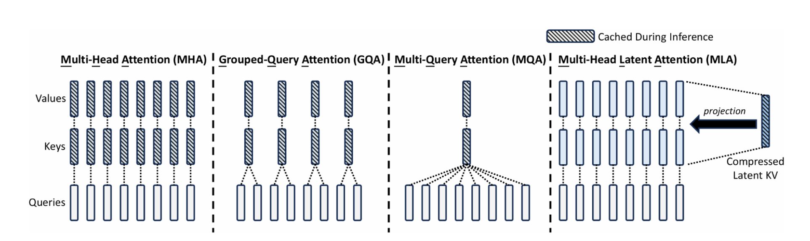

MQA、GQA、MLA都是为了压缩KV cache嘛，MQA是所有head都共享一个KV，虽然内存压缩的特别多，但是性能也会明显下降。所以GQA就是一个改进，n个head分成g个组，每个组的共享一个KV，就属于一种折中的办法，介于MHA和MQA之间。


MLA的话我觉得算是一个新的算法了，跟MQA、GQA直接减少KV不一样。

首先因为它存的不是KV，而是叫compressed latent KV。具体来说就是把原来计算KV的过程拆成了两步，第一步计算出矩阵c（就是compressed矩阵），第二步再通过C乘上两个权重分别得到K和V。这个思想就类似低秩分解，最后只需要存这个c矩阵，不需要存K和V，推理的过程中把KV算出来，并且KV的数量是和原来MHA是一样，所以说效果完全没有下降。

不过这样的话计算量就上升了，因为推理的过程得重新计算KV嘛，所以这和不用KV cache有什么区别呢？MLA的解法就是叫矩阵吸收，就是从C计算得到K和V的那两个矩阵是不需要存的，C到K的那个矩阵可以跟Wq合并，也就是说输入x乘上合并后的矩阵直接就可以得到$QK^T$，这样的话就不需要先算出Q和K再做矩阵相乘了；还有C到V的那个矩阵可以和WO合并，这样的话就不需要先计算出V，再和softmax($QK^T$)做矩阵相乘了，直接乘上合并后的矩阵就可以得到最后的结果O.

所以说MLA它整个计算过程已经完全变样了，我感觉都可以叫一个新的算法了。


**为什么MHA计算时要除$\sqrt{h}$（h=head_dim)?**

+ 为了维持方差稳定，防止梯度消失
+ 如果不除，$QK^T$方差会特别大，导致softmax之后只有0和1了，注意力分布就成了one-hot
+ 反向传播时，softmax的导数在|x|比较大时接近0，这样就会梯度消失


#### 3. Paged Attention

> KV Cache 被划分为块。块在内存空间中不需要连续。

**Paged Attention原理：**

传统LLM预分配KV cache都是按照最大长度max_seq_len来分配，这样的话就很容易浪费，因为不同序列长度不一样，如果有些用户输入的prompt很短就结束对话了，那给他分配的这么多内存没用到的都浪费了。

Paged Attention的优化思想就是把KV cache的分配以块为单位，比如说16个token算一个page。这样的话就可以很明显地减少内存浪费问题，只有最后一页会存在浪费，vllm说是可以把内存利用率从20%以下提升到90%几。
并且每个page在内存中是不需要连续的，因为有单独的一个页表，每个元素代表这一页在内存中的地址。只要逻辑上连续就行。
还有一个优点就是可以内存共享，几个sequence可以共享同一个page。比如说模型一开始的系统prompt就可以被所有用户共享；不同用户对话过程中遇到连续的相同token也可以共享那个page。


**如何判断几个sequence可以共享一个page？**

建Prefix Tree，每来一个新序列，就沿着树一个token一个token的走一遍，如果走过了一个page的数量，就说明这个page已经存在了，共享存在的那个page就行。
虽然还是一个token一个token的比较，但是存储降低了很多，不需要每个sequence都存下来一个一个对比。

**KVcache管理**


#### 4. continuous batching

> **核心：动态管理KV cache和batch**

**1. KV Cache管理**

每个请求有自己的KV cache（之前生成的key-value）。传统方法是请求结束才释放，continuous batching中请求完成立即释放，为新请求腾空间。

**2. 请求队列**

维护等待队列和运行队列。新请求入队，根据显存和batch大小动态加入运行batch，完成请求移出。

**3. 动态batch组织**

每次推理不是固定batch大小，而是根据：

- 当前运行请求数
- 剩余显存
- KV cache占用

动态决定这一轮推理的batch大小。

**4. Padding和Attention Mask**

由于请求长度不同，需要：

- Padding统一长度
- Mask标记有效token位置

完成的请求token全标0，新请求补充上来时重新计算mask。

**5. 调度策略**

- FCFS：先来先服务
- Priority：高优先级请求先完成
- 最长优先/最短优先

**关键难点：** 频繁加入/移出请求，KV cache分散，需要内存管理器追踪每个请求的cache位置


#### 5. Per-channel vs Per-group 

Per channel是每个output channel用一个scale，粒度更细，量化精度更高。Per group是把多个channel分成一组，一组用一个scale。

虽然per channel精度更高，但是dequantization的时候计算开销更大，因为要对每个channel做不同的scale操作。Per group的话，可以用SIMD指令batch处理，速度更快。

而且现在的量化算法，比如AWQ、GPTQ，在per group的粒度下已经能取得很好的精度，所以工程上更倾向于用per group，在精度和速度之间找平衡。


#### 6. RMSNorm vs LayerNorm

##### 基本概念

+ 这两个都是归一化技术，在Transformer里面起到稳定训练、加速收敛的作用。
+ 让数据分布更稳定，避免出现数值爆炸或者消失的问题。
+ 在模型中的位置: 每个Transformer block的attention前面和MLP前面

##### RMSNorm优势

1. 计算量少了25%左右，因为**不用算均值和方差**了
2. 数值稳定性反而更好，因为避免了减均值的精度损失
3. 内存占用更少，中间变量更简单
4. 在GPU上更好优化，一次遍历就搞定

##### 公式

**给定输入向量** $x \in \mathbb{R}^d$,

**LayerNorm:**

1. 算均值$$\mu = \frac{1}{d} \sum_{i=1}^{d} x_i$$
2. 算方差$$\sigma^2 = \frac{1}{d} \sum_{i=1}^{d} (x_i - \mu)^2$$
3. 归一化+仿射变换$$\text{LayerNorm}(x) = \gamma \odot \frac{x - \mu}{\sqrt{\sigma^2 + \varepsilon}} + \beta$$, 其中:
   + $\gamma \in \mathbb{R}^d$：可学习的缩放参数向量
   + $\beta \in \mathbb{R}^d$：可学习的偏移参数向量  
   + $\varepsilon$：数值稳定性常数（通常为 $10^{-6}$）

**RMSNorm**:

1. 算均方根$$\text{RMS}(x) = \sqrt{\frac{1}{d} \sum_{i=1}^{d} x_i^2}$$
2. 归一化+缩放$$\text{RMSNorm}(x) = \gamma \odot \frac{x}{\text{RMS}(x) + \varepsilon}$$, 其中:
   + $\gamma \in \mathbb{R}^d$：可学习的缩放参数向量
   + $\varepsilon$：数值稳定性常数（通常为 $10^{-8}$，比LayerNorm更小）
   + 注意：**没有偏移量** $\beta$

| 归一化方法 | 参数            | 计算复杂度 | 公式特点                     |
| ---------- | --------------- | ---------- | ---------------------------- |
| LayerNorm  | $\gamma和\beta$ | O(2d)      | 减均值 + 除标准差 + 仿射变换 |
| RMSNorm    | 只有$\gamma$    | O(d)       | 除均方根 + 缩放              |


### LLM基础

#### 1.LayerNorm & BatchNorm

`Batch Norm` 和 `Layer Norm` 的区别一句话总结就是 `bn` 是切特征，`ln` 是切样本。

+ `BN`: 对于每个特征维度，计算它在**整个批次中**的均值和标准差，然后对该特征进行归一化。
+ `LN`: **对每个样本**单独计算其所有特征的均值和标准差，然后在该样本内进行归一化。


#### 2. LLM两个推理阶段

Prefill 和 Decode

+ Prefill: 并行计算所有prompt token的QKV，生成第一个输出token。然后算出来的KV就存到KVcache里
+ Decode: 每生成一个token，计算这个token的QKV，把KV拼接到所有token的KV矩阵上，接着一行Q和整个KV矩阵进行计算，生成下一个token，重复这个过程直到结束。

为什么Prefill阶段要计算所有token的Q？明明生成一个token只需要最后一行Q即可，prefill阶段不能只计算最后一行Q吗？

+ 本质原因就是一个大模型有很多和attention layer，每个attention的输入是上一层的输出，并且有各自的KV cache。
  如果第一个attention layer只计算最后一行Q，计算得到的O也只有一行，那下一层attention就只能得到一个token作为输入了，这样的话后面所有attention layer就完全没有历史信息了，也没有KVcache了，这些attention layer就废了。
+ 所以prefill计算所有token的Q就是为了让全部的attention layer把自己的KVcache计算出来。


#### 3. LLM性能指标

##### 推理性能指标

| 指标名称                       | 概念定义                    | 计算公式                                | 主要作用                   | 适用场景           | 理想值/目标                   |
| ------------------------------ | --------------------------- | --------------------------------------- | -------------------------- | ------------------ | ----------------------------- |
| **TPS** (Tokens Per Second)    | 每秒处理的token数量         | `TPS = 处理的token总数 / 总时间`        | 衡量模型吞吐量性能         | 批量处理、API服务  | >100 (单用户)>1000 (批量)     |
| **TTFT** (Time To First Token) | 从请求到首个token输出的时间 | `TTFT = 首token时间戳 - 请求时间戳`     | 衡量响应速度，影响用户体验 | 在线聊天、实时对话 | <200ms (优秀)<500ms (可接受)  |
| **Token Latency**              | 生成连续token之间的平均间隔 | `Token延迟 = 总生成时间 / 生成token数`  | 衡量生成流畅度             | 流式输出、打字效果 | <50ms (流畅)<100ms (可接受)   |
| **端到端延迟**                 | 完整请求-响应周期时间       | `E2E延迟 = 响应完成时间 - 请求发起时间` | 衡量整体服务性能           | API服务、系统集成  | <1s (交互式)<5s (非实时)      |
| **QPS** (Queries Per Second)   | 每秒处理的查询请求数        | `QPS = 处理请求数 / 时间窗口`           | 衡量并发处理能力           | 高并发服务         | >1000 (高并发)>100 (一般应用) |

##### 准确性评估指标

| 指标名称              | 概念定义                 | 计算公式                                            | 主要作用           | 适用场景                 | 理想值/目标                |
| --------------------- | ------------------------ | --------------------------------------------------- | ------------------ | ------------------------ | -------------------------- |
| **F1-Score**          | 精确率和召回率的调和平均 | `F1 = 2×P×R/(P+R)``P=TP/(TP+FP), R=TP/(TP+FN)`      | 平衡准确性和完整性 | 分类、实体识别、信息抽取 | >0.8 (优秀)>0.6 (可用)     |
| **BLEU**              | n-gram重叠度评估         | `BLEU = BP × exp(∑wn×log(pn))``BP为简洁性惩罚`      | 评估生成文本质量   | 翻译、文本生成           | >0.4 (翻译)>0.2 (生成)     |
| **ROUGE-L**           | 最长公共子序列召回率     | `ROUGE-L = LCS(X,Y)/length(Y)``LCS为最长公共子序列` | 评估摘要生成质量   | 文本摘要、信息提取       | >0.5 (摘要)>0.3 (一般生成) |
| **困惑度 (PPL)**      | 模型对文本的预测不确定性 | `PPL = exp(-1/N × ∑log P(wi))`                      | 衡量语言建模能力   | 语言模型评估             | <20 (优秀)<50 (可用)       |
| **准确率 (Accuracy)** | 正确预测的比例           | `Accuracy = 正确预测数 / 总预测数`                  | 直接衡量预测准确性 | 分类任务、选择题         | >90% (高精度)>80% (可用)   |


##### 资源效率指标

| 指标名称           | 概念定义                 | 计算公式                              | 主要作用         | 适用场景           | 理想值/目标                   |
| ------------------ | ------------------------ | ------------------------------------- | ---------------- | ------------------ | ----------------------------- |
| **GPU利用率**      | GPU计算资源使用百分比    | `GPU利用率 = 实际计算时间 / 总时间`   | 衡量硬件利用效率 | 推理优化、资源规划 | >80% (高效)>60% (可接受)      |
| **内存利用率**     | 显存使用占总显存的比例   | `内存利用率 = 使用显存 / 总显存`      | 评估内存使用效率 | 内存优化、容量规划 | 70-90% (理想)<95% (避免OOM)   |
| **内存带宽利用率** | 数据传输效率             | `带宽利用率 = 实际传输量 / 理论峰值`  | 识别内存瓶颈     | 性能调优           | >60% (高效)                   |
| **FLOPS利用率**    | 浮点运算效率             | `FLOPS利用率 = 实际FLOPS / 峰值FLOPS` | 衡量计算效率     | 算法优化           | >50% (Transformer)>80% (卷积) |
| **模型压缩比**     | 压缩后与原始模型的大小比 | `压缩比 = 压缩后大小 / 原始大小`      | 评估压缩效果     | 模型部署、边缘计算 | <0.5 (显著)<0.8 (有效)        |


##### 成本效益指标

| 指标名称                          | 概念定义            | 计算公式                                      | 主要作用     | 适用场景           | 理想值/目标      |
| --------------------------------- | ------------------- | --------------------------------------------- | ------------ | ------------------ | ---------------- |
| **推理成本**                      | 处理单位token的费用 | `成本/1K tokens = GPU成本×时间 / 处理token数` | 评估经济效益 | 成本控制、方案选择 | <$0.01/1K tokens |
| **TCO** (Total Cost of Ownership) | 总拥有成本          | `TCO = 硬件+软件+运维+人力成本`               | 全面成本评估 | 投资决策、预算规划 | 依具体业务而定   |
| **能效比**                        | 性能与功耗的比值    | `能效比 = TPS / 功耗(W)`                      | 评估能源效率 | 绿色计算、数据中心 | >1 TPS/W         |
| **ROI** (Return on Investment)    | 投资回报率          | `ROI = (收益-成本) / 成本 × 100%`             | 衡量商业价值 | 商业决策           | >30% (年化)      |


##### 用户体验指标

| 指标名称                  | 概念定义               | 计算公式                             | 主要作用           | 适用场景           | 理想值/目标                       |
| ------------------------- | ---------------------- | ------------------------------------ | ------------------ | ------------------ | --------------------------------- |
| **可用性** (Availability) | 系统正常运行时间比例   | `可用性 = 正常运行时间 / 总时间`     | 衡量服务稳定性     | 生产环境、SLA保证  | >99.9% (高可用)>99.99% (关键业务) |
| **错误率**                | 请求失败的比例         | `错误率 = 失败请求数 / 总请求数`     | 评估服务质量       | 质量监控、故障预警 | <0.1% (优秀)<1% (可接受)          |
| **P95延迟**               | 95%请求的响应时间      | `P95 = 第95百分位的延迟值`           | 衡量用户体验一致性 | 性能SLA、用户体验  | <1s (交互式)                      |
| **用户满意度**            | 用户对服务质量的评分   | `满意度 = 满意用户数 / 总用户数`     | 直接反映用户体验   | 产品优化、业务决策 | >4.0/5.0 (优秀)                   |
| **平均排队时间**          | 请求等待处理的平均时间 | `排队时间 = 开始处理时间 - 请求时间` | 评估服务容量       | 容量规划、负载均衡 | <100ms (低负载)                   |


##### 特定任务指标

| 指标名称      | 概念定义                    | 计算公式                         | 主要作用             | 适用场景           | 理想值/目标     |
| ------------- | --------------------------- | -------------------------------- | -------------------- | ------------------ | --------------- |
| **Pass@K**    | K次尝试中至少一次正确的比例 | `Pass@K = 通过样本数 / 总样本数` | 评估代码生成能力     | 代码生成、算法题   | >80% @1>95% @10 |
| **HumanEval** | 代码功能正确性评估          | 基于测试用例通过率               | 衡量代码质量         | 编程助手、代码生成 | >70% (实用级)   |
| **MMLU**      | 多领域知识理解评估          | `准确率 = 正确答案数 / 总题目数` | 评估知识广度和理解力 | 通用AI能力评估     | >80% (专家级)   |
| **GSM8K**     | 数学推理能力评估            | 解题正确率                       | 衡量数学推理能力     | 教育、推理任务     | >80% (优秀)     |


#### 4.Temperature/top-P/top-K

 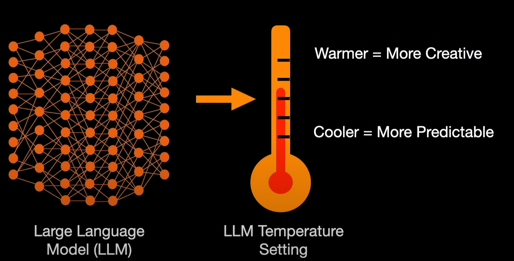

**temperature**通过对logits的值进行缩放（除以T)，从而修改softmax后的概率分布

 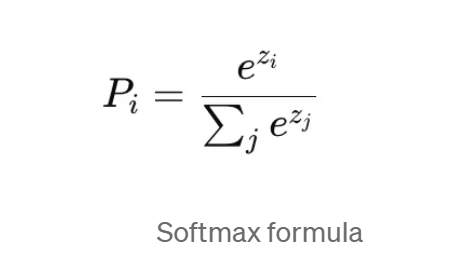 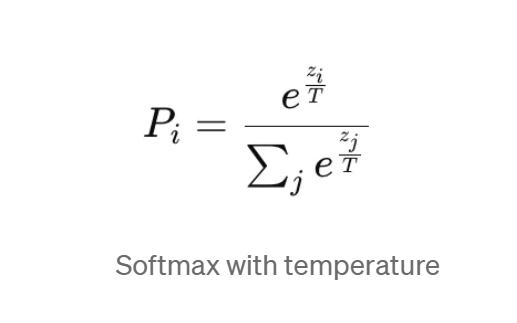

+ T取值一般在0.0~2.0, 最常用范围是0.2~1.0
+ $T\in(0.2, 0.6)$: 低温度，logits放缩后绝对值会变大，softmax后又会放大logits值之间的差距，
  从而**高概率token的概率会变得更高，低概率token的概率会变得更低**，概率分布更集中->模型输出更准确、减少随机性
+ $T\in(0.7, 1.0)$: 中等温度，logits放缩后绝对值会变小，softmax后会压缩logits值之间的差距，
  从而**高概率token的概率会降低，低概率token的概率会提高**，概率分布更平坦->增加模型创造性**（GPT默认0.7）**
+ $T > 1$: 高温度，容易产生幻觉。适用于艺术性生成场景。


**top-P/top-K**用与选择输出token的范围, 概率太低的直接不考虑。（**不是每次都在整个vocab size中选token输出！）**

 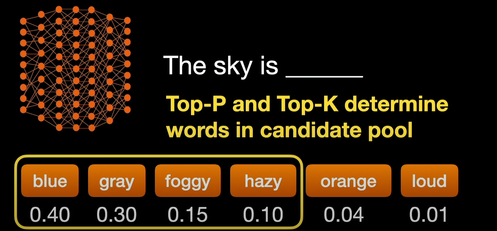

+ top-K指定token数量: 直接选择概率最高的K的token
+ top-P指定token总和: 选择概率总和>=P的最少token（即从高到低开始选，总和达到P时停止）

**Top-P** 通常比 **Top-K** 更受欢迎，因为它能根据概率分布的实际情况动态调整考虑的token数量，使其更灵活。而 Top-K 总是考虑固定数量的选项，这可能在概率急剧下降时过于宽泛，或者在概率分布分散时过于狭窄


#### 4.RAG vs Fine-tuning

我感觉这俩好像不是一个维度的...

SFT就是拿另一个比如说某个领域的数据集，把这个模型继续训练一下，那训练的时候肯定**会修改模型参数**嘛，而且比较**耗资源**。

RAG是在跟模型对话的时候起作用的，就是他会去查一个外部的知识库，然后把查到的内容当成prompt跟你的输入一起丢给大模型，最后得到输出。那这个肯定**不会修改模型参数**的。

而且RAG和SFT是可以并存的呀，微调之后还是可以RAG查外部知识库的。所以RAG优点就是可以**获取最新的知识**，也不需要训练模型，并且基本**不会有幻觉**的风险，因为背后有资料嘛。SFT的话就会把模型整个能力、风格都改掉，一般都是企业要搞一个领域大模型才会话很多资源去微调。


### C++

#### C++11新特性

| 特性                 | 描述                                                         | 示例                                                         |
| -------------------- | ------------------------------------------------------------ | ------------------------------------------------------------ |
| `auto` 关键字        | 自动推导变量类型，简化复杂类型声明（如迭代器）。             | `auto x = 42; → int x`                                       |
| `nullptr`            | NULL：一个宏,定义在头文件中 `#define NULL 0`<br />nullptr：关键字，是一种特殊类型的字面值，**可以被转换成任意其他类型** |                                                              |
| `new/delete`         | 动态内存管理                                                 |                                                              |
| 列表初始化           | 直接列表初始化没有`=`，有`=`的叫做拷贝列表初始化             | `int array1[] { 1, 2, 3 };`<br />`int array2[] = { 4, 5, 6 };` |
| for each循环         | `for(element:container)`，允许直接遍历容器中的每个元素，简化了迭代操作，减少代码量 | `for(auto c: s)`                                             |
| decltype             | 利用已知类型声明新变量:在==编译时期==推导一个表达式的类型，而**不用初始化**，其语法格式有点像`sizeof` | `decltype(fun1()) x;`<br />`decltype(fun2()) y = fun2();`    |
| `default `和`delete` | 默认和删除成员函数,指明默认构造函数、拷贝构造函数等的生成和禁止。 |                                                              |
| 移动语义和右值引用   | 引入右值引用(&&)和移动构造函数，减少资源管理时的不必要拷贝操作，提高性能 | `string s2 = std::move(s1) `                                 |
| 智能指针             | 用于自动管理内存，避免内存泄露和悬空指针问题                 |                                                              |

##### `=delete`和`=default`函数区别

+ `=delete`表示该函数不能被调用。
+ `=default`表示编译器生成默认的函数

**`= default` 的使用范围：**
 只能用于编译器可以自动生成的特殊成员函数，包括：

- 默认构造函数
- 拷贝构造函数
- 移动构造函数
- 析构函数
- 拷贝赋值运算符
- 移动赋值运算符

```cpp
class MyClass {
public:
    MyClass() = default;                    // 默认构造函数
    MyClass(const MyClass&) = default;     // 拷贝构造函数
    MyClass(MyClass&&) = default;          // 移动构造函数
    ~MyClass() = default;                  // 析构函数
    MyClass& operator=(const MyClass&) = default;  // 拷贝赋值
    MyClass& operator=(MyClass&&) = default;       // 移动赋值
};
```

**`= delete` 的使用范围：**
 可以用于任何函数，用途更广泛：

```cpp
class MyClass {
public:
    // 禁用特殊成员函数
    MyClass(const MyClass&) = delete;           // 禁用拷贝构造
    MyClass& operator=(const MyClass&) = delete; // 禁用拷贝赋值
    
    // 禁用普通成员函数
    void someFunction() = delete;
    
    // 禁用特定参数类型的重载
    void process(int value);
    void process(double value) = delete;  // 禁用double版本
};

// 全局函数也可以使用delete
void globalFunction(int) = delete;
```

`= delete` 特别有用的场景是防止不想要的隐式类型转换，或者明确禁用某些函数重载，这样的设计比简单的私有化更清晰明确。


##### `std::move`和右值引用

**左值和右值：表达式的“值类别”**

+ **左值：** 有身份，有内存地址，生命周期长。例：变量x、"abc"、*p等
+ **右值：** 临时对象，即将销毁。例：42、a+b等

**左值引用和右值引用：引用类型**

```c++
int x = 5;      // x是左值(值类别)  5是右值（临时值）
int& lref = x;   // lref是左值引用类型, lref本身是左值(值类别) 
int&& rref = 5;    // rref是右值引用类型, 但rref本身是左值(值类别)
```

+ `std::move`作用是把左值转换为**右值引用（不是右值）**，返回值类型为右值引用(`T&&`)
+ move本身不创建新对象，只是标记"这个对象可以被窃取"

```c++
string s1 = "hello";
string s2 = s1;              // 调用拷贝构造（深拷贝）
string s3 = std::move(s1);   // 调用移动构造

cout << s1 << endl;    // 输出：""（空字符串，内容被移动了）
cout << s2 << endl;   // 输出："Hello"
cout << s3 << endl;   // 输出："Hello"
```


##### 智能指针

常用三种:`unique_ptr`, `shared_ptr`, `weak_ptr`

1. `unique_ptr`:独占所有权。只能有一个unique_ptr指向同一个对象或数组，超出作用域自动删除。

   ```c++
   std::unique_ptr<int> ptr = std::make_unique<int>(42);
   // 自动管理内存，作用域结束时自动删除
   // 不能拷贝，只能移动
   std::unique_ptr<int> ptr2 = std::move(ptr);  // 转移所有权
   // 现在ptr是nullptr，ptr2拥有内存
   ```

2. `shared_ptr`:共享所有权。允许多个shared_ptr指向同一个对象，通过引用计数来管理资源的生命周期。只有当最后一个shared_ptr超出作用域或被显式释放时，资源才会被删除。

   ```c++
   std::shared_ptr<int> ptr1 = std::make_shared<int>(42);
   std::shared_ptr<int> ptr2 = ptr1;  // 可以拷贝，引用计数+1
   
   std::cout << ptr1.use_count() << std::endl;  // 输出：2
   // 当最后一个shared_ptr销毁时，才会删除内存
   ```

3. `weak_ptr`:弱引用。它可以指向由shared_ptr管理的对象，但不会增加引用计数。主要用于解决shared_ptr的循环引用问题

   ```c++
   std::shared_ptr<int> sptr = std::make_shared<int>(42);
   std::weak_ptr<int> wptr = sptr;  // 不影响引用计数
   
   if (auto locked = wptr.lock()) {  // 检查对象是否还存在
       std::cout << *locked << std::endl;  // 安全访问
   }
   // 主要用于打破循环引用
   ```

   


#### 基础

##### 指针和引用

+ **是否可变**：指针指向的内容可改变；引用的对象不能改变
+ **是否占内存**：指针本身占内存(64位8字节)；引用是变量的别名，不占内存
+ **是否可为空**：指针可以为空；引用不能为空
+ **是否可多级**：指针可以有多级；引用只能一级

##### 野指针和悬空指针

+ **野指针**：未初始化的、不确定指向的指针
+ **悬空指针**：指针指向的内存空间被释放后，该指针依然指向这块地址，此时称为悬空指针


##### 浅拷贝危害

```c++
// 假设MyString类成员对象为指针, 且没有定义拷贝构造函数
MyString s1("Hello");
MyString s2 = s1;  // 浅拷贝：s1.data == s2.data (同一个地址！)
// 当s1析构时，delete[] data
// 当s2析构时，再次delete[] data  // 💥双重释放错误！
```


##### 全局变量、局部变量、静态全局变量、静态局部变量

| 变量类型         | 声明位置             | 作用域             | 生命周期       | 存储位置 | 链接性   | 初始化        |
| ---------------- | -------------------- | ------------------ | -------------- | -------- | -------- | ------------- |
| **全局变量**     | 函数外               | 整个文件及其他文件 | 程序运行期间   | 数据段   | 外部链接 | 自动初始化为0 |
| **静态全局变量** | 函数外 + `static`    | 仅当前文件         | 程序运行期间   | 数据段   | 内部链接 | 自动初始化为0 |
| **局部变量**     | 函数/块内            | 仅当前块           | 进入块到退出块 | 栈       | 无链接   | 不自动初始化  |
| **静态局部变量** | 函数/块内 + `static` | 仅当前块           | 程序运行期间   | 数据段   | 无链接   | 自动初始化为0 |


#### C++内存管理

##### 内存分区

 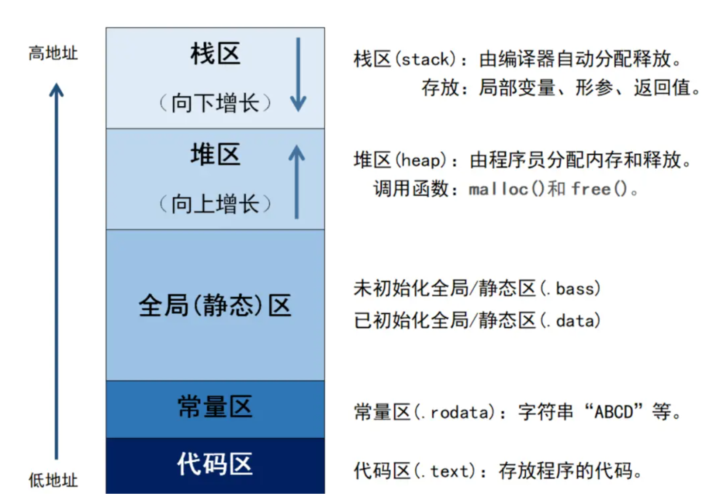

+ **栈**: 函数中的局部变量、形参、返回值。编译器自动管理
+ **堆**: **内存区域不连续！！！存储结构为链表**。通过new/malloc动态分配的内存，由程序员手动分配释放
+ 全局区/静态区（**static**): 
  细分为
  1. 已初始化的数据段(.data): 存放已初始化的全局/静态变量
  2. 未初始化的数据段(.bss): 存放未初始化（**或初始化为0**）的全局/静态变量
+ 常量区（.rodata): 是静态区的一个段，**属于静态区！**存放字符串常量、const全局变量、其他**只读数据**

```C++
const static int a = 10;		// 常量区(.rodata)
const int b = 10;				// 常量区(.rodata)
static int c = 10;				// 全局/静态区(.data)——已初始化
int main() {
    const static int d = 10;	// 常量区(.rodata)
    const int e = 10;			// 栈
    static int f = 10;			// 全局/静态区(.data)——已初始化
}
```

1. **static决定在栈还是静态区，变量加上static相当于变成了全局变量**
   + 局部静态：只改变生命周期，不改变作用域（还是局部）
   + 全局静态：不改变生命周期，但会**限制**作用域（只允许本文件访问）

2. const只表示**只读**，不改变存储区，**只改变存储段**  ——**const变量必须初始化！！！**
   + 对于全局/静态变量，const会把全局区移动到常量区


##### 内存对齐

**概念：**
 编译器会让变量的地址是其大小的整数倍（或某个规则的倍数）。

**原因：**

1. **硬件要求：** 有些CPU访问未对齐的数据会出错或效率低
2. **性能：** 对齐的数据访问更快，可能一次内存访问就能读取

**规则：**

- char：1字节对齐
- short：2字节对齐
- int：4字节对齐
- double：8字节对齐
- 结构体：按最大成员对齐

```C++
struct s1 {
    char c1;	// 1字节
    char c2;	// 1字节
    double d;	// 8字节
};				// 8(1+1+内存对齐6) + 8 = 16字节
struct s2 {
    char c1;	// 1字节
    double d;	// 8字节
    char c2;	// 1字节
};				// 8(1+内存对齐7) + 8 + 8(1+内存对齐7) = 24字节
```


##### define、typedef和const区别

| 特性         | #define     | const    | typedef      |
| ------------ | ----------- | -------- | ------------ |
| **类型**     | 预处理指令  | 关键字   | 关键字       |
| **用途**     | 定义常量/宏 | 定义常量 | 定义类型别名 |
| **处理阶段** | 预处理阶段  | 编译阶段 | 编译阶段     |
| **类型检查** | ❌ 无        | ✅ 有     | ✅ 有         |
| **作用域**   | 无（全局）  | 有作用域 | 有作用域     |
| **调试**     | ❌ 难        | ✅ 易     | ✅ 易         |
| **取地址**   | ❌ 不能      | ✅ 能     | N/A          |


##### new和malloc区别

| 对比维度              | new/delete                                                   | malloc/free                               |
| --------------------- | ------------------------------------------------------------ | ----------------------------------------- |
| **语言属性**          | C++运算符（operator）                                        | C库函数（function）                       |
| **内存大小计算**      | 自动计算（编译器根据类型）                                   | 手动指定字节数                            |
| **返回类型**          | 具体的对象指针类型（类型安全）                               | `void*`（需要强制类型转换）               |
| **分配失败返回值**    | 抛出 `std::bad_alloc` 异常（默认）<br>或返回 `nullptr`（nothrow版本） | 返回 `NULL`                               |
| **初始化**            | 可以初始化对象                                               | 不初始化（内存内容未定义）                |
| **头文件**            | 无需包含头文件（内置）                                       | 需要 `#include <stdlib.h>` 或 `<cstdlib>` |
| **分配内存位置**      | 堆区（heap）                                                 | 堆区（heap）                              |
| **构造函数/析构函数** | ✅ 自动调用构造函数和析构函数                                 | ❌ 不调用                                  |
| **是否可重载**        | ✅ 可以重载 `operator new/delete`                             | ❌ 不能重载（只能替换实现）                |
| **数组分配**          | `new[]` / `delete[]`                                         | `malloc()` + 手动计算                     |
| **内存扩展**          | ❌ 不支持                                                     | ✅ `realloc()` 支持                        |
| **分配0字节**         | 返回非空指针（实现定义）                                     | 返回 `NULL` 或非空指针（实现定义）        |
| **底层实现**          | 通常调用 `malloc`，但可重载自定义                            | 系统调用（如 `brk`/`sbrk`/`mmap`）        |


#### 类与对象

##### `final`

1. 禁止类被继承: `class B final{...};`
2. 禁止虚函数被重写：`virtual void func() final {...}`

##### 派生类不继承的函数

不继承：

+ 构造函数
+ 析构函数
+ 友元函数


##### `static`

> **核心：一个静态成员只有一个实例**

1. 静态成员变量：属于类本身而非某个具体对象，被所有对象共享

   + 存储在全局（静态）区

   + 必须在类外定义+初始化，类内只能声明
     ```c++
     class Student {
         static int count;  // 声明
     };
     int Student::count = 0;  // 类外定义初始化
     ```

   + 可通过类名直接访问

   + 没有创建对象时，静态成员变量也存在

2. 静态成员函数：属于类本身而非对象，**没有this指针**

   + 只能访问静态成员变量及其他静态成员函数
   + **不能访问非静态成员**（因为没有this）
   + 不能被声明为`const`或`virtual`
   + 可通过类名直接调用

##### 多态

> 定义：同一个操作作用于不同的对象时，可以产生不同的行为 / 不同的对象对同一消息（函数调用）做出不同的响应
> **主要通过`virtual`虚函数和继承实现**: `virtual`标志这个函数可以被派生类重写

分类：

+ **编译时多态（静态多态）**：通过函数重载和运算符重载实现，在**编译时**确定调用哪个函数
+ **运行时多态（动态多态）**：通过虚函数实现，在**运行时**根据对象的实际类型决定调用的函数。


**虚函数实现机制**

虚函数通过虚函数表来实现。虚函数的地址保存在虚函数表中，在类的对象所在的内存空间中，保存了指向虚函数表的指针（称为“虚表指针”），通过虚表指针可以找到类对应的虚函数表。虚函数表解决了基类和派生类的继承问题和类中成员函数的覆盖问题，当用基类的指针来操作一个派生类的时候，这张虚函数表就指明了实际应该调用的函数。

+ 虚函数表**存放的内容**：类的虚函数的地址。
+ 虚函数表**建立的时间**：编译阶段，即程序的编译过程中会将虚函数的地址放在虚函数表中。
+ **虚表指针保存的位置**：虚表指针存放在对象的内存空间中最前面的位置，这是为了保证正确取到虚函数的偏移量。

##### 虚函数&纯虚函数

虚函数: 被`virtual` 关键字修饰的成员函数，就是虚函数。

纯虚函数: 在基类中声明的虚函数，它在基类中没有定义，任何派生类都必须定义自己的实现。

```c++
virtual void function() = 0;	// =0表示纯虚函数
```

+ 含有纯虚函数的类被称为抽象类。
+ 抽象类不能被实例化，只能作为接口使用。
+ 派生类必须实现所有的纯虚函数，否则该派生类也会变成抽象类。


##### 为什么析构函数(基类)一般是虚函数？

> 主要是为了解决**基类指针指向派生类对象时**的资源释放问题

+ 如果我们有一个基类指针，它实际上指向一个派生类对象，当我们删除这个基类指针时，如果析构函数不是虚函数，那么就**只会调用基类的析构函数，而不会调用派生类的析构函数**。这可能会导致派生类对象的一些资源没有被正确释放，从而引发内存泄漏等问题。
+ 如果我们将析构函数设置为虚函数，那么在删除基类指针时，会**首先调用派生类的析构函数，然后再调用基类的析构函数**，从而确保所有的资源都能被正确释放。

##### 为什么构造函数(所有类)不写成虚函数？

+ 这是 C++ 语言的根本规则。虚函数机制依赖于对象创建完成后才存在的虚函数表（vtable），而构造函数本身就是创建对象的入口。在对象尚未完全创建好之前，虚函数机制无法工作。

##### 几个特殊成员函数（缺省函数）

> **构造函数**：创建新对象时用
>
> **赋值运算符**：给已存在的对象重新赋值时用
>
> **拷贝**：完整复制另一个对象的内容
>
> **移动**：从临时对象"偷取"资源，效率更高
>
> **析构函数**：对象消失时自动清理资源

1. 拷贝构造函数

   **作用：** 用另一个同类型对象来创建新对象时调用

   ```c++
   class Person {
   public:
       string name;
       int age;
       
       // 拷贝构造函数
       Person(const Person& other) {
           name = other.name;
           age = other.age;
           cout << "拷贝构造函数被调用" << endl;
       }
   };
   
   Person p1("张三", 25);
   Person p2 = p1;        // 这里会调用拷贝构造函数
   Person p3(p1);         // 这里也会调用拷贝构造函数
   ```

2. 移动构造函数
   **作用：** 从临时对象"偷取"资源来创建新对象，避免不必要的拷贝

   ```C++
   class Person {
   public:
       string name;
       
       // 移动构造函数
       Person(Person&& other) {
           name = move(other.name);  // "偷取"而不是拷贝
           cout << "移动构造函数被调用" << endl;
       }
   };
   
   Person p1 = Person("李四", 30);  // 临时对象会触发移动构造
   ```

   

3. 析构函数
   **作用：** 对象被销毁时自动调用，用于清理资源

   ```c++
   class Person {
   private:
       int* data;
   public:
       Person() { data = new int(42); }
       
       // 析构函数
       ~Person() {
           delete data;  // 释放内存
           cout << "析构函数被调用，清理资源" << endl;
       }
   };
   
   {
       Person p;  // 创建对象
   }  // 离开作用域时，自动调用析构函数
   ```

4. 拷贝赋值运算符
   **作用：** 把一个已存在对象的值赋给另一个已存在的对象

   ```C++
   class Person {
   public:
       string name;
       
       // 拷贝赋值运算符
       Person& operator=(const Person& other) {
           if (this != &other) {  // 防止自赋值
               name = other.name;
           }
           cout << "拷贝赋值运算符被调用" << endl;
           return *this;
       }
   };
   
   Person p1("王五", 20);
   Person p2("赵六", 25);
   p2 = p1;  // 这里调用拷贝赋值运算符，p2的内容被p1覆盖
   ```

5. 移动赋值运算符
   **作用：** 从临时对象"偷取"资源赋值给已存在的对象

   ```C++
   class Person {
   public:
       string name;
       
       // 移动赋值运算符
       Person& operator=(Person&& other) {
           if (this != &other) {
               name = move(other.name);  // "偷取"资源
           }
           cout << "移动赋值运算符被调用" << endl;
           return *this;
       }
   };
   
   Person p1("孙七", 35);
   p1 = Person("周八", 40);  // 临时对象触发移动赋值
   ```


### 408

#### 进程与线程

 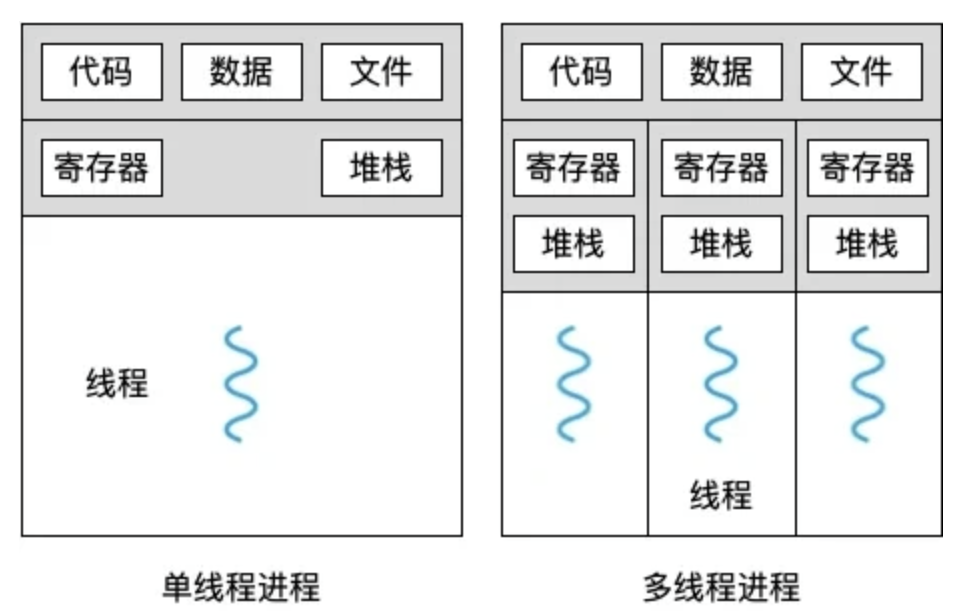

- **本质区别**：进程是操作系统资源分配的基本单位，而线程是任务调度和执行的基本单位
  + 资源指的是**虚拟内存、文件句柄、信号量**等资源。
- **在开销方面**：每个进程都有独立的代码和数据空间（程序上下文），程序之间的切换会有较大的开销；线程可以看做轻量级的进程，同一类线程共享代码和数据空间，每个线程都有自己独立的运行栈和程序计数器（PC），线程之间切换的开销小
- **稳定性方面**：进程中某个线程如果崩溃了，可能会导致整个进程都崩溃。而进程中的子进程崩溃，并不会影响其他进程。
- **内存分配方面**：系统在运行的时候会为每个进程分配不同的内存空间；而对线程而言，除了CPU外，系统不会为线程分配内存（线程所使用的资源来自其所属进程的资源），线程组之间只能共享资源
- **包含关系**：没有线程的进程可以看做是单线程的，如果一个进程内有多个线程，则执行过程不是一条线的，而是多条线
- **进程切换与线程切换**：
  + 进程切换开销更大，包括整个进程的地址空间、全局变量、文件描述符等
  + 线程切换只涉及到线程的堆栈、寄存器和程序计数器等，不涉及进程级别的资源


##### 进程的五种状态

 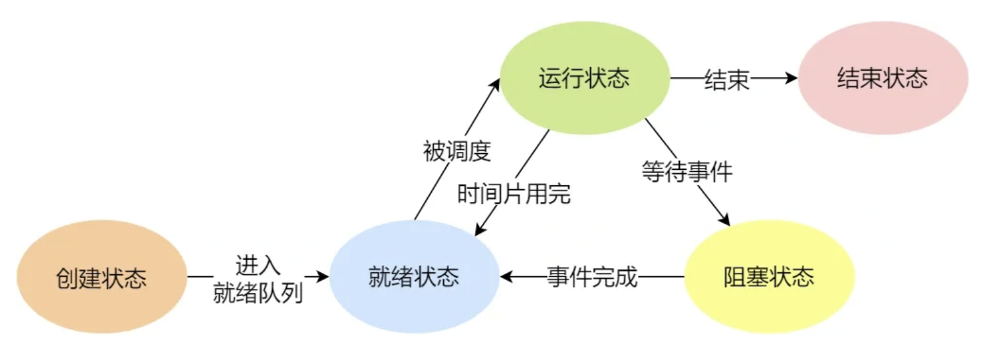

- **NULL -> 创建状态**：一个新进程被创建时的第一个状态；
- **创建状态 -> 就绪状态**：当进程被创建完成并初始化后，一切就绪准备运行时，变为就绪状态，这个过程很快
- **就绪态 -> 运行状态**：处于就绪状态的进程被操作系统的进程调度器选中后，就分配给 CPU 正式运行该进程；
- **运行状态 -> 结束状态**：当进程已经运行完成或出错时，会被操作系统作结束状态处理；
- **运行状态 -> 就绪状态**：处于运行状态的进程在运行过程中，由于分配给它的运行时间片用完，操作系统会把该进程变为就绪态，接着从就绪态选中另外一个进程运行；
- **运行状态 -> 阻塞状态**：当进程请求某个事件且必须等待时，例如请求 I/O 事件；
- **阻塞状态 -> 就绪状态**：当进程要等待的事件完成时，它从阻塞状态变到就绪状态；


#### 用户态 vs 内核态

+ 内核态Kernel Mode: 权限更高，CPU可以执行所有的指令和访问所有的硬件资源。主要用于操作系统内核的运行
  内核态操作包括：**内存管理、进程管理、设备驱动程序控制、系统调用**等
+ 用户态User Mode: CPU只能执行部分指令集，无法直接访问硬件资源。主要用于运行用户程序

内核态和用户态的划分有助于保证操作系统的安全性、稳定性和易维护性

1. 防止恶意程序破坏系统资源
2. 用户态程序出现问题时危害整个系统


### Docker

##### Docker和虚拟机有什么区别？
 A: 虚拟机是虚拟出整个操作系统，比较重，启动慢，占资源多。Docker容器是共享宿主机的内核，只虚拟应用层，所以轻量很多，启动快，资源占用少。打个比方，虚拟机像是买了整套房子，Docker像是合租一个房间，都能住人但成本差很多。

##### Docker的基本命令
 A: 最常用的就几个：docker pull拉镜像，docker run启动容器，docker ps看正在运行的容器，docker stop停止容器，docker rm删除容器。还有docker build构建镜像，docker images查看本地镜像这些。

**Q: 什么是Dockerfile？**
 A: Dockerfile就是构建Docker镜像的配置文件，里面写了怎么搭建环境。比如FROM指定基础镜像，RUN执行命令安装软件，COPY复制文件，EXPOSE暴露端口等等。就像是装修房子的施工图纸。


## 主管面问题

#### 1.说服别人的经历

项目最后需要联系第三方测试机构，出一个测试报告，要证明性能确实提升50%嘛。我们第一次跟第三方机构谈的时候，我说SAS算子是闭源的，只能测出每层的耗时，不能得到单独的算子耗时。然后他们觉得SAS算子是闭源的，这样会不会有失偏颇？可能说服力不够，毕竟出的测试报告是有法律效力的，然后他们建议我们换个平台测试。
回来之后我和老师都有点不知所措，毕竟任务书一直写的就是跟SAS测，突然要改其实不太好交付。而且说实话其实不跟SAS测更好，跟PyTorch测的话根本就不需要写测试脚本，用tensorboard profiler一下就能精准的测出算子耗时了。后来我想了一下，觉得还是得说服一下他们机构，就用SAS测，毕竟SAS官网宣传的就是一个开源数据分析平台，只不过底层算子是闭源的，所以肯定不能说有失偏颇，不存在什么不公平的问题，我们跟SAS又没有合作。
所以第二次谈，就跟他们说了这个问题，SAS宣传的就是开源的，说服力肯定是有保证的，最后他们终于是同意了。


#### 2.缺点

我感觉我目前最大的缺点就是总是喜欢做到万全的准备后才开始行动，生怕结果不满意，患得患失，导致我时间安排不合理，而且很容易焦虑。比如要准备一场考试，或者有个deadline，我会把所有可能遇到的问题都提前考虑到，所有相关资料都研究透彻。但实际根本没有那么充裕的时间，导致我前期花了太多时间在准备和思考上，真正执行的时间就被压缩了，所以我经常会后悔为什么没有早点做准备，要是能暂停时间就好了。并且我特别喜欢做计划，每天要干什么都写的清清楚楚，但我对自己要求太高了，基本上每次写的计划从来都完不成。我觉得我这个毛病确实得赶紧改掉。


#### 3. 优点/相比别人有什么优势

我觉得我最大优点就是相信自己的学习能力，不会被复杂问题吓倒。因为我觉得计算机这个领域完全不靠天赋和智商，只要你有耐心，花足够的时间，任何技术都可以掌握。并且我学东西喜欢从最底层的原理开始，有一点不明白就会停下来去搞懂。虽然这样学的比较慢，但基础就会比较扎实，学会的东西不容易忘。


#### 4.工作上什么时候会有压力，如何解决

压力来源：工作或者学习上的压力一般都来自ddl，比如还有几天就要交课程论文或者要做什么汇报之类，然后我正常的学习计划就被打乱了，得单独花时间在这上面，就很烦，并且一想到我的计划被打乱了后面得重新做计划就更烦了。

这种就属于可以很快可以解决的事情，逼自己把精力放着这上面，一两天就能解决。但如果是那种不能很快解决的事情，就比如说我现在忙着秋招，实习还没结束，白天要上班，还有两三个月就盲审了但我毕业论文一个字还没写，更不用说毕业要求我还没满足，专利还没发。但我反而没有刚说的那种情况压力大，甚至感觉很轻松，我现在心态特别好，我感觉在这实习让我精神状态比以前更好了，因为我之前从来不会早起，我的一天都是从中午开始的，有点浑浑噩噩的，一天一下子就过去了。而且我有空的时候经常去唱歌、出去拍照之类的，估计这对我心态会有帮助吧，导致我现在完全感受不到有什么压力。


#### 5.遇到突发问题如何定位并解决

研究生的项目上我有遇到一次算是比较突发的问题，属于是代码层面的bug吧，就是我模型训练完了之后准确率比较低，只有70几，本来我以为是模型设计的不好，一直在改模型，改了半天也没什么效果。后面过了一段时间把整个代码重新看了一遍就突然发现数据集处理的时候就有问题，每条数据没有改好shape就输入进模型了。所以这个事给我的经验就是，遇到问题反复修改半天也没解决，很可能是没定位清楚。最好要把整个项目从头到尾检查一遍，保证每个部分都能彻底理解，完全理解了之后肯定就能知道问题在哪了。

#### 6.与团队其他成员意见不一致的经历，如何解决

跟团队成员意见不一致，这种情况感觉遇到的比较少，一般都是听听各自的想法，觉得谁更有道理就听谁的，我反正不是那种特别坚持自己的想法的人，哪个方案更好就用哪个。实在举棋不定的话那就直接问导师或上级就行了，毕竟可能也没那个时间资源把所有方案都试一遍。

#### 7.客户需求与项目目标不一致怎么办？

**首先得确认一下是否真的不一致**：因为有时候是理解偏差，所以要先沟通一下客户需求和项目目标的具体内容，确保双方的理解一致。

**第二步：分析两个方向的难度、风险和收益，做好量化**：比如按客户需求做会多花多少时间和资源，按项目目标做又有什么好处，最好是有数据支撑。

**第三步：权衡一下找中间方案**：一般这种情况都是能找到让大家都满意的折中方案的，把两个方案合并一下排个优先级，先做最重要的内容。

**最后讨论结束还是得做一些paperwork把最终方案写下来，防止后续再扯皮**

**关键是早沟通、多听、找共同点，别硬碰硬。**

#### 8.委屈的经历/自己觉得做的好但被别人否定的经历

研一的时候有一次给导师汇报项目进度，我感觉当时学习状态特别好，学triton特别起劲，感觉马上就能把项目搞定了，虽然还没有什么实际的进度，然后汇报的时候说了我最近学了啥，看了啥资料等等，包括接下来一个月的计划。我以为导师听完会肯定一下我，结果他听完觉得我在画饼，说我计划做的有点虚无缥缈。不过我当时就立马反思了嘛，我是无条件认同导师的，毕竟他才是专家，我感觉我自己什么都不懂。

还有一次算是被否定的经历就是，不是学习上的，就是我上次参加杭研这边的好声音，我每次上台都很自信，选的歌都属于比较难的，然后也没有什么失误，身边都说我唱得很好，但是评委给我打分就很低。我发现他们打分根本就不看声乐技术或者歌曲难度，完全就纯看音色，谁声音好听就打分高，当时的第一名我都听她破了好几个音了，结果分比谁都高，就很离谱。那些评委完全就不客观，反正我是不接受我那个排名的。


#### 9.如何克服学习难点？怎么确保自己理解？

先明确自己哪部分没搞懂，是基础概念还是代码逻辑之类。如果是基础概念没理解清楚，那解决办法就很多了，包括现在大模型知识库都很丰富，基本问什么都能给你讲通。如果是代码逻辑或者是整个项目宏观层面的东西没理解，那估计会麻烦一点，最好找懂得人或者负责的人交流一下，总之就是要行动起来，不要想着全部自己一个人解决。

检验自己有没有真正理解，可以给别人解释一下，确保能够清晰的从头说到尾。对于代码的话，可以用自己的代码风格重新写个版本，保证能跑通，基本上我理解别人代码都是用这个方法，全部都写了个自己的版本，而且还会特别有成就感。


### 英文

#### 通用问题

##### 1. When facing difficulties, solve by yourself or by other people?


##### 2. Shopping online or in-store, why?


##### 3. Which city will you prefer to recommend to foreign tourists and why?


##### 4. What is your five-year career plan?


##### 5. What are the pros and cons of AI tools?


##### 6. What will you do in the first 30days after joining the company?


##### 7. How to prepare a trip?


##### 8. How to deal with pressure?


##### 9. How to balance spare time and work time?


##### 10. What is a daily habit to keep you healthy?


##### 11. What is your major and why choose it?


##### 12. Your favorite restaurant? frequently -ordered food?


##### 13. How to handle a task you don't understand that others assign to you?


## 简历文案

#### 华为杭州研究所

云计算部门

**AI Infra 实习生**

**背景：**为推动华为云3D内容生成（AIGC）业务发展，项目组需对多款3D高斯溅射（3DGS）重建算法进行测试评估，协助服务化上线。我作为引擎测试组的主要测试与评估工程师，负责建立一套**公平且标准化的评测流程，**确保测试结果能够精准反映各算法的真实优劣，为算法的上线、优化和选型提供**客观、量化的决策依据**。

**工作内容：**

- **构建测试体系：设计验收方案**，覆盖性能、效果、功能与稳定性等多个维度；**编写自动化脚本**：对不同算法（媒体院、华为云自研、孵化Lab等）进行严格的基准测试，采集**重建耗时、GPU资源占用**等关键性能数据。
- **撰写评测报告：**建立统一的评估标准，对重建效果（**完整性、准确性清晰度、人脸细节等**）进行量化对比分析，定位与竞品（如KIRI engine）的效果差距，最终形成测试报告，反馈给开发团队进一步优化。

**成果：**

- **支撑核心算法服务化上线**：通过全面的验收测试流程，验证了媒体院3DGS算法的性能与效果均满足上线标准，为其在鸿蒙OS的顺利部署提供了**关键的质量保障与数据门控**
- **驱动技术路线选型决策**：交付了多份深度对比测试报告，系统性地阐明了华为云自研与其他同类算法的核心优劣势，为团队部门进行**算法优化和技术融合决策提供直接依据**。


#### 工业过程智能系统柔性低代码平台

**国家重点研发项目**

**核心开发者**

**项目背景：** 面向工业智能化场景，项目旨在构建一个支持高性能计算的低代码平台，提升工业过程建模与分析效率

**课题概述：高性能核心算子库开发**

研究工业过程智能低代码系统的核心算子加速技术，针对**矩阵相乘、卷积、矩阵转置、函数快速自微分（求导）**等基础科学算子，研究***高性能并行化、定点数量化、精度压缩简化\***技术；最终与商业数据分析软件SAS Viya**算子运行效率提升50%以上**，并通过第三方检测机构验证。

**成果：一篇软著发表，两项专利申请中**

**具体工作：**

- **高性能算子开发与优化：**基于OpenAI Triton实现GEMM、Conv2d、转置与Attention等核心算子，其中**int8量化GEMM算子**，性能较cuBLAS**提升100%**；实现多种算子融合方案，有效减少内存访问与同步开销；
- **卷积算子优化：**实现implicit GEMM版本的conv2d kernel，将卷积运算高效转化为矩阵乘法，优化内存布局与访问模式。大batchsize场景下**吞吐量较PyTorch提升50%以上；**
- **研究注意力机制加速：**参考Flash Attention、MQA、MLA等多种注意力算子的优化版本，实现了Flash attention前向推理算子与反向传播算子，其中前向推理算子**支持fp16和int8双精度；**
- **跨平台性能测试：**开发了算子级性能分析脚本，精确测量SAS算子与triton算子耗时进行对比测试，达成项目指标；


#### 轻量化LLM推理框架

**课余自学项目**

**自主开发**

**概述：**参考开源框架设计并构建了一个高效、灵活且可扩展的LLM推理框架，旨在实现快速、准确的模型推理服务。通过优化模型加载和推理流程，大幅提升处理速度和资源利用效率，支持Llama 3、Qwen2.5等主流模型。

**具体工作：**

- **架构搭建**：构建了**灵活的模型加载与推理模块**，通过统一的配置和接口，使框架能支持并切换 Llama, Qwen 等模型。开发了**模型权重转换工具**，可将Hugging Face模型权重一键转换PyTorch格式。
- **高性能triton算子开发**：实现了**GEMM(int8), FlashAttention(int8)、Flashdecoding、RMSNorm**等多种LLM核心算子，通过高效分块（Tiling）和共享内存优化，算子执行效率较PyTorch提升100%以上
- **先进KV Cache内存管理**：引入**Paged Attention**技术，实现高效KV cache管理模块，对GPU显存进行精细化管理，实现了**显存动态分配**，有效提升长序列场景下的吞吐量


#### 专业技能

**英语水平**：**CET-4（646）、CET-6（649）**，有较好的听说读写及流利表达能力

**GPU编程与性能优化：**

- 熟练使用**OpenAI triton**、了解CUDA编程模型，熟悉GPU架构及并行计算原理，能够独立编写、调试高性能GPU算子；
- 掌握tensorboard profiler / Nsight Compute等性能分析工具的使用，进行kernel性能测试与定位GPU性能瓶颈

**AI框架与LLM：**

- 掌握 PyTorch 深度学习框架，理解LLM底层算子实现原理并具备二次开发能力
- 熟悉LLM推理优化的关键技术，如低比特量化(INT8/INT4)、算子融合、FlashAttention、KV cache管理等


## 手撕代码题库

| 题目                                                         | 思路                                                         | 备注                                                         |
| ------------------------------------------------------------ | ------------------------------------------------------------ | ------------------------------------------------------------ |
| 原地轮转数组，所有元素向右轮转k个位置。<br />[1,2,3,4,5,6,7],k=3->[5,6,7,1,2,3,4] | 整体reverse，再分别reverse前k个和后n-k个                     |                                                              |
| 实现sqrt(x)                                                  | 二分，直接在[0,x]区间二分找答案，判断`mid*mid < x ? left=mid : right=mid;` | double，精度要求直接用`r-l>0.001`判断(小数点3位)             |
| 链表倒数第k个                                                | 快慢指针，快指针先走k步，接着一起走                          |                                                              |
| 找出数组中比左边大比右边小的元素                             | 两个变量维护左边左边最大值和右边最小值。<br />1. 顺序遍历，更新左边最大值，标记满足的元素<br />2. 逆序遍历，更新右边最小值，同时检查并记录答案 | 低配接雨水                                                   |
| 给定rand5()，实现rand7()                                     | `rand5()*5+rand5()`可以生成0-24等概率，0-20除3即为rand7(), 21-24跳过即可 | n进制的思想：`randn()*n+randn()`能生成0~$n^2$-1等概率        |
| 最长有效括号串长度                                           | `dp[i]=以i结尾的最长有效括号长度`，以左括号结尾不可能有效（dp[i]=0）;以右括号结尾分两个情况：1. 前一个是"(":直接转移到dp[i-2]. 2. 前一个是")":找到前一个未匹配的左括号，接着转移到dp[i-dp[i-1]-2] | 如果要输出括号串：直接遍历一遍dp数组找到最大值，记录那个i(末尾下标), 用substr输出结果 |
| n层楼扔m个鸡蛋，找不碎的最高楼层，输出最小尝试次数           | `dp[i][j]=i层楼j个鸡蛋的最小次数`，枚举k：在第k层扔，碎：`dp[k-1][j-1]`, 没碎：`dp[i-k][j]`(在k~i层找), `dp[i][j] = min(dp[i][j], max(dp[k-1][j-1], dp[i-k][j])+1)` |                                                              |
|                                                              |                                                              |                                                              |
|                                                              |                                                              |                                                              |
|                                                              |                                                              |                                                              |
|                                                              |                                                              |                                                              |


## 面试记录

### 实习

| Date                          | 记录                                                         | 感受                                                         | 结果       |
| ----------------------------- | ------------------------------------------------------------ | ------------------------------------------------------------ | ---------- |
| 5/19 20：00 字节AI Infra      | 问了triton相关细节，手撕代码没过                             | 第一次面试无经验，感觉被拷打                                 | 无后续     |
| 5/29 11：00 蚂蚁 导师推荐     | 电话面试，问了项目相关和研究生相关经历                       | 面试官有点condescending                                      | 性格测试挂 |
| 6/5 19：00 海康威视           | 面试官像个大学老师，一直在问我到底为什么对大模型感兴趣       | 感觉和考研复试面试差不多                                     | 挂         |
| 6/6 14：00 要务科技 机械星球  | 纯聊天，聊简历                                               | 没什么印象                                                   |            |
| 6/9 9：50 上海刑事科学技术院  | 自我介绍+项目，问我有没有LLM应用和微调方面的经历             | 方向不太匹配                                                 |            |
| 6/9 19：00 美团北斗           | 自我介绍+项目拷打，问的比较深，还让我现场写kernel，还问了个c++的结构体 | 感觉面试官挺专业，估计没有二面了，自身实力不够               |            |
| 6/10 博世多模态               | 英文自我介绍+问了多模态相关问题                              | 岗位根本不匹配，啥也没问就结束了                             |            |
| 6/11 京东 后端开发岗 北京     | 自我介绍+现场写softmax算子+问几个推理框架+编译器问题全都不会 | 面试官很专业，我啥也不会                                     |            |
| 6/16 18:00 快手大模型训推优化 | 自我介绍+经历提问+MLA解释+layernorm kernel + 算法题          | 面试过程很轻松自由，写代码的时候面试官在干其他事             |            |
| 6/18 10：10 南京某国企 夏令营 | 自我介绍+微调和RAG区别+项目介绍                              | 没说完疯狂打断，面试体验很差，逆天面试官不尊重人，还问导师是不是教授，为什么不考南大 |            |
| 6/23 15：00 字节 搜索         | l2 cache怎么提高的命中率+triton底层+C++ struct内存占用+ 树后序遍历递归+非递归 | 问的问题非常细                                               |            |

### 秋招

| Date                                                         | 记录                                                         | 感受                                                         | 结果     |
| ------------------------------------------------------------ | ------------------------------------------------------------ | ------------------------------------------------------------ | -------- |
| 9/3 16:00 快Star-X AI Infra 推理引擎                         | 算子实现细节+量化精度怎么测+flash attention v1/v2/v3。代码题24点 | 面试官司马脸，对我根本没兴趣，问了几个八股，不管我答的对不对 | 秒挂     |
| 9/11 15:00 百度昆仑芯                                        | 疯狂拷打, gemm、conv2d、量化、MLA、手撕flash attention伪代码，后面问了一堆c++(c++11新特性、static、多态实现方式、虚函数作用) | 面试官很专业，问了问题还给了解答，还帮我改代码               | 挂       |
| 9/16 15:00 快手 AI Infra                                     | 八股：flash attention、量化误差方法论、访存优化原理；手撕：pow(x,n)(二分/位运算) | 面试官有点目中无人，自以为是，看不起人                       | 挂       |
| 9/16 17:00 字节 AI Infra                                     | 项目问答：flash attention量化细节、gemm访存优化、大模型并行策略应用场景；手撕flash attention | 女面试官，比较亲和，提问不难，只针对简历做提问               | 过       |
| 9/23 17:00 字节二面                                          | 项目遇到的困难、八股基本都是我自己主动说的，没怎么问问题；手撕三线程执行顺序，投机取巧写出来了但跟面试官考的不一样,不知道手撕考点是啥，后面也忘了问 | 面试官眼神空洞、面无表情，问题都懒得问                       | 挂       |
| 9/24 16:00 网易 AI infra                                     | 先手撕（最长有效括号），再八股（推理优化方法、KV cache），没问项目 | 面试管看起来很开心，不知道在想啥                             |          |
| 9/28 11:00 字节 测开                                         | 一直在问实习的细节，手撕：100层扔两个鸡蛋                    |                                                              | 挂       |
| 9/28 14:00 百度 c++                                          | 经历介绍+基础八股(进程线程、三次握手四次挥手、查看进程cpu占用率命令),手撕：数组跳跃到n-1最小步 |                                                              |          |
| 9/30 华为 3面                                                | 一面主要介绍项目，问了几个本科程度的八股（过拟合、c++内存空间）手撕：1-n输出所有k个组合； | 感觉面试官不懂技术，更不懂我的项目                           |          |
|                                                              | 二面手撕：线性dp，连续子序列乘对应权重的最大和               | 聊天（关于项目和实习）                                       |          |
|                                                              | 三面                                                         | 纯聊天                                                       |          |
| 10/13 PDD 算法                                               | 介绍，明确说明岗位不匹配，但说明后续可以让工程岗面一面。手撕：1.前序+中序建树+层序遍历 2. 旋转递增数组找target | 面试官很随和，随便让我介绍了一下经历，没有八股               |          |
| 10/20 **NVIDIA JR2003422 Performance Engineer Intern, Deep Learning and HPC **第一轮 | 先代码题（BST查元素），再拷打，问各种问题：python装饰器、docker、gpu、cuda和driver区别，虚拟机和docker | 长发男面试官，专业性很强，很多奇怪的问题，看我知识面广不广   |          |
| 10/20 NVIDIA 第二轮                                          | 无手撕，聊了很多Infra相关的内容，偏上层，包括实习相关、性能测试相关、问题太多无法回忆 | 络腮胡面试官，非常和蔼爱笑，约等于聊天，虽然聊的东西我都不懂 |          |
| 10/21 11:00 **NVIDIA JR2004251 Computer Architecture Intern** | triton问的很深入，包括每个kernel具体优化思路、tiling、shared memory管理，gpu内存结构；手撕triton transpose | 面试官没开视频，专业性很强，对cuda和gpu都很熟悉              |          |
| 10/21 16:00 衍复投资 AI infra                                | 先手撕：sqrt, 接着介绍项目+A100官网介绍参数八股：并行方法、KV cache、 | 强度不大，面试官问不出深度问题，单纯了解了解经历             |          |
| 10/21 19:00 上海AI lab 算子开发                              | 无手撕，20min就结束了，问题集中在triton算子细节、编译流程等  | 面试官很明显觉得我不够格，但给了我一些建议，最好有H卡开发经历、需要有cuda基础、可以看看tilelang |          |
| 10/22 15:00 PDD 算法 二面                                    | 项目介绍+手撕链式法则更新梯度，接着问KV cache、paged attention, 智力题：64匹马一次跑8个确定前四名，手撕：二分，查不到返回插入位置 | 依旧岗位不匹配，不知道为啥又通过了                           |          |
| 10/23 15:00 天数智芯 高性能计算                              | 介绍+八股：gemm优化点、c++，算法题：矩阵左上到右下最长路径   | 明显对我不太感兴趣，也不太垂直，做的是传统HPC，都是C++       | 11/13挂  |
| 10/24 16:30 蔚来 高性能算法                                  | 介绍+项目+八股：gpu内存层级、cuda编程模型、paged attention、mla | 女面试官，强度不大                                           |          |
| 10/30 15:00 蔚来 二面                                        | 介绍，项目整体系统结构、算子实现细节、llama模型架构、RMSNorm、量化。手撕：有效三角形个数 | 男面试官，整体强度也不大，关注点和一面不太相同               | 11/4挂   |
| 10/30 17:00 字节 芯片工程师                                  | 岗位不匹配，自我介绍完直接结束                               |                                                              |          |
| 10/31 10:00 燧原科技 架构建模工程师                          | 岗位不匹配，是个芯片设计岗，但还是面了。问的问题集中在大模型架构、推理优化方法、PD分离、Flash Attention细节（内存层面如何加速） | 两个面试官一人30min，没开摄像头                              |          |
| 10/31 15:00 PDD 服务端研发工程师 转岗一面                    | 这个岗位是后端，完全不匹配，聊了10min结束                    | 逆天HR给我瞎jb转岗                                           |          |
| 11/7 15:00 理想 操作系统研发工程师                           | 个人+项目介绍，提问：LLM显存优化方法、GPU内存层级、cuda stream、c++构造函数类型、智能指针，手撕：矩阵最大连通分量 | 不开摄像头，无精打采，半死不活的样子，感觉对我没兴趣         |          |
| 11/11 15:30 深信服 AI Infra一面                              | 个人+项目介绍->手撕：1-n求1出现次数->八股                    | 面试官不反问，纯听故事                                       |          |
| 11/12 15:00 Momenta 训推优化工程师                           | 自我介绍，了解项目经历，无八股，手撕：LRUCache python        | 岗位偏训练，面试官比较热情，听得很认真                       |          |
| 11/14 15:00 遥望科技 AI算法岗                                | 不开视频单纯电话聊天，业务是AIGC相关电商直播，发现不匹配后聊了一下意向 | 面试官比较亲切，不了解我的项目但听得很认真                   |          |
| 11/17 14:00 北极雄芯 AI编译器                                | 无手撕，提问：GEMM优化、Flash Attention，编译器编译部署流程，偏向底层芯片硬件层面,岗位是做NPU的 | 面试官姐姐很好，分享了很多，甚至把hc个数都说了               | 逆天秒过 |
| 11/18 15:00 北极雄芯 二面                                    | 无手撕无八股，聊了聊项目、意向工作方向（算子开发、推理框架） | 面试官人很好，纯聊天                                         | 11/21过  |
| 11/19 10:40 科大讯飞 训推框架                                | 无手撕无八股，拷打实习+项目，问了实习工作内容、算子/推理框架实现细节、遇到的困难、如何解决 | 面试官很专业、岗位是关于推理框架本身的开发、这个月的面试每次都问offer的情况 |          |
| 11/25 17:00 北极雄芯 CTO面                                   |                                                              |                                                              |          |
|                                                              |                                                              |                                                              |          |
|                                                              |                                                              |                                                              |          |


