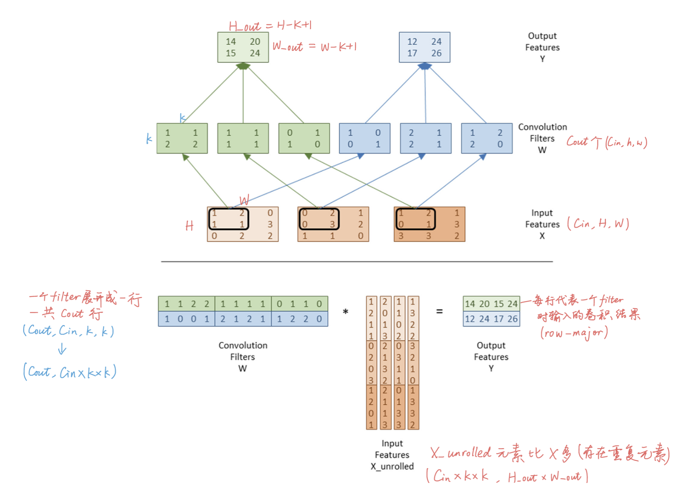

## 面试准备

### 自我介绍

我是浙江大学23级的硕士，明年毕业，专业是人工智能，研究方向就是大模型相关的，具体做的是偏底层的推理加速, 主要工作就是写triton算子。这两年主要就是一直在帮导师做他负责的一个工业上国家重点研发项目，基本上属于是一直在自学，比较放养的那种，没有写过论文。我对大模型主要了解就是推理这块，至于训练啊agent之类的就没什么经验，所以我倾向于那种写算子、推理优化的岗位，这些我都是比较感兴趣的。然后我今年在华为那边的实习，虽然岗位是AI infra，但和大模型没什么关系，做的是3DGS建模算法的测试。可能是因为实习的比较晚了，所以没有安排到什么推理优化的岗位。


​	I am currently a second-year Master's student at Zhejiang University, majoring in Artificial Intelligence. My research focus is on LLMs, specifically in the area of low-level inference acceleration.

​	I’ve always been interested in large models and AI infrastructure, and I’ve been self-learning a lot in my spare time, experimenting with open-source projects, and trying to stay up to date with what’s happening in the field.

​	Over the past two years, I’ve been working for my Professor on a national industrial project. It's not a research-heavy work, so I didn’t have the chance to publish papers or work in a typical research group, but I did get a lot of experience building and optimizing real systems.

​	Now I’m looking for an internship where I can be more involved in real projects, ideally something collaborative, where I can work with and learn from more experienced engineers and researchers. I’d really love to be part of a team where I can continue growing my technical skills, and contribute to something meaningful.


**反问：**

1. 你们那边推理优化主要支撑哪些业务、有底层算子开发之类的工作吗？
2. 这个岗位需要我补充哪些方面的基础技能？因为我目前比较熟的基本就是算子开发。

### 实习介绍

华为那边的实习我主要就负责3DGS建模算法的测试，要干的事情包括写测试设计，跑测试脚本、看建模效果、写测试报告这些。属于是一个测试岗吧，方向不太垂直，虽然我投的确实是Infra岗，但估计因为我实习太晚了，就给我安排到了这边。本来实习的事情是导师推荐的，后来亚马逊那边解散了，还有个厂没理我，所以就没成。最后我自己找，当时暑期实习就没几个厂招人了，所以就没找到垂直的岗位。

实习和研究生区别，最大的就是实习需要跟同事交流合作的频率非常多，基本上天天拉好几次会，解决问题的效率也比较高。研究生的话全都是靠我自己，遇到什么问题也没人问，都是自己解决。不过整体的感觉其实差不多，都挺自由的，无非是事多事少的区别。


### 低代码项目介绍

这个项目总的来说就是要做一个低代码平台的工业软件，类似autoML，很多领域比如机械光电航发这些可以用这个软件自动建立和训练机器学习的模型，给工程师推荐工艺参数之类的。我负责的子课题是算子加速这块，就是说这个工业软件需要用到很多的底层算子，矩阵相乘、卷积等等，需要通过各种方法提升算子的运行效率，最后再和一个叫SAS的数据分析软件做对比测试，算子性能比SAS快50%就达到了指标。我做的就是用triton重写了这些算子，包括矩阵相乘、卷积、注意力这些kernel，结合了量化、算子融合等方法。

这个项目相当于是我一个人摸索出来的，因为当时刚参与到这个项目的时候，这个算子加速的课题之前师兄还没有开始做，导师是让我一个人搞这个子课题的，而且这个子课题比较独立，因为大课题就是一个偏理论研究的内容，一开始什么数据集模型都没有，我花了好几周才拿到一个数据集上手搭模型开始跑代码的。cuda/triton这些当时也完全不了解，都是从零开始学的。


当然这些算子都是先在github上搬过来的，自己根据输入输出做一些修改。有了算子之后就在这个基础上写了对应的网络层，conv2d、linear这样的和PyTorch api类似的网络层，最后再建立模型跑推理，测试推理性能。跟SAS对比每个层的推理耗时，基本上干的事就是这么多。


### 遇到的挑战

最大挑战：跟SAS的对比测试

项目指标要求把triton算子和SAS算子进行对比测试，虽然PyTorch支持tensorboard profiler之类的成熟性能分析工具，但是SAS不能直接用这些工具来测，并且SAS算子底层实现是闭源的，不能单独调用具体算子。所以为了解决这个困难，最后是写了一个性能测试脚本，可以不断向上递归，得到模型每一步调用的函数，最后测出最底层每个函数调用的耗时。这个脚本跑出来的结果是和tensorboard profiler差不多的，同时也能用在SAS模型上，虽然还是不能测出最底层的算子耗时，但是可以测出模型每一层的推理耗时，最后的话我就是把模型的每一层当作一个算子，来算出triton的性能提升。比如线性层就作为矩阵相乘算子，卷积层就作为卷积算子这样。


说到挑战的话，其实一开始接触这个项目，一整个项目对我来说都是个非常大的挑战，当时刚进来根本不知道干什么，就干了干整个项目的任务书，任务书写的特别抽象，全是各种大话，就和那些党中央领导讲话一样，完全没有具体的任务安排，而且算子加速这个子任务就完全交给我一个人，之前这个任务根本没开始，所以全得靠我自己体会。一开始导师告诉我跑一个模型的加速，但连数据集都没有，模型更是让我随便找，所以我就特别迷，每天在漫无目的的看一些推理加速的论文博客，什么量化、算子融合之类的。后来几个星期之后其他课题那边有了一个数据集，到我手里之后我才开始搭了一个模型上手跑起来。

其实一开始是没有用triton重写算子的，都是在PyTorch本身的算子上面加一些量化方法，后来24年triton火起来了之后，我就开始学triton/cuda了，当时我对GPU啊、并行计算之类是完全不了解，花了好一段时间才入门，看了一本cuda并行编程的书叫pmpp，跟着外网开源社区他们一起学习，后来慢慢地学明白了，自己也动手写了一些kernel。学triton算子的过程基本上就是先把别人写的算子搬过来，一行一行搞懂这些kernel，理解了之后再写一个自己的版本，做一些修改。但是没有算法上的创新，基本上就是模仿跟重写。

说回遇到的挑战，我觉得遇到的一个挑战就是关于转置算子，因为任务书有个指标就是转置算子的加速，虽然实现triton转置算子很简单，但是最后要和SAS对比的话必须得放在模型上跑（SAS是闭源的，不能直接调用底层算子，只能测出来整个一层的推理耗时），但是深度学习又没有什么直接运用转置的层，当时就困扰了很长时间，我感觉就是写任务书的人也不懂，随便写了个转置算子上去，最后麻烦的只有我一个人。后来我就索性用attention kernel替代转置算子了，跟导师讨论了他也觉得没问题，就这么干了。所以印象比较深的挑战就是这个吧。


### 经历类问题

#### 1.说服别人的经历

项目最后需要联系第三方测试机构，出一个测试报告，要证明性能确实提升50%嘛。我们第一次跟第三方机构谈的时候，我说SAS算子是闭源的，只能测出每层的耗时，不能得到单独的算子耗时。然后他们觉得SAS算子是闭源的，这样会不会有失偏颇？可能说服力不够，毕竟出的测试报告是有法律效力的，然后他们建议我们换个平台测试。
回来之后我和老师都有点不知所措，毕竟任务书一直写的就是跟SAS测，突然要改其实不太好交付。而且说实话其实不跟SAS测更好，跟PyTorch测的话根本就不需要写测试脚本，用tensorboard profiler一下就能精准的测出算子耗时了。后来我想了一下，觉得还是得说服一下他们机构，就用SAS测，毕竟SAS官网宣传的就是一个开源数据分析平台，只不过底层算子是闭源的，所以肯定不能说有失偏颇，不存在什么不公平的问题，我们跟SAS又没有合作。
所以第二次谈，就跟他们说了这个问题，SAS宣传的就是开源的，说服力肯定是有保证的，最后他们终于是同意了。


#### 2.缺点

我感觉我目前最大的缺点就是总是喜欢做到万全的准备后才开始行动，生怕结果不满意，患得患失，导致我时间安排不合理，而且很容易焦虑。比如要准备一场考试，或者有个deadline，我会把所有可能遇到的问题都提前考虑到，所有相关资料都研究透彻。但实际根本没有那么充裕的时间，导致我前期花了太多时间在准备和思考上，真正执行的时间就被压缩了，所以我经常会后悔为什么没有早点做准备，要是能暂停时间就好了。并且我特别喜欢做计划，每天要干什么都写的清清楚楚，但我对自己要求太高了，基本上每次写的计划从来都完不成。我觉得我这个毛病确实得赶紧改掉。


#### 3. 优点/相比别人有什么优势

我觉得我最大优点就是相信自己的学习能力，不会被复杂问题吓倒。因为我觉得计算机这个领域完全不靠天赋和智商，只要你有耐心，花足够的时间，任何技术都可以掌握。并且我学东西喜欢从最底层的原理开始，有一点不明白就会停下来去搞懂。虽然这样学的比较慢，但基础就会比较扎实，学会的东西不容易忘。


#### 4.工作上什么时候会有压力，如何解决

压力来源：工作或者学习上的压力一般都来自ddl，比如还有几天就要交课程论文或者要做什么汇报之类，然后我正常的学习计划就被打乱了，得单独花时间在这上面，就很烦，并且一想到我的计划被打乱了后面得重新做计划就更烦了。

这种就属于可以很快可以解决的事情，逼自己把精力放着这上面，一两天就能解决。但如果是那种不能很快解决的事情，就比如说我现在忙着秋招，实习还没结束，白天要上班，还有两三个月就盲审了但我毕业论文一个字还没写，更不用说毕业要求我还没满足，专利还没发。但我反而没有刚说的那种情况压力大，甚至感觉很轻松，我现在心态特别好，我感觉在这实习让我精神状态比以前更好了，因为我之前从来不会早起，我的一天都是从中午开始的，有点浑浑噩噩的，一天一下子就过去了。而且我有空的时候经常去唱歌、出去拍照之类的，估计这对我心态会有帮助吧，导致我现在完全感受不到有什么压力。


#### 5.遇到突发问题如何定位并解决

研究生的项目上我有遇到一次算是比较突发的问题，属于是代码层面的bug吧，就是我模型训练完了之后准确率比较低，只有70几，本来我以为是模型设计的不好，一直在改模型，改了半天也没什么效果。后面过了一段时间把整个代码重新看了一遍就突然发现数据集处理的时候就有问题，每条数据没有改好shape就输入进模型了。所以这个事给我的经验就是，遇到问题反复修改半天也没解决，很可能是没定位清楚。最好要把整个项目从头到尾检查一遍，保证每个部分都能彻底理解，完全理解了之后肯定就能知道问题在哪了。

#### 6.与团队其他成员意见不一致的经历，如何解决

跟团队成员意见不一致，这种情况感觉遇到的比较少，一般都是听听各自的想法，觉得谁更有道理就听谁的，我反正不是那种特别坚持自己的想法的人，哪个方案更好就用哪个。实在举棋不定的话那就直接问导师或上级就行了，毕竟可能也没那个时间资源把所有方案都试一遍。

#### 7.客户需求与项目目标不一致怎么办？


#### 8.委屈的经历/自己觉得做的好但被别人否定的经历

研一的时候有一次给导师汇报项目进度，我感觉当时学习状态特别好，学triton特别起劲，感觉马上就能把项目搞定了，虽然还没有什么实际的进度，然后汇报的时候说了我最近学了啥，看了啥资料等等，包括接下来一个月的计划。我以为导师听完会肯定一下我，结果他听完觉得我在画饼，说我计划做的有点虚无缥缈。不过我当时就立马反思了嘛，我是无条件认同导师的，毕竟他才是专家，我感觉我自己什么都不懂。

还有一次算是被否定的经历就是，不是学习上的，就是我上次参加杭研这边的好声音，我每次上台都很自信，选的歌都属于比较难的，然后也没有什么失误，身边都说我唱得很好，但是评委给我打分就很低。我发现他们打分根本就不看声乐技术或者歌曲难度，完全就纯看音色，谁声音好听就打分高，当时的第一名我都听她破了好几个音了，结果分比谁都高，就很离谱。那些评委完全就不客观，反正我是不接受我那个排名的。


#### 9.如何克服学习难点？怎么确保自己理解？

克服学习难点的方法是多找不同的资料，一个讲不清楚就看另一个；

确保理解的方法是写代码验证，能跑通说明真的懂了。


### triton算子细节

#### 量化gemm

+ 量化方法：

  + 对称量化[-127, 127]
  + **量化公式**: `quantized_value = round(original_value / scale)`
  + **反量化公式**: `dequantized_value = quantized_value * scale`

+ 量化粒度：

  **Per-Row量化** (A矩阵)：

  - **粒度**: 每行独立计算scale因子
  - **Scale计算**: `scale[i] = max(abs(row[i])) / 127`
  - **优势**: 每行数据分布独立优化，精度较高
  - **适用**: 激活矩阵（动态量化）

  **Per-Column量化** (B矩阵)：

  - **粒度**: 每列独立计算scale因子
  - **Scale计算**: `scale[j] = max(abs(col[j])) / 127`
  - **优势**: 权重矩阵预量化，推理时无额外开销
  - **适用**: 权重矩阵（静态量化）

+ **scale**：

  ```python
  # 存储的scale向量：
  A_scale: 形状为(M,)    # 只存储M个scale值，每行一个
  B_scale: 形状为(N,)    # 只存储N个scale值，每列一个
  
  # C矩阵的scale是通过广播计算的，不单独存储：
  C_scale[i,j] = A_scale[i] * B_scale[j]  # 运行时计算，不存储
  
  # 在kernel中的反量化代码：（kernel中传入A(int)、B(int)、C(fp)的指针）
  C_fp32 = accumulator.to(tl.float32) * A_scales[:, None] * B_scales[None, :]
  #        ^^^^^^^^^^^^^^^^^^^^^^^^^^^   ^^^^^^^^^^^^^^   ^^^^^^^^^^^^^^
  #        int32矩阵乘法结果              (M,1)广播        (1,N)广播
  #                                    
  # 广播结果：(M,1) * (1,N) = (M,N) 的有效scale矩阵
  ```

+ 性能提升原因：

  1. **硬件Tensor Core优势** (~2-4x):
     - INT8 Tensor Core确实比FP16快2-4倍
  2. **内存带宽优势** (~1.5x):
     - 数据传输量减少33%
  3. **Cache效率提升** (~1.2-1.5x):
     - 更好的局部性，减少cache miss
  4. **PyTorch实现差异** (~1.2-1.8x):
     - Triton的专用优化 vs PyTorch的通用实现

代码：

```python

```


#### conv2d-implicit gemm




#### flash attention

伪代码：

```python
Q, K, V: (batch_size, num_heads, seq_len, head_dim)
O = torch.empty_like(Q)
L = torch.empty(batch_size, num_heads, seq_len)		# L = logsumexp(QK^T)
for pid in range(0, seq_len / BLOCKSIZE_Q):	# in parallel
    q:(batch_size, num_heads, BLOCKSIZE_Q, head_dim)
    mi = -inf 	# (BLOCKSIZE_Q,)
    li = 1		# (BLOCKSIZE_Q,)  l = exp(QK^T-m)
    acc = 0		# (BLOCKSIZE_Q, head_dim)
    for block_id in range(0, seq_len / BLOCKSIZE_KV):
        S = QK^T * sqrt(n)
        mi_new = rowmax(S)
        P = exp(S-mi)
        # li = rowsum(P)
        alpha = exp(mi-mi_new)
        acc += PV * alpha
```


## 面试记录

### 实习

| Date                          | 记录                                                         | 感受                                                         | 结果       |
| ----------------------------- | ------------------------------------------------------------ | ------------------------------------------------------------ | ---------- |
| 5/19 20：00 字节AI Infra      | 问了triton相关细节，手撕代码没过                             | 第一次面试无经验，感觉被拷打                                 | 无后续     |
| 5/29 11：00 蚂蚁 导师推荐     | 电话面试，问了项目相关和研究生相关经历                       | 面试官有点condescending                                      | 性格测试挂 |
| 6/5 19：00 海康威视           | 面试官像个大学老师，一直在问我到底为什么对大模型感兴趣       | 感觉和考研复试面试差不多                                     | 挂         |
| 6/6 14：00 要务科技 机械星球  | 纯聊天，聊简历                                               | 没什么印象                                                   |            |
| 6/9 9：50 上海刑事科学技术院  | 自我介绍+项目，问我有没有LLM应用和微调方面的经历             | 方向不太匹配                                                 |            |
| 6/9 19：00 美团北斗           | 自我介绍+项目拷打，问的比较深，还让我现场写kernel，还问了个c++的结构体 | 感觉面试官挺专业，估计没有二面了，自身实力不够               |            |
| 6/10 博世多模态               | 英文自我介绍+问了多模态相关问题                              | 岗位根本不匹配，啥也没问就结束了                             |            |
| 6/11 京东 后端开发岗 北京     | 自我介绍+现场写softmax算子+问几个推理框架+编译器问题全都不会 | 面试官很专业，我啥也不会                                     |            |
| 6/16 18:00 快手大模型训推优化 | 自我介绍+经历提问+MLA解释+layernorm kernel + 算法题          | 面试过程很轻松自由，写代码的时候面试官在干其他事             |            |
| 6/18 10：10 南京某国企 夏令营 | 自我介绍+微调和RAG区别+项目介绍                              | 没说完疯狂打断，面试体验很差，逆天面试官不尊重人，还问导师是不是教授，为什么不考南大 |            |
| 6/23 15：00 字节 搜索         | l2 cache怎么提高的命中率+triton底层+C++ struct内存占用+ 树后序遍历递归+非递归 | 问的问题非常细                                               |            |

### 秋招

| Date                                 | 记录                                                         | 感受                                                         | 结果 |
| ------------------------------------ | ------------------------------------------------------------ | ------------------------------------------------------------ | ---- |
| 9/3 16:00 快Star-X AI Infra 推理引擎 | 算子实现细节+量化精度怎么测+flash attention v1/v2/v3。代码题24点 | 面试官司马脸，对我根本没兴趣，问了几个八股，不管我答的对不对 | 秒挂 |
| 9/10 携程AI面                        | 6个经历类问题，准备30个问题只命中4个                         | 海面                                                         |      |
| 9/11 15:00 百度昆仑芯                | 疯狂拷打, gemm、conv2d、量化、MLA、手撕flash attention伪代码，后面问了一堆c++(c++11新特性、static、多态实现方式、虚函数作用) | 面试官很专业，问了问题还给了解答，还帮我改代码               | 挂   |
| 9/16 15:00 快手 AI Infra             | 八股：flash attention、量化误差方法论、访存优化原理；手撕：pow(x,n)(二分/位运算) | 面试官有点目中无人，自以为是，看不起人                       | 挂   |
| 9/16 17:00 字节 AI Infra             | 项目问答：flash attention量化细节、gemm访存优化、大模型并行策略应用场景；手撕flash attention | 女面试官，比较亲和，提问不难，只针对简历做提问               | 过   |
| 9/23 17:00 字节二面                  | 项目遇到的困难、八股基本都是我自己主动说的，没怎么问问题；手撕三线程执行顺序，投机取巧写出来了但跟面试官考的不一样,不知道手撕考点是啥，后面也忘了问 | 面试官眼神空洞、面无表情，问题都懒得问                       | 挂   |
| 9/24 16:00 网易 AI infra             | 先手撕（最长有效括号），再八股（推理优化方法、KV cache），没问项目 | 面试管看起来很开心，不知道在想啥                             |      |
| 9/28 11:00 字节 测开                 | 一直在问实习的细节，手撕：100层扔两个鸡蛋                    |                                                              |      |
| 9/28 14:00 百度 c++                  | 经历介绍+基础八股(进程线程、三次握手四次挥手、查看进程cpu占用率命令),手撕：数组跳跃到n-1最小步 |                                                              |      |
|                                      |                                                              |                                                              |      |
|                                      |                                                              |                                                              |      |
|                                      |                                                              |                                                              |      |


## triton相关问题整理

#### 1. triton编译流程

> triton kernel -> triton IR -> LLVM IR -> PTX，最后配合 runtime 运行

上述编译过程通过 `@triton.jit` 装饰器完成，具体来说是遍历提供的 Python 函数的抽象语法树（AST），并使用常见的 `SSA` 构建算法即时生成 `Triton-IR`。然后，编译器后端会简化、优化并自动并行化所产生的 `IR` 代码，再将其转换为高质量的 `LLVM-IR`，最后生成 PTX 并在 NVIDIA GPU 上执行。


#### 2. triton和cuda区别


#### 3. num_warps和num_stages

num_warps —— **空间并行(同时处理更多数据)**

+ 用于指定一个**block的线程数**, 即**每个block的线程数为num_warps * 32**
+ 1 warp = 32 threads (硬件写死), 这32个线程**严格并行**，同时执行相同的指令
+ block内部并不是所有线程严格并行，而是**以warp为原子单位并行+warp层面的调度切换**
+ num_warps越大，kernel并行度越高；但所有warp会**共享所在SM的寄存器和共享内存**，因此**num_warps设置过大会导致每个线程可用的共享内存或寄存器变少**


num_stages —— **时间并行(流水线重叠)**

+ 表示**流水线深度**, 表示可以同时进行多少阶段的数据加载/计算
+ 过多的流水线阶段虽然有助于延迟隐藏，但同时会增加寄存器压力和同步开销。


### Triton vs CUDA 关键对比

| 特性                      | CUDA (手动)                          | Triton (自动)                                           |
| ------------------------- | ------------------------------------ | ------------------------------------------------------- |
| **内存对齐 (Coalescing)** | 手动优化（需要保证访问模式）         | 自动合并访问                                            |
| **共享内存管理**          | 手动分配/同步                        | 编译器自动识别、缓冲数据                                |
| **SM 内部线程调度**       | 手动分配线程块给 SM、设定 block 大小 | 编译器自动并行化、在 SIMD 单元中分配任务                |
| **SM 间线程调度**         | 手动设定 grid 大小                   | 手动（Triton 不跨 SM 自动分配）                         |
| **编程模型**              | C/C++ (CUDA API)                     | Python API (`@triton.jit` 函数)                         |
| **调试工具**              | cuda-gdb、printf                     | 内置 `static_print/device_print`、`TRITON_INTERPRET` 等 |
| **现有库支持**            | 丰富（cuBLAS, cuDNN 等）             | 主要依赖自定义 kernel 开发，库支持尚少                  |


### GPU 并行计算基础

- **Q9: CUDA 的线程模型：warp、thread、block 有何区别？**
   **答：** 在 CUDA 中，每个多处理器（SM）同时调度执行一个 warp 的指令，当前架构下一个 warp 包含 32 个线程。线程（thread）是最小执行单元，多个线程组成线程块（block），多个线程块组成网格（grid）。程序中通过配置每个 kernel 的 block 大小（每个 block 包含多少线程）和 grid 大小来控制并行度。一个线程块内的线程共享同一块 SRAM（共享内存），线程块之间可以看作无直接同步（除非使用全局同步原语）。概括：每个 block 有若干 warp，warp 内的 32 个线程同时执行同一条指令；多个 block 在多个 SM 上并发执行。
- **Q10: GPU 的内存层次结构有哪些？**
   **答：** CUDA 的内存层次从近到远依次是：寄存器 → 共享内存/L1 缓存 → L2 缓存 → 全局内存（显存）→ 主机内存。每个线程有私有的寄存器和 local 内存，每个线程块有共享内存供所有线程快速访问。全局内存对所有线程可见，但访问延迟最高。常量内存和纹理内存是只读缓存，优化特定的访问模式。此外，现代 NVIDIA GPU 有各层高速缓存（如 Ampere 的 L2 缓存），用以提高全局访问效率。调优时，应尽量多用共享内存和 L1 缓存来复用数据，减少对全局内存的直接访问。
- **Q11: 什么是内存合并 (coalescing)？如何避免冲突？**
   **答：** 内存合并指的是当同一个 warp 的线程同时访问相邻地址时，硬件会将多个内存访问合并为少量传输。例如在 Volta 及以后架构上，一个 warp 可以以 128 字节（32×4-byte）的块为单位访问，只要每个线程访问连续地址且对齐，就能打包为一次传输。反之，如果访问不对齐或散乱，就可能产生多个事务，降低带宽利用率。在 Triton 中，使用 `tl.arange` 等生成连续地址序列可以自动获得合并访问。另外，共享内存中也要避免**bank 冲突**，即同一时刻过多线程访问同一个 bank（16/32 位交错的片段）；编写代码时可通过添加填充或调整访问模式来消除冲突。
- **Q12: 什么是占用率 (Occupancy)？为什么重要？**
   **答：** 占用率定义为每个 SM 上**活跃 warp 数**与该 SM 最大活跃 warp 数的比值。换言之，若 SM 最多可并行 64 个 warp，当活跃的 warp 只有 32 个时，占用率为 50%。高占用率意味着有更多并发线程可执行，可以更好地隐藏指令和内存的延迟；但过高占用率也可能导致每线程资源减少（如寄存器变少，产生 spill），从而降低性能。通常用 CUDA 提供的 Occupancy API（如 `cudaOccupancyMaxActiveBlocksPerMultiprocessor`）或 Nsight 工具来评估占用率。在调优时，若发现占用率过低，可增大 block 大小或减少每线程使用的资源；若占用率已满，还需关注是否有其他瓶颈（如内存带宽）。


### 实际项目经验与性能分析

- **Q15: 进行性能分析时应关注哪些指标？**
   **答：** 常见关键指标包括：**内存带宽利用率**（看全局/共享内存访问是否为瓶颈）、**SM 利用率**（活跃 warp 数，反映占用率）、**warp 效率**（包括分支分歧情况）、**寄存器和共享内存占用**（高占用可能导致并行度下降）、以及 **Tensor 核心利用率**（若算子可用 Tensor Core 应检查是否被充分利用）。例如，要检查全局内存访问是否合并，可看“global load throughput”是否接近理论带宽；若性能低，可检查合并率（nsight 中常有“global_transactions_per_request”指标）。其他如延迟（时序）、L2 缓存命中率等也值得关注。综合这些指标，判断是计算瓶颈还是内存瓶颈，据此修改 kernel 参数或算法。


## 八股笔记

#### 1. 数据并行DP/流水线并行PP/张量并行TP

| DP                                                           | PP                                                           | TP                                                           |
| ------------------------------------------------------------ | ------------------------------------------------------------ | ------------------------------------------------------------ |
| 切分数据                                                     | 切分模型（按层）                                             | 切分权重                                                     |
| 每个GPU都有完整的模型，输入数据按batch维度切分到不同GPU上并行处理。 | 把模型按层切分到不同GPU，数据像流水线一样依次通过各个阶段。  | 把模型的权重矩阵按列或行切分到不同GPU，单个forward pass需要跨GPU通信。 |
| **优点：** 实现简单，通信开销小，扩展性好                    | **优点：** 显存需求小，通信量相对较少                        | **优点：** 显存需求线性下降，可以跑更大的模型                |
| **缺点：** 每个GPU都要存完整模型，显存需求大                 | **缺点：** 存在流水线气泡，GPU利用率不是100%，**延迟较高**   | **缺点：** 通信频繁，对网络带宽要求高，**延迟敏感**          |
| **场景**：模型不大但throughput要求高的场景，比如7B以下的模型做大批量推理 | **场景**：跨机推理超大模型，或者**对延迟不敏感**但要处理很大模型的场景 | **场景**：单机多卡推理大模型，**追求低延迟**的在线服务。一般TP度数不超过8，因为通信开销会越来越大 |

**PP vs TP**

+ 简单说：TP是"并行+快速同步"，PP是"串行+大块传输"。虽然TP通信更频繁，但并行性更好，整体延迟反而更低。
  这也是为什么在线推理服务通常优先选择TP，而离线批处理才考虑PP的原因。

+ 通信模式区别：
  **TP：** 在每一层内部做AllReduce/AllGather，通信和计算可以部分重叠。比如在计算attention的时候，各GPU并行计算自己的部分，然后快速聚合结果。
  **PP：** 必须等前一阶段完全计算完毕才能传递给下一阶段，是严格的串行依赖关系

+ 通信量和频率：

  **TP：** 虽然每层都要通信，但单次通信量相对固定，且可以利用高速NVLink
  **PP：** 通信次数少，但每次要传输完整的中间结果（activation），数据量可能很大

+ 延迟对比：
  ```python
  TP: [GPU0,1,2,3同时计算layer1] → [同步] → [同时计算layer2] → ...
  总延迟 ≈ 单GPU计算时间 + 通信开销
  
  PP: [GPU0计算] → [传输] → [GPU1计算] → [传输] → [GPU2计算] → ...
  总延迟 = 各阶段计算时间之和 + 流水线填充时间
  ```

  


**小模型高吞吐：** 纯DP，比如用8张A100跑8个7B模型副本
**中等模型在线服务：** TP，比如70B模型用8卡TP切分

**超大模型：** PP+TP组合，比如175B模型先PP切成几段，每段内部再TP
**离线批处理：** DP+PP，追求整体吞吐量

**选择原则：**

- 模型能放进单卡就用DP
- 模型太大但延迟敏感就用TP
- 模型巨大就用PP，或者PP+TP组合
- 具体还要考虑网络拓扑、带宽、延迟要求等因素

DP+PP:

+ 宏观数据并行
+ 微观流水线并行

ZeRO DP:

+ ZeRO: Zero Redundancy Optimizer
+ 用于解决DP的缺点：浪费显存（每个GPU都存放模型+梯度+optimizer state）
+ 方法：切分整个模型的参数，每个GPU只存放一部分参数，计算时需要所有GPU先通信，得到完整模型再计算
+ **切分逻辑和流水线并行不同：**
  + ZeRO DP是横向切：切的是每一层的参数，计算时需要GPU通信
  + PP是纵向切，切的是模型的层，不需要GPU通信


#### 2. MHA->MLA


MQA、GQA、MLA都是为了压缩KV cache嘛，MQA是所有head都共享一个KV，虽然内存压缩的特别多，但是性能也会明显下降。所以GQA就是一个改进，n个head分成g个组，每个组的共享一个KV，就属于一种折中的办法，介于MHA和MQA之间。


MLA的话我觉得算是一个新的算法了，跟MQA、GQA直接减少KV不一样。

首先因为它存的不是KV，而是叫compressed latent KV。具体来说就是把原来计算KV的过程拆成了两步，第一步计算出矩阵c（就是compressed矩阵），第二步再通过C乘上两个权重分别得到K和V。这个思想就类似低秩分解，最后只需要存这个c矩阵，不需要存K和V，推理的过程中把KV算出来，并且KV的数量是和原来MHA是一样，所以说效果完全没有下降。

不过这样的话计算量就上升了，因为推理的过程得重新计算KV嘛，所以这和不用KV cache有什么区别呢？MLA的解法就是叫矩阵吸收，就是从C计算得到K和V的那两个矩阵是不需要存的，C到K的那个矩阵可以跟Wq合并，也就是说输入x乘上合并后的矩阵直接就可以得到$QK^T$，这样的话就不需要先算出Q和K再做矩阵相乘了；还有C到V的那个矩阵可以和WO合并，这样的话就不需要先计算出V，再和softmax($QK^T$)做矩阵相乘了，直接乘上合并后的矩阵就可以得到最后的结果O.

所以说MLA它整个计算过程已经完全变样了，我感觉都可以叫一个新的算法了。


**为什么MHA计算时要除$\sqrt{h}$（h=head_dim)?**

+ 为了维持方差稳定，防止梯度消失
+ 如果不除，$QK^T$方差会特别大，导致softmax之后只有0和1了，注意力分布就成了one-hot
+ 反向传播时，softmax的导数在|x|比较大时接近0，这样就会梯度消失


#### 3. 如何分析性能瓶颈

首先要看算法是compute bound 还是 memory bound

GPU利用率高但显存占用低->compute bound-> 并行度不够，可以增加blocksize

显存占用高但GPU利用率低->memory bound-> 内存带宽瓶颈，需要提高访存效率（算子融合、优化访存模式）


#### 4. Paged Attention

> KV Cache 被划分为块。块在内存空间中不需要连续。

**Paged Attention原理：**

传统LLM预分配KV cache都是按照最大长度max_seq_len来分配，这样的话就很容易浪费，因为不同序列长度不一样，如果有些用户输入的prompt很短就结束对话了，那给他分配的这么多内存没用到的都浪费了。

Paged Attention的优化思想就是把KV cache的分配以块为单位，比如说16个token算一个page。这样的话就可以很明显地减少内存浪费问题，只有最后一页会存在浪费，vllm说是可以把内存利用率从20%以下提升到90%几。
并且每个page在内存中是不需要连续的，因为有单独的一个页表，每个元素代表这一页在内存中的地址。只要逻辑上连续就行。
还有一个优点就是可以内存共享，几个sequence可以共享同一个page。比如说模型一开始的系统prompt就可以被所有用户共享；不同用户对话过程中遇到连续的相同token也可以共享那个page。


**如何判断几个sequence可以共享一个page？**

建Prefix Tree，每来一个新序列，就沿着树一个token一个token的走一遍，如果走过了一个page的数量，就说明这个page已经存在了，共享存在的那个page就行。
虽然还是一个token一个token的比较，但是存储降低了很多，不需要每个sequence都存下来一个一个对比。

**KVcache管理**


#### 5. LLM性能指标


#### 6. LLM两个推理阶段

Prefill 和 Decode

+ Prefill: 并行计算所有prompt token的QKV，生成第一个输出token。然后算出来的KV就存到KVcache里
+ Decode: 每生成一个token，计算这个token的QKV，把KV拼接到所有token的KV矩阵上，接着一行Q和整个KV矩阵进行计算，生成下一个token，重复这个过程直到结束。

为什么Prefill阶段要计算所有token的Q？明明生成一个token只需要最后一行Q即可，prefill阶段不能只计算最后一行Q吗？

+ 本质原因就是一个大模型有很多和attention layer，每个attention的输入是上一层的输出，并且有各自的KV cache。
  如果第一个attention layer只计算最后一行Q，计算得到的O也只有一行，那下一层attention就只能得到一个token作为输入了，这样的话后面所有attention layer就完全没有历史信息了，也没有KVcache了，这些attention layer就废了。
+ 所以prefill计算所有token的Q就是为了让全部的attention layer把自己的KVcache计算出来。


#### 7. LayerNorm & BatchNorm

`Batch Norm` 和 `Layer Norm` 的区别一句话总结就是 `bn` 是切特征，`ln` 是切样本。

+ `BN`: 对于每个特征维度，计算它在**整个批次中**的均值和标准差，然后对该特征进行归一化。
+ `LN`: **对每个样本**单独计算其所有特征的均值和标准差，然后在该样本内进行归一化。


#### Temperature/top-P/top-K

 

**temperature**通过对logits的值进行缩放（除以T)，从而修改softmax后的概率分布

  

+ T取值一般在0.0~2.0, 最常用范围是0.2~1.0
+ $T\in(0.2, 0.6)$: 低温度，logits放缩后绝对值会变大，softmax后又会放大logits值之间的差距，
  从而**高概率token的概率会变得更高，低概率token的概率会变得更低**，概率分布更集中->模型输出更准确、减少随机性
+ $T\in(0.7, 1.0)$: 中等温度，logits放缩后绝对值会变小，softmax后会压缩logits值之间的差距，
  从而**高概率token的概率会降低，低概率token的概率会提高**，概率分布更平坦->增加模型创造性**（GPT默认0.7）**
+ $T > 1$: 高温度，容易产生幻觉。适用于艺术性生成场景。


**top-P/top-K**用与选择输出token的范围, 概率太低的直接不考虑。（**不是每次都在整个vocab size中选token输出！）**

 

+ top-K指定token数量: 直接选择概率最高的K的token
+ top-P指定token总和: 选择概率总和>=P的最少token（即从高到低开始选，总和达到P时停止）

**Top-P** 通常比 **Top-K** 更受欢迎，因为它能根据概率分布的实际情况动态调整考虑的token数量，使其更灵活。而 Top-K 总是考虑固定数量的选项，这可能在概率急剧下降时过于宽泛，或者在概率分布分散时过于狭窄


#### RAG vs Fine-tuning

我感觉这俩好像不是一个维度的...

SFT就是拿另一个比如说某个领域的数据集，把这个模型继续训练一下，那训练的时候肯定**会修改模型参数**嘛，而且比较**耗资源**。

RAG是在跟模型对话的时候起作用的，就是他会去查一个外部的知识库，然后把查到的内容当成prompt跟你的输入一起丢给大模型，最后得到输出。那这个肯定**不会修改模型参数**的。

而且RAG和SFT是可以并存的呀，微调之后还是可以RAG查外部知识库的。所以RAG优点就是可以**获取最新的知识**，也不需要训练模型，并且基本**不会有幻觉**的风险，因为背后有资料嘛。SFT的话就会把模型整个能力、风格都改掉，一般都是企业要搞一个领域大模型才会话很多资源去微调。


## 面经

#### **1. batch_size 可以无限增加吗？**

嗯，这个不能无限增加的。主要有几个限制因素：首先是显存限制，batch_size增大会导致中间激活值、KV cache等显存占用线性增长，很容易就OOM了。其次是延迟问题，虽然吞吐量会提升，但是单个请求的延迟也会增加，因为要等整个batch处理完。还有就是实际场景中，请求往往是不规则到达的，强行凑大batch可能会让用户等待时间过长。

#### **2. 大模型推理性能指标有哪些、影响性能的因素有哪些？私有化部署方案？**

性能指标主要看三个：吞吐量（tokens/s或者requests/s）、延迟（首token延迟TTFT和总延迟）、还有资源利用率。

影响因素嗯...挺多的，硬件层面有GPU算力、显存带宽、PCIe带宽这些；软件层面有模型并行策略、KV cache管理、算子融合优化、量化等；还有就是batch调度策略、内存管理这些。

私有化部署的话，通常会用容器化部署，比如Docker+Kubernetes，配合GPU调度器。推理框架选择vLLM、TensorRT-LLM或者TGI这些，根据具体需求做trade-off。还要考虑负载均衡、监控告警、自动扩缩容这些运维需求。

#### **3. 给定一个指定推理框架如 vllm/lightllm 如何适配新的模型和硬件？**

适配新模型的话，首先要在模型配置文件里添加新模型的架构定义，然后实现对应的forward函数，主要是attention、MLP这些核心组件。还要处理tokenizer、模型权重加载这些。vLLM的话就是在model registry里注册新模型。

硬件适配主要是算子层面的优化，比如针对新GPU写CUDA kernel，或者用Triton写算子。还要考虑显存管理、通信库适配这些。其实现在很多框架都有plugin机制，相对比较友好。

#### **4. llm 的推理流程**

LLM推理分两个阶段：prefill和decode。

Prefill阶段是把整个prompt一次性输入，并行计算所有position的attention，生成完整的KV cache，然后预测第一个token。这个阶段是compute-bound的，GPU利用率比较高。

Decode阶段是autoregressive生成，每次只生成一个token，然后append到sequence里继续生成下一个。这个阶段是memory-bound的，因为每次都要访问之前的KV cache，但计算量相对较小。

#### **5. AWQ 量化原理、过程详细介绍**

AWQ的核心思想是不是所有权重都同等重要，激活值大的权重对模型性能影响更大。

具体过程是这样的：首先用少量校准数据统计每个channel的激活值分布，找出activation magnitude比较大的channel，这些被认为是"重要"的权重。然后对重要的权重保持较高精度，对不重要的权重进行更激进的量化。

实现上，AWQ会对权重做一个scale变换，让重要的权重scale变大，不重要的变小，然后再做uniform quantization。这样就实现了adaptive的效果。相比GPTQ，AWQ的优势是推理时不需要dequantization，速度更快。


#### **8. 为什么 vllm 的 PagedAttention 相比之前的一次性分配固定长度 max_seq_len 的 kv cache 空间能提升性能？**

主要是两个方面的提升：

显存利用率大幅提升。传统方法要按最大长度分配，但实际序列长度差异很大，导致大量浪费。PagedAttention按需分配，利用率能从20-40%提升到90%以上。

支持更灵活的batching策略。因为不用预先知道序列长度，可以动态添加删除序列，实现continuous batching，这样GPU利用率更高，延迟也更低。

#### **9. 什么是异步，如何用 python 实现异步功能？llm 推理的异步如何实现？**

异步就是不阻塞等待的编程模式，可以在等待I/O时去处理其他任务。

Python实现异步主要用asyncio，定义async函数，用await等待异步操作。比如：

```python
async def generate():
    result = await model.generate_async()
    return result
```

LLM推理的异步主要体现在：请求排队和batch组装是异步的，不会阻塞新请求的接收；推理过程可以pipeline，prefill和decode可以交叉进行；多个请求的生成过程是并发的。

具体实现上，通常有一个异步的request queue，一个background的inference engine，通过callback或者future来返回结果。

#### 大模型推理框架的分布式推理有哪些方法？

主要有几种并行策略：

Tensor Parallel（TP）：把模型按层内切分，比如attention的多头、MLP的参数都分布到不同GPU上，需要频繁的all-reduce通信。

Pipeline Parallel（PP）：按层间切分，不同GPU负责不同的layer，通信相对较少，但可能有bubble。

Data Parallel：每个GPU都有完整模型，处理不同的batch，适合小模型。

还有Sequence Parallel，把sequence dimension也做切分。实际部署时通常是多种策略组合，比如TP+PP。

#### **11. MOE 怎么实现并行加速？**

MOE的并行主要是Expert Parallel，把不同的expert分布到不同的GPU上。

具体实现是这样的：首先router决定每个token要路由到哪些expert，然后做一个all-to-all通信，把token发送到对应的expert所在的GPU。expert计算完后，再做一次all-to-all把结果发回去。

关键是要做load balancing，避免某些expert负载过重。还有就是通信优化，可以把多个小的all-to-all合并，减少通信次数。

#### **12. 介绍一下triton编译过程**

Triton的编译过程是这样的：首先Python代码会被parse成Triton IR，这是一个高层的中间表示。然后做一系列优化，比如循环优化、内存访问优化。

接下来转换成LLVM IR，这时候会做更多的low-level优化。最后生成PTX代码，再编译成CUDA binary。

整个过程中，Triton会自动处理很多细节，比如block tiling、memory coalescing、bank conflict避免这些，让用户专注于算法逻辑。

#### **13. llama 模型 forward 推理的输入是什么？**

主要输入有几个：input_ids（token序列）、position_ids（位置编码）、attention_mask（指示哪些位置需要attend）。

对于端侧推理框架，通常还会有kv_cache作为输入和输出，用于存储之前的key-value。casual mask一般是在attention计算时动态生成的，确保只能attend到之前的位置。

还可能有一些可选的输入，比如past_key_values、use_cache这些控制参数。

#### **14. LLM 推理为什么需要分成两个阶段？不分可以吗，为什么？**

这个...其实是由autoregressive生成的特性决定的。

Prefill阶段可以并行计算所有position的attention，因为prompt的所有token都已知，可以一次性处理，这时候是compute-bound的，GPU利用率高。

但是decode阶段必须sequential，因为下一个token依赖于前面所有token的结果，没法并行。而且这个阶段是memory-bound的，主要开销在访问KV cache。

如果不分阶段，那就没法充分利用prefill阶段的并行性，整体效率会很低。所以这个分阶段是必须的，针对不同阶段的特点做专门优化。

#### **15. per channel 和 per group 量化有什么区别，为什么不用 per channel 量化？**

Per channel是每个output channel用一个scale，粒度更细，量化精度更高。Per group是把多个channel分成一组，一组用一个scale。

虽然per channel精度更高，但是dequantization的时候计算开销更大，因为要对每个channel做不同的scale操作。Per group的话，可以用SIMD指令batch处理，速度更快。

而且现在的量化算法，比如AWQ、GPTQ，在per group的粒度下已经能取得很好的精度，所以工程上更倾向于用per group，在精度和速度之间找平衡。

#### **16. pytorch 的显存管理机制了解吗？**

PyTorch的显存管理有几个特点：首先是lazy allocation，只有真正需要时才分配显存。然后是memory pool机制，释放的显存不会立即还给系统，而是放在pool里复用，避免频繁的malloc/free。

还有就是引用计数机制，tensor不再被引用时会被释放。但是有时候会有显存碎片问题，这时候可能需要手动调用empty_cache()。

另外，PyTorch还支持显存映射、unified memory这些特性，可以在CPU和GPU之间共享内存。现在还有一些实验性的功能，比如memory snapshot、显存预分配这些。


## 简历文案

#### 华为杭州研究所

云计算部门

**AI Infra 实习生**

**背景：**为推动华为云3D内容生成（AIGC）业务发展，项目组需对多款3D高斯溅射（3DGS）重建算法进行测试评估，协助服务化上线。我作为引擎测试组的主要测试与评估工程师，负责建立一套**公平且标准化的评测流程，**确保测试结果能够精准反映各算法的真实优劣，为算法的上线、优化和选型提供**客观、量化的决策依据**。

**工作内容：**

- **构建测试体系：设计验收方案**，覆盖性能、效果、功能与稳定性等多个维度；**编写自动化脚本**：对不同算法（媒体院、华为云自研、孵化Lab等）进行严格的基准测试，采集**重建耗时、GPU资源占用**等关键性能数据。
- **撰写评测报告：**建立统一的评估标准，对重建效果（**完整性、准确性清晰度、人脸细节等**）进行量化对比分析，定位与竞品（如KIRI engine）的效果差距，最终形成测试报告，反馈给开发团队进一步优化。

**成果：**

- **支撑核心算法服务化上线**：通过全面的验收测试流程，验证了媒体院3DGS算法的性能与效果均满足上线标准，为其在鸿蒙OS的顺利部署提供了**关键的质量保障与数据门控**
- **驱动技术路线选型决策**：交付了多份深度对比测试报告，系统性地阐明了华为云自研与其他同类算法的核心优劣势，为团队部门进行**算法优化和技术融合决策提供直接依据**。


#### 工业过程智能系统柔性低代码平台

**国家重点研发项目**

**核心开发者**

**项目背景：** 面向工业智能化场景，项目旨在构建一个支持高性能计算的低代码平台，提升工业过程建模与分析效率

**课题概述：高性能核心算子库开发**

研究工业过程智能低代码系统的核心算子加速技术，针对**矩阵相乘、卷积、矩阵转置、函数快速自微分（求导）**等基础科学算子，研究***高性能并行化、定点数量化、精度压缩简化\***技术；最终与商业数据分析软件SAS Viya**算子运行效率提升50%以上**，并通过第三方检测机构验证。

**成果：一篇软著发表，两项专利申请中**

**具体工作：**

- **高性能算子开发与优化：**基于OpenAI Triton实现GEMM、Conv2d、转置与Attention等核心算子，其中**int8量化GEMM算子**，性能较cuBLAS**提升100%**；实现多种算子融合方案，有效减少内存访问与同步开销；
- **卷积算子优化：**实现implicit GEMM版本的conv2d kernel，将卷积运算高效转化为矩阵乘法，优化内存布局与访问模式。大batchsize场景下**吞吐量较PyTorch提升50%以上；**
- **研究注意力机制加速：**参考Flash Attention、MQA、MLA等多种注意力算子的优化版本，实现了Flash attention前向推理算子与反向传播算子，其中前向推理算子**支持fp16和int8双精度；**
- **跨平台性能测试：**开发了算子级性能分析脚本，精确测量SAS算子与triton算子耗时进行对比测试，达成项目指标；


#### 轻量化LLM推理框架

**课余自学项目**

**自主开发**

**概述：**参考开源框架设计并构建了一个高效、灵活且可扩展的LLM推理框架，旨在实现快速、准确的模型推理服务。通过优化模型加载和推理流程，大幅提升处理速度和资源利用效率，支持Llama 3、Qwen2.5等主流模型。

**具体工作：**

- **架构搭建**：构建了**灵活的模型加载与推理模块**，通过统一的配置和接口，使框架能支持并切换 Llama, Qwen 等模型。开发了**模型权重转换工具**，可将Hugging Face模型权重一键转换PyTorch格式。
- **高性能triton算子开发**：实现了**GEMM(int8), FlashAttention(int8)、Flashdecoding、RMSNorm**等多种LLM核心算子，通过高效分块（Tiling）和共享内存优化，算子执行效率较PyTorch提升100%以上
- **先进KV Cache内存管理**：引入**Paged Attention**技术，实现高效KV cache管理模块，对GPU显存进行精细化管理，实现了**显存动态分配**，有效提升长序列场景下的吞吐量


#### 专业技能

**英语水平**：**CET-4（646）、CET-6（649）**，有较好的听说读写及流利表达能力

**GPU编程与性能优化：**

- 熟练使用**OpenAI triton**、了解CUDA编程模型，熟悉GPU架构及并行计算原理，能够独立编写、调试高性能GPU算子；
- 掌握tensorboard profiler / Nsight Compute等性能分析工具的使用，进行kernel性能测试与定位GPU性能瓶颈

**AI框架与LLM：**

- 掌握 PyTorch 深度学习框架，理解LLM底层算子实现原理并具备二次开发能力
- 熟悉LLM推理优化的关键技术，如低比特量化(INT8/INT4)、算子融合、FlashAttention、KV cache管理等


## 手撕代码题库

| 题目                                                         | 思路                                                         | 备注                                                         |
| ------------------------------------------------------------ | ------------------------------------------------------------ | ------------------------------------------------------------ |
| 原地轮转数组，所有元素向右轮转k个位置。<br />[1,2,3,4,5,6,7],k=3->[5,6,7,1,2,3,4] | 整体reverse，再分别reverse前k个和后n-k个                     |                                                              |
| 实现sqrt(x)                                                  | 二分，直接在[0,x]区间二分找答案，判断`mid*mid < x ? left=mid : right=mid;` | double，精度要求直接用`r-l>0.001`判断(小数点3位)             |
| 链表倒数第k个                                                | 快慢指针，快指针先走k步，接着一起走                          |                                                              |
| 找出数组中比左边大比右边小的元素                             | 两个变量维护左边左边最大值和右边最小值。<br />1. 顺序遍历，更新左边最大值，标记满足的元素<br />2. 逆序遍历，更新右边最小值，同时检查并记录答案 | 低配接雨水                                                   |
| 给定rand5()，实现rand7()                                     | `rand5()*5+rand5()`可以生成0-24等概率，0-20除3即为rand7(), 21-24跳过即可 | n进制的思想：`randn()*n+randn()`能生成0~$n^2$-1等概率        |
| 最长有效括号串长度                                           | `dp[i]=以i结尾的最长有效括号长度`，以左括号结尾不可能有效（dp[i]=0）;以右括号结尾分两个情况：1. 前一个是"(":直接转移到dp[i-2]. 2. 前一个是")":找到前一个未匹配的左括号，接着转移到dp[i-dp[i-1]-2] | 如果要输出括号串：直接遍历一遍dp数组找到最大值，记录那个i(末尾下标), 用substr输出结果 |
| n层楼扔m个鸡蛋，找不碎的最高楼层，输出最小尝试次数           | `dp[i][j]=i层楼j个鸡蛋的最小次数`，枚举k：在第k层扔，碎：`dp[k-1][j-1]`, 没碎：`dp[i-k][j]`(在k~i层找), `dp[i][j] = min(dp[i][j], max(dp[k-1][j-1], dp[i-k][j])+1)` |                                                              |
|                                                              |                                                              |                                                              |
|                                                              |                                                              |                                                              |
|                                                              |                                                              |                                                              |
|                                                              |                                                              |                                                              |


## 华为机试

华为机试

题目概述（去掉背景）

给你：
- 一段只含小写英文字母的字符串 text。
- 一个词典：包含 n 个词，每个词有一个整数分数 p（可为负）。
- m 条“转移分数”：每条给出一对相邻词 (a, b) 和一个整数 x，表示当某个切分里出现 …, a, b, … 相邻时，额外加 x 分；如果没有对应的转移条目，则不加分。

要求：
- 把 text 完整切分成若干个词典中的词，使得“总得分”最大。
- 总得分 = 所有选中词的分数之和 + 所有相邻词对的转移分数之和。
- 如果 text 无法完全由词典中的词拼出，输出 0。

输入格式：
1) 第一行：字符串 text。
2) 第二行：整数 n（词典大小，≤100）。
3) 接下来 n 行：每行“word p”。
4) 下一行：整数 m（转移条目数，≤100）。
5) 接下来 m 行：每行“a b x”，表示从词 a 到词 b 的转移加 x 分。

输出：
- 一个整数，为能得到的最大总得分；若无法切分则输出 0。

示例1
- 输入：
  text=applepie
  词典：pen 3；apple 10
  转移：pen→apple +5；pie→apple +2
- 输出：0（因为无法把 applepie 完整切分成词典里的词）

示例2
- 输入：
  text=goodeats
  词典：good 15；go 12；deats 14；eats 10
  转移：good→eats -5
- 可能切分：
  - [good, eats] 得分 15 + 10 - 5 = 20
  - [go, deats] 得分 12 + 14 = 26
- 输出：26


*Thinking...*

> 用户要求用C++实现，并且模仿他之前给我的代码风格。看看他之前的代码风格：
>
> 1. 使用 `#include <iostream>` 和 `using namespace std;`
> 2. 简洁的变量命名
> 3. 使用vector等STL容器
> 4. main函数中直接实现逻辑
> 5. 比较简洁直接的代码风格
>
> 这是一个动态规划问题，需要：
> 1. 读取文本、词典、转移分数
> 2. 用DP求解最优切分
> 3. 状态是dp[i][word] = 到位置i，最后一个词是word时的最大得分
>
> 我需要用C++的map来存储词典分数和转移分数，用vector<map<string,int>>来存储dp状态。

```cpp
#include <iostream>
#include <vector>
#include <map>
#include <string>
#include <climits>
using namespace std;

int main() {
    string text;
    cin >> text;
    
    int n;
    cin >> n;
    
    // 词典：词 -> 分数
    map<string, int> wordScore;
    for (int i = 0; i < n; i++) {
        string word;
        int score;
        cin >> word >> score;
        wordScore[word] = score;
    }
    
    int m;
    cin >> m;
    
    // 转移分数：前一个词 -> {后一个词 -> 分数}
    map<string, map<string, int>> transition;
    for (int i = 0; i < m; i++) {
        string a, b;
        int x;
        cin >> a >> b >> x;
        transition[a][b] = x;
    }
    
    int len = text.length();
    // dp[i] = {词 -> 最大分数}，表示到位置i，最后选择该词时的最大分数
    vector<map<string, int>> dp(len + 1);
    dp[0][""] = 0;  // 空词表示开始状态
    
    for (int i = 1; i <= len; i++) {
        for (auto& p : wordScore) {
            string word = p.first;
            int score = p.second;
            int wordLen = word.length();
            
            if (wordLen <= i && text.substr(i - wordLen, wordLen) == word) {
                // 可以在位置i处放置word
                for (auto& prev : dp[i - wordLen]) {
                    string prevWord = prev.first;
                    int prevScore = prev.second;
                    
                    // 计算转移分数
                    int transScore = 0;
                    if (prevWord != "" && 
                        transition.count(prevWord) && 
                        transition[prevWord].count(word)) {
                        transScore = transition[prevWord][word];
                    }
                    
                    int totalScore = prevScore + score + transScore;
                    
                    // 更新dp值
                    if (dp[i].count(word) == 0) {
                        dp[i][word] = totalScore;
                    } else {
                        dp[i][word] = max(dp[i][word], totalScore);
                    }
                }
            }
        }
    }
    
    // 返回结果
    if (dp[len].empty()) {
        cout << 0 << endl;
    } else {
        int maxScore = INT_MIN;
        for (auto& p : dp[len]) {
            maxScore = max(maxScore, p.second);
        }
        cout << maxScore << endl;
    }
    
    return 0;
}
```

关键实现细节：

1. **状态存储**：`vector<map<string, int>> dp`，每个位置存储所有可能的最后一个词及其最大分数

2. **字符串匹配**：`text.substr(i - wordLen, wordLen) == word` 检查是否能在位置i放置word

3. **转移分数查找**：先检查`transition.count(prevWord)`，再检查`transition[prevWord].count(word)`

4. **边界处理**：空词`""`表示起始状态，避免处理第一个词时的特殊情况

5. **结果输出**：如果`dp[len]`为空说明无法完全切分，输出0；否则输出所有可能结果的最大值
