# PyTorch-deeplizard

## 基础

### Introducing PyTorch

#### 一、PyTorch包介绍

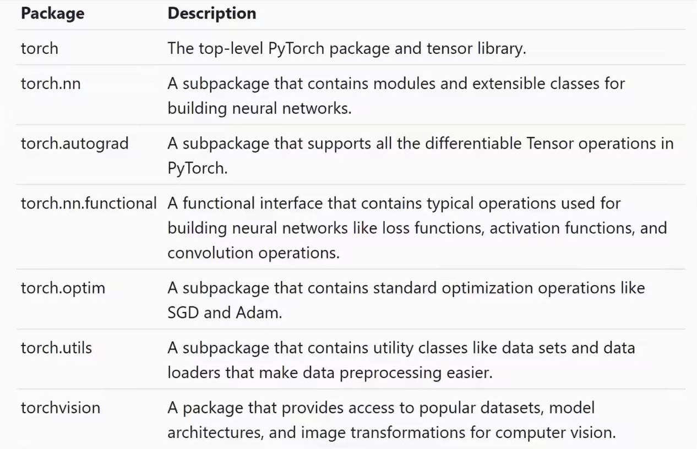

#### 二、为什么深度学习要用到GPU

> CPU用于一般计算，GPU用于特殊计算（并行）

##### 并行计算Parallel Computing

+ 一种计算可以分解成独立的可同时进行的更小的计算，计算完成后被重新组合，
  形成原始大计算的结果
+ **可分解的任务数量取决于硬件的核心(core)数**——核心是处理器中进行计算的单位
+ CPU一般只有几个或十几个核，而GPU有成千上万个核（==cuda核心==）
+ 神经网络的很多计算，都可以很容易地被分解成更小的独立的计算，
  因此GPU在深度学习中非常有用
+ 将计算从CPU移到GPU代价很大，因此对于小行计算，只需要用CPU即可，况且一般的计算
  用GPU比CPU更慢；对于大型并行计算，才需要GPU的参与。

##### 并行计算举例——卷积运算

+ 对于一个图像的各个像素进行卷积，不会对原图像产生修改，
  并且这些计算都是相互独立的，因此可以并行计算


### Tensors

#### 一、元素表达方式与访问所需的下标indices个数

| 需要的下标数 | CS表达   | 数学表达  |
| ------------ | -------- | --------- |
| 0            | number   | scalar    |
| 1            | array    | vector    |
| 2            | 2d-array | matrix    |
| n            | nd-array | nd-tensor |

+ Tensor就是多维数组
+ Tensor可以表达所有维度的数组，例如scalar是0维Tensor，vector是一维Tensor
+ Tensor的维度与向量的维度不同，向量的维度即向量的元素个数，而Tensor的维度和元素个数无关


#### 二、Tensor的三个基本属性：Rank、Axis、Shape

##### 秩rank

+ 秩表明需要多少个索引来访问张量的元素
+ 列向量（一维Tensor）秩为1、矩阵（二维Tensor）秩为2
+ ==一个Tensor的秩表明这个Tensor有多少个轴==

##### 轴Axis

+ ==张量的轴是张量的某一特定维数==

+ 三维Tensor：$t[10][10][10]$中，每一个括号代表一个轴;

  每个轴的长度(10)表示沿当前轴有多少个索引;

  第一个轴上的每个元素都是10*10的矩阵

  第二个轴上的每个元素都是10维向量

  第三个轴上的每个元素都是实际数字


##### 形状Shape

+ 张量的Shape由每个轴的长度决定
  例如上面的三维Tensor: $t[10][10][10]$，其Shape为10\*10\*10

```Python
t.shape		# torch.Size([10, 10, 10])
type(t)		# torch.Tensor
```

+ PyTorch中，Size就是Shape
+ 从形状为[10, 10, 10]可知：这个秩为3的Tensor有三个轴，每个轴的长度为10

==Shape的长度就是Tensor的秩==

```Python
len(t.shape) == t.rank
```


##### Reshape重塑一个Tensor

```Python
t.reshape(10, 100)
```


#### 三、CNN和feature map特征图

CNN输入图像是一个Tensor，一般有四个轴，形状为**[Batchsize,Channel,Height,Weight]**.

+ 第一个轴(B)上的每个元素都是一个完整的图像;
  第一个轴的长度(batchsize)表明一批有多少样本
+ 第二个轴(C)上的每个元素是某一个通道上的图像
  第二个轴的长度即为图像的通道数

​	例：[3, 1, 28, 28]表示一批有三个28*28的灰度图

​	输入图像的通道叫彩色通道（color channel），而经过卷积后，输出图像的通道数由卷积核个数决定，
称这些通道为==特征图feature maps==


#### 四、torch.Tensor类

> 数据预处理的最终目标是将我们正在处理的程序转换成能被神经网络感知的张量

##### Tensor的数据类型：


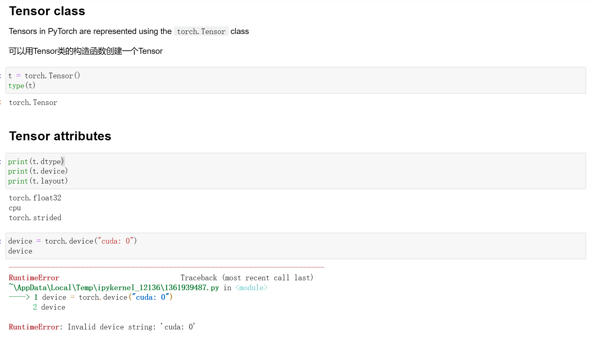

+ 不同张量之间的操作必须需在同一个device上进行
+ layout表示张量在内存中是如何布局的，默认即可


#### 五、Creating PyTorch Tensor

##### 创建Tensor的常用方法：

1. torch.Tensor(data) —— 构造函数
2. torch.tensor(data) —— factory funtion
3. torch.as_tensor(data) —— factory funtion
4. torch.from_numpy(data) —— factory funtion

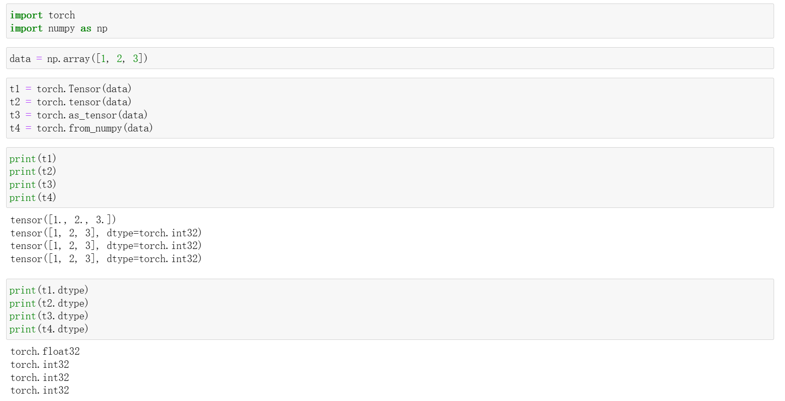

+ **一般倾向于选择factory function而不是构造函数**
+ 区别在于构造函数构造Tensor时数据类型使用default，
  而factory function则会==根据输入推断数据类型

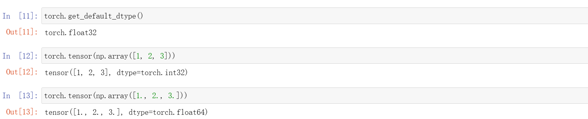

也可以指定Tensor的数据类型：
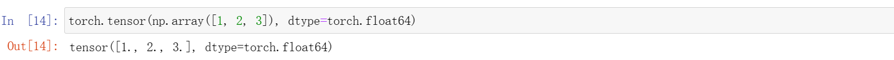


##### 创建Tensor时的浅拷贝与深拷贝

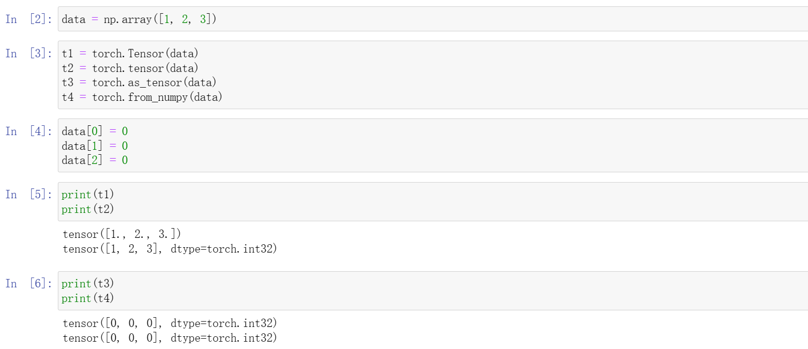

+ t1和t2是深拷贝（copy），t3和t4是浅拷贝（share）
+ **因此numpy与Tensor的交互非常容易，因为from_numpy创建时会将数组共享而不是拷贝**

综上，最好的构造Tensor的方法是：==torch.tensor()==
其次：**torch.as_tensor()**——可以接受任意类型的数组而不仅仅是numpy


#### 六、Reshaping Tensors

> Tensor operation types操作类型
>
> 1. Reshaping 重塑
> 2. Element-wise 元素操作
> 3. Reduction 还原
> 4. Access 访问


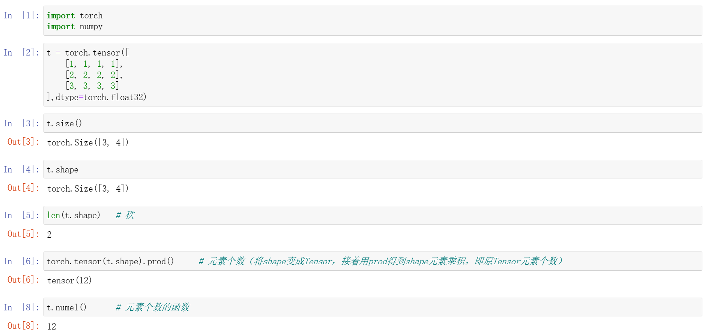

+ `numel()`：返回Tensor的元素个数
+ `prod()`：返回Tensor中所有元素的乘积
+ 秩表示需要多少个索引才能访问Tensor元素，**即Tensor维数**；
+ 秩等于shape的长度


##### Reshape、Squeeze和Flatten

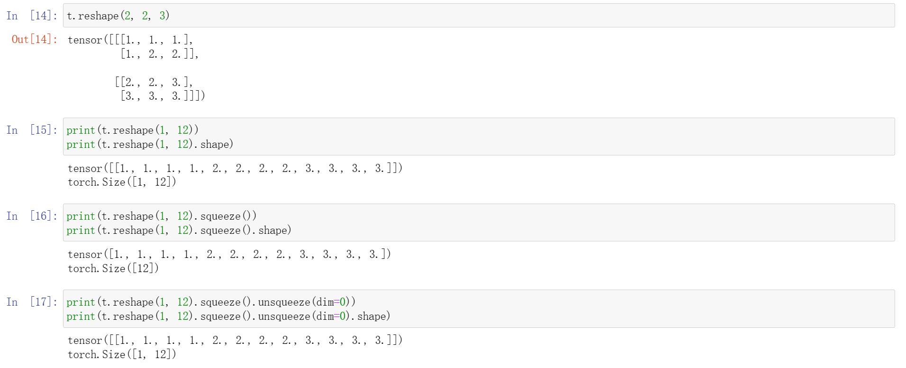

+ **squeeze压缩一个张量可以移除所有==长度为1==的轴，而unsqueeze解压一个张量会增加一个==长度为1==的轴**
  没有长度为1的轴时，squeeze没有效果
  

flatten一个张量意味着除去所有的轴，只保留一个，即创造了一个一维数组，包含Tensor的所有元素

+ flatten操作是从卷积层过渡到全连接层时必须进行的操作
+ ==flatten = reshape + squeeze==

flatten内部操作：

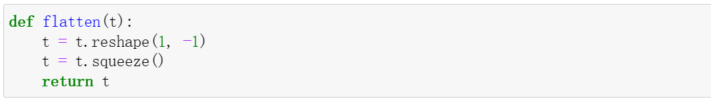

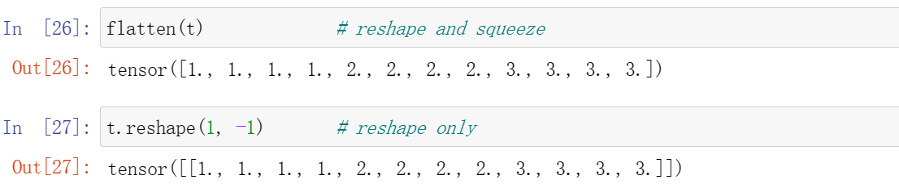


也可以只用reshape操作就实现flatten的效果：
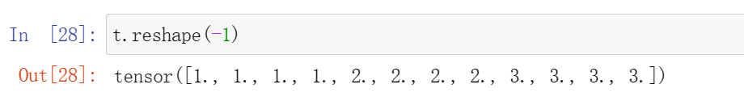

在batch中flatten：

> 例如有一个Tensor，shape为torch.Size([3, 1, 4, 4])
> batchsize=3，通道数为1，每个通道为4*4的图像

+ 要将这一批的图像flatten，不能将整个Tensor变成一维数组，而是应该保留batch，
  即flatten成3*16的二维Tensor


+ **start_dim表示flatten操作应该从哪个轴开始（保留前面的轴）**
+ 当然也可以直接用reshape实现：
  

##### Concatenate

> `torch.cat()`

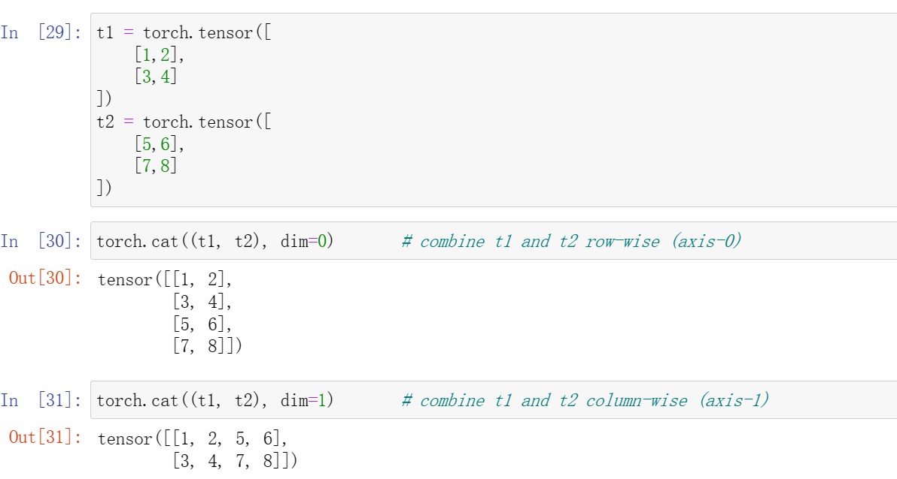

+ 沿哪个轴拼接，哪个轴元素就会增加

​	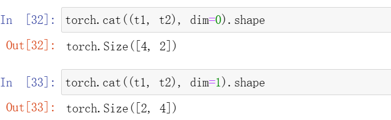


#### 七、Element-wise operations 元素操作

> An element-wise operation is an operation between two tensors that operates on corresponding elements within the repective tensors.
>
> 即进行运算的两个元素在各自张量中的位置（下标）相同

​	两个张量必须有相同的形状才能进行element-wise operation：

两张量相加：

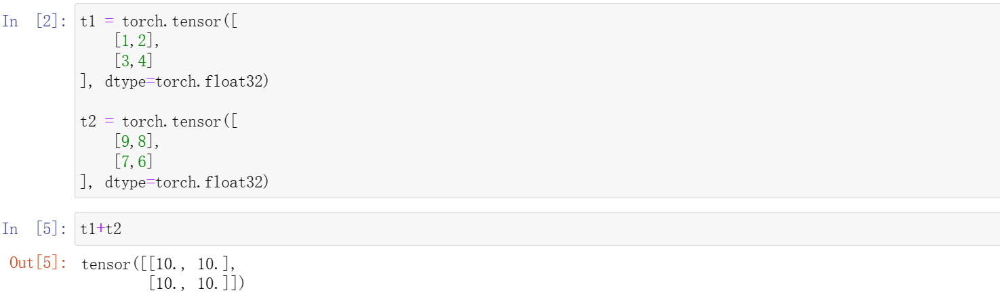

张量的四则运算：

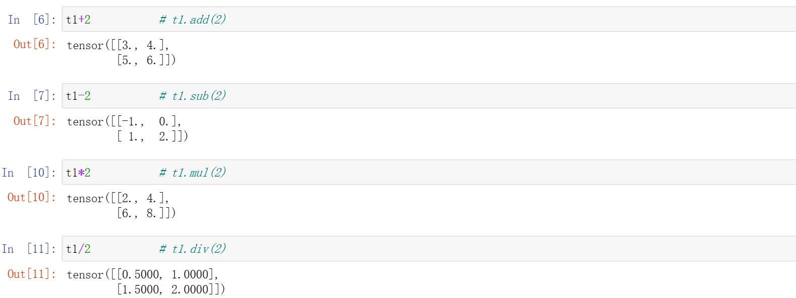

##### Broadcasting

> Broadcasting is the concept whose implementation allows us to add scalars to higher dimensional tensors.
>
> 广播机制使得能够将标量变成张量，以便于其他张量进行运算

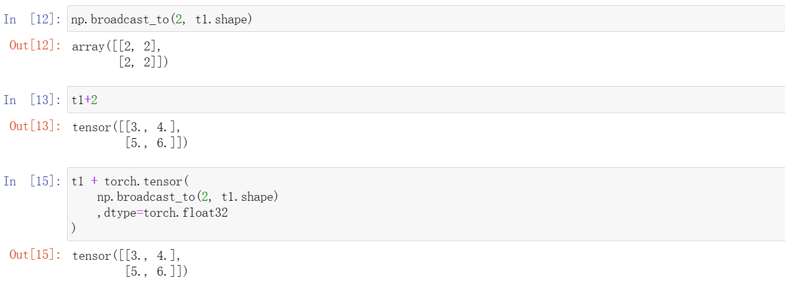

​	低维Tensor与高维Tensor运算时，PyTorch在底层会复制低维Tensor的一个或多个轴，使得其与高维Tensor形状相同，进而能够进行元素运算

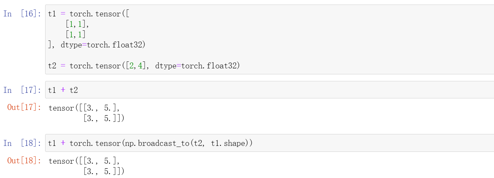

#### 八、Tensor Reduction operations 缩减操作

> A *reduction operation* on a tensor is an operation that reduces the number of elements contained within the tensor.

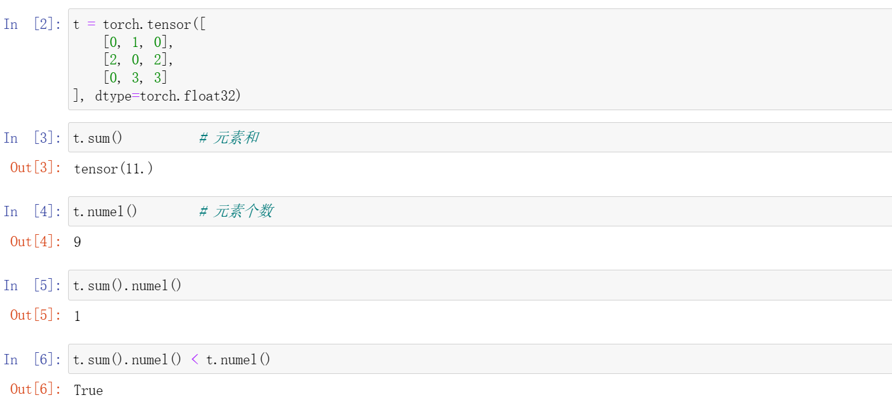

+ 将t中元素求和后，得到的Tensor元素比t的元素要少，因此可以得出：**求和（sum）操作是缩减操作**

类似的，乘积（prod）、均值（mean）、标准差（std）元素都是缩减操作


##### 按轴求和

——==按轴操作就是将该轴的每个Tensor进行element-wise操作==

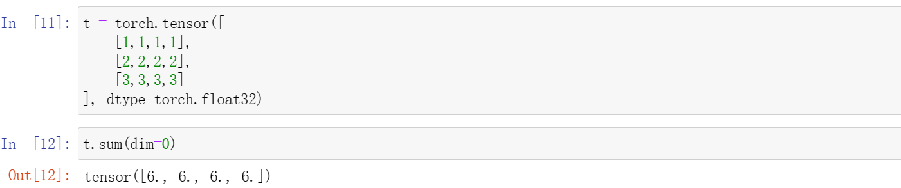

+ 按第一个轴求和，就是把第一个轴的元素加起来，而==第一个轴的元素是一维数组==，
  因此**相当于三个数组进行element-wise的加法操作**
  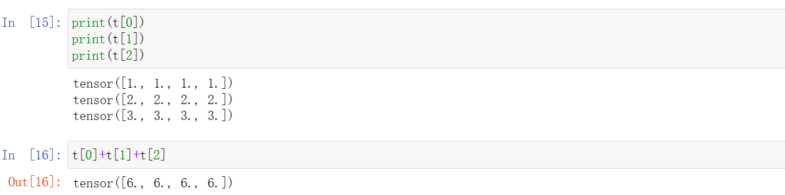

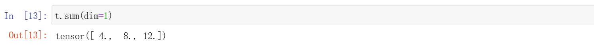

+ 按第二个轴求和，就是把第二个轴的元素（数）加起来，而第一个轴保持不变，
  即相当于每行所有元素相加
  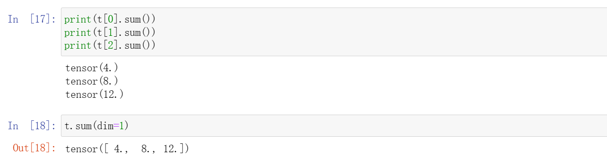


##### Argmax

> Argmax函数用来得到张量中==最大元素的下标（索引值）==
>
> 在神经网络中用来得到概率最大的分类

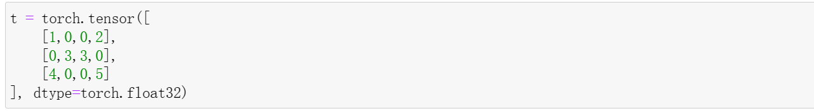

+ 可以很容易看出，t中最大值为5

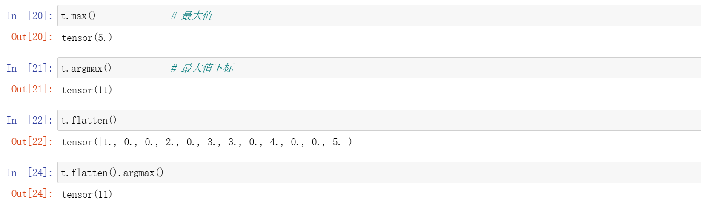

+ 因此，argmax()函数返回的是**将Tensor摊平后的一维数组的**最大值下标

按轴进行argmax操作：
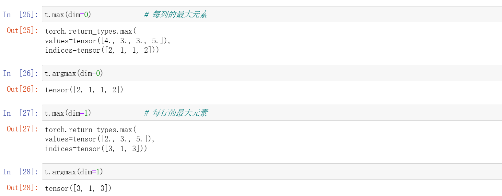


#### 九、Tensor类型数据转换成真正的python数据

> ​	PyTorch中对Tensor的任何运算或访问Tensor元素时，返回值都是tensor类型的数据，要得到真正的数字，需要用到`item()`、`tolist()`等函数

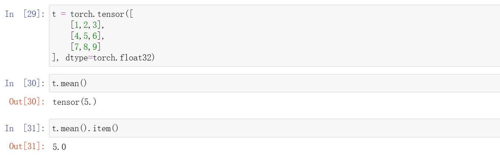


### Data and Data Processing

#### 一、Fashion-MNIST 数据集

> *Fashion-MNIST* as the name suggests is a dataset of fashion items. Specifically, the dataset has the following ten classes of fashion items:
>
> 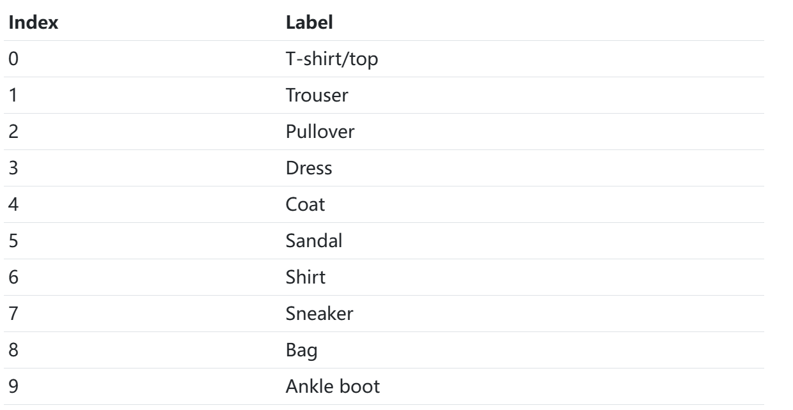
>
> + 为什么名字里有MNIST？
>   因为数据集的创造者想取代MNIST的地位，因此特地选取了10种分类而不是更多
> + 10分类有什么好处？
>   针对MNIST训练的神经网络不用改变输出层，就可以直接换成Fashion-MNIST训练
> + 相较于MNIST，Fashion-MNIST数据集不是手绘的，而是来自zalando网站上的真实图像，
>   经过图像预处理后得到的28x28灰度图
>   


#### 二、ETL——Extract, Transform and Load

> There are four general steps that we'll be following as we move through this project:
>
> 1. prepare the data
> 2. Build the model
> 3. Train the model
> 4. Analyze the model's results

> The ETL process:
>
> + Extract data from a data source
> + Transform data into a desirable format
> + Load data into a suitable structure

具体步骤：

1. Extract——获取Fashion-MNIST数据集图像
2. Transform——将图像转为Tensor
3. Load——将数据存入**容易访问**的对象中

Pytorch为数据准备提供了两个库：Dataset和DataLoader

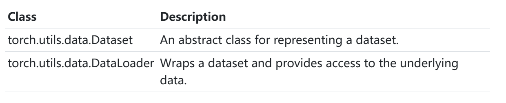

torchvision包内容：

+ Datasets（MNIST以及Fashion-MNIST等）
+ Models（VGG-16等）
+ Transforms
+ Utils

```python
import torch
import torchvision
import torchvision.transforms as transforms  # 图像处理库

train_set = torchvision.datasets.FashionMNIST(   # E&T
    root='./data/FashionMNIST',                  # 指定数据存放位置
    train=True,                                  # 下载训练集（6万张）
    download=True,                               # 如果数据不在指定目录，就下载
    transform=transforms.Compose([               # 图像m预处理
        transforms.ToTensor()                    # 转换成Tensor
    ])
)
train_loader = torch.utils.data.DataLoader(train_set)    # L
```


#### 三、Dataset and DataLoader

> ```python
> import torch
> import torchvision
> import torchvision.transforms as transforms
> import numpy as np
> import matplotlib.pyplot as plt
> 
> train_set = torchvision.datasets.FashionMNIST(   # E&T
>     root='./data/FashionMNIST',                  # 指定数据存放位置
>     train=True,                                  # 下载训练集（6万张）
>     download=True,                               # 如果数据不在指定目录，就下载
>     transform=transforms.Compose([               # 图像m预处理
>         transforms.ToTensor()                    # 转换成Tensor
>     ])
> )
> train_loader = torch.utils.data.DataLoader(
>     train_set, batch_size=10                     # 默认batch_size=1
> )
> ```

##### 从数据集中获取单个图像

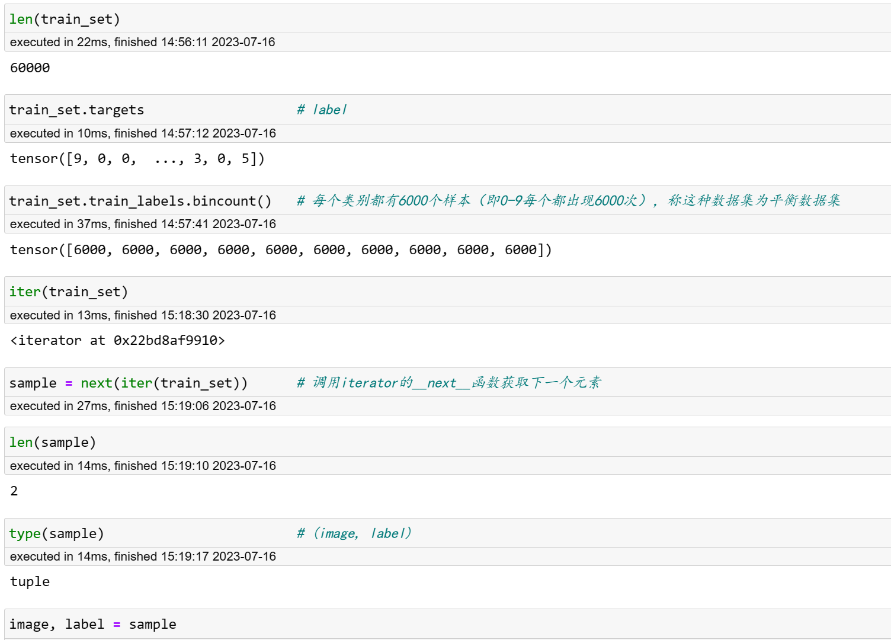

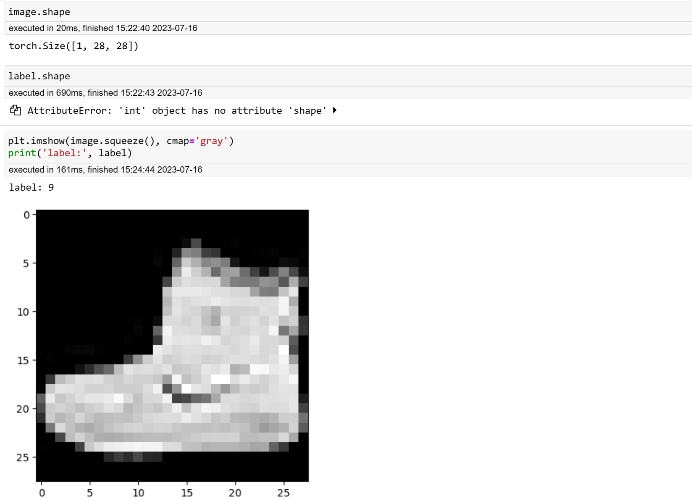


##### 获取整批图像

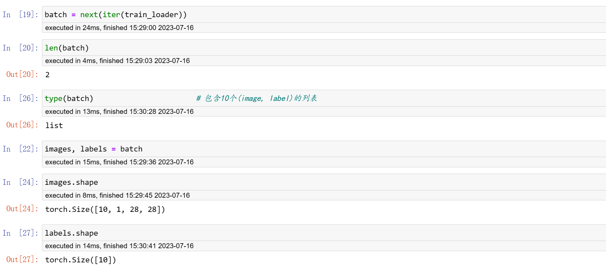

##### 用torchvision.utils.make_grid函数一次画出整批图像

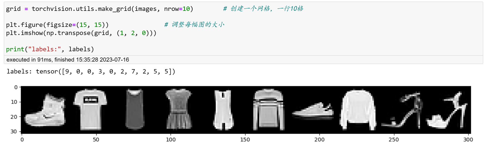

### Neural Networks and Deep Learning

#### 一、神经网络的参数

##### parameter 和 argument 的区别

+ parameter——参数，即函数中的**局部变量**，可看成一个占位符
+ argument——传递给函数中参数的**具体数值value**

##### Hyperparameter

> Hyperparameters are parameters whose values are chosen manually and arbitraily.
>
> 超参数是由网络设计者选择的，而不是学习出来的

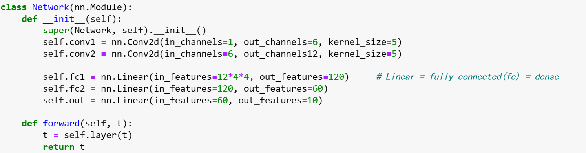

上述简单网络中的超参数如下：

+ kernel_size（卷积层）：卷积核的大小(边长），例如3x3、5x5
+ out_channels（卷积层）：卷积核个数，决定输出的图像通道数
+ out_features（全连接层）：输出层的神经元个数


##### Data-dependent Hyperparameter

> 依赖于数据的超参数，不是完全自定义的

上述网络中的数据依赖超参数如下：

+ in_channels：每个卷积层的输入通道数，取决于整个网络的输入图像或上一层的输出图像
+ in_features：每个全连接层的输入通道数，取决于上一层的输出图像
+ out_features：整个网络的输出神经元个数（分类个数）


#### 二、神经网络的权重

##### 神经网络字符串表示法

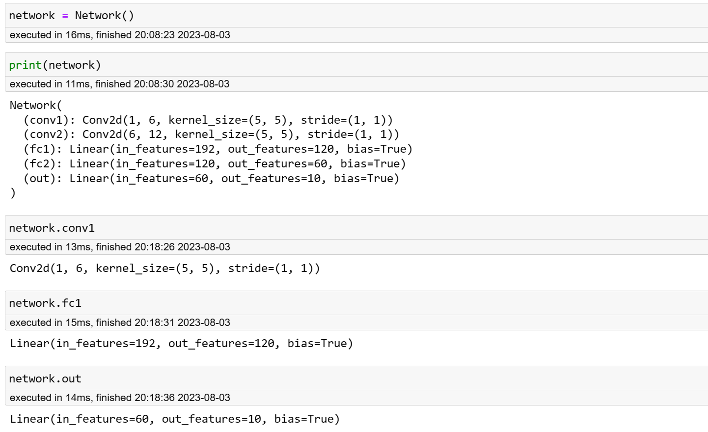


##### 显示某一层的weight

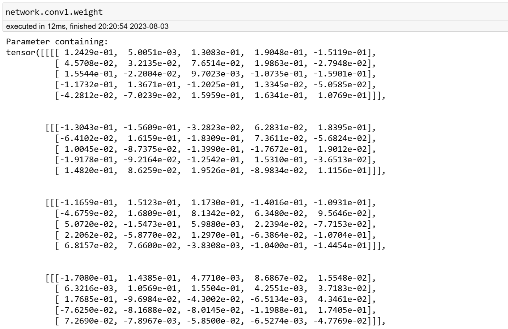

+ 每一层的权重都是一个张量，父类是PyTorch中的Parameter类

##### Parameter类

> To keep track of all the weight tensors inside the network. PyTorch has a special class called `Parameter`.

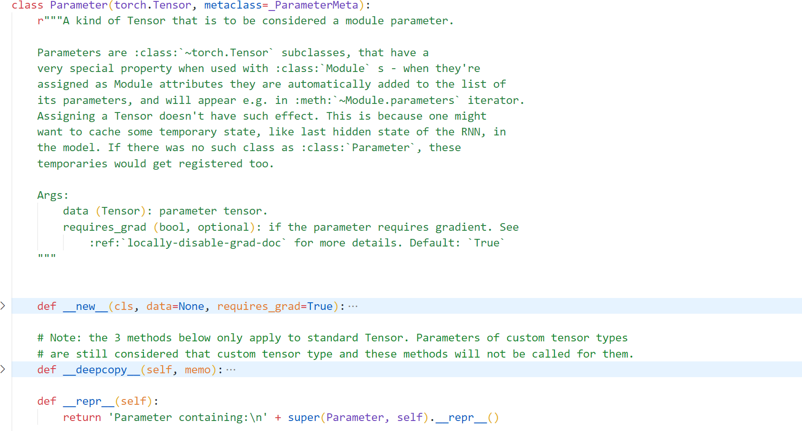

每层的权重都有各自的形状：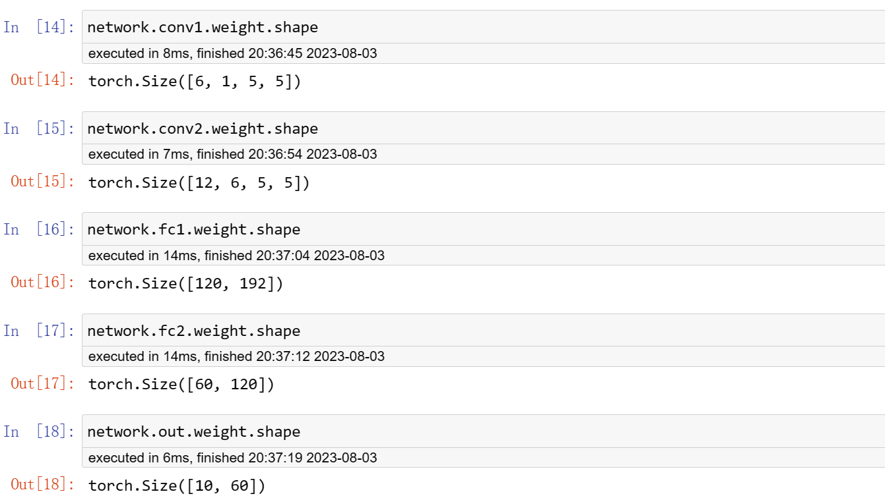

==卷积层的weight其实就是卷积核本身==

+ 第一维是卷积核个数，即输出通道数；
+ 第二维是每个卷积核通道数，与当前层输入图像的通道数一致；
+ 后面两维是卷积核大小

全连接层的weight是大小为[out，in]的Tensor


##### 一次性访问所有weight

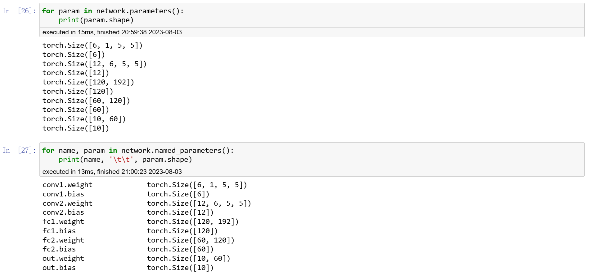


#### 三、神经网络的Callable Function（以线性层为例）

##### 线性层的初始化

​	构造Linear layer时，PyTorch会为当前层初始化一个随机的weight张量，存到self.weight变量中；

##### 线性层的callable function

> PyTorch中每一层网络都是一个callable function，`__call__`中会调用`forward`函数以及进行其他操作

​	线性层作为callable function时，进行的操作就是weight张量与输入张量的矩阵乘法。
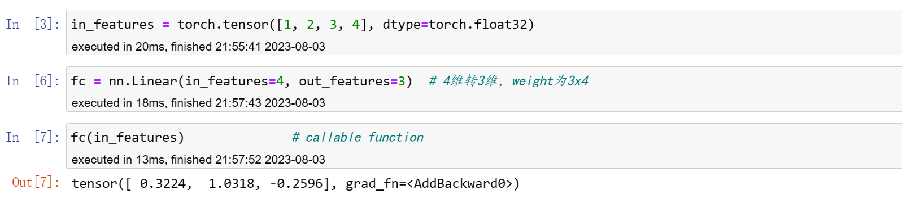

**指定线性层的权重**：

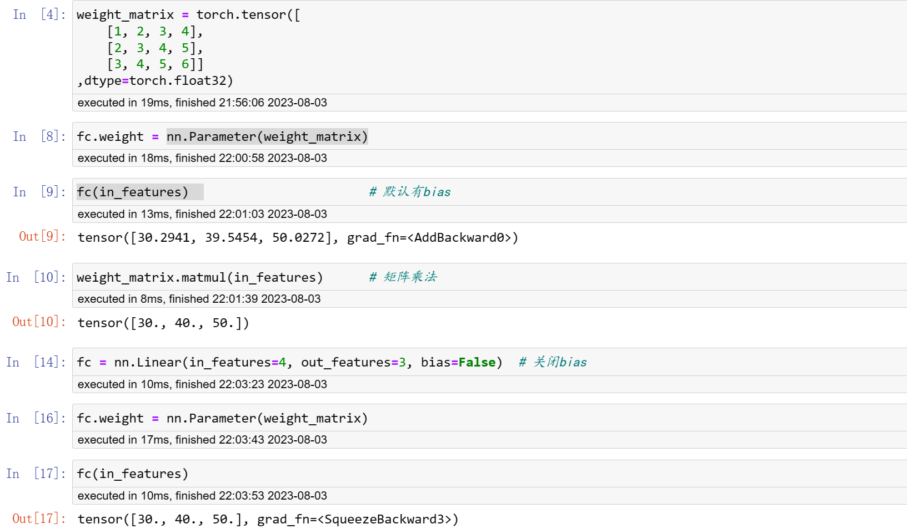


##### callable function和直接调用forward的区别

+ 将网络作为callable function调用时，所做的操作除了调用forward函数，还有其他的一些操作
+ 因此神经网络训练时，不直接调用forward函数，而是将网络作为callable function使用


#### 四、卷积神经网络实现

> 网络定义：
>
> 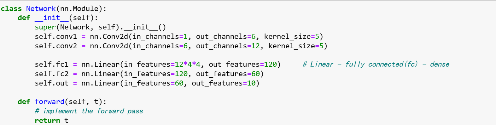

##### forward函数实现

```python
def forward(self, t):
    # (1) input layer
    t = t

    # (2) hidden conv layer
    t = self.conv1(t)
    t = F.relu(t)                   # 卷积层中不包含激活函数，需要手动添加
    t = F.max_pool2d(t, kernel_size=2, stride=2)     # 池化操作（没有权重的函数不能称为层）

    # (3) hidden conv layer
    t = self.conv2(t)
    t = F.relu(t)
    t = F.max_pool2d(t, kernel_size=2, stride=2)

    # (4) hidden linear layer
    t = t.reshape(-1, 12*4*4)       # 必须手动flatten
    t = self.fc1(t)
    t = F.relu(t)

    # (5) hidden linear layer
    t = self.fc2(t)
    t = F.relu(t)

    # (6) output layer
    t = self.out(t)
    # t = F.softmax(t, dim=1)       # 不直接在forward中用softmax，而是在训练过程中用cross-entropy损失函数计算loss，其中自带softmax

    return t
```


### Training Neural Networks

#### 一、前向传播 forward propagation

##### 网络结构

```python
import torch
import torch.nn as nn
import torch.nn.functional as F

import torchvision
import torchvision.transforms as transforms

torch.set_printoptions(linewidth=120)

class Network(nn.Module):
    def __init__(self):
        super(Network, self).__init__()
        self.conv1 = nn.Conv2d(in_channels=1, out_channels=6, kernel_size=5)
        self.conv2 = nn.Conv2d(in_channels=6, out_channels=12, kernel_size=5)
        
        self.fc1 = nn.Linear(in_features=12*4*4, out_features=120)     # Linear = fully connected(fc) = dense
        self.fc2 = nn.Linear(in_features=120, out_features=60)
        self.out = nn.Linear(in_features=60, out_features=10)
        
    def forward(self, t):
        # (1) input layer
        t = t
        
        # (2) hidden conv layer
        t = self.conv1(t)
        t = F.relu(t)                   # 卷积层中不包含激活函数，需要手动添加
        t = F.max_pool2d(t, kernel_size=2, stride=2)     # 池化操作（没有权重的函数不能称为层）
        
        # (3) hidden conv layer
        t = self.conv2(t)
        t = F.relu(t)
        t = F.max_pool2d(t, kernel_size=2, stride=2)
        
        # (4) hidden linear layer
        t = t.reshape(-1, 12*4*4)       # 必须手动flatten
        t = self.fc1(t)
        t = F.relu(t)
        
        # (5) hidden linear layer
        t = self.fc2(t)
        t = F.relu(t)
        
        # (6) output layer
        t = self.out(t)
        # t = F.softmax(t, dim=1)           # 不直接在forward中用softmax，而是在训练过程中用cross-entropy损失函数计算loss，其中自带softmax
        
        return t
    
train_set = torchvision.datasets.FashionMNIST(
    root = './data/FashionMNIST',
    train=True,
    download=True,
    transform=transforms.Compose([
        transforms.ToTensor()
    ])
)
torch.set_grad_enabled(False)            # 关闭自动计算梯度

network = Network()
```

##### 将单个图像送入网络进行预测

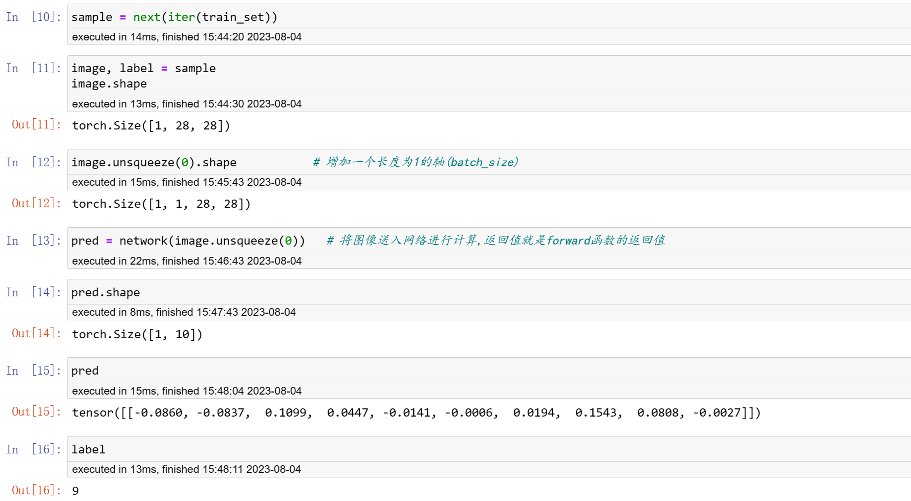

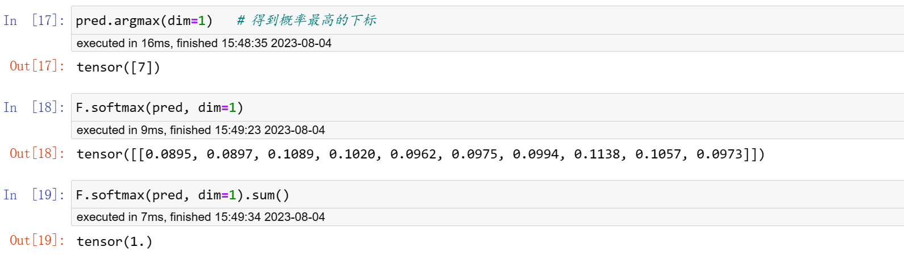

+ 可见预测结果为7，与label=9不符

##### 将一批图像送入网络进行预测

1. 用DataLoader类：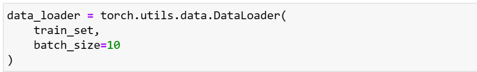

2. 调用`next(iter(data_loader))`时，DataLoader会返回一整批图像（10张）

   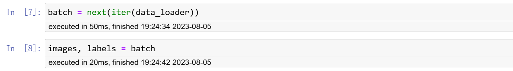

   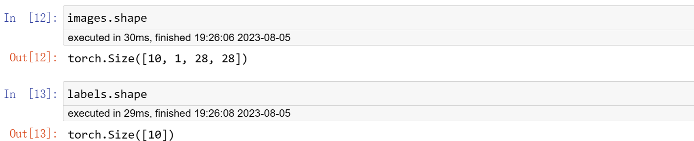

3. 送入网络预测

   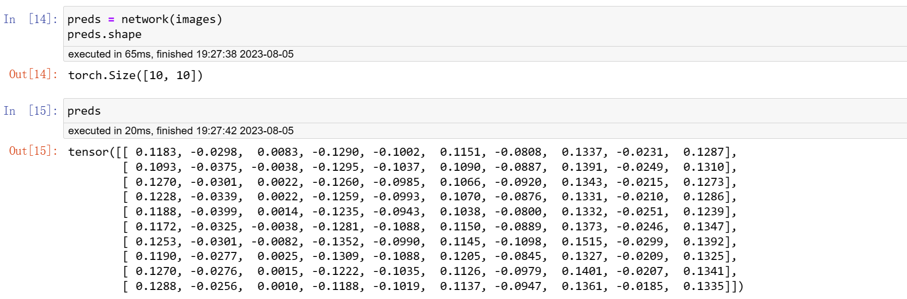

4. 得到最大概率下标，并与实际标签对比

   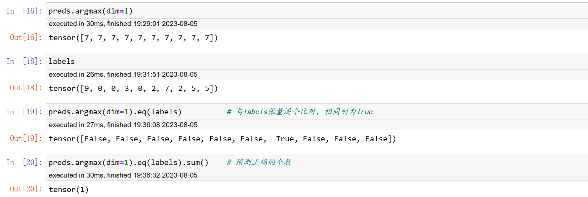

   + 可以写一个函数，用来计算预测正确的个数：
     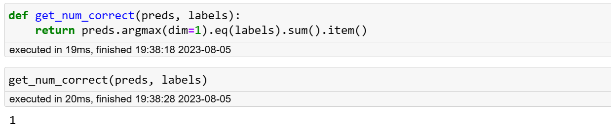


#### 二、The training proess

##### 一般步骤

1. Get batch from the training set
2. Pass batch to network
3. Calculate the loss(difference between the predicted values and the true values)
4. Calculate the gradient of the loss function with respect to the network's weights
5. update the weights using the gradients to reduce the loss
6. Repeat steps 1-5 until one epoch is completed
7. Repeat steps 1-6 for as many epochs required to obtain the desired level of accuracy

##### 训练一个batch

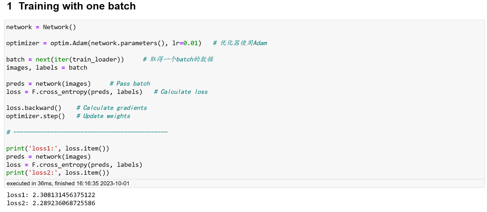

##### 训练一个epoch

 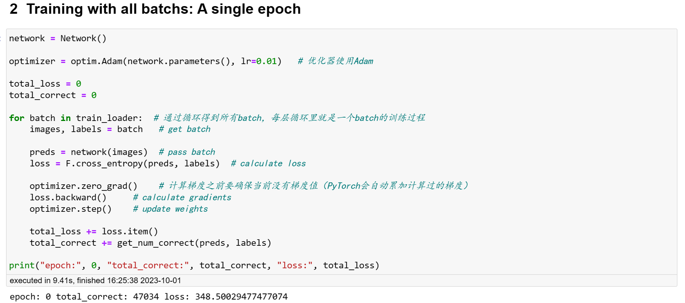

##### 训练多个epoch

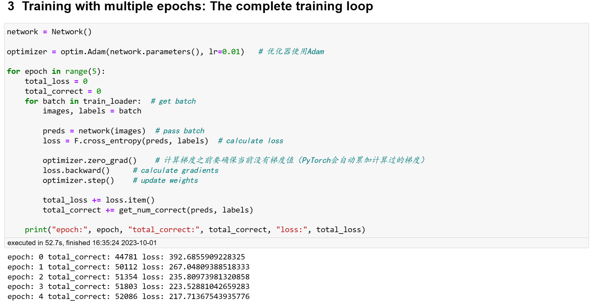


## 进阶

### Confusion Matrix 混淆矩阵

#### 含义

1. 二维矩阵，行方向为预测标签Predicted label；列方向为真实标签True label
2. 每格元素表示预测的数量
3. 主对角线（行列相等）表示预测正确的数量
4. 每格的数量都转化为颜色深浅表示
5. 可以直观的看出我们的网络在哪被搞混淆了


#### 构造混淆矩阵

##### 1. 得到整个训练集的预测标签

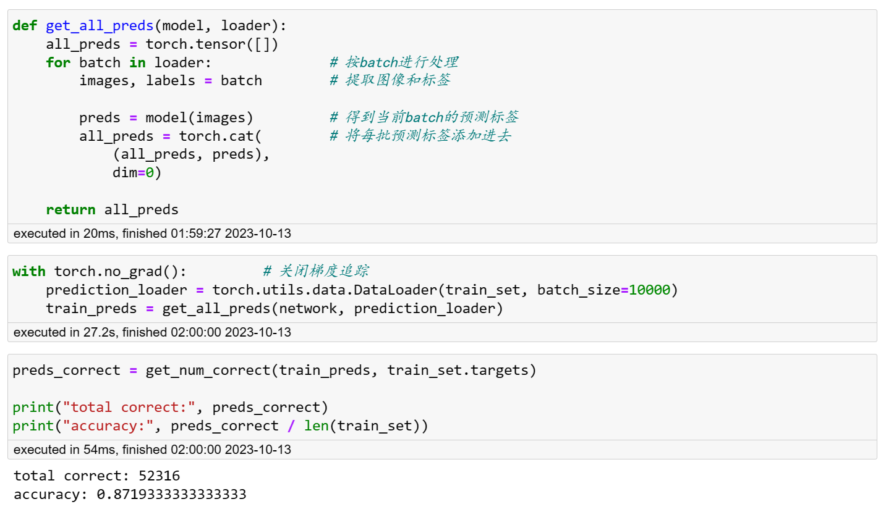

##### 2. 构造混淆矩阵

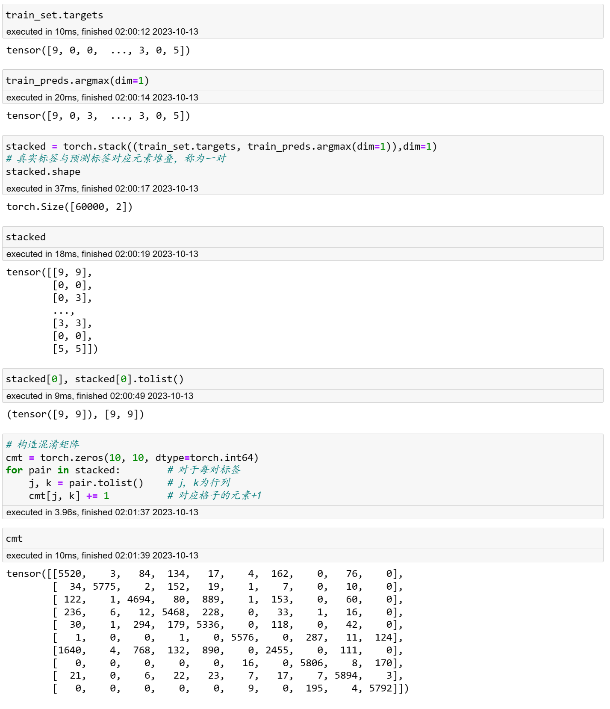

#### 画图

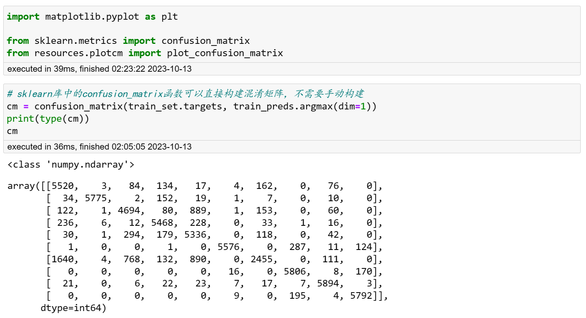

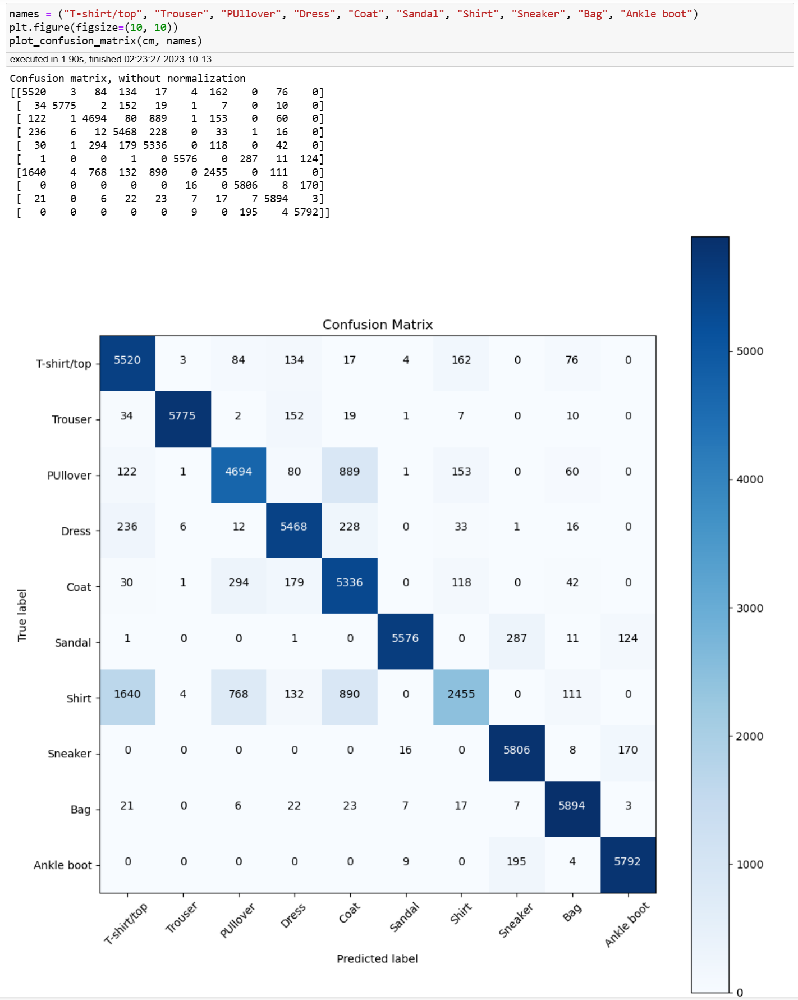

##### 画图函数

```python
import itertools
import numpy as np
import matplotlib.pyplot as plt

def plot_confusion_matrix(cm, classes, normalize=False, title="Confusion Matrix", cmap=plt.cm.Blues):
    if normalize:
        cm = cm.astype("float") / cm.sum(axis=1)[:, np.newaxis]
        print("Normalized confusion matrix")
    else:
        print("Confusion matrix, without normalization")

    print(cm)


    plt.imshow(cm, interpolation="nearest", cmap=cmap)
    plt.title(title)
    plt.colorbar()
    tick_marks = np.arange(len(classes))
    plt.xticks(tick_marks, classes, rotation=45)
    plt.yticks(tick_marks, classes)

    fmt = '.2f' if normalize else 'd'
    thresh = cm.max() / 2
    for i, j in itertools.product(range(cm.shape[0]), range(cm.shape[1])):
        plt.text(j, i, format(cm[i, j], fmt),
                 horizontalalignment='center',
                 color="white" if cm[i, j] > thresh else "black")
        
    plt.tight_layout()
    plt.ylabel("True label")
    plt.xlabel("Predicted label")
```


### Tensorboard

> Tensorboard: TensorFlow's Visualization Toolkit
>
> Tensorboard provides the visualization and tooling needed for machine learning experimentations:
>
> + Tracking and visualizing metrics such as loss and accuracy
> + Visualizing the model graph(ops and layers)

#### tensorboard运行步骤

##### 1. 在代码中导入SummaryWriter

```python
from torch.utils.tensorboard import SummaryWriter   
# 用来将网络数据发送到tensorboard中
```

##### 2. 向Tensorboard中添加网络数据

```python
tb = SummaryWriter()

network = Network()
images, labels = next(iter(train_loader))
grid = torchvision.utils.make_grid(images)

tb.add_image("image", grid)         # 添加图像
tb.add_graph(network, images)       # 添加网络和图像张量
tb.close()
```

##### 3. 在控制台运行Tensorboard

```
tensorboard --logdir=runs           # runs为运行文件夹
```


##### 4.浏览器打开


#### 在training loop中将数据送入tensorboard


#### training loop中使用tensorboard的通用代码


+ `network.named_parameter()函数可以返回网络每层的权重和参数，以元组形式返回`
  

### Hyperparameter Tuning

> TensorBoard真正强大之处在于它可以比较多次训练的能力，从而方便调出最优参数

```python
comment = f" batch_size={batch_size}, lr={lr}
tb = SummaryWriter(comment=comment)  # Summary会将comment参数的内容设置为本次运行的名称，从而可以用参数值来表示每次运行
```


#### 尝试不同超参数值的组合

##### 1. 导入itertools中的product函数


+ `*param_values`表示将列表中的每个元素作为参数，而不是把一整个列表当做参数


##### 2. 利用不同的超参数组合进行训练


##### 3. 在TensorBoard中比较各次训练的效果


### 超参数调参优化

> 手动构建RunBuilder和RunManager类，用来更方便的实现超参数的不同组合训练

#### RunBuilder类

##### 具体实现


##### 相比之前的优化

Before：


1. 循环时需要指定所有超参数名，超参数改变时需要修改循环
2. comment需要手动修改

After：


1. 循环时只需用run代表所有超参数，超参数改变时不需要修改
2. comment也可以自动生成


#### RunManager类

> RunManager类可以提取大量的TensorBoard调用函数，使得training loop更加简洁美观

##### 具体实现

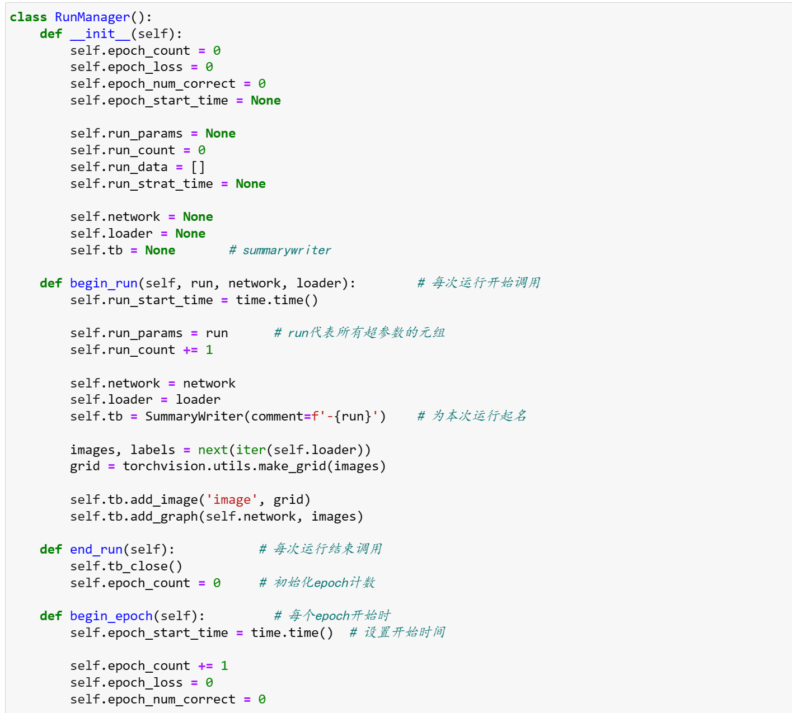

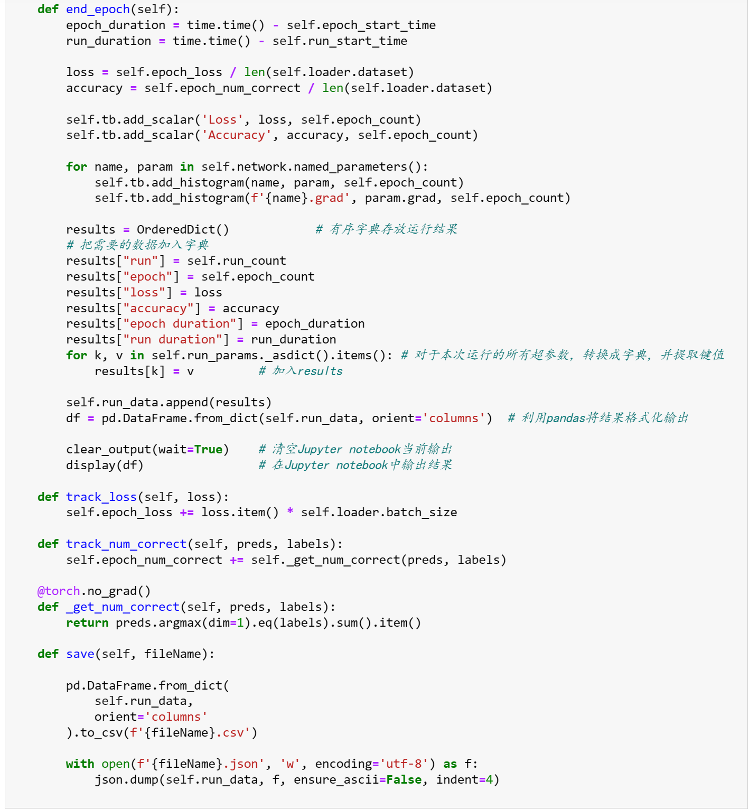

##### 添加了RunBuilder和RunManager后的training loop

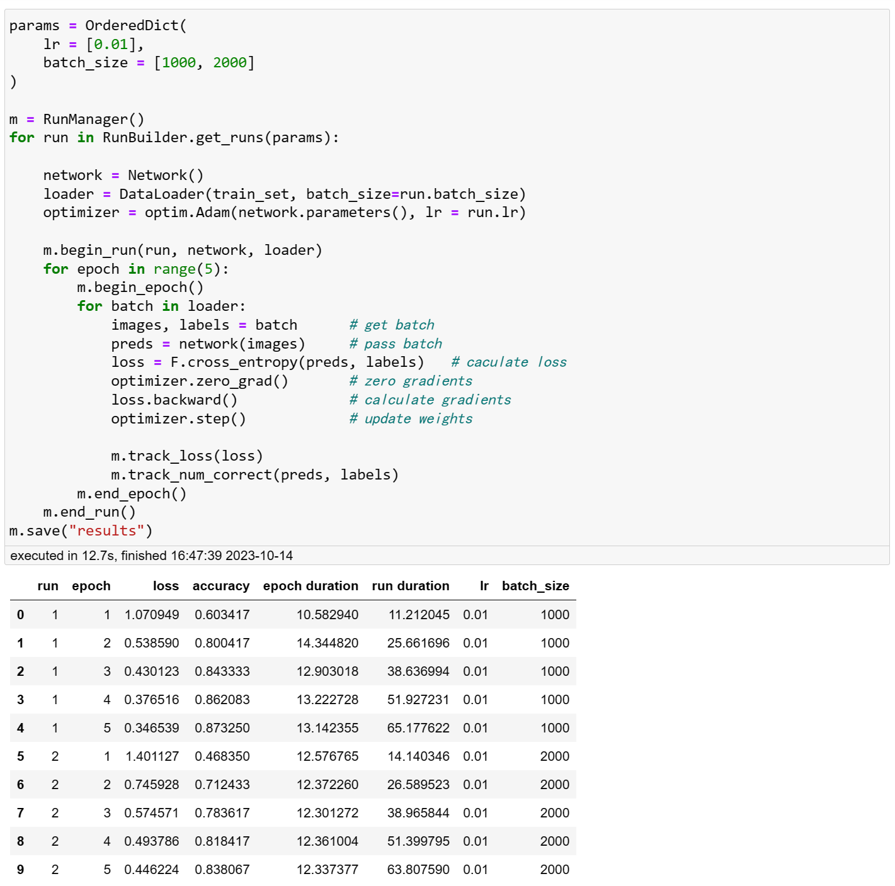

新增超参数只需要些许改动：（以shuffle举例）

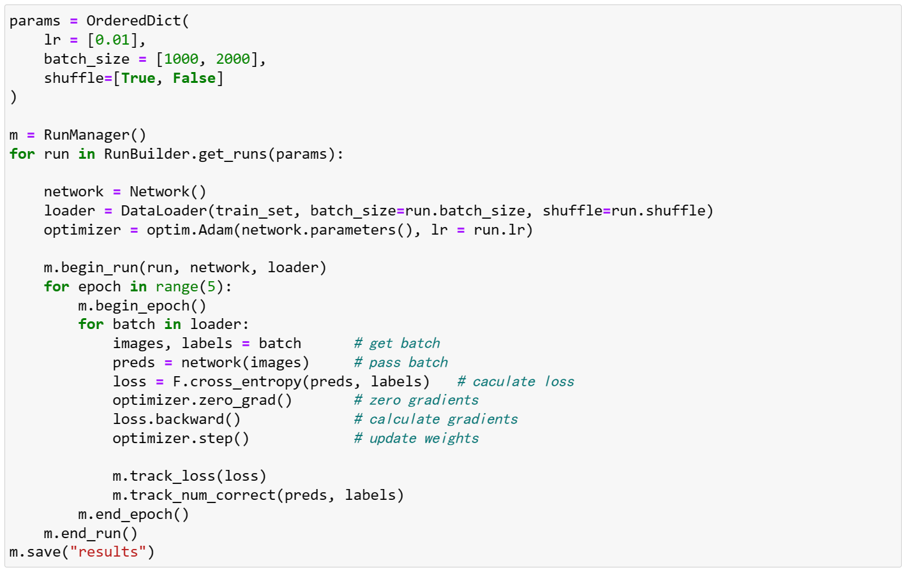

+ 添加shuffle后一共有4组run

  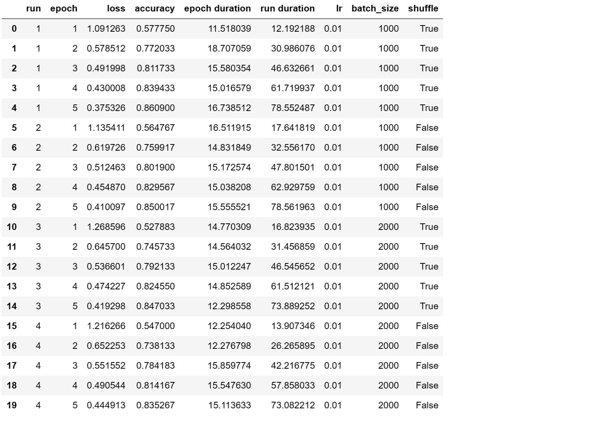


#### 测试框架

```python
import torch
import torch.nn as nn
import torch.nn.functional as F
import torch.optim as optim
from torch.utils.data import DataLoader

import torchvision
import torchvision.transforms as transforms

torch.set_printoptions(linewidth=120)
torch.set_grad_enabled(True)

from torch.utils.tensorboard import SummaryWriter   # 用来将网络数据发送到tensorboard中

import matplotlib.pyplot as plt 
import math
import time
import pandas as pd
import json
from IPython.display import clear_output

from collections import OrderedDict
from collections import namedtuple
from itertools import product

class RunBuilder():
    @staticmethod          # 静态函数可以直接用类名调用，不需要创建类的实例
    def get_runs(params):
        Run = namedtuple("Run", params.keys())   # 用于构建带名字的元组，名字为"Run"
        
        runs = []
        for v in product(*params.values()):      # 对于所有超参数的组合
            runs.append(Run(*v))                 # 构建一个带名元组
        
        return runs
class RunManager():
    def __init__(self):
        self.epoch_count = 0
        self.epoch_loss = 0
        self.epoch_num_correct = 0
        self.epoch_start_time = None
        
        self.run_params = None
        self.run_count = 0
        self.run_data = []
        self.run_strat_time = None
        
        self.network = None
        self.loader = None
        self.tb = None       # summarywriter
        
    def begin_run(self, run, network, loader):        # 每次运行开始调用
        self.run_start_time = time.time()
        
        self.run_params = run      # run代表所有超参数的元组
        self.run_count += 1
        
        self.network = network
        self.loader = loader
        self.tb = SummaryWriter(comment=f'-{run}')    # 为本次运行起名
        
        images, labels = next(iter(self.loader))
        grid = torchvision.utils.make_grid(images)
        
        self.tb.add_image('image', grid)
        self.tb.add_graph(self.network, images)
        
    def end_run(self):           # 每次运行结束调用
        self.tb.close()
        self.epoch_count = 0     # 初始化epoch计数
        
    def begin_epoch(self):         # 每个epoch开始时
        self.epoch_start_time = time.time()  # 设置开始时间
        
        self.epoch_count += 1
        self.epoch_loss = 0
        self.epoch_num_correct = 0
        
    def end_epoch(self):
        epoch_duration = time.time() - self.epoch_start_time
        run_duration = time.time() - self.run_start_time
        
        loss = self.epoch_loss / len(self.loader.dataset)
        accuracy = self.epoch_num_correct / len(self.loader.dataset)
        
        self.tb.add_scalar('Loss', loss, self.epoch_count)
        self.tb.add_scalar('Accuracy', accuracy, self.epoch_count)
        
        for name, param in self.network.named_parameters():
            self.tb.add_histogram(name, param, self.epoch_count)
            self.tb.add_histogram(f'{name}.grad', param.grad, self.epoch_count)
            
        results = OrderedDict()            # 有序字典存放运行结果
        # 把需要的数据加入字典
        results["run"] = self.run_count
        results["epoch"] = self.epoch_count
        results["loss"] = loss
        results["accuracy"] = accuracy
        results["epoch duration"] = epoch_duration
        results["run duration"] = run_duration
        for k, v in self.run_params._asdict().items(): # 对于本次运行的所有超参数，转换成字典，并提取键值
            results[k] = v         # 加入results
            
        self.run_data.append(results)
        df = pd.DataFrame.from_dict(self.run_data, orient='columns')  # 利用pandas将结果格式化输出
        
        clear_output(wait=True)    # 清空Jupyter notebook当前输出
        display(df)                # 在Jupyter notebook中输出结果

    def track_loss(self, loss):
        self.epoch_loss += loss.item() * self.loader.batch_size

    def track_num_correct(self, preds, labels):
        self.epoch_num_correct += self._get_num_correct(preds, labels)
        
    @torch.no_grad()
    def _get_num_correct(self, preds, labels):
        return preds.argmax(dim=1).eq(labels).sum().item()
    
    def save(self, fileName):

        pd.DataFrame.from_dict(
            self.run_data,
            orient='columns'
        ).to_csv(f'{fileName}.csv')

        with open(f'{fileName}.json', 'w', encoding='utf-8') as f:
            json.dump(self.run_data, f, ensure_ascii=False, indent=4)
class Network(nn.Module):
    def __init__(self):
        super(Network, self).__init__()
        self.conv1 = nn.Conv2d(in_channels=1, out_channels=6, kernel_size=5)
        self.conv2 = nn.Conv2d(in_channels=6, out_channels=12, kernel_size=5)
        
        self.fc1 = nn.Linear(in_features=12*4*4, out_features=120)     # Linear = fully connected(fc) = dense
        self.fc2 = nn.Linear(in_features=120, out_features=60)
        self.out = nn.Linear(in_features=60, out_features=10)
        
    def forward(self, t):
        # (1) input layer
        t = t
        
        # (2) hidden conv layer
        t = self.conv1(t)
        t = F.relu(t)                   # 卷积层中不包含激活函数，需要手动添加
        t = F.max_pool2d(t, kernel_size=2, stride=2)     # 池化操作（没有权重的函数不能称为层）
        
        # (3) hidden conv layer
        t = self.conv2(t)
        t = F.relu(t)
        t = F.max_pool2d(t, kernel_size=2, stride=2)
        
        # (4) hidden linear layer
        t = t.reshape(-1, 12*4*4)       # 必须手动flatten
        t = self.fc1(t)
        t = F.relu(t)
        
        # (5) hidden linear layer
        t = self.fc2(t)
        t = F.relu(t)
        
        # (6) output layer
        t = self.out(t)
        # t = F.softmax(t, dim=1)           # 不直接在forward中用softmax，而是在训练过程中用cross-entropy损失函数计算loss，其中自带softmax
        
        return t
    
    
train_set = torchvision.datasets.FashionMNIST(
    root = './data/FashionMNIST',
    train=True,
    download=True,
    transform=transforms.Compose([
        transforms.ToTensor()
    ])
)

params = OrderedDict(
    lr = [0.01],
    batch_size = [1000, 2000],
    shuffle=[True, False]                  
)

m = RunManager()
for run in RunBuilder.get_runs(params):

    network = Network()
    loader = DataLoader(train_set, batch_size=run.batch_size, shuffle=run.shuffle)
    optimizer = optim.Adam(network.parameters(), lr = run.lr)

    m.begin_run(run, network, loader)
    for epoch in range(5):
        m.begin_epoch()
        for batch in loader:
            images, labels = batch      # get batch
            preds = network(images)     # pass batch
            loss = F.cross_entropy(preds, labels)   # caculate loss
            optimizer.zero_grad()       # zero gradients
            loss.backward()             # calculate gradients
            optimizer.step()            # update weights

            m.track_loss(loss)
            m.track_num_correct(preds, labels)
        m.end_epoch()
    m.end_run()
m.save("results")
```


### 深度学习加速

#### 一、DataLoader的num_workers参数

##### 解释

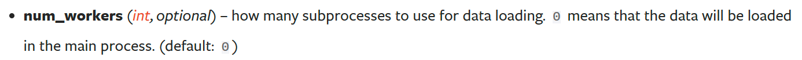

+ 表示有多少子进程用于载入数据
+ 为0时表示只有一个主进程载入数据，即数据按顺序一批一批载入
+ 若cpu有多个核心，就可以设置多个子进程。主进程处理数据的时候，子进程就可以读入下一批数据，从而实现加速

##### 测试num_workers的最优取值

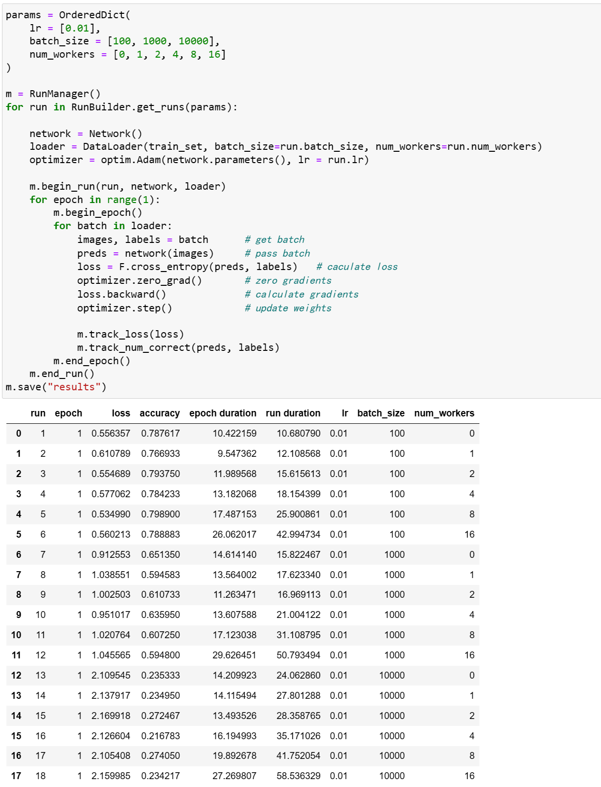

+ num_workers=1时最优，而子进程更多时，效果反而不好，
  原因是子进程太多后，载入的数据都排在队列里，主进程来不及处理，因此起不到加速的效果。

#### 二、Moving to GPU

##### 将张量送入GPU

```python
t1 = torch.tensor([
    [1, 2],
    [3, 4]
])
t1.to('cuda')
```


##### 将network送入GPU

> 将network送入GPU就是将网络==所有的参数==送入GPU
>
> 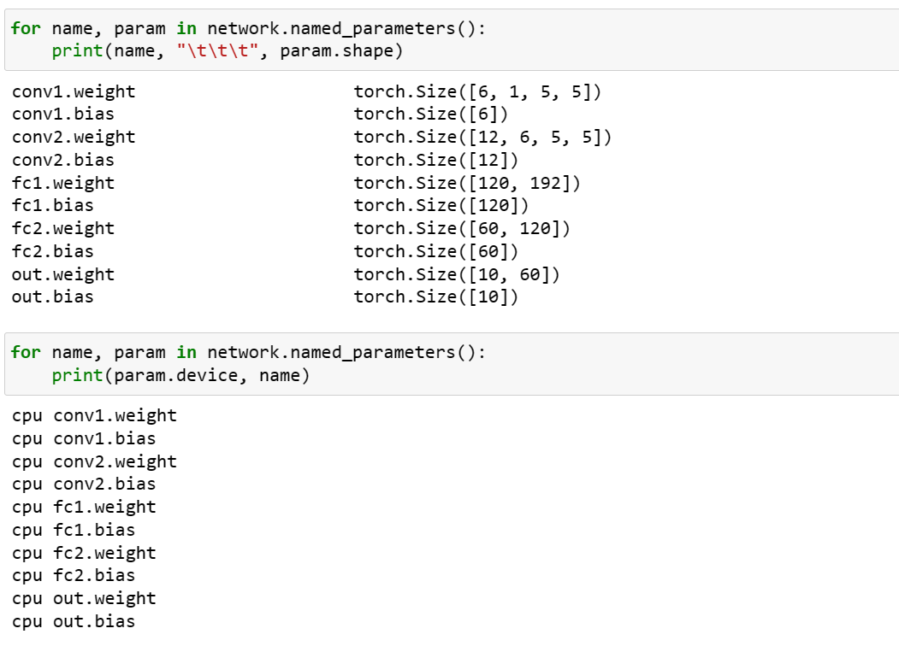

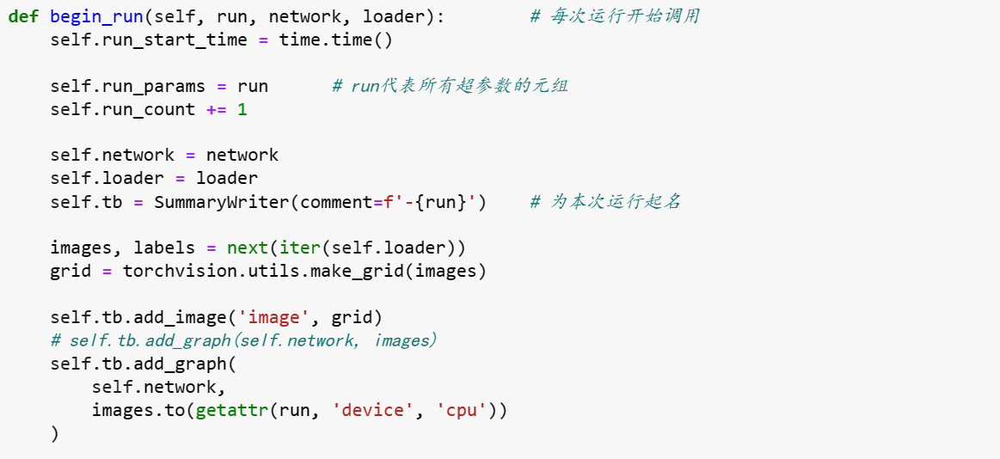

### Sequential Models

#### 三种方法

##### 第一种

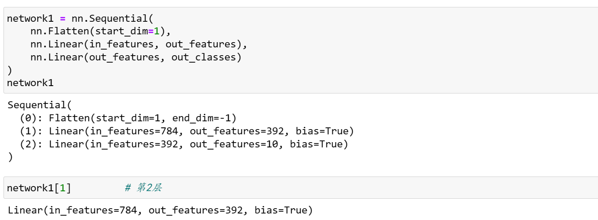

+ 网络自动编序号

##### 第二种

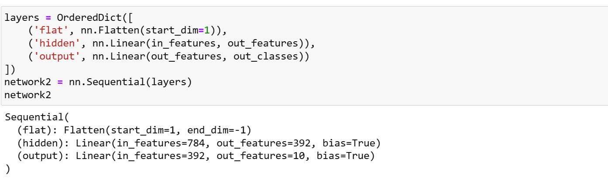

+ 可以给每个模块起名

##### 第三种

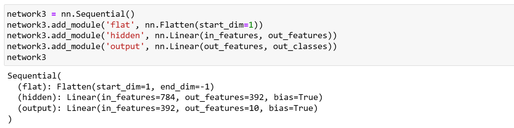

+ 和第二种一样，也可以起名

#### 优化原网络

> 手动设置随机数种子可以创建多个完全相同的网络（即初始参数相同）

Before：

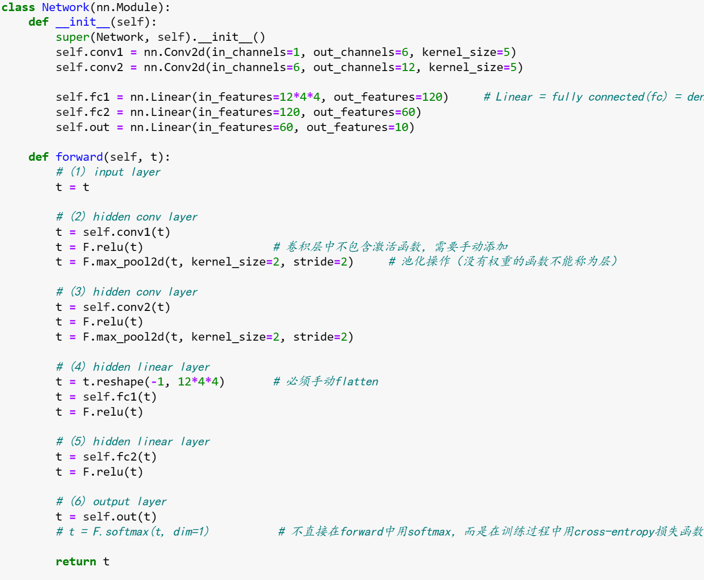

After：

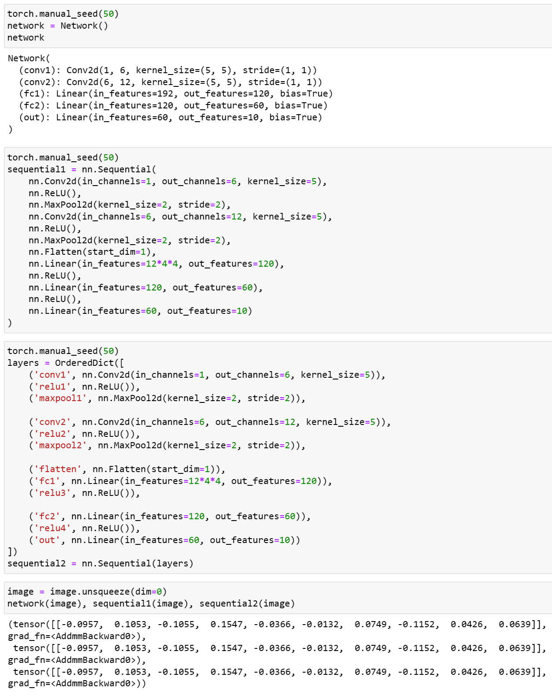

+ 由于设置了相同的随机数种子，因此三个网络参数完全一样，预测结果也一样

### Normalization归一化

> 将原数据分布转换成N(0, 1), 即$\frac{x-\mu}{\sigma}\sim N(0,1)$，需要求均值和标准差
>
> + $DX=E[X-EX]^2>0,\sqrt{DX}称标准差$

#### torchvision.transforms.Normalize()

##### 1. 算均值mean和标准差std

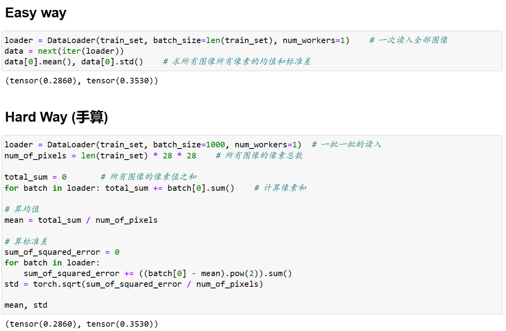

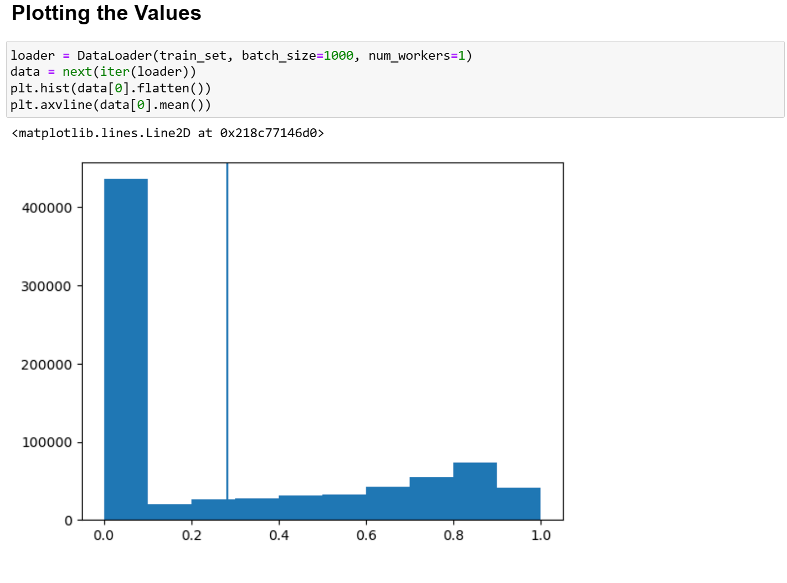

##### 将训练集归一化


#### Batch Norm

在网络中添加BatchNorm和将训练集直接归一化的对比：

##### 训练设置

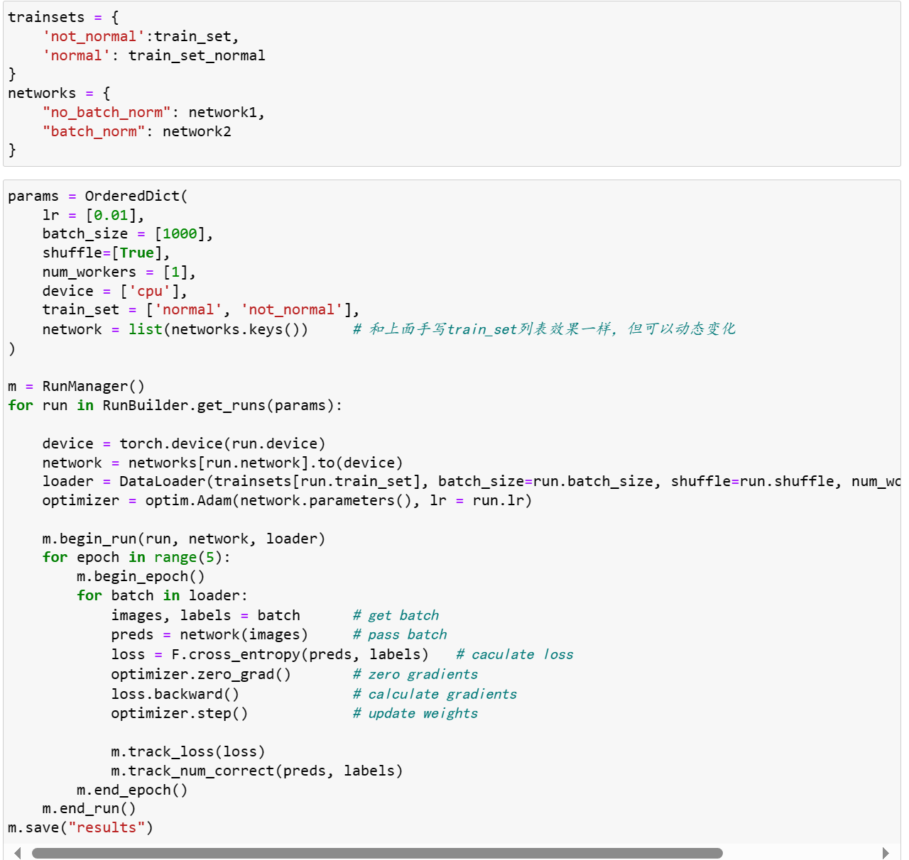

##### 结果（错误）

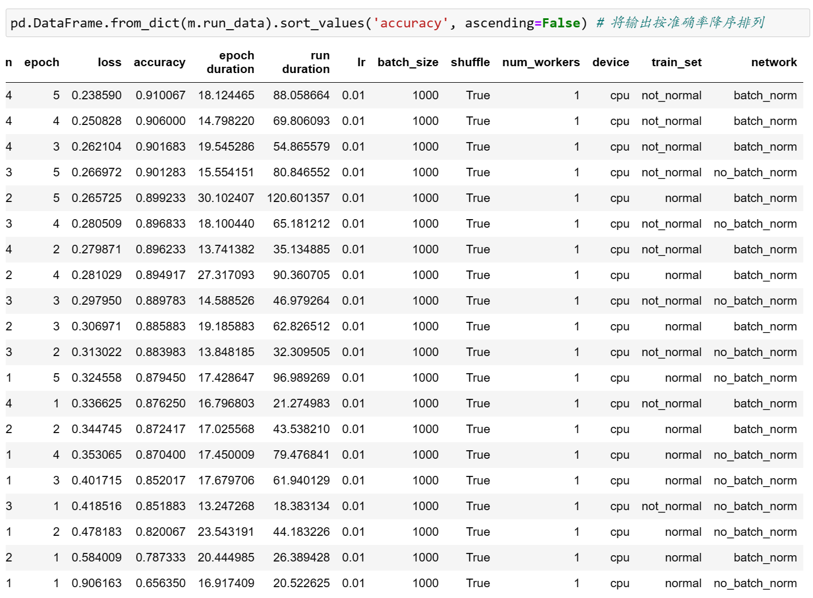

+ 可见，训练集归一化，且网络中也使用BatchNorm时，训练效果最好
+ ==此方法的错误==：第三轮训练时，用的是第一种网络，但没有重置网络参数，因此出现了问题


##### 正确结果

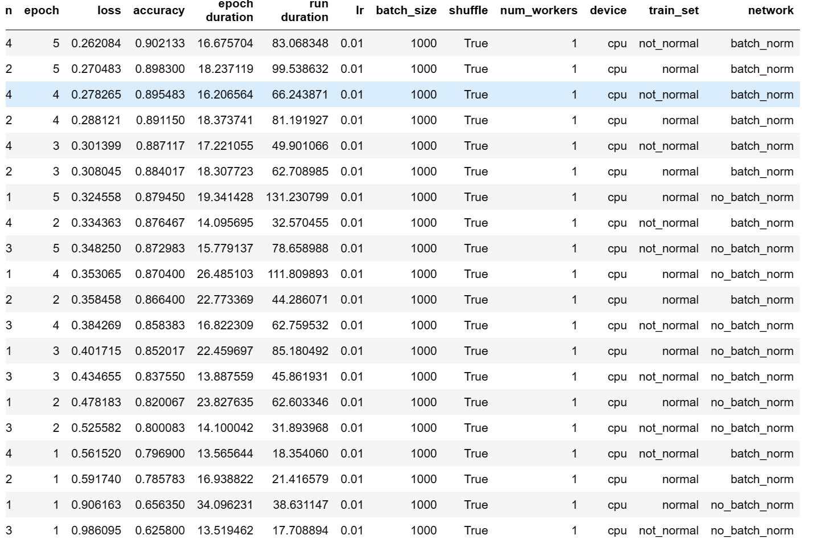

+ 可见，使用BatchNorm的网络比不用BatchNorm的网络效果好的多
+ 而对训练集使用归一化后，训练效果也能少量提升

### Training Multiple Networks

#### 重置网络的参数

##### 方法1

+ 先将整个网络保存，需要重置时在导入进来
+ 优点：可以保存任意时刻的网络，即可以回到训练过程中的任意时刻（前提是已经保存）

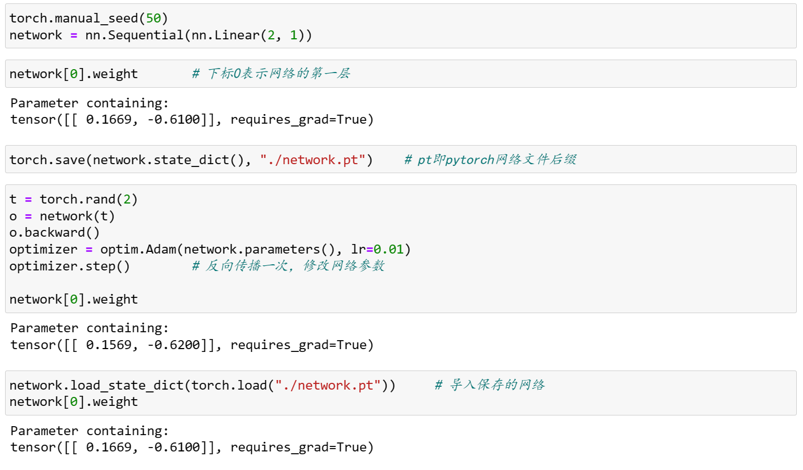


##### 方法2

+ 手动设置随机数种子，需要重置时直接重新创建网络
+ 优点：简单方便

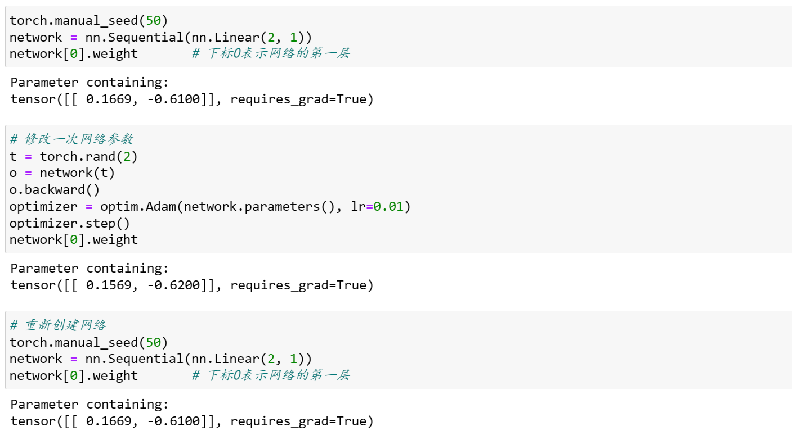


#### 一次训练多个网络

+ 注意点：每个run循环必须要重置当前网络的参数，否则会出现问题
+ 解决办法：在循环外部设置一个初始化所有网络的函数，每次训练都**按网络名称**重新创建一个网络

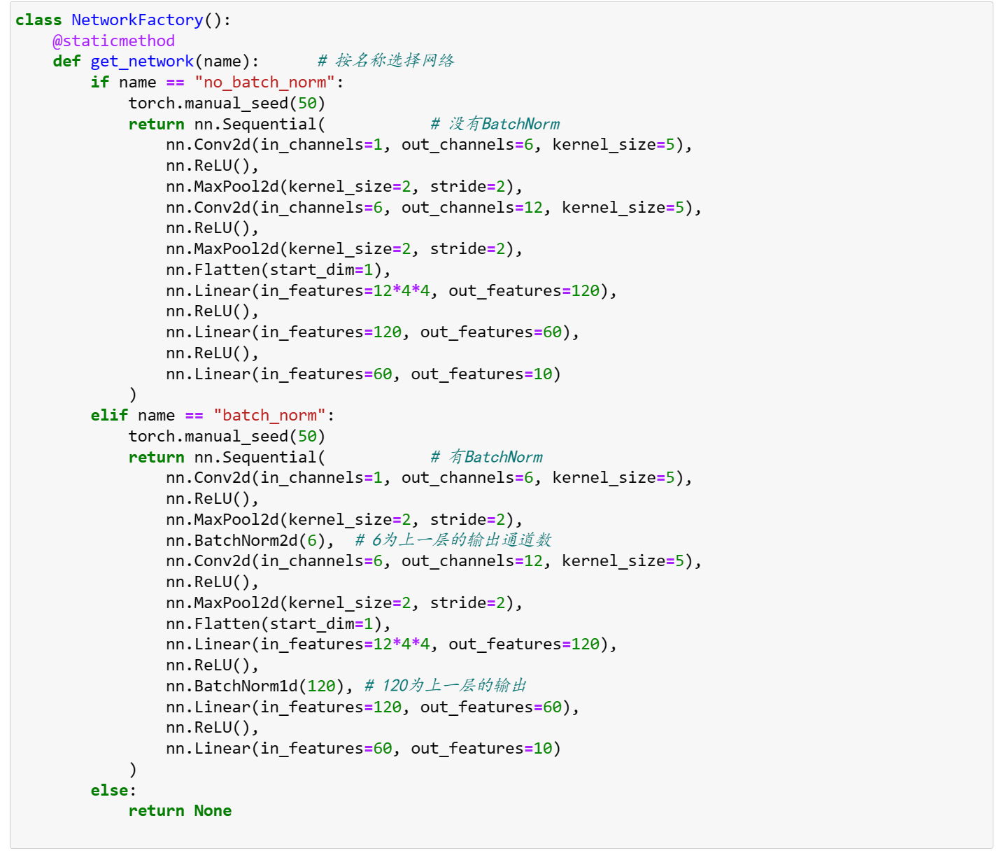

+ 不再用字典选择网络，直接在训练循环中调用`NetworkFactory.get_network()`


### 最终训练框架

```python
import torch
import torch.nn as nn
import torch.nn.functional as F
import torch.optim as optim
from torch.utils.data import DataLoader

import torchvision
import torchvision.transforms as transforms

torch.set_printoptions(linewidth=120)
torch.set_grad_enabled(True)

from torch.utils.tensorboard import SummaryWriter   # 用来将网络数据发送到tensorboard中

import matplotlib.pyplot as plt 
import math
import time
import pandas as pd
import json
from IPython.display import clear_output

from collections import OrderedDict
from collections import namedtuple
from itertools import product

class RunBuilder():
    @staticmethod          # 静态函数可以直接用类名调用，不需要创建类的实例
    def get_runs(params):
        Run = namedtuple("Run", params.keys())   # 用于构建带名字的元组，名字为"Run"
        
        runs = []
        for v in product(*params.values()):      # 对于所有超参数的组合
            runs.append(Run(*v))                 # 构建一个带名元组
        
        return runs
class RunManager():
    def __init__(self):
        self.epoch_count = 0
        self.epoch_loss = 0
        self.epoch_num_correct = 0
        self.epoch_start_time = None
        
        self.run_params = None
        self.run_count = 0
        self.run_data = []
        self.run_strat_time = None
        
        self.network = None
        self.loader = None
        self.tb = None       # summarywriter
        
    def begin_run(self, run, network, loader):        # 每次运行开始调用
        self.run_start_time = time.time()
        
        self.run_params = run      # run代表所有超参数的元组
        self.run_count += 1
        
        self.network = network
        self.loader = loader
        self.tb = SummaryWriter(comment=f'-{run}')    # 为本次运行起名
        
        images, labels = next(iter(self.loader))
        grid = torchvision.utils.make_grid(images)
        
        self.tb.add_image('image', grid)
        self.tb.add_graph(self.network, images)
        
    def end_run(self):           # 每次运行结束调用
        self.tb.close()
        self.epoch_count = 0     # 初始化epoch计数
        
    def begin_epoch(self):         # 每个epoch开始时
        self.epoch_start_time = time.time()  # 设置开始时间
        
        self.epoch_count += 1
        self.epoch_loss = 0
        self.epoch_num_correct = 0
        
    def end_epoch(self):
        epoch_duration = time.time() - self.epoch_start_time
        run_duration = time.time() - self.run_start_time
        
        loss = self.epoch_loss / len(self.loader.dataset)
        accuracy = self.epoch_num_correct / len(self.loader.dataset)
        
        self.tb.add_scalar('Loss', loss, self.epoch_count)
        self.tb.add_scalar('Accuracy', accuracy, self.epoch_count)
        
        for name, param in self.network.named_parameters():
            self.tb.add_histogram(name, param, self.epoch_count)
            self.tb.add_histogram(f'{name}.grad', param.grad, self.epoch_count)
            
        results = OrderedDict()            # 有序字典存放运行结果
        # 把需要的数据加入字典
        results["run"] = self.run_count
        results["epoch"] = self.epoch_count
        results["loss"] = loss
        results["accuracy"] = accuracy
        results["epoch duration"] = epoch_duration
        results["run duration"] = run_duration
        for k, v in self.run_params._asdict().items(): # 对于本次运行的所有超参数，转换成字典，并提取键值
            results[k] = v         # 加入results
            
        self.run_data.append(results)   # 加入run_data列表
        df = pd.DataFrame.from_dict(self.run_data, orient='columns')  # 利用pandas将结果格式化输出
        
        clear_output(wait=True)    # 清空Jupyter notebook当前输出
        display(df)                # 在Jupyter notebook中输出结果

    def track_loss(self, loss):
        self.epoch_loss += loss.item() * self.loader.batch_size

    def track_num_correct(self, preds, labels):
        self.epoch_num_correct += self._get_num_correct(preds, labels)
        
    @torch.no_grad()
    def _get_num_correct(self, preds, labels):
        return preds.argmax(dim=1).eq(labels).sum().item()
    
    def save(self, fileName):

        pd.DataFrame.from_dict(
            self.run_data,
            orient='columns'
        ).to_csv(f'{fileName}.csv')

        with open(f'{fileName}.json', 'w', encoding='utf-8') as f:
            json.dump(self.run_data, f, ensure_ascii=False, indent=4)
train_set = torchvision.datasets.FashionMNIST(
    root = './data/FashionMNIST',
    train=True,
    download=True,
    transform=transforms.Compose([
        transforms.ToTensor()
    ])
)
class NetworkFactory():
    @staticmethod
    def get_network(name):      # 按名称选择网络
        if name == "no_batch_norm":
            torch.manual_seed(50)
            return nn.Sequential(           # 没有BatchNorm
                nn.Conv2d(in_channels=1, out_channels=6, kernel_size=5),
                nn.ReLU(),
                nn.MaxPool2d(kernel_size=2, stride=2),
                nn.Conv2d(in_channels=6, out_channels=12, kernel_size=5),
                nn.ReLU(),
                nn.MaxPool2d(kernel_size=2, stride=2),
                nn.Flatten(start_dim=1),
                nn.Linear(in_features=12*4*4, out_features=120),
                nn.ReLU(),
                nn.Linear(in_features=120, out_features=60),
                nn.ReLU(),
                nn.Linear(in_features=60, out_features=10)
            )
        elif name == "batch_norm":
            torch.manual_seed(50)
            return nn.Sequential(           # 有BatchNorm
                nn.Conv2d(in_channels=1, out_channels=6, kernel_size=5),
                nn.ReLU(),
                nn.MaxPool2d(kernel_size=2, stride=2),
                nn.BatchNorm2d(6),  # 6为上一层的输出通道数
                nn.Conv2d(in_channels=6, out_channels=12, kernel_size=5),
                nn.ReLU(),
                nn.MaxPool2d(kernel_size=2, stride=2),
                nn.Flatten(start_dim=1),
                nn.Linear(in_features=12*4*4, out_features=120),
                nn.ReLU(),
                nn.BatchNorm1d(120), # 120为上一层的输出
                nn.Linear(in_features=120, out_features=60),
                nn.ReLU(),
                nn.Linear(in_features=60, out_features=10)
            )
        else:
            return None
params = OrderedDict(
    lr = [0.01],
    batch_size = [1000],
    shuffle=[True],
    num_workers = [1],
    device = ['cpu'],
    network = ['no_batch_norm', 'batch_norm']                 
)

m = RunManager()
for run in RunBuilder.get_runs(params):

    device = torch.device(run.device)
    # network = networks[run.network].to(device)
    network = NetworkFactory.get_network(run.network).to(device)
    loader = DataLoader(train_set, batch_size=run.batch_size, shuffle=run.shuffle, num_workers=run.num_workers)
    optimizer = optim.Adam(network.parameters(), lr = run.lr)

    m.begin_run(run, network, loader)
    for epoch in range(1):
        m.begin_epoch()
        for batch in loader:
            images, labels = batch      # get batch
            preds = network(images)     # pass batch
            loss = F.cross_entropy(preds, labels)   # caculate loss
            optimizer.zero_grad()       # zero gradients
            loss.backward()             # calculate gradients
            optimizer.step()            # update weights

            m.track_loss(loss)
            m.track_num_correct(preds, labels)
        m.end_epoch()
    m.end_run()
m.save("results")

# 将结果按准确度降序排列
pd.DataFrame.from_dict(m.run_data).sort_values('accuracy', ascending=False) 
```

