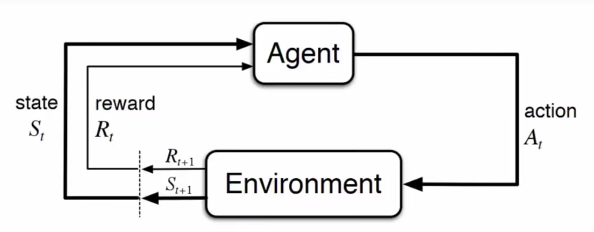

# Reinforcement Learning

### Basics

#### Markov Decision Processes(MDPs)

##### Components

+ Environment
+ Agent
+ States of the envrionment
+ Actions
+ Rewards

##### 运行过程

#### Expected return

  

#### Optimal policy 最优策略

### Q-Learning

