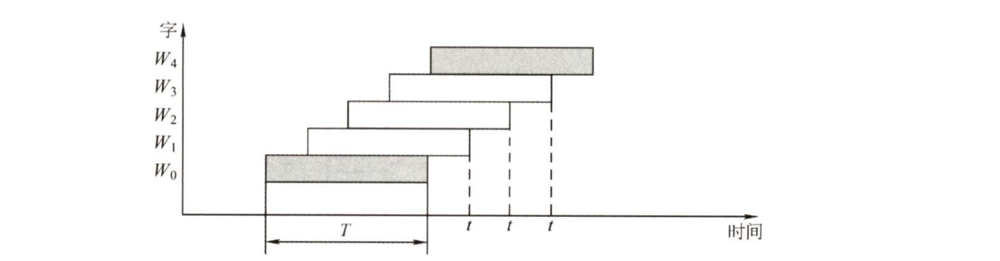

# 计组

### 定点数与浮点数

#### 浮点数不同基数的规格化规定

| 基数 | frac用原码      | frac用补码        |
| ---- | --------------- | ----------------- |
| 2    | 最高位不为0     | +：最高位不为0    |
|      |                 | -：最高位不为1    |
| 4    | 最高两位不为00  | +：最高2位不为00  |
|      |                 | -：最高2位不为11  |
| 8    | 最高三位不为000 | +：最高3位不为000 |
|      |                 | -：最高3位不为111 |

#### 溢出与舍入

+ 溢出：==只有超范围才叫溢出==
+ 舍入：由于==精度问题==才会造成舍入

1. int->float/double：浮点数范围比int大，因此**只可能舍入，不可能溢出**
2. double/float->int：浮点数精度比int大，因此**只要是小数就一定会舍入**；可能溢出
3. double->float：float范围和精度都比double小，因此**既可能舍入也可能溢出**

#### 标志位

| 标志位           | 含义                          | 判断方法               | ALU逻辑表达式   |
| ---------------- | ----------------------------- | ---------------------- | --------------- |
| CF（carry flag） | ==无符号数==加法进位/减法借位 | 加法：超范围——cf=1     | 进位输出与1异或 |
|                  |                               | 减法：==小减大==——cf=1 |                 |
| SF（sign flag）  | 符号位——对无符号数无意义      | 与最高位一致           |                 |
|                  |                               | 负为1，正为0           |                 |
| OF（overflow）   | 溢出判断——对无符号数无意义    |                        |                 |
|                  |                               |                        |                 |
| ZF（zero flag）  | 零判断                        | ZF=1：值为0            |                 |
|                  |                               | ZF=0：值不为0          |                 |

1. 不论我们如何看待，CPU执行add等指令时，就已经包含了两种含义，即有符号和无符号

2. **CF与OF的取值没有任何关系**：

   + 有符号溢出时，无符号加法可能不进位
   + 无符号加法进位时，有符号也可能不溢出

   对于减法：只要前小后大，cf就为1

### CPU部分

#### 各种字长

##### CPU的位数/机器字长

+ 指CPU进行一次整数运算所能处理的二进制数据的位数，即**数据总线的宽度**
+ **数据总线宽度=CPU总线宽度=运算器位数=通用寄存器宽度**

##### 地址总线

+ 存储单元的个数=存储容量=$2^{地址总线宽度}$

##### 存储字长

+ 一个存储单元存放的二进制比特位数
+ 字节的整数倍

##### 指令字长

+ 即一条指令的位数
+ 取决于操作码长度、操作数地址长度、操作数地址个数，**与机器字长没有联系**
+ 为了存储方便，指令字长一般取字节或**存储字长的整数倍**
  若指令字长是存储字长的2倍，则需要两次访存才能取出一条指令

#### CPU与主存交换数据

##### MAR和MDR

+ MDR:存储器数据寄存器
  MAR:存储器地址寄存器
+ **CPU与主存交换数据必须经过MAR和MDR**

##### 主存准备数据是什么意思

CPU要从主存读一个单元的数据时有三步：
例:将一个寄存器所指的主存单元内容送到另一个寄存器

1. 要读单元的地址送到MAR
2. 主存单元的数据送到MDR
3. MDR数据送到CPU某个寄存器中

+ **主存准备数据就是主存数据送到MDR的过程**，这一过程中CPU要等待主存完成读操作，
  等待完成后，MDR就能通过CPU内部总线和连接到内部总线上的元件进行数据交换

#### 执行部件和控制部件

+ 一台计算机可分为两大部分：控制部件和执行部件
+ **控制器CU就是控制部件，其他硬件全是执行部件**

#### 各种周期

##### 存取周期

+ 存取周期又称读写周期或访问周期
+ 指**存储器**进行一次完成的读写操作所需的全部时间，
  即连续两次独立访问存储器操作之间的最小间隔
+ 分为存取时间和恢复时间

##### 时钟周期

+ 时钟周期是计算机操作的**最小单位时间**
+ 由计算机主频决定，是主频的倒数

##### 机器周期

+ 机器周期也称CPU周期
+ 一个机器周期包含多个时钟周期（不固定）

##### 指令周期

+ 指CPU从主存中取出并执行一条指令的时间
+ 分为取指、间址、执行、中断四个**机器周期**

#### 寄存器的可见性

|            | 可见                                                 | 不可见                                                       |
| ---------- | ---------------------------------------------------- | ------------------------------------------------------------ |
| 汇编程序员 | ==基址寄存器==（用于实现多道程序设计或编制浮动程序） | MAR                                                          |
|            | PSWR标志寄存器/程序状态字寄存器/状态寄存器           | MDR                                                          |
|            | ==程序计数器PC==                                     | IR                                                           |
|            | 通用寄存器组                                         | 微指令寄存器                                                 |
|            |                                                      |                                                              |
| 用户       | ==PC==                                               | MAR                                                          |
|            | PSWR（标志寄存器/程序状态字寄存器）                  | MDR                                                          |
|            | 累加器ACC                                            | IR                                                           |
|            | 通用寄存器                                           | 暂存寄存器（存放从主存读来的数据） **暂存寄存器不能由通用寄存器替代** |
|            |                                                      |                                                              |

#### 单/多周期处理器

1. 单周期处理器：指一个时钟周期执行一条指令
   不能用CPU单总线结构（==CPU单总线一个周期不可能完成一条指令==）
2. 多周期处理器：指令执行过程分好几个阶段

### 异常和中断

#### 异常概念

+ 异常也称内中断
+ 异常分为故障fault、自陷trap、终止abort
+ 故障和自陷为**软件中断**，终止和外中断为**外部中断**
  1. 缺页是异常不是中断
  2. 硬件故障（即终止）是异常不是中断，中断必须是外设的**请求**
+ 软件中断是**指令执行过程中**由CPU检测到的

##### 异常的返回

1. 缺页、缺段类的异常，处理完后**返回发生故障的指令**后继续执行
2. 非法操作码、除数为0等异常，无法返回，必须终止程序
3. 自陷处理完成后返回到自陷执行的下一条指令执行。
   （当自陷指令是转移指令时，其实是返回到转移目标指令执行）

#### 中断概念

1. 来自**CPU外部，与执行指令无关的事件**引起的
2. **必须要通过请求**，才能被CPU检测到。（即CPU不能自己中断自己）
3. 中断不会阻止任何指令的完成
4. 中断处理过程不可被打断

#### 异常和中断区别

1. “缺页”或“溢出”等异常时间是特定指令执行过程中产生的；
   而中断不和任何指令相关联，也不阻止任何指令的完成。
2. 异常检测完全由CPU自身发现和识别；
   而对于中断，必须有外设的请求：CPU必须通过对外部中断请求线进行采样，并从总线上获取相应的中断源设备的标识信息，才能获知哪个设备发生了何种中断。
3. 内部异常事件大多用软件识别；外部中断源可以用软件识别或硬件识别

#### 异常处理过程

##### 1. 保护断点和程序状态

+ 将PC和PSWR送到栈或特定寄存器

##### 2. 识别异常事件并转异常处理

+ 内部异常事件大多用软件识别

+ CPU设置一个异常状态寄存器，用于记录异常原因。操作系统使用一个统一的异常查询程序，该程序
  按一定的优先级顺序查询异常状态寄存器，先查到的异常先处理

+ 像故障和陷阱之类的内部异常通常是在执行某条指令时发现的，可以通过对指令执行过程中的某些条件的判断来发现是否发生了异常，一旦发现就能立刻处理，因此内部异常事件也可以不通过专门的查询程序来识别。

+ 对于外部中断，并不能根据指令执行过程中的某些现象来判断是否发生了中断请求，因此
  只能在每条指令执行完后，取下一条指令之前去查询是否有中断请求。

#### 中断处理过程

+ 中断过程分为中断响应和中断处理。中断响应阶段由硬件实现，而中断处理阶段
  则由CPU执行**中断服务程序**来完成，所以中断处理是由软件实现的。
+ 断点：用指令无法直接读取的程序计数器PC和程序状态字寄存器PSWR等的内容
+ 现场：用户可见的工作寄存器的内容

##### 中断响应（中断隐指令）——硬件

1. 关中断
2. 保存断点
3. 中断服务程序寻址

##### 中断处理——软件

4. **进入中断服务程序后**首先要保存现场和屏蔽字
5. 开中断：允许高级中断请求得到响应
6. 执行中断服务程序：中断的目的
7. 关中断：恢复现场和屏蔽字时不能被中断
8. 恢复现场和屏蔽字
9. 开中断，中断返回

### 其他

#### 存储容量常识

1KB是$2^{10}$个字节**拼起来**组成一长串，即有单独的1024个字节，而不是用10位二进制编码出字节的$2^{10}$种取值。
因此1KB有$2^{10}\times 8$位，而不是$10+8=18$位

#### 程序数据存放位置

##### 堆

+ 存放==动态分配的存储 区==
+ 例：new 、malloc

##### 栈

+ 存放临时变量
+ 例：局部变量、函数调用实参传递值

#####正文段

+ 存放常量及代码
+ 例：全局变量、字符串

#### I/O总线上传输的数据

##### 数据线

1. 数据、指令
2. 接口和设备的**状态信息**
3. CPU对外设的**控制命令（命令字）**
4. 中断类型号

##### 地址线（单向：CPU->接口）

1. 要访问的I/O接口中寄存器的地址

##### 控制线（单向：CPU->接口）

1. 读写控制信号
2. 仲裁信号
3. 握手信号

#### I/O接口

+ 又称==设备控制器/IO适配器==
+ 因此只要出现“控制器”/“适配器”的都是IO接口

#### 程序转为可执行文件的过程

1. 预处理
2. 编译：高级语言->汇编语言
3. 汇编：汇编语言->可重定位目标文件（.obj)
4. 链接：.obj->.exe
5. ==**装入**：将可执行文件从磁盘装入到内存中==，虚拟地址重定位为物理地址

#### 存储芯片扩展后的地址问题

> 例：8K$\cross$8位扩展为32K$\cross$32位——需要字位同时扩展

1. 位扩展需要四个芯片，主存每次选中一个地址时，会将这四个芯片的8位内容同时读出，拼接成32位数据

   ==因此扩展后每个芯片的同一位置的存储单元共享同一地址！！==（即位扩展不影响每块芯片的地址范围）

2. 字扩展需要4组，每组芯片地址大小为8K（2000H）
   因此各组芯片的地址范围是：（==每组芯片的四块芯片共享同一地址==）

   + 0000H~1FFFH
   + 2000H~3FFFH
   + 4000H~5FFFH
   + 6000H~7FFFH

#### RAID

1. 只有RAID0没有冗余（RAID是把数据分散存放）
2. RAID1~RAID6均有冗余
   + RAID1是把数据在两个磁盘上重复存放——两个盘可以并行工作，==加快IO速度==

#### 低位交叉编址的存储周期计算

##### 存取周期T

+ 存取周期又称读写周期或访问周期。
+ 指存储器进行一次完整的读写操作所需的全部时间
+ 即**每个模块访问一次的时间**
+ 分为存取时间+刷新时间，==存取时间即总线传输周期r==

##### 模块数n

+ 即字方向上的芯片组个数
+ 总线周期为r，要保证流水线不间断，
  最低模块数$n=T/r$

##### 存取m次所需的时间

+ $t=T+(m-1)r$

##### 同时启动方式

+ 即超标量流水线
+ 一次同时读n个芯片，
+ **存储周期相对上述流水线方式缩短了n倍——$T=r$**
+ 总线宽度为是流水线方式的n倍（总线宽度即单位时间读写的数据量）
+ ==相当于字扩展后看成了一个芯片==（4个8位DRAM芯片同时启动时每次读32位，就相当于一个32位DRAM芯片）

#### DRAM芯片引脚计算

1. 数据引脚：即位方向上的位数
2. 地址引脚：max(行选线数，列选线数)
3. 读写引脚：读1+写1=2
4. 行列选信号引脚：行1+列1=2

例：4M$\times$8位的DRAM，

+ 数据引脚：8
+ 地址引脚：$log_2(2K)=11$

# 操作系统

### 进程部分

1. 进程调度完全由操作系统完成，无法通过系统调用完成

### 内存部分

1. 请求调页（虚拟内存分配）**完全由操作系统自动完成，不涉及系统调用**
2. 创建新进程可以通过系统调用完成，例如Linux中的fork
3. 虚拟内存最大容量是由计算机地址结构决定的，与主存和外存容量没有必然联系。
   虽然实际使用中，虚拟内存容量不超过内外存容量之和，但理论最大容量只由地址结构决定
4. 内存抖动是由于**页面置换算法不合理**引起的
5. **增大交换区对虚实地址转换速度无影响**（不管交换区有多大，访存的速度不会变化）
6. 缺页中断是**内中断/异常**，不是中断！！

##### 内部碎片与外部碎片

+ 内部碎片：指主存块分配给了进程，但进程没占满
  外部碎片：指主存块太小，无法分配给进程
+ 分页管理——==有内部，无外部==
  分页是**对主存物理空间平均划分**，所有页框（物理块）大小相同，所以不可能有无法分配给进程的物理块，
  也就是分页没有外部碎片；
  但**进程大小不一定是物理块的整数倍**，所以可能存在分到的物理块没占满的情况，也就是有内部碎片
+ 分段管理——==有外部，无内部==
  分段是先对进程分段，再根据每段大小分配等长的物理块，因此完全面向进程，分到的每一块都正好占满，
  不会有内部碎片；
  而如果进程段太大，主存没有足够的物理空间分配，就会产生外部碎片
+ 段页式管理——==有内部，无外部==
  对进程分段，每段再分页，因此归根结底还是分页，与分页管理相同

### 文件部分

1. 相对于加密保护机制，访问控制机制的安全性较差
2. 连续分配和索引分配都适合于直接存取方式，
   只有链接分配不能随机存取
3. 对文件的访问控制，由用户访问权限和文件属性共同限制
4. 建立符号链接时，count值直接复制；
   建立硬连接时，count+1

##### ==FAT支持随机访问！==

1. FAT常驻内存
2. 只要知道文件的起始块号，就能通过FAT找到该文件的所有块号，并直接访问
3. FAT称为==显式链接==分配方式，下一块的信息只存放在FAT表项中，==实际的物理块中没有下一块的链接！==
4. 注意与隐式链接区分：即链表，每个物理块存放下一块的链接，只能顺序访问

### I/O部分

1. I/O指令属于特权指令，只能在内核态下执行
   + trap指令、数据传送指令(mov)、设置断点指令都是用户态指令

#### 设备驱动程序

> 驱动程序就是OS中控制硬件的==代码==

+ ==根据设备所采用的IO控制方式的不同，设备驱动程序的实现方式不同==
+ 通过执行设备驱动程序，CPU可以向控制端口发送控制命令来启动外设，可以从状态端口
  读取状态来了解外设或设备控制器的状态，也可以从数据端口中读取数据或向数据端口发送数据等

##### 驱动程序的工作流程

1. 接收由与设备无关的IO软件发来的命令和参数，并将命令中的抽象要求转换为与设备相关的低层操作序列
2. 检查用户IO请求的合法性，了解IO设备的工作状态，传递与IO设备操作有关的参数，设置设备的工作方式
3. 发出IO命令，如果设备空闲，便立即启动IO设备，完成指定的IO操作，如果设备忙碌，则将请求者的请求块
   挂载设备队列上等待
4. 及时响应由设备控制器发来的中断请求，并根据其中断类型，调用相应的中断处理程序进行处理

# 计网

#### 协议

##### 常用协议熟知端口号

| 协议  | 端口号 | 备注 |
| ----- | ------ | ---- |
| RIP   | 520    | UDP  |
| DNS   | 53     | UDP  |
| TFTP  | 69     | UDP  |
| SNMP  | 161    | UDP  |
| DHCP  | 67/68  | UDP  |
|       |        |      |
| SMTP  | 25     | TCP  |
| FTP   | 21/20  | TCP  |
| BGP   | 179    | TCP  |
| HTTP  | 80     | TCP  |
| HTTPS | 443    | TCP  |

+ 上述端口号用来标志某协议**服务器上的进程**，即客户端数据报首部中的**目的端口号**
+ 不管传输层用TCP还是UDP，网络层都要用IP封装成IP数据报
+ IP数据报首部中用协议字段区分是TCP还是UDP数据报（UDP:17, TCP:6)

、

##### 应用层对应传输层

#### 分组交换时延计算题

#### 各种报文数据格式

##### 以太网MAC帧

##### IPv4

##### IPv6

##### IPv4和IPv6对比

##### UDP和TCP

#### SDN

##### openflow流表

#### 数据报与虚电路

#### 三次握手和四次挥手图

##### 三次握手

##### 四次挥手

#### DHCP工作过程

#### TCP拥塞控制

##### ssthresh变化图

##### 流程图

+ 收到3个重复ACK：说明要执行快重传+快恢复
+ 超时重传：说明要重新进行慢开始并启动拥塞避免

#### 网络体系结构

##### 各层解决的问题

##### 实体

##### 协议

##### 服务

#### 做题笔记

##### MTU是总长度还是数据载荷长度？

+ Maximum Transmission Unit
+ MTU指==数据链路层帧的数据载荷==长度最大值
+ 而==数据链路层帧的数据载荷就是IP数据报的总长度==
+ 因此MTU描述的是帧的数据部分即IP数据报的总长度

# 模拟题知识点汇总

#### 第一套

1. 全相联映射没有行号，地址结构只有offset和tag
2. 运算类的零地址指令仅用在堆栈类计算机中，两个操作数来自栈顶和次栈顶
3. 空操作指令的指令周期中任何寄存器内容都不改变？——错，PC会变
4. 资源分配图简化：逐个删掉资源足够分配的**进程**，而不是删掉资源
5. 驱动程序不能独立控制IO设备进行IO操作

##### 驱动程序的功能：

1. 将收到的抽象请求转换为具体要求
2. 检查IO合法性，了解IO设备状态，传递有关参数，设置设备的工作方式
3. 发出IO命令，启动IO设备，完成IO操作
4. 响应通道发来的中断请求，根据中断类型调用相应的中断处理程序
5. 构造通道程序

#### 第二套

1. 位扩展后，位方向的所有芯片共享存储地址
2. RAID磁盘阵列不能减少数据冗余（只会增加不会减少）

#### 第三套

1. 散列表平均查找长度**只与装填因子$\alpha$有关**，与表长和表中记录数没有直接关联
2. 考察建堆过程，注意题目问的是比较次数还是交换次数
3. 最简单的浮点数舍入方法是直接截断，不做其他任何处理
4. IEEE754浮点数乘法运算一定不需要左规（左规是因为结果<1，但尾数永远>1，两个大于1的数乘起来不可能<1）
5. 浮点数溢出会进入中断（只有右规后溢出才算溢出）
6. DRAM易失，SRAM非易失；
   DRAM比SRAM功耗低
7. 直接存取存储器（磁盘）既不向RAM那样可以随机访问任何一个单元，又不像顺序存储器（磁带）那样完全顺序存取，
   而是介于两者之间：先找到整个存储器的某个小区域（如磁道），再在小区域中顺序查找。
   因此==直接存取不完全等于随机存取==
8. 实现"按名存取"是文件管理的功能，而不是设备管理功能

#### 第五套

1. 整机的速度是由多个指标综合决定的，某个指标的高低（CPU主频、MIPS）并不能完全决定机器的速度

2. 不同程序在同一台计算机上测得的CPI可能不同（不同程序中各类指令的占比可能不同）

3. 观测到用户程序的执行时间可能要大于其真正的CPU执行时间（用户程序执行过程中可能会调度其他程序）

4. 浮点数的符号位是尾数的符号位，而不是阶码的符号位
   阶码是指数，阶码的正负只能决定浮点数与1的大小关系

5. 乘出运算时，阶码只进行加减操作

6. CD-ROM不是ROM，是光盘存储器，与ROM有本质区别

7. Flash存储器虽然能随机存取，但原理上仍是ROM

8. cache完全由硬件实现，不涉及软件端；
   而虚拟存储器是由硬件和OS（软）共同完成

9. 虚存大小要同时满足两个条件：

   1. 虚存==实际==容量$\le$内外容量之和
   2. 虚存==最大==容量$\le$地址位数决定的最大容量

   实际容量为上述两个条件的交集

10. 获取指令操作数的快慢主要取决于寻址方式的访存次数（寄存器速度很快，可忽略）

11. 颜色深度（每个像素的位数）=$log_2(颜色数)$

12. 对时钟的操作必须加以保护，否则用户可以修改时间片，使得永久占用CPU；
    而读取OS内核的数据和指令时静态操作，无须加以保护

13. 父进程与子进程仍是两个不同的进程，具有独立性，撤销一个不一定会导致另一个也撤销

14. 父进程撤销后子进程有两种状态：

    1. 子进程一并被终止
    2. 子进程称为孤儿进程，被init进程领养

15. 进程是==资源分配==的基本单位；线程是==调度==的基本单位

16. 通道是一种==硬件==，或特殊的==处理器==，有其自身的指令；
    通道没有自己的内存，通道指令存放在主存中，也就是说==通道与CPU共享内存==；
    来自通道的IO中断属于输入/输出问题，应该有设备管理（即IO管理）负责

#### 第六套

1. 处理器的位数指CPU能一次处理的数据长度，称为机器字长。==机器字长通常等于通用寄存器的长度==。
2. 64位操作系统不仅是寻址范围增加到$2^{64}$，同时要求机器字长64位
3. 地址总线宽度虽然一般情况下也会和CPU的位数挂钩，但这也不一定，一切机器可以把字长设小，分几个周期传一个地址

##### 操作系统位数与CPU位数

+ 32位操作系统指该操作系统==最多可以访问==$2^{32}$个地址，是一个软件的概念
+ 32位处理器指==一次可以处理==32位数据，是硬件的概念
+ 低位数CPU不能运行高位数的操作系统，而高位数CPU可以运行低位数操作系统
  （例如现在CPU都是64位的，但win7有32位版本）

4. 只有数值超范围才叫溢出；舍入是由于==精度问题==造成的

5. 基址寄存器的内容由操作系统或管理程序确定，在执行过程中其内容不变；
   而变址寄存器的内容由用户确定，在执行过程中内容可变

6. 互斥微命令编码时要预留一个字段表示不输出，因此互斥微命令个数为8时，需要4位才能表示

7. CPU不忙，交换空间也不满，只有硬盘IO非常忙时：**只可能出现了抖动现象**

8. 抖动现象的解决，加大交换空间容量并不能有效解决问题，因为出现抖动的==根本原因是内存不足==，

   只有增大内存或减少内存中的进程数，才能解决问题。换个更快的硬盘也只能表面上缓和，并不能解决。

#### 第七套

1. 只有浮点数发生**上溢**时，机器才会终止运算操作，进行中断处理
2. 机器零不是真的零，而是小于可以表示的最小数，只是趋近于0
3. ==虚拟存储技术降低了计算机速度==，是用时间换空间的做法
   (虚拟技术是为了解决多道程序并行条件下内存不足而限制了程序最多运行的道数提出的，即是为了解决内存不足，
   虚拟技术进行虚实地址转换，需要多次访存，因此增加延迟，降低计算机速度)
4. 连续两次读操作所需的最小时间间隔是存取周期，而不是存取时间
5. DMA是纯硬件，而程序中断方式和通道方式是软硬件结合（执行通道程序）
6. ==中断服务程序的最后一条指令是中断返回指令，而不是转移指令==
7. 作业优先级与作业长短或系统资源要求的多少没有必然联系，只与作业类型有关
8. ==只有虚拟存储系统才存在抖动现象==（因为只有虚拟存储系统才有换入换出操作）
9. 并行技术主要是为了提高整机的运行效率和吞吐率；
   通道技术是为了**减少CPU对IO操作的控制**，提高CPU的吞吐率
   缓冲技术是为了解决CPU和外设的速度不匹配
   虚存技术是为了解决存储系统的容量问题

#### 第八套

1. 如果线性表既要快速查找又经常动态变化，则可采用**分块查找**
   （块内无序，块间有序，在块内插入删除很容易，**不需要移动**）
2. 指令字长通常取存储字长的==整数倍==，几倍就需要几次访存；
3. 存储字长与机器字长没有必然联系，因此不能确定取指周期和机器周期的关系
4. 数据高速缓存是专门存放数据的cache，不属于运算器

##### 运算器与控制器的组成

运算器：

1. 算术逻辑单元
2. 暂存寄存器T
3. 累加器Acc
4. 通用寄存器组
5. 程序状态字寄存器PSWR
6. 移位器

控制器：

1. 指令部件
   1. PC
   2. IR
   3. 指令译码器ID
2. 时序部件
3. 微操作信号发生器（控制单元CU）
4. 中断控制逻辑

5. 运行态到阻塞态是由进程主动决定的
6. 从阻塞态到就绪态的转换是由协作进程决定的
7. 就绪->阻塞不可能发生
8. 页式存储方式不可采用静态重定位
   静态重定位是在程序运行之前由装入程序完成的，页式存储是不连续的，而且运行过程中
   可能改变程序位置，因此需要动态重定位的支持
9. 虚拟内存系统不可能发生内存溢出（内存不足）的现象
10. ==逻辑记录==是文件中按信息在逻辑上的独立含义来划分的信息单位，它是**对文件进行存取操作的基本单位**