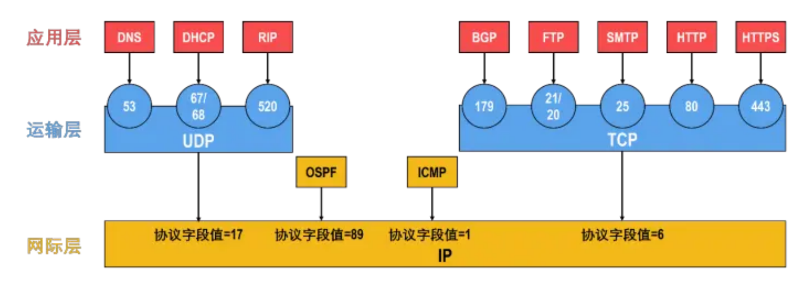

# 计组

#### 存储容量常识

1KB是$2^{10}$个字节**拼起来**组成一长串，即有单独的1024个字节，而不是用10位二进制编码出字节的$2^{10}$种取值。
因此1KB有$2^{10}\times 8$位，而不是$10+8=18$位

### CPU部分

#### 各种字长

##### CPU的位数/机器字长

+ 指CPU进行一次整数运算所能处理的二进制数据的位数，即**数据总线的宽度**
+ **数据总线宽度=CPU总线宽度=运算器位数=通用寄存器宽度**

##### 地址总线

+ 存储单元的个数=存储容量=$2^{地址总线宽度}$

##### 存储字长

+ 一个存储单元存放的二进制比特位数
+ 字节的整数倍

##### 指令字长

+ 即一条指令的位数
+ 取决于操作码长度、操作数地址长度、操作数地址个数，**与机器字长没有联系**
+ 为了存储方便，指令字长一般取字节或**存储字长的整数倍**
  若指令字长是存储字长的2倍，则需要两次访存才能取出一条指令

#### CPU与主存交换数据

##### MAR和MDR

+ MDR:存储器数据寄存器
  MAR:存储器地址寄存器
+ **CPU与主存交换数据必须经过MAR和MDR**

##### 主存准备数据是什么意思

CPU要从主存读一个单元的数据时有三步：
例:将一个寄存器所指的主存单元内容送到另一个寄存器

1. 要读单元的地址送到MAR
2. 主存单元的数据送到MDR
3. MDR数据送到CPU某个寄存器中

+ **主存准备数据就是主存数据送到MDR的过程**，这一过程中CPU要等待主存完成读操作，
  等待完成后，MDR就能通过CPU内部总线和连接到内部总线上的元件进行数据交换

#### 执行部件和控制部件

+ 一台计算机可分为两大部分：控制部件和执行部件
+ **控制器CU就是控制部件，其他硬件全是执行部件**

#### 各种周期

##### 存取周期

+ 存取周期又称读写周期或访问周期
+ 指**存储器**进行一次完成的读写操作所需的全部时间，
  即连续两次独立访问存储器操作之间的最小间隔
+ 分为存取时间和恢复时间

##### 时钟周期

+ 时钟周期是计算机操作的**最小单位时间**
+ 由计算机主频决定，是主频的倒数

##### 机器周期

+ 机器周期也称CPU周期
+ 一个机器周期包含多个时钟周期（不固定）

##### 指令周期

+ 指CPU从主存中取出并执行一条指令的时间
+ 分为取指、间址、执行、中断四个**机器周期**

#### 寄存器的可见性

|            | 可见                                                 | 不可见                                                       |
| ---------- | ---------------------------------------------------- | ------------------------------------------------------------ |
| 汇编程序员 | ==基址寄存器==（用于实现多道程序设计或编制浮动程序） | MAR                                                          |
|            | PSWR标志寄存器/程序状态字寄存器/状态寄存器           | MDR                                                          |
|            | ==程序计数器PC==                                     | IR                                                           |
|            | 通用寄存器组                                         | 微指令寄存器                                                 |
|            |                                                      |                                                              |
| 用户       | ==PC==                                               | MAR                                                          |
|            | PSWR（标志寄存器/程序状态字寄存器）                  | MDR                                                          |
|            | 累加器ACC                                            | IR                                                           |
|            | 通用寄存器                                           | 暂存寄存器（存放从主存读来的数据） **暂存寄存器不能由通用寄存器替代** |
|            |                                                      |                                                              |

#### 单/多周期处理器

1. 单周期处理器：指一个时钟周期执行一条指令
   不能用CPU单总线结构（==CPU单总线一个周期不可能完成一条指令==）
2. 多周期处理器：指令执行过程分好几个阶段

### 异常和中断

#### 异常概念

+ 异常也称内中断
+ 异常分为故障fault、自陷trap、终止abort
+ 故障和自陷为**软件中断**，终止和外中断为**外部中断**
  1. 缺页是异常不是中断
  2. 硬件故障（即终止）是异常不是中断，中断必须是外设的**请求**
+ 软件中断是**指令执行过程中**由CPU检测到的

##### 异常的返回

1. 缺页、缺段类的异常，处理完后**返回发生故障的指令**后继续执行
2. 非法操作码、除数为0等异常，无法返回，必须终止程序
3. 自陷处理完成后返回到自陷执行的下一条指令执行。
   （当自陷指令是转移指令时，其实是返回到转移目标指令执行）

#### 中断概念

1. 来自**CPU外部，与执行指令无关的事件**引起的
2. **必须要通过请求**，才能被CPU检测到。（即CPU不能自己中断自己）
3. 中断不会阻止任何指令的完成
4. 中断处理过程不可被打断

#### 异常和中断区别

1. “缺页”或“溢出”等异常时间是特定指令执行过程中产生的；
   而中断不和任何指令相关联，也不阻止任何指令的完成。
2. 异常检测完全由CPU自身发现和识别；
   而对于中断，必须有外设的请求：CPU必须通过对外部中断请求线进行采样，并从总线上获取相应的中断源设备的标识信息，才能获知哪个设备发生了何种中断。
3. 内部异常事件大多用软件识别；外部中断源可以用软件识别或硬件识别

#### 异常处理过程

##### 1. 保护断点和程序状态

+ 将PC和PSWR送到栈或特定寄存器

##### 2. 识别异常事件并转异常处理

+ 内部异常事件大多用软件识别

+ CPU设置一个异常状态寄存器，用于记录异常原因。操作系统使用一个统一的异常查询程序，该程序
  按一定的优先级顺序查询异常状态寄存器，先查到的异常先处理

+ 像故障和陷阱之类的内部异常通常是在执行某条指令时发现的，可以通过对指令执行过程中的某些条件的判断来发现是否发生了异常，一旦发现就能立刻处理，因此内部异常事件也可以不通过专门的查询程序来识别。

+ 对于外部中断，并不能根据指令执行过程中的某些现象来判断是否发生了中断请求，因此
  只能在每条指令执行完后，取下一条指令之前去查询是否有中断请求。

#### 中断处理过程

+ 中断过程分为中断响应和中断处理。中断响应阶段由硬件实现，而中断处理阶段
  则由CPU执行**中断服务程序**来完成，所以中断处理是由软件实现的。
+ 断点：用指令无法直接读取的程序计数器PC和程序状态字寄存器PSWR等的内容
+ 现场：用户可见的工作寄存器的内容

##### 中断响应（中断隐指令）——硬件

1. 关中断
2. 保存断点
3. 中断服务程序寻址

##### 中断处理——软件

4. **进入中断服务程序后**首先要保存现场和屏蔽字
5. 开中断：允许高级中断请求得到响应
6. 执行中断服务程序：中断的目的
7. 关中断：恢复现场和屏蔽字时不能被中断
8. 恢复现场和屏蔽字
9. 开中断，中断返回

### 其他

#### 程序数据存放位置

##### 堆

+ 存放==动态分配的存储 区==
+ 例：new 、malloc

##### 栈

+ 存放临时变量
+ 例：局部变量、函数调用实参传递值

#####正文段

+ 存放常量及代码
+ 例：全局变量、字符串

#### I/O总线上传输的数据

##### 数据线

1. 数据、指令
2. 接口和设备的**状态信息**
3. CPU对外设的**控制命令（命令字）**
4. 中断类型号

##### 地址线（单向：CPU->接口）

1. 要访问的I/O接口中寄存器的地址

##### 控制线（单向：CPU->接口）

1. 读写控制信号
2. 仲裁信号
3. 握手信号

#### I/O接口

+ 又称==设备控制器/IO适配器==
+ 因此只要出现“控制器”/“适配器”的都是IO接口

#### 存储芯片扩展后的地址问题

> 例：8K$\cross$8位扩展为32K$\cross$32位——需要字位同时扩展

1. 位扩展需要四个芯片，主存每次选中一个地址时，会将这四个芯片的8位内容同时读出，拼接成32位数据

   ==因此扩展后每个芯片的同一位置的存储单元共享同一地址！！==（即位扩展不影响每块芯片的地址范围）

2. 字扩展需要4组，每组芯片地址大小为8K（2000H）
   因此各组芯片的地址范围是：（==每组芯片的四块芯片共享同一地址==）

   + 0000H~1FFFH
   + 2000H~3FFFH
   + 4000H~5FFFH
   + 6000H~7FFFH

#### RAID

1. 只有RAID0没有冗余（RAID是把数据分散存放）
2. RAID1~RAID6均有冗余
   + RAID1是把数据在两个磁盘上重复存放——两个盘可以并行工作，==加快IO速度==

# 操作系统

### 进程部分

1. 进程调度完全由操作系统完成，无法通过系统调用完成

### 内存部分

1. 请求调页（虚拟内存分配）**完全由操作系统自动完成，不涉及系统调用**
2. 创建新进程可以通过系统调用完成，例如Linux中的fork
3. 虚拟内存最大容量是由计算机地址结构决定的，与主存和外存容量没有必然联系。
   虽然实际使用中，虚拟内存容量不超过内外存容量之和，但理论最大容量只由地址结构决定
4. 内存抖动是由于**页面置换算法不合理**引起的
5. **增大交换区对虚实地址转换速度无影响**（不管交换区有多大，访存的速度不会变化）
6. 缺页中断是**内中断/异常**，不是中断！！

##### 内部碎片与外部碎片

+ 内部碎片：指主存块分配给了进程，但进程没占满
  外部碎片：指主存块太小，无法分配给进程
+ 分页管理——==有内部，无外部==
  分页是**对主存物理空间平均划分**，所有页框（物理块）大小相同，所以不可能有无法分配给进程的物理块，
  也就是分页没有外部碎片；
  但**进程大小不一定是物理块的整数倍**，所以可能存在分到的物理块没占满的情况，也就是由内部碎片
+ 分段管理——==有外部，无内部==
  分段是先对进程分段，再根据每段大小分配等长的物理块，因此完全面向进程，分到的每一块都正好占满，
  不会有内部碎片；
  而如果进程段太大，主存没有足够的物理空间分配，就会产生外部碎片
+ 段页式管理——==有内部，无外部==
  对进程分段，每段再分页，因此归根结底还是分页，与分页管理相同

### 文件部分

1. 相对于加密保护机制，访问控制机制的安全性较差
2. 连续分配和索引分配都适合于直接存取方式，
   只有链接分配不能随机存取
3. 对文件的访问控制，由用户访问权限和文件属性共同限制
4. 建立符号链接时，count值直接复制；
   建立硬连接时，count+1

##### ==FAT支持随机访问！==

1. FAT常驻内存
2. 只要知道文件的起始块号，就能通过FAT找到该文件的所有块号，并直接访问
3. FAT称为==显式链接==分配方式，下一块的信息只存放在FAT表项中，==实际的物理块中没有下一块的链接！==
4. 注意与隐式链接区分：即链表，每个物理块存放下一块的链接，只能顺序访问

### I/O部分

1. I/O指令属于特权指令，只能在内核态下执行
   + trap指令、数据传送指令(mov)、设置断点指令都是用户态指令

#### 设备驱动程序

> 驱动程序就是OS中控制硬件的==代码==

+ ==根据设备所采用的IO控制方式的不同，设备驱动程序的实现方式不同==
+ 通过执行设备驱动程序，CPU可以向控制端口发送控制命令来启动外设，可以从状态端口
  读取状态来了解外设或设备控制器的状态，也可以从数据端口中读取数据或向数据端口发送数据等

##### 驱动程序的工作流程

1. 接收由与设备无关的IO软件发来的命令和参数，并将命令中的抽象要求转换为与设备相关的低层操作序列
2. 检查用户IO请求的合法性，了解IO设备的工作状态，传递与IO设备操作有关的参数，设置设备的工作方式
3. 发出IO命令，如果设备空闲，便立即启动IO设备，完成指定的IO操作，如果设备忙碌，则将请求者的请求块
   挂载设备队列上等待
4. 及时响应由设备控制器发来的中断请求，并根据其中断类型，调用相应的中断处理程序进行处理

# 计网

#### 协议

##### 常用协议熟知端口号

| 协议  | 端口号 | 备注 |
| ----- | ------ | ---- |
| RIP   | 520    | UDP  |
| DNS   | 53     | UDP  |
| TFTP  | 69     | UDP  |
| SNMP  | 161    | UDP  |
| DHCP  | 67/68  | UDP  |
|       |        |      |
| SMTP  | 25     | TCP  |
| FTP   | 21/20  | TCP  |
| BGP   | 179    | TCP  |
| HTTP  | 80     | TCP  |
| HTTPS | 443    | TCP  |

+ 上述端口号用来标志某协议**服务器上的进程**，即客户端数据报首部中的**目的端口号**
+ 不管传输层用TCP还是UDP，网络层都要用IP封装成IP数据报
+ IP数据报首部中用协议字段区分是TCP还是UDP数据报（UDP:17, TCP:6)

、

##### 应用层对应传输层

#### 分组交换时延计算题

#### 各种报文数据格式

##### 以太网MAC帧

##### IPv4

##### IPv6

##### IPv4和IPv6对比

##### UDP和TCP

#### SDN

##### openflow流表

#### 数据报与虚电路

#### 三次握手和四次挥手图

##### 三次握手

##### 四次挥手

#### DHCP工作过程

#### TCP拥塞控制

##### ssthresh变化图

##### 流程图

+ 收到3个重复ACK：说明要执行快重传+快恢复
+ 超时重传：说明要重新进行慢开始并启动拥塞避免

#### 网络体系结构

##### 各层解决的问题

##### 实体

##### 协议

##### 服务

#### 做题笔记

##### MTU是总长度还是数据载荷长度？

+ Maximum Transmission Unit
+ MTU指==数据链路层帧的数据载荷==长度最大值
+ 而==数据链路层帧的数据载荷就是IP数据报的总长度==
+ 因此MTU描述的是帧的数据部分即IP数据报的总长度
