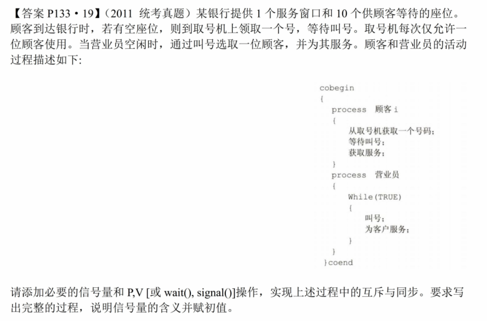

### 理发师问题

#### 理发师


##### 分析

1. 理发师先检查有无顾客，有就理发（**运行**），没有就睡觉（**阻塞**）——**需要一个信号量：顾客**
2. 顾客先检查有无空椅子，没有就离开，有就继续检查理发师在不在理发，
   理发师不在理发就叫醒理发师，在理发就等待——**判断理发师在不在忙用一个同步信号量表示**
3. ==判断是否有空椅子不要用信号量，直接用整型变量判断即可，否则会极其复杂==
   ——int变量waiting记录等待的顾客数

+ ==关键在于将理发师休息和顾客等待这两个事件看做进程的阻塞态==


##### 通用模板

+ int变量num表示等待服务的顾客数，并用互斥信号量mutex保证对num的互斥访问
+ 同步信号量barber用于实现“若没有顾客，服务人员休息”——==休息即为阻塞==
+ 同步信号量customer用于实现“若服务人员在忙，顾客等待”——等待即阻塞

```C++
int num = 0;
semaphore mutex = 1;
semaphore barber = 0, customer = 0;
	// 默认理发师在休息，因此barber初值为0，必须等来了顾客唤醒后才可以理发
Barber() {
    while(1) {
        P(mutex);		// 对num上锁
        if(num > 0) {	// 有顾客
            num--;			// 等待顾客数-1
        	V(mutex);		// 访问完num就解锁
            V(customer);	// 唤醒一个顾客
            理发
        }else {			// 没有顾客
            V(mutex);		// 解锁num
            P(barber);		// 自己阻塞自己，即休息
            // 此处barber一定等于0, 因为barber和num是同增同减的
        }
    }
}

Customer() {
    while(1) {
        P(mutex);		
        if(num < 等待人数上限) {
        	num++;
            V(mutex);		// 访问完num就解锁
            V(barber);		// 唤醒理发师
            P(customer);	// 第一个顾客唤醒理发师后，理发师发现有顾客，
			// 就会给第一个顾客理发，此时再P就可将等待的顾客数清零
			// 而若理发师在忙，此处P后就能将自己阻塞，等待理发师理完发后唤醒
            被理发
        }else {
            V(mutex);
            离开
        }
    }
}
```

+ 不用管多次`V(barber)`的操作，不影响程序正确性


#### 面包师


##### 分析

1. 销售员需要一个顾客才能工作，即消耗一个信号量customer
2. 顾客需要一个空闲销售员才能买面包，即消耗一个信号量salesmen

##### 代码

```C++
semaphore customer = 0, salesmen = 0;

Customer() {
    进店;
    取号;
    V(customer);	// 提供一个顾客资源，即唤醒一个销售员
    等待被叫号;
    P(salesmen);	// 消耗一个销售员
    买面包;
}

Salesman() {
    while(1) {
        P(customer);	// 消耗一个顾客资源
        叫号;
        V(salesmen);	// 提供一个销售员资源，使得顾客可以被服务;
        卖面包;
    }
}
```


#### 银行



##### 分析

1. 顾客到银行，先看是否有空座位，有座位就去取号，即需要一个信号量seat表示空座位
2. 题目要求取号一次只能一个人取，因此要互斥信号量mutex
3. 银行有顾客时，营业员才能叫号，即需要一个信号量customer表示顾客数
4. 营业员叫号后，顾客离开座位被服务，此时应该释放一个空座位资源
5. 若营业员再忙，顾客应该等待，即需要一个信号量attendant表示营业员——由顾客申请，营业员释放

```C++
semaphore seat = 10, mutex = 1;
semaphore customer = 0;
semaphore attendant = 0;	// 初值为0是为了保证必须先由营业员叫号，顾客才能被服务

Customer() {
    P(seat);	// 检查是否有座位，没有就阻塞
    P(mutex);
    从取号机上取号;
    V(mutex);
    V(customer);	// 提供顾客资源，唤醒营业员
    等待叫号;
    P(attendant);	// 检查营业员是否空闲，不空闲就阻塞，等待叫号
    接受服务;
}

Attendant() {
    while(1) {
        P(customer);	// 检查是否有顾客, 没有就阻塞
        叫号;
        V(seat);	// 叫号后应该释放一个座位
        V(attendant);	// 释放营业员资源，表示可以服务
        为客户服务;
        
    }
}
```


### 读者-写者问题——同类不互斥、异类互斥

#### 车过桥


##### 分析

第一问：最简单的互斥问题

第二问：读者-读者问题（同类不互斥，只有异类互斥）

1. 利用count变量实现多辆同向车同时过桥
   第一辆车上锁，最后一辆车解锁
2. 对count的访问需要互斥进行
3. 两类读者各需要一个count（只锁同类，不锁异类）
3. ==如果第一辆车在`P(bridge)`处被阻塞，同方向的所有后续车都会在`P(mutex)`处被阻塞==

##### 代码

(1)

```C++
semaphore bridge = 1;

up() {
    while() {
        P(bridge);
        过桥;
        V(bridge);
    }

}

down() {
    while() {
        P(bridge);
        过桥;
        V(bridge);
    }
}
```

(2)

```c++
semaphore bridge = 1, mutex1 = 1, mutex2 = 1;
int count1 = 0, count2 = 0;
up() {
    while(1) {
        P(mutex1);	// 互斥访问count
        if(count1 == 0) {	// 同方向只有第一辆要P
   			P(bridge);		// 申请占用桥
        }
        count1++;
        V(mutex1);
        
        过桥;
        
        P(mutex1);
        if(--count1 == 0) {	// 同方向最后一辆
            V(bridge);
        }
        V(mutex1);
        
    }
}

down() {
    while(1) {
        P(mutex2);	// 互斥访问count
        if(count2 == 0) {	// 同方向只有第一辆要P
   			P(bridge);
        }
        count2++;
        V(mutex2);
        
        过桥;
        
        P(mutex2);
        if(--count == 0) {	// 同方向最后一辆
            V(bridge);
        }
        V(mutex2);
    }
}
```


#### 录像厅


##### 分析

+ 相当于过桥问题多了一个进程，本质一模一样
+ 用cnt1、cnt2、cnt3记录三种观众人数，三个mutex用于互斥访问
+ 用room信号量表示对录像厅的占用，每类观众的第一个申请room，最后一个归还room
+ 若录像厅有人，则其他两类观众的第一个在`P(room)`处被阻塞，而所有后续观众都会在`P(mutex)`处被阻塞。


##### 代码

```C++
int cnt1 = 0, cnt2 = 0, cnt3 = 0;
semaphore mutex1 = mutex2 = mutex3 = 1;
semaphore room = 1;

Pi() {		// i = 1、2、3
	P(mutexi);
    if(cnti == 0) {		// 第一个观众
        P(room);		// 申请room资源
    }
    cnti++;				// 人数+1
    V(mutexi);
    
    看片;
    
    P(mutexi);
    if(--cnti == 0) {	// 最后一个观众
        V(room);		// 归还room资源
    }
    V(mutexi);
}

```


### 哲学家进餐

> 所有进程都属于同一类，且每个进程需要多种资源才能运行
> 即解决死锁

##### 两种实用做法：

1. 限制并行进程数量
2. 条件全部满足才允许申请资源——破坏请求并保持


##### 暴力模板

1. 第二种做法：条件全满足才能申请资源
2. 只设置一个mutex，步骤：P(mutex)->判断是否条件满足->V(mutex)
3. ==资源全部用int变量==，既可以保证不死锁，又能用高级语言直接判断

```c++
semaphore lock = 1;

Process() {
    while(1) {	// 循环检查资源
        P(lock);
        if(所有资源都满足) {
            //修改int变量;
            取走资源;
            V(lock);
            break;	// 取一次就结束（是否只做一次要看题目情况）
        }else V(lock);	// 资源不足就解锁，继续循环
    }
    哲学家进餐;
    P(lock);
    归还所有资源;
    // 修改int变量;
    V(lock);
}
```

