# 第一章计算机系统概述


# 第二章 进程与线程

## 一、进程与线程

### 进程

#### 1. 进程概念

##### 进程是进程实体的==运行过程==，是系统进行==资源分配==和==调度==的一个独立单位

##### PCB（Process Control Block)

+ **PCB是进程存在的唯一标志**
+ 进程描述信息：PID、UID
+ 进程控制和管理信息：进程状态、优先级、...
+ 资源分配清单
+ 处理机相关信息

##### 程序段和数据段

+ 程序段：程序代码（指令序列）
+ 数据段：运行过程中产生的各种数据（如定义的变量）

##### 程序段、数据段、PCB三部分组成了进程实体/进程映像

+ PCB是给操作系统用的
+ 程序段、数据段是给进程自己用的，与进程滋生的运行逻辑有关


#### 2. 进程特征

##### 动态性

+ 最重要最基本
+ 进程与程序的根本区别

##### 并发性

##### 独立性

##### 异步性

+ 进程按各自独立的、不可预知的速度向前推进
+ 进程同步机制：解决异步问题

##### 结构性

+ 每个进程都有PCB


#### 3. 进程状态

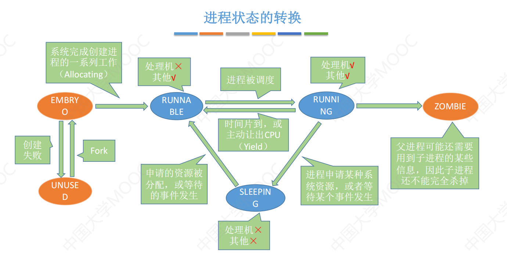

+ 运行态

+ 就绪态：已经具备运行条件，但CPU不空闲

+ 阻塞态/等待态：因等待某一事件而暂时不能运行

+ 创建态：正在被创建，OS分配资源、初始化PCB

+ 结束态：OS回收资源、PCB


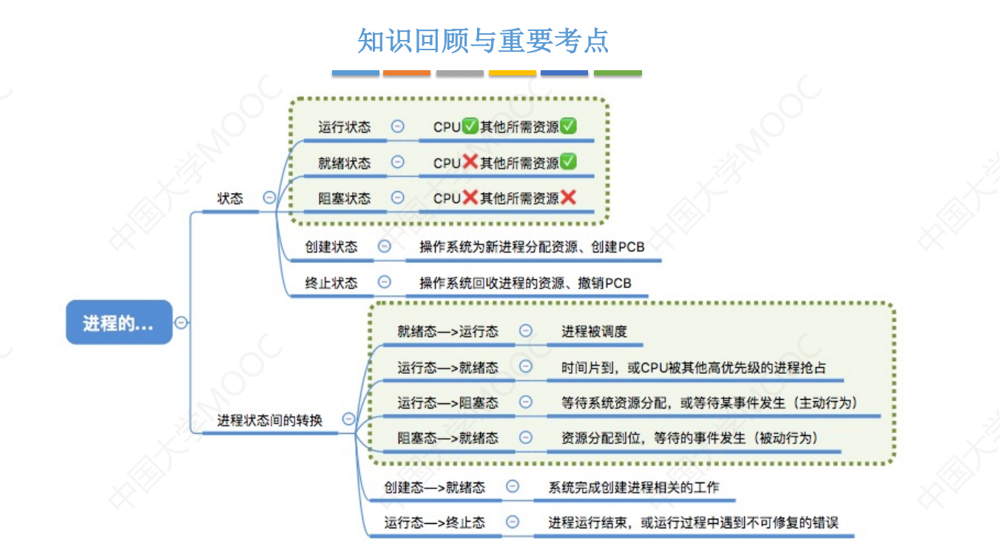


#### 4. 进程控制

##### 如何实现？——原语

+ 执行原语时，CPU不会执行一条指令后检查是否有中断
+ 即要先“关中断”，原语执行结束再“开中断”
+ 关中断和开中断是**特权指令**，只能在内核态使用

##### 进程创建

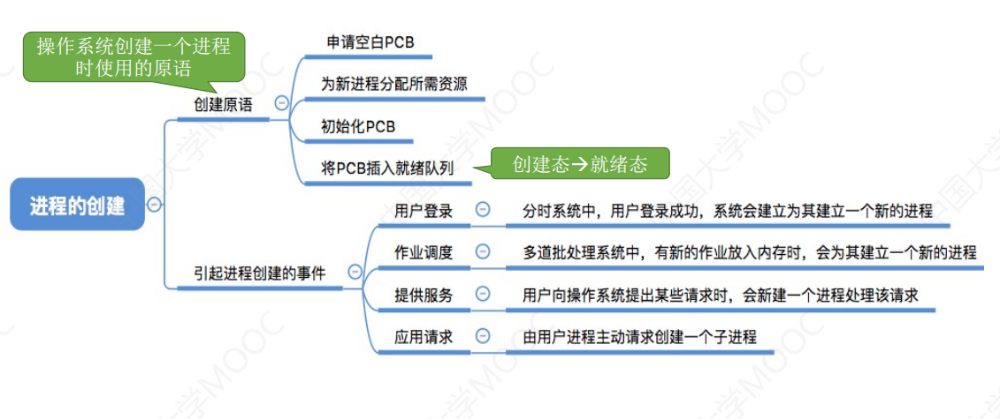

##### 进程终止

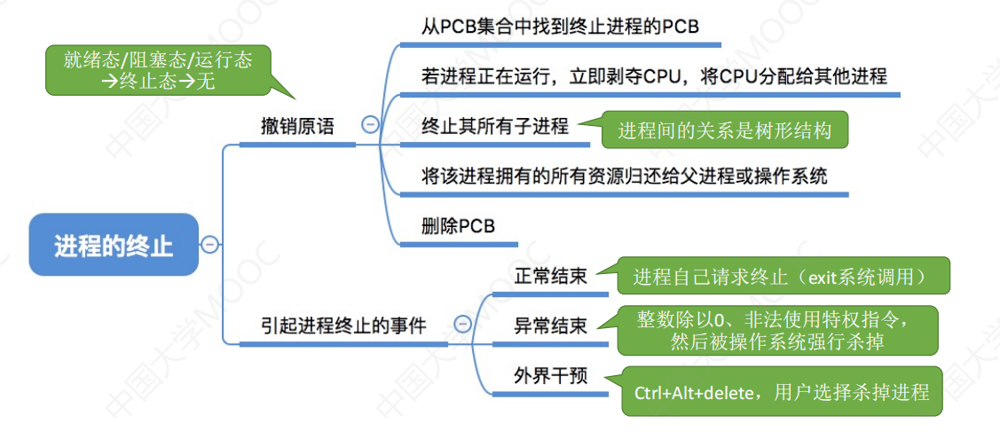

##### 进程阻塞和唤醒

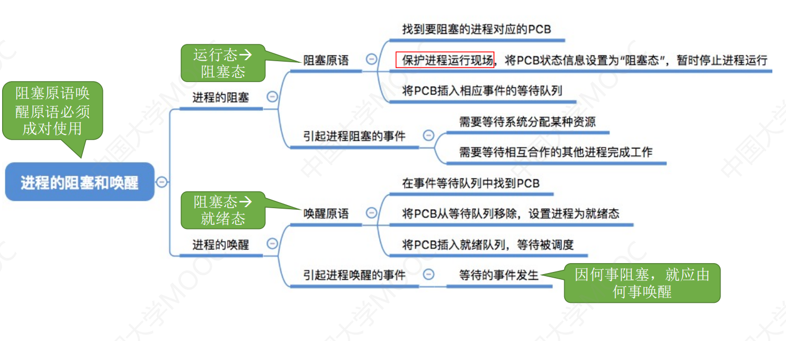

##### 进程切换

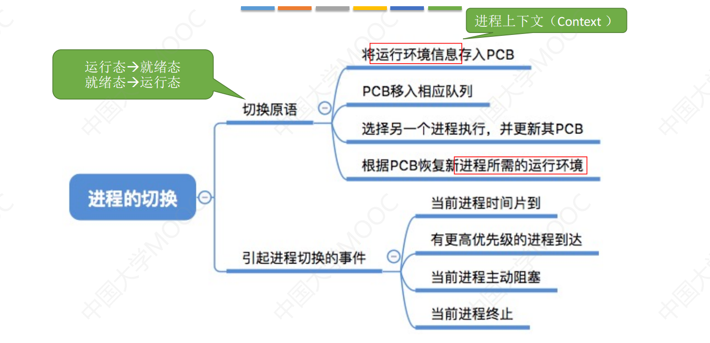


##### 无论哪个原语，要做的无非三类事情：

1. 更新PCB中的信息
2. 将PCB插入合适的队列
3. 分配/回收资源


#### 5. 进程通信

##### 共享存储

多个进程共享一个存储空间，进程之间**互斥访问**这片空间。

+ 基于数据结构的共享（低级）：速度慢、限制多
+ 基于存储区的共享（高级）：操作系统只提供内存区域，如何使用都由进程自己决定


##### 消息传递

进程间数据交换以**Message**为单位。进程通过OS提供的“Send/Receive”原语通信。

Message分为消息头和消息体。消息头包括源进程ID、目的进程ID、消息长度等信息。

+ 直接通信方式：Message指明目的进程，**一对一。**

+ 间接通信方式：通过某中间实体（信箱）传递Message。又称“信箱通信方式”

  **信箱允许一对多和多对一！**


##### 管道通信

从管道一端写入数据，从另一端读出数据。

+ 管道数据是**先进先出**的

管道是一个特殊的共享文件，称pipe文件，即一块固定大小的缓冲区。

1. 管道只能==**半双工**==通信

2. 各进程**互斥**的访问管道

3. **管道满**时，**写进程**将被阻塞

4. **管道空**时，**读进程**被阻塞

5. 管道数据一旦读出，就彻底消失。因此多个进程读同一个管道时，会出现错乱

   解决方案

   1. 允许多个写，但只允许一个读
   2. 允许多个读写，但轮流读（Linux）

   

### 线程


#### 1. 基本概念

+ “轻量级进程”
+ 线程是一个**基本的CPU执行单元**，是**程序执行流的最小单位**
+ 提高系统并发度
+ 引入线程后，进程只作为**除CPU之外的系统资源的分配单元**
+ 同一进程内的线程切换，**不需要切换进程环境，系统开销小**


#### 2. 线程的属性

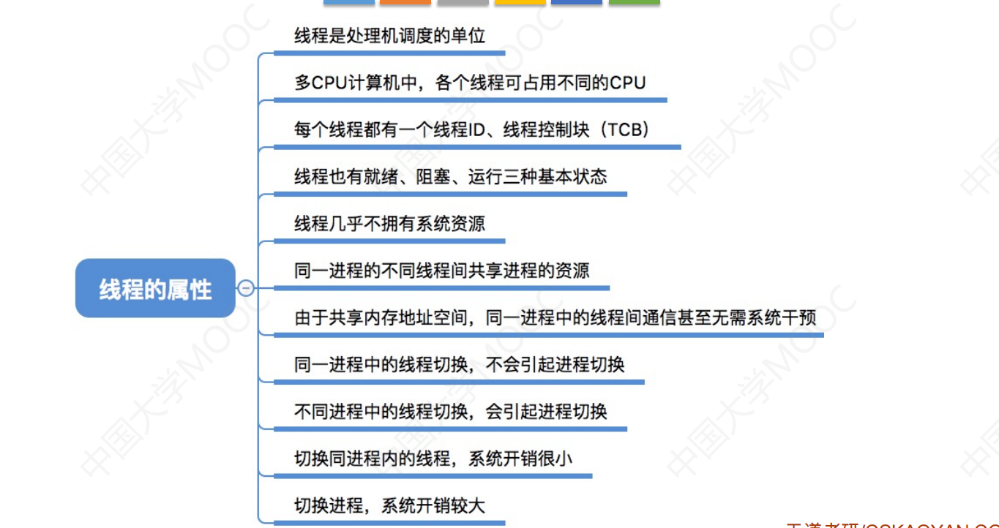


#### 3. 线程实现方式

##### 用户级线程

+ 即线程管理所有工作都由应用程序中通过代码实现
+ 很多编程语言都提供了强大的线程库，可以实现线程的创建、销毁、调度等功能
+ **操作系统意识不到线程的存在**

+ ==**缺点：一个线程被阻塞，整个进程都被阻塞，并发度不高。**==
+ 优点：不需要切换到核心态，系统开销小，效率高

##### 内核级线程

+ 线程管理由OS实现
+ 线程切换需要在**内核态**下完成
+ **优点：一个线程被阻塞，别的线程还能继续执行，并发能力强。不同线程可以在多核并行**
+ 缺点：线程管理成本高、开销大（CPU需要变态）


##### 多线程模型

1. 一对一模型：即纯内核级线程
2. 多对一模型：多个用户级线程对应一个内核线程，即纯用户级线程
3. 多对多模型：n个用户级线程对应m个内核线程（**n>=m**)


#### 4. 线程状态与转换

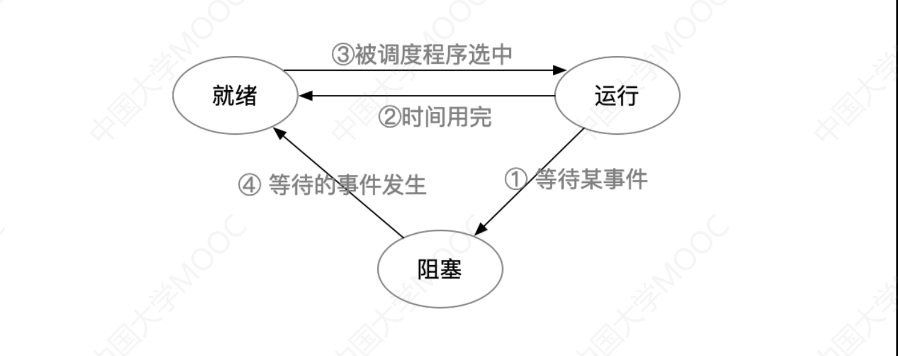

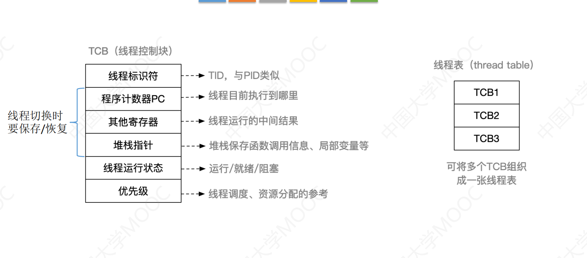


## 二、CPU调度与上下文切换

#### 1. 调度概念

##### 调度的层次

1. 高级调度（作业调度）：按一定原则从**外存**的作业后备队列中选一个为其**分配内存等资源**，并**创建进程**。
   **每个作业只调入一次，调出一次**。作业调入时会创建PCB，调出时才撤销PCB。

   ——即选择启动哪个程序。

2. 中级调度（内存调度）：将暂时不用的进程调到外存，此时称为**挂起态**。
   内存空闲时再调回内存，即变为**就绪态**。

3. 低级调度（进程调度）：从就绪队列中选一个，分配处理机。

##### 进程的挂起态和七状态模型

挂起态：暂时调到外存等待的状态。

挂起态可进一步分为**就绪挂起、阻塞挂起**两种状态。即五->七状态模型

**挂起态和阻塞态：**

+ 挂起在外存
+ 阻塞在内存

##### 三层调度对比

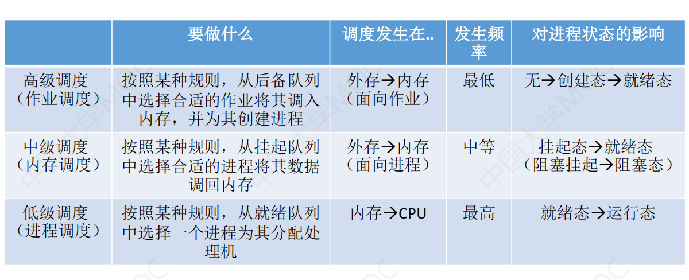


#### 2. 调度的时机、切换与过程、方式

##### 进程调度的时机

需要进程调度的情况

+ 进程主动放弃处理机：
  + 正常终止
  + 异常终止
  + 请求阻塞
+ 进程被动放弃处理机：
  + 时间片用完
  + 有更紧急的事要处理
  + 更高优先级进入就绪队列

不能进程调度的情况

+ 中断处理过程中
+ 进程在操作系统**内核临界区**中
+ 在**原子操作过程中（原语）**

**注意内核临界区与普通临界区的区别**

+ 临界资源：一段时间只允许一个进程使用的资源，比如打印机
+ 临界区：访问临界区的代码
+ 内核临界区：用来访问**某种内核数据结构**的，比如就绪队列
+ 进程在**内核临界区**不能进行调度与切换
+ 进程在**临界区**可以进行处理机调度（打印机打印过程CPU不应该空等）


##### 进程调度方式

+ 非剥夺（非抢占）
+ 剥夺（抢占）：抢占方式对提高系统吞吐率和响应效率都有明显的好处

##### 进程切换与过程

+ 进程切换是**有代价**的，如果过于频繁地调度和切换，会使整个系统效率降低

#### 3. 调度器和闲逛进程

##### 调度器组成

+ 排队器：将就绪进程按一定策略排队；进程变为就绪态时将其放入就绪队列
+ 分派器：根据调度程序所选的进程，将其从就绪队列中取出，分配CPU
+ 上下文切换器

##### idle process

+ 优先级最低
+ 可以是0地址指令，占一个完整的指令周期
+ 能耗低

#### 4. 评价标准

##### CPU利用率

+ $CPU利用率=\frac{CPU有效工作时间}{CPU有效工作时间+CPU空闲等待时间}$

##### 系统吞吐量

+ 表示单位时间CPU**完成作业的数量**
+ 长作业消耗时间长，因袭会降低吞吐量
+ 调度算法和方式也会影响吞吐量

##### 周转时间

+ 周转时间：作业**提交**到作业**完成（结束）**的时间差

+ ==$带权周转时间=\frac{作业周转时间}{作业运行时间}\ge1$==

  带权周转时间越小越好


##### 等待时间

+ 表示进程处于等待状态的时间**总和**

##### 响应时间

+ 响应时间=**首次**运行时间-提交时间


#### 5. 调度算法

##### 先来先服务FCFS

+ 非抢占
+ 用于**作业或进程**

计算：

+ IO操作不算运行时间，算等待时间


特点：

+ 公平、实现简单
+ 排在长作业后面的短作业需要等待很长时间。
  因此**对长作业有利，对短作业不利**


##### 短作业优先SJF

+ 非抢占
+ 用于**作业或进程**
+ 只比较运行时间，不动态比较剩余时间
+ 优先级是固定的，不管到没到达（只看运行时间）

抢占式的版本——最短剩余时间优先算法：

+ 动态比较剩余时间

特点：

+ 所有进程几乎同时到达时，短进程优先的**平均等待时间、平均周转时间最少**
+ **抢占式**的短进程优先等待/周转时间**更少**
+ 对短作业有利，对长作业不利
+ 长作业会出现**饥饿**现象

##### 高响应比优先

先来先服务只考虑等待时间；短作业优先只考虑运行时间。高响应比两者都考虑

+ 一般用于**作业**调度 
+ **非抢占式**
+ $响应比=\frac{等待时间(响应时间)+运行时间}{运行时间}>=1$，类似带权周转时间
+ 等待时间相同，运行时间越短，响应比越高，类似短作业优先
+ 运行时间相同，等待时间越长，响应比越高，类似先来先服务

特点

+ 综合FCFS和SJF的优点
+ 避免长作业饥饿


##### 时间片轮转

+ 抢占式
+ 由CPU发出时钟中断来通知CPU时间片已到

特点

+ 公平，响应快，适用分时操作系统
+ 时间片太长，退化为先来先服务
+ 时间片太短，切换频繁开销大
+ 不区分紧急程度

##### 优先级调度

+ 抢占或非抢占
+ 根据优先级是否可以动态变化，分为**静态优先级和动态优先级**

一般的优先级原则：

+ 系统进程> 用户进程
+ 交互式进程>非交互式进程
+ **IO型进程>计算型进程**


##### 多级反馈队列调度

+ 综合时间片轮转和优先级调度
+ 抢占

机制：

1. 设置多个**就绪**队列，优先级**从高到低**，**时间片从小到大**

2. 队列内部用时间片轮转，队列间从上到下（优先级顺序）

   **一个时间片用完后立即放入下层队列，即每层队列只运行一个时间片**

3. **只有上层队列为空时，才会运行下层队列**

优点

+ 几乎没有缺点
+ 会导致饥饿
+ 可以将因IO阻塞的进程**重新放回原队列**


##### 总结

|            | 先来先服务                                              | 短作业优先                              | 高响应比优先             | 时间片轮转                                       | 多级反馈队列                               |
| ---------- | ------------------------------------------------------- | --------------------------------------- | ------------------------ | ------------------------------------------------ | ------------------------------------------ |
| 抢占性     | 不能抢占                                                | 既可抢占也可不抢占                      | 即可抢占也可不抢占       | 只能抢占                                         | 取决于队列内算法                           |
| 优点       | 实现简单、公平<br />有利于CPU繁忙型作业，不利于IO繁忙型 | **平均等待/周转时间最少<br />**效率最高 | 兼顾长短作业             | 兼顾长短作业                                     | 兼顾长短作业<br />有较好响应时间、可行性强 |
| 缺点       | 不利于短作业                                            | 长作业出现饥饿                          | 要实现计算响应比，开销大 | 平均等待时间长、上下文切换浪费时间、增加系统开销 | 无                                         |
| 适用场景   |                                                         | 作业调度、批处理系统                    |                          | 分时系统                                         | 通用                                       |
| 默认抢占性 | 非抢占                                                  | 非抢占                                  | 非抢占                   | 抢占                                             | 抢占                                       |


## 三、同步与互斥

### 1. 概念

#### 临界资源与临界区

##### 临界资源

+ 一段时间只允许一个进程使用的资源
+ 例如打印机、被若干进程共享的变量

##### 临界区

+ 访问临界资源的**那段代码**称为临界区

##### 四个部分

+ 进入区entry section：要先检查可否进入临界区，设置正在访问临界区的标志
+ 临界区critical section
+ 退出区exit section：将正在访问临界区的标志清除
+ 剩余区：代码中的其余部分


#### 同步

##### 进程具有异步性

+ 各并发进程以各自独立、不可预知的速度前进

##### 同步亦称直接制约关系

+ 需要协调工作次序而产生的的制约关系


#### 互斥

##### 互斥亦称间接制约关系

+ 禁止两个进程同时进入临界区

##### 实现互斥的原则

1. 空闲让进
2. 忙则等待
3. 有限等待
4. 让权等待：进程不能进入临界区时，需立即释放**处理器**


### 2. 互斥实现方法

#### 软件实现

##### 一：单标志法

###### 思想

+ 两个进程**访问完临界区后**会把访问权给另一个
+ 每个进程的权限**只能被另一个进程赋予**

###### 代码

```C++
int turn = 0;	// turn==0表示权限给0号，turn==1表示权限给1号

P0:
while(turn != 0);	// 如果自己没有权限，就一直循环
critical section;	// 有权限就进入临界区
turn = 1;			// 用完把权限让给1
remainder section;

P1:
while(turn != 1);
critical section;
turn = 0;
remainder section;
```

###### 特点：

1. 只能实现互斥，但**只能轮流进**，如果对方不进，自己就永远没法进

   违背“空闲让进”

2. **==不能实现让权等待==（一直在循环中，不放弃CPU）**

##### 二：双标志先检查

###### 思想

+ 一个标志数组，给每个进程都上一个标志，标志为true表示正在访问临界区


###### 代码

```C++
bool flag[2] = {false};

P0:
while(flag[1]);		// 如果对方在访问，自己就一直循环
flag[0] = true;		// 对方没访问，就设置为自己在访问
critical section;
flag[0] = false;	// 访问完标志位置零
remainder section;

P1:
while(flag[0]);
flag[1] = true;
critical section;
flag[1] = false;
remainder section;
```

###### 特点

1. 不用轮流进入
2. 两进程**可能同时进入**（违背“忙则等待”）：问题出在检查和修改操作不能一次执行
3. **==不能实现让权等待==（一直在循环中，不放弃CPU）**


##### 三：双标志后检查

###### 思想

+ 先置标志，再判断对方是否想访问
+ 此时标志的意义是**想**访问**（不是正在访问）**

###### 代码

```C++
bool flag[2] = {false};

P0:
flag[0] = true;		// 先设置自己想访问
while(flag[1]);		// 如果对方也想访问，自己就一直循环，让给对方
critical section;
flag[0] = false;	// 访问完标志位置零
remainder section;

P1:
while(flag[0]);
flag[1] = true;
critical section;
flag[1] = false;
remainder section;
```

###### 特点

+ 如果同时都想访问，那两者**都访问不了**，导致“饥饿”
+ **==不能实现让权等待==（一直在循环中，不放弃CPU）**


##### 四：Peterson's Algorithm

###### 思想

+ 同时设置标志位flag和turn，即算法1和3的结合（后检查）
+ 先设置自己想访问，在把访问权让给对方

###### 代码

```C++
bool flag[2] = {false};	// true表示自己想进
int turn = 0;	// 0表示权限给0,1表示权限给1

P0:
flag[0] = true;	// 想进入
turn = 1;	// 先把权限给对方
while(flag[1] && turn == 1);	// 对方想访问且权限在对方那，自己就循环等待
								// 只要对方不想访问，自己就能访问，即使权限turn在对方手中
critical section;
flag[i] = false;	// 访问完清零标志位
remainder section;
```


###### 特点

+ 由于权限用**一个变量**turn表示，因此两者都想进入时，**一定有一个人可以进**，避免了互相等待，**不会“饥饿”**
+ 由于循环等待的条件有两个，因此即使turn权限在对方那，只要对方不想访问，自己就可以访问
+ 实现了忙则等待、空闲让进、有限等待三个原则
+ **==依然不能实现让权等待==（一直在循环中，不放弃CPU）**


#### 硬件实现

##### 一：中断屏蔽方法

###### 步骤：

1. 关中断
2. 临界区
3. 开中断

###### 特点

+ 优点：简单、高效
+ 缺点：不适用多处理机（一次只能中断一个处理机内的进程）；
  只适用OS内核进程，不适用用户进程（用户不能开关中断）


##### 二：TestAndSet(TSL指令)

+ 原子操作，用硬件实现，**不允许被中断**
+ 步骤：读出标志后将标志置为true

###### 逻辑代码

```;C++
bool TestAndSet(bool& lock) {
    bool old = lock;	// 保存原来的lock
    lock = true;	// 将lock修改为true
    return old;		// 返回原来的lock值
}

// 实现互斥的逻辑：
while(TestAndSet(&lock));	// 检查并上锁，如果不能访问，就循环等待
临界区;
lock = false;		// 访问完后解锁
剩余区;
```

+ TestAndSet指令==**相当于双标志先检查法实现了检查和修改操作同时进行**==
+ **==不能实现让权等待==（一直在循环中，不放弃CPU）**
+ 适用多处理机


##### 三：Swap指令（XCHG）

+ 原子操作，硬件实现，不允许中断
+ swap即交换两变量的值

###### 实现互斥的逻辑

```C++
bool old = true;	// old存放原lock值，此处设为true，交换后就实现了lock置为true的目的
do{
    swap(old, lock);
}while(old == true);
临界区;
lock = false;	// 用完解锁
剩余区;
```

+ 逻辑与TestAndSet没有区别
+ **==不能实现让权等待==（一直在循环中，不放弃CPU）**
+ 适用多处理机


#### 互斥锁mutex lock

+ 进入临界区获得锁，退出时释放锁
+ 函数`acquire()`和`release()`**都是原子操作**

```C++
acquire() {
    while(!available);	// 临界区上锁时就循环等待
    available;			// 可以进入临界区时，上锁
}
realease() {
    available = true;	// 解锁
}
```

##### 特点

+ 缺点：忙等（循环等待），**未被“让权等待”**
+ 优点：忙等时不用切换上下文（不变成阻塞态），对于多处理器系统，代价低
+ 常用于多处理器系统
+ 不适用单处理机，忙等时其他进程不能运行，即永远不能获得锁 


### 3. 信号量

两个标准的**原语**：wait（P）和signal（V）


#### 整型信号量

+ 用一个整型变量表示资源数目
+ 不能是负数
+ 小于零就循环等待

```C++
void wait(int S) {
    while(S <= 0);	// 没有资源就循环等待
	S--;	// 有资源就使用资源
}
void signal(int S) {
	S++;	// 释放资源
}
```

+ **==不能实现让权等待==（一直在循环中，不放弃CPU）**


#### 记录型信号量（==只有此方法能实现让权等待==）

+ 除了一个表示资源数目的变量外，还需要一个**阻塞队列**，表示等待**该资源**的进程

```C++
struct semaphore{
    int value;
    struct process* L;	// 阻塞队列头指针
}S;
```

##### value的意义

1. `S.value > 0`：表示剩余**空闲**资源的数量。
2. `S.value == 0`：表示剩余资源数为零
3. `S.value < 0`：此时value的绝对值表示**等待该资源的进程数目**


##### wait操作（相当于申请资源）

1. 先将资源数-1
2. 如果资源数<1, 将当前进程加入阻塞队列

```C++
void wait(semaphore S) {
    S.value--;
    if(S.value < 0) {
        S.L.add(this process);
        block(S.L);
    }
}
```

+ **block是原语，表示放弃处理机，==从运行态变为阻塞态==**


##### signal操作（相当于释放资源）

```C++
void signal(semaphore S) {
    S.value++;
    if(S.value <= 0) {
        remove a process P from S.L;
        wakeup(P);
    }
}
```

+ **wakeup是原语，表示将进程P==由阻塞态变为就绪态==**


#### 利用信号量实现同步

+ 设置同步信号量S，初值为0（初始没有资源，说明**只有提供资源的进程运行后，消耗资源的进程才能运行**）
+ 提供资源的语句后跟V,消耗资源的语句前加P

```C++
semaphore S = 0;
P1() {
    代码1;
    V(S);
    代码2;
}
P2() {
    P(S);
    代码3;
}
```

+ 只有P1运行后，P2才能运行
+ 即实现P1->P2的拓扑关系（**前V后P**）


#### 利用信号量实现互斥

+ "互斥"表示**一次只允许一个进程进入**
+ 设置互斥信号量mutex，初值为1（表示资源只有一个，即只允许一个进入）
+ 在某进程临界区代码段前后**加紧PV操作**

```C++
...
P(mutex);
临界区;
V(mutex);
...
```

#### 利用信号量实现前驱关系

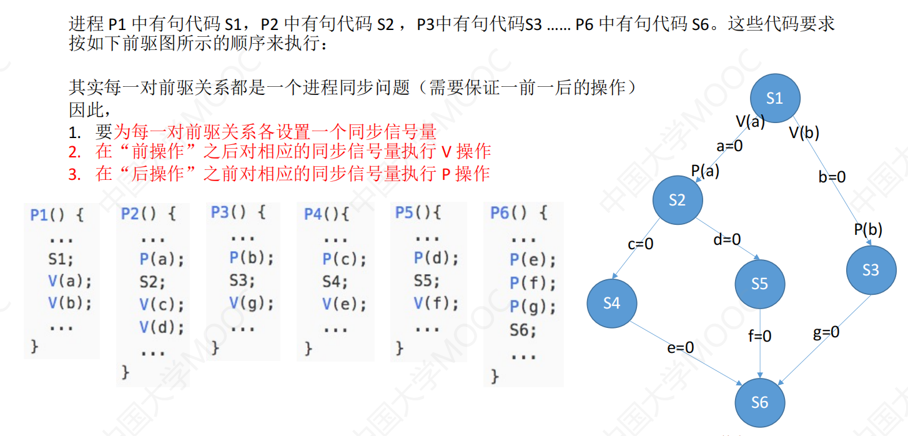

+ 为每个箭头（先后关系）都设置一个信号量，初始化为0
+ 每个进程**消耗所有入度信号量，提供所有出度信号量**


### 4. 经典同步问题

#### 生产者-消费者

##### 信号量设置

+ 生产者生产产品，消费者消费产品
+ 生产者**消耗的是空闲缓冲区**，生产的是产品
+ 消费者消耗的是产品，**生产的是空闲缓冲区**
+ 于是空闲缓冲区和产品都要一个信号量
+ 缓冲区一次只允许一个进程访问，因此需要一个互斥信号量mutex

为什么要两个信号量？

+ 因为缓冲区大小只有n，生产者不能无限生产，需要考虑空闲缓冲区的个数，即消耗空闲缓冲区。

```C++
semaphore mutex = 1;
semaphore empty = n;
semaphore full = 0;
```

##### 代码

```C++
producer() {
    while(1) {
        生产一个产品;
        P(empty);	// 先生产再申请空闲区
        P(mutex);	// 互斥访问缓冲区
        把产品放入缓冲区;
        V(mutex);
        V(full);	// 产品+1
    }
}
```

```C++
consumer() {
    while(1) {
        P(full);	// 申请产品
        P(mutex);	// 互斥访问缓冲区
        从缓冲区取出一个产品;
        V(mutex);
        V(empty);	// 空闲区+1
        使用产品;	// 先取出再用
    }
}
```

+ 注意访问缓冲区的前后要**夹紧**`P/V(mutex)`


#### 多生产者-多消费者

描述：爸爸生产苹果，妈妈生产橘子，儿子吃橘子，女儿吃苹果，盘子上只能放一个水果。

+ 不同生产者生产不同的东西，不同消费者消费不同的东西

##### 分析

1. 首先找到各进程的同步和互斥关系：

   + 互斥：即四个进程访问盘子操作

   + 同步：

     1.爸爸放苹果后，女儿才能吃

     2.妈妈放橘子后，儿子才能吃

     3.只有盘子为空时（儿女吃完），爸妈才能放

2. 信号量

   + 父亲生产苹果，消耗盘子
   + 妈妈生产橘子，消耗盘子
   + 儿子消耗橘子，生产空盘子
   + 女儿消耗苹果，生产空盘子

   于是需要三个信号量（苹果、橘子、盘子）和一个互斥信号量mutex

```C++
semaphore plate = 1, apple = 0, orange = 0;
semaphore mutex = 1;
```

##### 代码

```C++
dad(){
    while(1) {
        P(plate);
        P(mutex);
        放苹果;
        V(mutex);
        V(apple);
    }
}
```

```C++
mum(){
    while(1) {
        P(plate);
        P(mutex);
        放橘子;
        V(mutex);
        V(orange);
    }
}
```

```C++
son(){
    while(1) {
        P(orange);
        P(mutex);
        拿橘子;
        V(mutex);
        V(plate);
    }
}
```

```C++
daughter(){
    while(1) {
        P(apple);
        P(mutex);
        拿苹果;
        V(mutex);
        V(plate);
    }
}
```

##### 优化

+ 由于盘子只能放一个水果，因此**不需要mutex信号量就能自动实现互斥**

  （P(plate)后盘子没有空间，因此其他进程都不能访问盘子）

+ **若盘子能放多个水果，那就必须要mutex**

+ 盘子是临界资源，若两个进程同时访问会出现**覆盖**现象


#### 吸烟者

描述：三个抽烟者一个生产者，生产者生产3种材料，三个抽烟者各需要其中一种材料
			三个抽烟者**按顺序轮流抽烟**

##### 与生产者-消费者的区别：

+ 一个生产者可以生产多个产品
+ 一个生产者对多个消费者，即生产多种商品的单生产者-多消费者

##### 分析

1. 缓冲区大小为1，即互斥访问
2. 同步关系：
   + 只有桌子上由第i种材料，抽烟者i才能取走
   + 只有任意一个抽烟者取走材料后，生产者才能提供材料
3. 信号量：
   + 生产者消耗空桌子，即需要信号量plate
   + 三个消费者消费各自的产品，即需要三个信号量
   + 互斥信号量mutex

```C++
semaphore table = 1, obj[3] = {0};
semaphore mutex = 1;
```

##### 代码

```C++
producer() {
    int i = 0;
    while(1) {
        //P(table);
        //P(mutex);
        提供第i件产品;
        //V(mutex);
        V(obj[i]);
        i = (i + 1)%3;	// 按顺序轮流提供
        P(table);
    }
}
consumer1() {
    while(1) {
        P(obj[0]);
        //P(mutex);
        拿走obj[0];
        //V(mutex);
        V(table);
    }
}
consumer2()	{
    while(1) {
        P(obj[1]);
        //P(mutex);
        拿走obj[1];
        //V(mutex);
        V(table);
    }
}
consumer3() {
    while(1) {
        P(obj[2]);
        P(mutex);
        拿走obj[2];
        V(mutex);
        V(table);
    }
}
```

##### 优化

+ 缓冲区容量为1，因此不需要mutex

+ 如果不是轮流抽烟，而是随机抽烟，如何实现？

  ——只需要将i随机变化，而非顺序增加


#### 读者-写者

描述：读者写者两组并发进程，共享一个文件。满足以下要求：

1. 允许多个读者同时读文件
2. 同一时间只允许一个写者写
3. 写者写文件时，不允许其他任何进程操作
4. 必须无人访问文件时，写者才能写

##### 分析

1. 互斥：写进程与读和写都互斥，读与读不互斥

2. 文件数量不会变化，因此不存在操作顺序

3. 信号量：

   + 读的时候不能写，写的时候不能读，因此需要互斥信号量file

4. 如何实现多进程同时读？

   引入count变量记录正在读的进程数目
   **只有第一个读进程（count==0）才需要对文件区上锁（即申请file，不允许写者操作）；只有最后一个读进程才可以解锁。**

   只要count!=0，写进程就不需要申请file。

   **由于多个读者同时访问count时会阻塞后访问的所有读者，因此需要mutex保证对count的互斥访问**

   

```C++
semaphore file = 1;		// 读写互斥
int count = 0;
semaphore mutex = 1;	// 对count互斥访问
```

##### 代码

```C++
writer() {
    while(1) {
        P(file);	// 申请file资源，即对文件上锁
        写文件;
        V(file);	// 写完解锁
    }
}

reader() {
    while(1) {
        P(mutex);	// 互斥访问count
        if(count == 0) {
            P(file);	// 只有第一个读进程需要上锁
        }
        count++;	// 记录读者个数
        V(mutex);
        读文件;
        P(mutex);
        count--;	// 读完读者个数-1
       	if(count == 0) {	// 减到零说明是最后一个读者
            V(file);	// 只有最后一个读者才能解锁
        }
        V(mutex);
    }
}
```

+ 上述代码**读进程优先**（只要有读者，写进程就没法运行）
+ 只有最后一个读进程才能解锁，因此写进程会饿死

##### 实现写进程优先（读写公平）

+ 需要添加一个信号量read（初始化1）
+ 读者读之前需要申请read资源(`P(read)`)，read不为0才可以读
+ 写进程写之前需要`P(read)`，将read变量置0，从而阻塞读者
+ 为了实现多进程同时读和**写者中断读者**，读者判断完count后应立即`V(read)`,使其他进程可以操作

```C++
semaphore file = 1;		// 读写互斥
int count = 0;
semaphore mutex = 1;	// 对count互斥访问
semaphore read = 1;		// read=1表示可以读
```

```C++
writer() {
    while(1) {
        P(read);
        P(file);	// 申请file资源，即对文件上锁
        写文件;
        V(file);	// 写完解锁
        P(read);
    }
}

reader() {
    while(1) {
        P(read);
        P(mutex);	// 互斥访问count
        if(count == 0) {
            P(file);	// 只有第一个读进程需要上锁
        }
        count++;	// 记录读者个数
        V(mutex);
        V(read);
        读文件;
        P(mutex);
        count--;	// 读完读者个数-1
       	if(count == 0) {	// 减到零说明是最后一个读者
            V(file);	// 只有最后一个读者才能解锁
        }
        V(mutex);
    }
}
```

+ 读->写->读的情况：写进程会阻塞后一个读者

##### 核心思想

此问题为解决复杂的**互斥**问题提供了一种思路：

+ 利用count变量实现多进程并行


#### 哲学家进餐

描述：五个哲学家坐在圆桌边，两人之间夹了一只筷子，任何一人吃饭都需要拿起左右两边的筷子，吃完后筷子放回原位。

##### 分析

1. 两个哲学家对夹在中间的筷子互斥访问

2. 吃饭没有先后顺序，只要有筷子就能吃饭

3. 信号量：

   整个问题的临界资源就是5只筷子，需要5个筷子信号量

   互斥访问筷子，需要mutex

```C++
semaphore chopstick[5] = {1};
```

4. 每个人的操作都是一样的，只需一个函数

##### 如何防止死锁

1. 只允许四个哲学家同时拿筷子，就不会出现每个哲学家都只有一直筷子的情况
2. 为哲学家编号，奇数号只能先拿左边筷子，偶数号只能先拿右边筷子
   即相邻两人优先抢夹在中间的筷子，使得**其中一个人可以先拿到筷子，
   另一个人阻塞时手里没筷子。**
3. 只有两边都有筷子时，才能吃饭

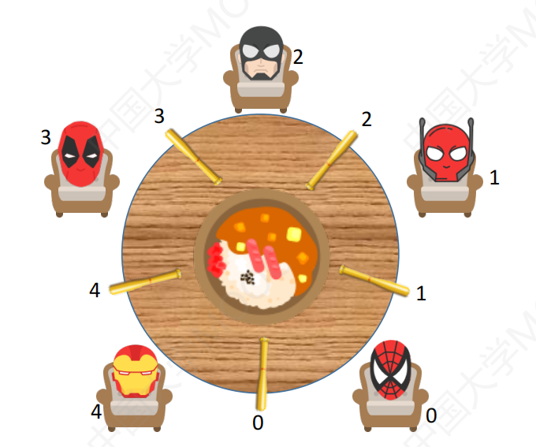

##### 代码

方案：同一时刻只能一个人拿筷子，即需要一个mutex信号量。
			此时只有两边都有筷子时才能拿（不严谨）。

```C++
semaphore chopstick[5] = {1};
int count = 0;
semaphore mutex = 1;

P(int i) {	// 第i个人
    while(1) {
        P(mutex);
    	P(chopstick[i]);		// 先拿左
    	P(chopstick[(i+1)%5]);	// 再拿右
        V(mutex);
    	拿筷子吃饭;
    	V(chopstick[i+1]%5);
    	V(chopstick[i]);	
	}
}
```


### 5. 管程

#### 定义和组成

##### 管程由这些部分组成：

1. 管程内部的**共享数据结构**说明
2. 对数据结构进行操作的一组过程（函数）
3. 初始化语句
4. 管程名称

##### 基本特征：

1. 管程内的数据只能被内部的函数访问（相当于私有数据）
2. 进程只能通过管程提供的函数才能访问共享数据
3. **一次只允许一个进程调用管程函数（实现互斥）**


#### 管程实现生产者-消费者

```C++
monitor ProduceConsumer
    condition full, empty;
    int count = 0;
    void insert(Item item) {
        if(count == N) {
            wait(full);
        }
        count++;
        insert_item(item);
        if(count == 1) {
            signal(empty);
        }
    }
    Item remove() {
        if(count == 0) {
            wait(empty);
        }
        count--;
        if(count == N-1) {
            signal(full);
        }
        return remove_item();
    }
end monitor;
```


#### 条件变量condition

##### 定义

+ 每个条件变量保存了一个**等待队列**，用于记录**因该条件变量而阻塞**的所有进程
+ 对条件变量只能执行两种操作：wait/signal

##### wait和signal

+ x.wait：当x的条件不满足时，对正在调用管程的进程调用x.wait**将自己插入x条件的等待队列**，

  并释放管程，让给其他进程

+ x.signal：**唤醒一个因x而阻塞的进程**


##### 条件变量与信号量的比较

1. wait/signal类似P/V操作，可以实现进程阻塞和唤醒
2. 条件变量**没有值**，只能实现“排队等待”功能
   而信号量**有值**，记录了剩余资源数和排队等待进程数


## 四、死锁

### 1. 死锁概念

#### 死锁、饥饿与死循环

##### 饥饿：别人一直用，自己用不到

##### 死锁：都在等别人让给自己用，结果都用不到

##### 死循环：程序bug/故意设计


#### 死锁原因

1. 竞争资源
2. 请求和释放资源的顺序不当

#### 死锁四个必要条件

##### 1. 互斥条件

+ 一次只能一个进程使用
+ 无法破坏

##### 2. 不剥夺条件

+ 进程占有的资源只能自己主动释放

##### 3. 请求并保持条件

+ 进程必须**一边保持一种资源，一边请求新的资源**

##### 4. 循环等待条件

+ 必须有循环等待链


#### 死锁的处理策略

##### 1.死锁预防

+ 即破坏4个必要条件之一

##### 2.死锁避免

+ **资源动态分配过程中**，用银行家算法防止系统进入**不安全状态**

##### 3.死锁

+ 允许程序发生死锁
+ 死锁后要能检测出来并解除死锁


### 2. 死锁预防

#### 破坏互斥

+ Spooling技术（逻辑上变为共享）
+ 一般不可行

#### 破坏不剥夺条件

##### 方法一

+ 进程请求的资源得不到满足时，**立即释放已拥有的资源**
+ 缺点：会导致饥饿

##### 方法二

+ 剥夺有资源的其他进程（**需要考虑优先级，高优先级剥夺低优先级资源**）

+ 缺点：实现复杂、增加开销、降低吞吐量

#### 破坏请求并保持

##### 静态分配法

+ **一次申请所有资源**
+ 缺点：导致饥饿

#### 破坏循环等待

##### 顺序资源分配法

+ **将资源编号**，规定进程必须按编号顺序请求资源（已请求过资源的不可能回头再申请）
+ 从而无法形成循环

缺点：

1. **不方便新增设备**
2. 进程实际使用资源顺序不一定按编号来，造成**浪费**

### 3. 死锁避免

#### 安全状态与死锁


#### 银行家算法

##### 初始化（数据结构）

1. 目前剩余资源矩阵Available
2. 最大需求矩阵Max
3. 已分配矩阵Allocated
4. 剩余需求矩阵Need(**Need = Max - Allocated**)

##### 算法步骤

1. 若**要求合理**，则进行下一步；否则报错

   即进程此次请求的资源数<剩余需求Need，为合理要求

2. 若**剩余资源够分配**，则进行下一步；否则报错

3. **分配资源**，修改各种矩阵

4. **利用安全性算法找出安全序列**，找不到就将此次分配作废，恢复矩阵的自改


#### 安全性算法

##### 特点

+ 目的只有一个：找出安全序列
+ 安全性算法中的一切计算都是虚拟的

##### 算法步骤

1. 设置一个**Available矩阵副本**，记为Work，保存当前剩余资源

2. 将Work与Need比较，**找到资源足够分配的进程**，假装分配给他，运行完后返还已分配的资源

   即**剩余资源Work += Allocated**

   ——————**（做题时应优先分配已占有资源多的进程）**

3. 重复第二步，直到将所有进程都分配完，**按分配顺序得到一个安全序列**

4. 若某一步没有进程足够分配，说明系统处于不安全状态，**撤销银行家算法中上一次的分配**


### 4. 死锁检测与解除

#### 资源分配图

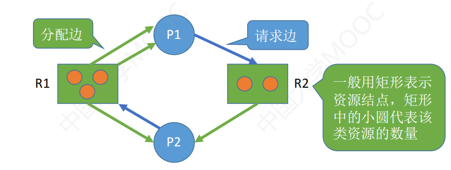

+ 矩形——一种资源
+ 矩形中的圆点——一个资源
+ 圆圈结点——进程
+ **资源->进程**：分配边，表示资源给了进程
+ **进程->资源**：请求边，表示进程请求资源


#### 死锁定理

+ 当且仅当S状态的资源分配图不可完全简化，S才为死锁

##### 简化资源分配图

1. 找到可以运行（不阻塞）的进程，假装运行，最后释放资源
2. 重复寻找过程，直到消除所有边
3. 相当于找安全序列的过程

#### 死锁解除方法

##### 1. 资源剥夺法

+ 挂起其中某些死锁进程，抢占资源，分配给其他死锁进程

##### 2. 撤销/终止进程法

+ 强制撤销部分**甚至全部**死锁进程，并剥夺资源。
+ 撤销可以按优先级/撤销代价/已执行时间/剩余时间进行

##### 3. 进程回退法

+ 让一个或多个进程**回退到死锁之前**
+ 需要OS记录还原点，不容易实现


# 第三章 内存管理

## 一、内存管理基础

### 基本概念

#### 链接与装入

创建进程首先要将程序的数据**装入内存**。将源程序变为内存中可执行的程序，有三步：

1. 编译：形成目标模块
2. 链接：将目标模块和库函数链接在一起，形成一个完整的**装入模块**
3. 装入：将装入模块装入内存运行

##### 链接的三种方式

1. 静态链接
   程序运行前，链接称完整的装入模块，之后不再拆开。

2. **装入时**动态链接：边装入边链接

3. **运行时**动态链接
   **执行时需要该模块时**，才链接。

   优点：便于修改更新、便于对目标模块共享

   

##### 装入的三种方式

1. 绝对装入：
   编译时知道绝对地址，产生绝对地址的目标代码。

   **只适用单道程序环境。**

2. 可重定位装入（**静态重定位**）：
   程序**装入时**对地址重定位，将逻辑地址转为物理地址。

   装入时必须**分配要求的全部内存空间；运行期间不能移动**

3. **动态重定位**：
   装入后并不立即进行地址转换，而是**推迟到执行时**在转换，
   因此装入后的地址依然是相对地址。

   **需要一个重定位寄存器，存放起始地址**

   允许程序在内存中发生移动。

   运行前只需装入部分代码即可运行；运行期间可以动态申请分配内存。


#### 内存管理的功能

1. 内存空间分配与回收
2. 地址转换
3. 内存空间扩充（实现虚拟性）
4. 内存共享
5. 内存保护

##### 内存保护方法

1. 上下限寄存器
2. 重定位寄存器（基地址寄存器）和界地址寄存器（限长寄存器）


### 连续分配管理方式

#### 1. 单一连续分配

+ 内存分为系统区和用户区
+ 内存中**只能有一道用户程序**，独占整个用户空间

##### 优点

1. 实现简单，**无外部碎片**；
2. 不需要内存保护

##### 缺点

1. 有内部碎片
2. 存储器利用率极低
3. 只能用于单用户、单任务的OS中

#### 2. 固定分区分配

+ 用户区分为若干**固定大小**的分区，**每个分区只装入一道作业**

##### 分区大小相等

+ 缺乏灵活性

##### 分区大小不等

+ 多个小分区，适量中分区，少量大分区
+ 通常将分区按大小排队，建立说明表

##### 优点

1. 实现简单，**无外部碎片**

##### 缺点

1. 程序太大，装不进任何一个分区，需要覆盖技术
2. 会产生**内部碎片**，内存利用率低


#### 3. 动态分区分配

##### 概念

+ 不会事先划分内存分区，而是进程装入内存时，**根据实际需要动态建立分区**
+ *没有内部碎片，有外部碎片**（某些空闲分区太小二难以利用）
+ 外部碎片可以通过**紧凑**技术解决（移动内存中的进程，将外部碎片攒到一起）
+ 进程结束，回收内存分区时，需要**将相邻的空闲分区合并**


##### 动态分区分配算法

###### 1）首次适应算法

+ 空闲分区按**地址递增**次序链接
+ 分配时，从链首**顺序查找**，找到能满足的第一个空闲分区
+ **最好+最快**

##### 2）最佳适应算法

+ 空闲分区按**容量递增**次序链接
+ 顺序查找空闲分区链，找到满足的第一个（即最小的空闲分区）

缺点：每次都选空间小的，最终会留下越来越多小的外部碎片

###### 3）最坏适应算法

+ 空闲分区按**容量递减**次序链接
+ 分配时，将第一个分区（即最大的）分配。（若最大的满足不了，后面全都满足不了）

缺点：导致大空间迅速用完，后来的大进程就分配不到内存

###### 4）邻近适应算法

+ 改进首次适应算法，使得每次都**从上次查找结束的位置继续查找**

+ 隐含**最佳适应算法的优点和最坏适应算法的缺点**


### 基本分页管理

#### 概念

分页管理将内存和进程都分为大小相等写固定的块，块相对较小，作为**主存和进程的基本单位**。

**分页管理不会产生外部碎片**。
由于进程和主存都以块为单位，因此**只有在最后一个不完整的块申请空间时，分配不了，才会产生内部碎片。**
每个进程平均产生半个块的内部碎片（页内碎片）。


##### 页面和页框

+ **进程分的块称为页/页面（Page）**——逻辑
+ **内存分的块称为内存块/物理块页框/页帧（Page Frame）**——物理
+ **一页对应一个内存块**

##### 页表

1. 一个进程一张页表
2. 一个页表项由页号+块号组成
3. 即存放**进程块与物理块的对应**
4. ==**注意页号只是用于访问页表项的下标，不占存储空间**==（页表项地址=页表起始地址+每个页表项的大小*页号）


#### 地址转换

任务：逻辑地址->物理地址

##### 逻辑地址结构

+ 页号+页内偏移量
+ 页号指明在**进程的第几块**
+ 页内偏移量指明在**页内第几个字节**
+ **==页内偏移量k位，说明一页$2^k$个字节==**
+ **==页号m位，说明一个进程最多$2^m$个页面==**


##### 转换步骤（基本地址变换机构）

由页号得到物理块号，加上页内偏移量即得到物理地址

设置页表寄存器存放页表起始地址和页表长度

1. 计算**页号=逻辑地址/页面大小, 页内偏移量=逻辑地址%页面大小**
2. 判断页号是否越界（**页号>=页表长度说明越界**）
3. **页表项地址=页表起始地址+页号*一个页表项长度**
4. 在页表项中取出物理块号，即可算出物理地址


#### 具有块表的地址变换机构

##### 块表

+ TLB，translation lookaside buffer联想寄存器
+ 是一种**高速缓存**，**集成在CPU内部**
+ 存放**最近访问的页表项副本**
+ 内存中的页表常称为慢表


##### 地址变换步骤

1. 计算页号、页内偏移量，并判断页号是否越界
2. 页号不越界，**先查询块表**，有对应页表项，直接得到内存块号，加上偏移量即可得物理地址
3. 快表中没查到（**未命中），再查询慢表**（算出页表项地址，取出内存块号）
4. **找到页表项后，应同时将其存入快表**


##### 性能

+ 快表命中，只需**访问一次内存**（快表不在内存里）
+ 快表未命中，需要**两次访存**（慢表也在内存里）
+ 一般快表命中率达90%以上
+ 若支持**快表慢表同时查询**，效率更高


#### 两级页表

##### 单级页表产生的问题

1. 若页表太大，在内存中需要占用很多内存块
2. 没有必要让页表全部常驻内存，因为进程一段时间内只需要访问几个页面

##### 页表的页表

+ 为页表再建立一个页表，称为**页目录表/顶级页表**
+ **顶级页表最多只能占一个页面**
+ 采用多级页表结构，**各级页表大小都不能超过一个页面**

##### 逻辑地址结构

+ 顶级页号+二级页号+页内偏移量


#### 分页管理的结论

1. **分页通过硬件实现，对用户完全透明**


### 基本分段管理

#### 分段

+ 按程序的逻辑关系划分为若干段，例如**主程序段、子程序段、数据段...**
+ **每个段都占连续的空间**（段内连续，段间不连续）
+ 按逻辑分段，使得用户变成更方便，程序的可读性更高
+ **每段长度不需要相同**

##### 逻辑地址结构

+ 段号S+段内偏移量W
+ 一个进程最多$2^S$个段
+ 一个段最长$2^W$字节


#### 段表

+ 段表项=段号+段长+该段起始位置
+ **由于每段长度不一致，因此不能直接由段号得到段所在内存块，需要指明段始址**
+ 段表项是定长的


#### 地址变换

系统设置段表寄存器，记录段表始址和段表长度

目的是通过段号找到该段的始址，加上段内偏移量即可得到物理地址

**注意段号和段长都是用来判断越界的！！！**

1. 算出段号和段内偏移量
2. **判断段号是否越界**（段号>=段表长度则越界）
3. 找到**段表项=段号*一个段表项长度+段表始址**，从段表项中提取段长和始址
4. **判断段内偏移量是否越界**（段内偏移量>段长则越界）
5. 段始址+段内偏移量=物理地址


#### 分段和分页对比


### 段页式管理

####  分段和分页的优缺点

|          | 优点                                                         | 缺点                                                         |
| -------- | ------------------------------------------------------------ | ------------------------------------------------------------ |
| 分页管理 | 内存空间利用率高，**不会产生外部碎片**，只会有少量的页内碎片 | 不方便按照逻辑模块实现信息的共享与保护                       |
| 分段管理 | 方便按照逻辑模块实现信息的共享与保护；<br />由于是根据代码逻辑分段的，因此**不会产生内部碎片** | 如果段长过大，为其分配很大的连续空间会很不方便；<br />段式管理**会产生外部碎片** |


#### 逻辑地址结构

+ **段比页大**（先按逻辑分段，每段按定长分页）
+ 段号+页号+页内偏移量
+ **段号位数决定每个进程最多可分多少段**
+ **页号位数决定每个段最多分多少页**
+ **页内偏移量决定页面大小**


#### 地址变换

##### 段表

+ **一个进程有一个段表**
+ **一段有一个页表**
+ 段表项=段号+**页表长度+页表始址**

##### 地址变换过程

系统设置段表寄存器，存放段表始址+段表长度

1. 计算段号、页号、页内偏移量
2. **检查段号是否越界**（段号>段表长度则越界）
3. 找到段表项=段号*一个段表项长度+段表始址，从段表项中获取**页表长度+页表始址**
4. **判断页号是否越界**（页号>页表长度则越界）
5. 找到页表项=页号*每页长度+页表始址，从页表项中获得内存块号
6. 物理地址=内存块号+页内偏移量


## 二、虚拟内存

### 基本概念

#### 传统存储管理方式的特征

##### 1. 一次性

+ 作业必须一次性全部装入内存才能运行
+ 作业很大时，装不进内存，导致**大作业无法运行**
+ 内存只能容纳少量作业，导致**多道程序并发度下降**

##### 2. 驻留性

+ 作业装入内存后，就**一直驻留在内存中**，不会被换出，直至结束
+ 其他进程长期处于阻塞态

#### 局部性原理

1. 时间局部性：
   同一条指令可能不久后会再次执行；同一个数据不久后会再次被访问

2. 空间局部性

   当前访问的某个存储单元**附近的存储单元**不久后会被访问

#### 虚拟存储器的特征

##### 1. 多次性

+ 分多次装入内存
+ **最重要特征**

##### 2. 对换性

+ 不需要常驻内存，允许换入换出


##### 3. 虚拟性

+ 逻辑上扩充容量
+ **最重要目标**


#### 虚拟内存实现

+ 建立在**离散分配**的内存管理基础上
+ 由传统的**基本**分页/分段/段页式**变为请求**分页/分段/段页式

##### 与传统方式的主要区别（两个新需求）

1. 访问信息不在内存时，**由操作系统负责将所需信息从外存调入内存——请求调页功能**
2. 内存空间不够，操作系统负责**将内存中暂时用不到的信息换出到外存——页面置换功能**


### 请求分页管理方式

#### 页表机制

##### 页表项新增字段

除了原有的页号、物理块号外，新增了4个字段：

1. 状态位P：表明**是否已调入**内存
2. 访问字段A：记录一段时间内该页的**访问次数**
3. 修改位M：记录**是否被修改**过。修改过的页面需要写回外存
4. 外存地址：该页存放的外存地址。（物理块号是内存）


#### 缺页中断机构

访问的页面不在内存时，产生缺页中断。此时应**将缺页的进程阻塞**。

+ 有空闲块，则分配一个内存块，修改页表项
+ 没有空闲块，选择一页淘汰替换。若被修改过，还需要写回外存

##### 缺页中断属于内中断

+ 需要保护CPU环境、分析原因、中断处理程序、恢复CPU环境等步骤
+ 一条指令可能引起多个缺页中断
+ 指令执行期间产生的中断，属于**异常**


#### 地址变换机构


+ 只有写指令才需要修改“修改位”
+ 换入换出操作如果太频繁，会有很大开销
+ 页面调入内存后需要修改慢表，同时要将页表项复制到快表中


### 页面置换算法

+ 页面算法应追求**更少的缺页率**

#### 1. 最佳OPT置换算法

+ 选择**以后最长时间内不再被访问**的页面换出
+ 由于无法预知未来，因此无法实现
+ 但可以利用此算法评价其他算法

#### 2. 先进先出FIFO

+ 选择**最早进入内存**的页面换出
+ 换出的顺序严格按照物理块顺序

##### 只有FIFO会发生Belady异常

+ **FIFO是队列类，其他算法是堆栈类，而堆栈类不会出现Belady异常**
+ 给进程分配的物理块数增加，缺页率却不减反增
+ 因此FIFO算法性能差

#### 3. 最近最久未使用LRU

+ 选择最近最久未使用的页面换出
+ 页表项中的**访问字段记录上次被访问以来经历的时间**
+ 每次访问该页的访问字段清零
+ **性能最接近OPT**，但需要硬件支持，开销大

#### 4. 时钟CLOCK置换算法

+ 依然是选择未访问的页面，不过是**根据指针来循环选择**
+ 利用页表项的访问位，1表示最近访问过，0表示最近未访问过
+ 需要一个替换指针，**每次替换后都指向下一个页面**

##### 步骤

1. **若所有页面访问位都是1，则指针循环一周，将所有页面访问位都置0，最后回到刚才的位置**
2. 访问的页面存在，则直接访问并将访问位置1，**此时替换指针不动**
3. 访问页面不存在时，若指针指向的页面访问位为1，则**改为0，并将指针后移**，
   直到找到一个访问位为1的页面换出

+ 所有页面访问位为1的情况只有两种可能

  1. 刚开始运行时，内存为空，连续将几个页面放入内存后
  2. 运行过程中，**连续访问几个已存在的页面**，导致访问位全部为1

  页面不存在时，不可能出现所有页面访问位都是1

#### 5. 改进的CLOCK置换算法

+ 在CLOCK算法的基础上，**进一步找未被修改的**页面替换
+ 利用页表项的修改位，1表示修改过，0表示未修改
+ 优先选未修改的页面
+ 访问位和修改位组成二元组(0, 0)、(0,1)、(1,0)、(1,1)

##### 优先级：(0,0)>(0,1)>(1,0)>(1,1)

+ 四轮扫描出的页面严格按照上述顺序

##### 每次访问最多进行四轮扫描

1. 找(0,0)，找不到进行第二轮扫描
2. 找(0,1)，**本次访问将所有扫描过的访问位置0**，找不到进行第三轮扫描（即所有页面都被访问过）
3. 找(0,0)，找不到进行第四轮扫描（**进行到此步所有访问位都是0**）
4. 找(0,1)，一定能找到（**进行到此步说明所有页面都是(0,1)**）

+ **只有第二轮修改访问位**
+ **修改位不可能被修改，只用于判断**


### 页面分配策略、抖动与工作集

#### 页面分配

##### 驻留集

指请求分页管理中**给进程分配的物理块数目**

+ 驻留集大小一般小于进程总大小
+ 驻留集太小，进程缺页频繁
+ 驻留集太大，多道并发性下降，资源利用率低

##### 内存分配策略

**根据驻留集是否可变**，采取两种分配策略：固定分配和可变分配；

**根据置换页面的范围**，采取两种置换策略：

+ 局部置换：进程只能选择**分配给自己的**物理块进行置换
+ 全局置换：可以将OS保留的空闲物理块分配给缺页进程，
  也可以将别的进程的物理块置换到外存，在分配给缺页进程

|          | 局部置换                                                     | 全局置换                                                     |
| -------- | ------------------------------------------------------------ | ------------------------------------------------------------ |
| 固定分配 | 难以确定应该为进程分配多少物理块                             | 不存在（采用全局置换驻留集必然改变）                         |
| 可变分配 | 缺页时只会选择进程自己的物理块替换。<br />只有进程频繁缺页时，系统才会为进程多分配几个物理块，<br />只要缺页率正常位置；<br />反之缺页率特别低时，会减少几个物理块。 | 分配的物理块可以适当增加减少。缺页时选择空闲物理块分配，<br />若没有空闲块，则选择一个**未锁定**的页面换出再分配。<br />**只要进程缺页，都将获得新物理块**，除非空闲块用完。<br />被选中换出页面的进程的物理块会减少，缺页率会增加。 |


#### 调入页面

##### 何时调入页面

1. 预调页策略：一次调入若干相邻页面，成功率仅为50%

   一般用于**进程的首次调入（运行前调入）**

2. 请求调页：只有缺页时才调页，I/O开销大

##### 从何处调入页面

磁盘存储区分为**对换区和文件区**

+ 对换区用**连续分配，读写速度更快**
+ 文件区离散分配，读写慢

从何处调页分为三种情况

1. 系统有足够的对换区空间：页面调入调出操作全部在对换区进行。
   进程运行前要将相关数据从文件区复制到对换区。

2. 对换区不够：**不会被修改的文件都从文件区直接调入，且不需要写回。**

   **会被修改的文件写回到对换区，下次再从对换区调入。**

3. Unix方式：运行前数据在文件区，换出的文件都写回对换区，下次再从对换区调入。


#### 抖动（颠簸）

+ 刚刚调入的页面马上又要换出。
+ 根本原因是分配给进程的物理块数不够
+ 主要原因是**页面置换算法不合理**


##### 工作集

+ 某段时间间隔内，进程实际访问**页面的集合**（针对页号不是物理块）
+ OS利用**窗口大小**计算工作集
+ **驻留集不能小于工作集**，否则会频繁缺页


# 第四章 文件管理


# 第五章 I/O管理

