# 第一章计算机系统概述


## 操作系统引导


# 第二章 进程与线程

## 一、进程与线程

### 进程

#### 1. 进程概念

##### 进程是进程实体的==运行过程==，是系统进行==资源分配==和==调度==的一个独立单位

##### PCB（Process Control Block)

+ **PCB是进程存在的唯一标志**
+ 进程描述信息：PID、UID
+ 进程控制和管理信息：进程状态、优先级、...
+ 资源分配清单
+ 处理机相关信息

##### 程序段和数据段

+ 程序段：程序代码（指令序列）
+ 数据段：运行过程中产生的各种数据（如定义的变量）

##### 程序段、数据段、PCB三部分组成了进程实体/进程映像

+ PCB是给操作系统用的
+ 程序段、数据段是给进程自己用的，与进程滋生的运行逻辑有关


#### 2. 进程特征

##### 动态性

+ 最重要最基本
+ 进程与程序的根本区别

##### 并发性

##### 独立性

##### 异步性

+ 进程按各自独立的、不可预知的速度向前推进
+ 进程同步机制：解决异步问题

##### 结构性

+ 每个进程都有PCB


#### 3. 进程状态


+ 运行态

+ 就绪态：已经具备运行条件，但CPU不空闲

+ 阻塞态/等待态：因等待某一事件而暂时不能运行

+ 创建态：正在被创建，OS分配资源、初始化PCB

+ 结束态：OS回收资源、PCB


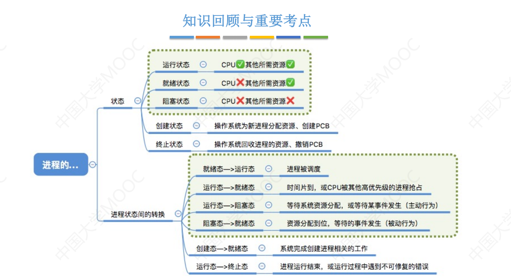


#### 4. 进程控制

##### 如何实现？——原语

+ 执行原语时，CPU不会执行一条指令后检查是否有中断
+ 即要先“关中断”，原语执行结束再“开中断”
+ 关中断和开中断是**特权指令**，只能在内核态使用

##### 进程创建

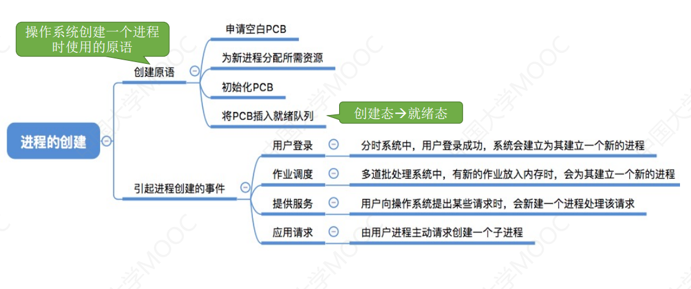

##### 进程终止

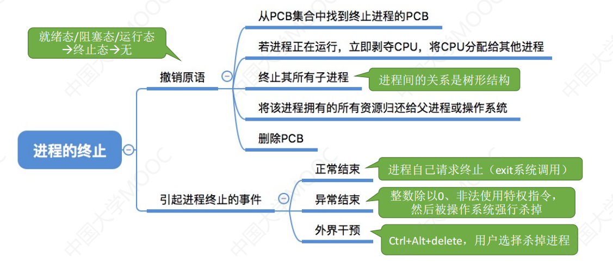

##### 进程阻塞和唤醒


##### 进程切换


##### 无论哪个原语，要做的无非三类事情：

1. 更新PCB中的信息
2. 将PCB插入合适的队列
3. 分配/回收资源


#### 5. 进程通信

##### 共享存储

多个进程共享一个存储空间，进程之间**互斥访问**这片空间。

+ 基于数据结构的共享（低级）：速度慢、限制多
+ 基于存储区的共享（高级）：操作系统只提供内存区域，如何使用都由进程自己决定


##### 消息传递

进程间数据交换以**Message**为单位。进程通过OS提供的“Send/Receive”原语通信。

Message分为消息头和消息体。消息头包括源进程ID、目的进程ID、消息长度等信息。

+ 直接通信方式：Message指明目的进程，**一对一。**

+ 间接通信方式：通过某中间实体（信箱）传递Message。又称“信箱通信方式”

  **信箱允许一对多和多对一！**


##### 管道通信

从管道一端写入数据，从另一端读出数据。

+ 管道数据是**先进先出**的

管道是一个特殊的共享文件，称pipe文件，即一块固定大小的缓冲区。

1. 管道只能==**半双工**==通信

2. 各进程**互斥**的访问管道

3. **管道满**时，**写进程**将被阻塞

4. **管道空**时，**读进程**被阻塞

5. 管道数据一旦读出，就彻底消失。因此多个进程读同一个管道时，会出现错乱

   解决方案

   1. 允许多个写，但只允许一个读
   2. 允许多个读写，但轮流读（Linux）

   

### 线程


#### 1. 基本概念

+ “轻量级进程”
+ 线程是一个**基本的CPU执行单元**，是**程序执行流的最小单位**
+ 提高系统并发度
+ 引入线程后，进程只作为**除CPU之外的系统资源的分配单元**
+ 同一进程内的线程切换，**不需要切换进程环境，系统开销小**


#### 2. 线程的属性


#### 3. 线程实现方式

##### 用户级线程

+ 即线程管理所有工作都由应用程序中通过代码实现
+ 很多编程语言都提供了强大的线程库，可以实现线程的创建、销毁、调度等功能
+ **操作系统意识不到线程的存在**

+ ==**缺点：一个线程被阻塞，整个进程都被阻塞，并发度不高。**==
+ 优点：不需要切换到核心态，系统开销小，效率高

##### 内核级线程

+ 线程管理由OS实现
+ 线程切换需要在**内核态**下完成
+ **优点：一个线程被阻塞，别的线程还能继续执行，并发能力强。不同线程可以在多核并行**
+ 缺点：线程管理成本高、开销大（CPU需要变态）


##### 多线程模型

1. 一对一模型：即纯内核级线程
2. 多对一模型：多个用户级线程对应一个内核线程，即纯用户级线程
3. 多对多模型：n个用户级线程对应m个内核线程（**n>=m**)


#### 4. 线程状态与转换


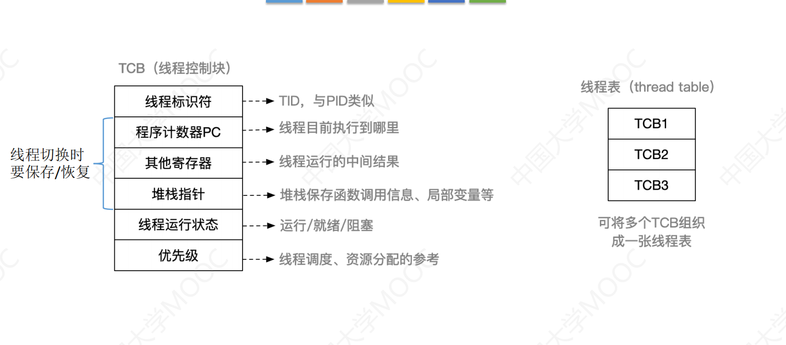


## 二、CPU调度与上下文切换

#### 1. 调度概念

##### 调度的层次

1. 高级调度（作业调度）：按一定原则从**外存**的作业后备队列中选一个为其**分配内存等资源**，并**创建进程**。
   **每个作业只调入一次，调出一次**。作业调入时会创建PCB，调出时才撤销PCB。

   ——即选择启动哪个程序。

2. 中级调度（内存调度）：将暂时不用的进程调到外存，此时称为**挂起态**。
   内存空闲时再调回内存，即变为**就绪态**。

3. 低级调度（进程调度）：从就绪队列中选一个，分配处理机。

##### 进程的挂起态和七状态模型

挂起态：暂时调到外存等待的状态。

挂起态可进一步分为**就绪挂起、阻塞挂起**两种状态。即五->七状态模型

**挂起态和阻塞态：**

+ 挂起在外存
+ 阻塞在内存

##### 三层调度对比


#### 2. 调度的时机、切换与过程、方式

##### 进程调度的时机

需要进程调度的情况

+ 进程主动放弃处理机：
  + 正常终止
  + 异常终止
  + 请求阻塞
+ 进程被动放弃处理机：
  + 时间片用完
  + 有更紧急的事要处理
  + 更高优先级进入就绪队列

不能进程调度的情况

+ 中断处理过程中
+ 进程在操作系统**内核临界区**中
+ 在**原子操作过程中（原语）**

**注意内核临界区与普通临界区的区别**

+ 临界资源：一段时间只允许一个进程使用的资源，比如打印机
+ 临界区：访问临界区的代码
+ 内核临界区：用来访问**某种内核数据结构**的，比如就绪队列
+ 进程在**内核临界区**不能进行调度与切换
+ 进程在**临界区**可以进行处理机调度（打印机打印过程CPU不应该空等）


##### 进程调度方式

+ 非剥夺（非抢占）
+ 剥夺（抢占）：抢占方式对提高系统吞吐率和响应效率都有明显的好处

##### 进程切换与过程

+ 进程切换是**有代价**的，如果过于频繁地调度和切换，会使整个系统效率降低

#### 3. 调度器和闲逛进程

##### 调度器组成

+ 排队器：将就绪进程按一定策略排队；进程变为就绪态时将其放入就绪队列
+ 分派器：根据调度程序所选的进程，将其从就绪队列中取出，分配CPU
+ 上下文切换器

##### idle process

+ 优先级最低
+ 可以是0地址指令，占一个完整的指令周期
+ 能耗低

#### 4. 评价标准

##### CPU利用率

+ $CPU利用率=\frac{CPU有效工作时间}{CPU有效工作时间+CPU空闲等待时间}$

##### 系统吞吐量

+ 表示单位时间CPU**完成作业的数量**
+ 长作业消耗时间长，因袭会降低吞吐量
+ 调度算法和方式也会影响吞吐量

##### 周转时间

+ 周转时间：作业**提交**到作业**完成（结束）**的时间差

+ ==$带权周转时间=\frac{作业周转时间}{作业运行时间}\ge1$==

  带权周转时间越小越好


##### 等待时间

+ 表示进程处于等待状态的时间**总和**

##### 响应时间

+ 响应时间=**首次**运行时间-提交时间


#### 5. 调度算法

##### 先来先服务FCFS

+ 非抢占
+ 用于**作业或进程**

计算：

+ IO操作不算运行时间，算等待时间


特点：

+ 公平、实现简单
+ 排在长作业后面的短作业需要等待很长时间。
  因此**对长作业有利，对短作业不利**


##### 短作业优先SJF

+ 非抢占
+ 用于**作业或进程**
+ 只比较运行时间，不动态比较剩余时间
+ 优先级是固定的，不管到没到达（只看运行时间）

抢占式的版本——最短剩余时间优先算法：

+ 动态比较剩余时间

特点：

+ 所有进程几乎同时到达时，短进程优先的**平均等待时间、平均周转时间最少**
+ **抢占式**的短进程优先等待/周转时间**更少**
+ 对短作业有利，对长作业不利
+ 长作业会出现**饥饿**现象

##### 高响应比优先

先来先服务只考虑等待时间；短作业优先只考虑运行时间。高响应比两者都考虑

+ 一般用于**作业**调度 
+ **非抢占式**
+ $响应比=\frac{等待时间(响应时间)+运行时间}{运行时间}>=1$，类似带权周转时间
+ 等待时间相同，运行时间越短，响应比越高，类似短作业优先
+ 运行时间相同，等待时间越长，响应比越高，类似先来先服务

特点

+ 综合FCFS和SJF的优点
+ 避免长作业饥饿


##### 时间片轮转

+ 抢占式
+ 由CPU发出时钟中断来通知CPU时间片已到

特点

+ 公平，响应快，适用分时操作系统
+ 时间片太长，退化为先来先服务
+ 时间片太短，切换频繁开销大
+ 不区分紧急程度

##### 优先级调度

+ 抢占或非抢占
+ 根据优先级是否可以动态变化，分为**静态优先级和动态优先级**

一般的优先级原则：

+ 系统进程> 用户进程
+ 交互式进程>非交互式进程
+ **IO型进程>计算型进程**


##### 多级反馈队列调度

+ 综合时间片轮转和优先级调度
+ 抢占

机制：

1. 设置多个**就绪**队列，优先级**从高到低**，**时间片从小到大**

2. 队列内部用时间片轮转，队列间从上到下（优先级顺序）

   **一个时间片用完后立即放入下层队列，即每层队列只运行一个时间片**

3. **只有上层队列为空时，才会运行下层队列**

优点

+ 几乎没有缺点
+ 会导致饥饿
+ 可以将因IO阻塞的进程**重新放回原队列**


##### 总结

|            | 先来先服务                                              | 短作业优先                              | 高响应比优先             | 时间片轮转                                       | 多级反馈队列                               |
| ---------- | ------------------------------------------------------- | --------------------------------------- | ------------------------ | ------------------------------------------------ | ------------------------------------------ |
| 抢占性     | 不能抢占                                                | 既可抢占也可不抢占                      | 即可抢占也可不抢占       | 只能抢占                                         | 取决于队列内算法                           |
| 优点       | 实现简单、公平<br />有利于CPU繁忙型作业，不利于IO繁忙型 | **平均等待/周转时间最少<br />**效率最高 | 兼顾长短作业             | 兼顾长短作业                                     | 兼顾长短作业<br />有较好响应时间、可行性强 |
| 缺点       | 不利于短作业                                            | 长作业出现饥饿                          | 要实现计算响应比，开销大 | 平均等待时间长、上下文切换浪费时间、增加系统开销 | 无                                         |
| 适用场景   |                                                         | 作业调度、批处理系统                    |                          | 分时系统                                         | 通用                                       |
| 默认抢占性 | 非抢占                                                  | 非抢占                                  | 非抢占                   | 抢占                                             | 抢占                                       |


## 三、同步与互斥

### 1. 概念

#### 临界资源与临界区

##### 临界资源

+ 一段时间只允许一个进程使用的资源
+ 例如打印机、被若干进程共享的变量

##### 临界区

+ 访问临界资源的**那段代码**称为临界区

##### 四个部分

+ 进入区entry section：要先检查可否进入临界区，设置正在访问临界区的标志
+ 临界区critical section
+ 退出区exit section：将正在访问临界区的标志清除
+ 剩余区：代码中的其余部分


#### 同步

##### 进程具有异步性

+ 各并发进程以各自独立、不可预知的速度前进

##### 同步亦称直接制约关系

+ 需要协调工作次序而产生的的制约关系


#### 互斥

##### 互斥亦称间接制约关系

+ 禁止两个进程同时进入临界区

##### 实现互斥的原则

1. 空闲让进
2. 忙则等待
3. 有限等待
4. 让权等待：进程不能进入临界区时，需立即释放**处理器**


### 2. 互斥实现方法

#### 软件实现

##### 一：单标志法

###### 思想

+ 两个进程**访问完临界区后**会把访问权给另一个
+ 每个进程的权限**只能被另一个进程赋予**

###### 代码

```C++
int turn = 0;	// turn==0表示权限给0号，turn==1表示权限给1号

P0:
while(turn != 0);	// 如果自己没有权限，就一直循环
critical section;	// 有权限就进入临界区
turn = 1;			// 用完把权限让给1
remainder section;

P1:
while(turn != 1);
critical section;
turn = 0;
remainder section;
```

###### 特点：

1. 只能实现互斥，但**只能轮流进**，如果对方不进，自己就永远没法进

   违背“空闲让进”

2. **==不能实现让权等待==（一直在循环中，不放弃CPU）**

##### 二：双标志先检查

###### 思想

+ 一个标志数组，给每个进程都上一个标志，标志为true表示正在访问临界区


###### 代码

```C++
bool flag[2] = {false};

P0:
while(flag[1]);		// 如果对方在访问，自己就一直循环
flag[0] = true;		// 对方没访问，就设置为自己在访问
critical section;
flag[0] = false;	// 访问完标志位置零
remainder section;

P1:
while(flag[0]);
flag[1] = true;
critical section;
flag[1] = false;
remainder section;
```

###### 特点

1. 不用轮流进入
2. 两进程**可能同时进入**（违背“忙则等待”）：问题出在检查和修改操作不能一次执行
3. **==不能实现让权等待==（一直在循环中，不放弃CPU）**


##### 三：双标志后检查

###### 思想

+ 先置标志，再判断对方是否想访问
+ 此时标志的意义是**想**访问**（不是正在访问）**

###### 代码

```C++
bool flag[2] = {false};

P0:
flag[0] = true;		// 先设置自己想访问
while(flag[1]);		// 如果对方也想访问，自己就一直循环，让给对方
critical section;
flag[0] = false;	// 访问完标志位置零
remainder section;

P1:
while(flag[0]);
flag[1] = true;
critical section;
flag[1] = false;
remainder section;
```

###### 特点

+ 如果同时都想访问，那两者**都访问不了**，导致“饥饿”
+ **==不能实现让权等待==（一直在循环中，不放弃CPU）**


##### 四：Peterson's Algorithm

###### 思想

+ 同时设置标志位flag和turn，即算法1和3的结合（后检查）
+ 先设置自己想访问，在把访问权让给对方

###### 代码

```C++
bool flag[2] = {false};	// true表示自己想进
int turn = 0;	// 0表示权限给0,1表示权限给1

P0:
flag[0] = true;	// 想进入
turn = 1;	// 先把权限给对方
while(flag[1] && turn == 1);	// 对方想访问且权限在对方那，自己就循环等待
								// 只要对方不想访问，自己就能访问，即使权限turn在对方手中
critical section;
flag[i] = false;	// 访问完清零标志位
remainder section;
```


###### 特点

+ 由于权限用**一个变量**turn表示，因此两者都想进入时，**一定有一个人可以进**，避免了互相等待，**不会“饥饿”**
+ 由于循环等待的条件有两个，因此即使turn权限在对方那，只要对方不想访问，自己就可以访问
+ 实现了忙则等待、空闲让进、有限等待三个原则
+ **==依然不能实现让权等待==（一直在循环中，不放弃CPU）**


#### 硬件实现

##### 一：中断屏蔽方法

###### 步骤：

1. 关中断
2. 临界区
3. 开中断

###### 特点

+ 优点：简单、高效
+ 缺点：不适用多处理机（一次只能中断一个处理机内的进程）；
  只适用OS内核进程，不适用用户进程（用户不能开关中断）


##### 二：TestAndSet(TSL指令)

+ 原子操作，用硬件实现，**不允许被中断**
+ 步骤：读出标志后将标志置为true

###### 逻辑代码

```;C++
bool TestAndSet(bool& lock) {
    bool old = lock;	// 保存原来的lock
    lock = true;	// 将lock修改为true
    return old;		// 返回原来的lock值
}

// 实现互斥的逻辑：
while(TestAndSet(&lock));	// 检查并上锁，如果不能访问，就循环等待
临界区;
lock = false;		// 访问完后解锁
剩余区;
```

+ TestAndSet指令==**相当于双标志先检查法实现了检查和修改操作同时进行**==
+ **==不能实现让权等待==（一直在循环中，不放弃CPU）**
+ 适用多处理机


##### 三：Swap指令（XCHG）

+ 原子操作，硬件实现，不允许中断
+ swap即交换两变量的值

###### 实现互斥的逻辑

```C++
bool old = true;	// old存放原lock值，此处设为true，交换后就实现了lock置为true的目的
do{
    swap(old, lock);
}while(old == true);
临界区;
lock = false;	// 用完解锁
剩余区;
```

+ 逻辑与TestAndSet没有区别
+ **==不能实现让权等待==（一直在循环中，不放弃CPU）**
+ 适用多处理机


#### 互斥锁mutex lock

+ 进入临界区获得锁，退出时释放锁
+ 函数`acquire()`和`release()`**都是原子操作**

```C++
acquire() {
    while(!available);	// 临界区上锁时就循环等待
    available;			// 可以进入临界区时，上锁
}
realease() {
    available = true;	// 解锁
}
```

##### 特点

+ 缺点：忙等（循环等待），**未被“让权等待”**
+ 优点：忙等时不用切换上下文（不变成阻塞态），对于多处理器系统，代价低
+ 常用于多处理器系统
+ 不适用单处理机，忙等时其他进程不能运行，即永远不能获得锁 


### 3. 信号量

两个标准的**原语**：wait（P）和signal（V）


#### 整型信号量

+ 用一个整型变量表示资源数目
+ 不能是负数
+ 小于零就循环等待

```C++
void wait(int S) {
    while(S <= 0);	// 没有资源就循环等待
	S--;	// 有资源就使用资源
}
void signal(int S) {
	S++;	// 释放资源
}
```

+ **==不能实现让权等待==（一直在循环中，不放弃CPU）**


#### 记录型信号量（==只有此方法能实现让权等待==）

+ 除了一个表示资源数目的变量外，还需要一个**阻塞队列**，表示等待**该资源**的进程

```C++
struct semaphore{
    int value;
    struct process* L;	// 阻塞队列头指针
}S;
```

##### value的意义

1. `S.value > 0`：表示剩余**空闲**资源的数量。
2. `S.value == 0`：表示剩余资源数为零
3. `S.value < 0`：此时value的绝对值表示**等待该资源的进程数目**


##### wait操作（相当于申请资源）

1. 先将资源数-1
2. 如果资源数<1, 将当前进程加入阻塞队列

```C++
void wait(semaphore S) {
    S.value--;
    if(S.value < 0) {
        S.L.add(this process);
        block(S.L);
    }
}
```

+ **block是原语，表示放弃处理机，==从运行态变为阻塞态==**


##### signal操作（相当于释放资源）

```C++
void signal(semaphore S) {
    S.value++;
    if(S.value <= 0) {
        remove a process P from S.L;
        wakeup(P);
    }
}
```

+ **wakeup是原语，表示将进程P==由阻塞态变为就绪态==**


#### 利用信号量实现同步

+ 设置同步信号量S，初值为0（初始没有资源，说明**只有提供资源的进程运行后，消耗资源的进程才能运行**）
+ 提供资源的语句后跟V,消耗资源的语句前加P

```C++
semaphore S = 0;
P1() {
    代码1;
    V(S);
    代码2;
}
P2() {
    P(S);
    代码3;
}
```

+ 只有P1运行后，P2才能运行
+ 即实现P1->P2的拓扑关系（**前V后P**）


#### 利用信号量实现互斥

+ "互斥"表示**一次只允许一个进程进入**
+ 设置互斥信号量mutex，初值为1（表示资源只有一个，即只允许一个进入）
+ 在某进程临界区代码段前后**加紧PV操作**

```C++
...
P(mutex);
临界区;
V(mutex);
...
```

#### 利用信号量实现前驱关系

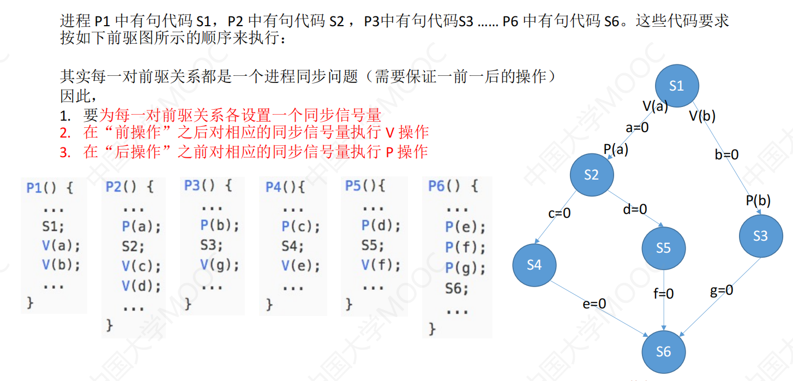

+ 为每个箭头（先后关系）都设置一个信号量，初始化为0
+ 每个进程**消耗所有入度信号量，提供所有出度信号量**


### 4. 经典同步问题

#### 生产者-消费者

##### 信号量设置

+ 生产者生产产品，消费者消费产品
+ 生产者**消耗的是空闲缓冲区**，生产的是产品
+ 消费者消耗的是产品，**生产的是空闲缓冲区**
+ 于是空闲缓冲区和产品都要一个信号量
+ 缓冲区一次只允许一个进程访问，因此需要一个互斥信号量mutex

为什么要两个信号量？

+ 因为缓冲区大小只有n，生产者不能无限生产，需要考虑空闲缓冲区的个数，即消耗空闲缓冲区。

```C++
semaphore mutex = 1;
semaphore empty = n;
semaphore full = 0;
```

##### 代码

```C++
producer() {
    while(1) {
        生产一个产品;
        P(empty);	// 先生产再申请空闲区
        P(mutex);	// 互斥访问缓冲区
        把产品放入缓冲区;
        V(mutex);
        V(full);	// 产品+1
    }
}
```

```C++
consumer() {
    while(1) {
        P(full);	// 申请产品
        P(mutex);	// 互斥访问缓冲区
        从缓冲区取出一个产品;
        V(mutex);
        V(empty);	// 空闲区+1
        使用产品;	// 先取出再用
    }
}
```

+ 注意访问缓冲区的前后要**夹紧**`P/V(mutex)`


#### 多生产者-多消费者

描述：爸爸生产苹果，妈妈生产橘子，儿子吃橘子，女儿吃苹果，盘子上只能放一个水果。

+ 不同生产者生产不同的东西，不同消费者消费不同的东西

##### 分析

1. 首先找到各进程的同步和互斥关系：

   + 互斥：即四个进程访问盘子操作

   + 同步：

     1.爸爸放苹果后，女儿才能吃

     2.妈妈放橘子后，儿子才能吃

     3.只有盘子为空时（儿女吃完），爸妈才能放

2. 信号量

   + 父亲生产苹果，消耗盘子
   + 妈妈生产橘子，消耗盘子
   + 儿子消耗橘子，生产空盘子
   + 女儿消耗苹果，生产空盘子

   于是需要三个信号量（苹果、橘子、盘子）和一个互斥信号量mutex

```C++
semaphore plate = 1, apple = 0, orange = 0;
semaphore mutex = 1;
```

##### 代码

```C++
dad(){
    while(1) {
        P(plate);
        P(mutex);
        放苹果;
        V(mutex);
        V(apple);
    }
}
```

```C++
mum(){
    while(1) {
        P(plate);
        P(mutex);
        放橘子;
        V(mutex);
        V(orange);
    }
}
```

```C++
son(){
    while(1) {
        P(orange);
        P(mutex);
        拿橘子;
        V(mutex);
        V(plate);
    }
}
```

```C++
daughter(){
    while(1) {
        P(apple);
        P(mutex);
        拿苹果;
        V(mutex);
        V(plate);
    }
}
```

##### 优化

+ 由于盘子只能放一个水果，因此**不需要mutex信号量就能自动实现互斥**

  （P(plate)后盘子没有空间，因此其他进程都不能访问盘子）

+ **若盘子能放多个水果，那就必须要mutex**

+ 盘子是临界资源，若两个进程同时访问会出现**覆盖**现象


#### 吸烟者

描述：三个抽烟者一个生产者，生产者生产3种材料，三个抽烟者各需要其中一种材料
			三个抽烟者**按顺序轮流抽烟**

##### 与生产者-消费者的区别：

+ 一个生产者可以生产多个产品
+ 一个生产者对多个消费者，即生产多种商品的单生产者-多消费者

##### 分析

1. 缓冲区大小为1，即互斥访问
2. 同步关系：
   + 只有桌子上由第i种材料，抽烟者i才能取走
   + 只有任意一个抽烟者取走材料后，生产者才能提供材料
3. 信号量：
   + 生产者消耗空桌子，即需要信号量plate
   + 三个消费者消费各自的产品，即需要三个信号量
   + 互斥信号量mutex

```C++
semaphore table = 1, obj[3] = {0};
semaphore mutex = 1;
```

##### 代码

```C++
producer() {
    int i = 0;
    while(1) {
        //P(table);
        //P(mutex);
        提供第i件产品;
        //V(mutex);
        V(obj[i]);
        i = (i + 1)%3;	// 按顺序轮流提供
        P(table);
    }
}
consumer1() {
    while(1) {
        P(obj[0]);
        //P(mutex);
        拿走obj[0];
        //V(mutex);
        V(table);
    }
}
consumer2()	{
    while(1) {
        P(obj[1]);
        //P(mutex);
        拿走obj[1];
        //V(mutex);
        V(table);
    }
}
consumer3() {
    while(1) {
        P(obj[2]);
        P(mutex);
        拿走obj[2];
        V(mutex);
        V(table);
    }
}
```

##### 优化

+ 缓冲区容量为1，因此不需要mutex

+ 如果不是轮流抽烟，而是随机抽烟，如何实现？

  ——只需要将i随机变化，而非顺序增加


#### 读者-写者

描述：读者写者两组并发进程，共享一个文件。满足以下要求：

1. 允许多个读者同时读文件
2. 同一时间只允许一个写者写
3. 写者写文件时，不允许其他任何进程操作
4. 必须无人访问文件时，写者才能写

##### 分析

1. 互斥：写进程与读和写都互斥，读与读不互斥

2. 文件数量不会变化，因此不存在操作顺序

3. 信号量：

   + 读的时候不能写，写的时候不能读，因此需要互斥信号量file

4. 如何实现多进程同时读？

   引入count变量记录正在读的进程数目
   **只有第一个读进程（count==0）才需要对文件区上锁（即申请file，不允许写者操作）；只有最后一个读进程才可以解锁。**

   只要count!=0，写进程就不需要申请file。

   **由于多个读者同时访问count时会阻塞后访问的所有读者，因此需要mutex保证对count的互斥访问**

   

```C++
semaphore file = 1;		// 读写互斥
int count = 0;
semaphore mutex = 1;	// 对count互斥访问
```

##### 代码

```C++
writer() {
    while(1) {
        P(file);	// 申请file资源，即对文件上锁
        写文件;
        V(file);	// 写完解锁
    }
}

reader() {
    while(1) {
        P(mutex);	// 互斥访问count
        if(count == 0) {
            P(file);	// 只有第一个读进程需要上锁
        }
        count++;	// 记录读者个数
        V(mutex);
        读文件;
        P(mutex);
        count--;	// 读完读者个数-1
       	if(count == 0) {	// 减到零说明是最后一个读者
            V(file);	// 只有最后一个读者才能解锁
        }
        V(mutex);
    }
}
```

+ 上述代码**读进程优先**（只要有读者，写进程就没法运行）
+ 只有最后一个读进程才能解锁，因此写进程会饿死

##### 实现写进程优先（读写公平）

+ 需要添加一个信号量read（初始化1）
+ 读者读之前需要申请read资源(`P(read)`)，read不为0才可以读
+ 写进程写之前需要`P(read)`，将read变量置0，从而阻塞读者
+ 为了实现多进程同时读和**写者中断读者**，读者判断完count后应立即`V(read)`,使其他进程可以操作

```C++
semaphore file = 1;		// 读写互斥
int count = 0;
semaphore mutex = 1;	// 对count互斥访问
semaphore read = 1;		// read=1表示可以读
```

```C++
writer() {
    while(1) {
        P(read);
        P(file);	// 申请file资源，即对文件上锁
        写文件;
        V(file);	// 写完解锁
        P(read);
    }
}

reader() {
    while(1) {
        P(read);
        P(mutex);	// 互斥访问count
        if(count == 0) {
            P(file);	// 只有第一个读进程需要上锁
        }
        count++;	// 记录读者个数
        V(mutex);
        V(read);
        读文件;
        P(mutex);
        count--;	// 读完读者个数-1
       	if(count == 0) {	// 减到零说明是最后一个读者
            V(file);	// 只有最后一个读者才能解锁
        }
        V(mutex);
    }
}
```

+ 读->写->读的情况：写进程会阻塞后一个读者

##### 核心思想

此问题为解决复杂的**互斥**问题提供了一种思路：

+ 利用count变量实现多进程并行


#### 哲学家进餐

描述：五个哲学家坐在圆桌边，两人之间夹了一只筷子，任何一人吃饭都需要拿起左右两边的筷子，吃完后筷子放回原位。

##### 分析

1. 两个哲学家对夹在中间的筷子互斥访问

2. 吃饭没有先后顺序，只要有筷子就能吃饭

3. 信号量：

   整个问题的临界资源就是5只筷子，需要5个筷子信号量

   互斥访问筷子，需要mutex

```C++
semaphore chopstick[5] = {1};
```

4. 每个人的操作都是一样的，只需一个函数

##### 如何防止死锁

1. 只允许四个哲学家同时拿筷子，就不会出现每个哲学家都只有一直筷子的情况
2. 为哲学家编号，奇数号只能先拿左边筷子，偶数号只能先拿右边筷子
   即相邻两人优先抢夹在中间的筷子，使得**其中一个人可以先拿到筷子，
   另一个人阻塞时手里没筷子。**
3. 只有两边都有筷子时，才能吃饭

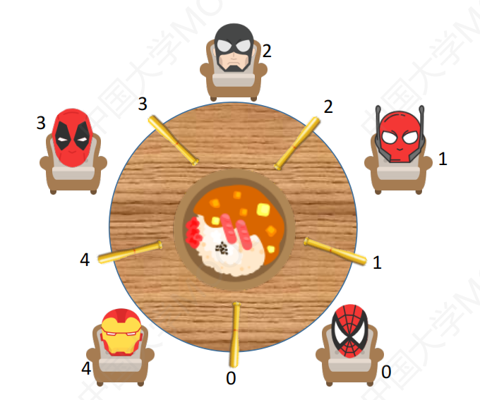

##### 代码

方案：同一时刻只能一个人拿筷子，即需要一个mutex信号量。
			此时只有两边都有筷子时才能拿（不严谨）。

```C++
semaphore chopstick[5] = {1};
int count = 0;
semaphore mutex = 1;

P(int i) {	// 第i个人
    while(1) {
        P(mutex);
    	P(chopstick[i]);		// 先拿左
    	P(chopstick[(i+1)%5]);	// 再拿右
        V(mutex);
    	拿筷子吃饭;
    	V(chopstick[i+1]%5);
    	V(chopstick[i]);	
	}
}
```


### 5. 管程

#### 定义和组成

##### 管程由这些部分组成：

1. 管程内部的**共享数据结构**说明
2. 对数据结构进行操作的一组过程（函数）
3. 初始化语句
4. 管程名称

##### 基本特征：

1. 管程内的数据只能被内部的函数访问（相当于私有数据）
2. 进程只能通过管程提供的函数才能访问共享数据
3. **一次只允许一个进程调用管程函数（实现互斥）**


#### 管程实现生产者-消费者

```C++
monitor ProduceConsumer
    condition full, empty;
    int count = 0;
    void insert(Item item) {
        if(count == N) {
            wait(full);
        }
        count++;
        insert_item(item);
        if(count == 1) {
            signal(empty);
        }
    }
    Item remove() {
        if(count == 0) {
            wait(empty);
        }
        count--;
        if(count == N-1) {
            signal(full);
        }
        return remove_item();
    }
end monitor;
```


#### 条件变量condition

##### 定义

+ 每个条件变量保存了一个**等待队列**，用于记录**因该条件变量而阻塞**的所有进程
+ 对条件变量只能执行两种操作：wait/signal

##### wait和signal

+ x.wait：当x的条件不满足时，对正在调用管程的进程调用x.wait**将自己插入x条件的等待队列**，

  并释放管程，让给其他进程

+ x.signal：**唤醒一个因x而阻塞的进程**


##### 条件变量与信号量的比较

1. wait/signal类似P/V操作，可以实现进程阻塞和唤醒
2. 条件变量**没有值**，只能实现“排队等待”功能
   而信号量**有值**，记录了剩余资源数和排队等待进程数


## 四、死锁

### 1. 死锁概念

#### 死锁、饥饿与死循环

##### 饥饿：别人一直用，自己用不到

##### 死锁：都在等别人让给自己用，结果都用不到

##### 死循环：程序bug/故意设计


#### 死锁原因

1. 竞争资源
2. 请求和释放资源的顺序不当

#### 死锁四个必要条件

##### 1. 互斥条件

+ 一次只能一个进程使用
+ 无法破坏

##### 2. 不剥夺条件

+ 进程占有的资源只能自己主动释放

##### 3. 请求并保持条件

+ 进程必须**一边保持一种资源，一边请求新的资源**

##### 4. 循环等待条件

+ 必须有循环等待链


#### 死锁的处理策略

##### 1.死锁预防

+ 即破坏4个必要条件之一

##### 2.死锁避免

+ **资源动态分配过程中**，用银行家算法防止系统进入**不安全状态**

##### 3.死锁

+ 允许程序发生死锁
+ 死锁后要能检测出来并解除死锁


### 2. 死锁预防

#### 破坏互斥

+ Spooling技术（逻辑上变为共享）
+ 一般不可行

#### 破坏不剥夺条件

##### 方法一

+ 进程请求的资源得不到满足时，**立即释放已拥有的资源**
+ 缺点：会导致饥饿

##### 方法二

+ 剥夺有资源的其他进程（**需要考虑优先级，高优先级剥夺低优先级资源**）

+ 缺点：实现复杂、增加开销、降低吞吐量

#### 破坏请求并保持

##### 静态分配法

+ **一次申请所有资源**
+ 缺点：导致饥饿

#### 破坏循环等待

##### 顺序资源分配法

+ **将资源编号**，规定进程必须按编号顺序请求资源（已请求过资源的不可能回头再申请）
+ 从而无法形成循环

缺点：

1. **不方便新增设备**
2. 进程实际使用资源顺序不一定按编号来，造成**浪费**

### 3. 死锁避免

#### 安全状态与死锁


#### 银行家算法

##### 初始化（数据结构）

1. 目前剩余资源矩阵Available
2. 最大需求矩阵Max
3. 已分配矩阵Allocated
4. 剩余需求矩阵Need(**Need = Max - Allocated**)

##### 算法步骤

1. 若**要求合理**，则进行下一步；否则报错

   即进程此次请求的资源数<剩余需求Need，为合理要求

2. 若**剩余资源够分配**，则进行下一步；否则报错

3. **分配资源**，修改各种矩阵

4. **利用安全性算法找出安全序列**，找不到就将此次分配作废，恢复矩阵的自改


#### 安全性算法

##### 特点

+ 目的只有一个：找出安全序列
+ 安全性算法中的一切计算都是虚拟的

##### 算法步骤

1. 设置一个**Available矩阵副本**，记为Work，保存当前剩余资源

2. 将Work与Need比较，**找到资源足够分配的进程**，假装分配给他，运行完后返还已分配的资源

   即**剩余资源Work += Allocated**

   ——————**（做题时应优先分配已占有资源多的进程）**

3. 重复第二步，直到将所有进程都分配完，**按分配顺序得到一个安全序列**

4. 若某一步没有进程足够分配，说明系统处于不安全状态，**撤销银行家算法中上一次的分配**


### 4. 死锁检测与解除

#### 资源分配图

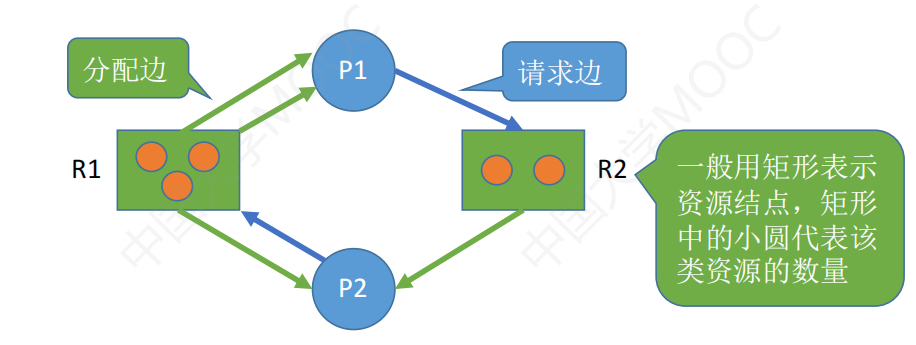

+ 矩形——一种资源
+ 矩形中的圆点——一个资源
+ 圆圈结点——进程
+ **资源->进程**：分配边，表示资源给了进程
+ **进程->资源**：请求边，表示进程请求资源


#### 死锁定理

+ 当且仅当S状态的资源分配图不可完全简化，S才为死锁

##### 简化资源分配图

1. 找到可以运行（不阻塞）的进程，假装运行，最后释放资源
2. 重复寻找过程，直到消除所有边
3. 相当于找安全序列的过程

#### 死锁解除方法

##### 1. 资源剥夺法

+ 挂起其中某些死锁进程，抢占资源，分配给其他死锁进程

##### 2. 撤销/终止进程法

+ 强制撤销部分**甚至全部**死锁进程，并剥夺资源。
+ 撤销可以按优先级/撤销代价/已执行时间/剩余时间进行

##### 3. 进程回退法

+ 让一个或多个进程**回退到死锁之前**
+ 需要OS记录还原点，不容易实现


# 第三章 内存管理

## 一、内存管理基础

### 基本概念

#### 链接与装入

创建进程首先要将程序的数据**装入内存**。将源程序变为内存中可执行的程序，有三步：

1. 编译：形成目标模块
2. 链接：将目标模块和库函数链接在一起，形成一个完整的**装入模块**
3. 装入：将装入模块装入内存运行

##### 链接的三种方式

1. 静态链接
   程序运行前，链接称完整的装入模块，之后不再拆开。

2. **装入时**动态链接：边装入边链接

3. **运行时**动态链接
   **执行时需要该模块时**，才链接。

   优点：便于修改更新、便于对目标模块共享

   

##### 装入的三种方式

1. 绝对装入：
   编译时知道绝对地址，产生绝对地址的目标代码。

   **只适用单道程序环境。**

2. 可重定位装入（**静态重定位**）：
   程序**装入时**对地址重定位，将逻辑地址转为物理地址。

   装入时必须**分配要求的全部内存空间；运行期间不能移动**

3. **动态重定位**：
   装入后并不立即进行地址转换，而是**推迟到执行时**在转换，
   因此装入后的地址依然是相对地址。

   **需要一个重定位寄存器，存放起始地址**

   允许程序在内存中发生移动。

   运行前只需装入部分代码即可运行；运行期间可以动态申请分配内存。


#### 内存管理的功能

1. 内存空间分配与回收
2. 地址转换
3. 内存空间扩充（实现虚拟性）
4. 内存共享
5. 内存保护

##### 内存保护方法

1. 上下限寄存器
2. 重定位寄存器（基地址寄存器）和界地址寄存器（限长寄存器）


### 连续分配管理方式

#### 1. 单一连续分配

+ 内存分为系统区和用户区
+ 内存中**只能有一道用户程序**，独占整个用户空间

##### 优点

1. 实现简单，**无外部碎片**；
2. 不需要内存保护

##### 缺点

1. 有内部碎片
2. 存储器利用率极低
3. 只能用于单用户、单任务的OS中

#### 2. 固定分区分配

+ 用户区分为若干**固定大小**的分区，**每个分区只装入一道作业**

##### 分区大小相等

+ 缺乏灵活性

##### 分区大小不等

+ 多个小分区，适量中分区，少量大分区
+ 通常将分区按大小排队，建立说明表

##### 优点

1. 实现简单，**无外部碎片**

##### 缺点

1. 程序太大，装不进任何一个分区，需要覆盖技术
2. 会产生**内部碎片**，内存利用率低


#### 3. 动态分区分配

##### 概念

+ 不会事先划分内存分区，而是进程装入内存时，**根据实际需要动态建立分区**
+ *没有内部碎片，有外部碎片**（某些空闲分区太小二难以利用）
+ 外部碎片可以通过**紧凑**技术解决（移动内存中的进程，将外部碎片攒到一起）
+ 进程结束，回收内存分区时，需要**将相邻的空闲分区合并**


##### 动态分区分配算法

###### 1）首次适应算法

+ 空闲分区按**地址递增**次序链接
+ 分配时，从链首**顺序查找**，找到能满足的第一个空闲分区
+ **最好+最快**

##### 2）最佳适应算法

+ 空闲分区按**容量递增**次序链接
+ 顺序查找空闲分区链，找到满足的第一个（即最小的空闲分区）

缺点：每次都选空间小的，最终会留下越来越多小的外部碎片

###### 3）最坏适应算法

+ 空闲分区按**容量递减**次序链接
+ 分配时，将第一个分区（即最大的）分配。（若最大的满足不了，后面全都满足不了）

缺点：导致大空间迅速用完，后来的大进程就分配不到内存

###### 4）邻近适应算法

+ 改进首次适应算法，使得每次都**从上次查找结束的位置继续查找**

+ 隐含**最佳适应算法的优点和最坏适应算法的缺点**

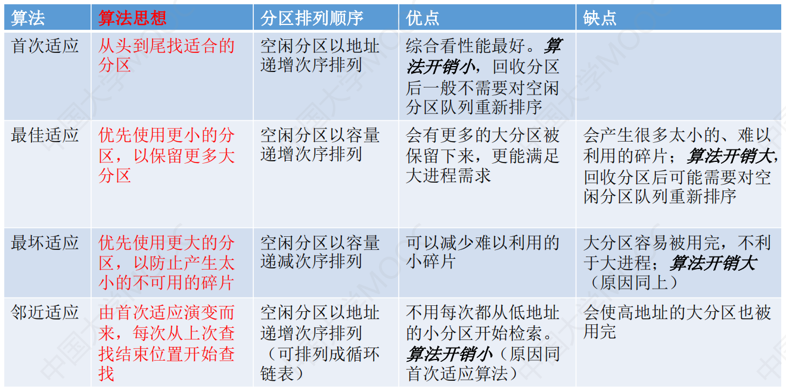

### 基本分页管理

#### 概念

分页管理将内存和进程都分为大小相等写固定的块，块相对较小，作为**主存和进程的基本单位**。

**分页管理不会产生外部碎片**。
由于进程和主存都以块为单位，因此**只有在最后一个不完整的块申请空间时，分配不了，才会产生内部碎片。**
每个进程平均产生半个块的内部碎片（页内碎片）。


##### 页面和页框

+ **进程分的块称为页/页面（Page）**——逻辑
+ **内存分的块称为内存块/物理块页框/页帧（Page Frame）**——物理
+ **一页对应一个内存块**

##### 页表

1. 一个进程一张页表
2. 一个页表项由页号+块号组成
3. 即存放**进程块与物理块的对应**
4. ==**注意页号只是用于访问页表项的下标，不占存储空间**==（页表项地址=页表起始地址+每个页表项的大小*页号）


#### 地址转换

任务：逻辑地址->物理地址

##### 逻辑地址结构

+ 页号+页内偏移量
+ 页号指明在**进程的第几块**
+ 页内偏移量指明在**页内第几个字节**
+ **==页内偏移量k位，说明一页$2^k$个字节==**
+ **==页号m位，说明一个进程最多$2^m$个页面==**


##### 转换步骤（基本地址变换机构）

由页号得到物理块号，加上页内偏移量即得到物理地址

设置页表寄存器存放页表起始地址和页表长度

1. 计算**页号=逻辑地址/页面大小, 页内偏移量=逻辑地址%页面大小**
2. 判断页号是否越界（**页号>=页表长度说明越界**）
3. **页表项地址=页表起始地址+页号*一个页表项长度**
4. 在页表项中取出物理块号，即可算出物理地址


#### 具有块表的地址变换机构

##### 块表

+ TLB，translation lookaside buffer联想寄存器
+ 是一种**高速缓存**，**集成在CPU内部**
+ 存放**最近访问的页表项副本**
+ 内存中的页表常称为慢表


##### 地址变换步骤

1. 计算页号、页内偏移量，并判断页号是否越界
2. 页号不越界，**先查询块表**，有对应页表项，直接得到内存块号，加上偏移量即可得物理地址
3. 快表中没查到（**未命中），再查询慢表**（算出页表项地址，取出内存块号）
4. **找到页表项后，应同时将其存入快表**


##### 性能

+ 快表命中，只需**访问一次内存**（快表不在内存里）
+ 快表未命中，需要**两次访存**（慢表也在内存里）
+ 一般快表命中率达90%以上
+ 若支持**快表慢表同时查询**，效率更高

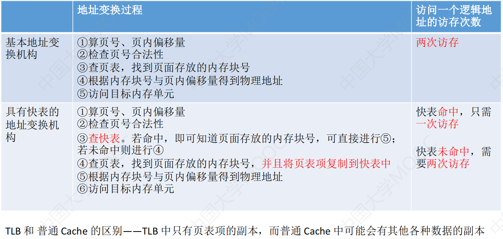


#### 两级页表

##### 单级页表产生的问题

1. 若页表太大，在内存中需要占用很多内存块
2. 没有必要让页表全部常驻内存，因为进程一段时间内只需要访问几个页面

##### 页表的页表

+ 为页表再建立一个页表，称为**页目录表/顶级页表**
+ **顶级页表最多只能占一个页面**
+ 采用多级页表结构，**各级页表大小都不能超过一个页面**

##### 逻辑地址结构

+ 顶级页号+二级页号+页内偏移量

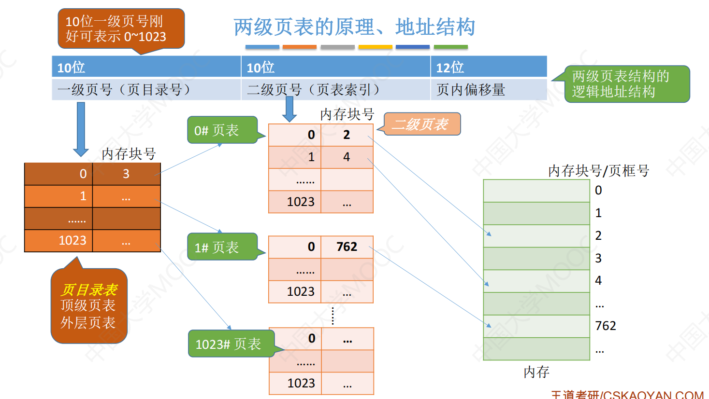


#### 分页管理的结论

1. **分页通过硬件实现，对用户完全透明**


### 基本分段管理

#### 分段

+ 按程序的逻辑关系划分为若干段，例如**主程序段、子程序段、数据段...**
+ **每个段都占连续的空间**（段内连续，段间不连续）
+ 按逻辑分段，使得用户变成更方便，程序的可读性更高
+ **每段长度不需要相同**

##### 逻辑地址结构

+ 段号S+段内偏移量W
+ 一个进程最多$2^S$个段
+ 一个段最长$2^W$字节


#### 段表

+ 段表项=段号+段长+该段起始位置
+ **由于每段长度不一致，因此不能直接由段号得到段所在内存块，需要指明段始址**
+ 段表项是定长的


#### 地址变换

系统设置段表寄存器，记录段表始址和段表长度

目的是通过段号找到该段的始址，加上段内偏移量即可得到物理地址

**注意段号和段长都是用来判断越界的！！！**

1. 算出段号和段内偏移量
2. **判断段号是否越界**（段号>=段表长度则越界）
3. 找到**段表项=段号*一个段表项长度+段表始址**，从段表项中提取段长和始址
4. **判断段内偏移量是否越界**（段内偏移量>段长则越界）
5. 段始址+段内偏移量=物理地址


#### 分段和分页对比


### 段页式管理

####  分段和分页的优缺点

|          | 优点                                                         | 缺点                                                         |
| -------- | ------------------------------------------------------------ | ------------------------------------------------------------ |
| 分页管理 | 内存空间利用率高，**不会产生外部碎片**，只会有少量的页内碎片 | 不方便按照逻辑模块实现信息的共享与保护                       |
| 分段管理 | 方便按照逻辑模块实现信息的共享与保护；<br />由于是根据代码逻辑分段的，因此**不会产生内部碎片** | 如果段长过大，为其分配很大的连续空间会很不方便；<br />段式管理**会产生外部碎片** |


#### 逻辑地址结构

+ **段比页大**（先按逻辑分段，每段按定长分页）
+ 段号+页号+页内偏移量
+ **段号位数决定每个进程最多可分多少段**
+ **页号位数决定每个段最多分多少页**
+ **页内偏移量决定页面大小**


#### 地址变换

##### 段表

+ **一个进程有一个段表**
+ **一段有一个页表**
+ 段表项=段号+**页表长度+页表始址**

##### 地址变换过程

系统设置段表寄存器，存放段表始址+段表长度

1. 计算段号、页号、页内偏移量
2. **检查段号是否越界**（段号>段表长度则越界）
3. 找到段表项=段号*一个段表项长度+段表始址，从段表项中获取**页表长度+页表始址**
4. **判断页号是否越界**（页号>页表长度则越界）
5. 找到页表项=页号*每页长度+页表始址，从页表项中获得内存块号
6. 物理地址=内存块号+页内偏移量


## 二、虚拟内存

### 基本概念

#### 传统存储管理方式的特征

##### 1. 一次性

+ 作业必须一次性全部装入内存才能运行
+ 作业很大时，装不进内存，导致**大作业无法运行**
+ 内存只能容纳少量作业，导致**多道程序并发度下降**

##### 2. 驻留性

+ 作业装入内存后，就**一直驻留在内存中**，不会被换出，直至结束
+ 其他进程长期处于阻塞态

#### 局部性原理

1. 时间局部性：
   同一条指令可能不久后会再次执行；同一个数据不久后会再次被访问

2. 空间局部性

   当前访问的某个存储单元**附近的存储单元**不久后会被访问

#### 虚拟存储器的特征

##### 1. 多次性

+ 分多次装入内存
+ **最重要特征**

##### 2. 对换性

+ 不需要常驻内存，允许换入换出


##### 3. 虚拟性

+ 逻辑上扩充容量
+ **最重要目标**


#### 虚拟内存实现

+ 建立在**离散分配**的内存管理基础上
+ 由传统的**基本**分页/分段/段页式**变为请求**分页/分段/段页式

##### 与传统方式的主要区别（两个新需求）

1. 访问信息不在内存时，**由操作系统负责将所需信息从外存调入内存——请求调页功能**
2. 内存空间不够，操作系统负责**将内存中暂时用不到的信息换出到外存——页面置换功能**


### 请求分页管理方式

#### 页表机制

##### 页表项新增字段

除了原有的页号、物理块号外，新增了4个字段：

1. 状态位P：表明**是否已调入**内存
2. 访问字段A：记录一段时间内该页的**访问次数**
3. 修改位M：记录**是否被修改**过。修改过的页面需要写回外存
4. 外存地址：该页存放的外存地址。（物理块号是内存）


#### 缺页中断机构

访问的页面不在内存时，产生缺页中断。此时应**将缺页的进程阻塞**。

+ 有空闲块，则分配一个内存块，修改页表项
+ 没有空闲块，选择一页淘汰替换。若被修改过，还需要写回外存

##### 缺页中断属于内中断

+ 需要保护CPU环境、分析原因、中断处理程序、恢复CPU环境等步骤
+ 一条指令可能引起多个缺页中断
+ 指令执行期间产生的中断，属于**异常**


#### 地址变换机构

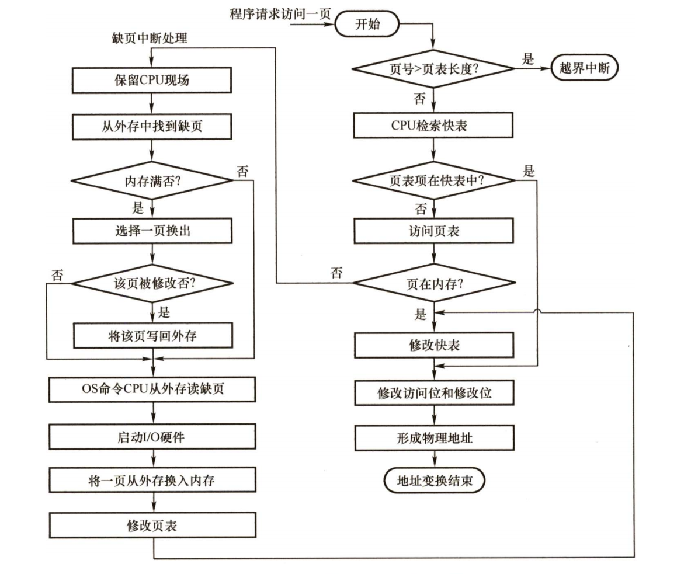

+ 只有写指令才需要修改“修改位”
+ 换入换出操作如果太频繁，会有很大开销
+ 页面调入内存后需要修改慢表，同时要将页表项复制到快表中


### 页面置换算法

+ 页面算法应追求**更少的缺页率**

#### 1. 最佳OPT置换算法

+ 选择**以后最长时间内不再被访问**的页面换出
+ 由于无法预知未来，因此无法实现
+ 但可以利用此算法评价其他算法

#### 2. 先进先出FIFO

+ 选择**最早进入内存**的页面换出
+ 换出的顺序严格按照物理块顺序

##### 只有FIFO会发生Belady异常

+ **FIFO是队列类，其他算法是堆栈类，而堆栈类不会出现Belady异常**
+ 给进程分配的物理块数增加，缺页率却不减反增
+ 因此FIFO算法性能差

#### 3. 最近最久未使用LRU

+ 选择最近最久未使用的页面换出
+ 页表项中的**访问字段记录上次被访问以来经历的时间**
+ 每次访问该页的访问字段清零
+ **性能最接近OPT**，但需要硬件支持，开销大

#### 4. 时钟CLOCK置换算法

+ 依然是选择未访问的页面，不过是**根据指针来循环选择**
+ 利用页表项的访问位，1表示最近访问过，0表示最近未访问过
+ 需要一个替换指针，**每次替换后都指向下一个页面**

##### 步骤

1. **若所有页面访问位都是1，则指针循环一周，将所有页面访问位都置0，最后回到刚才的位置**
2. 访问的页面存在，则直接访问并将访问位置1，**此时替换指针不动**
3. 访问页面不存在时，若指针指向的页面访问位为1，则**改为0，并将指针后移**，
   直到找到一个访问位为1的页面换出

+ 所有页面访问位为1的情况只有两种可能

  1. 刚开始运行时，内存为空，连续将几个页面放入内存后
  2. 运行过程中，**连续访问几个已存在的页面**，导致访问位全部为1

  页面不存在时，不可能出现所有页面访问位都是1

#### 5. 改进的CLOCK置换算法

+ 在CLOCK算法的基础上，**进一步找未被修改的**页面替换
+ 利用页表项的修改位，1表示修改过，0表示未修改
+ 优先选未修改的页面
+ 访问位和修改位组成二元组(0, 0)、(0,1)、(1,0)、(1,1)

##### 优先级：(0,0)>(0,1)>(1,0)>(1,1)

+ 四轮扫描出的页面严格按照上述顺序

##### 每次访问最多进行四轮扫描

1. 找(0,0)，找不到进行第二轮扫描
2. 找(0,1)，**本次访问将所有扫描过的访问位置0**，找不到进行第三轮扫描（即所有页面都被访问过）
3. 找(0,0)，找不到进行第四轮扫描（**进行到此步所有访问位都是0**）
4. 找(0,1)，一定能找到（**进行到此步说明所有页面都是(0,1)**）

+ **只有第二轮修改访问位**
+ **修改位不可能被修改，只用于判断**


### 页面分配策略、抖动与工作集

#### 页面分配

##### 驻留集

指请求分页管理中**给进程分配的物理块数目**

+ 驻留集大小一般小于进程总大小
+ 驻留集太小，进程缺页频繁
+ 驻留集太大，多道并发性下降，资源利用率低

##### 内存分配策略

**根据驻留集是否可变**，采取两种分配策略：固定分配和可变分配；

**根据置换页面的范围**，采取两种置换策略：

+ 局部置换：进程只能选择**分配给自己的**物理块进行置换
+ 全局置换：可以将OS保留的空闲物理块分配给缺页进程，
  也可以将别的进程的物理块置换到外存，在分配给缺页进程

|          | 局部置换                                                     | 全局置换                                                     |
| -------- | ------------------------------------------------------------ | ------------------------------------------------------------ |
| 固定分配 | 难以确定应该为进程分配多少物理块                             | 不存在（采用全局置换驻留集必然改变）                         |
| 可变分配 | 缺页时只会选择进程自己的物理块替换。<br />只有进程频繁缺页时，系统才会为进程多分配几个物理块，<br />只要缺页率正常位置；<br />反之缺页率特别低时，会减少几个物理块。 | 分配的物理块可以适当增加减少。缺页时选择空闲物理块分配，<br />若没有空闲块，则选择一个**未锁定**的页面换出再分配。<br />**只要进程缺页，都将获得新物理块**，除非空闲块用完。<br />被选中换出页面的进程的物理块会减少，缺页率会增加。 |


#### 调入页面

##### 何时调入页面

1. 预调页策略：一次调入若干相邻页面，成功率仅为50%

   一般用于**进程的首次调入（运行前调入）**

2. 请求调页：只有缺页时才调页，I/O开销大

##### 从何处调入页面

磁盘存储区分为**对换区和文件区**

+ 对换区用**连续分配，读写速度更快**
+ 文件区离散分配，读写慢

从何处调页分为三种情况

1. 系统有足够的对换区空间：页面调入调出操作全部在对换区进行。
   进程运行前要将相关数据从文件区复制到对换区。

2. 对换区不够：**不会被修改的文件都从文件区直接调入，且不需要写回。**

   **会被修改的文件写回到对换区，下次再从对换区调入。**

3. Unix方式：运行前数据在文件区，换出的文件都写回对换区，下次再从对换区调入。


#### 抖动（颠簸）

+ 刚刚调入的页面马上又要换出。
+ 根本原因是分配给进程的物理块数不够
+ 主要原因是**页面置换算法不合理**


##### 工作集

+ 某段时间间隔内，进程实际访问**页面的集合**（针对页号不是物理块）
+ OS利用**窗口大小**计算工作集
+ **驻留集不能小于工作集**，否则会频繁缺页


# 第四章 文件管理

## 一、文件

### 文件基本概念

#### (1)文件操作

##### 基本功能

+ 创建文件——**create系统调用**
+ 读文件——**read系统调用**
+ 写文件——**write系统调用**
+ 删除文件——**delete系统调用**
+ 打开文件——open系统调用
+ 关闭文件——close系统调用

~~**注：创建和删除是对外存操作，打开和关闭是对内存操作**~~

##### 创建文件create

用户进行create系统调用时，需要提供几个主要参数：

1. 所需的外存空间大小
2. 文件存放路径
3. 文件名

操作系统处理create系统调用时，主要做了两件事：

1. 分配外存空间
2. 找到所在目录文件，添加目录项FCB


##### 删除文件delete

用户进行delete系统调用时，需要提供两个参数：

1. 文件路径
2. 文件名

操作系统处理delete系统调用时，做三件事：

1. 找到目录项FCB
2. 根据FCB找到占用的磁盘块，将其回收
3. 删除目录项FCB


##### 打开文件open

用户使用open系统调用时，要提供几个参数：

1. 文件路径
2. 文件名
3. 要对文件的操作类型（r:只读、rw:读写）

操作系统处理open系统调用时：

1. 找到所在目录文件，**找到目录项FCB**，并检查用户是否有指定操作权限

2. **将目录项复制到内存的“打开文件表”中**

   **以后用户操作时，只需使用打开文件表的编号来指明要操作的文件，不用再次查找目录**

打开文件表

1. 系统打开文件表**（整个系统只有一张）**

   需要用**打开计数器**记录打开文件的进程数量

2. 进程的打开文件表

   **进程的打开文件表中的文件指向的是系统打开文件表**


##### 关闭文件close

操作系统处理close系统调用：

1. 删除**进程的**打开文件表项
2. 回收**内存**资源
3. 将系统打开文件表中计数器count减1，只有count=0时才删除表项


##### 读文件read

+ 即将文件**读入内存**
+ 读之前必须要先打开文件

用户需要指明：

1. 打开文件表中的索引号
2. 读入多少数据
3. 读入的数据放在内存中什么位置


##### 写文件write

+ 即将文件**写回外存**
+ 在记事本编辑内容后，通过“保存”操作调用OS系统的write系统调用，将数据**从内存写回外存**

需要提供：

1. 打开文件表的索引号
2. 写多少数据
3. 要写回外存的数据放在内存中的什么位置


#### （2）文件保护


### 文件的逻辑结构

逻辑结构即文件的内部组织形式，分为有结构和无结构文件

+ 无结构文件，又称**“流式文件”**，如txt。
+ 有结构文件，由一组相似的记录组成，又称“记录式文件”、每条记录又由若干条数据项组成。
  如：数据库表文件。每条记录有一个数据项作为**关键字**。根据各条记录长度是否相等，分为**定长记录**
  和**可变长记录**。

逻辑结构和物理结构区别：

+ 线性表/树/图为逻辑结构，顺序表/链表为物理结构
+ 逻辑结构为顺序存储，物理结构不一定顺序存储
+ **物理结构决定是否能够随机存取，与逻辑结构无关**


#### 有结构文件的逻辑结构

有结构文件按记录的组织形式可分为如下几种：

##### 1. 顺序文件

顺序文件物理上可以顺序存储或链式存储。

根据记录如何排列可分为**串结构**和**物理结构**

+ 串结构：记录之间的顺序与关键字无关。一般按时间顺序存放
+ 顺序结构：记录之间按关键字顺序排列。

**只有物理上顺序存储的定长记录才能随机存取！！**

+ 知道首地址A0和每条记录长度L就能知道第i条记录的地址
+ $A_i=A_0+i*L$

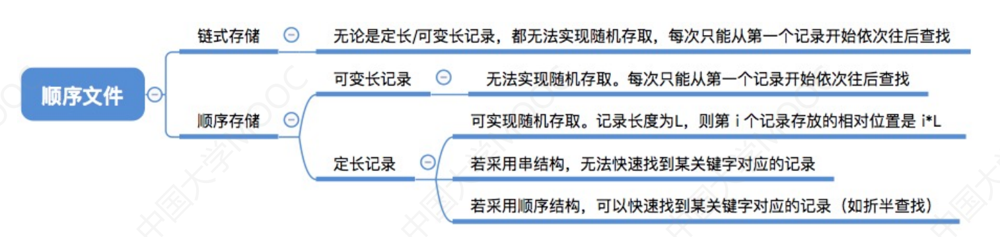

##### 2. 索引文件

——**解决了可变长文件不能随机存取导致查找速度慢的问题**：

+ 通过**索引表**将每条记录与一个索引项（相当于下标/指针）对应
+ 而**每个索引项是定长的（即索引表是顺序定长文件）**，因此只要知道索引表首地址和每个索引项的长度就能找到对应记录，
  **实现间接随机存取**

索引文件检索速度很快，主要用于**对信息处理的及时性要求比较高的场合**

还可以**根据不同数据项建立多个索引表**，即按姓名查找和按学号查找


##### 3. 索引顺序文件

索引表缺点：每个记录都要有一个索引表项，因此如果记录非常多，**索引表会太大，可能比文件内容还大**

索引顺序文件是**一组记录对应一个索引表项**，优化了索引表存储空间

+ 每组记录是一个顺序文件
+ **索引表项必须有序**

多级索引顺序文件：

+ 为索引表再建立索引表
+ 进一步提高了查找速度


### 文件的物理结构

物理结构研究文件应**如何存放在外存**中，物理结构有两个方面表达：**文件分配方式**和文件存储空间管理。

文件分配方式，即对磁盘**非空闲块**的管理；文件存储空间管理，即对磁盘**空闲块**的管理。

##### 文件块和磁盘块

内存管理中，进程逻辑地址空间被分为一个一个页面。类似的，外存管理中，**文件的逻辑地址空间也被分为了一个一个文件块**

于是文件的逻辑地址可以表示为==（逻辑块号，块内地址）==的形式。

操作系统为文件**分配存储空间就可以以块为单位**。


#### 1. 连续分配

+ 每个文件在磁盘上**占有一组连续的块**

用户只看到文件的逻辑地址，通过逻辑地址来操作自己的文件。

##### 优点

1. 支持顺序访问和随机访问
2. **顺序读写文件时速度最快**（磁头移动距离最短）

##### 缺点

1. 文件长度不方便拓展（后面的盘块可能已被占用）。
   文件中**某个记录被删除**时，为保持有序性，要对相邻的记录做移动，还会动态改变文件长度
2. 存储空间利用率低
3. 会产生难以利用的磁盘碎片（外部）。


#### 2. 链接分配

一块一块地离散分配，从而**消除了外部碎片**，且分配前不需要知道文件大小。

##### 隐式链接

+ FCB中需要存放**起始块号和结束块号**
+ 每块都有一个**指向下一块的指针**（除了最后一块），指针对用户透明
+ 相当于链表
+ **“隐式”表示不知道每块的下一块是什么**

结论：

+ 隐式链接**只支持顺序访问**
+ 查找效率低
+ 每个块中的指针耗费空间
+ **容易扩展文件大小**


##### 显式链接

把链接各块的指针显式存放在一张表中，即**文件分配表FAT(File Allocation Table).**

+ “显式”表示知道文件各块的链接顺序
+ 相当于链式前向星
+ **FCB只需要存放起始块号**

 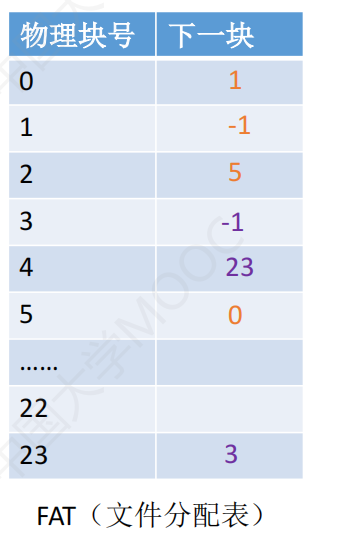

1. **FAT描述的是物理块的分配，不是逻辑块，因此整个磁盘仅设置一张FAT（表项与所有磁盘块一一对应）**
2. **FAT存放在内存中（常驻），因此查看FAT不需要磁盘IO**
3. -1表示最后一块；-2表示空闲块

###### 逻辑块转物理块的过程

1. 已知用户要访问的逻辑块号i，OS找到该文件对应的目录项FCB
2. 从FCB中取得**起始块号**
3. **查询FAT**，从起始块号开始，**在表中**找到i号逻辑块对应的物理块

结论：

1. 查找第i号块时**是在FAT中直接查看，不需要实际访问磁盘**。因此**支持随机访问。**
2. 没有外部碎片
3. 方便文件扩展


#### 3. 索引分配

##### 索引表

+ **为每个文件**建立一张索引表，记录逻辑块号和物理块号对应关系（**逻辑块号作为访问下标，不占物理空间**）
+ **FAT面向磁盘，索引表面向文件**
+ 每个文件**FCB需要指明自己的索引表在哪个盘块中，即“索引块”的块号**

##### 文件太大的解决方案

文件太大导致一个盘块放不下整个索引表

1. 链接方案：将多个索引块链接起来
   + 需要索引块中存放**指向下一索引块块的指针**
   + FCB中依然只需要第一个索引块号
   + 但访问物理块号需要将每个索引块**依次调入内存**（不知道后续索引块的块号），直到找到对应物理块。
     因此==**十分低效**==
2. 多层索引
   + 类似多级页表
   + 顶级索引表存放的全是指向二级索引表的指针
   + FCB依然只需要一个索引块号（**即顶级索引表块号**）
   + 访问对应物理块时只需**用逻辑地址算出索引表中的哪个表项，便可直接沿着指针访问**
   + **k级索引共访问k+1次**（所有文件访问次数相同）
3. 混合索引
   + 即丁即索引表中存放**部分直接地址、部分一级索引块号、部分二级索引块号，...**
   + 直接地址直接指向物理块，面向小文件
   + 一级索引块指向一个索引表，面向中文件
   + 二级索引块指向一个索引表的索引表，面向大文件
   + 小文件读磁盘次数少

##### 重要考点

1. 根据多层/混合索引结构计算**文件最大长度**
   Key:各级索引表最大为一个块

2. 分析**读磁盘次数**

   Key:注意顶级索引块是否调入内存，**读内存不算读磁盘次数**


##### 索引分配特点

+ 支持随机访问
+ 消除了外部碎片


#### 三种分配方式对比

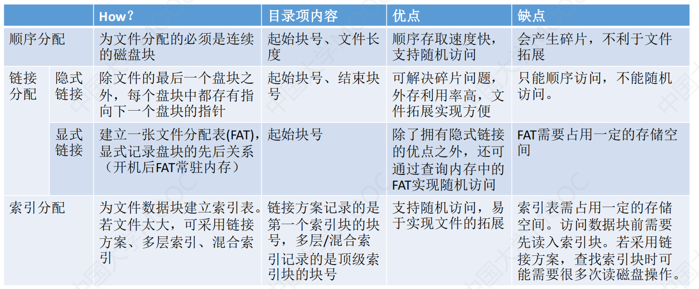


### 文件保护

#### 1。口令保护

##### 优点

+ 保存口令的控件开销小
+ 验证口令的时间开销小

##### 缺点

+ 口令存放在系统内部，不安全

#### 2.加密保护

+ 对文件加密，访问前提供密码解密（加密解密都是实际的操作）

##### 优点

+ 保密性强，不需要存储密码

##### 缺点

+ 编码译码需要时间


#### 3.访问控制

##### 权限类型

1. 读
2. 写
3. 执行：将文件装入内存并执行
4. 添加：append
5. 删除
6. 列表清单：列出文件名和属性


##### 存放访问权限信息

1. 抽象为一个**访问权限矩阵**
   + *每一位**表示一个权限
   + 每个用户都要用一行存放其各个权限
2. 精简的访问控制列表
   + 以“组”为单位，标记每个组可以对文件进行哪些操作

## 二、目录

### 目录基本概念

+ **文件目录是由一条条FCB组成，一个FCB就是一个文件目录项**
+ 目录是**有结构（定长）文件**

#### （1）文件控制块FCB

FCB包含了文件的**基本信息、存取控制信息、使用信息**

##### 基本信息：

+ **文件名**
+ **物理位置**
+ 逻辑结构
+ 物理结构

##### 存取控制信息：

+ 存取权限

##### 使用信息

+ 建立时间
+ 修改时间

##### FCB实现了文件名和文件的映射

+ 使用户可以实现**按名存取**


#### （2）目录操作

+ 创建文件：需要在目录中添加一个目录项FCB
+ 搜索：根据文件名搜索对应FCB
+ 删除文件：需要删除相应的FCB
+ 显示目录：用户可以请求显示目录内容，如显示目录内所有文件和属性
  （相当于点击进入文件夹界面）
+ 修改目录：要能够修改相应的FCB，例如文件重命名


#### （3）索引结点（FCB改进）

在目录中查找文件时，只用到了文件名，FCB中其他信息都白白占用了空间。因此可以将除文件名外
的**文件描述信息单独形成一个称为索引结点inode的数据结构**。从而**每个FCB就只有文件名和指向inode的指针**。

+ 使得目录存储空间大大减小，IO次数大大减少
+ 检索速度加快

##### 磁盘索引结点：

存放在磁盘中的索引结点称为磁盘索引结点。

##### 内存索引结点

文件被打开时，要将磁盘索引结点复制到内存的索引结点中。索引结点放到内存后称为“内存索引结点”。

内存索引结点需要**增加一些信息**：

+ 文件是否被修改
+ 有几个进程正在访问


### 目录结构

#### （1）单级目录结构

+ 整个系统只有一张目录
+ 一个文件占一个目录项
+ 实现了按名存取

##### 缺点：

1. 不允许重名
2. 不适用多用户操作系统

#### （2）两级目录结构

分为**主文件目录**和**用户文件目录**。每个用户有一个自己的目录

+ 不用用户的文件可以重名
+ **可以实现访问限制**（检查登录用户是否与用户名匹配）
+ 用户不能对自己的文件分类

#### （3）树形目录结构

+ 可以分类，层次清晰
+ 更有效的进行管理和保护
+ 很容易赋予不同的存取权限

##### 绝对路径

+ 从根目录出发，一直到当前文件

##### 当前目录和相对路径

+ 当前目录即当前文件所在的目录
+ 相对路径是从**当前目录出发**的路径

##### 缺点

+ 不便于实现文件共享


#### （4）无环图目录结构

+ 在树形目录基础上增加了一些**指向同一个结点的有向边**
+ 方便实现文件共享

##### 共享计数器

+ 为共享结点设置一个共享计数器，表示**当前正在访问的用户个数**
+ 只有计数器值为0时，才能删除文件
+ 计数器不为零时删除，**只能删除该用户的FCB，并使计数器值-1**


### 文件共享（硬链接和软链接）

#### 硬链接——基于索引结点的共享方式

##### 索引结点

1. 将除文件名外文件信息单独构成一个结点，称为索引结点
2. FCB中只有文件名和指向索引结点的指针

##### 如何实现共享

+ 索引结点中需要记录count，即共享的用户个数
+ **建立硬连接时，count值+1**

删除文件：

+ 仅删除用户的FCB，不删除文件
+ 并将索引结点中count--
+ 只有count=0时，才能删除文件

#### 软链接——基于符号链的共享方式

+ 用户目录中存放的是**link类型**的文件（即快捷方式）
+ 快捷方式中存放了共享文件的路径，没有指针指向共享文件
+ 访问时**由操作系统识别出link类型文件，并通过存放的文件路径访问共享文件**

##### 软链接的特点

+ **建立软连接时，count直接复制**
+ 文件删除后，快捷方式会失效

## 三、文件系统

### 外存空闲空间管理

> 内存管理分配内存块给进程，外存管理分配磁盘块给文件

#### 存储空间的划分与初始化

##### 磁盘分区

1. 一个磁盘可以划分多个分区，例如C盘、D盘
2. 每个分区通常称为**卷(volume)**
3. 也支持多个磁盘组成一个卷

##### 文件区和目录区

1. 每个卷中，存放文件数据的空间（文件区）和FCB空间（目录区）是分离的
2. **目录区包含文件目录、空闲表、位示图、超级块**等用于文件管理的数据

#### （1）空闲表法

系统为磁盘的空闲区建立一张空闲盘块表，存放**所有空闲区的起始块号和长度**

+ 一般适用于文件的**物理结构是连续分配方式**

##### 如何为文件分配磁盘块

+ 类似内存管理的动态分区分配
+ 为一个文件分配**连续的存储空间**
+ 可采用**首次适应、最佳适应、最坏适应等算法**

##### 如何回收磁盘块

+ 类似内存内存管理的动态分区分配
+ 前后由相邻空闲区，需要**合并**

#### （2）空闲链表法

##### 1.空闲盘块链

+ 以盘块为单位链接所有空闲块
+ **每个盘块中都要有一个指向下一盘块的指针**
+ 操作系统需要保存**链头和链尾指针**

###### 为文件分配磁盘块

1. 从链头开始，一次摘下K个盘块分配
2. 修改空闲链的链头指针

###### 回收盘块

+ 回收的盘块**依次挂到链尾**，并修改链尾指针

##### 2.空闲盘区链

+ 以盘区为单位链接成一个链表
+ **一个盘区有多个盘块**
+ 操作系统需要保存**链头和链尾指针**

###### 分配磁盘块

+ 可采用首次适应、最佳适应等算法，从链头开始查找，找到一个大小符合要求的空闲盘区分配
+ 盘区不是完整地分配给文件，分配后会产生小空闲盘块
+ 因此需要修改链指针，盘区大小等数据

###### 回收盘块

+ 注意合并
+ 没有相邻盘块时，直接挂到链尾

#### （3）位示图法

+ **每一位**对应一个盘块
+ 1表示已分配，0表示空闲

> 磁盘大小1MB，一个盘块1KB，则共有1K=1024个盘块，需要1024位，即1024/8=128B存放位示图

+ 用（字号，位号）二元组表示每一个位（盘块号）
+ 字号为行号，位号为列号

##### 分配磁盘块

1. 顺序扫描位示图，找到K个0（相邻或不相邻）
2. **根据（字号，位号）算出对应盘块号**，将相应盘块分配给文件
3. 将位示图中已分配的位修改为1

##### 回收盘块

1. **根据回收的盘块号算出对应（字号，位号）**
2. 将位示图中对应位修改为0

#### （4）成组链接法

> Unix使用成组链接法管理空闲磁盘块

+ 空闲表、空闲链表法不适合大型文件系统，因为链表可能过大

##### 超级块

+ 文件**卷的目录区**中专门用**一个盘块**作为超级块
+ 系统启动时将超级块读入内存，并维护内外存数据一致性

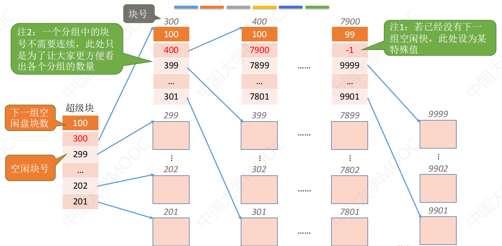

+ 超级块不是空闲的，需要存放**下一组**空闲块数和所有空闲块的块号
+ 每层都有一个非空闲块，存放下一组空闲块数和块号
+ 超级块中的第二元素存放下一组非空闲块的块号
+ -1表示没有下一组空闲块

##### 如何分配磁盘块

1. 检查超级块指明第一组分组的块数是否足够，足够则分配

2. 若要将**第一组的所有块全部分配出去，则需要将当前组中存放下一组空闲块号的磁盘块内容复制到超级块中**

   这样使得分配后，超级块指向的是原来的下一组空闲块，空闲块的信息得以保留

##### 回收磁盘块

1. 第一个分组没满，就将回收的块加入到对应分组

2. 第一个分组满了，就将回收的块**组成新的分组，新分组用一个块指向原来第一个分组的空闲块信息，**

   **即将超级块的信息复制到新分组的第一个块中，并修改超级块内容，使其指向新分组**


### 文件系统全局结构

#### 1. 文件系统在外存（磁盘）中的结构

##### 磁盘格式化步骤

1. 对原始磁盘做的第一件事就是**物理格式化**：即对磁盘**划分扇区**，检测坏扇区，用备用扇区替换坏扇区
2. 对磁盘**分区(C、D、E)**，分区又称卷(volume)；每个分区有一部分存放**引导块、超级块**等信息。
   整个磁盘有一个**主引导记录**，存放磁盘引导程序和分区表。
3. **逻辑格式化**：创建文件系统

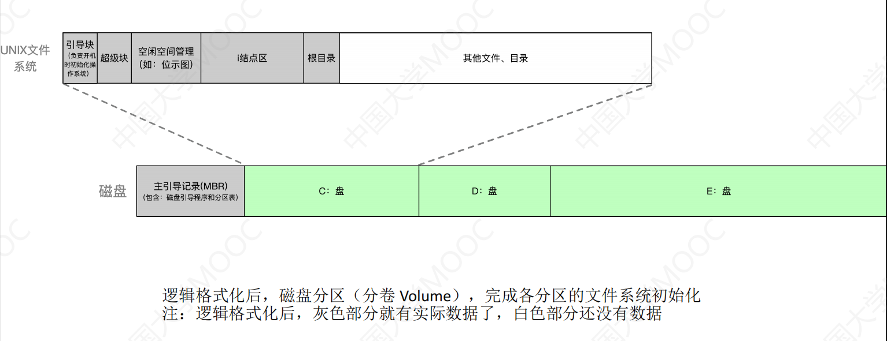


#### 2. 文件系统在内存中的结构

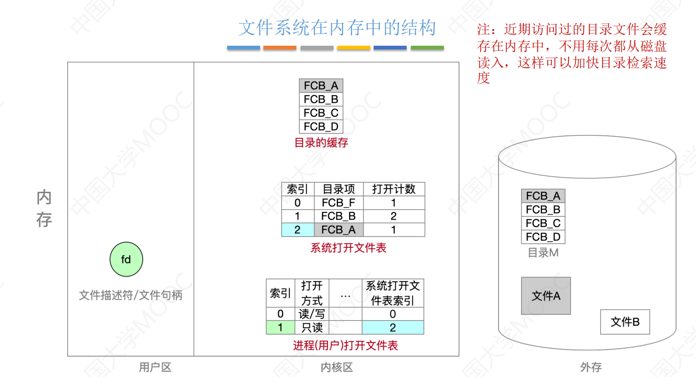

+ 内存的内核区存放**系统打开文件表和各个进程的打开文件表**
+ 还会用目录缓存存放近期打开的文件目录


### 虚拟文件系统

目的：不同的硬盘可能有不同的文件系统(NTFS/FAT/UFS等)，为了屏蔽不同文件系统的差异和操作细节，
引入了虚拟文件系统VFS，提供了文件系统操作的**统一接口**。

实现：虚拟文件系统**要求下层所有的文件系统实现指定的接口(open/read/write等)，因此一个新文件系统要想在OS上运行，必须满足VFS规定的要求**

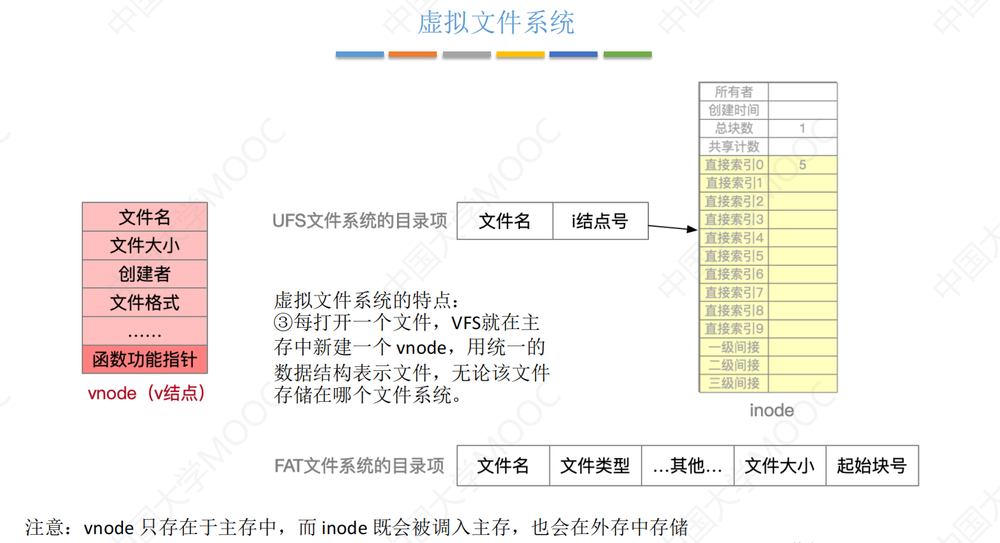

+ 对于不同文件系统的不同目录结构，虚拟文件系统设置一个自己的目录节点vnode,
  将下层文件系统的所有信息**复制到vnode对应元素中**，就可以统一描述目录结构
+ 其中**函数功能指针指向的是下层文件系统提供的函数功能**，此时就能**实现系统调用的统一性**

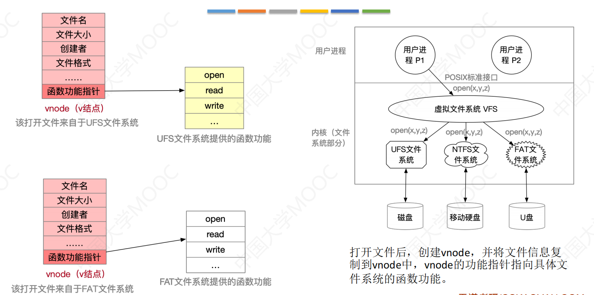


### 文件系统挂载（安装）

即如何将一个文件系统安装到操作系统中?
例如插入U盘时，U盘内的文件系统就需要挂载到操作系统中。

##### 文件系统挂载要做的事

1. 在VFS中注册。
   **内存中有一个挂载表，存放每个文件系统的信息，包括文件系统类型、容量大小等**
2. 新的系统需要给VFS提供一个**函数地址列表**
3. 将新文件系统加到**挂载点(mount point)**，也就是将新文件系统挂载到某个父目录之下


# 第五章 I/O管理

## 一、I/O管理基础

### 设备分类

##### 1.按使用特性分

+ 人机交互类
+ 存储设备
+ 网络通信设备

##### 2.按传输速率分

+ 低速：键盘鼠标
+ 中速：激光打印机
+ 高速：磁盘、光盘

##### 3.按信息交换的单位分

+ 块设备（传输快，可寻址）
+ 字符设备（传输慢，**不可寻址**，常采用中断驱动方式）

### I/O接口（I/O控制器）

#### 功能

1. 接收和识别CPU发出的命令——控制寄存器
2. 向CPU报告设备的状态——状态寄存器
3. 数据交换——数据寄存器，暂存输入输出的数据
4. 地址识别——由I/O逻辑实现

#### 组成

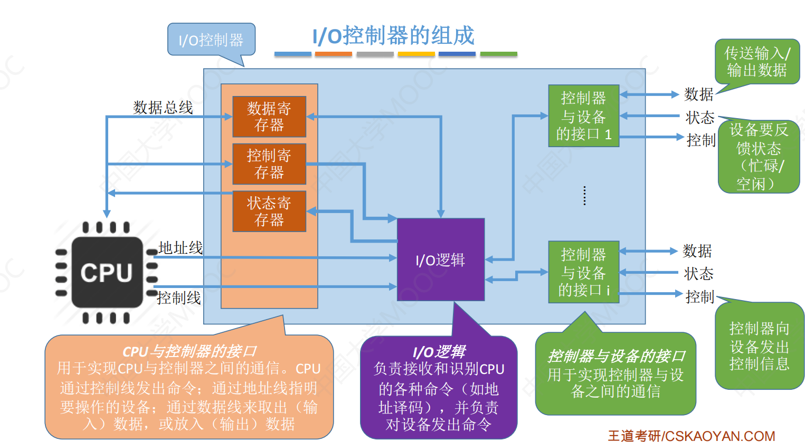

+ 一个I/O接口可以对应多个设备
+ 数据、控制/状态寄存器可能有多个，这些寄存器称为**I/O端口**

##### I/O端口编址

+ I/O端口指I/O接口中能被CPU直接访问的寄存器
+ 分为统一编址（内存映像I/O)和独立编制

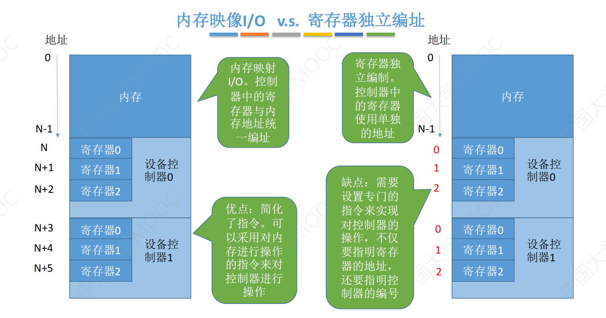


### I/O控制方式

#### （1）程序直接控制方式

##### 数据流向

+ 设备准备好的数据必须要先后经过**I/O接口中的寄存器和CPU内部的寄存器**，最后才能进入内存
+ 读（设备输入内存）：I/O设备->CPU->内存
+ 写（内存输出设备）：内存->CPU->I/O设备

##### 一次读写的流程

 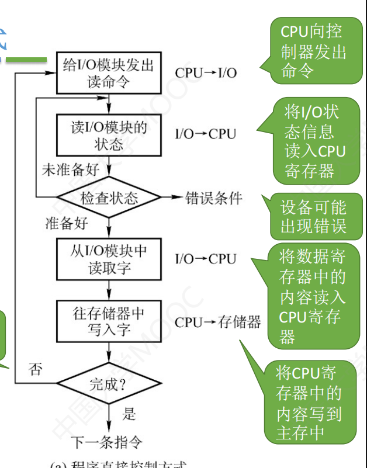

+ CPU不断轮询检查
+ 每次读写**一个字**，即**每个字的读写都要CPU干预**

##### 优缺点

+ 优：实现简单（在程序中用循环检查）
+ 缺：**CPU和I/O设备只能串行工作，CPU要一直轮询检查，长期“忙等”**


#### （2）中断方式

##### 数据流向

+ 和程序直接控制方式一样

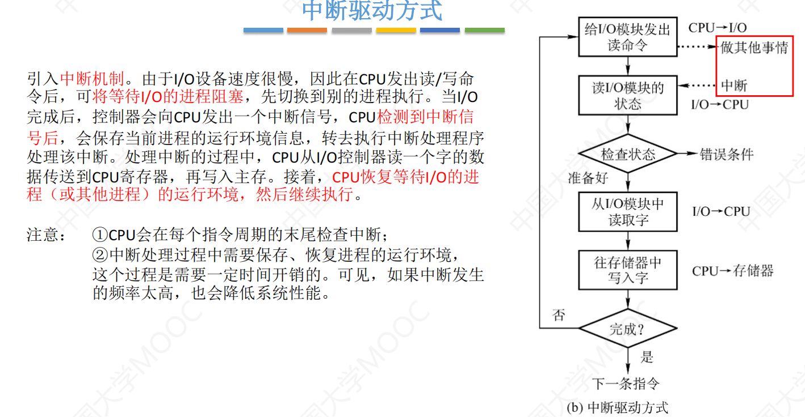

+ 每次读写一个字

##### 优缺点

+ 优：CPU不需要轮询等待；**CPU与I/O设备可并行工作**
+ 缺点：每个字的传送都要经过CPU；**频繁中断会消耗较多的CPU时间**


#### （3）DMA方式

> Direct Memory Access, 不经过CPU，直接从存储器存取

1. 数据传送**单位是“块”**，不是一个字一个字地传送
2. 数据流向不经过CPU
3. 仅在传送一个块的开始和结束时，才需要CPU干预

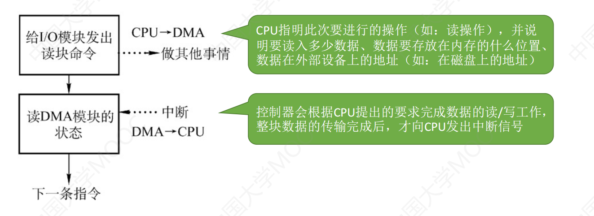

##### DMA控制器

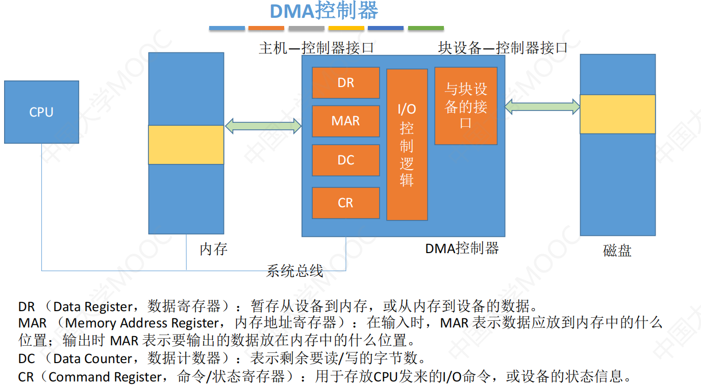


##### 特点

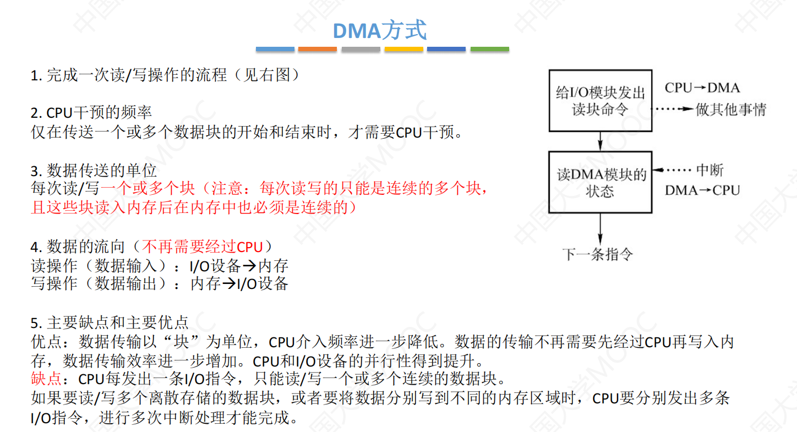


#### （4）通道方式

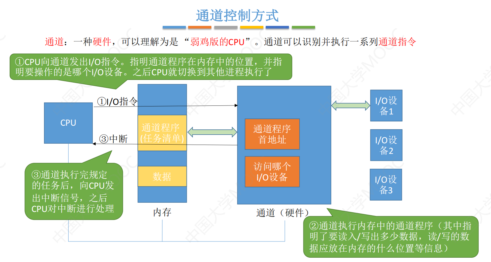

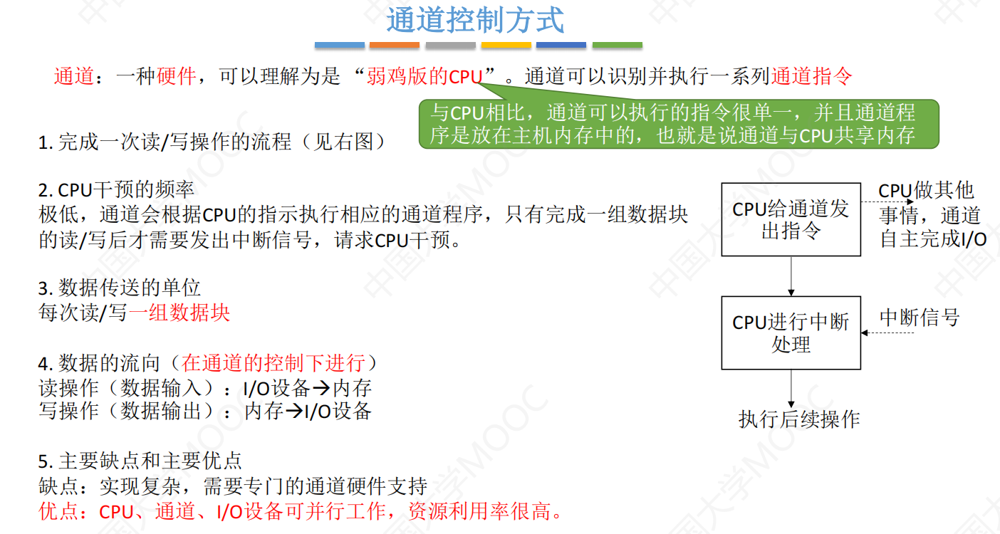

+ 一个通道可控制多个**I/O控制器**，一个I/O控制器可控制多个I/O设备

#### 四种方式对比

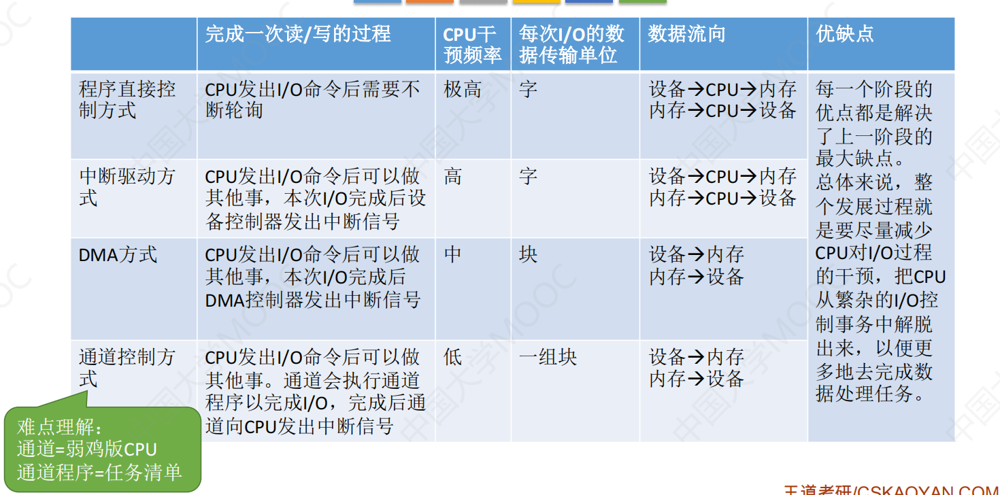


### I/O软件层次结构

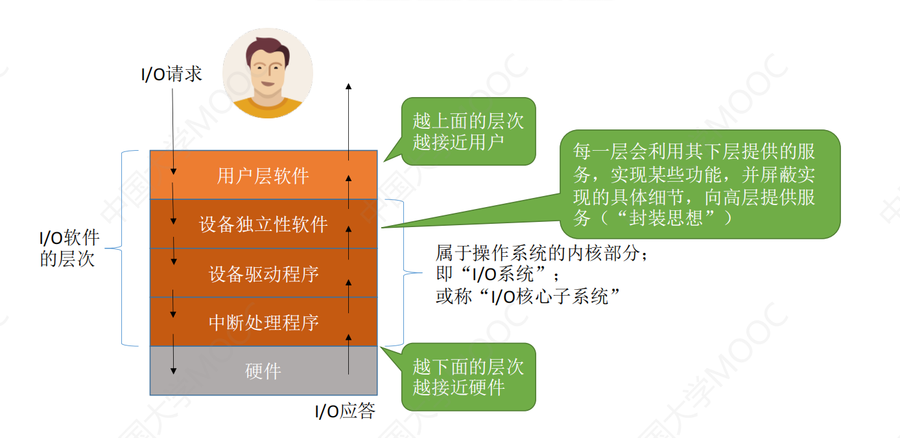

#### （1）用户层软件

+ 实现了与用户交互的接口(`printf`)
+ **将用户请求翻译成格式化的I/O请求，并通过系统调用请求操作系统内核的服务**

#### （2）设备独立性软件（系统调用处理层）

##### 功能

1. 向上层提供统一的调用接口（read/write系统调用）
2. 设备保护
   类似文件保护（设备被看成是特殊的文件）。设备访问权限不同
3. 差错处理
4. 设备分配与回收
5. 数据缓冲区管理：解决不同设备数据传输速率的差异
6. 逻辑设备与物理设备名的映射；
   根据**设备类型**选择调用相应的驱动程序

##### 逻辑设备表LUT

+ 存放逻辑设备名和物理设备名的映射

两种方式

1. 整个系统只设置一张LUT，此时所有用户不能使用相同的逻辑设备名。
   这种方式只适用单用户操作系统。（相当于单级目录结构）
2. 为每个用户设置一张LUT。
   系统会在用户登录时建立一个**用户管理进程**，而LUT就存放在用户管理进程的PCB中。


#### （3）设备驱动程序

+ 不同设备由不同的驱动程序
+ 驱动程序一般以一个**独立进程**的方式存在

##### 功能

+ 负责对硬件设备的具体控制，将上层发出的I/O命令转化为对设备的具体操作
+ 负责执行命令，而不是翻译命令

#### （4）中断处理程序

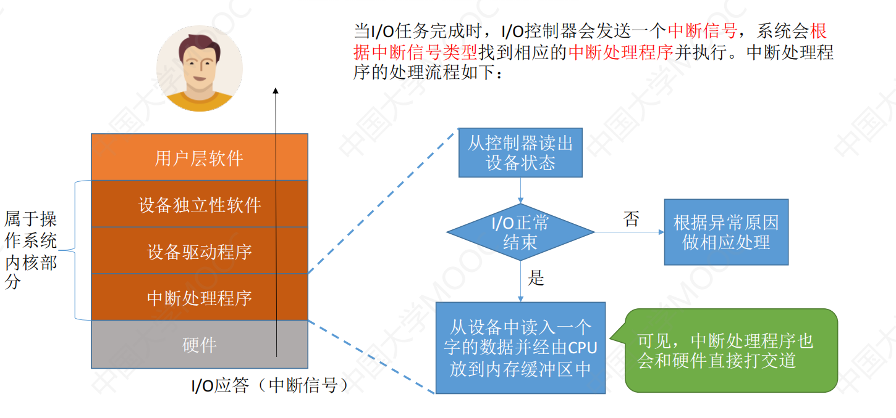

+ 输入数据**自底向上**


### I/O应用程序接口

用户层的应用程序无法用一个统一的系统调用接口来完成所有类型设备的IO。
对不同设备操作需要不同类型的接口。

#### （1）字符设备接口

+ get/put系统调用：向字符设备读/写一个字符
+ 字符设备不可寻址，只能顺序存取
+ 通常为字符设备建立一个**字符缓冲区**


#### （2）块设备接口

+ read/write系统调用：向块设备的**读写指针**位置读/写多个字符；
+ seek系统调用：**修改读写指针位置**


#### （3）网络设备接口

+ 又称socket接口
+ socket系统调用：**创建一个socket**，需指明网络协议
+ bind：将socket绑定到某个本地**端口**
+ connect：将socket连接到远程地址
+ read/write：从socket读/写数据

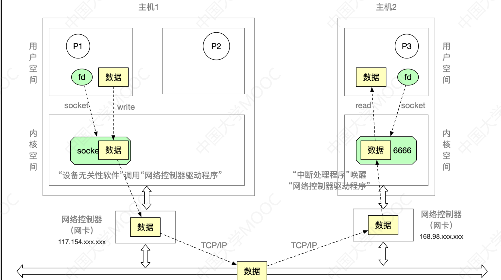

#### （4）阻塞/非阻塞IO

+ 阻塞IO：应用程序发出I/O系统调用后，**进程需转为阻塞态等待**
  例：`scanf`
+ 非阻塞IO：应用程序发出I/O系统调用后，系统调用可迅速返回，**进程无需阻塞等待**
  例：`write`


## 二、设备独立性软件

### 缓冲区管理

#### 缓冲区概念

+ 一个存储区域，可以用专门的硬件寄存器实现，也可以用内存充当缓冲区
+ 使用硬件成本高，容量小
+ 本节讨论的是**用内存作为缓冲区**

##### 缓冲区作用

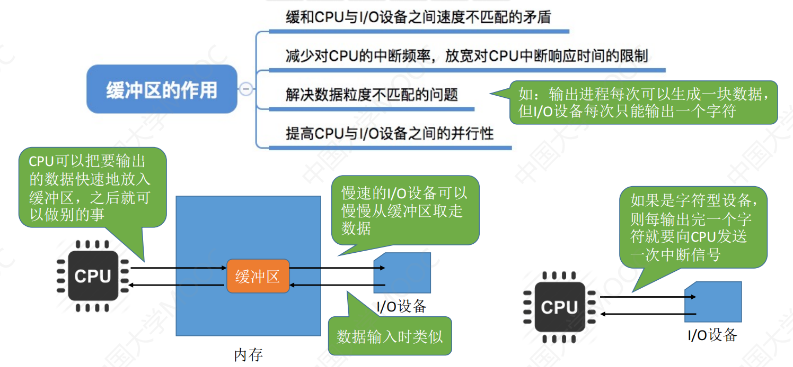


#### 单缓冲

> T为设备将数据写入缓冲区的时间（设备->缓冲区）
> M为缓冲区数据送入用户工作区的时间（缓冲区->工作区）
> C为CPU处理工作区数据的时间（工作区->CPU）

+ 初始状态：工作区满，缓冲区空
+ 每处理一块数据的平均时间：$max(C,T)+M$

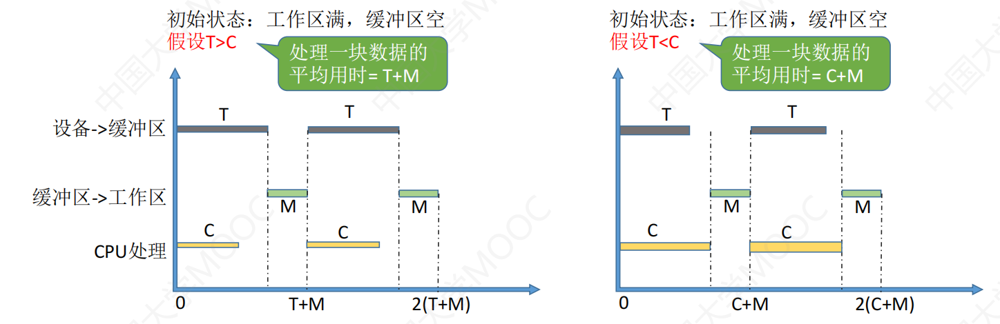

#### 双缓冲

+ 初始状态：工作区空，其中一个缓冲区满
+ 每处理一块数据的平均时间：$max(C+M,T)$
+ **若T>C+M，则设备可以一直输入数据不间断**
  **若T<C+M，则CPU不用等待设备输入，数据送入工作区后就能立即处理**

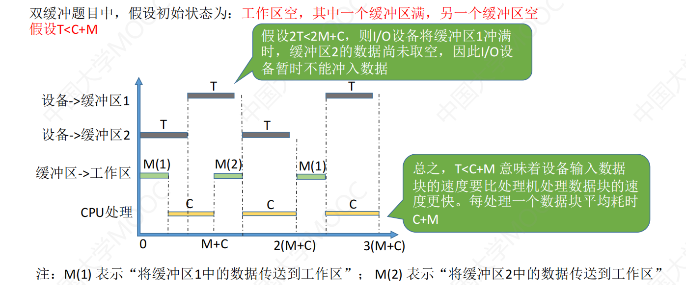

#### 循环缓冲

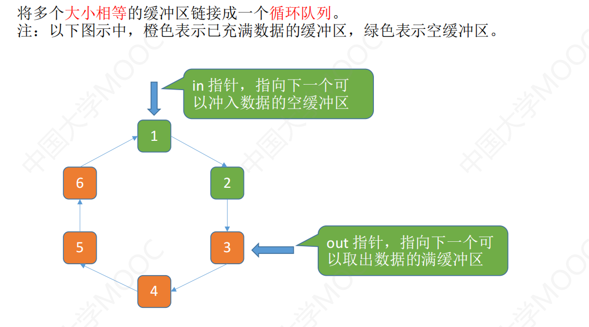

#### 缓冲池

##### 数据结构

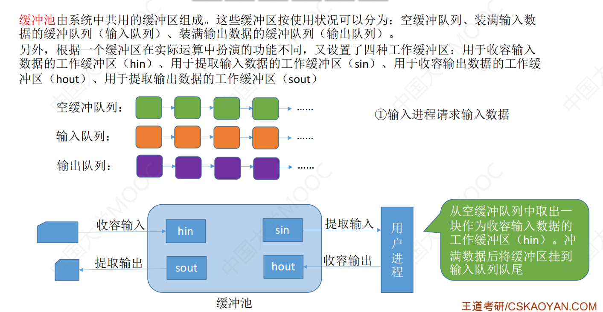

##### 工作方式

1. 输入进程请求输入数据：
   从空缓冲队列取到hin，输入完后挂到输入队列
2. 计算进程想取得一块输入数据：
   从输入队列取到sin，用完后挂到空缓冲队列
3. 计算进程想将准备好的数据冲入缓冲区：
   从空缓冲队列取到hout，冲完后挂到输出队列
4. 输出进程请求输出数据：
   从输出队列取到sout，输出完后挂到空缓冲队列

### 假脱机技术（SPOOLing）

+ 脱机技术：脱离主机控制进行的I/O操作
+ 假脱机技术；用**软件方式**模拟脱机技术
+ **实现SPOOLing技术，必须要有多道程序技术支持**

#### 组成

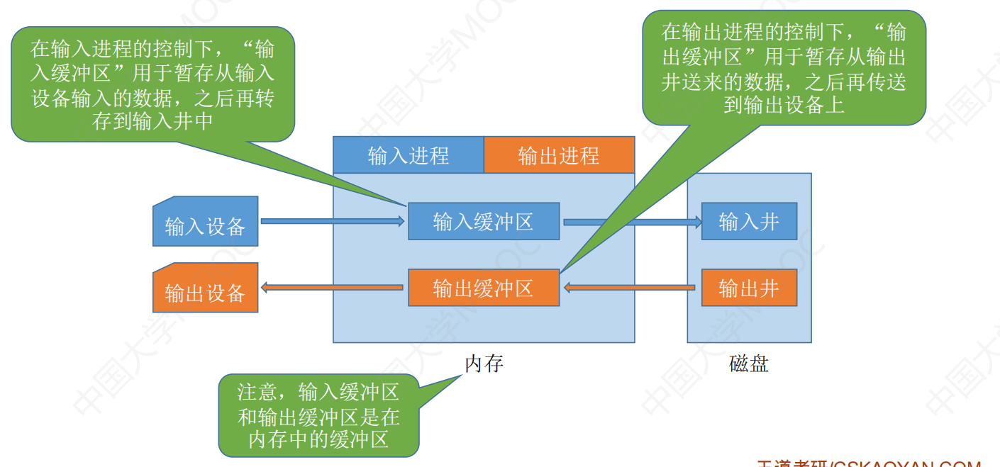

+ 输入/输出井位于**磁盘**固定区域
+ 输入/输出缓冲区位于**内存**
+ **构成SPOOLing技术的基本条件是不仅要有大容量、高速度的外存作为输入/输出井，而且还要有SPOOLing软件**
+ 输入/输出井模拟磁盘，**打印数据应首先送到输出井**
+ 输入/输出缓冲区**位于两者之间**，数据不应该首先放到缓冲区


#### 特点

+ 把一台物理设备**虚拟**成逻辑上的多台设备，**将独占式设备改造成共享式设备**
+ 以空间换时间
+ 缓和CPU与IO设备之间速度不匹配的矛盾


### 设备分配与回收

#### （1）设备分配时应考虑的因素


##### 设备分配算法

+ 先来先服务
+ 优先级高者优先
+ 短任务优先

##### 安全和不安全分配方式

安全分配方式：进程**请求IO后就进入阻塞态**，直到IO完成后才唤醒

+ **阻塞的进程不能保持任何资源**
+ 优：不会死锁（破坏请求和保持条件）
+ 缺：CPU和IO设备只能串行工作

不安全方式：进程请求IO后，系统为其分配设备，进程**可继续执行**，之后可以发出新的IO请求。
只有某个IO请求得不到满足时才阻塞

+ 优：进程的计算任务和IO可并行处理
+ 缺：可能死锁

##### 静态分配和动态分配

+ 静态：进程运行前分配全部资源，直到运行结束释放
+ 动态：运行时动态申请

#### （2）设备分配的数据结构

##### 设备、控制器与通道

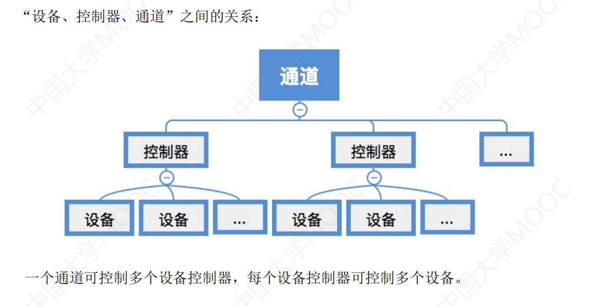

##### 1.设备控制表


##### 2.控制器控制表

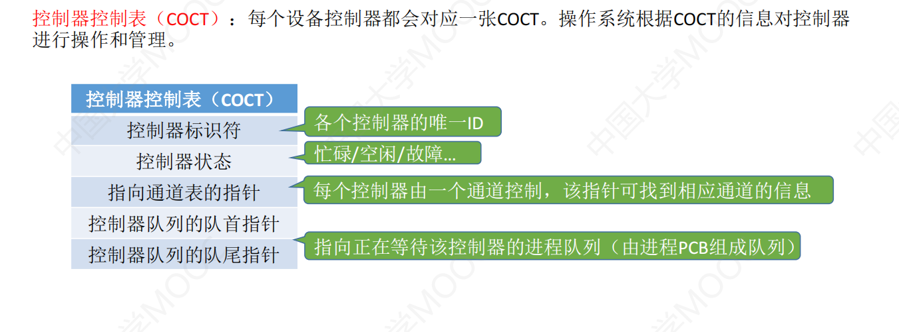


##### 3. 通道控制表

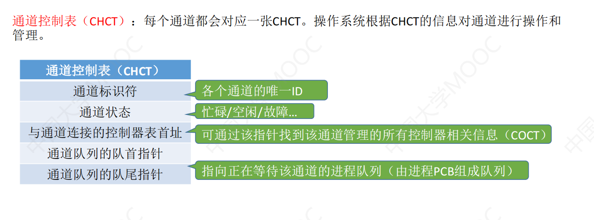


##### 4. 系统设备表


#### （3）设备分配步骤

1. 根据进程请求的物理设备名**在系统设备表中查找**表项
2. 在表项中找到**设备控制表**，若设备忙碌则进程PCB挂到**设备等待队列**中；
   不忙碌则将设备分配给进程。
3. 通过设备控制表指向控制器控制表的指针**找到控制器控制表**。
   若控制器忙碌则将进程PCB挂到**控制器等待队列**中，不忙碌则将控制器分配给进程。
4. 在控制器控制表中**找到通道控制表**。若通道忙碌则江金城挂到**通道等待队列**中，
   不忙碌则将通道分配给进程。

+ ==**只有设备、控制器、通道三者都分配成功后，设备分配才算成功，之后便可启动IO设备进行数据传送**==

##### 缺点


##### 改进

+ 引入**逻辑设备表LUT**，实现逻辑设备名到物理设备名的转换

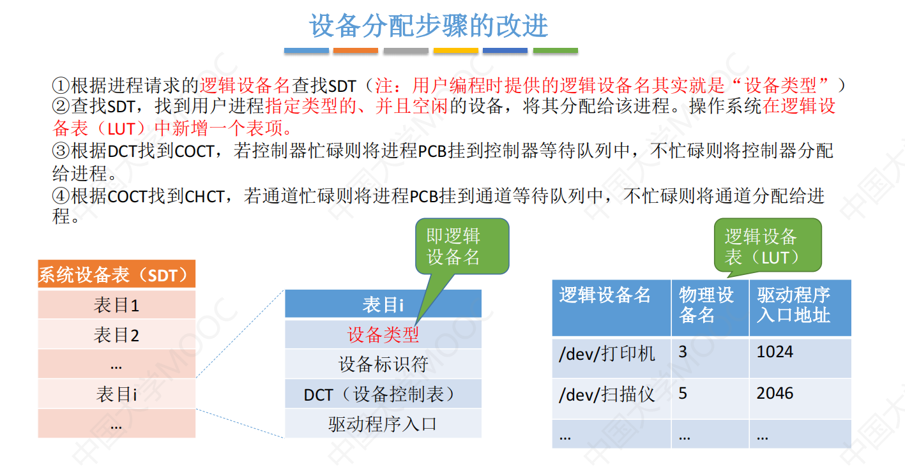

### 设备驱动程序接口

+ 操作系统规定好设备驱动程序的接口标准，各厂商必须按要求开发设备驱动程序

##  三、磁盘管理

### 磁盘概念

#### 磁盘、磁道和扇区

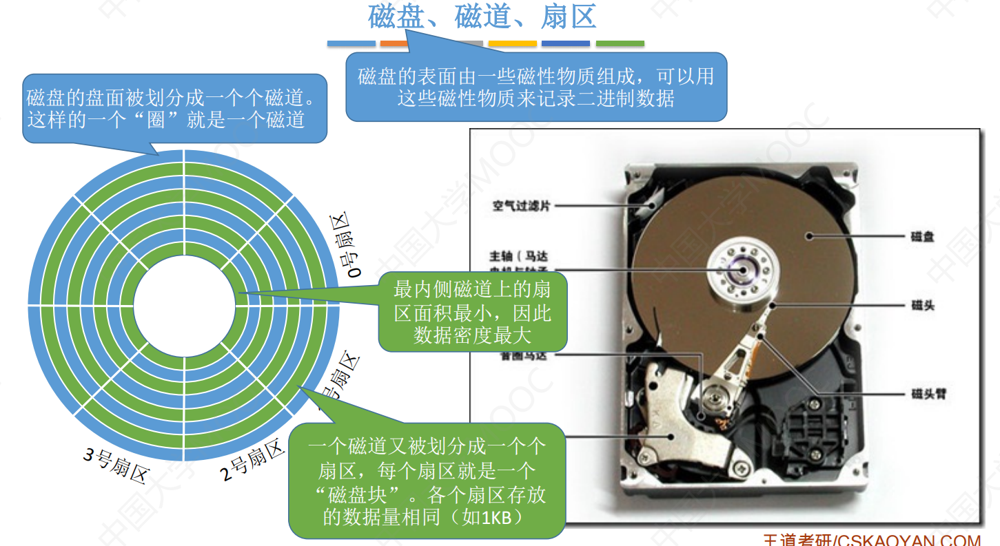

+ 一整个圆为一个磁道，一块磁盘按半径分为若干个磁道
+ 一个磁道分为很多扇区（扇形条状）
+ **一个扇区称为一个盘块**


#### 盘面和柱面

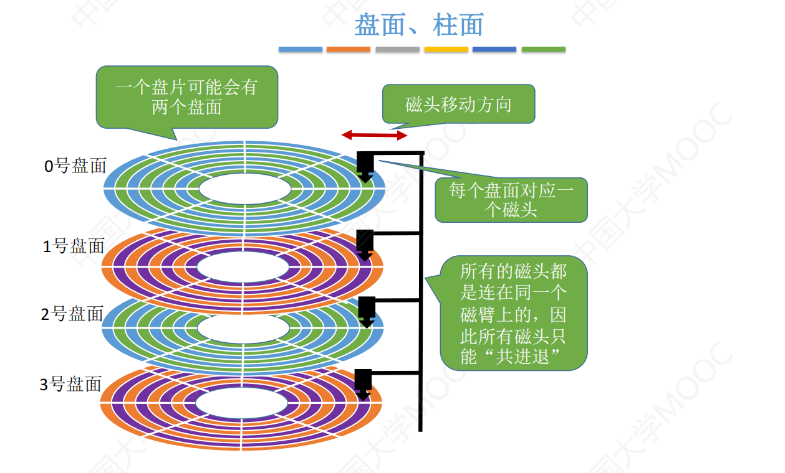

+ 盘块的物理地址可以用（柱面号，盘面号、扇区号）表示
+ 柱面号即**在哪一圈**，盘面号即**在哪一层**
+ **盘块（扇区）是磁盘可寻址的最小单位**


### 磁盘管理

#### 1.磁盘初始化

##### 第一步：**物理格式化**（低级格式化）

+ 将磁盘各个磁道**分扇区**
+ 一个扇区分为头、数据区域、尾
+ **管理扇区需要的数据结构放在头、尾两部分**，包括
  扇区校验码（奇偶校验、CRC等）

##### 第二步：分区

+ 即分为C盘、D盘等
+ 每个分区由若干柱面（磁道）组成

##### 第三步：逻辑格式化

+ 即**创建文件系统**
+ 包括创建文件系统的**根目录**、**初始化**存储空间管理
  所用的**数据结构**（如位示图、空闲分区表）

#### 2.引导块

+ 计算机启动时要运行一个**初始化程序——自举程序**，
  它初始化CPU、寄存器、I/O接口（设备控制器）和内存等

##### 自举程序位置

+ ROM中存放很小的**自举装入程序**
+ 将完整功能的引导程序放在磁盘的**启动块/引导块/启动分区**上
+ 计算机启动时，先运行自举装入程序，执行该程序后就能**找到引导块，**
  并将**完整的自举程序读入内存**，完成磁盘初始化
+ 拥有引导块的磁盘称为**系统磁盘/启动磁盘**

#### 3.坏块的管理

+ 坏块的管理目的是**使系统不使用坏块**

##### 坏块检查

+ 对于简单的磁盘，可以在**逻辑初始化时**检查到坏块，并**在FAT上标注**
+ 对于复杂的磁盘，磁盘控制器会维护一个**坏块链表**，
  磁盘出厂前（即**物理格式化时**）就已经将链表初始化。

##### 坏块替换

+ 保留一些**备用扇区**，用于替换坏块
+ 这种方案称为**扇区备用**
+ **这一过程中，坏块对操作系统透明**


### 磁盘调度算法

#### 磁盘读写时间分析

> 一次磁盘读写时间=**寻道时间+旋转延迟+传输时间**

##### 1. 寻道时间

+ 寻道即**找磁道（沿半径方向）**
+ 取决于磁盘调度算法

##### 2. 旋转延迟

+ 即**找扇区（在同一个圆内旋转）**
+ $设一秒转r圈,则转一圈\frac{1}{r}秒，平均查找时间\frac{1}{2r}秒$


##### 3. 传输时间

+ 即读写数据的时间
+ 取决于读写的**字节数**和磁盘**旋转速度**
+ $设读取b字节,一个磁道(一圈)有N字节,则需要读\frac{b}{N}圈$
  $设一秒转r圈,则转一圈\frac{1}{r}秒，读取时间为\frac{1}{r}\frac{b}{N}秒$

#### 磁盘寻道算法

##### 1. 先来先服务FCFS

+ 按请求次序调度，公平
+ **不会出现磁壁黏着**：总是访问某个磁道而不相应其他磁道的请求


##### 2. 最短寻找时间优先SSTF（最短距离）

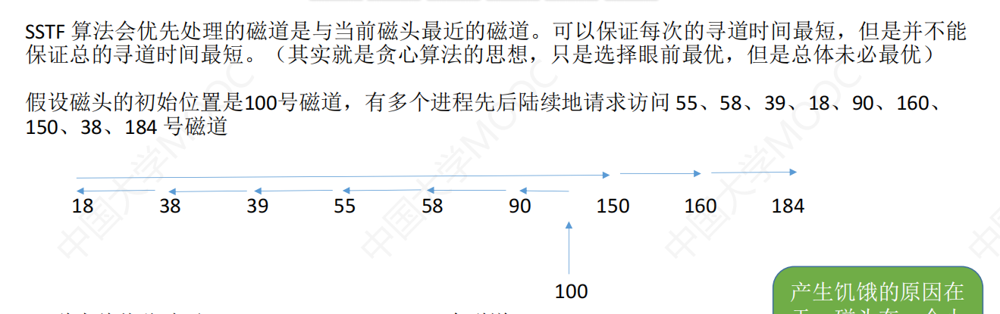

+ 一次可以看到全部的访问请求，因此**与请求先后次序无关**
+ 会**产生饥饿**
+ 会出现磁道黏着


##### 3. SCAN算法（电梯）

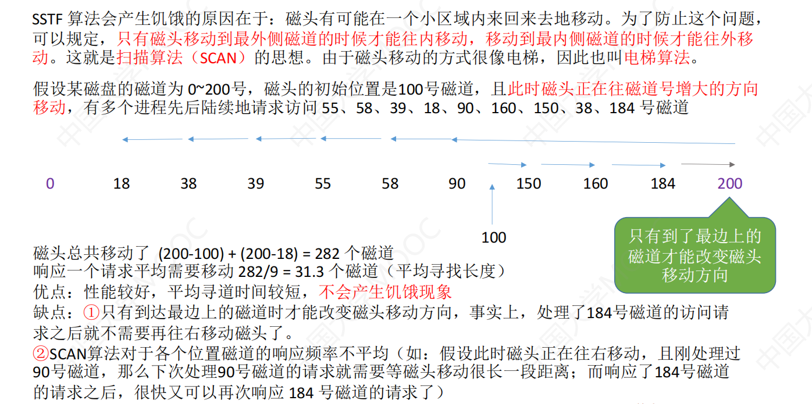

+ 改进：访问最远的一个请求后就能往回走，往回走最终也不需要走到底。称为**LOOK调度**
+ 会出现磁道黏着（在一个静止不动）


##### 4. C-SCAN循环扫描


+ 改进：访问最远的一个请求后就能立即返回，返回也不需要返回到底。称为**C-LOOK调度**
+ 会出现磁道黏着


#### 减少旋转延迟

1. 扇区交替编号

2. 存放盘块数据时先按柱面存放，再按盘面存放

   （优先按柱面，到时候访问时**磁头就不用移动**）

3. 相邻盘面的扇区错位命名。原因：**所有盘面是一起旋转的，错位命名可以避免序号相邻的扇区来不及访问**

### 固态硬盘

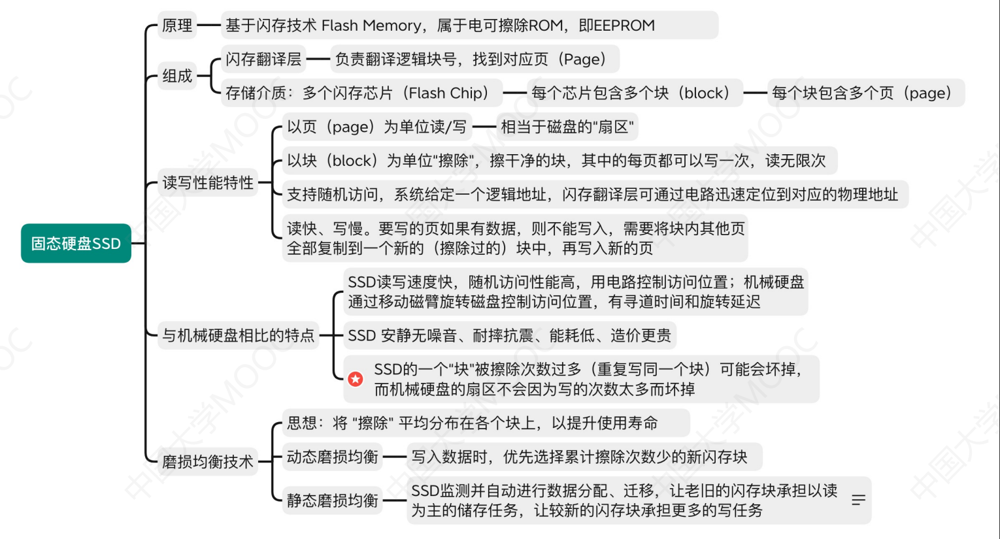

#### 特性

+ **读写的单位为页**，不是块（**一块中有很多页**）
+ **擦除的单位是块（写任何一个页都要先将所在块的所有数据擦掉）**

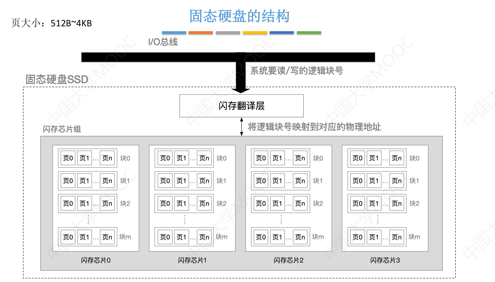


#### 磨损均衡技术

+ 动态：**写入时**，选择较新的块

+ 静态：**不写入时，也能自动将数据内容重新分配/迁移**

  把数据放到老的块（读多写少）中，不让他被写
