# 第二章 数据的表示与运算

## 一、定点数

### 定点数的常识

##### 1.有符号数和无符号数的关系

同一个二进制运算，计算机可以将它当做无符号数来运算，也可以当做有符号数来运算。
有无符号只是人为的看待方式不同。
例如加法，不管我们如何看待，CPU运算时就已经包含了两种含义，仅仅是简单的相加

##### 2. 无符号数和有符号数混合加法

+ 只需要保持位数相同后，直接按无符号数的方式直接相加
+ 有符号数高位需补充符号位

例. $无符号8(1000)和-3(1101)相加，结果为(1)0101,高位溢出,但有效位表示的值为5,是正确结果$

$无符号F0000000H+有符号FF12H,FF12H补全后为FFFFFF12H,相加得到EFFFFF12H,也是正确结果$

# 第三章 存储系统

## 一、存储器

### （1）SRAM和DRAM

#### SRAM和DRAM对比

|                  | SRAM                        | DRAM                             |
| ---------------- | --------------------------- | -------------------------------- |
| 存储元件         | 双稳态触发器                | 栅极电容                         |
| 刷新             | 不需要定时刷新              | 需要定时刷新（集中、分散、异步） |
| 读出特性         | 非破坏性读出,读完不需要再生 | 破坏性读出，读完需要再生         |
| 速度             | 快                          | 慢                               |
| 集成度           | 低                          | 高                               |
| 发热（==功耗==） | 大                          | 小                               |
| 成本             | 高                          | 低                               |
| 容量             | 小                          | 大                               |
| 易失性           | 易失（断点信息消失）        | 易失                             |
| 行列地址         | 同时送                      | 分次送（地址线复用）             |
| 用途             | cache/TLB                   | 主存                             |

#### DRAM的刷新

1. 一般2ms一次

2. 一次刷新**一行存储单元**

3. 如何刷新？硬件，读出一行信息后重新充电，耗时一个读写周期（存取周期）

4. 何时刷新？

   集中刷新、分散刷新、异步刷新

### （2）ROM

##### 注意闪存和固态是ROM不是RAM！！！

+ RAM是易失性存储器，断点不能保存
+ 机械硬盘/光盘(CD-ROM)既不是RAM也不是ROM，而是==直接存取==存储器
  + CD-ROM名字的ROM只是为了体现read on
+ 很多ROM也可以随机存取

### （3）双端口RAM

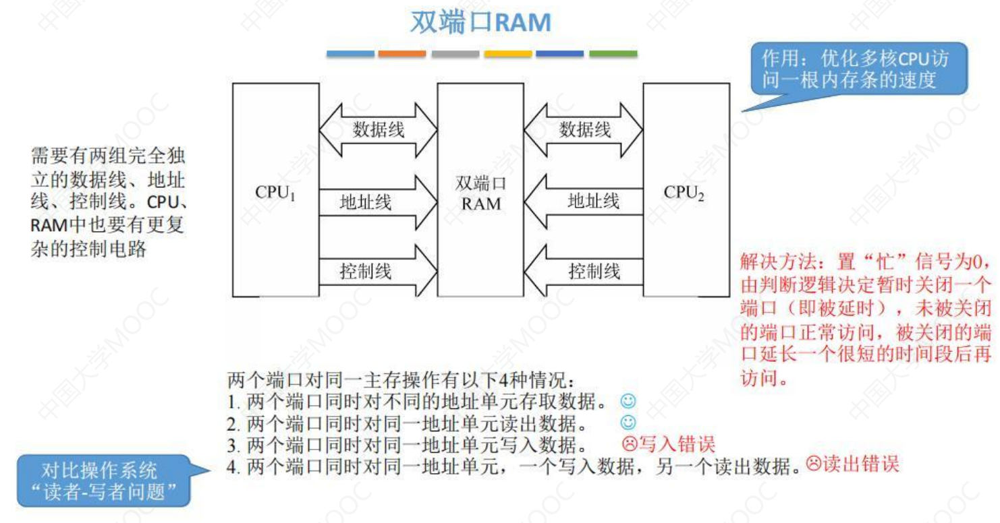

## 二、cache

> cache与主存**以块为单位**进行数据交换

### Cache与主存的映射方式

> cache与主存映射即哈希，有3种方式

#### cache存放的内容

+ 主存地址由块内偏移+（cache组/行号）+标记组成
+ cache**每行**存放的是**数据(一行一块）+标记位(m-c位)+有效位(1bit)+一致性维护位（脏位）+替换算法控制位（LRU计数器）**
+ cache不存放行号！！！**（行号表示存入cache第几行，即下标）**
+ **每行的标记位+有效位称为地址映射表（标记阵列）**

#### 1.直接映射

+ 即模映射

+ cache行号=主存块号 mod **cache行数**

  $cache行号c位(2^c行),主存块号m位(2^m块),则主存的后c位作为映射的cache行号,前m-c位为标记$

   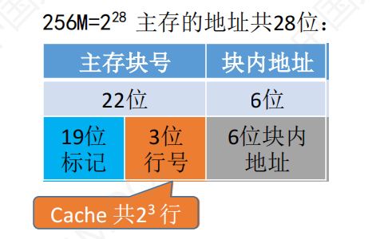

##### CPU访存过程

1. 根据要访问的主存地址中间的c位找到cache行号
2. 将对应cache行中存放的地址与其对比：
   1. 标记位相同且有效位为1，则cache命中，CPU直接从cache中存取数据
   2. 标记为不同或有效位为0，则不命中，此时CPU**从主存中**读出该地址的一块信息
      送到cache对应行中，置有效位为1

##### 评价

+ 同余的主存块只能映射到同一个cache行。当访问同余的块时，
  就会引起频繁的调进调出，即使其他行都空闲也没用。因此**cache命中率较低**

#### 2. 全相联映射

+ 即没有映射，随便放
+ **标记就是块号，即指出主存中的哪一块**

 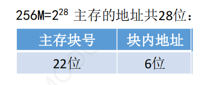

##### CPU访存过程

将主存块号(标记)与**cache的每一行**的标记对比：

1. 有一个标记相等且有效位为1，则命中，CPU直接存取cache数据
2. 没有一个标记相等或有效位为0，则不命中，此时将主存块**复制到cache的任意一个空闲行**中，置有效位为1

##### 评价

1. 只要有空闲cache行，就不会发生冲突，因而**块冲突概率低**
2. 访问主存块的过程是一种**“按内容访问”**的存取方式，即一种**“相联存储器”**，不适合大容量的cache

#### 3. 组相联映射

+ 先分组（模映射），组内随便放
+ **是cache分组，不是主存分组。主存中相邻块对应不同cache组**
+ $cache组号q位(2^q组),则主存每2^q块构成一个组群(组群中每块都在不同的cache组)$
+ 主存块号中的后q位作为cache组号,前m-q位作为标记。
+ **标记字段的含义为主存块位于哪一个组群**
+ n路组相联——一组n行

 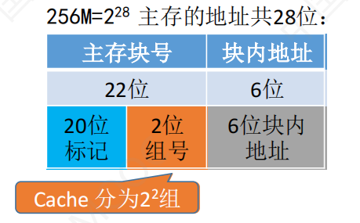

+ 地址分配与直接映射类似，只是组号相同不一定冲突，可以在不同行

##### CPU访存过程

1. 根据要访问的主存地址中间q为cache组号，直接找到对应cache组
2. 将对应cache**组中每行**的标记与主存的标记字段对比：
   1. 有一个相等且有效位为1，则命中，CPU直接从cache中存取信息
   2. 都不相等或有效位为0，不命中，此时CPU从主存读出该地址所在的
      一块信息送到**当前cache组的任意一个空闲行**中，置有效位为1

### Cache中主存块替换算法

#### 1. 先进先出

+ 总选择最早装入cache的主存块被替换
+ **不能正确反应程序访问的局部性**
+ 可能产生较大的缺失率

#### 2. 最近最少用LRU

+ 选择近期最少使用的主存块被替换

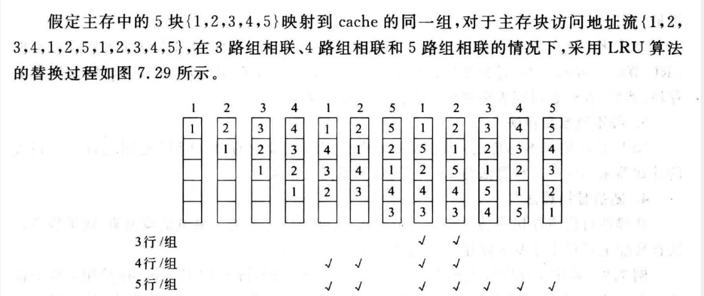

+ 最新访问的块号写在最上面，使得**最下面的一块就是最近最久未使用的块**
+ **同一时刻行少的组中的块集合必然是行多组中的块集合的子集**
+ LRU是**栈算法**

##### 用计数器实现LRU

计数器变化规则：（假设cache为4路组相联）

1. 命中时，被访问的行的计数器清零，**比其低的**计数器+1，其余不变
2. 未命中且该组还有空闲行时，则新装入的行的计数器设为0，其余全加1
3. 未命中且该组无空闲行时，计数器为3（**==由(1)可知计数器最多加到3==**）的那一行中的主存块被淘汰。
   新装入的行计数器设为0，其余+1.

+ 计数器称为==LRU位，一组只有一个，仅记录计数值最高的行的位置==，因此4路有两位LRU位，8路有3位

#### 3. 最不经常用LFU

+ 替换cache中引用次数最少的块
+ 与LRU类似，但不完全相同
+ **不满足局部性原理**

#### 4. 随机替换

+ 随机选取一个淘汰，与使用情况无关
+ 性能只稍逊于基于使用情况的算法

### cache与主存数据不一致问题（cache写策略）

#### 全写法

+ CPU对cache写命中时，必须把数据同时写入cache和主存。
+ cache中的块被替换时，不需要写回主存，因为写的时候就已经在主存中更新好了。

##### 写缓冲

+ cache和主存之间加一个写缓冲队列(FIFO)
+ 写cache的同时写入写缓冲，**再由写缓冲控制将内容写回主存**
+ 解决速度不匹配的问题
+ 频繁写时，写缓冲会溢出

#### 回写法

+ CPU对cache写命中时，只把数据写入cache。
  只有当此块**被换出时**，才写入主存
+ 为每个cache行设置一个修改位(dirty bit)，修改位为1，说明被修改过。
  只有修改位为1时，替换后才需要写回主存。

#### 写不命中处理方法

##### 写分配法

+ CPU对cache写不命中时，**先将主存块调入cache，再写到cache中**
+ 搭配回写法

##### 非写分配法

+ CPU对cache写不命中时，直接对主存操作，**不管cache**
+ 搭配全写法

## 三、虚拟存储器

### TLB和Cache多级存储系统访存过程

##### 两个任务

1. 找页表项，进行虚拟地址到物理地址的转换（TLB/主存）——页表项存放的是物理块号
   **物理块号+页内偏移量=物理地址**
2. 访问物理块(cache/主存/外存)

##### TLB和Cache

+ TLB存放的是TLB标记（逻辑块号/虚拟页号）+页表项（**即物理块号**）
  **页表项中只有物理块号，因为页号（逻辑块号）作为下标，不占空间；**
  **而TLB中无法通过下标知道物理块来自哪个逻辑块，因此还要存放逻辑块号**
+ cache存放的是物理块
+ 两者都是高速缓存（SRAM）
+ TLB一般由**相联存储器**组成，也可由SRAM；cache由SRAM组成

##### 基本分页（进程的整个页表都在主存）

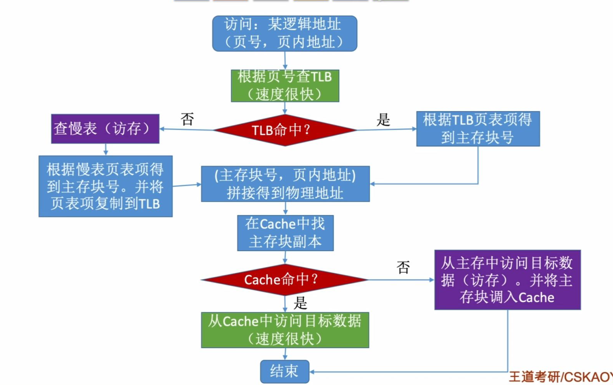

##### 页式虚拟存储器（请求分页）

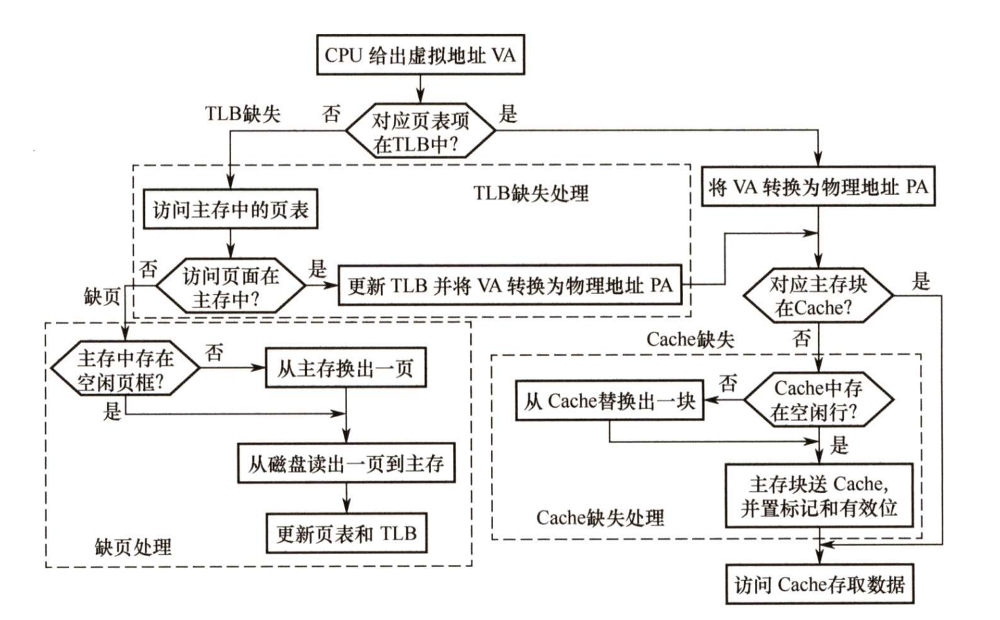

1. 通过逻辑块号在TLB中找对应表项，找不到就访问主存中的页表；找到页表项就直接得到物理地址。
2. 在主存页表中找相应页表项，找不到**产生缺页中断**，从磁盘读一页到主存，并放到TLB中
3. 找到页表项后得到了物理地址
4. 根据物理地址在cache中查找物理块，找不到则cache缺失，在主存中查找。
5. 在主存中找到物理块后，将物理块送入cache，最后送入CPU访问

##### TLB、Page、cache缺失情况

> Page表示主存页表

1. TLB中有页表项，则主存页表中一定有（TLB存的是主存页表项的副本）
   即主存页表中没有，TLB中一定也没有
2. 主存页表中没有页表项，说明页不在主存，**会产生缺页中断**，此时cache中不可能存有该页。
   **即Page未命中时，TLB和cache都不可能命中。**

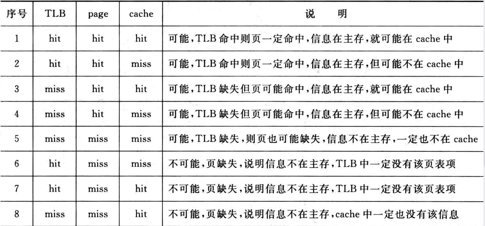

+ 对于页表项：==页表中没有的快表中一定也没有==
+ 对于物理块：==主存中没有的cache中一定没有==
+ 主存中有物理块就有对应页表项

# 第四章 指令系统

#### 寻址方式

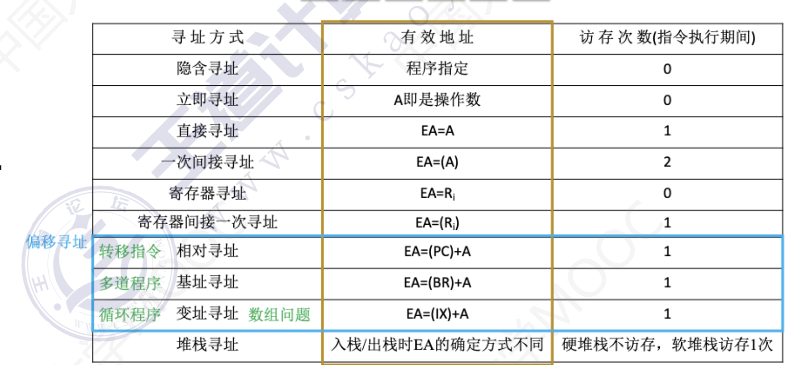

#### CISC和RISC

| 项目             | CISC       | RISC                                       |
| ---------------- | ---------- | ------------------------------------------ |
| 寻址方式种类     | 多         | 少                                         |
| 指令系统         | 复杂庞大   | 简单精简                                   |
| 指令字长         | 不固定     | 定长                                       |
| 可访存指令       | 不限制     | 只有Load/Store                             |
| 各种指令执行时间 | 相差较大   | 大多在一个时钟周期内                       |
| 各种指令执行频度 | 相差很大   | 都是常用指令                               |
| 通用寄存器数量   | 少         | 多                                         |
| 目标代码         | 低效       | 采用优化的编译程序， 生成的代码较高效 |
| 控制方式         | 微程序控制 | 组合逻辑控制（硬布线控制）                 |
| 指令流水线       | 可以实现   | 必须实现                                   |

# 第五章 CPU

## 一、CPU内部结构及指令执行流程

### CPU结构

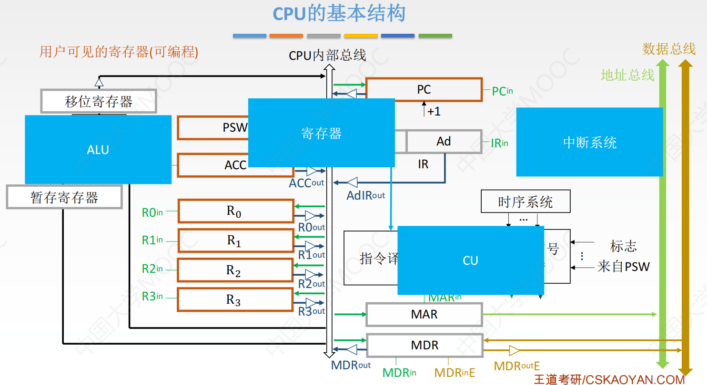

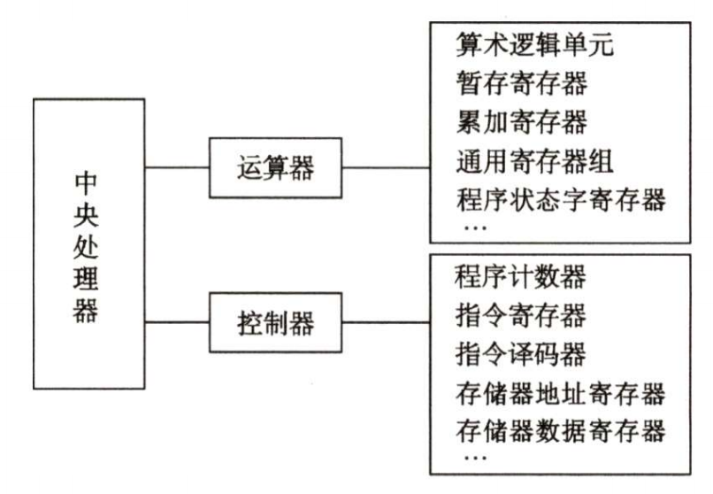

##### 用户可见寄存器

1. PC——jmp指令可修改
2. PSWR（标志寄存器/程序状态字寄存器）
3. 累加器ACC
4. 通用寄存器

##### 用户不可见寄存器

1. MAR
2. MDR
3. IR
4. 暂存寄存器（存放从主存读来的数据）
   **暂存寄存器不能由通用寄存器替代**

#### 控制器和运算器

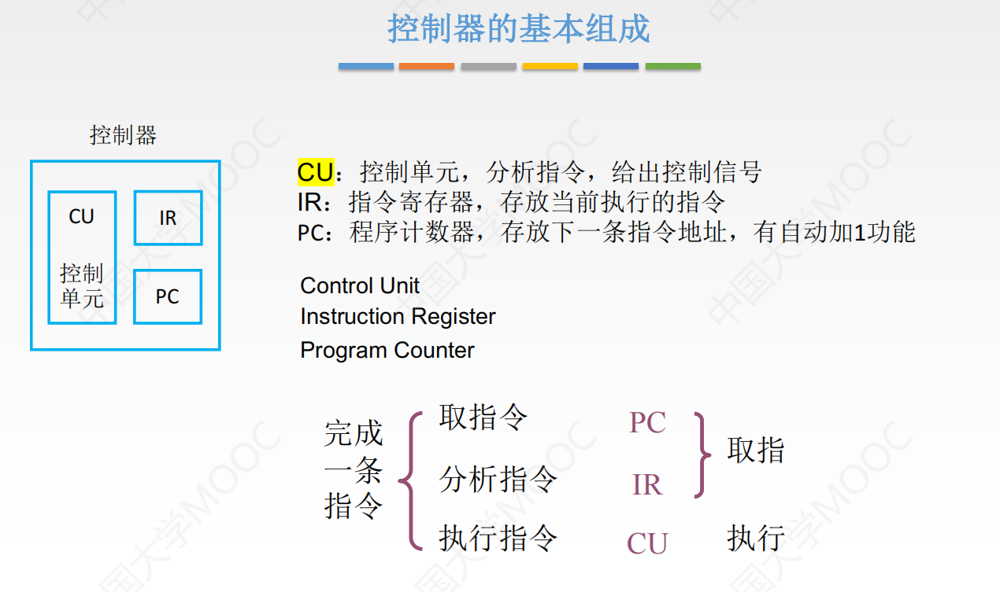

### 指令执行流程

#### 指令周期

+ 指CPU从主存取出一条指令并执行花费的全部时间
+ 一个指令周期=1~4个机器周期，一个机器周期=若干时钟周期

##### 指令周期流程

+ 指令周期分为**取指、（间址）、执行、（中断）**

  + 对于间接寻址指令才需要间址周期
  + 分析指令的步骤包含在取指周期内
  + 这四个周期都叫**机器周期/CPU周期**

  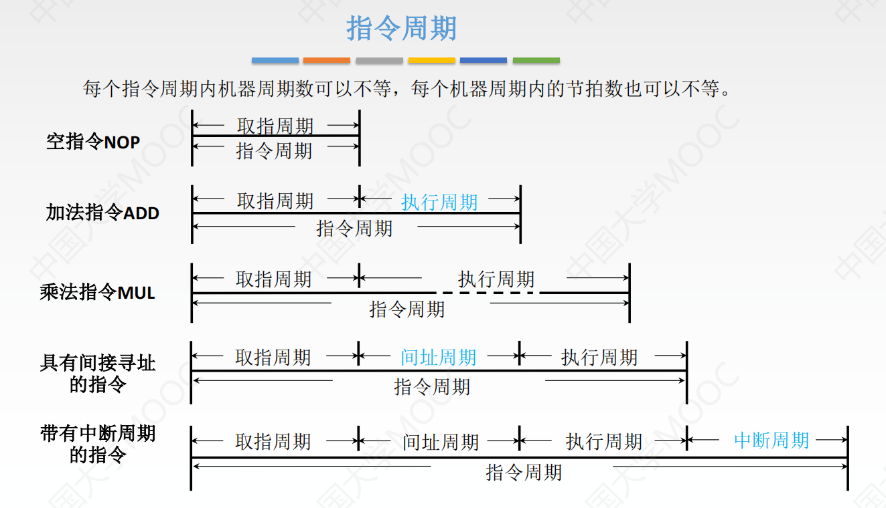

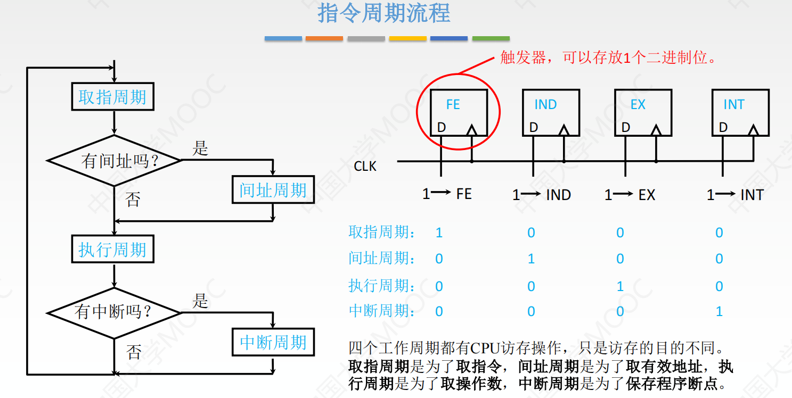

#### 指令周期的数据流

##### 1. 取指周期

**目的：取指令**，即将指令从主存送到指令寄存器IR
路径：PC（地址）、MAR（地址寄存器，存放PC内容，即要访问的主存单元的地址）、主存（指令的位置）、MDR（存放取来的指令）、IR（指令的最终目的）
结果：IR存放的是当前准备执行的指令。（MDR也存着当前指令）
			**注意取指周期结束后PC就已经是下一条指令的地址了。**

1. 将PC内容送到MAR：$(PC)\rarr MAR$

2. CU发出控制信号(读)：$1\rarr R$

3. 访问主存中地址为(MAR)的指令,并将指令通过数据总线送到MDR：
   $M(MAR)\rarr MDR$
   
   > 细节：通过地址线将MAR中的内容送到主存的**地址寄存器**，以便**地址译码器**进行译码**选中相应单元**，
   > 同时，CPU将读写信号通过控制线送到主存的**读写控制电路**。
   > 接着主存读出选中单元的内容送数据线，最终送到MDR。
   >
   > + 数据线的宽度与MDR相同，地址线的宽度与MAR相同
   
4. 将指令由MDR送到IR：$(MDR)\rarr IR$

5. CU发出控制信号，PC形成下一条指令地址：$(PC)+1\rarr PC$

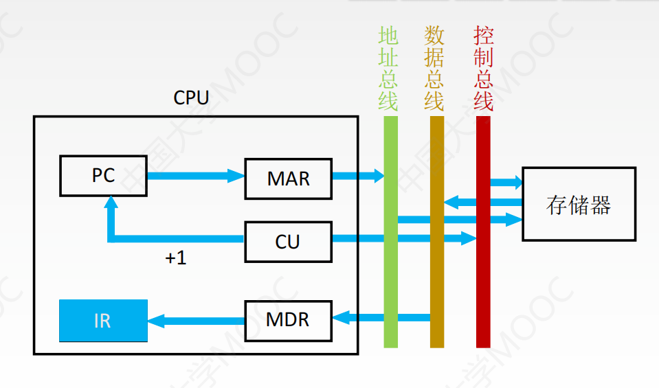

##### 2. 间址周期

> 指令分为操作码和地址码；
> 间接寻址指令的**地址码存放的是操作数地址的地址**
> 直接寻址指令的地址码存放的是操作数的地址

**目的：取操作数地址**，即将指令地址码指向的主存单元的内容（即操作数地址）放到MDR中
路径：IR(从其中得到指令的地址码)、MAR(存放指令地址码，即要访问的主存单元的地址)、主存（存放操作数地址）、MDR（操作数地址的最终位置）
结果：MDR中存放了操作数的主存地址（**只有MDR和MAR中的内容发生了变化，IR还是存着当前指令）**

1. 从IR中得到指令的地址码，将其送到MAR。（从MDR中也能得到指令的地址码，因为**取指周期结束时MDR和IR都存着指令**）：$Ad(IR)\rarr MAR或Ad(MDR)\rarr MAR$
2. CU发出控制信号(读)：$1\rarr R$
3. 访问MAR指向的主存单元的内容，将内容送到MDR：$M(MAR)\rarr MDR$
4. ~~(可能)将操作数地址覆盖指令的地址码，==**即将指令变成直接寻址**==：$(MDR)\rarr Ad(IR)$~~

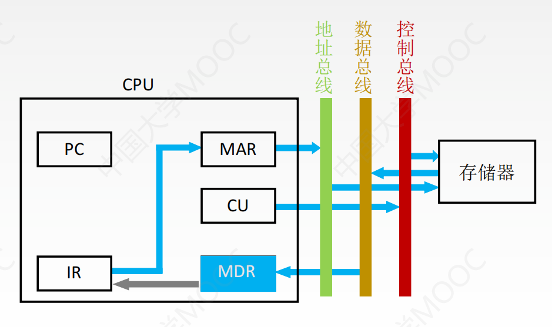

##### 3. 执行周期

> 目的：将指令的操作码和操作数通过ALU操作产生结果。
>
> + 没有统一的数据流向

##### 4. 中断周期

> 执行周期结束后，检测到了中断请求，则不再开始下一个指令的取指，而是进行中断处理

**目的：保存程序断点**，即将断点(**PC内容**)入栈（栈在主存），注意入栈时SP(栈顶指针)向低地址方向移动

+ 断点：用**指令无法直接读取==（并不是不可见）==**的程序计数器PC和程序状态字寄存器PSWR等的内容

1. CU控制**将SP减1，并将SP送到MAR**：$(SP)-1\rarr SP,(SP)\rarr MAR$
   + 先变SP,再将PC入栈
   + SP减1后，就是PC将要存放的地址
   
2. CU发出控制信号(写)：$1\rarr W$

3. 将断点（PC内容）送入MDR，完成入栈操作：$(PC)\rarr MDR$

   > 细节：CPU将SP内容送到MAR，并通过地址线将MAR内容送上地址线；
   > 同时，CPU将读写信号通过控制线送到主存的读写控制电路；
   > 对于写操作：CPU同时将要写的信息（PC内容）送MDR，在读写控制电路的控制下，经
   > 数据线将信息写入选中的单元。

4. 入栈完成后，就可以将PC内容修改为中断服务程序的入口地址（中断向量）。
   $中断向量\rarr PC$

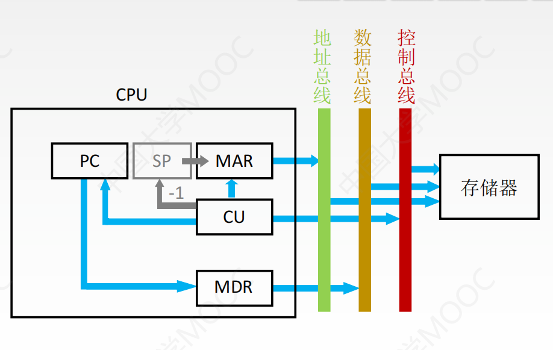

## 二、数据通路

数据在功能部件之间传送的路径称为数据通路，包括数据通路上流经的部件，如**ALU、通用寄存器、状态寄存器**
**异常和中断处理逻辑等**

#### 数据通路三种结构

1. CPU内部单总线方式
2. CPU内部三总线方式
3. 专用数据通路方式：两个部件之间直接连一条线

#### 单总线方式的数据流向

##### 1. 寄存器之间数据传送

例：PC内容送至MAR

控制信号为：$PC_{out},MAR_{in}$

1. $(PC)\rarr Bus$
2. $Bus\rarr MAR$

##### 2. 主存与CPU之间数据传送

例：CPU从主存读指令

1. $(PC)\rarr Bus\rarr MAR$（$PC_{out},MAR_{in}$）
2. $1\rarr R$：CU发出读命令
3. $M(MAR)\rarr MDR$：将主存单元存放的指令送到MDR
4. $MDR\rarr Bus\rarr IR$：将指令送到IR

##### 3. 执行算术逻辑运算

两个操作数，先将一个放到暂存寄存器Y，另一个直接输出到总线，最后两个操作数一起总到ALU的两个输入端。

1. $Ad(IR)\rarr Bus\rarr MAR$：指令地址码送到MAR
2. $1\rarr R$：CU发出读命令
3. $M(MAR)\rarr 数据线\rarr MDR$：将操作数1送到MDR
4. $MDR\rarr Bus\rarr Y$：将操作数1送到暂存寄存器Y
5. $(ACC)+(Y)\rarr Z$：另一个操作数在ACC中，直接送到ALU，运算结果存到Z
6. $Z\rarr ACC$：运算结果送回ACC

## 三、控制器

### 控制器的概念

#### 控制器的组成

1. 指令寄存器IR
2. 控制器（操作控制器）CU
3. 程序计数器PC

#### 控制器的功能

1. 取指令、指出下一条指令地址
2. 对指令译码或测试，产生控制信号
3. 指挥并控制CPU、主存、IO设备之间的**数据流动方向**

### 硬布线控制器

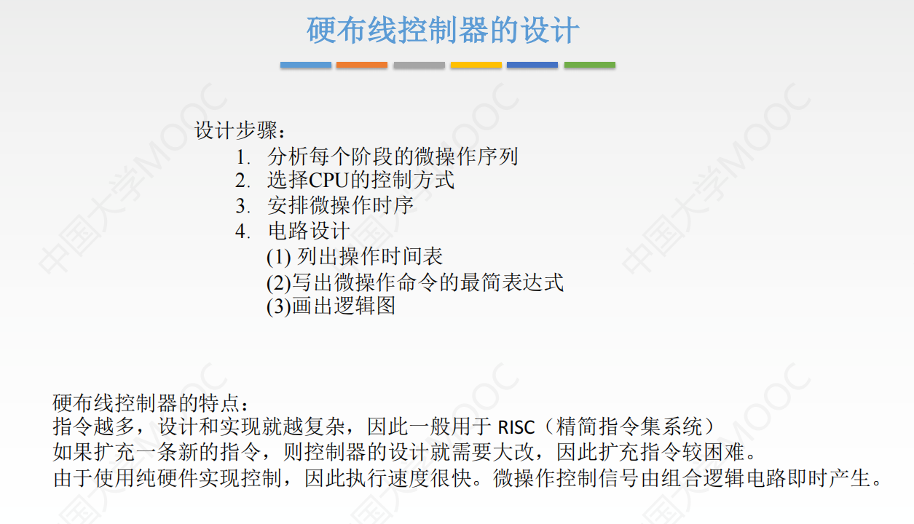

### 微程序控制器

> 基本思想：仿照程序设计方法，**将每条指令的执行过程用一个微程序表示，每个微程序由若干条微指令组成**。
> 所有指令对应的微程序都存放在一个ROM中，这个ROM称为**控制存储器CU,简称控存**。

#### 组成和工作原理

##### 基本结构

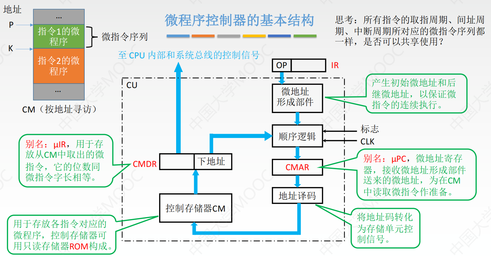

##### 控制器存储器存放的内容

+ 取指周期、间址周期、中断周期对所有指令来说操作都是一样的，
  因此控存中只需要存放一个对应微程序
+ 对于执行周期，不同指令的操作不一样，因**此要存放指令集所有指令的执行微程序**
+ 某指令系统中有n条指令，则控制存储器中微程序的个数至少是n+1个。**（最少只需要加一个取指周期）**
  ~~早期的CPU可以没有间址和中断功能~~
+ **可以说：一条指令对应一个微程序**
  （一般将指令的**执行微程序**称为**指令对应的微程序**，公共的取指微程序是单独的微程序）

##### 微程序、微指令、微操作和微命令

+ 一条指令的过程用一个微程序来表示，每个微程序由若干条微指令组成，微程序是一个微指令序列。
  即**一个指令对应一个微程序，一个微程序由多个微指令组成**

+ 一条指令的功能通过执行一系列基本操作来完成，这些**基本操作**称为**微操作**。
  每个微操作在相应控制信号的控制下执行，这些**控制信号**称为**微命令**。
  即**微操作描述的是操作，而微命令指的是控制信号，宏观上微操作=微命令**
+ **一条微指令是一个0/1序列**，其中包含**若干个微命令**，它完成一个基本计算或传送功能。
+ **一个时钟周期执行一条微指令**

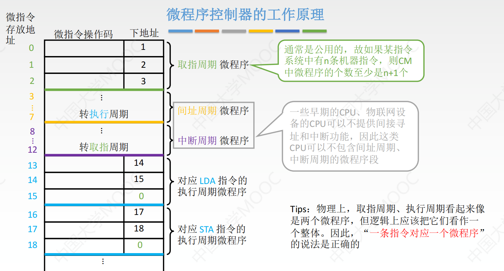

#### 微指令的格式

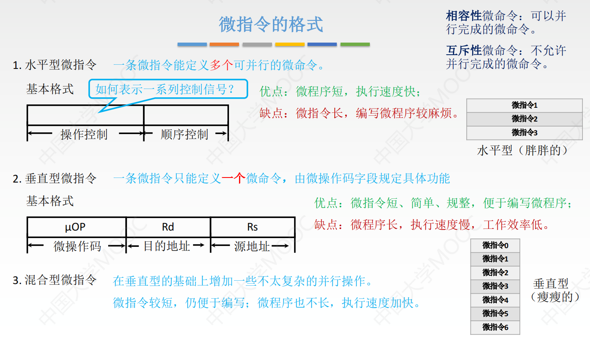

+ 垂直型即一个微指令对应一个微命令，微操作码不需要编码，
  下面讨论的是水平型微指令的编码方式

#### 微指令的编码方式

微指令由微操作码和微地址码两部分组成，**微操作码设计**主要由微命令的编码方式决定。

##### 1. 直接编码（不译法）

+ 一位对应一个微命令
+ 微操作码的长度与所有微命令的个数相等，无需译码

##### 2. 字段直接编码

+ 将微指令分成若干字段，每个字段包含若干条微命令。
+ **互斥操作组合在同一字段，相容微操作组合在不同字段**，
  对每一字段内的微操作进行二进制编码

+ 优点：可以缩短微指令字长
+ 缺点：要通过译码电路后再发出微命令，比不译法慢

##### 3. 字段间接编码

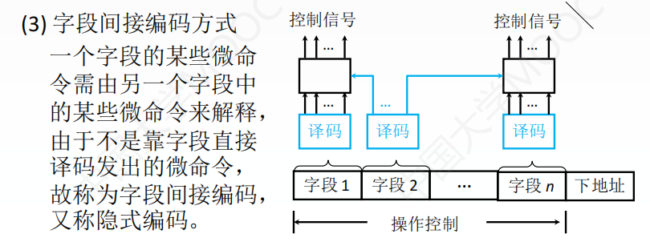

+ 优点：进一步缩短微指令字长
+ 缺点：削弱了微指令的并行控制能力，故通常作为字段直接编码方式的一种辅助手段

#### 下一条微指令地址的确定

##### 1. 计数器法（增量法）

+ 使用一个专门的微程序计数器$\mu PC$，将下一条微指令地址隐含地存放在$\mu PC$中
+ 顺序执行时,$\mu PC+1\rarr \mu PC$
+ 转移执行时，在当前微指令后添加一条**转移微指令**，并在微指令中添加专门的
  **转移控制字段**，送到微指令地址发生器与相应的<u>指令操作码和条件码</u>等组合，生成
  转移地址送$\mu PC$

##### 2. 断定法（下地址字段法）

+ 直接在每条微指令中明确指定下一条微指令地址
+ 增加了微指令的长度，从而影响控制存储器的有效利用
  假设有500条微指令，则下地址字段至少要9位。

##### 其他方式

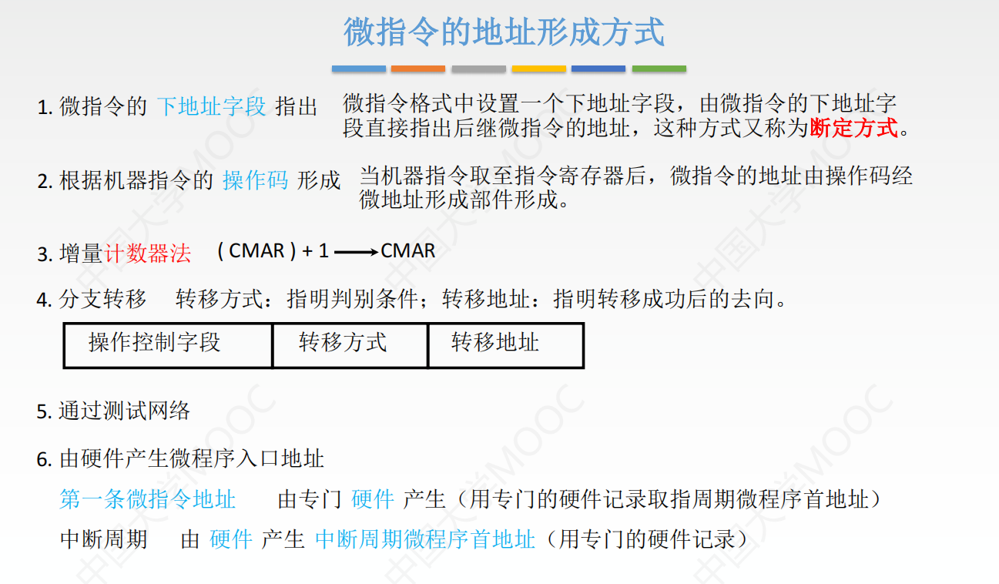

#### 微程序设计分类

### 硬布线与微程序对比

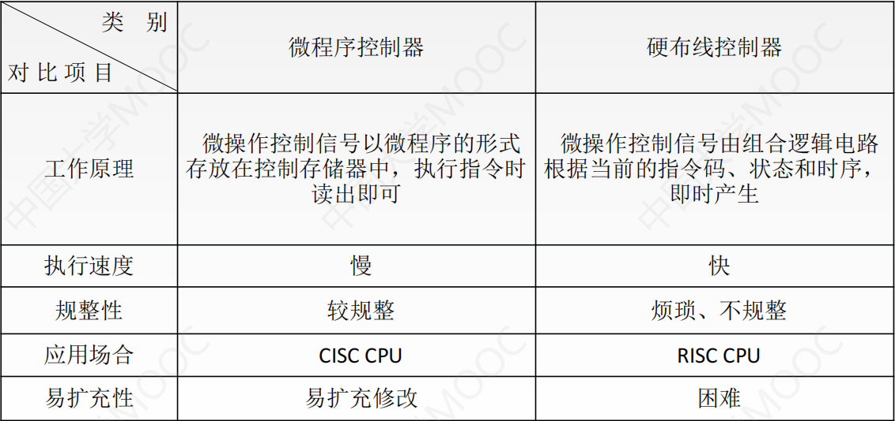

+ 微程序控制器的**时序系统更简单**

## 四、指令流水线

### 流水线概述

#### 基本概念

##### 流水线设计的原则

1. 指令流水段**个数**以**最复杂**指令所用的功能段个数为准
2. 流水段的**长度**以**最复杂**的操作所花时间为准

##### 流水线的性能

+ 流水线方式并不能缩短**一条指令**的执行时间
+ 若流水段个数为M,每个流水段执行时间为T，则
  N条指令的执行时间为$(M+N-1)\times T$
+ 若每段划分均匀，使得执行时间大致相等，提高倍数应为**流水段的个数**

##### 适合流水线的指令集特征

1. 指令长度应尽量一致：有利于简化取指和指令译码操作
2. 指令格式应尽量规整，尽量保证源寄存器的位置相同
3. Load/Store指令风格
   除Load/Store指令外的指令都不访问寄存器，这样可以把Load/Store指令的地址计算和运算指令的执行步骤规整在同一个周期中，从而有利于减少操作步骤、规整流水线。
4. **数据和指令在存储器中要“对齐”存放**：减少访存次数，使所需数据在一个流水段内就能取到

#### 流水线的性能指标

##### 1. 吞吐率TP

+ 单位时间完成的任务个数（个数/时间）
+ $TP=\frac{n}{(k+n-1)\Delta t},其中n为任务个数，k为流水段个数，\Delta t为每个流水段的执行时间$
+ 当n非常大时,$TP\rarr \frac{1}{\Delta t},即每完成一段都能完成一个任务$——**每条指令CPI都为1**

##### 2. 加速比

+ 不使用流水线与使用流水线的时间之比
+ 不使用流水线：$k\Delta t\times n=nk\Delta t$
  使用流水线：$(k+n-1)\Delta t$
  加速比：$\frac{nk}{k+n-1}$
+ 若每段划分均匀，使得执行时间大致相等，提高倍数应为**流水段的个数**

### 流水线的基本实现

#### 流水线的执行过程

### 流水线的冒险(hazard)

#### 1. 结构冒险

+ 结构冒险也称**硬件资源冲突(hardware resource conflict)**
+ 某时刻同一部件同时被不同指令所用，即**由硬件资源竞争造成的**

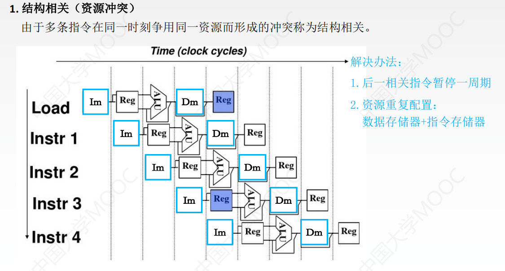

#### 2. 数据冒险

+ 数据冒险也称数据相关(data dependency)
+ 后面指令用到前面指令结果时前面指令结果还没有产生
+ **在非乱序执行的基本流水线中，所有数据冒险都RAW(Read After Write)数据冒险**

##### 解决方法

###### 1. 插入空操作指令（软件）

+ 在软件上采取措施：在**编译时**预先插入空操作指令

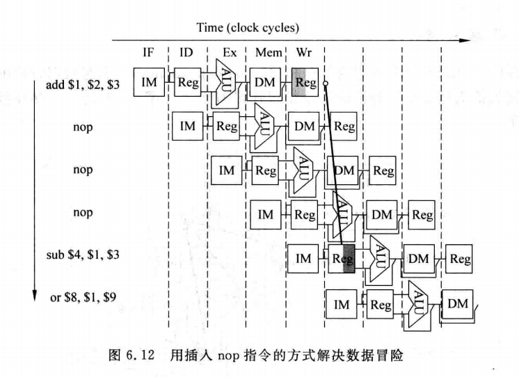

###### 2. 插入气泡（硬件）

+ 在硬件上采取措施：使相关指令延迟执行，通过硬件阻塞(stall)方式阻止后续指令执行

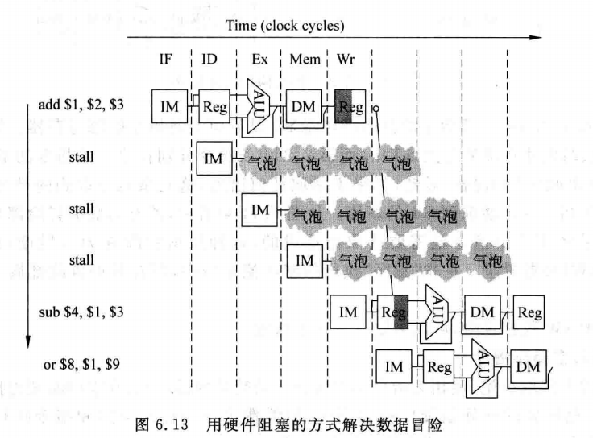

###### 3. 采用转发技术（数据旁路）

+ 转发（forwarding）或旁路（bypassing）
+ 将数据通路中生成的**中间数据直接转发到ALU的输入端**，
  使得**还没有写回寄存器时后面的指令就能用到新的值**

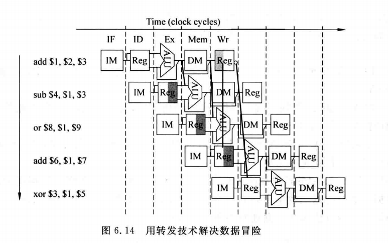

#### 3. 控制冒险

+ 当遇到改变指令执行顺序的情况时，流水线中指令的正常执行会被阻塞。
  这种由于发生了指令执行顺序改变而引起的流水线阻塞称为控制冒险
+ 各类**转移指令**（包括**调用、返回**指令等）的执行，以及**异常和中断**的出现都会改变指令执行顺序，
  即可能引发控制冒险

##### 解决方法

1. 分支预测
   + 简单预测：永远猜true或false
   + 动态预测：根据历史情况动态调整
2. 预取转移成功和不成功两个方向上的目标指令
3. 加快和提前形成条件码
4. 提高转移方向的猜准率

### 高级流水线

#### 1. 超标量流水线

+ 一个周期并发执行多条指令
+ 需要多个相同部件
+ 指令严格按顺序执行

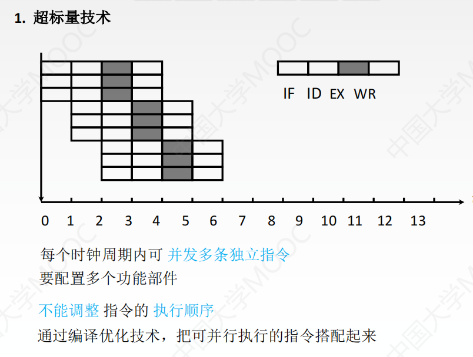

#### 2. 超流水线

+ 一个时钟周期再细分

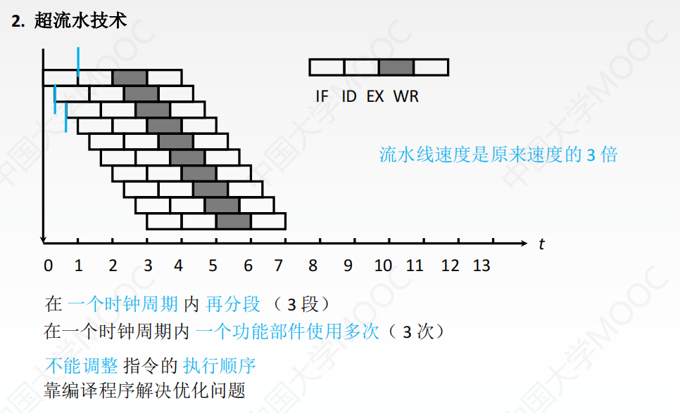

#### 3. 超长指令字

#### 动态流水线

+ 指同一时间内，当某些段正在实现某种运算时，另一些段却正在进行另一种运算，
  这样对提高流水线的效率很有好处，但会使流水线控制变得复杂。

## 五、硬件多线程

|              | 细粒度多线程                                     | 粗粒度多线程                                                 | 同时多线程                             |
| ------------ | ------------------------------------------------ | ------------------------------------------------------------ | -------------------------------------- |
| 指令发射     | 轮流发射各线程的指令（每个时钟周期发射一个线程） | 连续几个时钟周期都发射同一线程的指令序列，流水线阻塞时，才切换另一个线程 | 一个时钟周期内，同时发射多个线程的指令 |
| 线程切换频率 | 每个时钟周期切换一次线程                         | 只有流水线阻塞时才切换线程                                   | NULL                                   |
| 线程切换代价 | 低                                               | 高，需要重载流水线                                           | NULL                                   |
| 并行性       | 指令级并行，线程间不并行                         | 指令级并行，线程间不并行                                     | 指令级并行，线程级并行                 |
|              |                                                  |                                                              |                                        |

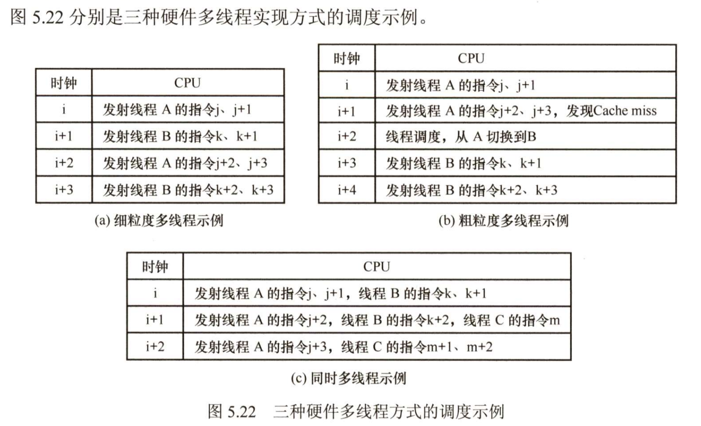

# 第六章 总线

## 一、总线概念

#### 1.总线特点：分时、共享

#### 2.总线设备

+ 主设备：获得总线控制权的设备
+ 从设备：没有总线控制权的设备，被主设备访问，只能响应从主设备发来的各种总线命令

#### 3. 总线特性

1. 机械特性（**构造**）：尺寸、形状、管脚数、排列顺序
2. 电气特性：传输方向和有效的电平范围
3. 功能特性：每根传输线的功能（地址、数据、控制）
4. 时间特性：信号的时序关系

#### 4. 总线分类

##### 按数据传输格式

1. 串行总线：一次传一位
2. 并行总线：一次传多位

+ 并行不一定比串行快（有干扰）

##### 按总线功能

1. 片内总线：**CPU内部**连接寄存器、ALU的线
2. 系统总线：连接计算机系统内各功能部件（CPU、主存、I/O接口）之间的总线。
   分为**数据总线、地址总线、控制总线**。
   数据总线与机器字长、存储字长有关；地址总线与主存地址空间大小有关。
   **地址总线用于CPU选择主存单元地址和I/O端口地址的单向总线**
3. 通信总线：连接不同计算机，例如网线。

##### 按时序控制方式

1. 同步总线
2. 异步总线

#### 5. 突发传输方式

+ 指可以连续传送**地址连续**的数据
+ **地址线只要传一次！！！**
+ 数据线传送次数根据传送数据量而定

## 二、总线性能指标

##### 1. 总线周期（总线传输周期）

+ 传一次数据的时间
+ 包括申请阶段、寻址阶段、传输阶段、结束（释放）阶段

##### 2. 总线时钟周期

+ 即机器的时钟周期
+ 总线时钟周期与总线周期的对应可能是一对一、一对多、多对一

##### 3. 总线工作频率

+ 一秒传送几次数据
+ 总线周期的倒数

##### 4. 总线时钟频率

+ 一秒多少个**时钟周期**
+ 时钟周期的倒数

##### 5. 总线宽度

+ 通常指数据总线宽度（与地址总线和控制总线无关）

##### 6. 总线带宽

+ 一秒能传多少信息，单位：Bps或bps
+ 总线带宽=总线频率(一秒几次)*总线宽度(一次几位)
+ **是总线本身能达到的最高传输速率**

## 三、总线事物与定时

总线事物指请求总线到完成总线使用的操作序列。

#### 总线传输的四个阶段

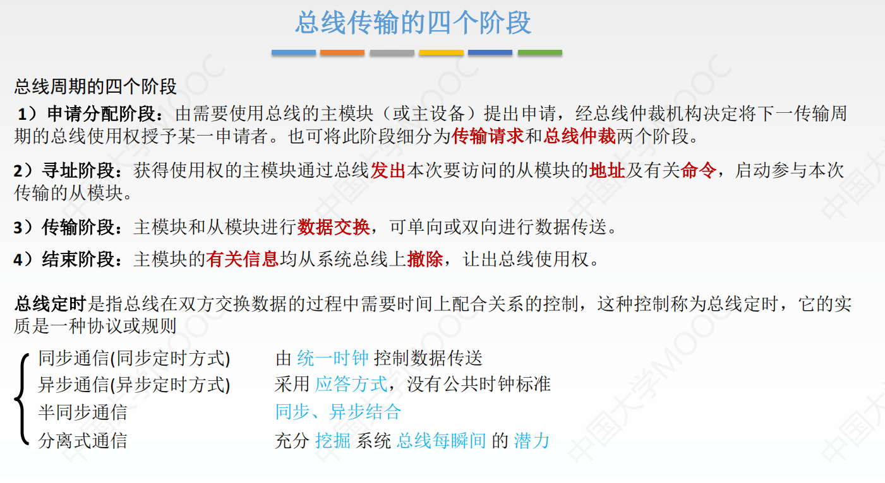

#### 同步定时方式

+ **统一的时钟信号**

##### 工作流程（读）

CPU作为**主设备**，某个输入设备作为**从设备**。

1. 传送地址
2. CPU发出读命令，输入设备将数据送到数据总线上
3. 数据线上的信息送到寄存器
4. CPU撤销读命令，释放总线控制权

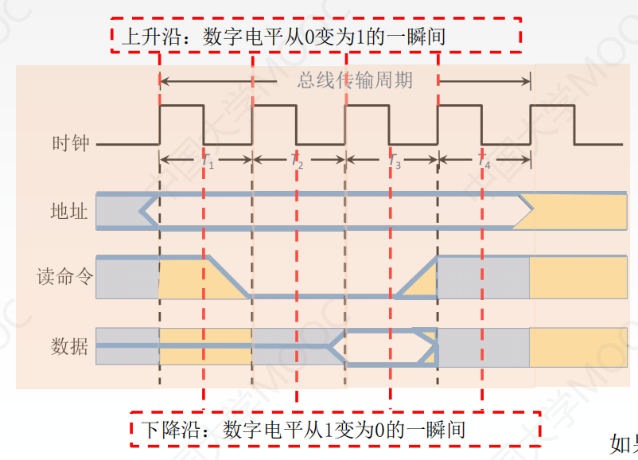

+ 每一步控制在一个时钟周期内，每个时钟周期时间相等
+ 如果一个时钟周期完成不了，通信就出现故障

##### 优缺点

+ 优：传送速度快；总线控制逻辑简单
+ 缺：主从设备**强制性同步**，不能及时进行数据通信的有效性检验，**可靠性差**
+ 适用于**总线长度较短以及部件存取时间接近的系统**

#### 异步定时方式

+ 没有统一时钟，时间间隔不固定，实现定时**纯靠“握手”**（没有时钟）
+ 主设备提出请求信号；从设备收到请求后，发出回答信号
+ **回答信号必须在收到请求信号后才能发**

##### 三种类型

根据请求和回答信号的**撤销**是否互锁，分为3类：

1. 不互锁：请求和回答**随时撤销**
2. 半互锁：请求的撤销必须在**收到回答后才能撤销**
3. 全互锁：请求的撤销必须在**收到回答后才能撤销**，且回答的撤销必须在**请求撤销后才能撤销**

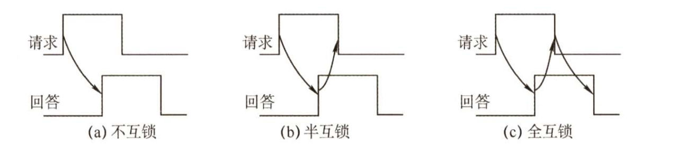

##### 优缺点

+ 优：总线周期长度可变，能保证两个速度相差大的部件之间可靠地进行信息交换，自动适应时间的配合
+ 缺：复杂，速度慢

#### 半同步通信

+ 在同步定时的基础上，加一个**等待信号WAIT**
+ 从设备来不及准备数据的时候，就发送一个wait信号

#### 分离式通信

##### 上面三种通信的共同点

1. 主设备发地址、命令
2. 从设备准备数据——**这一步不需要总线，却依然占用总线**
3. 从设备向主设备发数据

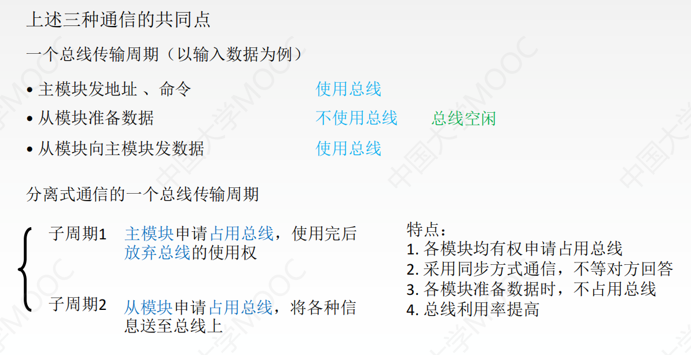

+ 主设备和从设备都能申请总线使用权

# 第七章 I/O

## 一、I/O接口

#### 基本结构与工作原理

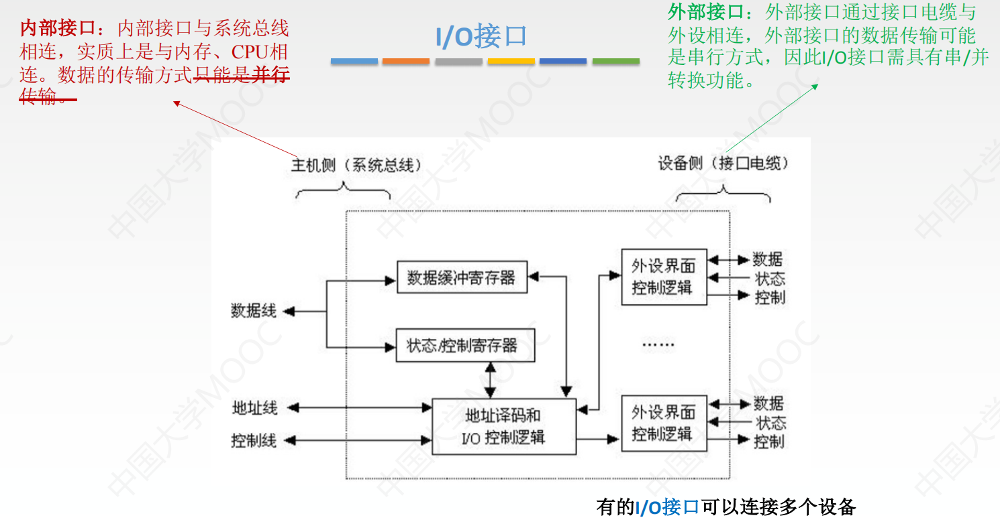

+ **I/O端口**：I/O接口中**可被CPU直接访问的寄存器**，作用是**协调CPU与设备间速度的不匹配**
+ 发命令：发送**命令字**到I/O控制寄存器，获得设备或I/O控制器的状态信息
+ 读状态：从状态寄存器读**状态字**，获得设备或I/O控制器的状态信息
+ 读/写数据：从数据缓冲寄存器发送或读取数据，完成主机与外设的数据交换

#### I/O端口

> **I/O端口**：I/O接口中**可被CPU直接访问的寄存器**，作用是**协调CPU与设备间速度的不匹配**

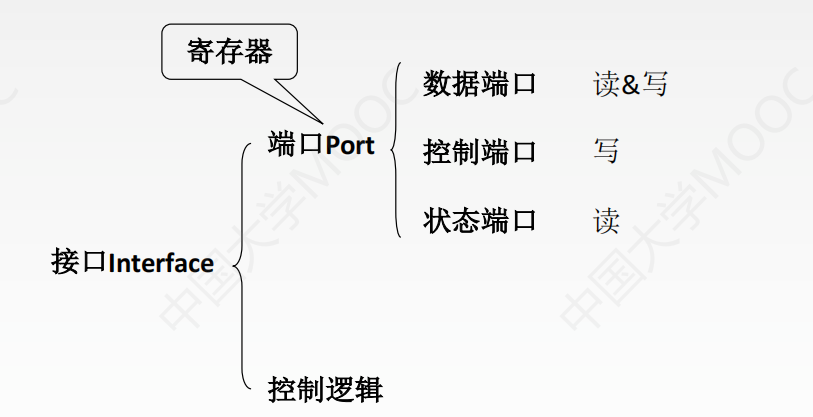

#### I/O编址方式

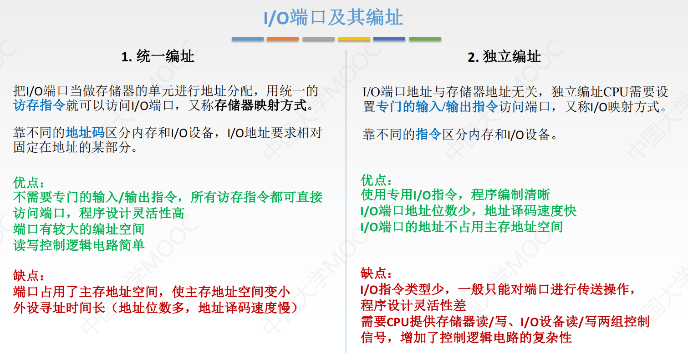

## 二、I/O方式

### 程序查询方式

#### 三种方式简介

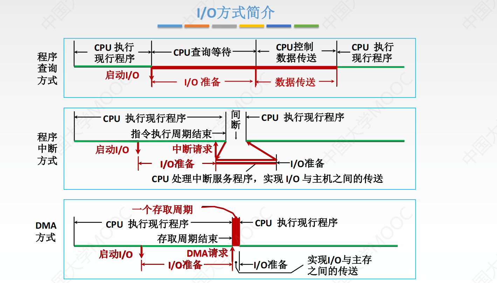

#### 特点

+ 主要特点：CPU**“踏步”等待**，与I/O设备**串行**工作
+ 优点：接口设计简单，设备量少
+ 缺点：CPU需要花大量时间查询和等待，效率极低
+ 不适合慢速设备（慢速设备查询次数非常多）

#### 两种查询方式

+ 独占查询：CPU 100%时间都在查询I/O状态，完全串行
+ 定时查询：保证数据不丢失情况下，每隔一段时间就查询一次。
  查询间隔内CPU可以执行其他程序

### 程序中断方式

#### 中断判优

##### 实现方法

+ 中断判优即可通过硬件实现，也可用软件实现
  软件实现慢

##### 一般的优先级设置

1. 不可屏蔽中断>内部异常>可屏蔽中断
   不可屏蔽中断在关中断下也会被响应
2. 内部异常中：硬件故障>软件中断
3. DMA请求>I/O设备的中断请求
4. 高速设备>低速设备
5. 输入设备>输出设备
6. 实时设备>普通设备

#### 多重中断

##### 满足的条件

1. 保护现场和屏蔽字后需要开中断
   不能再之前就开中断，否则保护现场会失败
2. 保存中断处理优先级

##### 中断屏蔽字

+ 每个中断源对其他所有中断源都有一位屏蔽字

  即形成一个矩阵，每个中断源占一行

+ 1表示屏蔽该中断源的中断，0表示不屏蔽

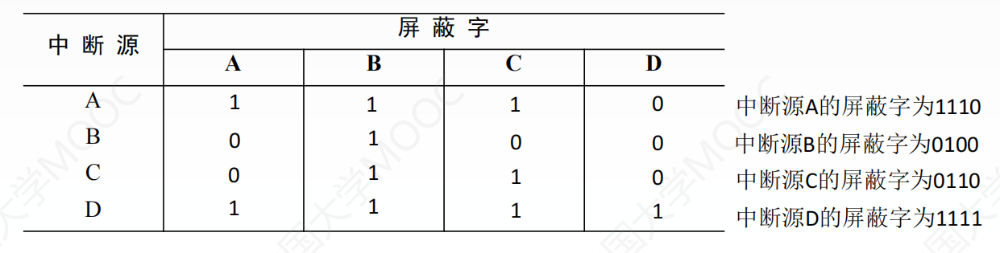

+ 优先级D>A>C>B
+ 横向看：比自己高级的中断源都置0
+ 屏蔽字全1表示该行的中断源是最高级
+ 1越多越高级

##### 中断响应优先级和中断处理优先级（紫书P331）

+ 中断响应和中断处理的优先级不一定要相同
+ 屏蔽字是针对中断处理的优先级，是动态设定的；
  而中断响应与屏蔽字无关，反应的是多个中断**同时请求时**选择哪个先响应
+ 应将中断响应和中断处理视为两种阶段
+ 如果多个中断请求**不是同时到达的，则应该根据先来后到的顺序进行响应**，不用管中断响应优先级。
+ 中断响应后应该紧接着进入中断处理程序，**不能刚响应完一个中断又去响应另一个中断**
+ 只有中断处理过程中又出现了另一个中断请求时，才会根据屏蔽字判断响应哪个中断（**响应的不一定是刚刚请求的中断，可能是之前来的还在排队的中断**），否则会一直将当前的中断服务程序处理完。

#### 中断流程

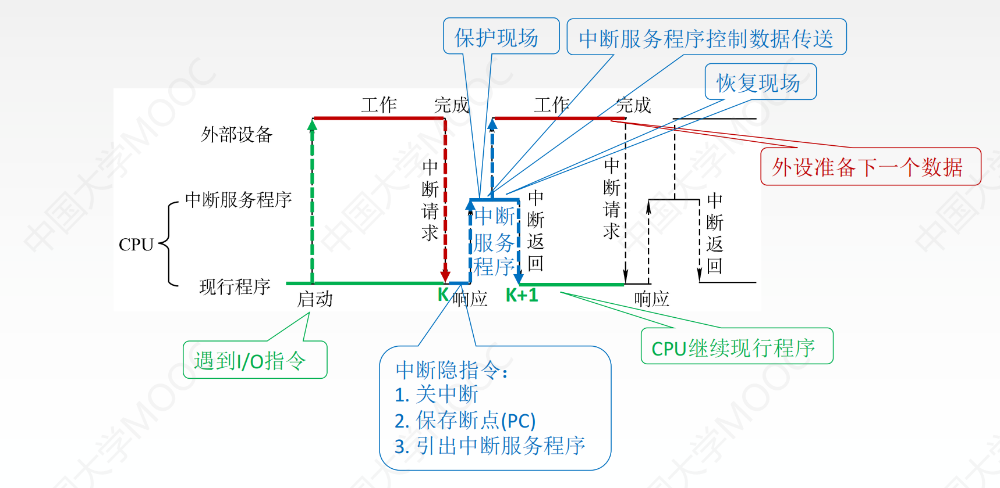

+ 中断过程分为中断隐指令和中断服务程序，**中断隐指令由硬件自动完成**
+ 断点：用指令无法直接读取的程序计数器PC和程序状态字寄存器PSWR等的内容
+ 现场：用户可见的工作寄存器的内容

##### 中断隐指令（中断响应）——硬件

1. 关中断
2. 保存断点
3. 中断服务程序寻址

##### 中断处理——软件

4. **进入中断服务程序后**首先要保存现场和屏蔽字
5. 开中断：允许高级中断请求得到响应
6. 执行中断服务程序：中断的目的
7. 关中断：恢复现场和屏蔽字时不能被中断
8. 恢复现场和屏蔽字
9. 开中断，中断返回

##### I/O流程

1. CPU执行到I/O指令(`scanf`或`printf`等)时，启动外设**准备数据**
2. 外设准备完后，向CPU发出中断请求
3. CPU在指令k执行完后响应该中断请求
   先中断隐指令（硬件自动），再中断服务程序
4. 中断服务程序完成后，**外设可以继续工作,准备下一次数据**
5. 中断返回，CPU执行指令k+1

### DMA方式

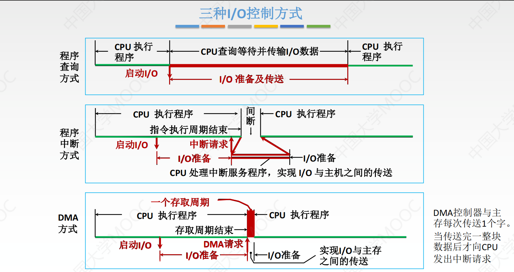

#### DMA特点

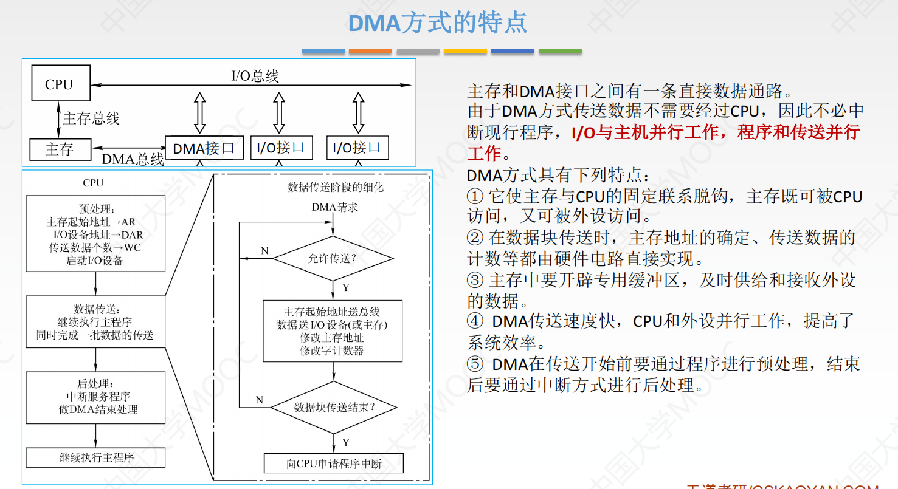

+ **DMA请求>所有外中断（不可屏蔽、可屏蔽）**
+ DMA数据传送**完全由硬件实现**
+ DMA方式与中断方式一样，也是采用**请求-响应**方式，只是**中断方式请求的是处理器的时间，**
  **而DMA方式请求的是总线控制权。**

##### DMA与中断方式对比

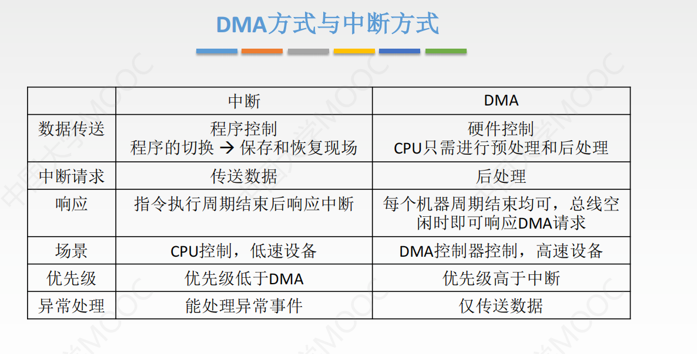

#### 三种DMA方式

由于DMA控制器和CPU共享主存，所以可能出现两者争用主存的现象。

##### 1. CPU停止法

+ DMA传输时，由DMA控制器发一个停止信号给CPU，使CPU脱离总线，停止访问主存，直到
  DMA传送**一块数据**结束

##### 2. 周期挪用法

+ DMA传输时，CPU让出一个**总线事务周期**，由DMA挪用一个主存周期来访问主存，**传送完一个数据后**
  **立即释放总线**
+ 是一种单字传送方式

##### 3. 交替分时访问法

+ 每个存储周期分成两个时间片，一个给CPU，另一个给DMA控制器
+ 这样在每个存储周期内，CPU和DMA控制器都可以访问存储器

#### DMA工作流程

1. 外设向DMA控制器发出**DMA请求**，DMA控制器向CPU发出**总线请求**
2. CPU在当前**机器周期结束后**相应DMA的总线请求，让出总线控制权

##### 第一步：DMA控制器初始化

1. 准备内存区
   外设输入：申请内存缓冲区；输出到外设：在内存准备好数据
2. 设置传送参数
   内存首地址->地址寄存器
   字计数值->字计数器
   传送方向->控制寄存器
   设备地址->设备地址寄存器
3. 发送“启动DMA传送”命令，然后调度CPU执行其他进程

##### 第二步：DMA数据传送

+ 整个DMA传送过程中，不再需要CPU的参与，完全由DMA控制器实现数据的传送
+ DMA控制器给出内存地址，并在读/写线上发出读/写命令，随后在数据总线上给出数据
+ DMA每完成一个数据的传送，就像字计数值-1，并修改主存地址
+ 当字计数值为0时，完成所有I/O操作

##### 第三步：DMA结束处理（后处理）

+ 字计数值为0时，**发出“DMA结束”中断请求**信号给CPU，**转入中断服务程序**，做一些数据校验等后序处理

