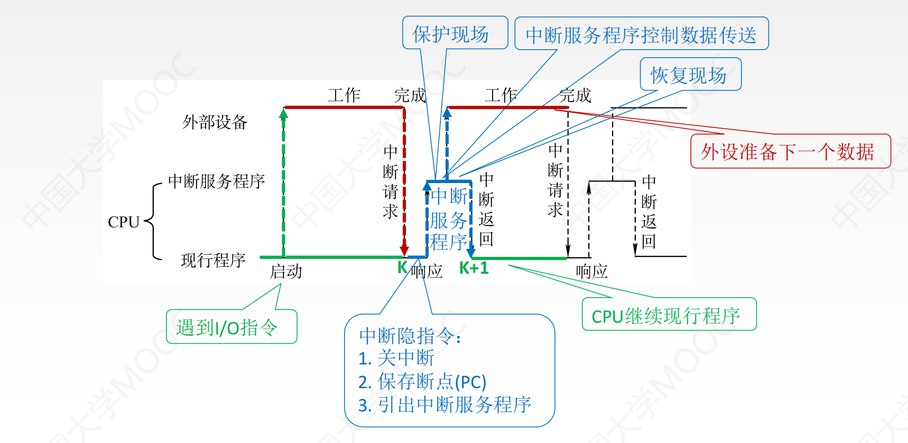

### 存储容量的常识

1KB是$2^{10}$个字节**拼起来**组成一长串，即有单独的1024个字节，而不是用10位二进制编码出字节的$2^{10}$种取值。
因此1KB有$2^{10}\times 8$位，而不是$10+8=18$位

### CPU的常识

#### 字长

##### CPU的位数/机器字长

+ 指CPU进行一次整数运算所能处理的二进制数据的位数，即**数据总线的宽度**
+ **数据总线宽度=CPU总线宽度=运算器位数=通用寄存器宽度**

##### 地址总线

+ 存储单元的个数=存储容量=$2^{地址总线宽度}$

##### 存储字长

+ 一个存储单元存放的二进制比特位数
+ 字节的整数倍

##### 指令字长

+ 即一条指令的位数
+ 取决于操作码长度、操作数地址长度、操作数地址个数，**与机器字长没有联系**
+ 为了存储方便，指令字长一般取字节或**存储字长的整数倍**
  若指令字长是存储字长的2倍，则需要两次访存才能取出一条指令

#### CPU与主存交换数据

##### MAR和MDR

+ MDR:存储器数据寄存器
  MAR:存储器地址寄存器
+ **CPU与主存交换数据必须经过MAR和MDR**

##### 主存准备数据是什么意思

CPU要从主存读一个单元的数据时有三步：
例:将一个寄存器所指的主存单元内容送到另一个寄存器

1. 要读单元的地址送到MAR
2. 主存单元的数据送到MDR
3. MDR数据送到CPU某个寄存器中

+ **主存准备数据就是主存数据送到MDR的过程**，这一过程中CPU要等待主存完成读操作，
  等待完成后，MDR就能通过CPU内部总线和连接到内部总线上的元件进行数据交换

#### 执行部件和控制部件

+ 一台计算机可分为两大部分：控制部件和执行部件
+ **控制器CU就是控制部件，其他硬件全是执行部件**

### 各种周期

##### 存取周期

+ 存取周期又称读写周期或访问周期
+ 指**存储器**进行一次完成的读写操作所需的全部时间，
  即连续两次独立访问存储器操作之间的最小间隔
+ 分为存取时间和恢复时间

##### 时钟周期

+ 时钟周期是计算机操作的**最小单位时间**
+ 由计算机主频决定，是主频的倒数

##### 机器周期

+ 机器周期也称CPU周期
+ 一个机器周期包含多个时钟周期（不固定）

##### 指令周期

+ 指CPU从主存中取出并执行一条指令的时间
+ 分为取指、间址、执行、中断四个**机器周期**

### 异常和中断

#### 异常概念

+ 异常也称内中断
+ 异常分为故障fault、自陷trap、终止abort
+ 故障和自陷为**软件中断**，终止和外中断为**外部中断**
  1. 缺页是异常不是中断
  2. 硬件故障（即终止）是异常不是中断，中断必须是外设的**请求**
+ 软件中断是**指令执行过程中**由CPU检测到的

##### 异常的返回

1. 缺页、缺段类的异常，处理完后**返回发生故障的指令**后继续执行
2. 非法操作码、除数为0等异常，无法返回，必须终止程序
3. 自陷处理完成后返回到自陷执行的下一条指令执行。
   （当自陷指令是转移指令时，其实是返回到转移目标指令执行）

#### 中断概念

1. 来自**CPU外部，与执行指令无关的事件**引起的
2. **必须要通过请求**，才能被CPU检测到。（即CPU不能自己中断自己）
3. 中断不会阻止任何指令的完成
4. 中断处理过程不可被打断

#### 异常和中断区别

1. “缺页”或“溢出”等异常时间是特定指令执行过程中产生的；
   而中断不和任何指令相关联，也不阻止任何指令的完成。
2. 异常检测完全由CPU自身发现和识别；
   而对于中断，必须有外设的请求：CPU必须通过对外部中断请求线进行采样，并从总线上获取相应的中断源设备的标识信息，才能获知哪个设备发生了何种中断。
3. 内部异常事件大多用软件识别；外部中断源可以用软件识别或硬件识别

#### 异常处理过程

##### 1. 保护断点和程序状态

+ 将PC和PSWR送到栈或特定寄存器

#####2. 识别异常事件并转异常处理

+ 内部异常事件大多用软件识别
+ CPU设置一个异常状态寄存器，用于记录异常原因。操作系统使用一个统一的异常查询程序，该程序
  按一定的优先级顺序查询异常状态寄存器，先查到的异常先处理
+ 像故障和陷阱之类的内部异常通常是在执行某条指令时发现的，可以通过对指令执行过程中的某些条件的判断来发现是否发生了异常，一旦发现就能立刻处理，因此内部异常事件也可以不通过专门的查询程序来识别。
+ 对于外部中断，并不能根据指令执行过程中的某些现象来判断是否发生了中断请求，因此
  只能在每条指令执行完后，取下一条指令之前去查询是否有中断请求。

#### 中断处理过程

+ 中断过程分为中断响应和中断处理。中断响应阶段由硬件实现，而中断处理阶段
  则由CPU执行**中断服务程序**来完成，所以中断处理是由软件实现的。
+ 断点：用指令无法直接读取的程序计数器PC和程序状态字寄存器PSWR等的内容
+ 现场：用户可见的工作寄存器的内容

##### 中断响应（中断隐指令）——硬件

1. 关中断
2. 保存断点
3. 中断服务程序寻址

##### 中断处理——软件

4. **进入中断服务程序后**首先要保存现场和屏蔽字
5. 开中断：允许高级中断请求得到响应
6. 执行中断服务程序：中断的目的
7. 关中断：恢复现场和屏蔽字时不能被中断
8. 恢复现场和屏蔽字
9. 开中断，中断返回

### 寄存器的可见性

#### 汇编语言程序员

##### 可见

1. 基址寄存器（用于实现多道程序设计或编制浮动程序）
2. 标志寄存器/程序状态字寄存器/状态寄存器
3. 程序计数器PC
4. 通用寄存器组

##### 不可见

1. MAR
2. MDR
3. IR
4. 微指令寄存器

#### 用户

##### 可见

1. PC
2. PSWR（标志寄存器/程序状态字寄存器）
3. 累加器ACC
4. 通用寄存器

##### 不可见

1. MAR
2. MDR
3. IR
4. 暂存寄存器（存放从主存读来的数据）
   **暂存寄存器不能由通用寄存器替代**
