# 第一章 计算机系统概述

# 第二章 数据的表示与运算

## 一、定点数

### 定点数的常识

##### 1.有符号数和无符号数的关系

同一个二进制运算，计算机可以将它当做无符号数来运算，也可以当做有符号数来运算。
有无符号只是人为的看待方式不同。
例如加法，不管我们如何看待，CPU运算时就已经包含了两种含义，仅仅是简单的相加

##### 2. 无符号数和有符号数混合加法

+ 只需要保持位数相同后，直接按无符号数的方式直接相加
+ 有符号数高位需补充符号位

例. $无符号8(1000)和-3(1101)相加，结果为(1)0101,高位溢出,但有效位表示的值为5,是正确结果$

$无符号F0000000H+有符号FF12H,FF12H补全后为FFFFFF12H,相加得到EFFFFF12H,也是正确结果$

### 标志位

## 二、浮点数

# 第三章 存储系统

## 一、存储器

### （1）SRAM和DRAM

#### SRAM和DRAM对比

|          | SRAM                        | DRAM                             |
| -------- | --------------------------- | -------------------------------- |
| 存储元件 | 双稳态触发器                | 栅极电容                         |
| 刷新     | 不需要定时刷新              | 需要定时刷新（集中、分散、异步） |
| 读出特性 | 非破坏性读出,读完不需要再生 | 破坏性读出，读完需要再生         |
| 速度     | 快                          | 慢                               |
| 集成度   | 低                          | 高                               |
| 发热     | 大                          | 小                               |
| 成本     | 高                          | 低                               |
| 容量     | 小                          | 大                               |
| 易失性   | 易失（断点信息消失）        | 易失                             |
| 行列地址 | 同时送                      | 分次送（地址线复用）             |
| 用途     | cache/TLB                   | 主存                             |

#### DRAM的刷新

1. 一般2ms一次

2. 一次刷新**一行存储单元**

3. 如何刷新？硬件，读出一行信息后重新充电，耗时一个读写周期（存取周期）

4. 何时刷新？

   集中刷新、分散刷新、异步刷新

### （2）ROM

##### 注意闪存和固态是ROM不是RAM！！！

+ RAM是易失性存储器，断点不能保存
+ 机械硬盘/光盘既不是RAM也不是ROM，而是直接存取存储器
+ 很多ROM也可以随机存取

### （3）双端口RAM

## 二、cache

+ cache与主存**以块为单位**进行数据交换

### Cache与主存的映射方式

+ 即哈希的3种方式

#### cache存放的内容

+ 
+ 主存地址由块内偏移+（cache组/行号）+标记组成
+ cache**每行**存放的是**数据(一行一块）+标记位+有效位(1bit)+一致性维护位（脏位）+替换算法控制位（计数器）**
+ cache不存放行号！！！！！！
+ **每行的标记位+有效位称为地址映射表（标记阵列）**

#### 1.直接映射

+ 即直接定址表

+ cache行号=主存块号 mod cache行数

  $cache行号c位(2^c行),主存块号m位(2^m块),则主存的后c位作为映射的cache行号,前m-c位为标记$

   

##### CPU访存过程

1. 根据要访问的主存地址中间的c位找到cache行号
2. 将对应cache行中存放的地址与其对比：
   1. 标记位相同且有效位为1，则cache命中，CPU直接从cache中存取数据
   2. 标记为不同或有效位为0，则不命中，此时CPU**从主存中**读出该地址的一块信息
      送到cache对应行中，置有效位为1

##### 评价

+ 同余的主存块只能映射到同一个cache行。当访问同余的块时，
  就会引起频繁的调进调出，即使其他行都空闲也没用。因此**cache命中率较低**

#### 2. 全相联映射

+ 即没有映射，随便放
+ **标记就是块号，即指出主存中的哪一块**

 

##### CPU访存过程

将主存块号(标记)与**cache的每一行**的标记对比：

1. 有一个标记相等且有效位为1，则命中，CPU直接存取cache数据
2. 没有一个标记相等或有效位为0，则不命中，此时将主存块**复制到cache的任意一个空闲行**中，置有效位为1

##### 评价

1. 只要有空闲cache行，就不会发生冲突，因而**块冲突概率低**
2. 访问主存块的过程是一种**“按内容访问”**的存取方式，即一种**“相联存储器”**，不适合大容量的cache

#### 3. 组相联映射

+ 先分组（模映射），组内随便放
+ **是cache分组，不是主存分组。主存中相邻块对应不同cache组**
+ $cache组号q位(2^q组),则主存每2^q块构成一个组群(组群中每块都在不同的cache组)$
+ 主存块号中的后q位作为cache组号,前m-q位作为标记。
+ **标记字段的含义为主存块位于哪一个组群**
+ n路组相联——一组n行

 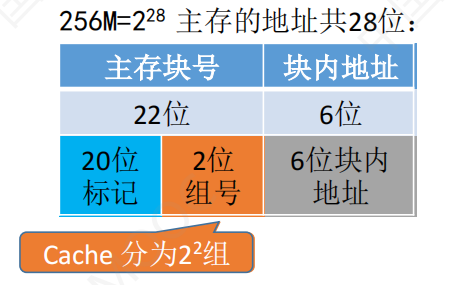

##### CPU访存过程

1. 根据要访问的主存地址中间q为cache组号，直接找到对应cache组
2. 将对应cache**组中每行**的标记与主存的标记字段对比：
   1. 有一个相等且有效位为1，则命中，CPU直接从cache中存取信息
   2. 都不相等或有效位为0，不命中，此时CPU从主存读出该地址所在的
      一块信息送到**当前cache组的任意一个空闲行**中，置有效位为1

### Cache中主存块替换算法

#### 1. 先进先出

+ 总选择最早装入cache的主存块被替换
+ **不能正确反应程序访问的局部性**
+ 可能产生较大的缺失率

#### 2. 最近最少用LRU

+ 选择近期最少使用的主存块被替换

+ 最新访问的块号写在最上面，使得**最下面的一块就是最近最久未使用的块**
+ **同一时刻行少的组中的块集合必然是行多组中的块集合的子集**
+ LRU是**栈算法**

##### 用计数器实现LRU

计数器变化规则：（假设cache为4路组相联）

1. 命中时，被访问的行的计数器清零，**比其低的**计数器+1，其余不变
2. 未命中且该组还有空闲行时，则新装入的行的计数器设为0，其余全加1
3. 未命中且该组无空闲行时，计数器为3（**==由(1)可知计数器最多加到3==**）的那一行中的主存块被淘汰。
   新装入的行计数器设为0，其余+1.

#### 3. 最不经常用LFU

+ 替换cache中引用次数最少的块
+ 与LRU类似，但不完全相同
+ **不满足局部性原理**

#### 4. 随机替换

+ 随机选取一个淘汰，与使用情况无关
+ 性能只稍逊于基于使用情况的算法

### cache与主存数据不一致问题（cache写策略）

#### 全写法

+ CPU对cache写命中时，必须把数据同时写入cache和主存。
+ cache中的块被替换时，不需要写回主存，因为写的时候就已经在主存中更新好了。

##### 写缓冲

+ cache和主存之间加一个写缓冲队列(FIFO)
+ 写cache的同时写入写缓冲，**再由写缓冲控制将内容写回主存**
+ 解决速度不匹配的问题
+ 频繁写时，写缓冲会溢出

#### 回写法

+ CPU对cache写命中时，只把数据写入cache。
  只有当此块**被换出时**，才写入主存
+ 为每个cache行设置一个修改位(dirty bit)，修改位为1，说明被修改过。
  只有修改位为1时，替换后才需要写回主存。

#### 写不命中处理方法

##### 写分配法

+ CPU对cache写不命中时，**先将主存块调入cache，再写到cache中**
+ 搭配回写法

##### 非写分配法

+ CPU对cache写不命中时，直接对主存操作，**不管cache**
+ 搭配全写法

## 三、虚拟存储器

### TLB和Cache多级存储系统访存过程

##### 两个任务

1. 找页表项，进行虚拟地址到物理地址的转换（TLB/主存）
   **物理块号+页内偏移量=物理地址**
2. 访问物理块(cache/主存/外存)

##### TLB和Cache

+ TLB存放的是页表项（**即物理块号**）+TLB标记（逻辑块号）
  **页表项中只有物理块号，因为页号作为下标，不占空间；**
  **而TLB中无法通过下标知道物理块来自哪个逻辑块，因此还要存放逻辑块号**
+ cache存放的是物理块
+ 两者都是高速缓存（SRAM）
+ TLB一般由**相联存储器**组成，也可由SRAM；cache由SRAM组成

##### 基本分页（进程的整个页表都在主存）

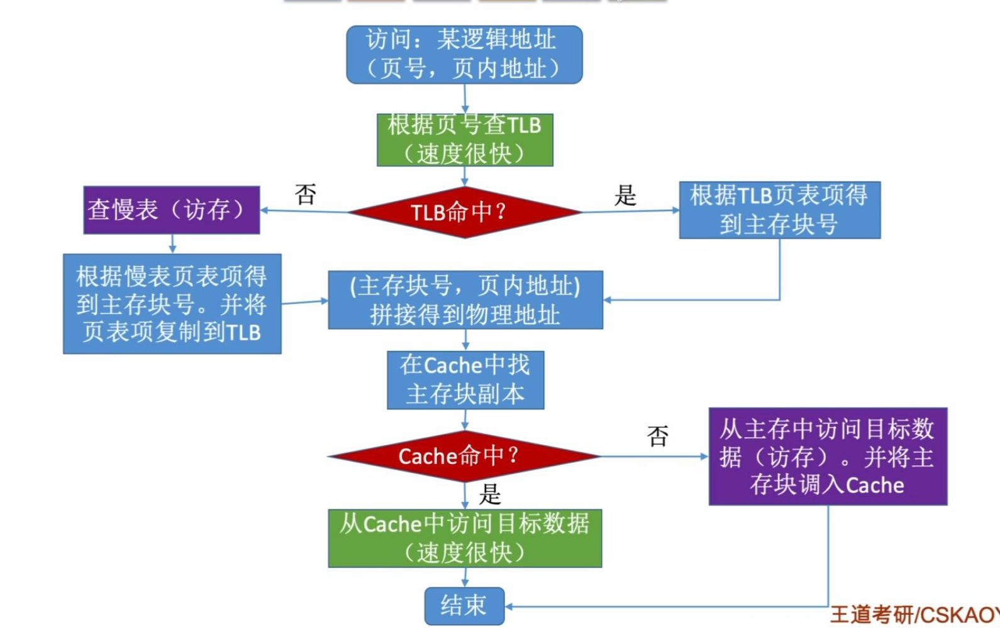

##### 页式虚拟存储器（请求分页）

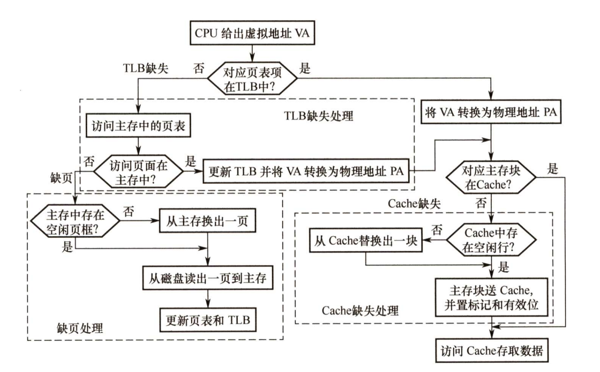

1. 通过逻辑块号在TLB中找对应表项，找不到就访问主存中的页表；找到页表项就直接得到物理地址。
2. 在主存页表中找相应页表项，找不到**产生缺页中断**，从磁盘读一页到主存，并放到TLB中
3. 找到页表项后得到了物理地址
4. 在cache中查找物理块，找不到则cache缺失，在主存中查找。
5. 在主存中找到物理块后，将物理块送入cache，最后送入CPU访问

##### TLB、Page、cache缺失情况

> Page表示主存页表

1. TLB中有页表项，则主存页表中一定有（TLB存的是主存页表项的副本）
   即主存页表中没有，TLB中一定也没有
2. 主存页表中没有页表项，说明页不在主存，**会产生缺页中断**，此时cache中不可能存有该页。
   **即Page未命中时，TLB和cache都不可能命中。**

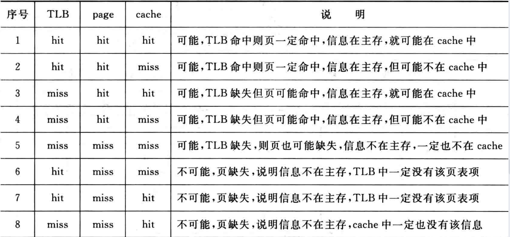

# 第四章 指令系统

## 寻址方式

+ 分为指令寻址和数据寻址

# 第五章 CPU

## 一、CPU内部结构及指令执行流程

### CPU结构

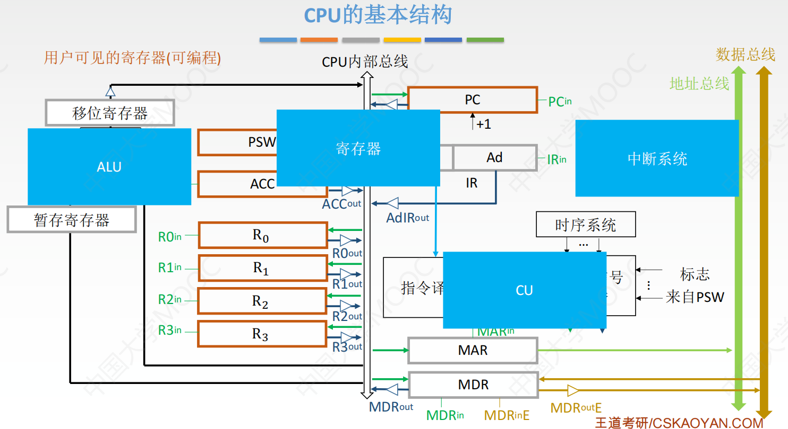

##### 用户可见寄存器

1. PC
2. PSWR（标志寄存器/程序状态字寄存器）
3. 累加器ACC
4. 通用寄存器

##### 用户不可见寄存器

1. MAR
2. MDR
3. IR
4. 暂存寄存器（存放从主存读来的数据）
   **暂存寄存器不能由通用寄存器替代**

#### 控制器和运算器

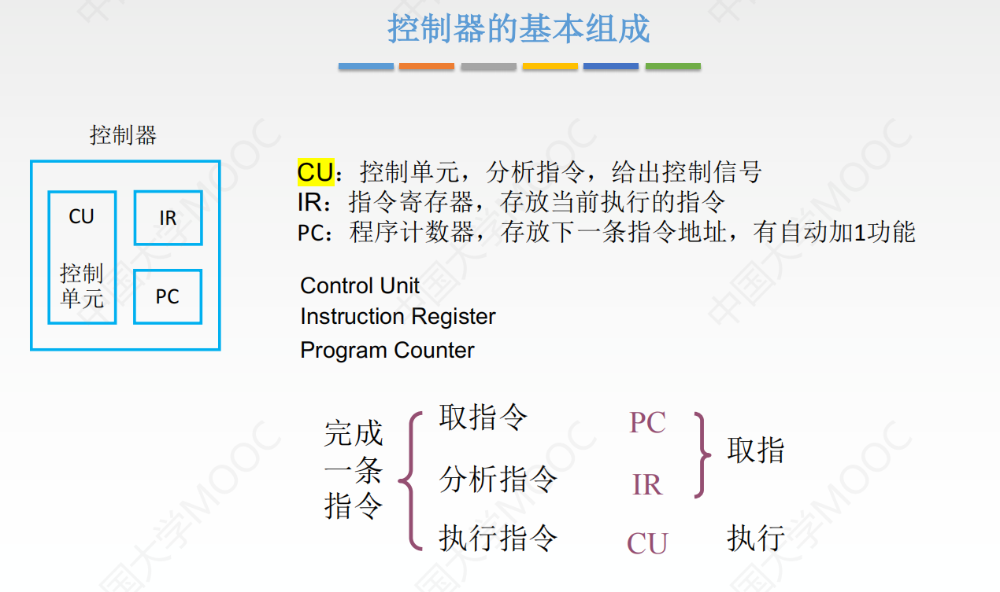

### 指令执行流程

#### 指令周期

+ 指CPU从主存取出一条指令并执行花费的全部时间
+ 一个指令周期=1~4个机器周期，一个机器周期=若干时钟周期

##### 指令周期流程

+ 指令周期分为**取指、（间址）、执行、（中断）**

  + 对于间接寻址指令才需要间址周期
  + 分析指令的步骤包含在取指周期内
  + 这四个周期都叫**机器周期/CPU周期**

  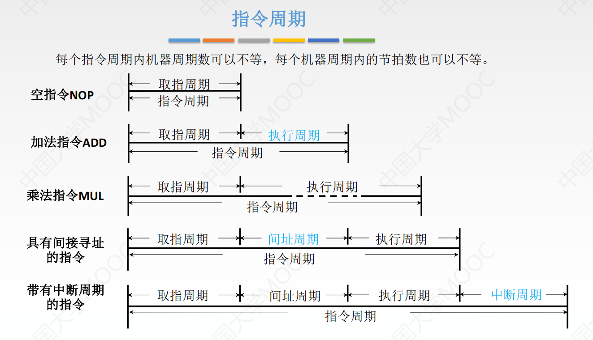

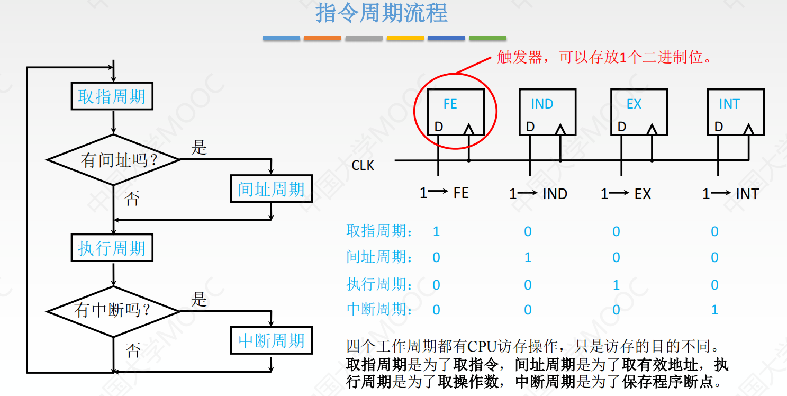

#### 指令周期的数据流

##### 1. 取指周期

**目的：取指令**，即将指令从主存送到指令寄存器IR
路径：PC（地址）、MAR（地址寄存器，存放PC内容，即要访问的主存单元的地址）、主存（指令的位置）、MDR（存放取来的指令）、IR（指令的最终目的）
结果：IR存放的是当前准备执行的指令。（MDR也存着当前指令）
			**注意取指周期结束后PC就已经是下一条指令的地址了。**

1. 将PC内容送到MAR：$(PC)\rarr MAR$
2. CU发出控制信号(读)：$1\rarr R$
3. 访问主存中地址为(MAR)的指令,并将指令通过数据总线送到MDR：
   $M(MAR)\rarr MDR$
4. 将指令由MDR送到IR：$(MDR)\rarr IR$
5. CU发出控制信号，PC形成下一条指令地址：$(PC)+1\rarr PC$

##### 2. 间址周期

> 指令分为操作码和地址码；
> 间接寻址指令的**地址码存放的是操作数地址的地址**
> 直接寻址指令的地址码存放的是操作数的地址

**目的：取操作数地址**，即将指令地址码指向的主存单元的内容（即操作数地址）放到MDR中
路径：IR(从其中得到指令的地址码)、MAR(存放指令地址码，即要访问的主存单元的地址)、主存（存放操作数地址）、MDR（操作数地址的最终位置）
结果：MDR中存放了操作数的主存地址（**只有MDR和MAR中的内容发生了变化，IR还是存着当前指令）**

1. 从IR中得到指令的地址码，将其送到MAR。（从MDR中也能得到指令的地址码，因为此时MDR和IR都存着指令）：$Ad(IR)\rarr MAR或Ad(MDR)\rarr MAR$
2. CU发出控制信号(读)：$1\rarr R$
3. 访问MAR指向的主存单元的内容，将内容送到MDR：$M(MAR)\rarr MDR$
4. ~~(可能)将操作数地址覆盖指令的地址码，==**即将指令变成直接寻址**==：$(MDR)\rarr Ad(IR)$~~

##### 3. 执行周期

目的：将指令的操作码和操作数通过ALU操作产生结果。

+ 没有统一的数据流向

##### 4. 中断周期

> 执行周期结束后，检测到了中断请求，则不再开始下一个指令的取指，而是进行中断处理

**目的：保存程序断点**，即将断点(**PC内容**)入栈（栈在主存），注意入栈时SP(栈顶指针)向低地址方向移动

+ 断点：用指令无法直接读取的程序计数器PC和程序状态字寄存器PSWR等的内容

1. CU控制**将SP减1，并将SP送到MAR**：$(SP)-1\rarr SP,(SP)\rarr MAR$
   + 先变SP,再将PC入栈
   + SP减1后，就是PC将要存放的地址
2. CU发出控制信号(写)：$1\rarr W$
3. 将断点（PC内容）送入MDR，完成入栈操作：$(PC)\rarr MAR$
4. 入栈完成后，就可以将PC内容修改为中断服务程序的入口地址（中断向量）。
   $中断向量\rarr PC$

## 二、数据通路

## 三、控制器

## 四、指令流水线

## 五、多处理器的基本概念

# 第六章 总线

# 第七章 I/O

## I/O接口

#### 基本结构与工作原理

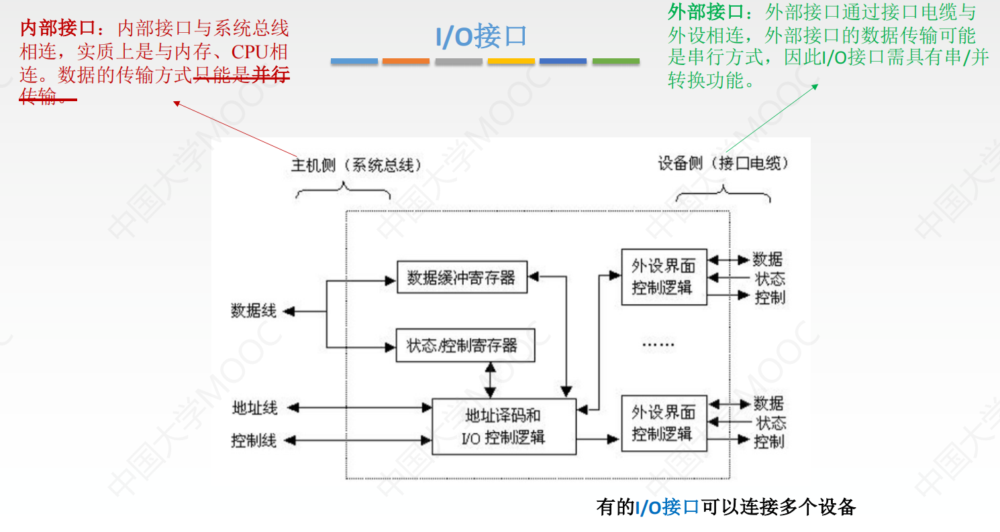

+ **I/O端口**：I/O接口中**可被CPU直接访问的寄存器**，作用是**协调CPU与设备间速度的不匹配**
+ 发命令：发送**命令字**到I/O控制寄存器，获得设备或I/O控制器的状态信息
+ 读状态：从状态寄存器读**状态字**，获得设备或I/O控制器的状态信息
+ 读/写数据：从数据缓冲寄存器发送或读取数据，完成主机与外设的数据交换

#### I/O端口

> **I/O端口**：I/O接口中**可被CPU直接访问的寄存器**，作用是**协调CPU与设备间速度的不匹配**

#### I/O编址方式

## I/O方式

### 程序查询方式

#### 三种方式简介

#### 特点

+ 主要特点：CPU**“踏步”等待**，与I/O设备**串行**工作
+ 优点：接口设计简单，设备量少
+ 缺点：CPU需要花大量时间查询和等待，效率极低
+ 不适合慢速设备（慢速设备查询次数非常多）

#### 两种查询方式

+ 独占查询：CPU 100%时间都在查询I/O状态，完全串行
+ 定时查询：保证数据不丢失情况下，每隔一段时间就查询一次。
  查询间隔内CPU可以执行其他程序

### 程序中断方式

#### 中断判优

##### 实现方法

+ 中断判优即可通过硬件实现，也可用软件实现
  软件实现慢

##### 一般的优先级设置

1. 不可屏蔽中断>内部异常>可屏蔽中断
   不可屏蔽中断在关中断下也会被响应
2. 内部异常中：硬件故障>软件中断
3. DMA请求>I/O设备的中断请求
4. 高速设备>低速设备
5. 输入设备>输出设备
6. 实时设备>普通设备

#### 多重中断

##### 满足的条件

1. 保护现场和屏蔽字后需要开中断
   不能再之前就开中断，否则保护现场会失败
2. 保存中断处理优先级

##### 中断屏蔽字

+ 每个中断源对其他所有中断源都有一位屏蔽字

  即形成一个矩阵，每个中断源占一行

+ 1表示屏蔽该中断源的中断，0表示不屏蔽

+ 优先级D>A>C>B
+ 横向看：比自己高级的中断源都置0
+ 屏蔽字全1表示该行的中断源是最高级
+ 1越多越高级

#### 中断流程

+ 中断过程分为中断隐指令和中断服务程序，中断隐指令由硬件自动完成
+ 断点：用指令无法直接读取的程序计数器PC和程序状态字寄存器PSWR等的内容
+ 现场：用户可见的工作寄存器的内容

##### 中断隐指令（中断响应）

1. 关中断
2. 保存断点
3. 中断服务程序寻址

##### 中断服务

4. **进入中断服务程序后**首先要保存现场和屏蔽字
5. 开中断：允许高级中断请求得到响应
6. 执行中断服务程序：中断的目的
7. 关中断：恢复现场和屏蔽字时不能被中断
8. 恢复现场和屏蔽字
9. 开中断，中断返回

##### I/O流程

1. CPU执行到I/O指令(`scanf`或`printf`等)时，启动外设**准备数据**
2. 外设准备完后，向CPU发出中断请求
3. CPU在指令k执行完后响应该中断请求
   先中断隐指令（硬件自动），再中断服务程序
4. 中断服务程序完成后，**外设可以继续工作,准备下一次数据**
5. 中断返回，CPU执行指令k+1

### DMA方式

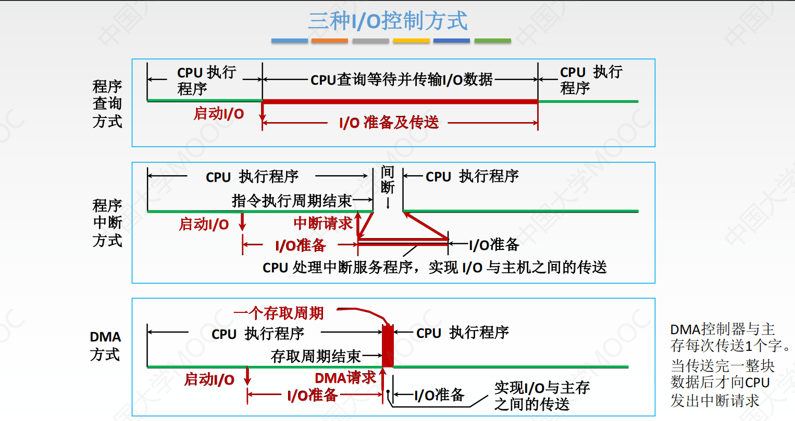

#### DMA控制器构造

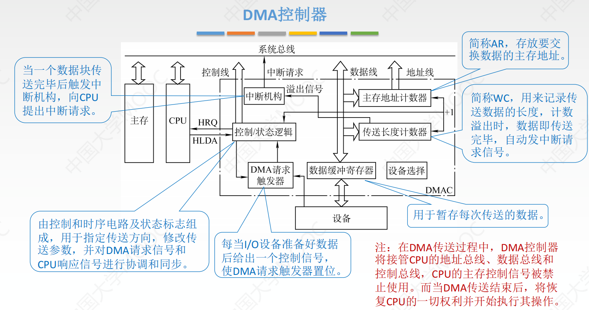

#### DMA特点

+ **DMA请求>所有外中断（不可屏蔽、可屏蔽）**
+ DMA数据传送**完全由硬件实现**

#### DMA与中断方式对比

#### DMA工作流程

1. 外设向DMA控制器发出**DMA请求**，DMA控制器向CPU发出**总线请求**
2. CPU在当前**机器周期结束后**相应DMA的总线请求，让出总线控制权
3. CPU预处理
4. 数据传送：完全由硬件完成，CPU继续执行原来程序
5. 后处理：DMA数据传送完成后，向CPU申请中断，转入**中断服务程序**
